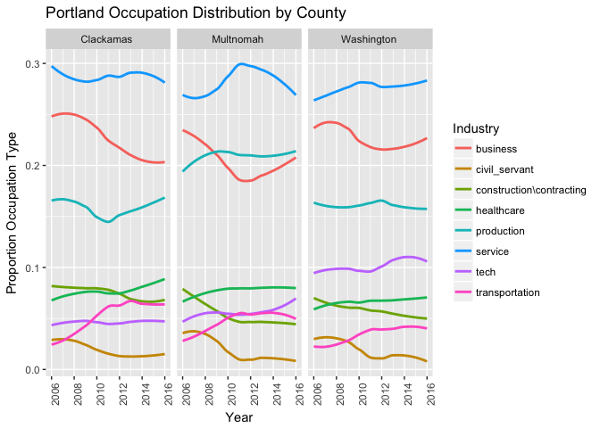
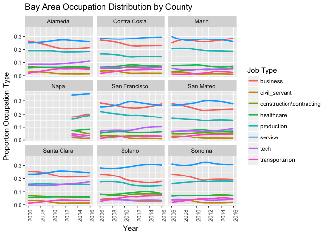
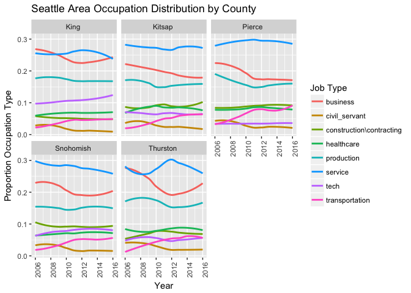
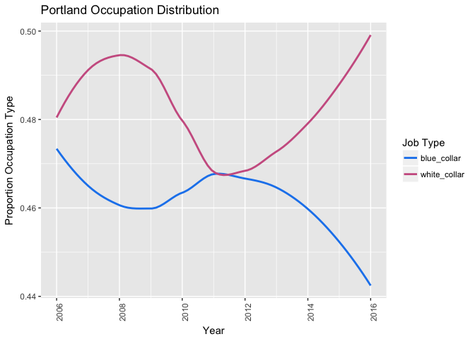
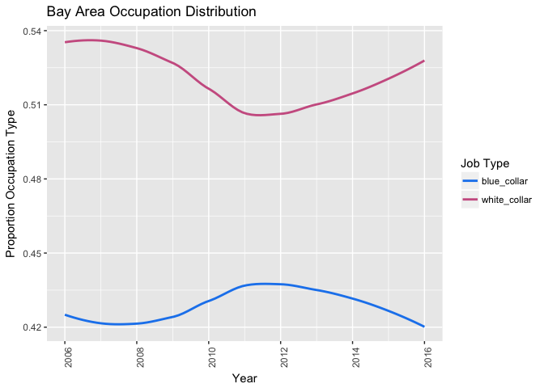
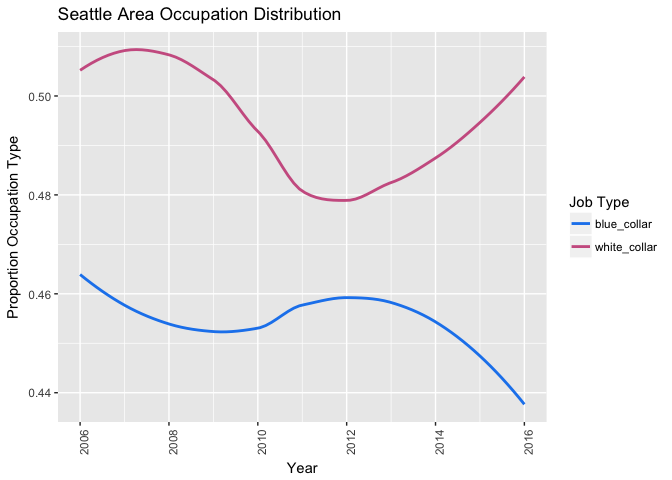
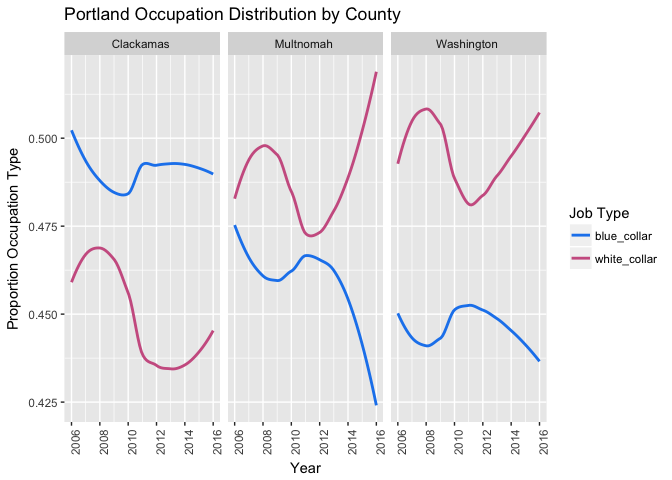
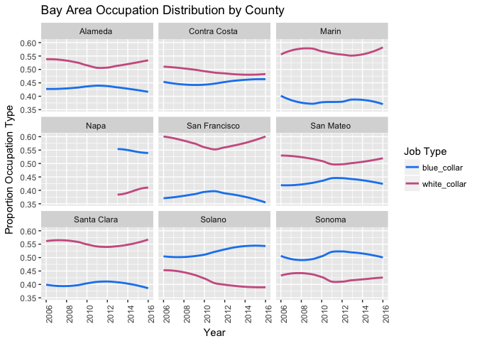
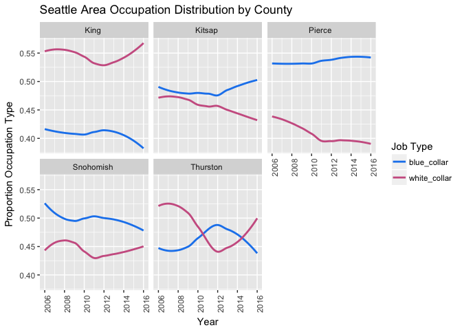
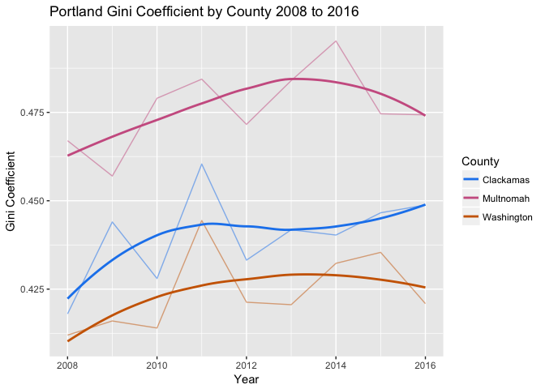

WhitePaper
================

    ## ── Attaching packages ───────────────────────────────────────────── tidyverse 1.2.1 ──

    ## ✔ ggplot2 2.2.1     ✔ purrr   0.2.4
    ## ✔ tibble  1.4.2     ✔ dplyr   0.7.4
    ## ✔ tidyr   0.8.0     ✔ stringr 1.2.0
    ## ✔ readr   1.1.1     ✔ forcats 0.3.0

    ## ── Conflicts ──────────────────────────────────────────────── tidyverse_conflicts() ──
    ## ✖ dplyr::filter() masks stats::filter()
    ## ✖ dplyr::lag()    masks stats::lag()

Abstract
========

Portland, as countless articles will tell you, has been in the past decade experiencing large amounts of population growth. Migration to and from portland is bound to have economic and cultural effects on the city and its residents. Aditionally, it is worth wondering where people are migrating from and what their characteristics are. Our paper is essentially broken down into three components that relate to residential change in Portland. First, we describe migration, with a focus on migration from the Bay Area and Puget Sound/Seattle Area. Second we dicuss economic disparity in the Portland area, and what factors may play a role in that disparity. Third, we dicuss housing prices and changes in housing prices over the last decade in Portland. It seems that there is a high likelihood that these three components are related. We will attempt to show how they may be related.

Migration Over Time
===================

This project has focused primarily on the storyline of the migration of people from the Bay Area and Seattle to Portland. We have found, using IRS data, that the largest sources of migration across time to Portland com from these areas as well as the states of California and Washington. Our data tells us about county to county migration. We can observe the largest contributors over time by viewing the Sankey plot shown below.

    ## Parsed with column specification:
    ## cols(
    ##   X1 = col_integer(),
    ##   origin = col_character(),
    ##   destinations = col_character(),
    ##   tax_year = col_character(),
    ##   n = col_integer(),
    ##   year = col_integer(),
    ##   total = col_integer(),
    ##   prop = col_double()
    ## )

    ## Parsed with column specification:
    ## cols(
    ##   X1 = col_integer(),
    ##   origin_area = col_character(),
    ##   dest_area = col_character(),
    ##   year = col_integer(),
    ##   n = col_integer()
    ## )

    ## Parsed with column specification:
    ## cols(
    ##   X1 = col_integer(),
    ##   origin = col_character(),
    ##   destinations = col_character(),
    ##   year = col_integer(),
    ##   n = col_integer()
    ## )

``` r
 setwd("~/sd-pdx-sea/White_paper_docs")
knitr::include_graphics("/Users/user1/sd-pdx-sea/White_paper_docs/SankeyFinalFinal.pdf")
```

<embed src="/Users/user1/sd-pdx-sea/White_paper_docs/SankeyFinalFinal.pdf" width="100%" type="application/pdf" />
``` r
# ggplot(dataplot1, aes(x = year, y = n, color = origin))+
#   geom_line()+
#   theme_classic()+
#   labs(title = "Migration into Portland Metro Area 2008 to 2016",x = "Year", y = "Number of People", color = "Origin")
 setwd("~/sd-pdx-sea/White_paper_docs")
knitr::include_graphics("/Users/user1/sd-pdx-sea/White_paper_docs/unnamed-chunk-5-1.png")
```

 As we can see from the two plots above migration to Portland from these top areas seems to have been increasing in the last ten years. Aditionally, the Bay Area and Puget sound areas are large contributors to migrations. Aditionally, our findings support the idea that many people are also moving from the Las Angeles Area to the Portland area.

Economic Disparity
==================

When looking at economic disparity we observed a few different components of resident life that play a factor. We first looked at the different industries of jobs in the Portland area, Bay Area and Puget Sound Area via visualizations. Next, we observed a simplified visualization of classes of occupations based on categorizing jobs into either "White Collar" jobs or "Blue Collar" jobs.

``` r
pdx_sector
```

    ## `geom_smooth()` using method = 'loess'


``` r
sf_sector
```

    ## `geom_smooth()` using method = 'loess'


``` r
sea_sector
```

    ## `geom_smooth()` using method = 'loess'


The plots above, which show Portland, Bay Area and Puget Sound sector distribution, could potentially hint at who is working as what in each of these areas. This visualization shows slight growth in tech accross all areas, but with the least in portland. We also see serious decreases in the business sector and increases in the service sector around 2010, potentially as a result of the 2008 economic crash. Also, there is a steady decrease in all three areas of government workers between 2008 and 2010.

Many people dicuss the growth of tech in areas like the Bay Area and Portland. Often this growth is blamed for rising living costs such as rent or housing prices. While this may be true, for the greater Portland Metro area, Bay Area and Puget Sound, according to this ACS data it doesnt look like the growth has been too explosive. However, this may be different if we observe the individual counties of these areas instead. One might suspect that whiel San Francisco proper has had a tech boom perhaps its neighboring counties have not. Or, pehaps they have additionally seen tech growth as a result of spillover.

``` r
pdx_sector_county
```

    ## `geom_smooth()` using method = 'loess'



``` r
sf_sector_county
```

    ## `geom_smooth()` using method = 'loess'



``` r
sea_sector_county
```

    ## `geom_smooth()` using method = 'loess'

 When we break this occupation data down into areas it is easier to see that potentially changes in different sectors vary across county. For instance in Portland, we can see that by comparison to Clackamas, Multnomah and Washington counties have both seen relatively large growth in the tech sector.

Next, we will look at trends of classes of residents rather than occupations. This means sorting people into "White Collar" and "Blue Collar" groups. In theory this helps to see larger trends of what types of groups of workers are working in each of these larger areas, and their respective counties.

``` r
pdx_class
```

    ## `geom_smooth()` using method = 'loess'



``` r
sf_class
```

    ## `geom_smooth()` using method = 'loess'



``` r
sea_class
```

    ## `geom_smooth()` using method = 'loess'



These visual elluminate the importance of the 2008 depression, as we see that in all three areas overall there seem to have been decreases in proportion of people working in white collar jobs and increases in proportion of people working in blue collar jobs. Now to further our understanding, here are these classes by county and area.

``` r
pdx_class_county
```

    ## `geom_smooth()` using method = 'loess'



``` r
sf_class_county
```

    ## `geom_smooth()` using method = 'loess'



``` r
sea_class_county
```

    ## `geom_smooth()` using method = 'loess'



One striking difference in the effect of 2008 in Clackamas county. In this areas where there area majority blue collar workers, both classes of workers decreases in 2008, rather than blue collar workers increasing in their proportion. Another notable phenomena may be the seemingly smaller effects on the Bay Area in general.

Next, to dicuss a more macroeconomic component of economic disparity we will look at gini coefficients in the portland area over time. Gini coefficients are a measurement of economic ditribution. In this case they are a measurement of wage ditribution. The gini coefficient is a value between one and zero. For this coefficient zero represents a perfect distribution of wealth, everyone has the same income and one represents perfect inequality, where one person makes all income. The average gini coefficient to urban areas in the United States tends to be around .45.

    ## Warning: Missing column names filled in: 'X1' [1]

    ## Parsed with column specification:
    ## cols(
    ##   X1 = col_integer(),
    ##   id = col_character(),
    ##   id2 = col_integer(),
    ##   county = col_character(),
    ##   gini = col_double(),
    ##   margin_error = col_double(),
    ##   year = col_integer()
    ## )

``` r
ggplot(ACS_gini, aes(x = year, y = gini, color = county))+
  geom_line(alpha = .5)+
  geom_smooth(se = FALSE, span = 1) +
  labs(x = "Year",
       y = "Gini Coefficient",
       colour = "County",
       title = "Portland Gini Coefficient by County 2008 to 2016")+
  scale_color_manual(values = c("dodgerblue2", "hotpink3", "darkorange3"))
```

    ## `geom_smooth()` using method = 'loess'



The graph above shows gini coefficiency over time where the thinner lines are the actual values and the thicker line show a general trend of the Gini coefficients. As we can see generally gini coefficients have been rising in the portland area over time. Aditionally, Multnomah tends to have a much larger coefficient accross time. \# Housing Prices Housing Prices in Portland seem like they may be key to the story of migration. It seems reasonable to expect that one of the effect that migration toPortland may have is a change in housing prices. So, for our project we incorporated Portland Metro area tax lot data. We looked at median housing prices over time. To see how this correlated with different neighborhood we created a series of maps which show median housing price mapped onto the Portland Metro area. We did these for four key years, 2006, 2010, 2014 and 2017.

``` r
 setwd("~/sd-pdx-sea/White_paper_docs")

knitr::include_graphics("/Users/user1/sd-pdx-sea/White_paper_docs/unnamed-chunk-8-2.png")
```


``` r
knitr::include_graphics("/Users/user1/sd-pdx-sea/White_paper_docs/unnamed-chunk-8-3.png")
```


``` r
knitr::include_graphics("/Users/user1/sd-pdx-sea/White_paper_docs/unnamed-chunk-8-4.png")
```


``` r
knitr::include_graphics("/Users/user1/sd-pdx-sea/White_paper_docs/unnamed-chunk-8-5.png")
```


Modelling the relationships
===========================

Finally to attempt to connect the three components we have discussed, we will try modelling two different dependent variables. First, we will model gini coefficienct of the different neighborhoods of Portland and then housing prices, both median and average.

When modelling the genie coefficient we are attempting to see if there is a correlation between migration or ditribution of jobs with the genie coefficient. Our best model modelled the natural log of the gini coefficient as a function of the natural log of average and median house prices (for simgle family homes) and the natural log of the inflow of adjusted gross income through migration. Aditionally, we correct for the differences in counties with the "mult" variable which is a dummy vairable for whether or the county is Multnomah county. Next, we then used the same model but substituted the number of people migrating to each area in a year rather than the adjusted gross income value. These two values "n" and "agi" tend to play a similar role in the models. So, using both threatens issues of multicolinearity thus, we run two models, one with each. Their results are as shown below.

    ## Parsed with column specification:
    ## cols(
    ##   .default = col_double(),
    ##   X1 = col_integer(),
    ##   X1.x = col_integer(),
    ##   X1.x.x = col_integer(),
    ##   id.x = col_character(),
    ##   id2.x = col_integer(),
    ##   county = col_character(),
    ##   year = col_integer(),
    ##   med_house = col_integer(),
    ##   X1.y = col_integer(),
    ##   id.y = col_character(),
    ##   id2.y = col_integer(),
    ##   total_pop = col_integer(),
    ##   mult = col_integer(),
    ##   wash = col_integer(),
    ##   clack = col_integer(),
    ##   med_housing_change = col_integer(),
    ##   X1.y.y = col_integer(),
    ##   y2_countyfips = col_integer(),
    ##   n = col_integer(),
    ##   agi = col_integer()
    ##   # ... with 1 more columns
    ## )

    ## See spec(...) for full column specifications.

``` r
mod0_sum
```

    ## 
    ## Call:
    ## lm(formula = log(gini) ~ mult + log(avg_house) + log(med_house) + 
    ##     log(agi), data = modeldata4)
    ## 
    ## Residuals:
    ##       Min        1Q    Median        3Q       Max 
    ## -0.028017 -0.013380 -0.000435  0.009084  0.031628 
    ## 
    ## Coefficients:
    ##                 Estimate Std. Error t value Pr(>|t|)    
    ## (Intercept)     2.114692   3.237843   0.653  0.52296    
    ## mult            0.124179   0.021446   5.790 2.76e-05 ***
    ## log(avg_house)  0.295613   0.140347   2.106  0.05132 .  
    ## log(med_house) -0.508816   0.257368  -1.977  0.06554 .  
    ## log(agi)       -0.019311   0.005253  -3.676  0.00204 ** 
    ## ---
    ## Signif. codes:  0 '***' 0.001 '**' 0.01 '*' 0.05 '.' 0.1 ' ' 1
    ## 
    ## Residual standard error: 0.02069 on 16 degrees of freedom
    ## Multiple R-squared:  0.8921, Adjusted R-squared:  0.8651 
    ## F-statistic: 33.06 on 4 and 16 DF,  p-value: 1.499e-07

``` r
mod1_sum
```

    ## 
    ## Call:
    ## lm(formula = log(gini) ~ mult + log(avg_house) + log(med_house) + 
    ##     log(n), data = modeldata4)
    ## 
    ## Residuals:
    ##       Min        1Q    Median        3Q       Max 
    ## -0.028014 -0.013826 -0.001848  0.007082  0.032472 
    ## 
    ## Coefficients:
    ##                 Estimate Std. Error t value Pr(>|t|)    
    ## (Intercept)     1.603279   3.246608   0.494  0.62814    
    ## mult            0.121392   0.021590   5.623 3.82e-05 ***
    ## log(avg_house)  0.297325   0.143003   2.079  0.05405 .  
    ## log(med_house) -0.479289   0.260185  -1.842  0.08407 .  
    ## log(n)         -0.015840   0.004487  -3.531  0.00278 ** 
    ## ---
    ## Signif. codes:  0 '***' 0.001 '**' 0.01 '*' 0.05 '.' 0.1 ' ' 1
    ## 
    ## Residual standard error: 0.02107 on 16 degrees of freedom
    ## Multiple R-squared:  0.8881, Adjusted R-squared:  0.8601 
    ## F-statistic: 31.74 on 4 and 16 DF,  p-value: 1.994e-07

As we can see from above our models do get relatively good fits and our analysis supports the idea that in the portland area the most significant factors that correlate to the gini coefficient are the natural log of agi and number of people migrating and the multnomah vairables. That said, average and median house also seem to be significant at a 95% level. We additionally see that the models that include woth agi of migration and number of people migrating have similar R squared values and coefficients. They both seem to have a small but negative relationship with the gini coefficient.

Next we modelled median and average housing prices as a function of both agi and n. The models have median and average housing costs as the dependent variables and the natural log of the gini coefficient, housing price changes, and agi or n as the independent variables. We also included independent variables median age and multnomah to correct for their effects. First let's observe the models for median house prices.

``` r
hmod0_sum
```

    ## 
    ## Call:
    ## lm(formula = med_house ~ log(gini) + median_age + wash + mult + 
    ##     med_housing_change + log(agi), data = modeldata4)
    ## 
    ## Residuals:
    ##     Min      1Q  Median      3Q     Max 
    ## -5491.7 -2428.5   374.3  1469.0  7601.3 
    ## 
    ## Coefficients:
    ##                      Estimate Std. Error t value Pr(>|t|)    
    ## (Intercept)         2.361e+05  1.177e+05   2.006 0.067933 .  
    ## log(gini)          -7.233e+04  5.483e+04  -1.319 0.211721    
    ## median_age          3.345e+03  2.491e+03   1.343 0.204235    
    ## wash                1.994e+04  1.246e+04   1.601 0.135373    
    ## mult                5.673e+04  1.161e+04   4.887 0.000374 ***
    ## med_housing_change  6.776e-01  2.041e-01   3.321 0.006103 ** 
    ## log(agi)           -4.367e+03  1.890e+03  -2.311 0.039403 *  
    ## ---
    ## Signif. codes:  0 '***' 0.001 '**' 0.01 '*' 0.05 '.' 0.1 ' ' 1
    ## 
    ## Residual standard error: 4245 on 12 degrees of freedom
    ##   (2 observations deleted due to missingness)
    ## Multiple R-squared:  0.9473, Adjusted R-squared:  0.921 
    ## F-statistic: 35.96 on 6 and 12 DF,  p-value: 5.464e-07

``` r
hmod1_sum
```

    ## 
    ## Call:
    ## lm(formula = med_house ~ log(gini) + median_age + wash + mult + 
    ##     med_housing_change + log(n), data = modeldata4)
    ## 
    ## Residuals:
    ##     Min      1Q  Median      3Q     Max 
    ## -5953.7 -2547.3   636.7  1459.7  7939.1 
    ## 
    ## Coefficients:
    ##                      Estimate Std. Error t value Pr(>|t|)    
    ## (Intercept)         2.276e+05  1.218e+05   1.869 0.086276 .  
    ## log(gini)          -6.434e+04  5.566e+04  -1.156 0.270233    
    ## median_age          3.097e+03  2.736e+03   1.132 0.279823    
    ## wash                1.915e+04  1.357e+04   1.411 0.183629    
    ## mult                5.509e+04  1.236e+04   4.458 0.000782 ***
    ## med_housing_change  6.836e-01  2.100e-01   3.255 0.006888 ** 
    ## log(n)             -3.563e+03  1.707e+03  -2.088 0.058826 .  
    ## ---
    ## Signif. codes:  0 '***' 0.001 '**' 0.01 '*' 0.05 '.' 0.1 ' ' 1
    ## 
    ## Residual standard error: 4371 on 12 degrees of freedom
    ##   (2 observations deleted due to missingness)
    ## Multiple R-squared:  0.9441, Adjusted R-squared:  0.9162 
    ## F-statistic:  33.8 on 6 and 12 DF,  p-value: 7.711e-07

Next, for average prices:

``` r
hmod3_sum
```

    ## 
    ## Call:
    ## lm(formula = avg_house ~ wash + mult + avg_housing_change + log(agi), 
    ##     data = modeldata4)
    ## 
    ## Residuals:
    ##    Min     1Q Median     3Q    Max 
    ## -11370  -4165   1462   4344  12434 
    ## 
    ## Coefficients:
    ##                      Estimate Std. Error t value Pr(>|t|)    
    ## (Intercept)         5.118e+05  2.755e+04  18.574 9.64e-11 ***
    ## wash               -2.679e+04  4.193e+03  -6.390 2.38e-05 ***
    ## mult                2.754e+04  4.948e+03   5.566 9.14e-05 ***
    ## avg_housing_change  7.505e-01  2.856e-01   2.627   0.0209 *  
    ## log(agi)           -5.332e+03  2.077e+03  -2.568   0.0234 *  
    ## ---
    ## Signif. codes:  0 '***' 0.001 '**' 0.01 '*' 0.05 '.' 0.1 ' ' 1
    ## 
    ## Residual standard error: 7635 on 13 degrees of freedom
    ##   (3 observations deleted due to missingness)
    ## Multiple R-squared:  0.929,  Adjusted R-squared:  0.9072 
    ## F-statistic: 42.55 on 4 and 13 DF,  p-value: 2.394e-07

``` r
hmod4_sum
```

    ## 
    ## Call:
    ## lm(formula = avg_house ~ wash + mult + avg_housing_change + log(n), 
    ##     data = modeldata4)
    ## 
    ## Residuals:
    ##    Min     1Q Median     3Q    Max 
    ## -11972  -4176   1763   4454  12782 
    ## 
    ## Coefficients:
    ##                      Estimate Std. Error t value Pr(>|t|)    
    ## (Intercept)         4.805e+05  1.615e+04  29.763 2.41e-13 ***
    ## wash               -2.654e+04  4.268e+03  -6.218 3.13e-05 ***
    ## mult                2.791e+04  5.013e+03   5.567 9.12e-05 ***
    ## avg_housing_change  7.430e-01  2.893e-01   2.568   0.0234 *  
    ## log(n)             -4.305e+03  1.746e+03  -2.465   0.0284 *  
    ## ---
    ## Signif. codes:  0 '***' 0.001 '**' 0.01 '*' 0.05 '.' 0.1 ' ' 1
    ## 
    ## Residual standard error: 7738 on 13 degrees of freedom
    ##   (3 observations deleted due to missingness)
    ## Multiple R-squared:  0.9271, Adjusted R-squared:  0.9047 
    ## F-statistic: 41.35 on 4 and 13 DF,  p-value: 2.842e-07

When modelling for median and average we found that correcting for counties completely was very important. Aditionally, for all of our models interpretations of migration, both agi and n seemed to have a negative correlation with house values. Theoretically this may be because people maybe tend to move to cheaper places. In dicussions of San Francisco in particular people often talk about how impossible to afford housing it is in the city. Perhaps these areas are seeing migration from people who simply cant afford to live in their old homes. Alternatively, we may think that people do not like people migrating in, thus demand for housing in areas with more migration drops and so do housing prices. These values are also significant at the 99.9 percent level when we model them with respect for median house value which tends to be a better measurement than average.

Finally, we attempted to model median housing price changes from year to year (ex: 2009 to 2010) as a function of some of the variables we have discussed. Our models were certainly less accurate when running these models but still may be worthwhile to our understanding of housing price changes in the Portland area. We modelled median housing price change as a function of the natural log of the portion of blue collar workers, the natural log of the proportion of service industry workers and the natural log of either agi or n. We also corrected for median house cost and county.

``` r
hmod5_sum
```

    ## 
    ## Call:
    ## lm(formula = med_housing_change ~ log(blue_prop) + log(service) + 
    ##     mult + med_house + log(agi), data = modeldata4)
    ## 
    ## Residuals:
    ##    Min     1Q Median     3Q    Max 
    ##  -4076  -1260   -102   1620   5477 
    ## 
    ## Coefficients:
    ##                  Estimate Std. Error t value Pr(>|t|)    
    ## (Intercept)    -1.958e+05  5.297e+04  -3.697  0.00269 ** 
    ## log(blue_prop)  5.599e+04  1.972e+04   2.840  0.01392 *  
    ## log(service)    7.051e+04  2.579e+04   2.734  0.01704 *  
    ## mult           -2.460e+04  4.366e+03  -5.635 8.13e-05 ***
    ## med_house       6.964e-01  1.189e-01   5.856 5.63e-05 ***
    ## log(agi)        4.988e+03  9.026e+02   5.526 9.77e-05 ***
    ## ---
    ## Signif. codes:  0 '***' 0.001 '**' 0.01 '*' 0.05 '.' 0.1 ' ' 1
    ## 
    ## Residual standard error: 2830 on 13 degrees of freedom
    ##   (2 observations deleted due to missingness)
    ## Multiple R-squared:  0.8206, Adjusted R-squared:  0.7516 
    ## F-statistic: 11.89 on 5 and 13 DF,  p-value: 0.0001779

``` r
hmod6_sum
```

    ## 
    ## Call:
    ## lm(formula = med_housing_change ~ log(blue_prop) + log(service) + 
    ##     mult + med_house + log(n), data = modeldata4)
    ## 
    ## Residuals:
    ##     Min      1Q  Median      3Q     Max 
    ## -3956.8 -1339.1  -268.2  1789.4  5375.3 
    ## 
    ## Coefficients:
    ##                  Estimate Std. Error t value Pr(>|t|)    
    ## (Intercept)    -1.653e+05  4.876e+04  -3.391  0.00483 ** 
    ## log(blue_prop)  5.563e+04  1.912e+04   2.910  0.01218 *  
    ## log(service)    7.535e+04  2.521e+04   2.989  0.01045 *  
    ## mult           -2.513e+04  4.273e+03  -5.881 5.40e-05 ***
    ## med_house       7.025e-01  1.156e-01   6.077 3.92e-05 ***
    ## log(n)          4.257e+03  7.388e+02   5.762 6.58e-05 ***
    ## ---
    ## Signif. codes:  0 '***' 0.001 '**' 0.01 '*' 0.05 '.' 0.1 ' ' 1
    ## 
    ## Residual standard error: 2747 on 13 degrees of freedom
    ##   (2 observations deleted due to missingness)
    ## Multiple R-squared:  0.8309, Adjusted R-squared:  0.7659 
    ## F-statistic: 12.78 on 5 and 13 DF,  p-value: 0.0001229

As we can see the goodness of fit of these models is less than our others. However, all of their variables are found to be significant. We see that both the proportion of blue collar workers and service indutry workers are significant at the 99% level. Additionally, we see that while agi and n had a negative relationship with housing prices, they have a positive relationship with change in housing price. Their effects are certainly significant within this model. This positive relationship could mean that more migration leads to increased demand for housing which drives up housing prices. The negative relationship between median house values can be explained by the fact that people want to buy houses that are priced lower. However, then their demand in these areas could be causing positive change in housing prices as shown by the positive relationship of migration and median housing changes. Overall, while these models have harnest interesting results they are at their core faulty given their level of aggregation and sample size. A more robust modelling would include a larger sample size. This could be found by using a finer level of aggregation, like at the neighborhood level, or perhaps by using a larger span of time.

### Conclusion

In conclusion, through modelling and visualizations we have attempted to see if there is a connection between the patterns of movement into Portland and
