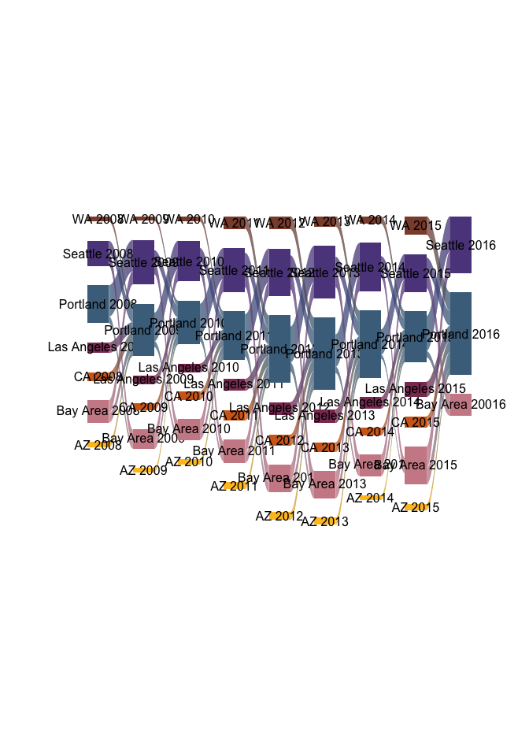
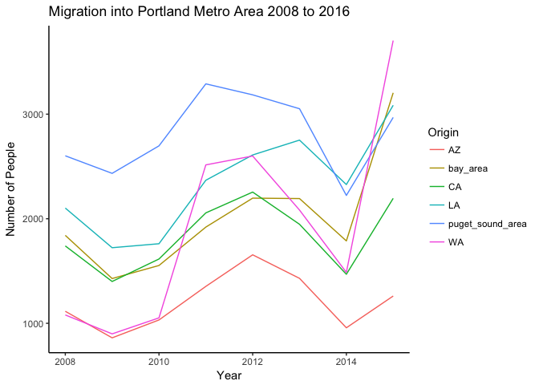

WhitePaper
================

    ## ── Attaching packages ───────────────────────────────────────────── tidyverse 1.2.1 ──

    ## ✔ ggplot2 2.2.1     ✔ purrr   0.2.4
    ## ✔ tibble  1.4.2     ✔ dplyr   0.7.4
    ## ✔ tidyr   0.8.0     ✔ stringr 1.2.0
    ## ✔ readr   1.1.1     ✔ forcats 0.3.0

    ## ── Conflicts ──────────────────────────────────────────────── tidyverse_conflicts() ──
    ## ✖ dplyr::filter() masks stats::filter()
    ## ✖ dplyr::lag()    masks stats::lag()

Abstract
========

Portland, as countless articles will tell you, has been in the past decade experiencing large amounts of population growth. Migration to and from portland is bound to have economic and cultural effects on the city and its residents. Aditionally, it is worth wondering where people are migrating from and what their characteristics are. Our paper is essentially broken down into three components that relate to residential change in Portland. First, we describe migration, with a focus on migration from the Bay Area and Puget Sound/Seattle Area. Second we dicuss economic disparity in the Portland area, and what factors may play a role in that disparity. Third, we dicuss housing prices and changes in housing prices over the last decade in Portland. It seems that there is a high likelihood that these three components are related. We will attempt to show how they may be related.

Migration Over Time
===================

This project has focused primarily on the storyline of the migration of people from the Bay Area and Seattle to Portland. We have found, using IRS data, that the largest sources of migration across time to Portland com from these areas as well as the states of California and Washington. Our data tells us about county to county migration. We can observe the largest contributors over time by viewing the Sankey plot shown below.

    ## Parsed with column specification:
    ## cols(
    ##   X1 = col_integer(),
    ##   origin = col_character(),
    ##   destinations = col_character(),
    ##   tax_year = col_character(),
    ##   n = col_integer(),
    ##   year = col_integer(),
    ##   total = col_integer(),
    ##   prop = col_double()
    ## )

    ## Parsed with column specification:
    ## cols(
    ##   X1 = col_integer(),
    ##   X1_1 = col_integer(),
    ##   origin_area = col_character(),
    ##   dest_area = col_character(),
    ##   year = col_integer(),
    ##   n = col_integer()
    ## )

    ## Parsed with column specification:
    ## cols(
    ##   X1 = col_integer(),
    ##   origin = col_character(),
    ##   destinations = col_character(),
    ##   year = col_integer(),
    ##   n = col_integer()
    ## )

``` r
riverplot(migriver, add_mid_points = FALSE
        ,default_style = styles0, srt = 0, xscale = 1, nodewidth = 1.7)
```



    ## --------------
    ## Default style:
    ## -----------
    ## $srt
    ## [1] 0
    ## 
    ## $AZ_1
    ## $AZ_1$col
    ## [1] "goldenrod1"
    ## 
    ## $AZ_1$lty
    ## [1] 5
    ## 
    ## 
    ## $bay_area_1
    ## $bay_area_1$col
    ## [1] "lightpink3"
    ## 
    ## $bay_area_1$lty
    ## [1] 5
    ## 
    ## 
    ## $CA_1
    ## $CA_1$col
    ## [1] "chocolate"
    ## 
    ## $CA_1$lty
    ## [1] 5
    ## 
    ## 
    ## $LA_1
    ## $LA_1$col
    ## [1] "hotpink4"
    ## 
    ## $LA_1$lty
    ## [1] 5
    ## 
    ## 
    ## $puget_sound_area_1
    ## $puget_sound_area_1$col
    ## [1] "mediumpurple4"
    ## 
    ## $puget_sound_area_1$lty
    ## [1] 5
    ## 
    ## 
    ## $pdx_1
    ## $pdx_1$col
    ## [1] "skyblue4"
    ## 
    ## $pdx_1$lty
    ## [1] 5
    ## 
    ## 
    ## $WA_1
    ## $WA_1$col
    ## [1] "salmon4"
    ## 
    ## $WA_1$lty
    ## [1] 5
    ## 
    ## 
    ## $AZ_2
    ## $AZ_2$col
    ## [1] "goldenrod1"
    ## 
    ## $AZ_2$lty
    ## [1] 5
    ## 
    ## 
    ## $bay_area_2
    ## $bay_area_2$col
    ## [1] "lightpink3"
    ## 
    ## $bay_area_2$lty
    ## [1] 5
    ## 
    ## 
    ## $CA_2
    ## $CA_2$col
    ## [1] "chocolate"
    ## 
    ## $CA_2$lty
    ## [1] 5
    ## 
    ## 
    ## $LA_2
    ## $LA_2$col
    ## [1] "hotpink4"
    ## 
    ## $LA_2$lty
    ## [1] 5
    ## 
    ## 
    ## $puget_sound_area_2
    ## $puget_sound_area_2$col
    ## [1] "mediumpurple4"
    ## 
    ## $puget_sound_area_2$lty
    ## [1] 5
    ## 
    ## 
    ## $pdx_2
    ## $pdx_2$col
    ## [1] "skyblue4"
    ## 
    ## $pdx_2$lty
    ## [1] 5
    ## 
    ## 
    ## $WA_2
    ## $WA_2$col
    ## [1] "salmon4"
    ## 
    ## $WA_2$lty
    ## [1] 5
    ## 
    ## 
    ## $AZ_3
    ## $AZ_3$col
    ## [1] "goldenrod1"
    ## 
    ## $AZ_3$lty
    ## [1] 5
    ## 
    ## 
    ## $bay_area_3
    ## $bay_area_3$col
    ## [1] "lightpink3"
    ## 
    ## $bay_area_3$lty
    ## [1] 5
    ## 
    ## 
    ## $CA_3
    ## $CA_3$col
    ## [1] "chocolate"
    ## 
    ## $CA_3$lty
    ## [1] 5
    ## 
    ## 
    ## $LA_3
    ## $LA_3$col
    ## [1] "hotpink4"
    ## 
    ## $LA_3$lty
    ## [1] 5
    ## 
    ## 
    ## $puget_sound_area_3
    ## $puget_sound_area_3$col
    ## [1] "mediumpurple4"
    ## 
    ## $puget_sound_area_3$lty
    ## [1] 5
    ## 
    ## 
    ## $pdx_3
    ## $pdx_3$col
    ## [1] "skyblue4"
    ## 
    ## $pdx_3$lty
    ## [1] 5
    ## 
    ## 
    ## $WA_3
    ## $WA_3$col
    ## [1] "salmon4"
    ## 
    ## $WA_3$lty
    ## [1] 5
    ## 
    ## 
    ## $AZ_4
    ## $AZ_4$col
    ## [1] "goldenrod1"
    ## 
    ## $AZ_4$lty
    ## [1] 5
    ## 
    ## 
    ## $bay_area_4
    ## $bay_area_4$col
    ## [1] "lightpink3"
    ## 
    ## $bay_area_4$lty
    ## [1] 5
    ## 
    ## 
    ## $CA_4
    ## $CA_4$col
    ## [1] "chocolate"
    ## 
    ## $CA_4$lty
    ## [1] 5
    ## 
    ## 
    ## $LA_4
    ## $LA_4$col
    ## [1] "hotpink4"
    ## 
    ## $LA_4$lty
    ## [1] 5
    ## 
    ## 
    ## $puget_sound_area_4
    ## $puget_sound_area_4$col
    ## [1] "mediumpurple4"
    ## 
    ## $puget_sound_area_4$lty
    ## [1] 5
    ## 
    ## 
    ## $pdx_4
    ## $pdx_4$col
    ## [1] "skyblue4"
    ## 
    ## $pdx_4$lty
    ## [1] 5
    ## 
    ## 
    ## $WA_4
    ## $WA_4$col
    ## [1] "salmon4"
    ## 
    ## $WA_4$lty
    ## [1] 5
    ## 
    ## 
    ## $AZ_5
    ## $AZ_5$col
    ## [1] "goldenrod1"
    ## 
    ## $AZ_5$lty
    ## [1] 5
    ## 
    ## 
    ## $bay_area_5
    ## $bay_area_5$col
    ## [1] "lightpink3"
    ## 
    ## $bay_area_5$lty
    ## [1] 5
    ## 
    ## 
    ## $CA_5
    ## $CA_5$col
    ## [1] "chocolate"
    ## 
    ## $CA_5$lty
    ## [1] 5
    ## 
    ## 
    ## $LA_5
    ## $LA_5$col
    ## [1] "hotpink4"
    ## 
    ## $LA_5$lty
    ## [1] 5
    ## 
    ## 
    ## $puget_sound_area_5
    ## $puget_sound_area_5$col
    ## [1] "mediumpurple4"
    ## 
    ## $puget_sound_area_5$lty
    ## [1] 5
    ## 
    ## 
    ## $pdx_5
    ## $pdx_5$col
    ## [1] "skyblue4"
    ## 
    ## $pdx_5$lty
    ## [1] 5
    ## 
    ## 
    ## $WA_5
    ## $WA_5$col
    ## [1] "salmon4"
    ## 
    ## $WA_5$lty
    ## [1] 5
    ## 
    ## 
    ## $AZ_6
    ## $AZ_6$col
    ## [1] "goldenrod1"
    ## 
    ## $AZ_6$lty
    ## [1] 5
    ## 
    ## 
    ## $bay_area_6
    ## $bay_area_6$col
    ## [1] "lightpink3"
    ## 
    ## $bay_area_6$lty
    ## [1] 5
    ## 
    ## 
    ## $CA_6
    ## $CA_6$col
    ## [1] "chocolate"
    ## 
    ## $CA_6$lty
    ## [1] 5
    ## 
    ## 
    ## $LA_6
    ## $LA_6$col
    ## [1] "hotpink4"
    ## 
    ## $LA_6$lty
    ## [1] 5
    ## 
    ## 
    ## $puget_sound_area_6
    ## $puget_sound_area_6$col
    ## [1] "mediumpurple4"
    ## 
    ## $puget_sound_area_6$lty
    ## [1] 5
    ## 
    ## 
    ## $pdx_6
    ## $pdx_6$col
    ## [1] "skyblue4"
    ## 
    ## $pdx_6$lty
    ## [1] 5
    ## 
    ## 
    ## $WA_6
    ## $WA_6$col
    ## [1] "salmon4"
    ## 
    ## $WA_6$lty
    ## [1] 5
    ## 
    ## 
    ## $AZ_7
    ## $AZ_7$col
    ## [1] "goldenrod1"
    ## 
    ## $AZ_7$lty
    ## [1] 5
    ## 
    ## 
    ## $bay_area_7
    ## $bay_area_7$col
    ## [1] "lightpink3"
    ## 
    ## $bay_area_7$lty
    ## [1] 5
    ## 
    ## 
    ## $CA_7
    ## $CA_7$col
    ## [1] "chocolate"
    ## 
    ## $CA_7$lty
    ## [1] 5
    ## 
    ## 
    ## $LA_7
    ## $LA_7$col
    ## [1] "hotpink4"
    ## 
    ## $LA_7$lty
    ## [1] 5
    ## 
    ## 
    ## $puget_sound_area_7
    ## $puget_sound_area_7$col
    ## [1] "mediumpurple4"
    ## 
    ## $puget_sound_area_7$lty
    ## [1] 5
    ## 
    ## 
    ## $pdx_7
    ## $pdx_7$col
    ## [1] "skyblue4"
    ## 
    ## $pdx_7$lty
    ## [1] 5
    ## 
    ## 
    ## $WA_7
    ## $WA_7$col
    ## [1] "salmon4"
    ## 
    ## $WA_7$lty
    ## [1] 5
    ## 
    ## 
    ## $AZ_8
    ## $AZ_8$col
    ## [1] "goldenrod1"
    ## 
    ## $AZ_8$lty
    ## [1] 5
    ## 
    ## 
    ## $bay_area_8
    ## $bay_area_8$col
    ## [1] "lightpink3"
    ## 
    ## $bay_area_8$lty
    ## [1] 5
    ## 
    ## 
    ## $CA_8
    ## $CA_8$col
    ## [1] "chocolate"
    ## 
    ## $CA_8$lty
    ## [1] 5
    ## 
    ## 
    ## $LA_8
    ## $LA_8$col
    ## [1] "hotpink4"
    ## 
    ## $LA_8$lty
    ## [1] 5
    ## 
    ## 
    ## $puget_sound_area_8
    ## $puget_sound_area_8$col
    ## [1] "mediumpurple4"
    ## 
    ## $puget_sound_area_8$lty
    ## [1] 5
    ## 
    ## 
    ## $pdx_8
    ## $pdx_8$col
    ## [1] "skyblue4"
    ## 
    ## $pdx_8$lty
    ## [1] 5
    ## 
    ## 
    ## $WA_8
    ## $WA_8$col
    ## [1] "salmon4"
    ## 
    ## $WA_8$lty
    ## [1] 5
    ## 
    ## 
    ## $bay_area_9
    ## $bay_area_9$col
    ## [1] "lightpink3"
    ## 
    ## $bay_area_9$lty
    ## [1] 5
    ## 
    ## 
    ## $puget_sound_area_9
    ## $puget_sound_area_9$col
    ## [1] "mediumpurple4"
    ## 
    ## $puget_sound_area_9$lty
    ## [1] 5
    ## 
    ## 
    ## $pdx_9
    ## $pdx_9$col
    ## [1] "skyblue4"
    ## 
    ## $pdx_9$lty
    ## [1] 5
    ## 
    ## 
    ## attr(,"class")
    ## [1] "list"           "riverplotStyle"
    ## --------------
    ## [1] "checking edges"
    ## Updated styles:
    ## $AZ_1
    ## $col
    ## [1] "goldenrod1"
    ## 
    ## $lty
    ## [1] 5
    ## 
    ## $srt
    ## [1] 0
    ## 
    ## $AZ_1
    ## $AZ_1$col
    ## [1] "goldenrod1"
    ## 
    ## $AZ_1$lty
    ## [1] 5
    ## 
    ## 
    ## $bay_area_1
    ## $bay_area_1$col
    ## [1] "lightpink3"
    ## 
    ## $bay_area_1$lty
    ## [1] 5
    ## 
    ## 
    ## $CA_1
    ## $CA_1$col
    ## [1] "chocolate"
    ## 
    ## $CA_1$lty
    ## [1] 5
    ## 
    ## 
    ## $LA_1
    ## $LA_1$col
    ## [1] "hotpink4"
    ## 
    ## $LA_1$lty
    ## [1] 5
    ## 
    ## 
    ## $puget_sound_area_1
    ## $puget_sound_area_1$col
    ## [1] "mediumpurple4"
    ## 
    ## $puget_sound_area_1$lty
    ## [1] 5
    ## 
    ## 
    ## $pdx_1
    ## $pdx_1$col
    ## [1] "skyblue4"
    ## 
    ## $pdx_1$lty
    ## [1] 5
    ## 
    ## 
    ## $WA_1
    ## $WA_1$col
    ## [1] "salmon4"
    ## 
    ## $WA_1$lty
    ## [1] 5
    ## 
    ## 
    ## $AZ_2
    ## $AZ_2$col
    ## [1] "goldenrod1"
    ## 
    ## $AZ_2$lty
    ## [1] 5
    ## 
    ## 
    ## $bay_area_2
    ## $bay_area_2$col
    ## [1] "lightpink3"
    ## 
    ## $bay_area_2$lty
    ## [1] 5
    ## 
    ## 
    ## $CA_2
    ## $CA_2$col
    ## [1] "chocolate"
    ## 
    ## $CA_2$lty
    ## [1] 5
    ## 
    ## 
    ## $LA_2
    ## $LA_2$col
    ## [1] "hotpink4"
    ## 
    ## $LA_2$lty
    ## [1] 5
    ## 
    ## 
    ## $puget_sound_area_2
    ## $puget_sound_area_2$col
    ## [1] "mediumpurple4"
    ## 
    ## $puget_sound_area_2$lty
    ## [1] 5
    ## 
    ## 
    ## $pdx_2
    ## $pdx_2$col
    ## [1] "skyblue4"
    ## 
    ## $pdx_2$lty
    ## [1] 5
    ## 
    ## 
    ## $WA_2
    ## $WA_2$col
    ## [1] "salmon4"
    ## 
    ## $WA_2$lty
    ## [1] 5
    ## 
    ## 
    ## $AZ_3
    ## $AZ_3$col
    ## [1] "goldenrod1"
    ## 
    ## $AZ_3$lty
    ## [1] 5
    ## 
    ## 
    ## $bay_area_3
    ## $bay_area_3$col
    ## [1] "lightpink3"
    ## 
    ## $bay_area_3$lty
    ## [1] 5
    ## 
    ## 
    ## $CA_3
    ## $CA_3$col
    ## [1] "chocolate"
    ## 
    ## $CA_3$lty
    ## [1] 5
    ## 
    ## 
    ## $LA_3
    ## $LA_3$col
    ## [1] "hotpink4"
    ## 
    ## $LA_3$lty
    ## [1] 5
    ## 
    ## 
    ## $puget_sound_area_3
    ## $puget_sound_area_3$col
    ## [1] "mediumpurple4"
    ## 
    ## $puget_sound_area_3$lty
    ## [1] 5
    ## 
    ## 
    ## $pdx_3
    ## $pdx_3$col
    ## [1] "skyblue4"
    ## 
    ## $pdx_3$lty
    ## [1] 5
    ## 
    ## 
    ## $WA_3
    ## $WA_3$col
    ## [1] "salmon4"
    ## 
    ## $WA_3$lty
    ## [1] 5
    ## 
    ## 
    ## $AZ_4
    ## $AZ_4$col
    ## [1] "goldenrod1"
    ## 
    ## $AZ_4$lty
    ## [1] 5
    ## 
    ## 
    ## $bay_area_4
    ## $bay_area_4$col
    ## [1] "lightpink3"
    ## 
    ## $bay_area_4$lty
    ## [1] 5
    ## 
    ## 
    ## $CA_4
    ## $CA_4$col
    ## [1] "chocolate"
    ## 
    ## $CA_4$lty
    ## [1] 5
    ## 
    ## 
    ## $LA_4
    ## $LA_4$col
    ## [1] "hotpink4"
    ## 
    ## $LA_4$lty
    ## [1] 5
    ## 
    ## 
    ## $puget_sound_area_4
    ## $puget_sound_area_4$col
    ## [1] "mediumpurple4"
    ## 
    ## $puget_sound_area_4$lty
    ## [1] 5
    ## 
    ## 
    ## $pdx_4
    ## $pdx_4$col
    ## [1] "skyblue4"
    ## 
    ## $pdx_4$lty
    ## [1] 5
    ## 
    ## 
    ## $WA_4
    ## $WA_4$col
    ## [1] "salmon4"
    ## 
    ## $WA_4$lty
    ## [1] 5
    ## 
    ## 
    ## $AZ_5
    ## $AZ_5$col
    ## [1] "goldenrod1"
    ## 
    ## $AZ_5$lty
    ## [1] 5
    ## 
    ## 
    ## $bay_area_5
    ## $bay_area_5$col
    ## [1] "lightpink3"
    ## 
    ## $bay_area_5$lty
    ## [1] 5
    ## 
    ## 
    ## $CA_5
    ## $CA_5$col
    ## [1] "chocolate"
    ## 
    ## $CA_5$lty
    ## [1] 5
    ## 
    ## 
    ## $LA_5
    ## $LA_5$col
    ## [1] "hotpink4"
    ## 
    ## $LA_5$lty
    ## [1] 5
    ## 
    ## 
    ## $puget_sound_area_5
    ## $puget_sound_area_5$col
    ## [1] "mediumpurple4"
    ## 
    ## $puget_sound_area_5$lty
    ## [1] 5
    ## 
    ## 
    ## $pdx_5
    ## $pdx_5$col
    ## [1] "skyblue4"
    ## 
    ## $pdx_5$lty
    ## [1] 5
    ## 
    ## 
    ## $WA_5
    ## $WA_5$col
    ## [1] "salmon4"
    ## 
    ## $WA_5$lty
    ## [1] 5
    ## 
    ## 
    ## $AZ_6
    ## $AZ_6$col
    ## [1] "goldenrod1"
    ## 
    ## $AZ_6$lty
    ## [1] 5
    ## 
    ## 
    ## $bay_area_6
    ## $bay_area_6$col
    ## [1] "lightpink3"
    ## 
    ## $bay_area_6$lty
    ## [1] 5
    ## 
    ## 
    ## $CA_6
    ## $CA_6$col
    ## [1] "chocolate"
    ## 
    ## $CA_6$lty
    ## [1] 5
    ## 
    ## 
    ## $LA_6
    ## $LA_6$col
    ## [1] "hotpink4"
    ## 
    ## $LA_6$lty
    ## [1] 5
    ## 
    ## 
    ## $puget_sound_area_6
    ## $puget_sound_area_6$col
    ## [1] "mediumpurple4"
    ## 
    ## $puget_sound_area_6$lty
    ## [1] 5
    ## 
    ## 
    ## $pdx_6
    ## $pdx_6$col
    ## [1] "skyblue4"
    ## 
    ## $pdx_6$lty
    ## [1] 5
    ## 
    ## 
    ## $WA_6
    ## $WA_6$col
    ## [1] "salmon4"
    ## 
    ## $WA_6$lty
    ## [1] 5
    ## 
    ## 
    ## $AZ_7
    ## $AZ_7$col
    ## [1] "goldenrod1"
    ## 
    ## $AZ_7$lty
    ## [1] 5
    ## 
    ## 
    ## $bay_area_7
    ## $bay_area_7$col
    ## [1] "lightpink3"
    ## 
    ## $bay_area_7$lty
    ## [1] 5
    ## 
    ## 
    ## $CA_7
    ## $CA_7$col
    ## [1] "chocolate"
    ## 
    ## $CA_7$lty
    ## [1] 5
    ## 
    ## 
    ## $LA_7
    ## $LA_7$col
    ## [1] "hotpink4"
    ## 
    ## $LA_7$lty
    ## [1] 5
    ## 
    ## 
    ## $puget_sound_area_7
    ## $puget_sound_area_7$col
    ## [1] "mediumpurple4"
    ## 
    ## $puget_sound_area_7$lty
    ## [1] 5
    ## 
    ## 
    ## $pdx_7
    ## $pdx_7$col
    ## [1] "skyblue4"
    ## 
    ## $pdx_7$lty
    ## [1] 5
    ## 
    ## 
    ## $WA_7
    ## $WA_7$col
    ## [1] "salmon4"
    ## 
    ## $WA_7$lty
    ## [1] 5
    ## 
    ## 
    ## $AZ_8
    ## $AZ_8$col
    ## [1] "goldenrod1"
    ## 
    ## $AZ_8$lty
    ## [1] 5
    ## 
    ## 
    ## $bay_area_8
    ## $bay_area_8$col
    ## [1] "lightpink3"
    ## 
    ## $bay_area_8$lty
    ## [1] 5
    ## 
    ## 
    ## $CA_8
    ## $CA_8$col
    ## [1] "chocolate"
    ## 
    ## $CA_8$lty
    ## [1] 5
    ## 
    ## 
    ## $LA_8
    ## $LA_8$col
    ## [1] "hotpink4"
    ## 
    ## $LA_8$lty
    ## [1] 5
    ## 
    ## 
    ## $puget_sound_area_8
    ## $puget_sound_area_8$col
    ## [1] "mediumpurple4"
    ## 
    ## $puget_sound_area_8$lty
    ## [1] 5
    ## 
    ## 
    ## $pdx_8
    ## $pdx_8$col
    ## [1] "skyblue4"
    ## 
    ## $pdx_8$lty
    ## [1] 5
    ## 
    ## 
    ## $WA_8
    ## $WA_8$col
    ## [1] "salmon4"
    ## 
    ## $WA_8$lty
    ## [1] 5
    ## 
    ## 
    ## $bay_area_9
    ## $bay_area_9$col
    ## [1] "lightpink3"
    ## 
    ## $bay_area_9$lty
    ## [1] 5
    ## 
    ## 
    ## $puget_sound_area_9
    ## $puget_sound_area_9$col
    ## [1] "mediumpurple4"
    ## 
    ## $puget_sound_area_9$lty
    ## [1] 5
    ## 
    ## 
    ## $pdx_9
    ## $pdx_9$col
    ## [1] "skyblue4"
    ## 
    ## $pdx_9$lty
    ## [1] 5
    ## 
    ## 
    ## attr(,"class")
    ## [1] "list"           "riverplotStyle"
    ## 
    ## $bay_area_1
    ## $col
    ## [1] "lightpink3"
    ## 
    ## $lty
    ## [1] 5
    ## 
    ## $srt
    ## [1] 0
    ## 
    ## $AZ_1
    ## $AZ_1$col
    ## [1] "goldenrod1"
    ## 
    ## $AZ_1$lty
    ## [1] 5
    ## 
    ## 
    ## $bay_area_1
    ## $bay_area_1$col
    ## [1] "lightpink3"
    ## 
    ## $bay_area_1$lty
    ## [1] 5
    ## 
    ## 
    ## $CA_1
    ## $CA_1$col
    ## [1] "chocolate"
    ## 
    ## $CA_1$lty
    ## [1] 5
    ## 
    ## 
    ## $LA_1
    ## $LA_1$col
    ## [1] "hotpink4"
    ## 
    ## $LA_1$lty
    ## [1] 5
    ## 
    ## 
    ## $puget_sound_area_1
    ## $puget_sound_area_1$col
    ## [1] "mediumpurple4"
    ## 
    ## $puget_sound_area_1$lty
    ## [1] 5
    ## 
    ## 
    ## $pdx_1
    ## $pdx_1$col
    ## [1] "skyblue4"
    ## 
    ## $pdx_1$lty
    ## [1] 5
    ## 
    ## 
    ## $WA_1
    ## $WA_1$col
    ## [1] "salmon4"
    ## 
    ## $WA_1$lty
    ## [1] 5
    ## 
    ## 
    ## $AZ_2
    ## $AZ_2$col
    ## [1] "goldenrod1"
    ## 
    ## $AZ_2$lty
    ## [1] 5
    ## 
    ## 
    ## $bay_area_2
    ## $bay_area_2$col
    ## [1] "lightpink3"
    ## 
    ## $bay_area_2$lty
    ## [1] 5
    ## 
    ## 
    ## $CA_2
    ## $CA_2$col
    ## [1] "chocolate"
    ## 
    ## $CA_2$lty
    ## [1] 5
    ## 
    ## 
    ## $LA_2
    ## $LA_2$col
    ## [1] "hotpink4"
    ## 
    ## $LA_2$lty
    ## [1] 5
    ## 
    ## 
    ## $puget_sound_area_2
    ## $puget_sound_area_2$col
    ## [1] "mediumpurple4"
    ## 
    ## $puget_sound_area_2$lty
    ## [1] 5
    ## 
    ## 
    ## $pdx_2
    ## $pdx_2$col
    ## [1] "skyblue4"
    ## 
    ## $pdx_2$lty
    ## [1] 5
    ## 
    ## 
    ## $WA_2
    ## $WA_2$col
    ## [1] "salmon4"
    ## 
    ## $WA_2$lty
    ## [1] 5
    ## 
    ## 
    ## $AZ_3
    ## $AZ_3$col
    ## [1] "goldenrod1"
    ## 
    ## $AZ_3$lty
    ## [1] 5
    ## 
    ## 
    ## $bay_area_3
    ## $bay_area_3$col
    ## [1] "lightpink3"
    ## 
    ## $bay_area_3$lty
    ## [1] 5
    ## 
    ## 
    ## $CA_3
    ## $CA_3$col
    ## [1] "chocolate"
    ## 
    ## $CA_3$lty
    ## [1] 5
    ## 
    ## 
    ## $LA_3
    ## $LA_3$col
    ## [1] "hotpink4"
    ## 
    ## $LA_3$lty
    ## [1] 5
    ## 
    ## 
    ## $puget_sound_area_3
    ## $puget_sound_area_3$col
    ## [1] "mediumpurple4"
    ## 
    ## $puget_sound_area_3$lty
    ## [1] 5
    ## 
    ## 
    ## $pdx_3
    ## $pdx_3$col
    ## [1] "skyblue4"
    ## 
    ## $pdx_3$lty
    ## [1] 5
    ## 
    ## 
    ## $WA_3
    ## $WA_3$col
    ## [1] "salmon4"
    ## 
    ## $WA_3$lty
    ## [1] 5
    ## 
    ## 
    ## $AZ_4
    ## $AZ_4$col
    ## [1] "goldenrod1"
    ## 
    ## $AZ_4$lty
    ## [1] 5
    ## 
    ## 
    ## $bay_area_4
    ## $bay_area_4$col
    ## [1] "lightpink3"
    ## 
    ## $bay_area_4$lty
    ## [1] 5
    ## 
    ## 
    ## $CA_4
    ## $CA_4$col
    ## [1] "chocolate"
    ## 
    ## $CA_4$lty
    ## [1] 5
    ## 
    ## 
    ## $LA_4
    ## $LA_4$col
    ## [1] "hotpink4"
    ## 
    ## $LA_4$lty
    ## [1] 5
    ## 
    ## 
    ## $puget_sound_area_4
    ## $puget_sound_area_4$col
    ## [1] "mediumpurple4"
    ## 
    ## $puget_sound_area_4$lty
    ## [1] 5
    ## 
    ## 
    ## $pdx_4
    ## $pdx_4$col
    ## [1] "skyblue4"
    ## 
    ## $pdx_4$lty
    ## [1] 5
    ## 
    ## 
    ## $WA_4
    ## $WA_4$col
    ## [1] "salmon4"
    ## 
    ## $WA_4$lty
    ## [1] 5
    ## 
    ## 
    ## $AZ_5
    ## $AZ_5$col
    ## [1] "goldenrod1"
    ## 
    ## $AZ_5$lty
    ## [1] 5
    ## 
    ## 
    ## $bay_area_5
    ## $bay_area_5$col
    ## [1] "lightpink3"
    ## 
    ## $bay_area_5$lty
    ## [1] 5
    ## 
    ## 
    ## $CA_5
    ## $CA_5$col
    ## [1] "chocolate"
    ## 
    ## $CA_5$lty
    ## [1] 5
    ## 
    ## 
    ## $LA_5
    ## $LA_5$col
    ## [1] "hotpink4"
    ## 
    ## $LA_5$lty
    ## [1] 5
    ## 
    ## 
    ## $puget_sound_area_5
    ## $puget_sound_area_5$col
    ## [1] "mediumpurple4"
    ## 
    ## $puget_sound_area_5$lty
    ## [1] 5
    ## 
    ## 
    ## $pdx_5
    ## $pdx_5$col
    ## [1] "skyblue4"
    ## 
    ## $pdx_5$lty
    ## [1] 5
    ## 
    ## 
    ## $WA_5
    ## $WA_5$col
    ## [1] "salmon4"
    ## 
    ## $WA_5$lty
    ## [1] 5
    ## 
    ## 
    ## $AZ_6
    ## $AZ_6$col
    ## [1] "goldenrod1"
    ## 
    ## $AZ_6$lty
    ## [1] 5
    ## 
    ## 
    ## $bay_area_6
    ## $bay_area_6$col
    ## [1] "lightpink3"
    ## 
    ## $bay_area_6$lty
    ## [1] 5
    ## 
    ## 
    ## $CA_6
    ## $CA_6$col
    ## [1] "chocolate"
    ## 
    ## $CA_6$lty
    ## [1] 5
    ## 
    ## 
    ## $LA_6
    ## $LA_6$col
    ## [1] "hotpink4"
    ## 
    ## $LA_6$lty
    ## [1] 5
    ## 
    ## 
    ## $puget_sound_area_6
    ## $puget_sound_area_6$col
    ## [1] "mediumpurple4"
    ## 
    ## $puget_sound_area_6$lty
    ## [1] 5
    ## 
    ## 
    ## $pdx_6
    ## $pdx_6$col
    ## [1] "skyblue4"
    ## 
    ## $pdx_6$lty
    ## [1] 5
    ## 
    ## 
    ## $WA_6
    ## $WA_6$col
    ## [1] "salmon4"
    ## 
    ## $WA_6$lty
    ## [1] 5
    ## 
    ## 
    ## $AZ_7
    ## $AZ_7$col
    ## [1] "goldenrod1"
    ## 
    ## $AZ_7$lty
    ## [1] 5
    ## 
    ## 
    ## $bay_area_7
    ## $bay_area_7$col
    ## [1] "lightpink3"
    ## 
    ## $bay_area_7$lty
    ## [1] 5
    ## 
    ## 
    ## $CA_7
    ## $CA_7$col
    ## [1] "chocolate"
    ## 
    ## $CA_7$lty
    ## [1] 5
    ## 
    ## 
    ## $LA_7
    ## $LA_7$col
    ## [1] "hotpink4"
    ## 
    ## $LA_7$lty
    ## [1] 5
    ## 
    ## 
    ## $puget_sound_area_7
    ## $puget_sound_area_7$col
    ## [1] "mediumpurple4"
    ## 
    ## $puget_sound_area_7$lty
    ## [1] 5
    ## 
    ## 
    ## $pdx_7
    ## $pdx_7$col
    ## [1] "skyblue4"
    ## 
    ## $pdx_7$lty
    ## [1] 5
    ## 
    ## 
    ## $WA_7
    ## $WA_7$col
    ## [1] "salmon4"
    ## 
    ## $WA_7$lty
    ## [1] 5
    ## 
    ## 
    ## $AZ_8
    ## $AZ_8$col
    ## [1] "goldenrod1"
    ## 
    ## $AZ_8$lty
    ## [1] 5
    ## 
    ## 
    ## $bay_area_8
    ## $bay_area_8$col
    ## [1] "lightpink3"
    ## 
    ## $bay_area_8$lty
    ## [1] 5
    ## 
    ## 
    ## $CA_8
    ## $CA_8$col
    ## [1] "chocolate"
    ## 
    ## $CA_8$lty
    ## [1] 5
    ## 
    ## 
    ## $LA_8
    ## $LA_8$col
    ## [1] "hotpink4"
    ## 
    ## $LA_8$lty
    ## [1] 5
    ## 
    ## 
    ## $puget_sound_area_8
    ## $puget_sound_area_8$col
    ## [1] "mediumpurple4"
    ## 
    ## $puget_sound_area_8$lty
    ## [1] 5
    ## 
    ## 
    ## $pdx_8
    ## $pdx_8$col
    ## [1] "skyblue4"
    ## 
    ## $pdx_8$lty
    ## [1] 5
    ## 
    ## 
    ## $WA_8
    ## $WA_8$col
    ## [1] "salmon4"
    ## 
    ## $WA_8$lty
    ## [1] 5
    ## 
    ## 
    ## $bay_area_9
    ## $bay_area_9$col
    ## [1] "lightpink3"
    ## 
    ## $bay_area_9$lty
    ## [1] 5
    ## 
    ## 
    ## $puget_sound_area_9
    ## $puget_sound_area_9$col
    ## [1] "mediumpurple4"
    ## 
    ## $puget_sound_area_9$lty
    ## [1] 5
    ## 
    ## 
    ## $pdx_9
    ## $pdx_9$col
    ## [1] "skyblue4"
    ## 
    ## $pdx_9$lty
    ## [1] 5
    ## 
    ## 
    ## attr(,"class")
    ## [1] "list"           "riverplotStyle"
    ## 
    ## $CA_1
    ## $col
    ## [1] "chocolate"
    ## 
    ## $lty
    ## [1] 5
    ## 
    ## $srt
    ## [1] 0
    ## 
    ## $AZ_1
    ## $AZ_1$col
    ## [1] "goldenrod1"
    ## 
    ## $AZ_1$lty
    ## [1] 5
    ## 
    ## 
    ## $bay_area_1
    ## $bay_area_1$col
    ## [1] "lightpink3"
    ## 
    ## $bay_area_1$lty
    ## [1] 5
    ## 
    ## 
    ## $CA_1
    ## $CA_1$col
    ## [1] "chocolate"
    ## 
    ## $CA_1$lty
    ## [1] 5
    ## 
    ## 
    ## $LA_1
    ## $LA_1$col
    ## [1] "hotpink4"
    ## 
    ## $LA_1$lty
    ## [1] 5
    ## 
    ## 
    ## $puget_sound_area_1
    ## $puget_sound_area_1$col
    ## [1] "mediumpurple4"
    ## 
    ## $puget_sound_area_1$lty
    ## [1] 5
    ## 
    ## 
    ## $pdx_1
    ## $pdx_1$col
    ## [1] "skyblue4"
    ## 
    ## $pdx_1$lty
    ## [1] 5
    ## 
    ## 
    ## $WA_1
    ## $WA_1$col
    ## [1] "salmon4"
    ## 
    ## $WA_1$lty
    ## [1] 5
    ## 
    ## 
    ## $AZ_2
    ## $AZ_2$col
    ## [1] "goldenrod1"
    ## 
    ## $AZ_2$lty
    ## [1] 5
    ## 
    ## 
    ## $bay_area_2
    ## $bay_area_2$col
    ## [1] "lightpink3"
    ## 
    ## $bay_area_2$lty
    ## [1] 5
    ## 
    ## 
    ## $CA_2
    ## $CA_2$col
    ## [1] "chocolate"
    ## 
    ## $CA_2$lty
    ## [1] 5
    ## 
    ## 
    ## $LA_2
    ## $LA_2$col
    ## [1] "hotpink4"
    ## 
    ## $LA_2$lty
    ## [1] 5
    ## 
    ## 
    ## $puget_sound_area_2
    ## $puget_sound_area_2$col
    ## [1] "mediumpurple4"
    ## 
    ## $puget_sound_area_2$lty
    ## [1] 5
    ## 
    ## 
    ## $pdx_2
    ## $pdx_2$col
    ## [1] "skyblue4"
    ## 
    ## $pdx_2$lty
    ## [1] 5
    ## 
    ## 
    ## $WA_2
    ## $WA_2$col
    ## [1] "salmon4"
    ## 
    ## $WA_2$lty
    ## [1] 5
    ## 
    ## 
    ## $AZ_3
    ## $AZ_3$col
    ## [1] "goldenrod1"
    ## 
    ## $AZ_3$lty
    ## [1] 5
    ## 
    ## 
    ## $bay_area_3
    ## $bay_area_3$col
    ## [1] "lightpink3"
    ## 
    ## $bay_area_3$lty
    ## [1] 5
    ## 
    ## 
    ## $CA_3
    ## $CA_3$col
    ## [1] "chocolate"
    ## 
    ## $CA_3$lty
    ## [1] 5
    ## 
    ## 
    ## $LA_3
    ## $LA_3$col
    ## [1] "hotpink4"
    ## 
    ## $LA_3$lty
    ## [1] 5
    ## 
    ## 
    ## $puget_sound_area_3
    ## $puget_sound_area_3$col
    ## [1] "mediumpurple4"
    ## 
    ## $puget_sound_area_3$lty
    ## [1] 5
    ## 
    ## 
    ## $pdx_3
    ## $pdx_3$col
    ## [1] "skyblue4"
    ## 
    ## $pdx_3$lty
    ## [1] 5
    ## 
    ## 
    ## $WA_3
    ## $WA_3$col
    ## [1] "salmon4"
    ## 
    ## $WA_3$lty
    ## [1] 5
    ## 
    ## 
    ## $AZ_4
    ## $AZ_4$col
    ## [1] "goldenrod1"
    ## 
    ## $AZ_4$lty
    ## [1] 5
    ## 
    ## 
    ## $bay_area_4
    ## $bay_area_4$col
    ## [1] "lightpink3"
    ## 
    ## $bay_area_4$lty
    ## [1] 5
    ## 
    ## 
    ## $CA_4
    ## $CA_4$col
    ## [1] "chocolate"
    ## 
    ## $CA_4$lty
    ## [1] 5
    ## 
    ## 
    ## $LA_4
    ## $LA_4$col
    ## [1] "hotpink4"
    ## 
    ## $LA_4$lty
    ## [1] 5
    ## 
    ## 
    ## $puget_sound_area_4
    ## $puget_sound_area_4$col
    ## [1] "mediumpurple4"
    ## 
    ## $puget_sound_area_4$lty
    ## [1] 5
    ## 
    ## 
    ## $pdx_4
    ## $pdx_4$col
    ## [1] "skyblue4"
    ## 
    ## $pdx_4$lty
    ## [1] 5
    ## 
    ## 
    ## $WA_4
    ## $WA_4$col
    ## [1] "salmon4"
    ## 
    ## $WA_4$lty
    ## [1] 5
    ## 
    ## 
    ## $AZ_5
    ## $AZ_5$col
    ## [1] "goldenrod1"
    ## 
    ## $AZ_5$lty
    ## [1] 5
    ## 
    ## 
    ## $bay_area_5
    ## $bay_area_5$col
    ## [1] "lightpink3"
    ## 
    ## $bay_area_5$lty
    ## [1] 5
    ## 
    ## 
    ## $CA_5
    ## $CA_5$col
    ## [1] "chocolate"
    ## 
    ## $CA_5$lty
    ## [1] 5
    ## 
    ## 
    ## $LA_5
    ## $LA_5$col
    ## [1] "hotpink4"
    ## 
    ## $LA_5$lty
    ## [1] 5
    ## 
    ## 
    ## $puget_sound_area_5
    ## $puget_sound_area_5$col
    ## [1] "mediumpurple4"
    ## 
    ## $puget_sound_area_5$lty
    ## [1] 5
    ## 
    ## 
    ## $pdx_5
    ## $pdx_5$col
    ## [1] "skyblue4"
    ## 
    ## $pdx_5$lty
    ## [1] 5
    ## 
    ## 
    ## $WA_5
    ## $WA_5$col
    ## [1] "salmon4"
    ## 
    ## $WA_5$lty
    ## [1] 5
    ## 
    ## 
    ## $AZ_6
    ## $AZ_6$col
    ## [1] "goldenrod1"
    ## 
    ## $AZ_6$lty
    ## [1] 5
    ## 
    ## 
    ## $bay_area_6
    ## $bay_area_6$col
    ## [1] "lightpink3"
    ## 
    ## $bay_area_6$lty
    ## [1] 5
    ## 
    ## 
    ## $CA_6
    ## $CA_6$col
    ## [1] "chocolate"
    ## 
    ## $CA_6$lty
    ## [1] 5
    ## 
    ## 
    ## $LA_6
    ## $LA_6$col
    ## [1] "hotpink4"
    ## 
    ## $LA_6$lty
    ## [1] 5
    ## 
    ## 
    ## $puget_sound_area_6
    ## $puget_sound_area_6$col
    ## [1] "mediumpurple4"
    ## 
    ## $puget_sound_area_6$lty
    ## [1] 5
    ## 
    ## 
    ## $pdx_6
    ## $pdx_6$col
    ## [1] "skyblue4"
    ## 
    ## $pdx_6$lty
    ## [1] 5
    ## 
    ## 
    ## $WA_6
    ## $WA_6$col
    ## [1] "salmon4"
    ## 
    ## $WA_6$lty
    ## [1] 5
    ## 
    ## 
    ## $AZ_7
    ## $AZ_7$col
    ## [1] "goldenrod1"
    ## 
    ## $AZ_7$lty
    ## [1] 5
    ## 
    ## 
    ## $bay_area_7
    ## $bay_area_7$col
    ## [1] "lightpink3"
    ## 
    ## $bay_area_7$lty
    ## [1] 5
    ## 
    ## 
    ## $CA_7
    ## $CA_7$col
    ## [1] "chocolate"
    ## 
    ## $CA_7$lty
    ## [1] 5
    ## 
    ## 
    ## $LA_7
    ## $LA_7$col
    ## [1] "hotpink4"
    ## 
    ## $LA_7$lty
    ## [1] 5
    ## 
    ## 
    ## $puget_sound_area_7
    ## $puget_sound_area_7$col
    ## [1] "mediumpurple4"
    ## 
    ## $puget_sound_area_7$lty
    ## [1] 5
    ## 
    ## 
    ## $pdx_7
    ## $pdx_7$col
    ## [1] "skyblue4"
    ## 
    ## $pdx_7$lty
    ## [1] 5
    ## 
    ## 
    ## $WA_7
    ## $WA_7$col
    ## [1] "salmon4"
    ## 
    ## $WA_7$lty
    ## [1] 5
    ## 
    ## 
    ## $AZ_8
    ## $AZ_8$col
    ## [1] "goldenrod1"
    ## 
    ## $AZ_8$lty
    ## [1] 5
    ## 
    ## 
    ## $bay_area_8
    ## $bay_area_8$col
    ## [1] "lightpink3"
    ## 
    ## $bay_area_8$lty
    ## [1] 5
    ## 
    ## 
    ## $CA_8
    ## $CA_8$col
    ## [1] "chocolate"
    ## 
    ## $CA_8$lty
    ## [1] 5
    ## 
    ## 
    ## $LA_8
    ## $LA_8$col
    ## [1] "hotpink4"
    ## 
    ## $LA_8$lty
    ## [1] 5
    ## 
    ## 
    ## $puget_sound_area_8
    ## $puget_sound_area_8$col
    ## [1] "mediumpurple4"
    ## 
    ## $puget_sound_area_8$lty
    ## [1] 5
    ## 
    ## 
    ## $pdx_8
    ## $pdx_8$col
    ## [1] "skyblue4"
    ## 
    ## $pdx_8$lty
    ## [1] 5
    ## 
    ## 
    ## $WA_8
    ## $WA_8$col
    ## [1] "salmon4"
    ## 
    ## $WA_8$lty
    ## [1] 5
    ## 
    ## 
    ## $bay_area_9
    ## $bay_area_9$col
    ## [1] "lightpink3"
    ## 
    ## $bay_area_9$lty
    ## [1] 5
    ## 
    ## 
    ## $puget_sound_area_9
    ## $puget_sound_area_9$col
    ## [1] "mediumpurple4"
    ## 
    ## $puget_sound_area_9$lty
    ## [1] 5
    ## 
    ## 
    ## $pdx_9
    ## $pdx_9$col
    ## [1] "skyblue4"
    ## 
    ## $pdx_9$lty
    ## [1] 5
    ## 
    ## 
    ## attr(,"class")
    ## [1] "list"           "riverplotStyle"
    ## 
    ## $LA_1
    ## $col
    ## [1] "hotpink4"
    ## 
    ## $lty
    ## [1] 5
    ## 
    ## $srt
    ## [1] 0
    ## 
    ## $AZ_1
    ## $AZ_1$col
    ## [1] "goldenrod1"
    ## 
    ## $AZ_1$lty
    ## [1] 5
    ## 
    ## 
    ## $bay_area_1
    ## $bay_area_1$col
    ## [1] "lightpink3"
    ## 
    ## $bay_area_1$lty
    ## [1] 5
    ## 
    ## 
    ## $CA_1
    ## $CA_1$col
    ## [1] "chocolate"
    ## 
    ## $CA_1$lty
    ## [1] 5
    ## 
    ## 
    ## $LA_1
    ## $LA_1$col
    ## [1] "hotpink4"
    ## 
    ## $LA_1$lty
    ## [1] 5
    ## 
    ## 
    ## $puget_sound_area_1
    ## $puget_sound_area_1$col
    ## [1] "mediumpurple4"
    ## 
    ## $puget_sound_area_1$lty
    ## [1] 5
    ## 
    ## 
    ## $pdx_1
    ## $pdx_1$col
    ## [1] "skyblue4"
    ## 
    ## $pdx_1$lty
    ## [1] 5
    ## 
    ## 
    ## $WA_1
    ## $WA_1$col
    ## [1] "salmon4"
    ## 
    ## $WA_1$lty
    ## [1] 5
    ## 
    ## 
    ## $AZ_2
    ## $AZ_2$col
    ## [1] "goldenrod1"
    ## 
    ## $AZ_2$lty
    ## [1] 5
    ## 
    ## 
    ## $bay_area_2
    ## $bay_area_2$col
    ## [1] "lightpink3"
    ## 
    ## $bay_area_2$lty
    ## [1] 5
    ## 
    ## 
    ## $CA_2
    ## $CA_2$col
    ## [1] "chocolate"
    ## 
    ## $CA_2$lty
    ## [1] 5
    ## 
    ## 
    ## $LA_2
    ## $LA_2$col
    ## [1] "hotpink4"
    ## 
    ## $LA_2$lty
    ## [1] 5
    ## 
    ## 
    ## $puget_sound_area_2
    ## $puget_sound_area_2$col
    ## [1] "mediumpurple4"
    ## 
    ## $puget_sound_area_2$lty
    ## [1] 5
    ## 
    ## 
    ## $pdx_2
    ## $pdx_2$col
    ## [1] "skyblue4"
    ## 
    ## $pdx_2$lty
    ## [1] 5
    ## 
    ## 
    ## $WA_2
    ## $WA_2$col
    ## [1] "salmon4"
    ## 
    ## $WA_2$lty
    ## [1] 5
    ## 
    ## 
    ## $AZ_3
    ## $AZ_3$col
    ## [1] "goldenrod1"
    ## 
    ## $AZ_3$lty
    ## [1] 5
    ## 
    ## 
    ## $bay_area_3
    ## $bay_area_3$col
    ## [1] "lightpink3"
    ## 
    ## $bay_area_3$lty
    ## [1] 5
    ## 
    ## 
    ## $CA_3
    ## $CA_3$col
    ## [1] "chocolate"
    ## 
    ## $CA_3$lty
    ## [1] 5
    ## 
    ## 
    ## $LA_3
    ## $LA_3$col
    ## [1] "hotpink4"
    ## 
    ## $LA_3$lty
    ## [1] 5
    ## 
    ## 
    ## $puget_sound_area_3
    ## $puget_sound_area_3$col
    ## [1] "mediumpurple4"
    ## 
    ## $puget_sound_area_3$lty
    ## [1] 5
    ## 
    ## 
    ## $pdx_3
    ## $pdx_3$col
    ## [1] "skyblue4"
    ## 
    ## $pdx_3$lty
    ## [1] 5
    ## 
    ## 
    ## $WA_3
    ## $WA_3$col
    ## [1] "salmon4"
    ## 
    ## $WA_3$lty
    ## [1] 5
    ## 
    ## 
    ## $AZ_4
    ## $AZ_4$col
    ## [1] "goldenrod1"
    ## 
    ## $AZ_4$lty
    ## [1] 5
    ## 
    ## 
    ## $bay_area_4
    ## $bay_area_4$col
    ## [1] "lightpink3"
    ## 
    ## $bay_area_4$lty
    ## [1] 5
    ## 
    ## 
    ## $CA_4
    ## $CA_4$col
    ## [1] "chocolate"
    ## 
    ## $CA_4$lty
    ## [1] 5
    ## 
    ## 
    ## $LA_4
    ## $LA_4$col
    ## [1] "hotpink4"
    ## 
    ## $LA_4$lty
    ## [1] 5
    ## 
    ## 
    ## $puget_sound_area_4
    ## $puget_sound_area_4$col
    ## [1] "mediumpurple4"
    ## 
    ## $puget_sound_area_4$lty
    ## [1] 5
    ## 
    ## 
    ## $pdx_4
    ## $pdx_4$col
    ## [1] "skyblue4"
    ## 
    ## $pdx_4$lty
    ## [1] 5
    ## 
    ## 
    ## $WA_4
    ## $WA_4$col
    ## [1] "salmon4"
    ## 
    ## $WA_4$lty
    ## [1] 5
    ## 
    ## 
    ## $AZ_5
    ## $AZ_5$col
    ## [1] "goldenrod1"
    ## 
    ## $AZ_5$lty
    ## [1] 5
    ## 
    ## 
    ## $bay_area_5
    ## $bay_area_5$col
    ## [1] "lightpink3"
    ## 
    ## $bay_area_5$lty
    ## [1] 5
    ## 
    ## 
    ## $CA_5
    ## $CA_5$col
    ## [1] "chocolate"
    ## 
    ## $CA_5$lty
    ## [1] 5
    ## 
    ## 
    ## $LA_5
    ## $LA_5$col
    ## [1] "hotpink4"
    ## 
    ## $LA_5$lty
    ## [1] 5
    ## 
    ## 
    ## $puget_sound_area_5
    ## $puget_sound_area_5$col
    ## [1] "mediumpurple4"
    ## 
    ## $puget_sound_area_5$lty
    ## [1] 5
    ## 
    ## 
    ## $pdx_5
    ## $pdx_5$col
    ## [1] "skyblue4"
    ## 
    ## $pdx_5$lty
    ## [1] 5
    ## 
    ## 
    ## $WA_5
    ## $WA_5$col
    ## [1] "salmon4"
    ## 
    ## $WA_5$lty
    ## [1] 5
    ## 
    ## 
    ## $AZ_6
    ## $AZ_6$col
    ## [1] "goldenrod1"
    ## 
    ## $AZ_6$lty
    ## [1] 5
    ## 
    ## 
    ## $bay_area_6
    ## $bay_area_6$col
    ## [1] "lightpink3"
    ## 
    ## $bay_area_6$lty
    ## [1] 5
    ## 
    ## 
    ## $CA_6
    ## $CA_6$col
    ## [1] "chocolate"
    ## 
    ## $CA_6$lty
    ## [1] 5
    ## 
    ## 
    ## $LA_6
    ## $LA_6$col
    ## [1] "hotpink4"
    ## 
    ## $LA_6$lty
    ## [1] 5
    ## 
    ## 
    ## $puget_sound_area_6
    ## $puget_sound_area_6$col
    ## [1] "mediumpurple4"
    ## 
    ## $puget_sound_area_6$lty
    ## [1] 5
    ## 
    ## 
    ## $pdx_6
    ## $pdx_6$col
    ## [1] "skyblue4"
    ## 
    ## $pdx_6$lty
    ## [1] 5
    ## 
    ## 
    ## $WA_6
    ## $WA_6$col
    ## [1] "salmon4"
    ## 
    ## $WA_6$lty
    ## [1] 5
    ## 
    ## 
    ## $AZ_7
    ## $AZ_7$col
    ## [1] "goldenrod1"
    ## 
    ## $AZ_7$lty
    ## [1] 5
    ## 
    ## 
    ## $bay_area_7
    ## $bay_area_7$col
    ## [1] "lightpink3"
    ## 
    ## $bay_area_7$lty
    ## [1] 5
    ## 
    ## 
    ## $CA_7
    ## $CA_7$col
    ## [1] "chocolate"
    ## 
    ## $CA_7$lty
    ## [1] 5
    ## 
    ## 
    ## $LA_7
    ## $LA_7$col
    ## [1] "hotpink4"
    ## 
    ## $LA_7$lty
    ## [1] 5
    ## 
    ## 
    ## $puget_sound_area_7
    ## $puget_sound_area_7$col
    ## [1] "mediumpurple4"
    ## 
    ## $puget_sound_area_7$lty
    ## [1] 5
    ## 
    ## 
    ## $pdx_7
    ## $pdx_7$col
    ## [1] "skyblue4"
    ## 
    ## $pdx_7$lty
    ## [1] 5
    ## 
    ## 
    ## $WA_7
    ## $WA_7$col
    ## [1] "salmon4"
    ## 
    ## $WA_7$lty
    ## [1] 5
    ## 
    ## 
    ## $AZ_8
    ## $AZ_8$col
    ## [1] "goldenrod1"
    ## 
    ## $AZ_8$lty
    ## [1] 5
    ## 
    ## 
    ## $bay_area_8
    ## $bay_area_8$col
    ## [1] "lightpink3"
    ## 
    ## $bay_area_8$lty
    ## [1] 5
    ## 
    ## 
    ## $CA_8
    ## $CA_8$col
    ## [1] "chocolate"
    ## 
    ## $CA_8$lty
    ## [1] 5
    ## 
    ## 
    ## $LA_8
    ## $LA_8$col
    ## [1] "hotpink4"
    ## 
    ## $LA_8$lty
    ## [1] 5
    ## 
    ## 
    ## $puget_sound_area_8
    ## $puget_sound_area_8$col
    ## [1] "mediumpurple4"
    ## 
    ## $puget_sound_area_8$lty
    ## [1] 5
    ## 
    ## 
    ## $pdx_8
    ## $pdx_8$col
    ## [1] "skyblue4"
    ## 
    ## $pdx_8$lty
    ## [1] 5
    ## 
    ## 
    ## $WA_8
    ## $WA_8$col
    ## [1] "salmon4"
    ## 
    ## $WA_8$lty
    ## [1] 5
    ## 
    ## 
    ## $bay_area_9
    ## $bay_area_9$col
    ## [1] "lightpink3"
    ## 
    ## $bay_area_9$lty
    ## [1] 5
    ## 
    ## 
    ## $puget_sound_area_9
    ## $puget_sound_area_9$col
    ## [1] "mediumpurple4"
    ## 
    ## $puget_sound_area_9$lty
    ## [1] 5
    ## 
    ## 
    ## $pdx_9
    ## $pdx_9$col
    ## [1] "skyblue4"
    ## 
    ## $pdx_9$lty
    ## [1] 5
    ## 
    ## 
    ## attr(,"class")
    ## [1] "list"           "riverplotStyle"
    ## 
    ## $puget_sound_area_1
    ## $col
    ## [1] "mediumpurple4"
    ## 
    ## $lty
    ## [1] 5
    ## 
    ## $srt
    ## [1] 0
    ## 
    ## $AZ_1
    ## $AZ_1$col
    ## [1] "goldenrod1"
    ## 
    ## $AZ_1$lty
    ## [1] 5
    ## 
    ## 
    ## $bay_area_1
    ## $bay_area_1$col
    ## [1] "lightpink3"
    ## 
    ## $bay_area_1$lty
    ## [1] 5
    ## 
    ## 
    ## $CA_1
    ## $CA_1$col
    ## [1] "chocolate"
    ## 
    ## $CA_1$lty
    ## [1] 5
    ## 
    ## 
    ## $LA_1
    ## $LA_1$col
    ## [1] "hotpink4"
    ## 
    ## $LA_1$lty
    ## [1] 5
    ## 
    ## 
    ## $puget_sound_area_1
    ## $puget_sound_area_1$col
    ## [1] "mediumpurple4"
    ## 
    ## $puget_sound_area_1$lty
    ## [1] 5
    ## 
    ## 
    ## $pdx_1
    ## $pdx_1$col
    ## [1] "skyblue4"
    ## 
    ## $pdx_1$lty
    ## [1] 5
    ## 
    ## 
    ## $WA_1
    ## $WA_1$col
    ## [1] "salmon4"
    ## 
    ## $WA_1$lty
    ## [1] 5
    ## 
    ## 
    ## $AZ_2
    ## $AZ_2$col
    ## [1] "goldenrod1"
    ## 
    ## $AZ_2$lty
    ## [1] 5
    ## 
    ## 
    ## $bay_area_2
    ## $bay_area_2$col
    ## [1] "lightpink3"
    ## 
    ## $bay_area_2$lty
    ## [1] 5
    ## 
    ## 
    ## $CA_2
    ## $CA_2$col
    ## [1] "chocolate"
    ## 
    ## $CA_2$lty
    ## [1] 5
    ## 
    ## 
    ## $LA_2
    ## $LA_2$col
    ## [1] "hotpink4"
    ## 
    ## $LA_2$lty
    ## [1] 5
    ## 
    ## 
    ## $puget_sound_area_2
    ## $puget_sound_area_2$col
    ## [1] "mediumpurple4"
    ## 
    ## $puget_sound_area_2$lty
    ## [1] 5
    ## 
    ## 
    ## $pdx_2
    ## $pdx_2$col
    ## [1] "skyblue4"
    ## 
    ## $pdx_2$lty
    ## [1] 5
    ## 
    ## 
    ## $WA_2
    ## $WA_2$col
    ## [1] "salmon4"
    ## 
    ## $WA_2$lty
    ## [1] 5
    ## 
    ## 
    ## $AZ_3
    ## $AZ_3$col
    ## [1] "goldenrod1"
    ## 
    ## $AZ_3$lty
    ## [1] 5
    ## 
    ## 
    ## $bay_area_3
    ## $bay_area_3$col
    ## [1] "lightpink3"
    ## 
    ## $bay_area_3$lty
    ## [1] 5
    ## 
    ## 
    ## $CA_3
    ## $CA_3$col
    ## [1] "chocolate"
    ## 
    ## $CA_3$lty
    ## [1] 5
    ## 
    ## 
    ## $LA_3
    ## $LA_3$col
    ## [1] "hotpink4"
    ## 
    ## $LA_3$lty
    ## [1] 5
    ## 
    ## 
    ## $puget_sound_area_3
    ## $puget_sound_area_3$col
    ## [1] "mediumpurple4"
    ## 
    ## $puget_sound_area_3$lty
    ## [1] 5
    ## 
    ## 
    ## $pdx_3
    ## $pdx_3$col
    ## [1] "skyblue4"
    ## 
    ## $pdx_3$lty
    ## [1] 5
    ## 
    ## 
    ## $WA_3
    ## $WA_3$col
    ## [1] "salmon4"
    ## 
    ## $WA_3$lty
    ## [1] 5
    ## 
    ## 
    ## $AZ_4
    ## $AZ_4$col
    ## [1] "goldenrod1"
    ## 
    ## $AZ_4$lty
    ## [1] 5
    ## 
    ## 
    ## $bay_area_4
    ## $bay_area_4$col
    ## [1] "lightpink3"
    ## 
    ## $bay_area_4$lty
    ## [1] 5
    ## 
    ## 
    ## $CA_4
    ## $CA_4$col
    ## [1] "chocolate"
    ## 
    ## $CA_4$lty
    ## [1] 5
    ## 
    ## 
    ## $LA_4
    ## $LA_4$col
    ## [1] "hotpink4"
    ## 
    ## $LA_4$lty
    ## [1] 5
    ## 
    ## 
    ## $puget_sound_area_4
    ## $puget_sound_area_4$col
    ## [1] "mediumpurple4"
    ## 
    ## $puget_sound_area_4$lty
    ## [1] 5
    ## 
    ## 
    ## $pdx_4
    ## $pdx_4$col
    ## [1] "skyblue4"
    ## 
    ## $pdx_4$lty
    ## [1] 5
    ## 
    ## 
    ## $WA_4
    ## $WA_4$col
    ## [1] "salmon4"
    ## 
    ## $WA_4$lty
    ## [1] 5
    ## 
    ## 
    ## $AZ_5
    ## $AZ_5$col
    ## [1] "goldenrod1"
    ## 
    ## $AZ_5$lty
    ## [1] 5
    ## 
    ## 
    ## $bay_area_5
    ## $bay_area_5$col
    ## [1] "lightpink3"
    ## 
    ## $bay_area_5$lty
    ## [1] 5
    ## 
    ## 
    ## $CA_5
    ## $CA_5$col
    ## [1] "chocolate"
    ## 
    ## $CA_5$lty
    ## [1] 5
    ## 
    ## 
    ## $LA_5
    ## $LA_5$col
    ## [1] "hotpink4"
    ## 
    ## $LA_5$lty
    ## [1] 5
    ## 
    ## 
    ## $puget_sound_area_5
    ## $puget_sound_area_5$col
    ## [1] "mediumpurple4"
    ## 
    ## $puget_sound_area_5$lty
    ## [1] 5
    ## 
    ## 
    ## $pdx_5
    ## $pdx_5$col
    ## [1] "skyblue4"
    ## 
    ## $pdx_5$lty
    ## [1] 5
    ## 
    ## 
    ## $WA_5
    ## $WA_5$col
    ## [1] "salmon4"
    ## 
    ## $WA_5$lty
    ## [1] 5
    ## 
    ## 
    ## $AZ_6
    ## $AZ_6$col
    ## [1] "goldenrod1"
    ## 
    ## $AZ_6$lty
    ## [1] 5
    ## 
    ## 
    ## $bay_area_6
    ## $bay_area_6$col
    ## [1] "lightpink3"
    ## 
    ## $bay_area_6$lty
    ## [1] 5
    ## 
    ## 
    ## $CA_6
    ## $CA_6$col
    ## [1] "chocolate"
    ## 
    ## $CA_6$lty
    ## [1] 5
    ## 
    ## 
    ## $LA_6
    ## $LA_6$col
    ## [1] "hotpink4"
    ## 
    ## $LA_6$lty
    ## [1] 5
    ## 
    ## 
    ## $puget_sound_area_6
    ## $puget_sound_area_6$col
    ## [1] "mediumpurple4"
    ## 
    ## $puget_sound_area_6$lty
    ## [1] 5
    ## 
    ## 
    ## $pdx_6
    ## $pdx_6$col
    ## [1] "skyblue4"
    ## 
    ## $pdx_6$lty
    ## [1] 5
    ## 
    ## 
    ## $WA_6
    ## $WA_6$col
    ## [1] "salmon4"
    ## 
    ## $WA_6$lty
    ## [1] 5
    ## 
    ## 
    ## $AZ_7
    ## $AZ_7$col
    ## [1] "goldenrod1"
    ## 
    ## $AZ_7$lty
    ## [1] 5
    ## 
    ## 
    ## $bay_area_7
    ## $bay_area_7$col
    ## [1] "lightpink3"
    ## 
    ## $bay_area_7$lty
    ## [1] 5
    ## 
    ## 
    ## $CA_7
    ## $CA_7$col
    ## [1] "chocolate"
    ## 
    ## $CA_7$lty
    ## [1] 5
    ## 
    ## 
    ## $LA_7
    ## $LA_7$col
    ## [1] "hotpink4"
    ## 
    ## $LA_7$lty
    ## [1] 5
    ## 
    ## 
    ## $puget_sound_area_7
    ## $puget_sound_area_7$col
    ## [1] "mediumpurple4"
    ## 
    ## $puget_sound_area_7$lty
    ## [1] 5
    ## 
    ## 
    ## $pdx_7
    ## $pdx_7$col
    ## [1] "skyblue4"
    ## 
    ## $pdx_7$lty
    ## [1] 5
    ## 
    ## 
    ## $WA_7
    ## $WA_7$col
    ## [1] "salmon4"
    ## 
    ## $WA_7$lty
    ## [1] 5
    ## 
    ## 
    ## $AZ_8
    ## $AZ_8$col
    ## [1] "goldenrod1"
    ## 
    ## $AZ_8$lty
    ## [1] 5
    ## 
    ## 
    ## $bay_area_8
    ## $bay_area_8$col
    ## [1] "lightpink3"
    ## 
    ## $bay_area_8$lty
    ## [1] 5
    ## 
    ## 
    ## $CA_8
    ## $CA_8$col
    ## [1] "chocolate"
    ## 
    ## $CA_8$lty
    ## [1] 5
    ## 
    ## 
    ## $LA_8
    ## $LA_8$col
    ## [1] "hotpink4"
    ## 
    ## $LA_8$lty
    ## [1] 5
    ## 
    ## 
    ## $puget_sound_area_8
    ## $puget_sound_area_8$col
    ## [1] "mediumpurple4"
    ## 
    ## $puget_sound_area_8$lty
    ## [1] 5
    ## 
    ## 
    ## $pdx_8
    ## $pdx_8$col
    ## [1] "skyblue4"
    ## 
    ## $pdx_8$lty
    ## [1] 5
    ## 
    ## 
    ## $WA_8
    ## $WA_8$col
    ## [1] "salmon4"
    ## 
    ## $WA_8$lty
    ## [1] 5
    ## 
    ## 
    ## $bay_area_9
    ## $bay_area_9$col
    ## [1] "lightpink3"
    ## 
    ## $bay_area_9$lty
    ## [1] 5
    ## 
    ## 
    ## $puget_sound_area_9
    ## $puget_sound_area_9$col
    ## [1] "mediumpurple4"
    ## 
    ## $puget_sound_area_9$lty
    ## [1] 5
    ## 
    ## 
    ## $pdx_9
    ## $pdx_9$col
    ## [1] "skyblue4"
    ## 
    ## $pdx_9$lty
    ## [1] 5
    ## 
    ## 
    ## attr(,"class")
    ## [1] "list"           "riverplotStyle"
    ## 
    ## $pdx_1
    ## $col
    ## [1] "skyblue4"
    ## 
    ## $lty
    ## [1] 5
    ## 
    ## $srt
    ## [1] 0
    ## 
    ## $AZ_1
    ## $AZ_1$col
    ## [1] "goldenrod1"
    ## 
    ## $AZ_1$lty
    ## [1] 5
    ## 
    ## 
    ## $bay_area_1
    ## $bay_area_1$col
    ## [1] "lightpink3"
    ## 
    ## $bay_area_1$lty
    ## [1] 5
    ## 
    ## 
    ## $CA_1
    ## $CA_1$col
    ## [1] "chocolate"
    ## 
    ## $CA_1$lty
    ## [1] 5
    ## 
    ## 
    ## $LA_1
    ## $LA_1$col
    ## [1] "hotpink4"
    ## 
    ## $LA_1$lty
    ## [1] 5
    ## 
    ## 
    ## $puget_sound_area_1
    ## $puget_sound_area_1$col
    ## [1] "mediumpurple4"
    ## 
    ## $puget_sound_area_1$lty
    ## [1] 5
    ## 
    ## 
    ## $pdx_1
    ## $pdx_1$col
    ## [1] "skyblue4"
    ## 
    ## $pdx_1$lty
    ## [1] 5
    ## 
    ## 
    ## $WA_1
    ## $WA_1$col
    ## [1] "salmon4"
    ## 
    ## $WA_1$lty
    ## [1] 5
    ## 
    ## 
    ## $AZ_2
    ## $AZ_2$col
    ## [1] "goldenrod1"
    ## 
    ## $AZ_2$lty
    ## [1] 5
    ## 
    ## 
    ## $bay_area_2
    ## $bay_area_2$col
    ## [1] "lightpink3"
    ## 
    ## $bay_area_2$lty
    ## [1] 5
    ## 
    ## 
    ## $CA_2
    ## $CA_2$col
    ## [1] "chocolate"
    ## 
    ## $CA_2$lty
    ## [1] 5
    ## 
    ## 
    ## $LA_2
    ## $LA_2$col
    ## [1] "hotpink4"
    ## 
    ## $LA_2$lty
    ## [1] 5
    ## 
    ## 
    ## $puget_sound_area_2
    ## $puget_sound_area_2$col
    ## [1] "mediumpurple4"
    ## 
    ## $puget_sound_area_2$lty
    ## [1] 5
    ## 
    ## 
    ## $pdx_2
    ## $pdx_2$col
    ## [1] "skyblue4"
    ## 
    ## $pdx_2$lty
    ## [1] 5
    ## 
    ## 
    ## $WA_2
    ## $WA_2$col
    ## [1] "salmon4"
    ## 
    ## $WA_2$lty
    ## [1] 5
    ## 
    ## 
    ## $AZ_3
    ## $AZ_3$col
    ## [1] "goldenrod1"
    ## 
    ## $AZ_3$lty
    ## [1] 5
    ## 
    ## 
    ## $bay_area_3
    ## $bay_area_3$col
    ## [1] "lightpink3"
    ## 
    ## $bay_area_3$lty
    ## [1] 5
    ## 
    ## 
    ## $CA_3
    ## $CA_3$col
    ## [1] "chocolate"
    ## 
    ## $CA_3$lty
    ## [1] 5
    ## 
    ## 
    ## $LA_3
    ## $LA_3$col
    ## [1] "hotpink4"
    ## 
    ## $LA_3$lty
    ## [1] 5
    ## 
    ## 
    ## $puget_sound_area_3
    ## $puget_sound_area_3$col
    ## [1] "mediumpurple4"
    ## 
    ## $puget_sound_area_3$lty
    ## [1] 5
    ## 
    ## 
    ## $pdx_3
    ## $pdx_3$col
    ## [1] "skyblue4"
    ## 
    ## $pdx_3$lty
    ## [1] 5
    ## 
    ## 
    ## $WA_3
    ## $WA_3$col
    ## [1] "salmon4"
    ## 
    ## $WA_3$lty
    ## [1] 5
    ## 
    ## 
    ## $AZ_4
    ## $AZ_4$col
    ## [1] "goldenrod1"
    ## 
    ## $AZ_4$lty
    ## [1] 5
    ## 
    ## 
    ## $bay_area_4
    ## $bay_area_4$col
    ## [1] "lightpink3"
    ## 
    ## $bay_area_4$lty
    ## [1] 5
    ## 
    ## 
    ## $CA_4
    ## $CA_4$col
    ## [1] "chocolate"
    ## 
    ## $CA_4$lty
    ## [1] 5
    ## 
    ## 
    ## $LA_4
    ## $LA_4$col
    ## [1] "hotpink4"
    ## 
    ## $LA_4$lty
    ## [1] 5
    ## 
    ## 
    ## $puget_sound_area_4
    ## $puget_sound_area_4$col
    ## [1] "mediumpurple4"
    ## 
    ## $puget_sound_area_4$lty
    ## [1] 5
    ## 
    ## 
    ## $pdx_4
    ## $pdx_4$col
    ## [1] "skyblue4"
    ## 
    ## $pdx_4$lty
    ## [1] 5
    ## 
    ## 
    ## $WA_4
    ## $WA_4$col
    ## [1] "salmon4"
    ## 
    ## $WA_4$lty
    ## [1] 5
    ## 
    ## 
    ## $AZ_5
    ## $AZ_5$col
    ## [1] "goldenrod1"
    ## 
    ## $AZ_5$lty
    ## [1] 5
    ## 
    ## 
    ## $bay_area_5
    ## $bay_area_5$col
    ## [1] "lightpink3"
    ## 
    ## $bay_area_5$lty
    ## [1] 5
    ## 
    ## 
    ## $CA_5
    ## $CA_5$col
    ## [1] "chocolate"
    ## 
    ## $CA_5$lty
    ## [1] 5
    ## 
    ## 
    ## $LA_5
    ## $LA_5$col
    ## [1] "hotpink4"
    ## 
    ## $LA_5$lty
    ## [1] 5
    ## 
    ## 
    ## $puget_sound_area_5
    ## $puget_sound_area_5$col
    ## [1] "mediumpurple4"
    ## 
    ## $puget_sound_area_5$lty
    ## [1] 5
    ## 
    ## 
    ## $pdx_5
    ## $pdx_5$col
    ## [1] "skyblue4"
    ## 
    ## $pdx_5$lty
    ## [1] 5
    ## 
    ## 
    ## $WA_5
    ## $WA_5$col
    ## [1] "salmon4"
    ## 
    ## $WA_5$lty
    ## [1] 5
    ## 
    ## 
    ## $AZ_6
    ## $AZ_6$col
    ## [1] "goldenrod1"
    ## 
    ## $AZ_6$lty
    ## [1] 5
    ## 
    ## 
    ## $bay_area_6
    ## $bay_area_6$col
    ## [1] "lightpink3"
    ## 
    ## $bay_area_6$lty
    ## [1] 5
    ## 
    ## 
    ## $CA_6
    ## $CA_6$col
    ## [1] "chocolate"
    ## 
    ## $CA_6$lty
    ## [1] 5
    ## 
    ## 
    ## $LA_6
    ## $LA_6$col
    ## [1] "hotpink4"
    ## 
    ## $LA_6$lty
    ## [1] 5
    ## 
    ## 
    ## $puget_sound_area_6
    ## $puget_sound_area_6$col
    ## [1] "mediumpurple4"
    ## 
    ## $puget_sound_area_6$lty
    ## [1] 5
    ## 
    ## 
    ## $pdx_6
    ## $pdx_6$col
    ## [1] "skyblue4"
    ## 
    ## $pdx_6$lty
    ## [1] 5
    ## 
    ## 
    ## $WA_6
    ## $WA_6$col
    ## [1] "salmon4"
    ## 
    ## $WA_6$lty
    ## [1] 5
    ## 
    ## 
    ## $AZ_7
    ## $AZ_7$col
    ## [1] "goldenrod1"
    ## 
    ## $AZ_7$lty
    ## [1] 5
    ## 
    ## 
    ## $bay_area_7
    ## $bay_area_7$col
    ## [1] "lightpink3"
    ## 
    ## $bay_area_7$lty
    ## [1] 5
    ## 
    ## 
    ## $CA_7
    ## $CA_7$col
    ## [1] "chocolate"
    ## 
    ## $CA_7$lty
    ## [1] 5
    ## 
    ## 
    ## $LA_7
    ## $LA_7$col
    ## [1] "hotpink4"
    ## 
    ## $LA_7$lty
    ## [1] 5
    ## 
    ## 
    ## $puget_sound_area_7
    ## $puget_sound_area_7$col
    ## [1] "mediumpurple4"
    ## 
    ## $puget_sound_area_7$lty
    ## [1] 5
    ## 
    ## 
    ## $pdx_7
    ## $pdx_7$col
    ## [1] "skyblue4"
    ## 
    ## $pdx_7$lty
    ## [1] 5
    ## 
    ## 
    ## $WA_7
    ## $WA_7$col
    ## [1] "salmon4"
    ## 
    ## $WA_7$lty
    ## [1] 5
    ## 
    ## 
    ## $AZ_8
    ## $AZ_8$col
    ## [1] "goldenrod1"
    ## 
    ## $AZ_8$lty
    ## [1] 5
    ## 
    ## 
    ## $bay_area_8
    ## $bay_area_8$col
    ## [1] "lightpink3"
    ## 
    ## $bay_area_8$lty
    ## [1] 5
    ## 
    ## 
    ## $CA_8
    ## $CA_8$col
    ## [1] "chocolate"
    ## 
    ## $CA_8$lty
    ## [1] 5
    ## 
    ## 
    ## $LA_8
    ## $LA_8$col
    ## [1] "hotpink4"
    ## 
    ## $LA_8$lty
    ## [1] 5
    ## 
    ## 
    ## $puget_sound_area_8
    ## $puget_sound_area_8$col
    ## [1] "mediumpurple4"
    ## 
    ## $puget_sound_area_8$lty
    ## [1] 5
    ## 
    ## 
    ## $pdx_8
    ## $pdx_8$col
    ## [1] "skyblue4"
    ## 
    ## $pdx_8$lty
    ## [1] 5
    ## 
    ## 
    ## $WA_8
    ## $WA_8$col
    ## [1] "salmon4"
    ## 
    ## $WA_8$lty
    ## [1] 5
    ## 
    ## 
    ## $bay_area_9
    ## $bay_area_9$col
    ## [1] "lightpink3"
    ## 
    ## $bay_area_9$lty
    ## [1] 5
    ## 
    ## 
    ## $puget_sound_area_9
    ## $puget_sound_area_9$col
    ## [1] "mediumpurple4"
    ## 
    ## $puget_sound_area_9$lty
    ## [1] 5
    ## 
    ## 
    ## $pdx_9
    ## $pdx_9$col
    ## [1] "skyblue4"
    ## 
    ## $pdx_9$lty
    ## [1] 5
    ## 
    ## 
    ## attr(,"class")
    ## [1] "list"           "riverplotStyle"
    ## 
    ## $WA_1
    ## $col
    ## [1] "salmon4"
    ## 
    ## $lty
    ## [1] 5
    ## 
    ## $srt
    ## [1] 0
    ## 
    ## $AZ_1
    ## $AZ_1$col
    ## [1] "goldenrod1"
    ## 
    ## $AZ_1$lty
    ## [1] 5
    ## 
    ## 
    ## $bay_area_1
    ## $bay_area_1$col
    ## [1] "lightpink3"
    ## 
    ## $bay_area_1$lty
    ## [1] 5
    ## 
    ## 
    ## $CA_1
    ## $CA_1$col
    ## [1] "chocolate"
    ## 
    ## $CA_1$lty
    ## [1] 5
    ## 
    ## 
    ## $LA_1
    ## $LA_1$col
    ## [1] "hotpink4"
    ## 
    ## $LA_1$lty
    ## [1] 5
    ## 
    ## 
    ## $puget_sound_area_1
    ## $puget_sound_area_1$col
    ## [1] "mediumpurple4"
    ## 
    ## $puget_sound_area_1$lty
    ## [1] 5
    ## 
    ## 
    ## $pdx_1
    ## $pdx_1$col
    ## [1] "skyblue4"
    ## 
    ## $pdx_1$lty
    ## [1] 5
    ## 
    ## 
    ## $WA_1
    ## $WA_1$col
    ## [1] "salmon4"
    ## 
    ## $WA_1$lty
    ## [1] 5
    ## 
    ## 
    ## $AZ_2
    ## $AZ_2$col
    ## [1] "goldenrod1"
    ## 
    ## $AZ_2$lty
    ## [1] 5
    ## 
    ## 
    ## $bay_area_2
    ## $bay_area_2$col
    ## [1] "lightpink3"
    ## 
    ## $bay_area_2$lty
    ## [1] 5
    ## 
    ## 
    ## $CA_2
    ## $CA_2$col
    ## [1] "chocolate"
    ## 
    ## $CA_2$lty
    ## [1] 5
    ## 
    ## 
    ## $LA_2
    ## $LA_2$col
    ## [1] "hotpink4"
    ## 
    ## $LA_2$lty
    ## [1] 5
    ## 
    ## 
    ## $puget_sound_area_2
    ## $puget_sound_area_2$col
    ## [1] "mediumpurple4"
    ## 
    ## $puget_sound_area_2$lty
    ## [1] 5
    ## 
    ## 
    ## $pdx_2
    ## $pdx_2$col
    ## [1] "skyblue4"
    ## 
    ## $pdx_2$lty
    ## [1] 5
    ## 
    ## 
    ## $WA_2
    ## $WA_2$col
    ## [1] "salmon4"
    ## 
    ## $WA_2$lty
    ## [1] 5
    ## 
    ## 
    ## $AZ_3
    ## $AZ_3$col
    ## [1] "goldenrod1"
    ## 
    ## $AZ_3$lty
    ## [1] 5
    ## 
    ## 
    ## $bay_area_3
    ## $bay_area_3$col
    ## [1] "lightpink3"
    ## 
    ## $bay_area_3$lty
    ## [1] 5
    ## 
    ## 
    ## $CA_3
    ## $CA_3$col
    ## [1] "chocolate"
    ## 
    ## $CA_3$lty
    ## [1] 5
    ## 
    ## 
    ## $LA_3
    ## $LA_3$col
    ## [1] "hotpink4"
    ## 
    ## $LA_3$lty
    ## [1] 5
    ## 
    ## 
    ## $puget_sound_area_3
    ## $puget_sound_area_3$col
    ## [1] "mediumpurple4"
    ## 
    ## $puget_sound_area_3$lty
    ## [1] 5
    ## 
    ## 
    ## $pdx_3
    ## $pdx_3$col
    ## [1] "skyblue4"
    ## 
    ## $pdx_3$lty
    ## [1] 5
    ## 
    ## 
    ## $WA_3
    ## $WA_3$col
    ## [1] "salmon4"
    ## 
    ## $WA_3$lty
    ## [1] 5
    ## 
    ## 
    ## $AZ_4
    ## $AZ_4$col
    ## [1] "goldenrod1"
    ## 
    ## $AZ_4$lty
    ## [1] 5
    ## 
    ## 
    ## $bay_area_4
    ## $bay_area_4$col
    ## [1] "lightpink3"
    ## 
    ## $bay_area_4$lty
    ## [1] 5
    ## 
    ## 
    ## $CA_4
    ## $CA_4$col
    ## [1] "chocolate"
    ## 
    ## $CA_4$lty
    ## [1] 5
    ## 
    ## 
    ## $LA_4
    ## $LA_4$col
    ## [1] "hotpink4"
    ## 
    ## $LA_4$lty
    ## [1] 5
    ## 
    ## 
    ## $puget_sound_area_4
    ## $puget_sound_area_4$col
    ## [1] "mediumpurple4"
    ## 
    ## $puget_sound_area_4$lty
    ## [1] 5
    ## 
    ## 
    ## $pdx_4
    ## $pdx_4$col
    ## [1] "skyblue4"
    ## 
    ## $pdx_4$lty
    ## [1] 5
    ## 
    ## 
    ## $WA_4
    ## $WA_4$col
    ## [1] "salmon4"
    ## 
    ## $WA_4$lty
    ## [1] 5
    ## 
    ## 
    ## $AZ_5
    ## $AZ_5$col
    ## [1] "goldenrod1"
    ## 
    ## $AZ_5$lty
    ## [1] 5
    ## 
    ## 
    ## $bay_area_5
    ## $bay_area_5$col
    ## [1] "lightpink3"
    ## 
    ## $bay_area_5$lty
    ## [1] 5
    ## 
    ## 
    ## $CA_5
    ## $CA_5$col
    ## [1] "chocolate"
    ## 
    ## $CA_5$lty
    ## [1] 5
    ## 
    ## 
    ## $LA_5
    ## $LA_5$col
    ## [1] "hotpink4"
    ## 
    ## $LA_5$lty
    ## [1] 5
    ## 
    ## 
    ## $puget_sound_area_5
    ## $puget_sound_area_5$col
    ## [1] "mediumpurple4"
    ## 
    ## $puget_sound_area_5$lty
    ## [1] 5
    ## 
    ## 
    ## $pdx_5
    ## $pdx_5$col
    ## [1] "skyblue4"
    ## 
    ## $pdx_5$lty
    ## [1] 5
    ## 
    ## 
    ## $WA_5
    ## $WA_5$col
    ## [1] "salmon4"
    ## 
    ## $WA_5$lty
    ## [1] 5
    ## 
    ## 
    ## $AZ_6
    ## $AZ_6$col
    ## [1] "goldenrod1"
    ## 
    ## $AZ_6$lty
    ## [1] 5
    ## 
    ## 
    ## $bay_area_6
    ## $bay_area_6$col
    ## [1] "lightpink3"
    ## 
    ## $bay_area_6$lty
    ## [1] 5
    ## 
    ## 
    ## $CA_6
    ## $CA_6$col
    ## [1] "chocolate"
    ## 
    ## $CA_6$lty
    ## [1] 5
    ## 
    ## 
    ## $LA_6
    ## $LA_6$col
    ## [1] "hotpink4"
    ## 
    ## $LA_6$lty
    ## [1] 5
    ## 
    ## 
    ## $puget_sound_area_6
    ## $puget_sound_area_6$col
    ## [1] "mediumpurple4"
    ## 
    ## $puget_sound_area_6$lty
    ## [1] 5
    ## 
    ## 
    ## $pdx_6
    ## $pdx_6$col
    ## [1] "skyblue4"
    ## 
    ## $pdx_6$lty
    ## [1] 5
    ## 
    ## 
    ## $WA_6
    ## $WA_6$col
    ## [1] "salmon4"
    ## 
    ## $WA_6$lty
    ## [1] 5
    ## 
    ## 
    ## $AZ_7
    ## $AZ_7$col
    ## [1] "goldenrod1"
    ## 
    ## $AZ_7$lty
    ## [1] 5
    ## 
    ## 
    ## $bay_area_7
    ## $bay_area_7$col
    ## [1] "lightpink3"
    ## 
    ## $bay_area_7$lty
    ## [1] 5
    ## 
    ## 
    ## $CA_7
    ## $CA_7$col
    ## [1] "chocolate"
    ## 
    ## $CA_7$lty
    ## [1] 5
    ## 
    ## 
    ## $LA_7
    ## $LA_7$col
    ## [1] "hotpink4"
    ## 
    ## $LA_7$lty
    ## [1] 5
    ## 
    ## 
    ## $puget_sound_area_7
    ## $puget_sound_area_7$col
    ## [1] "mediumpurple4"
    ## 
    ## $puget_sound_area_7$lty
    ## [1] 5
    ## 
    ## 
    ## $pdx_7
    ## $pdx_7$col
    ## [1] "skyblue4"
    ## 
    ## $pdx_7$lty
    ## [1] 5
    ## 
    ## 
    ## $WA_7
    ## $WA_7$col
    ## [1] "salmon4"
    ## 
    ## $WA_7$lty
    ## [1] 5
    ## 
    ## 
    ## $AZ_8
    ## $AZ_8$col
    ## [1] "goldenrod1"
    ## 
    ## $AZ_8$lty
    ## [1] 5
    ## 
    ## 
    ## $bay_area_8
    ## $bay_area_8$col
    ## [1] "lightpink3"
    ## 
    ## $bay_area_8$lty
    ## [1] 5
    ## 
    ## 
    ## $CA_8
    ## $CA_8$col
    ## [1] "chocolate"
    ## 
    ## $CA_8$lty
    ## [1] 5
    ## 
    ## 
    ## $LA_8
    ## $LA_8$col
    ## [1] "hotpink4"
    ## 
    ## $LA_8$lty
    ## [1] 5
    ## 
    ## 
    ## $puget_sound_area_8
    ## $puget_sound_area_8$col
    ## [1] "mediumpurple4"
    ## 
    ## $puget_sound_area_8$lty
    ## [1] 5
    ## 
    ## 
    ## $pdx_8
    ## $pdx_8$col
    ## [1] "skyblue4"
    ## 
    ## $pdx_8$lty
    ## [1] 5
    ## 
    ## 
    ## $WA_8
    ## $WA_8$col
    ## [1] "salmon4"
    ## 
    ## $WA_8$lty
    ## [1] 5
    ## 
    ## 
    ## $bay_area_9
    ## $bay_area_9$col
    ## [1] "lightpink3"
    ## 
    ## $bay_area_9$lty
    ## [1] 5
    ## 
    ## 
    ## $puget_sound_area_9
    ## $puget_sound_area_9$col
    ## [1] "mediumpurple4"
    ## 
    ## $puget_sound_area_9$lty
    ## [1] 5
    ## 
    ## 
    ## $pdx_9
    ## $pdx_9$col
    ## [1] "skyblue4"
    ## 
    ## $pdx_9$lty
    ## [1] 5
    ## 
    ## 
    ## attr(,"class")
    ## [1] "list"           "riverplotStyle"
    ## 
    ## $AZ_2
    ## $col
    ## [1] "goldenrod1"
    ## 
    ## $lty
    ## [1] 5
    ## 
    ## $srt
    ## [1] 0
    ## 
    ## $AZ_1
    ## $AZ_1$col
    ## [1] "goldenrod1"
    ## 
    ## $AZ_1$lty
    ## [1] 5
    ## 
    ## 
    ## $bay_area_1
    ## $bay_area_1$col
    ## [1] "lightpink3"
    ## 
    ## $bay_area_1$lty
    ## [1] 5
    ## 
    ## 
    ## $CA_1
    ## $CA_1$col
    ## [1] "chocolate"
    ## 
    ## $CA_1$lty
    ## [1] 5
    ## 
    ## 
    ## $LA_1
    ## $LA_1$col
    ## [1] "hotpink4"
    ## 
    ## $LA_1$lty
    ## [1] 5
    ## 
    ## 
    ## $puget_sound_area_1
    ## $puget_sound_area_1$col
    ## [1] "mediumpurple4"
    ## 
    ## $puget_sound_area_1$lty
    ## [1] 5
    ## 
    ## 
    ## $pdx_1
    ## $pdx_1$col
    ## [1] "skyblue4"
    ## 
    ## $pdx_1$lty
    ## [1] 5
    ## 
    ## 
    ## $WA_1
    ## $WA_1$col
    ## [1] "salmon4"
    ## 
    ## $WA_1$lty
    ## [1] 5
    ## 
    ## 
    ## $AZ_2
    ## $AZ_2$col
    ## [1] "goldenrod1"
    ## 
    ## $AZ_2$lty
    ## [1] 5
    ## 
    ## 
    ## $bay_area_2
    ## $bay_area_2$col
    ## [1] "lightpink3"
    ## 
    ## $bay_area_2$lty
    ## [1] 5
    ## 
    ## 
    ## $CA_2
    ## $CA_2$col
    ## [1] "chocolate"
    ## 
    ## $CA_2$lty
    ## [1] 5
    ## 
    ## 
    ## $LA_2
    ## $LA_2$col
    ## [1] "hotpink4"
    ## 
    ## $LA_2$lty
    ## [1] 5
    ## 
    ## 
    ## $puget_sound_area_2
    ## $puget_sound_area_2$col
    ## [1] "mediumpurple4"
    ## 
    ## $puget_sound_area_2$lty
    ## [1] 5
    ## 
    ## 
    ## $pdx_2
    ## $pdx_2$col
    ## [1] "skyblue4"
    ## 
    ## $pdx_2$lty
    ## [1] 5
    ## 
    ## 
    ## $WA_2
    ## $WA_2$col
    ## [1] "salmon4"
    ## 
    ## $WA_2$lty
    ## [1] 5
    ## 
    ## 
    ## $AZ_3
    ## $AZ_3$col
    ## [1] "goldenrod1"
    ## 
    ## $AZ_3$lty
    ## [1] 5
    ## 
    ## 
    ## $bay_area_3
    ## $bay_area_3$col
    ## [1] "lightpink3"
    ## 
    ## $bay_area_3$lty
    ## [1] 5
    ## 
    ## 
    ## $CA_3
    ## $CA_3$col
    ## [1] "chocolate"
    ## 
    ## $CA_3$lty
    ## [1] 5
    ## 
    ## 
    ## $LA_3
    ## $LA_3$col
    ## [1] "hotpink4"
    ## 
    ## $LA_3$lty
    ## [1] 5
    ## 
    ## 
    ## $puget_sound_area_3
    ## $puget_sound_area_3$col
    ## [1] "mediumpurple4"
    ## 
    ## $puget_sound_area_3$lty
    ## [1] 5
    ## 
    ## 
    ## $pdx_3
    ## $pdx_3$col
    ## [1] "skyblue4"
    ## 
    ## $pdx_3$lty
    ## [1] 5
    ## 
    ## 
    ## $WA_3
    ## $WA_3$col
    ## [1] "salmon4"
    ## 
    ## $WA_3$lty
    ## [1] 5
    ## 
    ## 
    ## $AZ_4
    ## $AZ_4$col
    ## [1] "goldenrod1"
    ## 
    ## $AZ_4$lty
    ## [1] 5
    ## 
    ## 
    ## $bay_area_4
    ## $bay_area_4$col
    ## [1] "lightpink3"
    ## 
    ## $bay_area_4$lty
    ## [1] 5
    ## 
    ## 
    ## $CA_4
    ## $CA_4$col
    ## [1] "chocolate"
    ## 
    ## $CA_4$lty
    ## [1] 5
    ## 
    ## 
    ## $LA_4
    ## $LA_4$col
    ## [1] "hotpink4"
    ## 
    ## $LA_4$lty
    ## [1] 5
    ## 
    ## 
    ## $puget_sound_area_4
    ## $puget_sound_area_4$col
    ## [1] "mediumpurple4"
    ## 
    ## $puget_sound_area_4$lty
    ## [1] 5
    ## 
    ## 
    ## $pdx_4
    ## $pdx_4$col
    ## [1] "skyblue4"
    ## 
    ## $pdx_4$lty
    ## [1] 5
    ## 
    ## 
    ## $WA_4
    ## $WA_4$col
    ## [1] "salmon4"
    ## 
    ## $WA_4$lty
    ## [1] 5
    ## 
    ## 
    ## $AZ_5
    ## $AZ_5$col
    ## [1] "goldenrod1"
    ## 
    ## $AZ_5$lty
    ## [1] 5
    ## 
    ## 
    ## $bay_area_5
    ## $bay_area_5$col
    ## [1] "lightpink3"
    ## 
    ## $bay_area_5$lty
    ## [1] 5
    ## 
    ## 
    ## $CA_5
    ## $CA_5$col
    ## [1] "chocolate"
    ## 
    ## $CA_5$lty
    ## [1] 5
    ## 
    ## 
    ## $LA_5
    ## $LA_5$col
    ## [1] "hotpink4"
    ## 
    ## $LA_5$lty
    ## [1] 5
    ## 
    ## 
    ## $puget_sound_area_5
    ## $puget_sound_area_5$col
    ## [1] "mediumpurple4"
    ## 
    ## $puget_sound_area_5$lty
    ## [1] 5
    ## 
    ## 
    ## $pdx_5
    ## $pdx_5$col
    ## [1] "skyblue4"
    ## 
    ## $pdx_5$lty
    ## [1] 5
    ## 
    ## 
    ## $WA_5
    ## $WA_5$col
    ## [1] "salmon4"
    ## 
    ## $WA_5$lty
    ## [1] 5
    ## 
    ## 
    ## $AZ_6
    ## $AZ_6$col
    ## [1] "goldenrod1"
    ## 
    ## $AZ_6$lty
    ## [1] 5
    ## 
    ## 
    ## $bay_area_6
    ## $bay_area_6$col
    ## [1] "lightpink3"
    ## 
    ## $bay_area_6$lty
    ## [1] 5
    ## 
    ## 
    ## $CA_6
    ## $CA_6$col
    ## [1] "chocolate"
    ## 
    ## $CA_6$lty
    ## [1] 5
    ## 
    ## 
    ## $LA_6
    ## $LA_6$col
    ## [1] "hotpink4"
    ## 
    ## $LA_6$lty
    ## [1] 5
    ## 
    ## 
    ## $puget_sound_area_6
    ## $puget_sound_area_6$col
    ## [1] "mediumpurple4"
    ## 
    ## $puget_sound_area_6$lty
    ## [1] 5
    ## 
    ## 
    ## $pdx_6
    ## $pdx_6$col
    ## [1] "skyblue4"
    ## 
    ## $pdx_6$lty
    ## [1] 5
    ## 
    ## 
    ## $WA_6
    ## $WA_6$col
    ## [1] "salmon4"
    ## 
    ## $WA_6$lty
    ## [1] 5
    ## 
    ## 
    ## $AZ_7
    ## $AZ_7$col
    ## [1] "goldenrod1"
    ## 
    ## $AZ_7$lty
    ## [1] 5
    ## 
    ## 
    ## $bay_area_7
    ## $bay_area_7$col
    ## [1] "lightpink3"
    ## 
    ## $bay_area_7$lty
    ## [1] 5
    ## 
    ## 
    ## $CA_7
    ## $CA_7$col
    ## [1] "chocolate"
    ## 
    ## $CA_7$lty
    ## [1] 5
    ## 
    ## 
    ## $LA_7
    ## $LA_7$col
    ## [1] "hotpink4"
    ## 
    ## $LA_7$lty
    ## [1] 5
    ## 
    ## 
    ## $puget_sound_area_7
    ## $puget_sound_area_7$col
    ## [1] "mediumpurple4"
    ## 
    ## $puget_sound_area_7$lty
    ## [1] 5
    ## 
    ## 
    ## $pdx_7
    ## $pdx_7$col
    ## [1] "skyblue4"
    ## 
    ## $pdx_7$lty
    ## [1] 5
    ## 
    ## 
    ## $WA_7
    ## $WA_7$col
    ## [1] "salmon4"
    ## 
    ## $WA_7$lty
    ## [1] 5
    ## 
    ## 
    ## $AZ_8
    ## $AZ_8$col
    ## [1] "goldenrod1"
    ## 
    ## $AZ_8$lty
    ## [1] 5
    ## 
    ## 
    ## $bay_area_8
    ## $bay_area_8$col
    ## [1] "lightpink3"
    ## 
    ## $bay_area_8$lty
    ## [1] 5
    ## 
    ## 
    ## $CA_8
    ## $CA_8$col
    ## [1] "chocolate"
    ## 
    ## $CA_8$lty
    ## [1] 5
    ## 
    ## 
    ## $LA_8
    ## $LA_8$col
    ## [1] "hotpink4"
    ## 
    ## $LA_8$lty
    ## [1] 5
    ## 
    ## 
    ## $puget_sound_area_8
    ## $puget_sound_area_8$col
    ## [1] "mediumpurple4"
    ## 
    ## $puget_sound_area_8$lty
    ## [1] 5
    ## 
    ## 
    ## $pdx_8
    ## $pdx_8$col
    ## [1] "skyblue4"
    ## 
    ## $pdx_8$lty
    ## [1] 5
    ## 
    ## 
    ## $WA_8
    ## $WA_8$col
    ## [1] "salmon4"
    ## 
    ## $WA_8$lty
    ## [1] 5
    ## 
    ## 
    ## $bay_area_9
    ## $bay_area_9$col
    ## [1] "lightpink3"
    ## 
    ## $bay_area_9$lty
    ## [1] 5
    ## 
    ## 
    ## $puget_sound_area_9
    ## $puget_sound_area_9$col
    ## [1] "mediumpurple4"
    ## 
    ## $puget_sound_area_9$lty
    ## [1] 5
    ## 
    ## 
    ## $pdx_9
    ## $pdx_9$col
    ## [1] "skyblue4"
    ## 
    ## $pdx_9$lty
    ## [1] 5
    ## 
    ## 
    ## attr(,"class")
    ## [1] "list"           "riverplotStyle"
    ## 
    ## $bay_area_2
    ## $col
    ## [1] "lightpink3"
    ## 
    ## $lty
    ## [1] 5
    ## 
    ## $srt
    ## [1] 0
    ## 
    ## $AZ_1
    ## $AZ_1$col
    ## [1] "goldenrod1"
    ## 
    ## $AZ_1$lty
    ## [1] 5
    ## 
    ## 
    ## $bay_area_1
    ## $bay_area_1$col
    ## [1] "lightpink3"
    ## 
    ## $bay_area_1$lty
    ## [1] 5
    ## 
    ## 
    ## $CA_1
    ## $CA_1$col
    ## [1] "chocolate"
    ## 
    ## $CA_1$lty
    ## [1] 5
    ## 
    ## 
    ## $LA_1
    ## $LA_1$col
    ## [1] "hotpink4"
    ## 
    ## $LA_1$lty
    ## [1] 5
    ## 
    ## 
    ## $puget_sound_area_1
    ## $puget_sound_area_1$col
    ## [1] "mediumpurple4"
    ## 
    ## $puget_sound_area_1$lty
    ## [1] 5
    ## 
    ## 
    ## $pdx_1
    ## $pdx_1$col
    ## [1] "skyblue4"
    ## 
    ## $pdx_1$lty
    ## [1] 5
    ## 
    ## 
    ## $WA_1
    ## $WA_1$col
    ## [1] "salmon4"
    ## 
    ## $WA_1$lty
    ## [1] 5
    ## 
    ## 
    ## $AZ_2
    ## $AZ_2$col
    ## [1] "goldenrod1"
    ## 
    ## $AZ_2$lty
    ## [1] 5
    ## 
    ## 
    ## $bay_area_2
    ## $bay_area_2$col
    ## [1] "lightpink3"
    ## 
    ## $bay_area_2$lty
    ## [1] 5
    ## 
    ## 
    ## $CA_2
    ## $CA_2$col
    ## [1] "chocolate"
    ## 
    ## $CA_2$lty
    ## [1] 5
    ## 
    ## 
    ## $LA_2
    ## $LA_2$col
    ## [1] "hotpink4"
    ## 
    ## $LA_2$lty
    ## [1] 5
    ## 
    ## 
    ## $puget_sound_area_2
    ## $puget_sound_area_2$col
    ## [1] "mediumpurple4"
    ## 
    ## $puget_sound_area_2$lty
    ## [1] 5
    ## 
    ## 
    ## $pdx_2
    ## $pdx_2$col
    ## [1] "skyblue4"
    ## 
    ## $pdx_2$lty
    ## [1] 5
    ## 
    ## 
    ## $WA_2
    ## $WA_2$col
    ## [1] "salmon4"
    ## 
    ## $WA_2$lty
    ## [1] 5
    ## 
    ## 
    ## $AZ_3
    ## $AZ_3$col
    ## [1] "goldenrod1"
    ## 
    ## $AZ_3$lty
    ## [1] 5
    ## 
    ## 
    ## $bay_area_3
    ## $bay_area_3$col
    ## [1] "lightpink3"
    ## 
    ## $bay_area_3$lty
    ## [1] 5
    ## 
    ## 
    ## $CA_3
    ## $CA_3$col
    ## [1] "chocolate"
    ## 
    ## $CA_3$lty
    ## [1] 5
    ## 
    ## 
    ## $LA_3
    ## $LA_3$col
    ## [1] "hotpink4"
    ## 
    ## $LA_3$lty
    ## [1] 5
    ## 
    ## 
    ## $puget_sound_area_3
    ## $puget_sound_area_3$col
    ## [1] "mediumpurple4"
    ## 
    ## $puget_sound_area_3$lty
    ## [1] 5
    ## 
    ## 
    ## $pdx_3
    ## $pdx_3$col
    ## [1] "skyblue4"
    ## 
    ## $pdx_3$lty
    ## [1] 5
    ## 
    ## 
    ## $WA_3
    ## $WA_3$col
    ## [1] "salmon4"
    ## 
    ## $WA_3$lty
    ## [1] 5
    ## 
    ## 
    ## $AZ_4
    ## $AZ_4$col
    ## [1] "goldenrod1"
    ## 
    ## $AZ_4$lty
    ## [1] 5
    ## 
    ## 
    ## $bay_area_4
    ## $bay_area_4$col
    ## [1] "lightpink3"
    ## 
    ## $bay_area_4$lty
    ## [1] 5
    ## 
    ## 
    ## $CA_4
    ## $CA_4$col
    ## [1] "chocolate"
    ## 
    ## $CA_4$lty
    ## [1] 5
    ## 
    ## 
    ## $LA_4
    ## $LA_4$col
    ## [1] "hotpink4"
    ## 
    ## $LA_4$lty
    ## [1] 5
    ## 
    ## 
    ## $puget_sound_area_4
    ## $puget_sound_area_4$col
    ## [1] "mediumpurple4"
    ## 
    ## $puget_sound_area_4$lty
    ## [1] 5
    ## 
    ## 
    ## $pdx_4
    ## $pdx_4$col
    ## [1] "skyblue4"
    ## 
    ## $pdx_4$lty
    ## [1] 5
    ## 
    ## 
    ## $WA_4
    ## $WA_4$col
    ## [1] "salmon4"
    ## 
    ## $WA_4$lty
    ## [1] 5
    ## 
    ## 
    ## $AZ_5
    ## $AZ_5$col
    ## [1] "goldenrod1"
    ## 
    ## $AZ_5$lty
    ## [1] 5
    ## 
    ## 
    ## $bay_area_5
    ## $bay_area_5$col
    ## [1] "lightpink3"
    ## 
    ## $bay_area_5$lty
    ## [1] 5
    ## 
    ## 
    ## $CA_5
    ## $CA_5$col
    ## [1] "chocolate"
    ## 
    ## $CA_5$lty
    ## [1] 5
    ## 
    ## 
    ## $LA_5
    ## $LA_5$col
    ## [1] "hotpink4"
    ## 
    ## $LA_5$lty
    ## [1] 5
    ## 
    ## 
    ## $puget_sound_area_5
    ## $puget_sound_area_5$col
    ## [1] "mediumpurple4"
    ## 
    ## $puget_sound_area_5$lty
    ## [1] 5
    ## 
    ## 
    ## $pdx_5
    ## $pdx_5$col
    ## [1] "skyblue4"
    ## 
    ## $pdx_5$lty
    ## [1] 5
    ## 
    ## 
    ## $WA_5
    ## $WA_5$col
    ## [1] "salmon4"
    ## 
    ## $WA_5$lty
    ## [1] 5
    ## 
    ## 
    ## $AZ_6
    ## $AZ_6$col
    ## [1] "goldenrod1"
    ## 
    ## $AZ_6$lty
    ## [1] 5
    ## 
    ## 
    ## $bay_area_6
    ## $bay_area_6$col
    ## [1] "lightpink3"
    ## 
    ## $bay_area_6$lty
    ## [1] 5
    ## 
    ## 
    ## $CA_6
    ## $CA_6$col
    ## [1] "chocolate"
    ## 
    ## $CA_6$lty
    ## [1] 5
    ## 
    ## 
    ## $LA_6
    ## $LA_6$col
    ## [1] "hotpink4"
    ## 
    ## $LA_6$lty
    ## [1] 5
    ## 
    ## 
    ## $puget_sound_area_6
    ## $puget_sound_area_6$col
    ## [1] "mediumpurple4"
    ## 
    ## $puget_sound_area_6$lty
    ## [1] 5
    ## 
    ## 
    ## $pdx_6
    ## $pdx_6$col
    ## [1] "skyblue4"
    ## 
    ## $pdx_6$lty
    ## [1] 5
    ## 
    ## 
    ## $WA_6
    ## $WA_6$col
    ## [1] "salmon4"
    ## 
    ## $WA_6$lty
    ## [1] 5
    ## 
    ## 
    ## $AZ_7
    ## $AZ_7$col
    ## [1] "goldenrod1"
    ## 
    ## $AZ_7$lty
    ## [1] 5
    ## 
    ## 
    ## $bay_area_7
    ## $bay_area_7$col
    ## [1] "lightpink3"
    ## 
    ## $bay_area_7$lty
    ## [1] 5
    ## 
    ## 
    ## $CA_7
    ## $CA_7$col
    ## [1] "chocolate"
    ## 
    ## $CA_7$lty
    ## [1] 5
    ## 
    ## 
    ## $LA_7
    ## $LA_7$col
    ## [1] "hotpink4"
    ## 
    ## $LA_7$lty
    ## [1] 5
    ## 
    ## 
    ## $puget_sound_area_7
    ## $puget_sound_area_7$col
    ## [1] "mediumpurple4"
    ## 
    ## $puget_sound_area_7$lty
    ## [1] 5
    ## 
    ## 
    ## $pdx_7
    ## $pdx_7$col
    ## [1] "skyblue4"
    ## 
    ## $pdx_7$lty
    ## [1] 5
    ## 
    ## 
    ## $WA_7
    ## $WA_7$col
    ## [1] "salmon4"
    ## 
    ## $WA_7$lty
    ## [1] 5
    ## 
    ## 
    ## $AZ_8
    ## $AZ_8$col
    ## [1] "goldenrod1"
    ## 
    ## $AZ_8$lty
    ## [1] 5
    ## 
    ## 
    ## $bay_area_8
    ## $bay_area_8$col
    ## [1] "lightpink3"
    ## 
    ## $bay_area_8$lty
    ## [1] 5
    ## 
    ## 
    ## $CA_8
    ## $CA_8$col
    ## [1] "chocolate"
    ## 
    ## $CA_8$lty
    ## [1] 5
    ## 
    ## 
    ## $LA_8
    ## $LA_8$col
    ## [1] "hotpink4"
    ## 
    ## $LA_8$lty
    ## [1] 5
    ## 
    ## 
    ## $puget_sound_area_8
    ## $puget_sound_area_8$col
    ## [1] "mediumpurple4"
    ## 
    ## $puget_sound_area_8$lty
    ## [1] 5
    ## 
    ## 
    ## $pdx_8
    ## $pdx_8$col
    ## [1] "skyblue4"
    ## 
    ## $pdx_8$lty
    ## [1] 5
    ## 
    ## 
    ## $WA_8
    ## $WA_8$col
    ## [1] "salmon4"
    ## 
    ## $WA_8$lty
    ## [1] 5
    ## 
    ## 
    ## $bay_area_9
    ## $bay_area_9$col
    ## [1] "lightpink3"
    ## 
    ## $bay_area_9$lty
    ## [1] 5
    ## 
    ## 
    ## $puget_sound_area_9
    ## $puget_sound_area_9$col
    ## [1] "mediumpurple4"
    ## 
    ## $puget_sound_area_9$lty
    ## [1] 5
    ## 
    ## 
    ## $pdx_9
    ## $pdx_9$col
    ## [1] "skyblue4"
    ## 
    ## $pdx_9$lty
    ## [1] 5
    ## 
    ## 
    ## attr(,"class")
    ## [1] "list"           "riverplotStyle"
    ## 
    ## $CA_2
    ## $col
    ## [1] "chocolate"
    ## 
    ## $lty
    ## [1] 5
    ## 
    ## $srt
    ## [1] 0
    ## 
    ## $AZ_1
    ## $AZ_1$col
    ## [1] "goldenrod1"
    ## 
    ## $AZ_1$lty
    ## [1] 5
    ## 
    ## 
    ## $bay_area_1
    ## $bay_area_1$col
    ## [1] "lightpink3"
    ## 
    ## $bay_area_1$lty
    ## [1] 5
    ## 
    ## 
    ## $CA_1
    ## $CA_1$col
    ## [1] "chocolate"
    ## 
    ## $CA_1$lty
    ## [1] 5
    ## 
    ## 
    ## $LA_1
    ## $LA_1$col
    ## [1] "hotpink4"
    ## 
    ## $LA_1$lty
    ## [1] 5
    ## 
    ## 
    ## $puget_sound_area_1
    ## $puget_sound_area_1$col
    ## [1] "mediumpurple4"
    ## 
    ## $puget_sound_area_1$lty
    ## [1] 5
    ## 
    ## 
    ## $pdx_1
    ## $pdx_1$col
    ## [1] "skyblue4"
    ## 
    ## $pdx_1$lty
    ## [1] 5
    ## 
    ## 
    ## $WA_1
    ## $WA_1$col
    ## [1] "salmon4"
    ## 
    ## $WA_1$lty
    ## [1] 5
    ## 
    ## 
    ## $AZ_2
    ## $AZ_2$col
    ## [1] "goldenrod1"
    ## 
    ## $AZ_2$lty
    ## [1] 5
    ## 
    ## 
    ## $bay_area_2
    ## $bay_area_2$col
    ## [1] "lightpink3"
    ## 
    ## $bay_area_2$lty
    ## [1] 5
    ## 
    ## 
    ## $CA_2
    ## $CA_2$col
    ## [1] "chocolate"
    ## 
    ## $CA_2$lty
    ## [1] 5
    ## 
    ## 
    ## $LA_2
    ## $LA_2$col
    ## [1] "hotpink4"
    ## 
    ## $LA_2$lty
    ## [1] 5
    ## 
    ## 
    ## $puget_sound_area_2
    ## $puget_sound_area_2$col
    ## [1] "mediumpurple4"
    ## 
    ## $puget_sound_area_2$lty
    ## [1] 5
    ## 
    ## 
    ## $pdx_2
    ## $pdx_2$col
    ## [1] "skyblue4"
    ## 
    ## $pdx_2$lty
    ## [1] 5
    ## 
    ## 
    ## $WA_2
    ## $WA_2$col
    ## [1] "salmon4"
    ## 
    ## $WA_2$lty
    ## [1] 5
    ## 
    ## 
    ## $AZ_3
    ## $AZ_3$col
    ## [1] "goldenrod1"
    ## 
    ## $AZ_3$lty
    ## [1] 5
    ## 
    ## 
    ## $bay_area_3
    ## $bay_area_3$col
    ## [1] "lightpink3"
    ## 
    ## $bay_area_3$lty
    ## [1] 5
    ## 
    ## 
    ## $CA_3
    ## $CA_3$col
    ## [1] "chocolate"
    ## 
    ## $CA_3$lty
    ## [1] 5
    ## 
    ## 
    ## $LA_3
    ## $LA_3$col
    ## [1] "hotpink4"
    ## 
    ## $LA_3$lty
    ## [1] 5
    ## 
    ## 
    ## $puget_sound_area_3
    ## $puget_sound_area_3$col
    ## [1] "mediumpurple4"
    ## 
    ## $puget_sound_area_3$lty
    ## [1] 5
    ## 
    ## 
    ## $pdx_3
    ## $pdx_3$col
    ## [1] "skyblue4"
    ## 
    ## $pdx_3$lty
    ## [1] 5
    ## 
    ## 
    ## $WA_3
    ## $WA_3$col
    ## [1] "salmon4"
    ## 
    ## $WA_3$lty
    ## [1] 5
    ## 
    ## 
    ## $AZ_4
    ## $AZ_4$col
    ## [1] "goldenrod1"
    ## 
    ## $AZ_4$lty
    ## [1] 5
    ## 
    ## 
    ## $bay_area_4
    ## $bay_area_4$col
    ## [1] "lightpink3"
    ## 
    ## $bay_area_4$lty
    ## [1] 5
    ## 
    ## 
    ## $CA_4
    ## $CA_4$col
    ## [1] "chocolate"
    ## 
    ## $CA_4$lty
    ## [1] 5
    ## 
    ## 
    ## $LA_4
    ## $LA_4$col
    ## [1] "hotpink4"
    ## 
    ## $LA_4$lty
    ## [1] 5
    ## 
    ## 
    ## $puget_sound_area_4
    ## $puget_sound_area_4$col
    ## [1] "mediumpurple4"
    ## 
    ## $puget_sound_area_4$lty
    ## [1] 5
    ## 
    ## 
    ## $pdx_4
    ## $pdx_4$col
    ## [1] "skyblue4"
    ## 
    ## $pdx_4$lty
    ## [1] 5
    ## 
    ## 
    ## $WA_4
    ## $WA_4$col
    ## [1] "salmon4"
    ## 
    ## $WA_4$lty
    ## [1] 5
    ## 
    ## 
    ## $AZ_5
    ## $AZ_5$col
    ## [1] "goldenrod1"
    ## 
    ## $AZ_5$lty
    ## [1] 5
    ## 
    ## 
    ## $bay_area_5
    ## $bay_area_5$col
    ## [1] "lightpink3"
    ## 
    ## $bay_area_5$lty
    ## [1] 5
    ## 
    ## 
    ## $CA_5
    ## $CA_5$col
    ## [1] "chocolate"
    ## 
    ## $CA_5$lty
    ## [1] 5
    ## 
    ## 
    ## $LA_5
    ## $LA_5$col
    ## [1] "hotpink4"
    ## 
    ## $LA_5$lty
    ## [1] 5
    ## 
    ## 
    ## $puget_sound_area_5
    ## $puget_sound_area_5$col
    ## [1] "mediumpurple4"
    ## 
    ## $puget_sound_area_5$lty
    ## [1] 5
    ## 
    ## 
    ## $pdx_5
    ## $pdx_5$col
    ## [1] "skyblue4"
    ## 
    ## $pdx_5$lty
    ## [1] 5
    ## 
    ## 
    ## $WA_5
    ## $WA_5$col
    ## [1] "salmon4"
    ## 
    ## $WA_5$lty
    ## [1] 5
    ## 
    ## 
    ## $AZ_6
    ## $AZ_6$col
    ## [1] "goldenrod1"
    ## 
    ## $AZ_6$lty
    ## [1] 5
    ## 
    ## 
    ## $bay_area_6
    ## $bay_area_6$col
    ## [1] "lightpink3"
    ## 
    ## $bay_area_6$lty
    ## [1] 5
    ## 
    ## 
    ## $CA_6
    ## $CA_6$col
    ## [1] "chocolate"
    ## 
    ## $CA_6$lty
    ## [1] 5
    ## 
    ## 
    ## $LA_6
    ## $LA_6$col
    ## [1] "hotpink4"
    ## 
    ## $LA_6$lty
    ## [1] 5
    ## 
    ## 
    ## $puget_sound_area_6
    ## $puget_sound_area_6$col
    ## [1] "mediumpurple4"
    ## 
    ## $puget_sound_area_6$lty
    ## [1] 5
    ## 
    ## 
    ## $pdx_6
    ## $pdx_6$col
    ## [1] "skyblue4"
    ## 
    ## $pdx_6$lty
    ## [1] 5
    ## 
    ## 
    ## $WA_6
    ## $WA_6$col
    ## [1] "salmon4"
    ## 
    ## $WA_6$lty
    ## [1] 5
    ## 
    ## 
    ## $AZ_7
    ## $AZ_7$col
    ## [1] "goldenrod1"
    ## 
    ## $AZ_7$lty
    ## [1] 5
    ## 
    ## 
    ## $bay_area_7
    ## $bay_area_7$col
    ## [1] "lightpink3"
    ## 
    ## $bay_area_7$lty
    ## [1] 5
    ## 
    ## 
    ## $CA_7
    ## $CA_7$col
    ## [1] "chocolate"
    ## 
    ## $CA_7$lty
    ## [1] 5
    ## 
    ## 
    ## $LA_7
    ## $LA_7$col
    ## [1] "hotpink4"
    ## 
    ## $LA_7$lty
    ## [1] 5
    ## 
    ## 
    ## $puget_sound_area_7
    ## $puget_sound_area_7$col
    ## [1] "mediumpurple4"
    ## 
    ## $puget_sound_area_7$lty
    ## [1] 5
    ## 
    ## 
    ## $pdx_7
    ## $pdx_7$col
    ## [1] "skyblue4"
    ## 
    ## $pdx_7$lty
    ## [1] 5
    ## 
    ## 
    ## $WA_7
    ## $WA_7$col
    ## [1] "salmon4"
    ## 
    ## $WA_7$lty
    ## [1] 5
    ## 
    ## 
    ## $AZ_8
    ## $AZ_8$col
    ## [1] "goldenrod1"
    ## 
    ## $AZ_8$lty
    ## [1] 5
    ## 
    ## 
    ## $bay_area_8
    ## $bay_area_8$col
    ## [1] "lightpink3"
    ## 
    ## $bay_area_8$lty
    ## [1] 5
    ## 
    ## 
    ## $CA_8
    ## $CA_8$col
    ## [1] "chocolate"
    ## 
    ## $CA_8$lty
    ## [1] 5
    ## 
    ## 
    ## $LA_8
    ## $LA_8$col
    ## [1] "hotpink4"
    ## 
    ## $LA_8$lty
    ## [1] 5
    ## 
    ## 
    ## $puget_sound_area_8
    ## $puget_sound_area_8$col
    ## [1] "mediumpurple4"
    ## 
    ## $puget_sound_area_8$lty
    ## [1] 5
    ## 
    ## 
    ## $pdx_8
    ## $pdx_8$col
    ## [1] "skyblue4"
    ## 
    ## $pdx_8$lty
    ## [1] 5
    ## 
    ## 
    ## $WA_8
    ## $WA_8$col
    ## [1] "salmon4"
    ## 
    ## $WA_8$lty
    ## [1] 5
    ## 
    ## 
    ## $bay_area_9
    ## $bay_area_9$col
    ## [1] "lightpink3"
    ## 
    ## $bay_area_9$lty
    ## [1] 5
    ## 
    ## 
    ## $puget_sound_area_9
    ## $puget_sound_area_9$col
    ## [1] "mediumpurple4"
    ## 
    ## $puget_sound_area_9$lty
    ## [1] 5
    ## 
    ## 
    ## $pdx_9
    ## $pdx_9$col
    ## [1] "skyblue4"
    ## 
    ## $pdx_9$lty
    ## [1] 5
    ## 
    ## 
    ## attr(,"class")
    ## [1] "list"           "riverplotStyle"
    ## 
    ## $LA_2
    ## $col
    ## [1] "hotpink4"
    ## 
    ## $lty
    ## [1] 5
    ## 
    ## $srt
    ## [1] 0
    ## 
    ## $AZ_1
    ## $AZ_1$col
    ## [1] "goldenrod1"
    ## 
    ## $AZ_1$lty
    ## [1] 5
    ## 
    ## 
    ## $bay_area_1
    ## $bay_area_1$col
    ## [1] "lightpink3"
    ## 
    ## $bay_area_1$lty
    ## [1] 5
    ## 
    ## 
    ## $CA_1
    ## $CA_1$col
    ## [1] "chocolate"
    ## 
    ## $CA_1$lty
    ## [1] 5
    ## 
    ## 
    ## $LA_1
    ## $LA_1$col
    ## [1] "hotpink4"
    ## 
    ## $LA_1$lty
    ## [1] 5
    ## 
    ## 
    ## $puget_sound_area_1
    ## $puget_sound_area_1$col
    ## [1] "mediumpurple4"
    ## 
    ## $puget_sound_area_1$lty
    ## [1] 5
    ## 
    ## 
    ## $pdx_1
    ## $pdx_1$col
    ## [1] "skyblue4"
    ## 
    ## $pdx_1$lty
    ## [1] 5
    ## 
    ## 
    ## $WA_1
    ## $WA_1$col
    ## [1] "salmon4"
    ## 
    ## $WA_1$lty
    ## [1] 5
    ## 
    ## 
    ## $AZ_2
    ## $AZ_2$col
    ## [1] "goldenrod1"
    ## 
    ## $AZ_2$lty
    ## [1] 5
    ## 
    ## 
    ## $bay_area_2
    ## $bay_area_2$col
    ## [1] "lightpink3"
    ## 
    ## $bay_area_2$lty
    ## [1] 5
    ## 
    ## 
    ## $CA_2
    ## $CA_2$col
    ## [1] "chocolate"
    ## 
    ## $CA_2$lty
    ## [1] 5
    ## 
    ## 
    ## $LA_2
    ## $LA_2$col
    ## [1] "hotpink4"
    ## 
    ## $LA_2$lty
    ## [1] 5
    ## 
    ## 
    ## $puget_sound_area_2
    ## $puget_sound_area_2$col
    ## [1] "mediumpurple4"
    ## 
    ## $puget_sound_area_2$lty
    ## [1] 5
    ## 
    ## 
    ## $pdx_2
    ## $pdx_2$col
    ## [1] "skyblue4"
    ## 
    ## $pdx_2$lty
    ## [1] 5
    ## 
    ## 
    ## $WA_2
    ## $WA_2$col
    ## [1] "salmon4"
    ## 
    ## $WA_2$lty
    ## [1] 5
    ## 
    ## 
    ## $AZ_3
    ## $AZ_3$col
    ## [1] "goldenrod1"
    ## 
    ## $AZ_3$lty
    ## [1] 5
    ## 
    ## 
    ## $bay_area_3
    ## $bay_area_3$col
    ## [1] "lightpink3"
    ## 
    ## $bay_area_3$lty
    ## [1] 5
    ## 
    ## 
    ## $CA_3
    ## $CA_3$col
    ## [1] "chocolate"
    ## 
    ## $CA_3$lty
    ## [1] 5
    ## 
    ## 
    ## $LA_3
    ## $LA_3$col
    ## [1] "hotpink4"
    ## 
    ## $LA_3$lty
    ## [1] 5
    ## 
    ## 
    ## $puget_sound_area_3
    ## $puget_sound_area_3$col
    ## [1] "mediumpurple4"
    ## 
    ## $puget_sound_area_3$lty
    ## [1] 5
    ## 
    ## 
    ## $pdx_3
    ## $pdx_3$col
    ## [1] "skyblue4"
    ## 
    ## $pdx_3$lty
    ## [1] 5
    ## 
    ## 
    ## $WA_3
    ## $WA_3$col
    ## [1] "salmon4"
    ## 
    ## $WA_3$lty
    ## [1] 5
    ## 
    ## 
    ## $AZ_4
    ## $AZ_4$col
    ## [1] "goldenrod1"
    ## 
    ## $AZ_4$lty
    ## [1] 5
    ## 
    ## 
    ## $bay_area_4
    ## $bay_area_4$col
    ## [1] "lightpink3"
    ## 
    ## $bay_area_4$lty
    ## [1] 5
    ## 
    ## 
    ## $CA_4
    ## $CA_4$col
    ## [1] "chocolate"
    ## 
    ## $CA_4$lty
    ## [1] 5
    ## 
    ## 
    ## $LA_4
    ## $LA_4$col
    ## [1] "hotpink4"
    ## 
    ## $LA_4$lty
    ## [1] 5
    ## 
    ## 
    ## $puget_sound_area_4
    ## $puget_sound_area_4$col
    ## [1] "mediumpurple4"
    ## 
    ## $puget_sound_area_4$lty
    ## [1] 5
    ## 
    ## 
    ## $pdx_4
    ## $pdx_4$col
    ## [1] "skyblue4"
    ## 
    ## $pdx_4$lty
    ## [1] 5
    ## 
    ## 
    ## $WA_4
    ## $WA_4$col
    ## [1] "salmon4"
    ## 
    ## $WA_4$lty
    ## [1] 5
    ## 
    ## 
    ## $AZ_5
    ## $AZ_5$col
    ## [1] "goldenrod1"
    ## 
    ## $AZ_5$lty
    ## [1] 5
    ## 
    ## 
    ## $bay_area_5
    ## $bay_area_5$col
    ## [1] "lightpink3"
    ## 
    ## $bay_area_5$lty
    ## [1] 5
    ## 
    ## 
    ## $CA_5
    ## $CA_5$col
    ## [1] "chocolate"
    ## 
    ## $CA_5$lty
    ## [1] 5
    ## 
    ## 
    ## $LA_5
    ## $LA_5$col
    ## [1] "hotpink4"
    ## 
    ## $LA_5$lty
    ## [1] 5
    ## 
    ## 
    ## $puget_sound_area_5
    ## $puget_sound_area_5$col
    ## [1] "mediumpurple4"
    ## 
    ## $puget_sound_area_5$lty
    ## [1] 5
    ## 
    ## 
    ## $pdx_5
    ## $pdx_5$col
    ## [1] "skyblue4"
    ## 
    ## $pdx_5$lty
    ## [1] 5
    ## 
    ## 
    ## $WA_5
    ## $WA_5$col
    ## [1] "salmon4"
    ## 
    ## $WA_5$lty
    ## [1] 5
    ## 
    ## 
    ## $AZ_6
    ## $AZ_6$col
    ## [1] "goldenrod1"
    ## 
    ## $AZ_6$lty
    ## [1] 5
    ## 
    ## 
    ## $bay_area_6
    ## $bay_area_6$col
    ## [1] "lightpink3"
    ## 
    ## $bay_area_6$lty
    ## [1] 5
    ## 
    ## 
    ## $CA_6
    ## $CA_6$col
    ## [1] "chocolate"
    ## 
    ## $CA_6$lty
    ## [1] 5
    ## 
    ## 
    ## $LA_6
    ## $LA_6$col
    ## [1] "hotpink4"
    ## 
    ## $LA_6$lty
    ## [1] 5
    ## 
    ## 
    ## $puget_sound_area_6
    ## $puget_sound_area_6$col
    ## [1] "mediumpurple4"
    ## 
    ## $puget_sound_area_6$lty
    ## [1] 5
    ## 
    ## 
    ## $pdx_6
    ## $pdx_6$col
    ## [1] "skyblue4"
    ## 
    ## $pdx_6$lty
    ## [1] 5
    ## 
    ## 
    ## $WA_6
    ## $WA_6$col
    ## [1] "salmon4"
    ## 
    ## $WA_6$lty
    ## [1] 5
    ## 
    ## 
    ## $AZ_7
    ## $AZ_7$col
    ## [1] "goldenrod1"
    ## 
    ## $AZ_7$lty
    ## [1] 5
    ## 
    ## 
    ## $bay_area_7
    ## $bay_area_7$col
    ## [1] "lightpink3"
    ## 
    ## $bay_area_7$lty
    ## [1] 5
    ## 
    ## 
    ## $CA_7
    ## $CA_7$col
    ## [1] "chocolate"
    ## 
    ## $CA_7$lty
    ## [1] 5
    ## 
    ## 
    ## $LA_7
    ## $LA_7$col
    ## [1] "hotpink4"
    ## 
    ## $LA_7$lty
    ## [1] 5
    ## 
    ## 
    ## $puget_sound_area_7
    ## $puget_sound_area_7$col
    ## [1] "mediumpurple4"
    ## 
    ## $puget_sound_area_7$lty
    ## [1] 5
    ## 
    ## 
    ## $pdx_7
    ## $pdx_7$col
    ## [1] "skyblue4"
    ## 
    ## $pdx_7$lty
    ## [1] 5
    ## 
    ## 
    ## $WA_7
    ## $WA_7$col
    ## [1] "salmon4"
    ## 
    ## $WA_7$lty
    ## [1] 5
    ## 
    ## 
    ## $AZ_8
    ## $AZ_8$col
    ## [1] "goldenrod1"
    ## 
    ## $AZ_8$lty
    ## [1] 5
    ## 
    ## 
    ## $bay_area_8
    ## $bay_area_8$col
    ## [1] "lightpink3"
    ## 
    ## $bay_area_8$lty
    ## [1] 5
    ## 
    ## 
    ## $CA_8
    ## $CA_8$col
    ## [1] "chocolate"
    ## 
    ## $CA_8$lty
    ## [1] 5
    ## 
    ## 
    ## $LA_8
    ## $LA_8$col
    ## [1] "hotpink4"
    ## 
    ## $LA_8$lty
    ## [1] 5
    ## 
    ## 
    ## $puget_sound_area_8
    ## $puget_sound_area_8$col
    ## [1] "mediumpurple4"
    ## 
    ## $puget_sound_area_8$lty
    ## [1] 5
    ## 
    ## 
    ## $pdx_8
    ## $pdx_8$col
    ## [1] "skyblue4"
    ## 
    ## $pdx_8$lty
    ## [1] 5
    ## 
    ## 
    ## $WA_8
    ## $WA_8$col
    ## [1] "salmon4"
    ## 
    ## $WA_8$lty
    ## [1] 5
    ## 
    ## 
    ## $bay_area_9
    ## $bay_area_9$col
    ## [1] "lightpink3"
    ## 
    ## $bay_area_9$lty
    ## [1] 5
    ## 
    ## 
    ## $puget_sound_area_9
    ## $puget_sound_area_9$col
    ## [1] "mediumpurple4"
    ## 
    ## $puget_sound_area_9$lty
    ## [1] 5
    ## 
    ## 
    ## $pdx_9
    ## $pdx_9$col
    ## [1] "skyblue4"
    ## 
    ## $pdx_9$lty
    ## [1] 5
    ## 
    ## 
    ## attr(,"class")
    ## [1] "list"           "riverplotStyle"
    ## 
    ## $puget_sound_area_2
    ## $col
    ## [1] "mediumpurple4"
    ## 
    ## $lty
    ## [1] 5
    ## 
    ## $srt
    ## [1] 0
    ## 
    ## $AZ_1
    ## $AZ_1$col
    ## [1] "goldenrod1"
    ## 
    ## $AZ_1$lty
    ## [1] 5
    ## 
    ## 
    ## $bay_area_1
    ## $bay_area_1$col
    ## [1] "lightpink3"
    ## 
    ## $bay_area_1$lty
    ## [1] 5
    ## 
    ## 
    ## $CA_1
    ## $CA_1$col
    ## [1] "chocolate"
    ## 
    ## $CA_1$lty
    ## [1] 5
    ## 
    ## 
    ## $LA_1
    ## $LA_1$col
    ## [1] "hotpink4"
    ## 
    ## $LA_1$lty
    ## [1] 5
    ## 
    ## 
    ## $puget_sound_area_1
    ## $puget_sound_area_1$col
    ## [1] "mediumpurple4"
    ## 
    ## $puget_sound_area_1$lty
    ## [1] 5
    ## 
    ## 
    ## $pdx_1
    ## $pdx_1$col
    ## [1] "skyblue4"
    ## 
    ## $pdx_1$lty
    ## [1] 5
    ## 
    ## 
    ## $WA_1
    ## $WA_1$col
    ## [1] "salmon4"
    ## 
    ## $WA_1$lty
    ## [1] 5
    ## 
    ## 
    ## $AZ_2
    ## $AZ_2$col
    ## [1] "goldenrod1"
    ## 
    ## $AZ_2$lty
    ## [1] 5
    ## 
    ## 
    ## $bay_area_2
    ## $bay_area_2$col
    ## [1] "lightpink3"
    ## 
    ## $bay_area_2$lty
    ## [1] 5
    ## 
    ## 
    ## $CA_2
    ## $CA_2$col
    ## [1] "chocolate"
    ## 
    ## $CA_2$lty
    ## [1] 5
    ## 
    ## 
    ## $LA_2
    ## $LA_2$col
    ## [1] "hotpink4"
    ## 
    ## $LA_2$lty
    ## [1] 5
    ## 
    ## 
    ## $puget_sound_area_2
    ## $puget_sound_area_2$col
    ## [1] "mediumpurple4"
    ## 
    ## $puget_sound_area_2$lty
    ## [1] 5
    ## 
    ## 
    ## $pdx_2
    ## $pdx_2$col
    ## [1] "skyblue4"
    ## 
    ## $pdx_2$lty
    ## [1] 5
    ## 
    ## 
    ## $WA_2
    ## $WA_2$col
    ## [1] "salmon4"
    ## 
    ## $WA_2$lty
    ## [1] 5
    ## 
    ## 
    ## $AZ_3
    ## $AZ_3$col
    ## [1] "goldenrod1"
    ## 
    ## $AZ_3$lty
    ## [1] 5
    ## 
    ## 
    ## $bay_area_3
    ## $bay_area_3$col
    ## [1] "lightpink3"
    ## 
    ## $bay_area_3$lty
    ## [1] 5
    ## 
    ## 
    ## $CA_3
    ## $CA_3$col
    ## [1] "chocolate"
    ## 
    ## $CA_3$lty
    ## [1] 5
    ## 
    ## 
    ## $LA_3
    ## $LA_3$col
    ## [1] "hotpink4"
    ## 
    ## $LA_3$lty
    ## [1] 5
    ## 
    ## 
    ## $puget_sound_area_3
    ## $puget_sound_area_3$col
    ## [1] "mediumpurple4"
    ## 
    ## $puget_sound_area_3$lty
    ## [1] 5
    ## 
    ## 
    ## $pdx_3
    ## $pdx_3$col
    ## [1] "skyblue4"
    ## 
    ## $pdx_3$lty
    ## [1] 5
    ## 
    ## 
    ## $WA_3
    ## $WA_3$col
    ## [1] "salmon4"
    ## 
    ## $WA_3$lty
    ## [1] 5
    ## 
    ## 
    ## $AZ_4
    ## $AZ_4$col
    ## [1] "goldenrod1"
    ## 
    ## $AZ_4$lty
    ## [1] 5
    ## 
    ## 
    ## $bay_area_4
    ## $bay_area_4$col
    ## [1] "lightpink3"
    ## 
    ## $bay_area_4$lty
    ## [1] 5
    ## 
    ## 
    ## $CA_4
    ## $CA_4$col
    ## [1] "chocolate"
    ## 
    ## $CA_4$lty
    ## [1] 5
    ## 
    ## 
    ## $LA_4
    ## $LA_4$col
    ## [1] "hotpink4"
    ## 
    ## $LA_4$lty
    ## [1] 5
    ## 
    ## 
    ## $puget_sound_area_4
    ## $puget_sound_area_4$col
    ## [1] "mediumpurple4"
    ## 
    ## $puget_sound_area_4$lty
    ## [1] 5
    ## 
    ## 
    ## $pdx_4
    ## $pdx_4$col
    ## [1] "skyblue4"
    ## 
    ## $pdx_4$lty
    ## [1] 5
    ## 
    ## 
    ## $WA_4
    ## $WA_4$col
    ## [1] "salmon4"
    ## 
    ## $WA_4$lty
    ## [1] 5
    ## 
    ## 
    ## $AZ_5
    ## $AZ_5$col
    ## [1] "goldenrod1"
    ## 
    ## $AZ_5$lty
    ## [1] 5
    ## 
    ## 
    ## $bay_area_5
    ## $bay_area_5$col
    ## [1] "lightpink3"
    ## 
    ## $bay_area_5$lty
    ## [1] 5
    ## 
    ## 
    ## $CA_5
    ## $CA_5$col
    ## [1] "chocolate"
    ## 
    ## $CA_5$lty
    ## [1] 5
    ## 
    ## 
    ## $LA_5
    ## $LA_5$col
    ## [1] "hotpink4"
    ## 
    ## $LA_5$lty
    ## [1] 5
    ## 
    ## 
    ## $puget_sound_area_5
    ## $puget_sound_area_5$col
    ## [1] "mediumpurple4"
    ## 
    ## $puget_sound_area_5$lty
    ## [1] 5
    ## 
    ## 
    ## $pdx_5
    ## $pdx_5$col
    ## [1] "skyblue4"
    ## 
    ## $pdx_5$lty
    ## [1] 5
    ## 
    ## 
    ## $WA_5
    ## $WA_5$col
    ## [1] "salmon4"
    ## 
    ## $WA_5$lty
    ## [1] 5
    ## 
    ## 
    ## $AZ_6
    ## $AZ_6$col
    ## [1] "goldenrod1"
    ## 
    ## $AZ_6$lty
    ## [1] 5
    ## 
    ## 
    ## $bay_area_6
    ## $bay_area_6$col
    ## [1] "lightpink3"
    ## 
    ## $bay_area_6$lty
    ## [1] 5
    ## 
    ## 
    ## $CA_6
    ## $CA_6$col
    ## [1] "chocolate"
    ## 
    ## $CA_6$lty
    ## [1] 5
    ## 
    ## 
    ## $LA_6
    ## $LA_6$col
    ## [1] "hotpink4"
    ## 
    ## $LA_6$lty
    ## [1] 5
    ## 
    ## 
    ## $puget_sound_area_6
    ## $puget_sound_area_6$col
    ## [1] "mediumpurple4"
    ## 
    ## $puget_sound_area_6$lty
    ## [1] 5
    ## 
    ## 
    ## $pdx_6
    ## $pdx_6$col
    ## [1] "skyblue4"
    ## 
    ## $pdx_6$lty
    ## [1] 5
    ## 
    ## 
    ## $WA_6
    ## $WA_6$col
    ## [1] "salmon4"
    ## 
    ## $WA_6$lty
    ## [1] 5
    ## 
    ## 
    ## $AZ_7
    ## $AZ_7$col
    ## [1] "goldenrod1"
    ## 
    ## $AZ_7$lty
    ## [1] 5
    ## 
    ## 
    ## $bay_area_7
    ## $bay_area_7$col
    ## [1] "lightpink3"
    ## 
    ## $bay_area_7$lty
    ## [1] 5
    ## 
    ## 
    ## $CA_7
    ## $CA_7$col
    ## [1] "chocolate"
    ## 
    ## $CA_7$lty
    ## [1] 5
    ## 
    ## 
    ## $LA_7
    ## $LA_7$col
    ## [1] "hotpink4"
    ## 
    ## $LA_7$lty
    ## [1] 5
    ## 
    ## 
    ## $puget_sound_area_7
    ## $puget_sound_area_7$col
    ## [1] "mediumpurple4"
    ## 
    ## $puget_sound_area_7$lty
    ## [1] 5
    ## 
    ## 
    ## $pdx_7
    ## $pdx_7$col
    ## [1] "skyblue4"
    ## 
    ## $pdx_7$lty
    ## [1] 5
    ## 
    ## 
    ## $WA_7
    ## $WA_7$col
    ## [1] "salmon4"
    ## 
    ## $WA_7$lty
    ## [1] 5
    ## 
    ## 
    ## $AZ_8
    ## $AZ_8$col
    ## [1] "goldenrod1"
    ## 
    ## $AZ_8$lty
    ## [1] 5
    ## 
    ## 
    ## $bay_area_8
    ## $bay_area_8$col
    ## [1] "lightpink3"
    ## 
    ## $bay_area_8$lty
    ## [1] 5
    ## 
    ## 
    ## $CA_8
    ## $CA_8$col
    ## [1] "chocolate"
    ## 
    ## $CA_8$lty
    ## [1] 5
    ## 
    ## 
    ## $LA_8
    ## $LA_8$col
    ## [1] "hotpink4"
    ## 
    ## $LA_8$lty
    ## [1] 5
    ## 
    ## 
    ## $puget_sound_area_8
    ## $puget_sound_area_8$col
    ## [1] "mediumpurple4"
    ## 
    ## $puget_sound_area_8$lty
    ## [1] 5
    ## 
    ## 
    ## $pdx_8
    ## $pdx_8$col
    ## [1] "skyblue4"
    ## 
    ## $pdx_8$lty
    ## [1] 5
    ## 
    ## 
    ## $WA_8
    ## $WA_8$col
    ## [1] "salmon4"
    ## 
    ## $WA_8$lty
    ## [1] 5
    ## 
    ## 
    ## $bay_area_9
    ## $bay_area_9$col
    ## [1] "lightpink3"
    ## 
    ## $bay_area_9$lty
    ## [1] 5
    ## 
    ## 
    ## $puget_sound_area_9
    ## $puget_sound_area_9$col
    ## [1] "mediumpurple4"
    ## 
    ## $puget_sound_area_9$lty
    ## [1] 5
    ## 
    ## 
    ## $pdx_9
    ## $pdx_9$col
    ## [1] "skyblue4"
    ## 
    ## $pdx_9$lty
    ## [1] 5
    ## 
    ## 
    ## attr(,"class")
    ## [1] "list"           "riverplotStyle"
    ## 
    ## $pdx_2
    ## $col
    ## [1] "skyblue4"
    ## 
    ## $lty
    ## [1] 5
    ## 
    ## $srt
    ## [1] 0
    ## 
    ## $AZ_1
    ## $AZ_1$col
    ## [1] "goldenrod1"
    ## 
    ## $AZ_1$lty
    ## [1] 5
    ## 
    ## 
    ## $bay_area_1
    ## $bay_area_1$col
    ## [1] "lightpink3"
    ## 
    ## $bay_area_1$lty
    ## [1] 5
    ## 
    ## 
    ## $CA_1
    ## $CA_1$col
    ## [1] "chocolate"
    ## 
    ## $CA_1$lty
    ## [1] 5
    ## 
    ## 
    ## $LA_1
    ## $LA_1$col
    ## [1] "hotpink4"
    ## 
    ## $LA_1$lty
    ## [1] 5
    ## 
    ## 
    ## $puget_sound_area_1
    ## $puget_sound_area_1$col
    ## [1] "mediumpurple4"
    ## 
    ## $puget_sound_area_1$lty
    ## [1] 5
    ## 
    ## 
    ## $pdx_1
    ## $pdx_1$col
    ## [1] "skyblue4"
    ## 
    ## $pdx_1$lty
    ## [1] 5
    ## 
    ## 
    ## $WA_1
    ## $WA_1$col
    ## [1] "salmon4"
    ## 
    ## $WA_1$lty
    ## [1] 5
    ## 
    ## 
    ## $AZ_2
    ## $AZ_2$col
    ## [1] "goldenrod1"
    ## 
    ## $AZ_2$lty
    ## [1] 5
    ## 
    ## 
    ## $bay_area_2
    ## $bay_area_2$col
    ## [1] "lightpink3"
    ## 
    ## $bay_area_2$lty
    ## [1] 5
    ## 
    ## 
    ## $CA_2
    ## $CA_2$col
    ## [1] "chocolate"
    ## 
    ## $CA_2$lty
    ## [1] 5
    ## 
    ## 
    ## $LA_2
    ## $LA_2$col
    ## [1] "hotpink4"
    ## 
    ## $LA_2$lty
    ## [1] 5
    ## 
    ## 
    ## $puget_sound_area_2
    ## $puget_sound_area_2$col
    ## [1] "mediumpurple4"
    ## 
    ## $puget_sound_area_2$lty
    ## [1] 5
    ## 
    ## 
    ## $pdx_2
    ## $pdx_2$col
    ## [1] "skyblue4"
    ## 
    ## $pdx_2$lty
    ## [1] 5
    ## 
    ## 
    ## $WA_2
    ## $WA_2$col
    ## [1] "salmon4"
    ## 
    ## $WA_2$lty
    ## [1] 5
    ## 
    ## 
    ## $AZ_3
    ## $AZ_3$col
    ## [1] "goldenrod1"
    ## 
    ## $AZ_3$lty
    ## [1] 5
    ## 
    ## 
    ## $bay_area_3
    ## $bay_area_3$col
    ## [1] "lightpink3"
    ## 
    ## $bay_area_3$lty
    ## [1] 5
    ## 
    ## 
    ## $CA_3
    ## $CA_3$col
    ## [1] "chocolate"
    ## 
    ## $CA_3$lty
    ## [1] 5
    ## 
    ## 
    ## $LA_3
    ## $LA_3$col
    ## [1] "hotpink4"
    ## 
    ## $LA_3$lty
    ## [1] 5
    ## 
    ## 
    ## $puget_sound_area_3
    ## $puget_sound_area_3$col
    ## [1] "mediumpurple4"
    ## 
    ## $puget_sound_area_3$lty
    ## [1] 5
    ## 
    ## 
    ## $pdx_3
    ## $pdx_3$col
    ## [1] "skyblue4"
    ## 
    ## $pdx_3$lty
    ## [1] 5
    ## 
    ## 
    ## $WA_3
    ## $WA_3$col
    ## [1] "salmon4"
    ## 
    ## $WA_3$lty
    ## [1] 5
    ## 
    ## 
    ## $AZ_4
    ## $AZ_4$col
    ## [1] "goldenrod1"
    ## 
    ## $AZ_4$lty
    ## [1] 5
    ## 
    ## 
    ## $bay_area_4
    ## $bay_area_4$col
    ## [1] "lightpink3"
    ## 
    ## $bay_area_4$lty
    ## [1] 5
    ## 
    ## 
    ## $CA_4
    ## $CA_4$col
    ## [1] "chocolate"
    ## 
    ## $CA_4$lty
    ## [1] 5
    ## 
    ## 
    ## $LA_4
    ## $LA_4$col
    ## [1] "hotpink4"
    ## 
    ## $LA_4$lty
    ## [1] 5
    ## 
    ## 
    ## $puget_sound_area_4
    ## $puget_sound_area_4$col
    ## [1] "mediumpurple4"
    ## 
    ## $puget_sound_area_4$lty
    ## [1] 5
    ## 
    ## 
    ## $pdx_4
    ## $pdx_4$col
    ## [1] "skyblue4"
    ## 
    ## $pdx_4$lty
    ## [1] 5
    ## 
    ## 
    ## $WA_4
    ## $WA_4$col
    ## [1] "salmon4"
    ## 
    ## $WA_4$lty
    ## [1] 5
    ## 
    ## 
    ## $AZ_5
    ## $AZ_5$col
    ## [1] "goldenrod1"
    ## 
    ## $AZ_5$lty
    ## [1] 5
    ## 
    ## 
    ## $bay_area_5
    ## $bay_area_5$col
    ## [1] "lightpink3"
    ## 
    ## $bay_area_5$lty
    ## [1] 5
    ## 
    ## 
    ## $CA_5
    ## $CA_5$col
    ## [1] "chocolate"
    ## 
    ## $CA_5$lty
    ## [1] 5
    ## 
    ## 
    ## $LA_5
    ## $LA_5$col
    ## [1] "hotpink4"
    ## 
    ## $LA_5$lty
    ## [1] 5
    ## 
    ## 
    ## $puget_sound_area_5
    ## $puget_sound_area_5$col
    ## [1] "mediumpurple4"
    ## 
    ## $puget_sound_area_5$lty
    ## [1] 5
    ## 
    ## 
    ## $pdx_5
    ## $pdx_5$col
    ## [1] "skyblue4"
    ## 
    ## $pdx_5$lty
    ## [1] 5
    ## 
    ## 
    ## $WA_5
    ## $WA_5$col
    ## [1] "salmon4"
    ## 
    ## $WA_5$lty
    ## [1] 5
    ## 
    ## 
    ## $AZ_6
    ## $AZ_6$col
    ## [1] "goldenrod1"
    ## 
    ## $AZ_6$lty
    ## [1] 5
    ## 
    ## 
    ## $bay_area_6
    ## $bay_area_6$col
    ## [1] "lightpink3"
    ## 
    ## $bay_area_6$lty
    ## [1] 5
    ## 
    ## 
    ## $CA_6
    ## $CA_6$col
    ## [1] "chocolate"
    ## 
    ## $CA_6$lty
    ## [1] 5
    ## 
    ## 
    ## $LA_6
    ## $LA_6$col
    ## [1] "hotpink4"
    ## 
    ## $LA_6$lty
    ## [1] 5
    ## 
    ## 
    ## $puget_sound_area_6
    ## $puget_sound_area_6$col
    ## [1] "mediumpurple4"
    ## 
    ## $puget_sound_area_6$lty
    ## [1] 5
    ## 
    ## 
    ## $pdx_6
    ## $pdx_6$col
    ## [1] "skyblue4"
    ## 
    ## $pdx_6$lty
    ## [1] 5
    ## 
    ## 
    ## $WA_6
    ## $WA_6$col
    ## [1] "salmon4"
    ## 
    ## $WA_6$lty
    ## [1] 5
    ## 
    ## 
    ## $AZ_7
    ## $AZ_7$col
    ## [1] "goldenrod1"
    ## 
    ## $AZ_7$lty
    ## [1] 5
    ## 
    ## 
    ## $bay_area_7
    ## $bay_area_7$col
    ## [1] "lightpink3"
    ## 
    ## $bay_area_7$lty
    ## [1] 5
    ## 
    ## 
    ## $CA_7
    ## $CA_7$col
    ## [1] "chocolate"
    ## 
    ## $CA_7$lty
    ## [1] 5
    ## 
    ## 
    ## $LA_7
    ## $LA_7$col
    ## [1] "hotpink4"
    ## 
    ## $LA_7$lty
    ## [1] 5
    ## 
    ## 
    ## $puget_sound_area_7
    ## $puget_sound_area_7$col
    ## [1] "mediumpurple4"
    ## 
    ## $puget_sound_area_7$lty
    ## [1] 5
    ## 
    ## 
    ## $pdx_7
    ## $pdx_7$col
    ## [1] "skyblue4"
    ## 
    ## $pdx_7$lty
    ## [1] 5
    ## 
    ## 
    ## $WA_7
    ## $WA_7$col
    ## [1] "salmon4"
    ## 
    ## $WA_7$lty
    ## [1] 5
    ## 
    ## 
    ## $AZ_8
    ## $AZ_8$col
    ## [1] "goldenrod1"
    ## 
    ## $AZ_8$lty
    ## [1] 5
    ## 
    ## 
    ## $bay_area_8
    ## $bay_area_8$col
    ## [1] "lightpink3"
    ## 
    ## $bay_area_8$lty
    ## [1] 5
    ## 
    ## 
    ## $CA_8
    ## $CA_8$col
    ## [1] "chocolate"
    ## 
    ## $CA_8$lty
    ## [1] 5
    ## 
    ## 
    ## $LA_8
    ## $LA_8$col
    ## [1] "hotpink4"
    ## 
    ## $LA_8$lty
    ## [1] 5
    ## 
    ## 
    ## $puget_sound_area_8
    ## $puget_sound_area_8$col
    ## [1] "mediumpurple4"
    ## 
    ## $puget_sound_area_8$lty
    ## [1] 5
    ## 
    ## 
    ## $pdx_8
    ## $pdx_8$col
    ## [1] "skyblue4"
    ## 
    ## $pdx_8$lty
    ## [1] 5
    ## 
    ## 
    ## $WA_8
    ## $WA_8$col
    ## [1] "salmon4"
    ## 
    ## $WA_8$lty
    ## [1] 5
    ## 
    ## 
    ## $bay_area_9
    ## $bay_area_9$col
    ## [1] "lightpink3"
    ## 
    ## $bay_area_9$lty
    ## [1] 5
    ## 
    ## 
    ## $puget_sound_area_9
    ## $puget_sound_area_9$col
    ## [1] "mediumpurple4"
    ## 
    ## $puget_sound_area_9$lty
    ## [1] 5
    ## 
    ## 
    ## $pdx_9
    ## $pdx_9$col
    ## [1] "skyblue4"
    ## 
    ## $pdx_9$lty
    ## [1] 5
    ## 
    ## 
    ## attr(,"class")
    ## [1] "list"           "riverplotStyle"
    ## 
    ## $WA_2
    ## $col
    ## [1] "salmon4"
    ## 
    ## $lty
    ## [1] 5
    ## 
    ## $srt
    ## [1] 0
    ## 
    ## $AZ_1
    ## $AZ_1$col
    ## [1] "goldenrod1"
    ## 
    ## $AZ_1$lty
    ## [1] 5
    ## 
    ## 
    ## $bay_area_1
    ## $bay_area_1$col
    ## [1] "lightpink3"
    ## 
    ## $bay_area_1$lty
    ## [1] 5
    ## 
    ## 
    ## $CA_1
    ## $CA_1$col
    ## [1] "chocolate"
    ## 
    ## $CA_1$lty
    ## [1] 5
    ## 
    ## 
    ## $LA_1
    ## $LA_1$col
    ## [1] "hotpink4"
    ## 
    ## $LA_1$lty
    ## [1] 5
    ## 
    ## 
    ## $puget_sound_area_1
    ## $puget_sound_area_1$col
    ## [1] "mediumpurple4"
    ## 
    ## $puget_sound_area_1$lty
    ## [1] 5
    ## 
    ## 
    ## $pdx_1
    ## $pdx_1$col
    ## [1] "skyblue4"
    ## 
    ## $pdx_1$lty
    ## [1] 5
    ## 
    ## 
    ## $WA_1
    ## $WA_1$col
    ## [1] "salmon4"
    ## 
    ## $WA_1$lty
    ## [1] 5
    ## 
    ## 
    ## $AZ_2
    ## $AZ_2$col
    ## [1] "goldenrod1"
    ## 
    ## $AZ_2$lty
    ## [1] 5
    ## 
    ## 
    ## $bay_area_2
    ## $bay_area_2$col
    ## [1] "lightpink3"
    ## 
    ## $bay_area_2$lty
    ## [1] 5
    ## 
    ## 
    ## $CA_2
    ## $CA_2$col
    ## [1] "chocolate"
    ## 
    ## $CA_2$lty
    ## [1] 5
    ## 
    ## 
    ## $LA_2
    ## $LA_2$col
    ## [1] "hotpink4"
    ## 
    ## $LA_2$lty
    ## [1] 5
    ## 
    ## 
    ## $puget_sound_area_2
    ## $puget_sound_area_2$col
    ## [1] "mediumpurple4"
    ## 
    ## $puget_sound_area_2$lty
    ## [1] 5
    ## 
    ## 
    ## $pdx_2
    ## $pdx_2$col
    ## [1] "skyblue4"
    ## 
    ## $pdx_2$lty
    ## [1] 5
    ## 
    ## 
    ## $WA_2
    ## $WA_2$col
    ## [1] "salmon4"
    ## 
    ## $WA_2$lty
    ## [1] 5
    ## 
    ## 
    ## $AZ_3
    ## $AZ_3$col
    ## [1] "goldenrod1"
    ## 
    ## $AZ_3$lty
    ## [1] 5
    ## 
    ## 
    ## $bay_area_3
    ## $bay_area_3$col
    ## [1] "lightpink3"
    ## 
    ## $bay_area_3$lty
    ## [1] 5
    ## 
    ## 
    ## $CA_3
    ## $CA_3$col
    ## [1] "chocolate"
    ## 
    ## $CA_3$lty
    ## [1] 5
    ## 
    ## 
    ## $LA_3
    ## $LA_3$col
    ## [1] "hotpink4"
    ## 
    ## $LA_3$lty
    ## [1] 5
    ## 
    ## 
    ## $puget_sound_area_3
    ## $puget_sound_area_3$col
    ## [1] "mediumpurple4"
    ## 
    ## $puget_sound_area_3$lty
    ## [1] 5
    ## 
    ## 
    ## $pdx_3
    ## $pdx_3$col
    ## [1] "skyblue4"
    ## 
    ## $pdx_3$lty
    ## [1] 5
    ## 
    ## 
    ## $WA_3
    ## $WA_3$col
    ## [1] "salmon4"
    ## 
    ## $WA_3$lty
    ## [1] 5
    ## 
    ## 
    ## $AZ_4
    ## $AZ_4$col
    ## [1] "goldenrod1"
    ## 
    ## $AZ_4$lty
    ## [1] 5
    ## 
    ## 
    ## $bay_area_4
    ## $bay_area_4$col
    ## [1] "lightpink3"
    ## 
    ## $bay_area_4$lty
    ## [1] 5
    ## 
    ## 
    ## $CA_4
    ## $CA_4$col
    ## [1] "chocolate"
    ## 
    ## $CA_4$lty
    ## [1] 5
    ## 
    ## 
    ## $LA_4
    ## $LA_4$col
    ## [1] "hotpink4"
    ## 
    ## $LA_4$lty
    ## [1] 5
    ## 
    ## 
    ## $puget_sound_area_4
    ## $puget_sound_area_4$col
    ## [1] "mediumpurple4"
    ## 
    ## $puget_sound_area_4$lty
    ## [1] 5
    ## 
    ## 
    ## $pdx_4
    ## $pdx_4$col
    ## [1] "skyblue4"
    ## 
    ## $pdx_4$lty
    ## [1] 5
    ## 
    ## 
    ## $WA_4
    ## $WA_4$col
    ## [1] "salmon4"
    ## 
    ## $WA_4$lty
    ## [1] 5
    ## 
    ## 
    ## $AZ_5
    ## $AZ_5$col
    ## [1] "goldenrod1"
    ## 
    ## $AZ_5$lty
    ## [1] 5
    ## 
    ## 
    ## $bay_area_5
    ## $bay_area_5$col
    ## [1] "lightpink3"
    ## 
    ## $bay_area_5$lty
    ## [1] 5
    ## 
    ## 
    ## $CA_5
    ## $CA_5$col
    ## [1] "chocolate"
    ## 
    ## $CA_5$lty
    ## [1] 5
    ## 
    ## 
    ## $LA_5
    ## $LA_5$col
    ## [1] "hotpink4"
    ## 
    ## $LA_5$lty
    ## [1] 5
    ## 
    ## 
    ## $puget_sound_area_5
    ## $puget_sound_area_5$col
    ## [1] "mediumpurple4"
    ## 
    ## $puget_sound_area_5$lty
    ## [1] 5
    ## 
    ## 
    ## $pdx_5
    ## $pdx_5$col
    ## [1] "skyblue4"
    ## 
    ## $pdx_5$lty
    ## [1] 5
    ## 
    ## 
    ## $WA_5
    ## $WA_5$col
    ## [1] "salmon4"
    ## 
    ## $WA_5$lty
    ## [1] 5
    ## 
    ## 
    ## $AZ_6
    ## $AZ_6$col
    ## [1] "goldenrod1"
    ## 
    ## $AZ_6$lty
    ## [1] 5
    ## 
    ## 
    ## $bay_area_6
    ## $bay_area_6$col
    ## [1] "lightpink3"
    ## 
    ## $bay_area_6$lty
    ## [1] 5
    ## 
    ## 
    ## $CA_6
    ## $CA_6$col
    ## [1] "chocolate"
    ## 
    ## $CA_6$lty
    ## [1] 5
    ## 
    ## 
    ## $LA_6
    ## $LA_6$col
    ## [1] "hotpink4"
    ## 
    ## $LA_6$lty
    ## [1] 5
    ## 
    ## 
    ## $puget_sound_area_6
    ## $puget_sound_area_6$col
    ## [1] "mediumpurple4"
    ## 
    ## $puget_sound_area_6$lty
    ## [1] 5
    ## 
    ## 
    ## $pdx_6
    ## $pdx_6$col
    ## [1] "skyblue4"
    ## 
    ## $pdx_6$lty
    ## [1] 5
    ## 
    ## 
    ## $WA_6
    ## $WA_6$col
    ## [1] "salmon4"
    ## 
    ## $WA_6$lty
    ## [1] 5
    ## 
    ## 
    ## $AZ_7
    ## $AZ_7$col
    ## [1] "goldenrod1"
    ## 
    ## $AZ_7$lty
    ## [1] 5
    ## 
    ## 
    ## $bay_area_7
    ## $bay_area_7$col
    ## [1] "lightpink3"
    ## 
    ## $bay_area_7$lty
    ## [1] 5
    ## 
    ## 
    ## $CA_7
    ## $CA_7$col
    ## [1] "chocolate"
    ## 
    ## $CA_7$lty
    ## [1] 5
    ## 
    ## 
    ## $LA_7
    ## $LA_7$col
    ## [1] "hotpink4"
    ## 
    ## $LA_7$lty
    ## [1] 5
    ## 
    ## 
    ## $puget_sound_area_7
    ## $puget_sound_area_7$col
    ## [1] "mediumpurple4"
    ## 
    ## $puget_sound_area_7$lty
    ## [1] 5
    ## 
    ## 
    ## $pdx_7
    ## $pdx_7$col
    ## [1] "skyblue4"
    ## 
    ## $pdx_7$lty
    ## [1] 5
    ## 
    ## 
    ## $WA_7
    ## $WA_7$col
    ## [1] "salmon4"
    ## 
    ## $WA_7$lty
    ## [1] 5
    ## 
    ## 
    ## $AZ_8
    ## $AZ_8$col
    ## [1] "goldenrod1"
    ## 
    ## $AZ_8$lty
    ## [1] 5
    ## 
    ## 
    ## $bay_area_8
    ## $bay_area_8$col
    ## [1] "lightpink3"
    ## 
    ## $bay_area_8$lty
    ## [1] 5
    ## 
    ## 
    ## $CA_8
    ## $CA_8$col
    ## [1] "chocolate"
    ## 
    ## $CA_8$lty
    ## [1] 5
    ## 
    ## 
    ## $LA_8
    ## $LA_8$col
    ## [1] "hotpink4"
    ## 
    ## $LA_8$lty
    ## [1] 5
    ## 
    ## 
    ## $puget_sound_area_8
    ## $puget_sound_area_8$col
    ## [1] "mediumpurple4"
    ## 
    ## $puget_sound_area_8$lty
    ## [1] 5
    ## 
    ## 
    ## $pdx_8
    ## $pdx_8$col
    ## [1] "skyblue4"
    ## 
    ## $pdx_8$lty
    ## [1] 5
    ## 
    ## 
    ## $WA_8
    ## $WA_8$col
    ## [1] "salmon4"
    ## 
    ## $WA_8$lty
    ## [1] 5
    ## 
    ## 
    ## $bay_area_9
    ## $bay_area_9$col
    ## [1] "lightpink3"
    ## 
    ## $bay_area_9$lty
    ## [1] 5
    ## 
    ## 
    ## $puget_sound_area_9
    ## $puget_sound_area_9$col
    ## [1] "mediumpurple4"
    ## 
    ## $puget_sound_area_9$lty
    ## [1] 5
    ## 
    ## 
    ## $pdx_9
    ## $pdx_9$col
    ## [1] "skyblue4"
    ## 
    ## $pdx_9$lty
    ## [1] 5
    ## 
    ## 
    ## attr(,"class")
    ## [1] "list"           "riverplotStyle"
    ## 
    ## $AZ_3
    ## $col
    ## [1] "goldenrod1"
    ## 
    ## $lty
    ## [1] 5
    ## 
    ## $srt
    ## [1] 0
    ## 
    ## $AZ_1
    ## $AZ_1$col
    ## [1] "goldenrod1"
    ## 
    ## $AZ_1$lty
    ## [1] 5
    ## 
    ## 
    ## $bay_area_1
    ## $bay_area_1$col
    ## [1] "lightpink3"
    ## 
    ## $bay_area_1$lty
    ## [1] 5
    ## 
    ## 
    ## $CA_1
    ## $CA_1$col
    ## [1] "chocolate"
    ## 
    ## $CA_1$lty
    ## [1] 5
    ## 
    ## 
    ## $LA_1
    ## $LA_1$col
    ## [1] "hotpink4"
    ## 
    ## $LA_1$lty
    ## [1] 5
    ## 
    ## 
    ## $puget_sound_area_1
    ## $puget_sound_area_1$col
    ## [1] "mediumpurple4"
    ## 
    ## $puget_sound_area_1$lty
    ## [1] 5
    ## 
    ## 
    ## $pdx_1
    ## $pdx_1$col
    ## [1] "skyblue4"
    ## 
    ## $pdx_1$lty
    ## [1] 5
    ## 
    ## 
    ## $WA_1
    ## $WA_1$col
    ## [1] "salmon4"
    ## 
    ## $WA_1$lty
    ## [1] 5
    ## 
    ## 
    ## $AZ_2
    ## $AZ_2$col
    ## [1] "goldenrod1"
    ## 
    ## $AZ_2$lty
    ## [1] 5
    ## 
    ## 
    ## $bay_area_2
    ## $bay_area_2$col
    ## [1] "lightpink3"
    ## 
    ## $bay_area_2$lty
    ## [1] 5
    ## 
    ## 
    ## $CA_2
    ## $CA_2$col
    ## [1] "chocolate"
    ## 
    ## $CA_2$lty
    ## [1] 5
    ## 
    ## 
    ## $LA_2
    ## $LA_2$col
    ## [1] "hotpink4"
    ## 
    ## $LA_2$lty
    ## [1] 5
    ## 
    ## 
    ## $puget_sound_area_2
    ## $puget_sound_area_2$col
    ## [1] "mediumpurple4"
    ## 
    ## $puget_sound_area_2$lty
    ## [1] 5
    ## 
    ## 
    ## $pdx_2
    ## $pdx_2$col
    ## [1] "skyblue4"
    ## 
    ## $pdx_2$lty
    ## [1] 5
    ## 
    ## 
    ## $WA_2
    ## $WA_2$col
    ## [1] "salmon4"
    ## 
    ## $WA_2$lty
    ## [1] 5
    ## 
    ## 
    ## $AZ_3
    ## $AZ_3$col
    ## [1] "goldenrod1"
    ## 
    ## $AZ_3$lty
    ## [1] 5
    ## 
    ## 
    ## $bay_area_3
    ## $bay_area_3$col
    ## [1] "lightpink3"
    ## 
    ## $bay_area_3$lty
    ## [1] 5
    ## 
    ## 
    ## $CA_3
    ## $CA_3$col
    ## [1] "chocolate"
    ## 
    ## $CA_3$lty
    ## [1] 5
    ## 
    ## 
    ## $LA_3
    ## $LA_3$col
    ## [1] "hotpink4"
    ## 
    ## $LA_3$lty
    ## [1] 5
    ## 
    ## 
    ## $puget_sound_area_3
    ## $puget_sound_area_3$col
    ## [1] "mediumpurple4"
    ## 
    ## $puget_sound_area_3$lty
    ## [1] 5
    ## 
    ## 
    ## $pdx_3
    ## $pdx_3$col
    ## [1] "skyblue4"
    ## 
    ## $pdx_3$lty
    ## [1] 5
    ## 
    ## 
    ## $WA_3
    ## $WA_3$col
    ## [1] "salmon4"
    ## 
    ## $WA_3$lty
    ## [1] 5
    ## 
    ## 
    ## $AZ_4
    ## $AZ_4$col
    ## [1] "goldenrod1"
    ## 
    ## $AZ_4$lty
    ## [1] 5
    ## 
    ## 
    ## $bay_area_4
    ## $bay_area_4$col
    ## [1] "lightpink3"
    ## 
    ## $bay_area_4$lty
    ## [1] 5
    ## 
    ## 
    ## $CA_4
    ## $CA_4$col
    ## [1] "chocolate"
    ## 
    ## $CA_4$lty
    ## [1] 5
    ## 
    ## 
    ## $LA_4
    ## $LA_4$col
    ## [1] "hotpink4"
    ## 
    ## $LA_4$lty
    ## [1] 5
    ## 
    ## 
    ## $puget_sound_area_4
    ## $puget_sound_area_4$col
    ## [1] "mediumpurple4"
    ## 
    ## $puget_sound_area_4$lty
    ## [1] 5
    ## 
    ## 
    ## $pdx_4
    ## $pdx_4$col
    ## [1] "skyblue4"
    ## 
    ## $pdx_4$lty
    ## [1] 5
    ## 
    ## 
    ## $WA_4
    ## $WA_4$col
    ## [1] "salmon4"
    ## 
    ## $WA_4$lty
    ## [1] 5
    ## 
    ## 
    ## $AZ_5
    ## $AZ_5$col
    ## [1] "goldenrod1"
    ## 
    ## $AZ_5$lty
    ## [1] 5
    ## 
    ## 
    ## $bay_area_5
    ## $bay_area_5$col
    ## [1] "lightpink3"
    ## 
    ## $bay_area_5$lty
    ## [1] 5
    ## 
    ## 
    ## $CA_5
    ## $CA_5$col
    ## [1] "chocolate"
    ## 
    ## $CA_5$lty
    ## [1] 5
    ## 
    ## 
    ## $LA_5
    ## $LA_5$col
    ## [1] "hotpink4"
    ## 
    ## $LA_5$lty
    ## [1] 5
    ## 
    ## 
    ## $puget_sound_area_5
    ## $puget_sound_area_5$col
    ## [1] "mediumpurple4"
    ## 
    ## $puget_sound_area_5$lty
    ## [1] 5
    ## 
    ## 
    ## $pdx_5
    ## $pdx_5$col
    ## [1] "skyblue4"
    ## 
    ## $pdx_5$lty
    ## [1] 5
    ## 
    ## 
    ## $WA_5
    ## $WA_5$col
    ## [1] "salmon4"
    ## 
    ## $WA_5$lty
    ## [1] 5
    ## 
    ## 
    ## $AZ_6
    ## $AZ_6$col
    ## [1] "goldenrod1"
    ## 
    ## $AZ_6$lty
    ## [1] 5
    ## 
    ## 
    ## $bay_area_6
    ## $bay_area_6$col
    ## [1] "lightpink3"
    ## 
    ## $bay_area_6$lty
    ## [1] 5
    ## 
    ## 
    ## $CA_6
    ## $CA_6$col
    ## [1] "chocolate"
    ## 
    ## $CA_6$lty
    ## [1] 5
    ## 
    ## 
    ## $LA_6
    ## $LA_6$col
    ## [1] "hotpink4"
    ## 
    ## $LA_6$lty
    ## [1] 5
    ## 
    ## 
    ## $puget_sound_area_6
    ## $puget_sound_area_6$col
    ## [1] "mediumpurple4"
    ## 
    ## $puget_sound_area_6$lty
    ## [1] 5
    ## 
    ## 
    ## $pdx_6
    ## $pdx_6$col
    ## [1] "skyblue4"
    ## 
    ## $pdx_6$lty
    ## [1] 5
    ## 
    ## 
    ## $WA_6
    ## $WA_6$col
    ## [1] "salmon4"
    ## 
    ## $WA_6$lty
    ## [1] 5
    ## 
    ## 
    ## $AZ_7
    ## $AZ_7$col
    ## [1] "goldenrod1"
    ## 
    ## $AZ_7$lty
    ## [1] 5
    ## 
    ## 
    ## $bay_area_7
    ## $bay_area_7$col
    ## [1] "lightpink3"
    ## 
    ## $bay_area_7$lty
    ## [1] 5
    ## 
    ## 
    ## $CA_7
    ## $CA_7$col
    ## [1] "chocolate"
    ## 
    ## $CA_7$lty
    ## [1] 5
    ## 
    ## 
    ## $LA_7
    ## $LA_7$col
    ## [1] "hotpink4"
    ## 
    ## $LA_7$lty
    ## [1] 5
    ## 
    ## 
    ## $puget_sound_area_7
    ## $puget_sound_area_7$col
    ## [1] "mediumpurple4"
    ## 
    ## $puget_sound_area_7$lty
    ## [1] 5
    ## 
    ## 
    ## $pdx_7
    ## $pdx_7$col
    ## [1] "skyblue4"
    ## 
    ## $pdx_7$lty
    ## [1] 5
    ## 
    ## 
    ## $WA_7
    ## $WA_7$col
    ## [1] "salmon4"
    ## 
    ## $WA_7$lty
    ## [1] 5
    ## 
    ## 
    ## $AZ_8
    ## $AZ_8$col
    ## [1] "goldenrod1"
    ## 
    ## $AZ_8$lty
    ## [1] 5
    ## 
    ## 
    ## $bay_area_8
    ## $bay_area_8$col
    ## [1] "lightpink3"
    ## 
    ## $bay_area_8$lty
    ## [1] 5
    ## 
    ## 
    ## $CA_8
    ## $CA_8$col
    ## [1] "chocolate"
    ## 
    ## $CA_8$lty
    ## [1] 5
    ## 
    ## 
    ## $LA_8
    ## $LA_8$col
    ## [1] "hotpink4"
    ## 
    ## $LA_8$lty
    ## [1] 5
    ## 
    ## 
    ## $puget_sound_area_8
    ## $puget_sound_area_8$col
    ## [1] "mediumpurple4"
    ## 
    ## $puget_sound_area_8$lty
    ## [1] 5
    ## 
    ## 
    ## $pdx_8
    ## $pdx_8$col
    ## [1] "skyblue4"
    ## 
    ## $pdx_8$lty
    ## [1] 5
    ## 
    ## 
    ## $WA_8
    ## $WA_8$col
    ## [1] "salmon4"
    ## 
    ## $WA_8$lty
    ## [1] 5
    ## 
    ## 
    ## $bay_area_9
    ## $bay_area_9$col
    ## [1] "lightpink3"
    ## 
    ## $bay_area_9$lty
    ## [1] 5
    ## 
    ## 
    ## $puget_sound_area_9
    ## $puget_sound_area_9$col
    ## [1] "mediumpurple4"
    ## 
    ## $puget_sound_area_9$lty
    ## [1] 5
    ## 
    ## 
    ## $pdx_9
    ## $pdx_9$col
    ## [1] "skyblue4"
    ## 
    ## $pdx_9$lty
    ## [1] 5
    ## 
    ## 
    ## attr(,"class")
    ## [1] "list"           "riverplotStyle"
    ## 
    ## $bay_area_3
    ## $col
    ## [1] "lightpink3"
    ## 
    ## $lty
    ## [1] 5
    ## 
    ## $srt
    ## [1] 0
    ## 
    ## $AZ_1
    ## $AZ_1$col
    ## [1] "goldenrod1"
    ## 
    ## $AZ_1$lty
    ## [1] 5
    ## 
    ## 
    ## $bay_area_1
    ## $bay_area_1$col
    ## [1] "lightpink3"
    ## 
    ## $bay_area_1$lty
    ## [1] 5
    ## 
    ## 
    ## $CA_1
    ## $CA_1$col
    ## [1] "chocolate"
    ## 
    ## $CA_1$lty
    ## [1] 5
    ## 
    ## 
    ## $LA_1
    ## $LA_1$col
    ## [1] "hotpink4"
    ## 
    ## $LA_1$lty
    ## [1] 5
    ## 
    ## 
    ## $puget_sound_area_1
    ## $puget_sound_area_1$col
    ## [1] "mediumpurple4"
    ## 
    ## $puget_sound_area_1$lty
    ## [1] 5
    ## 
    ## 
    ## $pdx_1
    ## $pdx_1$col
    ## [1] "skyblue4"
    ## 
    ## $pdx_1$lty
    ## [1] 5
    ## 
    ## 
    ## $WA_1
    ## $WA_1$col
    ## [1] "salmon4"
    ## 
    ## $WA_1$lty
    ## [1] 5
    ## 
    ## 
    ## $AZ_2
    ## $AZ_2$col
    ## [1] "goldenrod1"
    ## 
    ## $AZ_2$lty
    ## [1] 5
    ## 
    ## 
    ## $bay_area_2
    ## $bay_area_2$col
    ## [1] "lightpink3"
    ## 
    ## $bay_area_2$lty
    ## [1] 5
    ## 
    ## 
    ## $CA_2
    ## $CA_2$col
    ## [1] "chocolate"
    ## 
    ## $CA_2$lty
    ## [1] 5
    ## 
    ## 
    ## $LA_2
    ## $LA_2$col
    ## [1] "hotpink4"
    ## 
    ## $LA_2$lty
    ## [1] 5
    ## 
    ## 
    ## $puget_sound_area_2
    ## $puget_sound_area_2$col
    ## [1] "mediumpurple4"
    ## 
    ## $puget_sound_area_2$lty
    ## [1] 5
    ## 
    ## 
    ## $pdx_2
    ## $pdx_2$col
    ## [1] "skyblue4"
    ## 
    ## $pdx_2$lty
    ## [1] 5
    ## 
    ## 
    ## $WA_2
    ## $WA_2$col
    ## [1] "salmon4"
    ## 
    ## $WA_2$lty
    ## [1] 5
    ## 
    ## 
    ## $AZ_3
    ## $AZ_3$col
    ## [1] "goldenrod1"
    ## 
    ## $AZ_3$lty
    ## [1] 5
    ## 
    ## 
    ## $bay_area_3
    ## $bay_area_3$col
    ## [1] "lightpink3"
    ## 
    ## $bay_area_3$lty
    ## [1] 5
    ## 
    ## 
    ## $CA_3
    ## $CA_3$col
    ## [1] "chocolate"
    ## 
    ## $CA_3$lty
    ## [1] 5
    ## 
    ## 
    ## $LA_3
    ## $LA_3$col
    ## [1] "hotpink4"
    ## 
    ## $LA_3$lty
    ## [1] 5
    ## 
    ## 
    ## $puget_sound_area_3
    ## $puget_sound_area_3$col
    ## [1] "mediumpurple4"
    ## 
    ## $puget_sound_area_3$lty
    ## [1] 5
    ## 
    ## 
    ## $pdx_3
    ## $pdx_3$col
    ## [1] "skyblue4"
    ## 
    ## $pdx_3$lty
    ## [1] 5
    ## 
    ## 
    ## $WA_3
    ## $WA_3$col
    ## [1] "salmon4"
    ## 
    ## $WA_3$lty
    ## [1] 5
    ## 
    ## 
    ## $AZ_4
    ## $AZ_4$col
    ## [1] "goldenrod1"
    ## 
    ## $AZ_4$lty
    ## [1] 5
    ## 
    ## 
    ## $bay_area_4
    ## $bay_area_4$col
    ## [1] "lightpink3"
    ## 
    ## $bay_area_4$lty
    ## [1] 5
    ## 
    ## 
    ## $CA_4
    ## $CA_4$col
    ## [1] "chocolate"
    ## 
    ## $CA_4$lty
    ## [1] 5
    ## 
    ## 
    ## $LA_4
    ## $LA_4$col
    ## [1] "hotpink4"
    ## 
    ## $LA_4$lty
    ## [1] 5
    ## 
    ## 
    ## $puget_sound_area_4
    ## $puget_sound_area_4$col
    ## [1] "mediumpurple4"
    ## 
    ## $puget_sound_area_4$lty
    ## [1] 5
    ## 
    ## 
    ## $pdx_4
    ## $pdx_4$col
    ## [1] "skyblue4"
    ## 
    ## $pdx_4$lty
    ## [1] 5
    ## 
    ## 
    ## $WA_4
    ## $WA_4$col
    ## [1] "salmon4"
    ## 
    ## $WA_4$lty
    ## [1] 5
    ## 
    ## 
    ## $AZ_5
    ## $AZ_5$col
    ## [1] "goldenrod1"
    ## 
    ## $AZ_5$lty
    ## [1] 5
    ## 
    ## 
    ## $bay_area_5
    ## $bay_area_5$col
    ## [1] "lightpink3"
    ## 
    ## $bay_area_5$lty
    ## [1] 5
    ## 
    ## 
    ## $CA_5
    ## $CA_5$col
    ## [1] "chocolate"
    ## 
    ## $CA_5$lty
    ## [1] 5
    ## 
    ## 
    ## $LA_5
    ## $LA_5$col
    ## [1] "hotpink4"
    ## 
    ## $LA_5$lty
    ## [1] 5
    ## 
    ## 
    ## $puget_sound_area_5
    ## $puget_sound_area_5$col
    ## [1] "mediumpurple4"
    ## 
    ## $puget_sound_area_5$lty
    ## [1] 5
    ## 
    ## 
    ## $pdx_5
    ## $pdx_5$col
    ## [1] "skyblue4"
    ## 
    ## $pdx_5$lty
    ## [1] 5
    ## 
    ## 
    ## $WA_5
    ## $WA_5$col
    ## [1] "salmon4"
    ## 
    ## $WA_5$lty
    ## [1] 5
    ## 
    ## 
    ## $AZ_6
    ## $AZ_6$col
    ## [1] "goldenrod1"
    ## 
    ## $AZ_6$lty
    ## [1] 5
    ## 
    ## 
    ## $bay_area_6
    ## $bay_area_6$col
    ## [1] "lightpink3"
    ## 
    ## $bay_area_6$lty
    ## [1] 5
    ## 
    ## 
    ## $CA_6
    ## $CA_6$col
    ## [1] "chocolate"
    ## 
    ## $CA_6$lty
    ## [1] 5
    ## 
    ## 
    ## $LA_6
    ## $LA_6$col
    ## [1] "hotpink4"
    ## 
    ## $LA_6$lty
    ## [1] 5
    ## 
    ## 
    ## $puget_sound_area_6
    ## $puget_sound_area_6$col
    ## [1] "mediumpurple4"
    ## 
    ## $puget_sound_area_6$lty
    ## [1] 5
    ## 
    ## 
    ## $pdx_6
    ## $pdx_6$col
    ## [1] "skyblue4"
    ## 
    ## $pdx_6$lty
    ## [1] 5
    ## 
    ## 
    ## $WA_6
    ## $WA_6$col
    ## [1] "salmon4"
    ## 
    ## $WA_6$lty
    ## [1] 5
    ## 
    ## 
    ## $AZ_7
    ## $AZ_7$col
    ## [1] "goldenrod1"
    ## 
    ## $AZ_7$lty
    ## [1] 5
    ## 
    ## 
    ## $bay_area_7
    ## $bay_area_7$col
    ## [1] "lightpink3"
    ## 
    ## $bay_area_7$lty
    ## [1] 5
    ## 
    ## 
    ## $CA_7
    ## $CA_7$col
    ## [1] "chocolate"
    ## 
    ## $CA_7$lty
    ## [1] 5
    ## 
    ## 
    ## $LA_7
    ## $LA_7$col
    ## [1] "hotpink4"
    ## 
    ## $LA_7$lty
    ## [1] 5
    ## 
    ## 
    ## $puget_sound_area_7
    ## $puget_sound_area_7$col
    ## [1] "mediumpurple4"
    ## 
    ## $puget_sound_area_7$lty
    ## [1] 5
    ## 
    ## 
    ## $pdx_7
    ## $pdx_7$col
    ## [1] "skyblue4"
    ## 
    ## $pdx_7$lty
    ## [1] 5
    ## 
    ## 
    ## $WA_7
    ## $WA_7$col
    ## [1] "salmon4"
    ## 
    ## $WA_7$lty
    ## [1] 5
    ## 
    ## 
    ## $AZ_8
    ## $AZ_8$col
    ## [1] "goldenrod1"
    ## 
    ## $AZ_8$lty
    ## [1] 5
    ## 
    ## 
    ## $bay_area_8
    ## $bay_area_8$col
    ## [1] "lightpink3"
    ## 
    ## $bay_area_8$lty
    ## [1] 5
    ## 
    ## 
    ## $CA_8
    ## $CA_8$col
    ## [1] "chocolate"
    ## 
    ## $CA_8$lty
    ## [1] 5
    ## 
    ## 
    ## $LA_8
    ## $LA_8$col
    ## [1] "hotpink4"
    ## 
    ## $LA_8$lty
    ## [1] 5
    ## 
    ## 
    ## $puget_sound_area_8
    ## $puget_sound_area_8$col
    ## [1] "mediumpurple4"
    ## 
    ## $puget_sound_area_8$lty
    ## [1] 5
    ## 
    ## 
    ## $pdx_8
    ## $pdx_8$col
    ## [1] "skyblue4"
    ## 
    ## $pdx_8$lty
    ## [1] 5
    ## 
    ## 
    ## $WA_8
    ## $WA_8$col
    ## [1] "salmon4"
    ## 
    ## $WA_8$lty
    ## [1] 5
    ## 
    ## 
    ## $bay_area_9
    ## $bay_area_9$col
    ## [1] "lightpink3"
    ## 
    ## $bay_area_9$lty
    ## [1] 5
    ## 
    ## 
    ## $puget_sound_area_9
    ## $puget_sound_area_9$col
    ## [1] "mediumpurple4"
    ## 
    ## $puget_sound_area_9$lty
    ## [1] 5
    ## 
    ## 
    ## $pdx_9
    ## $pdx_9$col
    ## [1] "skyblue4"
    ## 
    ## $pdx_9$lty
    ## [1] 5
    ## 
    ## 
    ## attr(,"class")
    ## [1] "list"           "riverplotStyle"
    ## 
    ## $CA_3
    ## $col
    ## [1] "chocolate"
    ## 
    ## $lty
    ## [1] 5
    ## 
    ## $srt
    ## [1] 0
    ## 
    ## $AZ_1
    ## $AZ_1$col
    ## [1] "goldenrod1"
    ## 
    ## $AZ_1$lty
    ## [1] 5
    ## 
    ## 
    ## $bay_area_1
    ## $bay_area_1$col
    ## [1] "lightpink3"
    ## 
    ## $bay_area_1$lty
    ## [1] 5
    ## 
    ## 
    ## $CA_1
    ## $CA_1$col
    ## [1] "chocolate"
    ## 
    ## $CA_1$lty
    ## [1] 5
    ## 
    ## 
    ## $LA_1
    ## $LA_1$col
    ## [1] "hotpink4"
    ## 
    ## $LA_1$lty
    ## [1] 5
    ## 
    ## 
    ## $puget_sound_area_1
    ## $puget_sound_area_1$col
    ## [1] "mediumpurple4"
    ## 
    ## $puget_sound_area_1$lty
    ## [1] 5
    ## 
    ## 
    ## $pdx_1
    ## $pdx_1$col
    ## [1] "skyblue4"
    ## 
    ## $pdx_1$lty
    ## [1] 5
    ## 
    ## 
    ## $WA_1
    ## $WA_1$col
    ## [1] "salmon4"
    ## 
    ## $WA_1$lty
    ## [1] 5
    ## 
    ## 
    ## $AZ_2
    ## $AZ_2$col
    ## [1] "goldenrod1"
    ## 
    ## $AZ_2$lty
    ## [1] 5
    ## 
    ## 
    ## $bay_area_2
    ## $bay_area_2$col
    ## [1] "lightpink3"
    ## 
    ## $bay_area_2$lty
    ## [1] 5
    ## 
    ## 
    ## $CA_2
    ## $CA_2$col
    ## [1] "chocolate"
    ## 
    ## $CA_2$lty
    ## [1] 5
    ## 
    ## 
    ## $LA_2
    ## $LA_2$col
    ## [1] "hotpink4"
    ## 
    ## $LA_2$lty
    ## [1] 5
    ## 
    ## 
    ## $puget_sound_area_2
    ## $puget_sound_area_2$col
    ## [1] "mediumpurple4"
    ## 
    ## $puget_sound_area_2$lty
    ## [1] 5
    ## 
    ## 
    ## $pdx_2
    ## $pdx_2$col
    ## [1] "skyblue4"
    ## 
    ## $pdx_2$lty
    ## [1] 5
    ## 
    ## 
    ## $WA_2
    ## $WA_2$col
    ## [1] "salmon4"
    ## 
    ## $WA_2$lty
    ## [1] 5
    ## 
    ## 
    ## $AZ_3
    ## $AZ_3$col
    ## [1] "goldenrod1"
    ## 
    ## $AZ_3$lty
    ## [1] 5
    ## 
    ## 
    ## $bay_area_3
    ## $bay_area_3$col
    ## [1] "lightpink3"
    ## 
    ## $bay_area_3$lty
    ## [1] 5
    ## 
    ## 
    ## $CA_3
    ## $CA_3$col
    ## [1] "chocolate"
    ## 
    ## $CA_3$lty
    ## [1] 5
    ## 
    ## 
    ## $LA_3
    ## $LA_3$col
    ## [1] "hotpink4"
    ## 
    ## $LA_3$lty
    ## [1] 5
    ## 
    ## 
    ## $puget_sound_area_3
    ## $puget_sound_area_3$col
    ## [1] "mediumpurple4"
    ## 
    ## $puget_sound_area_3$lty
    ## [1] 5
    ## 
    ## 
    ## $pdx_3
    ## $pdx_3$col
    ## [1] "skyblue4"
    ## 
    ## $pdx_3$lty
    ## [1] 5
    ## 
    ## 
    ## $WA_3
    ## $WA_3$col
    ## [1] "salmon4"
    ## 
    ## $WA_3$lty
    ## [1] 5
    ## 
    ## 
    ## $AZ_4
    ## $AZ_4$col
    ## [1] "goldenrod1"
    ## 
    ## $AZ_4$lty
    ## [1] 5
    ## 
    ## 
    ## $bay_area_4
    ## $bay_area_4$col
    ## [1] "lightpink3"
    ## 
    ## $bay_area_4$lty
    ## [1] 5
    ## 
    ## 
    ## $CA_4
    ## $CA_4$col
    ## [1] "chocolate"
    ## 
    ## $CA_4$lty
    ## [1] 5
    ## 
    ## 
    ## $LA_4
    ## $LA_4$col
    ## [1] "hotpink4"
    ## 
    ## $LA_4$lty
    ## [1] 5
    ## 
    ## 
    ## $puget_sound_area_4
    ## $puget_sound_area_4$col
    ## [1] "mediumpurple4"
    ## 
    ## $puget_sound_area_4$lty
    ## [1] 5
    ## 
    ## 
    ## $pdx_4
    ## $pdx_4$col
    ## [1] "skyblue4"
    ## 
    ## $pdx_4$lty
    ## [1] 5
    ## 
    ## 
    ## $WA_4
    ## $WA_4$col
    ## [1] "salmon4"
    ## 
    ## $WA_4$lty
    ## [1] 5
    ## 
    ## 
    ## $AZ_5
    ## $AZ_5$col
    ## [1] "goldenrod1"
    ## 
    ## $AZ_5$lty
    ## [1] 5
    ## 
    ## 
    ## $bay_area_5
    ## $bay_area_5$col
    ## [1] "lightpink3"
    ## 
    ## $bay_area_5$lty
    ## [1] 5
    ## 
    ## 
    ## $CA_5
    ## $CA_5$col
    ## [1] "chocolate"
    ## 
    ## $CA_5$lty
    ## [1] 5
    ## 
    ## 
    ## $LA_5
    ## $LA_5$col
    ## [1] "hotpink4"
    ## 
    ## $LA_5$lty
    ## [1] 5
    ## 
    ## 
    ## $puget_sound_area_5
    ## $puget_sound_area_5$col
    ## [1] "mediumpurple4"
    ## 
    ## $puget_sound_area_5$lty
    ## [1] 5
    ## 
    ## 
    ## $pdx_5
    ## $pdx_5$col
    ## [1] "skyblue4"
    ## 
    ## $pdx_5$lty
    ## [1] 5
    ## 
    ## 
    ## $WA_5
    ## $WA_5$col
    ## [1] "salmon4"
    ## 
    ## $WA_5$lty
    ## [1] 5
    ## 
    ## 
    ## $AZ_6
    ## $AZ_6$col
    ## [1] "goldenrod1"
    ## 
    ## $AZ_6$lty
    ## [1] 5
    ## 
    ## 
    ## $bay_area_6
    ## $bay_area_6$col
    ## [1] "lightpink3"
    ## 
    ## $bay_area_6$lty
    ## [1] 5
    ## 
    ## 
    ## $CA_6
    ## $CA_6$col
    ## [1] "chocolate"
    ## 
    ## $CA_6$lty
    ## [1] 5
    ## 
    ## 
    ## $LA_6
    ## $LA_6$col
    ## [1] "hotpink4"
    ## 
    ## $LA_6$lty
    ## [1] 5
    ## 
    ## 
    ## $puget_sound_area_6
    ## $puget_sound_area_6$col
    ## [1] "mediumpurple4"
    ## 
    ## $puget_sound_area_6$lty
    ## [1] 5
    ## 
    ## 
    ## $pdx_6
    ## $pdx_6$col
    ## [1] "skyblue4"
    ## 
    ## $pdx_6$lty
    ## [1] 5
    ## 
    ## 
    ## $WA_6
    ## $WA_6$col
    ## [1] "salmon4"
    ## 
    ## $WA_6$lty
    ## [1] 5
    ## 
    ## 
    ## $AZ_7
    ## $AZ_7$col
    ## [1] "goldenrod1"
    ## 
    ## $AZ_7$lty
    ## [1] 5
    ## 
    ## 
    ## $bay_area_7
    ## $bay_area_7$col
    ## [1] "lightpink3"
    ## 
    ## $bay_area_7$lty
    ## [1] 5
    ## 
    ## 
    ## $CA_7
    ## $CA_7$col
    ## [1] "chocolate"
    ## 
    ## $CA_7$lty
    ## [1] 5
    ## 
    ## 
    ## $LA_7
    ## $LA_7$col
    ## [1] "hotpink4"
    ## 
    ## $LA_7$lty
    ## [1] 5
    ## 
    ## 
    ## $puget_sound_area_7
    ## $puget_sound_area_7$col
    ## [1] "mediumpurple4"
    ## 
    ## $puget_sound_area_7$lty
    ## [1] 5
    ## 
    ## 
    ## $pdx_7
    ## $pdx_7$col
    ## [1] "skyblue4"
    ## 
    ## $pdx_7$lty
    ## [1] 5
    ## 
    ## 
    ## $WA_7
    ## $WA_7$col
    ## [1] "salmon4"
    ## 
    ## $WA_7$lty
    ## [1] 5
    ## 
    ## 
    ## $AZ_8
    ## $AZ_8$col
    ## [1] "goldenrod1"
    ## 
    ## $AZ_8$lty
    ## [1] 5
    ## 
    ## 
    ## $bay_area_8
    ## $bay_area_8$col
    ## [1] "lightpink3"
    ## 
    ## $bay_area_8$lty
    ## [1] 5
    ## 
    ## 
    ## $CA_8
    ## $CA_8$col
    ## [1] "chocolate"
    ## 
    ## $CA_8$lty
    ## [1] 5
    ## 
    ## 
    ## $LA_8
    ## $LA_8$col
    ## [1] "hotpink4"
    ## 
    ## $LA_8$lty
    ## [1] 5
    ## 
    ## 
    ## $puget_sound_area_8
    ## $puget_sound_area_8$col
    ## [1] "mediumpurple4"
    ## 
    ## $puget_sound_area_8$lty
    ## [1] 5
    ## 
    ## 
    ## $pdx_8
    ## $pdx_8$col
    ## [1] "skyblue4"
    ## 
    ## $pdx_8$lty
    ## [1] 5
    ## 
    ## 
    ## $WA_8
    ## $WA_8$col
    ## [1] "salmon4"
    ## 
    ## $WA_8$lty
    ## [1] 5
    ## 
    ## 
    ## $bay_area_9
    ## $bay_area_9$col
    ## [1] "lightpink3"
    ## 
    ## $bay_area_9$lty
    ## [1] 5
    ## 
    ## 
    ## $puget_sound_area_9
    ## $puget_sound_area_9$col
    ## [1] "mediumpurple4"
    ## 
    ## $puget_sound_area_9$lty
    ## [1] 5
    ## 
    ## 
    ## $pdx_9
    ## $pdx_9$col
    ## [1] "skyblue4"
    ## 
    ## $pdx_9$lty
    ## [1] 5
    ## 
    ## 
    ## attr(,"class")
    ## [1] "list"           "riverplotStyle"
    ## 
    ## $LA_3
    ## $col
    ## [1] "hotpink4"
    ## 
    ## $lty
    ## [1] 5
    ## 
    ## $srt
    ## [1] 0
    ## 
    ## $AZ_1
    ## $AZ_1$col
    ## [1] "goldenrod1"
    ## 
    ## $AZ_1$lty
    ## [1] 5
    ## 
    ## 
    ## $bay_area_1
    ## $bay_area_1$col
    ## [1] "lightpink3"
    ## 
    ## $bay_area_1$lty
    ## [1] 5
    ## 
    ## 
    ## $CA_1
    ## $CA_1$col
    ## [1] "chocolate"
    ## 
    ## $CA_1$lty
    ## [1] 5
    ## 
    ## 
    ## $LA_1
    ## $LA_1$col
    ## [1] "hotpink4"
    ## 
    ## $LA_1$lty
    ## [1] 5
    ## 
    ## 
    ## $puget_sound_area_1
    ## $puget_sound_area_1$col
    ## [1] "mediumpurple4"
    ## 
    ## $puget_sound_area_1$lty
    ## [1] 5
    ## 
    ## 
    ## $pdx_1
    ## $pdx_1$col
    ## [1] "skyblue4"
    ## 
    ## $pdx_1$lty
    ## [1] 5
    ## 
    ## 
    ## $WA_1
    ## $WA_1$col
    ## [1] "salmon4"
    ## 
    ## $WA_1$lty
    ## [1] 5
    ## 
    ## 
    ## $AZ_2
    ## $AZ_2$col
    ## [1] "goldenrod1"
    ## 
    ## $AZ_2$lty
    ## [1] 5
    ## 
    ## 
    ## $bay_area_2
    ## $bay_area_2$col
    ## [1] "lightpink3"
    ## 
    ## $bay_area_2$lty
    ## [1] 5
    ## 
    ## 
    ## $CA_2
    ## $CA_2$col
    ## [1] "chocolate"
    ## 
    ## $CA_2$lty
    ## [1] 5
    ## 
    ## 
    ## $LA_2
    ## $LA_2$col
    ## [1] "hotpink4"
    ## 
    ## $LA_2$lty
    ## [1] 5
    ## 
    ## 
    ## $puget_sound_area_2
    ## $puget_sound_area_2$col
    ## [1] "mediumpurple4"
    ## 
    ## $puget_sound_area_2$lty
    ## [1] 5
    ## 
    ## 
    ## $pdx_2
    ## $pdx_2$col
    ## [1] "skyblue4"
    ## 
    ## $pdx_2$lty
    ## [1] 5
    ## 
    ## 
    ## $WA_2
    ## $WA_2$col
    ## [1] "salmon4"
    ## 
    ## $WA_2$lty
    ## [1] 5
    ## 
    ## 
    ## $AZ_3
    ## $AZ_3$col
    ## [1] "goldenrod1"
    ## 
    ## $AZ_3$lty
    ## [1] 5
    ## 
    ## 
    ## $bay_area_3
    ## $bay_area_3$col
    ## [1] "lightpink3"
    ## 
    ## $bay_area_3$lty
    ## [1] 5
    ## 
    ## 
    ## $CA_3
    ## $CA_3$col
    ## [1] "chocolate"
    ## 
    ## $CA_3$lty
    ## [1] 5
    ## 
    ## 
    ## $LA_3
    ## $LA_3$col
    ## [1] "hotpink4"
    ## 
    ## $LA_3$lty
    ## [1] 5
    ## 
    ## 
    ## $puget_sound_area_3
    ## $puget_sound_area_3$col
    ## [1] "mediumpurple4"
    ## 
    ## $puget_sound_area_3$lty
    ## [1] 5
    ## 
    ## 
    ## $pdx_3
    ## $pdx_3$col
    ## [1] "skyblue4"
    ## 
    ## $pdx_3$lty
    ## [1] 5
    ## 
    ## 
    ## $WA_3
    ## $WA_3$col
    ## [1] "salmon4"
    ## 
    ## $WA_3$lty
    ## [1] 5
    ## 
    ## 
    ## $AZ_4
    ## $AZ_4$col
    ## [1] "goldenrod1"
    ## 
    ## $AZ_4$lty
    ## [1] 5
    ## 
    ## 
    ## $bay_area_4
    ## $bay_area_4$col
    ## [1] "lightpink3"
    ## 
    ## $bay_area_4$lty
    ## [1] 5
    ## 
    ## 
    ## $CA_4
    ## $CA_4$col
    ## [1] "chocolate"
    ## 
    ## $CA_4$lty
    ## [1] 5
    ## 
    ## 
    ## $LA_4
    ## $LA_4$col
    ## [1] "hotpink4"
    ## 
    ## $LA_4$lty
    ## [1] 5
    ## 
    ## 
    ## $puget_sound_area_4
    ## $puget_sound_area_4$col
    ## [1] "mediumpurple4"
    ## 
    ## $puget_sound_area_4$lty
    ## [1] 5
    ## 
    ## 
    ## $pdx_4
    ## $pdx_4$col
    ## [1] "skyblue4"
    ## 
    ## $pdx_4$lty
    ## [1] 5
    ## 
    ## 
    ## $WA_4
    ## $WA_4$col
    ## [1] "salmon4"
    ## 
    ## $WA_4$lty
    ## [1] 5
    ## 
    ## 
    ## $AZ_5
    ## $AZ_5$col
    ## [1] "goldenrod1"
    ## 
    ## $AZ_5$lty
    ## [1] 5
    ## 
    ## 
    ## $bay_area_5
    ## $bay_area_5$col
    ## [1] "lightpink3"
    ## 
    ## $bay_area_5$lty
    ## [1] 5
    ## 
    ## 
    ## $CA_5
    ## $CA_5$col
    ## [1] "chocolate"
    ## 
    ## $CA_5$lty
    ## [1] 5
    ## 
    ## 
    ## $LA_5
    ## $LA_5$col
    ## [1] "hotpink4"
    ## 
    ## $LA_5$lty
    ## [1] 5
    ## 
    ## 
    ## $puget_sound_area_5
    ## $puget_sound_area_5$col
    ## [1] "mediumpurple4"
    ## 
    ## $puget_sound_area_5$lty
    ## [1] 5
    ## 
    ## 
    ## $pdx_5
    ## $pdx_5$col
    ## [1] "skyblue4"
    ## 
    ## $pdx_5$lty
    ## [1] 5
    ## 
    ## 
    ## $WA_5
    ## $WA_5$col
    ## [1] "salmon4"
    ## 
    ## $WA_5$lty
    ## [1] 5
    ## 
    ## 
    ## $AZ_6
    ## $AZ_6$col
    ## [1] "goldenrod1"
    ## 
    ## $AZ_6$lty
    ## [1] 5
    ## 
    ## 
    ## $bay_area_6
    ## $bay_area_6$col
    ## [1] "lightpink3"
    ## 
    ## $bay_area_6$lty
    ## [1] 5
    ## 
    ## 
    ## $CA_6
    ## $CA_6$col
    ## [1] "chocolate"
    ## 
    ## $CA_6$lty
    ## [1] 5
    ## 
    ## 
    ## $LA_6
    ## $LA_6$col
    ## [1] "hotpink4"
    ## 
    ## $LA_6$lty
    ## [1] 5
    ## 
    ## 
    ## $puget_sound_area_6
    ## $puget_sound_area_6$col
    ## [1] "mediumpurple4"
    ## 
    ## $puget_sound_area_6$lty
    ## [1] 5
    ## 
    ## 
    ## $pdx_6
    ## $pdx_6$col
    ## [1] "skyblue4"
    ## 
    ## $pdx_6$lty
    ## [1] 5
    ## 
    ## 
    ## $WA_6
    ## $WA_6$col
    ## [1] "salmon4"
    ## 
    ## $WA_6$lty
    ## [1] 5
    ## 
    ## 
    ## $AZ_7
    ## $AZ_7$col
    ## [1] "goldenrod1"
    ## 
    ## $AZ_7$lty
    ## [1] 5
    ## 
    ## 
    ## $bay_area_7
    ## $bay_area_7$col
    ## [1] "lightpink3"
    ## 
    ## $bay_area_7$lty
    ## [1] 5
    ## 
    ## 
    ## $CA_7
    ## $CA_7$col
    ## [1] "chocolate"
    ## 
    ## $CA_7$lty
    ## [1] 5
    ## 
    ## 
    ## $LA_7
    ## $LA_7$col
    ## [1] "hotpink4"
    ## 
    ## $LA_7$lty
    ## [1] 5
    ## 
    ## 
    ## $puget_sound_area_7
    ## $puget_sound_area_7$col
    ## [1] "mediumpurple4"
    ## 
    ## $puget_sound_area_7$lty
    ## [1] 5
    ## 
    ## 
    ## $pdx_7
    ## $pdx_7$col
    ## [1] "skyblue4"
    ## 
    ## $pdx_7$lty
    ## [1] 5
    ## 
    ## 
    ## $WA_7
    ## $WA_7$col
    ## [1] "salmon4"
    ## 
    ## $WA_7$lty
    ## [1] 5
    ## 
    ## 
    ## $AZ_8
    ## $AZ_8$col
    ## [1] "goldenrod1"
    ## 
    ## $AZ_8$lty
    ## [1] 5
    ## 
    ## 
    ## $bay_area_8
    ## $bay_area_8$col
    ## [1] "lightpink3"
    ## 
    ## $bay_area_8$lty
    ## [1] 5
    ## 
    ## 
    ## $CA_8
    ## $CA_8$col
    ## [1] "chocolate"
    ## 
    ## $CA_8$lty
    ## [1] 5
    ## 
    ## 
    ## $LA_8
    ## $LA_8$col
    ## [1] "hotpink4"
    ## 
    ## $LA_8$lty
    ## [1] 5
    ## 
    ## 
    ## $puget_sound_area_8
    ## $puget_sound_area_8$col
    ## [1] "mediumpurple4"
    ## 
    ## $puget_sound_area_8$lty
    ## [1] 5
    ## 
    ## 
    ## $pdx_8
    ## $pdx_8$col
    ## [1] "skyblue4"
    ## 
    ## $pdx_8$lty
    ## [1] 5
    ## 
    ## 
    ## $WA_8
    ## $WA_8$col
    ## [1] "salmon4"
    ## 
    ## $WA_8$lty
    ## [1] 5
    ## 
    ## 
    ## $bay_area_9
    ## $bay_area_9$col
    ## [1] "lightpink3"
    ## 
    ## $bay_area_9$lty
    ## [1] 5
    ## 
    ## 
    ## $puget_sound_area_9
    ## $puget_sound_area_9$col
    ## [1] "mediumpurple4"
    ## 
    ## $puget_sound_area_9$lty
    ## [1] 5
    ## 
    ## 
    ## $pdx_9
    ## $pdx_9$col
    ## [1] "skyblue4"
    ## 
    ## $pdx_9$lty
    ## [1] 5
    ## 
    ## 
    ## attr(,"class")
    ## [1] "list"           "riverplotStyle"
    ## 
    ## $puget_sound_area_3
    ## $col
    ## [1] "mediumpurple4"
    ## 
    ## $lty
    ## [1] 5
    ## 
    ## $srt
    ## [1] 0
    ## 
    ## $AZ_1
    ## $AZ_1$col
    ## [1] "goldenrod1"
    ## 
    ## $AZ_1$lty
    ## [1] 5
    ## 
    ## 
    ## $bay_area_1
    ## $bay_area_1$col
    ## [1] "lightpink3"
    ## 
    ## $bay_area_1$lty
    ## [1] 5
    ## 
    ## 
    ## $CA_1
    ## $CA_1$col
    ## [1] "chocolate"
    ## 
    ## $CA_1$lty
    ## [1] 5
    ## 
    ## 
    ## $LA_1
    ## $LA_1$col
    ## [1] "hotpink4"
    ## 
    ## $LA_1$lty
    ## [1] 5
    ## 
    ## 
    ## $puget_sound_area_1
    ## $puget_sound_area_1$col
    ## [1] "mediumpurple4"
    ## 
    ## $puget_sound_area_1$lty
    ## [1] 5
    ## 
    ## 
    ## $pdx_1
    ## $pdx_1$col
    ## [1] "skyblue4"
    ## 
    ## $pdx_1$lty
    ## [1] 5
    ## 
    ## 
    ## $WA_1
    ## $WA_1$col
    ## [1] "salmon4"
    ## 
    ## $WA_1$lty
    ## [1] 5
    ## 
    ## 
    ## $AZ_2
    ## $AZ_2$col
    ## [1] "goldenrod1"
    ## 
    ## $AZ_2$lty
    ## [1] 5
    ## 
    ## 
    ## $bay_area_2
    ## $bay_area_2$col
    ## [1] "lightpink3"
    ## 
    ## $bay_area_2$lty
    ## [1] 5
    ## 
    ## 
    ## $CA_2
    ## $CA_2$col
    ## [1] "chocolate"
    ## 
    ## $CA_2$lty
    ## [1] 5
    ## 
    ## 
    ## $LA_2
    ## $LA_2$col
    ## [1] "hotpink4"
    ## 
    ## $LA_2$lty
    ## [1] 5
    ## 
    ## 
    ## $puget_sound_area_2
    ## $puget_sound_area_2$col
    ## [1] "mediumpurple4"
    ## 
    ## $puget_sound_area_2$lty
    ## [1] 5
    ## 
    ## 
    ## $pdx_2
    ## $pdx_2$col
    ## [1] "skyblue4"
    ## 
    ## $pdx_2$lty
    ## [1] 5
    ## 
    ## 
    ## $WA_2
    ## $WA_2$col
    ## [1] "salmon4"
    ## 
    ## $WA_2$lty
    ## [1] 5
    ## 
    ## 
    ## $AZ_3
    ## $AZ_3$col
    ## [1] "goldenrod1"
    ## 
    ## $AZ_3$lty
    ## [1] 5
    ## 
    ## 
    ## $bay_area_3
    ## $bay_area_3$col
    ## [1] "lightpink3"
    ## 
    ## $bay_area_3$lty
    ## [1] 5
    ## 
    ## 
    ## $CA_3
    ## $CA_3$col
    ## [1] "chocolate"
    ## 
    ## $CA_3$lty
    ## [1] 5
    ## 
    ## 
    ## $LA_3
    ## $LA_3$col
    ## [1] "hotpink4"
    ## 
    ## $LA_3$lty
    ## [1] 5
    ## 
    ## 
    ## $puget_sound_area_3
    ## $puget_sound_area_3$col
    ## [1] "mediumpurple4"
    ## 
    ## $puget_sound_area_3$lty
    ## [1] 5
    ## 
    ## 
    ## $pdx_3
    ## $pdx_3$col
    ## [1] "skyblue4"
    ## 
    ## $pdx_3$lty
    ## [1] 5
    ## 
    ## 
    ## $WA_3
    ## $WA_3$col
    ## [1] "salmon4"
    ## 
    ## $WA_3$lty
    ## [1] 5
    ## 
    ## 
    ## $AZ_4
    ## $AZ_4$col
    ## [1] "goldenrod1"
    ## 
    ## $AZ_4$lty
    ## [1] 5
    ## 
    ## 
    ## $bay_area_4
    ## $bay_area_4$col
    ## [1] "lightpink3"
    ## 
    ## $bay_area_4$lty
    ## [1] 5
    ## 
    ## 
    ## $CA_4
    ## $CA_4$col
    ## [1] "chocolate"
    ## 
    ## $CA_4$lty
    ## [1] 5
    ## 
    ## 
    ## $LA_4
    ## $LA_4$col
    ## [1] "hotpink4"
    ## 
    ## $LA_4$lty
    ## [1] 5
    ## 
    ## 
    ## $puget_sound_area_4
    ## $puget_sound_area_4$col
    ## [1] "mediumpurple4"
    ## 
    ## $puget_sound_area_4$lty
    ## [1] 5
    ## 
    ## 
    ## $pdx_4
    ## $pdx_4$col
    ## [1] "skyblue4"
    ## 
    ## $pdx_4$lty
    ## [1] 5
    ## 
    ## 
    ## $WA_4
    ## $WA_4$col
    ## [1] "salmon4"
    ## 
    ## $WA_4$lty
    ## [1] 5
    ## 
    ## 
    ## $AZ_5
    ## $AZ_5$col
    ## [1] "goldenrod1"
    ## 
    ## $AZ_5$lty
    ## [1] 5
    ## 
    ## 
    ## $bay_area_5
    ## $bay_area_5$col
    ## [1] "lightpink3"
    ## 
    ## $bay_area_5$lty
    ## [1] 5
    ## 
    ## 
    ## $CA_5
    ## $CA_5$col
    ## [1] "chocolate"
    ## 
    ## $CA_5$lty
    ## [1] 5
    ## 
    ## 
    ## $LA_5
    ## $LA_5$col
    ## [1] "hotpink4"
    ## 
    ## $LA_5$lty
    ## [1] 5
    ## 
    ## 
    ## $puget_sound_area_5
    ## $puget_sound_area_5$col
    ## [1] "mediumpurple4"
    ## 
    ## $puget_sound_area_5$lty
    ## [1] 5
    ## 
    ## 
    ## $pdx_5
    ## $pdx_5$col
    ## [1] "skyblue4"
    ## 
    ## $pdx_5$lty
    ## [1] 5
    ## 
    ## 
    ## $WA_5
    ## $WA_5$col
    ## [1] "salmon4"
    ## 
    ## $WA_5$lty
    ## [1] 5
    ## 
    ## 
    ## $AZ_6
    ## $AZ_6$col
    ## [1] "goldenrod1"
    ## 
    ## $AZ_6$lty
    ## [1] 5
    ## 
    ## 
    ## $bay_area_6
    ## $bay_area_6$col
    ## [1] "lightpink3"
    ## 
    ## $bay_area_6$lty
    ## [1] 5
    ## 
    ## 
    ## $CA_6
    ## $CA_6$col
    ## [1] "chocolate"
    ## 
    ## $CA_6$lty
    ## [1] 5
    ## 
    ## 
    ## $LA_6
    ## $LA_6$col
    ## [1] "hotpink4"
    ## 
    ## $LA_6$lty
    ## [1] 5
    ## 
    ## 
    ## $puget_sound_area_6
    ## $puget_sound_area_6$col
    ## [1] "mediumpurple4"
    ## 
    ## $puget_sound_area_6$lty
    ## [1] 5
    ## 
    ## 
    ## $pdx_6
    ## $pdx_6$col
    ## [1] "skyblue4"
    ## 
    ## $pdx_6$lty
    ## [1] 5
    ## 
    ## 
    ## $WA_6
    ## $WA_6$col
    ## [1] "salmon4"
    ## 
    ## $WA_6$lty
    ## [1] 5
    ## 
    ## 
    ## $AZ_7
    ## $AZ_7$col
    ## [1] "goldenrod1"
    ## 
    ## $AZ_7$lty
    ## [1] 5
    ## 
    ## 
    ## $bay_area_7
    ## $bay_area_7$col
    ## [1] "lightpink3"
    ## 
    ## $bay_area_7$lty
    ## [1] 5
    ## 
    ## 
    ## $CA_7
    ## $CA_7$col
    ## [1] "chocolate"
    ## 
    ## $CA_7$lty
    ## [1] 5
    ## 
    ## 
    ## $LA_7
    ## $LA_7$col
    ## [1] "hotpink4"
    ## 
    ## $LA_7$lty
    ## [1] 5
    ## 
    ## 
    ## $puget_sound_area_7
    ## $puget_sound_area_7$col
    ## [1] "mediumpurple4"
    ## 
    ## $puget_sound_area_7$lty
    ## [1] 5
    ## 
    ## 
    ## $pdx_7
    ## $pdx_7$col
    ## [1] "skyblue4"
    ## 
    ## $pdx_7$lty
    ## [1] 5
    ## 
    ## 
    ## $WA_7
    ## $WA_7$col
    ## [1] "salmon4"
    ## 
    ## $WA_7$lty
    ## [1] 5
    ## 
    ## 
    ## $AZ_8
    ## $AZ_8$col
    ## [1] "goldenrod1"
    ## 
    ## $AZ_8$lty
    ## [1] 5
    ## 
    ## 
    ## $bay_area_8
    ## $bay_area_8$col
    ## [1] "lightpink3"
    ## 
    ## $bay_area_8$lty
    ## [1] 5
    ## 
    ## 
    ## $CA_8
    ## $CA_8$col
    ## [1] "chocolate"
    ## 
    ## $CA_8$lty
    ## [1] 5
    ## 
    ## 
    ## $LA_8
    ## $LA_8$col
    ## [1] "hotpink4"
    ## 
    ## $LA_8$lty
    ## [1] 5
    ## 
    ## 
    ## $puget_sound_area_8
    ## $puget_sound_area_8$col
    ## [1] "mediumpurple4"
    ## 
    ## $puget_sound_area_8$lty
    ## [1] 5
    ## 
    ## 
    ## $pdx_8
    ## $pdx_8$col
    ## [1] "skyblue4"
    ## 
    ## $pdx_8$lty
    ## [1] 5
    ## 
    ## 
    ## $WA_8
    ## $WA_8$col
    ## [1] "salmon4"
    ## 
    ## $WA_8$lty
    ## [1] 5
    ## 
    ## 
    ## $bay_area_9
    ## $bay_area_9$col
    ## [1] "lightpink3"
    ## 
    ## $bay_area_9$lty
    ## [1] 5
    ## 
    ## 
    ## $puget_sound_area_9
    ## $puget_sound_area_9$col
    ## [1] "mediumpurple4"
    ## 
    ## $puget_sound_area_9$lty
    ## [1] 5
    ## 
    ## 
    ## $pdx_9
    ## $pdx_9$col
    ## [1] "skyblue4"
    ## 
    ## $pdx_9$lty
    ## [1] 5
    ## 
    ## 
    ## attr(,"class")
    ## [1] "list"           "riverplotStyle"
    ## 
    ## $pdx_3
    ## $col
    ## [1] "skyblue4"
    ## 
    ## $lty
    ## [1] 5
    ## 
    ## $srt
    ## [1] 0
    ## 
    ## $AZ_1
    ## $AZ_1$col
    ## [1] "goldenrod1"
    ## 
    ## $AZ_1$lty
    ## [1] 5
    ## 
    ## 
    ## $bay_area_1
    ## $bay_area_1$col
    ## [1] "lightpink3"
    ## 
    ## $bay_area_1$lty
    ## [1] 5
    ## 
    ## 
    ## $CA_1
    ## $CA_1$col
    ## [1] "chocolate"
    ## 
    ## $CA_1$lty
    ## [1] 5
    ## 
    ## 
    ## $LA_1
    ## $LA_1$col
    ## [1] "hotpink4"
    ## 
    ## $LA_1$lty
    ## [1] 5
    ## 
    ## 
    ## $puget_sound_area_1
    ## $puget_sound_area_1$col
    ## [1] "mediumpurple4"
    ## 
    ## $puget_sound_area_1$lty
    ## [1] 5
    ## 
    ## 
    ## $pdx_1
    ## $pdx_1$col
    ## [1] "skyblue4"
    ## 
    ## $pdx_1$lty
    ## [1] 5
    ## 
    ## 
    ## $WA_1
    ## $WA_1$col
    ## [1] "salmon4"
    ## 
    ## $WA_1$lty
    ## [1] 5
    ## 
    ## 
    ## $AZ_2
    ## $AZ_2$col
    ## [1] "goldenrod1"
    ## 
    ## $AZ_2$lty
    ## [1] 5
    ## 
    ## 
    ## $bay_area_2
    ## $bay_area_2$col
    ## [1] "lightpink3"
    ## 
    ## $bay_area_2$lty
    ## [1] 5
    ## 
    ## 
    ## $CA_2
    ## $CA_2$col
    ## [1] "chocolate"
    ## 
    ## $CA_2$lty
    ## [1] 5
    ## 
    ## 
    ## $LA_2
    ## $LA_2$col
    ## [1] "hotpink4"
    ## 
    ## $LA_2$lty
    ## [1] 5
    ## 
    ## 
    ## $puget_sound_area_2
    ## $puget_sound_area_2$col
    ## [1] "mediumpurple4"
    ## 
    ## $puget_sound_area_2$lty
    ## [1] 5
    ## 
    ## 
    ## $pdx_2
    ## $pdx_2$col
    ## [1] "skyblue4"
    ## 
    ## $pdx_2$lty
    ## [1] 5
    ## 
    ## 
    ## $WA_2
    ## $WA_2$col
    ## [1] "salmon4"
    ## 
    ## $WA_2$lty
    ## [1] 5
    ## 
    ## 
    ## $AZ_3
    ## $AZ_3$col
    ## [1] "goldenrod1"
    ## 
    ## $AZ_3$lty
    ## [1] 5
    ## 
    ## 
    ## $bay_area_3
    ## $bay_area_3$col
    ## [1] "lightpink3"
    ## 
    ## $bay_area_3$lty
    ## [1] 5
    ## 
    ## 
    ## $CA_3
    ## $CA_3$col
    ## [1] "chocolate"
    ## 
    ## $CA_3$lty
    ## [1] 5
    ## 
    ## 
    ## $LA_3
    ## $LA_3$col
    ## [1] "hotpink4"
    ## 
    ## $LA_3$lty
    ## [1] 5
    ## 
    ## 
    ## $puget_sound_area_3
    ## $puget_sound_area_3$col
    ## [1] "mediumpurple4"
    ## 
    ## $puget_sound_area_3$lty
    ## [1] 5
    ## 
    ## 
    ## $pdx_3
    ## $pdx_3$col
    ## [1] "skyblue4"
    ## 
    ## $pdx_3$lty
    ## [1] 5
    ## 
    ## 
    ## $WA_3
    ## $WA_3$col
    ## [1] "salmon4"
    ## 
    ## $WA_3$lty
    ## [1] 5
    ## 
    ## 
    ## $AZ_4
    ## $AZ_4$col
    ## [1] "goldenrod1"
    ## 
    ## $AZ_4$lty
    ## [1] 5
    ## 
    ## 
    ## $bay_area_4
    ## $bay_area_4$col
    ## [1] "lightpink3"
    ## 
    ## $bay_area_4$lty
    ## [1] 5
    ## 
    ## 
    ## $CA_4
    ## $CA_4$col
    ## [1] "chocolate"
    ## 
    ## $CA_4$lty
    ## [1] 5
    ## 
    ## 
    ## $LA_4
    ## $LA_4$col
    ## [1] "hotpink4"
    ## 
    ## $LA_4$lty
    ## [1] 5
    ## 
    ## 
    ## $puget_sound_area_4
    ## $puget_sound_area_4$col
    ## [1] "mediumpurple4"
    ## 
    ## $puget_sound_area_4$lty
    ## [1] 5
    ## 
    ## 
    ## $pdx_4
    ## $pdx_4$col
    ## [1] "skyblue4"
    ## 
    ## $pdx_4$lty
    ## [1] 5
    ## 
    ## 
    ## $WA_4
    ## $WA_4$col
    ## [1] "salmon4"
    ## 
    ## $WA_4$lty
    ## [1] 5
    ## 
    ## 
    ## $AZ_5
    ## $AZ_5$col
    ## [1] "goldenrod1"
    ## 
    ## $AZ_5$lty
    ## [1] 5
    ## 
    ## 
    ## $bay_area_5
    ## $bay_area_5$col
    ## [1] "lightpink3"
    ## 
    ## $bay_area_5$lty
    ## [1] 5
    ## 
    ## 
    ## $CA_5
    ## $CA_5$col
    ## [1] "chocolate"
    ## 
    ## $CA_5$lty
    ## [1] 5
    ## 
    ## 
    ## $LA_5
    ## $LA_5$col
    ## [1] "hotpink4"
    ## 
    ## $LA_5$lty
    ## [1] 5
    ## 
    ## 
    ## $puget_sound_area_5
    ## $puget_sound_area_5$col
    ## [1] "mediumpurple4"
    ## 
    ## $puget_sound_area_5$lty
    ## [1] 5
    ## 
    ## 
    ## $pdx_5
    ## $pdx_5$col
    ## [1] "skyblue4"
    ## 
    ## $pdx_5$lty
    ## [1] 5
    ## 
    ## 
    ## $WA_5
    ## $WA_5$col
    ## [1] "salmon4"
    ## 
    ## $WA_5$lty
    ## [1] 5
    ## 
    ## 
    ## $AZ_6
    ## $AZ_6$col
    ## [1] "goldenrod1"
    ## 
    ## $AZ_6$lty
    ## [1] 5
    ## 
    ## 
    ## $bay_area_6
    ## $bay_area_6$col
    ## [1] "lightpink3"
    ## 
    ## $bay_area_6$lty
    ## [1] 5
    ## 
    ## 
    ## $CA_6
    ## $CA_6$col
    ## [1] "chocolate"
    ## 
    ## $CA_6$lty
    ## [1] 5
    ## 
    ## 
    ## $LA_6
    ## $LA_6$col
    ## [1] "hotpink4"
    ## 
    ## $LA_6$lty
    ## [1] 5
    ## 
    ## 
    ## $puget_sound_area_6
    ## $puget_sound_area_6$col
    ## [1] "mediumpurple4"
    ## 
    ## $puget_sound_area_6$lty
    ## [1] 5
    ## 
    ## 
    ## $pdx_6
    ## $pdx_6$col
    ## [1] "skyblue4"
    ## 
    ## $pdx_6$lty
    ## [1] 5
    ## 
    ## 
    ## $WA_6
    ## $WA_6$col
    ## [1] "salmon4"
    ## 
    ## $WA_6$lty
    ## [1] 5
    ## 
    ## 
    ## $AZ_7
    ## $AZ_7$col
    ## [1] "goldenrod1"
    ## 
    ## $AZ_7$lty
    ## [1] 5
    ## 
    ## 
    ## $bay_area_7
    ## $bay_area_7$col
    ## [1] "lightpink3"
    ## 
    ## $bay_area_7$lty
    ## [1] 5
    ## 
    ## 
    ## $CA_7
    ## $CA_7$col
    ## [1] "chocolate"
    ## 
    ## $CA_7$lty
    ## [1] 5
    ## 
    ## 
    ## $LA_7
    ## $LA_7$col
    ## [1] "hotpink4"
    ## 
    ## $LA_7$lty
    ## [1] 5
    ## 
    ## 
    ## $puget_sound_area_7
    ## $puget_sound_area_7$col
    ## [1] "mediumpurple4"
    ## 
    ## $puget_sound_area_7$lty
    ## [1] 5
    ## 
    ## 
    ## $pdx_7
    ## $pdx_7$col
    ## [1] "skyblue4"
    ## 
    ## $pdx_7$lty
    ## [1] 5
    ## 
    ## 
    ## $WA_7
    ## $WA_7$col
    ## [1] "salmon4"
    ## 
    ## $WA_7$lty
    ## [1] 5
    ## 
    ## 
    ## $AZ_8
    ## $AZ_8$col
    ## [1] "goldenrod1"
    ## 
    ## $AZ_8$lty
    ## [1] 5
    ## 
    ## 
    ## $bay_area_8
    ## $bay_area_8$col
    ## [1] "lightpink3"
    ## 
    ## $bay_area_8$lty
    ## [1] 5
    ## 
    ## 
    ## $CA_8
    ## $CA_8$col
    ## [1] "chocolate"
    ## 
    ## $CA_8$lty
    ## [1] 5
    ## 
    ## 
    ## $LA_8
    ## $LA_8$col
    ## [1] "hotpink4"
    ## 
    ## $LA_8$lty
    ## [1] 5
    ## 
    ## 
    ## $puget_sound_area_8
    ## $puget_sound_area_8$col
    ## [1] "mediumpurple4"
    ## 
    ## $puget_sound_area_8$lty
    ## [1] 5
    ## 
    ## 
    ## $pdx_8
    ## $pdx_8$col
    ## [1] "skyblue4"
    ## 
    ## $pdx_8$lty
    ## [1] 5
    ## 
    ## 
    ## $WA_8
    ## $WA_8$col
    ## [1] "salmon4"
    ## 
    ## $WA_8$lty
    ## [1] 5
    ## 
    ## 
    ## $bay_area_9
    ## $bay_area_9$col
    ## [1] "lightpink3"
    ## 
    ## $bay_area_9$lty
    ## [1] 5
    ## 
    ## 
    ## $puget_sound_area_9
    ## $puget_sound_area_9$col
    ## [1] "mediumpurple4"
    ## 
    ## $puget_sound_area_9$lty
    ## [1] 5
    ## 
    ## 
    ## $pdx_9
    ## $pdx_9$col
    ## [1] "skyblue4"
    ## 
    ## $pdx_9$lty
    ## [1] 5
    ## 
    ## 
    ## attr(,"class")
    ## [1] "list"           "riverplotStyle"
    ## 
    ## $WA_3
    ## $col
    ## [1] "salmon4"
    ## 
    ## $lty
    ## [1] 5
    ## 
    ## $srt
    ## [1] 0
    ## 
    ## $AZ_1
    ## $AZ_1$col
    ## [1] "goldenrod1"
    ## 
    ## $AZ_1$lty
    ## [1] 5
    ## 
    ## 
    ## $bay_area_1
    ## $bay_area_1$col
    ## [1] "lightpink3"
    ## 
    ## $bay_area_1$lty
    ## [1] 5
    ## 
    ## 
    ## $CA_1
    ## $CA_1$col
    ## [1] "chocolate"
    ## 
    ## $CA_1$lty
    ## [1] 5
    ## 
    ## 
    ## $LA_1
    ## $LA_1$col
    ## [1] "hotpink4"
    ## 
    ## $LA_1$lty
    ## [1] 5
    ## 
    ## 
    ## $puget_sound_area_1
    ## $puget_sound_area_1$col
    ## [1] "mediumpurple4"
    ## 
    ## $puget_sound_area_1$lty
    ## [1] 5
    ## 
    ## 
    ## $pdx_1
    ## $pdx_1$col
    ## [1] "skyblue4"
    ## 
    ## $pdx_1$lty
    ## [1] 5
    ## 
    ## 
    ## $WA_1
    ## $WA_1$col
    ## [1] "salmon4"
    ## 
    ## $WA_1$lty
    ## [1] 5
    ## 
    ## 
    ## $AZ_2
    ## $AZ_2$col
    ## [1] "goldenrod1"
    ## 
    ## $AZ_2$lty
    ## [1] 5
    ## 
    ## 
    ## $bay_area_2
    ## $bay_area_2$col
    ## [1] "lightpink3"
    ## 
    ## $bay_area_2$lty
    ## [1] 5
    ## 
    ## 
    ## $CA_2
    ## $CA_2$col
    ## [1] "chocolate"
    ## 
    ## $CA_2$lty
    ## [1] 5
    ## 
    ## 
    ## $LA_2
    ## $LA_2$col
    ## [1] "hotpink4"
    ## 
    ## $LA_2$lty
    ## [1] 5
    ## 
    ## 
    ## $puget_sound_area_2
    ## $puget_sound_area_2$col
    ## [1] "mediumpurple4"
    ## 
    ## $puget_sound_area_2$lty
    ## [1] 5
    ## 
    ## 
    ## $pdx_2
    ## $pdx_2$col
    ## [1] "skyblue4"
    ## 
    ## $pdx_2$lty
    ## [1] 5
    ## 
    ## 
    ## $WA_2
    ## $WA_2$col
    ## [1] "salmon4"
    ## 
    ## $WA_2$lty
    ## [1] 5
    ## 
    ## 
    ## $AZ_3
    ## $AZ_3$col
    ## [1] "goldenrod1"
    ## 
    ## $AZ_3$lty
    ## [1] 5
    ## 
    ## 
    ## $bay_area_3
    ## $bay_area_3$col
    ## [1] "lightpink3"
    ## 
    ## $bay_area_3$lty
    ## [1] 5
    ## 
    ## 
    ## $CA_3
    ## $CA_3$col
    ## [1] "chocolate"
    ## 
    ## $CA_3$lty
    ## [1] 5
    ## 
    ## 
    ## $LA_3
    ## $LA_3$col
    ## [1] "hotpink4"
    ## 
    ## $LA_3$lty
    ## [1] 5
    ## 
    ## 
    ## $puget_sound_area_3
    ## $puget_sound_area_3$col
    ## [1] "mediumpurple4"
    ## 
    ## $puget_sound_area_3$lty
    ## [1] 5
    ## 
    ## 
    ## $pdx_3
    ## $pdx_3$col
    ## [1] "skyblue4"
    ## 
    ## $pdx_3$lty
    ## [1] 5
    ## 
    ## 
    ## $WA_3
    ## $WA_3$col
    ## [1] "salmon4"
    ## 
    ## $WA_3$lty
    ## [1] 5
    ## 
    ## 
    ## $AZ_4
    ## $AZ_4$col
    ## [1] "goldenrod1"
    ## 
    ## $AZ_4$lty
    ## [1] 5
    ## 
    ## 
    ## $bay_area_4
    ## $bay_area_4$col
    ## [1] "lightpink3"
    ## 
    ## $bay_area_4$lty
    ## [1] 5
    ## 
    ## 
    ## $CA_4
    ## $CA_4$col
    ## [1] "chocolate"
    ## 
    ## $CA_4$lty
    ## [1] 5
    ## 
    ## 
    ## $LA_4
    ## $LA_4$col
    ## [1] "hotpink4"
    ## 
    ## $LA_4$lty
    ## [1] 5
    ## 
    ## 
    ## $puget_sound_area_4
    ## $puget_sound_area_4$col
    ## [1] "mediumpurple4"
    ## 
    ## $puget_sound_area_4$lty
    ## [1] 5
    ## 
    ## 
    ## $pdx_4
    ## $pdx_4$col
    ## [1] "skyblue4"
    ## 
    ## $pdx_4$lty
    ## [1] 5
    ## 
    ## 
    ## $WA_4
    ## $WA_4$col
    ## [1] "salmon4"
    ## 
    ## $WA_4$lty
    ## [1] 5
    ## 
    ## 
    ## $AZ_5
    ## $AZ_5$col
    ## [1] "goldenrod1"
    ## 
    ## $AZ_5$lty
    ## [1] 5
    ## 
    ## 
    ## $bay_area_5
    ## $bay_area_5$col
    ## [1] "lightpink3"
    ## 
    ## $bay_area_5$lty
    ## [1] 5
    ## 
    ## 
    ## $CA_5
    ## $CA_5$col
    ## [1] "chocolate"
    ## 
    ## $CA_5$lty
    ## [1] 5
    ## 
    ## 
    ## $LA_5
    ## $LA_5$col
    ## [1] "hotpink4"
    ## 
    ## $LA_5$lty
    ## [1] 5
    ## 
    ## 
    ## $puget_sound_area_5
    ## $puget_sound_area_5$col
    ## [1] "mediumpurple4"
    ## 
    ## $puget_sound_area_5$lty
    ## [1] 5
    ## 
    ## 
    ## $pdx_5
    ## $pdx_5$col
    ## [1] "skyblue4"
    ## 
    ## $pdx_5$lty
    ## [1] 5
    ## 
    ## 
    ## $WA_5
    ## $WA_5$col
    ## [1] "salmon4"
    ## 
    ## $WA_5$lty
    ## [1] 5
    ## 
    ## 
    ## $AZ_6
    ## $AZ_6$col
    ## [1] "goldenrod1"
    ## 
    ## $AZ_6$lty
    ## [1] 5
    ## 
    ## 
    ## $bay_area_6
    ## $bay_area_6$col
    ## [1] "lightpink3"
    ## 
    ## $bay_area_6$lty
    ## [1] 5
    ## 
    ## 
    ## $CA_6
    ## $CA_6$col
    ## [1] "chocolate"
    ## 
    ## $CA_6$lty
    ## [1] 5
    ## 
    ## 
    ## $LA_6
    ## $LA_6$col
    ## [1] "hotpink4"
    ## 
    ## $LA_6$lty
    ## [1] 5
    ## 
    ## 
    ## $puget_sound_area_6
    ## $puget_sound_area_6$col
    ## [1] "mediumpurple4"
    ## 
    ## $puget_sound_area_6$lty
    ## [1] 5
    ## 
    ## 
    ## $pdx_6
    ## $pdx_6$col
    ## [1] "skyblue4"
    ## 
    ## $pdx_6$lty
    ## [1] 5
    ## 
    ## 
    ## $WA_6
    ## $WA_6$col
    ## [1] "salmon4"
    ## 
    ## $WA_6$lty
    ## [1] 5
    ## 
    ## 
    ## $AZ_7
    ## $AZ_7$col
    ## [1] "goldenrod1"
    ## 
    ## $AZ_7$lty
    ## [1] 5
    ## 
    ## 
    ## $bay_area_7
    ## $bay_area_7$col
    ## [1] "lightpink3"
    ## 
    ## $bay_area_7$lty
    ## [1] 5
    ## 
    ## 
    ## $CA_7
    ## $CA_7$col
    ## [1] "chocolate"
    ## 
    ## $CA_7$lty
    ## [1] 5
    ## 
    ## 
    ## $LA_7
    ## $LA_7$col
    ## [1] "hotpink4"
    ## 
    ## $LA_7$lty
    ## [1] 5
    ## 
    ## 
    ## $puget_sound_area_7
    ## $puget_sound_area_7$col
    ## [1] "mediumpurple4"
    ## 
    ## $puget_sound_area_7$lty
    ## [1] 5
    ## 
    ## 
    ## $pdx_7
    ## $pdx_7$col
    ## [1] "skyblue4"
    ## 
    ## $pdx_7$lty
    ## [1] 5
    ## 
    ## 
    ## $WA_7
    ## $WA_7$col
    ## [1] "salmon4"
    ## 
    ## $WA_7$lty
    ## [1] 5
    ## 
    ## 
    ## $AZ_8
    ## $AZ_8$col
    ## [1] "goldenrod1"
    ## 
    ## $AZ_8$lty
    ## [1] 5
    ## 
    ## 
    ## $bay_area_8
    ## $bay_area_8$col
    ## [1] "lightpink3"
    ## 
    ## $bay_area_8$lty
    ## [1] 5
    ## 
    ## 
    ## $CA_8
    ## $CA_8$col
    ## [1] "chocolate"
    ## 
    ## $CA_8$lty
    ## [1] 5
    ## 
    ## 
    ## $LA_8
    ## $LA_8$col
    ## [1] "hotpink4"
    ## 
    ## $LA_8$lty
    ## [1] 5
    ## 
    ## 
    ## $puget_sound_area_8
    ## $puget_sound_area_8$col
    ## [1] "mediumpurple4"
    ## 
    ## $puget_sound_area_8$lty
    ## [1] 5
    ## 
    ## 
    ## $pdx_8
    ## $pdx_8$col
    ## [1] "skyblue4"
    ## 
    ## $pdx_8$lty
    ## [1] 5
    ## 
    ## 
    ## $WA_8
    ## $WA_8$col
    ## [1] "salmon4"
    ## 
    ## $WA_8$lty
    ## [1] 5
    ## 
    ## 
    ## $bay_area_9
    ## $bay_area_9$col
    ## [1] "lightpink3"
    ## 
    ## $bay_area_9$lty
    ## [1] 5
    ## 
    ## 
    ## $puget_sound_area_9
    ## $puget_sound_area_9$col
    ## [1] "mediumpurple4"
    ## 
    ## $puget_sound_area_9$lty
    ## [1] 5
    ## 
    ## 
    ## $pdx_9
    ## $pdx_9$col
    ## [1] "skyblue4"
    ## 
    ## $pdx_9$lty
    ## [1] 5
    ## 
    ## 
    ## attr(,"class")
    ## [1] "list"           "riverplotStyle"
    ## 
    ## $AZ_4
    ## $col
    ## [1] "goldenrod1"
    ## 
    ## $lty
    ## [1] 5
    ## 
    ## $srt
    ## [1] 0
    ## 
    ## $AZ_1
    ## $AZ_1$col
    ## [1] "goldenrod1"
    ## 
    ## $AZ_1$lty
    ## [1] 5
    ## 
    ## 
    ## $bay_area_1
    ## $bay_area_1$col
    ## [1] "lightpink3"
    ## 
    ## $bay_area_1$lty
    ## [1] 5
    ## 
    ## 
    ## $CA_1
    ## $CA_1$col
    ## [1] "chocolate"
    ## 
    ## $CA_1$lty
    ## [1] 5
    ## 
    ## 
    ## $LA_1
    ## $LA_1$col
    ## [1] "hotpink4"
    ## 
    ## $LA_1$lty
    ## [1] 5
    ## 
    ## 
    ## $puget_sound_area_1
    ## $puget_sound_area_1$col
    ## [1] "mediumpurple4"
    ## 
    ## $puget_sound_area_1$lty
    ## [1] 5
    ## 
    ## 
    ## $pdx_1
    ## $pdx_1$col
    ## [1] "skyblue4"
    ## 
    ## $pdx_1$lty
    ## [1] 5
    ## 
    ## 
    ## $WA_1
    ## $WA_1$col
    ## [1] "salmon4"
    ## 
    ## $WA_1$lty
    ## [1] 5
    ## 
    ## 
    ## $AZ_2
    ## $AZ_2$col
    ## [1] "goldenrod1"
    ## 
    ## $AZ_2$lty
    ## [1] 5
    ## 
    ## 
    ## $bay_area_2
    ## $bay_area_2$col
    ## [1] "lightpink3"
    ## 
    ## $bay_area_2$lty
    ## [1] 5
    ## 
    ## 
    ## $CA_2
    ## $CA_2$col
    ## [1] "chocolate"
    ## 
    ## $CA_2$lty
    ## [1] 5
    ## 
    ## 
    ## $LA_2
    ## $LA_2$col
    ## [1] "hotpink4"
    ## 
    ## $LA_2$lty
    ## [1] 5
    ## 
    ## 
    ## $puget_sound_area_2
    ## $puget_sound_area_2$col
    ## [1] "mediumpurple4"
    ## 
    ## $puget_sound_area_2$lty
    ## [1] 5
    ## 
    ## 
    ## $pdx_2
    ## $pdx_2$col
    ## [1] "skyblue4"
    ## 
    ## $pdx_2$lty
    ## [1] 5
    ## 
    ## 
    ## $WA_2
    ## $WA_2$col
    ## [1] "salmon4"
    ## 
    ## $WA_2$lty
    ## [1] 5
    ## 
    ## 
    ## $AZ_3
    ## $AZ_3$col
    ## [1] "goldenrod1"
    ## 
    ## $AZ_3$lty
    ## [1] 5
    ## 
    ## 
    ## $bay_area_3
    ## $bay_area_3$col
    ## [1] "lightpink3"
    ## 
    ## $bay_area_3$lty
    ## [1] 5
    ## 
    ## 
    ## $CA_3
    ## $CA_3$col
    ## [1] "chocolate"
    ## 
    ## $CA_3$lty
    ## [1] 5
    ## 
    ## 
    ## $LA_3
    ## $LA_3$col
    ## [1] "hotpink4"
    ## 
    ## $LA_3$lty
    ## [1] 5
    ## 
    ## 
    ## $puget_sound_area_3
    ## $puget_sound_area_3$col
    ## [1] "mediumpurple4"
    ## 
    ## $puget_sound_area_3$lty
    ## [1] 5
    ## 
    ## 
    ## $pdx_3
    ## $pdx_3$col
    ## [1] "skyblue4"
    ## 
    ## $pdx_3$lty
    ## [1] 5
    ## 
    ## 
    ## $WA_3
    ## $WA_3$col
    ## [1] "salmon4"
    ## 
    ## $WA_3$lty
    ## [1] 5
    ## 
    ## 
    ## $AZ_4
    ## $AZ_4$col
    ## [1] "goldenrod1"
    ## 
    ## $AZ_4$lty
    ## [1] 5
    ## 
    ## 
    ## $bay_area_4
    ## $bay_area_4$col
    ## [1] "lightpink3"
    ## 
    ## $bay_area_4$lty
    ## [1] 5
    ## 
    ## 
    ## $CA_4
    ## $CA_4$col
    ## [1] "chocolate"
    ## 
    ## $CA_4$lty
    ## [1] 5
    ## 
    ## 
    ## $LA_4
    ## $LA_4$col
    ## [1] "hotpink4"
    ## 
    ## $LA_4$lty
    ## [1] 5
    ## 
    ## 
    ## $puget_sound_area_4
    ## $puget_sound_area_4$col
    ## [1] "mediumpurple4"
    ## 
    ## $puget_sound_area_4$lty
    ## [1] 5
    ## 
    ## 
    ## $pdx_4
    ## $pdx_4$col
    ## [1] "skyblue4"
    ## 
    ## $pdx_4$lty
    ## [1] 5
    ## 
    ## 
    ## $WA_4
    ## $WA_4$col
    ## [1] "salmon4"
    ## 
    ## $WA_4$lty
    ## [1] 5
    ## 
    ## 
    ## $AZ_5
    ## $AZ_5$col
    ## [1] "goldenrod1"
    ## 
    ## $AZ_5$lty
    ## [1] 5
    ## 
    ## 
    ## $bay_area_5
    ## $bay_area_5$col
    ## [1] "lightpink3"
    ## 
    ## $bay_area_5$lty
    ## [1] 5
    ## 
    ## 
    ## $CA_5
    ## $CA_5$col
    ## [1] "chocolate"
    ## 
    ## $CA_5$lty
    ## [1] 5
    ## 
    ## 
    ## $LA_5
    ## $LA_5$col
    ## [1] "hotpink4"
    ## 
    ## $LA_5$lty
    ## [1] 5
    ## 
    ## 
    ## $puget_sound_area_5
    ## $puget_sound_area_5$col
    ## [1] "mediumpurple4"
    ## 
    ## $puget_sound_area_5$lty
    ## [1] 5
    ## 
    ## 
    ## $pdx_5
    ## $pdx_5$col
    ## [1] "skyblue4"
    ## 
    ## $pdx_5$lty
    ## [1] 5
    ## 
    ## 
    ## $WA_5
    ## $WA_5$col
    ## [1] "salmon4"
    ## 
    ## $WA_5$lty
    ## [1] 5
    ## 
    ## 
    ## $AZ_6
    ## $AZ_6$col
    ## [1] "goldenrod1"
    ## 
    ## $AZ_6$lty
    ## [1] 5
    ## 
    ## 
    ## $bay_area_6
    ## $bay_area_6$col
    ## [1] "lightpink3"
    ## 
    ## $bay_area_6$lty
    ## [1] 5
    ## 
    ## 
    ## $CA_6
    ## $CA_6$col
    ## [1] "chocolate"
    ## 
    ## $CA_6$lty
    ## [1] 5
    ## 
    ## 
    ## $LA_6
    ## $LA_6$col
    ## [1] "hotpink4"
    ## 
    ## $LA_6$lty
    ## [1] 5
    ## 
    ## 
    ## $puget_sound_area_6
    ## $puget_sound_area_6$col
    ## [1] "mediumpurple4"
    ## 
    ## $puget_sound_area_6$lty
    ## [1] 5
    ## 
    ## 
    ## $pdx_6
    ## $pdx_6$col
    ## [1] "skyblue4"
    ## 
    ## $pdx_6$lty
    ## [1] 5
    ## 
    ## 
    ## $WA_6
    ## $WA_6$col
    ## [1] "salmon4"
    ## 
    ## $WA_6$lty
    ## [1] 5
    ## 
    ## 
    ## $AZ_7
    ## $AZ_7$col
    ## [1] "goldenrod1"
    ## 
    ## $AZ_7$lty
    ## [1] 5
    ## 
    ## 
    ## $bay_area_7
    ## $bay_area_7$col
    ## [1] "lightpink3"
    ## 
    ## $bay_area_7$lty
    ## [1] 5
    ## 
    ## 
    ## $CA_7
    ## $CA_7$col
    ## [1] "chocolate"
    ## 
    ## $CA_7$lty
    ## [1] 5
    ## 
    ## 
    ## $LA_7
    ## $LA_7$col
    ## [1] "hotpink4"
    ## 
    ## $LA_7$lty
    ## [1] 5
    ## 
    ## 
    ## $puget_sound_area_7
    ## $puget_sound_area_7$col
    ## [1] "mediumpurple4"
    ## 
    ## $puget_sound_area_7$lty
    ## [1] 5
    ## 
    ## 
    ## $pdx_7
    ## $pdx_7$col
    ## [1] "skyblue4"
    ## 
    ## $pdx_7$lty
    ## [1] 5
    ## 
    ## 
    ## $WA_7
    ## $WA_7$col
    ## [1] "salmon4"
    ## 
    ## $WA_7$lty
    ## [1] 5
    ## 
    ## 
    ## $AZ_8
    ## $AZ_8$col
    ## [1] "goldenrod1"
    ## 
    ## $AZ_8$lty
    ## [1] 5
    ## 
    ## 
    ## $bay_area_8
    ## $bay_area_8$col
    ## [1] "lightpink3"
    ## 
    ## $bay_area_8$lty
    ## [1] 5
    ## 
    ## 
    ## $CA_8
    ## $CA_8$col
    ## [1] "chocolate"
    ## 
    ## $CA_8$lty
    ## [1] 5
    ## 
    ## 
    ## $LA_8
    ## $LA_8$col
    ## [1] "hotpink4"
    ## 
    ## $LA_8$lty
    ## [1] 5
    ## 
    ## 
    ## $puget_sound_area_8
    ## $puget_sound_area_8$col
    ## [1] "mediumpurple4"
    ## 
    ## $puget_sound_area_8$lty
    ## [1] 5
    ## 
    ## 
    ## $pdx_8
    ## $pdx_8$col
    ## [1] "skyblue4"
    ## 
    ## $pdx_8$lty
    ## [1] 5
    ## 
    ## 
    ## $WA_8
    ## $WA_8$col
    ## [1] "salmon4"
    ## 
    ## $WA_8$lty
    ## [1] 5
    ## 
    ## 
    ## $bay_area_9
    ## $bay_area_9$col
    ## [1] "lightpink3"
    ## 
    ## $bay_area_9$lty
    ## [1] 5
    ## 
    ## 
    ## $puget_sound_area_9
    ## $puget_sound_area_9$col
    ## [1] "mediumpurple4"
    ## 
    ## $puget_sound_area_9$lty
    ## [1] 5
    ## 
    ## 
    ## $pdx_9
    ## $pdx_9$col
    ## [1] "skyblue4"
    ## 
    ## $pdx_9$lty
    ## [1] 5
    ## 
    ## 
    ## attr(,"class")
    ## [1] "list"           "riverplotStyle"
    ## 
    ## $bay_area_4
    ## $col
    ## [1] "lightpink3"
    ## 
    ## $lty
    ## [1] 5
    ## 
    ## $srt
    ## [1] 0
    ## 
    ## $AZ_1
    ## $AZ_1$col
    ## [1] "goldenrod1"
    ## 
    ## $AZ_1$lty
    ## [1] 5
    ## 
    ## 
    ## $bay_area_1
    ## $bay_area_1$col
    ## [1] "lightpink3"
    ## 
    ## $bay_area_1$lty
    ## [1] 5
    ## 
    ## 
    ## $CA_1
    ## $CA_1$col
    ## [1] "chocolate"
    ## 
    ## $CA_1$lty
    ## [1] 5
    ## 
    ## 
    ## $LA_1
    ## $LA_1$col
    ## [1] "hotpink4"
    ## 
    ## $LA_1$lty
    ## [1] 5
    ## 
    ## 
    ## $puget_sound_area_1
    ## $puget_sound_area_1$col
    ## [1] "mediumpurple4"
    ## 
    ## $puget_sound_area_1$lty
    ## [1] 5
    ## 
    ## 
    ## $pdx_1
    ## $pdx_1$col
    ## [1] "skyblue4"
    ## 
    ## $pdx_1$lty
    ## [1] 5
    ## 
    ## 
    ## $WA_1
    ## $WA_1$col
    ## [1] "salmon4"
    ## 
    ## $WA_1$lty
    ## [1] 5
    ## 
    ## 
    ## $AZ_2
    ## $AZ_2$col
    ## [1] "goldenrod1"
    ## 
    ## $AZ_2$lty
    ## [1] 5
    ## 
    ## 
    ## $bay_area_2
    ## $bay_area_2$col
    ## [1] "lightpink3"
    ## 
    ## $bay_area_2$lty
    ## [1] 5
    ## 
    ## 
    ## $CA_2
    ## $CA_2$col
    ## [1] "chocolate"
    ## 
    ## $CA_2$lty
    ## [1] 5
    ## 
    ## 
    ## $LA_2
    ## $LA_2$col
    ## [1] "hotpink4"
    ## 
    ## $LA_2$lty
    ## [1] 5
    ## 
    ## 
    ## $puget_sound_area_2
    ## $puget_sound_area_2$col
    ## [1] "mediumpurple4"
    ## 
    ## $puget_sound_area_2$lty
    ## [1] 5
    ## 
    ## 
    ## $pdx_2
    ## $pdx_2$col
    ## [1] "skyblue4"
    ## 
    ## $pdx_2$lty
    ## [1] 5
    ## 
    ## 
    ## $WA_2
    ## $WA_2$col
    ## [1] "salmon4"
    ## 
    ## $WA_2$lty
    ## [1] 5
    ## 
    ## 
    ## $AZ_3
    ## $AZ_3$col
    ## [1] "goldenrod1"
    ## 
    ## $AZ_3$lty
    ## [1] 5
    ## 
    ## 
    ## $bay_area_3
    ## $bay_area_3$col
    ## [1] "lightpink3"
    ## 
    ## $bay_area_3$lty
    ## [1] 5
    ## 
    ## 
    ## $CA_3
    ## $CA_3$col
    ## [1] "chocolate"
    ## 
    ## $CA_3$lty
    ## [1] 5
    ## 
    ## 
    ## $LA_3
    ## $LA_3$col
    ## [1] "hotpink4"
    ## 
    ## $LA_3$lty
    ## [1] 5
    ## 
    ## 
    ## $puget_sound_area_3
    ## $puget_sound_area_3$col
    ## [1] "mediumpurple4"
    ## 
    ## $puget_sound_area_3$lty
    ## [1] 5
    ## 
    ## 
    ## $pdx_3
    ## $pdx_3$col
    ## [1] "skyblue4"
    ## 
    ## $pdx_3$lty
    ## [1] 5
    ## 
    ## 
    ## $WA_3
    ## $WA_3$col
    ## [1] "salmon4"
    ## 
    ## $WA_3$lty
    ## [1] 5
    ## 
    ## 
    ## $AZ_4
    ## $AZ_4$col
    ## [1] "goldenrod1"
    ## 
    ## $AZ_4$lty
    ## [1] 5
    ## 
    ## 
    ## $bay_area_4
    ## $bay_area_4$col
    ## [1] "lightpink3"
    ## 
    ## $bay_area_4$lty
    ## [1] 5
    ## 
    ## 
    ## $CA_4
    ## $CA_4$col
    ## [1] "chocolate"
    ## 
    ## $CA_4$lty
    ## [1] 5
    ## 
    ## 
    ## $LA_4
    ## $LA_4$col
    ## [1] "hotpink4"
    ## 
    ## $LA_4$lty
    ## [1] 5
    ## 
    ## 
    ## $puget_sound_area_4
    ## $puget_sound_area_4$col
    ## [1] "mediumpurple4"
    ## 
    ## $puget_sound_area_4$lty
    ## [1] 5
    ## 
    ## 
    ## $pdx_4
    ## $pdx_4$col
    ## [1] "skyblue4"
    ## 
    ## $pdx_4$lty
    ## [1] 5
    ## 
    ## 
    ## $WA_4
    ## $WA_4$col
    ## [1] "salmon4"
    ## 
    ## $WA_4$lty
    ## [1] 5
    ## 
    ## 
    ## $AZ_5
    ## $AZ_5$col
    ## [1] "goldenrod1"
    ## 
    ## $AZ_5$lty
    ## [1] 5
    ## 
    ## 
    ## $bay_area_5
    ## $bay_area_5$col
    ## [1] "lightpink3"
    ## 
    ## $bay_area_5$lty
    ## [1] 5
    ## 
    ## 
    ## $CA_5
    ## $CA_5$col
    ## [1] "chocolate"
    ## 
    ## $CA_5$lty
    ## [1] 5
    ## 
    ## 
    ## $LA_5
    ## $LA_5$col
    ## [1] "hotpink4"
    ## 
    ## $LA_5$lty
    ## [1] 5
    ## 
    ## 
    ## $puget_sound_area_5
    ## $puget_sound_area_5$col
    ## [1] "mediumpurple4"
    ## 
    ## $puget_sound_area_5$lty
    ## [1] 5
    ## 
    ## 
    ## $pdx_5
    ## $pdx_5$col
    ## [1] "skyblue4"
    ## 
    ## $pdx_5$lty
    ## [1] 5
    ## 
    ## 
    ## $WA_5
    ## $WA_5$col
    ## [1] "salmon4"
    ## 
    ## $WA_5$lty
    ## [1] 5
    ## 
    ## 
    ## $AZ_6
    ## $AZ_6$col
    ## [1] "goldenrod1"
    ## 
    ## $AZ_6$lty
    ## [1] 5
    ## 
    ## 
    ## $bay_area_6
    ## $bay_area_6$col
    ## [1] "lightpink3"
    ## 
    ## $bay_area_6$lty
    ## [1] 5
    ## 
    ## 
    ## $CA_6
    ## $CA_6$col
    ## [1] "chocolate"
    ## 
    ## $CA_6$lty
    ## [1] 5
    ## 
    ## 
    ## $LA_6
    ## $LA_6$col
    ## [1] "hotpink4"
    ## 
    ## $LA_6$lty
    ## [1] 5
    ## 
    ## 
    ## $puget_sound_area_6
    ## $puget_sound_area_6$col
    ## [1] "mediumpurple4"
    ## 
    ## $puget_sound_area_6$lty
    ## [1] 5
    ## 
    ## 
    ## $pdx_6
    ## $pdx_6$col
    ## [1] "skyblue4"
    ## 
    ## $pdx_6$lty
    ## [1] 5
    ## 
    ## 
    ## $WA_6
    ## $WA_6$col
    ## [1] "salmon4"
    ## 
    ## $WA_6$lty
    ## [1] 5
    ## 
    ## 
    ## $AZ_7
    ## $AZ_7$col
    ## [1] "goldenrod1"
    ## 
    ## $AZ_7$lty
    ## [1] 5
    ## 
    ## 
    ## $bay_area_7
    ## $bay_area_7$col
    ## [1] "lightpink3"
    ## 
    ## $bay_area_7$lty
    ## [1] 5
    ## 
    ## 
    ## $CA_7
    ## $CA_7$col
    ## [1] "chocolate"
    ## 
    ## $CA_7$lty
    ## [1] 5
    ## 
    ## 
    ## $LA_7
    ## $LA_7$col
    ## [1] "hotpink4"
    ## 
    ## $LA_7$lty
    ## [1] 5
    ## 
    ## 
    ## $puget_sound_area_7
    ## $puget_sound_area_7$col
    ## [1] "mediumpurple4"
    ## 
    ## $puget_sound_area_7$lty
    ## [1] 5
    ## 
    ## 
    ## $pdx_7
    ## $pdx_7$col
    ## [1] "skyblue4"
    ## 
    ## $pdx_7$lty
    ## [1] 5
    ## 
    ## 
    ## $WA_7
    ## $WA_7$col
    ## [1] "salmon4"
    ## 
    ## $WA_7$lty
    ## [1] 5
    ## 
    ## 
    ## $AZ_8
    ## $AZ_8$col
    ## [1] "goldenrod1"
    ## 
    ## $AZ_8$lty
    ## [1] 5
    ## 
    ## 
    ## $bay_area_8
    ## $bay_area_8$col
    ## [1] "lightpink3"
    ## 
    ## $bay_area_8$lty
    ## [1] 5
    ## 
    ## 
    ## $CA_8
    ## $CA_8$col
    ## [1] "chocolate"
    ## 
    ## $CA_8$lty
    ## [1] 5
    ## 
    ## 
    ## $LA_8
    ## $LA_8$col
    ## [1] "hotpink4"
    ## 
    ## $LA_8$lty
    ## [1] 5
    ## 
    ## 
    ## $puget_sound_area_8
    ## $puget_sound_area_8$col
    ## [1] "mediumpurple4"
    ## 
    ## $puget_sound_area_8$lty
    ## [1] 5
    ## 
    ## 
    ## $pdx_8
    ## $pdx_8$col
    ## [1] "skyblue4"
    ## 
    ## $pdx_8$lty
    ## [1] 5
    ## 
    ## 
    ## $WA_8
    ## $WA_8$col
    ## [1] "salmon4"
    ## 
    ## $WA_8$lty
    ## [1] 5
    ## 
    ## 
    ## $bay_area_9
    ## $bay_area_9$col
    ## [1] "lightpink3"
    ## 
    ## $bay_area_9$lty
    ## [1] 5
    ## 
    ## 
    ## $puget_sound_area_9
    ## $puget_sound_area_9$col
    ## [1] "mediumpurple4"
    ## 
    ## $puget_sound_area_9$lty
    ## [1] 5
    ## 
    ## 
    ## $pdx_9
    ## $pdx_9$col
    ## [1] "skyblue4"
    ## 
    ## $pdx_9$lty
    ## [1] 5
    ## 
    ## 
    ## attr(,"class")
    ## [1] "list"           "riverplotStyle"
    ## 
    ## $CA_4
    ## $col
    ## [1] "chocolate"
    ## 
    ## $lty
    ## [1] 5
    ## 
    ## $srt
    ## [1] 0
    ## 
    ## $AZ_1
    ## $AZ_1$col
    ## [1] "goldenrod1"
    ## 
    ## $AZ_1$lty
    ## [1] 5
    ## 
    ## 
    ## $bay_area_1
    ## $bay_area_1$col
    ## [1] "lightpink3"
    ## 
    ## $bay_area_1$lty
    ## [1] 5
    ## 
    ## 
    ## $CA_1
    ## $CA_1$col
    ## [1] "chocolate"
    ## 
    ## $CA_1$lty
    ## [1] 5
    ## 
    ## 
    ## $LA_1
    ## $LA_1$col
    ## [1] "hotpink4"
    ## 
    ## $LA_1$lty
    ## [1] 5
    ## 
    ## 
    ## $puget_sound_area_1
    ## $puget_sound_area_1$col
    ## [1] "mediumpurple4"
    ## 
    ## $puget_sound_area_1$lty
    ## [1] 5
    ## 
    ## 
    ## $pdx_1
    ## $pdx_1$col
    ## [1] "skyblue4"
    ## 
    ## $pdx_1$lty
    ## [1] 5
    ## 
    ## 
    ## $WA_1
    ## $WA_1$col
    ## [1] "salmon4"
    ## 
    ## $WA_1$lty
    ## [1] 5
    ## 
    ## 
    ## $AZ_2
    ## $AZ_2$col
    ## [1] "goldenrod1"
    ## 
    ## $AZ_2$lty
    ## [1] 5
    ## 
    ## 
    ## $bay_area_2
    ## $bay_area_2$col
    ## [1] "lightpink3"
    ## 
    ## $bay_area_2$lty
    ## [1] 5
    ## 
    ## 
    ## $CA_2
    ## $CA_2$col
    ## [1] "chocolate"
    ## 
    ## $CA_2$lty
    ## [1] 5
    ## 
    ## 
    ## $LA_2
    ## $LA_2$col
    ## [1] "hotpink4"
    ## 
    ## $LA_2$lty
    ## [1] 5
    ## 
    ## 
    ## $puget_sound_area_2
    ## $puget_sound_area_2$col
    ## [1] "mediumpurple4"
    ## 
    ## $puget_sound_area_2$lty
    ## [1] 5
    ## 
    ## 
    ## $pdx_2
    ## $pdx_2$col
    ## [1] "skyblue4"
    ## 
    ## $pdx_2$lty
    ## [1] 5
    ## 
    ## 
    ## $WA_2
    ## $WA_2$col
    ## [1] "salmon4"
    ## 
    ## $WA_2$lty
    ## [1] 5
    ## 
    ## 
    ## $AZ_3
    ## $AZ_3$col
    ## [1] "goldenrod1"
    ## 
    ## $AZ_3$lty
    ## [1] 5
    ## 
    ## 
    ## $bay_area_3
    ## $bay_area_3$col
    ## [1] "lightpink3"
    ## 
    ## $bay_area_3$lty
    ## [1] 5
    ## 
    ## 
    ## $CA_3
    ## $CA_3$col
    ## [1] "chocolate"
    ## 
    ## $CA_3$lty
    ## [1] 5
    ## 
    ## 
    ## $LA_3
    ## $LA_3$col
    ## [1] "hotpink4"
    ## 
    ## $LA_3$lty
    ## [1] 5
    ## 
    ## 
    ## $puget_sound_area_3
    ## $puget_sound_area_3$col
    ## [1] "mediumpurple4"
    ## 
    ## $puget_sound_area_3$lty
    ## [1] 5
    ## 
    ## 
    ## $pdx_3
    ## $pdx_3$col
    ## [1] "skyblue4"
    ## 
    ## $pdx_3$lty
    ## [1] 5
    ## 
    ## 
    ## $WA_3
    ## $WA_3$col
    ## [1] "salmon4"
    ## 
    ## $WA_3$lty
    ## [1] 5
    ## 
    ## 
    ## $AZ_4
    ## $AZ_4$col
    ## [1] "goldenrod1"
    ## 
    ## $AZ_4$lty
    ## [1] 5
    ## 
    ## 
    ## $bay_area_4
    ## $bay_area_4$col
    ## [1] "lightpink3"
    ## 
    ## $bay_area_4$lty
    ## [1] 5
    ## 
    ## 
    ## $CA_4
    ## $CA_4$col
    ## [1] "chocolate"
    ## 
    ## $CA_4$lty
    ## [1] 5
    ## 
    ## 
    ## $LA_4
    ## $LA_4$col
    ## [1] "hotpink4"
    ## 
    ## $LA_4$lty
    ## [1] 5
    ## 
    ## 
    ## $puget_sound_area_4
    ## $puget_sound_area_4$col
    ## [1] "mediumpurple4"
    ## 
    ## $puget_sound_area_4$lty
    ## [1] 5
    ## 
    ## 
    ## $pdx_4
    ## $pdx_4$col
    ## [1] "skyblue4"
    ## 
    ## $pdx_4$lty
    ## [1] 5
    ## 
    ## 
    ## $WA_4
    ## $WA_4$col
    ## [1] "salmon4"
    ## 
    ## $WA_4$lty
    ## [1] 5
    ## 
    ## 
    ## $AZ_5
    ## $AZ_5$col
    ## [1] "goldenrod1"
    ## 
    ## $AZ_5$lty
    ## [1] 5
    ## 
    ## 
    ## $bay_area_5
    ## $bay_area_5$col
    ## [1] "lightpink3"
    ## 
    ## $bay_area_5$lty
    ## [1] 5
    ## 
    ## 
    ## $CA_5
    ## $CA_5$col
    ## [1] "chocolate"
    ## 
    ## $CA_5$lty
    ## [1] 5
    ## 
    ## 
    ## $LA_5
    ## $LA_5$col
    ## [1] "hotpink4"
    ## 
    ## $LA_5$lty
    ## [1] 5
    ## 
    ## 
    ## $puget_sound_area_5
    ## $puget_sound_area_5$col
    ## [1] "mediumpurple4"
    ## 
    ## $puget_sound_area_5$lty
    ## [1] 5
    ## 
    ## 
    ## $pdx_5
    ## $pdx_5$col
    ## [1] "skyblue4"
    ## 
    ## $pdx_5$lty
    ## [1] 5
    ## 
    ## 
    ## $WA_5
    ## $WA_5$col
    ## [1] "salmon4"
    ## 
    ## $WA_5$lty
    ## [1] 5
    ## 
    ## 
    ## $AZ_6
    ## $AZ_6$col
    ## [1] "goldenrod1"
    ## 
    ## $AZ_6$lty
    ## [1] 5
    ## 
    ## 
    ## $bay_area_6
    ## $bay_area_6$col
    ## [1] "lightpink3"
    ## 
    ## $bay_area_6$lty
    ## [1] 5
    ## 
    ## 
    ## $CA_6
    ## $CA_6$col
    ## [1] "chocolate"
    ## 
    ## $CA_6$lty
    ## [1] 5
    ## 
    ## 
    ## $LA_6
    ## $LA_6$col
    ## [1] "hotpink4"
    ## 
    ## $LA_6$lty
    ## [1] 5
    ## 
    ## 
    ## $puget_sound_area_6
    ## $puget_sound_area_6$col
    ## [1] "mediumpurple4"
    ## 
    ## $puget_sound_area_6$lty
    ## [1] 5
    ## 
    ## 
    ## $pdx_6
    ## $pdx_6$col
    ## [1] "skyblue4"
    ## 
    ## $pdx_6$lty
    ## [1] 5
    ## 
    ## 
    ## $WA_6
    ## $WA_6$col
    ## [1] "salmon4"
    ## 
    ## $WA_6$lty
    ## [1] 5
    ## 
    ## 
    ## $AZ_7
    ## $AZ_7$col
    ## [1] "goldenrod1"
    ## 
    ## $AZ_7$lty
    ## [1] 5
    ## 
    ## 
    ## $bay_area_7
    ## $bay_area_7$col
    ## [1] "lightpink3"
    ## 
    ## $bay_area_7$lty
    ## [1] 5
    ## 
    ## 
    ## $CA_7
    ## $CA_7$col
    ## [1] "chocolate"
    ## 
    ## $CA_7$lty
    ## [1] 5
    ## 
    ## 
    ## $LA_7
    ## $LA_7$col
    ## [1] "hotpink4"
    ## 
    ## $LA_7$lty
    ## [1] 5
    ## 
    ## 
    ## $puget_sound_area_7
    ## $puget_sound_area_7$col
    ## [1] "mediumpurple4"
    ## 
    ## $puget_sound_area_7$lty
    ## [1] 5
    ## 
    ## 
    ## $pdx_7
    ## $pdx_7$col
    ## [1] "skyblue4"
    ## 
    ## $pdx_7$lty
    ## [1] 5
    ## 
    ## 
    ## $WA_7
    ## $WA_7$col
    ## [1] "salmon4"
    ## 
    ## $WA_7$lty
    ## [1] 5
    ## 
    ## 
    ## $AZ_8
    ## $AZ_8$col
    ## [1] "goldenrod1"
    ## 
    ## $AZ_8$lty
    ## [1] 5
    ## 
    ## 
    ## $bay_area_8
    ## $bay_area_8$col
    ## [1] "lightpink3"
    ## 
    ## $bay_area_8$lty
    ## [1] 5
    ## 
    ## 
    ## $CA_8
    ## $CA_8$col
    ## [1] "chocolate"
    ## 
    ## $CA_8$lty
    ## [1] 5
    ## 
    ## 
    ## $LA_8
    ## $LA_8$col
    ## [1] "hotpink4"
    ## 
    ## $LA_8$lty
    ## [1] 5
    ## 
    ## 
    ## $puget_sound_area_8
    ## $puget_sound_area_8$col
    ## [1] "mediumpurple4"
    ## 
    ## $puget_sound_area_8$lty
    ## [1] 5
    ## 
    ## 
    ## $pdx_8
    ## $pdx_8$col
    ## [1] "skyblue4"
    ## 
    ## $pdx_8$lty
    ## [1] 5
    ## 
    ## 
    ## $WA_8
    ## $WA_8$col
    ## [1] "salmon4"
    ## 
    ## $WA_8$lty
    ## [1] 5
    ## 
    ## 
    ## $bay_area_9
    ## $bay_area_9$col
    ## [1] "lightpink3"
    ## 
    ## $bay_area_9$lty
    ## [1] 5
    ## 
    ## 
    ## $puget_sound_area_9
    ## $puget_sound_area_9$col
    ## [1] "mediumpurple4"
    ## 
    ## $puget_sound_area_9$lty
    ## [1] 5
    ## 
    ## 
    ## $pdx_9
    ## $pdx_9$col
    ## [1] "skyblue4"
    ## 
    ## $pdx_9$lty
    ## [1] 5
    ## 
    ## 
    ## attr(,"class")
    ## [1] "list"           "riverplotStyle"
    ## 
    ## $LA_4
    ## $col
    ## [1] "hotpink4"
    ## 
    ## $lty
    ## [1] 5
    ## 
    ## $srt
    ## [1] 0
    ## 
    ## $AZ_1
    ## $AZ_1$col
    ## [1] "goldenrod1"
    ## 
    ## $AZ_1$lty
    ## [1] 5
    ## 
    ## 
    ## $bay_area_1
    ## $bay_area_1$col
    ## [1] "lightpink3"
    ## 
    ## $bay_area_1$lty
    ## [1] 5
    ## 
    ## 
    ## $CA_1
    ## $CA_1$col
    ## [1] "chocolate"
    ## 
    ## $CA_1$lty
    ## [1] 5
    ## 
    ## 
    ## $LA_1
    ## $LA_1$col
    ## [1] "hotpink4"
    ## 
    ## $LA_1$lty
    ## [1] 5
    ## 
    ## 
    ## $puget_sound_area_1
    ## $puget_sound_area_1$col
    ## [1] "mediumpurple4"
    ## 
    ## $puget_sound_area_1$lty
    ## [1] 5
    ## 
    ## 
    ## $pdx_1
    ## $pdx_1$col
    ## [1] "skyblue4"
    ## 
    ## $pdx_1$lty
    ## [1] 5
    ## 
    ## 
    ## $WA_1
    ## $WA_1$col
    ## [1] "salmon4"
    ## 
    ## $WA_1$lty
    ## [1] 5
    ## 
    ## 
    ## $AZ_2
    ## $AZ_2$col
    ## [1] "goldenrod1"
    ## 
    ## $AZ_2$lty
    ## [1] 5
    ## 
    ## 
    ## $bay_area_2
    ## $bay_area_2$col
    ## [1] "lightpink3"
    ## 
    ## $bay_area_2$lty
    ## [1] 5
    ## 
    ## 
    ## $CA_2
    ## $CA_2$col
    ## [1] "chocolate"
    ## 
    ## $CA_2$lty
    ## [1] 5
    ## 
    ## 
    ## $LA_2
    ## $LA_2$col
    ## [1] "hotpink4"
    ## 
    ## $LA_2$lty
    ## [1] 5
    ## 
    ## 
    ## $puget_sound_area_2
    ## $puget_sound_area_2$col
    ## [1] "mediumpurple4"
    ## 
    ## $puget_sound_area_2$lty
    ## [1] 5
    ## 
    ## 
    ## $pdx_2
    ## $pdx_2$col
    ## [1] "skyblue4"
    ## 
    ## $pdx_2$lty
    ## [1] 5
    ## 
    ## 
    ## $WA_2
    ## $WA_2$col
    ## [1] "salmon4"
    ## 
    ## $WA_2$lty
    ## [1] 5
    ## 
    ## 
    ## $AZ_3
    ## $AZ_3$col
    ## [1] "goldenrod1"
    ## 
    ## $AZ_3$lty
    ## [1] 5
    ## 
    ## 
    ## $bay_area_3
    ## $bay_area_3$col
    ## [1] "lightpink3"
    ## 
    ## $bay_area_3$lty
    ## [1] 5
    ## 
    ## 
    ## $CA_3
    ## $CA_3$col
    ## [1] "chocolate"
    ## 
    ## $CA_3$lty
    ## [1] 5
    ## 
    ## 
    ## $LA_3
    ## $LA_3$col
    ## [1] "hotpink4"
    ## 
    ## $LA_3$lty
    ## [1] 5
    ## 
    ## 
    ## $puget_sound_area_3
    ## $puget_sound_area_3$col
    ## [1] "mediumpurple4"
    ## 
    ## $puget_sound_area_3$lty
    ## [1] 5
    ## 
    ## 
    ## $pdx_3
    ## $pdx_3$col
    ## [1] "skyblue4"
    ## 
    ## $pdx_3$lty
    ## [1] 5
    ## 
    ## 
    ## $WA_3
    ## $WA_3$col
    ## [1] "salmon4"
    ## 
    ## $WA_3$lty
    ## [1] 5
    ## 
    ## 
    ## $AZ_4
    ## $AZ_4$col
    ## [1] "goldenrod1"
    ## 
    ## $AZ_4$lty
    ## [1] 5
    ## 
    ## 
    ## $bay_area_4
    ## $bay_area_4$col
    ## [1] "lightpink3"
    ## 
    ## $bay_area_4$lty
    ## [1] 5
    ## 
    ## 
    ## $CA_4
    ## $CA_4$col
    ## [1] "chocolate"
    ## 
    ## $CA_4$lty
    ## [1] 5
    ## 
    ## 
    ## $LA_4
    ## $LA_4$col
    ## [1] "hotpink4"
    ## 
    ## $LA_4$lty
    ## [1] 5
    ## 
    ## 
    ## $puget_sound_area_4
    ## $puget_sound_area_4$col
    ## [1] "mediumpurple4"
    ## 
    ## $puget_sound_area_4$lty
    ## [1] 5
    ## 
    ## 
    ## $pdx_4
    ## $pdx_4$col
    ## [1] "skyblue4"
    ## 
    ## $pdx_4$lty
    ## [1] 5
    ## 
    ## 
    ## $WA_4
    ## $WA_4$col
    ## [1] "salmon4"
    ## 
    ## $WA_4$lty
    ## [1] 5
    ## 
    ## 
    ## $AZ_5
    ## $AZ_5$col
    ## [1] "goldenrod1"
    ## 
    ## $AZ_5$lty
    ## [1] 5
    ## 
    ## 
    ## $bay_area_5
    ## $bay_area_5$col
    ## [1] "lightpink3"
    ## 
    ## $bay_area_5$lty
    ## [1] 5
    ## 
    ## 
    ## $CA_5
    ## $CA_5$col
    ## [1] "chocolate"
    ## 
    ## $CA_5$lty
    ## [1] 5
    ## 
    ## 
    ## $LA_5
    ## $LA_5$col
    ## [1] "hotpink4"
    ## 
    ## $LA_5$lty
    ## [1] 5
    ## 
    ## 
    ## $puget_sound_area_5
    ## $puget_sound_area_5$col
    ## [1] "mediumpurple4"
    ## 
    ## $puget_sound_area_5$lty
    ## [1] 5
    ## 
    ## 
    ## $pdx_5
    ## $pdx_5$col
    ## [1] "skyblue4"
    ## 
    ## $pdx_5$lty
    ## [1] 5
    ## 
    ## 
    ## $WA_5
    ## $WA_5$col
    ## [1] "salmon4"
    ## 
    ## $WA_5$lty
    ## [1] 5
    ## 
    ## 
    ## $AZ_6
    ## $AZ_6$col
    ## [1] "goldenrod1"
    ## 
    ## $AZ_6$lty
    ## [1] 5
    ## 
    ## 
    ## $bay_area_6
    ## $bay_area_6$col
    ## [1] "lightpink3"
    ## 
    ## $bay_area_6$lty
    ## [1] 5
    ## 
    ## 
    ## $CA_6
    ## $CA_6$col
    ## [1] "chocolate"
    ## 
    ## $CA_6$lty
    ## [1] 5
    ## 
    ## 
    ## $LA_6
    ## $LA_6$col
    ## [1] "hotpink4"
    ## 
    ## $LA_6$lty
    ## [1] 5
    ## 
    ## 
    ## $puget_sound_area_6
    ## $puget_sound_area_6$col
    ## [1] "mediumpurple4"
    ## 
    ## $puget_sound_area_6$lty
    ## [1] 5
    ## 
    ## 
    ## $pdx_6
    ## $pdx_6$col
    ## [1] "skyblue4"
    ## 
    ## $pdx_6$lty
    ## [1] 5
    ## 
    ## 
    ## $WA_6
    ## $WA_6$col
    ## [1] "salmon4"
    ## 
    ## $WA_6$lty
    ## [1] 5
    ## 
    ## 
    ## $AZ_7
    ## $AZ_7$col
    ## [1] "goldenrod1"
    ## 
    ## $AZ_7$lty
    ## [1] 5
    ## 
    ## 
    ## $bay_area_7
    ## $bay_area_7$col
    ## [1] "lightpink3"
    ## 
    ## $bay_area_7$lty
    ## [1] 5
    ## 
    ## 
    ## $CA_7
    ## $CA_7$col
    ## [1] "chocolate"
    ## 
    ## $CA_7$lty
    ## [1] 5
    ## 
    ## 
    ## $LA_7
    ## $LA_7$col
    ## [1] "hotpink4"
    ## 
    ## $LA_7$lty
    ## [1] 5
    ## 
    ## 
    ## $puget_sound_area_7
    ## $puget_sound_area_7$col
    ## [1] "mediumpurple4"
    ## 
    ## $puget_sound_area_7$lty
    ## [1] 5
    ## 
    ## 
    ## $pdx_7
    ## $pdx_7$col
    ## [1] "skyblue4"
    ## 
    ## $pdx_7$lty
    ## [1] 5
    ## 
    ## 
    ## $WA_7
    ## $WA_7$col
    ## [1] "salmon4"
    ## 
    ## $WA_7$lty
    ## [1] 5
    ## 
    ## 
    ## $AZ_8
    ## $AZ_8$col
    ## [1] "goldenrod1"
    ## 
    ## $AZ_8$lty
    ## [1] 5
    ## 
    ## 
    ## $bay_area_8
    ## $bay_area_8$col
    ## [1] "lightpink3"
    ## 
    ## $bay_area_8$lty
    ## [1] 5
    ## 
    ## 
    ## $CA_8
    ## $CA_8$col
    ## [1] "chocolate"
    ## 
    ## $CA_8$lty
    ## [1] 5
    ## 
    ## 
    ## $LA_8
    ## $LA_8$col
    ## [1] "hotpink4"
    ## 
    ## $LA_8$lty
    ## [1] 5
    ## 
    ## 
    ## $puget_sound_area_8
    ## $puget_sound_area_8$col
    ## [1] "mediumpurple4"
    ## 
    ## $puget_sound_area_8$lty
    ## [1] 5
    ## 
    ## 
    ## $pdx_8
    ## $pdx_8$col
    ## [1] "skyblue4"
    ## 
    ## $pdx_8$lty
    ## [1] 5
    ## 
    ## 
    ## $WA_8
    ## $WA_8$col
    ## [1] "salmon4"
    ## 
    ## $WA_8$lty
    ## [1] 5
    ## 
    ## 
    ## $bay_area_9
    ## $bay_area_9$col
    ## [1] "lightpink3"
    ## 
    ## $bay_area_9$lty
    ## [1] 5
    ## 
    ## 
    ## $puget_sound_area_9
    ## $puget_sound_area_9$col
    ## [1] "mediumpurple4"
    ## 
    ## $puget_sound_area_9$lty
    ## [1] 5
    ## 
    ## 
    ## $pdx_9
    ## $pdx_9$col
    ## [1] "skyblue4"
    ## 
    ## $pdx_9$lty
    ## [1] 5
    ## 
    ## 
    ## attr(,"class")
    ## [1] "list"           "riverplotStyle"
    ## 
    ## $puget_sound_area_4
    ## $col
    ## [1] "mediumpurple4"
    ## 
    ## $lty
    ## [1] 5
    ## 
    ## $srt
    ## [1] 0
    ## 
    ## $AZ_1
    ## $AZ_1$col
    ## [1] "goldenrod1"
    ## 
    ## $AZ_1$lty
    ## [1] 5
    ## 
    ## 
    ## $bay_area_1
    ## $bay_area_1$col
    ## [1] "lightpink3"
    ## 
    ## $bay_area_1$lty
    ## [1] 5
    ## 
    ## 
    ## $CA_1
    ## $CA_1$col
    ## [1] "chocolate"
    ## 
    ## $CA_1$lty
    ## [1] 5
    ## 
    ## 
    ## $LA_1
    ## $LA_1$col
    ## [1] "hotpink4"
    ## 
    ## $LA_1$lty
    ## [1] 5
    ## 
    ## 
    ## $puget_sound_area_1
    ## $puget_sound_area_1$col
    ## [1] "mediumpurple4"
    ## 
    ## $puget_sound_area_1$lty
    ## [1] 5
    ## 
    ## 
    ## $pdx_1
    ## $pdx_1$col
    ## [1] "skyblue4"
    ## 
    ## $pdx_1$lty
    ## [1] 5
    ## 
    ## 
    ## $WA_1
    ## $WA_1$col
    ## [1] "salmon4"
    ## 
    ## $WA_1$lty
    ## [1] 5
    ## 
    ## 
    ## $AZ_2
    ## $AZ_2$col
    ## [1] "goldenrod1"
    ## 
    ## $AZ_2$lty
    ## [1] 5
    ## 
    ## 
    ## $bay_area_2
    ## $bay_area_2$col
    ## [1] "lightpink3"
    ## 
    ## $bay_area_2$lty
    ## [1] 5
    ## 
    ## 
    ## $CA_2
    ## $CA_2$col
    ## [1] "chocolate"
    ## 
    ## $CA_2$lty
    ## [1] 5
    ## 
    ## 
    ## $LA_2
    ## $LA_2$col
    ## [1] "hotpink4"
    ## 
    ## $LA_2$lty
    ## [1] 5
    ## 
    ## 
    ## $puget_sound_area_2
    ## $puget_sound_area_2$col
    ## [1] "mediumpurple4"
    ## 
    ## $puget_sound_area_2$lty
    ## [1] 5
    ## 
    ## 
    ## $pdx_2
    ## $pdx_2$col
    ## [1] "skyblue4"
    ## 
    ## $pdx_2$lty
    ## [1] 5
    ## 
    ## 
    ## $WA_2
    ## $WA_2$col
    ## [1] "salmon4"
    ## 
    ## $WA_2$lty
    ## [1] 5
    ## 
    ## 
    ## $AZ_3
    ## $AZ_3$col
    ## [1] "goldenrod1"
    ## 
    ## $AZ_3$lty
    ## [1] 5
    ## 
    ## 
    ## $bay_area_3
    ## $bay_area_3$col
    ## [1] "lightpink3"
    ## 
    ## $bay_area_3$lty
    ## [1] 5
    ## 
    ## 
    ## $CA_3
    ## $CA_3$col
    ## [1] "chocolate"
    ## 
    ## $CA_3$lty
    ## [1] 5
    ## 
    ## 
    ## $LA_3
    ## $LA_3$col
    ## [1] "hotpink4"
    ## 
    ## $LA_3$lty
    ## [1] 5
    ## 
    ## 
    ## $puget_sound_area_3
    ## $puget_sound_area_3$col
    ## [1] "mediumpurple4"
    ## 
    ## $puget_sound_area_3$lty
    ## [1] 5
    ## 
    ## 
    ## $pdx_3
    ## $pdx_3$col
    ## [1] "skyblue4"
    ## 
    ## $pdx_3$lty
    ## [1] 5
    ## 
    ## 
    ## $WA_3
    ## $WA_3$col
    ## [1] "salmon4"
    ## 
    ## $WA_3$lty
    ## [1] 5
    ## 
    ## 
    ## $AZ_4
    ## $AZ_4$col
    ## [1] "goldenrod1"
    ## 
    ## $AZ_4$lty
    ## [1] 5
    ## 
    ## 
    ## $bay_area_4
    ## $bay_area_4$col
    ## [1] "lightpink3"
    ## 
    ## $bay_area_4$lty
    ## [1] 5
    ## 
    ## 
    ## $CA_4
    ## $CA_4$col
    ## [1] "chocolate"
    ## 
    ## $CA_4$lty
    ## [1] 5
    ## 
    ## 
    ## $LA_4
    ## $LA_4$col
    ## [1] "hotpink4"
    ## 
    ## $LA_4$lty
    ## [1] 5
    ## 
    ## 
    ## $puget_sound_area_4
    ## $puget_sound_area_4$col
    ## [1] "mediumpurple4"
    ## 
    ## $puget_sound_area_4$lty
    ## [1] 5
    ## 
    ## 
    ## $pdx_4
    ## $pdx_4$col
    ## [1] "skyblue4"
    ## 
    ## $pdx_4$lty
    ## [1] 5
    ## 
    ## 
    ## $WA_4
    ## $WA_4$col
    ## [1] "salmon4"
    ## 
    ## $WA_4$lty
    ## [1] 5
    ## 
    ## 
    ## $AZ_5
    ## $AZ_5$col
    ## [1] "goldenrod1"
    ## 
    ## $AZ_5$lty
    ## [1] 5
    ## 
    ## 
    ## $bay_area_5
    ## $bay_area_5$col
    ## [1] "lightpink3"
    ## 
    ## $bay_area_5$lty
    ## [1] 5
    ## 
    ## 
    ## $CA_5
    ## $CA_5$col
    ## [1] "chocolate"
    ## 
    ## $CA_5$lty
    ## [1] 5
    ## 
    ## 
    ## $LA_5
    ## $LA_5$col
    ## [1] "hotpink4"
    ## 
    ## $LA_5$lty
    ## [1] 5
    ## 
    ## 
    ## $puget_sound_area_5
    ## $puget_sound_area_5$col
    ## [1] "mediumpurple4"
    ## 
    ## $puget_sound_area_5$lty
    ## [1] 5
    ## 
    ## 
    ## $pdx_5
    ## $pdx_5$col
    ## [1] "skyblue4"
    ## 
    ## $pdx_5$lty
    ## [1] 5
    ## 
    ## 
    ## $WA_5
    ## $WA_5$col
    ## [1] "salmon4"
    ## 
    ## $WA_5$lty
    ## [1] 5
    ## 
    ## 
    ## $AZ_6
    ## $AZ_6$col
    ## [1] "goldenrod1"
    ## 
    ## $AZ_6$lty
    ## [1] 5
    ## 
    ## 
    ## $bay_area_6
    ## $bay_area_6$col
    ## [1] "lightpink3"
    ## 
    ## $bay_area_6$lty
    ## [1] 5
    ## 
    ## 
    ## $CA_6
    ## $CA_6$col
    ## [1] "chocolate"
    ## 
    ## $CA_6$lty
    ## [1] 5
    ## 
    ## 
    ## $LA_6
    ## $LA_6$col
    ## [1] "hotpink4"
    ## 
    ## $LA_6$lty
    ## [1] 5
    ## 
    ## 
    ## $puget_sound_area_6
    ## $puget_sound_area_6$col
    ## [1] "mediumpurple4"
    ## 
    ## $puget_sound_area_6$lty
    ## [1] 5
    ## 
    ## 
    ## $pdx_6
    ## $pdx_6$col
    ## [1] "skyblue4"
    ## 
    ## $pdx_6$lty
    ## [1] 5
    ## 
    ## 
    ## $WA_6
    ## $WA_6$col
    ## [1] "salmon4"
    ## 
    ## $WA_6$lty
    ## [1] 5
    ## 
    ## 
    ## $AZ_7
    ## $AZ_7$col
    ## [1] "goldenrod1"
    ## 
    ## $AZ_7$lty
    ## [1] 5
    ## 
    ## 
    ## $bay_area_7
    ## $bay_area_7$col
    ## [1] "lightpink3"
    ## 
    ## $bay_area_7$lty
    ## [1] 5
    ## 
    ## 
    ## $CA_7
    ## $CA_7$col
    ## [1] "chocolate"
    ## 
    ## $CA_7$lty
    ## [1] 5
    ## 
    ## 
    ## $LA_7
    ## $LA_7$col
    ## [1] "hotpink4"
    ## 
    ## $LA_7$lty
    ## [1] 5
    ## 
    ## 
    ## $puget_sound_area_7
    ## $puget_sound_area_7$col
    ## [1] "mediumpurple4"
    ## 
    ## $puget_sound_area_7$lty
    ## [1] 5
    ## 
    ## 
    ## $pdx_7
    ## $pdx_7$col
    ## [1] "skyblue4"
    ## 
    ## $pdx_7$lty
    ## [1] 5
    ## 
    ## 
    ## $WA_7
    ## $WA_7$col
    ## [1] "salmon4"
    ## 
    ## $WA_7$lty
    ## [1] 5
    ## 
    ## 
    ## $AZ_8
    ## $AZ_8$col
    ## [1] "goldenrod1"
    ## 
    ## $AZ_8$lty
    ## [1] 5
    ## 
    ## 
    ## $bay_area_8
    ## $bay_area_8$col
    ## [1] "lightpink3"
    ## 
    ## $bay_area_8$lty
    ## [1] 5
    ## 
    ## 
    ## $CA_8
    ## $CA_8$col
    ## [1] "chocolate"
    ## 
    ## $CA_8$lty
    ## [1] 5
    ## 
    ## 
    ## $LA_8
    ## $LA_8$col
    ## [1] "hotpink4"
    ## 
    ## $LA_8$lty
    ## [1] 5
    ## 
    ## 
    ## $puget_sound_area_8
    ## $puget_sound_area_8$col
    ## [1] "mediumpurple4"
    ## 
    ## $puget_sound_area_8$lty
    ## [1] 5
    ## 
    ## 
    ## $pdx_8
    ## $pdx_8$col
    ## [1] "skyblue4"
    ## 
    ## $pdx_8$lty
    ## [1] 5
    ## 
    ## 
    ## $WA_8
    ## $WA_8$col
    ## [1] "salmon4"
    ## 
    ## $WA_8$lty
    ## [1] 5
    ## 
    ## 
    ## $bay_area_9
    ## $bay_area_9$col
    ## [1] "lightpink3"
    ## 
    ## $bay_area_9$lty
    ## [1] 5
    ## 
    ## 
    ## $puget_sound_area_9
    ## $puget_sound_area_9$col
    ## [1] "mediumpurple4"
    ## 
    ## $puget_sound_area_9$lty
    ## [1] 5
    ## 
    ## 
    ## $pdx_9
    ## $pdx_9$col
    ## [1] "skyblue4"
    ## 
    ## $pdx_9$lty
    ## [1] 5
    ## 
    ## 
    ## attr(,"class")
    ## [1] "list"           "riverplotStyle"
    ## 
    ## $pdx_4
    ## $col
    ## [1] "skyblue4"
    ## 
    ## $lty
    ## [1] 5
    ## 
    ## $srt
    ## [1] 0
    ## 
    ## $AZ_1
    ## $AZ_1$col
    ## [1] "goldenrod1"
    ## 
    ## $AZ_1$lty
    ## [1] 5
    ## 
    ## 
    ## $bay_area_1
    ## $bay_area_1$col
    ## [1] "lightpink3"
    ## 
    ## $bay_area_1$lty
    ## [1] 5
    ## 
    ## 
    ## $CA_1
    ## $CA_1$col
    ## [1] "chocolate"
    ## 
    ## $CA_1$lty
    ## [1] 5
    ## 
    ## 
    ## $LA_1
    ## $LA_1$col
    ## [1] "hotpink4"
    ## 
    ## $LA_1$lty
    ## [1] 5
    ## 
    ## 
    ## $puget_sound_area_1
    ## $puget_sound_area_1$col
    ## [1] "mediumpurple4"
    ## 
    ## $puget_sound_area_1$lty
    ## [1] 5
    ## 
    ## 
    ## $pdx_1
    ## $pdx_1$col
    ## [1] "skyblue4"
    ## 
    ## $pdx_1$lty
    ## [1] 5
    ## 
    ## 
    ## $WA_1
    ## $WA_1$col
    ## [1] "salmon4"
    ## 
    ## $WA_1$lty
    ## [1] 5
    ## 
    ## 
    ## $AZ_2
    ## $AZ_2$col
    ## [1] "goldenrod1"
    ## 
    ## $AZ_2$lty
    ## [1] 5
    ## 
    ## 
    ## $bay_area_2
    ## $bay_area_2$col
    ## [1] "lightpink3"
    ## 
    ## $bay_area_2$lty
    ## [1] 5
    ## 
    ## 
    ## $CA_2
    ## $CA_2$col
    ## [1] "chocolate"
    ## 
    ## $CA_2$lty
    ## [1] 5
    ## 
    ## 
    ## $LA_2
    ## $LA_2$col
    ## [1] "hotpink4"
    ## 
    ## $LA_2$lty
    ## [1] 5
    ## 
    ## 
    ## $puget_sound_area_2
    ## $puget_sound_area_2$col
    ## [1] "mediumpurple4"
    ## 
    ## $puget_sound_area_2$lty
    ## [1] 5
    ## 
    ## 
    ## $pdx_2
    ## $pdx_2$col
    ## [1] "skyblue4"
    ## 
    ## $pdx_2$lty
    ## [1] 5
    ## 
    ## 
    ## $WA_2
    ## $WA_2$col
    ## [1] "salmon4"
    ## 
    ## $WA_2$lty
    ## [1] 5
    ## 
    ## 
    ## $AZ_3
    ## $AZ_3$col
    ## [1] "goldenrod1"
    ## 
    ## $AZ_3$lty
    ## [1] 5
    ## 
    ## 
    ## $bay_area_3
    ## $bay_area_3$col
    ## [1] "lightpink3"
    ## 
    ## $bay_area_3$lty
    ## [1] 5
    ## 
    ## 
    ## $CA_3
    ## $CA_3$col
    ## [1] "chocolate"
    ## 
    ## $CA_3$lty
    ## [1] 5
    ## 
    ## 
    ## $LA_3
    ## $LA_3$col
    ## [1] "hotpink4"
    ## 
    ## $LA_3$lty
    ## [1] 5
    ## 
    ## 
    ## $puget_sound_area_3
    ## $puget_sound_area_3$col
    ## [1] "mediumpurple4"
    ## 
    ## $puget_sound_area_3$lty
    ## [1] 5
    ## 
    ## 
    ## $pdx_3
    ## $pdx_3$col
    ## [1] "skyblue4"
    ## 
    ## $pdx_3$lty
    ## [1] 5
    ## 
    ## 
    ## $WA_3
    ## $WA_3$col
    ## [1] "salmon4"
    ## 
    ## $WA_3$lty
    ## [1] 5
    ## 
    ## 
    ## $AZ_4
    ## $AZ_4$col
    ## [1] "goldenrod1"
    ## 
    ## $AZ_4$lty
    ## [1] 5
    ## 
    ## 
    ## $bay_area_4
    ## $bay_area_4$col
    ## [1] "lightpink3"
    ## 
    ## $bay_area_4$lty
    ## [1] 5
    ## 
    ## 
    ## $CA_4
    ## $CA_4$col
    ## [1] "chocolate"
    ## 
    ## $CA_4$lty
    ## [1] 5
    ## 
    ## 
    ## $LA_4
    ## $LA_4$col
    ## [1] "hotpink4"
    ## 
    ## $LA_4$lty
    ## [1] 5
    ## 
    ## 
    ## $puget_sound_area_4
    ## $puget_sound_area_4$col
    ## [1] "mediumpurple4"
    ## 
    ## $puget_sound_area_4$lty
    ## [1] 5
    ## 
    ## 
    ## $pdx_4
    ## $pdx_4$col
    ## [1] "skyblue4"
    ## 
    ## $pdx_4$lty
    ## [1] 5
    ## 
    ## 
    ## $WA_4
    ## $WA_4$col
    ## [1] "salmon4"
    ## 
    ## $WA_4$lty
    ## [1] 5
    ## 
    ## 
    ## $AZ_5
    ## $AZ_5$col
    ## [1] "goldenrod1"
    ## 
    ## $AZ_5$lty
    ## [1] 5
    ## 
    ## 
    ## $bay_area_5
    ## $bay_area_5$col
    ## [1] "lightpink3"
    ## 
    ## $bay_area_5$lty
    ## [1] 5
    ## 
    ## 
    ## $CA_5
    ## $CA_5$col
    ## [1] "chocolate"
    ## 
    ## $CA_5$lty
    ## [1] 5
    ## 
    ## 
    ## $LA_5
    ## $LA_5$col
    ## [1] "hotpink4"
    ## 
    ## $LA_5$lty
    ## [1] 5
    ## 
    ## 
    ## $puget_sound_area_5
    ## $puget_sound_area_5$col
    ## [1] "mediumpurple4"
    ## 
    ## $puget_sound_area_5$lty
    ## [1] 5
    ## 
    ## 
    ## $pdx_5
    ## $pdx_5$col
    ## [1] "skyblue4"
    ## 
    ## $pdx_5$lty
    ## [1] 5
    ## 
    ## 
    ## $WA_5
    ## $WA_5$col
    ## [1] "salmon4"
    ## 
    ## $WA_5$lty
    ## [1] 5
    ## 
    ## 
    ## $AZ_6
    ## $AZ_6$col
    ## [1] "goldenrod1"
    ## 
    ## $AZ_6$lty
    ## [1] 5
    ## 
    ## 
    ## $bay_area_6
    ## $bay_area_6$col
    ## [1] "lightpink3"
    ## 
    ## $bay_area_6$lty
    ## [1] 5
    ## 
    ## 
    ## $CA_6
    ## $CA_6$col
    ## [1] "chocolate"
    ## 
    ## $CA_6$lty
    ## [1] 5
    ## 
    ## 
    ## $LA_6
    ## $LA_6$col
    ## [1] "hotpink4"
    ## 
    ## $LA_6$lty
    ## [1] 5
    ## 
    ## 
    ## $puget_sound_area_6
    ## $puget_sound_area_6$col
    ## [1] "mediumpurple4"
    ## 
    ## $puget_sound_area_6$lty
    ## [1] 5
    ## 
    ## 
    ## $pdx_6
    ## $pdx_6$col
    ## [1] "skyblue4"
    ## 
    ## $pdx_6$lty
    ## [1] 5
    ## 
    ## 
    ## $WA_6
    ## $WA_6$col
    ## [1] "salmon4"
    ## 
    ## $WA_6$lty
    ## [1] 5
    ## 
    ## 
    ## $AZ_7
    ## $AZ_7$col
    ## [1] "goldenrod1"
    ## 
    ## $AZ_7$lty
    ## [1] 5
    ## 
    ## 
    ## $bay_area_7
    ## $bay_area_7$col
    ## [1] "lightpink3"
    ## 
    ## $bay_area_7$lty
    ## [1] 5
    ## 
    ## 
    ## $CA_7
    ## $CA_7$col
    ## [1] "chocolate"
    ## 
    ## $CA_7$lty
    ## [1] 5
    ## 
    ## 
    ## $LA_7
    ## $LA_7$col
    ## [1] "hotpink4"
    ## 
    ## $LA_7$lty
    ## [1] 5
    ## 
    ## 
    ## $puget_sound_area_7
    ## $puget_sound_area_7$col
    ## [1] "mediumpurple4"
    ## 
    ## $puget_sound_area_7$lty
    ## [1] 5
    ## 
    ## 
    ## $pdx_7
    ## $pdx_7$col
    ## [1] "skyblue4"
    ## 
    ## $pdx_7$lty
    ## [1] 5
    ## 
    ## 
    ## $WA_7
    ## $WA_7$col
    ## [1] "salmon4"
    ## 
    ## $WA_7$lty
    ## [1] 5
    ## 
    ## 
    ## $AZ_8
    ## $AZ_8$col
    ## [1] "goldenrod1"
    ## 
    ## $AZ_8$lty
    ## [1] 5
    ## 
    ## 
    ## $bay_area_8
    ## $bay_area_8$col
    ## [1] "lightpink3"
    ## 
    ## $bay_area_8$lty
    ## [1] 5
    ## 
    ## 
    ## $CA_8
    ## $CA_8$col
    ## [1] "chocolate"
    ## 
    ## $CA_8$lty
    ## [1] 5
    ## 
    ## 
    ## $LA_8
    ## $LA_8$col
    ## [1] "hotpink4"
    ## 
    ## $LA_8$lty
    ## [1] 5
    ## 
    ## 
    ## $puget_sound_area_8
    ## $puget_sound_area_8$col
    ## [1] "mediumpurple4"
    ## 
    ## $puget_sound_area_8$lty
    ## [1] 5
    ## 
    ## 
    ## $pdx_8
    ## $pdx_8$col
    ## [1] "skyblue4"
    ## 
    ## $pdx_8$lty
    ## [1] 5
    ## 
    ## 
    ## $WA_8
    ## $WA_8$col
    ## [1] "salmon4"
    ## 
    ## $WA_8$lty
    ## [1] 5
    ## 
    ## 
    ## $bay_area_9
    ## $bay_area_9$col
    ## [1] "lightpink3"
    ## 
    ## $bay_area_9$lty
    ## [1] 5
    ## 
    ## 
    ## $puget_sound_area_9
    ## $puget_sound_area_9$col
    ## [1] "mediumpurple4"
    ## 
    ## $puget_sound_area_9$lty
    ## [1] 5
    ## 
    ## 
    ## $pdx_9
    ## $pdx_9$col
    ## [1] "skyblue4"
    ## 
    ## $pdx_9$lty
    ## [1] 5
    ## 
    ## 
    ## attr(,"class")
    ## [1] "list"           "riverplotStyle"
    ## 
    ## $WA_4
    ## $col
    ## [1] "salmon4"
    ## 
    ## $lty
    ## [1] 5
    ## 
    ## $srt
    ## [1] 0
    ## 
    ## $AZ_1
    ## $AZ_1$col
    ## [1] "goldenrod1"
    ## 
    ## $AZ_1$lty
    ## [1] 5
    ## 
    ## 
    ## $bay_area_1
    ## $bay_area_1$col
    ## [1] "lightpink3"
    ## 
    ## $bay_area_1$lty
    ## [1] 5
    ## 
    ## 
    ## $CA_1
    ## $CA_1$col
    ## [1] "chocolate"
    ## 
    ## $CA_1$lty
    ## [1] 5
    ## 
    ## 
    ## $LA_1
    ## $LA_1$col
    ## [1] "hotpink4"
    ## 
    ## $LA_1$lty
    ## [1] 5
    ## 
    ## 
    ## $puget_sound_area_1
    ## $puget_sound_area_1$col
    ## [1] "mediumpurple4"
    ## 
    ## $puget_sound_area_1$lty
    ## [1] 5
    ## 
    ## 
    ## $pdx_1
    ## $pdx_1$col
    ## [1] "skyblue4"
    ## 
    ## $pdx_1$lty
    ## [1] 5
    ## 
    ## 
    ## $WA_1
    ## $WA_1$col
    ## [1] "salmon4"
    ## 
    ## $WA_1$lty
    ## [1] 5
    ## 
    ## 
    ## $AZ_2
    ## $AZ_2$col
    ## [1] "goldenrod1"
    ## 
    ## $AZ_2$lty
    ## [1] 5
    ## 
    ## 
    ## $bay_area_2
    ## $bay_area_2$col
    ## [1] "lightpink3"
    ## 
    ## $bay_area_2$lty
    ## [1] 5
    ## 
    ## 
    ## $CA_2
    ## $CA_2$col
    ## [1] "chocolate"
    ## 
    ## $CA_2$lty
    ## [1] 5
    ## 
    ## 
    ## $LA_2
    ## $LA_2$col
    ## [1] "hotpink4"
    ## 
    ## $LA_2$lty
    ## [1] 5
    ## 
    ## 
    ## $puget_sound_area_2
    ## $puget_sound_area_2$col
    ## [1] "mediumpurple4"
    ## 
    ## $puget_sound_area_2$lty
    ## [1] 5
    ## 
    ## 
    ## $pdx_2
    ## $pdx_2$col
    ## [1] "skyblue4"
    ## 
    ## $pdx_2$lty
    ## [1] 5
    ## 
    ## 
    ## $WA_2
    ## $WA_2$col
    ## [1] "salmon4"
    ## 
    ## $WA_2$lty
    ## [1] 5
    ## 
    ## 
    ## $AZ_3
    ## $AZ_3$col
    ## [1] "goldenrod1"
    ## 
    ## $AZ_3$lty
    ## [1] 5
    ## 
    ## 
    ## $bay_area_3
    ## $bay_area_3$col
    ## [1] "lightpink3"
    ## 
    ## $bay_area_3$lty
    ## [1] 5
    ## 
    ## 
    ## $CA_3
    ## $CA_3$col
    ## [1] "chocolate"
    ## 
    ## $CA_3$lty
    ## [1] 5
    ## 
    ## 
    ## $LA_3
    ## $LA_3$col
    ## [1] "hotpink4"
    ## 
    ## $LA_3$lty
    ## [1] 5
    ## 
    ## 
    ## $puget_sound_area_3
    ## $puget_sound_area_3$col
    ## [1] "mediumpurple4"
    ## 
    ## $puget_sound_area_3$lty
    ## [1] 5
    ## 
    ## 
    ## $pdx_3
    ## $pdx_3$col
    ## [1] "skyblue4"
    ## 
    ## $pdx_3$lty
    ## [1] 5
    ## 
    ## 
    ## $WA_3
    ## $WA_3$col
    ## [1] "salmon4"
    ## 
    ## $WA_3$lty
    ## [1] 5
    ## 
    ## 
    ## $AZ_4
    ## $AZ_4$col
    ## [1] "goldenrod1"
    ## 
    ## $AZ_4$lty
    ## [1] 5
    ## 
    ## 
    ## $bay_area_4
    ## $bay_area_4$col
    ## [1] "lightpink3"
    ## 
    ## $bay_area_4$lty
    ## [1] 5
    ## 
    ## 
    ## $CA_4
    ## $CA_4$col
    ## [1] "chocolate"
    ## 
    ## $CA_4$lty
    ## [1] 5
    ## 
    ## 
    ## $LA_4
    ## $LA_4$col
    ## [1] "hotpink4"
    ## 
    ## $LA_4$lty
    ## [1] 5
    ## 
    ## 
    ## $puget_sound_area_4
    ## $puget_sound_area_4$col
    ## [1] "mediumpurple4"
    ## 
    ## $puget_sound_area_4$lty
    ## [1] 5
    ## 
    ## 
    ## $pdx_4
    ## $pdx_4$col
    ## [1] "skyblue4"
    ## 
    ## $pdx_4$lty
    ## [1] 5
    ## 
    ## 
    ## $WA_4
    ## $WA_4$col
    ## [1] "salmon4"
    ## 
    ## $WA_4$lty
    ## [1] 5
    ## 
    ## 
    ## $AZ_5
    ## $AZ_5$col
    ## [1] "goldenrod1"
    ## 
    ## $AZ_5$lty
    ## [1] 5
    ## 
    ## 
    ## $bay_area_5
    ## $bay_area_5$col
    ## [1] "lightpink3"
    ## 
    ## $bay_area_5$lty
    ## [1] 5
    ## 
    ## 
    ## $CA_5
    ## $CA_5$col
    ## [1] "chocolate"
    ## 
    ## $CA_5$lty
    ## [1] 5
    ## 
    ## 
    ## $LA_5
    ## $LA_5$col
    ## [1] "hotpink4"
    ## 
    ## $LA_5$lty
    ## [1] 5
    ## 
    ## 
    ## $puget_sound_area_5
    ## $puget_sound_area_5$col
    ## [1] "mediumpurple4"
    ## 
    ## $puget_sound_area_5$lty
    ## [1] 5
    ## 
    ## 
    ## $pdx_5
    ## $pdx_5$col
    ## [1] "skyblue4"
    ## 
    ## $pdx_5$lty
    ## [1] 5
    ## 
    ## 
    ## $WA_5
    ## $WA_5$col
    ## [1] "salmon4"
    ## 
    ## $WA_5$lty
    ## [1] 5
    ## 
    ## 
    ## $AZ_6
    ## $AZ_6$col
    ## [1] "goldenrod1"
    ## 
    ## $AZ_6$lty
    ## [1] 5
    ## 
    ## 
    ## $bay_area_6
    ## $bay_area_6$col
    ## [1] "lightpink3"
    ## 
    ## $bay_area_6$lty
    ## [1] 5
    ## 
    ## 
    ## $CA_6
    ## $CA_6$col
    ## [1] "chocolate"
    ## 
    ## $CA_6$lty
    ## [1] 5
    ## 
    ## 
    ## $LA_6
    ## $LA_6$col
    ## [1] "hotpink4"
    ## 
    ## $LA_6$lty
    ## [1] 5
    ## 
    ## 
    ## $puget_sound_area_6
    ## $puget_sound_area_6$col
    ## [1] "mediumpurple4"
    ## 
    ## $puget_sound_area_6$lty
    ## [1] 5
    ## 
    ## 
    ## $pdx_6
    ## $pdx_6$col
    ## [1] "skyblue4"
    ## 
    ## $pdx_6$lty
    ## [1] 5
    ## 
    ## 
    ## $WA_6
    ## $WA_6$col
    ## [1] "salmon4"
    ## 
    ## $WA_6$lty
    ## [1] 5
    ## 
    ## 
    ## $AZ_7
    ## $AZ_7$col
    ## [1] "goldenrod1"
    ## 
    ## $AZ_7$lty
    ## [1] 5
    ## 
    ## 
    ## $bay_area_7
    ## $bay_area_7$col
    ## [1] "lightpink3"
    ## 
    ## $bay_area_7$lty
    ## [1] 5
    ## 
    ## 
    ## $CA_7
    ## $CA_7$col
    ## [1] "chocolate"
    ## 
    ## $CA_7$lty
    ## [1] 5
    ## 
    ## 
    ## $LA_7
    ## $LA_7$col
    ## [1] "hotpink4"
    ## 
    ## $LA_7$lty
    ## [1] 5
    ## 
    ## 
    ## $puget_sound_area_7
    ## $puget_sound_area_7$col
    ## [1] "mediumpurple4"
    ## 
    ## $puget_sound_area_7$lty
    ## [1] 5
    ## 
    ## 
    ## $pdx_7
    ## $pdx_7$col
    ## [1] "skyblue4"
    ## 
    ## $pdx_7$lty
    ## [1] 5
    ## 
    ## 
    ## $WA_7
    ## $WA_7$col
    ## [1] "salmon4"
    ## 
    ## $WA_7$lty
    ## [1] 5
    ## 
    ## 
    ## $AZ_8
    ## $AZ_8$col
    ## [1] "goldenrod1"
    ## 
    ## $AZ_8$lty
    ## [1] 5
    ## 
    ## 
    ## $bay_area_8
    ## $bay_area_8$col
    ## [1] "lightpink3"
    ## 
    ## $bay_area_8$lty
    ## [1] 5
    ## 
    ## 
    ## $CA_8
    ## $CA_8$col
    ## [1] "chocolate"
    ## 
    ## $CA_8$lty
    ## [1] 5
    ## 
    ## 
    ## $LA_8
    ## $LA_8$col
    ## [1] "hotpink4"
    ## 
    ## $LA_8$lty
    ## [1] 5
    ## 
    ## 
    ## $puget_sound_area_8
    ## $puget_sound_area_8$col
    ## [1] "mediumpurple4"
    ## 
    ## $puget_sound_area_8$lty
    ## [1] 5
    ## 
    ## 
    ## $pdx_8
    ## $pdx_8$col
    ## [1] "skyblue4"
    ## 
    ## $pdx_8$lty
    ## [1] 5
    ## 
    ## 
    ## $WA_8
    ## $WA_8$col
    ## [1] "salmon4"
    ## 
    ## $WA_8$lty
    ## [1] 5
    ## 
    ## 
    ## $bay_area_9
    ## $bay_area_9$col
    ## [1] "lightpink3"
    ## 
    ## $bay_area_9$lty
    ## [1] 5
    ## 
    ## 
    ## $puget_sound_area_9
    ## $puget_sound_area_9$col
    ## [1] "mediumpurple4"
    ## 
    ## $puget_sound_area_9$lty
    ## [1] 5
    ## 
    ## 
    ## $pdx_9
    ## $pdx_9$col
    ## [1] "skyblue4"
    ## 
    ## $pdx_9$lty
    ## [1] 5
    ## 
    ## 
    ## attr(,"class")
    ## [1] "list"           "riverplotStyle"
    ## 
    ## $AZ_5
    ## $col
    ## [1] "goldenrod1"
    ## 
    ## $lty
    ## [1] 5
    ## 
    ## $srt
    ## [1] 0
    ## 
    ## $AZ_1
    ## $AZ_1$col
    ## [1] "goldenrod1"
    ## 
    ## $AZ_1$lty
    ## [1] 5
    ## 
    ## 
    ## $bay_area_1
    ## $bay_area_1$col
    ## [1] "lightpink3"
    ## 
    ## $bay_area_1$lty
    ## [1] 5
    ## 
    ## 
    ## $CA_1
    ## $CA_1$col
    ## [1] "chocolate"
    ## 
    ## $CA_1$lty
    ## [1] 5
    ## 
    ## 
    ## $LA_1
    ## $LA_1$col
    ## [1] "hotpink4"
    ## 
    ## $LA_1$lty
    ## [1] 5
    ## 
    ## 
    ## $puget_sound_area_1
    ## $puget_sound_area_1$col
    ## [1] "mediumpurple4"
    ## 
    ## $puget_sound_area_1$lty
    ## [1] 5
    ## 
    ## 
    ## $pdx_1
    ## $pdx_1$col
    ## [1] "skyblue4"
    ## 
    ## $pdx_1$lty
    ## [1] 5
    ## 
    ## 
    ## $WA_1
    ## $WA_1$col
    ## [1] "salmon4"
    ## 
    ## $WA_1$lty
    ## [1] 5
    ## 
    ## 
    ## $AZ_2
    ## $AZ_2$col
    ## [1] "goldenrod1"
    ## 
    ## $AZ_2$lty
    ## [1] 5
    ## 
    ## 
    ## $bay_area_2
    ## $bay_area_2$col
    ## [1] "lightpink3"
    ## 
    ## $bay_area_2$lty
    ## [1] 5
    ## 
    ## 
    ## $CA_2
    ## $CA_2$col
    ## [1] "chocolate"
    ## 
    ## $CA_2$lty
    ## [1] 5
    ## 
    ## 
    ## $LA_2
    ## $LA_2$col
    ## [1] "hotpink4"
    ## 
    ## $LA_2$lty
    ## [1] 5
    ## 
    ## 
    ## $puget_sound_area_2
    ## $puget_sound_area_2$col
    ## [1] "mediumpurple4"
    ## 
    ## $puget_sound_area_2$lty
    ## [1] 5
    ## 
    ## 
    ## $pdx_2
    ## $pdx_2$col
    ## [1] "skyblue4"
    ## 
    ## $pdx_2$lty
    ## [1] 5
    ## 
    ## 
    ## $WA_2
    ## $WA_2$col
    ## [1] "salmon4"
    ## 
    ## $WA_2$lty
    ## [1] 5
    ## 
    ## 
    ## $AZ_3
    ## $AZ_3$col
    ## [1] "goldenrod1"
    ## 
    ## $AZ_3$lty
    ## [1] 5
    ## 
    ## 
    ## $bay_area_3
    ## $bay_area_3$col
    ## [1] "lightpink3"
    ## 
    ## $bay_area_3$lty
    ## [1] 5
    ## 
    ## 
    ## $CA_3
    ## $CA_3$col
    ## [1] "chocolate"
    ## 
    ## $CA_3$lty
    ## [1] 5
    ## 
    ## 
    ## $LA_3
    ## $LA_3$col
    ## [1] "hotpink4"
    ## 
    ## $LA_3$lty
    ## [1] 5
    ## 
    ## 
    ## $puget_sound_area_3
    ## $puget_sound_area_3$col
    ## [1] "mediumpurple4"
    ## 
    ## $puget_sound_area_3$lty
    ## [1] 5
    ## 
    ## 
    ## $pdx_3
    ## $pdx_3$col
    ## [1] "skyblue4"
    ## 
    ## $pdx_3$lty
    ## [1] 5
    ## 
    ## 
    ## $WA_3
    ## $WA_3$col
    ## [1] "salmon4"
    ## 
    ## $WA_3$lty
    ## [1] 5
    ## 
    ## 
    ## $AZ_4
    ## $AZ_4$col
    ## [1] "goldenrod1"
    ## 
    ## $AZ_4$lty
    ## [1] 5
    ## 
    ## 
    ## $bay_area_4
    ## $bay_area_4$col
    ## [1] "lightpink3"
    ## 
    ## $bay_area_4$lty
    ## [1] 5
    ## 
    ## 
    ## $CA_4
    ## $CA_4$col
    ## [1] "chocolate"
    ## 
    ## $CA_4$lty
    ## [1] 5
    ## 
    ## 
    ## $LA_4
    ## $LA_4$col
    ## [1] "hotpink4"
    ## 
    ## $LA_4$lty
    ## [1] 5
    ## 
    ## 
    ## $puget_sound_area_4
    ## $puget_sound_area_4$col
    ## [1] "mediumpurple4"
    ## 
    ## $puget_sound_area_4$lty
    ## [1] 5
    ## 
    ## 
    ## $pdx_4
    ## $pdx_4$col
    ## [1] "skyblue4"
    ## 
    ## $pdx_4$lty
    ## [1] 5
    ## 
    ## 
    ## $WA_4
    ## $WA_4$col
    ## [1] "salmon4"
    ## 
    ## $WA_4$lty
    ## [1] 5
    ## 
    ## 
    ## $AZ_5
    ## $AZ_5$col
    ## [1] "goldenrod1"
    ## 
    ## $AZ_5$lty
    ## [1] 5
    ## 
    ## 
    ## $bay_area_5
    ## $bay_area_5$col
    ## [1] "lightpink3"
    ## 
    ## $bay_area_5$lty
    ## [1] 5
    ## 
    ## 
    ## $CA_5
    ## $CA_5$col
    ## [1] "chocolate"
    ## 
    ## $CA_5$lty
    ## [1] 5
    ## 
    ## 
    ## $LA_5
    ## $LA_5$col
    ## [1] "hotpink4"
    ## 
    ## $LA_5$lty
    ## [1] 5
    ## 
    ## 
    ## $puget_sound_area_5
    ## $puget_sound_area_5$col
    ## [1] "mediumpurple4"
    ## 
    ## $puget_sound_area_5$lty
    ## [1] 5
    ## 
    ## 
    ## $pdx_5
    ## $pdx_5$col
    ## [1] "skyblue4"
    ## 
    ## $pdx_5$lty
    ## [1] 5
    ## 
    ## 
    ## $WA_5
    ## $WA_5$col
    ## [1] "salmon4"
    ## 
    ## $WA_5$lty
    ## [1] 5
    ## 
    ## 
    ## $AZ_6
    ## $AZ_6$col
    ## [1] "goldenrod1"
    ## 
    ## $AZ_6$lty
    ## [1] 5
    ## 
    ## 
    ## $bay_area_6
    ## $bay_area_6$col
    ## [1] "lightpink3"
    ## 
    ## $bay_area_6$lty
    ## [1] 5
    ## 
    ## 
    ## $CA_6
    ## $CA_6$col
    ## [1] "chocolate"
    ## 
    ## $CA_6$lty
    ## [1] 5
    ## 
    ## 
    ## $LA_6
    ## $LA_6$col
    ## [1] "hotpink4"
    ## 
    ## $LA_6$lty
    ## [1] 5
    ## 
    ## 
    ## $puget_sound_area_6
    ## $puget_sound_area_6$col
    ## [1] "mediumpurple4"
    ## 
    ## $puget_sound_area_6$lty
    ## [1] 5
    ## 
    ## 
    ## $pdx_6
    ## $pdx_6$col
    ## [1] "skyblue4"
    ## 
    ## $pdx_6$lty
    ## [1] 5
    ## 
    ## 
    ## $WA_6
    ## $WA_6$col
    ## [1] "salmon4"
    ## 
    ## $WA_6$lty
    ## [1] 5
    ## 
    ## 
    ## $AZ_7
    ## $AZ_7$col
    ## [1] "goldenrod1"
    ## 
    ## $AZ_7$lty
    ## [1] 5
    ## 
    ## 
    ## $bay_area_7
    ## $bay_area_7$col
    ## [1] "lightpink3"
    ## 
    ## $bay_area_7$lty
    ## [1] 5
    ## 
    ## 
    ## $CA_7
    ## $CA_7$col
    ## [1] "chocolate"
    ## 
    ## $CA_7$lty
    ## [1] 5
    ## 
    ## 
    ## $LA_7
    ## $LA_7$col
    ## [1] "hotpink4"
    ## 
    ## $LA_7$lty
    ## [1] 5
    ## 
    ## 
    ## $puget_sound_area_7
    ## $puget_sound_area_7$col
    ## [1] "mediumpurple4"
    ## 
    ## $puget_sound_area_7$lty
    ## [1] 5
    ## 
    ## 
    ## $pdx_7
    ## $pdx_7$col
    ## [1] "skyblue4"
    ## 
    ## $pdx_7$lty
    ## [1] 5
    ## 
    ## 
    ## $WA_7
    ## $WA_7$col
    ## [1] "salmon4"
    ## 
    ## $WA_7$lty
    ## [1] 5
    ## 
    ## 
    ## $AZ_8
    ## $AZ_8$col
    ## [1] "goldenrod1"
    ## 
    ## $AZ_8$lty
    ## [1] 5
    ## 
    ## 
    ## $bay_area_8
    ## $bay_area_8$col
    ## [1] "lightpink3"
    ## 
    ## $bay_area_8$lty
    ## [1] 5
    ## 
    ## 
    ## $CA_8
    ## $CA_8$col
    ## [1] "chocolate"
    ## 
    ## $CA_8$lty
    ## [1] 5
    ## 
    ## 
    ## $LA_8
    ## $LA_8$col
    ## [1] "hotpink4"
    ## 
    ## $LA_8$lty
    ## [1] 5
    ## 
    ## 
    ## $puget_sound_area_8
    ## $puget_sound_area_8$col
    ## [1] "mediumpurple4"
    ## 
    ## $puget_sound_area_8$lty
    ## [1] 5
    ## 
    ## 
    ## $pdx_8
    ## $pdx_8$col
    ## [1] "skyblue4"
    ## 
    ## $pdx_8$lty
    ## [1] 5
    ## 
    ## 
    ## $WA_8
    ## $WA_8$col
    ## [1] "salmon4"
    ## 
    ## $WA_8$lty
    ## [1] 5
    ## 
    ## 
    ## $bay_area_9
    ## $bay_area_9$col
    ## [1] "lightpink3"
    ## 
    ## $bay_area_9$lty
    ## [1] 5
    ## 
    ## 
    ## $puget_sound_area_9
    ## $puget_sound_area_9$col
    ## [1] "mediumpurple4"
    ## 
    ## $puget_sound_area_9$lty
    ## [1] 5
    ## 
    ## 
    ## $pdx_9
    ## $pdx_9$col
    ## [1] "skyblue4"
    ## 
    ## $pdx_9$lty
    ## [1] 5
    ## 
    ## 
    ## attr(,"class")
    ## [1] "list"           "riverplotStyle"
    ## 
    ## $bay_area_5
    ## $col
    ## [1] "lightpink3"
    ## 
    ## $lty
    ## [1] 5
    ## 
    ## $srt
    ## [1] 0
    ## 
    ## $AZ_1
    ## $AZ_1$col
    ## [1] "goldenrod1"
    ## 
    ## $AZ_1$lty
    ## [1] 5
    ## 
    ## 
    ## $bay_area_1
    ## $bay_area_1$col
    ## [1] "lightpink3"
    ## 
    ## $bay_area_1$lty
    ## [1] 5
    ## 
    ## 
    ## $CA_1
    ## $CA_1$col
    ## [1] "chocolate"
    ## 
    ## $CA_1$lty
    ## [1] 5
    ## 
    ## 
    ## $LA_1
    ## $LA_1$col
    ## [1] "hotpink4"
    ## 
    ## $LA_1$lty
    ## [1] 5
    ## 
    ## 
    ## $puget_sound_area_1
    ## $puget_sound_area_1$col
    ## [1] "mediumpurple4"
    ## 
    ## $puget_sound_area_1$lty
    ## [1] 5
    ## 
    ## 
    ## $pdx_1
    ## $pdx_1$col
    ## [1] "skyblue4"
    ## 
    ## $pdx_1$lty
    ## [1] 5
    ## 
    ## 
    ## $WA_1
    ## $WA_1$col
    ## [1] "salmon4"
    ## 
    ## $WA_1$lty
    ## [1] 5
    ## 
    ## 
    ## $AZ_2
    ## $AZ_2$col
    ## [1] "goldenrod1"
    ## 
    ## $AZ_2$lty
    ## [1] 5
    ## 
    ## 
    ## $bay_area_2
    ## $bay_area_2$col
    ## [1] "lightpink3"
    ## 
    ## $bay_area_2$lty
    ## [1] 5
    ## 
    ## 
    ## $CA_2
    ## $CA_2$col
    ## [1] "chocolate"
    ## 
    ## $CA_2$lty
    ## [1] 5
    ## 
    ## 
    ## $LA_2
    ## $LA_2$col
    ## [1] "hotpink4"
    ## 
    ## $LA_2$lty
    ## [1] 5
    ## 
    ## 
    ## $puget_sound_area_2
    ## $puget_sound_area_2$col
    ## [1] "mediumpurple4"
    ## 
    ## $puget_sound_area_2$lty
    ## [1] 5
    ## 
    ## 
    ## $pdx_2
    ## $pdx_2$col
    ## [1] "skyblue4"
    ## 
    ## $pdx_2$lty
    ## [1] 5
    ## 
    ## 
    ## $WA_2
    ## $WA_2$col
    ## [1] "salmon4"
    ## 
    ## $WA_2$lty
    ## [1] 5
    ## 
    ## 
    ## $AZ_3
    ## $AZ_3$col
    ## [1] "goldenrod1"
    ## 
    ## $AZ_3$lty
    ## [1] 5
    ## 
    ## 
    ## $bay_area_3
    ## $bay_area_3$col
    ## [1] "lightpink3"
    ## 
    ## $bay_area_3$lty
    ## [1] 5
    ## 
    ## 
    ## $CA_3
    ## $CA_3$col
    ## [1] "chocolate"
    ## 
    ## $CA_3$lty
    ## [1] 5
    ## 
    ## 
    ## $LA_3
    ## $LA_3$col
    ## [1] "hotpink4"
    ## 
    ## $LA_3$lty
    ## [1] 5
    ## 
    ## 
    ## $puget_sound_area_3
    ## $puget_sound_area_3$col
    ## [1] "mediumpurple4"
    ## 
    ## $puget_sound_area_3$lty
    ## [1] 5
    ## 
    ## 
    ## $pdx_3
    ## $pdx_3$col
    ## [1] "skyblue4"
    ## 
    ## $pdx_3$lty
    ## [1] 5
    ## 
    ## 
    ## $WA_3
    ## $WA_3$col
    ## [1] "salmon4"
    ## 
    ## $WA_3$lty
    ## [1] 5
    ## 
    ## 
    ## $AZ_4
    ## $AZ_4$col
    ## [1] "goldenrod1"
    ## 
    ## $AZ_4$lty
    ## [1] 5
    ## 
    ## 
    ## $bay_area_4
    ## $bay_area_4$col
    ## [1] "lightpink3"
    ## 
    ## $bay_area_4$lty
    ## [1] 5
    ## 
    ## 
    ## $CA_4
    ## $CA_4$col
    ## [1] "chocolate"
    ## 
    ## $CA_4$lty
    ## [1] 5
    ## 
    ## 
    ## $LA_4
    ## $LA_4$col
    ## [1] "hotpink4"
    ## 
    ## $LA_4$lty
    ## [1] 5
    ## 
    ## 
    ## $puget_sound_area_4
    ## $puget_sound_area_4$col
    ## [1] "mediumpurple4"
    ## 
    ## $puget_sound_area_4$lty
    ## [1] 5
    ## 
    ## 
    ## $pdx_4
    ## $pdx_4$col
    ## [1] "skyblue4"
    ## 
    ## $pdx_4$lty
    ## [1] 5
    ## 
    ## 
    ## $WA_4
    ## $WA_4$col
    ## [1] "salmon4"
    ## 
    ## $WA_4$lty
    ## [1] 5
    ## 
    ## 
    ## $AZ_5
    ## $AZ_5$col
    ## [1] "goldenrod1"
    ## 
    ## $AZ_5$lty
    ## [1] 5
    ## 
    ## 
    ## $bay_area_5
    ## $bay_area_5$col
    ## [1] "lightpink3"
    ## 
    ## $bay_area_5$lty
    ## [1] 5
    ## 
    ## 
    ## $CA_5
    ## $CA_5$col
    ## [1] "chocolate"
    ## 
    ## $CA_5$lty
    ## [1] 5
    ## 
    ## 
    ## $LA_5
    ## $LA_5$col
    ## [1] "hotpink4"
    ## 
    ## $LA_5$lty
    ## [1] 5
    ## 
    ## 
    ## $puget_sound_area_5
    ## $puget_sound_area_5$col
    ## [1] "mediumpurple4"
    ## 
    ## $puget_sound_area_5$lty
    ## [1] 5
    ## 
    ## 
    ## $pdx_5
    ## $pdx_5$col
    ## [1] "skyblue4"
    ## 
    ## $pdx_5$lty
    ## [1] 5
    ## 
    ## 
    ## $WA_5
    ## $WA_5$col
    ## [1] "salmon4"
    ## 
    ## $WA_5$lty
    ## [1] 5
    ## 
    ## 
    ## $AZ_6
    ## $AZ_6$col
    ## [1] "goldenrod1"
    ## 
    ## $AZ_6$lty
    ## [1] 5
    ## 
    ## 
    ## $bay_area_6
    ## $bay_area_6$col
    ## [1] "lightpink3"
    ## 
    ## $bay_area_6$lty
    ## [1] 5
    ## 
    ## 
    ## $CA_6
    ## $CA_6$col
    ## [1] "chocolate"
    ## 
    ## $CA_6$lty
    ## [1] 5
    ## 
    ## 
    ## $LA_6
    ## $LA_6$col
    ## [1] "hotpink4"
    ## 
    ## $LA_6$lty
    ## [1] 5
    ## 
    ## 
    ## $puget_sound_area_6
    ## $puget_sound_area_6$col
    ## [1] "mediumpurple4"
    ## 
    ## $puget_sound_area_6$lty
    ## [1] 5
    ## 
    ## 
    ## $pdx_6
    ## $pdx_6$col
    ## [1] "skyblue4"
    ## 
    ## $pdx_6$lty
    ## [1] 5
    ## 
    ## 
    ## $WA_6
    ## $WA_6$col
    ## [1] "salmon4"
    ## 
    ## $WA_6$lty
    ## [1] 5
    ## 
    ## 
    ## $AZ_7
    ## $AZ_7$col
    ## [1] "goldenrod1"
    ## 
    ## $AZ_7$lty
    ## [1] 5
    ## 
    ## 
    ## $bay_area_7
    ## $bay_area_7$col
    ## [1] "lightpink3"
    ## 
    ## $bay_area_7$lty
    ## [1] 5
    ## 
    ## 
    ## $CA_7
    ## $CA_7$col
    ## [1] "chocolate"
    ## 
    ## $CA_7$lty
    ## [1] 5
    ## 
    ## 
    ## $LA_7
    ## $LA_7$col
    ## [1] "hotpink4"
    ## 
    ## $LA_7$lty
    ## [1] 5
    ## 
    ## 
    ## $puget_sound_area_7
    ## $puget_sound_area_7$col
    ## [1] "mediumpurple4"
    ## 
    ## $puget_sound_area_7$lty
    ## [1] 5
    ## 
    ## 
    ## $pdx_7
    ## $pdx_7$col
    ## [1] "skyblue4"
    ## 
    ## $pdx_7$lty
    ## [1] 5
    ## 
    ## 
    ## $WA_7
    ## $WA_7$col
    ## [1] "salmon4"
    ## 
    ## $WA_7$lty
    ## [1] 5
    ## 
    ## 
    ## $AZ_8
    ## $AZ_8$col
    ## [1] "goldenrod1"
    ## 
    ## $AZ_8$lty
    ## [1] 5
    ## 
    ## 
    ## $bay_area_8
    ## $bay_area_8$col
    ## [1] "lightpink3"
    ## 
    ## $bay_area_8$lty
    ## [1] 5
    ## 
    ## 
    ## $CA_8
    ## $CA_8$col
    ## [1] "chocolate"
    ## 
    ## $CA_8$lty
    ## [1] 5
    ## 
    ## 
    ## $LA_8
    ## $LA_8$col
    ## [1] "hotpink4"
    ## 
    ## $LA_8$lty
    ## [1] 5
    ## 
    ## 
    ## $puget_sound_area_8
    ## $puget_sound_area_8$col
    ## [1] "mediumpurple4"
    ## 
    ## $puget_sound_area_8$lty
    ## [1] 5
    ## 
    ## 
    ## $pdx_8
    ## $pdx_8$col
    ## [1] "skyblue4"
    ## 
    ## $pdx_8$lty
    ## [1] 5
    ## 
    ## 
    ## $WA_8
    ## $WA_8$col
    ## [1] "salmon4"
    ## 
    ## $WA_8$lty
    ## [1] 5
    ## 
    ## 
    ## $bay_area_9
    ## $bay_area_9$col
    ## [1] "lightpink3"
    ## 
    ## $bay_area_9$lty
    ## [1] 5
    ## 
    ## 
    ## $puget_sound_area_9
    ## $puget_sound_area_9$col
    ## [1] "mediumpurple4"
    ## 
    ## $puget_sound_area_9$lty
    ## [1] 5
    ## 
    ## 
    ## $pdx_9
    ## $pdx_9$col
    ## [1] "skyblue4"
    ## 
    ## $pdx_9$lty
    ## [1] 5
    ## 
    ## 
    ## attr(,"class")
    ## [1] "list"           "riverplotStyle"
    ## 
    ## $CA_5
    ## $col
    ## [1] "chocolate"
    ## 
    ## $lty
    ## [1] 5
    ## 
    ## $srt
    ## [1] 0
    ## 
    ## $AZ_1
    ## $AZ_1$col
    ## [1] "goldenrod1"
    ## 
    ## $AZ_1$lty
    ## [1] 5
    ## 
    ## 
    ## $bay_area_1
    ## $bay_area_1$col
    ## [1] "lightpink3"
    ## 
    ## $bay_area_1$lty
    ## [1] 5
    ## 
    ## 
    ## $CA_1
    ## $CA_1$col
    ## [1] "chocolate"
    ## 
    ## $CA_1$lty
    ## [1] 5
    ## 
    ## 
    ## $LA_1
    ## $LA_1$col
    ## [1] "hotpink4"
    ## 
    ## $LA_1$lty
    ## [1] 5
    ## 
    ## 
    ## $puget_sound_area_1
    ## $puget_sound_area_1$col
    ## [1] "mediumpurple4"
    ## 
    ## $puget_sound_area_1$lty
    ## [1] 5
    ## 
    ## 
    ## $pdx_1
    ## $pdx_1$col
    ## [1] "skyblue4"
    ## 
    ## $pdx_1$lty
    ## [1] 5
    ## 
    ## 
    ## $WA_1
    ## $WA_1$col
    ## [1] "salmon4"
    ## 
    ## $WA_1$lty
    ## [1] 5
    ## 
    ## 
    ## $AZ_2
    ## $AZ_2$col
    ## [1] "goldenrod1"
    ## 
    ## $AZ_2$lty
    ## [1] 5
    ## 
    ## 
    ## $bay_area_2
    ## $bay_area_2$col
    ## [1] "lightpink3"
    ## 
    ## $bay_area_2$lty
    ## [1] 5
    ## 
    ## 
    ## $CA_2
    ## $CA_2$col
    ## [1] "chocolate"
    ## 
    ## $CA_2$lty
    ## [1] 5
    ## 
    ## 
    ## $LA_2
    ## $LA_2$col
    ## [1] "hotpink4"
    ## 
    ## $LA_2$lty
    ## [1] 5
    ## 
    ## 
    ## $puget_sound_area_2
    ## $puget_sound_area_2$col
    ## [1] "mediumpurple4"
    ## 
    ## $puget_sound_area_2$lty
    ## [1] 5
    ## 
    ## 
    ## $pdx_2
    ## $pdx_2$col
    ## [1] "skyblue4"
    ## 
    ## $pdx_2$lty
    ## [1] 5
    ## 
    ## 
    ## $WA_2
    ## $WA_2$col
    ## [1] "salmon4"
    ## 
    ## $WA_2$lty
    ## [1] 5
    ## 
    ## 
    ## $AZ_3
    ## $AZ_3$col
    ## [1] "goldenrod1"
    ## 
    ## $AZ_3$lty
    ## [1] 5
    ## 
    ## 
    ## $bay_area_3
    ## $bay_area_3$col
    ## [1] "lightpink3"
    ## 
    ## $bay_area_3$lty
    ## [1] 5
    ## 
    ## 
    ## $CA_3
    ## $CA_3$col
    ## [1] "chocolate"
    ## 
    ## $CA_3$lty
    ## [1] 5
    ## 
    ## 
    ## $LA_3
    ## $LA_3$col
    ## [1] "hotpink4"
    ## 
    ## $LA_3$lty
    ## [1] 5
    ## 
    ## 
    ## $puget_sound_area_3
    ## $puget_sound_area_3$col
    ## [1] "mediumpurple4"
    ## 
    ## $puget_sound_area_3$lty
    ## [1] 5
    ## 
    ## 
    ## $pdx_3
    ## $pdx_3$col
    ## [1] "skyblue4"
    ## 
    ## $pdx_3$lty
    ## [1] 5
    ## 
    ## 
    ## $WA_3
    ## $WA_3$col
    ## [1] "salmon4"
    ## 
    ## $WA_3$lty
    ## [1] 5
    ## 
    ## 
    ## $AZ_4
    ## $AZ_4$col
    ## [1] "goldenrod1"
    ## 
    ## $AZ_4$lty
    ## [1] 5
    ## 
    ## 
    ## $bay_area_4
    ## $bay_area_4$col
    ## [1] "lightpink3"
    ## 
    ## $bay_area_4$lty
    ## [1] 5
    ## 
    ## 
    ## $CA_4
    ## $CA_4$col
    ## [1] "chocolate"
    ## 
    ## $CA_4$lty
    ## [1] 5
    ## 
    ## 
    ## $LA_4
    ## $LA_4$col
    ## [1] "hotpink4"
    ## 
    ## $LA_4$lty
    ## [1] 5
    ## 
    ## 
    ## $puget_sound_area_4
    ## $puget_sound_area_4$col
    ## [1] "mediumpurple4"
    ## 
    ## $puget_sound_area_4$lty
    ## [1] 5
    ## 
    ## 
    ## $pdx_4
    ## $pdx_4$col
    ## [1] "skyblue4"
    ## 
    ## $pdx_4$lty
    ## [1] 5
    ## 
    ## 
    ## $WA_4
    ## $WA_4$col
    ## [1] "salmon4"
    ## 
    ## $WA_4$lty
    ## [1] 5
    ## 
    ## 
    ## $AZ_5
    ## $AZ_5$col
    ## [1] "goldenrod1"
    ## 
    ## $AZ_5$lty
    ## [1] 5
    ## 
    ## 
    ## $bay_area_5
    ## $bay_area_5$col
    ## [1] "lightpink3"
    ## 
    ## $bay_area_5$lty
    ## [1] 5
    ## 
    ## 
    ## $CA_5
    ## $CA_5$col
    ## [1] "chocolate"
    ## 
    ## $CA_5$lty
    ## [1] 5
    ## 
    ## 
    ## $LA_5
    ## $LA_5$col
    ## [1] "hotpink4"
    ## 
    ## $LA_5$lty
    ## [1] 5
    ## 
    ## 
    ## $puget_sound_area_5
    ## $puget_sound_area_5$col
    ## [1] "mediumpurple4"
    ## 
    ## $puget_sound_area_5$lty
    ## [1] 5
    ## 
    ## 
    ## $pdx_5
    ## $pdx_5$col
    ## [1] "skyblue4"
    ## 
    ## $pdx_5$lty
    ## [1] 5
    ## 
    ## 
    ## $WA_5
    ## $WA_5$col
    ## [1] "salmon4"
    ## 
    ## $WA_5$lty
    ## [1] 5
    ## 
    ## 
    ## $AZ_6
    ## $AZ_6$col
    ## [1] "goldenrod1"
    ## 
    ## $AZ_6$lty
    ## [1] 5
    ## 
    ## 
    ## $bay_area_6
    ## $bay_area_6$col
    ## [1] "lightpink3"
    ## 
    ## $bay_area_6$lty
    ## [1] 5
    ## 
    ## 
    ## $CA_6
    ## $CA_6$col
    ## [1] "chocolate"
    ## 
    ## $CA_6$lty
    ## [1] 5
    ## 
    ## 
    ## $LA_6
    ## $LA_6$col
    ## [1] "hotpink4"
    ## 
    ## $LA_6$lty
    ## [1] 5
    ## 
    ## 
    ## $puget_sound_area_6
    ## $puget_sound_area_6$col
    ## [1] "mediumpurple4"
    ## 
    ## $puget_sound_area_6$lty
    ## [1] 5
    ## 
    ## 
    ## $pdx_6
    ## $pdx_6$col
    ## [1] "skyblue4"
    ## 
    ## $pdx_6$lty
    ## [1] 5
    ## 
    ## 
    ## $WA_6
    ## $WA_6$col
    ## [1] "salmon4"
    ## 
    ## $WA_6$lty
    ## [1] 5
    ## 
    ## 
    ## $AZ_7
    ## $AZ_7$col
    ## [1] "goldenrod1"
    ## 
    ## $AZ_7$lty
    ## [1] 5
    ## 
    ## 
    ## $bay_area_7
    ## $bay_area_7$col
    ## [1] "lightpink3"
    ## 
    ## $bay_area_7$lty
    ## [1] 5
    ## 
    ## 
    ## $CA_7
    ## $CA_7$col
    ## [1] "chocolate"
    ## 
    ## $CA_7$lty
    ## [1] 5
    ## 
    ## 
    ## $LA_7
    ## $LA_7$col
    ## [1] "hotpink4"
    ## 
    ## $LA_7$lty
    ## [1] 5
    ## 
    ## 
    ## $puget_sound_area_7
    ## $puget_sound_area_7$col
    ## [1] "mediumpurple4"
    ## 
    ## $puget_sound_area_7$lty
    ## [1] 5
    ## 
    ## 
    ## $pdx_7
    ## $pdx_7$col
    ## [1] "skyblue4"
    ## 
    ## $pdx_7$lty
    ## [1] 5
    ## 
    ## 
    ## $WA_7
    ## $WA_7$col
    ## [1] "salmon4"
    ## 
    ## $WA_7$lty
    ## [1] 5
    ## 
    ## 
    ## $AZ_8
    ## $AZ_8$col
    ## [1] "goldenrod1"
    ## 
    ## $AZ_8$lty
    ## [1] 5
    ## 
    ## 
    ## $bay_area_8
    ## $bay_area_8$col
    ## [1] "lightpink3"
    ## 
    ## $bay_area_8$lty
    ## [1] 5
    ## 
    ## 
    ## $CA_8
    ## $CA_8$col
    ## [1] "chocolate"
    ## 
    ## $CA_8$lty
    ## [1] 5
    ## 
    ## 
    ## $LA_8
    ## $LA_8$col
    ## [1] "hotpink4"
    ## 
    ## $LA_8$lty
    ## [1] 5
    ## 
    ## 
    ## $puget_sound_area_8
    ## $puget_sound_area_8$col
    ## [1] "mediumpurple4"
    ## 
    ## $puget_sound_area_8$lty
    ## [1] 5
    ## 
    ## 
    ## $pdx_8
    ## $pdx_8$col
    ## [1] "skyblue4"
    ## 
    ## $pdx_8$lty
    ## [1] 5
    ## 
    ## 
    ## $WA_8
    ## $WA_8$col
    ## [1] "salmon4"
    ## 
    ## $WA_8$lty
    ## [1] 5
    ## 
    ## 
    ## $bay_area_9
    ## $bay_area_9$col
    ## [1] "lightpink3"
    ## 
    ## $bay_area_9$lty
    ## [1] 5
    ## 
    ## 
    ## $puget_sound_area_9
    ## $puget_sound_area_9$col
    ## [1] "mediumpurple4"
    ## 
    ## $puget_sound_area_9$lty
    ## [1] 5
    ## 
    ## 
    ## $pdx_9
    ## $pdx_9$col
    ## [1] "skyblue4"
    ## 
    ## $pdx_9$lty
    ## [1] 5
    ## 
    ## 
    ## attr(,"class")
    ## [1] "list"           "riverplotStyle"
    ## 
    ## $LA_5
    ## $col
    ## [1] "hotpink4"
    ## 
    ## $lty
    ## [1] 5
    ## 
    ## $srt
    ## [1] 0
    ## 
    ## $AZ_1
    ## $AZ_1$col
    ## [1] "goldenrod1"
    ## 
    ## $AZ_1$lty
    ## [1] 5
    ## 
    ## 
    ## $bay_area_1
    ## $bay_area_1$col
    ## [1] "lightpink3"
    ## 
    ## $bay_area_1$lty
    ## [1] 5
    ## 
    ## 
    ## $CA_1
    ## $CA_1$col
    ## [1] "chocolate"
    ## 
    ## $CA_1$lty
    ## [1] 5
    ## 
    ## 
    ## $LA_1
    ## $LA_1$col
    ## [1] "hotpink4"
    ## 
    ## $LA_1$lty
    ## [1] 5
    ## 
    ## 
    ## $puget_sound_area_1
    ## $puget_sound_area_1$col
    ## [1] "mediumpurple4"
    ## 
    ## $puget_sound_area_1$lty
    ## [1] 5
    ## 
    ## 
    ## $pdx_1
    ## $pdx_1$col
    ## [1] "skyblue4"
    ## 
    ## $pdx_1$lty
    ## [1] 5
    ## 
    ## 
    ## $WA_1
    ## $WA_1$col
    ## [1] "salmon4"
    ## 
    ## $WA_1$lty
    ## [1] 5
    ## 
    ## 
    ## $AZ_2
    ## $AZ_2$col
    ## [1] "goldenrod1"
    ## 
    ## $AZ_2$lty
    ## [1] 5
    ## 
    ## 
    ## $bay_area_2
    ## $bay_area_2$col
    ## [1] "lightpink3"
    ## 
    ## $bay_area_2$lty
    ## [1] 5
    ## 
    ## 
    ## $CA_2
    ## $CA_2$col
    ## [1] "chocolate"
    ## 
    ## $CA_2$lty
    ## [1] 5
    ## 
    ## 
    ## $LA_2
    ## $LA_2$col
    ## [1] "hotpink4"
    ## 
    ## $LA_2$lty
    ## [1] 5
    ## 
    ## 
    ## $puget_sound_area_2
    ## $puget_sound_area_2$col
    ## [1] "mediumpurple4"
    ## 
    ## $puget_sound_area_2$lty
    ## [1] 5
    ## 
    ## 
    ## $pdx_2
    ## $pdx_2$col
    ## [1] "skyblue4"
    ## 
    ## $pdx_2$lty
    ## [1] 5
    ## 
    ## 
    ## $WA_2
    ## $WA_2$col
    ## [1] "salmon4"
    ## 
    ## $WA_2$lty
    ## [1] 5
    ## 
    ## 
    ## $AZ_3
    ## $AZ_3$col
    ## [1] "goldenrod1"
    ## 
    ## $AZ_3$lty
    ## [1] 5
    ## 
    ## 
    ## $bay_area_3
    ## $bay_area_3$col
    ## [1] "lightpink3"
    ## 
    ## $bay_area_3$lty
    ## [1] 5
    ## 
    ## 
    ## $CA_3
    ## $CA_3$col
    ## [1] "chocolate"
    ## 
    ## $CA_3$lty
    ## [1] 5
    ## 
    ## 
    ## $LA_3
    ## $LA_3$col
    ## [1] "hotpink4"
    ## 
    ## $LA_3$lty
    ## [1] 5
    ## 
    ## 
    ## $puget_sound_area_3
    ## $puget_sound_area_3$col
    ## [1] "mediumpurple4"
    ## 
    ## $puget_sound_area_3$lty
    ## [1] 5
    ## 
    ## 
    ## $pdx_3
    ## $pdx_3$col
    ## [1] "skyblue4"
    ## 
    ## $pdx_3$lty
    ## [1] 5
    ## 
    ## 
    ## $WA_3
    ## $WA_3$col
    ## [1] "salmon4"
    ## 
    ## $WA_3$lty
    ## [1] 5
    ## 
    ## 
    ## $AZ_4
    ## $AZ_4$col
    ## [1] "goldenrod1"
    ## 
    ## $AZ_4$lty
    ## [1] 5
    ## 
    ## 
    ## $bay_area_4
    ## $bay_area_4$col
    ## [1] "lightpink3"
    ## 
    ## $bay_area_4$lty
    ## [1] 5
    ## 
    ## 
    ## $CA_4
    ## $CA_4$col
    ## [1] "chocolate"
    ## 
    ## $CA_4$lty
    ## [1] 5
    ## 
    ## 
    ## $LA_4
    ## $LA_4$col
    ## [1] "hotpink4"
    ## 
    ## $LA_4$lty
    ## [1] 5
    ## 
    ## 
    ## $puget_sound_area_4
    ## $puget_sound_area_4$col
    ## [1] "mediumpurple4"
    ## 
    ## $puget_sound_area_4$lty
    ## [1] 5
    ## 
    ## 
    ## $pdx_4
    ## $pdx_4$col
    ## [1] "skyblue4"
    ## 
    ## $pdx_4$lty
    ## [1] 5
    ## 
    ## 
    ## $WA_4
    ## $WA_4$col
    ## [1] "salmon4"
    ## 
    ## $WA_4$lty
    ## [1] 5
    ## 
    ## 
    ## $AZ_5
    ## $AZ_5$col
    ## [1] "goldenrod1"
    ## 
    ## $AZ_5$lty
    ## [1] 5
    ## 
    ## 
    ## $bay_area_5
    ## $bay_area_5$col
    ## [1] "lightpink3"
    ## 
    ## $bay_area_5$lty
    ## [1] 5
    ## 
    ## 
    ## $CA_5
    ## $CA_5$col
    ## [1] "chocolate"
    ## 
    ## $CA_5$lty
    ## [1] 5
    ## 
    ## 
    ## $LA_5
    ## $LA_5$col
    ## [1] "hotpink4"
    ## 
    ## $LA_5$lty
    ## [1] 5
    ## 
    ## 
    ## $puget_sound_area_5
    ## $puget_sound_area_5$col
    ## [1] "mediumpurple4"
    ## 
    ## $puget_sound_area_5$lty
    ## [1] 5
    ## 
    ## 
    ## $pdx_5
    ## $pdx_5$col
    ## [1] "skyblue4"
    ## 
    ## $pdx_5$lty
    ## [1] 5
    ## 
    ## 
    ## $WA_5
    ## $WA_5$col
    ## [1] "salmon4"
    ## 
    ## $WA_5$lty
    ## [1] 5
    ## 
    ## 
    ## $AZ_6
    ## $AZ_6$col
    ## [1] "goldenrod1"
    ## 
    ## $AZ_6$lty
    ## [1] 5
    ## 
    ## 
    ## $bay_area_6
    ## $bay_area_6$col
    ## [1] "lightpink3"
    ## 
    ## $bay_area_6$lty
    ## [1] 5
    ## 
    ## 
    ## $CA_6
    ## $CA_6$col
    ## [1] "chocolate"
    ## 
    ## $CA_6$lty
    ## [1] 5
    ## 
    ## 
    ## $LA_6
    ## $LA_6$col
    ## [1] "hotpink4"
    ## 
    ## $LA_6$lty
    ## [1] 5
    ## 
    ## 
    ## $puget_sound_area_6
    ## $puget_sound_area_6$col
    ## [1] "mediumpurple4"
    ## 
    ## $puget_sound_area_6$lty
    ## [1] 5
    ## 
    ## 
    ## $pdx_6
    ## $pdx_6$col
    ## [1] "skyblue4"
    ## 
    ## $pdx_6$lty
    ## [1] 5
    ## 
    ## 
    ## $WA_6
    ## $WA_6$col
    ## [1] "salmon4"
    ## 
    ## $WA_6$lty
    ## [1] 5
    ## 
    ## 
    ## $AZ_7
    ## $AZ_7$col
    ## [1] "goldenrod1"
    ## 
    ## $AZ_7$lty
    ## [1] 5
    ## 
    ## 
    ## $bay_area_7
    ## $bay_area_7$col
    ## [1] "lightpink3"
    ## 
    ## $bay_area_7$lty
    ## [1] 5
    ## 
    ## 
    ## $CA_7
    ## $CA_7$col
    ## [1] "chocolate"
    ## 
    ## $CA_7$lty
    ## [1] 5
    ## 
    ## 
    ## $LA_7
    ## $LA_7$col
    ## [1] "hotpink4"
    ## 
    ## $LA_7$lty
    ## [1] 5
    ## 
    ## 
    ## $puget_sound_area_7
    ## $puget_sound_area_7$col
    ## [1] "mediumpurple4"
    ## 
    ## $puget_sound_area_7$lty
    ## [1] 5
    ## 
    ## 
    ## $pdx_7
    ## $pdx_7$col
    ## [1] "skyblue4"
    ## 
    ## $pdx_7$lty
    ## [1] 5
    ## 
    ## 
    ## $WA_7
    ## $WA_7$col
    ## [1] "salmon4"
    ## 
    ## $WA_7$lty
    ## [1] 5
    ## 
    ## 
    ## $AZ_8
    ## $AZ_8$col
    ## [1] "goldenrod1"
    ## 
    ## $AZ_8$lty
    ## [1] 5
    ## 
    ## 
    ## $bay_area_8
    ## $bay_area_8$col
    ## [1] "lightpink3"
    ## 
    ## $bay_area_8$lty
    ## [1] 5
    ## 
    ## 
    ## $CA_8
    ## $CA_8$col
    ## [1] "chocolate"
    ## 
    ## $CA_8$lty
    ## [1] 5
    ## 
    ## 
    ## $LA_8
    ## $LA_8$col
    ## [1] "hotpink4"
    ## 
    ## $LA_8$lty
    ## [1] 5
    ## 
    ## 
    ## $puget_sound_area_8
    ## $puget_sound_area_8$col
    ## [1] "mediumpurple4"
    ## 
    ## $puget_sound_area_8$lty
    ## [1] 5
    ## 
    ## 
    ## $pdx_8
    ## $pdx_8$col
    ## [1] "skyblue4"
    ## 
    ## $pdx_8$lty
    ## [1] 5
    ## 
    ## 
    ## $WA_8
    ## $WA_8$col
    ## [1] "salmon4"
    ## 
    ## $WA_8$lty
    ## [1] 5
    ## 
    ## 
    ## $bay_area_9
    ## $bay_area_9$col
    ## [1] "lightpink3"
    ## 
    ## $bay_area_9$lty
    ## [1] 5
    ## 
    ## 
    ## $puget_sound_area_9
    ## $puget_sound_area_9$col
    ## [1] "mediumpurple4"
    ## 
    ## $puget_sound_area_9$lty
    ## [1] 5
    ## 
    ## 
    ## $pdx_9
    ## $pdx_9$col
    ## [1] "skyblue4"
    ## 
    ## $pdx_9$lty
    ## [1] 5
    ## 
    ## 
    ## attr(,"class")
    ## [1] "list"           "riverplotStyle"
    ## 
    ## $puget_sound_area_5
    ## $col
    ## [1] "mediumpurple4"
    ## 
    ## $lty
    ## [1] 5
    ## 
    ## $srt
    ## [1] 0
    ## 
    ## $AZ_1
    ## $AZ_1$col
    ## [1] "goldenrod1"
    ## 
    ## $AZ_1$lty
    ## [1] 5
    ## 
    ## 
    ## $bay_area_1
    ## $bay_area_1$col
    ## [1] "lightpink3"
    ## 
    ## $bay_area_1$lty
    ## [1] 5
    ## 
    ## 
    ## $CA_1
    ## $CA_1$col
    ## [1] "chocolate"
    ## 
    ## $CA_1$lty
    ## [1] 5
    ## 
    ## 
    ## $LA_1
    ## $LA_1$col
    ## [1] "hotpink4"
    ## 
    ## $LA_1$lty
    ## [1] 5
    ## 
    ## 
    ## $puget_sound_area_1
    ## $puget_sound_area_1$col
    ## [1] "mediumpurple4"
    ## 
    ## $puget_sound_area_1$lty
    ## [1] 5
    ## 
    ## 
    ## $pdx_1
    ## $pdx_1$col
    ## [1] "skyblue4"
    ## 
    ## $pdx_1$lty
    ## [1] 5
    ## 
    ## 
    ## $WA_1
    ## $WA_1$col
    ## [1] "salmon4"
    ## 
    ## $WA_1$lty
    ## [1] 5
    ## 
    ## 
    ## $AZ_2
    ## $AZ_2$col
    ## [1] "goldenrod1"
    ## 
    ## $AZ_2$lty
    ## [1] 5
    ## 
    ## 
    ## $bay_area_2
    ## $bay_area_2$col
    ## [1] "lightpink3"
    ## 
    ## $bay_area_2$lty
    ## [1] 5
    ## 
    ## 
    ## $CA_2
    ## $CA_2$col
    ## [1] "chocolate"
    ## 
    ## $CA_2$lty
    ## [1] 5
    ## 
    ## 
    ## $LA_2
    ## $LA_2$col
    ## [1] "hotpink4"
    ## 
    ## $LA_2$lty
    ## [1] 5
    ## 
    ## 
    ## $puget_sound_area_2
    ## $puget_sound_area_2$col
    ## [1] "mediumpurple4"
    ## 
    ## $puget_sound_area_2$lty
    ## [1] 5
    ## 
    ## 
    ## $pdx_2
    ## $pdx_2$col
    ## [1] "skyblue4"
    ## 
    ## $pdx_2$lty
    ## [1] 5
    ## 
    ## 
    ## $WA_2
    ## $WA_2$col
    ## [1] "salmon4"
    ## 
    ## $WA_2$lty
    ## [1] 5
    ## 
    ## 
    ## $AZ_3
    ## $AZ_3$col
    ## [1] "goldenrod1"
    ## 
    ## $AZ_3$lty
    ## [1] 5
    ## 
    ## 
    ## $bay_area_3
    ## $bay_area_3$col
    ## [1] "lightpink3"
    ## 
    ## $bay_area_3$lty
    ## [1] 5
    ## 
    ## 
    ## $CA_3
    ## $CA_3$col
    ## [1] "chocolate"
    ## 
    ## $CA_3$lty
    ## [1] 5
    ## 
    ## 
    ## $LA_3
    ## $LA_3$col
    ## [1] "hotpink4"
    ## 
    ## $LA_3$lty
    ## [1] 5
    ## 
    ## 
    ## $puget_sound_area_3
    ## $puget_sound_area_3$col
    ## [1] "mediumpurple4"
    ## 
    ## $puget_sound_area_3$lty
    ## [1] 5
    ## 
    ## 
    ## $pdx_3
    ## $pdx_3$col
    ## [1] "skyblue4"
    ## 
    ## $pdx_3$lty
    ## [1] 5
    ## 
    ## 
    ## $WA_3
    ## $WA_3$col
    ## [1] "salmon4"
    ## 
    ## $WA_3$lty
    ## [1] 5
    ## 
    ## 
    ## $AZ_4
    ## $AZ_4$col
    ## [1] "goldenrod1"
    ## 
    ## $AZ_4$lty
    ## [1] 5
    ## 
    ## 
    ## $bay_area_4
    ## $bay_area_4$col
    ## [1] "lightpink3"
    ## 
    ## $bay_area_4$lty
    ## [1] 5
    ## 
    ## 
    ## $CA_4
    ## $CA_4$col
    ## [1] "chocolate"
    ## 
    ## $CA_4$lty
    ## [1] 5
    ## 
    ## 
    ## $LA_4
    ## $LA_4$col
    ## [1] "hotpink4"
    ## 
    ## $LA_4$lty
    ## [1] 5
    ## 
    ## 
    ## $puget_sound_area_4
    ## $puget_sound_area_4$col
    ## [1] "mediumpurple4"
    ## 
    ## $puget_sound_area_4$lty
    ## [1] 5
    ## 
    ## 
    ## $pdx_4
    ## $pdx_4$col
    ## [1] "skyblue4"
    ## 
    ## $pdx_4$lty
    ## [1] 5
    ## 
    ## 
    ## $WA_4
    ## $WA_4$col
    ## [1] "salmon4"
    ## 
    ## $WA_4$lty
    ## [1] 5
    ## 
    ## 
    ## $AZ_5
    ## $AZ_5$col
    ## [1] "goldenrod1"
    ## 
    ## $AZ_5$lty
    ## [1] 5
    ## 
    ## 
    ## $bay_area_5
    ## $bay_area_5$col
    ## [1] "lightpink3"
    ## 
    ## $bay_area_5$lty
    ## [1] 5
    ## 
    ## 
    ## $CA_5
    ## $CA_5$col
    ## [1] "chocolate"
    ## 
    ## $CA_5$lty
    ## [1] 5
    ## 
    ## 
    ## $LA_5
    ## $LA_5$col
    ## [1] "hotpink4"
    ## 
    ## $LA_5$lty
    ## [1] 5
    ## 
    ## 
    ## $puget_sound_area_5
    ## $puget_sound_area_5$col
    ## [1] "mediumpurple4"
    ## 
    ## $puget_sound_area_5$lty
    ## [1] 5
    ## 
    ## 
    ## $pdx_5
    ## $pdx_5$col
    ## [1] "skyblue4"
    ## 
    ## $pdx_5$lty
    ## [1] 5
    ## 
    ## 
    ## $WA_5
    ## $WA_5$col
    ## [1] "salmon4"
    ## 
    ## $WA_5$lty
    ## [1] 5
    ## 
    ## 
    ## $AZ_6
    ## $AZ_6$col
    ## [1] "goldenrod1"
    ## 
    ## $AZ_6$lty
    ## [1] 5
    ## 
    ## 
    ## $bay_area_6
    ## $bay_area_6$col
    ## [1] "lightpink3"
    ## 
    ## $bay_area_6$lty
    ## [1] 5
    ## 
    ## 
    ## $CA_6
    ## $CA_6$col
    ## [1] "chocolate"
    ## 
    ## $CA_6$lty
    ## [1] 5
    ## 
    ## 
    ## $LA_6
    ## $LA_6$col
    ## [1] "hotpink4"
    ## 
    ## $LA_6$lty
    ## [1] 5
    ## 
    ## 
    ## $puget_sound_area_6
    ## $puget_sound_area_6$col
    ## [1] "mediumpurple4"
    ## 
    ## $puget_sound_area_6$lty
    ## [1] 5
    ## 
    ## 
    ## $pdx_6
    ## $pdx_6$col
    ## [1] "skyblue4"
    ## 
    ## $pdx_6$lty
    ## [1] 5
    ## 
    ## 
    ## $WA_6
    ## $WA_6$col
    ## [1] "salmon4"
    ## 
    ## $WA_6$lty
    ## [1] 5
    ## 
    ## 
    ## $AZ_7
    ## $AZ_7$col
    ## [1] "goldenrod1"
    ## 
    ## $AZ_7$lty
    ## [1] 5
    ## 
    ## 
    ## $bay_area_7
    ## $bay_area_7$col
    ## [1] "lightpink3"
    ## 
    ## $bay_area_7$lty
    ## [1] 5
    ## 
    ## 
    ## $CA_7
    ## $CA_7$col
    ## [1] "chocolate"
    ## 
    ## $CA_7$lty
    ## [1] 5
    ## 
    ## 
    ## $LA_7
    ## $LA_7$col
    ## [1] "hotpink4"
    ## 
    ## $LA_7$lty
    ## [1] 5
    ## 
    ## 
    ## $puget_sound_area_7
    ## $puget_sound_area_7$col
    ## [1] "mediumpurple4"
    ## 
    ## $puget_sound_area_7$lty
    ## [1] 5
    ## 
    ## 
    ## $pdx_7
    ## $pdx_7$col
    ## [1] "skyblue4"
    ## 
    ## $pdx_7$lty
    ## [1] 5
    ## 
    ## 
    ## $WA_7
    ## $WA_7$col
    ## [1] "salmon4"
    ## 
    ## $WA_7$lty
    ## [1] 5
    ## 
    ## 
    ## $AZ_8
    ## $AZ_8$col
    ## [1] "goldenrod1"
    ## 
    ## $AZ_8$lty
    ## [1] 5
    ## 
    ## 
    ## $bay_area_8
    ## $bay_area_8$col
    ## [1] "lightpink3"
    ## 
    ## $bay_area_8$lty
    ## [1] 5
    ## 
    ## 
    ## $CA_8
    ## $CA_8$col
    ## [1] "chocolate"
    ## 
    ## $CA_8$lty
    ## [1] 5
    ## 
    ## 
    ## $LA_8
    ## $LA_8$col
    ## [1] "hotpink4"
    ## 
    ## $LA_8$lty
    ## [1] 5
    ## 
    ## 
    ## $puget_sound_area_8
    ## $puget_sound_area_8$col
    ## [1] "mediumpurple4"
    ## 
    ## $puget_sound_area_8$lty
    ## [1] 5
    ## 
    ## 
    ## $pdx_8
    ## $pdx_8$col
    ## [1] "skyblue4"
    ## 
    ## $pdx_8$lty
    ## [1] 5
    ## 
    ## 
    ## $WA_8
    ## $WA_8$col
    ## [1] "salmon4"
    ## 
    ## $WA_8$lty
    ## [1] 5
    ## 
    ## 
    ## $bay_area_9
    ## $bay_area_9$col
    ## [1] "lightpink3"
    ## 
    ## $bay_area_9$lty
    ## [1] 5
    ## 
    ## 
    ## $puget_sound_area_9
    ## $puget_sound_area_9$col
    ## [1] "mediumpurple4"
    ## 
    ## $puget_sound_area_9$lty
    ## [1] 5
    ## 
    ## 
    ## $pdx_9
    ## $pdx_9$col
    ## [1] "skyblue4"
    ## 
    ## $pdx_9$lty
    ## [1] 5
    ## 
    ## 
    ## attr(,"class")
    ## [1] "list"           "riverplotStyle"
    ## 
    ## $pdx_5
    ## $col
    ## [1] "skyblue4"
    ## 
    ## $lty
    ## [1] 5
    ## 
    ## $srt
    ## [1] 0
    ## 
    ## $AZ_1
    ## $AZ_1$col
    ## [1] "goldenrod1"
    ## 
    ## $AZ_1$lty
    ## [1] 5
    ## 
    ## 
    ## $bay_area_1
    ## $bay_area_1$col
    ## [1] "lightpink3"
    ## 
    ## $bay_area_1$lty
    ## [1] 5
    ## 
    ## 
    ## $CA_1
    ## $CA_1$col
    ## [1] "chocolate"
    ## 
    ## $CA_1$lty
    ## [1] 5
    ## 
    ## 
    ## $LA_1
    ## $LA_1$col
    ## [1] "hotpink4"
    ## 
    ## $LA_1$lty
    ## [1] 5
    ## 
    ## 
    ## $puget_sound_area_1
    ## $puget_sound_area_1$col
    ## [1] "mediumpurple4"
    ## 
    ## $puget_sound_area_1$lty
    ## [1] 5
    ## 
    ## 
    ## $pdx_1
    ## $pdx_1$col
    ## [1] "skyblue4"
    ## 
    ## $pdx_1$lty
    ## [1] 5
    ## 
    ## 
    ## $WA_1
    ## $WA_1$col
    ## [1] "salmon4"
    ## 
    ## $WA_1$lty
    ## [1] 5
    ## 
    ## 
    ## $AZ_2
    ## $AZ_2$col
    ## [1] "goldenrod1"
    ## 
    ## $AZ_2$lty
    ## [1] 5
    ## 
    ## 
    ## $bay_area_2
    ## $bay_area_2$col
    ## [1] "lightpink3"
    ## 
    ## $bay_area_2$lty
    ## [1] 5
    ## 
    ## 
    ## $CA_2
    ## $CA_2$col
    ## [1] "chocolate"
    ## 
    ## $CA_2$lty
    ## [1] 5
    ## 
    ## 
    ## $LA_2
    ## $LA_2$col
    ## [1] "hotpink4"
    ## 
    ## $LA_2$lty
    ## [1] 5
    ## 
    ## 
    ## $puget_sound_area_2
    ## $puget_sound_area_2$col
    ## [1] "mediumpurple4"
    ## 
    ## $puget_sound_area_2$lty
    ## [1] 5
    ## 
    ## 
    ## $pdx_2
    ## $pdx_2$col
    ## [1] "skyblue4"
    ## 
    ## $pdx_2$lty
    ## [1] 5
    ## 
    ## 
    ## $WA_2
    ## $WA_2$col
    ## [1] "salmon4"
    ## 
    ## $WA_2$lty
    ## [1] 5
    ## 
    ## 
    ## $AZ_3
    ## $AZ_3$col
    ## [1] "goldenrod1"
    ## 
    ## $AZ_3$lty
    ## [1] 5
    ## 
    ## 
    ## $bay_area_3
    ## $bay_area_3$col
    ## [1] "lightpink3"
    ## 
    ## $bay_area_3$lty
    ## [1] 5
    ## 
    ## 
    ## $CA_3
    ## $CA_3$col
    ## [1] "chocolate"
    ## 
    ## $CA_3$lty
    ## [1] 5
    ## 
    ## 
    ## $LA_3
    ## $LA_3$col
    ## [1] "hotpink4"
    ## 
    ## $LA_3$lty
    ## [1] 5
    ## 
    ## 
    ## $puget_sound_area_3
    ## $puget_sound_area_3$col
    ## [1] "mediumpurple4"
    ## 
    ## $puget_sound_area_3$lty
    ## [1] 5
    ## 
    ## 
    ## $pdx_3
    ## $pdx_3$col
    ## [1] "skyblue4"
    ## 
    ## $pdx_3$lty
    ## [1] 5
    ## 
    ## 
    ## $WA_3
    ## $WA_3$col
    ## [1] "salmon4"
    ## 
    ## $WA_3$lty
    ## [1] 5
    ## 
    ## 
    ## $AZ_4
    ## $AZ_4$col
    ## [1] "goldenrod1"
    ## 
    ## $AZ_4$lty
    ## [1] 5
    ## 
    ## 
    ## $bay_area_4
    ## $bay_area_4$col
    ## [1] "lightpink3"
    ## 
    ## $bay_area_4$lty
    ## [1] 5
    ## 
    ## 
    ## $CA_4
    ## $CA_4$col
    ## [1] "chocolate"
    ## 
    ## $CA_4$lty
    ## [1] 5
    ## 
    ## 
    ## $LA_4
    ## $LA_4$col
    ## [1] "hotpink4"
    ## 
    ## $LA_4$lty
    ## [1] 5
    ## 
    ## 
    ## $puget_sound_area_4
    ## $puget_sound_area_4$col
    ## [1] "mediumpurple4"
    ## 
    ## $puget_sound_area_4$lty
    ## [1] 5
    ## 
    ## 
    ## $pdx_4
    ## $pdx_4$col
    ## [1] "skyblue4"
    ## 
    ## $pdx_4$lty
    ## [1] 5
    ## 
    ## 
    ## $WA_4
    ## $WA_4$col
    ## [1] "salmon4"
    ## 
    ## $WA_4$lty
    ## [1] 5
    ## 
    ## 
    ## $AZ_5
    ## $AZ_5$col
    ## [1] "goldenrod1"
    ## 
    ## $AZ_5$lty
    ## [1] 5
    ## 
    ## 
    ## $bay_area_5
    ## $bay_area_5$col
    ## [1] "lightpink3"
    ## 
    ## $bay_area_5$lty
    ## [1] 5
    ## 
    ## 
    ## $CA_5
    ## $CA_5$col
    ## [1] "chocolate"
    ## 
    ## $CA_5$lty
    ## [1] 5
    ## 
    ## 
    ## $LA_5
    ## $LA_5$col
    ## [1] "hotpink4"
    ## 
    ## $LA_5$lty
    ## [1] 5
    ## 
    ## 
    ## $puget_sound_area_5
    ## $puget_sound_area_5$col
    ## [1] "mediumpurple4"
    ## 
    ## $puget_sound_area_5$lty
    ## [1] 5
    ## 
    ## 
    ## $pdx_5
    ## $pdx_5$col
    ## [1] "skyblue4"
    ## 
    ## $pdx_5$lty
    ## [1] 5
    ## 
    ## 
    ## $WA_5
    ## $WA_5$col
    ## [1] "salmon4"
    ## 
    ## $WA_5$lty
    ## [1] 5
    ## 
    ## 
    ## $AZ_6
    ## $AZ_6$col
    ## [1] "goldenrod1"
    ## 
    ## $AZ_6$lty
    ## [1] 5
    ## 
    ## 
    ## $bay_area_6
    ## $bay_area_6$col
    ## [1] "lightpink3"
    ## 
    ## $bay_area_6$lty
    ## [1] 5
    ## 
    ## 
    ## $CA_6
    ## $CA_6$col
    ## [1] "chocolate"
    ## 
    ## $CA_6$lty
    ## [1] 5
    ## 
    ## 
    ## $LA_6
    ## $LA_6$col
    ## [1] "hotpink4"
    ## 
    ## $LA_6$lty
    ## [1] 5
    ## 
    ## 
    ## $puget_sound_area_6
    ## $puget_sound_area_6$col
    ## [1] "mediumpurple4"
    ## 
    ## $puget_sound_area_6$lty
    ## [1] 5
    ## 
    ## 
    ## $pdx_6
    ## $pdx_6$col
    ## [1] "skyblue4"
    ## 
    ## $pdx_6$lty
    ## [1] 5
    ## 
    ## 
    ## $WA_6
    ## $WA_6$col
    ## [1] "salmon4"
    ## 
    ## $WA_6$lty
    ## [1] 5
    ## 
    ## 
    ## $AZ_7
    ## $AZ_7$col
    ## [1] "goldenrod1"
    ## 
    ## $AZ_7$lty
    ## [1] 5
    ## 
    ## 
    ## $bay_area_7
    ## $bay_area_7$col
    ## [1] "lightpink3"
    ## 
    ## $bay_area_7$lty
    ## [1] 5
    ## 
    ## 
    ## $CA_7
    ## $CA_7$col
    ## [1] "chocolate"
    ## 
    ## $CA_7$lty
    ## [1] 5
    ## 
    ## 
    ## $LA_7
    ## $LA_7$col
    ## [1] "hotpink4"
    ## 
    ## $LA_7$lty
    ## [1] 5
    ## 
    ## 
    ## $puget_sound_area_7
    ## $puget_sound_area_7$col
    ## [1] "mediumpurple4"
    ## 
    ## $puget_sound_area_7$lty
    ## [1] 5
    ## 
    ## 
    ## $pdx_7
    ## $pdx_7$col
    ## [1] "skyblue4"
    ## 
    ## $pdx_7$lty
    ## [1] 5
    ## 
    ## 
    ## $WA_7
    ## $WA_7$col
    ## [1] "salmon4"
    ## 
    ## $WA_7$lty
    ## [1] 5
    ## 
    ## 
    ## $AZ_8
    ## $AZ_8$col
    ## [1] "goldenrod1"
    ## 
    ## $AZ_8$lty
    ## [1] 5
    ## 
    ## 
    ## $bay_area_8
    ## $bay_area_8$col
    ## [1] "lightpink3"
    ## 
    ## $bay_area_8$lty
    ## [1] 5
    ## 
    ## 
    ## $CA_8
    ## $CA_8$col
    ## [1] "chocolate"
    ## 
    ## $CA_8$lty
    ## [1] 5
    ## 
    ## 
    ## $LA_8
    ## $LA_8$col
    ## [1] "hotpink4"
    ## 
    ## $LA_8$lty
    ## [1] 5
    ## 
    ## 
    ## $puget_sound_area_8
    ## $puget_sound_area_8$col
    ## [1] "mediumpurple4"
    ## 
    ## $puget_sound_area_8$lty
    ## [1] 5
    ## 
    ## 
    ## $pdx_8
    ## $pdx_8$col
    ## [1] "skyblue4"
    ## 
    ## $pdx_8$lty
    ## [1] 5
    ## 
    ## 
    ## $WA_8
    ## $WA_8$col
    ## [1] "salmon4"
    ## 
    ## $WA_8$lty
    ## [1] 5
    ## 
    ## 
    ## $bay_area_9
    ## $bay_area_9$col
    ## [1] "lightpink3"
    ## 
    ## $bay_area_9$lty
    ## [1] 5
    ## 
    ## 
    ## $puget_sound_area_9
    ## $puget_sound_area_9$col
    ## [1] "mediumpurple4"
    ## 
    ## $puget_sound_area_9$lty
    ## [1] 5
    ## 
    ## 
    ## $pdx_9
    ## $pdx_9$col
    ## [1] "skyblue4"
    ## 
    ## $pdx_9$lty
    ## [1] 5
    ## 
    ## 
    ## attr(,"class")
    ## [1] "list"           "riverplotStyle"
    ## 
    ## $WA_5
    ## $col
    ## [1] "salmon4"
    ## 
    ## $lty
    ## [1] 5
    ## 
    ## $srt
    ## [1] 0
    ## 
    ## $AZ_1
    ## $AZ_1$col
    ## [1] "goldenrod1"
    ## 
    ## $AZ_1$lty
    ## [1] 5
    ## 
    ## 
    ## $bay_area_1
    ## $bay_area_1$col
    ## [1] "lightpink3"
    ## 
    ## $bay_area_1$lty
    ## [1] 5
    ## 
    ## 
    ## $CA_1
    ## $CA_1$col
    ## [1] "chocolate"
    ## 
    ## $CA_1$lty
    ## [1] 5
    ## 
    ## 
    ## $LA_1
    ## $LA_1$col
    ## [1] "hotpink4"
    ## 
    ## $LA_1$lty
    ## [1] 5
    ## 
    ## 
    ## $puget_sound_area_1
    ## $puget_sound_area_1$col
    ## [1] "mediumpurple4"
    ## 
    ## $puget_sound_area_1$lty
    ## [1] 5
    ## 
    ## 
    ## $pdx_1
    ## $pdx_1$col
    ## [1] "skyblue4"
    ## 
    ## $pdx_1$lty
    ## [1] 5
    ## 
    ## 
    ## $WA_1
    ## $WA_1$col
    ## [1] "salmon4"
    ## 
    ## $WA_1$lty
    ## [1] 5
    ## 
    ## 
    ## $AZ_2
    ## $AZ_2$col
    ## [1] "goldenrod1"
    ## 
    ## $AZ_2$lty
    ## [1] 5
    ## 
    ## 
    ## $bay_area_2
    ## $bay_area_2$col
    ## [1] "lightpink3"
    ## 
    ## $bay_area_2$lty
    ## [1] 5
    ## 
    ## 
    ## $CA_2
    ## $CA_2$col
    ## [1] "chocolate"
    ## 
    ## $CA_2$lty
    ## [1] 5
    ## 
    ## 
    ## $LA_2
    ## $LA_2$col
    ## [1] "hotpink4"
    ## 
    ## $LA_2$lty
    ## [1] 5
    ## 
    ## 
    ## $puget_sound_area_2
    ## $puget_sound_area_2$col
    ## [1] "mediumpurple4"
    ## 
    ## $puget_sound_area_2$lty
    ## [1] 5
    ## 
    ## 
    ## $pdx_2
    ## $pdx_2$col
    ## [1] "skyblue4"
    ## 
    ## $pdx_2$lty
    ## [1] 5
    ## 
    ## 
    ## $WA_2
    ## $WA_2$col
    ## [1] "salmon4"
    ## 
    ## $WA_2$lty
    ## [1] 5
    ## 
    ## 
    ## $AZ_3
    ## $AZ_3$col
    ## [1] "goldenrod1"
    ## 
    ## $AZ_3$lty
    ## [1] 5
    ## 
    ## 
    ## $bay_area_3
    ## $bay_area_3$col
    ## [1] "lightpink3"
    ## 
    ## $bay_area_3$lty
    ## [1] 5
    ## 
    ## 
    ## $CA_3
    ## $CA_3$col
    ## [1] "chocolate"
    ## 
    ## $CA_3$lty
    ## [1] 5
    ## 
    ## 
    ## $LA_3
    ## $LA_3$col
    ## [1] "hotpink4"
    ## 
    ## $LA_3$lty
    ## [1] 5
    ## 
    ## 
    ## $puget_sound_area_3
    ## $puget_sound_area_3$col
    ## [1] "mediumpurple4"
    ## 
    ## $puget_sound_area_3$lty
    ## [1] 5
    ## 
    ## 
    ## $pdx_3
    ## $pdx_3$col
    ## [1] "skyblue4"
    ## 
    ## $pdx_3$lty
    ## [1] 5
    ## 
    ## 
    ## $WA_3
    ## $WA_3$col
    ## [1] "salmon4"
    ## 
    ## $WA_3$lty
    ## [1] 5
    ## 
    ## 
    ## $AZ_4
    ## $AZ_4$col
    ## [1] "goldenrod1"
    ## 
    ## $AZ_4$lty
    ## [1] 5
    ## 
    ## 
    ## $bay_area_4
    ## $bay_area_4$col
    ## [1] "lightpink3"
    ## 
    ## $bay_area_4$lty
    ## [1] 5
    ## 
    ## 
    ## $CA_4
    ## $CA_4$col
    ## [1] "chocolate"
    ## 
    ## $CA_4$lty
    ## [1] 5
    ## 
    ## 
    ## $LA_4
    ## $LA_4$col
    ## [1] "hotpink4"
    ## 
    ## $LA_4$lty
    ## [1] 5
    ## 
    ## 
    ## $puget_sound_area_4
    ## $puget_sound_area_4$col
    ## [1] "mediumpurple4"
    ## 
    ## $puget_sound_area_4$lty
    ## [1] 5
    ## 
    ## 
    ## $pdx_4
    ## $pdx_4$col
    ## [1] "skyblue4"
    ## 
    ## $pdx_4$lty
    ## [1] 5
    ## 
    ## 
    ## $WA_4
    ## $WA_4$col
    ## [1] "salmon4"
    ## 
    ## $WA_4$lty
    ## [1] 5
    ## 
    ## 
    ## $AZ_5
    ## $AZ_5$col
    ## [1] "goldenrod1"
    ## 
    ## $AZ_5$lty
    ## [1] 5
    ## 
    ## 
    ## $bay_area_5
    ## $bay_area_5$col
    ## [1] "lightpink3"
    ## 
    ## $bay_area_5$lty
    ## [1] 5
    ## 
    ## 
    ## $CA_5
    ## $CA_5$col
    ## [1] "chocolate"
    ## 
    ## $CA_5$lty
    ## [1] 5
    ## 
    ## 
    ## $LA_5
    ## $LA_5$col
    ## [1] "hotpink4"
    ## 
    ## $LA_5$lty
    ## [1] 5
    ## 
    ## 
    ## $puget_sound_area_5
    ## $puget_sound_area_5$col
    ## [1] "mediumpurple4"
    ## 
    ## $puget_sound_area_5$lty
    ## [1] 5
    ## 
    ## 
    ## $pdx_5
    ## $pdx_5$col
    ## [1] "skyblue4"
    ## 
    ## $pdx_5$lty
    ## [1] 5
    ## 
    ## 
    ## $WA_5
    ## $WA_5$col
    ## [1] "salmon4"
    ## 
    ## $WA_5$lty
    ## [1] 5
    ## 
    ## 
    ## $AZ_6
    ## $AZ_6$col
    ## [1] "goldenrod1"
    ## 
    ## $AZ_6$lty
    ## [1] 5
    ## 
    ## 
    ## $bay_area_6
    ## $bay_area_6$col
    ## [1] "lightpink3"
    ## 
    ## $bay_area_6$lty
    ## [1] 5
    ## 
    ## 
    ## $CA_6
    ## $CA_6$col
    ## [1] "chocolate"
    ## 
    ## $CA_6$lty
    ## [1] 5
    ## 
    ## 
    ## $LA_6
    ## $LA_6$col
    ## [1] "hotpink4"
    ## 
    ## $LA_6$lty
    ## [1] 5
    ## 
    ## 
    ## $puget_sound_area_6
    ## $puget_sound_area_6$col
    ## [1] "mediumpurple4"
    ## 
    ## $puget_sound_area_6$lty
    ## [1] 5
    ## 
    ## 
    ## $pdx_6
    ## $pdx_6$col
    ## [1] "skyblue4"
    ## 
    ## $pdx_6$lty
    ## [1] 5
    ## 
    ## 
    ## $WA_6
    ## $WA_6$col
    ## [1] "salmon4"
    ## 
    ## $WA_6$lty
    ## [1] 5
    ## 
    ## 
    ## $AZ_7
    ## $AZ_7$col
    ## [1] "goldenrod1"
    ## 
    ## $AZ_7$lty
    ## [1] 5
    ## 
    ## 
    ## $bay_area_7
    ## $bay_area_7$col
    ## [1] "lightpink3"
    ## 
    ## $bay_area_7$lty
    ## [1] 5
    ## 
    ## 
    ## $CA_7
    ## $CA_7$col
    ## [1] "chocolate"
    ## 
    ## $CA_7$lty
    ## [1] 5
    ## 
    ## 
    ## $LA_7
    ## $LA_7$col
    ## [1] "hotpink4"
    ## 
    ## $LA_7$lty
    ## [1] 5
    ## 
    ## 
    ## $puget_sound_area_7
    ## $puget_sound_area_7$col
    ## [1] "mediumpurple4"
    ## 
    ## $puget_sound_area_7$lty
    ## [1] 5
    ## 
    ## 
    ## $pdx_7
    ## $pdx_7$col
    ## [1] "skyblue4"
    ## 
    ## $pdx_7$lty
    ## [1] 5
    ## 
    ## 
    ## $WA_7
    ## $WA_7$col
    ## [1] "salmon4"
    ## 
    ## $WA_7$lty
    ## [1] 5
    ## 
    ## 
    ## $AZ_8
    ## $AZ_8$col
    ## [1] "goldenrod1"
    ## 
    ## $AZ_8$lty
    ## [1] 5
    ## 
    ## 
    ## $bay_area_8
    ## $bay_area_8$col
    ## [1] "lightpink3"
    ## 
    ## $bay_area_8$lty
    ## [1] 5
    ## 
    ## 
    ## $CA_8
    ## $CA_8$col
    ## [1] "chocolate"
    ## 
    ## $CA_8$lty
    ## [1] 5
    ## 
    ## 
    ## $LA_8
    ## $LA_8$col
    ## [1] "hotpink4"
    ## 
    ## $LA_8$lty
    ## [1] 5
    ## 
    ## 
    ## $puget_sound_area_8
    ## $puget_sound_area_8$col
    ## [1] "mediumpurple4"
    ## 
    ## $puget_sound_area_8$lty
    ## [1] 5
    ## 
    ## 
    ## $pdx_8
    ## $pdx_8$col
    ## [1] "skyblue4"
    ## 
    ## $pdx_8$lty
    ## [1] 5
    ## 
    ## 
    ## $WA_8
    ## $WA_8$col
    ## [1] "salmon4"
    ## 
    ## $WA_8$lty
    ## [1] 5
    ## 
    ## 
    ## $bay_area_9
    ## $bay_area_9$col
    ## [1] "lightpink3"
    ## 
    ## $bay_area_9$lty
    ## [1] 5
    ## 
    ## 
    ## $puget_sound_area_9
    ## $puget_sound_area_9$col
    ## [1] "mediumpurple4"
    ## 
    ## $puget_sound_area_9$lty
    ## [1] 5
    ## 
    ## 
    ## $pdx_9
    ## $pdx_9$col
    ## [1] "skyblue4"
    ## 
    ## $pdx_9$lty
    ## [1] 5
    ## 
    ## 
    ## attr(,"class")
    ## [1] "list"           "riverplotStyle"
    ## 
    ## $AZ_6
    ## $col
    ## [1] "goldenrod1"
    ## 
    ## $lty
    ## [1] 5
    ## 
    ## $srt
    ## [1] 0
    ## 
    ## $AZ_1
    ## $AZ_1$col
    ## [1] "goldenrod1"
    ## 
    ## $AZ_1$lty
    ## [1] 5
    ## 
    ## 
    ## $bay_area_1
    ## $bay_area_1$col
    ## [1] "lightpink3"
    ## 
    ## $bay_area_1$lty
    ## [1] 5
    ## 
    ## 
    ## $CA_1
    ## $CA_1$col
    ## [1] "chocolate"
    ## 
    ## $CA_1$lty
    ## [1] 5
    ## 
    ## 
    ## $LA_1
    ## $LA_1$col
    ## [1] "hotpink4"
    ## 
    ## $LA_1$lty
    ## [1] 5
    ## 
    ## 
    ## $puget_sound_area_1
    ## $puget_sound_area_1$col
    ## [1] "mediumpurple4"
    ## 
    ## $puget_sound_area_1$lty
    ## [1] 5
    ## 
    ## 
    ## $pdx_1
    ## $pdx_1$col
    ## [1] "skyblue4"
    ## 
    ## $pdx_1$lty
    ## [1] 5
    ## 
    ## 
    ## $WA_1
    ## $WA_1$col
    ## [1] "salmon4"
    ## 
    ## $WA_1$lty
    ## [1] 5
    ## 
    ## 
    ## $AZ_2
    ## $AZ_2$col
    ## [1] "goldenrod1"
    ## 
    ## $AZ_2$lty
    ## [1] 5
    ## 
    ## 
    ## $bay_area_2
    ## $bay_area_2$col
    ## [1] "lightpink3"
    ## 
    ## $bay_area_2$lty
    ## [1] 5
    ## 
    ## 
    ## $CA_2
    ## $CA_2$col
    ## [1] "chocolate"
    ## 
    ## $CA_2$lty
    ## [1] 5
    ## 
    ## 
    ## $LA_2
    ## $LA_2$col
    ## [1] "hotpink4"
    ## 
    ## $LA_2$lty
    ## [1] 5
    ## 
    ## 
    ## $puget_sound_area_2
    ## $puget_sound_area_2$col
    ## [1] "mediumpurple4"
    ## 
    ## $puget_sound_area_2$lty
    ## [1] 5
    ## 
    ## 
    ## $pdx_2
    ## $pdx_2$col
    ## [1] "skyblue4"
    ## 
    ## $pdx_2$lty
    ## [1] 5
    ## 
    ## 
    ## $WA_2
    ## $WA_2$col
    ## [1] "salmon4"
    ## 
    ## $WA_2$lty
    ## [1] 5
    ## 
    ## 
    ## $AZ_3
    ## $AZ_3$col
    ## [1] "goldenrod1"
    ## 
    ## $AZ_3$lty
    ## [1] 5
    ## 
    ## 
    ## $bay_area_3
    ## $bay_area_3$col
    ## [1] "lightpink3"
    ## 
    ## $bay_area_3$lty
    ## [1] 5
    ## 
    ## 
    ## $CA_3
    ## $CA_3$col
    ## [1] "chocolate"
    ## 
    ## $CA_3$lty
    ## [1] 5
    ## 
    ## 
    ## $LA_3
    ## $LA_3$col
    ## [1] "hotpink4"
    ## 
    ## $LA_3$lty
    ## [1] 5
    ## 
    ## 
    ## $puget_sound_area_3
    ## $puget_sound_area_3$col
    ## [1] "mediumpurple4"
    ## 
    ## $puget_sound_area_3$lty
    ## [1] 5
    ## 
    ## 
    ## $pdx_3
    ## $pdx_3$col
    ## [1] "skyblue4"
    ## 
    ## $pdx_3$lty
    ## [1] 5
    ## 
    ## 
    ## $WA_3
    ## $WA_3$col
    ## [1] "salmon4"
    ## 
    ## $WA_3$lty
    ## [1] 5
    ## 
    ## 
    ## $AZ_4
    ## $AZ_4$col
    ## [1] "goldenrod1"
    ## 
    ## $AZ_4$lty
    ## [1] 5
    ## 
    ## 
    ## $bay_area_4
    ## $bay_area_4$col
    ## [1] "lightpink3"
    ## 
    ## $bay_area_4$lty
    ## [1] 5
    ## 
    ## 
    ## $CA_4
    ## $CA_4$col
    ## [1] "chocolate"
    ## 
    ## $CA_4$lty
    ## [1] 5
    ## 
    ## 
    ## $LA_4
    ## $LA_4$col
    ## [1] "hotpink4"
    ## 
    ## $LA_4$lty
    ## [1] 5
    ## 
    ## 
    ## $puget_sound_area_4
    ## $puget_sound_area_4$col
    ## [1] "mediumpurple4"
    ## 
    ## $puget_sound_area_4$lty
    ## [1] 5
    ## 
    ## 
    ## $pdx_4
    ## $pdx_4$col
    ## [1] "skyblue4"
    ## 
    ## $pdx_4$lty
    ## [1] 5
    ## 
    ## 
    ## $WA_4
    ## $WA_4$col
    ## [1] "salmon4"
    ## 
    ## $WA_4$lty
    ## [1] 5
    ## 
    ## 
    ## $AZ_5
    ## $AZ_5$col
    ## [1] "goldenrod1"
    ## 
    ## $AZ_5$lty
    ## [1] 5
    ## 
    ## 
    ## $bay_area_5
    ## $bay_area_5$col
    ## [1] "lightpink3"
    ## 
    ## $bay_area_5$lty
    ## [1] 5
    ## 
    ## 
    ## $CA_5
    ## $CA_5$col
    ## [1] "chocolate"
    ## 
    ## $CA_5$lty
    ## [1] 5
    ## 
    ## 
    ## $LA_5
    ## $LA_5$col
    ## [1] "hotpink4"
    ## 
    ## $LA_5$lty
    ## [1] 5
    ## 
    ## 
    ## $puget_sound_area_5
    ## $puget_sound_area_5$col
    ## [1] "mediumpurple4"
    ## 
    ## $puget_sound_area_5$lty
    ## [1] 5
    ## 
    ## 
    ## $pdx_5
    ## $pdx_5$col
    ## [1] "skyblue4"
    ## 
    ## $pdx_5$lty
    ## [1] 5
    ## 
    ## 
    ## $WA_5
    ## $WA_5$col
    ## [1] "salmon4"
    ## 
    ## $WA_5$lty
    ## [1] 5
    ## 
    ## 
    ## $AZ_6
    ## $AZ_6$col
    ## [1] "goldenrod1"
    ## 
    ## $AZ_6$lty
    ## [1] 5
    ## 
    ## 
    ## $bay_area_6
    ## $bay_area_6$col
    ## [1] "lightpink3"
    ## 
    ## $bay_area_6$lty
    ## [1] 5
    ## 
    ## 
    ## $CA_6
    ## $CA_6$col
    ## [1] "chocolate"
    ## 
    ## $CA_6$lty
    ## [1] 5
    ## 
    ## 
    ## $LA_6
    ## $LA_6$col
    ## [1] "hotpink4"
    ## 
    ## $LA_6$lty
    ## [1] 5
    ## 
    ## 
    ## $puget_sound_area_6
    ## $puget_sound_area_6$col
    ## [1] "mediumpurple4"
    ## 
    ## $puget_sound_area_6$lty
    ## [1] 5
    ## 
    ## 
    ## $pdx_6
    ## $pdx_6$col
    ## [1] "skyblue4"
    ## 
    ## $pdx_6$lty
    ## [1] 5
    ## 
    ## 
    ## $WA_6
    ## $WA_6$col
    ## [1] "salmon4"
    ## 
    ## $WA_6$lty
    ## [1] 5
    ## 
    ## 
    ## $AZ_7
    ## $AZ_7$col
    ## [1] "goldenrod1"
    ## 
    ## $AZ_7$lty
    ## [1] 5
    ## 
    ## 
    ## $bay_area_7
    ## $bay_area_7$col
    ## [1] "lightpink3"
    ## 
    ## $bay_area_7$lty
    ## [1] 5
    ## 
    ## 
    ## $CA_7
    ## $CA_7$col
    ## [1] "chocolate"
    ## 
    ## $CA_7$lty
    ## [1] 5
    ## 
    ## 
    ## $LA_7
    ## $LA_7$col
    ## [1] "hotpink4"
    ## 
    ## $LA_7$lty
    ## [1] 5
    ## 
    ## 
    ## $puget_sound_area_7
    ## $puget_sound_area_7$col
    ## [1] "mediumpurple4"
    ## 
    ## $puget_sound_area_7$lty
    ## [1] 5
    ## 
    ## 
    ## $pdx_7
    ## $pdx_7$col
    ## [1] "skyblue4"
    ## 
    ## $pdx_7$lty
    ## [1] 5
    ## 
    ## 
    ## $WA_7
    ## $WA_7$col
    ## [1] "salmon4"
    ## 
    ## $WA_7$lty
    ## [1] 5
    ## 
    ## 
    ## $AZ_8
    ## $AZ_8$col
    ## [1] "goldenrod1"
    ## 
    ## $AZ_8$lty
    ## [1] 5
    ## 
    ## 
    ## $bay_area_8
    ## $bay_area_8$col
    ## [1] "lightpink3"
    ## 
    ## $bay_area_8$lty
    ## [1] 5
    ## 
    ## 
    ## $CA_8
    ## $CA_8$col
    ## [1] "chocolate"
    ## 
    ## $CA_8$lty
    ## [1] 5
    ## 
    ## 
    ## $LA_8
    ## $LA_8$col
    ## [1] "hotpink4"
    ## 
    ## $LA_8$lty
    ## [1] 5
    ## 
    ## 
    ## $puget_sound_area_8
    ## $puget_sound_area_8$col
    ## [1] "mediumpurple4"
    ## 
    ## $puget_sound_area_8$lty
    ## [1] 5
    ## 
    ## 
    ## $pdx_8
    ## $pdx_8$col
    ## [1] "skyblue4"
    ## 
    ## $pdx_8$lty
    ## [1] 5
    ## 
    ## 
    ## $WA_8
    ## $WA_8$col
    ## [1] "salmon4"
    ## 
    ## $WA_8$lty
    ## [1] 5
    ## 
    ## 
    ## $bay_area_9
    ## $bay_area_9$col
    ## [1] "lightpink3"
    ## 
    ## $bay_area_9$lty
    ## [1] 5
    ## 
    ## 
    ## $puget_sound_area_9
    ## $puget_sound_area_9$col
    ## [1] "mediumpurple4"
    ## 
    ## $puget_sound_area_9$lty
    ## [1] 5
    ## 
    ## 
    ## $pdx_9
    ## $pdx_9$col
    ## [1] "skyblue4"
    ## 
    ## $pdx_9$lty
    ## [1] 5
    ## 
    ## 
    ## attr(,"class")
    ## [1] "list"           "riverplotStyle"
    ## 
    ## $bay_area_6
    ## $col
    ## [1] "lightpink3"
    ## 
    ## $lty
    ## [1] 5
    ## 
    ## $srt
    ## [1] 0
    ## 
    ## $AZ_1
    ## $AZ_1$col
    ## [1] "goldenrod1"
    ## 
    ## $AZ_1$lty
    ## [1] 5
    ## 
    ## 
    ## $bay_area_1
    ## $bay_area_1$col
    ## [1] "lightpink3"
    ## 
    ## $bay_area_1$lty
    ## [1] 5
    ## 
    ## 
    ## $CA_1
    ## $CA_1$col
    ## [1] "chocolate"
    ## 
    ## $CA_1$lty
    ## [1] 5
    ## 
    ## 
    ## $LA_1
    ## $LA_1$col
    ## [1] "hotpink4"
    ## 
    ## $LA_1$lty
    ## [1] 5
    ## 
    ## 
    ## $puget_sound_area_1
    ## $puget_sound_area_1$col
    ## [1] "mediumpurple4"
    ## 
    ## $puget_sound_area_1$lty
    ## [1] 5
    ## 
    ## 
    ## $pdx_1
    ## $pdx_1$col
    ## [1] "skyblue4"
    ## 
    ## $pdx_1$lty
    ## [1] 5
    ## 
    ## 
    ## $WA_1
    ## $WA_1$col
    ## [1] "salmon4"
    ## 
    ## $WA_1$lty
    ## [1] 5
    ## 
    ## 
    ## $AZ_2
    ## $AZ_2$col
    ## [1] "goldenrod1"
    ## 
    ## $AZ_2$lty
    ## [1] 5
    ## 
    ## 
    ## $bay_area_2
    ## $bay_area_2$col
    ## [1] "lightpink3"
    ## 
    ## $bay_area_2$lty
    ## [1] 5
    ## 
    ## 
    ## $CA_2
    ## $CA_2$col
    ## [1] "chocolate"
    ## 
    ## $CA_2$lty
    ## [1] 5
    ## 
    ## 
    ## $LA_2
    ## $LA_2$col
    ## [1] "hotpink4"
    ## 
    ## $LA_2$lty
    ## [1] 5
    ## 
    ## 
    ## $puget_sound_area_2
    ## $puget_sound_area_2$col
    ## [1] "mediumpurple4"
    ## 
    ## $puget_sound_area_2$lty
    ## [1] 5
    ## 
    ## 
    ## $pdx_2
    ## $pdx_2$col
    ## [1] "skyblue4"
    ## 
    ## $pdx_2$lty
    ## [1] 5
    ## 
    ## 
    ## $WA_2
    ## $WA_2$col
    ## [1] "salmon4"
    ## 
    ## $WA_2$lty
    ## [1] 5
    ## 
    ## 
    ## $AZ_3
    ## $AZ_3$col
    ## [1] "goldenrod1"
    ## 
    ## $AZ_3$lty
    ## [1] 5
    ## 
    ## 
    ## $bay_area_3
    ## $bay_area_3$col
    ## [1] "lightpink3"
    ## 
    ## $bay_area_3$lty
    ## [1] 5
    ## 
    ## 
    ## $CA_3
    ## $CA_3$col
    ## [1] "chocolate"
    ## 
    ## $CA_3$lty
    ## [1] 5
    ## 
    ## 
    ## $LA_3
    ## $LA_3$col
    ## [1] "hotpink4"
    ## 
    ## $LA_3$lty
    ## [1] 5
    ## 
    ## 
    ## $puget_sound_area_3
    ## $puget_sound_area_3$col
    ## [1] "mediumpurple4"
    ## 
    ## $puget_sound_area_3$lty
    ## [1] 5
    ## 
    ## 
    ## $pdx_3
    ## $pdx_3$col
    ## [1] "skyblue4"
    ## 
    ## $pdx_3$lty
    ## [1] 5
    ## 
    ## 
    ## $WA_3
    ## $WA_3$col
    ## [1] "salmon4"
    ## 
    ## $WA_3$lty
    ## [1] 5
    ## 
    ## 
    ## $AZ_4
    ## $AZ_4$col
    ## [1] "goldenrod1"
    ## 
    ## $AZ_4$lty
    ## [1] 5
    ## 
    ## 
    ## $bay_area_4
    ## $bay_area_4$col
    ## [1] "lightpink3"
    ## 
    ## $bay_area_4$lty
    ## [1] 5
    ## 
    ## 
    ## $CA_4
    ## $CA_4$col
    ## [1] "chocolate"
    ## 
    ## $CA_4$lty
    ## [1] 5
    ## 
    ## 
    ## $LA_4
    ## $LA_4$col
    ## [1] "hotpink4"
    ## 
    ## $LA_4$lty
    ## [1] 5
    ## 
    ## 
    ## $puget_sound_area_4
    ## $puget_sound_area_4$col
    ## [1] "mediumpurple4"
    ## 
    ## $puget_sound_area_4$lty
    ## [1] 5
    ## 
    ## 
    ## $pdx_4
    ## $pdx_4$col
    ## [1] "skyblue4"
    ## 
    ## $pdx_4$lty
    ## [1] 5
    ## 
    ## 
    ## $WA_4
    ## $WA_4$col
    ## [1] "salmon4"
    ## 
    ## $WA_4$lty
    ## [1] 5
    ## 
    ## 
    ## $AZ_5
    ## $AZ_5$col
    ## [1] "goldenrod1"
    ## 
    ## $AZ_5$lty
    ## [1] 5
    ## 
    ## 
    ## $bay_area_5
    ## $bay_area_5$col
    ## [1] "lightpink3"
    ## 
    ## $bay_area_5$lty
    ## [1] 5
    ## 
    ## 
    ## $CA_5
    ## $CA_5$col
    ## [1] "chocolate"
    ## 
    ## $CA_5$lty
    ## [1] 5
    ## 
    ## 
    ## $LA_5
    ## $LA_5$col
    ## [1] "hotpink4"
    ## 
    ## $LA_5$lty
    ## [1] 5
    ## 
    ## 
    ## $puget_sound_area_5
    ## $puget_sound_area_5$col
    ## [1] "mediumpurple4"
    ## 
    ## $puget_sound_area_5$lty
    ## [1] 5
    ## 
    ## 
    ## $pdx_5
    ## $pdx_5$col
    ## [1] "skyblue4"
    ## 
    ## $pdx_5$lty
    ## [1] 5
    ## 
    ## 
    ## $WA_5
    ## $WA_5$col
    ## [1] "salmon4"
    ## 
    ## $WA_5$lty
    ## [1] 5
    ## 
    ## 
    ## $AZ_6
    ## $AZ_6$col
    ## [1] "goldenrod1"
    ## 
    ## $AZ_6$lty
    ## [1] 5
    ## 
    ## 
    ## $bay_area_6
    ## $bay_area_6$col
    ## [1] "lightpink3"
    ## 
    ## $bay_area_6$lty
    ## [1] 5
    ## 
    ## 
    ## $CA_6
    ## $CA_6$col
    ## [1] "chocolate"
    ## 
    ## $CA_6$lty
    ## [1] 5
    ## 
    ## 
    ## $LA_6
    ## $LA_6$col
    ## [1] "hotpink4"
    ## 
    ## $LA_6$lty
    ## [1] 5
    ## 
    ## 
    ## $puget_sound_area_6
    ## $puget_sound_area_6$col
    ## [1] "mediumpurple4"
    ## 
    ## $puget_sound_area_6$lty
    ## [1] 5
    ## 
    ## 
    ## $pdx_6
    ## $pdx_6$col
    ## [1] "skyblue4"
    ## 
    ## $pdx_6$lty
    ## [1] 5
    ## 
    ## 
    ## $WA_6
    ## $WA_6$col
    ## [1] "salmon4"
    ## 
    ## $WA_6$lty
    ## [1] 5
    ## 
    ## 
    ## $AZ_7
    ## $AZ_7$col
    ## [1] "goldenrod1"
    ## 
    ## $AZ_7$lty
    ## [1] 5
    ## 
    ## 
    ## $bay_area_7
    ## $bay_area_7$col
    ## [1] "lightpink3"
    ## 
    ## $bay_area_7$lty
    ## [1] 5
    ## 
    ## 
    ## $CA_7
    ## $CA_7$col
    ## [1] "chocolate"
    ## 
    ## $CA_7$lty
    ## [1] 5
    ## 
    ## 
    ## $LA_7
    ## $LA_7$col
    ## [1] "hotpink4"
    ## 
    ## $LA_7$lty
    ## [1] 5
    ## 
    ## 
    ## $puget_sound_area_7
    ## $puget_sound_area_7$col
    ## [1] "mediumpurple4"
    ## 
    ## $puget_sound_area_7$lty
    ## [1] 5
    ## 
    ## 
    ## $pdx_7
    ## $pdx_7$col
    ## [1] "skyblue4"
    ## 
    ## $pdx_7$lty
    ## [1] 5
    ## 
    ## 
    ## $WA_7
    ## $WA_7$col
    ## [1] "salmon4"
    ## 
    ## $WA_7$lty
    ## [1] 5
    ## 
    ## 
    ## $AZ_8
    ## $AZ_8$col
    ## [1] "goldenrod1"
    ## 
    ## $AZ_8$lty
    ## [1] 5
    ## 
    ## 
    ## $bay_area_8
    ## $bay_area_8$col
    ## [1] "lightpink3"
    ## 
    ## $bay_area_8$lty
    ## [1] 5
    ## 
    ## 
    ## $CA_8
    ## $CA_8$col
    ## [1] "chocolate"
    ## 
    ## $CA_8$lty
    ## [1] 5
    ## 
    ## 
    ## $LA_8
    ## $LA_8$col
    ## [1] "hotpink4"
    ## 
    ## $LA_8$lty
    ## [1] 5
    ## 
    ## 
    ## $puget_sound_area_8
    ## $puget_sound_area_8$col
    ## [1] "mediumpurple4"
    ## 
    ## $puget_sound_area_8$lty
    ## [1] 5
    ## 
    ## 
    ## $pdx_8
    ## $pdx_8$col
    ## [1] "skyblue4"
    ## 
    ## $pdx_8$lty
    ## [1] 5
    ## 
    ## 
    ## $WA_8
    ## $WA_8$col
    ## [1] "salmon4"
    ## 
    ## $WA_8$lty
    ## [1] 5
    ## 
    ## 
    ## $bay_area_9
    ## $bay_area_9$col
    ## [1] "lightpink3"
    ## 
    ## $bay_area_9$lty
    ## [1] 5
    ## 
    ## 
    ## $puget_sound_area_9
    ## $puget_sound_area_9$col
    ## [1] "mediumpurple4"
    ## 
    ## $puget_sound_area_9$lty
    ## [1] 5
    ## 
    ## 
    ## $pdx_9
    ## $pdx_9$col
    ## [1] "skyblue4"
    ## 
    ## $pdx_9$lty
    ## [1] 5
    ## 
    ## 
    ## attr(,"class")
    ## [1] "list"           "riverplotStyle"
    ## 
    ## $CA_6
    ## $col
    ## [1] "chocolate"
    ## 
    ## $lty
    ## [1] 5
    ## 
    ## $srt
    ## [1] 0
    ## 
    ## $AZ_1
    ## $AZ_1$col
    ## [1] "goldenrod1"
    ## 
    ## $AZ_1$lty
    ## [1] 5
    ## 
    ## 
    ## $bay_area_1
    ## $bay_area_1$col
    ## [1] "lightpink3"
    ## 
    ## $bay_area_1$lty
    ## [1] 5
    ## 
    ## 
    ## $CA_1
    ## $CA_1$col
    ## [1] "chocolate"
    ## 
    ## $CA_1$lty
    ## [1] 5
    ## 
    ## 
    ## $LA_1
    ## $LA_1$col
    ## [1] "hotpink4"
    ## 
    ## $LA_1$lty
    ## [1] 5
    ## 
    ## 
    ## $puget_sound_area_1
    ## $puget_sound_area_1$col
    ## [1] "mediumpurple4"
    ## 
    ## $puget_sound_area_1$lty
    ## [1] 5
    ## 
    ## 
    ## $pdx_1
    ## $pdx_1$col
    ## [1] "skyblue4"
    ## 
    ## $pdx_1$lty
    ## [1] 5
    ## 
    ## 
    ## $WA_1
    ## $WA_1$col
    ## [1] "salmon4"
    ## 
    ## $WA_1$lty
    ## [1] 5
    ## 
    ## 
    ## $AZ_2
    ## $AZ_2$col
    ## [1] "goldenrod1"
    ## 
    ## $AZ_2$lty
    ## [1] 5
    ## 
    ## 
    ## $bay_area_2
    ## $bay_area_2$col
    ## [1] "lightpink3"
    ## 
    ## $bay_area_2$lty
    ## [1] 5
    ## 
    ## 
    ## $CA_2
    ## $CA_2$col
    ## [1] "chocolate"
    ## 
    ## $CA_2$lty
    ## [1] 5
    ## 
    ## 
    ## $LA_2
    ## $LA_2$col
    ## [1] "hotpink4"
    ## 
    ## $LA_2$lty
    ## [1] 5
    ## 
    ## 
    ## $puget_sound_area_2
    ## $puget_sound_area_2$col
    ## [1] "mediumpurple4"
    ## 
    ## $puget_sound_area_2$lty
    ## [1] 5
    ## 
    ## 
    ## $pdx_2
    ## $pdx_2$col
    ## [1] "skyblue4"
    ## 
    ## $pdx_2$lty
    ## [1] 5
    ## 
    ## 
    ## $WA_2
    ## $WA_2$col
    ## [1] "salmon4"
    ## 
    ## $WA_2$lty
    ## [1] 5
    ## 
    ## 
    ## $AZ_3
    ## $AZ_3$col
    ## [1] "goldenrod1"
    ## 
    ## $AZ_3$lty
    ## [1] 5
    ## 
    ## 
    ## $bay_area_3
    ## $bay_area_3$col
    ## [1] "lightpink3"
    ## 
    ## $bay_area_3$lty
    ## [1] 5
    ## 
    ## 
    ## $CA_3
    ## $CA_3$col
    ## [1] "chocolate"
    ## 
    ## $CA_3$lty
    ## [1] 5
    ## 
    ## 
    ## $LA_3
    ## $LA_3$col
    ## [1] "hotpink4"
    ## 
    ## $LA_3$lty
    ## [1] 5
    ## 
    ## 
    ## $puget_sound_area_3
    ## $puget_sound_area_3$col
    ## [1] "mediumpurple4"
    ## 
    ## $puget_sound_area_3$lty
    ## [1] 5
    ## 
    ## 
    ## $pdx_3
    ## $pdx_3$col
    ## [1] "skyblue4"
    ## 
    ## $pdx_3$lty
    ## [1] 5
    ## 
    ## 
    ## $WA_3
    ## $WA_3$col
    ## [1] "salmon4"
    ## 
    ## $WA_3$lty
    ## [1] 5
    ## 
    ## 
    ## $AZ_4
    ## $AZ_4$col
    ## [1] "goldenrod1"
    ## 
    ## $AZ_4$lty
    ## [1] 5
    ## 
    ## 
    ## $bay_area_4
    ## $bay_area_4$col
    ## [1] "lightpink3"
    ## 
    ## $bay_area_4$lty
    ## [1] 5
    ## 
    ## 
    ## $CA_4
    ## $CA_4$col
    ## [1] "chocolate"
    ## 
    ## $CA_4$lty
    ## [1] 5
    ## 
    ## 
    ## $LA_4
    ## $LA_4$col
    ## [1] "hotpink4"
    ## 
    ## $LA_4$lty
    ## [1] 5
    ## 
    ## 
    ## $puget_sound_area_4
    ## $puget_sound_area_4$col
    ## [1] "mediumpurple4"
    ## 
    ## $puget_sound_area_4$lty
    ## [1] 5
    ## 
    ## 
    ## $pdx_4
    ## $pdx_4$col
    ## [1] "skyblue4"
    ## 
    ## $pdx_4$lty
    ## [1] 5
    ## 
    ## 
    ## $WA_4
    ## $WA_4$col
    ## [1] "salmon4"
    ## 
    ## $WA_4$lty
    ## [1] 5
    ## 
    ## 
    ## $AZ_5
    ## $AZ_5$col
    ## [1] "goldenrod1"
    ## 
    ## $AZ_5$lty
    ## [1] 5
    ## 
    ## 
    ## $bay_area_5
    ## $bay_area_5$col
    ## [1] "lightpink3"
    ## 
    ## $bay_area_5$lty
    ## [1] 5
    ## 
    ## 
    ## $CA_5
    ## $CA_5$col
    ## [1] "chocolate"
    ## 
    ## $CA_5$lty
    ## [1] 5
    ## 
    ## 
    ## $LA_5
    ## $LA_5$col
    ## [1] "hotpink4"
    ## 
    ## $LA_5$lty
    ## [1] 5
    ## 
    ## 
    ## $puget_sound_area_5
    ## $puget_sound_area_5$col
    ## [1] "mediumpurple4"
    ## 
    ## $puget_sound_area_5$lty
    ## [1] 5
    ## 
    ## 
    ## $pdx_5
    ## $pdx_5$col
    ## [1] "skyblue4"
    ## 
    ## $pdx_5$lty
    ## [1] 5
    ## 
    ## 
    ## $WA_5
    ## $WA_5$col
    ## [1] "salmon4"
    ## 
    ## $WA_5$lty
    ## [1] 5
    ## 
    ## 
    ## $AZ_6
    ## $AZ_6$col
    ## [1] "goldenrod1"
    ## 
    ## $AZ_6$lty
    ## [1] 5
    ## 
    ## 
    ## $bay_area_6
    ## $bay_area_6$col
    ## [1] "lightpink3"
    ## 
    ## $bay_area_6$lty
    ## [1] 5
    ## 
    ## 
    ## $CA_6
    ## $CA_6$col
    ## [1] "chocolate"
    ## 
    ## $CA_6$lty
    ## [1] 5
    ## 
    ## 
    ## $LA_6
    ## $LA_6$col
    ## [1] "hotpink4"
    ## 
    ## $LA_6$lty
    ## [1] 5
    ## 
    ## 
    ## $puget_sound_area_6
    ## $puget_sound_area_6$col
    ## [1] "mediumpurple4"
    ## 
    ## $puget_sound_area_6$lty
    ## [1] 5
    ## 
    ## 
    ## $pdx_6
    ## $pdx_6$col
    ## [1] "skyblue4"
    ## 
    ## $pdx_6$lty
    ## [1] 5
    ## 
    ## 
    ## $WA_6
    ## $WA_6$col
    ## [1] "salmon4"
    ## 
    ## $WA_6$lty
    ## [1] 5
    ## 
    ## 
    ## $AZ_7
    ## $AZ_7$col
    ## [1] "goldenrod1"
    ## 
    ## $AZ_7$lty
    ## [1] 5
    ## 
    ## 
    ## $bay_area_7
    ## $bay_area_7$col
    ## [1] "lightpink3"
    ## 
    ## $bay_area_7$lty
    ## [1] 5
    ## 
    ## 
    ## $CA_7
    ## $CA_7$col
    ## [1] "chocolate"
    ## 
    ## $CA_7$lty
    ## [1] 5
    ## 
    ## 
    ## $LA_7
    ## $LA_7$col
    ## [1] "hotpink4"
    ## 
    ## $LA_7$lty
    ## [1] 5
    ## 
    ## 
    ## $puget_sound_area_7
    ## $puget_sound_area_7$col
    ## [1] "mediumpurple4"
    ## 
    ## $puget_sound_area_7$lty
    ## [1] 5
    ## 
    ## 
    ## $pdx_7
    ## $pdx_7$col
    ## [1] "skyblue4"
    ## 
    ## $pdx_7$lty
    ## [1] 5
    ## 
    ## 
    ## $WA_7
    ## $WA_7$col
    ## [1] "salmon4"
    ## 
    ## $WA_7$lty
    ## [1] 5
    ## 
    ## 
    ## $AZ_8
    ## $AZ_8$col
    ## [1] "goldenrod1"
    ## 
    ## $AZ_8$lty
    ## [1] 5
    ## 
    ## 
    ## $bay_area_8
    ## $bay_area_8$col
    ## [1] "lightpink3"
    ## 
    ## $bay_area_8$lty
    ## [1] 5
    ## 
    ## 
    ## $CA_8
    ## $CA_8$col
    ## [1] "chocolate"
    ## 
    ## $CA_8$lty
    ## [1] 5
    ## 
    ## 
    ## $LA_8
    ## $LA_8$col
    ## [1] "hotpink4"
    ## 
    ## $LA_8$lty
    ## [1] 5
    ## 
    ## 
    ## $puget_sound_area_8
    ## $puget_sound_area_8$col
    ## [1] "mediumpurple4"
    ## 
    ## $puget_sound_area_8$lty
    ## [1] 5
    ## 
    ## 
    ## $pdx_8
    ## $pdx_8$col
    ## [1] "skyblue4"
    ## 
    ## $pdx_8$lty
    ## [1] 5
    ## 
    ## 
    ## $WA_8
    ## $WA_8$col
    ## [1] "salmon4"
    ## 
    ## $WA_8$lty
    ## [1] 5
    ## 
    ## 
    ## $bay_area_9
    ## $bay_area_9$col
    ## [1] "lightpink3"
    ## 
    ## $bay_area_9$lty
    ## [1] 5
    ## 
    ## 
    ## $puget_sound_area_9
    ## $puget_sound_area_9$col
    ## [1] "mediumpurple4"
    ## 
    ## $puget_sound_area_9$lty
    ## [1] 5
    ## 
    ## 
    ## $pdx_9
    ## $pdx_9$col
    ## [1] "skyblue4"
    ## 
    ## $pdx_9$lty
    ## [1] 5
    ## 
    ## 
    ## attr(,"class")
    ## [1] "list"           "riverplotStyle"
    ## 
    ## $LA_6
    ## $col
    ## [1] "hotpink4"
    ## 
    ## $lty
    ## [1] 5
    ## 
    ## $srt
    ## [1] 0
    ## 
    ## $AZ_1
    ## $AZ_1$col
    ## [1] "goldenrod1"
    ## 
    ## $AZ_1$lty
    ## [1] 5
    ## 
    ## 
    ## $bay_area_1
    ## $bay_area_1$col
    ## [1] "lightpink3"
    ## 
    ## $bay_area_1$lty
    ## [1] 5
    ## 
    ## 
    ## $CA_1
    ## $CA_1$col
    ## [1] "chocolate"
    ## 
    ## $CA_1$lty
    ## [1] 5
    ## 
    ## 
    ## $LA_1
    ## $LA_1$col
    ## [1] "hotpink4"
    ## 
    ## $LA_1$lty
    ## [1] 5
    ## 
    ## 
    ## $puget_sound_area_1
    ## $puget_sound_area_1$col
    ## [1] "mediumpurple4"
    ## 
    ## $puget_sound_area_1$lty
    ## [1] 5
    ## 
    ## 
    ## $pdx_1
    ## $pdx_1$col
    ## [1] "skyblue4"
    ## 
    ## $pdx_1$lty
    ## [1] 5
    ## 
    ## 
    ## $WA_1
    ## $WA_1$col
    ## [1] "salmon4"
    ## 
    ## $WA_1$lty
    ## [1] 5
    ## 
    ## 
    ## $AZ_2
    ## $AZ_2$col
    ## [1] "goldenrod1"
    ## 
    ## $AZ_2$lty
    ## [1] 5
    ## 
    ## 
    ## $bay_area_2
    ## $bay_area_2$col
    ## [1] "lightpink3"
    ## 
    ## $bay_area_2$lty
    ## [1] 5
    ## 
    ## 
    ## $CA_2
    ## $CA_2$col
    ## [1] "chocolate"
    ## 
    ## $CA_2$lty
    ## [1] 5
    ## 
    ## 
    ## $LA_2
    ## $LA_2$col
    ## [1] "hotpink4"
    ## 
    ## $LA_2$lty
    ## [1] 5
    ## 
    ## 
    ## $puget_sound_area_2
    ## $puget_sound_area_2$col
    ## [1] "mediumpurple4"
    ## 
    ## $puget_sound_area_2$lty
    ## [1] 5
    ## 
    ## 
    ## $pdx_2
    ## $pdx_2$col
    ## [1] "skyblue4"
    ## 
    ## $pdx_2$lty
    ## [1] 5
    ## 
    ## 
    ## $WA_2
    ## $WA_2$col
    ## [1] "salmon4"
    ## 
    ## $WA_2$lty
    ## [1] 5
    ## 
    ## 
    ## $AZ_3
    ## $AZ_3$col
    ## [1] "goldenrod1"
    ## 
    ## $AZ_3$lty
    ## [1] 5
    ## 
    ## 
    ## $bay_area_3
    ## $bay_area_3$col
    ## [1] "lightpink3"
    ## 
    ## $bay_area_3$lty
    ## [1] 5
    ## 
    ## 
    ## $CA_3
    ## $CA_3$col
    ## [1] "chocolate"
    ## 
    ## $CA_3$lty
    ## [1] 5
    ## 
    ## 
    ## $LA_3
    ## $LA_3$col
    ## [1] "hotpink4"
    ## 
    ## $LA_3$lty
    ## [1] 5
    ## 
    ## 
    ## $puget_sound_area_3
    ## $puget_sound_area_3$col
    ## [1] "mediumpurple4"
    ## 
    ## $puget_sound_area_3$lty
    ## [1] 5
    ## 
    ## 
    ## $pdx_3
    ## $pdx_3$col
    ## [1] "skyblue4"
    ## 
    ## $pdx_3$lty
    ## [1] 5
    ## 
    ## 
    ## $WA_3
    ## $WA_3$col
    ## [1] "salmon4"
    ## 
    ## $WA_3$lty
    ## [1] 5
    ## 
    ## 
    ## $AZ_4
    ## $AZ_4$col
    ## [1] "goldenrod1"
    ## 
    ## $AZ_4$lty
    ## [1] 5
    ## 
    ## 
    ## $bay_area_4
    ## $bay_area_4$col
    ## [1] "lightpink3"
    ## 
    ## $bay_area_4$lty
    ## [1] 5
    ## 
    ## 
    ## $CA_4
    ## $CA_4$col
    ## [1] "chocolate"
    ## 
    ## $CA_4$lty
    ## [1] 5
    ## 
    ## 
    ## $LA_4
    ## $LA_4$col
    ## [1] "hotpink4"
    ## 
    ## $LA_4$lty
    ## [1] 5
    ## 
    ## 
    ## $puget_sound_area_4
    ## $puget_sound_area_4$col
    ## [1] "mediumpurple4"
    ## 
    ## $puget_sound_area_4$lty
    ## [1] 5
    ## 
    ## 
    ## $pdx_4
    ## $pdx_4$col
    ## [1] "skyblue4"
    ## 
    ## $pdx_4$lty
    ## [1] 5
    ## 
    ## 
    ## $WA_4
    ## $WA_4$col
    ## [1] "salmon4"
    ## 
    ## $WA_4$lty
    ## [1] 5
    ## 
    ## 
    ## $AZ_5
    ## $AZ_5$col
    ## [1] "goldenrod1"
    ## 
    ## $AZ_5$lty
    ## [1] 5
    ## 
    ## 
    ## $bay_area_5
    ## $bay_area_5$col
    ## [1] "lightpink3"
    ## 
    ## $bay_area_5$lty
    ## [1] 5
    ## 
    ## 
    ## $CA_5
    ## $CA_5$col
    ## [1] "chocolate"
    ## 
    ## $CA_5$lty
    ## [1] 5
    ## 
    ## 
    ## $LA_5
    ## $LA_5$col
    ## [1] "hotpink4"
    ## 
    ## $LA_5$lty
    ## [1] 5
    ## 
    ## 
    ## $puget_sound_area_5
    ## $puget_sound_area_5$col
    ## [1] "mediumpurple4"
    ## 
    ## $puget_sound_area_5$lty
    ## [1] 5
    ## 
    ## 
    ## $pdx_5
    ## $pdx_5$col
    ## [1] "skyblue4"
    ## 
    ## $pdx_5$lty
    ## [1] 5
    ## 
    ## 
    ## $WA_5
    ## $WA_5$col
    ## [1] "salmon4"
    ## 
    ## $WA_5$lty
    ## [1] 5
    ## 
    ## 
    ## $AZ_6
    ## $AZ_6$col
    ## [1] "goldenrod1"
    ## 
    ## $AZ_6$lty
    ## [1] 5
    ## 
    ## 
    ## $bay_area_6
    ## $bay_area_6$col
    ## [1] "lightpink3"
    ## 
    ## $bay_area_6$lty
    ## [1] 5
    ## 
    ## 
    ## $CA_6
    ## $CA_6$col
    ## [1] "chocolate"
    ## 
    ## $CA_6$lty
    ## [1] 5
    ## 
    ## 
    ## $LA_6
    ## $LA_6$col
    ## [1] "hotpink4"
    ## 
    ## $LA_6$lty
    ## [1] 5
    ## 
    ## 
    ## $puget_sound_area_6
    ## $puget_sound_area_6$col
    ## [1] "mediumpurple4"
    ## 
    ## $puget_sound_area_6$lty
    ## [1] 5
    ## 
    ## 
    ## $pdx_6
    ## $pdx_6$col
    ## [1] "skyblue4"
    ## 
    ## $pdx_6$lty
    ## [1] 5
    ## 
    ## 
    ## $WA_6
    ## $WA_6$col
    ## [1] "salmon4"
    ## 
    ## $WA_6$lty
    ## [1] 5
    ## 
    ## 
    ## $AZ_7
    ## $AZ_7$col
    ## [1] "goldenrod1"
    ## 
    ## $AZ_7$lty
    ## [1] 5
    ## 
    ## 
    ## $bay_area_7
    ## $bay_area_7$col
    ## [1] "lightpink3"
    ## 
    ## $bay_area_7$lty
    ## [1] 5
    ## 
    ## 
    ## $CA_7
    ## $CA_7$col
    ## [1] "chocolate"
    ## 
    ## $CA_7$lty
    ## [1] 5
    ## 
    ## 
    ## $LA_7
    ## $LA_7$col
    ## [1] "hotpink4"
    ## 
    ## $LA_7$lty
    ## [1] 5
    ## 
    ## 
    ## $puget_sound_area_7
    ## $puget_sound_area_7$col
    ## [1] "mediumpurple4"
    ## 
    ## $puget_sound_area_7$lty
    ## [1] 5
    ## 
    ## 
    ## $pdx_7
    ## $pdx_7$col
    ## [1] "skyblue4"
    ## 
    ## $pdx_7$lty
    ## [1] 5
    ## 
    ## 
    ## $WA_7
    ## $WA_7$col
    ## [1] "salmon4"
    ## 
    ## $WA_7$lty
    ## [1] 5
    ## 
    ## 
    ## $AZ_8
    ## $AZ_8$col
    ## [1] "goldenrod1"
    ## 
    ## $AZ_8$lty
    ## [1] 5
    ## 
    ## 
    ## $bay_area_8
    ## $bay_area_8$col
    ## [1] "lightpink3"
    ## 
    ## $bay_area_8$lty
    ## [1] 5
    ## 
    ## 
    ## $CA_8
    ## $CA_8$col
    ## [1] "chocolate"
    ## 
    ## $CA_8$lty
    ## [1] 5
    ## 
    ## 
    ## $LA_8
    ## $LA_8$col
    ## [1] "hotpink4"
    ## 
    ## $LA_8$lty
    ## [1] 5
    ## 
    ## 
    ## $puget_sound_area_8
    ## $puget_sound_area_8$col
    ## [1] "mediumpurple4"
    ## 
    ## $puget_sound_area_8$lty
    ## [1] 5
    ## 
    ## 
    ## $pdx_8
    ## $pdx_8$col
    ## [1] "skyblue4"
    ## 
    ## $pdx_8$lty
    ## [1] 5
    ## 
    ## 
    ## $WA_8
    ## $WA_8$col
    ## [1] "salmon4"
    ## 
    ## $WA_8$lty
    ## [1] 5
    ## 
    ## 
    ## $bay_area_9
    ## $bay_area_9$col
    ## [1] "lightpink3"
    ## 
    ## $bay_area_9$lty
    ## [1] 5
    ## 
    ## 
    ## $puget_sound_area_9
    ## $puget_sound_area_9$col
    ## [1] "mediumpurple4"
    ## 
    ## $puget_sound_area_9$lty
    ## [1] 5
    ## 
    ## 
    ## $pdx_9
    ## $pdx_9$col
    ## [1] "skyblue4"
    ## 
    ## $pdx_9$lty
    ## [1] 5
    ## 
    ## 
    ## attr(,"class")
    ## [1] "list"           "riverplotStyle"
    ## 
    ## $puget_sound_area_6
    ## $col
    ## [1] "mediumpurple4"
    ## 
    ## $lty
    ## [1] 5
    ## 
    ## $srt
    ## [1] 0
    ## 
    ## $AZ_1
    ## $AZ_1$col
    ## [1] "goldenrod1"
    ## 
    ## $AZ_1$lty
    ## [1] 5
    ## 
    ## 
    ## $bay_area_1
    ## $bay_area_1$col
    ## [1] "lightpink3"
    ## 
    ## $bay_area_1$lty
    ## [1] 5
    ## 
    ## 
    ## $CA_1
    ## $CA_1$col
    ## [1] "chocolate"
    ## 
    ## $CA_1$lty
    ## [1] 5
    ## 
    ## 
    ## $LA_1
    ## $LA_1$col
    ## [1] "hotpink4"
    ## 
    ## $LA_1$lty
    ## [1] 5
    ## 
    ## 
    ## $puget_sound_area_1
    ## $puget_sound_area_1$col
    ## [1] "mediumpurple4"
    ## 
    ## $puget_sound_area_1$lty
    ## [1] 5
    ## 
    ## 
    ## $pdx_1
    ## $pdx_1$col
    ## [1] "skyblue4"
    ## 
    ## $pdx_1$lty
    ## [1] 5
    ## 
    ## 
    ## $WA_1
    ## $WA_1$col
    ## [1] "salmon4"
    ## 
    ## $WA_1$lty
    ## [1] 5
    ## 
    ## 
    ## $AZ_2
    ## $AZ_2$col
    ## [1] "goldenrod1"
    ## 
    ## $AZ_2$lty
    ## [1] 5
    ## 
    ## 
    ## $bay_area_2
    ## $bay_area_2$col
    ## [1] "lightpink3"
    ## 
    ## $bay_area_2$lty
    ## [1] 5
    ## 
    ## 
    ## $CA_2
    ## $CA_2$col
    ## [1] "chocolate"
    ## 
    ## $CA_2$lty
    ## [1] 5
    ## 
    ## 
    ## $LA_2
    ## $LA_2$col
    ## [1] "hotpink4"
    ## 
    ## $LA_2$lty
    ## [1] 5
    ## 
    ## 
    ## $puget_sound_area_2
    ## $puget_sound_area_2$col
    ## [1] "mediumpurple4"
    ## 
    ## $puget_sound_area_2$lty
    ## [1] 5
    ## 
    ## 
    ## $pdx_2
    ## $pdx_2$col
    ## [1] "skyblue4"
    ## 
    ## $pdx_2$lty
    ## [1] 5
    ## 
    ## 
    ## $WA_2
    ## $WA_2$col
    ## [1] "salmon4"
    ## 
    ## $WA_2$lty
    ## [1] 5
    ## 
    ## 
    ## $AZ_3
    ## $AZ_3$col
    ## [1] "goldenrod1"
    ## 
    ## $AZ_3$lty
    ## [1] 5
    ## 
    ## 
    ## $bay_area_3
    ## $bay_area_3$col
    ## [1] "lightpink3"
    ## 
    ## $bay_area_3$lty
    ## [1] 5
    ## 
    ## 
    ## $CA_3
    ## $CA_3$col
    ## [1] "chocolate"
    ## 
    ## $CA_3$lty
    ## [1] 5
    ## 
    ## 
    ## $LA_3
    ## $LA_3$col
    ## [1] "hotpink4"
    ## 
    ## $LA_3$lty
    ## [1] 5
    ## 
    ## 
    ## $puget_sound_area_3
    ## $puget_sound_area_3$col
    ## [1] "mediumpurple4"
    ## 
    ## $puget_sound_area_3$lty
    ## [1] 5
    ## 
    ## 
    ## $pdx_3
    ## $pdx_3$col
    ## [1] "skyblue4"
    ## 
    ## $pdx_3$lty
    ## [1] 5
    ## 
    ## 
    ## $WA_3
    ## $WA_3$col
    ## [1] "salmon4"
    ## 
    ## $WA_3$lty
    ## [1] 5
    ## 
    ## 
    ## $AZ_4
    ## $AZ_4$col
    ## [1] "goldenrod1"
    ## 
    ## $AZ_4$lty
    ## [1] 5
    ## 
    ## 
    ## $bay_area_4
    ## $bay_area_4$col
    ## [1] "lightpink3"
    ## 
    ## $bay_area_4$lty
    ## [1] 5
    ## 
    ## 
    ## $CA_4
    ## $CA_4$col
    ## [1] "chocolate"
    ## 
    ## $CA_4$lty
    ## [1] 5
    ## 
    ## 
    ## $LA_4
    ## $LA_4$col
    ## [1] "hotpink4"
    ## 
    ## $LA_4$lty
    ## [1] 5
    ## 
    ## 
    ## $puget_sound_area_4
    ## $puget_sound_area_4$col
    ## [1] "mediumpurple4"
    ## 
    ## $puget_sound_area_4$lty
    ## [1] 5
    ## 
    ## 
    ## $pdx_4
    ## $pdx_4$col
    ## [1] "skyblue4"
    ## 
    ## $pdx_4$lty
    ## [1] 5
    ## 
    ## 
    ## $WA_4
    ## $WA_4$col
    ## [1] "salmon4"
    ## 
    ## $WA_4$lty
    ## [1] 5
    ## 
    ## 
    ## $AZ_5
    ## $AZ_5$col
    ## [1] "goldenrod1"
    ## 
    ## $AZ_5$lty
    ## [1] 5
    ## 
    ## 
    ## $bay_area_5
    ## $bay_area_5$col
    ## [1] "lightpink3"
    ## 
    ## $bay_area_5$lty
    ## [1] 5
    ## 
    ## 
    ## $CA_5
    ## $CA_5$col
    ## [1] "chocolate"
    ## 
    ## $CA_5$lty
    ## [1] 5
    ## 
    ## 
    ## $LA_5
    ## $LA_5$col
    ## [1] "hotpink4"
    ## 
    ## $LA_5$lty
    ## [1] 5
    ## 
    ## 
    ## $puget_sound_area_5
    ## $puget_sound_area_5$col
    ## [1] "mediumpurple4"
    ## 
    ## $puget_sound_area_5$lty
    ## [1] 5
    ## 
    ## 
    ## $pdx_5
    ## $pdx_5$col
    ## [1] "skyblue4"
    ## 
    ## $pdx_5$lty
    ## [1] 5
    ## 
    ## 
    ## $WA_5
    ## $WA_5$col
    ## [1] "salmon4"
    ## 
    ## $WA_5$lty
    ## [1] 5
    ## 
    ## 
    ## $AZ_6
    ## $AZ_6$col
    ## [1] "goldenrod1"
    ## 
    ## $AZ_6$lty
    ## [1] 5
    ## 
    ## 
    ## $bay_area_6
    ## $bay_area_6$col
    ## [1] "lightpink3"
    ## 
    ## $bay_area_6$lty
    ## [1] 5
    ## 
    ## 
    ## $CA_6
    ## $CA_6$col
    ## [1] "chocolate"
    ## 
    ## $CA_6$lty
    ## [1] 5
    ## 
    ## 
    ## $LA_6
    ## $LA_6$col
    ## [1] "hotpink4"
    ## 
    ## $LA_6$lty
    ## [1] 5
    ## 
    ## 
    ## $puget_sound_area_6
    ## $puget_sound_area_6$col
    ## [1] "mediumpurple4"
    ## 
    ## $puget_sound_area_6$lty
    ## [1] 5
    ## 
    ## 
    ## $pdx_6
    ## $pdx_6$col
    ## [1] "skyblue4"
    ## 
    ## $pdx_6$lty
    ## [1] 5
    ## 
    ## 
    ## $WA_6
    ## $WA_6$col
    ## [1] "salmon4"
    ## 
    ## $WA_6$lty
    ## [1] 5
    ## 
    ## 
    ## $AZ_7
    ## $AZ_7$col
    ## [1] "goldenrod1"
    ## 
    ## $AZ_7$lty
    ## [1] 5
    ## 
    ## 
    ## $bay_area_7
    ## $bay_area_7$col
    ## [1] "lightpink3"
    ## 
    ## $bay_area_7$lty
    ## [1] 5
    ## 
    ## 
    ## $CA_7
    ## $CA_7$col
    ## [1] "chocolate"
    ## 
    ## $CA_7$lty
    ## [1] 5
    ## 
    ## 
    ## $LA_7
    ## $LA_7$col
    ## [1] "hotpink4"
    ## 
    ## $LA_7$lty
    ## [1] 5
    ## 
    ## 
    ## $puget_sound_area_7
    ## $puget_sound_area_7$col
    ## [1] "mediumpurple4"
    ## 
    ## $puget_sound_area_7$lty
    ## [1] 5
    ## 
    ## 
    ## $pdx_7
    ## $pdx_7$col
    ## [1] "skyblue4"
    ## 
    ## $pdx_7$lty
    ## [1] 5
    ## 
    ## 
    ## $WA_7
    ## $WA_7$col
    ## [1] "salmon4"
    ## 
    ## $WA_7$lty
    ## [1] 5
    ## 
    ## 
    ## $AZ_8
    ## $AZ_8$col
    ## [1] "goldenrod1"
    ## 
    ## $AZ_8$lty
    ## [1] 5
    ## 
    ## 
    ## $bay_area_8
    ## $bay_area_8$col
    ## [1] "lightpink3"
    ## 
    ## $bay_area_8$lty
    ## [1] 5
    ## 
    ## 
    ## $CA_8
    ## $CA_8$col
    ## [1] "chocolate"
    ## 
    ## $CA_8$lty
    ## [1] 5
    ## 
    ## 
    ## $LA_8
    ## $LA_8$col
    ## [1] "hotpink4"
    ## 
    ## $LA_8$lty
    ## [1] 5
    ## 
    ## 
    ## $puget_sound_area_8
    ## $puget_sound_area_8$col
    ## [1] "mediumpurple4"
    ## 
    ## $puget_sound_area_8$lty
    ## [1] 5
    ## 
    ## 
    ## $pdx_8
    ## $pdx_8$col
    ## [1] "skyblue4"
    ## 
    ## $pdx_8$lty
    ## [1] 5
    ## 
    ## 
    ## $WA_8
    ## $WA_8$col
    ## [1] "salmon4"
    ## 
    ## $WA_8$lty
    ## [1] 5
    ## 
    ## 
    ## $bay_area_9
    ## $bay_area_9$col
    ## [1] "lightpink3"
    ## 
    ## $bay_area_9$lty
    ## [1] 5
    ## 
    ## 
    ## $puget_sound_area_9
    ## $puget_sound_area_9$col
    ## [1] "mediumpurple4"
    ## 
    ## $puget_sound_area_9$lty
    ## [1] 5
    ## 
    ## 
    ## $pdx_9
    ## $pdx_9$col
    ## [1] "skyblue4"
    ## 
    ## $pdx_9$lty
    ## [1] 5
    ## 
    ## 
    ## attr(,"class")
    ## [1] "list"           "riverplotStyle"
    ## 
    ## $pdx_6
    ## $col
    ## [1] "skyblue4"
    ## 
    ## $lty
    ## [1] 5
    ## 
    ## $srt
    ## [1] 0
    ## 
    ## $AZ_1
    ## $AZ_1$col
    ## [1] "goldenrod1"
    ## 
    ## $AZ_1$lty
    ## [1] 5
    ## 
    ## 
    ## $bay_area_1
    ## $bay_area_1$col
    ## [1] "lightpink3"
    ## 
    ## $bay_area_1$lty
    ## [1] 5
    ## 
    ## 
    ## $CA_1
    ## $CA_1$col
    ## [1] "chocolate"
    ## 
    ## $CA_1$lty
    ## [1] 5
    ## 
    ## 
    ## $LA_1
    ## $LA_1$col
    ## [1] "hotpink4"
    ## 
    ## $LA_1$lty
    ## [1] 5
    ## 
    ## 
    ## $puget_sound_area_1
    ## $puget_sound_area_1$col
    ## [1] "mediumpurple4"
    ## 
    ## $puget_sound_area_1$lty
    ## [1] 5
    ## 
    ## 
    ## $pdx_1
    ## $pdx_1$col
    ## [1] "skyblue4"
    ## 
    ## $pdx_1$lty
    ## [1] 5
    ## 
    ## 
    ## $WA_1
    ## $WA_1$col
    ## [1] "salmon4"
    ## 
    ## $WA_1$lty
    ## [1] 5
    ## 
    ## 
    ## $AZ_2
    ## $AZ_2$col
    ## [1] "goldenrod1"
    ## 
    ## $AZ_2$lty
    ## [1] 5
    ## 
    ## 
    ## $bay_area_2
    ## $bay_area_2$col
    ## [1] "lightpink3"
    ## 
    ## $bay_area_2$lty
    ## [1] 5
    ## 
    ## 
    ## $CA_2
    ## $CA_2$col
    ## [1] "chocolate"
    ## 
    ## $CA_2$lty
    ## [1] 5
    ## 
    ## 
    ## $LA_2
    ## $LA_2$col
    ## [1] "hotpink4"
    ## 
    ## $LA_2$lty
    ## [1] 5
    ## 
    ## 
    ## $puget_sound_area_2
    ## $puget_sound_area_2$col
    ## [1] "mediumpurple4"
    ## 
    ## $puget_sound_area_2$lty
    ## [1] 5
    ## 
    ## 
    ## $pdx_2
    ## $pdx_2$col
    ## [1] "skyblue4"
    ## 
    ## $pdx_2$lty
    ## [1] 5
    ## 
    ## 
    ## $WA_2
    ## $WA_2$col
    ## [1] "salmon4"
    ## 
    ## $WA_2$lty
    ## [1] 5
    ## 
    ## 
    ## $AZ_3
    ## $AZ_3$col
    ## [1] "goldenrod1"
    ## 
    ## $AZ_3$lty
    ## [1] 5
    ## 
    ## 
    ## $bay_area_3
    ## $bay_area_3$col
    ## [1] "lightpink3"
    ## 
    ## $bay_area_3$lty
    ## [1] 5
    ## 
    ## 
    ## $CA_3
    ## $CA_3$col
    ## [1] "chocolate"
    ## 
    ## $CA_3$lty
    ## [1] 5
    ## 
    ## 
    ## $LA_3
    ## $LA_3$col
    ## [1] "hotpink4"
    ## 
    ## $LA_3$lty
    ## [1] 5
    ## 
    ## 
    ## $puget_sound_area_3
    ## $puget_sound_area_3$col
    ## [1] "mediumpurple4"
    ## 
    ## $puget_sound_area_3$lty
    ## [1] 5
    ## 
    ## 
    ## $pdx_3
    ## $pdx_3$col
    ## [1] "skyblue4"
    ## 
    ## $pdx_3$lty
    ## [1] 5
    ## 
    ## 
    ## $WA_3
    ## $WA_3$col
    ## [1] "salmon4"
    ## 
    ## $WA_3$lty
    ## [1] 5
    ## 
    ## 
    ## $AZ_4
    ## $AZ_4$col
    ## [1] "goldenrod1"
    ## 
    ## $AZ_4$lty
    ## [1] 5
    ## 
    ## 
    ## $bay_area_4
    ## $bay_area_4$col
    ## [1] "lightpink3"
    ## 
    ## $bay_area_4$lty
    ## [1] 5
    ## 
    ## 
    ## $CA_4
    ## $CA_4$col
    ## [1] "chocolate"
    ## 
    ## $CA_4$lty
    ## [1] 5
    ## 
    ## 
    ## $LA_4
    ## $LA_4$col
    ## [1] "hotpink4"
    ## 
    ## $LA_4$lty
    ## [1] 5
    ## 
    ## 
    ## $puget_sound_area_4
    ## $puget_sound_area_4$col
    ## [1] "mediumpurple4"
    ## 
    ## $puget_sound_area_4$lty
    ## [1] 5
    ## 
    ## 
    ## $pdx_4
    ## $pdx_4$col
    ## [1] "skyblue4"
    ## 
    ## $pdx_4$lty
    ## [1] 5
    ## 
    ## 
    ## $WA_4
    ## $WA_4$col
    ## [1] "salmon4"
    ## 
    ## $WA_4$lty
    ## [1] 5
    ## 
    ## 
    ## $AZ_5
    ## $AZ_5$col
    ## [1] "goldenrod1"
    ## 
    ## $AZ_5$lty
    ## [1] 5
    ## 
    ## 
    ## $bay_area_5
    ## $bay_area_5$col
    ## [1] "lightpink3"
    ## 
    ## $bay_area_5$lty
    ## [1] 5
    ## 
    ## 
    ## $CA_5
    ## $CA_5$col
    ## [1] "chocolate"
    ## 
    ## $CA_5$lty
    ## [1] 5
    ## 
    ## 
    ## $LA_5
    ## $LA_5$col
    ## [1] "hotpink4"
    ## 
    ## $LA_5$lty
    ## [1] 5
    ## 
    ## 
    ## $puget_sound_area_5
    ## $puget_sound_area_5$col
    ## [1] "mediumpurple4"
    ## 
    ## $puget_sound_area_5$lty
    ## [1] 5
    ## 
    ## 
    ## $pdx_5
    ## $pdx_5$col
    ## [1] "skyblue4"
    ## 
    ## $pdx_5$lty
    ## [1] 5
    ## 
    ## 
    ## $WA_5
    ## $WA_5$col
    ## [1] "salmon4"
    ## 
    ## $WA_5$lty
    ## [1] 5
    ## 
    ## 
    ## $AZ_6
    ## $AZ_6$col
    ## [1] "goldenrod1"
    ## 
    ## $AZ_6$lty
    ## [1] 5
    ## 
    ## 
    ## $bay_area_6
    ## $bay_area_6$col
    ## [1] "lightpink3"
    ## 
    ## $bay_area_6$lty
    ## [1] 5
    ## 
    ## 
    ## $CA_6
    ## $CA_6$col
    ## [1] "chocolate"
    ## 
    ## $CA_6$lty
    ## [1] 5
    ## 
    ## 
    ## $LA_6
    ## $LA_6$col
    ## [1] "hotpink4"
    ## 
    ## $LA_6$lty
    ## [1] 5
    ## 
    ## 
    ## $puget_sound_area_6
    ## $puget_sound_area_6$col
    ## [1] "mediumpurple4"
    ## 
    ## $puget_sound_area_6$lty
    ## [1] 5
    ## 
    ## 
    ## $pdx_6
    ## $pdx_6$col
    ## [1] "skyblue4"
    ## 
    ## $pdx_6$lty
    ## [1] 5
    ## 
    ## 
    ## $WA_6
    ## $WA_6$col
    ## [1] "salmon4"
    ## 
    ## $WA_6$lty
    ## [1] 5
    ## 
    ## 
    ## $AZ_7
    ## $AZ_7$col
    ## [1] "goldenrod1"
    ## 
    ## $AZ_7$lty
    ## [1] 5
    ## 
    ## 
    ## $bay_area_7
    ## $bay_area_7$col
    ## [1] "lightpink3"
    ## 
    ## $bay_area_7$lty
    ## [1] 5
    ## 
    ## 
    ## $CA_7
    ## $CA_7$col
    ## [1] "chocolate"
    ## 
    ## $CA_7$lty
    ## [1] 5
    ## 
    ## 
    ## $LA_7
    ## $LA_7$col
    ## [1] "hotpink4"
    ## 
    ## $LA_7$lty
    ## [1] 5
    ## 
    ## 
    ## $puget_sound_area_7
    ## $puget_sound_area_7$col
    ## [1] "mediumpurple4"
    ## 
    ## $puget_sound_area_7$lty
    ## [1] 5
    ## 
    ## 
    ## $pdx_7
    ## $pdx_7$col
    ## [1] "skyblue4"
    ## 
    ## $pdx_7$lty
    ## [1] 5
    ## 
    ## 
    ## $WA_7
    ## $WA_7$col
    ## [1] "salmon4"
    ## 
    ## $WA_7$lty
    ## [1] 5
    ## 
    ## 
    ## $AZ_8
    ## $AZ_8$col
    ## [1] "goldenrod1"
    ## 
    ## $AZ_8$lty
    ## [1] 5
    ## 
    ## 
    ## $bay_area_8
    ## $bay_area_8$col
    ## [1] "lightpink3"
    ## 
    ## $bay_area_8$lty
    ## [1] 5
    ## 
    ## 
    ## $CA_8
    ## $CA_8$col
    ## [1] "chocolate"
    ## 
    ## $CA_8$lty
    ## [1] 5
    ## 
    ## 
    ## $LA_8
    ## $LA_8$col
    ## [1] "hotpink4"
    ## 
    ## $LA_8$lty
    ## [1] 5
    ## 
    ## 
    ## $puget_sound_area_8
    ## $puget_sound_area_8$col
    ## [1] "mediumpurple4"
    ## 
    ## $puget_sound_area_8$lty
    ## [1] 5
    ## 
    ## 
    ## $pdx_8
    ## $pdx_8$col
    ## [1] "skyblue4"
    ## 
    ## $pdx_8$lty
    ## [1] 5
    ## 
    ## 
    ## $WA_8
    ## $WA_8$col
    ## [1] "salmon4"
    ## 
    ## $WA_8$lty
    ## [1] 5
    ## 
    ## 
    ## $bay_area_9
    ## $bay_area_9$col
    ## [1] "lightpink3"
    ## 
    ## $bay_area_9$lty
    ## [1] 5
    ## 
    ## 
    ## $puget_sound_area_9
    ## $puget_sound_area_9$col
    ## [1] "mediumpurple4"
    ## 
    ## $puget_sound_area_9$lty
    ## [1] 5
    ## 
    ## 
    ## $pdx_9
    ## $pdx_9$col
    ## [1] "skyblue4"
    ## 
    ## $pdx_9$lty
    ## [1] 5
    ## 
    ## 
    ## attr(,"class")
    ## [1] "list"           "riverplotStyle"
    ## 
    ## $WA_6
    ## $col
    ## [1] "salmon4"
    ## 
    ## $lty
    ## [1] 5
    ## 
    ## $srt
    ## [1] 0
    ## 
    ## $AZ_1
    ## $AZ_1$col
    ## [1] "goldenrod1"
    ## 
    ## $AZ_1$lty
    ## [1] 5
    ## 
    ## 
    ## $bay_area_1
    ## $bay_area_1$col
    ## [1] "lightpink3"
    ## 
    ## $bay_area_1$lty
    ## [1] 5
    ## 
    ## 
    ## $CA_1
    ## $CA_1$col
    ## [1] "chocolate"
    ## 
    ## $CA_1$lty
    ## [1] 5
    ## 
    ## 
    ## $LA_1
    ## $LA_1$col
    ## [1] "hotpink4"
    ## 
    ## $LA_1$lty
    ## [1] 5
    ## 
    ## 
    ## $puget_sound_area_1
    ## $puget_sound_area_1$col
    ## [1] "mediumpurple4"
    ## 
    ## $puget_sound_area_1$lty
    ## [1] 5
    ## 
    ## 
    ## $pdx_1
    ## $pdx_1$col
    ## [1] "skyblue4"
    ## 
    ## $pdx_1$lty
    ## [1] 5
    ## 
    ## 
    ## $WA_1
    ## $WA_1$col
    ## [1] "salmon4"
    ## 
    ## $WA_1$lty
    ## [1] 5
    ## 
    ## 
    ## $AZ_2
    ## $AZ_2$col
    ## [1] "goldenrod1"
    ## 
    ## $AZ_2$lty
    ## [1] 5
    ## 
    ## 
    ## $bay_area_2
    ## $bay_area_2$col
    ## [1] "lightpink3"
    ## 
    ## $bay_area_2$lty
    ## [1] 5
    ## 
    ## 
    ## $CA_2
    ## $CA_2$col
    ## [1] "chocolate"
    ## 
    ## $CA_2$lty
    ## [1] 5
    ## 
    ## 
    ## $LA_2
    ## $LA_2$col
    ## [1] "hotpink4"
    ## 
    ## $LA_2$lty
    ## [1] 5
    ## 
    ## 
    ## $puget_sound_area_2
    ## $puget_sound_area_2$col
    ## [1] "mediumpurple4"
    ## 
    ## $puget_sound_area_2$lty
    ## [1] 5
    ## 
    ## 
    ## $pdx_2
    ## $pdx_2$col
    ## [1] "skyblue4"
    ## 
    ## $pdx_2$lty
    ## [1] 5
    ## 
    ## 
    ## $WA_2
    ## $WA_2$col
    ## [1] "salmon4"
    ## 
    ## $WA_2$lty
    ## [1] 5
    ## 
    ## 
    ## $AZ_3
    ## $AZ_3$col
    ## [1] "goldenrod1"
    ## 
    ## $AZ_3$lty
    ## [1] 5
    ## 
    ## 
    ## $bay_area_3
    ## $bay_area_3$col
    ## [1] "lightpink3"
    ## 
    ## $bay_area_3$lty
    ## [1] 5
    ## 
    ## 
    ## $CA_3
    ## $CA_3$col
    ## [1] "chocolate"
    ## 
    ## $CA_3$lty
    ## [1] 5
    ## 
    ## 
    ## $LA_3
    ## $LA_3$col
    ## [1] "hotpink4"
    ## 
    ## $LA_3$lty
    ## [1] 5
    ## 
    ## 
    ## $puget_sound_area_3
    ## $puget_sound_area_3$col
    ## [1] "mediumpurple4"
    ## 
    ## $puget_sound_area_3$lty
    ## [1] 5
    ## 
    ## 
    ## $pdx_3
    ## $pdx_3$col
    ## [1] "skyblue4"
    ## 
    ## $pdx_3$lty
    ## [1] 5
    ## 
    ## 
    ## $WA_3
    ## $WA_3$col
    ## [1] "salmon4"
    ## 
    ## $WA_3$lty
    ## [1] 5
    ## 
    ## 
    ## $AZ_4
    ## $AZ_4$col
    ## [1] "goldenrod1"
    ## 
    ## $AZ_4$lty
    ## [1] 5
    ## 
    ## 
    ## $bay_area_4
    ## $bay_area_4$col
    ## [1] "lightpink3"
    ## 
    ## $bay_area_4$lty
    ## [1] 5
    ## 
    ## 
    ## $CA_4
    ## $CA_4$col
    ## [1] "chocolate"
    ## 
    ## $CA_4$lty
    ## [1] 5
    ## 
    ## 
    ## $LA_4
    ## $LA_4$col
    ## [1] "hotpink4"
    ## 
    ## $LA_4$lty
    ## [1] 5
    ## 
    ## 
    ## $puget_sound_area_4
    ## $puget_sound_area_4$col
    ## [1] "mediumpurple4"
    ## 
    ## $puget_sound_area_4$lty
    ## [1] 5
    ## 
    ## 
    ## $pdx_4
    ## $pdx_4$col
    ## [1] "skyblue4"
    ## 
    ## $pdx_4$lty
    ## [1] 5
    ## 
    ## 
    ## $WA_4
    ## $WA_4$col
    ## [1] "salmon4"
    ## 
    ## $WA_4$lty
    ## [1] 5
    ## 
    ## 
    ## $AZ_5
    ## $AZ_5$col
    ## [1] "goldenrod1"
    ## 
    ## $AZ_5$lty
    ## [1] 5
    ## 
    ## 
    ## $bay_area_5
    ## $bay_area_5$col
    ## [1] "lightpink3"
    ## 
    ## $bay_area_5$lty
    ## [1] 5
    ## 
    ## 
    ## $CA_5
    ## $CA_5$col
    ## [1] "chocolate"
    ## 
    ## $CA_5$lty
    ## [1] 5
    ## 
    ## 
    ## $LA_5
    ## $LA_5$col
    ## [1] "hotpink4"
    ## 
    ## $LA_5$lty
    ## [1] 5
    ## 
    ## 
    ## $puget_sound_area_5
    ## $puget_sound_area_5$col
    ## [1] "mediumpurple4"
    ## 
    ## $puget_sound_area_5$lty
    ## [1] 5
    ## 
    ## 
    ## $pdx_5
    ## $pdx_5$col
    ## [1] "skyblue4"
    ## 
    ## $pdx_5$lty
    ## [1] 5
    ## 
    ## 
    ## $WA_5
    ## $WA_5$col
    ## [1] "salmon4"
    ## 
    ## $WA_5$lty
    ## [1] 5
    ## 
    ## 
    ## $AZ_6
    ## $AZ_6$col
    ## [1] "goldenrod1"
    ## 
    ## $AZ_6$lty
    ## [1] 5
    ## 
    ## 
    ## $bay_area_6
    ## $bay_area_6$col
    ## [1] "lightpink3"
    ## 
    ## $bay_area_6$lty
    ## [1] 5
    ## 
    ## 
    ## $CA_6
    ## $CA_6$col
    ## [1] "chocolate"
    ## 
    ## $CA_6$lty
    ## [1] 5
    ## 
    ## 
    ## $LA_6
    ## $LA_6$col
    ## [1] "hotpink4"
    ## 
    ## $LA_6$lty
    ## [1] 5
    ## 
    ## 
    ## $puget_sound_area_6
    ## $puget_sound_area_6$col
    ## [1] "mediumpurple4"
    ## 
    ## $puget_sound_area_6$lty
    ## [1] 5
    ## 
    ## 
    ## $pdx_6
    ## $pdx_6$col
    ## [1] "skyblue4"
    ## 
    ## $pdx_6$lty
    ## [1] 5
    ## 
    ## 
    ## $WA_6
    ## $WA_6$col
    ## [1] "salmon4"
    ## 
    ## $WA_6$lty
    ## [1] 5
    ## 
    ## 
    ## $AZ_7
    ## $AZ_7$col
    ## [1] "goldenrod1"
    ## 
    ## $AZ_7$lty
    ## [1] 5
    ## 
    ## 
    ## $bay_area_7
    ## $bay_area_7$col
    ## [1] "lightpink3"
    ## 
    ## $bay_area_7$lty
    ## [1] 5
    ## 
    ## 
    ## $CA_7
    ## $CA_7$col
    ## [1] "chocolate"
    ## 
    ## $CA_7$lty
    ## [1] 5
    ## 
    ## 
    ## $LA_7
    ## $LA_7$col
    ## [1] "hotpink4"
    ## 
    ## $LA_7$lty
    ## [1] 5
    ## 
    ## 
    ## $puget_sound_area_7
    ## $puget_sound_area_7$col
    ## [1] "mediumpurple4"
    ## 
    ## $puget_sound_area_7$lty
    ## [1] 5
    ## 
    ## 
    ## $pdx_7
    ## $pdx_7$col
    ## [1] "skyblue4"
    ## 
    ## $pdx_7$lty
    ## [1] 5
    ## 
    ## 
    ## $WA_7
    ## $WA_7$col
    ## [1] "salmon4"
    ## 
    ## $WA_7$lty
    ## [1] 5
    ## 
    ## 
    ## $AZ_8
    ## $AZ_8$col
    ## [1] "goldenrod1"
    ## 
    ## $AZ_8$lty
    ## [1] 5
    ## 
    ## 
    ## $bay_area_8
    ## $bay_area_8$col
    ## [1] "lightpink3"
    ## 
    ## $bay_area_8$lty
    ## [1] 5
    ## 
    ## 
    ## $CA_8
    ## $CA_8$col
    ## [1] "chocolate"
    ## 
    ## $CA_8$lty
    ## [1] 5
    ## 
    ## 
    ## $LA_8
    ## $LA_8$col
    ## [1] "hotpink4"
    ## 
    ## $LA_8$lty
    ## [1] 5
    ## 
    ## 
    ## $puget_sound_area_8
    ## $puget_sound_area_8$col
    ## [1] "mediumpurple4"
    ## 
    ## $puget_sound_area_8$lty
    ## [1] 5
    ## 
    ## 
    ## $pdx_8
    ## $pdx_8$col
    ## [1] "skyblue4"
    ## 
    ## $pdx_8$lty
    ## [1] 5
    ## 
    ## 
    ## $WA_8
    ## $WA_8$col
    ## [1] "salmon4"
    ## 
    ## $WA_8$lty
    ## [1] 5
    ## 
    ## 
    ## $bay_area_9
    ## $bay_area_9$col
    ## [1] "lightpink3"
    ## 
    ## $bay_area_9$lty
    ## [1] 5
    ## 
    ## 
    ## $puget_sound_area_9
    ## $puget_sound_area_9$col
    ## [1] "mediumpurple4"
    ## 
    ## $puget_sound_area_9$lty
    ## [1] 5
    ## 
    ## 
    ## $pdx_9
    ## $pdx_9$col
    ## [1] "skyblue4"
    ## 
    ## $pdx_9$lty
    ## [1] 5
    ## 
    ## 
    ## attr(,"class")
    ## [1] "list"           "riverplotStyle"
    ## 
    ## $AZ_7
    ## $col
    ## [1] "goldenrod1"
    ## 
    ## $lty
    ## [1] 5
    ## 
    ## $srt
    ## [1] 0
    ## 
    ## $AZ_1
    ## $AZ_1$col
    ## [1] "goldenrod1"
    ## 
    ## $AZ_1$lty
    ## [1] 5
    ## 
    ## 
    ## $bay_area_1
    ## $bay_area_1$col
    ## [1] "lightpink3"
    ## 
    ## $bay_area_1$lty
    ## [1] 5
    ## 
    ## 
    ## $CA_1
    ## $CA_1$col
    ## [1] "chocolate"
    ## 
    ## $CA_1$lty
    ## [1] 5
    ## 
    ## 
    ## $LA_1
    ## $LA_1$col
    ## [1] "hotpink4"
    ## 
    ## $LA_1$lty
    ## [1] 5
    ## 
    ## 
    ## $puget_sound_area_1
    ## $puget_sound_area_1$col
    ## [1] "mediumpurple4"
    ## 
    ## $puget_sound_area_1$lty
    ## [1] 5
    ## 
    ## 
    ## $pdx_1
    ## $pdx_1$col
    ## [1] "skyblue4"
    ## 
    ## $pdx_1$lty
    ## [1] 5
    ## 
    ## 
    ## $WA_1
    ## $WA_1$col
    ## [1] "salmon4"
    ## 
    ## $WA_1$lty
    ## [1] 5
    ## 
    ## 
    ## $AZ_2
    ## $AZ_2$col
    ## [1] "goldenrod1"
    ## 
    ## $AZ_2$lty
    ## [1] 5
    ## 
    ## 
    ## $bay_area_2
    ## $bay_area_2$col
    ## [1] "lightpink3"
    ## 
    ## $bay_area_2$lty
    ## [1] 5
    ## 
    ## 
    ## $CA_2
    ## $CA_2$col
    ## [1] "chocolate"
    ## 
    ## $CA_2$lty
    ## [1] 5
    ## 
    ## 
    ## $LA_2
    ## $LA_2$col
    ## [1] "hotpink4"
    ## 
    ## $LA_2$lty
    ## [1] 5
    ## 
    ## 
    ## $puget_sound_area_2
    ## $puget_sound_area_2$col
    ## [1] "mediumpurple4"
    ## 
    ## $puget_sound_area_2$lty
    ## [1] 5
    ## 
    ## 
    ## $pdx_2
    ## $pdx_2$col
    ## [1] "skyblue4"
    ## 
    ## $pdx_2$lty
    ## [1] 5
    ## 
    ## 
    ## $WA_2
    ## $WA_2$col
    ## [1] "salmon4"
    ## 
    ## $WA_2$lty
    ## [1] 5
    ## 
    ## 
    ## $AZ_3
    ## $AZ_3$col
    ## [1] "goldenrod1"
    ## 
    ## $AZ_3$lty
    ## [1] 5
    ## 
    ## 
    ## $bay_area_3
    ## $bay_area_3$col
    ## [1] "lightpink3"
    ## 
    ## $bay_area_3$lty
    ## [1] 5
    ## 
    ## 
    ## $CA_3
    ## $CA_3$col
    ## [1] "chocolate"
    ## 
    ## $CA_3$lty
    ## [1] 5
    ## 
    ## 
    ## $LA_3
    ## $LA_3$col
    ## [1] "hotpink4"
    ## 
    ## $LA_3$lty
    ## [1] 5
    ## 
    ## 
    ## $puget_sound_area_3
    ## $puget_sound_area_3$col
    ## [1] "mediumpurple4"
    ## 
    ## $puget_sound_area_3$lty
    ## [1] 5
    ## 
    ## 
    ## $pdx_3
    ## $pdx_3$col
    ## [1] "skyblue4"
    ## 
    ## $pdx_3$lty
    ## [1] 5
    ## 
    ## 
    ## $WA_3
    ## $WA_3$col
    ## [1] "salmon4"
    ## 
    ## $WA_3$lty
    ## [1] 5
    ## 
    ## 
    ## $AZ_4
    ## $AZ_4$col
    ## [1] "goldenrod1"
    ## 
    ## $AZ_4$lty
    ## [1] 5
    ## 
    ## 
    ## $bay_area_4
    ## $bay_area_4$col
    ## [1] "lightpink3"
    ## 
    ## $bay_area_4$lty
    ## [1] 5
    ## 
    ## 
    ## $CA_4
    ## $CA_4$col
    ## [1] "chocolate"
    ## 
    ## $CA_4$lty
    ## [1] 5
    ## 
    ## 
    ## $LA_4
    ## $LA_4$col
    ## [1] "hotpink4"
    ## 
    ## $LA_4$lty
    ## [1] 5
    ## 
    ## 
    ## $puget_sound_area_4
    ## $puget_sound_area_4$col
    ## [1] "mediumpurple4"
    ## 
    ## $puget_sound_area_4$lty
    ## [1] 5
    ## 
    ## 
    ## $pdx_4
    ## $pdx_4$col
    ## [1] "skyblue4"
    ## 
    ## $pdx_4$lty
    ## [1] 5
    ## 
    ## 
    ## $WA_4
    ## $WA_4$col
    ## [1] "salmon4"
    ## 
    ## $WA_4$lty
    ## [1] 5
    ## 
    ## 
    ## $AZ_5
    ## $AZ_5$col
    ## [1] "goldenrod1"
    ## 
    ## $AZ_5$lty
    ## [1] 5
    ## 
    ## 
    ## $bay_area_5
    ## $bay_area_5$col
    ## [1] "lightpink3"
    ## 
    ## $bay_area_5$lty
    ## [1] 5
    ## 
    ## 
    ## $CA_5
    ## $CA_5$col
    ## [1] "chocolate"
    ## 
    ## $CA_5$lty
    ## [1] 5
    ## 
    ## 
    ## $LA_5
    ## $LA_5$col
    ## [1] "hotpink4"
    ## 
    ## $LA_5$lty
    ## [1] 5
    ## 
    ## 
    ## $puget_sound_area_5
    ## $puget_sound_area_5$col
    ## [1] "mediumpurple4"
    ## 
    ## $puget_sound_area_5$lty
    ## [1] 5
    ## 
    ## 
    ## $pdx_5
    ## $pdx_5$col
    ## [1] "skyblue4"
    ## 
    ## $pdx_5$lty
    ## [1] 5
    ## 
    ## 
    ## $WA_5
    ## $WA_5$col
    ## [1] "salmon4"
    ## 
    ## $WA_5$lty
    ## [1] 5
    ## 
    ## 
    ## $AZ_6
    ## $AZ_6$col
    ## [1] "goldenrod1"
    ## 
    ## $AZ_6$lty
    ## [1] 5
    ## 
    ## 
    ## $bay_area_6
    ## $bay_area_6$col
    ## [1] "lightpink3"
    ## 
    ## $bay_area_6$lty
    ## [1] 5
    ## 
    ## 
    ## $CA_6
    ## $CA_6$col
    ## [1] "chocolate"
    ## 
    ## $CA_6$lty
    ## [1] 5
    ## 
    ## 
    ## $LA_6
    ## $LA_6$col
    ## [1] "hotpink4"
    ## 
    ## $LA_6$lty
    ## [1] 5
    ## 
    ## 
    ## $puget_sound_area_6
    ## $puget_sound_area_6$col
    ## [1] "mediumpurple4"
    ## 
    ## $puget_sound_area_6$lty
    ## [1] 5
    ## 
    ## 
    ## $pdx_6
    ## $pdx_6$col
    ## [1] "skyblue4"
    ## 
    ## $pdx_6$lty
    ## [1] 5
    ## 
    ## 
    ## $WA_6
    ## $WA_6$col
    ## [1] "salmon4"
    ## 
    ## $WA_6$lty
    ## [1] 5
    ## 
    ## 
    ## $AZ_7
    ## $AZ_7$col
    ## [1] "goldenrod1"
    ## 
    ## $AZ_7$lty
    ## [1] 5
    ## 
    ## 
    ## $bay_area_7
    ## $bay_area_7$col
    ## [1] "lightpink3"
    ## 
    ## $bay_area_7$lty
    ## [1] 5
    ## 
    ## 
    ## $CA_7
    ## $CA_7$col
    ## [1] "chocolate"
    ## 
    ## $CA_7$lty
    ## [1] 5
    ## 
    ## 
    ## $LA_7
    ## $LA_7$col
    ## [1] "hotpink4"
    ## 
    ## $LA_7$lty
    ## [1] 5
    ## 
    ## 
    ## $puget_sound_area_7
    ## $puget_sound_area_7$col
    ## [1] "mediumpurple4"
    ## 
    ## $puget_sound_area_7$lty
    ## [1] 5
    ## 
    ## 
    ## $pdx_7
    ## $pdx_7$col
    ## [1] "skyblue4"
    ## 
    ## $pdx_7$lty
    ## [1] 5
    ## 
    ## 
    ## $WA_7
    ## $WA_7$col
    ## [1] "salmon4"
    ## 
    ## $WA_7$lty
    ## [1] 5
    ## 
    ## 
    ## $AZ_8
    ## $AZ_8$col
    ## [1] "goldenrod1"
    ## 
    ## $AZ_8$lty
    ## [1] 5
    ## 
    ## 
    ## $bay_area_8
    ## $bay_area_8$col
    ## [1] "lightpink3"
    ## 
    ## $bay_area_8$lty
    ## [1] 5
    ## 
    ## 
    ## $CA_8
    ## $CA_8$col
    ## [1] "chocolate"
    ## 
    ## $CA_8$lty
    ## [1] 5
    ## 
    ## 
    ## $LA_8
    ## $LA_8$col
    ## [1] "hotpink4"
    ## 
    ## $LA_8$lty
    ## [1] 5
    ## 
    ## 
    ## $puget_sound_area_8
    ## $puget_sound_area_8$col
    ## [1] "mediumpurple4"
    ## 
    ## $puget_sound_area_8$lty
    ## [1] 5
    ## 
    ## 
    ## $pdx_8
    ## $pdx_8$col
    ## [1] "skyblue4"
    ## 
    ## $pdx_8$lty
    ## [1] 5
    ## 
    ## 
    ## $WA_8
    ## $WA_8$col
    ## [1] "salmon4"
    ## 
    ## $WA_8$lty
    ## [1] 5
    ## 
    ## 
    ## $bay_area_9
    ## $bay_area_9$col
    ## [1] "lightpink3"
    ## 
    ## $bay_area_9$lty
    ## [1] 5
    ## 
    ## 
    ## $puget_sound_area_9
    ## $puget_sound_area_9$col
    ## [1] "mediumpurple4"
    ## 
    ## $puget_sound_area_9$lty
    ## [1] 5
    ## 
    ## 
    ## $pdx_9
    ## $pdx_9$col
    ## [1] "skyblue4"
    ## 
    ## $pdx_9$lty
    ## [1] 5
    ## 
    ## 
    ## attr(,"class")
    ## [1] "list"           "riverplotStyle"
    ## 
    ## $bay_area_7
    ## $col
    ## [1] "lightpink3"
    ## 
    ## $lty
    ## [1] 5
    ## 
    ## $srt
    ## [1] 0
    ## 
    ## $AZ_1
    ## $AZ_1$col
    ## [1] "goldenrod1"
    ## 
    ## $AZ_1$lty
    ## [1] 5
    ## 
    ## 
    ## $bay_area_1
    ## $bay_area_1$col
    ## [1] "lightpink3"
    ## 
    ## $bay_area_1$lty
    ## [1] 5
    ## 
    ## 
    ## $CA_1
    ## $CA_1$col
    ## [1] "chocolate"
    ## 
    ## $CA_1$lty
    ## [1] 5
    ## 
    ## 
    ## $LA_1
    ## $LA_1$col
    ## [1] "hotpink4"
    ## 
    ## $LA_1$lty
    ## [1] 5
    ## 
    ## 
    ## $puget_sound_area_1
    ## $puget_sound_area_1$col
    ## [1] "mediumpurple4"
    ## 
    ## $puget_sound_area_1$lty
    ## [1] 5
    ## 
    ## 
    ## $pdx_1
    ## $pdx_1$col
    ## [1] "skyblue4"
    ## 
    ## $pdx_1$lty
    ## [1] 5
    ## 
    ## 
    ## $WA_1
    ## $WA_1$col
    ## [1] "salmon4"
    ## 
    ## $WA_1$lty
    ## [1] 5
    ## 
    ## 
    ## $AZ_2
    ## $AZ_2$col
    ## [1] "goldenrod1"
    ## 
    ## $AZ_2$lty
    ## [1] 5
    ## 
    ## 
    ## $bay_area_2
    ## $bay_area_2$col
    ## [1] "lightpink3"
    ## 
    ## $bay_area_2$lty
    ## [1] 5
    ## 
    ## 
    ## $CA_2
    ## $CA_2$col
    ## [1] "chocolate"
    ## 
    ## $CA_2$lty
    ## [1] 5
    ## 
    ## 
    ## $LA_2
    ## $LA_2$col
    ## [1] "hotpink4"
    ## 
    ## $LA_2$lty
    ## [1] 5
    ## 
    ## 
    ## $puget_sound_area_2
    ## $puget_sound_area_2$col
    ## [1] "mediumpurple4"
    ## 
    ## $puget_sound_area_2$lty
    ## [1] 5
    ## 
    ## 
    ## $pdx_2
    ## $pdx_2$col
    ## [1] "skyblue4"
    ## 
    ## $pdx_2$lty
    ## [1] 5
    ## 
    ## 
    ## $WA_2
    ## $WA_2$col
    ## [1] "salmon4"
    ## 
    ## $WA_2$lty
    ## [1] 5
    ## 
    ## 
    ## $AZ_3
    ## $AZ_3$col
    ## [1] "goldenrod1"
    ## 
    ## $AZ_3$lty
    ## [1] 5
    ## 
    ## 
    ## $bay_area_3
    ## $bay_area_3$col
    ## [1] "lightpink3"
    ## 
    ## $bay_area_3$lty
    ## [1] 5
    ## 
    ## 
    ## $CA_3
    ## $CA_3$col
    ## [1] "chocolate"
    ## 
    ## $CA_3$lty
    ## [1] 5
    ## 
    ## 
    ## $LA_3
    ## $LA_3$col
    ## [1] "hotpink4"
    ## 
    ## $LA_3$lty
    ## [1] 5
    ## 
    ## 
    ## $puget_sound_area_3
    ## $puget_sound_area_3$col
    ## [1] "mediumpurple4"
    ## 
    ## $puget_sound_area_3$lty
    ## [1] 5
    ## 
    ## 
    ## $pdx_3
    ## $pdx_3$col
    ## [1] "skyblue4"
    ## 
    ## $pdx_3$lty
    ## [1] 5
    ## 
    ## 
    ## $WA_3
    ## $WA_3$col
    ## [1] "salmon4"
    ## 
    ## $WA_3$lty
    ## [1] 5
    ## 
    ## 
    ## $AZ_4
    ## $AZ_4$col
    ## [1] "goldenrod1"
    ## 
    ## $AZ_4$lty
    ## [1] 5
    ## 
    ## 
    ## $bay_area_4
    ## $bay_area_4$col
    ## [1] "lightpink3"
    ## 
    ## $bay_area_4$lty
    ## [1] 5
    ## 
    ## 
    ## $CA_4
    ## $CA_4$col
    ## [1] "chocolate"
    ## 
    ## $CA_4$lty
    ## [1] 5
    ## 
    ## 
    ## $LA_4
    ## $LA_4$col
    ## [1] "hotpink4"
    ## 
    ## $LA_4$lty
    ## [1] 5
    ## 
    ## 
    ## $puget_sound_area_4
    ## $puget_sound_area_4$col
    ## [1] "mediumpurple4"
    ## 
    ## $puget_sound_area_4$lty
    ## [1] 5
    ## 
    ## 
    ## $pdx_4
    ## $pdx_4$col
    ## [1] "skyblue4"
    ## 
    ## $pdx_4$lty
    ## [1] 5
    ## 
    ## 
    ## $WA_4
    ## $WA_4$col
    ## [1] "salmon4"
    ## 
    ## $WA_4$lty
    ## [1] 5
    ## 
    ## 
    ## $AZ_5
    ## $AZ_5$col
    ## [1] "goldenrod1"
    ## 
    ## $AZ_5$lty
    ## [1] 5
    ## 
    ## 
    ## $bay_area_5
    ## $bay_area_5$col
    ## [1] "lightpink3"
    ## 
    ## $bay_area_5$lty
    ## [1] 5
    ## 
    ## 
    ## $CA_5
    ## $CA_5$col
    ## [1] "chocolate"
    ## 
    ## $CA_5$lty
    ## [1] 5
    ## 
    ## 
    ## $LA_5
    ## $LA_5$col
    ## [1] "hotpink4"
    ## 
    ## $LA_5$lty
    ## [1] 5
    ## 
    ## 
    ## $puget_sound_area_5
    ## $puget_sound_area_5$col
    ## [1] "mediumpurple4"
    ## 
    ## $puget_sound_area_5$lty
    ## [1] 5
    ## 
    ## 
    ## $pdx_5
    ## $pdx_5$col
    ## [1] "skyblue4"
    ## 
    ## $pdx_5$lty
    ## [1] 5
    ## 
    ## 
    ## $WA_5
    ## $WA_5$col
    ## [1] "salmon4"
    ## 
    ## $WA_5$lty
    ## [1] 5
    ## 
    ## 
    ## $AZ_6
    ## $AZ_6$col
    ## [1] "goldenrod1"
    ## 
    ## $AZ_6$lty
    ## [1] 5
    ## 
    ## 
    ## $bay_area_6
    ## $bay_area_6$col
    ## [1] "lightpink3"
    ## 
    ## $bay_area_6$lty
    ## [1] 5
    ## 
    ## 
    ## $CA_6
    ## $CA_6$col
    ## [1] "chocolate"
    ## 
    ## $CA_6$lty
    ## [1] 5
    ## 
    ## 
    ## $LA_6
    ## $LA_6$col
    ## [1] "hotpink4"
    ## 
    ## $LA_6$lty
    ## [1] 5
    ## 
    ## 
    ## $puget_sound_area_6
    ## $puget_sound_area_6$col
    ## [1] "mediumpurple4"
    ## 
    ## $puget_sound_area_6$lty
    ## [1] 5
    ## 
    ## 
    ## $pdx_6
    ## $pdx_6$col
    ## [1] "skyblue4"
    ## 
    ## $pdx_6$lty
    ## [1] 5
    ## 
    ## 
    ## $WA_6
    ## $WA_6$col
    ## [1] "salmon4"
    ## 
    ## $WA_6$lty
    ## [1] 5
    ## 
    ## 
    ## $AZ_7
    ## $AZ_7$col
    ## [1] "goldenrod1"
    ## 
    ## $AZ_7$lty
    ## [1] 5
    ## 
    ## 
    ## $bay_area_7
    ## $bay_area_7$col
    ## [1] "lightpink3"
    ## 
    ## $bay_area_7$lty
    ## [1] 5
    ## 
    ## 
    ## $CA_7
    ## $CA_7$col
    ## [1] "chocolate"
    ## 
    ## $CA_7$lty
    ## [1] 5
    ## 
    ## 
    ## $LA_7
    ## $LA_7$col
    ## [1] "hotpink4"
    ## 
    ## $LA_7$lty
    ## [1] 5
    ## 
    ## 
    ## $puget_sound_area_7
    ## $puget_sound_area_7$col
    ## [1] "mediumpurple4"
    ## 
    ## $puget_sound_area_7$lty
    ## [1] 5
    ## 
    ## 
    ## $pdx_7
    ## $pdx_7$col
    ## [1] "skyblue4"
    ## 
    ## $pdx_7$lty
    ## [1] 5
    ## 
    ## 
    ## $WA_7
    ## $WA_7$col
    ## [1] "salmon4"
    ## 
    ## $WA_7$lty
    ## [1] 5
    ## 
    ## 
    ## $AZ_8
    ## $AZ_8$col
    ## [1] "goldenrod1"
    ## 
    ## $AZ_8$lty
    ## [1] 5
    ## 
    ## 
    ## $bay_area_8
    ## $bay_area_8$col
    ## [1] "lightpink3"
    ## 
    ## $bay_area_8$lty
    ## [1] 5
    ## 
    ## 
    ## $CA_8
    ## $CA_8$col
    ## [1] "chocolate"
    ## 
    ## $CA_8$lty
    ## [1] 5
    ## 
    ## 
    ## $LA_8
    ## $LA_8$col
    ## [1] "hotpink4"
    ## 
    ## $LA_8$lty
    ## [1] 5
    ## 
    ## 
    ## $puget_sound_area_8
    ## $puget_sound_area_8$col
    ## [1] "mediumpurple4"
    ## 
    ## $puget_sound_area_8$lty
    ## [1] 5
    ## 
    ## 
    ## $pdx_8
    ## $pdx_8$col
    ## [1] "skyblue4"
    ## 
    ## $pdx_8$lty
    ## [1] 5
    ## 
    ## 
    ## $WA_8
    ## $WA_8$col
    ## [1] "salmon4"
    ## 
    ## $WA_8$lty
    ## [1] 5
    ## 
    ## 
    ## $bay_area_9
    ## $bay_area_9$col
    ## [1] "lightpink3"
    ## 
    ## $bay_area_9$lty
    ## [1] 5
    ## 
    ## 
    ## $puget_sound_area_9
    ## $puget_sound_area_9$col
    ## [1] "mediumpurple4"
    ## 
    ## $puget_sound_area_9$lty
    ## [1] 5
    ## 
    ## 
    ## $pdx_9
    ## $pdx_9$col
    ## [1] "skyblue4"
    ## 
    ## $pdx_9$lty
    ## [1] 5
    ## 
    ## 
    ## attr(,"class")
    ## [1] "list"           "riverplotStyle"
    ## 
    ## $CA_7
    ## $col
    ## [1] "chocolate"
    ## 
    ## $lty
    ## [1] 5
    ## 
    ## $srt
    ## [1] 0
    ## 
    ## $AZ_1
    ## $AZ_1$col
    ## [1] "goldenrod1"
    ## 
    ## $AZ_1$lty
    ## [1] 5
    ## 
    ## 
    ## $bay_area_1
    ## $bay_area_1$col
    ## [1] "lightpink3"
    ## 
    ## $bay_area_1$lty
    ## [1] 5
    ## 
    ## 
    ## $CA_1
    ## $CA_1$col
    ## [1] "chocolate"
    ## 
    ## $CA_1$lty
    ## [1] 5
    ## 
    ## 
    ## $LA_1
    ## $LA_1$col
    ## [1] "hotpink4"
    ## 
    ## $LA_1$lty
    ## [1] 5
    ## 
    ## 
    ## $puget_sound_area_1
    ## $puget_sound_area_1$col
    ## [1] "mediumpurple4"
    ## 
    ## $puget_sound_area_1$lty
    ## [1] 5
    ## 
    ## 
    ## $pdx_1
    ## $pdx_1$col
    ## [1] "skyblue4"
    ## 
    ## $pdx_1$lty
    ## [1] 5
    ## 
    ## 
    ## $WA_1
    ## $WA_1$col
    ## [1] "salmon4"
    ## 
    ## $WA_1$lty
    ## [1] 5
    ## 
    ## 
    ## $AZ_2
    ## $AZ_2$col
    ## [1] "goldenrod1"
    ## 
    ## $AZ_2$lty
    ## [1] 5
    ## 
    ## 
    ## $bay_area_2
    ## $bay_area_2$col
    ## [1] "lightpink3"
    ## 
    ## $bay_area_2$lty
    ## [1] 5
    ## 
    ## 
    ## $CA_2
    ## $CA_2$col
    ## [1] "chocolate"
    ## 
    ## $CA_2$lty
    ## [1] 5
    ## 
    ## 
    ## $LA_2
    ## $LA_2$col
    ## [1] "hotpink4"
    ## 
    ## $LA_2$lty
    ## [1] 5
    ## 
    ## 
    ## $puget_sound_area_2
    ## $puget_sound_area_2$col
    ## [1] "mediumpurple4"
    ## 
    ## $puget_sound_area_2$lty
    ## [1] 5
    ## 
    ## 
    ## $pdx_2
    ## $pdx_2$col
    ## [1] "skyblue4"
    ## 
    ## $pdx_2$lty
    ## [1] 5
    ## 
    ## 
    ## $WA_2
    ## $WA_2$col
    ## [1] "salmon4"
    ## 
    ## $WA_2$lty
    ## [1] 5
    ## 
    ## 
    ## $AZ_3
    ## $AZ_3$col
    ## [1] "goldenrod1"
    ## 
    ## $AZ_3$lty
    ## [1] 5
    ## 
    ## 
    ## $bay_area_3
    ## $bay_area_3$col
    ## [1] "lightpink3"
    ## 
    ## $bay_area_3$lty
    ## [1] 5
    ## 
    ## 
    ## $CA_3
    ## $CA_3$col
    ## [1] "chocolate"
    ## 
    ## $CA_3$lty
    ## [1] 5
    ## 
    ## 
    ## $LA_3
    ## $LA_3$col
    ## [1] "hotpink4"
    ## 
    ## $LA_3$lty
    ## [1] 5
    ## 
    ## 
    ## $puget_sound_area_3
    ## $puget_sound_area_3$col
    ## [1] "mediumpurple4"
    ## 
    ## $puget_sound_area_3$lty
    ## [1] 5
    ## 
    ## 
    ## $pdx_3
    ## $pdx_3$col
    ## [1] "skyblue4"
    ## 
    ## $pdx_3$lty
    ## [1] 5
    ## 
    ## 
    ## $WA_3
    ## $WA_3$col
    ## [1] "salmon4"
    ## 
    ## $WA_3$lty
    ## [1] 5
    ## 
    ## 
    ## $AZ_4
    ## $AZ_4$col
    ## [1] "goldenrod1"
    ## 
    ## $AZ_4$lty
    ## [1] 5
    ## 
    ## 
    ## $bay_area_4
    ## $bay_area_4$col
    ## [1] "lightpink3"
    ## 
    ## $bay_area_4$lty
    ## [1] 5
    ## 
    ## 
    ## $CA_4
    ## $CA_4$col
    ## [1] "chocolate"
    ## 
    ## $CA_4$lty
    ## [1] 5
    ## 
    ## 
    ## $LA_4
    ## $LA_4$col
    ## [1] "hotpink4"
    ## 
    ## $LA_4$lty
    ## [1] 5
    ## 
    ## 
    ## $puget_sound_area_4
    ## $puget_sound_area_4$col
    ## [1] "mediumpurple4"
    ## 
    ## $puget_sound_area_4$lty
    ## [1] 5
    ## 
    ## 
    ## $pdx_4
    ## $pdx_4$col
    ## [1] "skyblue4"
    ## 
    ## $pdx_4$lty
    ## [1] 5
    ## 
    ## 
    ## $WA_4
    ## $WA_4$col
    ## [1] "salmon4"
    ## 
    ## $WA_4$lty
    ## [1] 5
    ## 
    ## 
    ## $AZ_5
    ## $AZ_5$col
    ## [1] "goldenrod1"
    ## 
    ## $AZ_5$lty
    ## [1] 5
    ## 
    ## 
    ## $bay_area_5
    ## $bay_area_5$col
    ## [1] "lightpink3"
    ## 
    ## $bay_area_5$lty
    ## [1] 5
    ## 
    ## 
    ## $CA_5
    ## $CA_5$col
    ## [1] "chocolate"
    ## 
    ## $CA_5$lty
    ## [1] 5
    ## 
    ## 
    ## $LA_5
    ## $LA_5$col
    ## [1] "hotpink4"
    ## 
    ## $LA_5$lty
    ## [1] 5
    ## 
    ## 
    ## $puget_sound_area_5
    ## $puget_sound_area_5$col
    ## [1] "mediumpurple4"
    ## 
    ## $puget_sound_area_5$lty
    ## [1] 5
    ## 
    ## 
    ## $pdx_5
    ## $pdx_5$col
    ## [1] "skyblue4"
    ## 
    ## $pdx_5$lty
    ## [1] 5
    ## 
    ## 
    ## $WA_5
    ## $WA_5$col
    ## [1] "salmon4"
    ## 
    ## $WA_5$lty
    ## [1] 5
    ## 
    ## 
    ## $AZ_6
    ## $AZ_6$col
    ## [1] "goldenrod1"
    ## 
    ## $AZ_6$lty
    ## [1] 5
    ## 
    ## 
    ## $bay_area_6
    ## $bay_area_6$col
    ## [1] "lightpink3"
    ## 
    ## $bay_area_6$lty
    ## [1] 5
    ## 
    ## 
    ## $CA_6
    ## $CA_6$col
    ## [1] "chocolate"
    ## 
    ## $CA_6$lty
    ## [1] 5
    ## 
    ## 
    ## $LA_6
    ## $LA_6$col
    ## [1] "hotpink4"
    ## 
    ## $LA_6$lty
    ## [1] 5
    ## 
    ## 
    ## $puget_sound_area_6
    ## $puget_sound_area_6$col
    ## [1] "mediumpurple4"
    ## 
    ## $puget_sound_area_6$lty
    ## [1] 5
    ## 
    ## 
    ## $pdx_6
    ## $pdx_6$col
    ## [1] "skyblue4"
    ## 
    ## $pdx_6$lty
    ## [1] 5
    ## 
    ## 
    ## $WA_6
    ## $WA_6$col
    ## [1] "salmon4"
    ## 
    ## $WA_6$lty
    ## [1] 5
    ## 
    ## 
    ## $AZ_7
    ## $AZ_7$col
    ## [1] "goldenrod1"
    ## 
    ## $AZ_7$lty
    ## [1] 5
    ## 
    ## 
    ## $bay_area_7
    ## $bay_area_7$col
    ## [1] "lightpink3"
    ## 
    ## $bay_area_7$lty
    ## [1] 5
    ## 
    ## 
    ## $CA_7
    ## $CA_7$col
    ## [1] "chocolate"
    ## 
    ## $CA_7$lty
    ## [1] 5
    ## 
    ## 
    ## $LA_7
    ## $LA_7$col
    ## [1] "hotpink4"
    ## 
    ## $LA_7$lty
    ## [1] 5
    ## 
    ## 
    ## $puget_sound_area_7
    ## $puget_sound_area_7$col
    ## [1] "mediumpurple4"
    ## 
    ## $puget_sound_area_7$lty
    ## [1] 5
    ## 
    ## 
    ## $pdx_7
    ## $pdx_7$col
    ## [1] "skyblue4"
    ## 
    ## $pdx_7$lty
    ## [1] 5
    ## 
    ## 
    ## $WA_7
    ## $WA_7$col
    ## [1] "salmon4"
    ## 
    ## $WA_7$lty
    ## [1] 5
    ## 
    ## 
    ## $AZ_8
    ## $AZ_8$col
    ## [1] "goldenrod1"
    ## 
    ## $AZ_8$lty
    ## [1] 5
    ## 
    ## 
    ## $bay_area_8
    ## $bay_area_8$col
    ## [1] "lightpink3"
    ## 
    ## $bay_area_8$lty
    ## [1] 5
    ## 
    ## 
    ## $CA_8
    ## $CA_8$col
    ## [1] "chocolate"
    ## 
    ## $CA_8$lty
    ## [1] 5
    ## 
    ## 
    ## $LA_8
    ## $LA_8$col
    ## [1] "hotpink4"
    ## 
    ## $LA_8$lty
    ## [1] 5
    ## 
    ## 
    ## $puget_sound_area_8
    ## $puget_sound_area_8$col
    ## [1] "mediumpurple4"
    ## 
    ## $puget_sound_area_8$lty
    ## [1] 5
    ## 
    ## 
    ## $pdx_8
    ## $pdx_8$col
    ## [1] "skyblue4"
    ## 
    ## $pdx_8$lty
    ## [1] 5
    ## 
    ## 
    ## $WA_8
    ## $WA_8$col
    ## [1] "salmon4"
    ## 
    ## $WA_8$lty
    ## [1] 5
    ## 
    ## 
    ## $bay_area_9
    ## $bay_area_9$col
    ## [1] "lightpink3"
    ## 
    ## $bay_area_9$lty
    ## [1] 5
    ## 
    ## 
    ## $puget_sound_area_9
    ## $puget_sound_area_9$col
    ## [1] "mediumpurple4"
    ## 
    ## $puget_sound_area_9$lty
    ## [1] 5
    ## 
    ## 
    ## $pdx_9
    ## $pdx_9$col
    ## [1] "skyblue4"
    ## 
    ## $pdx_9$lty
    ## [1] 5
    ## 
    ## 
    ## attr(,"class")
    ## [1] "list"           "riverplotStyle"
    ## 
    ## $LA_7
    ## $col
    ## [1] "hotpink4"
    ## 
    ## $lty
    ## [1] 5
    ## 
    ## $srt
    ## [1] 0
    ## 
    ## $AZ_1
    ## $AZ_1$col
    ## [1] "goldenrod1"
    ## 
    ## $AZ_1$lty
    ## [1] 5
    ## 
    ## 
    ## $bay_area_1
    ## $bay_area_1$col
    ## [1] "lightpink3"
    ## 
    ## $bay_area_1$lty
    ## [1] 5
    ## 
    ## 
    ## $CA_1
    ## $CA_1$col
    ## [1] "chocolate"
    ## 
    ## $CA_1$lty
    ## [1] 5
    ## 
    ## 
    ## $LA_1
    ## $LA_1$col
    ## [1] "hotpink4"
    ## 
    ## $LA_1$lty
    ## [1] 5
    ## 
    ## 
    ## $puget_sound_area_1
    ## $puget_sound_area_1$col
    ## [1] "mediumpurple4"
    ## 
    ## $puget_sound_area_1$lty
    ## [1] 5
    ## 
    ## 
    ## $pdx_1
    ## $pdx_1$col
    ## [1] "skyblue4"
    ## 
    ## $pdx_1$lty
    ## [1] 5
    ## 
    ## 
    ## $WA_1
    ## $WA_1$col
    ## [1] "salmon4"
    ## 
    ## $WA_1$lty
    ## [1] 5
    ## 
    ## 
    ## $AZ_2
    ## $AZ_2$col
    ## [1] "goldenrod1"
    ## 
    ## $AZ_2$lty
    ## [1] 5
    ## 
    ## 
    ## $bay_area_2
    ## $bay_area_2$col
    ## [1] "lightpink3"
    ## 
    ## $bay_area_2$lty
    ## [1] 5
    ## 
    ## 
    ## $CA_2
    ## $CA_2$col
    ## [1] "chocolate"
    ## 
    ## $CA_2$lty
    ## [1] 5
    ## 
    ## 
    ## $LA_2
    ## $LA_2$col
    ## [1] "hotpink4"
    ## 
    ## $LA_2$lty
    ## [1] 5
    ## 
    ## 
    ## $puget_sound_area_2
    ## $puget_sound_area_2$col
    ## [1] "mediumpurple4"
    ## 
    ## $puget_sound_area_2$lty
    ## [1] 5
    ## 
    ## 
    ## $pdx_2
    ## $pdx_2$col
    ## [1] "skyblue4"
    ## 
    ## $pdx_2$lty
    ## [1] 5
    ## 
    ## 
    ## $WA_2
    ## $WA_2$col
    ## [1] "salmon4"
    ## 
    ## $WA_2$lty
    ## [1] 5
    ## 
    ## 
    ## $AZ_3
    ## $AZ_3$col
    ## [1] "goldenrod1"
    ## 
    ## $AZ_3$lty
    ## [1] 5
    ## 
    ## 
    ## $bay_area_3
    ## $bay_area_3$col
    ## [1] "lightpink3"
    ## 
    ## $bay_area_3$lty
    ## [1] 5
    ## 
    ## 
    ## $CA_3
    ## $CA_3$col
    ## [1] "chocolate"
    ## 
    ## $CA_3$lty
    ## [1] 5
    ## 
    ## 
    ## $LA_3
    ## $LA_3$col
    ## [1] "hotpink4"
    ## 
    ## $LA_3$lty
    ## [1] 5
    ## 
    ## 
    ## $puget_sound_area_3
    ## $puget_sound_area_3$col
    ## [1] "mediumpurple4"
    ## 
    ## $puget_sound_area_3$lty
    ## [1] 5
    ## 
    ## 
    ## $pdx_3
    ## $pdx_3$col
    ## [1] "skyblue4"
    ## 
    ## $pdx_3$lty
    ## [1] 5
    ## 
    ## 
    ## $WA_3
    ## $WA_3$col
    ## [1] "salmon4"
    ## 
    ## $WA_3$lty
    ## [1] 5
    ## 
    ## 
    ## $AZ_4
    ## $AZ_4$col
    ## [1] "goldenrod1"
    ## 
    ## $AZ_4$lty
    ## [1] 5
    ## 
    ## 
    ## $bay_area_4
    ## $bay_area_4$col
    ## [1] "lightpink3"
    ## 
    ## $bay_area_4$lty
    ## [1] 5
    ## 
    ## 
    ## $CA_4
    ## $CA_4$col
    ## [1] "chocolate"
    ## 
    ## $CA_4$lty
    ## [1] 5
    ## 
    ## 
    ## $LA_4
    ## $LA_4$col
    ## [1] "hotpink4"
    ## 
    ## $LA_4$lty
    ## [1] 5
    ## 
    ## 
    ## $puget_sound_area_4
    ## $puget_sound_area_4$col
    ## [1] "mediumpurple4"
    ## 
    ## $puget_sound_area_4$lty
    ## [1] 5
    ## 
    ## 
    ## $pdx_4
    ## $pdx_4$col
    ## [1] "skyblue4"
    ## 
    ## $pdx_4$lty
    ## [1] 5
    ## 
    ## 
    ## $WA_4
    ## $WA_4$col
    ## [1] "salmon4"
    ## 
    ## $WA_4$lty
    ## [1] 5
    ## 
    ## 
    ## $AZ_5
    ## $AZ_5$col
    ## [1] "goldenrod1"
    ## 
    ## $AZ_5$lty
    ## [1] 5
    ## 
    ## 
    ## $bay_area_5
    ## $bay_area_5$col
    ## [1] "lightpink3"
    ## 
    ## $bay_area_5$lty
    ## [1] 5
    ## 
    ## 
    ## $CA_5
    ## $CA_5$col
    ## [1] "chocolate"
    ## 
    ## $CA_5$lty
    ## [1] 5
    ## 
    ## 
    ## $LA_5
    ## $LA_5$col
    ## [1] "hotpink4"
    ## 
    ## $LA_5$lty
    ## [1] 5
    ## 
    ## 
    ## $puget_sound_area_5
    ## $puget_sound_area_5$col
    ## [1] "mediumpurple4"
    ## 
    ## $puget_sound_area_5$lty
    ## [1] 5
    ## 
    ## 
    ## $pdx_5
    ## $pdx_5$col
    ## [1] "skyblue4"
    ## 
    ## $pdx_5$lty
    ## [1] 5
    ## 
    ## 
    ## $WA_5
    ## $WA_5$col
    ## [1] "salmon4"
    ## 
    ## $WA_5$lty
    ## [1] 5
    ## 
    ## 
    ## $AZ_6
    ## $AZ_6$col
    ## [1] "goldenrod1"
    ## 
    ## $AZ_6$lty
    ## [1] 5
    ## 
    ## 
    ## $bay_area_6
    ## $bay_area_6$col
    ## [1] "lightpink3"
    ## 
    ## $bay_area_6$lty
    ## [1] 5
    ## 
    ## 
    ## $CA_6
    ## $CA_6$col
    ## [1] "chocolate"
    ## 
    ## $CA_6$lty
    ## [1] 5
    ## 
    ## 
    ## $LA_6
    ## $LA_6$col
    ## [1] "hotpink4"
    ## 
    ## $LA_6$lty
    ## [1] 5
    ## 
    ## 
    ## $puget_sound_area_6
    ## $puget_sound_area_6$col
    ## [1] "mediumpurple4"
    ## 
    ## $puget_sound_area_6$lty
    ## [1] 5
    ## 
    ## 
    ## $pdx_6
    ## $pdx_6$col
    ## [1] "skyblue4"
    ## 
    ## $pdx_6$lty
    ## [1] 5
    ## 
    ## 
    ## $WA_6
    ## $WA_6$col
    ## [1] "salmon4"
    ## 
    ## $WA_6$lty
    ## [1] 5
    ## 
    ## 
    ## $AZ_7
    ## $AZ_7$col
    ## [1] "goldenrod1"
    ## 
    ## $AZ_7$lty
    ## [1] 5
    ## 
    ## 
    ## $bay_area_7
    ## $bay_area_7$col
    ## [1] "lightpink3"
    ## 
    ## $bay_area_7$lty
    ## [1] 5
    ## 
    ## 
    ## $CA_7
    ## $CA_7$col
    ## [1] "chocolate"
    ## 
    ## $CA_7$lty
    ## [1] 5
    ## 
    ## 
    ## $LA_7
    ## $LA_7$col
    ## [1] "hotpink4"
    ## 
    ## $LA_7$lty
    ## [1] 5
    ## 
    ## 
    ## $puget_sound_area_7
    ## $puget_sound_area_7$col
    ## [1] "mediumpurple4"
    ## 
    ## $puget_sound_area_7$lty
    ## [1] 5
    ## 
    ## 
    ## $pdx_7
    ## $pdx_7$col
    ## [1] "skyblue4"
    ## 
    ## $pdx_7$lty
    ## [1] 5
    ## 
    ## 
    ## $WA_7
    ## $WA_7$col
    ## [1] "salmon4"
    ## 
    ## $WA_7$lty
    ## [1] 5
    ## 
    ## 
    ## $AZ_8
    ## $AZ_8$col
    ## [1] "goldenrod1"
    ## 
    ## $AZ_8$lty
    ## [1] 5
    ## 
    ## 
    ## $bay_area_8
    ## $bay_area_8$col
    ## [1] "lightpink3"
    ## 
    ## $bay_area_8$lty
    ## [1] 5
    ## 
    ## 
    ## $CA_8
    ## $CA_8$col
    ## [1] "chocolate"
    ## 
    ## $CA_8$lty
    ## [1] 5
    ## 
    ## 
    ## $LA_8
    ## $LA_8$col
    ## [1] "hotpink4"
    ## 
    ## $LA_8$lty
    ## [1] 5
    ## 
    ## 
    ## $puget_sound_area_8
    ## $puget_sound_area_8$col
    ## [1] "mediumpurple4"
    ## 
    ## $puget_sound_area_8$lty
    ## [1] 5
    ## 
    ## 
    ## $pdx_8
    ## $pdx_8$col
    ## [1] "skyblue4"
    ## 
    ## $pdx_8$lty
    ## [1] 5
    ## 
    ## 
    ## $WA_8
    ## $WA_8$col
    ## [1] "salmon4"
    ## 
    ## $WA_8$lty
    ## [1] 5
    ## 
    ## 
    ## $bay_area_9
    ## $bay_area_9$col
    ## [1] "lightpink3"
    ## 
    ## $bay_area_9$lty
    ## [1] 5
    ## 
    ## 
    ## $puget_sound_area_9
    ## $puget_sound_area_9$col
    ## [1] "mediumpurple4"
    ## 
    ## $puget_sound_area_9$lty
    ## [1] 5
    ## 
    ## 
    ## $pdx_9
    ## $pdx_9$col
    ## [1] "skyblue4"
    ## 
    ## $pdx_9$lty
    ## [1] 5
    ## 
    ## 
    ## attr(,"class")
    ## [1] "list"           "riverplotStyle"
    ## 
    ## $puget_sound_area_7
    ## $col
    ## [1] "mediumpurple4"
    ## 
    ## $lty
    ## [1] 5
    ## 
    ## $srt
    ## [1] 0
    ## 
    ## $AZ_1
    ## $AZ_1$col
    ## [1] "goldenrod1"
    ## 
    ## $AZ_1$lty
    ## [1] 5
    ## 
    ## 
    ## $bay_area_1
    ## $bay_area_1$col
    ## [1] "lightpink3"
    ## 
    ## $bay_area_1$lty
    ## [1] 5
    ## 
    ## 
    ## $CA_1
    ## $CA_1$col
    ## [1] "chocolate"
    ## 
    ## $CA_1$lty
    ## [1] 5
    ## 
    ## 
    ## $LA_1
    ## $LA_1$col
    ## [1] "hotpink4"
    ## 
    ## $LA_1$lty
    ## [1] 5
    ## 
    ## 
    ## $puget_sound_area_1
    ## $puget_sound_area_1$col
    ## [1] "mediumpurple4"
    ## 
    ## $puget_sound_area_1$lty
    ## [1] 5
    ## 
    ## 
    ## $pdx_1
    ## $pdx_1$col
    ## [1] "skyblue4"
    ## 
    ## $pdx_1$lty
    ## [1] 5
    ## 
    ## 
    ## $WA_1
    ## $WA_1$col
    ## [1] "salmon4"
    ## 
    ## $WA_1$lty
    ## [1] 5
    ## 
    ## 
    ## $AZ_2
    ## $AZ_2$col
    ## [1] "goldenrod1"
    ## 
    ## $AZ_2$lty
    ## [1] 5
    ## 
    ## 
    ## $bay_area_2
    ## $bay_area_2$col
    ## [1] "lightpink3"
    ## 
    ## $bay_area_2$lty
    ## [1] 5
    ## 
    ## 
    ## $CA_2
    ## $CA_2$col
    ## [1] "chocolate"
    ## 
    ## $CA_2$lty
    ## [1] 5
    ## 
    ## 
    ## $LA_2
    ## $LA_2$col
    ## [1] "hotpink4"
    ## 
    ## $LA_2$lty
    ## [1] 5
    ## 
    ## 
    ## $puget_sound_area_2
    ## $puget_sound_area_2$col
    ## [1] "mediumpurple4"
    ## 
    ## $puget_sound_area_2$lty
    ## [1] 5
    ## 
    ## 
    ## $pdx_2
    ## $pdx_2$col
    ## [1] "skyblue4"
    ## 
    ## $pdx_2$lty
    ## [1] 5
    ## 
    ## 
    ## $WA_2
    ## $WA_2$col
    ## [1] "salmon4"
    ## 
    ## $WA_2$lty
    ## [1] 5
    ## 
    ## 
    ## $AZ_3
    ## $AZ_3$col
    ## [1] "goldenrod1"
    ## 
    ## $AZ_3$lty
    ## [1] 5
    ## 
    ## 
    ## $bay_area_3
    ## $bay_area_3$col
    ## [1] "lightpink3"
    ## 
    ## $bay_area_3$lty
    ## [1] 5
    ## 
    ## 
    ## $CA_3
    ## $CA_3$col
    ## [1] "chocolate"
    ## 
    ## $CA_3$lty
    ## [1] 5
    ## 
    ## 
    ## $LA_3
    ## $LA_3$col
    ## [1] "hotpink4"
    ## 
    ## $LA_3$lty
    ## [1] 5
    ## 
    ## 
    ## $puget_sound_area_3
    ## $puget_sound_area_3$col
    ## [1] "mediumpurple4"
    ## 
    ## $puget_sound_area_3$lty
    ## [1] 5
    ## 
    ## 
    ## $pdx_3
    ## $pdx_3$col
    ## [1] "skyblue4"
    ## 
    ## $pdx_3$lty
    ## [1] 5
    ## 
    ## 
    ## $WA_3
    ## $WA_3$col
    ## [1] "salmon4"
    ## 
    ## $WA_3$lty
    ## [1] 5
    ## 
    ## 
    ## $AZ_4
    ## $AZ_4$col
    ## [1] "goldenrod1"
    ## 
    ## $AZ_4$lty
    ## [1] 5
    ## 
    ## 
    ## $bay_area_4
    ## $bay_area_4$col
    ## [1] "lightpink3"
    ## 
    ## $bay_area_4$lty
    ## [1] 5
    ## 
    ## 
    ## $CA_4
    ## $CA_4$col
    ## [1] "chocolate"
    ## 
    ## $CA_4$lty
    ## [1] 5
    ## 
    ## 
    ## $LA_4
    ## $LA_4$col
    ## [1] "hotpink4"
    ## 
    ## $LA_4$lty
    ## [1] 5
    ## 
    ## 
    ## $puget_sound_area_4
    ## $puget_sound_area_4$col
    ## [1] "mediumpurple4"
    ## 
    ## $puget_sound_area_4$lty
    ## [1] 5
    ## 
    ## 
    ## $pdx_4
    ## $pdx_4$col
    ## [1] "skyblue4"
    ## 
    ## $pdx_4$lty
    ## [1] 5
    ## 
    ## 
    ## $WA_4
    ## $WA_4$col
    ## [1] "salmon4"
    ## 
    ## $WA_4$lty
    ## [1] 5
    ## 
    ## 
    ## $AZ_5
    ## $AZ_5$col
    ## [1] "goldenrod1"
    ## 
    ## $AZ_5$lty
    ## [1] 5
    ## 
    ## 
    ## $bay_area_5
    ## $bay_area_5$col
    ## [1] "lightpink3"
    ## 
    ## $bay_area_5$lty
    ## [1] 5
    ## 
    ## 
    ## $CA_5
    ## $CA_5$col
    ## [1] "chocolate"
    ## 
    ## $CA_5$lty
    ## [1] 5
    ## 
    ## 
    ## $LA_5
    ## $LA_5$col
    ## [1] "hotpink4"
    ## 
    ## $LA_5$lty
    ## [1] 5
    ## 
    ## 
    ## $puget_sound_area_5
    ## $puget_sound_area_5$col
    ## [1] "mediumpurple4"
    ## 
    ## $puget_sound_area_5$lty
    ## [1] 5
    ## 
    ## 
    ## $pdx_5
    ## $pdx_5$col
    ## [1] "skyblue4"
    ## 
    ## $pdx_5$lty
    ## [1] 5
    ## 
    ## 
    ## $WA_5
    ## $WA_5$col
    ## [1] "salmon4"
    ## 
    ## $WA_5$lty
    ## [1] 5
    ## 
    ## 
    ## $AZ_6
    ## $AZ_6$col
    ## [1] "goldenrod1"
    ## 
    ## $AZ_6$lty
    ## [1] 5
    ## 
    ## 
    ## $bay_area_6
    ## $bay_area_6$col
    ## [1] "lightpink3"
    ## 
    ## $bay_area_6$lty
    ## [1] 5
    ## 
    ## 
    ## $CA_6
    ## $CA_6$col
    ## [1] "chocolate"
    ## 
    ## $CA_6$lty
    ## [1] 5
    ## 
    ## 
    ## $LA_6
    ## $LA_6$col
    ## [1] "hotpink4"
    ## 
    ## $LA_6$lty
    ## [1] 5
    ## 
    ## 
    ## $puget_sound_area_6
    ## $puget_sound_area_6$col
    ## [1] "mediumpurple4"
    ## 
    ## $puget_sound_area_6$lty
    ## [1] 5
    ## 
    ## 
    ## $pdx_6
    ## $pdx_6$col
    ## [1] "skyblue4"
    ## 
    ## $pdx_6$lty
    ## [1] 5
    ## 
    ## 
    ## $WA_6
    ## $WA_6$col
    ## [1] "salmon4"
    ## 
    ## $WA_6$lty
    ## [1] 5
    ## 
    ## 
    ## $AZ_7
    ## $AZ_7$col
    ## [1] "goldenrod1"
    ## 
    ## $AZ_7$lty
    ## [1] 5
    ## 
    ## 
    ## $bay_area_7
    ## $bay_area_7$col
    ## [1] "lightpink3"
    ## 
    ## $bay_area_7$lty
    ## [1] 5
    ## 
    ## 
    ## $CA_7
    ## $CA_7$col
    ## [1] "chocolate"
    ## 
    ## $CA_7$lty
    ## [1] 5
    ## 
    ## 
    ## $LA_7
    ## $LA_7$col
    ## [1] "hotpink4"
    ## 
    ## $LA_7$lty
    ## [1] 5
    ## 
    ## 
    ## $puget_sound_area_7
    ## $puget_sound_area_7$col
    ## [1] "mediumpurple4"
    ## 
    ## $puget_sound_area_7$lty
    ## [1] 5
    ## 
    ## 
    ## $pdx_7
    ## $pdx_7$col
    ## [1] "skyblue4"
    ## 
    ## $pdx_7$lty
    ## [1] 5
    ## 
    ## 
    ## $WA_7
    ## $WA_7$col
    ## [1] "salmon4"
    ## 
    ## $WA_7$lty
    ## [1] 5
    ## 
    ## 
    ## $AZ_8
    ## $AZ_8$col
    ## [1] "goldenrod1"
    ## 
    ## $AZ_8$lty
    ## [1] 5
    ## 
    ## 
    ## $bay_area_8
    ## $bay_area_8$col
    ## [1] "lightpink3"
    ## 
    ## $bay_area_8$lty
    ## [1] 5
    ## 
    ## 
    ## $CA_8
    ## $CA_8$col
    ## [1] "chocolate"
    ## 
    ## $CA_8$lty
    ## [1] 5
    ## 
    ## 
    ## $LA_8
    ## $LA_8$col
    ## [1] "hotpink4"
    ## 
    ## $LA_8$lty
    ## [1] 5
    ## 
    ## 
    ## $puget_sound_area_8
    ## $puget_sound_area_8$col
    ## [1] "mediumpurple4"
    ## 
    ## $puget_sound_area_8$lty
    ## [1] 5
    ## 
    ## 
    ## $pdx_8
    ## $pdx_8$col
    ## [1] "skyblue4"
    ## 
    ## $pdx_8$lty
    ## [1] 5
    ## 
    ## 
    ## $WA_8
    ## $WA_8$col
    ## [1] "salmon4"
    ## 
    ## $WA_8$lty
    ## [1] 5
    ## 
    ## 
    ## $bay_area_9
    ## $bay_area_9$col
    ## [1] "lightpink3"
    ## 
    ## $bay_area_9$lty
    ## [1] 5
    ## 
    ## 
    ## $puget_sound_area_9
    ## $puget_sound_area_9$col
    ## [1] "mediumpurple4"
    ## 
    ## $puget_sound_area_9$lty
    ## [1] 5
    ## 
    ## 
    ## $pdx_9
    ## $pdx_9$col
    ## [1] "skyblue4"
    ## 
    ## $pdx_9$lty
    ## [1] 5
    ## 
    ## 
    ## attr(,"class")
    ## [1] "list"           "riverplotStyle"
    ## 
    ## $pdx_7
    ## $col
    ## [1] "skyblue4"
    ## 
    ## $lty
    ## [1] 5
    ## 
    ## $srt
    ## [1] 0
    ## 
    ## $AZ_1
    ## $AZ_1$col
    ## [1] "goldenrod1"
    ## 
    ## $AZ_1$lty
    ## [1] 5
    ## 
    ## 
    ## $bay_area_1
    ## $bay_area_1$col
    ## [1] "lightpink3"
    ## 
    ## $bay_area_1$lty
    ## [1] 5
    ## 
    ## 
    ## $CA_1
    ## $CA_1$col
    ## [1] "chocolate"
    ## 
    ## $CA_1$lty
    ## [1] 5
    ## 
    ## 
    ## $LA_1
    ## $LA_1$col
    ## [1] "hotpink4"
    ## 
    ## $LA_1$lty
    ## [1] 5
    ## 
    ## 
    ## $puget_sound_area_1
    ## $puget_sound_area_1$col
    ## [1] "mediumpurple4"
    ## 
    ## $puget_sound_area_1$lty
    ## [1] 5
    ## 
    ## 
    ## $pdx_1
    ## $pdx_1$col
    ## [1] "skyblue4"
    ## 
    ## $pdx_1$lty
    ## [1] 5
    ## 
    ## 
    ## $WA_1
    ## $WA_1$col
    ## [1] "salmon4"
    ## 
    ## $WA_1$lty
    ## [1] 5
    ## 
    ## 
    ## $AZ_2
    ## $AZ_2$col
    ## [1] "goldenrod1"
    ## 
    ## $AZ_2$lty
    ## [1] 5
    ## 
    ## 
    ## $bay_area_2
    ## $bay_area_2$col
    ## [1] "lightpink3"
    ## 
    ## $bay_area_2$lty
    ## [1] 5
    ## 
    ## 
    ## $CA_2
    ## $CA_2$col
    ## [1] "chocolate"
    ## 
    ## $CA_2$lty
    ## [1] 5
    ## 
    ## 
    ## $LA_2
    ## $LA_2$col
    ## [1] "hotpink4"
    ## 
    ## $LA_2$lty
    ## [1] 5
    ## 
    ## 
    ## $puget_sound_area_2
    ## $puget_sound_area_2$col
    ## [1] "mediumpurple4"
    ## 
    ## $puget_sound_area_2$lty
    ## [1] 5
    ## 
    ## 
    ## $pdx_2
    ## $pdx_2$col
    ## [1] "skyblue4"
    ## 
    ## $pdx_2$lty
    ## [1] 5
    ## 
    ## 
    ## $WA_2
    ## $WA_2$col
    ## [1] "salmon4"
    ## 
    ## $WA_2$lty
    ## [1] 5
    ## 
    ## 
    ## $AZ_3
    ## $AZ_3$col
    ## [1] "goldenrod1"
    ## 
    ## $AZ_3$lty
    ## [1] 5
    ## 
    ## 
    ## $bay_area_3
    ## $bay_area_3$col
    ## [1] "lightpink3"
    ## 
    ## $bay_area_3$lty
    ## [1] 5
    ## 
    ## 
    ## $CA_3
    ## $CA_3$col
    ## [1] "chocolate"
    ## 
    ## $CA_3$lty
    ## [1] 5
    ## 
    ## 
    ## $LA_3
    ## $LA_3$col
    ## [1] "hotpink4"
    ## 
    ## $LA_3$lty
    ## [1] 5
    ## 
    ## 
    ## $puget_sound_area_3
    ## $puget_sound_area_3$col
    ## [1] "mediumpurple4"
    ## 
    ## $puget_sound_area_3$lty
    ## [1] 5
    ## 
    ## 
    ## $pdx_3
    ## $pdx_3$col
    ## [1] "skyblue4"
    ## 
    ## $pdx_3$lty
    ## [1] 5
    ## 
    ## 
    ## $WA_3
    ## $WA_3$col
    ## [1] "salmon4"
    ## 
    ## $WA_3$lty
    ## [1] 5
    ## 
    ## 
    ## $AZ_4
    ## $AZ_4$col
    ## [1] "goldenrod1"
    ## 
    ## $AZ_4$lty
    ## [1] 5
    ## 
    ## 
    ## $bay_area_4
    ## $bay_area_4$col
    ## [1] "lightpink3"
    ## 
    ## $bay_area_4$lty
    ## [1] 5
    ## 
    ## 
    ## $CA_4
    ## $CA_4$col
    ## [1] "chocolate"
    ## 
    ## $CA_4$lty
    ## [1] 5
    ## 
    ## 
    ## $LA_4
    ## $LA_4$col
    ## [1] "hotpink4"
    ## 
    ## $LA_4$lty
    ## [1] 5
    ## 
    ## 
    ## $puget_sound_area_4
    ## $puget_sound_area_4$col
    ## [1] "mediumpurple4"
    ## 
    ## $puget_sound_area_4$lty
    ## [1] 5
    ## 
    ## 
    ## $pdx_4
    ## $pdx_4$col
    ## [1] "skyblue4"
    ## 
    ## $pdx_4$lty
    ## [1] 5
    ## 
    ## 
    ## $WA_4
    ## $WA_4$col
    ## [1] "salmon4"
    ## 
    ## $WA_4$lty
    ## [1] 5
    ## 
    ## 
    ## $AZ_5
    ## $AZ_5$col
    ## [1] "goldenrod1"
    ## 
    ## $AZ_5$lty
    ## [1] 5
    ## 
    ## 
    ## $bay_area_5
    ## $bay_area_5$col
    ## [1] "lightpink3"
    ## 
    ## $bay_area_5$lty
    ## [1] 5
    ## 
    ## 
    ## $CA_5
    ## $CA_5$col
    ## [1] "chocolate"
    ## 
    ## $CA_5$lty
    ## [1] 5
    ## 
    ## 
    ## $LA_5
    ## $LA_5$col
    ## [1] "hotpink4"
    ## 
    ## $LA_5$lty
    ## [1] 5
    ## 
    ## 
    ## $puget_sound_area_5
    ## $puget_sound_area_5$col
    ## [1] "mediumpurple4"
    ## 
    ## $puget_sound_area_5$lty
    ## [1] 5
    ## 
    ## 
    ## $pdx_5
    ## $pdx_5$col
    ## [1] "skyblue4"
    ## 
    ## $pdx_5$lty
    ## [1] 5
    ## 
    ## 
    ## $WA_5
    ## $WA_5$col
    ## [1] "salmon4"
    ## 
    ## $WA_5$lty
    ## [1] 5
    ## 
    ## 
    ## $AZ_6
    ## $AZ_6$col
    ## [1] "goldenrod1"
    ## 
    ## $AZ_6$lty
    ## [1] 5
    ## 
    ## 
    ## $bay_area_6
    ## $bay_area_6$col
    ## [1] "lightpink3"
    ## 
    ## $bay_area_6$lty
    ## [1] 5
    ## 
    ## 
    ## $CA_6
    ## $CA_6$col
    ## [1] "chocolate"
    ## 
    ## $CA_6$lty
    ## [1] 5
    ## 
    ## 
    ## $LA_6
    ## $LA_6$col
    ## [1] "hotpink4"
    ## 
    ## $LA_6$lty
    ## [1] 5
    ## 
    ## 
    ## $puget_sound_area_6
    ## $puget_sound_area_6$col
    ## [1] "mediumpurple4"
    ## 
    ## $puget_sound_area_6$lty
    ## [1] 5
    ## 
    ## 
    ## $pdx_6
    ## $pdx_6$col
    ## [1] "skyblue4"
    ## 
    ## $pdx_6$lty
    ## [1] 5
    ## 
    ## 
    ## $WA_6
    ## $WA_6$col
    ## [1] "salmon4"
    ## 
    ## $WA_6$lty
    ## [1] 5
    ## 
    ## 
    ## $AZ_7
    ## $AZ_7$col
    ## [1] "goldenrod1"
    ## 
    ## $AZ_7$lty
    ## [1] 5
    ## 
    ## 
    ## $bay_area_7
    ## $bay_area_7$col
    ## [1] "lightpink3"
    ## 
    ## $bay_area_7$lty
    ## [1] 5
    ## 
    ## 
    ## $CA_7
    ## $CA_7$col
    ## [1] "chocolate"
    ## 
    ## $CA_7$lty
    ## [1] 5
    ## 
    ## 
    ## $LA_7
    ## $LA_7$col
    ## [1] "hotpink4"
    ## 
    ## $LA_7$lty
    ## [1] 5
    ## 
    ## 
    ## $puget_sound_area_7
    ## $puget_sound_area_7$col
    ## [1] "mediumpurple4"
    ## 
    ## $puget_sound_area_7$lty
    ## [1] 5
    ## 
    ## 
    ## $pdx_7
    ## $pdx_7$col
    ## [1] "skyblue4"
    ## 
    ## $pdx_7$lty
    ## [1] 5
    ## 
    ## 
    ## $WA_7
    ## $WA_7$col
    ## [1] "salmon4"
    ## 
    ## $WA_7$lty
    ## [1] 5
    ## 
    ## 
    ## $AZ_8
    ## $AZ_8$col
    ## [1] "goldenrod1"
    ## 
    ## $AZ_8$lty
    ## [1] 5
    ## 
    ## 
    ## $bay_area_8
    ## $bay_area_8$col
    ## [1] "lightpink3"
    ## 
    ## $bay_area_8$lty
    ## [1] 5
    ## 
    ## 
    ## $CA_8
    ## $CA_8$col
    ## [1] "chocolate"
    ## 
    ## $CA_8$lty
    ## [1] 5
    ## 
    ## 
    ## $LA_8
    ## $LA_8$col
    ## [1] "hotpink4"
    ## 
    ## $LA_8$lty
    ## [1] 5
    ## 
    ## 
    ## $puget_sound_area_8
    ## $puget_sound_area_8$col
    ## [1] "mediumpurple4"
    ## 
    ## $puget_sound_area_8$lty
    ## [1] 5
    ## 
    ## 
    ## $pdx_8
    ## $pdx_8$col
    ## [1] "skyblue4"
    ## 
    ## $pdx_8$lty
    ## [1] 5
    ## 
    ## 
    ## $WA_8
    ## $WA_8$col
    ## [1] "salmon4"
    ## 
    ## $WA_8$lty
    ## [1] 5
    ## 
    ## 
    ## $bay_area_9
    ## $bay_area_9$col
    ## [1] "lightpink3"
    ## 
    ## $bay_area_9$lty
    ## [1] 5
    ## 
    ## 
    ## $puget_sound_area_9
    ## $puget_sound_area_9$col
    ## [1] "mediumpurple4"
    ## 
    ## $puget_sound_area_9$lty
    ## [1] 5
    ## 
    ## 
    ## $pdx_9
    ## $pdx_9$col
    ## [1] "skyblue4"
    ## 
    ## $pdx_9$lty
    ## [1] 5
    ## 
    ## 
    ## attr(,"class")
    ## [1] "list"           "riverplotStyle"
    ## 
    ## $WA_7
    ## $col
    ## [1] "salmon4"
    ## 
    ## $lty
    ## [1] 5
    ## 
    ## $srt
    ## [1] 0
    ## 
    ## $AZ_1
    ## $AZ_1$col
    ## [1] "goldenrod1"
    ## 
    ## $AZ_1$lty
    ## [1] 5
    ## 
    ## 
    ## $bay_area_1
    ## $bay_area_1$col
    ## [1] "lightpink3"
    ## 
    ## $bay_area_1$lty
    ## [1] 5
    ## 
    ## 
    ## $CA_1
    ## $CA_1$col
    ## [1] "chocolate"
    ## 
    ## $CA_1$lty
    ## [1] 5
    ## 
    ## 
    ## $LA_1
    ## $LA_1$col
    ## [1] "hotpink4"
    ## 
    ## $LA_1$lty
    ## [1] 5
    ## 
    ## 
    ## $puget_sound_area_1
    ## $puget_sound_area_1$col
    ## [1] "mediumpurple4"
    ## 
    ## $puget_sound_area_1$lty
    ## [1] 5
    ## 
    ## 
    ## $pdx_1
    ## $pdx_1$col
    ## [1] "skyblue4"
    ## 
    ## $pdx_1$lty
    ## [1] 5
    ## 
    ## 
    ## $WA_1
    ## $WA_1$col
    ## [1] "salmon4"
    ## 
    ## $WA_1$lty
    ## [1] 5
    ## 
    ## 
    ## $AZ_2
    ## $AZ_2$col
    ## [1] "goldenrod1"
    ## 
    ## $AZ_2$lty
    ## [1] 5
    ## 
    ## 
    ## $bay_area_2
    ## $bay_area_2$col
    ## [1] "lightpink3"
    ## 
    ## $bay_area_2$lty
    ## [1] 5
    ## 
    ## 
    ## $CA_2
    ## $CA_2$col
    ## [1] "chocolate"
    ## 
    ## $CA_2$lty
    ## [1] 5
    ## 
    ## 
    ## $LA_2
    ## $LA_2$col
    ## [1] "hotpink4"
    ## 
    ## $LA_2$lty
    ## [1] 5
    ## 
    ## 
    ## $puget_sound_area_2
    ## $puget_sound_area_2$col
    ## [1] "mediumpurple4"
    ## 
    ## $puget_sound_area_2$lty
    ## [1] 5
    ## 
    ## 
    ## $pdx_2
    ## $pdx_2$col
    ## [1] "skyblue4"
    ## 
    ## $pdx_2$lty
    ## [1] 5
    ## 
    ## 
    ## $WA_2
    ## $WA_2$col
    ## [1] "salmon4"
    ## 
    ## $WA_2$lty
    ## [1] 5
    ## 
    ## 
    ## $AZ_3
    ## $AZ_3$col
    ## [1] "goldenrod1"
    ## 
    ## $AZ_3$lty
    ## [1] 5
    ## 
    ## 
    ## $bay_area_3
    ## $bay_area_3$col
    ## [1] "lightpink3"
    ## 
    ## $bay_area_3$lty
    ## [1] 5
    ## 
    ## 
    ## $CA_3
    ## $CA_3$col
    ## [1] "chocolate"
    ## 
    ## $CA_3$lty
    ## [1] 5
    ## 
    ## 
    ## $LA_3
    ## $LA_3$col
    ## [1] "hotpink4"
    ## 
    ## $LA_3$lty
    ## [1] 5
    ## 
    ## 
    ## $puget_sound_area_3
    ## $puget_sound_area_3$col
    ## [1] "mediumpurple4"
    ## 
    ## $puget_sound_area_3$lty
    ## [1] 5
    ## 
    ## 
    ## $pdx_3
    ## $pdx_3$col
    ## [1] "skyblue4"
    ## 
    ## $pdx_3$lty
    ## [1] 5
    ## 
    ## 
    ## $WA_3
    ## $WA_3$col
    ## [1] "salmon4"
    ## 
    ## $WA_3$lty
    ## [1] 5
    ## 
    ## 
    ## $AZ_4
    ## $AZ_4$col
    ## [1] "goldenrod1"
    ## 
    ## $AZ_4$lty
    ## [1] 5
    ## 
    ## 
    ## $bay_area_4
    ## $bay_area_4$col
    ## [1] "lightpink3"
    ## 
    ## $bay_area_4$lty
    ## [1] 5
    ## 
    ## 
    ## $CA_4
    ## $CA_4$col
    ## [1] "chocolate"
    ## 
    ## $CA_4$lty
    ## [1] 5
    ## 
    ## 
    ## $LA_4
    ## $LA_4$col
    ## [1] "hotpink4"
    ## 
    ## $LA_4$lty
    ## [1] 5
    ## 
    ## 
    ## $puget_sound_area_4
    ## $puget_sound_area_4$col
    ## [1] "mediumpurple4"
    ## 
    ## $puget_sound_area_4$lty
    ## [1] 5
    ## 
    ## 
    ## $pdx_4
    ## $pdx_4$col
    ## [1] "skyblue4"
    ## 
    ## $pdx_4$lty
    ## [1] 5
    ## 
    ## 
    ## $WA_4
    ## $WA_4$col
    ## [1] "salmon4"
    ## 
    ## $WA_4$lty
    ## [1] 5
    ## 
    ## 
    ## $AZ_5
    ## $AZ_5$col
    ## [1] "goldenrod1"
    ## 
    ## $AZ_5$lty
    ## [1] 5
    ## 
    ## 
    ## $bay_area_5
    ## $bay_area_5$col
    ## [1] "lightpink3"
    ## 
    ## $bay_area_5$lty
    ## [1] 5
    ## 
    ## 
    ## $CA_5
    ## $CA_5$col
    ## [1] "chocolate"
    ## 
    ## $CA_5$lty
    ## [1] 5
    ## 
    ## 
    ## $LA_5
    ## $LA_5$col
    ## [1] "hotpink4"
    ## 
    ## $LA_5$lty
    ## [1] 5
    ## 
    ## 
    ## $puget_sound_area_5
    ## $puget_sound_area_5$col
    ## [1] "mediumpurple4"
    ## 
    ## $puget_sound_area_5$lty
    ## [1] 5
    ## 
    ## 
    ## $pdx_5
    ## $pdx_5$col
    ## [1] "skyblue4"
    ## 
    ## $pdx_5$lty
    ## [1] 5
    ## 
    ## 
    ## $WA_5
    ## $WA_5$col
    ## [1] "salmon4"
    ## 
    ## $WA_5$lty
    ## [1] 5
    ## 
    ## 
    ## $AZ_6
    ## $AZ_6$col
    ## [1] "goldenrod1"
    ## 
    ## $AZ_6$lty
    ## [1] 5
    ## 
    ## 
    ## $bay_area_6
    ## $bay_area_6$col
    ## [1] "lightpink3"
    ## 
    ## $bay_area_6$lty
    ## [1] 5
    ## 
    ## 
    ## $CA_6
    ## $CA_6$col
    ## [1] "chocolate"
    ## 
    ## $CA_6$lty
    ## [1] 5
    ## 
    ## 
    ## $LA_6
    ## $LA_6$col
    ## [1] "hotpink4"
    ## 
    ## $LA_6$lty
    ## [1] 5
    ## 
    ## 
    ## $puget_sound_area_6
    ## $puget_sound_area_6$col
    ## [1] "mediumpurple4"
    ## 
    ## $puget_sound_area_6$lty
    ## [1] 5
    ## 
    ## 
    ## $pdx_6
    ## $pdx_6$col
    ## [1] "skyblue4"
    ## 
    ## $pdx_6$lty
    ## [1] 5
    ## 
    ## 
    ## $WA_6
    ## $WA_6$col
    ## [1] "salmon4"
    ## 
    ## $WA_6$lty
    ## [1] 5
    ## 
    ## 
    ## $AZ_7
    ## $AZ_7$col
    ## [1] "goldenrod1"
    ## 
    ## $AZ_7$lty
    ## [1] 5
    ## 
    ## 
    ## $bay_area_7
    ## $bay_area_7$col
    ## [1] "lightpink3"
    ## 
    ## $bay_area_7$lty
    ## [1] 5
    ## 
    ## 
    ## $CA_7
    ## $CA_7$col
    ## [1] "chocolate"
    ## 
    ## $CA_7$lty
    ## [1] 5
    ## 
    ## 
    ## $LA_7
    ## $LA_7$col
    ## [1] "hotpink4"
    ## 
    ## $LA_7$lty
    ## [1] 5
    ## 
    ## 
    ## $puget_sound_area_7
    ## $puget_sound_area_7$col
    ## [1] "mediumpurple4"
    ## 
    ## $puget_sound_area_7$lty
    ## [1] 5
    ## 
    ## 
    ## $pdx_7
    ## $pdx_7$col
    ## [1] "skyblue4"
    ## 
    ## $pdx_7$lty
    ## [1] 5
    ## 
    ## 
    ## $WA_7
    ## $WA_7$col
    ## [1] "salmon4"
    ## 
    ## $WA_7$lty
    ## [1] 5
    ## 
    ## 
    ## $AZ_8
    ## $AZ_8$col
    ## [1] "goldenrod1"
    ## 
    ## $AZ_8$lty
    ## [1] 5
    ## 
    ## 
    ## $bay_area_8
    ## $bay_area_8$col
    ## [1] "lightpink3"
    ## 
    ## $bay_area_8$lty
    ## [1] 5
    ## 
    ## 
    ## $CA_8
    ## $CA_8$col
    ## [1] "chocolate"
    ## 
    ## $CA_8$lty
    ## [1] 5
    ## 
    ## 
    ## $LA_8
    ## $LA_8$col
    ## [1] "hotpink4"
    ## 
    ## $LA_8$lty
    ## [1] 5
    ## 
    ## 
    ## $puget_sound_area_8
    ## $puget_sound_area_8$col
    ## [1] "mediumpurple4"
    ## 
    ## $puget_sound_area_8$lty
    ## [1] 5
    ## 
    ## 
    ## $pdx_8
    ## $pdx_8$col
    ## [1] "skyblue4"
    ## 
    ## $pdx_8$lty
    ## [1] 5
    ## 
    ## 
    ## $WA_8
    ## $WA_8$col
    ## [1] "salmon4"
    ## 
    ## $WA_8$lty
    ## [1] 5
    ## 
    ## 
    ## $bay_area_9
    ## $bay_area_9$col
    ## [1] "lightpink3"
    ## 
    ## $bay_area_9$lty
    ## [1] 5
    ## 
    ## 
    ## $puget_sound_area_9
    ## $puget_sound_area_9$col
    ## [1] "mediumpurple4"
    ## 
    ## $puget_sound_area_9$lty
    ## [1] 5
    ## 
    ## 
    ## $pdx_9
    ## $pdx_9$col
    ## [1] "skyblue4"
    ## 
    ## $pdx_9$lty
    ## [1] 5
    ## 
    ## 
    ## attr(,"class")
    ## [1] "list"           "riverplotStyle"
    ## 
    ## $AZ_8
    ## $col
    ## [1] "goldenrod1"
    ## 
    ## $lty
    ## [1] 5
    ## 
    ## $srt
    ## [1] 0
    ## 
    ## $AZ_1
    ## $AZ_1$col
    ## [1] "goldenrod1"
    ## 
    ## $AZ_1$lty
    ## [1] 5
    ## 
    ## 
    ## $bay_area_1
    ## $bay_area_1$col
    ## [1] "lightpink3"
    ## 
    ## $bay_area_1$lty
    ## [1] 5
    ## 
    ## 
    ## $CA_1
    ## $CA_1$col
    ## [1] "chocolate"
    ## 
    ## $CA_1$lty
    ## [1] 5
    ## 
    ## 
    ## $LA_1
    ## $LA_1$col
    ## [1] "hotpink4"
    ## 
    ## $LA_1$lty
    ## [1] 5
    ## 
    ## 
    ## $puget_sound_area_1
    ## $puget_sound_area_1$col
    ## [1] "mediumpurple4"
    ## 
    ## $puget_sound_area_1$lty
    ## [1] 5
    ## 
    ## 
    ## $pdx_1
    ## $pdx_1$col
    ## [1] "skyblue4"
    ## 
    ## $pdx_1$lty
    ## [1] 5
    ## 
    ## 
    ## $WA_1
    ## $WA_1$col
    ## [1] "salmon4"
    ## 
    ## $WA_1$lty
    ## [1] 5
    ## 
    ## 
    ## $AZ_2
    ## $AZ_2$col
    ## [1] "goldenrod1"
    ## 
    ## $AZ_2$lty
    ## [1] 5
    ## 
    ## 
    ## $bay_area_2
    ## $bay_area_2$col
    ## [1] "lightpink3"
    ## 
    ## $bay_area_2$lty
    ## [1] 5
    ## 
    ## 
    ## $CA_2
    ## $CA_2$col
    ## [1] "chocolate"
    ## 
    ## $CA_2$lty
    ## [1] 5
    ## 
    ## 
    ## $LA_2
    ## $LA_2$col
    ## [1] "hotpink4"
    ## 
    ## $LA_2$lty
    ## [1] 5
    ## 
    ## 
    ## $puget_sound_area_2
    ## $puget_sound_area_2$col
    ## [1] "mediumpurple4"
    ## 
    ## $puget_sound_area_2$lty
    ## [1] 5
    ## 
    ## 
    ## $pdx_2
    ## $pdx_2$col
    ## [1] "skyblue4"
    ## 
    ## $pdx_2$lty
    ## [1] 5
    ## 
    ## 
    ## $WA_2
    ## $WA_2$col
    ## [1] "salmon4"
    ## 
    ## $WA_2$lty
    ## [1] 5
    ## 
    ## 
    ## $AZ_3
    ## $AZ_3$col
    ## [1] "goldenrod1"
    ## 
    ## $AZ_3$lty
    ## [1] 5
    ## 
    ## 
    ## $bay_area_3
    ## $bay_area_3$col
    ## [1] "lightpink3"
    ## 
    ## $bay_area_3$lty
    ## [1] 5
    ## 
    ## 
    ## $CA_3
    ## $CA_3$col
    ## [1] "chocolate"
    ## 
    ## $CA_3$lty
    ## [1] 5
    ## 
    ## 
    ## $LA_3
    ## $LA_3$col
    ## [1] "hotpink4"
    ## 
    ## $LA_3$lty
    ## [1] 5
    ## 
    ## 
    ## $puget_sound_area_3
    ## $puget_sound_area_3$col
    ## [1] "mediumpurple4"
    ## 
    ## $puget_sound_area_3$lty
    ## [1] 5
    ## 
    ## 
    ## $pdx_3
    ## $pdx_3$col
    ## [1] "skyblue4"
    ## 
    ## $pdx_3$lty
    ## [1] 5
    ## 
    ## 
    ## $WA_3
    ## $WA_3$col
    ## [1] "salmon4"
    ## 
    ## $WA_3$lty
    ## [1] 5
    ## 
    ## 
    ## $AZ_4
    ## $AZ_4$col
    ## [1] "goldenrod1"
    ## 
    ## $AZ_4$lty
    ## [1] 5
    ## 
    ## 
    ## $bay_area_4
    ## $bay_area_4$col
    ## [1] "lightpink3"
    ## 
    ## $bay_area_4$lty
    ## [1] 5
    ## 
    ## 
    ## $CA_4
    ## $CA_4$col
    ## [1] "chocolate"
    ## 
    ## $CA_4$lty
    ## [1] 5
    ## 
    ## 
    ## $LA_4
    ## $LA_4$col
    ## [1] "hotpink4"
    ## 
    ## $LA_4$lty
    ## [1] 5
    ## 
    ## 
    ## $puget_sound_area_4
    ## $puget_sound_area_4$col
    ## [1] "mediumpurple4"
    ## 
    ## $puget_sound_area_4$lty
    ## [1] 5
    ## 
    ## 
    ## $pdx_4
    ## $pdx_4$col
    ## [1] "skyblue4"
    ## 
    ## $pdx_4$lty
    ## [1] 5
    ## 
    ## 
    ## $WA_4
    ## $WA_4$col
    ## [1] "salmon4"
    ## 
    ## $WA_4$lty
    ## [1] 5
    ## 
    ## 
    ## $AZ_5
    ## $AZ_5$col
    ## [1] "goldenrod1"
    ## 
    ## $AZ_5$lty
    ## [1] 5
    ## 
    ## 
    ## $bay_area_5
    ## $bay_area_5$col
    ## [1] "lightpink3"
    ## 
    ## $bay_area_5$lty
    ## [1] 5
    ## 
    ## 
    ## $CA_5
    ## $CA_5$col
    ## [1] "chocolate"
    ## 
    ## $CA_5$lty
    ## [1] 5
    ## 
    ## 
    ## $LA_5
    ## $LA_5$col
    ## [1] "hotpink4"
    ## 
    ## $LA_5$lty
    ## [1] 5
    ## 
    ## 
    ## $puget_sound_area_5
    ## $puget_sound_area_5$col
    ## [1] "mediumpurple4"
    ## 
    ## $puget_sound_area_5$lty
    ## [1] 5
    ## 
    ## 
    ## $pdx_5
    ## $pdx_5$col
    ## [1] "skyblue4"
    ## 
    ## $pdx_5$lty
    ## [1] 5
    ## 
    ## 
    ## $WA_5
    ## $WA_5$col
    ## [1] "salmon4"
    ## 
    ## $WA_5$lty
    ## [1] 5
    ## 
    ## 
    ## $AZ_6
    ## $AZ_6$col
    ## [1] "goldenrod1"
    ## 
    ## $AZ_6$lty
    ## [1] 5
    ## 
    ## 
    ## $bay_area_6
    ## $bay_area_6$col
    ## [1] "lightpink3"
    ## 
    ## $bay_area_6$lty
    ## [1] 5
    ## 
    ## 
    ## $CA_6
    ## $CA_6$col
    ## [1] "chocolate"
    ## 
    ## $CA_6$lty
    ## [1] 5
    ## 
    ## 
    ## $LA_6
    ## $LA_6$col
    ## [1] "hotpink4"
    ## 
    ## $LA_6$lty
    ## [1] 5
    ## 
    ## 
    ## $puget_sound_area_6
    ## $puget_sound_area_6$col
    ## [1] "mediumpurple4"
    ## 
    ## $puget_sound_area_6$lty
    ## [1] 5
    ## 
    ## 
    ## $pdx_6
    ## $pdx_6$col
    ## [1] "skyblue4"
    ## 
    ## $pdx_6$lty
    ## [1] 5
    ## 
    ## 
    ## $WA_6
    ## $WA_6$col
    ## [1] "salmon4"
    ## 
    ## $WA_6$lty
    ## [1] 5
    ## 
    ## 
    ## $AZ_7
    ## $AZ_7$col
    ## [1] "goldenrod1"
    ## 
    ## $AZ_7$lty
    ## [1] 5
    ## 
    ## 
    ## $bay_area_7
    ## $bay_area_7$col
    ## [1] "lightpink3"
    ## 
    ## $bay_area_7$lty
    ## [1] 5
    ## 
    ## 
    ## $CA_7
    ## $CA_7$col
    ## [1] "chocolate"
    ## 
    ## $CA_7$lty
    ## [1] 5
    ## 
    ## 
    ## $LA_7
    ## $LA_7$col
    ## [1] "hotpink4"
    ## 
    ## $LA_7$lty
    ## [1] 5
    ## 
    ## 
    ## $puget_sound_area_7
    ## $puget_sound_area_7$col
    ## [1] "mediumpurple4"
    ## 
    ## $puget_sound_area_7$lty
    ## [1] 5
    ## 
    ## 
    ## $pdx_7
    ## $pdx_7$col
    ## [1] "skyblue4"
    ## 
    ## $pdx_7$lty
    ## [1] 5
    ## 
    ## 
    ## $WA_7
    ## $WA_7$col
    ## [1] "salmon4"
    ## 
    ## $WA_7$lty
    ## [1] 5
    ## 
    ## 
    ## $AZ_8
    ## $AZ_8$col
    ## [1] "goldenrod1"
    ## 
    ## $AZ_8$lty
    ## [1] 5
    ## 
    ## 
    ## $bay_area_8
    ## $bay_area_8$col
    ## [1] "lightpink3"
    ## 
    ## $bay_area_8$lty
    ## [1] 5
    ## 
    ## 
    ## $CA_8
    ## $CA_8$col
    ## [1] "chocolate"
    ## 
    ## $CA_8$lty
    ## [1] 5
    ## 
    ## 
    ## $LA_8
    ## $LA_8$col
    ## [1] "hotpink4"
    ## 
    ## $LA_8$lty
    ## [1] 5
    ## 
    ## 
    ## $puget_sound_area_8
    ## $puget_sound_area_8$col
    ## [1] "mediumpurple4"
    ## 
    ## $puget_sound_area_8$lty
    ## [1] 5
    ## 
    ## 
    ## $pdx_8
    ## $pdx_8$col
    ## [1] "skyblue4"
    ## 
    ## $pdx_8$lty
    ## [1] 5
    ## 
    ## 
    ## $WA_8
    ## $WA_8$col
    ## [1] "salmon4"
    ## 
    ## $WA_8$lty
    ## [1] 5
    ## 
    ## 
    ## $bay_area_9
    ## $bay_area_9$col
    ## [1] "lightpink3"
    ## 
    ## $bay_area_9$lty
    ## [1] 5
    ## 
    ## 
    ## $puget_sound_area_9
    ## $puget_sound_area_9$col
    ## [1] "mediumpurple4"
    ## 
    ## $puget_sound_area_9$lty
    ## [1] 5
    ## 
    ## 
    ## $pdx_9
    ## $pdx_9$col
    ## [1] "skyblue4"
    ## 
    ## $pdx_9$lty
    ## [1] 5
    ## 
    ## 
    ## attr(,"class")
    ## [1] "list"           "riverplotStyle"
    ## 
    ## $bay_area_8
    ## $col
    ## [1] "lightpink3"
    ## 
    ## $lty
    ## [1] 5
    ## 
    ## $srt
    ## [1] 0
    ## 
    ## $AZ_1
    ## $AZ_1$col
    ## [1] "goldenrod1"
    ## 
    ## $AZ_1$lty
    ## [1] 5
    ## 
    ## 
    ## $bay_area_1
    ## $bay_area_1$col
    ## [1] "lightpink3"
    ## 
    ## $bay_area_1$lty
    ## [1] 5
    ## 
    ## 
    ## $CA_1
    ## $CA_1$col
    ## [1] "chocolate"
    ## 
    ## $CA_1$lty
    ## [1] 5
    ## 
    ## 
    ## $LA_1
    ## $LA_1$col
    ## [1] "hotpink4"
    ## 
    ## $LA_1$lty
    ## [1] 5
    ## 
    ## 
    ## $puget_sound_area_1
    ## $puget_sound_area_1$col
    ## [1] "mediumpurple4"
    ## 
    ## $puget_sound_area_1$lty
    ## [1] 5
    ## 
    ## 
    ## $pdx_1
    ## $pdx_1$col
    ## [1] "skyblue4"
    ## 
    ## $pdx_1$lty
    ## [1] 5
    ## 
    ## 
    ## $WA_1
    ## $WA_1$col
    ## [1] "salmon4"
    ## 
    ## $WA_1$lty
    ## [1] 5
    ## 
    ## 
    ## $AZ_2
    ## $AZ_2$col
    ## [1] "goldenrod1"
    ## 
    ## $AZ_2$lty
    ## [1] 5
    ## 
    ## 
    ## $bay_area_2
    ## $bay_area_2$col
    ## [1] "lightpink3"
    ## 
    ## $bay_area_2$lty
    ## [1] 5
    ## 
    ## 
    ## $CA_2
    ## $CA_2$col
    ## [1] "chocolate"
    ## 
    ## $CA_2$lty
    ## [1] 5
    ## 
    ## 
    ## $LA_2
    ## $LA_2$col
    ## [1] "hotpink4"
    ## 
    ## $LA_2$lty
    ## [1] 5
    ## 
    ## 
    ## $puget_sound_area_2
    ## $puget_sound_area_2$col
    ## [1] "mediumpurple4"
    ## 
    ## $puget_sound_area_2$lty
    ## [1] 5
    ## 
    ## 
    ## $pdx_2
    ## $pdx_2$col
    ## [1] "skyblue4"
    ## 
    ## $pdx_2$lty
    ## [1] 5
    ## 
    ## 
    ## $WA_2
    ## $WA_2$col
    ## [1] "salmon4"
    ## 
    ## $WA_2$lty
    ## [1] 5
    ## 
    ## 
    ## $AZ_3
    ## $AZ_3$col
    ## [1] "goldenrod1"
    ## 
    ## $AZ_3$lty
    ## [1] 5
    ## 
    ## 
    ## $bay_area_3
    ## $bay_area_3$col
    ## [1] "lightpink3"
    ## 
    ## $bay_area_3$lty
    ## [1] 5
    ## 
    ## 
    ## $CA_3
    ## $CA_3$col
    ## [1] "chocolate"
    ## 
    ## $CA_3$lty
    ## [1] 5
    ## 
    ## 
    ## $LA_3
    ## $LA_3$col
    ## [1] "hotpink4"
    ## 
    ## $LA_3$lty
    ## [1] 5
    ## 
    ## 
    ## $puget_sound_area_3
    ## $puget_sound_area_3$col
    ## [1] "mediumpurple4"
    ## 
    ## $puget_sound_area_3$lty
    ## [1] 5
    ## 
    ## 
    ## $pdx_3
    ## $pdx_3$col
    ## [1] "skyblue4"
    ## 
    ## $pdx_3$lty
    ## [1] 5
    ## 
    ## 
    ## $WA_3
    ## $WA_3$col
    ## [1] "salmon4"
    ## 
    ## $WA_3$lty
    ## [1] 5
    ## 
    ## 
    ## $AZ_4
    ## $AZ_4$col
    ## [1] "goldenrod1"
    ## 
    ## $AZ_4$lty
    ## [1] 5
    ## 
    ## 
    ## $bay_area_4
    ## $bay_area_4$col
    ## [1] "lightpink3"
    ## 
    ## $bay_area_4$lty
    ## [1] 5
    ## 
    ## 
    ## $CA_4
    ## $CA_4$col
    ## [1] "chocolate"
    ## 
    ## $CA_4$lty
    ## [1] 5
    ## 
    ## 
    ## $LA_4
    ## $LA_4$col
    ## [1] "hotpink4"
    ## 
    ## $LA_4$lty
    ## [1] 5
    ## 
    ## 
    ## $puget_sound_area_4
    ## $puget_sound_area_4$col
    ## [1] "mediumpurple4"
    ## 
    ## $puget_sound_area_4$lty
    ## [1] 5
    ## 
    ## 
    ## $pdx_4
    ## $pdx_4$col
    ## [1] "skyblue4"
    ## 
    ## $pdx_4$lty
    ## [1] 5
    ## 
    ## 
    ## $WA_4
    ## $WA_4$col
    ## [1] "salmon4"
    ## 
    ## $WA_4$lty
    ## [1] 5
    ## 
    ## 
    ## $AZ_5
    ## $AZ_5$col
    ## [1] "goldenrod1"
    ## 
    ## $AZ_5$lty
    ## [1] 5
    ## 
    ## 
    ## $bay_area_5
    ## $bay_area_5$col
    ## [1] "lightpink3"
    ## 
    ## $bay_area_5$lty
    ## [1] 5
    ## 
    ## 
    ## $CA_5
    ## $CA_5$col
    ## [1] "chocolate"
    ## 
    ## $CA_5$lty
    ## [1] 5
    ## 
    ## 
    ## $LA_5
    ## $LA_5$col
    ## [1] "hotpink4"
    ## 
    ## $LA_5$lty
    ## [1] 5
    ## 
    ## 
    ## $puget_sound_area_5
    ## $puget_sound_area_5$col
    ## [1] "mediumpurple4"
    ## 
    ## $puget_sound_area_5$lty
    ## [1] 5
    ## 
    ## 
    ## $pdx_5
    ## $pdx_5$col
    ## [1] "skyblue4"
    ## 
    ## $pdx_5$lty
    ## [1] 5
    ## 
    ## 
    ## $WA_5
    ## $WA_5$col
    ## [1] "salmon4"
    ## 
    ## $WA_5$lty
    ## [1] 5
    ## 
    ## 
    ## $AZ_6
    ## $AZ_6$col
    ## [1] "goldenrod1"
    ## 
    ## $AZ_6$lty
    ## [1] 5
    ## 
    ## 
    ## $bay_area_6
    ## $bay_area_6$col
    ## [1] "lightpink3"
    ## 
    ## $bay_area_6$lty
    ## [1] 5
    ## 
    ## 
    ## $CA_6
    ## $CA_6$col
    ## [1] "chocolate"
    ## 
    ## $CA_6$lty
    ## [1] 5
    ## 
    ## 
    ## $LA_6
    ## $LA_6$col
    ## [1] "hotpink4"
    ## 
    ## $LA_6$lty
    ## [1] 5
    ## 
    ## 
    ## $puget_sound_area_6
    ## $puget_sound_area_6$col
    ## [1] "mediumpurple4"
    ## 
    ## $puget_sound_area_6$lty
    ## [1] 5
    ## 
    ## 
    ## $pdx_6
    ## $pdx_6$col
    ## [1] "skyblue4"
    ## 
    ## $pdx_6$lty
    ## [1] 5
    ## 
    ## 
    ## $WA_6
    ## $WA_6$col
    ## [1] "salmon4"
    ## 
    ## $WA_6$lty
    ## [1] 5
    ## 
    ## 
    ## $AZ_7
    ## $AZ_7$col
    ## [1] "goldenrod1"
    ## 
    ## $AZ_7$lty
    ## [1] 5
    ## 
    ## 
    ## $bay_area_7
    ## $bay_area_7$col
    ## [1] "lightpink3"
    ## 
    ## $bay_area_7$lty
    ## [1] 5
    ## 
    ## 
    ## $CA_7
    ## $CA_7$col
    ## [1] "chocolate"
    ## 
    ## $CA_7$lty
    ## [1] 5
    ## 
    ## 
    ## $LA_7
    ## $LA_7$col
    ## [1] "hotpink4"
    ## 
    ## $LA_7$lty
    ## [1] 5
    ## 
    ## 
    ## $puget_sound_area_7
    ## $puget_sound_area_7$col
    ## [1] "mediumpurple4"
    ## 
    ## $puget_sound_area_7$lty
    ## [1] 5
    ## 
    ## 
    ## $pdx_7
    ## $pdx_7$col
    ## [1] "skyblue4"
    ## 
    ## $pdx_7$lty
    ## [1] 5
    ## 
    ## 
    ## $WA_7
    ## $WA_7$col
    ## [1] "salmon4"
    ## 
    ## $WA_7$lty
    ## [1] 5
    ## 
    ## 
    ## $AZ_8
    ## $AZ_8$col
    ## [1] "goldenrod1"
    ## 
    ## $AZ_8$lty
    ## [1] 5
    ## 
    ## 
    ## $bay_area_8
    ## $bay_area_8$col
    ## [1] "lightpink3"
    ## 
    ## $bay_area_8$lty
    ## [1] 5
    ## 
    ## 
    ## $CA_8
    ## $CA_8$col
    ## [1] "chocolate"
    ## 
    ## $CA_8$lty
    ## [1] 5
    ## 
    ## 
    ## $LA_8
    ## $LA_8$col
    ## [1] "hotpink4"
    ## 
    ## $LA_8$lty
    ## [1] 5
    ## 
    ## 
    ## $puget_sound_area_8
    ## $puget_sound_area_8$col
    ## [1] "mediumpurple4"
    ## 
    ## $puget_sound_area_8$lty
    ## [1] 5
    ## 
    ## 
    ## $pdx_8
    ## $pdx_8$col
    ## [1] "skyblue4"
    ## 
    ## $pdx_8$lty
    ## [1] 5
    ## 
    ## 
    ## $WA_8
    ## $WA_8$col
    ## [1] "salmon4"
    ## 
    ## $WA_8$lty
    ## [1] 5
    ## 
    ## 
    ## $bay_area_9
    ## $bay_area_9$col
    ## [1] "lightpink3"
    ## 
    ## $bay_area_9$lty
    ## [1] 5
    ## 
    ## 
    ## $puget_sound_area_9
    ## $puget_sound_area_9$col
    ## [1] "mediumpurple4"
    ## 
    ## $puget_sound_area_9$lty
    ## [1] 5
    ## 
    ## 
    ## $pdx_9
    ## $pdx_9$col
    ## [1] "skyblue4"
    ## 
    ## $pdx_9$lty
    ## [1] 5
    ## 
    ## 
    ## attr(,"class")
    ## [1] "list"           "riverplotStyle"
    ## 
    ## $CA_8
    ## $col
    ## [1] "chocolate"
    ## 
    ## $lty
    ## [1] 5
    ## 
    ## $srt
    ## [1] 0
    ## 
    ## $AZ_1
    ## $AZ_1$col
    ## [1] "goldenrod1"
    ## 
    ## $AZ_1$lty
    ## [1] 5
    ## 
    ## 
    ## $bay_area_1
    ## $bay_area_1$col
    ## [1] "lightpink3"
    ## 
    ## $bay_area_1$lty
    ## [1] 5
    ## 
    ## 
    ## $CA_1
    ## $CA_1$col
    ## [1] "chocolate"
    ## 
    ## $CA_1$lty
    ## [1] 5
    ## 
    ## 
    ## $LA_1
    ## $LA_1$col
    ## [1] "hotpink4"
    ## 
    ## $LA_1$lty
    ## [1] 5
    ## 
    ## 
    ## $puget_sound_area_1
    ## $puget_sound_area_1$col
    ## [1] "mediumpurple4"
    ## 
    ## $puget_sound_area_1$lty
    ## [1] 5
    ## 
    ## 
    ## $pdx_1
    ## $pdx_1$col
    ## [1] "skyblue4"
    ## 
    ## $pdx_1$lty
    ## [1] 5
    ## 
    ## 
    ## $WA_1
    ## $WA_1$col
    ## [1] "salmon4"
    ## 
    ## $WA_1$lty
    ## [1] 5
    ## 
    ## 
    ## $AZ_2
    ## $AZ_2$col
    ## [1] "goldenrod1"
    ## 
    ## $AZ_2$lty
    ## [1] 5
    ## 
    ## 
    ## $bay_area_2
    ## $bay_area_2$col
    ## [1] "lightpink3"
    ## 
    ## $bay_area_2$lty
    ## [1] 5
    ## 
    ## 
    ## $CA_2
    ## $CA_2$col
    ## [1] "chocolate"
    ## 
    ## $CA_2$lty
    ## [1] 5
    ## 
    ## 
    ## $LA_2
    ## $LA_2$col
    ## [1] "hotpink4"
    ## 
    ## $LA_2$lty
    ## [1] 5
    ## 
    ## 
    ## $puget_sound_area_2
    ## $puget_sound_area_2$col
    ## [1] "mediumpurple4"
    ## 
    ## $puget_sound_area_2$lty
    ## [1] 5
    ## 
    ## 
    ## $pdx_2
    ## $pdx_2$col
    ## [1] "skyblue4"
    ## 
    ## $pdx_2$lty
    ## [1] 5
    ## 
    ## 
    ## $WA_2
    ## $WA_2$col
    ## [1] "salmon4"
    ## 
    ## $WA_2$lty
    ## [1] 5
    ## 
    ## 
    ## $AZ_3
    ## $AZ_3$col
    ## [1] "goldenrod1"
    ## 
    ## $AZ_3$lty
    ## [1] 5
    ## 
    ## 
    ## $bay_area_3
    ## $bay_area_3$col
    ## [1] "lightpink3"
    ## 
    ## $bay_area_3$lty
    ## [1] 5
    ## 
    ## 
    ## $CA_3
    ## $CA_3$col
    ## [1] "chocolate"
    ## 
    ## $CA_3$lty
    ## [1] 5
    ## 
    ## 
    ## $LA_3
    ## $LA_3$col
    ## [1] "hotpink4"
    ## 
    ## $LA_3$lty
    ## [1] 5
    ## 
    ## 
    ## $puget_sound_area_3
    ## $puget_sound_area_3$col
    ## [1] "mediumpurple4"
    ## 
    ## $puget_sound_area_3$lty
    ## [1] 5
    ## 
    ## 
    ## $pdx_3
    ## $pdx_3$col
    ## [1] "skyblue4"
    ## 
    ## $pdx_3$lty
    ## [1] 5
    ## 
    ## 
    ## $WA_3
    ## $WA_3$col
    ## [1] "salmon4"
    ## 
    ## $WA_3$lty
    ## [1] 5
    ## 
    ## 
    ## $AZ_4
    ## $AZ_4$col
    ## [1] "goldenrod1"
    ## 
    ## $AZ_4$lty
    ## [1] 5
    ## 
    ## 
    ## $bay_area_4
    ## $bay_area_4$col
    ## [1] "lightpink3"
    ## 
    ## $bay_area_4$lty
    ## [1] 5
    ## 
    ## 
    ## $CA_4
    ## $CA_4$col
    ## [1] "chocolate"
    ## 
    ## $CA_4$lty
    ## [1] 5
    ## 
    ## 
    ## $LA_4
    ## $LA_4$col
    ## [1] "hotpink4"
    ## 
    ## $LA_4$lty
    ## [1] 5
    ## 
    ## 
    ## $puget_sound_area_4
    ## $puget_sound_area_4$col
    ## [1] "mediumpurple4"
    ## 
    ## $puget_sound_area_4$lty
    ## [1] 5
    ## 
    ## 
    ## $pdx_4
    ## $pdx_4$col
    ## [1] "skyblue4"
    ## 
    ## $pdx_4$lty
    ## [1] 5
    ## 
    ## 
    ## $WA_4
    ## $WA_4$col
    ## [1] "salmon4"
    ## 
    ## $WA_4$lty
    ## [1] 5
    ## 
    ## 
    ## $AZ_5
    ## $AZ_5$col
    ## [1] "goldenrod1"
    ## 
    ## $AZ_5$lty
    ## [1] 5
    ## 
    ## 
    ## $bay_area_5
    ## $bay_area_5$col
    ## [1] "lightpink3"
    ## 
    ## $bay_area_5$lty
    ## [1] 5
    ## 
    ## 
    ## $CA_5
    ## $CA_5$col
    ## [1] "chocolate"
    ## 
    ## $CA_5$lty
    ## [1] 5
    ## 
    ## 
    ## $LA_5
    ## $LA_5$col
    ## [1] "hotpink4"
    ## 
    ## $LA_5$lty
    ## [1] 5
    ## 
    ## 
    ## $puget_sound_area_5
    ## $puget_sound_area_5$col
    ## [1] "mediumpurple4"
    ## 
    ## $puget_sound_area_5$lty
    ## [1] 5
    ## 
    ## 
    ## $pdx_5
    ## $pdx_5$col
    ## [1] "skyblue4"
    ## 
    ## $pdx_5$lty
    ## [1] 5
    ## 
    ## 
    ## $WA_5
    ## $WA_5$col
    ## [1] "salmon4"
    ## 
    ## $WA_5$lty
    ## [1] 5
    ## 
    ## 
    ## $AZ_6
    ## $AZ_6$col
    ## [1] "goldenrod1"
    ## 
    ## $AZ_6$lty
    ## [1] 5
    ## 
    ## 
    ## $bay_area_6
    ## $bay_area_6$col
    ## [1] "lightpink3"
    ## 
    ## $bay_area_6$lty
    ## [1] 5
    ## 
    ## 
    ## $CA_6
    ## $CA_6$col
    ## [1] "chocolate"
    ## 
    ## $CA_6$lty
    ## [1] 5
    ## 
    ## 
    ## $LA_6
    ## $LA_6$col
    ## [1] "hotpink4"
    ## 
    ## $LA_6$lty
    ## [1] 5
    ## 
    ## 
    ## $puget_sound_area_6
    ## $puget_sound_area_6$col
    ## [1] "mediumpurple4"
    ## 
    ## $puget_sound_area_6$lty
    ## [1] 5
    ## 
    ## 
    ## $pdx_6
    ## $pdx_6$col
    ## [1] "skyblue4"
    ## 
    ## $pdx_6$lty
    ## [1] 5
    ## 
    ## 
    ## $WA_6
    ## $WA_6$col
    ## [1] "salmon4"
    ## 
    ## $WA_6$lty
    ## [1] 5
    ## 
    ## 
    ## $AZ_7
    ## $AZ_7$col
    ## [1] "goldenrod1"
    ## 
    ## $AZ_7$lty
    ## [1] 5
    ## 
    ## 
    ## $bay_area_7
    ## $bay_area_7$col
    ## [1] "lightpink3"
    ## 
    ## $bay_area_7$lty
    ## [1] 5
    ## 
    ## 
    ## $CA_7
    ## $CA_7$col
    ## [1] "chocolate"
    ## 
    ## $CA_7$lty
    ## [1] 5
    ## 
    ## 
    ## $LA_7
    ## $LA_7$col
    ## [1] "hotpink4"
    ## 
    ## $LA_7$lty
    ## [1] 5
    ## 
    ## 
    ## $puget_sound_area_7
    ## $puget_sound_area_7$col
    ## [1] "mediumpurple4"
    ## 
    ## $puget_sound_area_7$lty
    ## [1] 5
    ## 
    ## 
    ## $pdx_7
    ## $pdx_7$col
    ## [1] "skyblue4"
    ## 
    ## $pdx_7$lty
    ## [1] 5
    ## 
    ## 
    ## $WA_7
    ## $WA_7$col
    ## [1] "salmon4"
    ## 
    ## $WA_7$lty
    ## [1] 5
    ## 
    ## 
    ## $AZ_8
    ## $AZ_8$col
    ## [1] "goldenrod1"
    ## 
    ## $AZ_8$lty
    ## [1] 5
    ## 
    ## 
    ## $bay_area_8
    ## $bay_area_8$col
    ## [1] "lightpink3"
    ## 
    ## $bay_area_8$lty
    ## [1] 5
    ## 
    ## 
    ## $CA_8
    ## $CA_8$col
    ## [1] "chocolate"
    ## 
    ## $CA_8$lty
    ## [1] 5
    ## 
    ## 
    ## $LA_8
    ## $LA_8$col
    ## [1] "hotpink4"
    ## 
    ## $LA_8$lty
    ## [1] 5
    ## 
    ## 
    ## $puget_sound_area_8
    ## $puget_sound_area_8$col
    ## [1] "mediumpurple4"
    ## 
    ## $puget_sound_area_8$lty
    ## [1] 5
    ## 
    ## 
    ## $pdx_8
    ## $pdx_8$col
    ## [1] "skyblue4"
    ## 
    ## $pdx_8$lty
    ## [1] 5
    ## 
    ## 
    ## $WA_8
    ## $WA_8$col
    ## [1] "salmon4"
    ## 
    ## $WA_8$lty
    ## [1] 5
    ## 
    ## 
    ## $bay_area_9
    ## $bay_area_9$col
    ## [1] "lightpink3"
    ## 
    ## $bay_area_9$lty
    ## [1] 5
    ## 
    ## 
    ## $puget_sound_area_9
    ## $puget_sound_area_9$col
    ## [1] "mediumpurple4"
    ## 
    ## $puget_sound_area_9$lty
    ## [1] 5
    ## 
    ## 
    ## $pdx_9
    ## $pdx_9$col
    ## [1] "skyblue4"
    ## 
    ## $pdx_9$lty
    ## [1] 5
    ## 
    ## 
    ## attr(,"class")
    ## [1] "list"           "riverplotStyle"
    ## 
    ## $LA_8
    ## $col
    ## [1] "hotpink4"
    ## 
    ## $lty
    ## [1] 5
    ## 
    ## $srt
    ## [1] 0
    ## 
    ## $AZ_1
    ## $AZ_1$col
    ## [1] "goldenrod1"
    ## 
    ## $AZ_1$lty
    ## [1] 5
    ## 
    ## 
    ## $bay_area_1
    ## $bay_area_1$col
    ## [1] "lightpink3"
    ## 
    ## $bay_area_1$lty
    ## [1] 5
    ## 
    ## 
    ## $CA_1
    ## $CA_1$col
    ## [1] "chocolate"
    ## 
    ## $CA_1$lty
    ## [1] 5
    ## 
    ## 
    ## $LA_1
    ## $LA_1$col
    ## [1] "hotpink4"
    ## 
    ## $LA_1$lty
    ## [1] 5
    ## 
    ## 
    ## $puget_sound_area_1
    ## $puget_sound_area_1$col
    ## [1] "mediumpurple4"
    ## 
    ## $puget_sound_area_1$lty
    ## [1] 5
    ## 
    ## 
    ## $pdx_1
    ## $pdx_1$col
    ## [1] "skyblue4"
    ## 
    ## $pdx_1$lty
    ## [1] 5
    ## 
    ## 
    ## $WA_1
    ## $WA_1$col
    ## [1] "salmon4"
    ## 
    ## $WA_1$lty
    ## [1] 5
    ## 
    ## 
    ## $AZ_2
    ## $AZ_2$col
    ## [1] "goldenrod1"
    ## 
    ## $AZ_2$lty
    ## [1] 5
    ## 
    ## 
    ## $bay_area_2
    ## $bay_area_2$col
    ## [1] "lightpink3"
    ## 
    ## $bay_area_2$lty
    ## [1] 5
    ## 
    ## 
    ## $CA_2
    ## $CA_2$col
    ## [1] "chocolate"
    ## 
    ## $CA_2$lty
    ## [1] 5
    ## 
    ## 
    ## $LA_2
    ## $LA_2$col
    ## [1] "hotpink4"
    ## 
    ## $LA_2$lty
    ## [1] 5
    ## 
    ## 
    ## $puget_sound_area_2
    ## $puget_sound_area_2$col
    ## [1] "mediumpurple4"
    ## 
    ## $puget_sound_area_2$lty
    ## [1] 5
    ## 
    ## 
    ## $pdx_2
    ## $pdx_2$col
    ## [1] "skyblue4"
    ## 
    ## $pdx_2$lty
    ## [1] 5
    ## 
    ## 
    ## $WA_2
    ## $WA_2$col
    ## [1] "salmon4"
    ## 
    ## $WA_2$lty
    ## [1] 5
    ## 
    ## 
    ## $AZ_3
    ## $AZ_3$col
    ## [1] "goldenrod1"
    ## 
    ## $AZ_3$lty
    ## [1] 5
    ## 
    ## 
    ## $bay_area_3
    ## $bay_area_3$col
    ## [1] "lightpink3"
    ## 
    ## $bay_area_3$lty
    ## [1] 5
    ## 
    ## 
    ## $CA_3
    ## $CA_3$col
    ## [1] "chocolate"
    ## 
    ## $CA_3$lty
    ## [1] 5
    ## 
    ## 
    ## $LA_3
    ## $LA_3$col
    ## [1] "hotpink4"
    ## 
    ## $LA_3$lty
    ## [1] 5
    ## 
    ## 
    ## $puget_sound_area_3
    ## $puget_sound_area_3$col
    ## [1] "mediumpurple4"
    ## 
    ## $puget_sound_area_3$lty
    ## [1] 5
    ## 
    ## 
    ## $pdx_3
    ## $pdx_3$col
    ## [1] "skyblue4"
    ## 
    ## $pdx_3$lty
    ## [1] 5
    ## 
    ## 
    ## $WA_3
    ## $WA_3$col
    ## [1] "salmon4"
    ## 
    ## $WA_3$lty
    ## [1] 5
    ## 
    ## 
    ## $AZ_4
    ## $AZ_4$col
    ## [1] "goldenrod1"
    ## 
    ## $AZ_4$lty
    ## [1] 5
    ## 
    ## 
    ## $bay_area_4
    ## $bay_area_4$col
    ## [1] "lightpink3"
    ## 
    ## $bay_area_4$lty
    ## [1] 5
    ## 
    ## 
    ## $CA_4
    ## $CA_4$col
    ## [1] "chocolate"
    ## 
    ## $CA_4$lty
    ## [1] 5
    ## 
    ## 
    ## $LA_4
    ## $LA_4$col
    ## [1] "hotpink4"
    ## 
    ## $LA_4$lty
    ## [1] 5
    ## 
    ## 
    ## $puget_sound_area_4
    ## $puget_sound_area_4$col
    ## [1] "mediumpurple4"
    ## 
    ## $puget_sound_area_4$lty
    ## [1] 5
    ## 
    ## 
    ## $pdx_4
    ## $pdx_4$col
    ## [1] "skyblue4"
    ## 
    ## $pdx_4$lty
    ## [1] 5
    ## 
    ## 
    ## $WA_4
    ## $WA_4$col
    ## [1] "salmon4"
    ## 
    ## $WA_4$lty
    ## [1] 5
    ## 
    ## 
    ## $AZ_5
    ## $AZ_5$col
    ## [1] "goldenrod1"
    ## 
    ## $AZ_5$lty
    ## [1] 5
    ## 
    ## 
    ## $bay_area_5
    ## $bay_area_5$col
    ## [1] "lightpink3"
    ## 
    ## $bay_area_5$lty
    ## [1] 5
    ## 
    ## 
    ## $CA_5
    ## $CA_5$col
    ## [1] "chocolate"
    ## 
    ## $CA_5$lty
    ## [1] 5
    ## 
    ## 
    ## $LA_5
    ## $LA_5$col
    ## [1] "hotpink4"
    ## 
    ## $LA_5$lty
    ## [1] 5
    ## 
    ## 
    ## $puget_sound_area_5
    ## $puget_sound_area_5$col
    ## [1] "mediumpurple4"
    ## 
    ## $puget_sound_area_5$lty
    ## [1] 5
    ## 
    ## 
    ## $pdx_5
    ## $pdx_5$col
    ## [1] "skyblue4"
    ## 
    ## $pdx_5$lty
    ## [1] 5
    ## 
    ## 
    ## $WA_5
    ## $WA_5$col
    ## [1] "salmon4"
    ## 
    ## $WA_5$lty
    ## [1] 5
    ## 
    ## 
    ## $AZ_6
    ## $AZ_6$col
    ## [1] "goldenrod1"
    ## 
    ## $AZ_6$lty
    ## [1] 5
    ## 
    ## 
    ## $bay_area_6
    ## $bay_area_6$col
    ## [1] "lightpink3"
    ## 
    ## $bay_area_6$lty
    ## [1] 5
    ## 
    ## 
    ## $CA_6
    ## $CA_6$col
    ## [1] "chocolate"
    ## 
    ## $CA_6$lty
    ## [1] 5
    ## 
    ## 
    ## $LA_6
    ## $LA_6$col
    ## [1] "hotpink4"
    ## 
    ## $LA_6$lty
    ## [1] 5
    ## 
    ## 
    ## $puget_sound_area_6
    ## $puget_sound_area_6$col
    ## [1] "mediumpurple4"
    ## 
    ## $puget_sound_area_6$lty
    ## [1] 5
    ## 
    ## 
    ## $pdx_6
    ## $pdx_6$col
    ## [1] "skyblue4"
    ## 
    ## $pdx_6$lty
    ## [1] 5
    ## 
    ## 
    ## $WA_6
    ## $WA_6$col
    ## [1] "salmon4"
    ## 
    ## $WA_6$lty
    ## [1] 5
    ## 
    ## 
    ## $AZ_7
    ## $AZ_7$col
    ## [1] "goldenrod1"
    ## 
    ## $AZ_7$lty
    ## [1] 5
    ## 
    ## 
    ## $bay_area_7
    ## $bay_area_7$col
    ## [1] "lightpink3"
    ## 
    ## $bay_area_7$lty
    ## [1] 5
    ## 
    ## 
    ## $CA_7
    ## $CA_7$col
    ## [1] "chocolate"
    ## 
    ## $CA_7$lty
    ## [1] 5
    ## 
    ## 
    ## $LA_7
    ## $LA_7$col
    ## [1] "hotpink4"
    ## 
    ## $LA_7$lty
    ## [1] 5
    ## 
    ## 
    ## $puget_sound_area_7
    ## $puget_sound_area_7$col
    ## [1] "mediumpurple4"
    ## 
    ## $puget_sound_area_7$lty
    ## [1] 5
    ## 
    ## 
    ## $pdx_7
    ## $pdx_7$col
    ## [1] "skyblue4"
    ## 
    ## $pdx_7$lty
    ## [1] 5
    ## 
    ## 
    ## $WA_7
    ## $WA_7$col
    ## [1] "salmon4"
    ## 
    ## $WA_7$lty
    ## [1] 5
    ## 
    ## 
    ## $AZ_8
    ## $AZ_8$col
    ## [1] "goldenrod1"
    ## 
    ## $AZ_8$lty
    ## [1] 5
    ## 
    ## 
    ## $bay_area_8
    ## $bay_area_8$col
    ## [1] "lightpink3"
    ## 
    ## $bay_area_8$lty
    ## [1] 5
    ## 
    ## 
    ## $CA_8
    ## $CA_8$col
    ## [1] "chocolate"
    ## 
    ## $CA_8$lty
    ## [1] 5
    ## 
    ## 
    ## $LA_8
    ## $LA_8$col
    ## [1] "hotpink4"
    ## 
    ## $LA_8$lty
    ## [1] 5
    ## 
    ## 
    ## $puget_sound_area_8
    ## $puget_sound_area_8$col
    ## [1] "mediumpurple4"
    ## 
    ## $puget_sound_area_8$lty
    ## [1] 5
    ## 
    ## 
    ## $pdx_8
    ## $pdx_8$col
    ## [1] "skyblue4"
    ## 
    ## $pdx_8$lty
    ## [1] 5
    ## 
    ## 
    ## $WA_8
    ## $WA_8$col
    ## [1] "salmon4"
    ## 
    ## $WA_8$lty
    ## [1] 5
    ## 
    ## 
    ## $bay_area_9
    ## $bay_area_9$col
    ## [1] "lightpink3"
    ## 
    ## $bay_area_9$lty
    ## [1] 5
    ## 
    ## 
    ## $puget_sound_area_9
    ## $puget_sound_area_9$col
    ## [1] "mediumpurple4"
    ## 
    ## $puget_sound_area_9$lty
    ## [1] 5
    ## 
    ## 
    ## $pdx_9
    ## $pdx_9$col
    ## [1] "skyblue4"
    ## 
    ## $pdx_9$lty
    ## [1] 5
    ## 
    ## 
    ## attr(,"class")
    ## [1] "list"           "riverplotStyle"
    ## 
    ## $puget_sound_area_8
    ## $col
    ## [1] "mediumpurple4"
    ## 
    ## $lty
    ## [1] 5
    ## 
    ## $srt
    ## [1] 0
    ## 
    ## $AZ_1
    ## $AZ_1$col
    ## [1] "goldenrod1"
    ## 
    ## $AZ_1$lty
    ## [1] 5
    ## 
    ## 
    ## $bay_area_1
    ## $bay_area_1$col
    ## [1] "lightpink3"
    ## 
    ## $bay_area_1$lty
    ## [1] 5
    ## 
    ## 
    ## $CA_1
    ## $CA_1$col
    ## [1] "chocolate"
    ## 
    ## $CA_1$lty
    ## [1] 5
    ## 
    ## 
    ## $LA_1
    ## $LA_1$col
    ## [1] "hotpink4"
    ## 
    ## $LA_1$lty
    ## [1] 5
    ## 
    ## 
    ## $puget_sound_area_1
    ## $puget_sound_area_1$col
    ## [1] "mediumpurple4"
    ## 
    ## $puget_sound_area_1$lty
    ## [1] 5
    ## 
    ## 
    ## $pdx_1
    ## $pdx_1$col
    ## [1] "skyblue4"
    ## 
    ## $pdx_1$lty
    ## [1] 5
    ## 
    ## 
    ## $WA_1
    ## $WA_1$col
    ## [1] "salmon4"
    ## 
    ## $WA_1$lty
    ## [1] 5
    ## 
    ## 
    ## $AZ_2
    ## $AZ_2$col
    ## [1] "goldenrod1"
    ## 
    ## $AZ_2$lty
    ## [1] 5
    ## 
    ## 
    ## $bay_area_2
    ## $bay_area_2$col
    ## [1] "lightpink3"
    ## 
    ## $bay_area_2$lty
    ## [1] 5
    ## 
    ## 
    ## $CA_2
    ## $CA_2$col
    ## [1] "chocolate"
    ## 
    ## $CA_2$lty
    ## [1] 5
    ## 
    ## 
    ## $LA_2
    ## $LA_2$col
    ## [1] "hotpink4"
    ## 
    ## $LA_2$lty
    ## [1] 5
    ## 
    ## 
    ## $puget_sound_area_2
    ## $puget_sound_area_2$col
    ## [1] "mediumpurple4"
    ## 
    ## $puget_sound_area_2$lty
    ## [1] 5
    ## 
    ## 
    ## $pdx_2
    ## $pdx_2$col
    ## [1] "skyblue4"
    ## 
    ## $pdx_2$lty
    ## [1] 5
    ## 
    ## 
    ## $WA_2
    ## $WA_2$col
    ## [1] "salmon4"
    ## 
    ## $WA_2$lty
    ## [1] 5
    ## 
    ## 
    ## $AZ_3
    ## $AZ_3$col
    ## [1] "goldenrod1"
    ## 
    ## $AZ_3$lty
    ## [1] 5
    ## 
    ## 
    ## $bay_area_3
    ## $bay_area_3$col
    ## [1] "lightpink3"
    ## 
    ## $bay_area_3$lty
    ## [1] 5
    ## 
    ## 
    ## $CA_3
    ## $CA_3$col
    ## [1] "chocolate"
    ## 
    ## $CA_3$lty
    ## [1] 5
    ## 
    ## 
    ## $LA_3
    ## $LA_3$col
    ## [1] "hotpink4"
    ## 
    ## $LA_3$lty
    ## [1] 5
    ## 
    ## 
    ## $puget_sound_area_3
    ## $puget_sound_area_3$col
    ## [1] "mediumpurple4"
    ## 
    ## $puget_sound_area_3$lty
    ## [1] 5
    ## 
    ## 
    ## $pdx_3
    ## $pdx_3$col
    ## [1] "skyblue4"
    ## 
    ## $pdx_3$lty
    ## [1] 5
    ## 
    ## 
    ## $WA_3
    ## $WA_3$col
    ## [1] "salmon4"
    ## 
    ## $WA_3$lty
    ## [1] 5
    ## 
    ## 
    ## $AZ_4
    ## $AZ_4$col
    ## [1] "goldenrod1"
    ## 
    ## $AZ_4$lty
    ## [1] 5
    ## 
    ## 
    ## $bay_area_4
    ## $bay_area_4$col
    ## [1] "lightpink3"
    ## 
    ## $bay_area_4$lty
    ## [1] 5
    ## 
    ## 
    ## $CA_4
    ## $CA_4$col
    ## [1] "chocolate"
    ## 
    ## $CA_4$lty
    ## [1] 5
    ## 
    ## 
    ## $LA_4
    ## $LA_4$col
    ## [1] "hotpink4"
    ## 
    ## $LA_4$lty
    ## [1] 5
    ## 
    ## 
    ## $puget_sound_area_4
    ## $puget_sound_area_4$col
    ## [1] "mediumpurple4"
    ## 
    ## $puget_sound_area_4$lty
    ## [1] 5
    ## 
    ## 
    ## $pdx_4
    ## $pdx_4$col
    ## [1] "skyblue4"
    ## 
    ## $pdx_4$lty
    ## [1] 5
    ## 
    ## 
    ## $WA_4
    ## $WA_4$col
    ## [1] "salmon4"
    ## 
    ## $WA_4$lty
    ## [1] 5
    ## 
    ## 
    ## $AZ_5
    ## $AZ_5$col
    ## [1] "goldenrod1"
    ## 
    ## $AZ_5$lty
    ## [1] 5
    ## 
    ## 
    ## $bay_area_5
    ## $bay_area_5$col
    ## [1] "lightpink3"
    ## 
    ## $bay_area_5$lty
    ## [1] 5
    ## 
    ## 
    ## $CA_5
    ## $CA_5$col
    ## [1] "chocolate"
    ## 
    ## $CA_5$lty
    ## [1] 5
    ## 
    ## 
    ## $LA_5
    ## $LA_5$col
    ## [1] "hotpink4"
    ## 
    ## $LA_5$lty
    ## [1] 5
    ## 
    ## 
    ## $puget_sound_area_5
    ## $puget_sound_area_5$col
    ## [1] "mediumpurple4"
    ## 
    ## $puget_sound_area_5$lty
    ## [1] 5
    ## 
    ## 
    ## $pdx_5
    ## $pdx_5$col
    ## [1] "skyblue4"
    ## 
    ## $pdx_5$lty
    ## [1] 5
    ## 
    ## 
    ## $WA_5
    ## $WA_5$col
    ## [1] "salmon4"
    ## 
    ## $WA_5$lty
    ## [1] 5
    ## 
    ## 
    ## $AZ_6
    ## $AZ_6$col
    ## [1] "goldenrod1"
    ## 
    ## $AZ_6$lty
    ## [1] 5
    ## 
    ## 
    ## $bay_area_6
    ## $bay_area_6$col
    ## [1] "lightpink3"
    ## 
    ## $bay_area_6$lty
    ## [1] 5
    ## 
    ## 
    ## $CA_6
    ## $CA_6$col
    ## [1] "chocolate"
    ## 
    ## $CA_6$lty
    ## [1] 5
    ## 
    ## 
    ## $LA_6
    ## $LA_6$col
    ## [1] "hotpink4"
    ## 
    ## $LA_6$lty
    ## [1] 5
    ## 
    ## 
    ## $puget_sound_area_6
    ## $puget_sound_area_6$col
    ## [1] "mediumpurple4"
    ## 
    ## $puget_sound_area_6$lty
    ## [1] 5
    ## 
    ## 
    ## $pdx_6
    ## $pdx_6$col
    ## [1] "skyblue4"
    ## 
    ## $pdx_6$lty
    ## [1] 5
    ## 
    ## 
    ## $WA_6
    ## $WA_6$col
    ## [1] "salmon4"
    ## 
    ## $WA_6$lty
    ## [1] 5
    ## 
    ## 
    ## $AZ_7
    ## $AZ_7$col
    ## [1] "goldenrod1"
    ## 
    ## $AZ_7$lty
    ## [1] 5
    ## 
    ## 
    ## $bay_area_7
    ## $bay_area_7$col
    ## [1] "lightpink3"
    ## 
    ## $bay_area_7$lty
    ## [1] 5
    ## 
    ## 
    ## $CA_7
    ## $CA_7$col
    ## [1] "chocolate"
    ## 
    ## $CA_7$lty
    ## [1] 5
    ## 
    ## 
    ## $LA_7
    ## $LA_7$col
    ## [1] "hotpink4"
    ## 
    ## $LA_7$lty
    ## [1] 5
    ## 
    ## 
    ## $puget_sound_area_7
    ## $puget_sound_area_7$col
    ## [1] "mediumpurple4"
    ## 
    ## $puget_sound_area_7$lty
    ## [1] 5
    ## 
    ## 
    ## $pdx_7
    ## $pdx_7$col
    ## [1] "skyblue4"
    ## 
    ## $pdx_7$lty
    ## [1] 5
    ## 
    ## 
    ## $WA_7
    ## $WA_7$col
    ## [1] "salmon4"
    ## 
    ## $WA_7$lty
    ## [1] 5
    ## 
    ## 
    ## $AZ_8
    ## $AZ_8$col
    ## [1] "goldenrod1"
    ## 
    ## $AZ_8$lty
    ## [1] 5
    ## 
    ## 
    ## $bay_area_8
    ## $bay_area_8$col
    ## [1] "lightpink3"
    ## 
    ## $bay_area_8$lty
    ## [1] 5
    ## 
    ## 
    ## $CA_8
    ## $CA_8$col
    ## [1] "chocolate"
    ## 
    ## $CA_8$lty
    ## [1] 5
    ## 
    ## 
    ## $LA_8
    ## $LA_8$col
    ## [1] "hotpink4"
    ## 
    ## $LA_8$lty
    ## [1] 5
    ## 
    ## 
    ## $puget_sound_area_8
    ## $puget_sound_area_8$col
    ## [1] "mediumpurple4"
    ## 
    ## $puget_sound_area_8$lty
    ## [1] 5
    ## 
    ## 
    ## $pdx_8
    ## $pdx_8$col
    ## [1] "skyblue4"
    ## 
    ## $pdx_8$lty
    ## [1] 5
    ## 
    ## 
    ## $WA_8
    ## $WA_8$col
    ## [1] "salmon4"
    ## 
    ## $WA_8$lty
    ## [1] 5
    ## 
    ## 
    ## $bay_area_9
    ## $bay_area_9$col
    ## [1] "lightpink3"
    ## 
    ## $bay_area_9$lty
    ## [1] 5
    ## 
    ## 
    ## $puget_sound_area_9
    ## $puget_sound_area_9$col
    ## [1] "mediumpurple4"
    ## 
    ## $puget_sound_area_9$lty
    ## [1] 5
    ## 
    ## 
    ## $pdx_9
    ## $pdx_9$col
    ## [1] "skyblue4"
    ## 
    ## $pdx_9$lty
    ## [1] 5
    ## 
    ## 
    ## attr(,"class")
    ## [1] "list"           "riverplotStyle"
    ## 
    ## $pdx_8
    ## $col
    ## [1] "skyblue4"
    ## 
    ## $lty
    ## [1] 5
    ## 
    ## $srt
    ## [1] 0
    ## 
    ## $AZ_1
    ## $AZ_1$col
    ## [1] "goldenrod1"
    ## 
    ## $AZ_1$lty
    ## [1] 5
    ## 
    ## 
    ## $bay_area_1
    ## $bay_area_1$col
    ## [1] "lightpink3"
    ## 
    ## $bay_area_1$lty
    ## [1] 5
    ## 
    ## 
    ## $CA_1
    ## $CA_1$col
    ## [1] "chocolate"
    ## 
    ## $CA_1$lty
    ## [1] 5
    ## 
    ## 
    ## $LA_1
    ## $LA_1$col
    ## [1] "hotpink4"
    ## 
    ## $LA_1$lty
    ## [1] 5
    ## 
    ## 
    ## $puget_sound_area_1
    ## $puget_sound_area_1$col
    ## [1] "mediumpurple4"
    ## 
    ## $puget_sound_area_1$lty
    ## [1] 5
    ## 
    ## 
    ## $pdx_1
    ## $pdx_1$col
    ## [1] "skyblue4"
    ## 
    ## $pdx_1$lty
    ## [1] 5
    ## 
    ## 
    ## $WA_1
    ## $WA_1$col
    ## [1] "salmon4"
    ## 
    ## $WA_1$lty
    ## [1] 5
    ## 
    ## 
    ## $AZ_2
    ## $AZ_2$col
    ## [1] "goldenrod1"
    ## 
    ## $AZ_2$lty
    ## [1] 5
    ## 
    ## 
    ## $bay_area_2
    ## $bay_area_2$col
    ## [1] "lightpink3"
    ## 
    ## $bay_area_2$lty
    ## [1] 5
    ## 
    ## 
    ## $CA_2
    ## $CA_2$col
    ## [1] "chocolate"
    ## 
    ## $CA_2$lty
    ## [1] 5
    ## 
    ## 
    ## $LA_2
    ## $LA_2$col
    ## [1] "hotpink4"
    ## 
    ## $LA_2$lty
    ## [1] 5
    ## 
    ## 
    ## $puget_sound_area_2
    ## $puget_sound_area_2$col
    ## [1] "mediumpurple4"
    ## 
    ## $puget_sound_area_2$lty
    ## [1] 5
    ## 
    ## 
    ## $pdx_2
    ## $pdx_2$col
    ## [1] "skyblue4"
    ## 
    ## $pdx_2$lty
    ## [1] 5
    ## 
    ## 
    ## $WA_2
    ## $WA_2$col
    ## [1] "salmon4"
    ## 
    ## $WA_2$lty
    ## [1] 5
    ## 
    ## 
    ## $AZ_3
    ## $AZ_3$col
    ## [1] "goldenrod1"
    ## 
    ## $AZ_3$lty
    ## [1] 5
    ## 
    ## 
    ## $bay_area_3
    ## $bay_area_3$col
    ## [1] "lightpink3"
    ## 
    ## $bay_area_3$lty
    ## [1] 5
    ## 
    ## 
    ## $CA_3
    ## $CA_3$col
    ## [1] "chocolate"
    ## 
    ## $CA_3$lty
    ## [1] 5
    ## 
    ## 
    ## $LA_3
    ## $LA_3$col
    ## [1] "hotpink4"
    ## 
    ## $LA_3$lty
    ## [1] 5
    ## 
    ## 
    ## $puget_sound_area_3
    ## $puget_sound_area_3$col
    ## [1] "mediumpurple4"
    ## 
    ## $puget_sound_area_3$lty
    ## [1] 5
    ## 
    ## 
    ## $pdx_3
    ## $pdx_3$col
    ## [1] "skyblue4"
    ## 
    ## $pdx_3$lty
    ## [1] 5
    ## 
    ## 
    ## $WA_3
    ## $WA_3$col
    ## [1] "salmon4"
    ## 
    ## $WA_3$lty
    ## [1] 5
    ## 
    ## 
    ## $AZ_4
    ## $AZ_4$col
    ## [1] "goldenrod1"
    ## 
    ## $AZ_4$lty
    ## [1] 5
    ## 
    ## 
    ## $bay_area_4
    ## $bay_area_4$col
    ## [1] "lightpink3"
    ## 
    ## $bay_area_4$lty
    ## [1] 5
    ## 
    ## 
    ## $CA_4
    ## $CA_4$col
    ## [1] "chocolate"
    ## 
    ## $CA_4$lty
    ## [1] 5
    ## 
    ## 
    ## $LA_4
    ## $LA_4$col
    ## [1] "hotpink4"
    ## 
    ## $LA_4$lty
    ## [1] 5
    ## 
    ## 
    ## $puget_sound_area_4
    ## $puget_sound_area_4$col
    ## [1] "mediumpurple4"
    ## 
    ## $puget_sound_area_4$lty
    ## [1] 5
    ## 
    ## 
    ## $pdx_4
    ## $pdx_4$col
    ## [1] "skyblue4"
    ## 
    ## $pdx_4$lty
    ## [1] 5
    ## 
    ## 
    ## $WA_4
    ## $WA_4$col
    ## [1] "salmon4"
    ## 
    ## $WA_4$lty
    ## [1] 5
    ## 
    ## 
    ## $AZ_5
    ## $AZ_5$col
    ## [1] "goldenrod1"
    ## 
    ## $AZ_5$lty
    ## [1] 5
    ## 
    ## 
    ## $bay_area_5
    ## $bay_area_5$col
    ## [1] "lightpink3"
    ## 
    ## $bay_area_5$lty
    ## [1] 5
    ## 
    ## 
    ## $CA_5
    ## $CA_5$col
    ## [1] "chocolate"
    ## 
    ## $CA_5$lty
    ## [1] 5
    ## 
    ## 
    ## $LA_5
    ## $LA_5$col
    ## [1] "hotpink4"
    ## 
    ## $LA_5$lty
    ## [1] 5
    ## 
    ## 
    ## $puget_sound_area_5
    ## $puget_sound_area_5$col
    ## [1] "mediumpurple4"
    ## 
    ## $puget_sound_area_5$lty
    ## [1] 5
    ## 
    ## 
    ## $pdx_5
    ## $pdx_5$col
    ## [1] "skyblue4"
    ## 
    ## $pdx_5$lty
    ## [1] 5
    ## 
    ## 
    ## $WA_5
    ## $WA_5$col
    ## [1] "salmon4"
    ## 
    ## $WA_5$lty
    ## [1] 5
    ## 
    ## 
    ## $AZ_6
    ## $AZ_6$col
    ## [1] "goldenrod1"
    ## 
    ## $AZ_6$lty
    ## [1] 5
    ## 
    ## 
    ## $bay_area_6
    ## $bay_area_6$col
    ## [1] "lightpink3"
    ## 
    ## $bay_area_6$lty
    ## [1] 5
    ## 
    ## 
    ## $CA_6
    ## $CA_6$col
    ## [1] "chocolate"
    ## 
    ## $CA_6$lty
    ## [1] 5
    ## 
    ## 
    ## $LA_6
    ## $LA_6$col
    ## [1] "hotpink4"
    ## 
    ## $LA_6$lty
    ## [1] 5
    ## 
    ## 
    ## $puget_sound_area_6
    ## $puget_sound_area_6$col
    ## [1] "mediumpurple4"
    ## 
    ## $puget_sound_area_6$lty
    ## [1] 5
    ## 
    ## 
    ## $pdx_6
    ## $pdx_6$col
    ## [1] "skyblue4"
    ## 
    ## $pdx_6$lty
    ## [1] 5
    ## 
    ## 
    ## $WA_6
    ## $WA_6$col
    ## [1] "salmon4"
    ## 
    ## $WA_6$lty
    ## [1] 5
    ## 
    ## 
    ## $AZ_7
    ## $AZ_7$col
    ## [1] "goldenrod1"
    ## 
    ## $AZ_7$lty
    ## [1] 5
    ## 
    ## 
    ## $bay_area_7
    ## $bay_area_7$col
    ## [1] "lightpink3"
    ## 
    ## $bay_area_7$lty
    ## [1] 5
    ## 
    ## 
    ## $CA_7
    ## $CA_7$col
    ## [1] "chocolate"
    ## 
    ## $CA_7$lty
    ## [1] 5
    ## 
    ## 
    ## $LA_7
    ## $LA_7$col
    ## [1] "hotpink4"
    ## 
    ## $LA_7$lty
    ## [1] 5
    ## 
    ## 
    ## $puget_sound_area_7
    ## $puget_sound_area_7$col
    ## [1] "mediumpurple4"
    ## 
    ## $puget_sound_area_7$lty
    ## [1] 5
    ## 
    ## 
    ## $pdx_7
    ## $pdx_7$col
    ## [1] "skyblue4"
    ## 
    ## $pdx_7$lty
    ## [1] 5
    ## 
    ## 
    ## $WA_7
    ## $WA_7$col
    ## [1] "salmon4"
    ## 
    ## $WA_7$lty
    ## [1] 5
    ## 
    ## 
    ## $AZ_8
    ## $AZ_8$col
    ## [1] "goldenrod1"
    ## 
    ## $AZ_8$lty
    ## [1] 5
    ## 
    ## 
    ## $bay_area_8
    ## $bay_area_8$col
    ## [1] "lightpink3"
    ## 
    ## $bay_area_8$lty
    ## [1] 5
    ## 
    ## 
    ## $CA_8
    ## $CA_8$col
    ## [1] "chocolate"
    ## 
    ## $CA_8$lty
    ## [1] 5
    ## 
    ## 
    ## $LA_8
    ## $LA_8$col
    ## [1] "hotpink4"
    ## 
    ## $LA_8$lty
    ## [1] 5
    ## 
    ## 
    ## $puget_sound_area_8
    ## $puget_sound_area_8$col
    ## [1] "mediumpurple4"
    ## 
    ## $puget_sound_area_8$lty
    ## [1] 5
    ## 
    ## 
    ## $pdx_8
    ## $pdx_8$col
    ## [1] "skyblue4"
    ## 
    ## $pdx_8$lty
    ## [1] 5
    ## 
    ## 
    ## $WA_8
    ## $WA_8$col
    ## [1] "salmon4"
    ## 
    ## $WA_8$lty
    ## [1] 5
    ## 
    ## 
    ## $bay_area_9
    ## $bay_area_9$col
    ## [1] "lightpink3"
    ## 
    ## $bay_area_9$lty
    ## [1] 5
    ## 
    ## 
    ## $puget_sound_area_9
    ## $puget_sound_area_9$col
    ## [1] "mediumpurple4"
    ## 
    ## $puget_sound_area_9$lty
    ## [1] 5
    ## 
    ## 
    ## $pdx_9
    ## $pdx_9$col
    ## [1] "skyblue4"
    ## 
    ## $pdx_9$lty
    ## [1] 5
    ## 
    ## 
    ## attr(,"class")
    ## [1] "list"           "riverplotStyle"
    ## 
    ## $WA_8
    ## $col
    ## [1] "salmon4"
    ## 
    ## $lty
    ## [1] 5
    ## 
    ## $srt
    ## [1] 0
    ## 
    ## $AZ_1
    ## $AZ_1$col
    ## [1] "goldenrod1"
    ## 
    ## $AZ_1$lty
    ## [1] 5
    ## 
    ## 
    ## $bay_area_1
    ## $bay_area_1$col
    ## [1] "lightpink3"
    ## 
    ## $bay_area_1$lty
    ## [1] 5
    ## 
    ## 
    ## $CA_1
    ## $CA_1$col
    ## [1] "chocolate"
    ## 
    ## $CA_1$lty
    ## [1] 5
    ## 
    ## 
    ## $LA_1
    ## $LA_1$col
    ## [1] "hotpink4"
    ## 
    ## $LA_1$lty
    ## [1] 5
    ## 
    ## 
    ## $puget_sound_area_1
    ## $puget_sound_area_1$col
    ## [1] "mediumpurple4"
    ## 
    ## $puget_sound_area_1$lty
    ## [1] 5
    ## 
    ## 
    ## $pdx_1
    ## $pdx_1$col
    ## [1] "skyblue4"
    ## 
    ## $pdx_1$lty
    ## [1] 5
    ## 
    ## 
    ## $WA_1
    ## $WA_1$col
    ## [1] "salmon4"
    ## 
    ## $WA_1$lty
    ## [1] 5
    ## 
    ## 
    ## $AZ_2
    ## $AZ_2$col
    ## [1] "goldenrod1"
    ## 
    ## $AZ_2$lty
    ## [1] 5
    ## 
    ## 
    ## $bay_area_2
    ## $bay_area_2$col
    ## [1] "lightpink3"
    ## 
    ## $bay_area_2$lty
    ## [1] 5
    ## 
    ## 
    ## $CA_2
    ## $CA_2$col
    ## [1] "chocolate"
    ## 
    ## $CA_2$lty
    ## [1] 5
    ## 
    ## 
    ## $LA_2
    ## $LA_2$col
    ## [1] "hotpink4"
    ## 
    ## $LA_2$lty
    ## [1] 5
    ## 
    ## 
    ## $puget_sound_area_2
    ## $puget_sound_area_2$col
    ## [1] "mediumpurple4"
    ## 
    ## $puget_sound_area_2$lty
    ## [1] 5
    ## 
    ## 
    ## $pdx_2
    ## $pdx_2$col
    ## [1] "skyblue4"
    ## 
    ## $pdx_2$lty
    ## [1] 5
    ## 
    ## 
    ## $WA_2
    ## $WA_2$col
    ## [1] "salmon4"
    ## 
    ## $WA_2$lty
    ## [1] 5
    ## 
    ## 
    ## $AZ_3
    ## $AZ_3$col
    ## [1] "goldenrod1"
    ## 
    ## $AZ_3$lty
    ## [1] 5
    ## 
    ## 
    ## $bay_area_3
    ## $bay_area_3$col
    ## [1] "lightpink3"
    ## 
    ## $bay_area_3$lty
    ## [1] 5
    ## 
    ## 
    ## $CA_3
    ## $CA_3$col
    ## [1] "chocolate"
    ## 
    ## $CA_3$lty
    ## [1] 5
    ## 
    ## 
    ## $LA_3
    ## $LA_3$col
    ## [1] "hotpink4"
    ## 
    ## $LA_3$lty
    ## [1] 5
    ## 
    ## 
    ## $puget_sound_area_3
    ## $puget_sound_area_3$col
    ## [1] "mediumpurple4"
    ## 
    ## $puget_sound_area_3$lty
    ## [1] 5
    ## 
    ## 
    ## $pdx_3
    ## $pdx_3$col
    ## [1] "skyblue4"
    ## 
    ## $pdx_3$lty
    ## [1] 5
    ## 
    ## 
    ## $WA_3
    ## $WA_3$col
    ## [1] "salmon4"
    ## 
    ## $WA_3$lty
    ## [1] 5
    ## 
    ## 
    ## $AZ_4
    ## $AZ_4$col
    ## [1] "goldenrod1"
    ## 
    ## $AZ_4$lty
    ## [1] 5
    ## 
    ## 
    ## $bay_area_4
    ## $bay_area_4$col
    ## [1] "lightpink3"
    ## 
    ## $bay_area_4$lty
    ## [1] 5
    ## 
    ## 
    ## $CA_4
    ## $CA_4$col
    ## [1] "chocolate"
    ## 
    ## $CA_4$lty
    ## [1] 5
    ## 
    ## 
    ## $LA_4
    ## $LA_4$col
    ## [1] "hotpink4"
    ## 
    ## $LA_4$lty
    ## [1] 5
    ## 
    ## 
    ## $puget_sound_area_4
    ## $puget_sound_area_4$col
    ## [1] "mediumpurple4"
    ## 
    ## $puget_sound_area_4$lty
    ## [1] 5
    ## 
    ## 
    ## $pdx_4
    ## $pdx_4$col
    ## [1] "skyblue4"
    ## 
    ## $pdx_4$lty
    ## [1] 5
    ## 
    ## 
    ## $WA_4
    ## $WA_4$col
    ## [1] "salmon4"
    ## 
    ## $WA_4$lty
    ## [1] 5
    ## 
    ## 
    ## $AZ_5
    ## $AZ_5$col
    ## [1] "goldenrod1"
    ## 
    ## $AZ_5$lty
    ## [1] 5
    ## 
    ## 
    ## $bay_area_5
    ## $bay_area_5$col
    ## [1] "lightpink3"
    ## 
    ## $bay_area_5$lty
    ## [1] 5
    ## 
    ## 
    ## $CA_5
    ## $CA_5$col
    ## [1] "chocolate"
    ## 
    ## $CA_5$lty
    ## [1] 5
    ## 
    ## 
    ## $LA_5
    ## $LA_5$col
    ## [1] "hotpink4"
    ## 
    ## $LA_5$lty
    ## [1] 5
    ## 
    ## 
    ## $puget_sound_area_5
    ## $puget_sound_area_5$col
    ## [1] "mediumpurple4"
    ## 
    ## $puget_sound_area_5$lty
    ## [1] 5
    ## 
    ## 
    ## $pdx_5
    ## $pdx_5$col
    ## [1] "skyblue4"
    ## 
    ## $pdx_5$lty
    ## [1] 5
    ## 
    ## 
    ## $WA_5
    ## $WA_5$col
    ## [1] "salmon4"
    ## 
    ## $WA_5$lty
    ## [1] 5
    ## 
    ## 
    ## $AZ_6
    ## $AZ_6$col
    ## [1] "goldenrod1"
    ## 
    ## $AZ_6$lty
    ## [1] 5
    ## 
    ## 
    ## $bay_area_6
    ## $bay_area_6$col
    ## [1] "lightpink3"
    ## 
    ## $bay_area_6$lty
    ## [1] 5
    ## 
    ## 
    ## $CA_6
    ## $CA_6$col
    ## [1] "chocolate"
    ## 
    ## $CA_6$lty
    ## [1] 5
    ## 
    ## 
    ## $LA_6
    ## $LA_6$col
    ## [1] "hotpink4"
    ## 
    ## $LA_6$lty
    ## [1] 5
    ## 
    ## 
    ## $puget_sound_area_6
    ## $puget_sound_area_6$col
    ## [1] "mediumpurple4"
    ## 
    ## $puget_sound_area_6$lty
    ## [1] 5
    ## 
    ## 
    ## $pdx_6
    ## $pdx_6$col
    ## [1] "skyblue4"
    ## 
    ## $pdx_6$lty
    ## [1] 5
    ## 
    ## 
    ## $WA_6
    ## $WA_6$col
    ## [1] "salmon4"
    ## 
    ## $WA_6$lty
    ## [1] 5
    ## 
    ## 
    ## $AZ_7
    ## $AZ_7$col
    ## [1] "goldenrod1"
    ## 
    ## $AZ_7$lty
    ## [1] 5
    ## 
    ## 
    ## $bay_area_7
    ## $bay_area_7$col
    ## [1] "lightpink3"
    ## 
    ## $bay_area_7$lty
    ## [1] 5
    ## 
    ## 
    ## $CA_7
    ## $CA_7$col
    ## [1] "chocolate"
    ## 
    ## $CA_7$lty
    ## [1] 5
    ## 
    ## 
    ## $LA_7
    ## $LA_7$col
    ## [1] "hotpink4"
    ## 
    ## $LA_7$lty
    ## [1] 5
    ## 
    ## 
    ## $puget_sound_area_7
    ## $puget_sound_area_7$col
    ## [1] "mediumpurple4"
    ## 
    ## $puget_sound_area_7$lty
    ## [1] 5
    ## 
    ## 
    ## $pdx_7
    ## $pdx_7$col
    ## [1] "skyblue4"
    ## 
    ## $pdx_7$lty
    ## [1] 5
    ## 
    ## 
    ## $WA_7
    ## $WA_7$col
    ## [1] "salmon4"
    ## 
    ## $WA_7$lty
    ## [1] 5
    ## 
    ## 
    ## $AZ_8
    ## $AZ_8$col
    ## [1] "goldenrod1"
    ## 
    ## $AZ_8$lty
    ## [1] 5
    ## 
    ## 
    ## $bay_area_8
    ## $bay_area_8$col
    ## [1] "lightpink3"
    ## 
    ## $bay_area_8$lty
    ## [1] 5
    ## 
    ## 
    ## $CA_8
    ## $CA_8$col
    ## [1] "chocolate"
    ## 
    ## $CA_8$lty
    ## [1] 5
    ## 
    ## 
    ## $LA_8
    ## $LA_8$col
    ## [1] "hotpink4"
    ## 
    ## $LA_8$lty
    ## [1] 5
    ## 
    ## 
    ## $puget_sound_area_8
    ## $puget_sound_area_8$col
    ## [1] "mediumpurple4"
    ## 
    ## $puget_sound_area_8$lty
    ## [1] 5
    ## 
    ## 
    ## $pdx_8
    ## $pdx_8$col
    ## [1] "skyblue4"
    ## 
    ## $pdx_8$lty
    ## [1] 5
    ## 
    ## 
    ## $WA_8
    ## $WA_8$col
    ## [1] "salmon4"
    ## 
    ## $WA_8$lty
    ## [1] 5
    ## 
    ## 
    ## $bay_area_9
    ## $bay_area_9$col
    ## [1] "lightpink3"
    ## 
    ## $bay_area_9$lty
    ## [1] 5
    ## 
    ## 
    ## $puget_sound_area_9
    ## $puget_sound_area_9$col
    ## [1] "mediumpurple4"
    ## 
    ## $puget_sound_area_9$lty
    ## [1] 5
    ## 
    ## 
    ## $pdx_9
    ## $pdx_9$col
    ## [1] "skyblue4"
    ## 
    ## $pdx_9$lty
    ## [1] 5
    ## 
    ## 
    ## attr(,"class")
    ## [1] "list"           "riverplotStyle"
    ## 
    ## $bay_area_9
    ## $col
    ## [1] "lightpink3"
    ## 
    ## $lty
    ## [1] 5
    ## 
    ## $srt
    ## [1] 0
    ## 
    ## $AZ_1
    ## $AZ_1$col
    ## [1] "goldenrod1"
    ## 
    ## $AZ_1$lty
    ## [1] 5
    ## 
    ## 
    ## $bay_area_1
    ## $bay_area_1$col
    ## [1] "lightpink3"
    ## 
    ## $bay_area_1$lty
    ## [1] 5
    ## 
    ## 
    ## $CA_1
    ## $CA_1$col
    ## [1] "chocolate"
    ## 
    ## $CA_1$lty
    ## [1] 5
    ## 
    ## 
    ## $LA_1
    ## $LA_1$col
    ## [1] "hotpink4"
    ## 
    ## $LA_1$lty
    ## [1] 5
    ## 
    ## 
    ## $puget_sound_area_1
    ## $puget_sound_area_1$col
    ## [1] "mediumpurple4"
    ## 
    ## $puget_sound_area_1$lty
    ## [1] 5
    ## 
    ## 
    ## $pdx_1
    ## $pdx_1$col
    ## [1] "skyblue4"
    ## 
    ## $pdx_1$lty
    ## [1] 5
    ## 
    ## 
    ## $WA_1
    ## $WA_1$col
    ## [1] "salmon4"
    ## 
    ## $WA_1$lty
    ## [1] 5
    ## 
    ## 
    ## $AZ_2
    ## $AZ_2$col
    ## [1] "goldenrod1"
    ## 
    ## $AZ_2$lty
    ## [1] 5
    ## 
    ## 
    ## $bay_area_2
    ## $bay_area_2$col
    ## [1] "lightpink3"
    ## 
    ## $bay_area_2$lty
    ## [1] 5
    ## 
    ## 
    ## $CA_2
    ## $CA_2$col
    ## [1] "chocolate"
    ## 
    ## $CA_2$lty
    ## [1] 5
    ## 
    ## 
    ## $LA_2
    ## $LA_2$col
    ## [1] "hotpink4"
    ## 
    ## $LA_2$lty
    ## [1] 5
    ## 
    ## 
    ## $puget_sound_area_2
    ## $puget_sound_area_2$col
    ## [1] "mediumpurple4"
    ## 
    ## $puget_sound_area_2$lty
    ## [1] 5
    ## 
    ## 
    ## $pdx_2
    ## $pdx_2$col
    ## [1] "skyblue4"
    ## 
    ## $pdx_2$lty
    ## [1] 5
    ## 
    ## 
    ## $WA_2
    ## $WA_2$col
    ## [1] "salmon4"
    ## 
    ## $WA_2$lty
    ## [1] 5
    ## 
    ## 
    ## $AZ_3
    ## $AZ_3$col
    ## [1] "goldenrod1"
    ## 
    ## $AZ_3$lty
    ## [1] 5
    ## 
    ## 
    ## $bay_area_3
    ## $bay_area_3$col
    ## [1] "lightpink3"
    ## 
    ## $bay_area_3$lty
    ## [1] 5
    ## 
    ## 
    ## $CA_3
    ## $CA_3$col
    ## [1] "chocolate"
    ## 
    ## $CA_3$lty
    ## [1] 5
    ## 
    ## 
    ## $LA_3
    ## $LA_3$col
    ## [1] "hotpink4"
    ## 
    ## $LA_3$lty
    ## [1] 5
    ## 
    ## 
    ## $puget_sound_area_3
    ## $puget_sound_area_3$col
    ## [1] "mediumpurple4"
    ## 
    ## $puget_sound_area_3$lty
    ## [1] 5
    ## 
    ## 
    ## $pdx_3
    ## $pdx_3$col
    ## [1] "skyblue4"
    ## 
    ## $pdx_3$lty
    ## [1] 5
    ## 
    ## 
    ## $WA_3
    ## $WA_3$col
    ## [1] "salmon4"
    ## 
    ## $WA_3$lty
    ## [1] 5
    ## 
    ## 
    ## $AZ_4
    ## $AZ_4$col
    ## [1] "goldenrod1"
    ## 
    ## $AZ_4$lty
    ## [1] 5
    ## 
    ## 
    ## $bay_area_4
    ## $bay_area_4$col
    ## [1] "lightpink3"
    ## 
    ## $bay_area_4$lty
    ## [1] 5
    ## 
    ## 
    ## $CA_4
    ## $CA_4$col
    ## [1] "chocolate"
    ## 
    ## $CA_4$lty
    ## [1] 5
    ## 
    ## 
    ## $LA_4
    ## $LA_4$col
    ## [1] "hotpink4"
    ## 
    ## $LA_4$lty
    ## [1] 5
    ## 
    ## 
    ## $puget_sound_area_4
    ## $puget_sound_area_4$col
    ## [1] "mediumpurple4"
    ## 
    ## $puget_sound_area_4$lty
    ## [1] 5
    ## 
    ## 
    ## $pdx_4
    ## $pdx_4$col
    ## [1] "skyblue4"
    ## 
    ## $pdx_4$lty
    ## [1] 5
    ## 
    ## 
    ## $WA_4
    ## $WA_4$col
    ## [1] "salmon4"
    ## 
    ## $WA_4$lty
    ## [1] 5
    ## 
    ## 
    ## $AZ_5
    ## $AZ_5$col
    ## [1] "goldenrod1"
    ## 
    ## $AZ_5$lty
    ## [1] 5
    ## 
    ## 
    ## $bay_area_5
    ## $bay_area_5$col
    ## [1] "lightpink3"
    ## 
    ## $bay_area_5$lty
    ## [1] 5
    ## 
    ## 
    ## $CA_5
    ## $CA_5$col
    ## [1] "chocolate"
    ## 
    ## $CA_5$lty
    ## [1] 5
    ## 
    ## 
    ## $LA_5
    ## $LA_5$col
    ## [1] "hotpink4"
    ## 
    ## $LA_5$lty
    ## [1] 5
    ## 
    ## 
    ## $puget_sound_area_5
    ## $puget_sound_area_5$col
    ## [1] "mediumpurple4"
    ## 
    ## $puget_sound_area_5$lty
    ## [1] 5
    ## 
    ## 
    ## $pdx_5
    ## $pdx_5$col
    ## [1] "skyblue4"
    ## 
    ## $pdx_5$lty
    ## [1] 5
    ## 
    ## 
    ## $WA_5
    ## $WA_5$col
    ## [1] "salmon4"
    ## 
    ## $WA_5$lty
    ## [1] 5
    ## 
    ## 
    ## $AZ_6
    ## $AZ_6$col
    ## [1] "goldenrod1"
    ## 
    ## $AZ_6$lty
    ## [1] 5
    ## 
    ## 
    ## $bay_area_6
    ## $bay_area_6$col
    ## [1] "lightpink3"
    ## 
    ## $bay_area_6$lty
    ## [1] 5
    ## 
    ## 
    ## $CA_6
    ## $CA_6$col
    ## [1] "chocolate"
    ## 
    ## $CA_6$lty
    ## [1] 5
    ## 
    ## 
    ## $LA_6
    ## $LA_6$col
    ## [1] "hotpink4"
    ## 
    ## $LA_6$lty
    ## [1] 5
    ## 
    ## 
    ## $puget_sound_area_6
    ## $puget_sound_area_6$col
    ## [1] "mediumpurple4"
    ## 
    ## $puget_sound_area_6$lty
    ## [1] 5
    ## 
    ## 
    ## $pdx_6
    ## $pdx_6$col
    ## [1] "skyblue4"
    ## 
    ## $pdx_6$lty
    ## [1] 5
    ## 
    ## 
    ## $WA_6
    ## $WA_6$col
    ## [1] "salmon4"
    ## 
    ## $WA_6$lty
    ## [1] 5
    ## 
    ## 
    ## $AZ_7
    ## $AZ_7$col
    ## [1] "goldenrod1"
    ## 
    ## $AZ_7$lty
    ## [1] 5
    ## 
    ## 
    ## $bay_area_7
    ## $bay_area_7$col
    ## [1] "lightpink3"
    ## 
    ## $bay_area_7$lty
    ## [1] 5
    ## 
    ## 
    ## $CA_7
    ## $CA_7$col
    ## [1] "chocolate"
    ## 
    ## $CA_7$lty
    ## [1] 5
    ## 
    ## 
    ## $LA_7
    ## $LA_7$col
    ## [1] "hotpink4"
    ## 
    ## $LA_7$lty
    ## [1] 5
    ## 
    ## 
    ## $puget_sound_area_7
    ## $puget_sound_area_7$col
    ## [1] "mediumpurple4"
    ## 
    ## $puget_sound_area_7$lty
    ## [1] 5
    ## 
    ## 
    ## $pdx_7
    ## $pdx_7$col
    ## [1] "skyblue4"
    ## 
    ## $pdx_7$lty
    ## [1] 5
    ## 
    ## 
    ## $WA_7
    ## $WA_7$col
    ## [1] "salmon4"
    ## 
    ## $WA_7$lty
    ## [1] 5
    ## 
    ## 
    ## $AZ_8
    ## $AZ_8$col
    ## [1] "goldenrod1"
    ## 
    ## $AZ_8$lty
    ## [1] 5
    ## 
    ## 
    ## $bay_area_8
    ## $bay_area_8$col
    ## [1] "lightpink3"
    ## 
    ## $bay_area_8$lty
    ## [1] 5
    ## 
    ## 
    ## $CA_8
    ## $CA_8$col
    ## [1] "chocolate"
    ## 
    ## $CA_8$lty
    ## [1] 5
    ## 
    ## 
    ## $LA_8
    ## $LA_8$col
    ## [1] "hotpink4"
    ## 
    ## $LA_8$lty
    ## [1] 5
    ## 
    ## 
    ## $puget_sound_area_8
    ## $puget_sound_area_8$col
    ## [1] "mediumpurple4"
    ## 
    ## $puget_sound_area_8$lty
    ## [1] 5
    ## 
    ## 
    ## $pdx_8
    ## $pdx_8$col
    ## [1] "skyblue4"
    ## 
    ## $pdx_8$lty
    ## [1] 5
    ## 
    ## 
    ## $WA_8
    ## $WA_8$col
    ## [1] "salmon4"
    ## 
    ## $WA_8$lty
    ## [1] 5
    ## 
    ## 
    ## $bay_area_9
    ## $bay_area_9$col
    ## [1] "lightpink3"
    ## 
    ## $bay_area_9$lty
    ## [1] 5
    ## 
    ## 
    ## $puget_sound_area_9
    ## $puget_sound_area_9$col
    ## [1] "mediumpurple4"
    ## 
    ## $puget_sound_area_9$lty
    ## [1] 5
    ## 
    ## 
    ## $pdx_9
    ## $pdx_9$col
    ## [1] "skyblue4"
    ## 
    ## $pdx_9$lty
    ## [1] 5
    ## 
    ## 
    ## attr(,"class")
    ## [1] "list"           "riverplotStyle"
    ## 
    ## $puget_sound_area_9
    ## $col
    ## [1] "mediumpurple4"
    ## 
    ## $lty
    ## [1] 5
    ## 
    ## $srt
    ## [1] 0
    ## 
    ## $AZ_1
    ## $AZ_1$col
    ## [1] "goldenrod1"
    ## 
    ## $AZ_1$lty
    ## [1] 5
    ## 
    ## 
    ## $bay_area_1
    ## $bay_area_1$col
    ## [1] "lightpink3"
    ## 
    ## $bay_area_1$lty
    ## [1] 5
    ## 
    ## 
    ## $CA_1
    ## $CA_1$col
    ## [1] "chocolate"
    ## 
    ## $CA_1$lty
    ## [1] 5
    ## 
    ## 
    ## $LA_1
    ## $LA_1$col
    ## [1] "hotpink4"
    ## 
    ## $LA_1$lty
    ## [1] 5
    ## 
    ## 
    ## $puget_sound_area_1
    ## $puget_sound_area_1$col
    ## [1] "mediumpurple4"
    ## 
    ## $puget_sound_area_1$lty
    ## [1] 5
    ## 
    ## 
    ## $pdx_1
    ## $pdx_1$col
    ## [1] "skyblue4"
    ## 
    ## $pdx_1$lty
    ## [1] 5
    ## 
    ## 
    ## $WA_1
    ## $WA_1$col
    ## [1] "salmon4"
    ## 
    ## $WA_1$lty
    ## [1] 5
    ## 
    ## 
    ## $AZ_2
    ## $AZ_2$col
    ## [1] "goldenrod1"
    ## 
    ## $AZ_2$lty
    ## [1] 5
    ## 
    ## 
    ## $bay_area_2
    ## $bay_area_2$col
    ## [1] "lightpink3"
    ## 
    ## $bay_area_2$lty
    ## [1] 5
    ## 
    ## 
    ## $CA_2
    ## $CA_2$col
    ## [1] "chocolate"
    ## 
    ## $CA_2$lty
    ## [1] 5
    ## 
    ## 
    ## $LA_2
    ## $LA_2$col
    ## [1] "hotpink4"
    ## 
    ## $LA_2$lty
    ## [1] 5
    ## 
    ## 
    ## $puget_sound_area_2
    ## $puget_sound_area_2$col
    ## [1] "mediumpurple4"
    ## 
    ## $puget_sound_area_2$lty
    ## [1] 5
    ## 
    ## 
    ## $pdx_2
    ## $pdx_2$col
    ## [1] "skyblue4"
    ## 
    ## $pdx_2$lty
    ## [1] 5
    ## 
    ## 
    ## $WA_2
    ## $WA_2$col
    ## [1] "salmon4"
    ## 
    ## $WA_2$lty
    ## [1] 5
    ## 
    ## 
    ## $AZ_3
    ## $AZ_3$col
    ## [1] "goldenrod1"
    ## 
    ## $AZ_3$lty
    ## [1] 5
    ## 
    ## 
    ## $bay_area_3
    ## $bay_area_3$col
    ## [1] "lightpink3"
    ## 
    ## $bay_area_3$lty
    ## [1] 5
    ## 
    ## 
    ## $CA_3
    ## $CA_3$col
    ## [1] "chocolate"
    ## 
    ## $CA_3$lty
    ## [1] 5
    ## 
    ## 
    ## $LA_3
    ## $LA_3$col
    ## [1] "hotpink4"
    ## 
    ## $LA_3$lty
    ## [1] 5
    ## 
    ## 
    ## $puget_sound_area_3
    ## $puget_sound_area_3$col
    ## [1] "mediumpurple4"
    ## 
    ## $puget_sound_area_3$lty
    ## [1] 5
    ## 
    ## 
    ## $pdx_3
    ## $pdx_3$col
    ## [1] "skyblue4"
    ## 
    ## $pdx_3$lty
    ## [1] 5
    ## 
    ## 
    ## $WA_3
    ## $WA_3$col
    ## [1] "salmon4"
    ## 
    ## $WA_3$lty
    ## [1] 5
    ## 
    ## 
    ## $AZ_4
    ## $AZ_4$col
    ## [1] "goldenrod1"
    ## 
    ## $AZ_4$lty
    ## [1] 5
    ## 
    ## 
    ## $bay_area_4
    ## $bay_area_4$col
    ## [1] "lightpink3"
    ## 
    ## $bay_area_4$lty
    ## [1] 5
    ## 
    ## 
    ## $CA_4
    ## $CA_4$col
    ## [1] "chocolate"
    ## 
    ## $CA_4$lty
    ## [1] 5
    ## 
    ## 
    ## $LA_4
    ## $LA_4$col
    ## [1] "hotpink4"
    ## 
    ## $LA_4$lty
    ## [1] 5
    ## 
    ## 
    ## $puget_sound_area_4
    ## $puget_sound_area_4$col
    ## [1] "mediumpurple4"
    ## 
    ## $puget_sound_area_4$lty
    ## [1] 5
    ## 
    ## 
    ## $pdx_4
    ## $pdx_4$col
    ## [1] "skyblue4"
    ## 
    ## $pdx_4$lty
    ## [1] 5
    ## 
    ## 
    ## $WA_4
    ## $WA_4$col
    ## [1] "salmon4"
    ## 
    ## $WA_4$lty
    ## [1] 5
    ## 
    ## 
    ## $AZ_5
    ## $AZ_5$col
    ## [1] "goldenrod1"
    ## 
    ## $AZ_5$lty
    ## [1] 5
    ## 
    ## 
    ## $bay_area_5
    ## $bay_area_5$col
    ## [1] "lightpink3"
    ## 
    ## $bay_area_5$lty
    ## [1] 5
    ## 
    ## 
    ## $CA_5
    ## $CA_5$col
    ## [1] "chocolate"
    ## 
    ## $CA_5$lty
    ## [1] 5
    ## 
    ## 
    ## $LA_5
    ## $LA_5$col
    ## [1] "hotpink4"
    ## 
    ## $LA_5$lty
    ## [1] 5
    ## 
    ## 
    ## $puget_sound_area_5
    ## $puget_sound_area_5$col
    ## [1] "mediumpurple4"
    ## 
    ## $puget_sound_area_5$lty
    ## [1] 5
    ## 
    ## 
    ## $pdx_5
    ## $pdx_5$col
    ## [1] "skyblue4"
    ## 
    ## $pdx_5$lty
    ## [1] 5
    ## 
    ## 
    ## $WA_5
    ## $WA_5$col
    ## [1] "salmon4"
    ## 
    ## $WA_5$lty
    ## [1] 5
    ## 
    ## 
    ## $AZ_6
    ## $AZ_6$col
    ## [1] "goldenrod1"
    ## 
    ## $AZ_6$lty
    ## [1] 5
    ## 
    ## 
    ## $bay_area_6
    ## $bay_area_6$col
    ## [1] "lightpink3"
    ## 
    ## $bay_area_6$lty
    ## [1] 5
    ## 
    ## 
    ## $CA_6
    ## $CA_6$col
    ## [1] "chocolate"
    ## 
    ## $CA_6$lty
    ## [1] 5
    ## 
    ## 
    ## $LA_6
    ## $LA_6$col
    ## [1] "hotpink4"
    ## 
    ## $LA_6$lty
    ## [1] 5
    ## 
    ## 
    ## $puget_sound_area_6
    ## $puget_sound_area_6$col
    ## [1] "mediumpurple4"
    ## 
    ## $puget_sound_area_6$lty
    ## [1] 5
    ## 
    ## 
    ## $pdx_6
    ## $pdx_6$col
    ## [1] "skyblue4"
    ## 
    ## $pdx_6$lty
    ## [1] 5
    ## 
    ## 
    ## $WA_6
    ## $WA_6$col
    ## [1] "salmon4"
    ## 
    ## $WA_6$lty
    ## [1] 5
    ## 
    ## 
    ## $AZ_7
    ## $AZ_7$col
    ## [1] "goldenrod1"
    ## 
    ## $AZ_7$lty
    ## [1] 5
    ## 
    ## 
    ## $bay_area_7
    ## $bay_area_7$col
    ## [1] "lightpink3"
    ## 
    ## $bay_area_7$lty
    ## [1] 5
    ## 
    ## 
    ## $CA_7
    ## $CA_7$col
    ## [1] "chocolate"
    ## 
    ## $CA_7$lty
    ## [1] 5
    ## 
    ## 
    ## $LA_7
    ## $LA_7$col
    ## [1] "hotpink4"
    ## 
    ## $LA_7$lty
    ## [1] 5
    ## 
    ## 
    ## $puget_sound_area_7
    ## $puget_sound_area_7$col
    ## [1] "mediumpurple4"
    ## 
    ## $puget_sound_area_7$lty
    ## [1] 5
    ## 
    ## 
    ## $pdx_7
    ## $pdx_7$col
    ## [1] "skyblue4"
    ## 
    ## $pdx_7$lty
    ## [1] 5
    ## 
    ## 
    ## $WA_7
    ## $WA_7$col
    ## [1] "salmon4"
    ## 
    ## $WA_7$lty
    ## [1] 5
    ## 
    ## 
    ## $AZ_8
    ## $AZ_8$col
    ## [1] "goldenrod1"
    ## 
    ## $AZ_8$lty
    ## [1] 5
    ## 
    ## 
    ## $bay_area_8
    ## $bay_area_8$col
    ## [1] "lightpink3"
    ## 
    ## $bay_area_8$lty
    ## [1] 5
    ## 
    ## 
    ## $CA_8
    ## $CA_8$col
    ## [1] "chocolate"
    ## 
    ## $CA_8$lty
    ## [1] 5
    ## 
    ## 
    ## $LA_8
    ## $LA_8$col
    ## [1] "hotpink4"
    ## 
    ## $LA_8$lty
    ## [1] 5
    ## 
    ## 
    ## $puget_sound_area_8
    ## $puget_sound_area_8$col
    ## [1] "mediumpurple4"
    ## 
    ## $puget_sound_area_8$lty
    ## [1] 5
    ## 
    ## 
    ## $pdx_8
    ## $pdx_8$col
    ## [1] "skyblue4"
    ## 
    ## $pdx_8$lty
    ## [1] 5
    ## 
    ## 
    ## $WA_8
    ## $WA_8$col
    ## [1] "salmon4"
    ## 
    ## $WA_8$lty
    ## [1] 5
    ## 
    ## 
    ## $bay_area_9
    ## $bay_area_9$col
    ## [1] "lightpink3"
    ## 
    ## $bay_area_9$lty
    ## [1] 5
    ## 
    ## 
    ## $puget_sound_area_9
    ## $puget_sound_area_9$col
    ## [1] "mediumpurple4"
    ## 
    ## $puget_sound_area_9$lty
    ## [1] 5
    ## 
    ## 
    ## $pdx_9
    ## $pdx_9$col
    ## [1] "skyblue4"
    ## 
    ## $pdx_9$lty
    ## [1] 5
    ## 
    ## 
    ## attr(,"class")
    ## [1] "list"           "riverplotStyle"
    ## 
    ## $pdx_9
    ## $col
    ## [1] "skyblue4"
    ## 
    ## $lty
    ## [1] 5
    ## 
    ## $srt
    ## [1] 0
    ## 
    ## $AZ_1
    ## $AZ_1$col
    ## [1] "goldenrod1"
    ## 
    ## $AZ_1$lty
    ## [1] 5
    ## 
    ## 
    ## $bay_area_1
    ## $bay_area_1$col
    ## [1] "lightpink3"
    ## 
    ## $bay_area_1$lty
    ## [1] 5
    ## 
    ## 
    ## $CA_1
    ## $CA_1$col
    ## [1] "chocolate"
    ## 
    ## $CA_1$lty
    ## [1] 5
    ## 
    ## 
    ## $LA_1
    ## $LA_1$col
    ## [1] "hotpink4"
    ## 
    ## $LA_1$lty
    ## [1] 5
    ## 
    ## 
    ## $puget_sound_area_1
    ## $puget_sound_area_1$col
    ## [1] "mediumpurple4"
    ## 
    ## $puget_sound_area_1$lty
    ## [1] 5
    ## 
    ## 
    ## $pdx_1
    ## $pdx_1$col
    ## [1] "skyblue4"
    ## 
    ## $pdx_1$lty
    ## [1] 5
    ## 
    ## 
    ## $WA_1
    ## $WA_1$col
    ## [1] "salmon4"
    ## 
    ## $WA_1$lty
    ## [1] 5
    ## 
    ## 
    ## $AZ_2
    ## $AZ_2$col
    ## [1] "goldenrod1"
    ## 
    ## $AZ_2$lty
    ## [1] 5
    ## 
    ## 
    ## $bay_area_2
    ## $bay_area_2$col
    ## [1] "lightpink3"
    ## 
    ## $bay_area_2$lty
    ## [1] 5
    ## 
    ## 
    ## $CA_2
    ## $CA_2$col
    ## [1] "chocolate"
    ## 
    ## $CA_2$lty
    ## [1] 5
    ## 
    ## 
    ## $LA_2
    ## $LA_2$col
    ## [1] "hotpink4"
    ## 
    ## $LA_2$lty
    ## [1] 5
    ## 
    ## 
    ## $puget_sound_area_2
    ## $puget_sound_area_2$col
    ## [1] "mediumpurple4"
    ## 
    ## $puget_sound_area_2$lty
    ## [1] 5
    ## 
    ## 
    ## $pdx_2
    ## $pdx_2$col
    ## [1] "skyblue4"
    ## 
    ## $pdx_2$lty
    ## [1] 5
    ## 
    ## 
    ## $WA_2
    ## $WA_2$col
    ## [1] "salmon4"
    ## 
    ## $WA_2$lty
    ## [1] 5
    ## 
    ## 
    ## $AZ_3
    ## $AZ_3$col
    ## [1] "goldenrod1"
    ## 
    ## $AZ_3$lty
    ## [1] 5
    ## 
    ## 
    ## $bay_area_3
    ## $bay_area_3$col
    ## [1] "lightpink3"
    ## 
    ## $bay_area_3$lty
    ## [1] 5
    ## 
    ## 
    ## $CA_3
    ## $CA_3$col
    ## [1] "chocolate"
    ## 
    ## $CA_3$lty
    ## [1] 5
    ## 
    ## 
    ## $LA_3
    ## $LA_3$col
    ## [1] "hotpink4"
    ## 
    ## $LA_3$lty
    ## [1] 5
    ## 
    ## 
    ## $puget_sound_area_3
    ## $puget_sound_area_3$col
    ## [1] "mediumpurple4"
    ## 
    ## $puget_sound_area_3$lty
    ## [1] 5
    ## 
    ## 
    ## $pdx_3
    ## $pdx_3$col
    ## [1] "skyblue4"
    ## 
    ## $pdx_3$lty
    ## [1] 5
    ## 
    ## 
    ## $WA_3
    ## $WA_3$col
    ## [1] "salmon4"
    ## 
    ## $WA_3$lty
    ## [1] 5
    ## 
    ## 
    ## $AZ_4
    ## $AZ_4$col
    ## [1] "goldenrod1"
    ## 
    ## $AZ_4$lty
    ## [1] 5
    ## 
    ## 
    ## $bay_area_4
    ## $bay_area_4$col
    ## [1] "lightpink3"
    ## 
    ## $bay_area_4$lty
    ## [1] 5
    ## 
    ## 
    ## $CA_4
    ## $CA_4$col
    ## [1] "chocolate"
    ## 
    ## $CA_4$lty
    ## [1] 5
    ## 
    ## 
    ## $LA_4
    ## $LA_4$col
    ## [1] "hotpink4"
    ## 
    ## $LA_4$lty
    ## [1] 5
    ## 
    ## 
    ## $puget_sound_area_4
    ## $puget_sound_area_4$col
    ## [1] "mediumpurple4"
    ## 
    ## $puget_sound_area_4$lty
    ## [1] 5
    ## 
    ## 
    ## $pdx_4
    ## $pdx_4$col
    ## [1] "skyblue4"
    ## 
    ## $pdx_4$lty
    ## [1] 5
    ## 
    ## 
    ## $WA_4
    ## $WA_4$col
    ## [1] "salmon4"
    ## 
    ## $WA_4$lty
    ## [1] 5
    ## 
    ## 
    ## $AZ_5
    ## $AZ_5$col
    ## [1] "goldenrod1"
    ## 
    ## $AZ_5$lty
    ## [1] 5
    ## 
    ## 
    ## $bay_area_5
    ## $bay_area_5$col
    ## [1] "lightpink3"
    ## 
    ## $bay_area_5$lty
    ## [1] 5
    ## 
    ## 
    ## $CA_5
    ## $CA_5$col
    ## [1] "chocolate"
    ## 
    ## $CA_5$lty
    ## [1] 5
    ## 
    ## 
    ## $LA_5
    ## $LA_5$col
    ## [1] "hotpink4"
    ## 
    ## $LA_5$lty
    ## [1] 5
    ## 
    ## 
    ## $puget_sound_area_5
    ## $puget_sound_area_5$col
    ## [1] "mediumpurple4"
    ## 
    ## $puget_sound_area_5$lty
    ## [1] 5
    ## 
    ## 
    ## $pdx_5
    ## $pdx_5$col
    ## [1] "skyblue4"
    ## 
    ## $pdx_5$lty
    ## [1] 5
    ## 
    ## 
    ## $WA_5
    ## $WA_5$col
    ## [1] "salmon4"
    ## 
    ## $WA_5$lty
    ## [1] 5
    ## 
    ## 
    ## $AZ_6
    ## $AZ_6$col
    ## [1] "goldenrod1"
    ## 
    ## $AZ_6$lty
    ## [1] 5
    ## 
    ## 
    ## $bay_area_6
    ## $bay_area_6$col
    ## [1] "lightpink3"
    ## 
    ## $bay_area_6$lty
    ## [1] 5
    ## 
    ## 
    ## $CA_6
    ## $CA_6$col
    ## [1] "chocolate"
    ## 
    ## $CA_6$lty
    ## [1] 5
    ## 
    ## 
    ## $LA_6
    ## $LA_6$col
    ## [1] "hotpink4"
    ## 
    ## $LA_6$lty
    ## [1] 5
    ## 
    ## 
    ## $puget_sound_area_6
    ## $puget_sound_area_6$col
    ## [1] "mediumpurple4"
    ## 
    ## $puget_sound_area_6$lty
    ## [1] 5
    ## 
    ## 
    ## $pdx_6
    ## $pdx_6$col
    ## [1] "skyblue4"
    ## 
    ## $pdx_6$lty
    ## [1] 5
    ## 
    ## 
    ## $WA_6
    ## $WA_6$col
    ## [1] "salmon4"
    ## 
    ## $WA_6$lty
    ## [1] 5
    ## 
    ## 
    ## $AZ_7
    ## $AZ_7$col
    ## [1] "goldenrod1"
    ## 
    ## $AZ_7$lty
    ## [1] 5
    ## 
    ## 
    ## $bay_area_7
    ## $bay_area_7$col
    ## [1] "lightpink3"
    ## 
    ## $bay_area_7$lty
    ## [1] 5
    ## 
    ## 
    ## $CA_7
    ## $CA_7$col
    ## [1] "chocolate"
    ## 
    ## $CA_7$lty
    ## [1] 5
    ## 
    ## 
    ## $LA_7
    ## $LA_7$col
    ## [1] "hotpink4"
    ## 
    ## $LA_7$lty
    ## [1] 5
    ## 
    ## 
    ## $puget_sound_area_7
    ## $puget_sound_area_7$col
    ## [1] "mediumpurple4"
    ## 
    ## $puget_sound_area_7$lty
    ## [1] 5
    ## 
    ## 
    ## $pdx_7
    ## $pdx_7$col
    ## [1] "skyblue4"
    ## 
    ## $pdx_7$lty
    ## [1] 5
    ## 
    ## 
    ## $WA_7
    ## $WA_7$col
    ## [1] "salmon4"
    ## 
    ## $WA_7$lty
    ## [1] 5
    ## 
    ## 
    ## $AZ_8
    ## $AZ_8$col
    ## [1] "goldenrod1"
    ## 
    ## $AZ_8$lty
    ## [1] 5
    ## 
    ## 
    ## $bay_area_8
    ## $bay_area_8$col
    ## [1] "lightpink3"
    ## 
    ## $bay_area_8$lty
    ## [1] 5
    ## 
    ## 
    ## $CA_8
    ## $CA_8$col
    ## [1] "chocolate"
    ## 
    ## $CA_8$lty
    ## [1] 5
    ## 
    ## 
    ## $LA_8
    ## $LA_8$col
    ## [1] "hotpink4"
    ## 
    ## $LA_8$lty
    ## [1] 5
    ## 
    ## 
    ## $puget_sound_area_8
    ## $puget_sound_area_8$col
    ## [1] "mediumpurple4"
    ## 
    ## $puget_sound_area_8$lty
    ## [1] 5
    ## 
    ## 
    ## $pdx_8
    ## $pdx_8$col
    ## [1] "skyblue4"
    ## 
    ## $pdx_8$lty
    ## [1] 5
    ## 
    ## 
    ## $WA_8
    ## $WA_8$col
    ## [1] "salmon4"
    ## 
    ## $WA_8$lty
    ## [1] 5
    ## 
    ## 
    ## $bay_area_9
    ## $bay_area_9$col
    ## [1] "lightpink3"
    ## 
    ## $bay_area_9$lty
    ## [1] 5
    ## 
    ## 
    ## $puget_sound_area_9
    ## $puget_sound_area_9$col
    ## [1] "mediumpurple4"
    ## 
    ## $puget_sound_area_9$lty
    ## [1] 5
    ## 
    ## 
    ## $pdx_9
    ## $pdx_9$col
    ## [1] "skyblue4"
    ## 
    ## $pdx_9$lty
    ## [1] 5
    ## 
    ## 
    ## attr(,"class")
    ## [1] "list"           "riverplotStyle"
    ## 
    ## $`1`
    ## $srt
    ## [1] 0
    ## 
    ## $AZ_1
    ## $AZ_1$col
    ## [1] "goldenrod1"
    ## 
    ## $AZ_1$lty
    ## [1] 5
    ## 
    ## 
    ## $bay_area_1
    ## $bay_area_1$col
    ## [1] "lightpink3"
    ## 
    ## $bay_area_1$lty
    ## [1] 5
    ## 
    ## 
    ## $CA_1
    ## $CA_1$col
    ## [1] "chocolate"
    ## 
    ## $CA_1$lty
    ## [1] 5
    ## 
    ## 
    ## $LA_1
    ## $LA_1$col
    ## [1] "hotpink4"
    ## 
    ## $LA_1$lty
    ## [1] 5
    ## 
    ## 
    ## $puget_sound_area_1
    ## $puget_sound_area_1$col
    ## [1] "mediumpurple4"
    ## 
    ## $puget_sound_area_1$lty
    ## [1] 5
    ## 
    ## 
    ## $pdx_1
    ## $pdx_1$col
    ## [1] "skyblue4"
    ## 
    ## $pdx_1$lty
    ## [1] 5
    ## 
    ## 
    ## $WA_1
    ## $WA_1$col
    ## [1] "salmon4"
    ## 
    ## $WA_1$lty
    ## [1] 5
    ## 
    ## 
    ## $AZ_2
    ## $AZ_2$col
    ## [1] "goldenrod1"
    ## 
    ## $AZ_2$lty
    ## [1] 5
    ## 
    ## 
    ## $bay_area_2
    ## $bay_area_2$col
    ## [1] "lightpink3"
    ## 
    ## $bay_area_2$lty
    ## [1] 5
    ## 
    ## 
    ## $CA_2
    ## $CA_2$col
    ## [1] "chocolate"
    ## 
    ## $CA_2$lty
    ## [1] 5
    ## 
    ## 
    ## $LA_2
    ## $LA_2$col
    ## [1] "hotpink4"
    ## 
    ## $LA_2$lty
    ## [1] 5
    ## 
    ## 
    ## $puget_sound_area_2
    ## $puget_sound_area_2$col
    ## [1] "mediumpurple4"
    ## 
    ## $puget_sound_area_2$lty
    ## [1] 5
    ## 
    ## 
    ## $pdx_2
    ## $pdx_2$col
    ## [1] "skyblue4"
    ## 
    ## $pdx_2$lty
    ## [1] 5
    ## 
    ## 
    ## $WA_2
    ## $WA_2$col
    ## [1] "salmon4"
    ## 
    ## $WA_2$lty
    ## [1] 5
    ## 
    ## 
    ## $AZ_3
    ## $AZ_3$col
    ## [1] "goldenrod1"
    ## 
    ## $AZ_3$lty
    ## [1] 5
    ## 
    ## 
    ## $bay_area_3
    ## $bay_area_3$col
    ## [1] "lightpink3"
    ## 
    ## $bay_area_3$lty
    ## [1] 5
    ## 
    ## 
    ## $CA_3
    ## $CA_3$col
    ## [1] "chocolate"
    ## 
    ## $CA_3$lty
    ## [1] 5
    ## 
    ## 
    ## $LA_3
    ## $LA_3$col
    ## [1] "hotpink4"
    ## 
    ## $LA_3$lty
    ## [1] 5
    ## 
    ## 
    ## $puget_sound_area_3
    ## $puget_sound_area_3$col
    ## [1] "mediumpurple4"
    ## 
    ## $puget_sound_area_3$lty
    ## [1] 5
    ## 
    ## 
    ## $pdx_3
    ## $pdx_3$col
    ## [1] "skyblue4"
    ## 
    ## $pdx_3$lty
    ## [1] 5
    ## 
    ## 
    ## $WA_3
    ## $WA_3$col
    ## [1] "salmon4"
    ## 
    ## $WA_3$lty
    ## [1] 5
    ## 
    ## 
    ## $AZ_4
    ## $AZ_4$col
    ## [1] "goldenrod1"
    ## 
    ## $AZ_4$lty
    ## [1] 5
    ## 
    ## 
    ## $bay_area_4
    ## $bay_area_4$col
    ## [1] "lightpink3"
    ## 
    ## $bay_area_4$lty
    ## [1] 5
    ## 
    ## 
    ## $CA_4
    ## $CA_4$col
    ## [1] "chocolate"
    ## 
    ## $CA_4$lty
    ## [1] 5
    ## 
    ## 
    ## $LA_4
    ## $LA_4$col
    ## [1] "hotpink4"
    ## 
    ## $LA_4$lty
    ## [1] 5
    ## 
    ## 
    ## $puget_sound_area_4
    ## $puget_sound_area_4$col
    ## [1] "mediumpurple4"
    ## 
    ## $puget_sound_area_4$lty
    ## [1] 5
    ## 
    ## 
    ## $pdx_4
    ## $pdx_4$col
    ## [1] "skyblue4"
    ## 
    ## $pdx_4$lty
    ## [1] 5
    ## 
    ## 
    ## $WA_4
    ## $WA_4$col
    ## [1] "salmon4"
    ## 
    ## $WA_4$lty
    ## [1] 5
    ## 
    ## 
    ## $AZ_5
    ## $AZ_5$col
    ## [1] "goldenrod1"
    ## 
    ## $AZ_5$lty
    ## [1] 5
    ## 
    ## 
    ## $bay_area_5
    ## $bay_area_5$col
    ## [1] "lightpink3"
    ## 
    ## $bay_area_5$lty
    ## [1] 5
    ## 
    ## 
    ## $CA_5
    ## $CA_5$col
    ## [1] "chocolate"
    ## 
    ## $CA_5$lty
    ## [1] 5
    ## 
    ## 
    ## $LA_5
    ## $LA_5$col
    ## [1] "hotpink4"
    ## 
    ## $LA_5$lty
    ## [1] 5
    ## 
    ## 
    ## $puget_sound_area_5
    ## $puget_sound_area_5$col
    ## [1] "mediumpurple4"
    ## 
    ## $puget_sound_area_5$lty
    ## [1] 5
    ## 
    ## 
    ## $pdx_5
    ## $pdx_5$col
    ## [1] "skyblue4"
    ## 
    ## $pdx_5$lty
    ## [1] 5
    ## 
    ## 
    ## $WA_5
    ## $WA_5$col
    ## [1] "salmon4"
    ## 
    ## $WA_5$lty
    ## [1] 5
    ## 
    ## 
    ## $AZ_6
    ## $AZ_6$col
    ## [1] "goldenrod1"
    ## 
    ## $AZ_6$lty
    ## [1] 5
    ## 
    ## 
    ## $bay_area_6
    ## $bay_area_6$col
    ## [1] "lightpink3"
    ## 
    ## $bay_area_6$lty
    ## [1] 5
    ## 
    ## 
    ## $CA_6
    ## $CA_6$col
    ## [1] "chocolate"
    ## 
    ## $CA_6$lty
    ## [1] 5
    ## 
    ## 
    ## $LA_6
    ## $LA_6$col
    ## [1] "hotpink4"
    ## 
    ## $LA_6$lty
    ## [1] 5
    ## 
    ## 
    ## $puget_sound_area_6
    ## $puget_sound_area_6$col
    ## [1] "mediumpurple4"
    ## 
    ## $puget_sound_area_6$lty
    ## [1] 5
    ## 
    ## 
    ## $pdx_6
    ## $pdx_6$col
    ## [1] "skyblue4"
    ## 
    ## $pdx_6$lty
    ## [1] 5
    ## 
    ## 
    ## $WA_6
    ## $WA_6$col
    ## [1] "salmon4"
    ## 
    ## $WA_6$lty
    ## [1] 5
    ## 
    ## 
    ## $AZ_7
    ## $AZ_7$col
    ## [1] "goldenrod1"
    ## 
    ## $AZ_7$lty
    ## [1] 5
    ## 
    ## 
    ## $bay_area_7
    ## $bay_area_7$col
    ## [1] "lightpink3"
    ## 
    ## $bay_area_7$lty
    ## [1] 5
    ## 
    ## 
    ## $CA_7
    ## $CA_7$col
    ## [1] "chocolate"
    ## 
    ## $CA_7$lty
    ## [1] 5
    ## 
    ## 
    ## $LA_7
    ## $LA_7$col
    ## [1] "hotpink4"
    ## 
    ## $LA_7$lty
    ## [1] 5
    ## 
    ## 
    ## $puget_sound_area_7
    ## $puget_sound_area_7$col
    ## [1] "mediumpurple4"
    ## 
    ## $puget_sound_area_7$lty
    ## [1] 5
    ## 
    ## 
    ## $pdx_7
    ## $pdx_7$col
    ## [1] "skyblue4"
    ## 
    ## $pdx_7$lty
    ## [1] 5
    ## 
    ## 
    ## $WA_7
    ## $WA_7$col
    ## [1] "salmon4"
    ## 
    ## $WA_7$lty
    ## [1] 5
    ## 
    ## 
    ## $AZ_8
    ## $AZ_8$col
    ## [1] "goldenrod1"
    ## 
    ## $AZ_8$lty
    ## [1] 5
    ## 
    ## 
    ## $bay_area_8
    ## $bay_area_8$col
    ## [1] "lightpink3"
    ## 
    ## $bay_area_8$lty
    ## [1] 5
    ## 
    ## 
    ## $CA_8
    ## $CA_8$col
    ## [1] "chocolate"
    ## 
    ## $CA_8$lty
    ## [1] 5
    ## 
    ## 
    ## $LA_8
    ## $LA_8$col
    ## [1] "hotpink4"
    ## 
    ## $LA_8$lty
    ## [1] 5
    ## 
    ## 
    ## $puget_sound_area_8
    ## $puget_sound_area_8$col
    ## [1] "mediumpurple4"
    ## 
    ## $puget_sound_area_8$lty
    ## [1] 5
    ## 
    ## 
    ## $pdx_8
    ## $pdx_8$col
    ## [1] "skyblue4"
    ## 
    ## $pdx_8$lty
    ## [1] 5
    ## 
    ## 
    ## $WA_8
    ## $WA_8$col
    ## [1] "salmon4"
    ## 
    ## $WA_8$lty
    ## [1] 5
    ## 
    ## 
    ## $bay_area_9
    ## $bay_area_9$col
    ## [1] "lightpink3"
    ## 
    ## $bay_area_9$lty
    ## [1] 5
    ## 
    ## 
    ## $puget_sound_area_9
    ## $puget_sound_area_9$col
    ## [1] "mediumpurple4"
    ## 
    ## $puget_sound_area_9$lty
    ## [1] 5
    ## 
    ## 
    ## $pdx_9
    ## $pdx_9$col
    ## [1] "skyblue4"
    ## 
    ## $pdx_9$lty
    ## [1] 5
    ## 
    ## 
    ## attr(,"class")
    ## [1] "list"           "riverplotStyle"
    ## 
    ## $`2`
    ## $srt
    ## [1] 0
    ## 
    ## $AZ_1
    ## $AZ_1$col
    ## [1] "goldenrod1"
    ## 
    ## $AZ_1$lty
    ## [1] 5
    ## 
    ## 
    ## $bay_area_1
    ## $bay_area_1$col
    ## [1] "lightpink3"
    ## 
    ## $bay_area_1$lty
    ## [1] 5
    ## 
    ## 
    ## $CA_1
    ## $CA_1$col
    ## [1] "chocolate"
    ## 
    ## $CA_1$lty
    ## [1] 5
    ## 
    ## 
    ## $LA_1
    ## $LA_1$col
    ## [1] "hotpink4"
    ## 
    ## $LA_1$lty
    ## [1] 5
    ## 
    ## 
    ## $puget_sound_area_1
    ## $puget_sound_area_1$col
    ## [1] "mediumpurple4"
    ## 
    ## $puget_sound_area_1$lty
    ## [1] 5
    ## 
    ## 
    ## $pdx_1
    ## $pdx_1$col
    ## [1] "skyblue4"
    ## 
    ## $pdx_1$lty
    ## [1] 5
    ## 
    ## 
    ## $WA_1
    ## $WA_1$col
    ## [1] "salmon4"
    ## 
    ## $WA_1$lty
    ## [1] 5
    ## 
    ## 
    ## $AZ_2
    ## $AZ_2$col
    ## [1] "goldenrod1"
    ## 
    ## $AZ_2$lty
    ## [1] 5
    ## 
    ## 
    ## $bay_area_2
    ## $bay_area_2$col
    ## [1] "lightpink3"
    ## 
    ## $bay_area_2$lty
    ## [1] 5
    ## 
    ## 
    ## $CA_2
    ## $CA_2$col
    ## [1] "chocolate"
    ## 
    ## $CA_2$lty
    ## [1] 5
    ## 
    ## 
    ## $LA_2
    ## $LA_2$col
    ## [1] "hotpink4"
    ## 
    ## $LA_2$lty
    ## [1] 5
    ## 
    ## 
    ## $puget_sound_area_2
    ## $puget_sound_area_2$col
    ## [1] "mediumpurple4"
    ## 
    ## $puget_sound_area_2$lty
    ## [1] 5
    ## 
    ## 
    ## $pdx_2
    ## $pdx_2$col
    ## [1] "skyblue4"
    ## 
    ## $pdx_2$lty
    ## [1] 5
    ## 
    ## 
    ## $WA_2
    ## $WA_2$col
    ## [1] "salmon4"
    ## 
    ## $WA_2$lty
    ## [1] 5
    ## 
    ## 
    ## $AZ_3
    ## $AZ_3$col
    ## [1] "goldenrod1"
    ## 
    ## $AZ_3$lty
    ## [1] 5
    ## 
    ## 
    ## $bay_area_3
    ## $bay_area_3$col
    ## [1] "lightpink3"
    ## 
    ## $bay_area_3$lty
    ## [1] 5
    ## 
    ## 
    ## $CA_3
    ## $CA_3$col
    ## [1] "chocolate"
    ## 
    ## $CA_3$lty
    ## [1] 5
    ## 
    ## 
    ## $LA_3
    ## $LA_3$col
    ## [1] "hotpink4"
    ## 
    ## $LA_3$lty
    ## [1] 5
    ## 
    ## 
    ## $puget_sound_area_3
    ## $puget_sound_area_3$col
    ## [1] "mediumpurple4"
    ## 
    ## $puget_sound_area_3$lty
    ## [1] 5
    ## 
    ## 
    ## $pdx_3
    ## $pdx_3$col
    ## [1] "skyblue4"
    ## 
    ## $pdx_3$lty
    ## [1] 5
    ## 
    ## 
    ## $WA_3
    ## $WA_3$col
    ## [1] "salmon4"
    ## 
    ## $WA_3$lty
    ## [1] 5
    ## 
    ## 
    ## $AZ_4
    ## $AZ_4$col
    ## [1] "goldenrod1"
    ## 
    ## $AZ_4$lty
    ## [1] 5
    ## 
    ## 
    ## $bay_area_4
    ## $bay_area_4$col
    ## [1] "lightpink3"
    ## 
    ## $bay_area_4$lty
    ## [1] 5
    ## 
    ## 
    ## $CA_4
    ## $CA_4$col
    ## [1] "chocolate"
    ## 
    ## $CA_4$lty
    ## [1] 5
    ## 
    ## 
    ## $LA_4
    ## $LA_4$col
    ## [1] "hotpink4"
    ## 
    ## $LA_4$lty
    ## [1] 5
    ## 
    ## 
    ## $puget_sound_area_4
    ## $puget_sound_area_4$col
    ## [1] "mediumpurple4"
    ## 
    ## $puget_sound_area_4$lty
    ## [1] 5
    ## 
    ## 
    ## $pdx_4
    ## $pdx_4$col
    ## [1] "skyblue4"
    ## 
    ## $pdx_4$lty
    ## [1] 5
    ## 
    ## 
    ## $WA_4
    ## $WA_4$col
    ## [1] "salmon4"
    ## 
    ## $WA_4$lty
    ## [1] 5
    ## 
    ## 
    ## $AZ_5
    ## $AZ_5$col
    ## [1] "goldenrod1"
    ## 
    ## $AZ_5$lty
    ## [1] 5
    ## 
    ## 
    ## $bay_area_5
    ## $bay_area_5$col
    ## [1] "lightpink3"
    ## 
    ## $bay_area_5$lty
    ## [1] 5
    ## 
    ## 
    ## $CA_5
    ## $CA_5$col
    ## [1] "chocolate"
    ## 
    ## $CA_5$lty
    ## [1] 5
    ## 
    ## 
    ## $LA_5
    ## $LA_5$col
    ## [1] "hotpink4"
    ## 
    ## $LA_5$lty
    ## [1] 5
    ## 
    ## 
    ## $puget_sound_area_5
    ## $puget_sound_area_5$col
    ## [1] "mediumpurple4"
    ## 
    ## $puget_sound_area_5$lty
    ## [1] 5
    ## 
    ## 
    ## $pdx_5
    ## $pdx_5$col
    ## [1] "skyblue4"
    ## 
    ## $pdx_5$lty
    ## [1] 5
    ## 
    ## 
    ## $WA_5
    ## $WA_5$col
    ## [1] "salmon4"
    ## 
    ## $WA_5$lty
    ## [1] 5
    ## 
    ## 
    ## $AZ_6
    ## $AZ_6$col
    ## [1] "goldenrod1"
    ## 
    ## $AZ_6$lty
    ## [1] 5
    ## 
    ## 
    ## $bay_area_6
    ## $bay_area_6$col
    ## [1] "lightpink3"
    ## 
    ## $bay_area_6$lty
    ## [1] 5
    ## 
    ## 
    ## $CA_6
    ## $CA_6$col
    ## [1] "chocolate"
    ## 
    ## $CA_6$lty
    ## [1] 5
    ## 
    ## 
    ## $LA_6
    ## $LA_6$col
    ## [1] "hotpink4"
    ## 
    ## $LA_6$lty
    ## [1] 5
    ## 
    ## 
    ## $puget_sound_area_6
    ## $puget_sound_area_6$col
    ## [1] "mediumpurple4"
    ## 
    ## $puget_sound_area_6$lty
    ## [1] 5
    ## 
    ## 
    ## $pdx_6
    ## $pdx_6$col
    ## [1] "skyblue4"
    ## 
    ## $pdx_6$lty
    ## [1] 5
    ## 
    ## 
    ## $WA_6
    ## $WA_6$col
    ## [1] "salmon4"
    ## 
    ## $WA_6$lty
    ## [1] 5
    ## 
    ## 
    ## $AZ_7
    ## $AZ_7$col
    ## [1] "goldenrod1"
    ## 
    ## $AZ_7$lty
    ## [1] 5
    ## 
    ## 
    ## $bay_area_7
    ## $bay_area_7$col
    ## [1] "lightpink3"
    ## 
    ## $bay_area_7$lty
    ## [1] 5
    ## 
    ## 
    ## $CA_7
    ## $CA_7$col
    ## [1] "chocolate"
    ## 
    ## $CA_7$lty
    ## [1] 5
    ## 
    ## 
    ## $LA_7
    ## $LA_7$col
    ## [1] "hotpink4"
    ## 
    ## $LA_7$lty
    ## [1] 5
    ## 
    ## 
    ## $puget_sound_area_7
    ## $puget_sound_area_7$col
    ## [1] "mediumpurple4"
    ## 
    ## $puget_sound_area_7$lty
    ## [1] 5
    ## 
    ## 
    ## $pdx_7
    ## $pdx_7$col
    ## [1] "skyblue4"
    ## 
    ## $pdx_7$lty
    ## [1] 5
    ## 
    ## 
    ## $WA_7
    ## $WA_7$col
    ## [1] "salmon4"
    ## 
    ## $WA_7$lty
    ## [1] 5
    ## 
    ## 
    ## $AZ_8
    ## $AZ_8$col
    ## [1] "goldenrod1"
    ## 
    ## $AZ_8$lty
    ## [1] 5
    ## 
    ## 
    ## $bay_area_8
    ## $bay_area_8$col
    ## [1] "lightpink3"
    ## 
    ## $bay_area_8$lty
    ## [1] 5
    ## 
    ## 
    ## $CA_8
    ## $CA_8$col
    ## [1] "chocolate"
    ## 
    ## $CA_8$lty
    ## [1] 5
    ## 
    ## 
    ## $LA_8
    ## $LA_8$col
    ## [1] "hotpink4"
    ## 
    ## $LA_8$lty
    ## [1] 5
    ## 
    ## 
    ## $puget_sound_area_8
    ## $puget_sound_area_8$col
    ## [1] "mediumpurple4"
    ## 
    ## $puget_sound_area_8$lty
    ## [1] 5
    ## 
    ## 
    ## $pdx_8
    ## $pdx_8$col
    ## [1] "skyblue4"
    ## 
    ## $pdx_8$lty
    ## [1] 5
    ## 
    ## 
    ## $WA_8
    ## $WA_8$col
    ## [1] "salmon4"
    ## 
    ## $WA_8$lty
    ## [1] 5
    ## 
    ## 
    ## $bay_area_9
    ## $bay_area_9$col
    ## [1] "lightpink3"
    ## 
    ## $bay_area_9$lty
    ## [1] 5
    ## 
    ## 
    ## $puget_sound_area_9
    ## $puget_sound_area_9$col
    ## [1] "mediumpurple4"
    ## 
    ## $puget_sound_area_9$lty
    ## [1] 5
    ## 
    ## 
    ## $pdx_9
    ## $pdx_9$col
    ## [1] "skyblue4"
    ## 
    ## $pdx_9$lty
    ## [1] 5
    ## 
    ## 
    ## attr(,"class")
    ## [1] "list"           "riverplotStyle"
    ## 
    ## $`3`
    ## $srt
    ## [1] 0
    ## 
    ## $AZ_1
    ## $AZ_1$col
    ## [1] "goldenrod1"
    ## 
    ## $AZ_1$lty
    ## [1] 5
    ## 
    ## 
    ## $bay_area_1
    ## $bay_area_1$col
    ## [1] "lightpink3"
    ## 
    ## $bay_area_1$lty
    ## [1] 5
    ## 
    ## 
    ## $CA_1
    ## $CA_1$col
    ## [1] "chocolate"
    ## 
    ## $CA_1$lty
    ## [1] 5
    ## 
    ## 
    ## $LA_1
    ## $LA_1$col
    ## [1] "hotpink4"
    ## 
    ## $LA_1$lty
    ## [1] 5
    ## 
    ## 
    ## $puget_sound_area_1
    ## $puget_sound_area_1$col
    ## [1] "mediumpurple4"
    ## 
    ## $puget_sound_area_1$lty
    ## [1] 5
    ## 
    ## 
    ## $pdx_1
    ## $pdx_1$col
    ## [1] "skyblue4"
    ## 
    ## $pdx_1$lty
    ## [1] 5
    ## 
    ## 
    ## $WA_1
    ## $WA_1$col
    ## [1] "salmon4"
    ## 
    ## $WA_1$lty
    ## [1] 5
    ## 
    ## 
    ## $AZ_2
    ## $AZ_2$col
    ## [1] "goldenrod1"
    ## 
    ## $AZ_2$lty
    ## [1] 5
    ## 
    ## 
    ## $bay_area_2
    ## $bay_area_2$col
    ## [1] "lightpink3"
    ## 
    ## $bay_area_2$lty
    ## [1] 5
    ## 
    ## 
    ## $CA_2
    ## $CA_2$col
    ## [1] "chocolate"
    ## 
    ## $CA_2$lty
    ## [1] 5
    ## 
    ## 
    ## $LA_2
    ## $LA_2$col
    ## [1] "hotpink4"
    ## 
    ## $LA_2$lty
    ## [1] 5
    ## 
    ## 
    ## $puget_sound_area_2
    ## $puget_sound_area_2$col
    ## [1] "mediumpurple4"
    ## 
    ## $puget_sound_area_2$lty
    ## [1] 5
    ## 
    ## 
    ## $pdx_2
    ## $pdx_2$col
    ## [1] "skyblue4"
    ## 
    ## $pdx_2$lty
    ## [1] 5
    ## 
    ## 
    ## $WA_2
    ## $WA_2$col
    ## [1] "salmon4"
    ## 
    ## $WA_2$lty
    ## [1] 5
    ## 
    ## 
    ## $AZ_3
    ## $AZ_3$col
    ## [1] "goldenrod1"
    ## 
    ## $AZ_3$lty
    ## [1] 5
    ## 
    ## 
    ## $bay_area_3
    ## $bay_area_3$col
    ## [1] "lightpink3"
    ## 
    ## $bay_area_3$lty
    ## [1] 5
    ## 
    ## 
    ## $CA_3
    ## $CA_3$col
    ## [1] "chocolate"
    ## 
    ## $CA_3$lty
    ## [1] 5
    ## 
    ## 
    ## $LA_3
    ## $LA_3$col
    ## [1] "hotpink4"
    ## 
    ## $LA_3$lty
    ## [1] 5
    ## 
    ## 
    ## $puget_sound_area_3
    ## $puget_sound_area_3$col
    ## [1] "mediumpurple4"
    ## 
    ## $puget_sound_area_3$lty
    ## [1] 5
    ## 
    ## 
    ## $pdx_3
    ## $pdx_3$col
    ## [1] "skyblue4"
    ## 
    ## $pdx_3$lty
    ## [1] 5
    ## 
    ## 
    ## $WA_3
    ## $WA_3$col
    ## [1] "salmon4"
    ## 
    ## $WA_3$lty
    ## [1] 5
    ## 
    ## 
    ## $AZ_4
    ## $AZ_4$col
    ## [1] "goldenrod1"
    ## 
    ## $AZ_4$lty
    ## [1] 5
    ## 
    ## 
    ## $bay_area_4
    ## $bay_area_4$col
    ## [1] "lightpink3"
    ## 
    ## $bay_area_4$lty
    ## [1] 5
    ## 
    ## 
    ## $CA_4
    ## $CA_4$col
    ## [1] "chocolate"
    ## 
    ## $CA_4$lty
    ## [1] 5
    ## 
    ## 
    ## $LA_4
    ## $LA_4$col
    ## [1] "hotpink4"
    ## 
    ## $LA_4$lty
    ## [1] 5
    ## 
    ## 
    ## $puget_sound_area_4
    ## $puget_sound_area_4$col
    ## [1] "mediumpurple4"
    ## 
    ## $puget_sound_area_4$lty
    ## [1] 5
    ## 
    ## 
    ## $pdx_4
    ## $pdx_4$col
    ## [1] "skyblue4"
    ## 
    ## $pdx_4$lty
    ## [1] 5
    ## 
    ## 
    ## $WA_4
    ## $WA_4$col
    ## [1] "salmon4"
    ## 
    ## $WA_4$lty
    ## [1] 5
    ## 
    ## 
    ## $AZ_5
    ## $AZ_5$col
    ## [1] "goldenrod1"
    ## 
    ## $AZ_5$lty
    ## [1] 5
    ## 
    ## 
    ## $bay_area_5
    ## $bay_area_5$col
    ## [1] "lightpink3"
    ## 
    ## $bay_area_5$lty
    ## [1] 5
    ## 
    ## 
    ## $CA_5
    ## $CA_5$col
    ## [1] "chocolate"
    ## 
    ## $CA_5$lty
    ## [1] 5
    ## 
    ## 
    ## $LA_5
    ## $LA_5$col
    ## [1] "hotpink4"
    ## 
    ## $LA_5$lty
    ## [1] 5
    ## 
    ## 
    ## $puget_sound_area_5
    ## $puget_sound_area_5$col
    ## [1] "mediumpurple4"
    ## 
    ## $puget_sound_area_5$lty
    ## [1] 5
    ## 
    ## 
    ## $pdx_5
    ## $pdx_5$col
    ## [1] "skyblue4"
    ## 
    ## $pdx_5$lty
    ## [1] 5
    ## 
    ## 
    ## $WA_5
    ## $WA_5$col
    ## [1] "salmon4"
    ## 
    ## $WA_5$lty
    ## [1] 5
    ## 
    ## 
    ## $AZ_6
    ## $AZ_6$col
    ## [1] "goldenrod1"
    ## 
    ## $AZ_6$lty
    ## [1] 5
    ## 
    ## 
    ## $bay_area_6
    ## $bay_area_6$col
    ## [1] "lightpink3"
    ## 
    ## $bay_area_6$lty
    ## [1] 5
    ## 
    ## 
    ## $CA_6
    ## $CA_6$col
    ## [1] "chocolate"
    ## 
    ## $CA_6$lty
    ## [1] 5
    ## 
    ## 
    ## $LA_6
    ## $LA_6$col
    ## [1] "hotpink4"
    ## 
    ## $LA_6$lty
    ## [1] 5
    ## 
    ## 
    ## $puget_sound_area_6
    ## $puget_sound_area_6$col
    ## [1] "mediumpurple4"
    ## 
    ## $puget_sound_area_6$lty
    ## [1] 5
    ## 
    ## 
    ## $pdx_6
    ## $pdx_6$col
    ## [1] "skyblue4"
    ## 
    ## $pdx_6$lty
    ## [1] 5
    ## 
    ## 
    ## $WA_6
    ## $WA_6$col
    ## [1] "salmon4"
    ## 
    ## $WA_6$lty
    ## [1] 5
    ## 
    ## 
    ## $AZ_7
    ## $AZ_7$col
    ## [1] "goldenrod1"
    ## 
    ## $AZ_7$lty
    ## [1] 5
    ## 
    ## 
    ## $bay_area_7
    ## $bay_area_7$col
    ## [1] "lightpink3"
    ## 
    ## $bay_area_7$lty
    ## [1] 5
    ## 
    ## 
    ## $CA_7
    ## $CA_7$col
    ## [1] "chocolate"
    ## 
    ## $CA_7$lty
    ## [1] 5
    ## 
    ## 
    ## $LA_7
    ## $LA_7$col
    ## [1] "hotpink4"
    ## 
    ## $LA_7$lty
    ## [1] 5
    ## 
    ## 
    ## $puget_sound_area_7
    ## $puget_sound_area_7$col
    ## [1] "mediumpurple4"
    ## 
    ## $puget_sound_area_7$lty
    ## [1] 5
    ## 
    ## 
    ## $pdx_7
    ## $pdx_7$col
    ## [1] "skyblue4"
    ## 
    ## $pdx_7$lty
    ## [1] 5
    ## 
    ## 
    ## $WA_7
    ## $WA_7$col
    ## [1] "salmon4"
    ## 
    ## $WA_7$lty
    ## [1] 5
    ## 
    ## 
    ## $AZ_8
    ## $AZ_8$col
    ## [1] "goldenrod1"
    ## 
    ## $AZ_8$lty
    ## [1] 5
    ## 
    ## 
    ## $bay_area_8
    ## $bay_area_8$col
    ## [1] "lightpink3"
    ## 
    ## $bay_area_8$lty
    ## [1] 5
    ## 
    ## 
    ## $CA_8
    ## $CA_8$col
    ## [1] "chocolate"
    ## 
    ## $CA_8$lty
    ## [1] 5
    ## 
    ## 
    ## $LA_8
    ## $LA_8$col
    ## [1] "hotpink4"
    ## 
    ## $LA_8$lty
    ## [1] 5
    ## 
    ## 
    ## $puget_sound_area_8
    ## $puget_sound_area_8$col
    ## [1] "mediumpurple4"
    ## 
    ## $puget_sound_area_8$lty
    ## [1] 5
    ## 
    ## 
    ## $pdx_8
    ## $pdx_8$col
    ## [1] "skyblue4"
    ## 
    ## $pdx_8$lty
    ## [1] 5
    ## 
    ## 
    ## $WA_8
    ## $WA_8$col
    ## [1] "salmon4"
    ## 
    ## $WA_8$lty
    ## [1] 5
    ## 
    ## 
    ## $bay_area_9
    ## $bay_area_9$col
    ## [1] "lightpink3"
    ## 
    ## $bay_area_9$lty
    ## [1] 5
    ## 
    ## 
    ## $puget_sound_area_9
    ## $puget_sound_area_9$col
    ## [1] "mediumpurple4"
    ## 
    ## $puget_sound_area_9$lty
    ## [1] 5
    ## 
    ## 
    ## $pdx_9
    ## $pdx_9$col
    ## [1] "skyblue4"
    ## 
    ## $pdx_9$lty
    ## [1] 5
    ## 
    ## 
    ## attr(,"class")
    ## [1] "list"           "riverplotStyle"
    ## 
    ## $`4`
    ## $srt
    ## [1] 0
    ## 
    ## $AZ_1
    ## $AZ_1$col
    ## [1] "goldenrod1"
    ## 
    ## $AZ_1$lty
    ## [1] 5
    ## 
    ## 
    ## $bay_area_1
    ## $bay_area_1$col
    ## [1] "lightpink3"
    ## 
    ## $bay_area_1$lty
    ## [1] 5
    ## 
    ## 
    ## $CA_1
    ## $CA_1$col
    ## [1] "chocolate"
    ## 
    ## $CA_1$lty
    ## [1] 5
    ## 
    ## 
    ## $LA_1
    ## $LA_1$col
    ## [1] "hotpink4"
    ## 
    ## $LA_1$lty
    ## [1] 5
    ## 
    ## 
    ## $puget_sound_area_1
    ## $puget_sound_area_1$col
    ## [1] "mediumpurple4"
    ## 
    ## $puget_sound_area_1$lty
    ## [1] 5
    ## 
    ## 
    ## $pdx_1
    ## $pdx_1$col
    ## [1] "skyblue4"
    ## 
    ## $pdx_1$lty
    ## [1] 5
    ## 
    ## 
    ## $WA_1
    ## $WA_1$col
    ## [1] "salmon4"
    ## 
    ## $WA_1$lty
    ## [1] 5
    ## 
    ## 
    ## $AZ_2
    ## $AZ_2$col
    ## [1] "goldenrod1"
    ## 
    ## $AZ_2$lty
    ## [1] 5
    ## 
    ## 
    ## $bay_area_2
    ## $bay_area_2$col
    ## [1] "lightpink3"
    ## 
    ## $bay_area_2$lty
    ## [1] 5
    ## 
    ## 
    ## $CA_2
    ## $CA_2$col
    ## [1] "chocolate"
    ## 
    ## $CA_2$lty
    ## [1] 5
    ## 
    ## 
    ## $LA_2
    ## $LA_2$col
    ## [1] "hotpink4"
    ## 
    ## $LA_2$lty
    ## [1] 5
    ## 
    ## 
    ## $puget_sound_area_2
    ## $puget_sound_area_2$col
    ## [1] "mediumpurple4"
    ## 
    ## $puget_sound_area_2$lty
    ## [1] 5
    ## 
    ## 
    ## $pdx_2
    ## $pdx_2$col
    ## [1] "skyblue4"
    ## 
    ## $pdx_2$lty
    ## [1] 5
    ## 
    ## 
    ## $WA_2
    ## $WA_2$col
    ## [1] "salmon4"
    ## 
    ## $WA_2$lty
    ## [1] 5
    ## 
    ## 
    ## $AZ_3
    ## $AZ_3$col
    ## [1] "goldenrod1"
    ## 
    ## $AZ_3$lty
    ## [1] 5
    ## 
    ## 
    ## $bay_area_3
    ## $bay_area_3$col
    ## [1] "lightpink3"
    ## 
    ## $bay_area_3$lty
    ## [1] 5
    ## 
    ## 
    ## $CA_3
    ## $CA_3$col
    ## [1] "chocolate"
    ## 
    ## $CA_3$lty
    ## [1] 5
    ## 
    ## 
    ## $LA_3
    ## $LA_3$col
    ## [1] "hotpink4"
    ## 
    ## $LA_3$lty
    ## [1] 5
    ## 
    ## 
    ## $puget_sound_area_3
    ## $puget_sound_area_3$col
    ## [1] "mediumpurple4"
    ## 
    ## $puget_sound_area_3$lty
    ## [1] 5
    ## 
    ## 
    ## $pdx_3
    ## $pdx_3$col
    ## [1] "skyblue4"
    ## 
    ## $pdx_3$lty
    ## [1] 5
    ## 
    ## 
    ## $WA_3
    ## $WA_3$col
    ## [1] "salmon4"
    ## 
    ## $WA_3$lty
    ## [1] 5
    ## 
    ## 
    ## $AZ_4
    ## $AZ_4$col
    ## [1] "goldenrod1"
    ## 
    ## $AZ_4$lty
    ## [1] 5
    ## 
    ## 
    ## $bay_area_4
    ## $bay_area_4$col
    ## [1] "lightpink3"
    ## 
    ## $bay_area_4$lty
    ## [1] 5
    ## 
    ## 
    ## $CA_4
    ## $CA_4$col
    ## [1] "chocolate"
    ## 
    ## $CA_4$lty
    ## [1] 5
    ## 
    ## 
    ## $LA_4
    ## $LA_4$col
    ## [1] "hotpink4"
    ## 
    ## $LA_4$lty
    ## [1] 5
    ## 
    ## 
    ## $puget_sound_area_4
    ## $puget_sound_area_4$col
    ## [1] "mediumpurple4"
    ## 
    ## $puget_sound_area_4$lty
    ## [1] 5
    ## 
    ## 
    ## $pdx_4
    ## $pdx_4$col
    ## [1] "skyblue4"
    ## 
    ## $pdx_4$lty
    ## [1] 5
    ## 
    ## 
    ## $WA_4
    ## $WA_4$col
    ## [1] "salmon4"
    ## 
    ## $WA_4$lty
    ## [1] 5
    ## 
    ## 
    ## $AZ_5
    ## $AZ_5$col
    ## [1] "goldenrod1"
    ## 
    ## $AZ_5$lty
    ## [1] 5
    ## 
    ## 
    ## $bay_area_5
    ## $bay_area_5$col
    ## [1] "lightpink3"
    ## 
    ## $bay_area_5$lty
    ## [1] 5
    ## 
    ## 
    ## $CA_5
    ## $CA_5$col
    ## [1] "chocolate"
    ## 
    ## $CA_5$lty
    ## [1] 5
    ## 
    ## 
    ## $LA_5
    ## $LA_5$col
    ## [1] "hotpink4"
    ## 
    ## $LA_5$lty
    ## [1] 5
    ## 
    ## 
    ## $puget_sound_area_5
    ## $puget_sound_area_5$col
    ## [1] "mediumpurple4"
    ## 
    ## $puget_sound_area_5$lty
    ## [1] 5
    ## 
    ## 
    ## $pdx_5
    ## $pdx_5$col
    ## [1] "skyblue4"
    ## 
    ## $pdx_5$lty
    ## [1] 5
    ## 
    ## 
    ## $WA_5
    ## $WA_5$col
    ## [1] "salmon4"
    ## 
    ## $WA_5$lty
    ## [1] 5
    ## 
    ## 
    ## $AZ_6
    ## $AZ_6$col
    ## [1] "goldenrod1"
    ## 
    ## $AZ_6$lty
    ## [1] 5
    ## 
    ## 
    ## $bay_area_6
    ## $bay_area_6$col
    ## [1] "lightpink3"
    ## 
    ## $bay_area_6$lty
    ## [1] 5
    ## 
    ## 
    ## $CA_6
    ## $CA_6$col
    ## [1] "chocolate"
    ## 
    ## $CA_6$lty
    ## [1] 5
    ## 
    ## 
    ## $LA_6
    ## $LA_6$col
    ## [1] "hotpink4"
    ## 
    ## $LA_6$lty
    ## [1] 5
    ## 
    ## 
    ## $puget_sound_area_6
    ## $puget_sound_area_6$col
    ## [1] "mediumpurple4"
    ## 
    ## $puget_sound_area_6$lty
    ## [1] 5
    ## 
    ## 
    ## $pdx_6
    ## $pdx_6$col
    ## [1] "skyblue4"
    ## 
    ## $pdx_6$lty
    ## [1] 5
    ## 
    ## 
    ## $WA_6
    ## $WA_6$col
    ## [1] "salmon4"
    ## 
    ## $WA_6$lty
    ## [1] 5
    ## 
    ## 
    ## $AZ_7
    ## $AZ_7$col
    ## [1] "goldenrod1"
    ## 
    ## $AZ_7$lty
    ## [1] 5
    ## 
    ## 
    ## $bay_area_7
    ## $bay_area_7$col
    ## [1] "lightpink3"
    ## 
    ## $bay_area_7$lty
    ## [1] 5
    ## 
    ## 
    ## $CA_7
    ## $CA_7$col
    ## [1] "chocolate"
    ## 
    ## $CA_7$lty
    ## [1] 5
    ## 
    ## 
    ## $LA_7
    ## $LA_7$col
    ## [1] "hotpink4"
    ## 
    ## $LA_7$lty
    ## [1] 5
    ## 
    ## 
    ## $puget_sound_area_7
    ## $puget_sound_area_7$col
    ## [1] "mediumpurple4"
    ## 
    ## $puget_sound_area_7$lty
    ## [1] 5
    ## 
    ## 
    ## $pdx_7
    ## $pdx_7$col
    ## [1] "skyblue4"
    ## 
    ## $pdx_7$lty
    ## [1] 5
    ## 
    ## 
    ## $WA_7
    ## $WA_7$col
    ## [1] "salmon4"
    ## 
    ## $WA_7$lty
    ## [1] 5
    ## 
    ## 
    ## $AZ_8
    ## $AZ_8$col
    ## [1] "goldenrod1"
    ## 
    ## $AZ_8$lty
    ## [1] 5
    ## 
    ## 
    ## $bay_area_8
    ## $bay_area_8$col
    ## [1] "lightpink3"
    ## 
    ## $bay_area_8$lty
    ## [1] 5
    ## 
    ## 
    ## $CA_8
    ## $CA_8$col
    ## [1] "chocolate"
    ## 
    ## $CA_8$lty
    ## [1] 5
    ## 
    ## 
    ## $LA_8
    ## $LA_8$col
    ## [1] "hotpink4"
    ## 
    ## $LA_8$lty
    ## [1] 5
    ## 
    ## 
    ## $puget_sound_area_8
    ## $puget_sound_area_8$col
    ## [1] "mediumpurple4"
    ## 
    ## $puget_sound_area_8$lty
    ## [1] 5
    ## 
    ## 
    ## $pdx_8
    ## $pdx_8$col
    ## [1] "skyblue4"
    ## 
    ## $pdx_8$lty
    ## [1] 5
    ## 
    ## 
    ## $WA_8
    ## $WA_8$col
    ## [1] "salmon4"
    ## 
    ## $WA_8$lty
    ## [1] 5
    ## 
    ## 
    ## $bay_area_9
    ## $bay_area_9$col
    ## [1] "lightpink3"
    ## 
    ## $bay_area_9$lty
    ## [1] 5
    ## 
    ## 
    ## $puget_sound_area_9
    ## $puget_sound_area_9$col
    ## [1] "mediumpurple4"
    ## 
    ## $puget_sound_area_9$lty
    ## [1] 5
    ## 
    ## 
    ## $pdx_9
    ## $pdx_9$col
    ## [1] "skyblue4"
    ## 
    ## $pdx_9$lty
    ## [1] 5
    ## 
    ## 
    ## attr(,"class")
    ## [1] "list"           "riverplotStyle"
    ## 
    ## $`5`
    ## $srt
    ## [1] 0
    ## 
    ## $AZ_1
    ## $AZ_1$col
    ## [1] "goldenrod1"
    ## 
    ## $AZ_1$lty
    ## [1] 5
    ## 
    ## 
    ## $bay_area_1
    ## $bay_area_1$col
    ## [1] "lightpink3"
    ## 
    ## $bay_area_1$lty
    ## [1] 5
    ## 
    ## 
    ## $CA_1
    ## $CA_1$col
    ## [1] "chocolate"
    ## 
    ## $CA_1$lty
    ## [1] 5
    ## 
    ## 
    ## $LA_1
    ## $LA_1$col
    ## [1] "hotpink4"
    ## 
    ## $LA_1$lty
    ## [1] 5
    ## 
    ## 
    ## $puget_sound_area_1
    ## $puget_sound_area_1$col
    ## [1] "mediumpurple4"
    ## 
    ## $puget_sound_area_1$lty
    ## [1] 5
    ## 
    ## 
    ## $pdx_1
    ## $pdx_1$col
    ## [1] "skyblue4"
    ## 
    ## $pdx_1$lty
    ## [1] 5
    ## 
    ## 
    ## $WA_1
    ## $WA_1$col
    ## [1] "salmon4"
    ## 
    ## $WA_1$lty
    ## [1] 5
    ## 
    ## 
    ## $AZ_2
    ## $AZ_2$col
    ## [1] "goldenrod1"
    ## 
    ## $AZ_2$lty
    ## [1] 5
    ## 
    ## 
    ## $bay_area_2
    ## $bay_area_2$col
    ## [1] "lightpink3"
    ## 
    ## $bay_area_2$lty
    ## [1] 5
    ## 
    ## 
    ## $CA_2
    ## $CA_2$col
    ## [1] "chocolate"
    ## 
    ## $CA_2$lty
    ## [1] 5
    ## 
    ## 
    ## $LA_2
    ## $LA_2$col
    ## [1] "hotpink4"
    ## 
    ## $LA_2$lty
    ## [1] 5
    ## 
    ## 
    ## $puget_sound_area_2
    ## $puget_sound_area_2$col
    ## [1] "mediumpurple4"
    ## 
    ## $puget_sound_area_2$lty
    ## [1] 5
    ## 
    ## 
    ## $pdx_2
    ## $pdx_2$col
    ## [1] "skyblue4"
    ## 
    ## $pdx_2$lty
    ## [1] 5
    ## 
    ## 
    ## $WA_2
    ## $WA_2$col
    ## [1] "salmon4"
    ## 
    ## $WA_2$lty
    ## [1] 5
    ## 
    ## 
    ## $AZ_3
    ## $AZ_3$col
    ## [1] "goldenrod1"
    ## 
    ## $AZ_3$lty
    ## [1] 5
    ## 
    ## 
    ## $bay_area_3
    ## $bay_area_3$col
    ## [1] "lightpink3"
    ## 
    ## $bay_area_3$lty
    ## [1] 5
    ## 
    ## 
    ## $CA_3
    ## $CA_3$col
    ## [1] "chocolate"
    ## 
    ## $CA_3$lty
    ## [1] 5
    ## 
    ## 
    ## $LA_3
    ## $LA_3$col
    ## [1] "hotpink4"
    ## 
    ## $LA_3$lty
    ## [1] 5
    ## 
    ## 
    ## $puget_sound_area_3
    ## $puget_sound_area_3$col
    ## [1] "mediumpurple4"
    ## 
    ## $puget_sound_area_3$lty
    ## [1] 5
    ## 
    ## 
    ## $pdx_3
    ## $pdx_3$col
    ## [1] "skyblue4"
    ## 
    ## $pdx_3$lty
    ## [1] 5
    ## 
    ## 
    ## $WA_3
    ## $WA_3$col
    ## [1] "salmon4"
    ## 
    ## $WA_3$lty
    ## [1] 5
    ## 
    ## 
    ## $AZ_4
    ## $AZ_4$col
    ## [1] "goldenrod1"
    ## 
    ## $AZ_4$lty
    ## [1] 5
    ## 
    ## 
    ## $bay_area_4
    ## $bay_area_4$col
    ## [1] "lightpink3"
    ## 
    ## $bay_area_4$lty
    ## [1] 5
    ## 
    ## 
    ## $CA_4
    ## $CA_4$col
    ## [1] "chocolate"
    ## 
    ## $CA_4$lty
    ## [1] 5
    ## 
    ## 
    ## $LA_4
    ## $LA_4$col
    ## [1] "hotpink4"
    ## 
    ## $LA_4$lty
    ## [1] 5
    ## 
    ## 
    ## $puget_sound_area_4
    ## $puget_sound_area_4$col
    ## [1] "mediumpurple4"
    ## 
    ## $puget_sound_area_4$lty
    ## [1] 5
    ## 
    ## 
    ## $pdx_4
    ## $pdx_4$col
    ## [1] "skyblue4"
    ## 
    ## $pdx_4$lty
    ## [1] 5
    ## 
    ## 
    ## $WA_4
    ## $WA_4$col
    ## [1] "salmon4"
    ## 
    ## $WA_4$lty
    ## [1] 5
    ## 
    ## 
    ## $AZ_5
    ## $AZ_5$col
    ## [1] "goldenrod1"
    ## 
    ## $AZ_5$lty
    ## [1] 5
    ## 
    ## 
    ## $bay_area_5
    ## $bay_area_5$col
    ## [1] "lightpink3"
    ## 
    ## $bay_area_5$lty
    ## [1] 5
    ## 
    ## 
    ## $CA_5
    ## $CA_5$col
    ## [1] "chocolate"
    ## 
    ## $CA_5$lty
    ## [1] 5
    ## 
    ## 
    ## $LA_5
    ## $LA_5$col
    ## [1] "hotpink4"
    ## 
    ## $LA_5$lty
    ## [1] 5
    ## 
    ## 
    ## $puget_sound_area_5
    ## $puget_sound_area_5$col
    ## [1] "mediumpurple4"
    ## 
    ## $puget_sound_area_5$lty
    ## [1] 5
    ## 
    ## 
    ## $pdx_5
    ## $pdx_5$col
    ## [1] "skyblue4"
    ## 
    ## $pdx_5$lty
    ## [1] 5
    ## 
    ## 
    ## $WA_5
    ## $WA_5$col
    ## [1] "salmon4"
    ## 
    ## $WA_5$lty
    ## [1] 5
    ## 
    ## 
    ## $AZ_6
    ## $AZ_6$col
    ## [1] "goldenrod1"
    ## 
    ## $AZ_6$lty
    ## [1] 5
    ## 
    ## 
    ## $bay_area_6
    ## $bay_area_6$col
    ## [1] "lightpink3"
    ## 
    ## $bay_area_6$lty
    ## [1] 5
    ## 
    ## 
    ## $CA_6
    ## $CA_6$col
    ## [1] "chocolate"
    ## 
    ## $CA_6$lty
    ## [1] 5
    ## 
    ## 
    ## $LA_6
    ## $LA_6$col
    ## [1] "hotpink4"
    ## 
    ## $LA_6$lty
    ## [1] 5
    ## 
    ## 
    ## $puget_sound_area_6
    ## $puget_sound_area_6$col
    ## [1] "mediumpurple4"
    ## 
    ## $puget_sound_area_6$lty
    ## [1] 5
    ## 
    ## 
    ## $pdx_6
    ## $pdx_6$col
    ## [1] "skyblue4"
    ## 
    ## $pdx_6$lty
    ## [1] 5
    ## 
    ## 
    ## $WA_6
    ## $WA_6$col
    ## [1] "salmon4"
    ## 
    ## $WA_6$lty
    ## [1] 5
    ## 
    ## 
    ## $AZ_7
    ## $AZ_7$col
    ## [1] "goldenrod1"
    ## 
    ## $AZ_7$lty
    ## [1] 5
    ## 
    ## 
    ## $bay_area_7
    ## $bay_area_7$col
    ## [1] "lightpink3"
    ## 
    ## $bay_area_7$lty
    ## [1] 5
    ## 
    ## 
    ## $CA_7
    ## $CA_7$col
    ## [1] "chocolate"
    ## 
    ## $CA_7$lty
    ## [1] 5
    ## 
    ## 
    ## $LA_7
    ## $LA_7$col
    ## [1] "hotpink4"
    ## 
    ## $LA_7$lty
    ## [1] 5
    ## 
    ## 
    ## $puget_sound_area_7
    ## $puget_sound_area_7$col
    ## [1] "mediumpurple4"
    ## 
    ## $puget_sound_area_7$lty
    ## [1] 5
    ## 
    ## 
    ## $pdx_7
    ## $pdx_7$col
    ## [1] "skyblue4"
    ## 
    ## $pdx_7$lty
    ## [1] 5
    ## 
    ## 
    ## $WA_7
    ## $WA_7$col
    ## [1] "salmon4"
    ## 
    ## $WA_7$lty
    ## [1] 5
    ## 
    ## 
    ## $AZ_8
    ## $AZ_8$col
    ## [1] "goldenrod1"
    ## 
    ## $AZ_8$lty
    ## [1] 5
    ## 
    ## 
    ## $bay_area_8
    ## $bay_area_8$col
    ## [1] "lightpink3"
    ## 
    ## $bay_area_8$lty
    ## [1] 5
    ## 
    ## 
    ## $CA_8
    ## $CA_8$col
    ## [1] "chocolate"
    ## 
    ## $CA_8$lty
    ## [1] 5
    ## 
    ## 
    ## $LA_8
    ## $LA_8$col
    ## [1] "hotpink4"
    ## 
    ## $LA_8$lty
    ## [1] 5
    ## 
    ## 
    ## $puget_sound_area_8
    ## $puget_sound_area_8$col
    ## [1] "mediumpurple4"
    ## 
    ## $puget_sound_area_8$lty
    ## [1] 5
    ## 
    ## 
    ## $pdx_8
    ## $pdx_8$col
    ## [1] "skyblue4"
    ## 
    ## $pdx_8$lty
    ## [1] 5
    ## 
    ## 
    ## $WA_8
    ## $WA_8$col
    ## [1] "salmon4"
    ## 
    ## $WA_8$lty
    ## [1] 5
    ## 
    ## 
    ## $bay_area_9
    ## $bay_area_9$col
    ## [1] "lightpink3"
    ## 
    ## $bay_area_9$lty
    ## [1] 5
    ## 
    ## 
    ## $puget_sound_area_9
    ## $puget_sound_area_9$col
    ## [1] "mediumpurple4"
    ## 
    ## $puget_sound_area_9$lty
    ## [1] 5
    ## 
    ## 
    ## $pdx_9
    ## $pdx_9$col
    ## [1] "skyblue4"
    ## 
    ## $pdx_9$lty
    ## [1] 5
    ## 
    ## 
    ## attr(,"class")
    ## [1] "list"           "riverplotStyle"
    ## 
    ## $`6`
    ## $srt
    ## [1] 0
    ## 
    ## $AZ_1
    ## $AZ_1$col
    ## [1] "goldenrod1"
    ## 
    ## $AZ_1$lty
    ## [1] 5
    ## 
    ## 
    ## $bay_area_1
    ## $bay_area_1$col
    ## [1] "lightpink3"
    ## 
    ## $bay_area_1$lty
    ## [1] 5
    ## 
    ## 
    ## $CA_1
    ## $CA_1$col
    ## [1] "chocolate"
    ## 
    ## $CA_1$lty
    ## [1] 5
    ## 
    ## 
    ## $LA_1
    ## $LA_1$col
    ## [1] "hotpink4"
    ## 
    ## $LA_1$lty
    ## [1] 5
    ## 
    ## 
    ## $puget_sound_area_1
    ## $puget_sound_area_1$col
    ## [1] "mediumpurple4"
    ## 
    ## $puget_sound_area_1$lty
    ## [1] 5
    ## 
    ## 
    ## $pdx_1
    ## $pdx_1$col
    ## [1] "skyblue4"
    ## 
    ## $pdx_1$lty
    ## [1] 5
    ## 
    ## 
    ## $WA_1
    ## $WA_1$col
    ## [1] "salmon4"
    ## 
    ## $WA_1$lty
    ## [1] 5
    ## 
    ## 
    ## $AZ_2
    ## $AZ_2$col
    ## [1] "goldenrod1"
    ## 
    ## $AZ_2$lty
    ## [1] 5
    ## 
    ## 
    ## $bay_area_2
    ## $bay_area_2$col
    ## [1] "lightpink3"
    ## 
    ## $bay_area_2$lty
    ## [1] 5
    ## 
    ## 
    ## $CA_2
    ## $CA_2$col
    ## [1] "chocolate"
    ## 
    ## $CA_2$lty
    ## [1] 5
    ## 
    ## 
    ## $LA_2
    ## $LA_2$col
    ## [1] "hotpink4"
    ## 
    ## $LA_2$lty
    ## [1] 5
    ## 
    ## 
    ## $puget_sound_area_2
    ## $puget_sound_area_2$col
    ## [1] "mediumpurple4"
    ## 
    ## $puget_sound_area_2$lty
    ## [1] 5
    ## 
    ## 
    ## $pdx_2
    ## $pdx_2$col
    ## [1] "skyblue4"
    ## 
    ## $pdx_2$lty
    ## [1] 5
    ## 
    ## 
    ## $WA_2
    ## $WA_2$col
    ## [1] "salmon4"
    ## 
    ## $WA_2$lty
    ## [1] 5
    ## 
    ## 
    ## $AZ_3
    ## $AZ_3$col
    ## [1] "goldenrod1"
    ## 
    ## $AZ_3$lty
    ## [1] 5
    ## 
    ## 
    ## $bay_area_3
    ## $bay_area_3$col
    ## [1] "lightpink3"
    ## 
    ## $bay_area_3$lty
    ## [1] 5
    ## 
    ## 
    ## $CA_3
    ## $CA_3$col
    ## [1] "chocolate"
    ## 
    ## $CA_3$lty
    ## [1] 5
    ## 
    ## 
    ## $LA_3
    ## $LA_3$col
    ## [1] "hotpink4"
    ## 
    ## $LA_3$lty
    ## [1] 5
    ## 
    ## 
    ## $puget_sound_area_3
    ## $puget_sound_area_3$col
    ## [1] "mediumpurple4"
    ## 
    ## $puget_sound_area_3$lty
    ## [1] 5
    ## 
    ## 
    ## $pdx_3
    ## $pdx_3$col
    ## [1] "skyblue4"
    ## 
    ## $pdx_3$lty
    ## [1] 5
    ## 
    ## 
    ## $WA_3
    ## $WA_3$col
    ## [1] "salmon4"
    ## 
    ## $WA_3$lty
    ## [1] 5
    ## 
    ## 
    ## $AZ_4
    ## $AZ_4$col
    ## [1] "goldenrod1"
    ## 
    ## $AZ_4$lty
    ## [1] 5
    ## 
    ## 
    ## $bay_area_4
    ## $bay_area_4$col
    ## [1] "lightpink3"
    ## 
    ## $bay_area_4$lty
    ## [1] 5
    ## 
    ## 
    ## $CA_4
    ## $CA_4$col
    ## [1] "chocolate"
    ## 
    ## $CA_4$lty
    ## [1] 5
    ## 
    ## 
    ## $LA_4
    ## $LA_4$col
    ## [1] "hotpink4"
    ## 
    ## $LA_4$lty
    ## [1] 5
    ## 
    ## 
    ## $puget_sound_area_4
    ## $puget_sound_area_4$col
    ## [1] "mediumpurple4"
    ## 
    ## $puget_sound_area_4$lty
    ## [1] 5
    ## 
    ## 
    ## $pdx_4
    ## $pdx_4$col
    ## [1] "skyblue4"
    ## 
    ## $pdx_4$lty
    ## [1] 5
    ## 
    ## 
    ## $WA_4
    ## $WA_4$col
    ## [1] "salmon4"
    ## 
    ## $WA_4$lty
    ## [1] 5
    ## 
    ## 
    ## $AZ_5
    ## $AZ_5$col
    ## [1] "goldenrod1"
    ## 
    ## $AZ_5$lty
    ## [1] 5
    ## 
    ## 
    ## $bay_area_5
    ## $bay_area_5$col
    ## [1] "lightpink3"
    ## 
    ## $bay_area_5$lty
    ## [1] 5
    ## 
    ## 
    ## $CA_5
    ## $CA_5$col
    ## [1] "chocolate"
    ## 
    ## $CA_5$lty
    ## [1] 5
    ## 
    ## 
    ## $LA_5
    ## $LA_5$col
    ## [1] "hotpink4"
    ## 
    ## $LA_5$lty
    ## [1] 5
    ## 
    ## 
    ## $puget_sound_area_5
    ## $puget_sound_area_5$col
    ## [1] "mediumpurple4"
    ## 
    ## $puget_sound_area_5$lty
    ## [1] 5
    ## 
    ## 
    ## $pdx_5
    ## $pdx_5$col
    ## [1] "skyblue4"
    ## 
    ## $pdx_5$lty
    ## [1] 5
    ## 
    ## 
    ## $WA_5
    ## $WA_5$col
    ## [1] "salmon4"
    ## 
    ## $WA_5$lty
    ## [1] 5
    ## 
    ## 
    ## $AZ_6
    ## $AZ_6$col
    ## [1] "goldenrod1"
    ## 
    ## $AZ_6$lty
    ## [1] 5
    ## 
    ## 
    ## $bay_area_6
    ## $bay_area_6$col
    ## [1] "lightpink3"
    ## 
    ## $bay_area_6$lty
    ## [1] 5
    ## 
    ## 
    ## $CA_6
    ## $CA_6$col
    ## [1] "chocolate"
    ## 
    ## $CA_6$lty
    ## [1] 5
    ## 
    ## 
    ## $LA_6
    ## $LA_6$col
    ## [1] "hotpink4"
    ## 
    ## $LA_6$lty
    ## [1] 5
    ## 
    ## 
    ## $puget_sound_area_6
    ## $puget_sound_area_6$col
    ## [1] "mediumpurple4"
    ## 
    ## $puget_sound_area_6$lty
    ## [1] 5
    ## 
    ## 
    ## $pdx_6
    ## $pdx_6$col
    ## [1] "skyblue4"
    ## 
    ## $pdx_6$lty
    ## [1] 5
    ## 
    ## 
    ## $WA_6
    ## $WA_6$col
    ## [1] "salmon4"
    ## 
    ## $WA_6$lty
    ## [1] 5
    ## 
    ## 
    ## $AZ_7
    ## $AZ_7$col
    ## [1] "goldenrod1"
    ## 
    ## $AZ_7$lty
    ## [1] 5
    ## 
    ## 
    ## $bay_area_7
    ## $bay_area_7$col
    ## [1] "lightpink3"
    ## 
    ## $bay_area_7$lty
    ## [1] 5
    ## 
    ## 
    ## $CA_7
    ## $CA_7$col
    ## [1] "chocolate"
    ## 
    ## $CA_7$lty
    ## [1] 5
    ## 
    ## 
    ## $LA_7
    ## $LA_7$col
    ## [1] "hotpink4"
    ## 
    ## $LA_7$lty
    ## [1] 5
    ## 
    ## 
    ## $puget_sound_area_7
    ## $puget_sound_area_7$col
    ## [1] "mediumpurple4"
    ## 
    ## $puget_sound_area_7$lty
    ## [1] 5
    ## 
    ## 
    ## $pdx_7
    ## $pdx_7$col
    ## [1] "skyblue4"
    ## 
    ## $pdx_7$lty
    ## [1] 5
    ## 
    ## 
    ## $WA_7
    ## $WA_7$col
    ## [1] "salmon4"
    ## 
    ## $WA_7$lty
    ## [1] 5
    ## 
    ## 
    ## $AZ_8
    ## $AZ_8$col
    ## [1] "goldenrod1"
    ## 
    ## $AZ_8$lty
    ## [1] 5
    ## 
    ## 
    ## $bay_area_8
    ## $bay_area_8$col
    ## [1] "lightpink3"
    ## 
    ## $bay_area_8$lty
    ## [1] 5
    ## 
    ## 
    ## $CA_8
    ## $CA_8$col
    ## [1] "chocolate"
    ## 
    ## $CA_8$lty
    ## [1] 5
    ## 
    ## 
    ## $LA_8
    ## $LA_8$col
    ## [1] "hotpink4"
    ## 
    ## $LA_8$lty
    ## [1] 5
    ## 
    ## 
    ## $puget_sound_area_8
    ## $puget_sound_area_8$col
    ## [1] "mediumpurple4"
    ## 
    ## $puget_sound_area_8$lty
    ## [1] 5
    ## 
    ## 
    ## $pdx_8
    ## $pdx_8$col
    ## [1] "skyblue4"
    ## 
    ## $pdx_8$lty
    ## [1] 5
    ## 
    ## 
    ## $WA_8
    ## $WA_8$col
    ## [1] "salmon4"
    ## 
    ## $WA_8$lty
    ## [1] 5
    ## 
    ## 
    ## $bay_area_9
    ## $bay_area_9$col
    ## [1] "lightpink3"
    ## 
    ## $bay_area_9$lty
    ## [1] 5
    ## 
    ## 
    ## $puget_sound_area_9
    ## $puget_sound_area_9$col
    ## [1] "mediumpurple4"
    ## 
    ## $puget_sound_area_9$lty
    ## [1] 5
    ## 
    ## 
    ## $pdx_9
    ## $pdx_9$col
    ## [1] "skyblue4"
    ## 
    ## $pdx_9$lty
    ## [1] 5
    ## 
    ## 
    ## attr(,"class")
    ## [1] "list"           "riverplotStyle"
    ## 
    ## $`7`
    ## $srt
    ## [1] 0
    ## 
    ## $AZ_1
    ## $AZ_1$col
    ## [1] "goldenrod1"
    ## 
    ## $AZ_1$lty
    ## [1] 5
    ## 
    ## 
    ## $bay_area_1
    ## $bay_area_1$col
    ## [1] "lightpink3"
    ## 
    ## $bay_area_1$lty
    ## [1] 5
    ## 
    ## 
    ## $CA_1
    ## $CA_1$col
    ## [1] "chocolate"
    ## 
    ## $CA_1$lty
    ## [1] 5
    ## 
    ## 
    ## $LA_1
    ## $LA_1$col
    ## [1] "hotpink4"
    ## 
    ## $LA_1$lty
    ## [1] 5
    ## 
    ## 
    ## $puget_sound_area_1
    ## $puget_sound_area_1$col
    ## [1] "mediumpurple4"
    ## 
    ## $puget_sound_area_1$lty
    ## [1] 5
    ## 
    ## 
    ## $pdx_1
    ## $pdx_1$col
    ## [1] "skyblue4"
    ## 
    ## $pdx_1$lty
    ## [1] 5
    ## 
    ## 
    ## $WA_1
    ## $WA_1$col
    ## [1] "salmon4"
    ## 
    ## $WA_1$lty
    ## [1] 5
    ## 
    ## 
    ## $AZ_2
    ## $AZ_2$col
    ## [1] "goldenrod1"
    ## 
    ## $AZ_2$lty
    ## [1] 5
    ## 
    ## 
    ## $bay_area_2
    ## $bay_area_2$col
    ## [1] "lightpink3"
    ## 
    ## $bay_area_2$lty
    ## [1] 5
    ## 
    ## 
    ## $CA_2
    ## $CA_2$col
    ## [1] "chocolate"
    ## 
    ## $CA_2$lty
    ## [1] 5
    ## 
    ## 
    ## $LA_2
    ## $LA_2$col
    ## [1] "hotpink4"
    ## 
    ## $LA_2$lty
    ## [1] 5
    ## 
    ## 
    ## $puget_sound_area_2
    ## $puget_sound_area_2$col
    ## [1] "mediumpurple4"
    ## 
    ## $puget_sound_area_2$lty
    ## [1] 5
    ## 
    ## 
    ## $pdx_2
    ## $pdx_2$col
    ## [1] "skyblue4"
    ## 
    ## $pdx_2$lty
    ## [1] 5
    ## 
    ## 
    ## $WA_2
    ## $WA_2$col
    ## [1] "salmon4"
    ## 
    ## $WA_2$lty
    ## [1] 5
    ## 
    ## 
    ## $AZ_3
    ## $AZ_3$col
    ## [1] "goldenrod1"
    ## 
    ## $AZ_3$lty
    ## [1] 5
    ## 
    ## 
    ## $bay_area_3
    ## $bay_area_3$col
    ## [1] "lightpink3"
    ## 
    ## $bay_area_3$lty
    ## [1] 5
    ## 
    ## 
    ## $CA_3
    ## $CA_3$col
    ## [1] "chocolate"
    ## 
    ## $CA_3$lty
    ## [1] 5
    ## 
    ## 
    ## $LA_3
    ## $LA_3$col
    ## [1] "hotpink4"
    ## 
    ## $LA_3$lty
    ## [1] 5
    ## 
    ## 
    ## $puget_sound_area_3
    ## $puget_sound_area_3$col
    ## [1] "mediumpurple4"
    ## 
    ## $puget_sound_area_3$lty
    ## [1] 5
    ## 
    ## 
    ## $pdx_3
    ## $pdx_3$col
    ## [1] "skyblue4"
    ## 
    ## $pdx_3$lty
    ## [1] 5
    ## 
    ## 
    ## $WA_3
    ## $WA_3$col
    ## [1] "salmon4"
    ## 
    ## $WA_3$lty
    ## [1] 5
    ## 
    ## 
    ## $AZ_4
    ## $AZ_4$col
    ## [1] "goldenrod1"
    ## 
    ## $AZ_4$lty
    ## [1] 5
    ## 
    ## 
    ## $bay_area_4
    ## $bay_area_4$col
    ## [1] "lightpink3"
    ## 
    ## $bay_area_4$lty
    ## [1] 5
    ## 
    ## 
    ## $CA_4
    ## $CA_4$col
    ## [1] "chocolate"
    ## 
    ## $CA_4$lty
    ## [1] 5
    ## 
    ## 
    ## $LA_4
    ## $LA_4$col
    ## [1] "hotpink4"
    ## 
    ## $LA_4$lty
    ## [1] 5
    ## 
    ## 
    ## $puget_sound_area_4
    ## $puget_sound_area_4$col
    ## [1] "mediumpurple4"
    ## 
    ## $puget_sound_area_4$lty
    ## [1] 5
    ## 
    ## 
    ## $pdx_4
    ## $pdx_4$col
    ## [1] "skyblue4"
    ## 
    ## $pdx_4$lty
    ## [1] 5
    ## 
    ## 
    ## $WA_4
    ## $WA_4$col
    ## [1] "salmon4"
    ## 
    ## $WA_4$lty
    ## [1] 5
    ## 
    ## 
    ## $AZ_5
    ## $AZ_5$col
    ## [1] "goldenrod1"
    ## 
    ## $AZ_5$lty
    ## [1] 5
    ## 
    ## 
    ## $bay_area_5
    ## $bay_area_5$col
    ## [1] "lightpink3"
    ## 
    ## $bay_area_5$lty
    ## [1] 5
    ## 
    ## 
    ## $CA_5
    ## $CA_5$col
    ## [1] "chocolate"
    ## 
    ## $CA_5$lty
    ## [1] 5
    ## 
    ## 
    ## $LA_5
    ## $LA_5$col
    ## [1] "hotpink4"
    ## 
    ## $LA_5$lty
    ## [1] 5
    ## 
    ## 
    ## $puget_sound_area_5
    ## $puget_sound_area_5$col
    ## [1] "mediumpurple4"
    ## 
    ## $puget_sound_area_5$lty
    ## [1] 5
    ## 
    ## 
    ## $pdx_5
    ## $pdx_5$col
    ## [1] "skyblue4"
    ## 
    ## $pdx_5$lty
    ## [1] 5
    ## 
    ## 
    ## $WA_5
    ## $WA_5$col
    ## [1] "salmon4"
    ## 
    ## $WA_5$lty
    ## [1] 5
    ## 
    ## 
    ## $AZ_6
    ## $AZ_6$col
    ## [1] "goldenrod1"
    ## 
    ## $AZ_6$lty
    ## [1] 5
    ## 
    ## 
    ## $bay_area_6
    ## $bay_area_6$col
    ## [1] "lightpink3"
    ## 
    ## $bay_area_6$lty
    ## [1] 5
    ## 
    ## 
    ## $CA_6
    ## $CA_6$col
    ## [1] "chocolate"
    ## 
    ## $CA_6$lty
    ## [1] 5
    ## 
    ## 
    ## $LA_6
    ## $LA_6$col
    ## [1] "hotpink4"
    ## 
    ## $LA_6$lty
    ## [1] 5
    ## 
    ## 
    ## $puget_sound_area_6
    ## $puget_sound_area_6$col
    ## [1] "mediumpurple4"
    ## 
    ## $puget_sound_area_6$lty
    ## [1] 5
    ## 
    ## 
    ## $pdx_6
    ## $pdx_6$col
    ## [1] "skyblue4"
    ## 
    ## $pdx_6$lty
    ## [1] 5
    ## 
    ## 
    ## $WA_6
    ## $WA_6$col
    ## [1] "salmon4"
    ## 
    ## $WA_6$lty
    ## [1] 5
    ## 
    ## 
    ## $AZ_7
    ## $AZ_7$col
    ## [1] "goldenrod1"
    ## 
    ## $AZ_7$lty
    ## [1] 5
    ## 
    ## 
    ## $bay_area_7
    ## $bay_area_7$col
    ## [1] "lightpink3"
    ## 
    ## $bay_area_7$lty
    ## [1] 5
    ## 
    ## 
    ## $CA_7
    ## $CA_7$col
    ## [1] "chocolate"
    ## 
    ## $CA_7$lty
    ## [1] 5
    ## 
    ## 
    ## $LA_7
    ## $LA_7$col
    ## [1] "hotpink4"
    ## 
    ## $LA_7$lty
    ## [1] 5
    ## 
    ## 
    ## $puget_sound_area_7
    ## $puget_sound_area_7$col
    ## [1] "mediumpurple4"
    ## 
    ## $puget_sound_area_7$lty
    ## [1] 5
    ## 
    ## 
    ## $pdx_7
    ## $pdx_7$col
    ## [1] "skyblue4"
    ## 
    ## $pdx_7$lty
    ## [1] 5
    ## 
    ## 
    ## $WA_7
    ## $WA_7$col
    ## [1] "salmon4"
    ## 
    ## $WA_7$lty
    ## [1] 5
    ## 
    ## 
    ## $AZ_8
    ## $AZ_8$col
    ## [1] "goldenrod1"
    ## 
    ## $AZ_8$lty
    ## [1] 5
    ## 
    ## 
    ## $bay_area_8
    ## $bay_area_8$col
    ## [1] "lightpink3"
    ## 
    ## $bay_area_8$lty
    ## [1] 5
    ## 
    ## 
    ## $CA_8
    ## $CA_8$col
    ## [1] "chocolate"
    ## 
    ## $CA_8$lty
    ## [1] 5
    ## 
    ## 
    ## $LA_8
    ## $LA_8$col
    ## [1] "hotpink4"
    ## 
    ## $LA_8$lty
    ## [1] 5
    ## 
    ## 
    ## $puget_sound_area_8
    ## $puget_sound_area_8$col
    ## [1] "mediumpurple4"
    ## 
    ## $puget_sound_area_8$lty
    ## [1] 5
    ## 
    ## 
    ## $pdx_8
    ## $pdx_8$col
    ## [1] "skyblue4"
    ## 
    ## $pdx_8$lty
    ## [1] 5
    ## 
    ## 
    ## $WA_8
    ## $WA_8$col
    ## [1] "salmon4"
    ## 
    ## $WA_8$lty
    ## [1] 5
    ## 
    ## 
    ## $bay_area_9
    ## $bay_area_9$col
    ## [1] "lightpink3"
    ## 
    ## $bay_area_9$lty
    ## [1] 5
    ## 
    ## 
    ## $puget_sound_area_9
    ## $puget_sound_area_9$col
    ## [1] "mediumpurple4"
    ## 
    ## $puget_sound_area_9$lty
    ## [1] 5
    ## 
    ## 
    ## $pdx_9
    ## $pdx_9$col
    ## [1] "skyblue4"
    ## 
    ## $pdx_9$lty
    ## [1] 5
    ## 
    ## 
    ## attr(,"class")
    ## [1] "list"           "riverplotStyle"
    ## 
    ## $`8`
    ## $srt
    ## [1] 0
    ## 
    ## $AZ_1
    ## $AZ_1$col
    ## [1] "goldenrod1"
    ## 
    ## $AZ_1$lty
    ## [1] 5
    ## 
    ## 
    ## $bay_area_1
    ## $bay_area_1$col
    ## [1] "lightpink3"
    ## 
    ## $bay_area_1$lty
    ## [1] 5
    ## 
    ## 
    ## $CA_1
    ## $CA_1$col
    ## [1] "chocolate"
    ## 
    ## $CA_1$lty
    ## [1] 5
    ## 
    ## 
    ## $LA_1
    ## $LA_1$col
    ## [1] "hotpink4"
    ## 
    ## $LA_1$lty
    ## [1] 5
    ## 
    ## 
    ## $puget_sound_area_1
    ## $puget_sound_area_1$col
    ## [1] "mediumpurple4"
    ## 
    ## $puget_sound_area_1$lty
    ## [1] 5
    ## 
    ## 
    ## $pdx_1
    ## $pdx_1$col
    ## [1] "skyblue4"
    ## 
    ## $pdx_1$lty
    ## [1] 5
    ## 
    ## 
    ## $WA_1
    ## $WA_1$col
    ## [1] "salmon4"
    ## 
    ## $WA_1$lty
    ## [1] 5
    ## 
    ## 
    ## $AZ_2
    ## $AZ_2$col
    ## [1] "goldenrod1"
    ## 
    ## $AZ_2$lty
    ## [1] 5
    ## 
    ## 
    ## $bay_area_2
    ## $bay_area_2$col
    ## [1] "lightpink3"
    ## 
    ## $bay_area_2$lty
    ## [1] 5
    ## 
    ## 
    ## $CA_2
    ## $CA_2$col
    ## [1] "chocolate"
    ## 
    ## $CA_2$lty
    ## [1] 5
    ## 
    ## 
    ## $LA_2
    ## $LA_2$col
    ## [1] "hotpink4"
    ## 
    ## $LA_2$lty
    ## [1] 5
    ## 
    ## 
    ## $puget_sound_area_2
    ## $puget_sound_area_2$col
    ## [1] "mediumpurple4"
    ## 
    ## $puget_sound_area_2$lty
    ## [1] 5
    ## 
    ## 
    ## $pdx_2
    ## $pdx_2$col
    ## [1] "skyblue4"
    ## 
    ## $pdx_2$lty
    ## [1] 5
    ## 
    ## 
    ## $WA_2
    ## $WA_2$col
    ## [1] "salmon4"
    ## 
    ## $WA_2$lty
    ## [1] 5
    ## 
    ## 
    ## $AZ_3
    ## $AZ_3$col
    ## [1] "goldenrod1"
    ## 
    ## $AZ_3$lty
    ## [1] 5
    ## 
    ## 
    ## $bay_area_3
    ## $bay_area_3$col
    ## [1] "lightpink3"
    ## 
    ## $bay_area_3$lty
    ## [1] 5
    ## 
    ## 
    ## $CA_3
    ## $CA_3$col
    ## [1] "chocolate"
    ## 
    ## $CA_3$lty
    ## [1] 5
    ## 
    ## 
    ## $LA_3
    ## $LA_3$col
    ## [1] "hotpink4"
    ## 
    ## $LA_3$lty
    ## [1] 5
    ## 
    ## 
    ## $puget_sound_area_3
    ## $puget_sound_area_3$col
    ## [1] "mediumpurple4"
    ## 
    ## $puget_sound_area_3$lty
    ## [1] 5
    ## 
    ## 
    ## $pdx_3
    ## $pdx_3$col
    ## [1] "skyblue4"
    ## 
    ## $pdx_3$lty
    ## [1] 5
    ## 
    ## 
    ## $WA_3
    ## $WA_3$col
    ## [1] "salmon4"
    ## 
    ## $WA_3$lty
    ## [1] 5
    ## 
    ## 
    ## $AZ_4
    ## $AZ_4$col
    ## [1] "goldenrod1"
    ## 
    ## $AZ_4$lty
    ## [1] 5
    ## 
    ## 
    ## $bay_area_4
    ## $bay_area_4$col
    ## [1] "lightpink3"
    ## 
    ## $bay_area_4$lty
    ## [1] 5
    ## 
    ## 
    ## $CA_4
    ## $CA_4$col
    ## [1] "chocolate"
    ## 
    ## $CA_4$lty
    ## [1] 5
    ## 
    ## 
    ## $LA_4
    ## $LA_4$col
    ## [1] "hotpink4"
    ## 
    ## $LA_4$lty
    ## [1] 5
    ## 
    ## 
    ## $puget_sound_area_4
    ## $puget_sound_area_4$col
    ## [1] "mediumpurple4"
    ## 
    ## $puget_sound_area_4$lty
    ## [1] 5
    ## 
    ## 
    ## $pdx_4
    ## $pdx_4$col
    ## [1] "skyblue4"
    ## 
    ## $pdx_4$lty
    ## [1] 5
    ## 
    ## 
    ## $WA_4
    ## $WA_4$col
    ## [1] "salmon4"
    ## 
    ## $WA_4$lty
    ## [1] 5
    ## 
    ## 
    ## $AZ_5
    ## $AZ_5$col
    ## [1] "goldenrod1"
    ## 
    ## $AZ_5$lty
    ## [1] 5
    ## 
    ## 
    ## $bay_area_5
    ## $bay_area_5$col
    ## [1] "lightpink3"
    ## 
    ## $bay_area_5$lty
    ## [1] 5
    ## 
    ## 
    ## $CA_5
    ## $CA_5$col
    ## [1] "chocolate"
    ## 
    ## $CA_5$lty
    ## [1] 5
    ## 
    ## 
    ## $LA_5
    ## $LA_5$col
    ## [1] "hotpink4"
    ## 
    ## $LA_5$lty
    ## [1] 5
    ## 
    ## 
    ## $puget_sound_area_5
    ## $puget_sound_area_5$col
    ## [1] "mediumpurple4"
    ## 
    ## $puget_sound_area_5$lty
    ## [1] 5
    ## 
    ## 
    ## $pdx_5
    ## $pdx_5$col
    ## [1] "skyblue4"
    ## 
    ## $pdx_5$lty
    ## [1] 5
    ## 
    ## 
    ## $WA_5
    ## $WA_5$col
    ## [1] "salmon4"
    ## 
    ## $WA_5$lty
    ## [1] 5
    ## 
    ## 
    ## $AZ_6
    ## $AZ_6$col
    ## [1] "goldenrod1"
    ## 
    ## $AZ_6$lty
    ## [1] 5
    ## 
    ## 
    ## $bay_area_6
    ## $bay_area_6$col
    ## [1] "lightpink3"
    ## 
    ## $bay_area_6$lty
    ## [1] 5
    ## 
    ## 
    ## $CA_6
    ## $CA_6$col
    ## [1] "chocolate"
    ## 
    ## $CA_6$lty
    ## [1] 5
    ## 
    ## 
    ## $LA_6
    ## $LA_6$col
    ## [1] "hotpink4"
    ## 
    ## $LA_6$lty
    ## [1] 5
    ## 
    ## 
    ## $puget_sound_area_6
    ## $puget_sound_area_6$col
    ## [1] "mediumpurple4"
    ## 
    ## $puget_sound_area_6$lty
    ## [1] 5
    ## 
    ## 
    ## $pdx_6
    ## $pdx_6$col
    ## [1] "skyblue4"
    ## 
    ## $pdx_6$lty
    ## [1] 5
    ## 
    ## 
    ## $WA_6
    ## $WA_6$col
    ## [1] "salmon4"
    ## 
    ## $WA_6$lty
    ## [1] 5
    ## 
    ## 
    ## $AZ_7
    ## $AZ_7$col
    ## [1] "goldenrod1"
    ## 
    ## $AZ_7$lty
    ## [1] 5
    ## 
    ## 
    ## $bay_area_7
    ## $bay_area_7$col
    ## [1] "lightpink3"
    ## 
    ## $bay_area_7$lty
    ## [1] 5
    ## 
    ## 
    ## $CA_7
    ## $CA_7$col
    ## [1] "chocolate"
    ## 
    ## $CA_7$lty
    ## [1] 5
    ## 
    ## 
    ## $LA_7
    ## $LA_7$col
    ## [1] "hotpink4"
    ## 
    ## $LA_7$lty
    ## [1] 5
    ## 
    ## 
    ## $puget_sound_area_7
    ## $puget_sound_area_7$col
    ## [1] "mediumpurple4"
    ## 
    ## $puget_sound_area_7$lty
    ## [1] 5
    ## 
    ## 
    ## $pdx_7
    ## $pdx_7$col
    ## [1] "skyblue4"
    ## 
    ## $pdx_7$lty
    ## [1] 5
    ## 
    ## 
    ## $WA_7
    ## $WA_7$col
    ## [1] "salmon4"
    ## 
    ## $WA_7$lty
    ## [1] 5
    ## 
    ## 
    ## $AZ_8
    ## $AZ_8$col
    ## [1] "goldenrod1"
    ## 
    ## $AZ_8$lty
    ## [1] 5
    ## 
    ## 
    ## $bay_area_8
    ## $bay_area_8$col
    ## [1] "lightpink3"
    ## 
    ## $bay_area_8$lty
    ## [1] 5
    ## 
    ## 
    ## $CA_8
    ## $CA_8$col
    ## [1] "chocolate"
    ## 
    ## $CA_8$lty
    ## [1] 5
    ## 
    ## 
    ## $LA_8
    ## $LA_8$col
    ## [1] "hotpink4"
    ## 
    ## $LA_8$lty
    ## [1] 5
    ## 
    ## 
    ## $puget_sound_area_8
    ## $puget_sound_area_8$col
    ## [1] "mediumpurple4"
    ## 
    ## $puget_sound_area_8$lty
    ## [1] 5
    ## 
    ## 
    ## $pdx_8
    ## $pdx_8$col
    ## [1] "skyblue4"
    ## 
    ## $pdx_8$lty
    ## [1] 5
    ## 
    ## 
    ## $WA_8
    ## $WA_8$col
    ## [1] "salmon4"
    ## 
    ## $WA_8$lty
    ## [1] 5
    ## 
    ## 
    ## $bay_area_9
    ## $bay_area_9$col
    ## [1] "lightpink3"
    ## 
    ## $bay_area_9$lty
    ## [1] 5
    ## 
    ## 
    ## $puget_sound_area_9
    ## $puget_sound_area_9$col
    ## [1] "mediumpurple4"
    ## 
    ## $puget_sound_area_9$lty
    ## [1] 5
    ## 
    ## 
    ## $pdx_9
    ## $pdx_9$col
    ## [1] "skyblue4"
    ## 
    ## $pdx_9$lty
    ## [1] 5
    ## 
    ## 
    ## attr(,"class")
    ## [1] "list"           "riverplotStyle"
    ## 
    ## $`9`
    ## $srt
    ## [1] 0
    ## 
    ## $AZ_1
    ## $AZ_1$col
    ## [1] "goldenrod1"
    ## 
    ## $AZ_1$lty
    ## [1] 5
    ## 
    ## 
    ## $bay_area_1
    ## $bay_area_1$col
    ## [1] "lightpink3"
    ## 
    ## $bay_area_1$lty
    ## [1] 5
    ## 
    ## 
    ## $CA_1
    ## $CA_1$col
    ## [1] "chocolate"
    ## 
    ## $CA_1$lty
    ## [1] 5
    ## 
    ## 
    ## $LA_1
    ## $LA_1$col
    ## [1] "hotpink4"
    ## 
    ## $LA_1$lty
    ## [1] 5
    ## 
    ## 
    ## $puget_sound_area_1
    ## $puget_sound_area_1$col
    ## [1] "mediumpurple4"
    ## 
    ## $puget_sound_area_1$lty
    ## [1] 5
    ## 
    ## 
    ## $pdx_1
    ## $pdx_1$col
    ## [1] "skyblue4"
    ## 
    ## $pdx_1$lty
    ## [1] 5
    ## 
    ## 
    ## $WA_1
    ## $WA_1$col
    ## [1] "salmon4"
    ## 
    ## $WA_1$lty
    ## [1] 5
    ## 
    ## 
    ## $AZ_2
    ## $AZ_2$col
    ## [1] "goldenrod1"
    ## 
    ## $AZ_2$lty
    ## [1] 5
    ## 
    ## 
    ## $bay_area_2
    ## $bay_area_2$col
    ## [1] "lightpink3"
    ## 
    ## $bay_area_2$lty
    ## [1] 5
    ## 
    ## 
    ## $CA_2
    ## $CA_2$col
    ## [1] "chocolate"
    ## 
    ## $CA_2$lty
    ## [1] 5
    ## 
    ## 
    ## $LA_2
    ## $LA_2$col
    ## [1] "hotpink4"
    ## 
    ## $LA_2$lty
    ## [1] 5
    ## 
    ## 
    ## $puget_sound_area_2
    ## $puget_sound_area_2$col
    ## [1] "mediumpurple4"
    ## 
    ## $puget_sound_area_2$lty
    ## [1] 5
    ## 
    ## 
    ## $pdx_2
    ## $pdx_2$col
    ## [1] "skyblue4"
    ## 
    ## $pdx_2$lty
    ## [1] 5
    ## 
    ## 
    ## $WA_2
    ## $WA_2$col
    ## [1] "salmon4"
    ## 
    ## $WA_2$lty
    ## [1] 5
    ## 
    ## 
    ## $AZ_3
    ## $AZ_3$col
    ## [1] "goldenrod1"
    ## 
    ## $AZ_3$lty
    ## [1] 5
    ## 
    ## 
    ## $bay_area_3
    ## $bay_area_3$col
    ## [1] "lightpink3"
    ## 
    ## $bay_area_3$lty
    ## [1] 5
    ## 
    ## 
    ## $CA_3
    ## $CA_3$col
    ## [1] "chocolate"
    ## 
    ## $CA_3$lty
    ## [1] 5
    ## 
    ## 
    ## $LA_3
    ## $LA_3$col
    ## [1] "hotpink4"
    ## 
    ## $LA_3$lty
    ## [1] 5
    ## 
    ## 
    ## $puget_sound_area_3
    ## $puget_sound_area_3$col
    ## [1] "mediumpurple4"
    ## 
    ## $puget_sound_area_3$lty
    ## [1] 5
    ## 
    ## 
    ## $pdx_3
    ## $pdx_3$col
    ## [1] "skyblue4"
    ## 
    ## $pdx_3$lty
    ## [1] 5
    ## 
    ## 
    ## $WA_3
    ## $WA_3$col
    ## [1] "salmon4"
    ## 
    ## $WA_3$lty
    ## [1] 5
    ## 
    ## 
    ## $AZ_4
    ## $AZ_4$col
    ## [1] "goldenrod1"
    ## 
    ## $AZ_4$lty
    ## [1] 5
    ## 
    ## 
    ## $bay_area_4
    ## $bay_area_4$col
    ## [1] "lightpink3"
    ## 
    ## $bay_area_4$lty
    ## [1] 5
    ## 
    ## 
    ## $CA_4
    ## $CA_4$col
    ## [1] "chocolate"
    ## 
    ## $CA_4$lty
    ## [1] 5
    ## 
    ## 
    ## $LA_4
    ## $LA_4$col
    ## [1] "hotpink4"
    ## 
    ## $LA_4$lty
    ## [1] 5
    ## 
    ## 
    ## $puget_sound_area_4
    ## $puget_sound_area_4$col
    ## [1] "mediumpurple4"
    ## 
    ## $puget_sound_area_4$lty
    ## [1] 5
    ## 
    ## 
    ## $pdx_4
    ## $pdx_4$col
    ## [1] "skyblue4"
    ## 
    ## $pdx_4$lty
    ## [1] 5
    ## 
    ## 
    ## $WA_4
    ## $WA_4$col
    ## [1] "salmon4"
    ## 
    ## $WA_4$lty
    ## [1] 5
    ## 
    ## 
    ## $AZ_5
    ## $AZ_5$col
    ## [1] "goldenrod1"
    ## 
    ## $AZ_5$lty
    ## [1] 5
    ## 
    ## 
    ## $bay_area_5
    ## $bay_area_5$col
    ## [1] "lightpink3"
    ## 
    ## $bay_area_5$lty
    ## [1] 5
    ## 
    ## 
    ## $CA_5
    ## $CA_5$col
    ## [1] "chocolate"
    ## 
    ## $CA_5$lty
    ## [1] 5
    ## 
    ## 
    ## $LA_5
    ## $LA_5$col
    ## [1] "hotpink4"
    ## 
    ## $LA_5$lty
    ## [1] 5
    ## 
    ## 
    ## $puget_sound_area_5
    ## $puget_sound_area_5$col
    ## [1] "mediumpurple4"
    ## 
    ## $puget_sound_area_5$lty
    ## [1] 5
    ## 
    ## 
    ## $pdx_5
    ## $pdx_5$col
    ## [1] "skyblue4"
    ## 
    ## $pdx_5$lty
    ## [1] 5
    ## 
    ## 
    ## $WA_5
    ## $WA_5$col
    ## [1] "salmon4"
    ## 
    ## $WA_5$lty
    ## [1] 5
    ## 
    ## 
    ## $AZ_6
    ## $AZ_6$col
    ## [1] "goldenrod1"
    ## 
    ## $AZ_6$lty
    ## [1] 5
    ## 
    ## 
    ## $bay_area_6
    ## $bay_area_6$col
    ## [1] "lightpink3"
    ## 
    ## $bay_area_6$lty
    ## [1] 5
    ## 
    ## 
    ## $CA_6
    ## $CA_6$col
    ## [1] "chocolate"
    ## 
    ## $CA_6$lty
    ## [1] 5
    ## 
    ## 
    ## $LA_6
    ## $LA_6$col
    ## [1] "hotpink4"
    ## 
    ## $LA_6$lty
    ## [1] 5
    ## 
    ## 
    ## $puget_sound_area_6
    ## $puget_sound_area_6$col
    ## [1] "mediumpurple4"
    ## 
    ## $puget_sound_area_6$lty
    ## [1] 5
    ## 
    ## 
    ## $pdx_6
    ## $pdx_6$col
    ## [1] "skyblue4"
    ## 
    ## $pdx_6$lty
    ## [1] 5
    ## 
    ## 
    ## $WA_6
    ## $WA_6$col
    ## [1] "salmon4"
    ## 
    ## $WA_6$lty
    ## [1] 5
    ## 
    ## 
    ## $AZ_7
    ## $AZ_7$col
    ## [1] "goldenrod1"
    ## 
    ## $AZ_7$lty
    ## [1] 5
    ## 
    ## 
    ## $bay_area_7
    ## $bay_area_7$col
    ## [1] "lightpink3"
    ## 
    ## $bay_area_7$lty
    ## [1] 5
    ## 
    ## 
    ## $CA_7
    ## $CA_7$col
    ## [1] "chocolate"
    ## 
    ## $CA_7$lty
    ## [1] 5
    ## 
    ## 
    ## $LA_7
    ## $LA_7$col
    ## [1] "hotpink4"
    ## 
    ## $LA_7$lty
    ## [1] 5
    ## 
    ## 
    ## $puget_sound_area_7
    ## $puget_sound_area_7$col
    ## [1] "mediumpurple4"
    ## 
    ## $puget_sound_area_7$lty
    ## [1] 5
    ## 
    ## 
    ## $pdx_7
    ## $pdx_7$col
    ## [1] "skyblue4"
    ## 
    ## $pdx_7$lty
    ## [1] 5
    ## 
    ## 
    ## $WA_7
    ## $WA_7$col
    ## [1] "salmon4"
    ## 
    ## $WA_7$lty
    ## [1] 5
    ## 
    ## 
    ## $AZ_8
    ## $AZ_8$col
    ## [1] "goldenrod1"
    ## 
    ## $AZ_8$lty
    ## [1] 5
    ## 
    ## 
    ## $bay_area_8
    ## $bay_area_8$col
    ## [1] "lightpink3"
    ## 
    ## $bay_area_8$lty
    ## [1] 5
    ## 
    ## 
    ## $CA_8
    ## $CA_8$col
    ## [1] "chocolate"
    ## 
    ## $CA_8$lty
    ## [1] 5
    ## 
    ## 
    ## $LA_8
    ## $LA_8$col
    ## [1] "hotpink4"
    ## 
    ## $LA_8$lty
    ## [1] 5
    ## 
    ## 
    ## $puget_sound_area_8
    ## $puget_sound_area_8$col
    ## [1] "mediumpurple4"
    ## 
    ## $puget_sound_area_8$lty
    ## [1] 5
    ## 
    ## 
    ## $pdx_8
    ## $pdx_8$col
    ## [1] "skyblue4"
    ## 
    ## $pdx_8$lty
    ## [1] 5
    ## 
    ## 
    ## $WA_8
    ## $WA_8$col
    ## [1] "salmon4"
    ## 
    ## $WA_8$lty
    ## [1] 5
    ## 
    ## 
    ## $bay_area_9
    ## $bay_area_9$col
    ## [1] "lightpink3"
    ## 
    ## $bay_area_9$lty
    ## [1] 5
    ## 
    ## 
    ## $puget_sound_area_9
    ## $puget_sound_area_9$col
    ## [1] "mediumpurple4"
    ## 
    ## $puget_sound_area_9$lty
    ## [1] 5
    ## 
    ## 
    ## $pdx_9
    ## $pdx_9$col
    ## [1] "skyblue4"
    ## 
    ## $pdx_9$lty
    ## [1] 5
    ## 
    ## 
    ## attr(,"class")
    ## [1] "list"           "riverplotStyle"
    ## 
    ## $`10`
    ## $srt
    ## [1] 0
    ## 
    ## $AZ_1
    ## $AZ_1$col
    ## [1] "goldenrod1"
    ## 
    ## $AZ_1$lty
    ## [1] 5
    ## 
    ## 
    ## $bay_area_1
    ## $bay_area_1$col
    ## [1] "lightpink3"
    ## 
    ## $bay_area_1$lty
    ## [1] 5
    ## 
    ## 
    ## $CA_1
    ## $CA_1$col
    ## [1] "chocolate"
    ## 
    ## $CA_1$lty
    ## [1] 5
    ## 
    ## 
    ## $LA_1
    ## $LA_1$col
    ## [1] "hotpink4"
    ## 
    ## $LA_1$lty
    ## [1] 5
    ## 
    ## 
    ## $puget_sound_area_1
    ## $puget_sound_area_1$col
    ## [1] "mediumpurple4"
    ## 
    ## $puget_sound_area_1$lty
    ## [1] 5
    ## 
    ## 
    ## $pdx_1
    ## $pdx_1$col
    ## [1] "skyblue4"
    ## 
    ## $pdx_1$lty
    ## [1] 5
    ## 
    ## 
    ## $WA_1
    ## $WA_1$col
    ## [1] "salmon4"
    ## 
    ## $WA_1$lty
    ## [1] 5
    ## 
    ## 
    ## $AZ_2
    ## $AZ_2$col
    ## [1] "goldenrod1"
    ## 
    ## $AZ_2$lty
    ## [1] 5
    ## 
    ## 
    ## $bay_area_2
    ## $bay_area_2$col
    ## [1] "lightpink3"
    ## 
    ## $bay_area_2$lty
    ## [1] 5
    ## 
    ## 
    ## $CA_2
    ## $CA_2$col
    ## [1] "chocolate"
    ## 
    ## $CA_2$lty
    ## [1] 5
    ## 
    ## 
    ## $LA_2
    ## $LA_2$col
    ## [1] "hotpink4"
    ## 
    ## $LA_2$lty
    ## [1] 5
    ## 
    ## 
    ## $puget_sound_area_2
    ## $puget_sound_area_2$col
    ## [1] "mediumpurple4"
    ## 
    ## $puget_sound_area_2$lty
    ## [1] 5
    ## 
    ## 
    ## $pdx_2
    ## $pdx_2$col
    ## [1] "skyblue4"
    ## 
    ## $pdx_2$lty
    ## [1] 5
    ## 
    ## 
    ## $WA_2
    ## $WA_2$col
    ## [1] "salmon4"
    ## 
    ## $WA_2$lty
    ## [1] 5
    ## 
    ## 
    ## $AZ_3
    ## $AZ_3$col
    ## [1] "goldenrod1"
    ## 
    ## $AZ_3$lty
    ## [1] 5
    ## 
    ## 
    ## $bay_area_3
    ## $bay_area_3$col
    ## [1] "lightpink3"
    ## 
    ## $bay_area_3$lty
    ## [1] 5
    ## 
    ## 
    ## $CA_3
    ## $CA_3$col
    ## [1] "chocolate"
    ## 
    ## $CA_3$lty
    ## [1] 5
    ## 
    ## 
    ## $LA_3
    ## $LA_3$col
    ## [1] "hotpink4"
    ## 
    ## $LA_3$lty
    ## [1] 5
    ## 
    ## 
    ## $puget_sound_area_3
    ## $puget_sound_area_3$col
    ## [1] "mediumpurple4"
    ## 
    ## $puget_sound_area_3$lty
    ## [1] 5
    ## 
    ## 
    ## $pdx_3
    ## $pdx_3$col
    ## [1] "skyblue4"
    ## 
    ## $pdx_3$lty
    ## [1] 5
    ## 
    ## 
    ## $WA_3
    ## $WA_3$col
    ## [1] "salmon4"
    ## 
    ## $WA_3$lty
    ## [1] 5
    ## 
    ## 
    ## $AZ_4
    ## $AZ_4$col
    ## [1] "goldenrod1"
    ## 
    ## $AZ_4$lty
    ## [1] 5
    ## 
    ## 
    ## $bay_area_4
    ## $bay_area_4$col
    ## [1] "lightpink3"
    ## 
    ## $bay_area_4$lty
    ## [1] 5
    ## 
    ## 
    ## $CA_4
    ## $CA_4$col
    ## [1] "chocolate"
    ## 
    ## $CA_4$lty
    ## [1] 5
    ## 
    ## 
    ## $LA_4
    ## $LA_4$col
    ## [1] "hotpink4"
    ## 
    ## $LA_4$lty
    ## [1] 5
    ## 
    ## 
    ## $puget_sound_area_4
    ## $puget_sound_area_4$col
    ## [1] "mediumpurple4"
    ## 
    ## $puget_sound_area_4$lty
    ## [1] 5
    ## 
    ## 
    ## $pdx_4
    ## $pdx_4$col
    ## [1] "skyblue4"
    ## 
    ## $pdx_4$lty
    ## [1] 5
    ## 
    ## 
    ## $WA_4
    ## $WA_4$col
    ## [1] "salmon4"
    ## 
    ## $WA_4$lty
    ## [1] 5
    ## 
    ## 
    ## $AZ_5
    ## $AZ_5$col
    ## [1] "goldenrod1"
    ## 
    ## $AZ_5$lty
    ## [1] 5
    ## 
    ## 
    ## $bay_area_5
    ## $bay_area_5$col
    ## [1] "lightpink3"
    ## 
    ## $bay_area_5$lty
    ## [1] 5
    ## 
    ## 
    ## $CA_5
    ## $CA_5$col
    ## [1] "chocolate"
    ## 
    ## $CA_5$lty
    ## [1] 5
    ## 
    ## 
    ## $LA_5
    ## $LA_5$col
    ## [1] "hotpink4"
    ## 
    ## $LA_5$lty
    ## [1] 5
    ## 
    ## 
    ## $puget_sound_area_5
    ## $puget_sound_area_5$col
    ## [1] "mediumpurple4"
    ## 
    ## $puget_sound_area_5$lty
    ## [1] 5
    ## 
    ## 
    ## $pdx_5
    ## $pdx_5$col
    ## [1] "skyblue4"
    ## 
    ## $pdx_5$lty
    ## [1] 5
    ## 
    ## 
    ## $WA_5
    ## $WA_5$col
    ## [1] "salmon4"
    ## 
    ## $WA_5$lty
    ## [1] 5
    ## 
    ## 
    ## $AZ_6
    ## $AZ_6$col
    ## [1] "goldenrod1"
    ## 
    ## $AZ_6$lty
    ## [1] 5
    ## 
    ## 
    ## $bay_area_6
    ## $bay_area_6$col
    ## [1] "lightpink3"
    ## 
    ## $bay_area_6$lty
    ## [1] 5
    ## 
    ## 
    ## $CA_6
    ## $CA_6$col
    ## [1] "chocolate"
    ## 
    ## $CA_6$lty
    ## [1] 5
    ## 
    ## 
    ## $LA_6
    ## $LA_6$col
    ## [1] "hotpink4"
    ## 
    ## $LA_6$lty
    ## [1] 5
    ## 
    ## 
    ## $puget_sound_area_6
    ## $puget_sound_area_6$col
    ## [1] "mediumpurple4"
    ## 
    ## $puget_sound_area_6$lty
    ## [1] 5
    ## 
    ## 
    ## $pdx_6
    ## $pdx_6$col
    ## [1] "skyblue4"
    ## 
    ## $pdx_6$lty
    ## [1] 5
    ## 
    ## 
    ## $WA_6
    ## $WA_6$col
    ## [1] "salmon4"
    ## 
    ## $WA_6$lty
    ## [1] 5
    ## 
    ## 
    ## $AZ_7
    ## $AZ_7$col
    ## [1] "goldenrod1"
    ## 
    ## $AZ_7$lty
    ## [1] 5
    ## 
    ## 
    ## $bay_area_7
    ## $bay_area_7$col
    ## [1] "lightpink3"
    ## 
    ## $bay_area_7$lty
    ## [1] 5
    ## 
    ## 
    ## $CA_7
    ## $CA_7$col
    ## [1] "chocolate"
    ## 
    ## $CA_7$lty
    ## [1] 5
    ## 
    ## 
    ## $LA_7
    ## $LA_7$col
    ## [1] "hotpink4"
    ## 
    ## $LA_7$lty
    ## [1] 5
    ## 
    ## 
    ## $puget_sound_area_7
    ## $puget_sound_area_7$col
    ## [1] "mediumpurple4"
    ## 
    ## $puget_sound_area_7$lty
    ## [1] 5
    ## 
    ## 
    ## $pdx_7
    ## $pdx_7$col
    ## [1] "skyblue4"
    ## 
    ## $pdx_7$lty
    ## [1] 5
    ## 
    ## 
    ## $WA_7
    ## $WA_7$col
    ## [1] "salmon4"
    ## 
    ## $WA_7$lty
    ## [1] 5
    ## 
    ## 
    ## $AZ_8
    ## $AZ_8$col
    ## [1] "goldenrod1"
    ## 
    ## $AZ_8$lty
    ## [1] 5
    ## 
    ## 
    ## $bay_area_8
    ## $bay_area_8$col
    ## [1] "lightpink3"
    ## 
    ## $bay_area_8$lty
    ## [1] 5
    ## 
    ## 
    ## $CA_8
    ## $CA_8$col
    ## [1] "chocolate"
    ## 
    ## $CA_8$lty
    ## [1] 5
    ## 
    ## 
    ## $LA_8
    ## $LA_8$col
    ## [1] "hotpink4"
    ## 
    ## $LA_8$lty
    ## [1] 5
    ## 
    ## 
    ## $puget_sound_area_8
    ## $puget_sound_area_8$col
    ## [1] "mediumpurple4"
    ## 
    ## $puget_sound_area_8$lty
    ## [1] 5
    ## 
    ## 
    ## $pdx_8
    ## $pdx_8$col
    ## [1] "skyblue4"
    ## 
    ## $pdx_8$lty
    ## [1] 5
    ## 
    ## 
    ## $WA_8
    ## $WA_8$col
    ## [1] "salmon4"
    ## 
    ## $WA_8$lty
    ## [1] 5
    ## 
    ## 
    ## $bay_area_9
    ## $bay_area_9$col
    ## [1] "lightpink3"
    ## 
    ## $bay_area_9$lty
    ## [1] 5
    ## 
    ## 
    ## $puget_sound_area_9
    ## $puget_sound_area_9$col
    ## [1] "mediumpurple4"
    ## 
    ## $puget_sound_area_9$lty
    ## [1] 5
    ## 
    ## 
    ## $pdx_9
    ## $pdx_9$col
    ## [1] "skyblue4"
    ## 
    ## $pdx_9$lty
    ## [1] 5
    ## 
    ## 
    ## attr(,"class")
    ## [1] "list"           "riverplotStyle"
    ## 
    ## $`11`
    ## $srt
    ## [1] 0
    ## 
    ## $AZ_1
    ## $AZ_1$col
    ## [1] "goldenrod1"
    ## 
    ## $AZ_1$lty
    ## [1] 5
    ## 
    ## 
    ## $bay_area_1
    ## $bay_area_1$col
    ## [1] "lightpink3"
    ## 
    ## $bay_area_1$lty
    ## [1] 5
    ## 
    ## 
    ## $CA_1
    ## $CA_1$col
    ## [1] "chocolate"
    ## 
    ## $CA_1$lty
    ## [1] 5
    ## 
    ## 
    ## $LA_1
    ## $LA_1$col
    ## [1] "hotpink4"
    ## 
    ## $LA_1$lty
    ## [1] 5
    ## 
    ## 
    ## $puget_sound_area_1
    ## $puget_sound_area_1$col
    ## [1] "mediumpurple4"
    ## 
    ## $puget_sound_area_1$lty
    ## [1] 5
    ## 
    ## 
    ## $pdx_1
    ## $pdx_1$col
    ## [1] "skyblue4"
    ## 
    ## $pdx_1$lty
    ## [1] 5
    ## 
    ## 
    ## $WA_1
    ## $WA_1$col
    ## [1] "salmon4"
    ## 
    ## $WA_1$lty
    ## [1] 5
    ## 
    ## 
    ## $AZ_2
    ## $AZ_2$col
    ## [1] "goldenrod1"
    ## 
    ## $AZ_2$lty
    ## [1] 5
    ## 
    ## 
    ## $bay_area_2
    ## $bay_area_2$col
    ## [1] "lightpink3"
    ## 
    ## $bay_area_2$lty
    ## [1] 5
    ## 
    ## 
    ## $CA_2
    ## $CA_2$col
    ## [1] "chocolate"
    ## 
    ## $CA_2$lty
    ## [1] 5
    ## 
    ## 
    ## $LA_2
    ## $LA_2$col
    ## [1] "hotpink4"
    ## 
    ## $LA_2$lty
    ## [1] 5
    ## 
    ## 
    ## $puget_sound_area_2
    ## $puget_sound_area_2$col
    ## [1] "mediumpurple4"
    ## 
    ## $puget_sound_area_2$lty
    ## [1] 5
    ## 
    ## 
    ## $pdx_2
    ## $pdx_2$col
    ## [1] "skyblue4"
    ## 
    ## $pdx_2$lty
    ## [1] 5
    ## 
    ## 
    ## $WA_2
    ## $WA_2$col
    ## [1] "salmon4"
    ## 
    ## $WA_2$lty
    ## [1] 5
    ## 
    ## 
    ## $AZ_3
    ## $AZ_3$col
    ## [1] "goldenrod1"
    ## 
    ## $AZ_3$lty
    ## [1] 5
    ## 
    ## 
    ## $bay_area_3
    ## $bay_area_3$col
    ## [1] "lightpink3"
    ## 
    ## $bay_area_3$lty
    ## [1] 5
    ## 
    ## 
    ## $CA_3
    ## $CA_3$col
    ## [1] "chocolate"
    ## 
    ## $CA_3$lty
    ## [1] 5
    ## 
    ## 
    ## $LA_3
    ## $LA_3$col
    ## [1] "hotpink4"
    ## 
    ## $LA_3$lty
    ## [1] 5
    ## 
    ## 
    ## $puget_sound_area_3
    ## $puget_sound_area_3$col
    ## [1] "mediumpurple4"
    ## 
    ## $puget_sound_area_3$lty
    ## [1] 5
    ## 
    ## 
    ## $pdx_3
    ## $pdx_3$col
    ## [1] "skyblue4"
    ## 
    ## $pdx_3$lty
    ## [1] 5
    ## 
    ## 
    ## $WA_3
    ## $WA_3$col
    ## [1] "salmon4"
    ## 
    ## $WA_3$lty
    ## [1] 5
    ## 
    ## 
    ## $AZ_4
    ## $AZ_4$col
    ## [1] "goldenrod1"
    ## 
    ## $AZ_4$lty
    ## [1] 5
    ## 
    ## 
    ## $bay_area_4
    ## $bay_area_4$col
    ## [1] "lightpink3"
    ## 
    ## $bay_area_4$lty
    ## [1] 5
    ## 
    ## 
    ## $CA_4
    ## $CA_4$col
    ## [1] "chocolate"
    ## 
    ## $CA_4$lty
    ## [1] 5
    ## 
    ## 
    ## $LA_4
    ## $LA_4$col
    ## [1] "hotpink4"
    ## 
    ## $LA_4$lty
    ## [1] 5
    ## 
    ## 
    ## $puget_sound_area_4
    ## $puget_sound_area_4$col
    ## [1] "mediumpurple4"
    ## 
    ## $puget_sound_area_4$lty
    ## [1] 5
    ## 
    ## 
    ## $pdx_4
    ## $pdx_4$col
    ## [1] "skyblue4"
    ## 
    ## $pdx_4$lty
    ## [1] 5
    ## 
    ## 
    ## $WA_4
    ## $WA_4$col
    ## [1] "salmon4"
    ## 
    ## $WA_4$lty
    ## [1] 5
    ## 
    ## 
    ## $AZ_5
    ## $AZ_5$col
    ## [1] "goldenrod1"
    ## 
    ## $AZ_5$lty
    ## [1] 5
    ## 
    ## 
    ## $bay_area_5
    ## $bay_area_5$col
    ## [1] "lightpink3"
    ## 
    ## $bay_area_5$lty
    ## [1] 5
    ## 
    ## 
    ## $CA_5
    ## $CA_5$col
    ## [1] "chocolate"
    ## 
    ## $CA_5$lty
    ## [1] 5
    ## 
    ## 
    ## $LA_5
    ## $LA_5$col
    ## [1] "hotpink4"
    ## 
    ## $LA_5$lty
    ## [1] 5
    ## 
    ## 
    ## $puget_sound_area_5
    ## $puget_sound_area_5$col
    ## [1] "mediumpurple4"
    ## 
    ## $puget_sound_area_5$lty
    ## [1] 5
    ## 
    ## 
    ## $pdx_5
    ## $pdx_5$col
    ## [1] "skyblue4"
    ## 
    ## $pdx_5$lty
    ## [1] 5
    ## 
    ## 
    ## $WA_5
    ## $WA_5$col
    ## [1] "salmon4"
    ## 
    ## $WA_5$lty
    ## [1] 5
    ## 
    ## 
    ## $AZ_6
    ## $AZ_6$col
    ## [1] "goldenrod1"
    ## 
    ## $AZ_6$lty
    ## [1] 5
    ## 
    ## 
    ## $bay_area_6
    ## $bay_area_6$col
    ## [1] "lightpink3"
    ## 
    ## $bay_area_6$lty
    ## [1] 5
    ## 
    ## 
    ## $CA_6
    ## $CA_6$col
    ## [1] "chocolate"
    ## 
    ## $CA_6$lty
    ## [1] 5
    ## 
    ## 
    ## $LA_6
    ## $LA_6$col
    ## [1] "hotpink4"
    ## 
    ## $LA_6$lty
    ## [1] 5
    ## 
    ## 
    ## $puget_sound_area_6
    ## $puget_sound_area_6$col
    ## [1] "mediumpurple4"
    ## 
    ## $puget_sound_area_6$lty
    ## [1] 5
    ## 
    ## 
    ## $pdx_6
    ## $pdx_6$col
    ## [1] "skyblue4"
    ## 
    ## $pdx_6$lty
    ## [1] 5
    ## 
    ## 
    ## $WA_6
    ## $WA_6$col
    ## [1] "salmon4"
    ## 
    ## $WA_6$lty
    ## [1] 5
    ## 
    ## 
    ## $AZ_7
    ## $AZ_7$col
    ## [1] "goldenrod1"
    ## 
    ## $AZ_7$lty
    ## [1] 5
    ## 
    ## 
    ## $bay_area_7
    ## $bay_area_7$col
    ## [1] "lightpink3"
    ## 
    ## $bay_area_7$lty
    ## [1] 5
    ## 
    ## 
    ## $CA_7
    ## $CA_7$col
    ## [1] "chocolate"
    ## 
    ## $CA_7$lty
    ## [1] 5
    ## 
    ## 
    ## $LA_7
    ## $LA_7$col
    ## [1] "hotpink4"
    ## 
    ## $LA_7$lty
    ## [1] 5
    ## 
    ## 
    ## $puget_sound_area_7
    ## $puget_sound_area_7$col
    ## [1] "mediumpurple4"
    ## 
    ## $puget_sound_area_7$lty
    ## [1] 5
    ## 
    ## 
    ## $pdx_7
    ## $pdx_7$col
    ## [1] "skyblue4"
    ## 
    ## $pdx_7$lty
    ## [1] 5
    ## 
    ## 
    ## $WA_7
    ## $WA_7$col
    ## [1] "salmon4"
    ## 
    ## $WA_7$lty
    ## [1] 5
    ## 
    ## 
    ## $AZ_8
    ## $AZ_8$col
    ## [1] "goldenrod1"
    ## 
    ## $AZ_8$lty
    ## [1] 5
    ## 
    ## 
    ## $bay_area_8
    ## $bay_area_8$col
    ## [1] "lightpink3"
    ## 
    ## $bay_area_8$lty
    ## [1] 5
    ## 
    ## 
    ## $CA_8
    ## $CA_8$col
    ## [1] "chocolate"
    ## 
    ## $CA_8$lty
    ## [1] 5
    ## 
    ## 
    ## $LA_8
    ## $LA_8$col
    ## [1] "hotpink4"
    ## 
    ## $LA_8$lty
    ## [1] 5
    ## 
    ## 
    ## $puget_sound_area_8
    ## $puget_sound_area_8$col
    ## [1] "mediumpurple4"
    ## 
    ## $puget_sound_area_8$lty
    ## [1] 5
    ## 
    ## 
    ## $pdx_8
    ## $pdx_8$col
    ## [1] "skyblue4"
    ## 
    ## $pdx_8$lty
    ## [1] 5
    ## 
    ## 
    ## $WA_8
    ## $WA_8$col
    ## [1] "salmon4"
    ## 
    ## $WA_8$lty
    ## [1] 5
    ## 
    ## 
    ## $bay_area_9
    ## $bay_area_9$col
    ## [1] "lightpink3"
    ## 
    ## $bay_area_9$lty
    ## [1] 5
    ## 
    ## 
    ## $puget_sound_area_9
    ## $puget_sound_area_9$col
    ## [1] "mediumpurple4"
    ## 
    ## $puget_sound_area_9$lty
    ## [1] 5
    ## 
    ## 
    ## $pdx_9
    ## $pdx_9$col
    ## [1] "skyblue4"
    ## 
    ## $pdx_9$lty
    ## [1] 5
    ## 
    ## 
    ## attr(,"class")
    ## [1] "list"           "riverplotStyle"
    ## 
    ## $`12`
    ## $srt
    ## [1] 0
    ## 
    ## $AZ_1
    ## $AZ_1$col
    ## [1] "goldenrod1"
    ## 
    ## $AZ_1$lty
    ## [1] 5
    ## 
    ## 
    ## $bay_area_1
    ## $bay_area_1$col
    ## [1] "lightpink3"
    ## 
    ## $bay_area_1$lty
    ## [1] 5
    ## 
    ## 
    ## $CA_1
    ## $CA_1$col
    ## [1] "chocolate"
    ## 
    ## $CA_1$lty
    ## [1] 5
    ## 
    ## 
    ## $LA_1
    ## $LA_1$col
    ## [1] "hotpink4"
    ## 
    ## $LA_1$lty
    ## [1] 5
    ## 
    ## 
    ## $puget_sound_area_1
    ## $puget_sound_area_1$col
    ## [1] "mediumpurple4"
    ## 
    ## $puget_sound_area_1$lty
    ## [1] 5
    ## 
    ## 
    ## $pdx_1
    ## $pdx_1$col
    ## [1] "skyblue4"
    ## 
    ## $pdx_1$lty
    ## [1] 5
    ## 
    ## 
    ## $WA_1
    ## $WA_1$col
    ## [1] "salmon4"
    ## 
    ## $WA_1$lty
    ## [1] 5
    ## 
    ## 
    ## $AZ_2
    ## $AZ_2$col
    ## [1] "goldenrod1"
    ## 
    ## $AZ_2$lty
    ## [1] 5
    ## 
    ## 
    ## $bay_area_2
    ## $bay_area_2$col
    ## [1] "lightpink3"
    ## 
    ## $bay_area_2$lty
    ## [1] 5
    ## 
    ## 
    ## $CA_2
    ## $CA_2$col
    ## [1] "chocolate"
    ## 
    ## $CA_2$lty
    ## [1] 5
    ## 
    ## 
    ## $LA_2
    ## $LA_2$col
    ## [1] "hotpink4"
    ## 
    ## $LA_2$lty
    ## [1] 5
    ## 
    ## 
    ## $puget_sound_area_2
    ## $puget_sound_area_2$col
    ## [1] "mediumpurple4"
    ## 
    ## $puget_sound_area_2$lty
    ## [1] 5
    ## 
    ## 
    ## $pdx_2
    ## $pdx_2$col
    ## [1] "skyblue4"
    ## 
    ## $pdx_2$lty
    ## [1] 5
    ## 
    ## 
    ## $WA_2
    ## $WA_2$col
    ## [1] "salmon4"
    ## 
    ## $WA_2$lty
    ## [1] 5
    ## 
    ## 
    ## $AZ_3
    ## $AZ_3$col
    ## [1] "goldenrod1"
    ## 
    ## $AZ_3$lty
    ## [1] 5
    ## 
    ## 
    ## $bay_area_3
    ## $bay_area_3$col
    ## [1] "lightpink3"
    ## 
    ## $bay_area_3$lty
    ## [1] 5
    ## 
    ## 
    ## $CA_3
    ## $CA_3$col
    ## [1] "chocolate"
    ## 
    ## $CA_3$lty
    ## [1] 5
    ## 
    ## 
    ## $LA_3
    ## $LA_3$col
    ## [1] "hotpink4"
    ## 
    ## $LA_3$lty
    ## [1] 5
    ## 
    ## 
    ## $puget_sound_area_3
    ## $puget_sound_area_3$col
    ## [1] "mediumpurple4"
    ## 
    ## $puget_sound_area_3$lty
    ## [1] 5
    ## 
    ## 
    ## $pdx_3
    ## $pdx_3$col
    ## [1] "skyblue4"
    ## 
    ## $pdx_3$lty
    ## [1] 5
    ## 
    ## 
    ## $WA_3
    ## $WA_3$col
    ## [1] "salmon4"
    ## 
    ## $WA_3$lty
    ## [1] 5
    ## 
    ## 
    ## $AZ_4
    ## $AZ_4$col
    ## [1] "goldenrod1"
    ## 
    ## $AZ_4$lty
    ## [1] 5
    ## 
    ## 
    ## $bay_area_4
    ## $bay_area_4$col
    ## [1] "lightpink3"
    ## 
    ## $bay_area_4$lty
    ## [1] 5
    ## 
    ## 
    ## $CA_4
    ## $CA_4$col
    ## [1] "chocolate"
    ## 
    ## $CA_4$lty
    ## [1] 5
    ## 
    ## 
    ## $LA_4
    ## $LA_4$col
    ## [1] "hotpink4"
    ## 
    ## $LA_4$lty
    ## [1] 5
    ## 
    ## 
    ## $puget_sound_area_4
    ## $puget_sound_area_4$col
    ## [1] "mediumpurple4"
    ## 
    ## $puget_sound_area_4$lty
    ## [1] 5
    ## 
    ## 
    ## $pdx_4
    ## $pdx_4$col
    ## [1] "skyblue4"
    ## 
    ## $pdx_4$lty
    ## [1] 5
    ## 
    ## 
    ## $WA_4
    ## $WA_4$col
    ## [1] "salmon4"
    ## 
    ## $WA_4$lty
    ## [1] 5
    ## 
    ## 
    ## $AZ_5
    ## $AZ_5$col
    ## [1] "goldenrod1"
    ## 
    ## $AZ_5$lty
    ## [1] 5
    ## 
    ## 
    ## $bay_area_5
    ## $bay_area_5$col
    ## [1] "lightpink3"
    ## 
    ## $bay_area_5$lty
    ## [1] 5
    ## 
    ## 
    ## $CA_5
    ## $CA_5$col
    ## [1] "chocolate"
    ## 
    ## $CA_5$lty
    ## [1] 5
    ## 
    ## 
    ## $LA_5
    ## $LA_5$col
    ## [1] "hotpink4"
    ## 
    ## $LA_5$lty
    ## [1] 5
    ## 
    ## 
    ## $puget_sound_area_5
    ## $puget_sound_area_5$col
    ## [1] "mediumpurple4"
    ## 
    ## $puget_sound_area_5$lty
    ## [1] 5
    ## 
    ## 
    ## $pdx_5
    ## $pdx_5$col
    ## [1] "skyblue4"
    ## 
    ## $pdx_5$lty
    ## [1] 5
    ## 
    ## 
    ## $WA_5
    ## $WA_5$col
    ## [1] "salmon4"
    ## 
    ## $WA_5$lty
    ## [1] 5
    ## 
    ## 
    ## $AZ_6
    ## $AZ_6$col
    ## [1] "goldenrod1"
    ## 
    ## $AZ_6$lty
    ## [1] 5
    ## 
    ## 
    ## $bay_area_6
    ## $bay_area_6$col
    ## [1] "lightpink3"
    ## 
    ## $bay_area_6$lty
    ## [1] 5
    ## 
    ## 
    ## $CA_6
    ## $CA_6$col
    ## [1] "chocolate"
    ## 
    ## $CA_6$lty
    ## [1] 5
    ## 
    ## 
    ## $LA_6
    ## $LA_6$col
    ## [1] "hotpink4"
    ## 
    ## $LA_6$lty
    ## [1] 5
    ## 
    ## 
    ## $puget_sound_area_6
    ## $puget_sound_area_6$col
    ## [1] "mediumpurple4"
    ## 
    ## $puget_sound_area_6$lty
    ## [1] 5
    ## 
    ## 
    ## $pdx_6
    ## $pdx_6$col
    ## [1] "skyblue4"
    ## 
    ## $pdx_6$lty
    ## [1] 5
    ## 
    ## 
    ## $WA_6
    ## $WA_6$col
    ## [1] "salmon4"
    ## 
    ## $WA_6$lty
    ## [1] 5
    ## 
    ## 
    ## $AZ_7
    ## $AZ_7$col
    ## [1] "goldenrod1"
    ## 
    ## $AZ_7$lty
    ## [1] 5
    ## 
    ## 
    ## $bay_area_7
    ## $bay_area_7$col
    ## [1] "lightpink3"
    ## 
    ## $bay_area_7$lty
    ## [1] 5
    ## 
    ## 
    ## $CA_7
    ## $CA_7$col
    ## [1] "chocolate"
    ## 
    ## $CA_7$lty
    ## [1] 5
    ## 
    ## 
    ## $LA_7
    ## $LA_7$col
    ## [1] "hotpink4"
    ## 
    ## $LA_7$lty
    ## [1] 5
    ## 
    ## 
    ## $puget_sound_area_7
    ## $puget_sound_area_7$col
    ## [1] "mediumpurple4"
    ## 
    ## $puget_sound_area_7$lty
    ## [1] 5
    ## 
    ## 
    ## $pdx_7
    ## $pdx_7$col
    ## [1] "skyblue4"
    ## 
    ## $pdx_7$lty
    ## [1] 5
    ## 
    ## 
    ## $WA_7
    ## $WA_7$col
    ## [1] "salmon4"
    ## 
    ## $WA_7$lty
    ## [1] 5
    ## 
    ## 
    ## $AZ_8
    ## $AZ_8$col
    ## [1] "goldenrod1"
    ## 
    ## $AZ_8$lty
    ## [1] 5
    ## 
    ## 
    ## $bay_area_8
    ## $bay_area_8$col
    ## [1] "lightpink3"
    ## 
    ## $bay_area_8$lty
    ## [1] 5
    ## 
    ## 
    ## $CA_8
    ## $CA_8$col
    ## [1] "chocolate"
    ## 
    ## $CA_8$lty
    ## [1] 5
    ## 
    ## 
    ## $LA_8
    ## $LA_8$col
    ## [1] "hotpink4"
    ## 
    ## $LA_8$lty
    ## [1] 5
    ## 
    ## 
    ## $puget_sound_area_8
    ## $puget_sound_area_8$col
    ## [1] "mediumpurple4"
    ## 
    ## $puget_sound_area_8$lty
    ## [1] 5
    ## 
    ## 
    ## $pdx_8
    ## $pdx_8$col
    ## [1] "skyblue4"
    ## 
    ## $pdx_8$lty
    ## [1] 5
    ## 
    ## 
    ## $WA_8
    ## $WA_8$col
    ## [1] "salmon4"
    ## 
    ## $WA_8$lty
    ## [1] 5
    ## 
    ## 
    ## $bay_area_9
    ## $bay_area_9$col
    ## [1] "lightpink3"
    ## 
    ## $bay_area_9$lty
    ## [1] 5
    ## 
    ## 
    ## $puget_sound_area_9
    ## $puget_sound_area_9$col
    ## [1] "mediumpurple4"
    ## 
    ## $puget_sound_area_9$lty
    ## [1] 5
    ## 
    ## 
    ## $pdx_9
    ## $pdx_9$col
    ## [1] "skyblue4"
    ## 
    ## $pdx_9$lty
    ## [1] 5
    ## 
    ## 
    ## attr(,"class")
    ## [1] "list"           "riverplotStyle"
    ## 
    ## $`13`
    ## $srt
    ## [1] 0
    ## 
    ## $AZ_1
    ## $AZ_1$col
    ## [1] "goldenrod1"
    ## 
    ## $AZ_1$lty
    ## [1] 5
    ## 
    ## 
    ## $bay_area_1
    ## $bay_area_1$col
    ## [1] "lightpink3"
    ## 
    ## $bay_area_1$lty
    ## [1] 5
    ## 
    ## 
    ## $CA_1
    ## $CA_1$col
    ## [1] "chocolate"
    ## 
    ## $CA_1$lty
    ## [1] 5
    ## 
    ## 
    ## $LA_1
    ## $LA_1$col
    ## [1] "hotpink4"
    ## 
    ## $LA_1$lty
    ## [1] 5
    ## 
    ## 
    ## $puget_sound_area_1
    ## $puget_sound_area_1$col
    ## [1] "mediumpurple4"
    ## 
    ## $puget_sound_area_1$lty
    ## [1] 5
    ## 
    ## 
    ## $pdx_1
    ## $pdx_1$col
    ## [1] "skyblue4"
    ## 
    ## $pdx_1$lty
    ## [1] 5
    ## 
    ## 
    ## $WA_1
    ## $WA_1$col
    ## [1] "salmon4"
    ## 
    ## $WA_1$lty
    ## [1] 5
    ## 
    ## 
    ## $AZ_2
    ## $AZ_2$col
    ## [1] "goldenrod1"
    ## 
    ## $AZ_2$lty
    ## [1] 5
    ## 
    ## 
    ## $bay_area_2
    ## $bay_area_2$col
    ## [1] "lightpink3"
    ## 
    ## $bay_area_2$lty
    ## [1] 5
    ## 
    ## 
    ## $CA_2
    ## $CA_2$col
    ## [1] "chocolate"
    ## 
    ## $CA_2$lty
    ## [1] 5
    ## 
    ## 
    ## $LA_2
    ## $LA_2$col
    ## [1] "hotpink4"
    ## 
    ## $LA_2$lty
    ## [1] 5
    ## 
    ## 
    ## $puget_sound_area_2
    ## $puget_sound_area_2$col
    ## [1] "mediumpurple4"
    ## 
    ## $puget_sound_area_2$lty
    ## [1] 5
    ## 
    ## 
    ## $pdx_2
    ## $pdx_2$col
    ## [1] "skyblue4"
    ## 
    ## $pdx_2$lty
    ## [1] 5
    ## 
    ## 
    ## $WA_2
    ## $WA_2$col
    ## [1] "salmon4"
    ## 
    ## $WA_2$lty
    ## [1] 5
    ## 
    ## 
    ## $AZ_3
    ## $AZ_3$col
    ## [1] "goldenrod1"
    ## 
    ## $AZ_3$lty
    ## [1] 5
    ## 
    ## 
    ## $bay_area_3
    ## $bay_area_3$col
    ## [1] "lightpink3"
    ## 
    ## $bay_area_3$lty
    ## [1] 5
    ## 
    ## 
    ## $CA_3
    ## $CA_3$col
    ## [1] "chocolate"
    ## 
    ## $CA_3$lty
    ## [1] 5
    ## 
    ## 
    ## $LA_3
    ## $LA_3$col
    ## [1] "hotpink4"
    ## 
    ## $LA_3$lty
    ## [1] 5
    ## 
    ## 
    ## $puget_sound_area_3
    ## $puget_sound_area_3$col
    ## [1] "mediumpurple4"
    ## 
    ## $puget_sound_area_3$lty
    ## [1] 5
    ## 
    ## 
    ## $pdx_3
    ## $pdx_3$col
    ## [1] "skyblue4"
    ## 
    ## $pdx_3$lty
    ## [1] 5
    ## 
    ## 
    ## $WA_3
    ## $WA_3$col
    ## [1] "salmon4"
    ## 
    ## $WA_3$lty
    ## [1] 5
    ## 
    ## 
    ## $AZ_4
    ## $AZ_4$col
    ## [1] "goldenrod1"
    ## 
    ## $AZ_4$lty
    ## [1] 5
    ## 
    ## 
    ## $bay_area_4
    ## $bay_area_4$col
    ## [1] "lightpink3"
    ## 
    ## $bay_area_4$lty
    ## [1] 5
    ## 
    ## 
    ## $CA_4
    ## $CA_4$col
    ## [1] "chocolate"
    ## 
    ## $CA_4$lty
    ## [1] 5
    ## 
    ## 
    ## $LA_4
    ## $LA_4$col
    ## [1] "hotpink4"
    ## 
    ## $LA_4$lty
    ## [1] 5
    ## 
    ## 
    ## $puget_sound_area_4
    ## $puget_sound_area_4$col
    ## [1] "mediumpurple4"
    ## 
    ## $puget_sound_area_4$lty
    ## [1] 5
    ## 
    ## 
    ## $pdx_4
    ## $pdx_4$col
    ## [1] "skyblue4"
    ## 
    ## $pdx_4$lty
    ## [1] 5
    ## 
    ## 
    ## $WA_4
    ## $WA_4$col
    ## [1] "salmon4"
    ## 
    ## $WA_4$lty
    ## [1] 5
    ## 
    ## 
    ## $AZ_5
    ## $AZ_5$col
    ## [1] "goldenrod1"
    ## 
    ## $AZ_5$lty
    ## [1] 5
    ## 
    ## 
    ## $bay_area_5
    ## $bay_area_5$col
    ## [1] "lightpink3"
    ## 
    ## $bay_area_5$lty
    ## [1] 5
    ## 
    ## 
    ## $CA_5
    ## $CA_5$col
    ## [1] "chocolate"
    ## 
    ## $CA_5$lty
    ## [1] 5
    ## 
    ## 
    ## $LA_5
    ## $LA_5$col
    ## [1] "hotpink4"
    ## 
    ## $LA_5$lty
    ## [1] 5
    ## 
    ## 
    ## $puget_sound_area_5
    ## $puget_sound_area_5$col
    ## [1] "mediumpurple4"
    ## 
    ## $puget_sound_area_5$lty
    ## [1] 5
    ## 
    ## 
    ## $pdx_5
    ## $pdx_5$col
    ## [1] "skyblue4"
    ## 
    ## $pdx_5$lty
    ## [1] 5
    ## 
    ## 
    ## $WA_5
    ## $WA_5$col
    ## [1] "salmon4"
    ## 
    ## $WA_5$lty
    ## [1] 5
    ## 
    ## 
    ## $AZ_6
    ## $AZ_6$col
    ## [1] "goldenrod1"
    ## 
    ## $AZ_6$lty
    ## [1] 5
    ## 
    ## 
    ## $bay_area_6
    ## $bay_area_6$col
    ## [1] "lightpink3"
    ## 
    ## $bay_area_6$lty
    ## [1] 5
    ## 
    ## 
    ## $CA_6
    ## $CA_6$col
    ## [1] "chocolate"
    ## 
    ## $CA_6$lty
    ## [1] 5
    ## 
    ## 
    ## $LA_6
    ## $LA_6$col
    ## [1] "hotpink4"
    ## 
    ## $LA_6$lty
    ## [1] 5
    ## 
    ## 
    ## $puget_sound_area_6
    ## $puget_sound_area_6$col
    ## [1] "mediumpurple4"
    ## 
    ## $puget_sound_area_6$lty
    ## [1] 5
    ## 
    ## 
    ## $pdx_6
    ## $pdx_6$col
    ## [1] "skyblue4"
    ## 
    ## $pdx_6$lty
    ## [1] 5
    ## 
    ## 
    ## $WA_6
    ## $WA_6$col
    ## [1] "salmon4"
    ## 
    ## $WA_6$lty
    ## [1] 5
    ## 
    ## 
    ## $AZ_7
    ## $AZ_7$col
    ## [1] "goldenrod1"
    ## 
    ## $AZ_7$lty
    ## [1] 5
    ## 
    ## 
    ## $bay_area_7
    ## $bay_area_7$col
    ## [1] "lightpink3"
    ## 
    ## $bay_area_7$lty
    ## [1] 5
    ## 
    ## 
    ## $CA_7
    ## $CA_7$col
    ## [1] "chocolate"
    ## 
    ## $CA_7$lty
    ## [1] 5
    ## 
    ## 
    ## $LA_7
    ## $LA_7$col
    ## [1] "hotpink4"
    ## 
    ## $LA_7$lty
    ## [1] 5
    ## 
    ## 
    ## $puget_sound_area_7
    ## $puget_sound_area_7$col
    ## [1] "mediumpurple4"
    ## 
    ## $puget_sound_area_7$lty
    ## [1] 5
    ## 
    ## 
    ## $pdx_7
    ## $pdx_7$col
    ## [1] "skyblue4"
    ## 
    ## $pdx_7$lty
    ## [1] 5
    ## 
    ## 
    ## $WA_7
    ## $WA_7$col
    ## [1] "salmon4"
    ## 
    ## $WA_7$lty
    ## [1] 5
    ## 
    ## 
    ## $AZ_8
    ## $AZ_8$col
    ## [1] "goldenrod1"
    ## 
    ## $AZ_8$lty
    ## [1] 5
    ## 
    ## 
    ## $bay_area_8
    ## $bay_area_8$col
    ## [1] "lightpink3"
    ## 
    ## $bay_area_8$lty
    ## [1] 5
    ## 
    ## 
    ## $CA_8
    ## $CA_8$col
    ## [1] "chocolate"
    ## 
    ## $CA_8$lty
    ## [1] 5
    ## 
    ## 
    ## $LA_8
    ## $LA_8$col
    ## [1] "hotpink4"
    ## 
    ## $LA_8$lty
    ## [1] 5
    ## 
    ## 
    ## $puget_sound_area_8
    ## $puget_sound_area_8$col
    ## [1] "mediumpurple4"
    ## 
    ## $puget_sound_area_8$lty
    ## [1] 5
    ## 
    ## 
    ## $pdx_8
    ## $pdx_8$col
    ## [1] "skyblue4"
    ## 
    ## $pdx_8$lty
    ## [1] 5
    ## 
    ## 
    ## $WA_8
    ## $WA_8$col
    ## [1] "salmon4"
    ## 
    ## $WA_8$lty
    ## [1] 5
    ## 
    ## 
    ## $bay_area_9
    ## $bay_area_9$col
    ## [1] "lightpink3"
    ## 
    ## $bay_area_9$lty
    ## [1] 5
    ## 
    ## 
    ## $puget_sound_area_9
    ## $puget_sound_area_9$col
    ## [1] "mediumpurple4"
    ## 
    ## $puget_sound_area_9$lty
    ## [1] 5
    ## 
    ## 
    ## $pdx_9
    ## $pdx_9$col
    ## [1] "skyblue4"
    ## 
    ## $pdx_9$lty
    ## [1] 5
    ## 
    ## 
    ## attr(,"class")
    ## [1] "list"           "riverplotStyle"
    ## 
    ## $`14`
    ## $srt
    ## [1] 0
    ## 
    ## $AZ_1
    ## $AZ_1$col
    ## [1] "goldenrod1"
    ## 
    ## $AZ_1$lty
    ## [1] 5
    ## 
    ## 
    ## $bay_area_1
    ## $bay_area_1$col
    ## [1] "lightpink3"
    ## 
    ## $bay_area_1$lty
    ## [1] 5
    ## 
    ## 
    ## $CA_1
    ## $CA_1$col
    ## [1] "chocolate"
    ## 
    ## $CA_1$lty
    ## [1] 5
    ## 
    ## 
    ## $LA_1
    ## $LA_1$col
    ## [1] "hotpink4"
    ## 
    ## $LA_1$lty
    ## [1] 5
    ## 
    ## 
    ## $puget_sound_area_1
    ## $puget_sound_area_1$col
    ## [1] "mediumpurple4"
    ## 
    ## $puget_sound_area_1$lty
    ## [1] 5
    ## 
    ## 
    ## $pdx_1
    ## $pdx_1$col
    ## [1] "skyblue4"
    ## 
    ## $pdx_1$lty
    ## [1] 5
    ## 
    ## 
    ## $WA_1
    ## $WA_1$col
    ## [1] "salmon4"
    ## 
    ## $WA_1$lty
    ## [1] 5
    ## 
    ## 
    ## $AZ_2
    ## $AZ_2$col
    ## [1] "goldenrod1"
    ## 
    ## $AZ_2$lty
    ## [1] 5
    ## 
    ## 
    ## $bay_area_2
    ## $bay_area_2$col
    ## [1] "lightpink3"
    ## 
    ## $bay_area_2$lty
    ## [1] 5
    ## 
    ## 
    ## $CA_2
    ## $CA_2$col
    ## [1] "chocolate"
    ## 
    ## $CA_2$lty
    ## [1] 5
    ## 
    ## 
    ## $LA_2
    ## $LA_2$col
    ## [1] "hotpink4"
    ## 
    ## $LA_2$lty
    ## [1] 5
    ## 
    ## 
    ## $puget_sound_area_2
    ## $puget_sound_area_2$col
    ## [1] "mediumpurple4"
    ## 
    ## $puget_sound_area_2$lty
    ## [1] 5
    ## 
    ## 
    ## $pdx_2
    ## $pdx_2$col
    ## [1] "skyblue4"
    ## 
    ## $pdx_2$lty
    ## [1] 5
    ## 
    ## 
    ## $WA_2
    ## $WA_2$col
    ## [1] "salmon4"
    ## 
    ## $WA_2$lty
    ## [1] 5
    ## 
    ## 
    ## $AZ_3
    ## $AZ_3$col
    ## [1] "goldenrod1"
    ## 
    ## $AZ_3$lty
    ## [1] 5
    ## 
    ## 
    ## $bay_area_3
    ## $bay_area_3$col
    ## [1] "lightpink3"
    ## 
    ## $bay_area_3$lty
    ## [1] 5
    ## 
    ## 
    ## $CA_3
    ## $CA_3$col
    ## [1] "chocolate"
    ## 
    ## $CA_3$lty
    ## [1] 5
    ## 
    ## 
    ## $LA_3
    ## $LA_3$col
    ## [1] "hotpink4"
    ## 
    ## $LA_3$lty
    ## [1] 5
    ## 
    ## 
    ## $puget_sound_area_3
    ## $puget_sound_area_3$col
    ## [1] "mediumpurple4"
    ## 
    ## $puget_sound_area_3$lty
    ## [1] 5
    ## 
    ## 
    ## $pdx_3
    ## $pdx_3$col
    ## [1] "skyblue4"
    ## 
    ## $pdx_3$lty
    ## [1] 5
    ## 
    ## 
    ## $WA_3
    ## $WA_3$col
    ## [1] "salmon4"
    ## 
    ## $WA_3$lty
    ## [1] 5
    ## 
    ## 
    ## $AZ_4
    ## $AZ_4$col
    ## [1] "goldenrod1"
    ## 
    ## $AZ_4$lty
    ## [1] 5
    ## 
    ## 
    ## $bay_area_4
    ## $bay_area_4$col
    ## [1] "lightpink3"
    ## 
    ## $bay_area_4$lty
    ## [1] 5
    ## 
    ## 
    ## $CA_4
    ## $CA_4$col
    ## [1] "chocolate"
    ## 
    ## $CA_4$lty
    ## [1] 5
    ## 
    ## 
    ## $LA_4
    ## $LA_4$col
    ## [1] "hotpink4"
    ## 
    ## $LA_4$lty
    ## [1] 5
    ## 
    ## 
    ## $puget_sound_area_4
    ## $puget_sound_area_4$col
    ## [1] "mediumpurple4"
    ## 
    ## $puget_sound_area_4$lty
    ## [1] 5
    ## 
    ## 
    ## $pdx_4
    ## $pdx_4$col
    ## [1] "skyblue4"
    ## 
    ## $pdx_4$lty
    ## [1] 5
    ## 
    ## 
    ## $WA_4
    ## $WA_4$col
    ## [1] "salmon4"
    ## 
    ## $WA_4$lty
    ## [1] 5
    ## 
    ## 
    ## $AZ_5
    ## $AZ_5$col
    ## [1] "goldenrod1"
    ## 
    ## $AZ_5$lty
    ## [1] 5
    ## 
    ## 
    ## $bay_area_5
    ## $bay_area_5$col
    ## [1] "lightpink3"
    ## 
    ## $bay_area_5$lty
    ## [1] 5
    ## 
    ## 
    ## $CA_5
    ## $CA_5$col
    ## [1] "chocolate"
    ## 
    ## $CA_5$lty
    ## [1] 5
    ## 
    ## 
    ## $LA_5
    ## $LA_5$col
    ## [1] "hotpink4"
    ## 
    ## $LA_5$lty
    ## [1] 5
    ## 
    ## 
    ## $puget_sound_area_5
    ## $puget_sound_area_5$col
    ## [1] "mediumpurple4"
    ## 
    ## $puget_sound_area_5$lty
    ## [1] 5
    ## 
    ## 
    ## $pdx_5
    ## $pdx_5$col
    ## [1] "skyblue4"
    ## 
    ## $pdx_5$lty
    ## [1] 5
    ## 
    ## 
    ## $WA_5
    ## $WA_5$col
    ## [1] "salmon4"
    ## 
    ## $WA_5$lty
    ## [1] 5
    ## 
    ## 
    ## $AZ_6
    ## $AZ_6$col
    ## [1] "goldenrod1"
    ## 
    ## $AZ_6$lty
    ## [1] 5
    ## 
    ## 
    ## $bay_area_6
    ## $bay_area_6$col
    ## [1] "lightpink3"
    ## 
    ## $bay_area_6$lty
    ## [1] 5
    ## 
    ## 
    ## $CA_6
    ## $CA_6$col
    ## [1] "chocolate"
    ## 
    ## $CA_6$lty
    ## [1] 5
    ## 
    ## 
    ## $LA_6
    ## $LA_6$col
    ## [1] "hotpink4"
    ## 
    ## $LA_6$lty
    ## [1] 5
    ## 
    ## 
    ## $puget_sound_area_6
    ## $puget_sound_area_6$col
    ## [1] "mediumpurple4"
    ## 
    ## $puget_sound_area_6$lty
    ## [1] 5
    ## 
    ## 
    ## $pdx_6
    ## $pdx_6$col
    ## [1] "skyblue4"
    ## 
    ## $pdx_6$lty
    ## [1] 5
    ## 
    ## 
    ## $WA_6
    ## $WA_6$col
    ## [1] "salmon4"
    ## 
    ## $WA_6$lty
    ## [1] 5
    ## 
    ## 
    ## $AZ_7
    ## $AZ_7$col
    ## [1] "goldenrod1"
    ## 
    ## $AZ_7$lty
    ## [1] 5
    ## 
    ## 
    ## $bay_area_7
    ## $bay_area_7$col
    ## [1] "lightpink3"
    ## 
    ## $bay_area_7$lty
    ## [1] 5
    ## 
    ## 
    ## $CA_7
    ## $CA_7$col
    ## [1] "chocolate"
    ## 
    ## $CA_7$lty
    ## [1] 5
    ## 
    ## 
    ## $LA_7
    ## $LA_7$col
    ## [1] "hotpink4"
    ## 
    ## $LA_7$lty
    ## [1] 5
    ## 
    ## 
    ## $puget_sound_area_7
    ## $puget_sound_area_7$col
    ## [1] "mediumpurple4"
    ## 
    ## $puget_sound_area_7$lty
    ## [1] 5
    ## 
    ## 
    ## $pdx_7
    ## $pdx_7$col
    ## [1] "skyblue4"
    ## 
    ## $pdx_7$lty
    ## [1] 5
    ## 
    ## 
    ## $WA_7
    ## $WA_7$col
    ## [1] "salmon4"
    ## 
    ## $WA_7$lty
    ## [1] 5
    ## 
    ## 
    ## $AZ_8
    ## $AZ_8$col
    ## [1] "goldenrod1"
    ## 
    ## $AZ_8$lty
    ## [1] 5
    ## 
    ## 
    ## $bay_area_8
    ## $bay_area_8$col
    ## [1] "lightpink3"
    ## 
    ## $bay_area_8$lty
    ## [1] 5
    ## 
    ## 
    ## $CA_8
    ## $CA_8$col
    ## [1] "chocolate"
    ## 
    ## $CA_8$lty
    ## [1] 5
    ## 
    ## 
    ## $LA_8
    ## $LA_8$col
    ## [1] "hotpink4"
    ## 
    ## $LA_8$lty
    ## [1] 5
    ## 
    ## 
    ## $puget_sound_area_8
    ## $puget_sound_area_8$col
    ## [1] "mediumpurple4"
    ## 
    ## $puget_sound_area_8$lty
    ## [1] 5
    ## 
    ## 
    ## $pdx_8
    ## $pdx_8$col
    ## [1] "skyblue4"
    ## 
    ## $pdx_8$lty
    ## [1] 5
    ## 
    ## 
    ## $WA_8
    ## $WA_8$col
    ## [1] "salmon4"
    ## 
    ## $WA_8$lty
    ## [1] 5
    ## 
    ## 
    ## $bay_area_9
    ## $bay_area_9$col
    ## [1] "lightpink3"
    ## 
    ## $bay_area_9$lty
    ## [1] 5
    ## 
    ## 
    ## $puget_sound_area_9
    ## $puget_sound_area_9$col
    ## [1] "mediumpurple4"
    ## 
    ## $puget_sound_area_9$lty
    ## [1] 5
    ## 
    ## 
    ## $pdx_9
    ## $pdx_9$col
    ## [1] "skyblue4"
    ## 
    ## $pdx_9$lty
    ## [1] 5
    ## 
    ## 
    ## attr(,"class")
    ## [1] "list"           "riverplotStyle"
    ## 
    ## $`15`
    ## $srt
    ## [1] 0
    ## 
    ## $AZ_1
    ## $AZ_1$col
    ## [1] "goldenrod1"
    ## 
    ## $AZ_1$lty
    ## [1] 5
    ## 
    ## 
    ## $bay_area_1
    ## $bay_area_1$col
    ## [1] "lightpink3"
    ## 
    ## $bay_area_1$lty
    ## [1] 5
    ## 
    ## 
    ## $CA_1
    ## $CA_1$col
    ## [1] "chocolate"
    ## 
    ## $CA_1$lty
    ## [1] 5
    ## 
    ## 
    ## $LA_1
    ## $LA_1$col
    ## [1] "hotpink4"
    ## 
    ## $LA_1$lty
    ## [1] 5
    ## 
    ## 
    ## $puget_sound_area_1
    ## $puget_sound_area_1$col
    ## [1] "mediumpurple4"
    ## 
    ## $puget_sound_area_1$lty
    ## [1] 5
    ## 
    ## 
    ## $pdx_1
    ## $pdx_1$col
    ## [1] "skyblue4"
    ## 
    ## $pdx_1$lty
    ## [1] 5
    ## 
    ## 
    ## $WA_1
    ## $WA_1$col
    ## [1] "salmon4"
    ## 
    ## $WA_1$lty
    ## [1] 5
    ## 
    ## 
    ## $AZ_2
    ## $AZ_2$col
    ## [1] "goldenrod1"
    ## 
    ## $AZ_2$lty
    ## [1] 5
    ## 
    ## 
    ## $bay_area_2
    ## $bay_area_2$col
    ## [1] "lightpink3"
    ## 
    ## $bay_area_2$lty
    ## [1] 5
    ## 
    ## 
    ## $CA_2
    ## $CA_2$col
    ## [1] "chocolate"
    ## 
    ## $CA_2$lty
    ## [1] 5
    ## 
    ## 
    ## $LA_2
    ## $LA_2$col
    ## [1] "hotpink4"
    ## 
    ## $LA_2$lty
    ## [1] 5
    ## 
    ## 
    ## $puget_sound_area_2
    ## $puget_sound_area_2$col
    ## [1] "mediumpurple4"
    ## 
    ## $puget_sound_area_2$lty
    ## [1] 5
    ## 
    ## 
    ## $pdx_2
    ## $pdx_2$col
    ## [1] "skyblue4"
    ## 
    ## $pdx_2$lty
    ## [1] 5
    ## 
    ## 
    ## $WA_2
    ## $WA_2$col
    ## [1] "salmon4"
    ## 
    ## $WA_2$lty
    ## [1] 5
    ## 
    ## 
    ## $AZ_3
    ## $AZ_3$col
    ## [1] "goldenrod1"
    ## 
    ## $AZ_3$lty
    ## [1] 5
    ## 
    ## 
    ## $bay_area_3
    ## $bay_area_3$col
    ## [1] "lightpink3"
    ## 
    ## $bay_area_3$lty
    ## [1] 5
    ## 
    ## 
    ## $CA_3
    ## $CA_3$col
    ## [1] "chocolate"
    ## 
    ## $CA_3$lty
    ## [1] 5
    ## 
    ## 
    ## $LA_3
    ## $LA_3$col
    ## [1] "hotpink4"
    ## 
    ## $LA_3$lty
    ## [1] 5
    ## 
    ## 
    ## $puget_sound_area_3
    ## $puget_sound_area_3$col
    ## [1] "mediumpurple4"
    ## 
    ## $puget_sound_area_3$lty
    ## [1] 5
    ## 
    ## 
    ## $pdx_3
    ## $pdx_3$col
    ## [1] "skyblue4"
    ## 
    ## $pdx_3$lty
    ## [1] 5
    ## 
    ## 
    ## $WA_3
    ## $WA_3$col
    ## [1] "salmon4"
    ## 
    ## $WA_3$lty
    ## [1] 5
    ## 
    ## 
    ## $AZ_4
    ## $AZ_4$col
    ## [1] "goldenrod1"
    ## 
    ## $AZ_4$lty
    ## [1] 5
    ## 
    ## 
    ## $bay_area_4
    ## $bay_area_4$col
    ## [1] "lightpink3"
    ## 
    ## $bay_area_4$lty
    ## [1] 5
    ## 
    ## 
    ## $CA_4
    ## $CA_4$col
    ## [1] "chocolate"
    ## 
    ## $CA_4$lty
    ## [1] 5
    ## 
    ## 
    ## $LA_4
    ## $LA_4$col
    ## [1] "hotpink4"
    ## 
    ## $LA_4$lty
    ## [1] 5
    ## 
    ## 
    ## $puget_sound_area_4
    ## $puget_sound_area_4$col
    ## [1] "mediumpurple4"
    ## 
    ## $puget_sound_area_4$lty
    ## [1] 5
    ## 
    ## 
    ## $pdx_4
    ## $pdx_4$col
    ## [1] "skyblue4"
    ## 
    ## $pdx_4$lty
    ## [1] 5
    ## 
    ## 
    ## $WA_4
    ## $WA_4$col
    ## [1] "salmon4"
    ## 
    ## $WA_4$lty
    ## [1] 5
    ## 
    ## 
    ## $AZ_5
    ## $AZ_5$col
    ## [1] "goldenrod1"
    ## 
    ## $AZ_5$lty
    ## [1] 5
    ## 
    ## 
    ## $bay_area_5
    ## $bay_area_5$col
    ## [1] "lightpink3"
    ## 
    ## $bay_area_5$lty
    ## [1] 5
    ## 
    ## 
    ## $CA_5
    ## $CA_5$col
    ## [1] "chocolate"
    ## 
    ## $CA_5$lty
    ## [1] 5
    ## 
    ## 
    ## $LA_5
    ## $LA_5$col
    ## [1] "hotpink4"
    ## 
    ## $LA_5$lty
    ## [1] 5
    ## 
    ## 
    ## $puget_sound_area_5
    ## $puget_sound_area_5$col
    ## [1] "mediumpurple4"
    ## 
    ## $puget_sound_area_5$lty
    ## [1] 5
    ## 
    ## 
    ## $pdx_5
    ## $pdx_5$col
    ## [1] "skyblue4"
    ## 
    ## $pdx_5$lty
    ## [1] 5
    ## 
    ## 
    ## $WA_5
    ## $WA_5$col
    ## [1] "salmon4"
    ## 
    ## $WA_5$lty
    ## [1] 5
    ## 
    ## 
    ## $AZ_6
    ## $AZ_6$col
    ## [1] "goldenrod1"
    ## 
    ## $AZ_6$lty
    ## [1] 5
    ## 
    ## 
    ## $bay_area_6
    ## $bay_area_6$col
    ## [1] "lightpink3"
    ## 
    ## $bay_area_6$lty
    ## [1] 5
    ## 
    ## 
    ## $CA_6
    ## $CA_6$col
    ## [1] "chocolate"
    ## 
    ## $CA_6$lty
    ## [1] 5
    ## 
    ## 
    ## $LA_6
    ## $LA_6$col
    ## [1] "hotpink4"
    ## 
    ## $LA_6$lty
    ## [1] 5
    ## 
    ## 
    ## $puget_sound_area_6
    ## $puget_sound_area_6$col
    ## [1] "mediumpurple4"
    ## 
    ## $puget_sound_area_6$lty
    ## [1] 5
    ## 
    ## 
    ## $pdx_6
    ## $pdx_6$col
    ## [1] "skyblue4"
    ## 
    ## $pdx_6$lty
    ## [1] 5
    ## 
    ## 
    ## $WA_6
    ## $WA_6$col
    ## [1] "salmon4"
    ## 
    ## $WA_6$lty
    ## [1] 5
    ## 
    ## 
    ## $AZ_7
    ## $AZ_7$col
    ## [1] "goldenrod1"
    ## 
    ## $AZ_7$lty
    ## [1] 5
    ## 
    ## 
    ## $bay_area_7
    ## $bay_area_7$col
    ## [1] "lightpink3"
    ## 
    ## $bay_area_7$lty
    ## [1] 5
    ## 
    ## 
    ## $CA_7
    ## $CA_7$col
    ## [1] "chocolate"
    ## 
    ## $CA_7$lty
    ## [1] 5
    ## 
    ## 
    ## $LA_7
    ## $LA_7$col
    ## [1] "hotpink4"
    ## 
    ## $LA_7$lty
    ## [1] 5
    ## 
    ## 
    ## $puget_sound_area_7
    ## $puget_sound_area_7$col
    ## [1] "mediumpurple4"
    ## 
    ## $puget_sound_area_7$lty
    ## [1] 5
    ## 
    ## 
    ## $pdx_7
    ## $pdx_7$col
    ## [1] "skyblue4"
    ## 
    ## $pdx_7$lty
    ## [1] 5
    ## 
    ## 
    ## $WA_7
    ## $WA_7$col
    ## [1] "salmon4"
    ## 
    ## $WA_7$lty
    ## [1] 5
    ## 
    ## 
    ## $AZ_8
    ## $AZ_8$col
    ## [1] "goldenrod1"
    ## 
    ## $AZ_8$lty
    ## [1] 5
    ## 
    ## 
    ## $bay_area_8
    ## $bay_area_8$col
    ## [1] "lightpink3"
    ## 
    ## $bay_area_8$lty
    ## [1] 5
    ## 
    ## 
    ## $CA_8
    ## $CA_8$col
    ## [1] "chocolate"
    ## 
    ## $CA_8$lty
    ## [1] 5
    ## 
    ## 
    ## $LA_8
    ## $LA_8$col
    ## [1] "hotpink4"
    ## 
    ## $LA_8$lty
    ## [1] 5
    ## 
    ## 
    ## $puget_sound_area_8
    ## $puget_sound_area_8$col
    ## [1] "mediumpurple4"
    ## 
    ## $puget_sound_area_8$lty
    ## [1] 5
    ## 
    ## 
    ## $pdx_8
    ## $pdx_8$col
    ## [1] "skyblue4"
    ## 
    ## $pdx_8$lty
    ## [1] 5
    ## 
    ## 
    ## $WA_8
    ## $WA_8$col
    ## [1] "salmon4"
    ## 
    ## $WA_8$lty
    ## [1] 5
    ## 
    ## 
    ## $bay_area_9
    ## $bay_area_9$col
    ## [1] "lightpink3"
    ## 
    ## $bay_area_9$lty
    ## [1] 5
    ## 
    ## 
    ## $puget_sound_area_9
    ## $puget_sound_area_9$col
    ## [1] "mediumpurple4"
    ## 
    ## $puget_sound_area_9$lty
    ## [1] 5
    ## 
    ## 
    ## $pdx_9
    ## $pdx_9$col
    ## [1] "skyblue4"
    ## 
    ## $pdx_9$lty
    ## [1] 5
    ## 
    ## 
    ## attr(,"class")
    ## [1] "list"           "riverplotStyle"
    ## 
    ## $`16`
    ## $srt
    ## [1] 0
    ## 
    ## $AZ_1
    ## $AZ_1$col
    ## [1] "goldenrod1"
    ## 
    ## $AZ_1$lty
    ## [1] 5
    ## 
    ## 
    ## $bay_area_1
    ## $bay_area_1$col
    ## [1] "lightpink3"
    ## 
    ## $bay_area_1$lty
    ## [1] 5
    ## 
    ## 
    ## $CA_1
    ## $CA_1$col
    ## [1] "chocolate"
    ## 
    ## $CA_1$lty
    ## [1] 5
    ## 
    ## 
    ## $LA_1
    ## $LA_1$col
    ## [1] "hotpink4"
    ## 
    ## $LA_1$lty
    ## [1] 5
    ## 
    ## 
    ## $puget_sound_area_1
    ## $puget_sound_area_1$col
    ## [1] "mediumpurple4"
    ## 
    ## $puget_sound_area_1$lty
    ## [1] 5
    ## 
    ## 
    ## $pdx_1
    ## $pdx_1$col
    ## [1] "skyblue4"
    ## 
    ## $pdx_1$lty
    ## [1] 5
    ## 
    ## 
    ## $WA_1
    ## $WA_1$col
    ## [1] "salmon4"
    ## 
    ## $WA_1$lty
    ## [1] 5
    ## 
    ## 
    ## $AZ_2
    ## $AZ_2$col
    ## [1] "goldenrod1"
    ## 
    ## $AZ_2$lty
    ## [1] 5
    ## 
    ## 
    ## $bay_area_2
    ## $bay_area_2$col
    ## [1] "lightpink3"
    ## 
    ## $bay_area_2$lty
    ## [1] 5
    ## 
    ## 
    ## $CA_2
    ## $CA_2$col
    ## [1] "chocolate"
    ## 
    ## $CA_2$lty
    ## [1] 5
    ## 
    ## 
    ## $LA_2
    ## $LA_2$col
    ## [1] "hotpink4"
    ## 
    ## $LA_2$lty
    ## [1] 5
    ## 
    ## 
    ## $puget_sound_area_2
    ## $puget_sound_area_2$col
    ## [1] "mediumpurple4"
    ## 
    ## $puget_sound_area_2$lty
    ## [1] 5
    ## 
    ## 
    ## $pdx_2
    ## $pdx_2$col
    ## [1] "skyblue4"
    ## 
    ## $pdx_2$lty
    ## [1] 5
    ## 
    ## 
    ## $WA_2
    ## $WA_2$col
    ## [1] "salmon4"
    ## 
    ## $WA_2$lty
    ## [1] 5
    ## 
    ## 
    ## $AZ_3
    ## $AZ_3$col
    ## [1] "goldenrod1"
    ## 
    ## $AZ_3$lty
    ## [1] 5
    ## 
    ## 
    ## $bay_area_3
    ## $bay_area_3$col
    ## [1] "lightpink3"
    ## 
    ## $bay_area_3$lty
    ## [1] 5
    ## 
    ## 
    ## $CA_3
    ## $CA_3$col
    ## [1] "chocolate"
    ## 
    ## $CA_3$lty
    ## [1] 5
    ## 
    ## 
    ## $LA_3
    ## $LA_3$col
    ## [1] "hotpink4"
    ## 
    ## $LA_3$lty
    ## [1] 5
    ## 
    ## 
    ## $puget_sound_area_3
    ## $puget_sound_area_3$col
    ## [1] "mediumpurple4"
    ## 
    ## $puget_sound_area_3$lty
    ## [1] 5
    ## 
    ## 
    ## $pdx_3
    ## $pdx_3$col
    ## [1] "skyblue4"
    ## 
    ## $pdx_3$lty
    ## [1] 5
    ## 
    ## 
    ## $WA_3
    ## $WA_3$col
    ## [1] "salmon4"
    ## 
    ## $WA_3$lty
    ## [1] 5
    ## 
    ## 
    ## $AZ_4
    ## $AZ_4$col
    ## [1] "goldenrod1"
    ## 
    ## $AZ_4$lty
    ## [1] 5
    ## 
    ## 
    ## $bay_area_4
    ## $bay_area_4$col
    ## [1] "lightpink3"
    ## 
    ## $bay_area_4$lty
    ## [1] 5
    ## 
    ## 
    ## $CA_4
    ## $CA_4$col
    ## [1] "chocolate"
    ## 
    ## $CA_4$lty
    ## [1] 5
    ## 
    ## 
    ## $LA_4
    ## $LA_4$col
    ## [1] "hotpink4"
    ## 
    ## $LA_4$lty
    ## [1] 5
    ## 
    ## 
    ## $puget_sound_area_4
    ## $puget_sound_area_4$col
    ## [1] "mediumpurple4"
    ## 
    ## $puget_sound_area_4$lty
    ## [1] 5
    ## 
    ## 
    ## $pdx_4
    ## $pdx_4$col
    ## [1] "skyblue4"
    ## 
    ## $pdx_4$lty
    ## [1] 5
    ## 
    ## 
    ## $WA_4
    ## $WA_4$col
    ## [1] "salmon4"
    ## 
    ## $WA_4$lty
    ## [1] 5
    ## 
    ## 
    ## $AZ_5
    ## $AZ_5$col
    ## [1] "goldenrod1"
    ## 
    ## $AZ_5$lty
    ## [1] 5
    ## 
    ## 
    ## $bay_area_5
    ## $bay_area_5$col
    ## [1] "lightpink3"
    ## 
    ## $bay_area_5$lty
    ## [1] 5
    ## 
    ## 
    ## $CA_5
    ## $CA_5$col
    ## [1] "chocolate"
    ## 
    ## $CA_5$lty
    ## [1] 5
    ## 
    ## 
    ## $LA_5
    ## $LA_5$col
    ## [1] "hotpink4"
    ## 
    ## $LA_5$lty
    ## [1] 5
    ## 
    ## 
    ## $puget_sound_area_5
    ## $puget_sound_area_5$col
    ## [1] "mediumpurple4"
    ## 
    ## $puget_sound_area_5$lty
    ## [1] 5
    ## 
    ## 
    ## $pdx_5
    ## $pdx_5$col
    ## [1] "skyblue4"
    ## 
    ## $pdx_5$lty
    ## [1] 5
    ## 
    ## 
    ## $WA_5
    ## $WA_5$col
    ## [1] "salmon4"
    ## 
    ## $WA_5$lty
    ## [1] 5
    ## 
    ## 
    ## $AZ_6
    ## $AZ_6$col
    ## [1] "goldenrod1"
    ## 
    ## $AZ_6$lty
    ## [1] 5
    ## 
    ## 
    ## $bay_area_6
    ## $bay_area_6$col
    ## [1] "lightpink3"
    ## 
    ## $bay_area_6$lty
    ## [1] 5
    ## 
    ## 
    ## $CA_6
    ## $CA_6$col
    ## [1] "chocolate"
    ## 
    ## $CA_6$lty
    ## [1] 5
    ## 
    ## 
    ## $LA_6
    ## $LA_6$col
    ## [1] "hotpink4"
    ## 
    ## $LA_6$lty
    ## [1] 5
    ## 
    ## 
    ## $puget_sound_area_6
    ## $puget_sound_area_6$col
    ## [1] "mediumpurple4"
    ## 
    ## $puget_sound_area_6$lty
    ## [1] 5
    ## 
    ## 
    ## $pdx_6
    ## $pdx_6$col
    ## [1] "skyblue4"
    ## 
    ## $pdx_6$lty
    ## [1] 5
    ## 
    ## 
    ## $WA_6
    ## $WA_6$col
    ## [1] "salmon4"
    ## 
    ## $WA_6$lty
    ## [1] 5
    ## 
    ## 
    ## $AZ_7
    ## $AZ_7$col
    ## [1] "goldenrod1"
    ## 
    ## $AZ_7$lty
    ## [1] 5
    ## 
    ## 
    ## $bay_area_7
    ## $bay_area_7$col
    ## [1] "lightpink3"
    ## 
    ## $bay_area_7$lty
    ## [1] 5
    ## 
    ## 
    ## $CA_7
    ## $CA_7$col
    ## [1] "chocolate"
    ## 
    ## $CA_7$lty
    ## [1] 5
    ## 
    ## 
    ## $LA_7
    ## $LA_7$col
    ## [1] "hotpink4"
    ## 
    ## $LA_7$lty
    ## [1] 5
    ## 
    ## 
    ## $puget_sound_area_7
    ## $puget_sound_area_7$col
    ## [1] "mediumpurple4"
    ## 
    ## $puget_sound_area_7$lty
    ## [1] 5
    ## 
    ## 
    ## $pdx_7
    ## $pdx_7$col
    ## [1] "skyblue4"
    ## 
    ## $pdx_7$lty
    ## [1] 5
    ## 
    ## 
    ## $WA_7
    ## $WA_7$col
    ## [1] "salmon4"
    ## 
    ## $WA_7$lty
    ## [1] 5
    ## 
    ## 
    ## $AZ_8
    ## $AZ_8$col
    ## [1] "goldenrod1"
    ## 
    ## $AZ_8$lty
    ## [1] 5
    ## 
    ## 
    ## $bay_area_8
    ## $bay_area_8$col
    ## [1] "lightpink3"
    ## 
    ## $bay_area_8$lty
    ## [1] 5
    ## 
    ## 
    ## $CA_8
    ## $CA_8$col
    ## [1] "chocolate"
    ## 
    ## $CA_8$lty
    ## [1] 5
    ## 
    ## 
    ## $LA_8
    ## $LA_8$col
    ## [1] "hotpink4"
    ## 
    ## $LA_8$lty
    ## [1] 5
    ## 
    ## 
    ## $puget_sound_area_8
    ## $puget_sound_area_8$col
    ## [1] "mediumpurple4"
    ## 
    ## $puget_sound_area_8$lty
    ## [1] 5
    ## 
    ## 
    ## $pdx_8
    ## $pdx_8$col
    ## [1] "skyblue4"
    ## 
    ## $pdx_8$lty
    ## [1] 5
    ## 
    ## 
    ## $WA_8
    ## $WA_8$col
    ## [1] "salmon4"
    ## 
    ## $WA_8$lty
    ## [1] 5
    ## 
    ## 
    ## $bay_area_9
    ## $bay_area_9$col
    ## [1] "lightpink3"
    ## 
    ## $bay_area_9$lty
    ## [1] 5
    ## 
    ## 
    ## $puget_sound_area_9
    ## $puget_sound_area_9$col
    ## [1] "mediumpurple4"
    ## 
    ## $puget_sound_area_9$lty
    ## [1] 5
    ## 
    ## 
    ## $pdx_9
    ## $pdx_9$col
    ## [1] "skyblue4"
    ## 
    ## $pdx_9$lty
    ## [1] 5
    ## 
    ## 
    ## attr(,"class")
    ## [1] "list"           "riverplotStyle"
    ## 
    ## $`17`
    ## $srt
    ## [1] 0
    ## 
    ## $AZ_1
    ## $AZ_1$col
    ## [1] "goldenrod1"
    ## 
    ## $AZ_1$lty
    ## [1] 5
    ## 
    ## 
    ## $bay_area_1
    ## $bay_area_1$col
    ## [1] "lightpink3"
    ## 
    ## $bay_area_1$lty
    ## [1] 5
    ## 
    ## 
    ## $CA_1
    ## $CA_1$col
    ## [1] "chocolate"
    ## 
    ## $CA_1$lty
    ## [1] 5
    ## 
    ## 
    ## $LA_1
    ## $LA_1$col
    ## [1] "hotpink4"
    ## 
    ## $LA_1$lty
    ## [1] 5
    ## 
    ## 
    ## $puget_sound_area_1
    ## $puget_sound_area_1$col
    ## [1] "mediumpurple4"
    ## 
    ## $puget_sound_area_1$lty
    ## [1] 5
    ## 
    ## 
    ## $pdx_1
    ## $pdx_1$col
    ## [1] "skyblue4"
    ## 
    ## $pdx_1$lty
    ## [1] 5
    ## 
    ## 
    ## $WA_1
    ## $WA_1$col
    ## [1] "salmon4"
    ## 
    ## $WA_1$lty
    ## [1] 5
    ## 
    ## 
    ## $AZ_2
    ## $AZ_2$col
    ## [1] "goldenrod1"
    ## 
    ## $AZ_2$lty
    ## [1] 5
    ## 
    ## 
    ## $bay_area_2
    ## $bay_area_2$col
    ## [1] "lightpink3"
    ## 
    ## $bay_area_2$lty
    ## [1] 5
    ## 
    ## 
    ## $CA_2
    ## $CA_2$col
    ## [1] "chocolate"
    ## 
    ## $CA_2$lty
    ## [1] 5
    ## 
    ## 
    ## $LA_2
    ## $LA_2$col
    ## [1] "hotpink4"
    ## 
    ## $LA_2$lty
    ## [1] 5
    ## 
    ## 
    ## $puget_sound_area_2
    ## $puget_sound_area_2$col
    ## [1] "mediumpurple4"
    ## 
    ## $puget_sound_area_2$lty
    ## [1] 5
    ## 
    ## 
    ## $pdx_2
    ## $pdx_2$col
    ## [1] "skyblue4"
    ## 
    ## $pdx_2$lty
    ## [1] 5
    ## 
    ## 
    ## $WA_2
    ## $WA_2$col
    ## [1] "salmon4"
    ## 
    ## $WA_2$lty
    ## [1] 5
    ## 
    ## 
    ## $AZ_3
    ## $AZ_3$col
    ## [1] "goldenrod1"
    ## 
    ## $AZ_3$lty
    ## [1] 5
    ## 
    ## 
    ## $bay_area_3
    ## $bay_area_3$col
    ## [1] "lightpink3"
    ## 
    ## $bay_area_3$lty
    ## [1] 5
    ## 
    ## 
    ## $CA_3
    ## $CA_3$col
    ## [1] "chocolate"
    ## 
    ## $CA_3$lty
    ## [1] 5
    ## 
    ## 
    ## $LA_3
    ## $LA_3$col
    ## [1] "hotpink4"
    ## 
    ## $LA_3$lty
    ## [1] 5
    ## 
    ## 
    ## $puget_sound_area_3
    ## $puget_sound_area_3$col
    ## [1] "mediumpurple4"
    ## 
    ## $puget_sound_area_3$lty
    ## [1] 5
    ## 
    ## 
    ## $pdx_3
    ## $pdx_3$col
    ## [1] "skyblue4"
    ## 
    ## $pdx_3$lty
    ## [1] 5
    ## 
    ## 
    ## $WA_3
    ## $WA_3$col
    ## [1] "salmon4"
    ## 
    ## $WA_3$lty
    ## [1] 5
    ## 
    ## 
    ## $AZ_4
    ## $AZ_4$col
    ## [1] "goldenrod1"
    ## 
    ## $AZ_4$lty
    ## [1] 5
    ## 
    ## 
    ## $bay_area_4
    ## $bay_area_4$col
    ## [1] "lightpink3"
    ## 
    ## $bay_area_4$lty
    ## [1] 5
    ## 
    ## 
    ## $CA_4
    ## $CA_4$col
    ## [1] "chocolate"
    ## 
    ## $CA_4$lty
    ## [1] 5
    ## 
    ## 
    ## $LA_4
    ## $LA_4$col
    ## [1] "hotpink4"
    ## 
    ## $LA_4$lty
    ## [1] 5
    ## 
    ## 
    ## $puget_sound_area_4
    ## $puget_sound_area_4$col
    ## [1] "mediumpurple4"
    ## 
    ## $puget_sound_area_4$lty
    ## [1] 5
    ## 
    ## 
    ## $pdx_4
    ## $pdx_4$col
    ## [1] "skyblue4"
    ## 
    ## $pdx_4$lty
    ## [1] 5
    ## 
    ## 
    ## $WA_4
    ## $WA_4$col
    ## [1] "salmon4"
    ## 
    ## $WA_4$lty
    ## [1] 5
    ## 
    ## 
    ## $AZ_5
    ## $AZ_5$col
    ## [1] "goldenrod1"
    ## 
    ## $AZ_5$lty
    ## [1] 5
    ## 
    ## 
    ## $bay_area_5
    ## $bay_area_5$col
    ## [1] "lightpink3"
    ## 
    ## $bay_area_5$lty
    ## [1] 5
    ## 
    ## 
    ## $CA_5
    ## $CA_5$col
    ## [1] "chocolate"
    ## 
    ## $CA_5$lty
    ## [1] 5
    ## 
    ## 
    ## $LA_5
    ## $LA_5$col
    ## [1] "hotpink4"
    ## 
    ## $LA_5$lty
    ## [1] 5
    ## 
    ## 
    ## $puget_sound_area_5
    ## $puget_sound_area_5$col
    ## [1] "mediumpurple4"
    ## 
    ## $puget_sound_area_5$lty
    ## [1] 5
    ## 
    ## 
    ## $pdx_5
    ## $pdx_5$col
    ## [1] "skyblue4"
    ## 
    ## $pdx_5$lty
    ## [1] 5
    ## 
    ## 
    ## $WA_5
    ## $WA_5$col
    ## [1] "salmon4"
    ## 
    ## $WA_5$lty
    ## [1] 5
    ## 
    ## 
    ## $AZ_6
    ## $AZ_6$col
    ## [1] "goldenrod1"
    ## 
    ## $AZ_6$lty
    ## [1] 5
    ## 
    ## 
    ## $bay_area_6
    ## $bay_area_6$col
    ## [1] "lightpink3"
    ## 
    ## $bay_area_6$lty
    ## [1] 5
    ## 
    ## 
    ## $CA_6
    ## $CA_6$col
    ## [1] "chocolate"
    ## 
    ## $CA_6$lty
    ## [1] 5
    ## 
    ## 
    ## $LA_6
    ## $LA_6$col
    ## [1] "hotpink4"
    ## 
    ## $LA_6$lty
    ## [1] 5
    ## 
    ## 
    ## $puget_sound_area_6
    ## $puget_sound_area_6$col
    ## [1] "mediumpurple4"
    ## 
    ## $puget_sound_area_6$lty
    ## [1] 5
    ## 
    ## 
    ## $pdx_6
    ## $pdx_6$col
    ## [1] "skyblue4"
    ## 
    ## $pdx_6$lty
    ## [1] 5
    ## 
    ## 
    ## $WA_6
    ## $WA_6$col
    ## [1] "salmon4"
    ## 
    ## $WA_6$lty
    ## [1] 5
    ## 
    ## 
    ## $AZ_7
    ## $AZ_7$col
    ## [1] "goldenrod1"
    ## 
    ## $AZ_7$lty
    ## [1] 5
    ## 
    ## 
    ## $bay_area_7
    ## $bay_area_7$col
    ## [1] "lightpink3"
    ## 
    ## $bay_area_7$lty
    ## [1] 5
    ## 
    ## 
    ## $CA_7
    ## $CA_7$col
    ## [1] "chocolate"
    ## 
    ## $CA_7$lty
    ## [1] 5
    ## 
    ## 
    ## $LA_7
    ## $LA_7$col
    ## [1] "hotpink4"
    ## 
    ## $LA_7$lty
    ## [1] 5
    ## 
    ## 
    ## $puget_sound_area_7
    ## $puget_sound_area_7$col
    ## [1] "mediumpurple4"
    ## 
    ## $puget_sound_area_7$lty
    ## [1] 5
    ## 
    ## 
    ## $pdx_7
    ## $pdx_7$col
    ## [1] "skyblue4"
    ## 
    ## $pdx_7$lty
    ## [1] 5
    ## 
    ## 
    ## $WA_7
    ## $WA_7$col
    ## [1] "salmon4"
    ## 
    ## $WA_7$lty
    ## [1] 5
    ## 
    ## 
    ## $AZ_8
    ## $AZ_8$col
    ## [1] "goldenrod1"
    ## 
    ## $AZ_8$lty
    ## [1] 5
    ## 
    ## 
    ## $bay_area_8
    ## $bay_area_8$col
    ## [1] "lightpink3"
    ## 
    ## $bay_area_8$lty
    ## [1] 5
    ## 
    ## 
    ## $CA_8
    ## $CA_8$col
    ## [1] "chocolate"
    ## 
    ## $CA_8$lty
    ## [1] 5
    ## 
    ## 
    ## $LA_8
    ## $LA_8$col
    ## [1] "hotpink4"
    ## 
    ## $LA_8$lty
    ## [1] 5
    ## 
    ## 
    ## $puget_sound_area_8
    ## $puget_sound_area_8$col
    ## [1] "mediumpurple4"
    ## 
    ## $puget_sound_area_8$lty
    ## [1] 5
    ## 
    ## 
    ## $pdx_8
    ## $pdx_8$col
    ## [1] "skyblue4"
    ## 
    ## $pdx_8$lty
    ## [1] 5
    ## 
    ## 
    ## $WA_8
    ## $WA_8$col
    ## [1] "salmon4"
    ## 
    ## $WA_8$lty
    ## [1] 5
    ## 
    ## 
    ## $bay_area_9
    ## $bay_area_9$col
    ## [1] "lightpink3"
    ## 
    ## $bay_area_9$lty
    ## [1] 5
    ## 
    ## 
    ## $puget_sound_area_9
    ## $puget_sound_area_9$col
    ## [1] "mediumpurple4"
    ## 
    ## $puget_sound_area_9$lty
    ## [1] 5
    ## 
    ## 
    ## $pdx_9
    ## $pdx_9$col
    ## [1] "skyblue4"
    ## 
    ## $pdx_9$lty
    ## [1] 5
    ## 
    ## 
    ## attr(,"class")
    ## [1] "list"           "riverplotStyle"
    ## 
    ## $`18`
    ## $srt
    ## [1] 0
    ## 
    ## $AZ_1
    ## $AZ_1$col
    ## [1] "goldenrod1"
    ## 
    ## $AZ_1$lty
    ## [1] 5
    ## 
    ## 
    ## $bay_area_1
    ## $bay_area_1$col
    ## [1] "lightpink3"
    ## 
    ## $bay_area_1$lty
    ## [1] 5
    ## 
    ## 
    ## $CA_1
    ## $CA_1$col
    ## [1] "chocolate"
    ## 
    ## $CA_1$lty
    ## [1] 5
    ## 
    ## 
    ## $LA_1
    ## $LA_1$col
    ## [1] "hotpink4"
    ## 
    ## $LA_1$lty
    ## [1] 5
    ## 
    ## 
    ## $puget_sound_area_1
    ## $puget_sound_area_1$col
    ## [1] "mediumpurple4"
    ## 
    ## $puget_sound_area_1$lty
    ## [1] 5
    ## 
    ## 
    ## $pdx_1
    ## $pdx_1$col
    ## [1] "skyblue4"
    ## 
    ## $pdx_1$lty
    ## [1] 5
    ## 
    ## 
    ## $WA_1
    ## $WA_1$col
    ## [1] "salmon4"
    ## 
    ## $WA_1$lty
    ## [1] 5
    ## 
    ## 
    ## $AZ_2
    ## $AZ_2$col
    ## [1] "goldenrod1"
    ## 
    ## $AZ_2$lty
    ## [1] 5
    ## 
    ## 
    ## $bay_area_2
    ## $bay_area_2$col
    ## [1] "lightpink3"
    ## 
    ## $bay_area_2$lty
    ## [1] 5
    ## 
    ## 
    ## $CA_2
    ## $CA_2$col
    ## [1] "chocolate"
    ## 
    ## $CA_2$lty
    ## [1] 5
    ## 
    ## 
    ## $LA_2
    ## $LA_2$col
    ## [1] "hotpink4"
    ## 
    ## $LA_2$lty
    ## [1] 5
    ## 
    ## 
    ## $puget_sound_area_2
    ## $puget_sound_area_2$col
    ## [1] "mediumpurple4"
    ## 
    ## $puget_sound_area_2$lty
    ## [1] 5
    ## 
    ## 
    ## $pdx_2
    ## $pdx_2$col
    ## [1] "skyblue4"
    ## 
    ## $pdx_2$lty
    ## [1] 5
    ## 
    ## 
    ## $WA_2
    ## $WA_2$col
    ## [1] "salmon4"
    ## 
    ## $WA_2$lty
    ## [1] 5
    ## 
    ## 
    ## $AZ_3
    ## $AZ_3$col
    ## [1] "goldenrod1"
    ## 
    ## $AZ_3$lty
    ## [1] 5
    ## 
    ## 
    ## $bay_area_3
    ## $bay_area_3$col
    ## [1] "lightpink3"
    ## 
    ## $bay_area_3$lty
    ## [1] 5
    ## 
    ## 
    ## $CA_3
    ## $CA_3$col
    ## [1] "chocolate"
    ## 
    ## $CA_3$lty
    ## [1] 5
    ## 
    ## 
    ## $LA_3
    ## $LA_3$col
    ## [1] "hotpink4"
    ## 
    ## $LA_3$lty
    ## [1] 5
    ## 
    ## 
    ## $puget_sound_area_3
    ## $puget_sound_area_3$col
    ## [1] "mediumpurple4"
    ## 
    ## $puget_sound_area_3$lty
    ## [1] 5
    ## 
    ## 
    ## $pdx_3
    ## $pdx_3$col
    ## [1] "skyblue4"
    ## 
    ## $pdx_3$lty
    ## [1] 5
    ## 
    ## 
    ## $WA_3
    ## $WA_3$col
    ## [1] "salmon4"
    ## 
    ## $WA_3$lty
    ## [1] 5
    ## 
    ## 
    ## $AZ_4
    ## $AZ_4$col
    ## [1] "goldenrod1"
    ## 
    ## $AZ_4$lty
    ## [1] 5
    ## 
    ## 
    ## $bay_area_4
    ## $bay_area_4$col
    ## [1] "lightpink3"
    ## 
    ## $bay_area_4$lty
    ## [1] 5
    ## 
    ## 
    ## $CA_4
    ## $CA_4$col
    ## [1] "chocolate"
    ## 
    ## $CA_4$lty
    ## [1] 5
    ## 
    ## 
    ## $LA_4
    ## $LA_4$col
    ## [1] "hotpink4"
    ## 
    ## $LA_4$lty
    ## [1] 5
    ## 
    ## 
    ## $puget_sound_area_4
    ## $puget_sound_area_4$col
    ## [1] "mediumpurple4"
    ## 
    ## $puget_sound_area_4$lty
    ## [1] 5
    ## 
    ## 
    ## $pdx_4
    ## $pdx_4$col
    ## [1] "skyblue4"
    ## 
    ## $pdx_4$lty
    ## [1] 5
    ## 
    ## 
    ## $WA_4
    ## $WA_4$col
    ## [1] "salmon4"
    ## 
    ## $WA_4$lty
    ## [1] 5
    ## 
    ## 
    ## $AZ_5
    ## $AZ_5$col
    ## [1] "goldenrod1"
    ## 
    ## $AZ_5$lty
    ## [1] 5
    ## 
    ## 
    ## $bay_area_5
    ## $bay_area_5$col
    ## [1] "lightpink3"
    ## 
    ## $bay_area_5$lty
    ## [1] 5
    ## 
    ## 
    ## $CA_5
    ## $CA_5$col
    ## [1] "chocolate"
    ## 
    ## $CA_5$lty
    ## [1] 5
    ## 
    ## 
    ## $LA_5
    ## $LA_5$col
    ## [1] "hotpink4"
    ## 
    ## $LA_5$lty
    ## [1] 5
    ## 
    ## 
    ## $puget_sound_area_5
    ## $puget_sound_area_5$col
    ## [1] "mediumpurple4"
    ## 
    ## $puget_sound_area_5$lty
    ## [1] 5
    ## 
    ## 
    ## $pdx_5
    ## $pdx_5$col
    ## [1] "skyblue4"
    ## 
    ## $pdx_5$lty
    ## [1] 5
    ## 
    ## 
    ## $WA_5
    ## $WA_5$col
    ## [1] "salmon4"
    ## 
    ## $WA_5$lty
    ## [1] 5
    ## 
    ## 
    ## $AZ_6
    ## $AZ_6$col
    ## [1] "goldenrod1"
    ## 
    ## $AZ_6$lty
    ## [1] 5
    ## 
    ## 
    ## $bay_area_6
    ## $bay_area_6$col
    ## [1] "lightpink3"
    ## 
    ## $bay_area_6$lty
    ## [1] 5
    ## 
    ## 
    ## $CA_6
    ## $CA_6$col
    ## [1] "chocolate"
    ## 
    ## $CA_6$lty
    ## [1] 5
    ## 
    ## 
    ## $LA_6
    ## $LA_6$col
    ## [1] "hotpink4"
    ## 
    ## $LA_6$lty
    ## [1] 5
    ## 
    ## 
    ## $puget_sound_area_6
    ## $puget_sound_area_6$col
    ## [1] "mediumpurple4"
    ## 
    ## $puget_sound_area_6$lty
    ## [1] 5
    ## 
    ## 
    ## $pdx_6
    ## $pdx_6$col
    ## [1] "skyblue4"
    ## 
    ## $pdx_6$lty
    ## [1] 5
    ## 
    ## 
    ## $WA_6
    ## $WA_6$col
    ## [1] "salmon4"
    ## 
    ## $WA_6$lty
    ## [1] 5
    ## 
    ## 
    ## $AZ_7
    ## $AZ_7$col
    ## [1] "goldenrod1"
    ## 
    ## $AZ_7$lty
    ## [1] 5
    ## 
    ## 
    ## $bay_area_7
    ## $bay_area_7$col
    ## [1] "lightpink3"
    ## 
    ## $bay_area_7$lty
    ## [1] 5
    ## 
    ## 
    ## $CA_7
    ## $CA_7$col
    ## [1] "chocolate"
    ## 
    ## $CA_7$lty
    ## [1] 5
    ## 
    ## 
    ## $LA_7
    ## $LA_7$col
    ## [1] "hotpink4"
    ## 
    ## $LA_7$lty
    ## [1] 5
    ## 
    ## 
    ## $puget_sound_area_7
    ## $puget_sound_area_7$col
    ## [1] "mediumpurple4"
    ## 
    ## $puget_sound_area_7$lty
    ## [1] 5
    ## 
    ## 
    ## $pdx_7
    ## $pdx_7$col
    ## [1] "skyblue4"
    ## 
    ## $pdx_7$lty
    ## [1] 5
    ## 
    ## 
    ## $WA_7
    ## $WA_7$col
    ## [1] "salmon4"
    ## 
    ## $WA_7$lty
    ## [1] 5
    ## 
    ## 
    ## $AZ_8
    ## $AZ_8$col
    ## [1] "goldenrod1"
    ## 
    ## $AZ_8$lty
    ## [1] 5
    ## 
    ## 
    ## $bay_area_8
    ## $bay_area_8$col
    ## [1] "lightpink3"
    ## 
    ## $bay_area_8$lty
    ## [1] 5
    ## 
    ## 
    ## $CA_8
    ## $CA_8$col
    ## [1] "chocolate"
    ## 
    ## $CA_8$lty
    ## [1] 5
    ## 
    ## 
    ## $LA_8
    ## $LA_8$col
    ## [1] "hotpink4"
    ## 
    ## $LA_8$lty
    ## [1] 5
    ## 
    ## 
    ## $puget_sound_area_8
    ## $puget_sound_area_8$col
    ## [1] "mediumpurple4"
    ## 
    ## $puget_sound_area_8$lty
    ## [1] 5
    ## 
    ## 
    ## $pdx_8
    ## $pdx_8$col
    ## [1] "skyblue4"
    ## 
    ## $pdx_8$lty
    ## [1] 5
    ## 
    ## 
    ## $WA_8
    ## $WA_8$col
    ## [1] "salmon4"
    ## 
    ## $WA_8$lty
    ## [1] 5
    ## 
    ## 
    ## $bay_area_9
    ## $bay_area_9$col
    ## [1] "lightpink3"
    ## 
    ## $bay_area_9$lty
    ## [1] 5
    ## 
    ## 
    ## $puget_sound_area_9
    ## $puget_sound_area_9$col
    ## [1] "mediumpurple4"
    ## 
    ## $puget_sound_area_9$lty
    ## [1] 5
    ## 
    ## 
    ## $pdx_9
    ## $pdx_9$col
    ## [1] "skyblue4"
    ## 
    ## $pdx_9$lty
    ## [1] 5
    ## 
    ## 
    ## attr(,"class")
    ## [1] "list"           "riverplotStyle"
    ## 
    ## $`19`
    ## $srt
    ## [1] 0
    ## 
    ## $AZ_1
    ## $AZ_1$col
    ## [1] "goldenrod1"
    ## 
    ## $AZ_1$lty
    ## [1] 5
    ## 
    ## 
    ## $bay_area_1
    ## $bay_area_1$col
    ## [1] "lightpink3"
    ## 
    ## $bay_area_1$lty
    ## [1] 5
    ## 
    ## 
    ## $CA_1
    ## $CA_1$col
    ## [1] "chocolate"
    ## 
    ## $CA_1$lty
    ## [1] 5
    ## 
    ## 
    ## $LA_1
    ## $LA_1$col
    ## [1] "hotpink4"
    ## 
    ## $LA_1$lty
    ## [1] 5
    ## 
    ## 
    ## $puget_sound_area_1
    ## $puget_sound_area_1$col
    ## [1] "mediumpurple4"
    ## 
    ## $puget_sound_area_1$lty
    ## [1] 5
    ## 
    ## 
    ## $pdx_1
    ## $pdx_1$col
    ## [1] "skyblue4"
    ## 
    ## $pdx_1$lty
    ## [1] 5
    ## 
    ## 
    ## $WA_1
    ## $WA_1$col
    ## [1] "salmon4"
    ## 
    ## $WA_1$lty
    ## [1] 5
    ## 
    ## 
    ## $AZ_2
    ## $AZ_2$col
    ## [1] "goldenrod1"
    ## 
    ## $AZ_2$lty
    ## [1] 5
    ## 
    ## 
    ## $bay_area_2
    ## $bay_area_2$col
    ## [1] "lightpink3"
    ## 
    ## $bay_area_2$lty
    ## [1] 5
    ## 
    ## 
    ## $CA_2
    ## $CA_2$col
    ## [1] "chocolate"
    ## 
    ## $CA_2$lty
    ## [1] 5
    ## 
    ## 
    ## $LA_2
    ## $LA_2$col
    ## [1] "hotpink4"
    ## 
    ## $LA_2$lty
    ## [1] 5
    ## 
    ## 
    ## $puget_sound_area_2
    ## $puget_sound_area_2$col
    ## [1] "mediumpurple4"
    ## 
    ## $puget_sound_area_2$lty
    ## [1] 5
    ## 
    ## 
    ## $pdx_2
    ## $pdx_2$col
    ## [1] "skyblue4"
    ## 
    ## $pdx_2$lty
    ## [1] 5
    ## 
    ## 
    ## $WA_2
    ## $WA_2$col
    ## [1] "salmon4"
    ## 
    ## $WA_2$lty
    ## [1] 5
    ## 
    ## 
    ## $AZ_3
    ## $AZ_3$col
    ## [1] "goldenrod1"
    ## 
    ## $AZ_3$lty
    ## [1] 5
    ## 
    ## 
    ## $bay_area_3
    ## $bay_area_3$col
    ## [1] "lightpink3"
    ## 
    ## $bay_area_3$lty
    ## [1] 5
    ## 
    ## 
    ## $CA_3
    ## $CA_3$col
    ## [1] "chocolate"
    ## 
    ## $CA_3$lty
    ## [1] 5
    ## 
    ## 
    ## $LA_3
    ## $LA_3$col
    ## [1] "hotpink4"
    ## 
    ## $LA_3$lty
    ## [1] 5
    ## 
    ## 
    ## $puget_sound_area_3
    ## $puget_sound_area_3$col
    ## [1] "mediumpurple4"
    ## 
    ## $puget_sound_area_3$lty
    ## [1] 5
    ## 
    ## 
    ## $pdx_3
    ## $pdx_3$col
    ## [1] "skyblue4"
    ## 
    ## $pdx_3$lty
    ## [1] 5
    ## 
    ## 
    ## $WA_3
    ## $WA_3$col
    ## [1] "salmon4"
    ## 
    ## $WA_3$lty
    ## [1] 5
    ## 
    ## 
    ## $AZ_4
    ## $AZ_4$col
    ## [1] "goldenrod1"
    ## 
    ## $AZ_4$lty
    ## [1] 5
    ## 
    ## 
    ## $bay_area_4
    ## $bay_area_4$col
    ## [1] "lightpink3"
    ## 
    ## $bay_area_4$lty
    ## [1] 5
    ## 
    ## 
    ## $CA_4
    ## $CA_4$col
    ## [1] "chocolate"
    ## 
    ## $CA_4$lty
    ## [1] 5
    ## 
    ## 
    ## $LA_4
    ## $LA_4$col
    ## [1] "hotpink4"
    ## 
    ## $LA_4$lty
    ## [1] 5
    ## 
    ## 
    ## $puget_sound_area_4
    ## $puget_sound_area_4$col
    ## [1] "mediumpurple4"
    ## 
    ## $puget_sound_area_4$lty
    ## [1] 5
    ## 
    ## 
    ## $pdx_4
    ## $pdx_4$col
    ## [1] "skyblue4"
    ## 
    ## $pdx_4$lty
    ## [1] 5
    ## 
    ## 
    ## $WA_4
    ## $WA_4$col
    ## [1] "salmon4"
    ## 
    ## $WA_4$lty
    ## [1] 5
    ## 
    ## 
    ## $AZ_5
    ## $AZ_5$col
    ## [1] "goldenrod1"
    ## 
    ## $AZ_5$lty
    ## [1] 5
    ## 
    ## 
    ## $bay_area_5
    ## $bay_area_5$col
    ## [1] "lightpink3"
    ## 
    ## $bay_area_5$lty
    ## [1] 5
    ## 
    ## 
    ## $CA_5
    ## $CA_5$col
    ## [1] "chocolate"
    ## 
    ## $CA_5$lty
    ## [1] 5
    ## 
    ## 
    ## $LA_5
    ## $LA_5$col
    ## [1] "hotpink4"
    ## 
    ## $LA_5$lty
    ## [1] 5
    ## 
    ## 
    ## $puget_sound_area_5
    ## $puget_sound_area_5$col
    ## [1] "mediumpurple4"
    ## 
    ## $puget_sound_area_5$lty
    ## [1] 5
    ## 
    ## 
    ## $pdx_5
    ## $pdx_5$col
    ## [1] "skyblue4"
    ## 
    ## $pdx_5$lty
    ## [1] 5
    ## 
    ## 
    ## $WA_5
    ## $WA_5$col
    ## [1] "salmon4"
    ## 
    ## $WA_5$lty
    ## [1] 5
    ## 
    ## 
    ## $AZ_6
    ## $AZ_6$col
    ## [1] "goldenrod1"
    ## 
    ## $AZ_6$lty
    ## [1] 5
    ## 
    ## 
    ## $bay_area_6
    ## $bay_area_6$col
    ## [1] "lightpink3"
    ## 
    ## $bay_area_6$lty
    ## [1] 5
    ## 
    ## 
    ## $CA_6
    ## $CA_6$col
    ## [1] "chocolate"
    ## 
    ## $CA_6$lty
    ## [1] 5
    ## 
    ## 
    ## $LA_6
    ## $LA_6$col
    ## [1] "hotpink4"
    ## 
    ## $LA_6$lty
    ## [1] 5
    ## 
    ## 
    ## $puget_sound_area_6
    ## $puget_sound_area_6$col
    ## [1] "mediumpurple4"
    ## 
    ## $puget_sound_area_6$lty
    ## [1] 5
    ## 
    ## 
    ## $pdx_6
    ## $pdx_6$col
    ## [1] "skyblue4"
    ## 
    ## $pdx_6$lty
    ## [1] 5
    ## 
    ## 
    ## $WA_6
    ## $WA_6$col
    ## [1] "salmon4"
    ## 
    ## $WA_6$lty
    ## [1] 5
    ## 
    ## 
    ## $AZ_7
    ## $AZ_7$col
    ## [1] "goldenrod1"
    ## 
    ## $AZ_7$lty
    ## [1] 5
    ## 
    ## 
    ## $bay_area_7
    ## $bay_area_7$col
    ## [1] "lightpink3"
    ## 
    ## $bay_area_7$lty
    ## [1] 5
    ## 
    ## 
    ## $CA_7
    ## $CA_7$col
    ## [1] "chocolate"
    ## 
    ## $CA_7$lty
    ## [1] 5
    ## 
    ## 
    ## $LA_7
    ## $LA_7$col
    ## [1] "hotpink4"
    ## 
    ## $LA_7$lty
    ## [1] 5
    ## 
    ## 
    ## $puget_sound_area_7
    ## $puget_sound_area_7$col
    ## [1] "mediumpurple4"
    ## 
    ## $puget_sound_area_7$lty
    ## [1] 5
    ## 
    ## 
    ## $pdx_7
    ## $pdx_7$col
    ## [1] "skyblue4"
    ## 
    ## $pdx_7$lty
    ## [1] 5
    ## 
    ## 
    ## $WA_7
    ## $WA_7$col
    ## [1] "salmon4"
    ## 
    ## $WA_7$lty
    ## [1] 5
    ## 
    ## 
    ## $AZ_8
    ## $AZ_8$col
    ## [1] "goldenrod1"
    ## 
    ## $AZ_8$lty
    ## [1] 5
    ## 
    ## 
    ## $bay_area_8
    ## $bay_area_8$col
    ## [1] "lightpink3"
    ## 
    ## $bay_area_8$lty
    ## [1] 5
    ## 
    ## 
    ## $CA_8
    ## $CA_8$col
    ## [1] "chocolate"
    ## 
    ## $CA_8$lty
    ## [1] 5
    ## 
    ## 
    ## $LA_8
    ## $LA_8$col
    ## [1] "hotpink4"
    ## 
    ## $LA_8$lty
    ## [1] 5
    ## 
    ## 
    ## $puget_sound_area_8
    ## $puget_sound_area_8$col
    ## [1] "mediumpurple4"
    ## 
    ## $puget_sound_area_8$lty
    ## [1] 5
    ## 
    ## 
    ## $pdx_8
    ## $pdx_8$col
    ## [1] "skyblue4"
    ## 
    ## $pdx_8$lty
    ## [1] 5
    ## 
    ## 
    ## $WA_8
    ## $WA_8$col
    ## [1] "salmon4"
    ## 
    ## $WA_8$lty
    ## [1] 5
    ## 
    ## 
    ## $bay_area_9
    ## $bay_area_9$col
    ## [1] "lightpink3"
    ## 
    ## $bay_area_9$lty
    ## [1] 5
    ## 
    ## 
    ## $puget_sound_area_9
    ## $puget_sound_area_9$col
    ## [1] "mediumpurple4"
    ## 
    ## $puget_sound_area_9$lty
    ## [1] 5
    ## 
    ## 
    ## $pdx_9
    ## $pdx_9$col
    ## [1] "skyblue4"
    ## 
    ## $pdx_9$lty
    ## [1] 5
    ## 
    ## 
    ## attr(,"class")
    ## [1] "list"           "riverplotStyle"
    ## 
    ## $`20`
    ## $srt
    ## [1] 0
    ## 
    ## $AZ_1
    ## $AZ_1$col
    ## [1] "goldenrod1"
    ## 
    ## $AZ_1$lty
    ## [1] 5
    ## 
    ## 
    ## $bay_area_1
    ## $bay_area_1$col
    ## [1] "lightpink3"
    ## 
    ## $bay_area_1$lty
    ## [1] 5
    ## 
    ## 
    ## $CA_1
    ## $CA_1$col
    ## [1] "chocolate"
    ## 
    ## $CA_1$lty
    ## [1] 5
    ## 
    ## 
    ## $LA_1
    ## $LA_1$col
    ## [1] "hotpink4"
    ## 
    ## $LA_1$lty
    ## [1] 5
    ## 
    ## 
    ## $puget_sound_area_1
    ## $puget_sound_area_1$col
    ## [1] "mediumpurple4"
    ## 
    ## $puget_sound_area_1$lty
    ## [1] 5
    ## 
    ## 
    ## $pdx_1
    ## $pdx_1$col
    ## [1] "skyblue4"
    ## 
    ## $pdx_1$lty
    ## [1] 5
    ## 
    ## 
    ## $WA_1
    ## $WA_1$col
    ## [1] "salmon4"
    ## 
    ## $WA_1$lty
    ## [1] 5
    ## 
    ## 
    ## $AZ_2
    ## $AZ_2$col
    ## [1] "goldenrod1"
    ## 
    ## $AZ_2$lty
    ## [1] 5
    ## 
    ## 
    ## $bay_area_2
    ## $bay_area_2$col
    ## [1] "lightpink3"
    ## 
    ## $bay_area_2$lty
    ## [1] 5
    ## 
    ## 
    ## $CA_2
    ## $CA_2$col
    ## [1] "chocolate"
    ## 
    ## $CA_2$lty
    ## [1] 5
    ## 
    ## 
    ## $LA_2
    ## $LA_2$col
    ## [1] "hotpink4"
    ## 
    ## $LA_2$lty
    ## [1] 5
    ## 
    ## 
    ## $puget_sound_area_2
    ## $puget_sound_area_2$col
    ## [1] "mediumpurple4"
    ## 
    ## $puget_sound_area_2$lty
    ## [1] 5
    ## 
    ## 
    ## $pdx_2
    ## $pdx_2$col
    ## [1] "skyblue4"
    ## 
    ## $pdx_2$lty
    ## [1] 5
    ## 
    ## 
    ## $WA_2
    ## $WA_2$col
    ## [1] "salmon4"
    ## 
    ## $WA_2$lty
    ## [1] 5
    ## 
    ## 
    ## $AZ_3
    ## $AZ_3$col
    ## [1] "goldenrod1"
    ## 
    ## $AZ_3$lty
    ## [1] 5
    ## 
    ## 
    ## $bay_area_3
    ## $bay_area_3$col
    ## [1] "lightpink3"
    ## 
    ## $bay_area_3$lty
    ## [1] 5
    ## 
    ## 
    ## $CA_3
    ## $CA_3$col
    ## [1] "chocolate"
    ## 
    ## $CA_3$lty
    ## [1] 5
    ## 
    ## 
    ## $LA_3
    ## $LA_3$col
    ## [1] "hotpink4"
    ## 
    ## $LA_3$lty
    ## [1] 5
    ## 
    ## 
    ## $puget_sound_area_3
    ## $puget_sound_area_3$col
    ## [1] "mediumpurple4"
    ## 
    ## $puget_sound_area_3$lty
    ## [1] 5
    ## 
    ## 
    ## $pdx_3
    ## $pdx_3$col
    ## [1] "skyblue4"
    ## 
    ## $pdx_3$lty
    ## [1] 5
    ## 
    ## 
    ## $WA_3
    ## $WA_3$col
    ## [1] "salmon4"
    ## 
    ## $WA_3$lty
    ## [1] 5
    ## 
    ## 
    ## $AZ_4
    ## $AZ_4$col
    ## [1] "goldenrod1"
    ## 
    ## $AZ_4$lty
    ## [1] 5
    ## 
    ## 
    ## $bay_area_4
    ## $bay_area_4$col
    ## [1] "lightpink3"
    ## 
    ## $bay_area_4$lty
    ## [1] 5
    ## 
    ## 
    ## $CA_4
    ## $CA_4$col
    ## [1] "chocolate"
    ## 
    ## $CA_4$lty
    ## [1] 5
    ## 
    ## 
    ## $LA_4
    ## $LA_4$col
    ## [1] "hotpink4"
    ## 
    ## $LA_4$lty
    ## [1] 5
    ## 
    ## 
    ## $puget_sound_area_4
    ## $puget_sound_area_4$col
    ## [1] "mediumpurple4"
    ## 
    ## $puget_sound_area_4$lty
    ## [1] 5
    ## 
    ## 
    ## $pdx_4
    ## $pdx_4$col
    ## [1] "skyblue4"
    ## 
    ## $pdx_4$lty
    ## [1] 5
    ## 
    ## 
    ## $WA_4
    ## $WA_4$col
    ## [1] "salmon4"
    ## 
    ## $WA_4$lty
    ## [1] 5
    ## 
    ## 
    ## $AZ_5
    ## $AZ_5$col
    ## [1] "goldenrod1"
    ## 
    ## $AZ_5$lty
    ## [1] 5
    ## 
    ## 
    ## $bay_area_5
    ## $bay_area_5$col
    ## [1] "lightpink3"
    ## 
    ## $bay_area_5$lty
    ## [1] 5
    ## 
    ## 
    ## $CA_5
    ## $CA_5$col
    ## [1] "chocolate"
    ## 
    ## $CA_5$lty
    ## [1] 5
    ## 
    ## 
    ## $LA_5
    ## $LA_5$col
    ## [1] "hotpink4"
    ## 
    ## $LA_5$lty
    ## [1] 5
    ## 
    ## 
    ## $puget_sound_area_5
    ## $puget_sound_area_5$col
    ## [1] "mediumpurple4"
    ## 
    ## $puget_sound_area_5$lty
    ## [1] 5
    ## 
    ## 
    ## $pdx_5
    ## $pdx_5$col
    ## [1] "skyblue4"
    ## 
    ## $pdx_5$lty
    ## [1] 5
    ## 
    ## 
    ## $WA_5
    ## $WA_5$col
    ## [1] "salmon4"
    ## 
    ## $WA_5$lty
    ## [1] 5
    ## 
    ## 
    ## $AZ_6
    ## $AZ_6$col
    ## [1] "goldenrod1"
    ## 
    ## $AZ_6$lty
    ## [1] 5
    ## 
    ## 
    ## $bay_area_6
    ## $bay_area_6$col
    ## [1] "lightpink3"
    ## 
    ## $bay_area_6$lty
    ## [1] 5
    ## 
    ## 
    ## $CA_6
    ## $CA_6$col
    ## [1] "chocolate"
    ## 
    ## $CA_6$lty
    ## [1] 5
    ## 
    ## 
    ## $LA_6
    ## $LA_6$col
    ## [1] "hotpink4"
    ## 
    ## $LA_6$lty
    ## [1] 5
    ## 
    ## 
    ## $puget_sound_area_6
    ## $puget_sound_area_6$col
    ## [1] "mediumpurple4"
    ## 
    ## $puget_sound_area_6$lty
    ## [1] 5
    ## 
    ## 
    ## $pdx_6
    ## $pdx_6$col
    ## [1] "skyblue4"
    ## 
    ## $pdx_6$lty
    ## [1] 5
    ## 
    ## 
    ## $WA_6
    ## $WA_6$col
    ## [1] "salmon4"
    ## 
    ## $WA_6$lty
    ## [1] 5
    ## 
    ## 
    ## $AZ_7
    ## $AZ_7$col
    ## [1] "goldenrod1"
    ## 
    ## $AZ_7$lty
    ## [1] 5
    ## 
    ## 
    ## $bay_area_7
    ## $bay_area_7$col
    ## [1] "lightpink3"
    ## 
    ## $bay_area_7$lty
    ## [1] 5
    ## 
    ## 
    ## $CA_7
    ## $CA_7$col
    ## [1] "chocolate"
    ## 
    ## $CA_7$lty
    ## [1] 5
    ## 
    ## 
    ## $LA_7
    ## $LA_7$col
    ## [1] "hotpink4"
    ## 
    ## $LA_7$lty
    ## [1] 5
    ## 
    ## 
    ## $puget_sound_area_7
    ## $puget_sound_area_7$col
    ## [1] "mediumpurple4"
    ## 
    ## $puget_sound_area_7$lty
    ## [1] 5
    ## 
    ## 
    ## $pdx_7
    ## $pdx_7$col
    ## [1] "skyblue4"
    ## 
    ## $pdx_7$lty
    ## [1] 5
    ## 
    ## 
    ## $WA_7
    ## $WA_7$col
    ## [1] "salmon4"
    ## 
    ## $WA_7$lty
    ## [1] 5
    ## 
    ## 
    ## $AZ_8
    ## $AZ_8$col
    ## [1] "goldenrod1"
    ## 
    ## $AZ_8$lty
    ## [1] 5
    ## 
    ## 
    ## $bay_area_8
    ## $bay_area_8$col
    ## [1] "lightpink3"
    ## 
    ## $bay_area_8$lty
    ## [1] 5
    ## 
    ## 
    ## $CA_8
    ## $CA_8$col
    ## [1] "chocolate"
    ## 
    ## $CA_8$lty
    ## [1] 5
    ## 
    ## 
    ## $LA_8
    ## $LA_8$col
    ## [1] "hotpink4"
    ## 
    ## $LA_8$lty
    ## [1] 5
    ## 
    ## 
    ## $puget_sound_area_8
    ## $puget_sound_area_8$col
    ## [1] "mediumpurple4"
    ## 
    ## $puget_sound_area_8$lty
    ## [1] 5
    ## 
    ## 
    ## $pdx_8
    ## $pdx_8$col
    ## [1] "skyblue4"
    ## 
    ## $pdx_8$lty
    ## [1] 5
    ## 
    ## 
    ## $WA_8
    ## $WA_8$col
    ## [1] "salmon4"
    ## 
    ## $WA_8$lty
    ## [1] 5
    ## 
    ## 
    ## $bay_area_9
    ## $bay_area_9$col
    ## [1] "lightpink3"
    ## 
    ## $bay_area_9$lty
    ## [1] 5
    ## 
    ## 
    ## $puget_sound_area_9
    ## $puget_sound_area_9$col
    ## [1] "mediumpurple4"
    ## 
    ## $puget_sound_area_9$lty
    ## [1] 5
    ## 
    ## 
    ## $pdx_9
    ## $pdx_9$col
    ## [1] "skyblue4"
    ## 
    ## $pdx_9$lty
    ## [1] 5
    ## 
    ## 
    ## attr(,"class")
    ## [1] "list"           "riverplotStyle"
    ## 
    ## $`21`
    ## $srt
    ## [1] 0
    ## 
    ## $AZ_1
    ## $AZ_1$col
    ## [1] "goldenrod1"
    ## 
    ## $AZ_1$lty
    ## [1] 5
    ## 
    ## 
    ## $bay_area_1
    ## $bay_area_1$col
    ## [1] "lightpink3"
    ## 
    ## $bay_area_1$lty
    ## [1] 5
    ## 
    ## 
    ## $CA_1
    ## $CA_1$col
    ## [1] "chocolate"
    ## 
    ## $CA_1$lty
    ## [1] 5
    ## 
    ## 
    ## $LA_1
    ## $LA_1$col
    ## [1] "hotpink4"
    ## 
    ## $LA_1$lty
    ## [1] 5
    ## 
    ## 
    ## $puget_sound_area_1
    ## $puget_sound_area_1$col
    ## [1] "mediumpurple4"
    ## 
    ## $puget_sound_area_1$lty
    ## [1] 5
    ## 
    ## 
    ## $pdx_1
    ## $pdx_1$col
    ## [1] "skyblue4"
    ## 
    ## $pdx_1$lty
    ## [1] 5
    ## 
    ## 
    ## $WA_1
    ## $WA_1$col
    ## [1] "salmon4"
    ## 
    ## $WA_1$lty
    ## [1] 5
    ## 
    ## 
    ## $AZ_2
    ## $AZ_2$col
    ## [1] "goldenrod1"
    ## 
    ## $AZ_2$lty
    ## [1] 5
    ## 
    ## 
    ## $bay_area_2
    ## $bay_area_2$col
    ## [1] "lightpink3"
    ## 
    ## $bay_area_2$lty
    ## [1] 5
    ## 
    ## 
    ## $CA_2
    ## $CA_2$col
    ## [1] "chocolate"
    ## 
    ## $CA_2$lty
    ## [1] 5
    ## 
    ## 
    ## $LA_2
    ## $LA_2$col
    ## [1] "hotpink4"
    ## 
    ## $LA_2$lty
    ## [1] 5
    ## 
    ## 
    ## $puget_sound_area_2
    ## $puget_sound_area_2$col
    ## [1] "mediumpurple4"
    ## 
    ## $puget_sound_area_2$lty
    ## [1] 5
    ## 
    ## 
    ## $pdx_2
    ## $pdx_2$col
    ## [1] "skyblue4"
    ## 
    ## $pdx_2$lty
    ## [1] 5
    ## 
    ## 
    ## $WA_2
    ## $WA_2$col
    ## [1] "salmon4"
    ## 
    ## $WA_2$lty
    ## [1] 5
    ## 
    ## 
    ## $AZ_3
    ## $AZ_3$col
    ## [1] "goldenrod1"
    ## 
    ## $AZ_3$lty
    ## [1] 5
    ## 
    ## 
    ## $bay_area_3
    ## $bay_area_3$col
    ## [1] "lightpink3"
    ## 
    ## $bay_area_3$lty
    ## [1] 5
    ## 
    ## 
    ## $CA_3
    ## $CA_3$col
    ## [1] "chocolate"
    ## 
    ## $CA_3$lty
    ## [1] 5
    ## 
    ## 
    ## $LA_3
    ## $LA_3$col
    ## [1] "hotpink4"
    ## 
    ## $LA_3$lty
    ## [1] 5
    ## 
    ## 
    ## $puget_sound_area_3
    ## $puget_sound_area_3$col
    ## [1] "mediumpurple4"
    ## 
    ## $puget_sound_area_3$lty
    ## [1] 5
    ## 
    ## 
    ## $pdx_3
    ## $pdx_3$col
    ## [1] "skyblue4"
    ## 
    ## $pdx_3$lty
    ## [1] 5
    ## 
    ## 
    ## $WA_3
    ## $WA_3$col
    ## [1] "salmon4"
    ## 
    ## $WA_3$lty
    ## [1] 5
    ## 
    ## 
    ## $AZ_4
    ## $AZ_4$col
    ## [1] "goldenrod1"
    ## 
    ## $AZ_4$lty
    ## [1] 5
    ## 
    ## 
    ## $bay_area_4
    ## $bay_area_4$col
    ## [1] "lightpink3"
    ## 
    ## $bay_area_4$lty
    ## [1] 5
    ## 
    ## 
    ## $CA_4
    ## $CA_4$col
    ## [1] "chocolate"
    ## 
    ## $CA_4$lty
    ## [1] 5
    ## 
    ## 
    ## $LA_4
    ## $LA_4$col
    ## [1] "hotpink4"
    ## 
    ## $LA_4$lty
    ## [1] 5
    ## 
    ## 
    ## $puget_sound_area_4
    ## $puget_sound_area_4$col
    ## [1] "mediumpurple4"
    ## 
    ## $puget_sound_area_4$lty
    ## [1] 5
    ## 
    ## 
    ## $pdx_4
    ## $pdx_4$col
    ## [1] "skyblue4"
    ## 
    ## $pdx_4$lty
    ## [1] 5
    ## 
    ## 
    ## $WA_4
    ## $WA_4$col
    ## [1] "salmon4"
    ## 
    ## $WA_4$lty
    ## [1] 5
    ## 
    ## 
    ## $AZ_5
    ## $AZ_5$col
    ## [1] "goldenrod1"
    ## 
    ## $AZ_5$lty
    ## [1] 5
    ## 
    ## 
    ## $bay_area_5
    ## $bay_area_5$col
    ## [1] "lightpink3"
    ## 
    ## $bay_area_5$lty
    ## [1] 5
    ## 
    ## 
    ## $CA_5
    ## $CA_5$col
    ## [1] "chocolate"
    ## 
    ## $CA_5$lty
    ## [1] 5
    ## 
    ## 
    ## $LA_5
    ## $LA_5$col
    ## [1] "hotpink4"
    ## 
    ## $LA_5$lty
    ## [1] 5
    ## 
    ## 
    ## $puget_sound_area_5
    ## $puget_sound_area_5$col
    ## [1] "mediumpurple4"
    ## 
    ## $puget_sound_area_5$lty
    ## [1] 5
    ## 
    ## 
    ## $pdx_5
    ## $pdx_5$col
    ## [1] "skyblue4"
    ## 
    ## $pdx_5$lty
    ## [1] 5
    ## 
    ## 
    ## $WA_5
    ## $WA_5$col
    ## [1] "salmon4"
    ## 
    ## $WA_5$lty
    ## [1] 5
    ## 
    ## 
    ## $AZ_6
    ## $AZ_6$col
    ## [1] "goldenrod1"
    ## 
    ## $AZ_6$lty
    ## [1] 5
    ## 
    ## 
    ## $bay_area_6
    ## $bay_area_6$col
    ## [1] "lightpink3"
    ## 
    ## $bay_area_6$lty
    ## [1] 5
    ## 
    ## 
    ## $CA_6
    ## $CA_6$col
    ## [1] "chocolate"
    ## 
    ## $CA_6$lty
    ## [1] 5
    ## 
    ## 
    ## $LA_6
    ## $LA_6$col
    ## [1] "hotpink4"
    ## 
    ## $LA_6$lty
    ## [1] 5
    ## 
    ## 
    ## $puget_sound_area_6
    ## $puget_sound_area_6$col
    ## [1] "mediumpurple4"
    ## 
    ## $puget_sound_area_6$lty
    ## [1] 5
    ## 
    ## 
    ## $pdx_6
    ## $pdx_6$col
    ## [1] "skyblue4"
    ## 
    ## $pdx_6$lty
    ## [1] 5
    ## 
    ## 
    ## $WA_6
    ## $WA_6$col
    ## [1] "salmon4"
    ## 
    ## $WA_6$lty
    ## [1] 5
    ## 
    ## 
    ## $AZ_7
    ## $AZ_7$col
    ## [1] "goldenrod1"
    ## 
    ## $AZ_7$lty
    ## [1] 5
    ## 
    ## 
    ## $bay_area_7
    ## $bay_area_7$col
    ## [1] "lightpink3"
    ## 
    ## $bay_area_7$lty
    ## [1] 5
    ## 
    ## 
    ## $CA_7
    ## $CA_7$col
    ## [1] "chocolate"
    ## 
    ## $CA_7$lty
    ## [1] 5
    ## 
    ## 
    ## $LA_7
    ## $LA_7$col
    ## [1] "hotpink4"
    ## 
    ## $LA_7$lty
    ## [1] 5
    ## 
    ## 
    ## $puget_sound_area_7
    ## $puget_sound_area_7$col
    ## [1] "mediumpurple4"
    ## 
    ## $puget_sound_area_7$lty
    ## [1] 5
    ## 
    ## 
    ## $pdx_7
    ## $pdx_7$col
    ## [1] "skyblue4"
    ## 
    ## $pdx_7$lty
    ## [1] 5
    ## 
    ## 
    ## $WA_7
    ## $WA_7$col
    ## [1] "salmon4"
    ## 
    ## $WA_7$lty
    ## [1] 5
    ## 
    ## 
    ## $AZ_8
    ## $AZ_8$col
    ## [1] "goldenrod1"
    ## 
    ## $AZ_8$lty
    ## [1] 5
    ## 
    ## 
    ## $bay_area_8
    ## $bay_area_8$col
    ## [1] "lightpink3"
    ## 
    ## $bay_area_8$lty
    ## [1] 5
    ## 
    ## 
    ## $CA_8
    ## $CA_8$col
    ## [1] "chocolate"
    ## 
    ## $CA_8$lty
    ## [1] 5
    ## 
    ## 
    ## $LA_8
    ## $LA_8$col
    ## [1] "hotpink4"
    ## 
    ## $LA_8$lty
    ## [1] 5
    ## 
    ## 
    ## $puget_sound_area_8
    ## $puget_sound_area_8$col
    ## [1] "mediumpurple4"
    ## 
    ## $puget_sound_area_8$lty
    ## [1] 5
    ## 
    ## 
    ## $pdx_8
    ## $pdx_8$col
    ## [1] "skyblue4"
    ## 
    ## $pdx_8$lty
    ## [1] 5
    ## 
    ## 
    ## $WA_8
    ## $WA_8$col
    ## [1] "salmon4"
    ## 
    ## $WA_8$lty
    ## [1] 5
    ## 
    ## 
    ## $bay_area_9
    ## $bay_area_9$col
    ## [1] "lightpink3"
    ## 
    ## $bay_area_9$lty
    ## [1] 5
    ## 
    ## 
    ## $puget_sound_area_9
    ## $puget_sound_area_9$col
    ## [1] "mediumpurple4"
    ## 
    ## $puget_sound_area_9$lty
    ## [1] 5
    ## 
    ## 
    ## $pdx_9
    ## $pdx_9$col
    ## [1] "skyblue4"
    ## 
    ## $pdx_9$lty
    ## [1] 5
    ## 
    ## 
    ## attr(,"class")
    ## [1] "list"           "riverplotStyle"
    ## 
    ## $`22`
    ## $srt
    ## [1] 0
    ## 
    ## $AZ_1
    ## $AZ_1$col
    ## [1] "goldenrod1"
    ## 
    ## $AZ_1$lty
    ## [1] 5
    ## 
    ## 
    ## $bay_area_1
    ## $bay_area_1$col
    ## [1] "lightpink3"
    ## 
    ## $bay_area_1$lty
    ## [1] 5
    ## 
    ## 
    ## $CA_1
    ## $CA_1$col
    ## [1] "chocolate"
    ## 
    ## $CA_1$lty
    ## [1] 5
    ## 
    ## 
    ## $LA_1
    ## $LA_1$col
    ## [1] "hotpink4"
    ## 
    ## $LA_1$lty
    ## [1] 5
    ## 
    ## 
    ## $puget_sound_area_1
    ## $puget_sound_area_1$col
    ## [1] "mediumpurple4"
    ## 
    ## $puget_sound_area_1$lty
    ## [1] 5
    ## 
    ## 
    ## $pdx_1
    ## $pdx_1$col
    ## [1] "skyblue4"
    ## 
    ## $pdx_1$lty
    ## [1] 5
    ## 
    ## 
    ## $WA_1
    ## $WA_1$col
    ## [1] "salmon4"
    ## 
    ## $WA_1$lty
    ## [1] 5
    ## 
    ## 
    ## $AZ_2
    ## $AZ_2$col
    ## [1] "goldenrod1"
    ## 
    ## $AZ_2$lty
    ## [1] 5
    ## 
    ## 
    ## $bay_area_2
    ## $bay_area_2$col
    ## [1] "lightpink3"
    ## 
    ## $bay_area_2$lty
    ## [1] 5
    ## 
    ## 
    ## $CA_2
    ## $CA_2$col
    ## [1] "chocolate"
    ## 
    ## $CA_2$lty
    ## [1] 5
    ## 
    ## 
    ## $LA_2
    ## $LA_2$col
    ## [1] "hotpink4"
    ## 
    ## $LA_2$lty
    ## [1] 5
    ## 
    ## 
    ## $puget_sound_area_2
    ## $puget_sound_area_2$col
    ## [1] "mediumpurple4"
    ## 
    ## $puget_sound_area_2$lty
    ## [1] 5
    ## 
    ## 
    ## $pdx_2
    ## $pdx_2$col
    ## [1] "skyblue4"
    ## 
    ## $pdx_2$lty
    ## [1] 5
    ## 
    ## 
    ## $WA_2
    ## $WA_2$col
    ## [1] "salmon4"
    ## 
    ## $WA_2$lty
    ## [1] 5
    ## 
    ## 
    ## $AZ_3
    ## $AZ_3$col
    ## [1] "goldenrod1"
    ## 
    ## $AZ_3$lty
    ## [1] 5
    ## 
    ## 
    ## $bay_area_3
    ## $bay_area_3$col
    ## [1] "lightpink3"
    ## 
    ## $bay_area_3$lty
    ## [1] 5
    ## 
    ## 
    ## $CA_3
    ## $CA_3$col
    ## [1] "chocolate"
    ## 
    ## $CA_3$lty
    ## [1] 5
    ## 
    ## 
    ## $LA_3
    ## $LA_3$col
    ## [1] "hotpink4"
    ## 
    ## $LA_3$lty
    ## [1] 5
    ## 
    ## 
    ## $puget_sound_area_3
    ## $puget_sound_area_3$col
    ## [1] "mediumpurple4"
    ## 
    ## $puget_sound_area_3$lty
    ## [1] 5
    ## 
    ## 
    ## $pdx_3
    ## $pdx_3$col
    ## [1] "skyblue4"
    ## 
    ## $pdx_3$lty
    ## [1] 5
    ## 
    ## 
    ## $WA_3
    ## $WA_3$col
    ## [1] "salmon4"
    ## 
    ## $WA_3$lty
    ## [1] 5
    ## 
    ## 
    ## $AZ_4
    ## $AZ_4$col
    ## [1] "goldenrod1"
    ## 
    ## $AZ_4$lty
    ## [1] 5
    ## 
    ## 
    ## $bay_area_4
    ## $bay_area_4$col
    ## [1] "lightpink3"
    ## 
    ## $bay_area_4$lty
    ## [1] 5
    ## 
    ## 
    ## $CA_4
    ## $CA_4$col
    ## [1] "chocolate"
    ## 
    ## $CA_4$lty
    ## [1] 5
    ## 
    ## 
    ## $LA_4
    ## $LA_4$col
    ## [1] "hotpink4"
    ## 
    ## $LA_4$lty
    ## [1] 5
    ## 
    ## 
    ## $puget_sound_area_4
    ## $puget_sound_area_4$col
    ## [1] "mediumpurple4"
    ## 
    ## $puget_sound_area_4$lty
    ## [1] 5
    ## 
    ## 
    ## $pdx_4
    ## $pdx_4$col
    ## [1] "skyblue4"
    ## 
    ## $pdx_4$lty
    ## [1] 5
    ## 
    ## 
    ## $WA_4
    ## $WA_4$col
    ## [1] "salmon4"
    ## 
    ## $WA_4$lty
    ## [1] 5
    ## 
    ## 
    ## $AZ_5
    ## $AZ_5$col
    ## [1] "goldenrod1"
    ## 
    ## $AZ_5$lty
    ## [1] 5
    ## 
    ## 
    ## $bay_area_5
    ## $bay_area_5$col
    ## [1] "lightpink3"
    ## 
    ## $bay_area_5$lty
    ## [1] 5
    ## 
    ## 
    ## $CA_5
    ## $CA_5$col
    ## [1] "chocolate"
    ## 
    ## $CA_5$lty
    ## [1] 5
    ## 
    ## 
    ## $LA_5
    ## $LA_5$col
    ## [1] "hotpink4"
    ## 
    ## $LA_5$lty
    ## [1] 5
    ## 
    ## 
    ## $puget_sound_area_5
    ## $puget_sound_area_5$col
    ## [1] "mediumpurple4"
    ## 
    ## $puget_sound_area_5$lty
    ## [1] 5
    ## 
    ## 
    ## $pdx_5
    ## $pdx_5$col
    ## [1] "skyblue4"
    ## 
    ## $pdx_5$lty
    ## [1] 5
    ## 
    ## 
    ## $WA_5
    ## $WA_5$col
    ## [1] "salmon4"
    ## 
    ## $WA_5$lty
    ## [1] 5
    ## 
    ## 
    ## $AZ_6
    ## $AZ_6$col
    ## [1] "goldenrod1"
    ## 
    ## $AZ_6$lty
    ## [1] 5
    ## 
    ## 
    ## $bay_area_6
    ## $bay_area_6$col
    ## [1] "lightpink3"
    ## 
    ## $bay_area_6$lty
    ## [1] 5
    ## 
    ## 
    ## $CA_6
    ## $CA_6$col
    ## [1] "chocolate"
    ## 
    ## $CA_6$lty
    ## [1] 5
    ## 
    ## 
    ## $LA_6
    ## $LA_6$col
    ## [1] "hotpink4"
    ## 
    ## $LA_6$lty
    ## [1] 5
    ## 
    ## 
    ## $puget_sound_area_6
    ## $puget_sound_area_6$col
    ## [1] "mediumpurple4"
    ## 
    ## $puget_sound_area_6$lty
    ## [1] 5
    ## 
    ## 
    ## $pdx_6
    ## $pdx_6$col
    ## [1] "skyblue4"
    ## 
    ## $pdx_6$lty
    ## [1] 5
    ## 
    ## 
    ## $WA_6
    ## $WA_6$col
    ## [1] "salmon4"
    ## 
    ## $WA_6$lty
    ## [1] 5
    ## 
    ## 
    ## $AZ_7
    ## $AZ_7$col
    ## [1] "goldenrod1"
    ## 
    ## $AZ_7$lty
    ## [1] 5
    ## 
    ## 
    ## $bay_area_7
    ## $bay_area_7$col
    ## [1] "lightpink3"
    ## 
    ## $bay_area_7$lty
    ## [1] 5
    ## 
    ## 
    ## $CA_7
    ## $CA_7$col
    ## [1] "chocolate"
    ## 
    ## $CA_7$lty
    ## [1] 5
    ## 
    ## 
    ## $LA_7
    ## $LA_7$col
    ## [1] "hotpink4"
    ## 
    ## $LA_7$lty
    ## [1] 5
    ## 
    ## 
    ## $puget_sound_area_7
    ## $puget_sound_area_7$col
    ## [1] "mediumpurple4"
    ## 
    ## $puget_sound_area_7$lty
    ## [1] 5
    ## 
    ## 
    ## $pdx_7
    ## $pdx_7$col
    ## [1] "skyblue4"
    ## 
    ## $pdx_7$lty
    ## [1] 5
    ## 
    ## 
    ## $WA_7
    ## $WA_7$col
    ## [1] "salmon4"
    ## 
    ## $WA_7$lty
    ## [1] 5
    ## 
    ## 
    ## $AZ_8
    ## $AZ_8$col
    ## [1] "goldenrod1"
    ## 
    ## $AZ_8$lty
    ## [1] 5
    ## 
    ## 
    ## $bay_area_8
    ## $bay_area_8$col
    ## [1] "lightpink3"
    ## 
    ## $bay_area_8$lty
    ## [1] 5
    ## 
    ## 
    ## $CA_8
    ## $CA_8$col
    ## [1] "chocolate"
    ## 
    ## $CA_8$lty
    ## [1] 5
    ## 
    ## 
    ## $LA_8
    ## $LA_8$col
    ## [1] "hotpink4"
    ## 
    ## $LA_8$lty
    ## [1] 5
    ## 
    ## 
    ## $puget_sound_area_8
    ## $puget_sound_area_8$col
    ## [1] "mediumpurple4"
    ## 
    ## $puget_sound_area_8$lty
    ## [1] 5
    ## 
    ## 
    ## $pdx_8
    ## $pdx_8$col
    ## [1] "skyblue4"
    ## 
    ## $pdx_8$lty
    ## [1] 5
    ## 
    ## 
    ## $WA_8
    ## $WA_8$col
    ## [1] "salmon4"
    ## 
    ## $WA_8$lty
    ## [1] 5
    ## 
    ## 
    ## $bay_area_9
    ## $bay_area_9$col
    ## [1] "lightpink3"
    ## 
    ## $bay_area_9$lty
    ## [1] 5
    ## 
    ## 
    ## $puget_sound_area_9
    ## $puget_sound_area_9$col
    ## [1] "mediumpurple4"
    ## 
    ## $puget_sound_area_9$lty
    ## [1] 5
    ## 
    ## 
    ## $pdx_9
    ## $pdx_9$col
    ## [1] "skyblue4"
    ## 
    ## $pdx_9$lty
    ## [1] 5
    ## 
    ## 
    ## attr(,"class")
    ## [1] "list"           "riverplotStyle"
    ## 
    ## $`23`
    ## $srt
    ## [1] 0
    ## 
    ## $AZ_1
    ## $AZ_1$col
    ## [1] "goldenrod1"
    ## 
    ## $AZ_1$lty
    ## [1] 5
    ## 
    ## 
    ## $bay_area_1
    ## $bay_area_1$col
    ## [1] "lightpink3"
    ## 
    ## $bay_area_1$lty
    ## [1] 5
    ## 
    ## 
    ## $CA_1
    ## $CA_1$col
    ## [1] "chocolate"
    ## 
    ## $CA_1$lty
    ## [1] 5
    ## 
    ## 
    ## $LA_1
    ## $LA_1$col
    ## [1] "hotpink4"
    ## 
    ## $LA_1$lty
    ## [1] 5
    ## 
    ## 
    ## $puget_sound_area_1
    ## $puget_sound_area_1$col
    ## [1] "mediumpurple4"
    ## 
    ## $puget_sound_area_1$lty
    ## [1] 5
    ## 
    ## 
    ## $pdx_1
    ## $pdx_1$col
    ## [1] "skyblue4"
    ## 
    ## $pdx_1$lty
    ## [1] 5
    ## 
    ## 
    ## $WA_1
    ## $WA_1$col
    ## [1] "salmon4"
    ## 
    ## $WA_1$lty
    ## [1] 5
    ## 
    ## 
    ## $AZ_2
    ## $AZ_2$col
    ## [1] "goldenrod1"
    ## 
    ## $AZ_2$lty
    ## [1] 5
    ## 
    ## 
    ## $bay_area_2
    ## $bay_area_2$col
    ## [1] "lightpink3"
    ## 
    ## $bay_area_2$lty
    ## [1] 5
    ## 
    ## 
    ## $CA_2
    ## $CA_2$col
    ## [1] "chocolate"
    ## 
    ## $CA_2$lty
    ## [1] 5
    ## 
    ## 
    ## $LA_2
    ## $LA_2$col
    ## [1] "hotpink4"
    ## 
    ## $LA_2$lty
    ## [1] 5
    ## 
    ## 
    ## $puget_sound_area_2
    ## $puget_sound_area_2$col
    ## [1] "mediumpurple4"
    ## 
    ## $puget_sound_area_2$lty
    ## [1] 5
    ## 
    ## 
    ## $pdx_2
    ## $pdx_2$col
    ## [1] "skyblue4"
    ## 
    ## $pdx_2$lty
    ## [1] 5
    ## 
    ## 
    ## $WA_2
    ## $WA_2$col
    ## [1] "salmon4"
    ## 
    ## $WA_2$lty
    ## [1] 5
    ## 
    ## 
    ## $AZ_3
    ## $AZ_3$col
    ## [1] "goldenrod1"
    ## 
    ## $AZ_3$lty
    ## [1] 5
    ## 
    ## 
    ## $bay_area_3
    ## $bay_area_3$col
    ## [1] "lightpink3"
    ## 
    ## $bay_area_3$lty
    ## [1] 5
    ## 
    ## 
    ## $CA_3
    ## $CA_3$col
    ## [1] "chocolate"
    ## 
    ## $CA_3$lty
    ## [1] 5
    ## 
    ## 
    ## $LA_3
    ## $LA_3$col
    ## [1] "hotpink4"
    ## 
    ## $LA_3$lty
    ## [1] 5
    ## 
    ## 
    ## $puget_sound_area_3
    ## $puget_sound_area_3$col
    ## [1] "mediumpurple4"
    ## 
    ## $puget_sound_area_3$lty
    ## [1] 5
    ## 
    ## 
    ## $pdx_3
    ## $pdx_3$col
    ## [1] "skyblue4"
    ## 
    ## $pdx_3$lty
    ## [1] 5
    ## 
    ## 
    ## $WA_3
    ## $WA_3$col
    ## [1] "salmon4"
    ## 
    ## $WA_3$lty
    ## [1] 5
    ## 
    ## 
    ## $AZ_4
    ## $AZ_4$col
    ## [1] "goldenrod1"
    ## 
    ## $AZ_4$lty
    ## [1] 5
    ## 
    ## 
    ## $bay_area_4
    ## $bay_area_4$col
    ## [1] "lightpink3"
    ## 
    ## $bay_area_4$lty
    ## [1] 5
    ## 
    ## 
    ## $CA_4
    ## $CA_4$col
    ## [1] "chocolate"
    ## 
    ## $CA_4$lty
    ## [1] 5
    ## 
    ## 
    ## $LA_4
    ## $LA_4$col
    ## [1] "hotpink4"
    ## 
    ## $LA_4$lty
    ## [1] 5
    ## 
    ## 
    ## $puget_sound_area_4
    ## $puget_sound_area_4$col
    ## [1] "mediumpurple4"
    ## 
    ## $puget_sound_area_4$lty
    ## [1] 5
    ## 
    ## 
    ## $pdx_4
    ## $pdx_4$col
    ## [1] "skyblue4"
    ## 
    ## $pdx_4$lty
    ## [1] 5
    ## 
    ## 
    ## $WA_4
    ## $WA_4$col
    ## [1] "salmon4"
    ## 
    ## $WA_4$lty
    ## [1] 5
    ## 
    ## 
    ## $AZ_5
    ## $AZ_5$col
    ## [1] "goldenrod1"
    ## 
    ## $AZ_5$lty
    ## [1] 5
    ## 
    ## 
    ## $bay_area_5
    ## $bay_area_5$col
    ## [1] "lightpink3"
    ## 
    ## $bay_area_5$lty
    ## [1] 5
    ## 
    ## 
    ## $CA_5
    ## $CA_5$col
    ## [1] "chocolate"
    ## 
    ## $CA_5$lty
    ## [1] 5
    ## 
    ## 
    ## $LA_5
    ## $LA_5$col
    ## [1] "hotpink4"
    ## 
    ## $LA_5$lty
    ## [1] 5
    ## 
    ## 
    ## $puget_sound_area_5
    ## $puget_sound_area_5$col
    ## [1] "mediumpurple4"
    ## 
    ## $puget_sound_area_5$lty
    ## [1] 5
    ## 
    ## 
    ## $pdx_5
    ## $pdx_5$col
    ## [1] "skyblue4"
    ## 
    ## $pdx_5$lty
    ## [1] 5
    ## 
    ## 
    ## $WA_5
    ## $WA_5$col
    ## [1] "salmon4"
    ## 
    ## $WA_5$lty
    ## [1] 5
    ## 
    ## 
    ## $AZ_6
    ## $AZ_6$col
    ## [1] "goldenrod1"
    ## 
    ## $AZ_6$lty
    ## [1] 5
    ## 
    ## 
    ## $bay_area_6
    ## $bay_area_6$col
    ## [1] "lightpink3"
    ## 
    ## $bay_area_6$lty
    ## [1] 5
    ## 
    ## 
    ## $CA_6
    ## $CA_6$col
    ## [1] "chocolate"
    ## 
    ## $CA_6$lty
    ## [1] 5
    ## 
    ## 
    ## $LA_6
    ## $LA_6$col
    ## [1] "hotpink4"
    ## 
    ## $LA_6$lty
    ## [1] 5
    ## 
    ## 
    ## $puget_sound_area_6
    ## $puget_sound_area_6$col
    ## [1] "mediumpurple4"
    ## 
    ## $puget_sound_area_6$lty
    ## [1] 5
    ## 
    ## 
    ## $pdx_6
    ## $pdx_6$col
    ## [1] "skyblue4"
    ## 
    ## $pdx_6$lty
    ## [1] 5
    ## 
    ## 
    ## $WA_6
    ## $WA_6$col
    ## [1] "salmon4"
    ## 
    ## $WA_6$lty
    ## [1] 5
    ## 
    ## 
    ## $AZ_7
    ## $AZ_7$col
    ## [1] "goldenrod1"
    ## 
    ## $AZ_7$lty
    ## [1] 5
    ## 
    ## 
    ## $bay_area_7
    ## $bay_area_7$col
    ## [1] "lightpink3"
    ## 
    ## $bay_area_7$lty
    ## [1] 5
    ## 
    ## 
    ## $CA_7
    ## $CA_7$col
    ## [1] "chocolate"
    ## 
    ## $CA_7$lty
    ## [1] 5
    ## 
    ## 
    ## $LA_7
    ## $LA_7$col
    ## [1] "hotpink4"
    ## 
    ## $LA_7$lty
    ## [1] 5
    ## 
    ## 
    ## $puget_sound_area_7
    ## $puget_sound_area_7$col
    ## [1] "mediumpurple4"
    ## 
    ## $puget_sound_area_7$lty
    ## [1] 5
    ## 
    ## 
    ## $pdx_7
    ## $pdx_7$col
    ## [1] "skyblue4"
    ## 
    ## $pdx_7$lty
    ## [1] 5
    ## 
    ## 
    ## $WA_7
    ## $WA_7$col
    ## [1] "salmon4"
    ## 
    ## $WA_7$lty
    ## [1] 5
    ## 
    ## 
    ## $AZ_8
    ## $AZ_8$col
    ## [1] "goldenrod1"
    ## 
    ## $AZ_8$lty
    ## [1] 5
    ## 
    ## 
    ## $bay_area_8
    ## $bay_area_8$col
    ## [1] "lightpink3"
    ## 
    ## $bay_area_8$lty
    ## [1] 5
    ## 
    ## 
    ## $CA_8
    ## $CA_8$col
    ## [1] "chocolate"
    ## 
    ## $CA_8$lty
    ## [1] 5
    ## 
    ## 
    ## $LA_8
    ## $LA_8$col
    ## [1] "hotpink4"
    ## 
    ## $LA_8$lty
    ## [1] 5
    ## 
    ## 
    ## $puget_sound_area_8
    ## $puget_sound_area_8$col
    ## [1] "mediumpurple4"
    ## 
    ## $puget_sound_area_8$lty
    ## [1] 5
    ## 
    ## 
    ## $pdx_8
    ## $pdx_8$col
    ## [1] "skyblue4"
    ## 
    ## $pdx_8$lty
    ## [1] 5
    ## 
    ## 
    ## $WA_8
    ## $WA_8$col
    ## [1] "salmon4"
    ## 
    ## $WA_8$lty
    ## [1] 5
    ## 
    ## 
    ## $bay_area_9
    ## $bay_area_9$col
    ## [1] "lightpink3"
    ## 
    ## $bay_area_9$lty
    ## [1] 5
    ## 
    ## 
    ## $puget_sound_area_9
    ## $puget_sound_area_9$col
    ## [1] "mediumpurple4"
    ## 
    ## $puget_sound_area_9$lty
    ## [1] 5
    ## 
    ## 
    ## $pdx_9
    ## $pdx_9$col
    ## [1] "skyblue4"
    ## 
    ## $pdx_9$lty
    ## [1] 5
    ## 
    ## 
    ## attr(,"class")
    ## [1] "list"           "riverplotStyle"
    ## 
    ## $`24`
    ## $srt
    ## [1] 0
    ## 
    ## $AZ_1
    ## $AZ_1$col
    ## [1] "goldenrod1"
    ## 
    ## $AZ_1$lty
    ## [1] 5
    ## 
    ## 
    ## $bay_area_1
    ## $bay_area_1$col
    ## [1] "lightpink3"
    ## 
    ## $bay_area_1$lty
    ## [1] 5
    ## 
    ## 
    ## $CA_1
    ## $CA_1$col
    ## [1] "chocolate"
    ## 
    ## $CA_1$lty
    ## [1] 5
    ## 
    ## 
    ## $LA_1
    ## $LA_1$col
    ## [1] "hotpink4"
    ## 
    ## $LA_1$lty
    ## [1] 5
    ## 
    ## 
    ## $puget_sound_area_1
    ## $puget_sound_area_1$col
    ## [1] "mediumpurple4"
    ## 
    ## $puget_sound_area_1$lty
    ## [1] 5
    ## 
    ## 
    ## $pdx_1
    ## $pdx_1$col
    ## [1] "skyblue4"
    ## 
    ## $pdx_1$lty
    ## [1] 5
    ## 
    ## 
    ## $WA_1
    ## $WA_1$col
    ## [1] "salmon4"
    ## 
    ## $WA_1$lty
    ## [1] 5
    ## 
    ## 
    ## $AZ_2
    ## $AZ_2$col
    ## [1] "goldenrod1"
    ## 
    ## $AZ_2$lty
    ## [1] 5
    ## 
    ## 
    ## $bay_area_2
    ## $bay_area_2$col
    ## [1] "lightpink3"
    ## 
    ## $bay_area_2$lty
    ## [1] 5
    ## 
    ## 
    ## $CA_2
    ## $CA_2$col
    ## [1] "chocolate"
    ## 
    ## $CA_2$lty
    ## [1] 5
    ## 
    ## 
    ## $LA_2
    ## $LA_2$col
    ## [1] "hotpink4"
    ## 
    ## $LA_2$lty
    ## [1] 5
    ## 
    ## 
    ## $puget_sound_area_2
    ## $puget_sound_area_2$col
    ## [1] "mediumpurple4"
    ## 
    ## $puget_sound_area_2$lty
    ## [1] 5
    ## 
    ## 
    ## $pdx_2
    ## $pdx_2$col
    ## [1] "skyblue4"
    ## 
    ## $pdx_2$lty
    ## [1] 5
    ## 
    ## 
    ## $WA_2
    ## $WA_2$col
    ## [1] "salmon4"
    ## 
    ## $WA_2$lty
    ## [1] 5
    ## 
    ## 
    ## $AZ_3
    ## $AZ_3$col
    ## [1] "goldenrod1"
    ## 
    ## $AZ_3$lty
    ## [1] 5
    ## 
    ## 
    ## $bay_area_3
    ## $bay_area_3$col
    ## [1] "lightpink3"
    ## 
    ## $bay_area_3$lty
    ## [1] 5
    ## 
    ## 
    ## $CA_3
    ## $CA_3$col
    ## [1] "chocolate"
    ## 
    ## $CA_3$lty
    ## [1] 5
    ## 
    ## 
    ## $LA_3
    ## $LA_3$col
    ## [1] "hotpink4"
    ## 
    ## $LA_3$lty
    ## [1] 5
    ## 
    ## 
    ## $puget_sound_area_3
    ## $puget_sound_area_3$col
    ## [1] "mediumpurple4"
    ## 
    ## $puget_sound_area_3$lty
    ## [1] 5
    ## 
    ## 
    ## $pdx_3
    ## $pdx_3$col
    ## [1] "skyblue4"
    ## 
    ## $pdx_3$lty
    ## [1] 5
    ## 
    ## 
    ## $WA_3
    ## $WA_3$col
    ## [1] "salmon4"
    ## 
    ## $WA_3$lty
    ## [1] 5
    ## 
    ## 
    ## $AZ_4
    ## $AZ_4$col
    ## [1] "goldenrod1"
    ## 
    ## $AZ_4$lty
    ## [1] 5
    ## 
    ## 
    ## $bay_area_4
    ## $bay_area_4$col
    ## [1] "lightpink3"
    ## 
    ## $bay_area_4$lty
    ## [1] 5
    ## 
    ## 
    ## $CA_4
    ## $CA_4$col
    ## [1] "chocolate"
    ## 
    ## $CA_4$lty
    ## [1] 5
    ## 
    ## 
    ## $LA_4
    ## $LA_4$col
    ## [1] "hotpink4"
    ## 
    ## $LA_4$lty
    ## [1] 5
    ## 
    ## 
    ## $puget_sound_area_4
    ## $puget_sound_area_4$col
    ## [1] "mediumpurple4"
    ## 
    ## $puget_sound_area_4$lty
    ## [1] 5
    ## 
    ## 
    ## $pdx_4
    ## $pdx_4$col
    ## [1] "skyblue4"
    ## 
    ## $pdx_4$lty
    ## [1] 5
    ## 
    ## 
    ## $WA_4
    ## $WA_4$col
    ## [1] "salmon4"
    ## 
    ## $WA_4$lty
    ## [1] 5
    ## 
    ## 
    ## $AZ_5
    ## $AZ_5$col
    ## [1] "goldenrod1"
    ## 
    ## $AZ_5$lty
    ## [1] 5
    ## 
    ## 
    ## $bay_area_5
    ## $bay_area_5$col
    ## [1] "lightpink3"
    ## 
    ## $bay_area_5$lty
    ## [1] 5
    ## 
    ## 
    ## $CA_5
    ## $CA_5$col
    ## [1] "chocolate"
    ## 
    ## $CA_5$lty
    ## [1] 5
    ## 
    ## 
    ## $LA_5
    ## $LA_5$col
    ## [1] "hotpink4"
    ## 
    ## $LA_5$lty
    ## [1] 5
    ## 
    ## 
    ## $puget_sound_area_5
    ## $puget_sound_area_5$col
    ## [1] "mediumpurple4"
    ## 
    ## $puget_sound_area_5$lty
    ## [1] 5
    ## 
    ## 
    ## $pdx_5
    ## $pdx_5$col
    ## [1] "skyblue4"
    ## 
    ## $pdx_5$lty
    ## [1] 5
    ## 
    ## 
    ## $WA_5
    ## $WA_5$col
    ## [1] "salmon4"
    ## 
    ## $WA_5$lty
    ## [1] 5
    ## 
    ## 
    ## $AZ_6
    ## $AZ_6$col
    ## [1] "goldenrod1"
    ## 
    ## $AZ_6$lty
    ## [1] 5
    ## 
    ## 
    ## $bay_area_6
    ## $bay_area_6$col
    ## [1] "lightpink3"
    ## 
    ## $bay_area_6$lty
    ## [1] 5
    ## 
    ## 
    ## $CA_6
    ## $CA_6$col
    ## [1] "chocolate"
    ## 
    ## $CA_6$lty
    ## [1] 5
    ## 
    ## 
    ## $LA_6
    ## $LA_6$col
    ## [1] "hotpink4"
    ## 
    ## $LA_6$lty
    ## [1] 5
    ## 
    ## 
    ## $puget_sound_area_6
    ## $puget_sound_area_6$col
    ## [1] "mediumpurple4"
    ## 
    ## $puget_sound_area_6$lty
    ## [1] 5
    ## 
    ## 
    ## $pdx_6
    ## $pdx_6$col
    ## [1] "skyblue4"
    ## 
    ## $pdx_6$lty
    ## [1] 5
    ## 
    ## 
    ## $WA_6
    ## $WA_6$col
    ## [1] "salmon4"
    ## 
    ## $WA_6$lty
    ## [1] 5
    ## 
    ## 
    ## $AZ_7
    ## $AZ_7$col
    ## [1] "goldenrod1"
    ## 
    ## $AZ_7$lty
    ## [1] 5
    ## 
    ## 
    ## $bay_area_7
    ## $bay_area_7$col
    ## [1] "lightpink3"
    ## 
    ## $bay_area_7$lty
    ## [1] 5
    ## 
    ## 
    ## $CA_7
    ## $CA_7$col
    ## [1] "chocolate"
    ## 
    ## $CA_7$lty
    ## [1] 5
    ## 
    ## 
    ## $LA_7
    ## $LA_7$col
    ## [1] "hotpink4"
    ## 
    ## $LA_7$lty
    ## [1] 5
    ## 
    ## 
    ## $puget_sound_area_7
    ## $puget_sound_area_7$col
    ## [1] "mediumpurple4"
    ## 
    ## $puget_sound_area_7$lty
    ## [1] 5
    ## 
    ## 
    ## $pdx_7
    ## $pdx_7$col
    ## [1] "skyblue4"
    ## 
    ## $pdx_7$lty
    ## [1] 5
    ## 
    ## 
    ## $WA_7
    ## $WA_7$col
    ## [1] "salmon4"
    ## 
    ## $WA_7$lty
    ## [1] 5
    ## 
    ## 
    ## $AZ_8
    ## $AZ_8$col
    ## [1] "goldenrod1"
    ## 
    ## $AZ_8$lty
    ## [1] 5
    ## 
    ## 
    ## $bay_area_8
    ## $bay_area_8$col
    ## [1] "lightpink3"
    ## 
    ## $bay_area_8$lty
    ## [1] 5
    ## 
    ## 
    ## $CA_8
    ## $CA_8$col
    ## [1] "chocolate"
    ## 
    ## $CA_8$lty
    ## [1] 5
    ## 
    ## 
    ## $LA_8
    ## $LA_8$col
    ## [1] "hotpink4"
    ## 
    ## $LA_8$lty
    ## [1] 5
    ## 
    ## 
    ## $puget_sound_area_8
    ## $puget_sound_area_8$col
    ## [1] "mediumpurple4"
    ## 
    ## $puget_sound_area_8$lty
    ## [1] 5
    ## 
    ## 
    ## $pdx_8
    ## $pdx_8$col
    ## [1] "skyblue4"
    ## 
    ## $pdx_8$lty
    ## [1] 5
    ## 
    ## 
    ## $WA_8
    ## $WA_8$col
    ## [1] "salmon4"
    ## 
    ## $WA_8$lty
    ## [1] 5
    ## 
    ## 
    ## $bay_area_9
    ## $bay_area_9$col
    ## [1] "lightpink3"
    ## 
    ## $bay_area_9$lty
    ## [1] 5
    ## 
    ## 
    ## $puget_sound_area_9
    ## $puget_sound_area_9$col
    ## [1] "mediumpurple4"
    ## 
    ## $puget_sound_area_9$lty
    ## [1] 5
    ## 
    ## 
    ## $pdx_9
    ## $pdx_9$col
    ## [1] "skyblue4"
    ## 
    ## $pdx_9$lty
    ## [1] 5
    ## 
    ## 
    ## attr(,"class")
    ## [1] "list"           "riverplotStyle"
    ## 
    ## $`25`
    ## $srt
    ## [1] 0
    ## 
    ## $AZ_1
    ## $AZ_1$col
    ## [1] "goldenrod1"
    ## 
    ## $AZ_1$lty
    ## [1] 5
    ## 
    ## 
    ## $bay_area_1
    ## $bay_area_1$col
    ## [1] "lightpink3"
    ## 
    ## $bay_area_1$lty
    ## [1] 5
    ## 
    ## 
    ## $CA_1
    ## $CA_1$col
    ## [1] "chocolate"
    ## 
    ## $CA_1$lty
    ## [1] 5
    ## 
    ## 
    ## $LA_1
    ## $LA_1$col
    ## [1] "hotpink4"
    ## 
    ## $LA_1$lty
    ## [1] 5
    ## 
    ## 
    ## $puget_sound_area_1
    ## $puget_sound_area_1$col
    ## [1] "mediumpurple4"
    ## 
    ## $puget_sound_area_1$lty
    ## [1] 5
    ## 
    ## 
    ## $pdx_1
    ## $pdx_1$col
    ## [1] "skyblue4"
    ## 
    ## $pdx_1$lty
    ## [1] 5
    ## 
    ## 
    ## $WA_1
    ## $WA_1$col
    ## [1] "salmon4"
    ## 
    ## $WA_1$lty
    ## [1] 5
    ## 
    ## 
    ## $AZ_2
    ## $AZ_2$col
    ## [1] "goldenrod1"
    ## 
    ## $AZ_2$lty
    ## [1] 5
    ## 
    ## 
    ## $bay_area_2
    ## $bay_area_2$col
    ## [1] "lightpink3"
    ## 
    ## $bay_area_2$lty
    ## [1] 5
    ## 
    ## 
    ## $CA_2
    ## $CA_2$col
    ## [1] "chocolate"
    ## 
    ## $CA_2$lty
    ## [1] 5
    ## 
    ## 
    ## $LA_2
    ## $LA_2$col
    ## [1] "hotpink4"
    ## 
    ## $LA_2$lty
    ## [1] 5
    ## 
    ## 
    ## $puget_sound_area_2
    ## $puget_sound_area_2$col
    ## [1] "mediumpurple4"
    ## 
    ## $puget_sound_area_2$lty
    ## [1] 5
    ## 
    ## 
    ## $pdx_2
    ## $pdx_2$col
    ## [1] "skyblue4"
    ## 
    ## $pdx_2$lty
    ## [1] 5
    ## 
    ## 
    ## $WA_2
    ## $WA_2$col
    ## [1] "salmon4"
    ## 
    ## $WA_2$lty
    ## [1] 5
    ## 
    ## 
    ## $AZ_3
    ## $AZ_3$col
    ## [1] "goldenrod1"
    ## 
    ## $AZ_3$lty
    ## [1] 5
    ## 
    ## 
    ## $bay_area_3
    ## $bay_area_3$col
    ## [1] "lightpink3"
    ## 
    ## $bay_area_3$lty
    ## [1] 5
    ## 
    ## 
    ## $CA_3
    ## $CA_3$col
    ## [1] "chocolate"
    ## 
    ## $CA_3$lty
    ## [1] 5
    ## 
    ## 
    ## $LA_3
    ## $LA_3$col
    ## [1] "hotpink4"
    ## 
    ## $LA_3$lty
    ## [1] 5
    ## 
    ## 
    ## $puget_sound_area_3
    ## $puget_sound_area_3$col
    ## [1] "mediumpurple4"
    ## 
    ## $puget_sound_area_3$lty
    ## [1] 5
    ## 
    ## 
    ## $pdx_3
    ## $pdx_3$col
    ## [1] "skyblue4"
    ## 
    ## $pdx_3$lty
    ## [1] 5
    ## 
    ## 
    ## $WA_3
    ## $WA_3$col
    ## [1] "salmon4"
    ## 
    ## $WA_3$lty
    ## [1] 5
    ## 
    ## 
    ## $AZ_4
    ## $AZ_4$col
    ## [1] "goldenrod1"
    ## 
    ## $AZ_4$lty
    ## [1] 5
    ## 
    ## 
    ## $bay_area_4
    ## $bay_area_4$col
    ## [1] "lightpink3"
    ## 
    ## $bay_area_4$lty
    ## [1] 5
    ## 
    ## 
    ## $CA_4
    ## $CA_4$col
    ## [1] "chocolate"
    ## 
    ## $CA_4$lty
    ## [1] 5
    ## 
    ## 
    ## $LA_4
    ## $LA_4$col
    ## [1] "hotpink4"
    ## 
    ## $LA_4$lty
    ## [1] 5
    ## 
    ## 
    ## $puget_sound_area_4
    ## $puget_sound_area_4$col
    ## [1] "mediumpurple4"
    ## 
    ## $puget_sound_area_4$lty
    ## [1] 5
    ## 
    ## 
    ## $pdx_4
    ## $pdx_4$col
    ## [1] "skyblue4"
    ## 
    ## $pdx_4$lty
    ## [1] 5
    ## 
    ## 
    ## $WA_4
    ## $WA_4$col
    ## [1] "salmon4"
    ## 
    ## $WA_4$lty
    ## [1] 5
    ## 
    ## 
    ## $AZ_5
    ## $AZ_5$col
    ## [1] "goldenrod1"
    ## 
    ## $AZ_5$lty
    ## [1] 5
    ## 
    ## 
    ## $bay_area_5
    ## $bay_area_5$col
    ## [1] "lightpink3"
    ## 
    ## $bay_area_5$lty
    ## [1] 5
    ## 
    ## 
    ## $CA_5
    ## $CA_5$col
    ## [1] "chocolate"
    ## 
    ## $CA_5$lty
    ## [1] 5
    ## 
    ## 
    ## $LA_5
    ## $LA_5$col
    ## [1] "hotpink4"
    ## 
    ## $LA_5$lty
    ## [1] 5
    ## 
    ## 
    ## $puget_sound_area_5
    ## $puget_sound_area_5$col
    ## [1] "mediumpurple4"
    ## 
    ## $puget_sound_area_5$lty
    ## [1] 5
    ## 
    ## 
    ## $pdx_5
    ## $pdx_5$col
    ## [1] "skyblue4"
    ## 
    ## $pdx_5$lty
    ## [1] 5
    ## 
    ## 
    ## $WA_5
    ## $WA_5$col
    ## [1] "salmon4"
    ## 
    ## $WA_5$lty
    ## [1] 5
    ## 
    ## 
    ## $AZ_6
    ## $AZ_6$col
    ## [1] "goldenrod1"
    ## 
    ## $AZ_6$lty
    ## [1] 5
    ## 
    ## 
    ## $bay_area_6
    ## $bay_area_6$col
    ## [1] "lightpink3"
    ## 
    ## $bay_area_6$lty
    ## [1] 5
    ## 
    ## 
    ## $CA_6
    ## $CA_6$col
    ## [1] "chocolate"
    ## 
    ## $CA_6$lty
    ## [1] 5
    ## 
    ## 
    ## $LA_6
    ## $LA_6$col
    ## [1] "hotpink4"
    ## 
    ## $LA_6$lty
    ## [1] 5
    ## 
    ## 
    ## $puget_sound_area_6
    ## $puget_sound_area_6$col
    ## [1] "mediumpurple4"
    ## 
    ## $puget_sound_area_6$lty
    ## [1] 5
    ## 
    ## 
    ## $pdx_6
    ## $pdx_6$col
    ## [1] "skyblue4"
    ## 
    ## $pdx_6$lty
    ## [1] 5
    ## 
    ## 
    ## $WA_6
    ## $WA_6$col
    ## [1] "salmon4"
    ## 
    ## $WA_6$lty
    ## [1] 5
    ## 
    ## 
    ## $AZ_7
    ## $AZ_7$col
    ## [1] "goldenrod1"
    ## 
    ## $AZ_7$lty
    ## [1] 5
    ## 
    ## 
    ## $bay_area_7
    ## $bay_area_7$col
    ## [1] "lightpink3"
    ## 
    ## $bay_area_7$lty
    ## [1] 5
    ## 
    ## 
    ## $CA_7
    ## $CA_7$col
    ## [1] "chocolate"
    ## 
    ## $CA_7$lty
    ## [1] 5
    ## 
    ## 
    ## $LA_7
    ## $LA_7$col
    ## [1] "hotpink4"
    ## 
    ## $LA_7$lty
    ## [1] 5
    ## 
    ## 
    ## $puget_sound_area_7
    ## $puget_sound_area_7$col
    ## [1] "mediumpurple4"
    ## 
    ## $puget_sound_area_7$lty
    ## [1] 5
    ## 
    ## 
    ## $pdx_7
    ## $pdx_7$col
    ## [1] "skyblue4"
    ## 
    ## $pdx_7$lty
    ## [1] 5
    ## 
    ## 
    ## $WA_7
    ## $WA_7$col
    ## [1] "salmon4"
    ## 
    ## $WA_7$lty
    ## [1] 5
    ## 
    ## 
    ## $AZ_8
    ## $AZ_8$col
    ## [1] "goldenrod1"
    ## 
    ## $AZ_8$lty
    ## [1] 5
    ## 
    ## 
    ## $bay_area_8
    ## $bay_area_8$col
    ## [1] "lightpink3"
    ## 
    ## $bay_area_8$lty
    ## [1] 5
    ## 
    ## 
    ## $CA_8
    ## $CA_8$col
    ## [1] "chocolate"
    ## 
    ## $CA_8$lty
    ## [1] 5
    ## 
    ## 
    ## $LA_8
    ## $LA_8$col
    ## [1] "hotpink4"
    ## 
    ## $LA_8$lty
    ## [1] 5
    ## 
    ## 
    ## $puget_sound_area_8
    ## $puget_sound_area_8$col
    ## [1] "mediumpurple4"
    ## 
    ## $puget_sound_area_8$lty
    ## [1] 5
    ## 
    ## 
    ## $pdx_8
    ## $pdx_8$col
    ## [1] "skyblue4"
    ## 
    ## $pdx_8$lty
    ## [1] 5
    ## 
    ## 
    ## $WA_8
    ## $WA_8$col
    ## [1] "salmon4"
    ## 
    ## $WA_8$lty
    ## [1] 5
    ## 
    ## 
    ## $bay_area_9
    ## $bay_area_9$col
    ## [1] "lightpink3"
    ## 
    ## $bay_area_9$lty
    ## [1] 5
    ## 
    ## 
    ## $puget_sound_area_9
    ## $puget_sound_area_9$col
    ## [1] "mediumpurple4"
    ## 
    ## $puget_sound_area_9$lty
    ## [1] 5
    ## 
    ## 
    ## $pdx_9
    ## $pdx_9$col
    ## [1] "skyblue4"
    ## 
    ## $pdx_9$lty
    ## [1] 5
    ## 
    ## 
    ## attr(,"class")
    ## [1] "list"           "riverplotStyle"
    ## 
    ## $`26`
    ## $srt
    ## [1] 0
    ## 
    ## $AZ_1
    ## $AZ_1$col
    ## [1] "goldenrod1"
    ## 
    ## $AZ_1$lty
    ## [1] 5
    ## 
    ## 
    ## $bay_area_1
    ## $bay_area_1$col
    ## [1] "lightpink3"
    ## 
    ## $bay_area_1$lty
    ## [1] 5
    ## 
    ## 
    ## $CA_1
    ## $CA_1$col
    ## [1] "chocolate"
    ## 
    ## $CA_1$lty
    ## [1] 5
    ## 
    ## 
    ## $LA_1
    ## $LA_1$col
    ## [1] "hotpink4"
    ## 
    ## $LA_1$lty
    ## [1] 5
    ## 
    ## 
    ## $puget_sound_area_1
    ## $puget_sound_area_1$col
    ## [1] "mediumpurple4"
    ## 
    ## $puget_sound_area_1$lty
    ## [1] 5
    ## 
    ## 
    ## $pdx_1
    ## $pdx_1$col
    ## [1] "skyblue4"
    ## 
    ## $pdx_1$lty
    ## [1] 5
    ## 
    ## 
    ## $WA_1
    ## $WA_1$col
    ## [1] "salmon4"
    ## 
    ## $WA_1$lty
    ## [1] 5
    ## 
    ## 
    ## $AZ_2
    ## $AZ_2$col
    ## [1] "goldenrod1"
    ## 
    ## $AZ_2$lty
    ## [1] 5
    ## 
    ## 
    ## $bay_area_2
    ## $bay_area_2$col
    ## [1] "lightpink3"
    ## 
    ## $bay_area_2$lty
    ## [1] 5
    ## 
    ## 
    ## $CA_2
    ## $CA_2$col
    ## [1] "chocolate"
    ## 
    ## $CA_2$lty
    ## [1] 5
    ## 
    ## 
    ## $LA_2
    ## $LA_2$col
    ## [1] "hotpink4"
    ## 
    ## $LA_2$lty
    ## [1] 5
    ## 
    ## 
    ## $puget_sound_area_2
    ## $puget_sound_area_2$col
    ## [1] "mediumpurple4"
    ## 
    ## $puget_sound_area_2$lty
    ## [1] 5
    ## 
    ## 
    ## $pdx_2
    ## $pdx_2$col
    ## [1] "skyblue4"
    ## 
    ## $pdx_2$lty
    ## [1] 5
    ## 
    ## 
    ## $WA_2
    ## $WA_2$col
    ## [1] "salmon4"
    ## 
    ## $WA_2$lty
    ## [1] 5
    ## 
    ## 
    ## $AZ_3
    ## $AZ_3$col
    ## [1] "goldenrod1"
    ## 
    ## $AZ_3$lty
    ## [1] 5
    ## 
    ## 
    ## $bay_area_3
    ## $bay_area_3$col
    ## [1] "lightpink3"
    ## 
    ## $bay_area_3$lty
    ## [1] 5
    ## 
    ## 
    ## $CA_3
    ## $CA_3$col
    ## [1] "chocolate"
    ## 
    ## $CA_3$lty
    ## [1] 5
    ## 
    ## 
    ## $LA_3
    ## $LA_3$col
    ## [1] "hotpink4"
    ## 
    ## $LA_3$lty
    ## [1] 5
    ## 
    ## 
    ## $puget_sound_area_3
    ## $puget_sound_area_3$col
    ## [1] "mediumpurple4"
    ## 
    ## $puget_sound_area_3$lty
    ## [1] 5
    ## 
    ## 
    ## $pdx_3
    ## $pdx_3$col
    ## [1] "skyblue4"
    ## 
    ## $pdx_3$lty
    ## [1] 5
    ## 
    ## 
    ## $WA_3
    ## $WA_3$col
    ## [1] "salmon4"
    ## 
    ## $WA_3$lty
    ## [1] 5
    ## 
    ## 
    ## $AZ_4
    ## $AZ_4$col
    ## [1] "goldenrod1"
    ## 
    ## $AZ_4$lty
    ## [1] 5
    ## 
    ## 
    ## $bay_area_4
    ## $bay_area_4$col
    ## [1] "lightpink3"
    ## 
    ## $bay_area_4$lty
    ## [1] 5
    ## 
    ## 
    ## $CA_4
    ## $CA_4$col
    ## [1] "chocolate"
    ## 
    ## $CA_4$lty
    ## [1] 5
    ## 
    ## 
    ## $LA_4
    ## $LA_4$col
    ## [1] "hotpink4"
    ## 
    ## $LA_4$lty
    ## [1] 5
    ## 
    ## 
    ## $puget_sound_area_4
    ## $puget_sound_area_4$col
    ## [1] "mediumpurple4"
    ## 
    ## $puget_sound_area_4$lty
    ## [1] 5
    ## 
    ## 
    ## $pdx_4
    ## $pdx_4$col
    ## [1] "skyblue4"
    ## 
    ## $pdx_4$lty
    ## [1] 5
    ## 
    ## 
    ## $WA_4
    ## $WA_4$col
    ## [1] "salmon4"
    ## 
    ## $WA_4$lty
    ## [1] 5
    ## 
    ## 
    ## $AZ_5
    ## $AZ_5$col
    ## [1] "goldenrod1"
    ## 
    ## $AZ_5$lty
    ## [1] 5
    ## 
    ## 
    ## $bay_area_5
    ## $bay_area_5$col
    ## [1] "lightpink3"
    ## 
    ## $bay_area_5$lty
    ## [1] 5
    ## 
    ## 
    ## $CA_5
    ## $CA_5$col
    ## [1] "chocolate"
    ## 
    ## $CA_5$lty
    ## [1] 5
    ## 
    ## 
    ## $LA_5
    ## $LA_5$col
    ## [1] "hotpink4"
    ## 
    ## $LA_5$lty
    ## [1] 5
    ## 
    ## 
    ## $puget_sound_area_5
    ## $puget_sound_area_5$col
    ## [1] "mediumpurple4"
    ## 
    ## $puget_sound_area_5$lty
    ## [1] 5
    ## 
    ## 
    ## $pdx_5
    ## $pdx_5$col
    ## [1] "skyblue4"
    ## 
    ## $pdx_5$lty
    ## [1] 5
    ## 
    ## 
    ## $WA_5
    ## $WA_5$col
    ## [1] "salmon4"
    ## 
    ## $WA_5$lty
    ## [1] 5
    ## 
    ## 
    ## $AZ_6
    ## $AZ_6$col
    ## [1] "goldenrod1"
    ## 
    ## $AZ_6$lty
    ## [1] 5
    ## 
    ## 
    ## $bay_area_6
    ## $bay_area_6$col
    ## [1] "lightpink3"
    ## 
    ## $bay_area_6$lty
    ## [1] 5
    ## 
    ## 
    ## $CA_6
    ## $CA_6$col
    ## [1] "chocolate"
    ## 
    ## $CA_6$lty
    ## [1] 5
    ## 
    ## 
    ## $LA_6
    ## $LA_6$col
    ## [1] "hotpink4"
    ## 
    ## $LA_6$lty
    ## [1] 5
    ## 
    ## 
    ## $puget_sound_area_6
    ## $puget_sound_area_6$col
    ## [1] "mediumpurple4"
    ## 
    ## $puget_sound_area_6$lty
    ## [1] 5
    ## 
    ## 
    ## $pdx_6
    ## $pdx_6$col
    ## [1] "skyblue4"
    ## 
    ## $pdx_6$lty
    ## [1] 5
    ## 
    ## 
    ## $WA_6
    ## $WA_6$col
    ## [1] "salmon4"
    ## 
    ## $WA_6$lty
    ## [1] 5
    ## 
    ## 
    ## $AZ_7
    ## $AZ_7$col
    ## [1] "goldenrod1"
    ## 
    ## $AZ_7$lty
    ## [1] 5
    ## 
    ## 
    ## $bay_area_7
    ## $bay_area_7$col
    ## [1] "lightpink3"
    ## 
    ## $bay_area_7$lty
    ## [1] 5
    ## 
    ## 
    ## $CA_7
    ## $CA_7$col
    ## [1] "chocolate"
    ## 
    ## $CA_7$lty
    ## [1] 5
    ## 
    ## 
    ## $LA_7
    ## $LA_7$col
    ## [1] "hotpink4"
    ## 
    ## $LA_7$lty
    ## [1] 5
    ## 
    ## 
    ## $puget_sound_area_7
    ## $puget_sound_area_7$col
    ## [1] "mediumpurple4"
    ## 
    ## $puget_sound_area_7$lty
    ## [1] 5
    ## 
    ## 
    ## $pdx_7
    ## $pdx_7$col
    ## [1] "skyblue4"
    ## 
    ## $pdx_7$lty
    ## [1] 5
    ## 
    ## 
    ## $WA_7
    ## $WA_7$col
    ## [1] "salmon4"
    ## 
    ## $WA_7$lty
    ## [1] 5
    ## 
    ## 
    ## $AZ_8
    ## $AZ_8$col
    ## [1] "goldenrod1"
    ## 
    ## $AZ_8$lty
    ## [1] 5
    ## 
    ## 
    ## $bay_area_8
    ## $bay_area_8$col
    ## [1] "lightpink3"
    ## 
    ## $bay_area_8$lty
    ## [1] 5
    ## 
    ## 
    ## $CA_8
    ## $CA_8$col
    ## [1] "chocolate"
    ## 
    ## $CA_8$lty
    ## [1] 5
    ## 
    ## 
    ## $LA_8
    ## $LA_8$col
    ## [1] "hotpink4"
    ## 
    ## $LA_8$lty
    ## [1] 5
    ## 
    ## 
    ## $puget_sound_area_8
    ## $puget_sound_area_8$col
    ## [1] "mediumpurple4"
    ## 
    ## $puget_sound_area_8$lty
    ## [1] 5
    ## 
    ## 
    ## $pdx_8
    ## $pdx_8$col
    ## [1] "skyblue4"
    ## 
    ## $pdx_8$lty
    ## [1] 5
    ## 
    ## 
    ## $WA_8
    ## $WA_8$col
    ## [1] "salmon4"
    ## 
    ## $WA_8$lty
    ## [1] 5
    ## 
    ## 
    ## $bay_area_9
    ## $bay_area_9$col
    ## [1] "lightpink3"
    ## 
    ## $bay_area_9$lty
    ## [1] 5
    ## 
    ## 
    ## $puget_sound_area_9
    ## $puget_sound_area_9$col
    ## [1] "mediumpurple4"
    ## 
    ## $puget_sound_area_9$lty
    ## [1] 5
    ## 
    ## 
    ## $pdx_9
    ## $pdx_9$col
    ## [1] "skyblue4"
    ## 
    ## $pdx_9$lty
    ## [1] 5
    ## 
    ## 
    ## attr(,"class")
    ## [1] "list"           "riverplotStyle"
    ## 
    ## $`27`
    ## $srt
    ## [1] 0
    ## 
    ## $AZ_1
    ## $AZ_1$col
    ## [1] "goldenrod1"
    ## 
    ## $AZ_1$lty
    ## [1] 5
    ## 
    ## 
    ## $bay_area_1
    ## $bay_area_1$col
    ## [1] "lightpink3"
    ## 
    ## $bay_area_1$lty
    ## [1] 5
    ## 
    ## 
    ## $CA_1
    ## $CA_1$col
    ## [1] "chocolate"
    ## 
    ## $CA_1$lty
    ## [1] 5
    ## 
    ## 
    ## $LA_1
    ## $LA_1$col
    ## [1] "hotpink4"
    ## 
    ## $LA_1$lty
    ## [1] 5
    ## 
    ## 
    ## $puget_sound_area_1
    ## $puget_sound_area_1$col
    ## [1] "mediumpurple4"
    ## 
    ## $puget_sound_area_1$lty
    ## [1] 5
    ## 
    ## 
    ## $pdx_1
    ## $pdx_1$col
    ## [1] "skyblue4"
    ## 
    ## $pdx_1$lty
    ## [1] 5
    ## 
    ## 
    ## $WA_1
    ## $WA_1$col
    ## [1] "salmon4"
    ## 
    ## $WA_1$lty
    ## [1] 5
    ## 
    ## 
    ## $AZ_2
    ## $AZ_2$col
    ## [1] "goldenrod1"
    ## 
    ## $AZ_2$lty
    ## [1] 5
    ## 
    ## 
    ## $bay_area_2
    ## $bay_area_2$col
    ## [1] "lightpink3"
    ## 
    ## $bay_area_2$lty
    ## [1] 5
    ## 
    ## 
    ## $CA_2
    ## $CA_2$col
    ## [1] "chocolate"
    ## 
    ## $CA_2$lty
    ## [1] 5
    ## 
    ## 
    ## $LA_2
    ## $LA_2$col
    ## [1] "hotpink4"
    ## 
    ## $LA_2$lty
    ## [1] 5
    ## 
    ## 
    ## $puget_sound_area_2
    ## $puget_sound_area_2$col
    ## [1] "mediumpurple4"
    ## 
    ## $puget_sound_area_2$lty
    ## [1] 5
    ## 
    ## 
    ## $pdx_2
    ## $pdx_2$col
    ## [1] "skyblue4"
    ## 
    ## $pdx_2$lty
    ## [1] 5
    ## 
    ## 
    ## $WA_2
    ## $WA_2$col
    ## [1] "salmon4"
    ## 
    ## $WA_2$lty
    ## [1] 5
    ## 
    ## 
    ## $AZ_3
    ## $AZ_3$col
    ## [1] "goldenrod1"
    ## 
    ## $AZ_3$lty
    ## [1] 5
    ## 
    ## 
    ## $bay_area_3
    ## $bay_area_3$col
    ## [1] "lightpink3"
    ## 
    ## $bay_area_3$lty
    ## [1] 5
    ## 
    ## 
    ## $CA_3
    ## $CA_3$col
    ## [1] "chocolate"
    ## 
    ## $CA_3$lty
    ## [1] 5
    ## 
    ## 
    ## $LA_3
    ## $LA_3$col
    ## [1] "hotpink4"
    ## 
    ## $LA_3$lty
    ## [1] 5
    ## 
    ## 
    ## $puget_sound_area_3
    ## $puget_sound_area_3$col
    ## [1] "mediumpurple4"
    ## 
    ## $puget_sound_area_3$lty
    ## [1] 5
    ## 
    ## 
    ## $pdx_3
    ## $pdx_3$col
    ## [1] "skyblue4"
    ## 
    ## $pdx_3$lty
    ## [1] 5
    ## 
    ## 
    ## $WA_3
    ## $WA_3$col
    ## [1] "salmon4"
    ## 
    ## $WA_3$lty
    ## [1] 5
    ## 
    ## 
    ## $AZ_4
    ## $AZ_4$col
    ## [1] "goldenrod1"
    ## 
    ## $AZ_4$lty
    ## [1] 5
    ## 
    ## 
    ## $bay_area_4
    ## $bay_area_4$col
    ## [1] "lightpink3"
    ## 
    ## $bay_area_4$lty
    ## [1] 5
    ## 
    ## 
    ## $CA_4
    ## $CA_4$col
    ## [1] "chocolate"
    ## 
    ## $CA_4$lty
    ## [1] 5
    ## 
    ## 
    ## $LA_4
    ## $LA_4$col
    ## [1] "hotpink4"
    ## 
    ## $LA_4$lty
    ## [1] 5
    ## 
    ## 
    ## $puget_sound_area_4
    ## $puget_sound_area_4$col
    ## [1] "mediumpurple4"
    ## 
    ## $puget_sound_area_4$lty
    ## [1] 5
    ## 
    ## 
    ## $pdx_4
    ## $pdx_4$col
    ## [1] "skyblue4"
    ## 
    ## $pdx_4$lty
    ## [1] 5
    ## 
    ## 
    ## $WA_4
    ## $WA_4$col
    ## [1] "salmon4"
    ## 
    ## $WA_4$lty
    ## [1] 5
    ## 
    ## 
    ## $AZ_5
    ## $AZ_5$col
    ## [1] "goldenrod1"
    ## 
    ## $AZ_5$lty
    ## [1] 5
    ## 
    ## 
    ## $bay_area_5
    ## $bay_area_5$col
    ## [1] "lightpink3"
    ## 
    ## $bay_area_5$lty
    ## [1] 5
    ## 
    ## 
    ## $CA_5
    ## $CA_5$col
    ## [1] "chocolate"
    ## 
    ## $CA_5$lty
    ## [1] 5
    ## 
    ## 
    ## $LA_5
    ## $LA_5$col
    ## [1] "hotpink4"
    ## 
    ## $LA_5$lty
    ## [1] 5
    ## 
    ## 
    ## $puget_sound_area_5
    ## $puget_sound_area_5$col
    ## [1] "mediumpurple4"
    ## 
    ## $puget_sound_area_5$lty
    ## [1] 5
    ## 
    ## 
    ## $pdx_5
    ## $pdx_5$col
    ## [1] "skyblue4"
    ## 
    ## $pdx_5$lty
    ## [1] 5
    ## 
    ## 
    ## $WA_5
    ## $WA_5$col
    ## [1] "salmon4"
    ## 
    ## $WA_5$lty
    ## [1] 5
    ## 
    ## 
    ## $AZ_6
    ## $AZ_6$col
    ## [1] "goldenrod1"
    ## 
    ## $AZ_6$lty
    ## [1] 5
    ## 
    ## 
    ## $bay_area_6
    ## $bay_area_6$col
    ## [1] "lightpink3"
    ## 
    ## $bay_area_6$lty
    ## [1] 5
    ## 
    ## 
    ## $CA_6
    ## $CA_6$col
    ## [1] "chocolate"
    ## 
    ## $CA_6$lty
    ## [1] 5
    ## 
    ## 
    ## $LA_6
    ## $LA_6$col
    ## [1] "hotpink4"
    ## 
    ## $LA_6$lty
    ## [1] 5
    ## 
    ## 
    ## $puget_sound_area_6
    ## $puget_sound_area_6$col
    ## [1] "mediumpurple4"
    ## 
    ## $puget_sound_area_6$lty
    ## [1] 5
    ## 
    ## 
    ## $pdx_6
    ## $pdx_6$col
    ## [1] "skyblue4"
    ## 
    ## $pdx_6$lty
    ## [1] 5
    ## 
    ## 
    ## $WA_6
    ## $WA_6$col
    ## [1] "salmon4"
    ## 
    ## $WA_6$lty
    ## [1] 5
    ## 
    ## 
    ## $AZ_7
    ## $AZ_7$col
    ## [1] "goldenrod1"
    ## 
    ## $AZ_7$lty
    ## [1] 5
    ## 
    ## 
    ## $bay_area_7
    ## $bay_area_7$col
    ## [1] "lightpink3"
    ## 
    ## $bay_area_7$lty
    ## [1] 5
    ## 
    ## 
    ## $CA_7
    ## $CA_7$col
    ## [1] "chocolate"
    ## 
    ## $CA_7$lty
    ## [1] 5
    ## 
    ## 
    ## $LA_7
    ## $LA_7$col
    ## [1] "hotpink4"
    ## 
    ## $LA_7$lty
    ## [1] 5
    ## 
    ## 
    ## $puget_sound_area_7
    ## $puget_sound_area_7$col
    ## [1] "mediumpurple4"
    ## 
    ## $puget_sound_area_7$lty
    ## [1] 5
    ## 
    ## 
    ## $pdx_7
    ## $pdx_7$col
    ## [1] "skyblue4"
    ## 
    ## $pdx_7$lty
    ## [1] 5
    ## 
    ## 
    ## $WA_7
    ## $WA_7$col
    ## [1] "salmon4"
    ## 
    ## $WA_7$lty
    ## [1] 5
    ## 
    ## 
    ## $AZ_8
    ## $AZ_8$col
    ## [1] "goldenrod1"
    ## 
    ## $AZ_8$lty
    ## [1] 5
    ## 
    ## 
    ## $bay_area_8
    ## $bay_area_8$col
    ## [1] "lightpink3"
    ## 
    ## $bay_area_8$lty
    ## [1] 5
    ## 
    ## 
    ## $CA_8
    ## $CA_8$col
    ## [1] "chocolate"
    ## 
    ## $CA_8$lty
    ## [1] 5
    ## 
    ## 
    ## $LA_8
    ## $LA_8$col
    ## [1] "hotpink4"
    ## 
    ## $LA_8$lty
    ## [1] 5
    ## 
    ## 
    ## $puget_sound_area_8
    ## $puget_sound_area_8$col
    ## [1] "mediumpurple4"
    ## 
    ## $puget_sound_area_8$lty
    ## [1] 5
    ## 
    ## 
    ## $pdx_8
    ## $pdx_8$col
    ## [1] "skyblue4"
    ## 
    ## $pdx_8$lty
    ## [1] 5
    ## 
    ## 
    ## $WA_8
    ## $WA_8$col
    ## [1] "salmon4"
    ## 
    ## $WA_8$lty
    ## [1] 5
    ## 
    ## 
    ## $bay_area_9
    ## $bay_area_9$col
    ## [1] "lightpink3"
    ## 
    ## $bay_area_9$lty
    ## [1] 5
    ## 
    ## 
    ## $puget_sound_area_9
    ## $puget_sound_area_9$col
    ## [1] "mediumpurple4"
    ## 
    ## $puget_sound_area_9$lty
    ## [1] 5
    ## 
    ## 
    ## $pdx_9
    ## $pdx_9$col
    ## [1] "skyblue4"
    ## 
    ## $pdx_9$lty
    ## [1] 5
    ## 
    ## 
    ## attr(,"class")
    ## [1] "list"           "riverplotStyle"
    ## 
    ## $`28`
    ## $srt
    ## [1] 0
    ## 
    ## $AZ_1
    ## $AZ_1$col
    ## [1] "goldenrod1"
    ## 
    ## $AZ_1$lty
    ## [1] 5
    ## 
    ## 
    ## $bay_area_1
    ## $bay_area_1$col
    ## [1] "lightpink3"
    ## 
    ## $bay_area_1$lty
    ## [1] 5
    ## 
    ## 
    ## $CA_1
    ## $CA_1$col
    ## [1] "chocolate"
    ## 
    ## $CA_1$lty
    ## [1] 5
    ## 
    ## 
    ## $LA_1
    ## $LA_1$col
    ## [1] "hotpink4"
    ## 
    ## $LA_1$lty
    ## [1] 5
    ## 
    ## 
    ## $puget_sound_area_1
    ## $puget_sound_area_1$col
    ## [1] "mediumpurple4"
    ## 
    ## $puget_sound_area_1$lty
    ## [1] 5
    ## 
    ## 
    ## $pdx_1
    ## $pdx_1$col
    ## [1] "skyblue4"
    ## 
    ## $pdx_1$lty
    ## [1] 5
    ## 
    ## 
    ## $WA_1
    ## $WA_1$col
    ## [1] "salmon4"
    ## 
    ## $WA_1$lty
    ## [1] 5
    ## 
    ## 
    ## $AZ_2
    ## $AZ_2$col
    ## [1] "goldenrod1"
    ## 
    ## $AZ_2$lty
    ## [1] 5
    ## 
    ## 
    ## $bay_area_2
    ## $bay_area_2$col
    ## [1] "lightpink3"
    ## 
    ## $bay_area_2$lty
    ## [1] 5
    ## 
    ## 
    ## $CA_2
    ## $CA_2$col
    ## [1] "chocolate"
    ## 
    ## $CA_2$lty
    ## [1] 5
    ## 
    ## 
    ## $LA_2
    ## $LA_2$col
    ## [1] "hotpink4"
    ## 
    ## $LA_2$lty
    ## [1] 5
    ## 
    ## 
    ## $puget_sound_area_2
    ## $puget_sound_area_2$col
    ## [1] "mediumpurple4"
    ## 
    ## $puget_sound_area_2$lty
    ## [1] 5
    ## 
    ## 
    ## $pdx_2
    ## $pdx_2$col
    ## [1] "skyblue4"
    ## 
    ## $pdx_2$lty
    ## [1] 5
    ## 
    ## 
    ## $WA_2
    ## $WA_2$col
    ## [1] "salmon4"
    ## 
    ## $WA_2$lty
    ## [1] 5
    ## 
    ## 
    ## $AZ_3
    ## $AZ_3$col
    ## [1] "goldenrod1"
    ## 
    ## $AZ_3$lty
    ## [1] 5
    ## 
    ## 
    ## $bay_area_3
    ## $bay_area_3$col
    ## [1] "lightpink3"
    ## 
    ## $bay_area_3$lty
    ## [1] 5
    ## 
    ## 
    ## $CA_3
    ## $CA_3$col
    ## [1] "chocolate"
    ## 
    ## $CA_3$lty
    ## [1] 5
    ## 
    ## 
    ## $LA_3
    ## $LA_3$col
    ## [1] "hotpink4"
    ## 
    ## $LA_3$lty
    ## [1] 5
    ## 
    ## 
    ## $puget_sound_area_3
    ## $puget_sound_area_3$col
    ## [1] "mediumpurple4"
    ## 
    ## $puget_sound_area_3$lty
    ## [1] 5
    ## 
    ## 
    ## $pdx_3
    ## $pdx_3$col
    ## [1] "skyblue4"
    ## 
    ## $pdx_3$lty
    ## [1] 5
    ## 
    ## 
    ## $WA_3
    ## $WA_3$col
    ## [1] "salmon4"
    ## 
    ## $WA_3$lty
    ## [1] 5
    ## 
    ## 
    ## $AZ_4
    ## $AZ_4$col
    ## [1] "goldenrod1"
    ## 
    ## $AZ_4$lty
    ## [1] 5
    ## 
    ## 
    ## $bay_area_4
    ## $bay_area_4$col
    ## [1] "lightpink3"
    ## 
    ## $bay_area_4$lty
    ## [1] 5
    ## 
    ## 
    ## $CA_4
    ## $CA_4$col
    ## [1] "chocolate"
    ## 
    ## $CA_4$lty
    ## [1] 5
    ## 
    ## 
    ## $LA_4
    ## $LA_4$col
    ## [1] "hotpink4"
    ## 
    ## $LA_4$lty
    ## [1] 5
    ## 
    ## 
    ## $puget_sound_area_4
    ## $puget_sound_area_4$col
    ## [1] "mediumpurple4"
    ## 
    ## $puget_sound_area_4$lty
    ## [1] 5
    ## 
    ## 
    ## $pdx_4
    ## $pdx_4$col
    ## [1] "skyblue4"
    ## 
    ## $pdx_4$lty
    ## [1] 5
    ## 
    ## 
    ## $WA_4
    ## $WA_4$col
    ## [1] "salmon4"
    ## 
    ## $WA_4$lty
    ## [1] 5
    ## 
    ## 
    ## $AZ_5
    ## $AZ_5$col
    ## [1] "goldenrod1"
    ## 
    ## $AZ_5$lty
    ## [1] 5
    ## 
    ## 
    ## $bay_area_5
    ## $bay_area_5$col
    ## [1] "lightpink3"
    ## 
    ## $bay_area_5$lty
    ## [1] 5
    ## 
    ## 
    ## $CA_5
    ## $CA_5$col
    ## [1] "chocolate"
    ## 
    ## $CA_5$lty
    ## [1] 5
    ## 
    ## 
    ## $LA_5
    ## $LA_5$col
    ## [1] "hotpink4"
    ## 
    ## $LA_5$lty
    ## [1] 5
    ## 
    ## 
    ## $puget_sound_area_5
    ## $puget_sound_area_5$col
    ## [1] "mediumpurple4"
    ## 
    ## $puget_sound_area_5$lty
    ## [1] 5
    ## 
    ## 
    ## $pdx_5
    ## $pdx_5$col
    ## [1] "skyblue4"
    ## 
    ## $pdx_5$lty
    ## [1] 5
    ## 
    ## 
    ## $WA_5
    ## $WA_5$col
    ## [1] "salmon4"
    ## 
    ## $WA_5$lty
    ## [1] 5
    ## 
    ## 
    ## $AZ_6
    ## $AZ_6$col
    ## [1] "goldenrod1"
    ## 
    ## $AZ_6$lty
    ## [1] 5
    ## 
    ## 
    ## $bay_area_6
    ## $bay_area_6$col
    ## [1] "lightpink3"
    ## 
    ## $bay_area_6$lty
    ## [1] 5
    ## 
    ## 
    ## $CA_6
    ## $CA_6$col
    ## [1] "chocolate"
    ## 
    ## $CA_6$lty
    ## [1] 5
    ## 
    ## 
    ## $LA_6
    ## $LA_6$col
    ## [1] "hotpink4"
    ## 
    ## $LA_6$lty
    ## [1] 5
    ## 
    ## 
    ## $puget_sound_area_6
    ## $puget_sound_area_6$col
    ## [1] "mediumpurple4"
    ## 
    ## $puget_sound_area_6$lty
    ## [1] 5
    ## 
    ## 
    ## $pdx_6
    ## $pdx_6$col
    ## [1] "skyblue4"
    ## 
    ## $pdx_6$lty
    ## [1] 5
    ## 
    ## 
    ## $WA_6
    ## $WA_6$col
    ## [1] "salmon4"
    ## 
    ## $WA_6$lty
    ## [1] 5
    ## 
    ## 
    ## $AZ_7
    ## $AZ_7$col
    ## [1] "goldenrod1"
    ## 
    ## $AZ_7$lty
    ## [1] 5
    ## 
    ## 
    ## $bay_area_7
    ## $bay_area_7$col
    ## [1] "lightpink3"
    ## 
    ## $bay_area_7$lty
    ## [1] 5
    ## 
    ## 
    ## $CA_7
    ## $CA_7$col
    ## [1] "chocolate"
    ## 
    ## $CA_7$lty
    ## [1] 5
    ## 
    ## 
    ## $LA_7
    ## $LA_7$col
    ## [1] "hotpink4"
    ## 
    ## $LA_7$lty
    ## [1] 5
    ## 
    ## 
    ## $puget_sound_area_7
    ## $puget_sound_area_7$col
    ## [1] "mediumpurple4"
    ## 
    ## $puget_sound_area_7$lty
    ## [1] 5
    ## 
    ## 
    ## $pdx_7
    ## $pdx_7$col
    ## [1] "skyblue4"
    ## 
    ## $pdx_7$lty
    ## [1] 5
    ## 
    ## 
    ## $WA_7
    ## $WA_7$col
    ## [1] "salmon4"
    ## 
    ## $WA_7$lty
    ## [1] 5
    ## 
    ## 
    ## $AZ_8
    ## $AZ_8$col
    ## [1] "goldenrod1"
    ## 
    ## $AZ_8$lty
    ## [1] 5
    ## 
    ## 
    ## $bay_area_8
    ## $bay_area_8$col
    ## [1] "lightpink3"
    ## 
    ## $bay_area_8$lty
    ## [1] 5
    ## 
    ## 
    ## $CA_8
    ## $CA_8$col
    ## [1] "chocolate"
    ## 
    ## $CA_8$lty
    ## [1] 5
    ## 
    ## 
    ## $LA_8
    ## $LA_8$col
    ## [1] "hotpink4"
    ## 
    ## $LA_8$lty
    ## [1] 5
    ## 
    ## 
    ## $puget_sound_area_8
    ## $puget_sound_area_8$col
    ## [1] "mediumpurple4"
    ## 
    ## $puget_sound_area_8$lty
    ## [1] 5
    ## 
    ## 
    ## $pdx_8
    ## $pdx_8$col
    ## [1] "skyblue4"
    ## 
    ## $pdx_8$lty
    ## [1] 5
    ## 
    ## 
    ## $WA_8
    ## $WA_8$col
    ## [1] "salmon4"
    ## 
    ## $WA_8$lty
    ## [1] 5
    ## 
    ## 
    ## $bay_area_9
    ## $bay_area_9$col
    ## [1] "lightpink3"
    ## 
    ## $bay_area_9$lty
    ## [1] 5
    ## 
    ## 
    ## $puget_sound_area_9
    ## $puget_sound_area_9$col
    ## [1] "mediumpurple4"
    ## 
    ## $puget_sound_area_9$lty
    ## [1] 5
    ## 
    ## 
    ## $pdx_9
    ## $pdx_9$col
    ## [1] "skyblue4"
    ## 
    ## $pdx_9$lty
    ## [1] 5
    ## 
    ## 
    ## attr(,"class")
    ## [1] "list"           "riverplotStyle"
    ## 
    ## $`29`
    ## $srt
    ## [1] 0
    ## 
    ## $AZ_1
    ## $AZ_1$col
    ## [1] "goldenrod1"
    ## 
    ## $AZ_1$lty
    ## [1] 5
    ## 
    ## 
    ## $bay_area_1
    ## $bay_area_1$col
    ## [1] "lightpink3"
    ## 
    ## $bay_area_1$lty
    ## [1] 5
    ## 
    ## 
    ## $CA_1
    ## $CA_1$col
    ## [1] "chocolate"
    ## 
    ## $CA_1$lty
    ## [1] 5
    ## 
    ## 
    ## $LA_1
    ## $LA_1$col
    ## [1] "hotpink4"
    ## 
    ## $LA_1$lty
    ## [1] 5
    ## 
    ## 
    ## $puget_sound_area_1
    ## $puget_sound_area_1$col
    ## [1] "mediumpurple4"
    ## 
    ## $puget_sound_area_1$lty
    ## [1] 5
    ## 
    ## 
    ## $pdx_1
    ## $pdx_1$col
    ## [1] "skyblue4"
    ## 
    ## $pdx_1$lty
    ## [1] 5
    ## 
    ## 
    ## $WA_1
    ## $WA_1$col
    ## [1] "salmon4"
    ## 
    ## $WA_1$lty
    ## [1] 5
    ## 
    ## 
    ## $AZ_2
    ## $AZ_2$col
    ## [1] "goldenrod1"
    ## 
    ## $AZ_2$lty
    ## [1] 5
    ## 
    ## 
    ## $bay_area_2
    ## $bay_area_2$col
    ## [1] "lightpink3"
    ## 
    ## $bay_area_2$lty
    ## [1] 5
    ## 
    ## 
    ## $CA_2
    ## $CA_2$col
    ## [1] "chocolate"
    ## 
    ## $CA_2$lty
    ## [1] 5
    ## 
    ## 
    ## $LA_2
    ## $LA_2$col
    ## [1] "hotpink4"
    ## 
    ## $LA_2$lty
    ## [1] 5
    ## 
    ## 
    ## $puget_sound_area_2
    ## $puget_sound_area_2$col
    ## [1] "mediumpurple4"
    ## 
    ## $puget_sound_area_2$lty
    ## [1] 5
    ## 
    ## 
    ## $pdx_2
    ## $pdx_2$col
    ## [1] "skyblue4"
    ## 
    ## $pdx_2$lty
    ## [1] 5
    ## 
    ## 
    ## $WA_2
    ## $WA_2$col
    ## [1] "salmon4"
    ## 
    ## $WA_2$lty
    ## [1] 5
    ## 
    ## 
    ## $AZ_3
    ## $AZ_3$col
    ## [1] "goldenrod1"
    ## 
    ## $AZ_3$lty
    ## [1] 5
    ## 
    ## 
    ## $bay_area_3
    ## $bay_area_3$col
    ## [1] "lightpink3"
    ## 
    ## $bay_area_3$lty
    ## [1] 5
    ## 
    ## 
    ## $CA_3
    ## $CA_3$col
    ## [1] "chocolate"
    ## 
    ## $CA_3$lty
    ## [1] 5
    ## 
    ## 
    ## $LA_3
    ## $LA_3$col
    ## [1] "hotpink4"
    ## 
    ## $LA_3$lty
    ## [1] 5
    ## 
    ## 
    ## $puget_sound_area_3
    ## $puget_sound_area_3$col
    ## [1] "mediumpurple4"
    ## 
    ## $puget_sound_area_3$lty
    ## [1] 5
    ## 
    ## 
    ## $pdx_3
    ## $pdx_3$col
    ## [1] "skyblue4"
    ## 
    ## $pdx_3$lty
    ## [1] 5
    ## 
    ## 
    ## $WA_3
    ## $WA_3$col
    ## [1] "salmon4"
    ## 
    ## $WA_3$lty
    ## [1] 5
    ## 
    ## 
    ## $AZ_4
    ## $AZ_4$col
    ## [1] "goldenrod1"
    ## 
    ## $AZ_4$lty
    ## [1] 5
    ## 
    ## 
    ## $bay_area_4
    ## $bay_area_4$col
    ## [1] "lightpink3"
    ## 
    ## $bay_area_4$lty
    ## [1] 5
    ## 
    ## 
    ## $CA_4
    ## $CA_4$col
    ## [1] "chocolate"
    ## 
    ## $CA_4$lty
    ## [1] 5
    ## 
    ## 
    ## $LA_4
    ## $LA_4$col
    ## [1] "hotpink4"
    ## 
    ## $LA_4$lty
    ## [1] 5
    ## 
    ## 
    ## $puget_sound_area_4
    ## $puget_sound_area_4$col
    ## [1] "mediumpurple4"
    ## 
    ## $puget_sound_area_4$lty
    ## [1] 5
    ## 
    ## 
    ## $pdx_4
    ## $pdx_4$col
    ## [1] "skyblue4"
    ## 
    ## $pdx_4$lty
    ## [1] 5
    ## 
    ## 
    ## $WA_4
    ## $WA_4$col
    ## [1] "salmon4"
    ## 
    ## $WA_4$lty
    ## [1] 5
    ## 
    ## 
    ## $AZ_5
    ## $AZ_5$col
    ## [1] "goldenrod1"
    ## 
    ## $AZ_5$lty
    ## [1] 5
    ## 
    ## 
    ## $bay_area_5
    ## $bay_area_5$col
    ## [1] "lightpink3"
    ## 
    ## $bay_area_5$lty
    ## [1] 5
    ## 
    ## 
    ## $CA_5
    ## $CA_5$col
    ## [1] "chocolate"
    ## 
    ## $CA_5$lty
    ## [1] 5
    ## 
    ## 
    ## $LA_5
    ## $LA_5$col
    ## [1] "hotpink4"
    ## 
    ## $LA_5$lty
    ## [1] 5
    ## 
    ## 
    ## $puget_sound_area_5
    ## $puget_sound_area_5$col
    ## [1] "mediumpurple4"
    ## 
    ## $puget_sound_area_5$lty
    ## [1] 5
    ## 
    ## 
    ## $pdx_5
    ## $pdx_5$col
    ## [1] "skyblue4"
    ## 
    ## $pdx_5$lty
    ## [1] 5
    ## 
    ## 
    ## $WA_5
    ## $WA_5$col
    ## [1] "salmon4"
    ## 
    ## $WA_5$lty
    ## [1] 5
    ## 
    ## 
    ## $AZ_6
    ## $AZ_6$col
    ## [1] "goldenrod1"
    ## 
    ## $AZ_6$lty
    ## [1] 5
    ## 
    ## 
    ## $bay_area_6
    ## $bay_area_6$col
    ## [1] "lightpink3"
    ## 
    ## $bay_area_6$lty
    ## [1] 5
    ## 
    ## 
    ## $CA_6
    ## $CA_6$col
    ## [1] "chocolate"
    ## 
    ## $CA_6$lty
    ## [1] 5
    ## 
    ## 
    ## $LA_6
    ## $LA_6$col
    ## [1] "hotpink4"
    ## 
    ## $LA_6$lty
    ## [1] 5
    ## 
    ## 
    ## $puget_sound_area_6
    ## $puget_sound_area_6$col
    ## [1] "mediumpurple4"
    ## 
    ## $puget_sound_area_6$lty
    ## [1] 5
    ## 
    ## 
    ## $pdx_6
    ## $pdx_6$col
    ## [1] "skyblue4"
    ## 
    ## $pdx_6$lty
    ## [1] 5
    ## 
    ## 
    ## $WA_6
    ## $WA_6$col
    ## [1] "salmon4"
    ## 
    ## $WA_6$lty
    ## [1] 5
    ## 
    ## 
    ## $AZ_7
    ## $AZ_7$col
    ## [1] "goldenrod1"
    ## 
    ## $AZ_7$lty
    ## [1] 5
    ## 
    ## 
    ## $bay_area_7
    ## $bay_area_7$col
    ## [1] "lightpink3"
    ## 
    ## $bay_area_7$lty
    ## [1] 5
    ## 
    ## 
    ## $CA_7
    ## $CA_7$col
    ## [1] "chocolate"
    ## 
    ## $CA_7$lty
    ## [1] 5
    ## 
    ## 
    ## $LA_7
    ## $LA_7$col
    ## [1] "hotpink4"
    ## 
    ## $LA_7$lty
    ## [1] 5
    ## 
    ## 
    ## $puget_sound_area_7
    ## $puget_sound_area_7$col
    ## [1] "mediumpurple4"
    ## 
    ## $puget_sound_area_7$lty
    ## [1] 5
    ## 
    ## 
    ## $pdx_7
    ## $pdx_7$col
    ## [1] "skyblue4"
    ## 
    ## $pdx_7$lty
    ## [1] 5
    ## 
    ## 
    ## $WA_7
    ## $WA_7$col
    ## [1] "salmon4"
    ## 
    ## $WA_7$lty
    ## [1] 5
    ## 
    ## 
    ## $AZ_8
    ## $AZ_8$col
    ## [1] "goldenrod1"
    ## 
    ## $AZ_8$lty
    ## [1] 5
    ## 
    ## 
    ## $bay_area_8
    ## $bay_area_8$col
    ## [1] "lightpink3"
    ## 
    ## $bay_area_8$lty
    ## [1] 5
    ## 
    ## 
    ## $CA_8
    ## $CA_8$col
    ## [1] "chocolate"
    ## 
    ## $CA_8$lty
    ## [1] 5
    ## 
    ## 
    ## $LA_8
    ## $LA_8$col
    ## [1] "hotpink4"
    ## 
    ## $LA_8$lty
    ## [1] 5
    ## 
    ## 
    ## $puget_sound_area_8
    ## $puget_sound_area_8$col
    ## [1] "mediumpurple4"
    ## 
    ## $puget_sound_area_8$lty
    ## [1] 5
    ## 
    ## 
    ## $pdx_8
    ## $pdx_8$col
    ## [1] "skyblue4"
    ## 
    ## $pdx_8$lty
    ## [1] 5
    ## 
    ## 
    ## $WA_8
    ## $WA_8$col
    ## [1] "salmon4"
    ## 
    ## $WA_8$lty
    ## [1] 5
    ## 
    ## 
    ## $bay_area_9
    ## $bay_area_9$col
    ## [1] "lightpink3"
    ## 
    ## $bay_area_9$lty
    ## [1] 5
    ## 
    ## 
    ## $puget_sound_area_9
    ## $puget_sound_area_9$col
    ## [1] "mediumpurple4"
    ## 
    ## $puget_sound_area_9$lty
    ## [1] 5
    ## 
    ## 
    ## $pdx_9
    ## $pdx_9$col
    ## [1] "skyblue4"
    ## 
    ## $pdx_9$lty
    ## [1] 5
    ## 
    ## 
    ## attr(,"class")
    ## [1] "list"           "riverplotStyle"
    ## 
    ## $`30`
    ## $srt
    ## [1] 0
    ## 
    ## $AZ_1
    ## $AZ_1$col
    ## [1] "goldenrod1"
    ## 
    ## $AZ_1$lty
    ## [1] 5
    ## 
    ## 
    ## $bay_area_1
    ## $bay_area_1$col
    ## [1] "lightpink3"
    ## 
    ## $bay_area_1$lty
    ## [1] 5
    ## 
    ## 
    ## $CA_1
    ## $CA_1$col
    ## [1] "chocolate"
    ## 
    ## $CA_1$lty
    ## [1] 5
    ## 
    ## 
    ## $LA_1
    ## $LA_1$col
    ## [1] "hotpink4"
    ## 
    ## $LA_1$lty
    ## [1] 5
    ## 
    ## 
    ## $puget_sound_area_1
    ## $puget_sound_area_1$col
    ## [1] "mediumpurple4"
    ## 
    ## $puget_sound_area_1$lty
    ## [1] 5
    ## 
    ## 
    ## $pdx_1
    ## $pdx_1$col
    ## [1] "skyblue4"
    ## 
    ## $pdx_1$lty
    ## [1] 5
    ## 
    ## 
    ## $WA_1
    ## $WA_1$col
    ## [1] "salmon4"
    ## 
    ## $WA_1$lty
    ## [1] 5
    ## 
    ## 
    ## $AZ_2
    ## $AZ_2$col
    ## [1] "goldenrod1"
    ## 
    ## $AZ_2$lty
    ## [1] 5
    ## 
    ## 
    ## $bay_area_2
    ## $bay_area_2$col
    ## [1] "lightpink3"
    ## 
    ## $bay_area_2$lty
    ## [1] 5
    ## 
    ## 
    ## $CA_2
    ## $CA_2$col
    ## [1] "chocolate"
    ## 
    ## $CA_2$lty
    ## [1] 5
    ## 
    ## 
    ## $LA_2
    ## $LA_2$col
    ## [1] "hotpink4"
    ## 
    ## $LA_2$lty
    ## [1] 5
    ## 
    ## 
    ## $puget_sound_area_2
    ## $puget_sound_area_2$col
    ## [1] "mediumpurple4"
    ## 
    ## $puget_sound_area_2$lty
    ## [1] 5
    ## 
    ## 
    ## $pdx_2
    ## $pdx_2$col
    ## [1] "skyblue4"
    ## 
    ## $pdx_2$lty
    ## [1] 5
    ## 
    ## 
    ## $WA_2
    ## $WA_2$col
    ## [1] "salmon4"
    ## 
    ## $WA_2$lty
    ## [1] 5
    ## 
    ## 
    ## $AZ_3
    ## $AZ_3$col
    ## [1] "goldenrod1"
    ## 
    ## $AZ_3$lty
    ## [1] 5
    ## 
    ## 
    ## $bay_area_3
    ## $bay_area_3$col
    ## [1] "lightpink3"
    ## 
    ## $bay_area_3$lty
    ## [1] 5
    ## 
    ## 
    ## $CA_3
    ## $CA_3$col
    ## [1] "chocolate"
    ## 
    ## $CA_3$lty
    ## [1] 5
    ## 
    ## 
    ## $LA_3
    ## $LA_3$col
    ## [1] "hotpink4"
    ## 
    ## $LA_3$lty
    ## [1] 5
    ## 
    ## 
    ## $puget_sound_area_3
    ## $puget_sound_area_3$col
    ## [1] "mediumpurple4"
    ## 
    ## $puget_sound_area_3$lty
    ## [1] 5
    ## 
    ## 
    ## $pdx_3
    ## $pdx_3$col
    ## [1] "skyblue4"
    ## 
    ## $pdx_3$lty
    ## [1] 5
    ## 
    ## 
    ## $WA_3
    ## $WA_3$col
    ## [1] "salmon4"
    ## 
    ## $WA_3$lty
    ## [1] 5
    ## 
    ## 
    ## $AZ_4
    ## $AZ_4$col
    ## [1] "goldenrod1"
    ## 
    ## $AZ_4$lty
    ## [1] 5
    ## 
    ## 
    ## $bay_area_4
    ## $bay_area_4$col
    ## [1] "lightpink3"
    ## 
    ## $bay_area_4$lty
    ## [1] 5
    ## 
    ## 
    ## $CA_4
    ## $CA_4$col
    ## [1] "chocolate"
    ## 
    ## $CA_4$lty
    ## [1] 5
    ## 
    ## 
    ## $LA_4
    ## $LA_4$col
    ## [1] "hotpink4"
    ## 
    ## $LA_4$lty
    ## [1] 5
    ## 
    ## 
    ## $puget_sound_area_4
    ## $puget_sound_area_4$col
    ## [1] "mediumpurple4"
    ## 
    ## $puget_sound_area_4$lty
    ## [1] 5
    ## 
    ## 
    ## $pdx_4
    ## $pdx_4$col
    ## [1] "skyblue4"
    ## 
    ## $pdx_4$lty
    ## [1] 5
    ## 
    ## 
    ## $WA_4
    ## $WA_4$col
    ## [1] "salmon4"
    ## 
    ## $WA_4$lty
    ## [1] 5
    ## 
    ## 
    ## $AZ_5
    ## $AZ_5$col
    ## [1] "goldenrod1"
    ## 
    ## $AZ_5$lty
    ## [1] 5
    ## 
    ## 
    ## $bay_area_5
    ## $bay_area_5$col
    ## [1] "lightpink3"
    ## 
    ## $bay_area_5$lty
    ## [1] 5
    ## 
    ## 
    ## $CA_5
    ## $CA_5$col
    ## [1] "chocolate"
    ## 
    ## $CA_5$lty
    ## [1] 5
    ## 
    ## 
    ## $LA_5
    ## $LA_5$col
    ## [1] "hotpink4"
    ## 
    ## $LA_5$lty
    ## [1] 5
    ## 
    ## 
    ## $puget_sound_area_5
    ## $puget_sound_area_5$col
    ## [1] "mediumpurple4"
    ## 
    ## $puget_sound_area_5$lty
    ## [1] 5
    ## 
    ## 
    ## $pdx_5
    ## $pdx_5$col
    ## [1] "skyblue4"
    ## 
    ## $pdx_5$lty
    ## [1] 5
    ## 
    ## 
    ## $WA_5
    ## $WA_5$col
    ## [1] "salmon4"
    ## 
    ## $WA_5$lty
    ## [1] 5
    ## 
    ## 
    ## $AZ_6
    ## $AZ_6$col
    ## [1] "goldenrod1"
    ## 
    ## $AZ_6$lty
    ## [1] 5
    ## 
    ## 
    ## $bay_area_6
    ## $bay_area_6$col
    ## [1] "lightpink3"
    ## 
    ## $bay_area_6$lty
    ## [1] 5
    ## 
    ## 
    ## $CA_6
    ## $CA_6$col
    ## [1] "chocolate"
    ## 
    ## $CA_6$lty
    ## [1] 5
    ## 
    ## 
    ## $LA_6
    ## $LA_6$col
    ## [1] "hotpink4"
    ## 
    ## $LA_6$lty
    ## [1] 5
    ## 
    ## 
    ## $puget_sound_area_6
    ## $puget_sound_area_6$col
    ## [1] "mediumpurple4"
    ## 
    ## $puget_sound_area_6$lty
    ## [1] 5
    ## 
    ## 
    ## $pdx_6
    ## $pdx_6$col
    ## [1] "skyblue4"
    ## 
    ## $pdx_6$lty
    ## [1] 5
    ## 
    ## 
    ## $WA_6
    ## $WA_6$col
    ## [1] "salmon4"
    ## 
    ## $WA_6$lty
    ## [1] 5
    ## 
    ## 
    ## $AZ_7
    ## $AZ_7$col
    ## [1] "goldenrod1"
    ## 
    ## $AZ_7$lty
    ## [1] 5
    ## 
    ## 
    ## $bay_area_7
    ## $bay_area_7$col
    ## [1] "lightpink3"
    ## 
    ## $bay_area_7$lty
    ## [1] 5
    ## 
    ## 
    ## $CA_7
    ## $CA_7$col
    ## [1] "chocolate"
    ## 
    ## $CA_7$lty
    ## [1] 5
    ## 
    ## 
    ## $LA_7
    ## $LA_7$col
    ## [1] "hotpink4"
    ## 
    ## $LA_7$lty
    ## [1] 5
    ## 
    ## 
    ## $puget_sound_area_7
    ## $puget_sound_area_7$col
    ## [1] "mediumpurple4"
    ## 
    ## $puget_sound_area_7$lty
    ## [1] 5
    ## 
    ## 
    ## $pdx_7
    ## $pdx_7$col
    ## [1] "skyblue4"
    ## 
    ## $pdx_7$lty
    ## [1] 5
    ## 
    ## 
    ## $WA_7
    ## $WA_7$col
    ## [1] "salmon4"
    ## 
    ## $WA_7$lty
    ## [1] 5
    ## 
    ## 
    ## $AZ_8
    ## $AZ_8$col
    ## [1] "goldenrod1"
    ## 
    ## $AZ_8$lty
    ## [1] 5
    ## 
    ## 
    ## $bay_area_8
    ## $bay_area_8$col
    ## [1] "lightpink3"
    ## 
    ## $bay_area_8$lty
    ## [1] 5
    ## 
    ## 
    ## $CA_8
    ## $CA_8$col
    ## [1] "chocolate"
    ## 
    ## $CA_8$lty
    ## [1] 5
    ## 
    ## 
    ## $LA_8
    ## $LA_8$col
    ## [1] "hotpink4"
    ## 
    ## $LA_8$lty
    ## [1] 5
    ## 
    ## 
    ## $puget_sound_area_8
    ## $puget_sound_area_8$col
    ## [1] "mediumpurple4"
    ## 
    ## $puget_sound_area_8$lty
    ## [1] 5
    ## 
    ## 
    ## $pdx_8
    ## $pdx_8$col
    ## [1] "skyblue4"
    ## 
    ## $pdx_8$lty
    ## [1] 5
    ## 
    ## 
    ## $WA_8
    ## $WA_8$col
    ## [1] "salmon4"
    ## 
    ## $WA_8$lty
    ## [1] 5
    ## 
    ## 
    ## $bay_area_9
    ## $bay_area_9$col
    ## [1] "lightpink3"
    ## 
    ## $bay_area_9$lty
    ## [1] 5
    ## 
    ## 
    ## $puget_sound_area_9
    ## $puget_sound_area_9$col
    ## [1] "mediumpurple4"
    ## 
    ## $puget_sound_area_9$lty
    ## [1] 5
    ## 
    ## 
    ## $pdx_9
    ## $pdx_9$col
    ## [1] "skyblue4"
    ## 
    ## $pdx_9$lty
    ## [1] 5
    ## 
    ## 
    ## attr(,"class")
    ## [1] "list"           "riverplotStyle"
    ## 
    ## $`31`
    ## $srt
    ## [1] 0
    ## 
    ## $AZ_1
    ## $AZ_1$col
    ## [1] "goldenrod1"
    ## 
    ## $AZ_1$lty
    ## [1] 5
    ## 
    ## 
    ## $bay_area_1
    ## $bay_area_1$col
    ## [1] "lightpink3"
    ## 
    ## $bay_area_1$lty
    ## [1] 5
    ## 
    ## 
    ## $CA_1
    ## $CA_1$col
    ## [1] "chocolate"
    ## 
    ## $CA_1$lty
    ## [1] 5
    ## 
    ## 
    ## $LA_1
    ## $LA_1$col
    ## [1] "hotpink4"
    ## 
    ## $LA_1$lty
    ## [1] 5
    ## 
    ## 
    ## $puget_sound_area_1
    ## $puget_sound_area_1$col
    ## [1] "mediumpurple4"
    ## 
    ## $puget_sound_area_1$lty
    ## [1] 5
    ## 
    ## 
    ## $pdx_1
    ## $pdx_1$col
    ## [1] "skyblue4"
    ## 
    ## $pdx_1$lty
    ## [1] 5
    ## 
    ## 
    ## $WA_1
    ## $WA_1$col
    ## [1] "salmon4"
    ## 
    ## $WA_1$lty
    ## [1] 5
    ## 
    ## 
    ## $AZ_2
    ## $AZ_2$col
    ## [1] "goldenrod1"
    ## 
    ## $AZ_2$lty
    ## [1] 5
    ## 
    ## 
    ## $bay_area_2
    ## $bay_area_2$col
    ## [1] "lightpink3"
    ## 
    ## $bay_area_2$lty
    ## [1] 5
    ## 
    ## 
    ## $CA_2
    ## $CA_2$col
    ## [1] "chocolate"
    ## 
    ## $CA_2$lty
    ## [1] 5
    ## 
    ## 
    ## $LA_2
    ## $LA_2$col
    ## [1] "hotpink4"
    ## 
    ## $LA_2$lty
    ## [1] 5
    ## 
    ## 
    ## $puget_sound_area_2
    ## $puget_sound_area_2$col
    ## [1] "mediumpurple4"
    ## 
    ## $puget_sound_area_2$lty
    ## [1] 5
    ## 
    ## 
    ## $pdx_2
    ## $pdx_2$col
    ## [1] "skyblue4"
    ## 
    ## $pdx_2$lty
    ## [1] 5
    ## 
    ## 
    ## $WA_2
    ## $WA_2$col
    ## [1] "salmon4"
    ## 
    ## $WA_2$lty
    ## [1] 5
    ## 
    ## 
    ## $AZ_3
    ## $AZ_3$col
    ## [1] "goldenrod1"
    ## 
    ## $AZ_3$lty
    ## [1] 5
    ## 
    ## 
    ## $bay_area_3
    ## $bay_area_3$col
    ## [1] "lightpink3"
    ## 
    ## $bay_area_3$lty
    ## [1] 5
    ## 
    ## 
    ## $CA_3
    ## $CA_3$col
    ## [1] "chocolate"
    ## 
    ## $CA_3$lty
    ## [1] 5
    ## 
    ## 
    ## $LA_3
    ## $LA_3$col
    ## [1] "hotpink4"
    ## 
    ## $LA_3$lty
    ## [1] 5
    ## 
    ## 
    ## $puget_sound_area_3
    ## $puget_sound_area_3$col
    ## [1] "mediumpurple4"
    ## 
    ## $puget_sound_area_3$lty
    ## [1] 5
    ## 
    ## 
    ## $pdx_3
    ## $pdx_3$col
    ## [1] "skyblue4"
    ## 
    ## $pdx_3$lty
    ## [1] 5
    ## 
    ## 
    ## $WA_3
    ## $WA_3$col
    ## [1] "salmon4"
    ## 
    ## $WA_3$lty
    ## [1] 5
    ## 
    ## 
    ## $AZ_4
    ## $AZ_4$col
    ## [1] "goldenrod1"
    ## 
    ## $AZ_4$lty
    ## [1] 5
    ## 
    ## 
    ## $bay_area_4
    ## $bay_area_4$col
    ## [1] "lightpink3"
    ## 
    ## $bay_area_4$lty
    ## [1] 5
    ## 
    ## 
    ## $CA_4
    ## $CA_4$col
    ## [1] "chocolate"
    ## 
    ## $CA_4$lty
    ## [1] 5
    ## 
    ## 
    ## $LA_4
    ## $LA_4$col
    ## [1] "hotpink4"
    ## 
    ## $LA_4$lty
    ## [1] 5
    ## 
    ## 
    ## $puget_sound_area_4
    ## $puget_sound_area_4$col
    ## [1] "mediumpurple4"
    ## 
    ## $puget_sound_area_4$lty
    ## [1] 5
    ## 
    ## 
    ## $pdx_4
    ## $pdx_4$col
    ## [1] "skyblue4"
    ## 
    ## $pdx_4$lty
    ## [1] 5
    ## 
    ## 
    ## $WA_4
    ## $WA_4$col
    ## [1] "salmon4"
    ## 
    ## $WA_4$lty
    ## [1] 5
    ## 
    ## 
    ## $AZ_5
    ## $AZ_5$col
    ## [1] "goldenrod1"
    ## 
    ## $AZ_5$lty
    ## [1] 5
    ## 
    ## 
    ## $bay_area_5
    ## $bay_area_5$col
    ## [1] "lightpink3"
    ## 
    ## $bay_area_5$lty
    ## [1] 5
    ## 
    ## 
    ## $CA_5
    ## $CA_5$col
    ## [1] "chocolate"
    ## 
    ## $CA_5$lty
    ## [1] 5
    ## 
    ## 
    ## $LA_5
    ## $LA_5$col
    ## [1] "hotpink4"
    ## 
    ## $LA_5$lty
    ## [1] 5
    ## 
    ## 
    ## $puget_sound_area_5
    ## $puget_sound_area_5$col
    ## [1] "mediumpurple4"
    ## 
    ## $puget_sound_area_5$lty
    ## [1] 5
    ## 
    ## 
    ## $pdx_5
    ## $pdx_5$col
    ## [1] "skyblue4"
    ## 
    ## $pdx_5$lty
    ## [1] 5
    ## 
    ## 
    ## $WA_5
    ## $WA_5$col
    ## [1] "salmon4"
    ## 
    ## $WA_5$lty
    ## [1] 5
    ## 
    ## 
    ## $AZ_6
    ## $AZ_6$col
    ## [1] "goldenrod1"
    ## 
    ## $AZ_6$lty
    ## [1] 5
    ## 
    ## 
    ## $bay_area_6
    ## $bay_area_6$col
    ## [1] "lightpink3"
    ## 
    ## $bay_area_6$lty
    ## [1] 5
    ## 
    ## 
    ## $CA_6
    ## $CA_6$col
    ## [1] "chocolate"
    ## 
    ## $CA_6$lty
    ## [1] 5
    ## 
    ## 
    ## $LA_6
    ## $LA_6$col
    ## [1] "hotpink4"
    ## 
    ## $LA_6$lty
    ## [1] 5
    ## 
    ## 
    ## $puget_sound_area_6
    ## $puget_sound_area_6$col
    ## [1] "mediumpurple4"
    ## 
    ## $puget_sound_area_6$lty
    ## [1] 5
    ## 
    ## 
    ## $pdx_6
    ## $pdx_6$col
    ## [1] "skyblue4"
    ## 
    ## $pdx_6$lty
    ## [1] 5
    ## 
    ## 
    ## $WA_6
    ## $WA_6$col
    ## [1] "salmon4"
    ## 
    ## $WA_6$lty
    ## [1] 5
    ## 
    ## 
    ## $AZ_7
    ## $AZ_7$col
    ## [1] "goldenrod1"
    ## 
    ## $AZ_7$lty
    ## [1] 5
    ## 
    ## 
    ## $bay_area_7
    ## $bay_area_7$col
    ## [1] "lightpink3"
    ## 
    ## $bay_area_7$lty
    ## [1] 5
    ## 
    ## 
    ## $CA_7
    ## $CA_7$col
    ## [1] "chocolate"
    ## 
    ## $CA_7$lty
    ## [1] 5
    ## 
    ## 
    ## $LA_7
    ## $LA_7$col
    ## [1] "hotpink4"
    ## 
    ## $LA_7$lty
    ## [1] 5
    ## 
    ## 
    ## $puget_sound_area_7
    ## $puget_sound_area_7$col
    ## [1] "mediumpurple4"
    ## 
    ## $puget_sound_area_7$lty
    ## [1] 5
    ## 
    ## 
    ## $pdx_7
    ## $pdx_7$col
    ## [1] "skyblue4"
    ## 
    ## $pdx_7$lty
    ## [1] 5
    ## 
    ## 
    ## $WA_7
    ## $WA_7$col
    ## [1] "salmon4"
    ## 
    ## $WA_7$lty
    ## [1] 5
    ## 
    ## 
    ## $AZ_8
    ## $AZ_8$col
    ## [1] "goldenrod1"
    ## 
    ## $AZ_8$lty
    ## [1] 5
    ## 
    ## 
    ## $bay_area_8
    ## $bay_area_8$col
    ## [1] "lightpink3"
    ## 
    ## $bay_area_8$lty
    ## [1] 5
    ## 
    ## 
    ## $CA_8
    ## $CA_8$col
    ## [1] "chocolate"
    ## 
    ## $CA_8$lty
    ## [1] 5
    ## 
    ## 
    ## $LA_8
    ## $LA_8$col
    ## [1] "hotpink4"
    ## 
    ## $LA_8$lty
    ## [1] 5
    ## 
    ## 
    ## $puget_sound_area_8
    ## $puget_sound_area_8$col
    ## [1] "mediumpurple4"
    ## 
    ## $puget_sound_area_8$lty
    ## [1] 5
    ## 
    ## 
    ## $pdx_8
    ## $pdx_8$col
    ## [1] "skyblue4"
    ## 
    ## $pdx_8$lty
    ## [1] 5
    ## 
    ## 
    ## $WA_8
    ## $WA_8$col
    ## [1] "salmon4"
    ## 
    ## $WA_8$lty
    ## [1] 5
    ## 
    ## 
    ## $bay_area_9
    ## $bay_area_9$col
    ## [1] "lightpink3"
    ## 
    ## $bay_area_9$lty
    ## [1] 5
    ## 
    ## 
    ## $puget_sound_area_9
    ## $puget_sound_area_9$col
    ## [1] "mediumpurple4"
    ## 
    ## $puget_sound_area_9$lty
    ## [1] 5
    ## 
    ## 
    ## $pdx_9
    ## $pdx_9$col
    ## [1] "skyblue4"
    ## 
    ## $pdx_9$lty
    ## [1] 5
    ## 
    ## 
    ## attr(,"class")
    ## [1] "list"           "riverplotStyle"
    ## 
    ## $`32`
    ## $srt
    ## [1] 0
    ## 
    ## $AZ_1
    ## $AZ_1$col
    ## [1] "goldenrod1"
    ## 
    ## $AZ_1$lty
    ## [1] 5
    ## 
    ## 
    ## $bay_area_1
    ## $bay_area_1$col
    ## [1] "lightpink3"
    ## 
    ## $bay_area_1$lty
    ## [1] 5
    ## 
    ## 
    ## $CA_1
    ## $CA_1$col
    ## [1] "chocolate"
    ## 
    ## $CA_1$lty
    ## [1] 5
    ## 
    ## 
    ## $LA_1
    ## $LA_1$col
    ## [1] "hotpink4"
    ## 
    ## $LA_1$lty
    ## [1] 5
    ## 
    ## 
    ## $puget_sound_area_1
    ## $puget_sound_area_1$col
    ## [1] "mediumpurple4"
    ## 
    ## $puget_sound_area_1$lty
    ## [1] 5
    ## 
    ## 
    ## $pdx_1
    ## $pdx_1$col
    ## [1] "skyblue4"
    ## 
    ## $pdx_1$lty
    ## [1] 5
    ## 
    ## 
    ## $WA_1
    ## $WA_1$col
    ## [1] "salmon4"
    ## 
    ## $WA_1$lty
    ## [1] 5
    ## 
    ## 
    ## $AZ_2
    ## $AZ_2$col
    ## [1] "goldenrod1"
    ## 
    ## $AZ_2$lty
    ## [1] 5
    ## 
    ## 
    ## $bay_area_2
    ## $bay_area_2$col
    ## [1] "lightpink3"
    ## 
    ## $bay_area_2$lty
    ## [1] 5
    ## 
    ## 
    ## $CA_2
    ## $CA_2$col
    ## [1] "chocolate"
    ## 
    ## $CA_2$lty
    ## [1] 5
    ## 
    ## 
    ## $LA_2
    ## $LA_2$col
    ## [1] "hotpink4"
    ## 
    ## $LA_2$lty
    ## [1] 5
    ## 
    ## 
    ## $puget_sound_area_2
    ## $puget_sound_area_2$col
    ## [1] "mediumpurple4"
    ## 
    ## $puget_sound_area_2$lty
    ## [1] 5
    ## 
    ## 
    ## $pdx_2
    ## $pdx_2$col
    ## [1] "skyblue4"
    ## 
    ## $pdx_2$lty
    ## [1] 5
    ## 
    ## 
    ## $WA_2
    ## $WA_2$col
    ## [1] "salmon4"
    ## 
    ## $WA_2$lty
    ## [1] 5
    ## 
    ## 
    ## $AZ_3
    ## $AZ_3$col
    ## [1] "goldenrod1"
    ## 
    ## $AZ_3$lty
    ## [1] 5
    ## 
    ## 
    ## $bay_area_3
    ## $bay_area_3$col
    ## [1] "lightpink3"
    ## 
    ## $bay_area_3$lty
    ## [1] 5
    ## 
    ## 
    ## $CA_3
    ## $CA_3$col
    ## [1] "chocolate"
    ## 
    ## $CA_3$lty
    ## [1] 5
    ## 
    ## 
    ## $LA_3
    ## $LA_3$col
    ## [1] "hotpink4"
    ## 
    ## $LA_3$lty
    ## [1] 5
    ## 
    ## 
    ## $puget_sound_area_3
    ## $puget_sound_area_3$col
    ## [1] "mediumpurple4"
    ## 
    ## $puget_sound_area_3$lty
    ## [1] 5
    ## 
    ## 
    ## $pdx_3
    ## $pdx_3$col
    ## [1] "skyblue4"
    ## 
    ## $pdx_3$lty
    ## [1] 5
    ## 
    ## 
    ## $WA_3
    ## $WA_3$col
    ## [1] "salmon4"
    ## 
    ## $WA_3$lty
    ## [1] 5
    ## 
    ## 
    ## $AZ_4
    ## $AZ_4$col
    ## [1] "goldenrod1"
    ## 
    ## $AZ_4$lty
    ## [1] 5
    ## 
    ## 
    ## $bay_area_4
    ## $bay_area_4$col
    ## [1] "lightpink3"
    ## 
    ## $bay_area_4$lty
    ## [1] 5
    ## 
    ## 
    ## $CA_4
    ## $CA_4$col
    ## [1] "chocolate"
    ## 
    ## $CA_4$lty
    ## [1] 5
    ## 
    ## 
    ## $LA_4
    ## $LA_4$col
    ## [1] "hotpink4"
    ## 
    ## $LA_4$lty
    ## [1] 5
    ## 
    ## 
    ## $puget_sound_area_4
    ## $puget_sound_area_4$col
    ## [1] "mediumpurple4"
    ## 
    ## $puget_sound_area_4$lty
    ## [1] 5
    ## 
    ## 
    ## $pdx_4
    ## $pdx_4$col
    ## [1] "skyblue4"
    ## 
    ## $pdx_4$lty
    ## [1] 5
    ## 
    ## 
    ## $WA_4
    ## $WA_4$col
    ## [1] "salmon4"
    ## 
    ## $WA_4$lty
    ## [1] 5
    ## 
    ## 
    ## $AZ_5
    ## $AZ_5$col
    ## [1] "goldenrod1"
    ## 
    ## $AZ_5$lty
    ## [1] 5
    ## 
    ## 
    ## $bay_area_5
    ## $bay_area_5$col
    ## [1] "lightpink3"
    ## 
    ## $bay_area_5$lty
    ## [1] 5
    ## 
    ## 
    ## $CA_5
    ## $CA_5$col
    ## [1] "chocolate"
    ## 
    ## $CA_5$lty
    ## [1] 5
    ## 
    ## 
    ## $LA_5
    ## $LA_5$col
    ## [1] "hotpink4"
    ## 
    ## $LA_5$lty
    ## [1] 5
    ## 
    ## 
    ## $puget_sound_area_5
    ## $puget_sound_area_5$col
    ## [1] "mediumpurple4"
    ## 
    ## $puget_sound_area_5$lty
    ## [1] 5
    ## 
    ## 
    ## $pdx_5
    ## $pdx_5$col
    ## [1] "skyblue4"
    ## 
    ## $pdx_5$lty
    ## [1] 5
    ## 
    ## 
    ## $WA_5
    ## $WA_5$col
    ## [1] "salmon4"
    ## 
    ## $WA_5$lty
    ## [1] 5
    ## 
    ## 
    ## $AZ_6
    ## $AZ_6$col
    ## [1] "goldenrod1"
    ## 
    ## $AZ_6$lty
    ## [1] 5
    ## 
    ## 
    ## $bay_area_6
    ## $bay_area_6$col
    ## [1] "lightpink3"
    ## 
    ## $bay_area_6$lty
    ## [1] 5
    ## 
    ## 
    ## $CA_6
    ## $CA_6$col
    ## [1] "chocolate"
    ## 
    ## $CA_6$lty
    ## [1] 5
    ## 
    ## 
    ## $LA_6
    ## $LA_6$col
    ## [1] "hotpink4"
    ## 
    ## $LA_6$lty
    ## [1] 5
    ## 
    ## 
    ## $puget_sound_area_6
    ## $puget_sound_area_6$col
    ## [1] "mediumpurple4"
    ## 
    ## $puget_sound_area_6$lty
    ## [1] 5
    ## 
    ## 
    ## $pdx_6
    ## $pdx_6$col
    ## [1] "skyblue4"
    ## 
    ## $pdx_6$lty
    ## [1] 5
    ## 
    ## 
    ## $WA_6
    ## $WA_6$col
    ## [1] "salmon4"
    ## 
    ## $WA_6$lty
    ## [1] 5
    ## 
    ## 
    ## $AZ_7
    ## $AZ_7$col
    ## [1] "goldenrod1"
    ## 
    ## $AZ_7$lty
    ## [1] 5
    ## 
    ## 
    ## $bay_area_7
    ## $bay_area_7$col
    ## [1] "lightpink3"
    ## 
    ## $bay_area_7$lty
    ## [1] 5
    ## 
    ## 
    ## $CA_7
    ## $CA_7$col
    ## [1] "chocolate"
    ## 
    ## $CA_7$lty
    ## [1] 5
    ## 
    ## 
    ## $LA_7
    ## $LA_7$col
    ## [1] "hotpink4"
    ## 
    ## $LA_7$lty
    ## [1] 5
    ## 
    ## 
    ## $puget_sound_area_7
    ## $puget_sound_area_7$col
    ## [1] "mediumpurple4"
    ## 
    ## $puget_sound_area_7$lty
    ## [1] 5
    ## 
    ## 
    ## $pdx_7
    ## $pdx_7$col
    ## [1] "skyblue4"
    ## 
    ## $pdx_7$lty
    ## [1] 5
    ## 
    ## 
    ## $WA_7
    ## $WA_7$col
    ## [1] "salmon4"
    ## 
    ## $WA_7$lty
    ## [1] 5
    ## 
    ## 
    ## $AZ_8
    ## $AZ_8$col
    ## [1] "goldenrod1"
    ## 
    ## $AZ_8$lty
    ## [1] 5
    ## 
    ## 
    ## $bay_area_8
    ## $bay_area_8$col
    ## [1] "lightpink3"
    ## 
    ## $bay_area_8$lty
    ## [1] 5
    ## 
    ## 
    ## $CA_8
    ## $CA_8$col
    ## [1] "chocolate"
    ## 
    ## $CA_8$lty
    ## [1] 5
    ## 
    ## 
    ## $LA_8
    ## $LA_8$col
    ## [1] "hotpink4"
    ## 
    ## $LA_8$lty
    ## [1] 5
    ## 
    ## 
    ## $puget_sound_area_8
    ## $puget_sound_area_8$col
    ## [1] "mediumpurple4"
    ## 
    ## $puget_sound_area_8$lty
    ## [1] 5
    ## 
    ## 
    ## $pdx_8
    ## $pdx_8$col
    ## [1] "skyblue4"
    ## 
    ## $pdx_8$lty
    ## [1] 5
    ## 
    ## 
    ## $WA_8
    ## $WA_8$col
    ## [1] "salmon4"
    ## 
    ## $WA_8$lty
    ## [1] 5
    ## 
    ## 
    ## $bay_area_9
    ## $bay_area_9$col
    ## [1] "lightpink3"
    ## 
    ## $bay_area_9$lty
    ## [1] 5
    ## 
    ## 
    ## $puget_sound_area_9
    ## $puget_sound_area_9$col
    ## [1] "mediumpurple4"
    ## 
    ## $puget_sound_area_9$lty
    ## [1] 5
    ## 
    ## 
    ## $pdx_9
    ## $pdx_9$col
    ## [1] "skyblue4"
    ## 
    ## $pdx_9$lty
    ## [1] 5
    ## 
    ## 
    ## attr(,"class")
    ## [1] "list"           "riverplotStyle"
    ## 
    ## $`33`
    ## $srt
    ## [1] 0
    ## 
    ## $AZ_1
    ## $AZ_1$col
    ## [1] "goldenrod1"
    ## 
    ## $AZ_1$lty
    ## [1] 5
    ## 
    ## 
    ## $bay_area_1
    ## $bay_area_1$col
    ## [1] "lightpink3"
    ## 
    ## $bay_area_1$lty
    ## [1] 5
    ## 
    ## 
    ## $CA_1
    ## $CA_1$col
    ## [1] "chocolate"
    ## 
    ## $CA_1$lty
    ## [1] 5
    ## 
    ## 
    ## $LA_1
    ## $LA_1$col
    ## [1] "hotpink4"
    ## 
    ## $LA_1$lty
    ## [1] 5
    ## 
    ## 
    ## $puget_sound_area_1
    ## $puget_sound_area_1$col
    ## [1] "mediumpurple4"
    ## 
    ## $puget_sound_area_1$lty
    ## [1] 5
    ## 
    ## 
    ## $pdx_1
    ## $pdx_1$col
    ## [1] "skyblue4"
    ## 
    ## $pdx_1$lty
    ## [1] 5
    ## 
    ## 
    ## $WA_1
    ## $WA_1$col
    ## [1] "salmon4"
    ## 
    ## $WA_1$lty
    ## [1] 5
    ## 
    ## 
    ## $AZ_2
    ## $AZ_2$col
    ## [1] "goldenrod1"
    ## 
    ## $AZ_2$lty
    ## [1] 5
    ## 
    ## 
    ## $bay_area_2
    ## $bay_area_2$col
    ## [1] "lightpink3"
    ## 
    ## $bay_area_2$lty
    ## [1] 5
    ## 
    ## 
    ## $CA_2
    ## $CA_2$col
    ## [1] "chocolate"
    ## 
    ## $CA_2$lty
    ## [1] 5
    ## 
    ## 
    ## $LA_2
    ## $LA_2$col
    ## [1] "hotpink4"
    ## 
    ## $LA_2$lty
    ## [1] 5
    ## 
    ## 
    ## $puget_sound_area_2
    ## $puget_sound_area_2$col
    ## [1] "mediumpurple4"
    ## 
    ## $puget_sound_area_2$lty
    ## [1] 5
    ## 
    ## 
    ## $pdx_2
    ## $pdx_2$col
    ## [1] "skyblue4"
    ## 
    ## $pdx_2$lty
    ## [1] 5
    ## 
    ## 
    ## $WA_2
    ## $WA_2$col
    ## [1] "salmon4"
    ## 
    ## $WA_2$lty
    ## [1] 5
    ## 
    ## 
    ## $AZ_3
    ## $AZ_3$col
    ## [1] "goldenrod1"
    ## 
    ## $AZ_3$lty
    ## [1] 5
    ## 
    ## 
    ## $bay_area_3
    ## $bay_area_3$col
    ## [1] "lightpink3"
    ## 
    ## $bay_area_3$lty
    ## [1] 5
    ## 
    ## 
    ## $CA_3
    ## $CA_3$col
    ## [1] "chocolate"
    ## 
    ## $CA_3$lty
    ## [1] 5
    ## 
    ## 
    ## $LA_3
    ## $LA_3$col
    ## [1] "hotpink4"
    ## 
    ## $LA_3$lty
    ## [1] 5
    ## 
    ## 
    ## $puget_sound_area_3
    ## $puget_sound_area_3$col
    ## [1] "mediumpurple4"
    ## 
    ## $puget_sound_area_3$lty
    ## [1] 5
    ## 
    ## 
    ## $pdx_3
    ## $pdx_3$col
    ## [1] "skyblue4"
    ## 
    ## $pdx_3$lty
    ## [1] 5
    ## 
    ## 
    ## $WA_3
    ## $WA_3$col
    ## [1] "salmon4"
    ## 
    ## $WA_3$lty
    ## [1] 5
    ## 
    ## 
    ## $AZ_4
    ## $AZ_4$col
    ## [1] "goldenrod1"
    ## 
    ## $AZ_4$lty
    ## [1] 5
    ## 
    ## 
    ## $bay_area_4
    ## $bay_area_4$col
    ## [1] "lightpink3"
    ## 
    ## $bay_area_4$lty
    ## [1] 5
    ## 
    ## 
    ## $CA_4
    ## $CA_4$col
    ## [1] "chocolate"
    ## 
    ## $CA_4$lty
    ## [1] 5
    ## 
    ## 
    ## $LA_4
    ## $LA_4$col
    ## [1] "hotpink4"
    ## 
    ## $LA_4$lty
    ## [1] 5
    ## 
    ## 
    ## $puget_sound_area_4
    ## $puget_sound_area_4$col
    ## [1] "mediumpurple4"
    ## 
    ## $puget_sound_area_4$lty
    ## [1] 5
    ## 
    ## 
    ## $pdx_4
    ## $pdx_4$col
    ## [1] "skyblue4"
    ## 
    ## $pdx_4$lty
    ## [1] 5
    ## 
    ## 
    ## $WA_4
    ## $WA_4$col
    ## [1] "salmon4"
    ## 
    ## $WA_4$lty
    ## [1] 5
    ## 
    ## 
    ## $AZ_5
    ## $AZ_5$col
    ## [1] "goldenrod1"
    ## 
    ## $AZ_5$lty
    ## [1] 5
    ## 
    ## 
    ## $bay_area_5
    ## $bay_area_5$col
    ## [1] "lightpink3"
    ## 
    ## $bay_area_5$lty
    ## [1] 5
    ## 
    ## 
    ## $CA_5
    ## $CA_5$col
    ## [1] "chocolate"
    ## 
    ## $CA_5$lty
    ## [1] 5
    ## 
    ## 
    ## $LA_5
    ## $LA_5$col
    ## [1] "hotpink4"
    ## 
    ## $LA_5$lty
    ## [1] 5
    ## 
    ## 
    ## $puget_sound_area_5
    ## $puget_sound_area_5$col
    ## [1] "mediumpurple4"
    ## 
    ## $puget_sound_area_5$lty
    ## [1] 5
    ## 
    ## 
    ## $pdx_5
    ## $pdx_5$col
    ## [1] "skyblue4"
    ## 
    ## $pdx_5$lty
    ## [1] 5
    ## 
    ## 
    ## $WA_5
    ## $WA_5$col
    ## [1] "salmon4"
    ## 
    ## $WA_5$lty
    ## [1] 5
    ## 
    ## 
    ## $AZ_6
    ## $AZ_6$col
    ## [1] "goldenrod1"
    ## 
    ## $AZ_6$lty
    ## [1] 5
    ## 
    ## 
    ## $bay_area_6
    ## $bay_area_6$col
    ## [1] "lightpink3"
    ## 
    ## $bay_area_6$lty
    ## [1] 5
    ## 
    ## 
    ## $CA_6
    ## $CA_6$col
    ## [1] "chocolate"
    ## 
    ## $CA_6$lty
    ## [1] 5
    ## 
    ## 
    ## $LA_6
    ## $LA_6$col
    ## [1] "hotpink4"
    ## 
    ## $LA_6$lty
    ## [1] 5
    ## 
    ## 
    ## $puget_sound_area_6
    ## $puget_sound_area_6$col
    ## [1] "mediumpurple4"
    ## 
    ## $puget_sound_area_6$lty
    ## [1] 5
    ## 
    ## 
    ## $pdx_6
    ## $pdx_6$col
    ## [1] "skyblue4"
    ## 
    ## $pdx_6$lty
    ## [1] 5
    ## 
    ## 
    ## $WA_6
    ## $WA_6$col
    ## [1] "salmon4"
    ## 
    ## $WA_6$lty
    ## [1] 5
    ## 
    ## 
    ## $AZ_7
    ## $AZ_7$col
    ## [1] "goldenrod1"
    ## 
    ## $AZ_7$lty
    ## [1] 5
    ## 
    ## 
    ## $bay_area_7
    ## $bay_area_7$col
    ## [1] "lightpink3"
    ## 
    ## $bay_area_7$lty
    ## [1] 5
    ## 
    ## 
    ## $CA_7
    ## $CA_7$col
    ## [1] "chocolate"
    ## 
    ## $CA_7$lty
    ## [1] 5
    ## 
    ## 
    ## $LA_7
    ## $LA_7$col
    ## [1] "hotpink4"
    ## 
    ## $LA_7$lty
    ## [1] 5
    ## 
    ## 
    ## $puget_sound_area_7
    ## $puget_sound_area_7$col
    ## [1] "mediumpurple4"
    ## 
    ## $puget_sound_area_7$lty
    ## [1] 5
    ## 
    ## 
    ## $pdx_7
    ## $pdx_7$col
    ## [1] "skyblue4"
    ## 
    ## $pdx_7$lty
    ## [1] 5
    ## 
    ## 
    ## $WA_7
    ## $WA_7$col
    ## [1] "salmon4"
    ## 
    ## $WA_7$lty
    ## [1] 5
    ## 
    ## 
    ## $AZ_8
    ## $AZ_8$col
    ## [1] "goldenrod1"
    ## 
    ## $AZ_8$lty
    ## [1] 5
    ## 
    ## 
    ## $bay_area_8
    ## $bay_area_8$col
    ## [1] "lightpink3"
    ## 
    ## $bay_area_8$lty
    ## [1] 5
    ## 
    ## 
    ## $CA_8
    ## $CA_8$col
    ## [1] "chocolate"
    ## 
    ## $CA_8$lty
    ## [1] 5
    ## 
    ## 
    ## $LA_8
    ## $LA_8$col
    ## [1] "hotpink4"
    ## 
    ## $LA_8$lty
    ## [1] 5
    ## 
    ## 
    ## $puget_sound_area_8
    ## $puget_sound_area_8$col
    ## [1] "mediumpurple4"
    ## 
    ## $puget_sound_area_8$lty
    ## [1] 5
    ## 
    ## 
    ## $pdx_8
    ## $pdx_8$col
    ## [1] "skyblue4"
    ## 
    ## $pdx_8$lty
    ## [1] 5
    ## 
    ## 
    ## $WA_8
    ## $WA_8$col
    ## [1] "salmon4"
    ## 
    ## $WA_8$lty
    ## [1] 5
    ## 
    ## 
    ## $bay_area_9
    ## $bay_area_9$col
    ## [1] "lightpink3"
    ## 
    ## $bay_area_9$lty
    ## [1] 5
    ## 
    ## 
    ## $puget_sound_area_9
    ## $puget_sound_area_9$col
    ## [1] "mediumpurple4"
    ## 
    ## $puget_sound_area_9$lty
    ## [1] 5
    ## 
    ## 
    ## $pdx_9
    ## $pdx_9$col
    ## [1] "skyblue4"
    ## 
    ## $pdx_9$lty
    ## [1] 5
    ## 
    ## 
    ## attr(,"class")
    ## [1] "list"           "riverplotStyle"
    ## 
    ## $`34`
    ## $srt
    ## [1] 0
    ## 
    ## $AZ_1
    ## $AZ_1$col
    ## [1] "goldenrod1"
    ## 
    ## $AZ_1$lty
    ## [1] 5
    ## 
    ## 
    ## $bay_area_1
    ## $bay_area_1$col
    ## [1] "lightpink3"
    ## 
    ## $bay_area_1$lty
    ## [1] 5
    ## 
    ## 
    ## $CA_1
    ## $CA_1$col
    ## [1] "chocolate"
    ## 
    ## $CA_1$lty
    ## [1] 5
    ## 
    ## 
    ## $LA_1
    ## $LA_1$col
    ## [1] "hotpink4"
    ## 
    ## $LA_1$lty
    ## [1] 5
    ## 
    ## 
    ## $puget_sound_area_1
    ## $puget_sound_area_1$col
    ## [1] "mediumpurple4"
    ## 
    ## $puget_sound_area_1$lty
    ## [1] 5
    ## 
    ## 
    ## $pdx_1
    ## $pdx_1$col
    ## [1] "skyblue4"
    ## 
    ## $pdx_1$lty
    ## [1] 5
    ## 
    ## 
    ## $WA_1
    ## $WA_1$col
    ## [1] "salmon4"
    ## 
    ## $WA_1$lty
    ## [1] 5
    ## 
    ## 
    ## $AZ_2
    ## $AZ_2$col
    ## [1] "goldenrod1"
    ## 
    ## $AZ_2$lty
    ## [1] 5
    ## 
    ## 
    ## $bay_area_2
    ## $bay_area_2$col
    ## [1] "lightpink3"
    ## 
    ## $bay_area_2$lty
    ## [1] 5
    ## 
    ## 
    ## $CA_2
    ## $CA_2$col
    ## [1] "chocolate"
    ## 
    ## $CA_2$lty
    ## [1] 5
    ## 
    ## 
    ## $LA_2
    ## $LA_2$col
    ## [1] "hotpink4"
    ## 
    ## $LA_2$lty
    ## [1] 5
    ## 
    ## 
    ## $puget_sound_area_2
    ## $puget_sound_area_2$col
    ## [1] "mediumpurple4"
    ## 
    ## $puget_sound_area_2$lty
    ## [1] 5
    ## 
    ## 
    ## $pdx_2
    ## $pdx_2$col
    ## [1] "skyblue4"
    ## 
    ## $pdx_2$lty
    ## [1] 5
    ## 
    ## 
    ## $WA_2
    ## $WA_2$col
    ## [1] "salmon4"
    ## 
    ## $WA_2$lty
    ## [1] 5
    ## 
    ## 
    ## $AZ_3
    ## $AZ_3$col
    ## [1] "goldenrod1"
    ## 
    ## $AZ_3$lty
    ## [1] 5
    ## 
    ## 
    ## $bay_area_3
    ## $bay_area_3$col
    ## [1] "lightpink3"
    ## 
    ## $bay_area_3$lty
    ## [1] 5
    ## 
    ## 
    ## $CA_3
    ## $CA_3$col
    ## [1] "chocolate"
    ## 
    ## $CA_3$lty
    ## [1] 5
    ## 
    ## 
    ## $LA_3
    ## $LA_3$col
    ## [1] "hotpink4"
    ## 
    ## $LA_3$lty
    ## [1] 5
    ## 
    ## 
    ## $puget_sound_area_3
    ## $puget_sound_area_3$col
    ## [1] "mediumpurple4"
    ## 
    ## $puget_sound_area_3$lty
    ## [1] 5
    ## 
    ## 
    ## $pdx_3
    ## $pdx_3$col
    ## [1] "skyblue4"
    ## 
    ## $pdx_3$lty
    ## [1] 5
    ## 
    ## 
    ## $WA_3
    ## $WA_3$col
    ## [1] "salmon4"
    ## 
    ## $WA_3$lty
    ## [1] 5
    ## 
    ## 
    ## $AZ_4
    ## $AZ_4$col
    ## [1] "goldenrod1"
    ## 
    ## $AZ_4$lty
    ## [1] 5
    ## 
    ## 
    ## $bay_area_4
    ## $bay_area_4$col
    ## [1] "lightpink3"
    ## 
    ## $bay_area_4$lty
    ## [1] 5
    ## 
    ## 
    ## $CA_4
    ## $CA_4$col
    ## [1] "chocolate"
    ## 
    ## $CA_4$lty
    ## [1] 5
    ## 
    ## 
    ## $LA_4
    ## $LA_4$col
    ## [1] "hotpink4"
    ## 
    ## $LA_4$lty
    ## [1] 5
    ## 
    ## 
    ## $puget_sound_area_4
    ## $puget_sound_area_4$col
    ## [1] "mediumpurple4"
    ## 
    ## $puget_sound_area_4$lty
    ## [1] 5
    ## 
    ## 
    ## $pdx_4
    ## $pdx_4$col
    ## [1] "skyblue4"
    ## 
    ## $pdx_4$lty
    ## [1] 5
    ## 
    ## 
    ## $WA_4
    ## $WA_4$col
    ## [1] "salmon4"
    ## 
    ## $WA_4$lty
    ## [1] 5
    ## 
    ## 
    ## $AZ_5
    ## $AZ_5$col
    ## [1] "goldenrod1"
    ## 
    ## $AZ_5$lty
    ## [1] 5
    ## 
    ## 
    ## $bay_area_5
    ## $bay_area_5$col
    ## [1] "lightpink3"
    ## 
    ## $bay_area_5$lty
    ## [1] 5
    ## 
    ## 
    ## $CA_5
    ## $CA_5$col
    ## [1] "chocolate"
    ## 
    ## $CA_5$lty
    ## [1] 5
    ## 
    ## 
    ## $LA_5
    ## $LA_5$col
    ## [1] "hotpink4"
    ## 
    ## $LA_5$lty
    ## [1] 5
    ## 
    ## 
    ## $puget_sound_area_5
    ## $puget_sound_area_5$col
    ## [1] "mediumpurple4"
    ## 
    ## $puget_sound_area_5$lty
    ## [1] 5
    ## 
    ## 
    ## $pdx_5
    ## $pdx_5$col
    ## [1] "skyblue4"
    ## 
    ## $pdx_5$lty
    ## [1] 5
    ## 
    ## 
    ## $WA_5
    ## $WA_5$col
    ## [1] "salmon4"
    ## 
    ## $WA_5$lty
    ## [1] 5
    ## 
    ## 
    ## $AZ_6
    ## $AZ_6$col
    ## [1] "goldenrod1"
    ## 
    ## $AZ_6$lty
    ## [1] 5
    ## 
    ## 
    ## $bay_area_6
    ## $bay_area_6$col
    ## [1] "lightpink3"
    ## 
    ## $bay_area_6$lty
    ## [1] 5
    ## 
    ## 
    ## $CA_6
    ## $CA_6$col
    ## [1] "chocolate"
    ## 
    ## $CA_6$lty
    ## [1] 5
    ## 
    ## 
    ## $LA_6
    ## $LA_6$col
    ## [1] "hotpink4"
    ## 
    ## $LA_6$lty
    ## [1] 5
    ## 
    ## 
    ## $puget_sound_area_6
    ## $puget_sound_area_6$col
    ## [1] "mediumpurple4"
    ## 
    ## $puget_sound_area_6$lty
    ## [1] 5
    ## 
    ## 
    ## $pdx_6
    ## $pdx_6$col
    ## [1] "skyblue4"
    ## 
    ## $pdx_6$lty
    ## [1] 5
    ## 
    ## 
    ## $WA_6
    ## $WA_6$col
    ## [1] "salmon4"
    ## 
    ## $WA_6$lty
    ## [1] 5
    ## 
    ## 
    ## $AZ_7
    ## $AZ_7$col
    ## [1] "goldenrod1"
    ## 
    ## $AZ_7$lty
    ## [1] 5
    ## 
    ## 
    ## $bay_area_7
    ## $bay_area_7$col
    ## [1] "lightpink3"
    ## 
    ## $bay_area_7$lty
    ## [1] 5
    ## 
    ## 
    ## $CA_7
    ## $CA_7$col
    ## [1] "chocolate"
    ## 
    ## $CA_7$lty
    ## [1] 5
    ## 
    ## 
    ## $LA_7
    ## $LA_7$col
    ## [1] "hotpink4"
    ## 
    ## $LA_7$lty
    ## [1] 5
    ## 
    ## 
    ## $puget_sound_area_7
    ## $puget_sound_area_7$col
    ## [1] "mediumpurple4"
    ## 
    ## $puget_sound_area_7$lty
    ## [1] 5
    ## 
    ## 
    ## $pdx_7
    ## $pdx_7$col
    ## [1] "skyblue4"
    ## 
    ## $pdx_7$lty
    ## [1] 5
    ## 
    ## 
    ## $WA_7
    ## $WA_7$col
    ## [1] "salmon4"
    ## 
    ## $WA_7$lty
    ## [1] 5
    ## 
    ## 
    ## $AZ_8
    ## $AZ_8$col
    ## [1] "goldenrod1"
    ## 
    ## $AZ_8$lty
    ## [1] 5
    ## 
    ## 
    ## $bay_area_8
    ## $bay_area_8$col
    ## [1] "lightpink3"
    ## 
    ## $bay_area_8$lty
    ## [1] 5
    ## 
    ## 
    ## $CA_8
    ## $CA_8$col
    ## [1] "chocolate"
    ## 
    ## $CA_8$lty
    ## [1] 5
    ## 
    ## 
    ## $LA_8
    ## $LA_8$col
    ## [1] "hotpink4"
    ## 
    ## $LA_8$lty
    ## [1] 5
    ## 
    ## 
    ## $puget_sound_area_8
    ## $puget_sound_area_8$col
    ## [1] "mediumpurple4"
    ## 
    ## $puget_sound_area_8$lty
    ## [1] 5
    ## 
    ## 
    ## $pdx_8
    ## $pdx_8$col
    ## [1] "skyblue4"
    ## 
    ## $pdx_8$lty
    ## [1] 5
    ## 
    ## 
    ## $WA_8
    ## $WA_8$col
    ## [1] "salmon4"
    ## 
    ## $WA_8$lty
    ## [1] 5
    ## 
    ## 
    ## $bay_area_9
    ## $bay_area_9$col
    ## [1] "lightpink3"
    ## 
    ## $bay_area_9$lty
    ## [1] 5
    ## 
    ## 
    ## $puget_sound_area_9
    ## $puget_sound_area_9$col
    ## [1] "mediumpurple4"
    ## 
    ## $puget_sound_area_9$lty
    ## [1] 5
    ## 
    ## 
    ## $pdx_9
    ## $pdx_9$col
    ## [1] "skyblue4"
    ## 
    ## $pdx_9$lty
    ## [1] 5
    ## 
    ## 
    ## attr(,"class")
    ## [1] "list"           "riverplotStyle"
    ## 
    ## $`35`
    ## $srt
    ## [1] 0
    ## 
    ## $AZ_1
    ## $AZ_1$col
    ## [1] "goldenrod1"
    ## 
    ## $AZ_1$lty
    ## [1] 5
    ## 
    ## 
    ## $bay_area_1
    ## $bay_area_1$col
    ## [1] "lightpink3"
    ## 
    ## $bay_area_1$lty
    ## [1] 5
    ## 
    ## 
    ## $CA_1
    ## $CA_1$col
    ## [1] "chocolate"
    ## 
    ## $CA_1$lty
    ## [1] 5
    ## 
    ## 
    ## $LA_1
    ## $LA_1$col
    ## [1] "hotpink4"
    ## 
    ## $LA_1$lty
    ## [1] 5
    ## 
    ## 
    ## $puget_sound_area_1
    ## $puget_sound_area_1$col
    ## [1] "mediumpurple4"
    ## 
    ## $puget_sound_area_1$lty
    ## [1] 5
    ## 
    ## 
    ## $pdx_1
    ## $pdx_1$col
    ## [1] "skyblue4"
    ## 
    ## $pdx_1$lty
    ## [1] 5
    ## 
    ## 
    ## $WA_1
    ## $WA_1$col
    ## [1] "salmon4"
    ## 
    ## $WA_1$lty
    ## [1] 5
    ## 
    ## 
    ## $AZ_2
    ## $AZ_2$col
    ## [1] "goldenrod1"
    ## 
    ## $AZ_2$lty
    ## [1] 5
    ## 
    ## 
    ## $bay_area_2
    ## $bay_area_2$col
    ## [1] "lightpink3"
    ## 
    ## $bay_area_2$lty
    ## [1] 5
    ## 
    ## 
    ## $CA_2
    ## $CA_2$col
    ## [1] "chocolate"
    ## 
    ## $CA_2$lty
    ## [1] 5
    ## 
    ## 
    ## $LA_2
    ## $LA_2$col
    ## [1] "hotpink4"
    ## 
    ## $LA_2$lty
    ## [1] 5
    ## 
    ## 
    ## $puget_sound_area_2
    ## $puget_sound_area_2$col
    ## [1] "mediumpurple4"
    ## 
    ## $puget_sound_area_2$lty
    ## [1] 5
    ## 
    ## 
    ## $pdx_2
    ## $pdx_2$col
    ## [1] "skyblue4"
    ## 
    ## $pdx_2$lty
    ## [1] 5
    ## 
    ## 
    ## $WA_2
    ## $WA_2$col
    ## [1] "salmon4"
    ## 
    ## $WA_2$lty
    ## [1] 5
    ## 
    ## 
    ## $AZ_3
    ## $AZ_3$col
    ## [1] "goldenrod1"
    ## 
    ## $AZ_3$lty
    ## [1] 5
    ## 
    ## 
    ## $bay_area_3
    ## $bay_area_3$col
    ## [1] "lightpink3"
    ## 
    ## $bay_area_3$lty
    ## [1] 5
    ## 
    ## 
    ## $CA_3
    ## $CA_3$col
    ## [1] "chocolate"
    ## 
    ## $CA_3$lty
    ## [1] 5
    ## 
    ## 
    ## $LA_3
    ## $LA_3$col
    ## [1] "hotpink4"
    ## 
    ## $LA_3$lty
    ## [1] 5
    ## 
    ## 
    ## $puget_sound_area_3
    ## $puget_sound_area_3$col
    ## [1] "mediumpurple4"
    ## 
    ## $puget_sound_area_3$lty
    ## [1] 5
    ## 
    ## 
    ## $pdx_3
    ## $pdx_3$col
    ## [1] "skyblue4"
    ## 
    ## $pdx_3$lty
    ## [1] 5
    ## 
    ## 
    ## $WA_3
    ## $WA_3$col
    ## [1] "salmon4"
    ## 
    ## $WA_3$lty
    ## [1] 5
    ## 
    ## 
    ## $AZ_4
    ## $AZ_4$col
    ## [1] "goldenrod1"
    ## 
    ## $AZ_4$lty
    ## [1] 5
    ## 
    ## 
    ## $bay_area_4
    ## $bay_area_4$col
    ## [1] "lightpink3"
    ## 
    ## $bay_area_4$lty
    ## [1] 5
    ## 
    ## 
    ## $CA_4
    ## $CA_4$col
    ## [1] "chocolate"
    ## 
    ## $CA_4$lty
    ## [1] 5
    ## 
    ## 
    ## $LA_4
    ## $LA_4$col
    ## [1] "hotpink4"
    ## 
    ## $LA_4$lty
    ## [1] 5
    ## 
    ## 
    ## $puget_sound_area_4
    ## $puget_sound_area_4$col
    ## [1] "mediumpurple4"
    ## 
    ## $puget_sound_area_4$lty
    ## [1] 5
    ## 
    ## 
    ## $pdx_4
    ## $pdx_4$col
    ## [1] "skyblue4"
    ## 
    ## $pdx_4$lty
    ## [1] 5
    ## 
    ## 
    ## $WA_4
    ## $WA_4$col
    ## [1] "salmon4"
    ## 
    ## $WA_4$lty
    ## [1] 5
    ## 
    ## 
    ## $AZ_5
    ## $AZ_5$col
    ## [1] "goldenrod1"
    ## 
    ## $AZ_5$lty
    ## [1] 5
    ## 
    ## 
    ## $bay_area_5
    ## $bay_area_5$col
    ## [1] "lightpink3"
    ## 
    ## $bay_area_5$lty
    ## [1] 5
    ## 
    ## 
    ## $CA_5
    ## $CA_5$col
    ## [1] "chocolate"
    ## 
    ## $CA_5$lty
    ## [1] 5
    ## 
    ## 
    ## $LA_5
    ## $LA_5$col
    ## [1] "hotpink4"
    ## 
    ## $LA_5$lty
    ## [1] 5
    ## 
    ## 
    ## $puget_sound_area_5
    ## $puget_sound_area_5$col
    ## [1] "mediumpurple4"
    ## 
    ## $puget_sound_area_5$lty
    ## [1] 5
    ## 
    ## 
    ## $pdx_5
    ## $pdx_5$col
    ## [1] "skyblue4"
    ## 
    ## $pdx_5$lty
    ## [1] 5
    ## 
    ## 
    ## $WA_5
    ## $WA_5$col
    ## [1] "salmon4"
    ## 
    ## $WA_5$lty
    ## [1] 5
    ## 
    ## 
    ## $AZ_6
    ## $AZ_6$col
    ## [1] "goldenrod1"
    ## 
    ## $AZ_6$lty
    ## [1] 5
    ## 
    ## 
    ## $bay_area_6
    ## $bay_area_6$col
    ## [1] "lightpink3"
    ## 
    ## $bay_area_6$lty
    ## [1] 5
    ## 
    ## 
    ## $CA_6
    ## $CA_6$col
    ## [1] "chocolate"
    ## 
    ## $CA_6$lty
    ## [1] 5
    ## 
    ## 
    ## $LA_6
    ## $LA_6$col
    ## [1] "hotpink4"
    ## 
    ## $LA_6$lty
    ## [1] 5
    ## 
    ## 
    ## $puget_sound_area_6
    ## $puget_sound_area_6$col
    ## [1] "mediumpurple4"
    ## 
    ## $puget_sound_area_6$lty
    ## [1] 5
    ## 
    ## 
    ## $pdx_6
    ## $pdx_6$col
    ## [1] "skyblue4"
    ## 
    ## $pdx_6$lty
    ## [1] 5
    ## 
    ## 
    ## $WA_6
    ## $WA_6$col
    ## [1] "salmon4"
    ## 
    ## $WA_6$lty
    ## [1] 5
    ## 
    ## 
    ## $AZ_7
    ## $AZ_7$col
    ## [1] "goldenrod1"
    ## 
    ## $AZ_7$lty
    ## [1] 5
    ## 
    ## 
    ## $bay_area_7
    ## $bay_area_7$col
    ## [1] "lightpink3"
    ## 
    ## $bay_area_7$lty
    ## [1] 5
    ## 
    ## 
    ## $CA_7
    ## $CA_7$col
    ## [1] "chocolate"
    ## 
    ## $CA_7$lty
    ## [1] 5
    ## 
    ## 
    ## $LA_7
    ## $LA_7$col
    ## [1] "hotpink4"
    ## 
    ## $LA_7$lty
    ## [1] 5
    ## 
    ## 
    ## $puget_sound_area_7
    ## $puget_sound_area_7$col
    ## [1] "mediumpurple4"
    ## 
    ## $puget_sound_area_7$lty
    ## [1] 5
    ## 
    ## 
    ## $pdx_7
    ## $pdx_7$col
    ## [1] "skyblue4"
    ## 
    ## $pdx_7$lty
    ## [1] 5
    ## 
    ## 
    ## $WA_7
    ## $WA_7$col
    ## [1] "salmon4"
    ## 
    ## $WA_7$lty
    ## [1] 5
    ## 
    ## 
    ## $AZ_8
    ## $AZ_8$col
    ## [1] "goldenrod1"
    ## 
    ## $AZ_8$lty
    ## [1] 5
    ## 
    ## 
    ## $bay_area_8
    ## $bay_area_8$col
    ## [1] "lightpink3"
    ## 
    ## $bay_area_8$lty
    ## [1] 5
    ## 
    ## 
    ## $CA_8
    ## $CA_8$col
    ## [1] "chocolate"
    ## 
    ## $CA_8$lty
    ## [1] 5
    ## 
    ## 
    ## $LA_8
    ## $LA_8$col
    ## [1] "hotpink4"
    ## 
    ## $LA_8$lty
    ## [1] 5
    ## 
    ## 
    ## $puget_sound_area_8
    ## $puget_sound_area_8$col
    ## [1] "mediumpurple4"
    ## 
    ## $puget_sound_area_8$lty
    ## [1] 5
    ## 
    ## 
    ## $pdx_8
    ## $pdx_8$col
    ## [1] "skyblue4"
    ## 
    ## $pdx_8$lty
    ## [1] 5
    ## 
    ## 
    ## $WA_8
    ## $WA_8$col
    ## [1] "salmon4"
    ## 
    ## $WA_8$lty
    ## [1] 5
    ## 
    ## 
    ## $bay_area_9
    ## $bay_area_9$col
    ## [1] "lightpink3"
    ## 
    ## $bay_area_9$lty
    ## [1] 5
    ## 
    ## 
    ## $puget_sound_area_9
    ## $puget_sound_area_9$col
    ## [1] "mediumpurple4"
    ## 
    ## $puget_sound_area_9$lty
    ## [1] 5
    ## 
    ## 
    ## $pdx_9
    ## $pdx_9$col
    ## [1] "skyblue4"
    ## 
    ## $pdx_9$lty
    ## [1] 5
    ## 
    ## 
    ## attr(,"class")
    ## [1] "list"           "riverplotStyle"
    ## 
    ## $`36`
    ## $srt
    ## [1] 0
    ## 
    ## $AZ_1
    ## $AZ_1$col
    ## [1] "goldenrod1"
    ## 
    ## $AZ_1$lty
    ## [1] 5
    ## 
    ## 
    ## $bay_area_1
    ## $bay_area_1$col
    ## [1] "lightpink3"
    ## 
    ## $bay_area_1$lty
    ## [1] 5
    ## 
    ## 
    ## $CA_1
    ## $CA_1$col
    ## [1] "chocolate"
    ## 
    ## $CA_1$lty
    ## [1] 5
    ## 
    ## 
    ## $LA_1
    ## $LA_1$col
    ## [1] "hotpink4"
    ## 
    ## $LA_1$lty
    ## [1] 5
    ## 
    ## 
    ## $puget_sound_area_1
    ## $puget_sound_area_1$col
    ## [1] "mediumpurple4"
    ## 
    ## $puget_sound_area_1$lty
    ## [1] 5
    ## 
    ## 
    ## $pdx_1
    ## $pdx_1$col
    ## [1] "skyblue4"
    ## 
    ## $pdx_1$lty
    ## [1] 5
    ## 
    ## 
    ## $WA_1
    ## $WA_1$col
    ## [1] "salmon4"
    ## 
    ## $WA_1$lty
    ## [1] 5
    ## 
    ## 
    ## $AZ_2
    ## $AZ_2$col
    ## [1] "goldenrod1"
    ## 
    ## $AZ_2$lty
    ## [1] 5
    ## 
    ## 
    ## $bay_area_2
    ## $bay_area_2$col
    ## [1] "lightpink3"
    ## 
    ## $bay_area_2$lty
    ## [1] 5
    ## 
    ## 
    ## $CA_2
    ## $CA_2$col
    ## [1] "chocolate"
    ## 
    ## $CA_2$lty
    ## [1] 5
    ## 
    ## 
    ## $LA_2
    ## $LA_2$col
    ## [1] "hotpink4"
    ## 
    ## $LA_2$lty
    ## [1] 5
    ## 
    ## 
    ## $puget_sound_area_2
    ## $puget_sound_area_2$col
    ## [1] "mediumpurple4"
    ## 
    ## $puget_sound_area_2$lty
    ## [1] 5
    ## 
    ## 
    ## $pdx_2
    ## $pdx_2$col
    ## [1] "skyblue4"
    ## 
    ## $pdx_2$lty
    ## [1] 5
    ## 
    ## 
    ## $WA_2
    ## $WA_2$col
    ## [1] "salmon4"
    ## 
    ## $WA_2$lty
    ## [1] 5
    ## 
    ## 
    ## $AZ_3
    ## $AZ_3$col
    ## [1] "goldenrod1"
    ## 
    ## $AZ_3$lty
    ## [1] 5
    ## 
    ## 
    ## $bay_area_3
    ## $bay_area_3$col
    ## [1] "lightpink3"
    ## 
    ## $bay_area_3$lty
    ## [1] 5
    ## 
    ## 
    ## $CA_3
    ## $CA_3$col
    ## [1] "chocolate"
    ## 
    ## $CA_3$lty
    ## [1] 5
    ## 
    ## 
    ## $LA_3
    ## $LA_3$col
    ## [1] "hotpink4"
    ## 
    ## $LA_3$lty
    ## [1] 5
    ## 
    ## 
    ## $puget_sound_area_3
    ## $puget_sound_area_3$col
    ## [1] "mediumpurple4"
    ## 
    ## $puget_sound_area_3$lty
    ## [1] 5
    ## 
    ## 
    ## $pdx_3
    ## $pdx_3$col
    ## [1] "skyblue4"
    ## 
    ## $pdx_3$lty
    ## [1] 5
    ## 
    ## 
    ## $WA_3
    ## $WA_3$col
    ## [1] "salmon4"
    ## 
    ## $WA_3$lty
    ## [1] 5
    ## 
    ## 
    ## $AZ_4
    ## $AZ_4$col
    ## [1] "goldenrod1"
    ## 
    ## $AZ_4$lty
    ## [1] 5
    ## 
    ## 
    ## $bay_area_4
    ## $bay_area_4$col
    ## [1] "lightpink3"
    ## 
    ## $bay_area_4$lty
    ## [1] 5
    ## 
    ## 
    ## $CA_4
    ## $CA_4$col
    ## [1] "chocolate"
    ## 
    ## $CA_4$lty
    ## [1] 5
    ## 
    ## 
    ## $LA_4
    ## $LA_4$col
    ## [1] "hotpink4"
    ## 
    ## $LA_4$lty
    ## [1] 5
    ## 
    ## 
    ## $puget_sound_area_4
    ## $puget_sound_area_4$col
    ## [1] "mediumpurple4"
    ## 
    ## $puget_sound_area_4$lty
    ## [1] 5
    ## 
    ## 
    ## $pdx_4
    ## $pdx_4$col
    ## [1] "skyblue4"
    ## 
    ## $pdx_4$lty
    ## [1] 5
    ## 
    ## 
    ## $WA_4
    ## $WA_4$col
    ## [1] "salmon4"
    ## 
    ## $WA_4$lty
    ## [1] 5
    ## 
    ## 
    ## $AZ_5
    ## $AZ_5$col
    ## [1] "goldenrod1"
    ## 
    ## $AZ_5$lty
    ## [1] 5
    ## 
    ## 
    ## $bay_area_5
    ## $bay_area_5$col
    ## [1] "lightpink3"
    ## 
    ## $bay_area_5$lty
    ## [1] 5
    ## 
    ## 
    ## $CA_5
    ## $CA_5$col
    ## [1] "chocolate"
    ## 
    ## $CA_5$lty
    ## [1] 5
    ## 
    ## 
    ## $LA_5
    ## $LA_5$col
    ## [1] "hotpink4"
    ## 
    ## $LA_5$lty
    ## [1] 5
    ## 
    ## 
    ## $puget_sound_area_5
    ## $puget_sound_area_5$col
    ## [1] "mediumpurple4"
    ## 
    ## $puget_sound_area_5$lty
    ## [1] 5
    ## 
    ## 
    ## $pdx_5
    ## $pdx_5$col
    ## [1] "skyblue4"
    ## 
    ## $pdx_5$lty
    ## [1] 5
    ## 
    ## 
    ## $WA_5
    ## $WA_5$col
    ## [1] "salmon4"
    ## 
    ## $WA_5$lty
    ## [1] 5
    ## 
    ## 
    ## $AZ_6
    ## $AZ_6$col
    ## [1] "goldenrod1"
    ## 
    ## $AZ_6$lty
    ## [1] 5
    ## 
    ## 
    ## $bay_area_6
    ## $bay_area_6$col
    ## [1] "lightpink3"
    ## 
    ## $bay_area_6$lty
    ## [1] 5
    ## 
    ## 
    ## $CA_6
    ## $CA_6$col
    ## [1] "chocolate"
    ## 
    ## $CA_6$lty
    ## [1] 5
    ## 
    ## 
    ## $LA_6
    ## $LA_6$col
    ## [1] "hotpink4"
    ## 
    ## $LA_6$lty
    ## [1] 5
    ## 
    ## 
    ## $puget_sound_area_6
    ## $puget_sound_area_6$col
    ## [1] "mediumpurple4"
    ## 
    ## $puget_sound_area_6$lty
    ## [1] 5
    ## 
    ## 
    ## $pdx_6
    ## $pdx_6$col
    ## [1] "skyblue4"
    ## 
    ## $pdx_6$lty
    ## [1] 5
    ## 
    ## 
    ## $WA_6
    ## $WA_6$col
    ## [1] "salmon4"
    ## 
    ## $WA_6$lty
    ## [1] 5
    ## 
    ## 
    ## $AZ_7
    ## $AZ_7$col
    ## [1] "goldenrod1"
    ## 
    ## $AZ_7$lty
    ## [1] 5
    ## 
    ## 
    ## $bay_area_7
    ## $bay_area_7$col
    ## [1] "lightpink3"
    ## 
    ## $bay_area_7$lty
    ## [1] 5
    ## 
    ## 
    ## $CA_7
    ## $CA_7$col
    ## [1] "chocolate"
    ## 
    ## $CA_7$lty
    ## [1] 5
    ## 
    ## 
    ## $LA_7
    ## $LA_7$col
    ## [1] "hotpink4"
    ## 
    ## $LA_7$lty
    ## [1] 5
    ## 
    ## 
    ## $puget_sound_area_7
    ## $puget_sound_area_7$col
    ## [1] "mediumpurple4"
    ## 
    ## $puget_sound_area_7$lty
    ## [1] 5
    ## 
    ## 
    ## $pdx_7
    ## $pdx_7$col
    ## [1] "skyblue4"
    ## 
    ## $pdx_7$lty
    ## [1] 5
    ## 
    ## 
    ## $WA_7
    ## $WA_7$col
    ## [1] "salmon4"
    ## 
    ## $WA_7$lty
    ## [1] 5
    ## 
    ## 
    ## $AZ_8
    ## $AZ_8$col
    ## [1] "goldenrod1"
    ## 
    ## $AZ_8$lty
    ## [1] 5
    ## 
    ## 
    ## $bay_area_8
    ## $bay_area_8$col
    ## [1] "lightpink3"
    ## 
    ## $bay_area_8$lty
    ## [1] 5
    ## 
    ## 
    ## $CA_8
    ## $CA_8$col
    ## [1] "chocolate"
    ## 
    ## $CA_8$lty
    ## [1] 5
    ## 
    ## 
    ## $LA_8
    ## $LA_8$col
    ## [1] "hotpink4"
    ## 
    ## $LA_8$lty
    ## [1] 5
    ## 
    ## 
    ## $puget_sound_area_8
    ## $puget_sound_area_8$col
    ## [1] "mediumpurple4"
    ## 
    ## $puget_sound_area_8$lty
    ## [1] 5
    ## 
    ## 
    ## $pdx_8
    ## $pdx_8$col
    ## [1] "skyblue4"
    ## 
    ## $pdx_8$lty
    ## [1] 5
    ## 
    ## 
    ## $WA_8
    ## $WA_8$col
    ## [1] "salmon4"
    ## 
    ## $WA_8$lty
    ## [1] 5
    ## 
    ## 
    ## $bay_area_9
    ## $bay_area_9$col
    ## [1] "lightpink3"
    ## 
    ## $bay_area_9$lty
    ## [1] 5
    ## 
    ## 
    ## $puget_sound_area_9
    ## $puget_sound_area_9$col
    ## [1] "mediumpurple4"
    ## 
    ## $puget_sound_area_9$lty
    ## [1] 5
    ## 
    ## 
    ## $pdx_9
    ## $pdx_9$col
    ## [1] "skyblue4"
    ## 
    ## $pdx_9$lty
    ## [1] 5
    ## 
    ## 
    ## attr(,"class")
    ## [1] "list"           "riverplotStyle"
    ## 
    ## $`37`
    ## $srt
    ## [1] 0
    ## 
    ## $AZ_1
    ## $AZ_1$col
    ## [1] "goldenrod1"
    ## 
    ## $AZ_1$lty
    ## [1] 5
    ## 
    ## 
    ## $bay_area_1
    ## $bay_area_1$col
    ## [1] "lightpink3"
    ## 
    ## $bay_area_1$lty
    ## [1] 5
    ## 
    ## 
    ## $CA_1
    ## $CA_1$col
    ## [1] "chocolate"
    ## 
    ## $CA_1$lty
    ## [1] 5
    ## 
    ## 
    ## $LA_1
    ## $LA_1$col
    ## [1] "hotpink4"
    ## 
    ## $LA_1$lty
    ## [1] 5
    ## 
    ## 
    ## $puget_sound_area_1
    ## $puget_sound_area_1$col
    ## [1] "mediumpurple4"
    ## 
    ## $puget_sound_area_1$lty
    ## [1] 5
    ## 
    ## 
    ## $pdx_1
    ## $pdx_1$col
    ## [1] "skyblue4"
    ## 
    ## $pdx_1$lty
    ## [1] 5
    ## 
    ## 
    ## $WA_1
    ## $WA_1$col
    ## [1] "salmon4"
    ## 
    ## $WA_1$lty
    ## [1] 5
    ## 
    ## 
    ## $AZ_2
    ## $AZ_2$col
    ## [1] "goldenrod1"
    ## 
    ## $AZ_2$lty
    ## [1] 5
    ## 
    ## 
    ## $bay_area_2
    ## $bay_area_2$col
    ## [1] "lightpink3"
    ## 
    ## $bay_area_2$lty
    ## [1] 5
    ## 
    ## 
    ## $CA_2
    ## $CA_2$col
    ## [1] "chocolate"
    ## 
    ## $CA_2$lty
    ## [1] 5
    ## 
    ## 
    ## $LA_2
    ## $LA_2$col
    ## [1] "hotpink4"
    ## 
    ## $LA_2$lty
    ## [1] 5
    ## 
    ## 
    ## $puget_sound_area_2
    ## $puget_sound_area_2$col
    ## [1] "mediumpurple4"
    ## 
    ## $puget_sound_area_2$lty
    ## [1] 5
    ## 
    ## 
    ## $pdx_2
    ## $pdx_2$col
    ## [1] "skyblue4"
    ## 
    ## $pdx_2$lty
    ## [1] 5
    ## 
    ## 
    ## $WA_2
    ## $WA_2$col
    ## [1] "salmon4"
    ## 
    ## $WA_2$lty
    ## [1] 5
    ## 
    ## 
    ## $AZ_3
    ## $AZ_3$col
    ## [1] "goldenrod1"
    ## 
    ## $AZ_3$lty
    ## [1] 5
    ## 
    ## 
    ## $bay_area_3
    ## $bay_area_3$col
    ## [1] "lightpink3"
    ## 
    ## $bay_area_3$lty
    ## [1] 5
    ## 
    ## 
    ## $CA_3
    ## $CA_3$col
    ## [1] "chocolate"
    ## 
    ## $CA_3$lty
    ## [1] 5
    ## 
    ## 
    ## $LA_3
    ## $LA_3$col
    ## [1] "hotpink4"
    ## 
    ## $LA_3$lty
    ## [1] 5
    ## 
    ## 
    ## $puget_sound_area_3
    ## $puget_sound_area_3$col
    ## [1] "mediumpurple4"
    ## 
    ## $puget_sound_area_3$lty
    ## [1] 5
    ## 
    ## 
    ## $pdx_3
    ## $pdx_3$col
    ## [1] "skyblue4"
    ## 
    ## $pdx_3$lty
    ## [1] 5
    ## 
    ## 
    ## $WA_3
    ## $WA_3$col
    ## [1] "salmon4"
    ## 
    ## $WA_3$lty
    ## [1] 5
    ## 
    ## 
    ## $AZ_4
    ## $AZ_4$col
    ## [1] "goldenrod1"
    ## 
    ## $AZ_4$lty
    ## [1] 5
    ## 
    ## 
    ## $bay_area_4
    ## $bay_area_4$col
    ## [1] "lightpink3"
    ## 
    ## $bay_area_4$lty
    ## [1] 5
    ## 
    ## 
    ## $CA_4
    ## $CA_4$col
    ## [1] "chocolate"
    ## 
    ## $CA_4$lty
    ## [1] 5
    ## 
    ## 
    ## $LA_4
    ## $LA_4$col
    ## [1] "hotpink4"
    ## 
    ## $LA_4$lty
    ## [1] 5
    ## 
    ## 
    ## $puget_sound_area_4
    ## $puget_sound_area_4$col
    ## [1] "mediumpurple4"
    ## 
    ## $puget_sound_area_4$lty
    ## [1] 5
    ## 
    ## 
    ## $pdx_4
    ## $pdx_4$col
    ## [1] "skyblue4"
    ## 
    ## $pdx_4$lty
    ## [1] 5
    ## 
    ## 
    ## $WA_4
    ## $WA_4$col
    ## [1] "salmon4"
    ## 
    ## $WA_4$lty
    ## [1] 5
    ## 
    ## 
    ## $AZ_5
    ## $AZ_5$col
    ## [1] "goldenrod1"
    ## 
    ## $AZ_5$lty
    ## [1] 5
    ## 
    ## 
    ## $bay_area_5
    ## $bay_area_5$col
    ## [1] "lightpink3"
    ## 
    ## $bay_area_5$lty
    ## [1] 5
    ## 
    ## 
    ## $CA_5
    ## $CA_5$col
    ## [1] "chocolate"
    ## 
    ## $CA_5$lty
    ## [1] 5
    ## 
    ## 
    ## $LA_5
    ## $LA_5$col
    ## [1] "hotpink4"
    ## 
    ## $LA_5$lty
    ## [1] 5
    ## 
    ## 
    ## $puget_sound_area_5
    ## $puget_sound_area_5$col
    ## [1] "mediumpurple4"
    ## 
    ## $puget_sound_area_5$lty
    ## [1] 5
    ## 
    ## 
    ## $pdx_5
    ## $pdx_5$col
    ## [1] "skyblue4"
    ## 
    ## $pdx_5$lty
    ## [1] 5
    ## 
    ## 
    ## $WA_5
    ## $WA_5$col
    ## [1] "salmon4"
    ## 
    ## $WA_5$lty
    ## [1] 5
    ## 
    ## 
    ## $AZ_6
    ## $AZ_6$col
    ## [1] "goldenrod1"
    ## 
    ## $AZ_6$lty
    ## [1] 5
    ## 
    ## 
    ## $bay_area_6
    ## $bay_area_6$col
    ## [1] "lightpink3"
    ## 
    ## $bay_area_6$lty
    ## [1] 5
    ## 
    ## 
    ## $CA_6
    ## $CA_6$col
    ## [1] "chocolate"
    ## 
    ## $CA_6$lty
    ## [1] 5
    ## 
    ## 
    ## $LA_6
    ## $LA_6$col
    ## [1] "hotpink4"
    ## 
    ## $LA_6$lty
    ## [1] 5
    ## 
    ## 
    ## $puget_sound_area_6
    ## $puget_sound_area_6$col
    ## [1] "mediumpurple4"
    ## 
    ## $puget_sound_area_6$lty
    ## [1] 5
    ## 
    ## 
    ## $pdx_6
    ## $pdx_6$col
    ## [1] "skyblue4"
    ## 
    ## $pdx_6$lty
    ## [1] 5
    ## 
    ## 
    ## $WA_6
    ## $WA_6$col
    ## [1] "salmon4"
    ## 
    ## $WA_6$lty
    ## [1] 5
    ## 
    ## 
    ## $AZ_7
    ## $AZ_7$col
    ## [1] "goldenrod1"
    ## 
    ## $AZ_7$lty
    ## [1] 5
    ## 
    ## 
    ## $bay_area_7
    ## $bay_area_7$col
    ## [1] "lightpink3"
    ## 
    ## $bay_area_7$lty
    ## [1] 5
    ## 
    ## 
    ## $CA_7
    ## $CA_7$col
    ## [1] "chocolate"
    ## 
    ## $CA_7$lty
    ## [1] 5
    ## 
    ## 
    ## $LA_7
    ## $LA_7$col
    ## [1] "hotpink4"
    ## 
    ## $LA_7$lty
    ## [1] 5
    ## 
    ## 
    ## $puget_sound_area_7
    ## $puget_sound_area_7$col
    ## [1] "mediumpurple4"
    ## 
    ## $puget_sound_area_7$lty
    ## [1] 5
    ## 
    ## 
    ## $pdx_7
    ## $pdx_7$col
    ## [1] "skyblue4"
    ## 
    ## $pdx_7$lty
    ## [1] 5
    ## 
    ## 
    ## $WA_7
    ## $WA_7$col
    ## [1] "salmon4"
    ## 
    ## $WA_7$lty
    ## [1] 5
    ## 
    ## 
    ## $AZ_8
    ## $AZ_8$col
    ## [1] "goldenrod1"
    ## 
    ## $AZ_8$lty
    ## [1] 5
    ## 
    ## 
    ## $bay_area_8
    ## $bay_area_8$col
    ## [1] "lightpink3"
    ## 
    ## $bay_area_8$lty
    ## [1] 5
    ## 
    ## 
    ## $CA_8
    ## $CA_8$col
    ## [1] "chocolate"
    ## 
    ## $CA_8$lty
    ## [1] 5
    ## 
    ## 
    ## $LA_8
    ## $LA_8$col
    ## [1] "hotpink4"
    ## 
    ## $LA_8$lty
    ## [1] 5
    ## 
    ## 
    ## $puget_sound_area_8
    ## $puget_sound_area_8$col
    ## [1] "mediumpurple4"
    ## 
    ## $puget_sound_area_8$lty
    ## [1] 5
    ## 
    ## 
    ## $pdx_8
    ## $pdx_8$col
    ## [1] "skyblue4"
    ## 
    ## $pdx_8$lty
    ## [1] 5
    ## 
    ## 
    ## $WA_8
    ## $WA_8$col
    ## [1] "salmon4"
    ## 
    ## $WA_8$lty
    ## [1] 5
    ## 
    ## 
    ## $bay_area_9
    ## $bay_area_9$col
    ## [1] "lightpink3"
    ## 
    ## $bay_area_9$lty
    ## [1] 5
    ## 
    ## 
    ## $puget_sound_area_9
    ## $puget_sound_area_9$col
    ## [1] "mediumpurple4"
    ## 
    ## $puget_sound_area_9$lty
    ## [1] 5
    ## 
    ## 
    ## $pdx_9
    ## $pdx_9$col
    ## [1] "skyblue4"
    ## 
    ## $pdx_9$lty
    ## [1] 5
    ## 
    ## 
    ## attr(,"class")
    ## [1] "list"           "riverplotStyle"
    ## 
    ## $`38`
    ## $srt
    ## [1] 0
    ## 
    ## $AZ_1
    ## $AZ_1$col
    ## [1] "goldenrod1"
    ## 
    ## $AZ_1$lty
    ## [1] 5
    ## 
    ## 
    ## $bay_area_1
    ## $bay_area_1$col
    ## [1] "lightpink3"
    ## 
    ## $bay_area_1$lty
    ## [1] 5
    ## 
    ## 
    ## $CA_1
    ## $CA_1$col
    ## [1] "chocolate"
    ## 
    ## $CA_1$lty
    ## [1] 5
    ## 
    ## 
    ## $LA_1
    ## $LA_1$col
    ## [1] "hotpink4"
    ## 
    ## $LA_1$lty
    ## [1] 5
    ## 
    ## 
    ## $puget_sound_area_1
    ## $puget_sound_area_1$col
    ## [1] "mediumpurple4"
    ## 
    ## $puget_sound_area_1$lty
    ## [1] 5
    ## 
    ## 
    ## $pdx_1
    ## $pdx_1$col
    ## [1] "skyblue4"
    ## 
    ## $pdx_1$lty
    ## [1] 5
    ## 
    ## 
    ## $WA_1
    ## $WA_1$col
    ## [1] "salmon4"
    ## 
    ## $WA_1$lty
    ## [1] 5
    ## 
    ## 
    ## $AZ_2
    ## $AZ_2$col
    ## [1] "goldenrod1"
    ## 
    ## $AZ_2$lty
    ## [1] 5
    ## 
    ## 
    ## $bay_area_2
    ## $bay_area_2$col
    ## [1] "lightpink3"
    ## 
    ## $bay_area_2$lty
    ## [1] 5
    ## 
    ## 
    ## $CA_2
    ## $CA_2$col
    ## [1] "chocolate"
    ## 
    ## $CA_2$lty
    ## [1] 5
    ## 
    ## 
    ## $LA_2
    ## $LA_2$col
    ## [1] "hotpink4"
    ## 
    ## $LA_2$lty
    ## [1] 5
    ## 
    ## 
    ## $puget_sound_area_2
    ## $puget_sound_area_2$col
    ## [1] "mediumpurple4"
    ## 
    ## $puget_sound_area_2$lty
    ## [1] 5
    ## 
    ## 
    ## $pdx_2
    ## $pdx_2$col
    ## [1] "skyblue4"
    ## 
    ## $pdx_2$lty
    ## [1] 5
    ## 
    ## 
    ## $WA_2
    ## $WA_2$col
    ## [1] "salmon4"
    ## 
    ## $WA_2$lty
    ## [1] 5
    ## 
    ## 
    ## $AZ_3
    ## $AZ_3$col
    ## [1] "goldenrod1"
    ## 
    ## $AZ_3$lty
    ## [1] 5
    ## 
    ## 
    ## $bay_area_3
    ## $bay_area_3$col
    ## [1] "lightpink3"
    ## 
    ## $bay_area_3$lty
    ## [1] 5
    ## 
    ## 
    ## $CA_3
    ## $CA_3$col
    ## [1] "chocolate"
    ## 
    ## $CA_3$lty
    ## [1] 5
    ## 
    ## 
    ## $LA_3
    ## $LA_3$col
    ## [1] "hotpink4"
    ## 
    ## $LA_3$lty
    ## [1] 5
    ## 
    ## 
    ## $puget_sound_area_3
    ## $puget_sound_area_3$col
    ## [1] "mediumpurple4"
    ## 
    ## $puget_sound_area_3$lty
    ## [1] 5
    ## 
    ## 
    ## $pdx_3
    ## $pdx_3$col
    ## [1] "skyblue4"
    ## 
    ## $pdx_3$lty
    ## [1] 5
    ## 
    ## 
    ## $WA_3
    ## $WA_3$col
    ## [1] "salmon4"
    ## 
    ## $WA_3$lty
    ## [1] 5
    ## 
    ## 
    ## $AZ_4
    ## $AZ_4$col
    ## [1] "goldenrod1"
    ## 
    ## $AZ_4$lty
    ## [1] 5
    ## 
    ## 
    ## $bay_area_4
    ## $bay_area_4$col
    ## [1] "lightpink3"
    ## 
    ## $bay_area_4$lty
    ## [1] 5
    ## 
    ## 
    ## $CA_4
    ## $CA_4$col
    ## [1] "chocolate"
    ## 
    ## $CA_4$lty
    ## [1] 5
    ## 
    ## 
    ## $LA_4
    ## $LA_4$col
    ## [1] "hotpink4"
    ## 
    ## $LA_4$lty
    ## [1] 5
    ## 
    ## 
    ## $puget_sound_area_4
    ## $puget_sound_area_4$col
    ## [1] "mediumpurple4"
    ## 
    ## $puget_sound_area_4$lty
    ## [1] 5
    ## 
    ## 
    ## $pdx_4
    ## $pdx_4$col
    ## [1] "skyblue4"
    ## 
    ## $pdx_4$lty
    ## [1] 5
    ## 
    ## 
    ## $WA_4
    ## $WA_4$col
    ## [1] "salmon4"
    ## 
    ## $WA_4$lty
    ## [1] 5
    ## 
    ## 
    ## $AZ_5
    ## $AZ_5$col
    ## [1] "goldenrod1"
    ## 
    ## $AZ_5$lty
    ## [1] 5
    ## 
    ## 
    ## $bay_area_5
    ## $bay_area_5$col
    ## [1] "lightpink3"
    ## 
    ## $bay_area_5$lty
    ## [1] 5
    ## 
    ## 
    ## $CA_5
    ## $CA_5$col
    ## [1] "chocolate"
    ## 
    ## $CA_5$lty
    ## [1] 5
    ## 
    ## 
    ## $LA_5
    ## $LA_5$col
    ## [1] "hotpink4"
    ## 
    ## $LA_5$lty
    ## [1] 5
    ## 
    ## 
    ## $puget_sound_area_5
    ## $puget_sound_area_5$col
    ## [1] "mediumpurple4"
    ## 
    ## $puget_sound_area_5$lty
    ## [1] 5
    ## 
    ## 
    ## $pdx_5
    ## $pdx_5$col
    ## [1] "skyblue4"
    ## 
    ## $pdx_5$lty
    ## [1] 5
    ## 
    ## 
    ## $WA_5
    ## $WA_5$col
    ## [1] "salmon4"
    ## 
    ## $WA_5$lty
    ## [1] 5
    ## 
    ## 
    ## $AZ_6
    ## $AZ_6$col
    ## [1] "goldenrod1"
    ## 
    ## $AZ_6$lty
    ## [1] 5
    ## 
    ## 
    ## $bay_area_6
    ## $bay_area_6$col
    ## [1] "lightpink3"
    ## 
    ## $bay_area_6$lty
    ## [1] 5
    ## 
    ## 
    ## $CA_6
    ## $CA_6$col
    ## [1] "chocolate"
    ## 
    ## $CA_6$lty
    ## [1] 5
    ## 
    ## 
    ## $LA_6
    ## $LA_6$col
    ## [1] "hotpink4"
    ## 
    ## $LA_6$lty
    ## [1] 5
    ## 
    ## 
    ## $puget_sound_area_6
    ## $puget_sound_area_6$col
    ## [1] "mediumpurple4"
    ## 
    ## $puget_sound_area_6$lty
    ## [1] 5
    ## 
    ## 
    ## $pdx_6
    ## $pdx_6$col
    ## [1] "skyblue4"
    ## 
    ## $pdx_6$lty
    ## [1] 5
    ## 
    ## 
    ## $WA_6
    ## $WA_6$col
    ## [1] "salmon4"
    ## 
    ## $WA_6$lty
    ## [1] 5
    ## 
    ## 
    ## $AZ_7
    ## $AZ_7$col
    ## [1] "goldenrod1"
    ## 
    ## $AZ_7$lty
    ## [1] 5
    ## 
    ## 
    ## $bay_area_7
    ## $bay_area_7$col
    ## [1] "lightpink3"
    ## 
    ## $bay_area_7$lty
    ## [1] 5
    ## 
    ## 
    ## $CA_7
    ## $CA_7$col
    ## [1] "chocolate"
    ## 
    ## $CA_7$lty
    ## [1] 5
    ## 
    ## 
    ## $LA_7
    ## $LA_7$col
    ## [1] "hotpink4"
    ## 
    ## $LA_7$lty
    ## [1] 5
    ## 
    ## 
    ## $puget_sound_area_7
    ## $puget_sound_area_7$col
    ## [1] "mediumpurple4"
    ## 
    ## $puget_sound_area_7$lty
    ## [1] 5
    ## 
    ## 
    ## $pdx_7
    ## $pdx_7$col
    ## [1] "skyblue4"
    ## 
    ## $pdx_7$lty
    ## [1] 5
    ## 
    ## 
    ## $WA_7
    ## $WA_7$col
    ## [1] "salmon4"
    ## 
    ## $WA_7$lty
    ## [1] 5
    ## 
    ## 
    ## $AZ_8
    ## $AZ_8$col
    ## [1] "goldenrod1"
    ## 
    ## $AZ_8$lty
    ## [1] 5
    ## 
    ## 
    ## $bay_area_8
    ## $bay_area_8$col
    ## [1] "lightpink3"
    ## 
    ## $bay_area_8$lty
    ## [1] 5
    ## 
    ## 
    ## $CA_8
    ## $CA_8$col
    ## [1] "chocolate"
    ## 
    ## $CA_8$lty
    ## [1] 5
    ## 
    ## 
    ## $LA_8
    ## $LA_8$col
    ## [1] "hotpink4"
    ## 
    ## $LA_8$lty
    ## [1] 5
    ## 
    ## 
    ## $puget_sound_area_8
    ## $puget_sound_area_8$col
    ## [1] "mediumpurple4"
    ## 
    ## $puget_sound_area_8$lty
    ## [1] 5
    ## 
    ## 
    ## $pdx_8
    ## $pdx_8$col
    ## [1] "skyblue4"
    ## 
    ## $pdx_8$lty
    ## [1] 5
    ## 
    ## 
    ## $WA_8
    ## $WA_8$col
    ## [1] "salmon4"
    ## 
    ## $WA_8$lty
    ## [1] 5
    ## 
    ## 
    ## $bay_area_9
    ## $bay_area_9$col
    ## [1] "lightpink3"
    ## 
    ## $bay_area_9$lty
    ## [1] 5
    ## 
    ## 
    ## $puget_sound_area_9
    ## $puget_sound_area_9$col
    ## [1] "mediumpurple4"
    ## 
    ## $puget_sound_area_9$lty
    ## [1] 5
    ## 
    ## 
    ## $pdx_9
    ## $pdx_9$col
    ## [1] "skyblue4"
    ## 
    ## $pdx_9$lty
    ## [1] 5
    ## 
    ## 
    ## attr(,"class")
    ## [1] "list"           "riverplotStyle"
    ## 
    ## $`39`
    ## $srt
    ## [1] 0
    ## 
    ## $AZ_1
    ## $AZ_1$col
    ## [1] "goldenrod1"
    ## 
    ## $AZ_1$lty
    ## [1] 5
    ## 
    ## 
    ## $bay_area_1
    ## $bay_area_1$col
    ## [1] "lightpink3"
    ## 
    ## $bay_area_1$lty
    ## [1] 5
    ## 
    ## 
    ## $CA_1
    ## $CA_1$col
    ## [1] "chocolate"
    ## 
    ## $CA_1$lty
    ## [1] 5
    ## 
    ## 
    ## $LA_1
    ## $LA_1$col
    ## [1] "hotpink4"
    ## 
    ## $LA_1$lty
    ## [1] 5
    ## 
    ## 
    ## $puget_sound_area_1
    ## $puget_sound_area_1$col
    ## [1] "mediumpurple4"
    ## 
    ## $puget_sound_area_1$lty
    ## [1] 5
    ## 
    ## 
    ## $pdx_1
    ## $pdx_1$col
    ## [1] "skyblue4"
    ## 
    ## $pdx_1$lty
    ## [1] 5
    ## 
    ## 
    ## $WA_1
    ## $WA_1$col
    ## [1] "salmon4"
    ## 
    ## $WA_1$lty
    ## [1] 5
    ## 
    ## 
    ## $AZ_2
    ## $AZ_2$col
    ## [1] "goldenrod1"
    ## 
    ## $AZ_2$lty
    ## [1] 5
    ## 
    ## 
    ## $bay_area_2
    ## $bay_area_2$col
    ## [1] "lightpink3"
    ## 
    ## $bay_area_2$lty
    ## [1] 5
    ## 
    ## 
    ## $CA_2
    ## $CA_2$col
    ## [1] "chocolate"
    ## 
    ## $CA_2$lty
    ## [1] 5
    ## 
    ## 
    ## $LA_2
    ## $LA_2$col
    ## [1] "hotpink4"
    ## 
    ## $LA_2$lty
    ## [1] 5
    ## 
    ## 
    ## $puget_sound_area_2
    ## $puget_sound_area_2$col
    ## [1] "mediumpurple4"
    ## 
    ## $puget_sound_area_2$lty
    ## [1] 5
    ## 
    ## 
    ## $pdx_2
    ## $pdx_2$col
    ## [1] "skyblue4"
    ## 
    ## $pdx_2$lty
    ## [1] 5
    ## 
    ## 
    ## $WA_2
    ## $WA_2$col
    ## [1] "salmon4"
    ## 
    ## $WA_2$lty
    ## [1] 5
    ## 
    ## 
    ## $AZ_3
    ## $AZ_3$col
    ## [1] "goldenrod1"
    ## 
    ## $AZ_3$lty
    ## [1] 5
    ## 
    ## 
    ## $bay_area_3
    ## $bay_area_3$col
    ## [1] "lightpink3"
    ## 
    ## $bay_area_3$lty
    ## [1] 5
    ## 
    ## 
    ## $CA_3
    ## $CA_3$col
    ## [1] "chocolate"
    ## 
    ## $CA_3$lty
    ## [1] 5
    ## 
    ## 
    ## $LA_3
    ## $LA_3$col
    ## [1] "hotpink4"
    ## 
    ## $LA_3$lty
    ## [1] 5
    ## 
    ## 
    ## $puget_sound_area_3
    ## $puget_sound_area_3$col
    ## [1] "mediumpurple4"
    ## 
    ## $puget_sound_area_3$lty
    ## [1] 5
    ## 
    ## 
    ## $pdx_3
    ## $pdx_3$col
    ## [1] "skyblue4"
    ## 
    ## $pdx_3$lty
    ## [1] 5
    ## 
    ## 
    ## $WA_3
    ## $WA_3$col
    ## [1] "salmon4"
    ## 
    ## $WA_3$lty
    ## [1] 5
    ## 
    ## 
    ## $AZ_4
    ## $AZ_4$col
    ## [1] "goldenrod1"
    ## 
    ## $AZ_4$lty
    ## [1] 5
    ## 
    ## 
    ## $bay_area_4
    ## $bay_area_4$col
    ## [1] "lightpink3"
    ## 
    ## $bay_area_4$lty
    ## [1] 5
    ## 
    ## 
    ## $CA_4
    ## $CA_4$col
    ## [1] "chocolate"
    ## 
    ## $CA_4$lty
    ## [1] 5
    ## 
    ## 
    ## $LA_4
    ## $LA_4$col
    ## [1] "hotpink4"
    ## 
    ## $LA_4$lty
    ## [1] 5
    ## 
    ## 
    ## $puget_sound_area_4
    ## $puget_sound_area_4$col
    ## [1] "mediumpurple4"
    ## 
    ## $puget_sound_area_4$lty
    ## [1] 5
    ## 
    ## 
    ## $pdx_4
    ## $pdx_4$col
    ## [1] "skyblue4"
    ## 
    ## $pdx_4$lty
    ## [1] 5
    ## 
    ## 
    ## $WA_4
    ## $WA_4$col
    ## [1] "salmon4"
    ## 
    ## $WA_4$lty
    ## [1] 5
    ## 
    ## 
    ## $AZ_5
    ## $AZ_5$col
    ## [1] "goldenrod1"
    ## 
    ## $AZ_5$lty
    ## [1] 5
    ## 
    ## 
    ## $bay_area_5
    ## $bay_area_5$col
    ## [1] "lightpink3"
    ## 
    ## $bay_area_5$lty
    ## [1] 5
    ## 
    ## 
    ## $CA_5
    ## $CA_5$col
    ## [1] "chocolate"
    ## 
    ## $CA_5$lty
    ## [1] 5
    ## 
    ## 
    ## $LA_5
    ## $LA_5$col
    ## [1] "hotpink4"
    ## 
    ## $LA_5$lty
    ## [1] 5
    ## 
    ## 
    ## $puget_sound_area_5
    ## $puget_sound_area_5$col
    ## [1] "mediumpurple4"
    ## 
    ## $puget_sound_area_5$lty
    ## [1] 5
    ## 
    ## 
    ## $pdx_5
    ## $pdx_5$col
    ## [1] "skyblue4"
    ## 
    ## $pdx_5$lty
    ## [1] 5
    ## 
    ## 
    ## $WA_5
    ## $WA_5$col
    ## [1] "salmon4"
    ## 
    ## $WA_5$lty
    ## [1] 5
    ## 
    ## 
    ## $AZ_6
    ## $AZ_6$col
    ## [1] "goldenrod1"
    ## 
    ## $AZ_6$lty
    ## [1] 5
    ## 
    ## 
    ## $bay_area_6
    ## $bay_area_6$col
    ## [1] "lightpink3"
    ## 
    ## $bay_area_6$lty
    ## [1] 5
    ## 
    ## 
    ## $CA_6
    ## $CA_6$col
    ## [1] "chocolate"
    ## 
    ## $CA_6$lty
    ## [1] 5
    ## 
    ## 
    ## $LA_6
    ## $LA_6$col
    ## [1] "hotpink4"
    ## 
    ## $LA_6$lty
    ## [1] 5
    ## 
    ## 
    ## $puget_sound_area_6
    ## $puget_sound_area_6$col
    ## [1] "mediumpurple4"
    ## 
    ## $puget_sound_area_6$lty
    ## [1] 5
    ## 
    ## 
    ## $pdx_6
    ## $pdx_6$col
    ## [1] "skyblue4"
    ## 
    ## $pdx_6$lty
    ## [1] 5
    ## 
    ## 
    ## $WA_6
    ## $WA_6$col
    ## [1] "salmon4"
    ## 
    ## $WA_6$lty
    ## [1] 5
    ## 
    ## 
    ## $AZ_7
    ## $AZ_7$col
    ## [1] "goldenrod1"
    ## 
    ## $AZ_7$lty
    ## [1] 5
    ## 
    ## 
    ## $bay_area_7
    ## $bay_area_7$col
    ## [1] "lightpink3"
    ## 
    ## $bay_area_7$lty
    ## [1] 5
    ## 
    ## 
    ## $CA_7
    ## $CA_7$col
    ## [1] "chocolate"
    ## 
    ## $CA_7$lty
    ## [1] 5
    ## 
    ## 
    ## $LA_7
    ## $LA_7$col
    ## [1] "hotpink4"
    ## 
    ## $LA_7$lty
    ## [1] 5
    ## 
    ## 
    ## $puget_sound_area_7
    ## $puget_sound_area_7$col
    ## [1] "mediumpurple4"
    ## 
    ## $puget_sound_area_7$lty
    ## [1] 5
    ## 
    ## 
    ## $pdx_7
    ## $pdx_7$col
    ## [1] "skyblue4"
    ## 
    ## $pdx_7$lty
    ## [1] 5
    ## 
    ## 
    ## $WA_7
    ## $WA_7$col
    ## [1] "salmon4"
    ## 
    ## $WA_7$lty
    ## [1] 5
    ## 
    ## 
    ## $AZ_8
    ## $AZ_8$col
    ## [1] "goldenrod1"
    ## 
    ## $AZ_8$lty
    ## [1] 5
    ## 
    ## 
    ## $bay_area_8
    ## $bay_area_8$col
    ## [1] "lightpink3"
    ## 
    ## $bay_area_8$lty
    ## [1] 5
    ## 
    ## 
    ## $CA_8
    ## $CA_8$col
    ## [1] "chocolate"
    ## 
    ## $CA_8$lty
    ## [1] 5
    ## 
    ## 
    ## $LA_8
    ## $LA_8$col
    ## [1] "hotpink4"
    ## 
    ## $LA_8$lty
    ## [1] 5
    ## 
    ## 
    ## $puget_sound_area_8
    ## $puget_sound_area_8$col
    ## [1] "mediumpurple4"
    ## 
    ## $puget_sound_area_8$lty
    ## [1] 5
    ## 
    ## 
    ## $pdx_8
    ## $pdx_8$col
    ## [1] "skyblue4"
    ## 
    ## $pdx_8$lty
    ## [1] 5
    ## 
    ## 
    ## $WA_8
    ## $WA_8$col
    ## [1] "salmon4"
    ## 
    ## $WA_8$lty
    ## [1] 5
    ## 
    ## 
    ## $bay_area_9
    ## $bay_area_9$col
    ## [1] "lightpink3"
    ## 
    ## $bay_area_9$lty
    ## [1] 5
    ## 
    ## 
    ## $puget_sound_area_9
    ## $puget_sound_area_9$col
    ## [1] "mediumpurple4"
    ## 
    ## $puget_sound_area_9$lty
    ## [1] 5
    ## 
    ## 
    ## $pdx_9
    ## $pdx_9$col
    ## [1] "skyblue4"
    ## 
    ## $pdx_9$lty
    ## [1] 5
    ## 
    ## 
    ## attr(,"class")
    ## [1] "list"           "riverplotStyle"
    ## 
    ## $`40`
    ## $srt
    ## [1] 0
    ## 
    ## $AZ_1
    ## $AZ_1$col
    ## [1] "goldenrod1"
    ## 
    ## $AZ_1$lty
    ## [1] 5
    ## 
    ## 
    ## $bay_area_1
    ## $bay_area_1$col
    ## [1] "lightpink3"
    ## 
    ## $bay_area_1$lty
    ## [1] 5
    ## 
    ## 
    ## $CA_1
    ## $CA_1$col
    ## [1] "chocolate"
    ## 
    ## $CA_1$lty
    ## [1] 5
    ## 
    ## 
    ## $LA_1
    ## $LA_1$col
    ## [1] "hotpink4"
    ## 
    ## $LA_1$lty
    ## [1] 5
    ## 
    ## 
    ## $puget_sound_area_1
    ## $puget_sound_area_1$col
    ## [1] "mediumpurple4"
    ## 
    ## $puget_sound_area_1$lty
    ## [1] 5
    ## 
    ## 
    ## $pdx_1
    ## $pdx_1$col
    ## [1] "skyblue4"
    ## 
    ## $pdx_1$lty
    ## [1] 5
    ## 
    ## 
    ## $WA_1
    ## $WA_1$col
    ## [1] "salmon4"
    ## 
    ## $WA_1$lty
    ## [1] 5
    ## 
    ## 
    ## $AZ_2
    ## $AZ_2$col
    ## [1] "goldenrod1"
    ## 
    ## $AZ_2$lty
    ## [1] 5
    ## 
    ## 
    ## $bay_area_2
    ## $bay_area_2$col
    ## [1] "lightpink3"
    ## 
    ## $bay_area_2$lty
    ## [1] 5
    ## 
    ## 
    ## $CA_2
    ## $CA_2$col
    ## [1] "chocolate"
    ## 
    ## $CA_2$lty
    ## [1] 5
    ## 
    ## 
    ## $LA_2
    ## $LA_2$col
    ## [1] "hotpink4"
    ## 
    ## $LA_2$lty
    ## [1] 5
    ## 
    ## 
    ## $puget_sound_area_2
    ## $puget_sound_area_2$col
    ## [1] "mediumpurple4"
    ## 
    ## $puget_sound_area_2$lty
    ## [1] 5
    ## 
    ## 
    ## $pdx_2
    ## $pdx_2$col
    ## [1] "skyblue4"
    ## 
    ## $pdx_2$lty
    ## [1] 5
    ## 
    ## 
    ## $WA_2
    ## $WA_2$col
    ## [1] "salmon4"
    ## 
    ## $WA_2$lty
    ## [1] 5
    ## 
    ## 
    ## $AZ_3
    ## $AZ_3$col
    ## [1] "goldenrod1"
    ## 
    ## $AZ_3$lty
    ## [1] 5
    ## 
    ## 
    ## $bay_area_3
    ## $bay_area_3$col
    ## [1] "lightpink3"
    ## 
    ## $bay_area_3$lty
    ## [1] 5
    ## 
    ## 
    ## $CA_3
    ## $CA_3$col
    ## [1] "chocolate"
    ## 
    ## $CA_3$lty
    ## [1] 5
    ## 
    ## 
    ## $LA_3
    ## $LA_3$col
    ## [1] "hotpink4"
    ## 
    ## $LA_3$lty
    ## [1] 5
    ## 
    ## 
    ## $puget_sound_area_3
    ## $puget_sound_area_3$col
    ## [1] "mediumpurple4"
    ## 
    ## $puget_sound_area_3$lty
    ## [1] 5
    ## 
    ## 
    ## $pdx_3
    ## $pdx_3$col
    ## [1] "skyblue4"
    ## 
    ## $pdx_3$lty
    ## [1] 5
    ## 
    ## 
    ## $WA_3
    ## $WA_3$col
    ## [1] "salmon4"
    ## 
    ## $WA_3$lty
    ## [1] 5
    ## 
    ## 
    ## $AZ_4
    ## $AZ_4$col
    ## [1] "goldenrod1"
    ## 
    ## $AZ_4$lty
    ## [1] 5
    ## 
    ## 
    ## $bay_area_4
    ## $bay_area_4$col
    ## [1] "lightpink3"
    ## 
    ## $bay_area_4$lty
    ## [1] 5
    ## 
    ## 
    ## $CA_4
    ## $CA_4$col
    ## [1] "chocolate"
    ## 
    ## $CA_4$lty
    ## [1] 5
    ## 
    ## 
    ## $LA_4
    ## $LA_4$col
    ## [1] "hotpink4"
    ## 
    ## $LA_4$lty
    ## [1] 5
    ## 
    ## 
    ## $puget_sound_area_4
    ## $puget_sound_area_4$col
    ## [1] "mediumpurple4"
    ## 
    ## $puget_sound_area_4$lty
    ## [1] 5
    ## 
    ## 
    ## $pdx_4
    ## $pdx_4$col
    ## [1] "skyblue4"
    ## 
    ## $pdx_4$lty
    ## [1] 5
    ## 
    ## 
    ## $WA_4
    ## $WA_4$col
    ## [1] "salmon4"
    ## 
    ## $WA_4$lty
    ## [1] 5
    ## 
    ## 
    ## $AZ_5
    ## $AZ_5$col
    ## [1] "goldenrod1"
    ## 
    ## $AZ_5$lty
    ## [1] 5
    ## 
    ## 
    ## $bay_area_5
    ## $bay_area_5$col
    ## [1] "lightpink3"
    ## 
    ## $bay_area_5$lty
    ## [1] 5
    ## 
    ## 
    ## $CA_5
    ## $CA_5$col
    ## [1] "chocolate"
    ## 
    ## $CA_5$lty
    ## [1] 5
    ## 
    ## 
    ## $LA_5
    ## $LA_5$col
    ## [1] "hotpink4"
    ## 
    ## $LA_5$lty
    ## [1] 5
    ## 
    ## 
    ## $puget_sound_area_5
    ## $puget_sound_area_5$col
    ## [1] "mediumpurple4"
    ## 
    ## $puget_sound_area_5$lty
    ## [1] 5
    ## 
    ## 
    ## $pdx_5
    ## $pdx_5$col
    ## [1] "skyblue4"
    ## 
    ## $pdx_5$lty
    ## [1] 5
    ## 
    ## 
    ## $WA_5
    ## $WA_5$col
    ## [1] "salmon4"
    ## 
    ## $WA_5$lty
    ## [1] 5
    ## 
    ## 
    ## $AZ_6
    ## $AZ_6$col
    ## [1] "goldenrod1"
    ## 
    ## $AZ_6$lty
    ## [1] 5
    ## 
    ## 
    ## $bay_area_6
    ## $bay_area_6$col
    ## [1] "lightpink3"
    ## 
    ## $bay_area_6$lty
    ## [1] 5
    ## 
    ## 
    ## $CA_6
    ## $CA_6$col
    ## [1] "chocolate"
    ## 
    ## $CA_6$lty
    ## [1] 5
    ## 
    ## 
    ## $LA_6
    ## $LA_6$col
    ## [1] "hotpink4"
    ## 
    ## $LA_6$lty
    ## [1] 5
    ## 
    ## 
    ## $puget_sound_area_6
    ## $puget_sound_area_6$col
    ## [1] "mediumpurple4"
    ## 
    ## $puget_sound_area_6$lty
    ## [1] 5
    ## 
    ## 
    ## $pdx_6
    ## $pdx_6$col
    ## [1] "skyblue4"
    ## 
    ## $pdx_6$lty
    ## [1] 5
    ## 
    ## 
    ## $WA_6
    ## $WA_6$col
    ## [1] "salmon4"
    ## 
    ## $WA_6$lty
    ## [1] 5
    ## 
    ## 
    ## $AZ_7
    ## $AZ_7$col
    ## [1] "goldenrod1"
    ## 
    ## $AZ_7$lty
    ## [1] 5
    ## 
    ## 
    ## $bay_area_7
    ## $bay_area_7$col
    ## [1] "lightpink3"
    ## 
    ## $bay_area_7$lty
    ## [1] 5
    ## 
    ## 
    ## $CA_7
    ## $CA_7$col
    ## [1] "chocolate"
    ## 
    ## $CA_7$lty
    ## [1] 5
    ## 
    ## 
    ## $LA_7
    ## $LA_7$col
    ## [1] "hotpink4"
    ## 
    ## $LA_7$lty
    ## [1] 5
    ## 
    ## 
    ## $puget_sound_area_7
    ## $puget_sound_area_7$col
    ## [1] "mediumpurple4"
    ## 
    ## $puget_sound_area_7$lty
    ## [1] 5
    ## 
    ## 
    ## $pdx_7
    ## $pdx_7$col
    ## [1] "skyblue4"
    ## 
    ## $pdx_7$lty
    ## [1] 5
    ## 
    ## 
    ## $WA_7
    ## $WA_7$col
    ## [1] "salmon4"
    ## 
    ## $WA_7$lty
    ## [1] 5
    ## 
    ## 
    ## $AZ_8
    ## $AZ_8$col
    ## [1] "goldenrod1"
    ## 
    ## $AZ_8$lty
    ## [1] 5
    ## 
    ## 
    ## $bay_area_8
    ## $bay_area_8$col
    ## [1] "lightpink3"
    ## 
    ## $bay_area_8$lty
    ## [1] 5
    ## 
    ## 
    ## $CA_8
    ## $CA_8$col
    ## [1] "chocolate"
    ## 
    ## $CA_8$lty
    ## [1] 5
    ## 
    ## 
    ## $LA_8
    ## $LA_8$col
    ## [1] "hotpink4"
    ## 
    ## $LA_8$lty
    ## [1] 5
    ## 
    ## 
    ## $puget_sound_area_8
    ## $puget_sound_area_8$col
    ## [1] "mediumpurple4"
    ## 
    ## $puget_sound_area_8$lty
    ## [1] 5
    ## 
    ## 
    ## $pdx_8
    ## $pdx_8$col
    ## [1] "skyblue4"
    ## 
    ## $pdx_8$lty
    ## [1] 5
    ## 
    ## 
    ## $WA_8
    ## $WA_8$col
    ## [1] "salmon4"
    ## 
    ## $WA_8$lty
    ## [1] 5
    ## 
    ## 
    ## $bay_area_9
    ## $bay_area_9$col
    ## [1] "lightpink3"
    ## 
    ## $bay_area_9$lty
    ## [1] 5
    ## 
    ## 
    ## $puget_sound_area_9
    ## $puget_sound_area_9$col
    ## [1] "mediumpurple4"
    ## 
    ## $puget_sound_area_9$lty
    ## [1] 5
    ## 
    ## 
    ## $pdx_9
    ## $pdx_9$col
    ## [1] "skyblue4"
    ## 
    ## $pdx_9$lty
    ## [1] 5
    ## 
    ## 
    ## attr(,"class")
    ## [1] "list"           "riverplotStyle"
    ## 
    ## $`41`
    ## $srt
    ## [1] 0
    ## 
    ## $AZ_1
    ## $AZ_1$col
    ## [1] "goldenrod1"
    ## 
    ## $AZ_1$lty
    ## [1] 5
    ## 
    ## 
    ## $bay_area_1
    ## $bay_area_1$col
    ## [1] "lightpink3"
    ## 
    ## $bay_area_1$lty
    ## [1] 5
    ## 
    ## 
    ## $CA_1
    ## $CA_1$col
    ## [1] "chocolate"
    ## 
    ## $CA_1$lty
    ## [1] 5
    ## 
    ## 
    ## $LA_1
    ## $LA_1$col
    ## [1] "hotpink4"
    ## 
    ## $LA_1$lty
    ## [1] 5
    ## 
    ## 
    ## $puget_sound_area_1
    ## $puget_sound_area_1$col
    ## [1] "mediumpurple4"
    ## 
    ## $puget_sound_area_1$lty
    ## [1] 5
    ## 
    ## 
    ## $pdx_1
    ## $pdx_1$col
    ## [1] "skyblue4"
    ## 
    ## $pdx_1$lty
    ## [1] 5
    ## 
    ## 
    ## $WA_1
    ## $WA_1$col
    ## [1] "salmon4"
    ## 
    ## $WA_1$lty
    ## [1] 5
    ## 
    ## 
    ## $AZ_2
    ## $AZ_2$col
    ## [1] "goldenrod1"
    ## 
    ## $AZ_2$lty
    ## [1] 5
    ## 
    ## 
    ## $bay_area_2
    ## $bay_area_2$col
    ## [1] "lightpink3"
    ## 
    ## $bay_area_2$lty
    ## [1] 5
    ## 
    ## 
    ## $CA_2
    ## $CA_2$col
    ## [1] "chocolate"
    ## 
    ## $CA_2$lty
    ## [1] 5
    ## 
    ## 
    ## $LA_2
    ## $LA_2$col
    ## [1] "hotpink4"
    ## 
    ## $LA_2$lty
    ## [1] 5
    ## 
    ## 
    ## $puget_sound_area_2
    ## $puget_sound_area_2$col
    ## [1] "mediumpurple4"
    ## 
    ## $puget_sound_area_2$lty
    ## [1] 5
    ## 
    ## 
    ## $pdx_2
    ## $pdx_2$col
    ## [1] "skyblue4"
    ## 
    ## $pdx_2$lty
    ## [1] 5
    ## 
    ## 
    ## $WA_2
    ## $WA_2$col
    ## [1] "salmon4"
    ## 
    ## $WA_2$lty
    ## [1] 5
    ## 
    ## 
    ## $AZ_3
    ## $AZ_3$col
    ## [1] "goldenrod1"
    ## 
    ## $AZ_3$lty
    ## [1] 5
    ## 
    ## 
    ## $bay_area_3
    ## $bay_area_3$col
    ## [1] "lightpink3"
    ## 
    ## $bay_area_3$lty
    ## [1] 5
    ## 
    ## 
    ## $CA_3
    ## $CA_3$col
    ## [1] "chocolate"
    ## 
    ## $CA_3$lty
    ## [1] 5
    ## 
    ## 
    ## $LA_3
    ## $LA_3$col
    ## [1] "hotpink4"
    ## 
    ## $LA_3$lty
    ## [1] 5
    ## 
    ## 
    ## $puget_sound_area_3
    ## $puget_sound_area_3$col
    ## [1] "mediumpurple4"
    ## 
    ## $puget_sound_area_3$lty
    ## [1] 5
    ## 
    ## 
    ## $pdx_3
    ## $pdx_3$col
    ## [1] "skyblue4"
    ## 
    ## $pdx_3$lty
    ## [1] 5
    ## 
    ## 
    ## $WA_3
    ## $WA_3$col
    ## [1] "salmon4"
    ## 
    ## $WA_3$lty
    ## [1] 5
    ## 
    ## 
    ## $AZ_4
    ## $AZ_4$col
    ## [1] "goldenrod1"
    ## 
    ## $AZ_4$lty
    ## [1] 5
    ## 
    ## 
    ## $bay_area_4
    ## $bay_area_4$col
    ## [1] "lightpink3"
    ## 
    ## $bay_area_4$lty
    ## [1] 5
    ## 
    ## 
    ## $CA_4
    ## $CA_4$col
    ## [1] "chocolate"
    ## 
    ## $CA_4$lty
    ## [1] 5
    ## 
    ## 
    ## $LA_4
    ## $LA_4$col
    ## [1] "hotpink4"
    ## 
    ## $LA_4$lty
    ## [1] 5
    ## 
    ## 
    ## $puget_sound_area_4
    ## $puget_sound_area_4$col
    ## [1] "mediumpurple4"
    ## 
    ## $puget_sound_area_4$lty
    ## [1] 5
    ## 
    ## 
    ## $pdx_4
    ## $pdx_4$col
    ## [1] "skyblue4"
    ## 
    ## $pdx_4$lty
    ## [1] 5
    ## 
    ## 
    ## $WA_4
    ## $WA_4$col
    ## [1] "salmon4"
    ## 
    ## $WA_4$lty
    ## [1] 5
    ## 
    ## 
    ## $AZ_5
    ## $AZ_5$col
    ## [1] "goldenrod1"
    ## 
    ## $AZ_5$lty
    ## [1] 5
    ## 
    ## 
    ## $bay_area_5
    ## $bay_area_5$col
    ## [1] "lightpink3"
    ## 
    ## $bay_area_5$lty
    ## [1] 5
    ## 
    ## 
    ## $CA_5
    ## $CA_5$col
    ## [1] "chocolate"
    ## 
    ## $CA_5$lty
    ## [1] 5
    ## 
    ## 
    ## $LA_5
    ## $LA_5$col
    ## [1] "hotpink4"
    ## 
    ## $LA_5$lty
    ## [1] 5
    ## 
    ## 
    ## $puget_sound_area_5
    ## $puget_sound_area_5$col
    ## [1] "mediumpurple4"
    ## 
    ## $puget_sound_area_5$lty
    ## [1] 5
    ## 
    ## 
    ## $pdx_5
    ## $pdx_5$col
    ## [1] "skyblue4"
    ## 
    ## $pdx_5$lty
    ## [1] 5
    ## 
    ## 
    ## $WA_5
    ## $WA_5$col
    ## [1] "salmon4"
    ## 
    ## $WA_5$lty
    ## [1] 5
    ## 
    ## 
    ## $AZ_6
    ## $AZ_6$col
    ## [1] "goldenrod1"
    ## 
    ## $AZ_6$lty
    ## [1] 5
    ## 
    ## 
    ## $bay_area_6
    ## $bay_area_6$col
    ## [1] "lightpink3"
    ## 
    ## $bay_area_6$lty
    ## [1] 5
    ## 
    ## 
    ## $CA_6
    ## $CA_6$col
    ## [1] "chocolate"
    ## 
    ## $CA_6$lty
    ## [1] 5
    ## 
    ## 
    ## $LA_6
    ## $LA_6$col
    ## [1] "hotpink4"
    ## 
    ## $LA_6$lty
    ## [1] 5
    ## 
    ## 
    ## $puget_sound_area_6
    ## $puget_sound_area_6$col
    ## [1] "mediumpurple4"
    ## 
    ## $puget_sound_area_6$lty
    ## [1] 5
    ## 
    ## 
    ## $pdx_6
    ## $pdx_6$col
    ## [1] "skyblue4"
    ## 
    ## $pdx_6$lty
    ## [1] 5
    ## 
    ## 
    ## $WA_6
    ## $WA_6$col
    ## [1] "salmon4"
    ## 
    ## $WA_6$lty
    ## [1] 5
    ## 
    ## 
    ## $AZ_7
    ## $AZ_7$col
    ## [1] "goldenrod1"
    ## 
    ## $AZ_7$lty
    ## [1] 5
    ## 
    ## 
    ## $bay_area_7
    ## $bay_area_7$col
    ## [1] "lightpink3"
    ## 
    ## $bay_area_7$lty
    ## [1] 5
    ## 
    ## 
    ## $CA_7
    ## $CA_7$col
    ## [1] "chocolate"
    ## 
    ## $CA_7$lty
    ## [1] 5
    ## 
    ## 
    ## $LA_7
    ## $LA_7$col
    ## [1] "hotpink4"
    ## 
    ## $LA_7$lty
    ## [1] 5
    ## 
    ## 
    ## $puget_sound_area_7
    ## $puget_sound_area_7$col
    ## [1] "mediumpurple4"
    ## 
    ## $puget_sound_area_7$lty
    ## [1] 5
    ## 
    ## 
    ## $pdx_7
    ## $pdx_7$col
    ## [1] "skyblue4"
    ## 
    ## $pdx_7$lty
    ## [1] 5
    ## 
    ## 
    ## $WA_7
    ## $WA_7$col
    ## [1] "salmon4"
    ## 
    ## $WA_7$lty
    ## [1] 5
    ## 
    ## 
    ## $AZ_8
    ## $AZ_8$col
    ## [1] "goldenrod1"
    ## 
    ## $AZ_8$lty
    ## [1] 5
    ## 
    ## 
    ## $bay_area_8
    ## $bay_area_8$col
    ## [1] "lightpink3"
    ## 
    ## $bay_area_8$lty
    ## [1] 5
    ## 
    ## 
    ## $CA_8
    ## $CA_8$col
    ## [1] "chocolate"
    ## 
    ## $CA_8$lty
    ## [1] 5
    ## 
    ## 
    ## $LA_8
    ## $LA_8$col
    ## [1] "hotpink4"
    ## 
    ## $LA_8$lty
    ## [1] 5
    ## 
    ## 
    ## $puget_sound_area_8
    ## $puget_sound_area_8$col
    ## [1] "mediumpurple4"
    ## 
    ## $puget_sound_area_8$lty
    ## [1] 5
    ## 
    ## 
    ## $pdx_8
    ## $pdx_8$col
    ## [1] "skyblue4"
    ## 
    ## $pdx_8$lty
    ## [1] 5
    ## 
    ## 
    ## $WA_8
    ## $WA_8$col
    ## [1] "salmon4"
    ## 
    ## $WA_8$lty
    ## [1] 5
    ## 
    ## 
    ## $bay_area_9
    ## $bay_area_9$col
    ## [1] "lightpink3"
    ## 
    ## $bay_area_9$lty
    ## [1] 5
    ## 
    ## 
    ## $puget_sound_area_9
    ## $puget_sound_area_9$col
    ## [1] "mediumpurple4"
    ## 
    ## $puget_sound_area_9$lty
    ## [1] 5
    ## 
    ## 
    ## $pdx_9
    ## $pdx_9$col
    ## [1] "skyblue4"
    ## 
    ## $pdx_9$lty
    ## [1] 5
    ## 
    ## 
    ## attr(,"class")
    ## [1] "list"           "riverplotStyle"
    ## 
    ## $`42`
    ## $srt
    ## [1] 0
    ## 
    ## $AZ_1
    ## $AZ_1$col
    ## [1] "goldenrod1"
    ## 
    ## $AZ_1$lty
    ## [1] 5
    ## 
    ## 
    ## $bay_area_1
    ## $bay_area_1$col
    ## [1] "lightpink3"
    ## 
    ## $bay_area_1$lty
    ## [1] 5
    ## 
    ## 
    ## $CA_1
    ## $CA_1$col
    ## [1] "chocolate"
    ## 
    ## $CA_1$lty
    ## [1] 5
    ## 
    ## 
    ## $LA_1
    ## $LA_1$col
    ## [1] "hotpink4"
    ## 
    ## $LA_1$lty
    ## [1] 5
    ## 
    ## 
    ## $puget_sound_area_1
    ## $puget_sound_area_1$col
    ## [1] "mediumpurple4"
    ## 
    ## $puget_sound_area_1$lty
    ## [1] 5
    ## 
    ## 
    ## $pdx_1
    ## $pdx_1$col
    ## [1] "skyblue4"
    ## 
    ## $pdx_1$lty
    ## [1] 5
    ## 
    ## 
    ## $WA_1
    ## $WA_1$col
    ## [1] "salmon4"
    ## 
    ## $WA_1$lty
    ## [1] 5
    ## 
    ## 
    ## $AZ_2
    ## $AZ_2$col
    ## [1] "goldenrod1"
    ## 
    ## $AZ_2$lty
    ## [1] 5
    ## 
    ## 
    ## $bay_area_2
    ## $bay_area_2$col
    ## [1] "lightpink3"
    ## 
    ## $bay_area_2$lty
    ## [1] 5
    ## 
    ## 
    ## $CA_2
    ## $CA_2$col
    ## [1] "chocolate"
    ## 
    ## $CA_2$lty
    ## [1] 5
    ## 
    ## 
    ## $LA_2
    ## $LA_2$col
    ## [1] "hotpink4"
    ## 
    ## $LA_2$lty
    ## [1] 5
    ## 
    ## 
    ## $puget_sound_area_2
    ## $puget_sound_area_2$col
    ## [1] "mediumpurple4"
    ## 
    ## $puget_sound_area_2$lty
    ## [1] 5
    ## 
    ## 
    ## $pdx_2
    ## $pdx_2$col
    ## [1] "skyblue4"
    ## 
    ## $pdx_2$lty
    ## [1] 5
    ## 
    ## 
    ## $WA_2
    ## $WA_2$col
    ## [1] "salmon4"
    ## 
    ## $WA_2$lty
    ## [1] 5
    ## 
    ## 
    ## $AZ_3
    ## $AZ_3$col
    ## [1] "goldenrod1"
    ## 
    ## $AZ_3$lty
    ## [1] 5
    ## 
    ## 
    ## $bay_area_3
    ## $bay_area_3$col
    ## [1] "lightpink3"
    ## 
    ## $bay_area_3$lty
    ## [1] 5
    ## 
    ## 
    ## $CA_3
    ## $CA_3$col
    ## [1] "chocolate"
    ## 
    ## $CA_3$lty
    ## [1] 5
    ## 
    ## 
    ## $LA_3
    ## $LA_3$col
    ## [1] "hotpink4"
    ## 
    ## $LA_3$lty
    ## [1] 5
    ## 
    ## 
    ## $puget_sound_area_3
    ## $puget_sound_area_3$col
    ## [1] "mediumpurple4"
    ## 
    ## $puget_sound_area_3$lty
    ## [1] 5
    ## 
    ## 
    ## $pdx_3
    ## $pdx_3$col
    ## [1] "skyblue4"
    ## 
    ## $pdx_3$lty
    ## [1] 5
    ## 
    ## 
    ## $WA_3
    ## $WA_3$col
    ## [1] "salmon4"
    ## 
    ## $WA_3$lty
    ## [1] 5
    ## 
    ## 
    ## $AZ_4
    ## $AZ_4$col
    ## [1] "goldenrod1"
    ## 
    ## $AZ_4$lty
    ## [1] 5
    ## 
    ## 
    ## $bay_area_4
    ## $bay_area_4$col
    ## [1] "lightpink3"
    ## 
    ## $bay_area_4$lty
    ## [1] 5
    ## 
    ## 
    ## $CA_4
    ## $CA_4$col
    ## [1] "chocolate"
    ## 
    ## $CA_4$lty
    ## [1] 5
    ## 
    ## 
    ## $LA_4
    ## $LA_4$col
    ## [1] "hotpink4"
    ## 
    ## $LA_4$lty
    ## [1] 5
    ## 
    ## 
    ## $puget_sound_area_4
    ## $puget_sound_area_4$col
    ## [1] "mediumpurple4"
    ## 
    ## $puget_sound_area_4$lty
    ## [1] 5
    ## 
    ## 
    ## $pdx_4
    ## $pdx_4$col
    ## [1] "skyblue4"
    ## 
    ## $pdx_4$lty
    ## [1] 5
    ## 
    ## 
    ## $WA_4
    ## $WA_4$col
    ## [1] "salmon4"
    ## 
    ## $WA_4$lty
    ## [1] 5
    ## 
    ## 
    ## $AZ_5
    ## $AZ_5$col
    ## [1] "goldenrod1"
    ## 
    ## $AZ_5$lty
    ## [1] 5
    ## 
    ## 
    ## $bay_area_5
    ## $bay_area_5$col
    ## [1] "lightpink3"
    ## 
    ## $bay_area_5$lty
    ## [1] 5
    ## 
    ## 
    ## $CA_5
    ## $CA_5$col
    ## [1] "chocolate"
    ## 
    ## $CA_5$lty
    ## [1] 5
    ## 
    ## 
    ## $LA_5
    ## $LA_5$col
    ## [1] "hotpink4"
    ## 
    ## $LA_5$lty
    ## [1] 5
    ## 
    ## 
    ## $puget_sound_area_5
    ## $puget_sound_area_5$col
    ## [1] "mediumpurple4"
    ## 
    ## $puget_sound_area_5$lty
    ## [1] 5
    ## 
    ## 
    ## $pdx_5
    ## $pdx_5$col
    ## [1] "skyblue4"
    ## 
    ## $pdx_5$lty
    ## [1] 5
    ## 
    ## 
    ## $WA_5
    ## $WA_5$col
    ## [1] "salmon4"
    ## 
    ## $WA_5$lty
    ## [1] 5
    ## 
    ## 
    ## $AZ_6
    ## $AZ_6$col
    ## [1] "goldenrod1"
    ## 
    ## $AZ_6$lty
    ## [1] 5
    ## 
    ## 
    ## $bay_area_6
    ## $bay_area_6$col
    ## [1] "lightpink3"
    ## 
    ## $bay_area_6$lty
    ## [1] 5
    ## 
    ## 
    ## $CA_6
    ## $CA_6$col
    ## [1] "chocolate"
    ## 
    ## $CA_6$lty
    ## [1] 5
    ## 
    ## 
    ## $LA_6
    ## $LA_6$col
    ## [1] "hotpink4"
    ## 
    ## $LA_6$lty
    ## [1] 5
    ## 
    ## 
    ## $puget_sound_area_6
    ## $puget_sound_area_6$col
    ## [1] "mediumpurple4"
    ## 
    ## $puget_sound_area_6$lty
    ## [1] 5
    ## 
    ## 
    ## $pdx_6
    ## $pdx_6$col
    ## [1] "skyblue4"
    ## 
    ## $pdx_6$lty
    ## [1] 5
    ## 
    ## 
    ## $WA_6
    ## $WA_6$col
    ## [1] "salmon4"
    ## 
    ## $WA_6$lty
    ## [1] 5
    ## 
    ## 
    ## $AZ_7
    ## $AZ_7$col
    ## [1] "goldenrod1"
    ## 
    ## $AZ_7$lty
    ## [1] 5
    ## 
    ## 
    ## $bay_area_7
    ## $bay_area_7$col
    ## [1] "lightpink3"
    ## 
    ## $bay_area_7$lty
    ## [1] 5
    ## 
    ## 
    ## $CA_7
    ## $CA_7$col
    ## [1] "chocolate"
    ## 
    ## $CA_7$lty
    ## [1] 5
    ## 
    ## 
    ## $LA_7
    ## $LA_7$col
    ## [1] "hotpink4"
    ## 
    ## $LA_7$lty
    ## [1] 5
    ## 
    ## 
    ## $puget_sound_area_7
    ## $puget_sound_area_7$col
    ## [1] "mediumpurple4"
    ## 
    ## $puget_sound_area_7$lty
    ## [1] 5
    ## 
    ## 
    ## $pdx_7
    ## $pdx_7$col
    ## [1] "skyblue4"
    ## 
    ## $pdx_7$lty
    ## [1] 5
    ## 
    ## 
    ## $WA_7
    ## $WA_7$col
    ## [1] "salmon4"
    ## 
    ## $WA_7$lty
    ## [1] 5
    ## 
    ## 
    ## $AZ_8
    ## $AZ_8$col
    ## [1] "goldenrod1"
    ## 
    ## $AZ_8$lty
    ## [1] 5
    ## 
    ## 
    ## $bay_area_8
    ## $bay_area_8$col
    ## [1] "lightpink3"
    ## 
    ## $bay_area_8$lty
    ## [1] 5
    ## 
    ## 
    ## $CA_8
    ## $CA_8$col
    ## [1] "chocolate"
    ## 
    ## $CA_8$lty
    ## [1] 5
    ## 
    ## 
    ## $LA_8
    ## $LA_8$col
    ## [1] "hotpink4"
    ## 
    ## $LA_8$lty
    ## [1] 5
    ## 
    ## 
    ## $puget_sound_area_8
    ## $puget_sound_area_8$col
    ## [1] "mediumpurple4"
    ## 
    ## $puget_sound_area_8$lty
    ## [1] 5
    ## 
    ## 
    ## $pdx_8
    ## $pdx_8$col
    ## [1] "skyblue4"
    ## 
    ## $pdx_8$lty
    ## [1] 5
    ## 
    ## 
    ## $WA_8
    ## $WA_8$col
    ## [1] "salmon4"
    ## 
    ## $WA_8$lty
    ## [1] 5
    ## 
    ## 
    ## $bay_area_9
    ## $bay_area_9$col
    ## [1] "lightpink3"
    ## 
    ## $bay_area_9$lty
    ## [1] 5
    ## 
    ## 
    ## $puget_sound_area_9
    ## $puget_sound_area_9$col
    ## [1] "mediumpurple4"
    ## 
    ## $puget_sound_area_9$lty
    ## [1] 5
    ## 
    ## 
    ## $pdx_9
    ## $pdx_9$col
    ## [1] "skyblue4"
    ## 
    ## $pdx_9$lty
    ## [1] 5
    ## 
    ## 
    ## attr(,"class")
    ## [1] "list"           "riverplotStyle"
    ## 
    ## $`43`
    ## $srt
    ## [1] 0
    ## 
    ## $AZ_1
    ## $AZ_1$col
    ## [1] "goldenrod1"
    ## 
    ## $AZ_1$lty
    ## [1] 5
    ## 
    ## 
    ## $bay_area_1
    ## $bay_area_1$col
    ## [1] "lightpink3"
    ## 
    ## $bay_area_1$lty
    ## [1] 5
    ## 
    ## 
    ## $CA_1
    ## $CA_1$col
    ## [1] "chocolate"
    ## 
    ## $CA_1$lty
    ## [1] 5
    ## 
    ## 
    ## $LA_1
    ## $LA_1$col
    ## [1] "hotpink4"
    ## 
    ## $LA_1$lty
    ## [1] 5
    ## 
    ## 
    ## $puget_sound_area_1
    ## $puget_sound_area_1$col
    ## [1] "mediumpurple4"
    ## 
    ## $puget_sound_area_1$lty
    ## [1] 5
    ## 
    ## 
    ## $pdx_1
    ## $pdx_1$col
    ## [1] "skyblue4"
    ## 
    ## $pdx_1$lty
    ## [1] 5
    ## 
    ## 
    ## $WA_1
    ## $WA_1$col
    ## [1] "salmon4"
    ## 
    ## $WA_1$lty
    ## [1] 5
    ## 
    ## 
    ## $AZ_2
    ## $AZ_2$col
    ## [1] "goldenrod1"
    ## 
    ## $AZ_2$lty
    ## [1] 5
    ## 
    ## 
    ## $bay_area_2
    ## $bay_area_2$col
    ## [1] "lightpink3"
    ## 
    ## $bay_area_2$lty
    ## [1] 5
    ## 
    ## 
    ## $CA_2
    ## $CA_2$col
    ## [1] "chocolate"
    ## 
    ## $CA_2$lty
    ## [1] 5
    ## 
    ## 
    ## $LA_2
    ## $LA_2$col
    ## [1] "hotpink4"
    ## 
    ## $LA_2$lty
    ## [1] 5
    ## 
    ## 
    ## $puget_sound_area_2
    ## $puget_sound_area_2$col
    ## [1] "mediumpurple4"
    ## 
    ## $puget_sound_area_2$lty
    ## [1] 5
    ## 
    ## 
    ## $pdx_2
    ## $pdx_2$col
    ## [1] "skyblue4"
    ## 
    ## $pdx_2$lty
    ## [1] 5
    ## 
    ## 
    ## $WA_2
    ## $WA_2$col
    ## [1] "salmon4"
    ## 
    ## $WA_2$lty
    ## [1] 5
    ## 
    ## 
    ## $AZ_3
    ## $AZ_3$col
    ## [1] "goldenrod1"
    ## 
    ## $AZ_3$lty
    ## [1] 5
    ## 
    ## 
    ## $bay_area_3
    ## $bay_area_3$col
    ## [1] "lightpink3"
    ## 
    ## $bay_area_3$lty
    ## [1] 5
    ## 
    ## 
    ## $CA_3
    ## $CA_3$col
    ## [1] "chocolate"
    ## 
    ## $CA_3$lty
    ## [1] 5
    ## 
    ## 
    ## $LA_3
    ## $LA_3$col
    ## [1] "hotpink4"
    ## 
    ## $LA_3$lty
    ## [1] 5
    ## 
    ## 
    ## $puget_sound_area_3
    ## $puget_sound_area_3$col
    ## [1] "mediumpurple4"
    ## 
    ## $puget_sound_area_3$lty
    ## [1] 5
    ## 
    ## 
    ## $pdx_3
    ## $pdx_3$col
    ## [1] "skyblue4"
    ## 
    ## $pdx_3$lty
    ## [1] 5
    ## 
    ## 
    ## $WA_3
    ## $WA_3$col
    ## [1] "salmon4"
    ## 
    ## $WA_3$lty
    ## [1] 5
    ## 
    ## 
    ## $AZ_4
    ## $AZ_4$col
    ## [1] "goldenrod1"
    ## 
    ## $AZ_4$lty
    ## [1] 5
    ## 
    ## 
    ## $bay_area_4
    ## $bay_area_4$col
    ## [1] "lightpink3"
    ## 
    ## $bay_area_4$lty
    ## [1] 5
    ## 
    ## 
    ## $CA_4
    ## $CA_4$col
    ## [1] "chocolate"
    ## 
    ## $CA_4$lty
    ## [1] 5
    ## 
    ## 
    ## $LA_4
    ## $LA_4$col
    ## [1] "hotpink4"
    ## 
    ## $LA_4$lty
    ## [1] 5
    ## 
    ## 
    ## $puget_sound_area_4
    ## $puget_sound_area_4$col
    ## [1] "mediumpurple4"
    ## 
    ## $puget_sound_area_4$lty
    ## [1] 5
    ## 
    ## 
    ## $pdx_4
    ## $pdx_4$col
    ## [1] "skyblue4"
    ## 
    ## $pdx_4$lty
    ## [1] 5
    ## 
    ## 
    ## $WA_4
    ## $WA_4$col
    ## [1] "salmon4"
    ## 
    ## $WA_4$lty
    ## [1] 5
    ## 
    ## 
    ## $AZ_5
    ## $AZ_5$col
    ## [1] "goldenrod1"
    ## 
    ## $AZ_5$lty
    ## [1] 5
    ## 
    ## 
    ## $bay_area_5
    ## $bay_area_5$col
    ## [1] "lightpink3"
    ## 
    ## $bay_area_5$lty
    ## [1] 5
    ## 
    ## 
    ## $CA_5
    ## $CA_5$col
    ## [1] "chocolate"
    ## 
    ## $CA_5$lty
    ## [1] 5
    ## 
    ## 
    ## $LA_5
    ## $LA_5$col
    ## [1] "hotpink4"
    ## 
    ## $LA_5$lty
    ## [1] 5
    ## 
    ## 
    ## $puget_sound_area_5
    ## $puget_sound_area_5$col
    ## [1] "mediumpurple4"
    ## 
    ## $puget_sound_area_5$lty
    ## [1] 5
    ## 
    ## 
    ## $pdx_5
    ## $pdx_5$col
    ## [1] "skyblue4"
    ## 
    ## $pdx_5$lty
    ## [1] 5
    ## 
    ## 
    ## $WA_5
    ## $WA_5$col
    ## [1] "salmon4"
    ## 
    ## $WA_5$lty
    ## [1] 5
    ## 
    ## 
    ## $AZ_6
    ## $AZ_6$col
    ## [1] "goldenrod1"
    ## 
    ## $AZ_6$lty
    ## [1] 5
    ## 
    ## 
    ## $bay_area_6
    ## $bay_area_6$col
    ## [1] "lightpink3"
    ## 
    ## $bay_area_6$lty
    ## [1] 5
    ## 
    ## 
    ## $CA_6
    ## $CA_6$col
    ## [1] "chocolate"
    ## 
    ## $CA_6$lty
    ## [1] 5
    ## 
    ## 
    ## $LA_6
    ## $LA_6$col
    ## [1] "hotpink4"
    ## 
    ## $LA_6$lty
    ## [1] 5
    ## 
    ## 
    ## $puget_sound_area_6
    ## $puget_sound_area_6$col
    ## [1] "mediumpurple4"
    ## 
    ## $puget_sound_area_6$lty
    ## [1] 5
    ## 
    ## 
    ## $pdx_6
    ## $pdx_6$col
    ## [1] "skyblue4"
    ## 
    ## $pdx_6$lty
    ## [1] 5
    ## 
    ## 
    ## $WA_6
    ## $WA_6$col
    ## [1] "salmon4"
    ## 
    ## $WA_6$lty
    ## [1] 5
    ## 
    ## 
    ## $AZ_7
    ## $AZ_7$col
    ## [1] "goldenrod1"
    ## 
    ## $AZ_7$lty
    ## [1] 5
    ## 
    ## 
    ## $bay_area_7
    ## $bay_area_7$col
    ## [1] "lightpink3"
    ## 
    ## $bay_area_7$lty
    ## [1] 5
    ## 
    ## 
    ## $CA_7
    ## $CA_7$col
    ## [1] "chocolate"
    ## 
    ## $CA_7$lty
    ## [1] 5
    ## 
    ## 
    ## $LA_7
    ## $LA_7$col
    ## [1] "hotpink4"
    ## 
    ## $LA_7$lty
    ## [1] 5
    ## 
    ## 
    ## $puget_sound_area_7
    ## $puget_sound_area_7$col
    ## [1] "mediumpurple4"
    ## 
    ## $puget_sound_area_7$lty
    ## [1] 5
    ## 
    ## 
    ## $pdx_7
    ## $pdx_7$col
    ## [1] "skyblue4"
    ## 
    ## $pdx_7$lty
    ## [1] 5
    ## 
    ## 
    ## $WA_7
    ## $WA_7$col
    ## [1] "salmon4"
    ## 
    ## $WA_7$lty
    ## [1] 5
    ## 
    ## 
    ## $AZ_8
    ## $AZ_8$col
    ## [1] "goldenrod1"
    ## 
    ## $AZ_8$lty
    ## [1] 5
    ## 
    ## 
    ## $bay_area_8
    ## $bay_area_8$col
    ## [1] "lightpink3"
    ## 
    ## $bay_area_8$lty
    ## [1] 5
    ## 
    ## 
    ## $CA_8
    ## $CA_8$col
    ## [1] "chocolate"
    ## 
    ## $CA_8$lty
    ## [1] 5
    ## 
    ## 
    ## $LA_8
    ## $LA_8$col
    ## [1] "hotpink4"
    ## 
    ## $LA_8$lty
    ## [1] 5
    ## 
    ## 
    ## $puget_sound_area_8
    ## $puget_sound_area_8$col
    ## [1] "mediumpurple4"
    ## 
    ## $puget_sound_area_8$lty
    ## [1] 5
    ## 
    ## 
    ## $pdx_8
    ## $pdx_8$col
    ## [1] "skyblue4"
    ## 
    ## $pdx_8$lty
    ## [1] 5
    ## 
    ## 
    ## $WA_8
    ## $WA_8$col
    ## [1] "salmon4"
    ## 
    ## $WA_8$lty
    ## [1] 5
    ## 
    ## 
    ## $bay_area_9
    ## $bay_area_9$col
    ## [1] "lightpink3"
    ## 
    ## $bay_area_9$lty
    ## [1] 5
    ## 
    ## 
    ## $puget_sound_area_9
    ## $puget_sound_area_9$col
    ## [1] "mediumpurple4"
    ## 
    ## $puget_sound_area_9$lty
    ## [1] 5
    ## 
    ## 
    ## $pdx_9
    ## $pdx_9$col
    ## [1] "skyblue4"
    ## 
    ## $pdx_9$lty
    ## [1] 5
    ## 
    ## 
    ## attr(,"class")
    ## [1] "list"           "riverplotStyle"
    ## 
    ## $`44`
    ## $srt
    ## [1] 0
    ## 
    ## $AZ_1
    ## $AZ_1$col
    ## [1] "goldenrod1"
    ## 
    ## $AZ_1$lty
    ## [1] 5
    ## 
    ## 
    ## $bay_area_1
    ## $bay_area_1$col
    ## [1] "lightpink3"
    ## 
    ## $bay_area_1$lty
    ## [1] 5
    ## 
    ## 
    ## $CA_1
    ## $CA_1$col
    ## [1] "chocolate"
    ## 
    ## $CA_1$lty
    ## [1] 5
    ## 
    ## 
    ## $LA_1
    ## $LA_1$col
    ## [1] "hotpink4"
    ## 
    ## $LA_1$lty
    ## [1] 5
    ## 
    ## 
    ## $puget_sound_area_1
    ## $puget_sound_area_1$col
    ## [1] "mediumpurple4"
    ## 
    ## $puget_sound_area_1$lty
    ## [1] 5
    ## 
    ## 
    ## $pdx_1
    ## $pdx_1$col
    ## [1] "skyblue4"
    ## 
    ## $pdx_1$lty
    ## [1] 5
    ## 
    ## 
    ## $WA_1
    ## $WA_1$col
    ## [1] "salmon4"
    ## 
    ## $WA_1$lty
    ## [1] 5
    ## 
    ## 
    ## $AZ_2
    ## $AZ_2$col
    ## [1] "goldenrod1"
    ## 
    ## $AZ_2$lty
    ## [1] 5
    ## 
    ## 
    ## $bay_area_2
    ## $bay_area_2$col
    ## [1] "lightpink3"
    ## 
    ## $bay_area_2$lty
    ## [1] 5
    ## 
    ## 
    ## $CA_2
    ## $CA_2$col
    ## [1] "chocolate"
    ## 
    ## $CA_2$lty
    ## [1] 5
    ## 
    ## 
    ## $LA_2
    ## $LA_2$col
    ## [1] "hotpink4"
    ## 
    ## $LA_2$lty
    ## [1] 5
    ## 
    ## 
    ## $puget_sound_area_2
    ## $puget_sound_area_2$col
    ## [1] "mediumpurple4"
    ## 
    ## $puget_sound_area_2$lty
    ## [1] 5
    ## 
    ## 
    ## $pdx_2
    ## $pdx_2$col
    ## [1] "skyblue4"
    ## 
    ## $pdx_2$lty
    ## [1] 5
    ## 
    ## 
    ## $WA_2
    ## $WA_2$col
    ## [1] "salmon4"
    ## 
    ## $WA_2$lty
    ## [1] 5
    ## 
    ## 
    ## $AZ_3
    ## $AZ_3$col
    ## [1] "goldenrod1"
    ## 
    ## $AZ_3$lty
    ## [1] 5
    ## 
    ## 
    ## $bay_area_3
    ## $bay_area_3$col
    ## [1] "lightpink3"
    ## 
    ## $bay_area_3$lty
    ## [1] 5
    ## 
    ## 
    ## $CA_3
    ## $CA_3$col
    ## [1] "chocolate"
    ## 
    ## $CA_3$lty
    ## [1] 5
    ## 
    ## 
    ## $LA_3
    ## $LA_3$col
    ## [1] "hotpink4"
    ## 
    ## $LA_3$lty
    ## [1] 5
    ## 
    ## 
    ## $puget_sound_area_3
    ## $puget_sound_area_3$col
    ## [1] "mediumpurple4"
    ## 
    ## $puget_sound_area_3$lty
    ## [1] 5
    ## 
    ## 
    ## $pdx_3
    ## $pdx_3$col
    ## [1] "skyblue4"
    ## 
    ## $pdx_3$lty
    ## [1] 5
    ## 
    ## 
    ## $WA_3
    ## $WA_3$col
    ## [1] "salmon4"
    ## 
    ## $WA_3$lty
    ## [1] 5
    ## 
    ## 
    ## $AZ_4
    ## $AZ_4$col
    ## [1] "goldenrod1"
    ## 
    ## $AZ_4$lty
    ## [1] 5
    ## 
    ## 
    ## $bay_area_4
    ## $bay_area_4$col
    ## [1] "lightpink3"
    ## 
    ## $bay_area_4$lty
    ## [1] 5
    ## 
    ## 
    ## $CA_4
    ## $CA_4$col
    ## [1] "chocolate"
    ## 
    ## $CA_4$lty
    ## [1] 5
    ## 
    ## 
    ## $LA_4
    ## $LA_4$col
    ## [1] "hotpink4"
    ## 
    ## $LA_4$lty
    ## [1] 5
    ## 
    ## 
    ## $puget_sound_area_4
    ## $puget_sound_area_4$col
    ## [1] "mediumpurple4"
    ## 
    ## $puget_sound_area_4$lty
    ## [1] 5
    ## 
    ## 
    ## $pdx_4
    ## $pdx_4$col
    ## [1] "skyblue4"
    ## 
    ## $pdx_4$lty
    ## [1] 5
    ## 
    ## 
    ## $WA_4
    ## $WA_4$col
    ## [1] "salmon4"
    ## 
    ## $WA_4$lty
    ## [1] 5
    ## 
    ## 
    ## $AZ_5
    ## $AZ_5$col
    ## [1] "goldenrod1"
    ## 
    ## $AZ_5$lty
    ## [1] 5
    ## 
    ## 
    ## $bay_area_5
    ## $bay_area_5$col
    ## [1] "lightpink3"
    ## 
    ## $bay_area_5$lty
    ## [1] 5
    ## 
    ## 
    ## $CA_5
    ## $CA_5$col
    ## [1] "chocolate"
    ## 
    ## $CA_5$lty
    ## [1] 5
    ## 
    ## 
    ## $LA_5
    ## $LA_5$col
    ## [1] "hotpink4"
    ## 
    ## $LA_5$lty
    ## [1] 5
    ## 
    ## 
    ## $puget_sound_area_5
    ## $puget_sound_area_5$col
    ## [1] "mediumpurple4"
    ## 
    ## $puget_sound_area_5$lty
    ## [1] 5
    ## 
    ## 
    ## $pdx_5
    ## $pdx_5$col
    ## [1] "skyblue4"
    ## 
    ## $pdx_5$lty
    ## [1] 5
    ## 
    ## 
    ## $WA_5
    ## $WA_5$col
    ## [1] "salmon4"
    ## 
    ## $WA_5$lty
    ## [1] 5
    ## 
    ## 
    ## $AZ_6
    ## $AZ_6$col
    ## [1] "goldenrod1"
    ## 
    ## $AZ_6$lty
    ## [1] 5
    ## 
    ## 
    ## $bay_area_6
    ## $bay_area_6$col
    ## [1] "lightpink3"
    ## 
    ## $bay_area_6$lty
    ## [1] 5
    ## 
    ## 
    ## $CA_6
    ## $CA_6$col
    ## [1] "chocolate"
    ## 
    ## $CA_6$lty
    ## [1] 5
    ## 
    ## 
    ## $LA_6
    ## $LA_6$col
    ## [1] "hotpink4"
    ## 
    ## $LA_6$lty
    ## [1] 5
    ## 
    ## 
    ## $puget_sound_area_6
    ## $puget_sound_area_6$col
    ## [1] "mediumpurple4"
    ## 
    ## $puget_sound_area_6$lty
    ## [1] 5
    ## 
    ## 
    ## $pdx_6
    ## $pdx_6$col
    ## [1] "skyblue4"
    ## 
    ## $pdx_6$lty
    ## [1] 5
    ## 
    ## 
    ## $WA_6
    ## $WA_6$col
    ## [1] "salmon4"
    ## 
    ## $WA_6$lty
    ## [1] 5
    ## 
    ## 
    ## $AZ_7
    ## $AZ_7$col
    ## [1] "goldenrod1"
    ## 
    ## $AZ_7$lty
    ## [1] 5
    ## 
    ## 
    ## $bay_area_7
    ## $bay_area_7$col
    ## [1] "lightpink3"
    ## 
    ## $bay_area_7$lty
    ## [1] 5
    ## 
    ## 
    ## $CA_7
    ## $CA_7$col
    ## [1] "chocolate"
    ## 
    ## $CA_7$lty
    ## [1] 5
    ## 
    ## 
    ## $LA_7
    ## $LA_7$col
    ## [1] "hotpink4"
    ## 
    ## $LA_7$lty
    ## [1] 5
    ## 
    ## 
    ## $puget_sound_area_7
    ## $puget_sound_area_7$col
    ## [1] "mediumpurple4"
    ## 
    ## $puget_sound_area_7$lty
    ## [1] 5
    ## 
    ## 
    ## $pdx_7
    ## $pdx_7$col
    ## [1] "skyblue4"
    ## 
    ## $pdx_7$lty
    ## [1] 5
    ## 
    ## 
    ## $WA_7
    ## $WA_7$col
    ## [1] "salmon4"
    ## 
    ## $WA_7$lty
    ## [1] 5
    ## 
    ## 
    ## $AZ_8
    ## $AZ_8$col
    ## [1] "goldenrod1"
    ## 
    ## $AZ_8$lty
    ## [1] 5
    ## 
    ## 
    ## $bay_area_8
    ## $bay_area_8$col
    ## [1] "lightpink3"
    ## 
    ## $bay_area_8$lty
    ## [1] 5
    ## 
    ## 
    ## $CA_8
    ## $CA_8$col
    ## [1] "chocolate"
    ## 
    ## $CA_8$lty
    ## [1] 5
    ## 
    ## 
    ## $LA_8
    ## $LA_8$col
    ## [1] "hotpink4"
    ## 
    ## $LA_8$lty
    ## [1] 5
    ## 
    ## 
    ## $puget_sound_area_8
    ## $puget_sound_area_8$col
    ## [1] "mediumpurple4"
    ## 
    ## $puget_sound_area_8$lty
    ## [1] 5
    ## 
    ## 
    ## $pdx_8
    ## $pdx_8$col
    ## [1] "skyblue4"
    ## 
    ## $pdx_8$lty
    ## [1] 5
    ## 
    ## 
    ## $WA_8
    ## $WA_8$col
    ## [1] "salmon4"
    ## 
    ## $WA_8$lty
    ## [1] 5
    ## 
    ## 
    ## $bay_area_9
    ## $bay_area_9$col
    ## [1] "lightpink3"
    ## 
    ## $bay_area_9$lty
    ## [1] 5
    ## 
    ## 
    ## $puget_sound_area_9
    ## $puget_sound_area_9$col
    ## [1] "mediumpurple4"
    ## 
    ## $puget_sound_area_9$lty
    ## [1] 5
    ## 
    ## 
    ## $pdx_9
    ## $pdx_9$col
    ## [1] "skyblue4"
    ## 
    ## $pdx_9$lty
    ## [1] 5
    ## 
    ## 
    ## attr(,"class")
    ## [1] "list"           "riverplotStyle"
    ## 
    ## $`45`
    ## $srt
    ## [1] 0
    ## 
    ## $AZ_1
    ## $AZ_1$col
    ## [1] "goldenrod1"
    ## 
    ## $AZ_1$lty
    ## [1] 5
    ## 
    ## 
    ## $bay_area_1
    ## $bay_area_1$col
    ## [1] "lightpink3"
    ## 
    ## $bay_area_1$lty
    ## [1] 5
    ## 
    ## 
    ## $CA_1
    ## $CA_1$col
    ## [1] "chocolate"
    ## 
    ## $CA_1$lty
    ## [1] 5
    ## 
    ## 
    ## $LA_1
    ## $LA_1$col
    ## [1] "hotpink4"
    ## 
    ## $LA_1$lty
    ## [1] 5
    ## 
    ## 
    ## $puget_sound_area_1
    ## $puget_sound_area_1$col
    ## [1] "mediumpurple4"
    ## 
    ## $puget_sound_area_1$lty
    ## [1] 5
    ## 
    ## 
    ## $pdx_1
    ## $pdx_1$col
    ## [1] "skyblue4"
    ## 
    ## $pdx_1$lty
    ## [1] 5
    ## 
    ## 
    ## $WA_1
    ## $WA_1$col
    ## [1] "salmon4"
    ## 
    ## $WA_1$lty
    ## [1] 5
    ## 
    ## 
    ## $AZ_2
    ## $AZ_2$col
    ## [1] "goldenrod1"
    ## 
    ## $AZ_2$lty
    ## [1] 5
    ## 
    ## 
    ## $bay_area_2
    ## $bay_area_2$col
    ## [1] "lightpink3"
    ## 
    ## $bay_area_2$lty
    ## [1] 5
    ## 
    ## 
    ## $CA_2
    ## $CA_2$col
    ## [1] "chocolate"
    ## 
    ## $CA_2$lty
    ## [1] 5
    ## 
    ## 
    ## $LA_2
    ## $LA_2$col
    ## [1] "hotpink4"
    ## 
    ## $LA_2$lty
    ## [1] 5
    ## 
    ## 
    ## $puget_sound_area_2
    ## $puget_sound_area_2$col
    ## [1] "mediumpurple4"
    ## 
    ## $puget_sound_area_2$lty
    ## [1] 5
    ## 
    ## 
    ## $pdx_2
    ## $pdx_2$col
    ## [1] "skyblue4"
    ## 
    ## $pdx_2$lty
    ## [1] 5
    ## 
    ## 
    ## $WA_2
    ## $WA_2$col
    ## [1] "salmon4"
    ## 
    ## $WA_2$lty
    ## [1] 5
    ## 
    ## 
    ## $AZ_3
    ## $AZ_3$col
    ## [1] "goldenrod1"
    ## 
    ## $AZ_3$lty
    ## [1] 5
    ## 
    ## 
    ## $bay_area_3
    ## $bay_area_3$col
    ## [1] "lightpink3"
    ## 
    ## $bay_area_3$lty
    ## [1] 5
    ## 
    ## 
    ## $CA_3
    ## $CA_3$col
    ## [1] "chocolate"
    ## 
    ## $CA_3$lty
    ## [1] 5
    ## 
    ## 
    ## $LA_3
    ## $LA_3$col
    ## [1] "hotpink4"
    ## 
    ## $LA_3$lty
    ## [1] 5
    ## 
    ## 
    ## $puget_sound_area_3
    ## $puget_sound_area_3$col
    ## [1] "mediumpurple4"
    ## 
    ## $puget_sound_area_3$lty
    ## [1] 5
    ## 
    ## 
    ## $pdx_3
    ## $pdx_3$col
    ## [1] "skyblue4"
    ## 
    ## $pdx_3$lty
    ## [1] 5
    ## 
    ## 
    ## $WA_3
    ## $WA_3$col
    ## [1] "salmon4"
    ## 
    ## $WA_3$lty
    ## [1] 5
    ## 
    ## 
    ## $AZ_4
    ## $AZ_4$col
    ## [1] "goldenrod1"
    ## 
    ## $AZ_4$lty
    ## [1] 5
    ## 
    ## 
    ## $bay_area_4
    ## $bay_area_4$col
    ## [1] "lightpink3"
    ## 
    ## $bay_area_4$lty
    ## [1] 5
    ## 
    ## 
    ## $CA_4
    ## $CA_4$col
    ## [1] "chocolate"
    ## 
    ## $CA_4$lty
    ## [1] 5
    ## 
    ## 
    ## $LA_4
    ## $LA_4$col
    ## [1] "hotpink4"
    ## 
    ## $LA_4$lty
    ## [1] 5
    ## 
    ## 
    ## $puget_sound_area_4
    ## $puget_sound_area_4$col
    ## [1] "mediumpurple4"
    ## 
    ## $puget_sound_area_4$lty
    ## [1] 5
    ## 
    ## 
    ## $pdx_4
    ## $pdx_4$col
    ## [1] "skyblue4"
    ## 
    ## $pdx_4$lty
    ## [1] 5
    ## 
    ## 
    ## $WA_4
    ## $WA_4$col
    ## [1] "salmon4"
    ## 
    ## $WA_4$lty
    ## [1] 5
    ## 
    ## 
    ## $AZ_5
    ## $AZ_5$col
    ## [1] "goldenrod1"
    ## 
    ## $AZ_5$lty
    ## [1] 5
    ## 
    ## 
    ## $bay_area_5
    ## $bay_area_5$col
    ## [1] "lightpink3"
    ## 
    ## $bay_area_5$lty
    ## [1] 5
    ## 
    ## 
    ## $CA_5
    ## $CA_5$col
    ## [1] "chocolate"
    ## 
    ## $CA_5$lty
    ## [1] 5
    ## 
    ## 
    ## $LA_5
    ## $LA_5$col
    ## [1] "hotpink4"
    ## 
    ## $LA_5$lty
    ## [1] 5
    ## 
    ## 
    ## $puget_sound_area_5
    ## $puget_sound_area_5$col
    ## [1] "mediumpurple4"
    ## 
    ## $puget_sound_area_5$lty
    ## [1] 5
    ## 
    ## 
    ## $pdx_5
    ## $pdx_5$col
    ## [1] "skyblue4"
    ## 
    ## $pdx_5$lty
    ## [1] 5
    ## 
    ## 
    ## $WA_5
    ## $WA_5$col
    ## [1] "salmon4"
    ## 
    ## $WA_5$lty
    ## [1] 5
    ## 
    ## 
    ## $AZ_6
    ## $AZ_6$col
    ## [1] "goldenrod1"
    ## 
    ## $AZ_6$lty
    ## [1] 5
    ## 
    ## 
    ## $bay_area_6
    ## $bay_area_6$col
    ## [1] "lightpink3"
    ## 
    ## $bay_area_6$lty
    ## [1] 5
    ## 
    ## 
    ## $CA_6
    ## $CA_6$col
    ## [1] "chocolate"
    ## 
    ## $CA_6$lty
    ## [1] 5
    ## 
    ## 
    ## $LA_6
    ## $LA_6$col
    ## [1] "hotpink4"
    ## 
    ## $LA_6$lty
    ## [1] 5
    ## 
    ## 
    ## $puget_sound_area_6
    ## $puget_sound_area_6$col
    ## [1] "mediumpurple4"
    ## 
    ## $puget_sound_area_6$lty
    ## [1] 5
    ## 
    ## 
    ## $pdx_6
    ## $pdx_6$col
    ## [1] "skyblue4"
    ## 
    ## $pdx_6$lty
    ## [1] 5
    ## 
    ## 
    ## $WA_6
    ## $WA_6$col
    ## [1] "salmon4"
    ## 
    ## $WA_6$lty
    ## [1] 5
    ## 
    ## 
    ## $AZ_7
    ## $AZ_7$col
    ## [1] "goldenrod1"
    ## 
    ## $AZ_7$lty
    ## [1] 5
    ## 
    ## 
    ## $bay_area_7
    ## $bay_area_7$col
    ## [1] "lightpink3"
    ## 
    ## $bay_area_7$lty
    ## [1] 5
    ## 
    ## 
    ## $CA_7
    ## $CA_7$col
    ## [1] "chocolate"
    ## 
    ## $CA_7$lty
    ## [1] 5
    ## 
    ## 
    ## $LA_7
    ## $LA_7$col
    ## [1] "hotpink4"
    ## 
    ## $LA_7$lty
    ## [1] 5
    ## 
    ## 
    ## $puget_sound_area_7
    ## $puget_sound_area_7$col
    ## [1] "mediumpurple4"
    ## 
    ## $puget_sound_area_7$lty
    ## [1] 5
    ## 
    ## 
    ## $pdx_7
    ## $pdx_7$col
    ## [1] "skyblue4"
    ## 
    ## $pdx_7$lty
    ## [1] 5
    ## 
    ## 
    ## $WA_7
    ## $WA_7$col
    ## [1] "salmon4"
    ## 
    ## $WA_7$lty
    ## [1] 5
    ## 
    ## 
    ## $AZ_8
    ## $AZ_8$col
    ## [1] "goldenrod1"
    ## 
    ## $AZ_8$lty
    ## [1] 5
    ## 
    ## 
    ## $bay_area_8
    ## $bay_area_8$col
    ## [1] "lightpink3"
    ## 
    ## $bay_area_8$lty
    ## [1] 5
    ## 
    ## 
    ## $CA_8
    ## $CA_8$col
    ## [1] "chocolate"
    ## 
    ## $CA_8$lty
    ## [1] 5
    ## 
    ## 
    ## $LA_8
    ## $LA_8$col
    ## [1] "hotpink4"
    ## 
    ## $LA_8$lty
    ## [1] 5
    ## 
    ## 
    ## $puget_sound_area_8
    ## $puget_sound_area_8$col
    ## [1] "mediumpurple4"
    ## 
    ## $puget_sound_area_8$lty
    ## [1] 5
    ## 
    ## 
    ## $pdx_8
    ## $pdx_8$col
    ## [1] "skyblue4"
    ## 
    ## $pdx_8$lty
    ## [1] 5
    ## 
    ## 
    ## $WA_8
    ## $WA_8$col
    ## [1] "salmon4"
    ## 
    ## $WA_8$lty
    ## [1] 5
    ## 
    ## 
    ## $bay_area_9
    ## $bay_area_9$col
    ## [1] "lightpink3"
    ## 
    ## $bay_area_9$lty
    ## [1] 5
    ## 
    ## 
    ## $puget_sound_area_9
    ## $puget_sound_area_9$col
    ## [1] "mediumpurple4"
    ## 
    ## $puget_sound_area_9$lty
    ## [1] 5
    ## 
    ## 
    ## $pdx_9
    ## $pdx_9$col
    ## [1] "skyblue4"
    ## 
    ## $pdx_9$lty
    ## [1] 5
    ## 
    ## 
    ## attr(,"class")
    ## [1] "list"           "riverplotStyle"
    ## 
    ## $`46`
    ## $srt
    ## [1] 0
    ## 
    ## $AZ_1
    ## $AZ_1$col
    ## [1] "goldenrod1"
    ## 
    ## $AZ_1$lty
    ## [1] 5
    ## 
    ## 
    ## $bay_area_1
    ## $bay_area_1$col
    ## [1] "lightpink3"
    ## 
    ## $bay_area_1$lty
    ## [1] 5
    ## 
    ## 
    ## $CA_1
    ## $CA_1$col
    ## [1] "chocolate"
    ## 
    ## $CA_1$lty
    ## [1] 5
    ## 
    ## 
    ## $LA_1
    ## $LA_1$col
    ## [1] "hotpink4"
    ## 
    ## $LA_1$lty
    ## [1] 5
    ## 
    ## 
    ## $puget_sound_area_1
    ## $puget_sound_area_1$col
    ## [1] "mediumpurple4"
    ## 
    ## $puget_sound_area_1$lty
    ## [1] 5
    ## 
    ## 
    ## $pdx_1
    ## $pdx_1$col
    ## [1] "skyblue4"
    ## 
    ## $pdx_1$lty
    ## [1] 5
    ## 
    ## 
    ## $WA_1
    ## $WA_1$col
    ## [1] "salmon4"
    ## 
    ## $WA_1$lty
    ## [1] 5
    ## 
    ## 
    ## $AZ_2
    ## $AZ_2$col
    ## [1] "goldenrod1"
    ## 
    ## $AZ_2$lty
    ## [1] 5
    ## 
    ## 
    ## $bay_area_2
    ## $bay_area_2$col
    ## [1] "lightpink3"
    ## 
    ## $bay_area_2$lty
    ## [1] 5
    ## 
    ## 
    ## $CA_2
    ## $CA_2$col
    ## [1] "chocolate"
    ## 
    ## $CA_2$lty
    ## [1] 5
    ## 
    ## 
    ## $LA_2
    ## $LA_2$col
    ## [1] "hotpink4"
    ## 
    ## $LA_2$lty
    ## [1] 5
    ## 
    ## 
    ## $puget_sound_area_2
    ## $puget_sound_area_2$col
    ## [1] "mediumpurple4"
    ## 
    ## $puget_sound_area_2$lty
    ## [1] 5
    ## 
    ## 
    ## $pdx_2
    ## $pdx_2$col
    ## [1] "skyblue4"
    ## 
    ## $pdx_2$lty
    ## [1] 5
    ## 
    ## 
    ## $WA_2
    ## $WA_2$col
    ## [1] "salmon4"
    ## 
    ## $WA_2$lty
    ## [1] 5
    ## 
    ## 
    ## $AZ_3
    ## $AZ_3$col
    ## [1] "goldenrod1"
    ## 
    ## $AZ_3$lty
    ## [1] 5
    ## 
    ## 
    ## $bay_area_3
    ## $bay_area_3$col
    ## [1] "lightpink3"
    ## 
    ## $bay_area_3$lty
    ## [1] 5
    ## 
    ## 
    ## $CA_3
    ## $CA_3$col
    ## [1] "chocolate"
    ## 
    ## $CA_3$lty
    ## [1] 5
    ## 
    ## 
    ## $LA_3
    ## $LA_3$col
    ## [1] "hotpink4"
    ## 
    ## $LA_3$lty
    ## [1] 5
    ## 
    ## 
    ## $puget_sound_area_3
    ## $puget_sound_area_3$col
    ## [1] "mediumpurple4"
    ## 
    ## $puget_sound_area_3$lty
    ## [1] 5
    ## 
    ## 
    ## $pdx_3
    ## $pdx_3$col
    ## [1] "skyblue4"
    ## 
    ## $pdx_3$lty
    ## [1] 5
    ## 
    ## 
    ## $WA_3
    ## $WA_3$col
    ## [1] "salmon4"
    ## 
    ## $WA_3$lty
    ## [1] 5
    ## 
    ## 
    ## $AZ_4
    ## $AZ_4$col
    ## [1] "goldenrod1"
    ## 
    ## $AZ_4$lty
    ## [1] 5
    ## 
    ## 
    ## $bay_area_4
    ## $bay_area_4$col
    ## [1] "lightpink3"
    ## 
    ## $bay_area_4$lty
    ## [1] 5
    ## 
    ## 
    ## $CA_4
    ## $CA_4$col
    ## [1] "chocolate"
    ## 
    ## $CA_4$lty
    ## [1] 5
    ## 
    ## 
    ## $LA_4
    ## $LA_4$col
    ## [1] "hotpink4"
    ## 
    ## $LA_4$lty
    ## [1] 5
    ## 
    ## 
    ## $puget_sound_area_4
    ## $puget_sound_area_4$col
    ## [1] "mediumpurple4"
    ## 
    ## $puget_sound_area_4$lty
    ## [1] 5
    ## 
    ## 
    ## $pdx_4
    ## $pdx_4$col
    ## [1] "skyblue4"
    ## 
    ## $pdx_4$lty
    ## [1] 5
    ## 
    ## 
    ## $WA_4
    ## $WA_4$col
    ## [1] "salmon4"
    ## 
    ## $WA_4$lty
    ## [1] 5
    ## 
    ## 
    ## $AZ_5
    ## $AZ_5$col
    ## [1] "goldenrod1"
    ## 
    ## $AZ_5$lty
    ## [1] 5
    ## 
    ## 
    ## $bay_area_5
    ## $bay_area_5$col
    ## [1] "lightpink3"
    ## 
    ## $bay_area_5$lty
    ## [1] 5
    ## 
    ## 
    ## $CA_5
    ## $CA_5$col
    ## [1] "chocolate"
    ## 
    ## $CA_5$lty
    ## [1] 5
    ## 
    ## 
    ## $LA_5
    ## $LA_5$col
    ## [1] "hotpink4"
    ## 
    ## $LA_5$lty
    ## [1] 5
    ## 
    ## 
    ## $puget_sound_area_5
    ## $puget_sound_area_5$col
    ## [1] "mediumpurple4"
    ## 
    ## $puget_sound_area_5$lty
    ## [1] 5
    ## 
    ## 
    ## $pdx_5
    ## $pdx_5$col
    ## [1] "skyblue4"
    ## 
    ## $pdx_5$lty
    ## [1] 5
    ## 
    ## 
    ## $WA_5
    ## $WA_5$col
    ## [1] "salmon4"
    ## 
    ## $WA_5$lty
    ## [1] 5
    ## 
    ## 
    ## $AZ_6
    ## $AZ_6$col
    ## [1] "goldenrod1"
    ## 
    ## $AZ_6$lty
    ## [1] 5
    ## 
    ## 
    ## $bay_area_6
    ## $bay_area_6$col
    ## [1] "lightpink3"
    ## 
    ## $bay_area_6$lty
    ## [1] 5
    ## 
    ## 
    ## $CA_6
    ## $CA_6$col
    ## [1] "chocolate"
    ## 
    ## $CA_6$lty
    ## [1] 5
    ## 
    ## 
    ## $LA_6
    ## $LA_6$col
    ## [1] "hotpink4"
    ## 
    ## $LA_6$lty
    ## [1] 5
    ## 
    ## 
    ## $puget_sound_area_6
    ## $puget_sound_area_6$col
    ## [1] "mediumpurple4"
    ## 
    ## $puget_sound_area_6$lty
    ## [1] 5
    ## 
    ## 
    ## $pdx_6
    ## $pdx_6$col
    ## [1] "skyblue4"
    ## 
    ## $pdx_6$lty
    ## [1] 5
    ## 
    ## 
    ## $WA_6
    ## $WA_6$col
    ## [1] "salmon4"
    ## 
    ## $WA_6$lty
    ## [1] 5
    ## 
    ## 
    ## $AZ_7
    ## $AZ_7$col
    ## [1] "goldenrod1"
    ## 
    ## $AZ_7$lty
    ## [1] 5
    ## 
    ## 
    ## $bay_area_7
    ## $bay_area_7$col
    ## [1] "lightpink3"
    ## 
    ## $bay_area_7$lty
    ## [1] 5
    ## 
    ## 
    ## $CA_7
    ## $CA_7$col
    ## [1] "chocolate"
    ## 
    ## $CA_7$lty
    ## [1] 5
    ## 
    ## 
    ## $LA_7
    ## $LA_7$col
    ## [1] "hotpink4"
    ## 
    ## $LA_7$lty
    ## [1] 5
    ## 
    ## 
    ## $puget_sound_area_7
    ## $puget_sound_area_7$col
    ## [1] "mediumpurple4"
    ## 
    ## $puget_sound_area_7$lty
    ## [1] 5
    ## 
    ## 
    ## $pdx_7
    ## $pdx_7$col
    ## [1] "skyblue4"
    ## 
    ## $pdx_7$lty
    ## [1] 5
    ## 
    ## 
    ## $WA_7
    ## $WA_7$col
    ## [1] "salmon4"
    ## 
    ## $WA_7$lty
    ## [1] 5
    ## 
    ## 
    ## $AZ_8
    ## $AZ_8$col
    ## [1] "goldenrod1"
    ## 
    ## $AZ_8$lty
    ## [1] 5
    ## 
    ## 
    ## $bay_area_8
    ## $bay_area_8$col
    ## [1] "lightpink3"
    ## 
    ## $bay_area_8$lty
    ## [1] 5
    ## 
    ## 
    ## $CA_8
    ## $CA_8$col
    ## [1] "chocolate"
    ## 
    ## $CA_8$lty
    ## [1] 5
    ## 
    ## 
    ## $LA_8
    ## $LA_8$col
    ## [1] "hotpink4"
    ## 
    ## $LA_8$lty
    ## [1] 5
    ## 
    ## 
    ## $puget_sound_area_8
    ## $puget_sound_area_8$col
    ## [1] "mediumpurple4"
    ## 
    ## $puget_sound_area_8$lty
    ## [1] 5
    ## 
    ## 
    ## $pdx_8
    ## $pdx_8$col
    ## [1] "skyblue4"
    ## 
    ## $pdx_8$lty
    ## [1] 5
    ## 
    ## 
    ## $WA_8
    ## $WA_8$col
    ## [1] "salmon4"
    ## 
    ## $WA_8$lty
    ## [1] 5
    ## 
    ## 
    ## $bay_area_9
    ## $bay_area_9$col
    ## [1] "lightpink3"
    ## 
    ## $bay_area_9$lty
    ## [1] 5
    ## 
    ## 
    ## $puget_sound_area_9
    ## $puget_sound_area_9$col
    ## [1] "mediumpurple4"
    ## 
    ## $puget_sound_area_9$lty
    ## [1] 5
    ## 
    ## 
    ## $pdx_9
    ## $pdx_9$col
    ## [1] "skyblue4"
    ## 
    ## $pdx_9$lty
    ## [1] 5
    ## 
    ## 
    ## attr(,"class")
    ## [1] "list"           "riverplotStyle"
    ## 
    ## $`47`
    ## $srt
    ## [1] 0
    ## 
    ## $AZ_1
    ## $AZ_1$col
    ## [1] "goldenrod1"
    ## 
    ## $AZ_1$lty
    ## [1] 5
    ## 
    ## 
    ## $bay_area_1
    ## $bay_area_1$col
    ## [1] "lightpink3"
    ## 
    ## $bay_area_1$lty
    ## [1] 5
    ## 
    ## 
    ## $CA_1
    ## $CA_1$col
    ## [1] "chocolate"
    ## 
    ## $CA_1$lty
    ## [1] 5
    ## 
    ## 
    ## $LA_1
    ## $LA_1$col
    ## [1] "hotpink4"
    ## 
    ## $LA_1$lty
    ## [1] 5
    ## 
    ## 
    ## $puget_sound_area_1
    ## $puget_sound_area_1$col
    ## [1] "mediumpurple4"
    ## 
    ## $puget_sound_area_1$lty
    ## [1] 5
    ## 
    ## 
    ## $pdx_1
    ## $pdx_1$col
    ## [1] "skyblue4"
    ## 
    ## $pdx_1$lty
    ## [1] 5
    ## 
    ## 
    ## $WA_1
    ## $WA_1$col
    ## [1] "salmon4"
    ## 
    ## $WA_1$lty
    ## [1] 5
    ## 
    ## 
    ## $AZ_2
    ## $AZ_2$col
    ## [1] "goldenrod1"
    ## 
    ## $AZ_2$lty
    ## [1] 5
    ## 
    ## 
    ## $bay_area_2
    ## $bay_area_2$col
    ## [1] "lightpink3"
    ## 
    ## $bay_area_2$lty
    ## [1] 5
    ## 
    ## 
    ## $CA_2
    ## $CA_2$col
    ## [1] "chocolate"
    ## 
    ## $CA_2$lty
    ## [1] 5
    ## 
    ## 
    ## $LA_2
    ## $LA_2$col
    ## [1] "hotpink4"
    ## 
    ## $LA_2$lty
    ## [1] 5
    ## 
    ## 
    ## $puget_sound_area_2
    ## $puget_sound_area_2$col
    ## [1] "mediumpurple4"
    ## 
    ## $puget_sound_area_2$lty
    ## [1] 5
    ## 
    ## 
    ## $pdx_2
    ## $pdx_2$col
    ## [1] "skyblue4"
    ## 
    ## $pdx_2$lty
    ## [1] 5
    ## 
    ## 
    ## $WA_2
    ## $WA_2$col
    ## [1] "salmon4"
    ## 
    ## $WA_2$lty
    ## [1] 5
    ## 
    ## 
    ## $AZ_3
    ## $AZ_3$col
    ## [1] "goldenrod1"
    ## 
    ## $AZ_3$lty
    ## [1] 5
    ## 
    ## 
    ## $bay_area_3
    ## $bay_area_3$col
    ## [1] "lightpink3"
    ## 
    ## $bay_area_3$lty
    ## [1] 5
    ## 
    ## 
    ## $CA_3
    ## $CA_3$col
    ## [1] "chocolate"
    ## 
    ## $CA_3$lty
    ## [1] 5
    ## 
    ## 
    ## $LA_3
    ## $LA_3$col
    ## [1] "hotpink4"
    ## 
    ## $LA_3$lty
    ## [1] 5
    ## 
    ## 
    ## $puget_sound_area_3
    ## $puget_sound_area_3$col
    ## [1] "mediumpurple4"
    ## 
    ## $puget_sound_area_3$lty
    ## [1] 5
    ## 
    ## 
    ## $pdx_3
    ## $pdx_3$col
    ## [1] "skyblue4"
    ## 
    ## $pdx_3$lty
    ## [1] 5
    ## 
    ## 
    ## $WA_3
    ## $WA_3$col
    ## [1] "salmon4"
    ## 
    ## $WA_3$lty
    ## [1] 5
    ## 
    ## 
    ## $AZ_4
    ## $AZ_4$col
    ## [1] "goldenrod1"
    ## 
    ## $AZ_4$lty
    ## [1] 5
    ## 
    ## 
    ## $bay_area_4
    ## $bay_area_4$col
    ## [1] "lightpink3"
    ## 
    ## $bay_area_4$lty
    ## [1] 5
    ## 
    ## 
    ## $CA_4
    ## $CA_4$col
    ## [1] "chocolate"
    ## 
    ## $CA_4$lty
    ## [1] 5
    ## 
    ## 
    ## $LA_4
    ## $LA_4$col
    ## [1] "hotpink4"
    ## 
    ## $LA_4$lty
    ## [1] 5
    ## 
    ## 
    ## $puget_sound_area_4
    ## $puget_sound_area_4$col
    ## [1] "mediumpurple4"
    ## 
    ## $puget_sound_area_4$lty
    ## [1] 5
    ## 
    ## 
    ## $pdx_4
    ## $pdx_4$col
    ## [1] "skyblue4"
    ## 
    ## $pdx_4$lty
    ## [1] 5
    ## 
    ## 
    ## $WA_4
    ## $WA_4$col
    ## [1] "salmon4"
    ## 
    ## $WA_4$lty
    ## [1] 5
    ## 
    ## 
    ## $AZ_5
    ## $AZ_5$col
    ## [1] "goldenrod1"
    ## 
    ## $AZ_5$lty
    ## [1] 5
    ## 
    ## 
    ## $bay_area_5
    ## $bay_area_5$col
    ## [1] "lightpink3"
    ## 
    ## $bay_area_5$lty
    ## [1] 5
    ## 
    ## 
    ## $CA_5
    ## $CA_5$col
    ## [1] "chocolate"
    ## 
    ## $CA_5$lty
    ## [1] 5
    ## 
    ## 
    ## $LA_5
    ## $LA_5$col
    ## [1] "hotpink4"
    ## 
    ## $LA_5$lty
    ## [1] 5
    ## 
    ## 
    ## $puget_sound_area_5
    ## $puget_sound_area_5$col
    ## [1] "mediumpurple4"
    ## 
    ## $puget_sound_area_5$lty
    ## [1] 5
    ## 
    ## 
    ## $pdx_5
    ## $pdx_5$col
    ## [1] "skyblue4"
    ## 
    ## $pdx_5$lty
    ## [1] 5
    ## 
    ## 
    ## $WA_5
    ## $WA_5$col
    ## [1] "salmon4"
    ## 
    ## $WA_5$lty
    ## [1] 5
    ## 
    ## 
    ## $AZ_6
    ## $AZ_6$col
    ## [1] "goldenrod1"
    ## 
    ## $AZ_6$lty
    ## [1] 5
    ## 
    ## 
    ## $bay_area_6
    ## $bay_area_6$col
    ## [1] "lightpink3"
    ## 
    ## $bay_area_6$lty
    ## [1] 5
    ## 
    ## 
    ## $CA_6
    ## $CA_6$col
    ## [1] "chocolate"
    ## 
    ## $CA_6$lty
    ## [1] 5
    ## 
    ## 
    ## $LA_6
    ## $LA_6$col
    ## [1] "hotpink4"
    ## 
    ## $LA_6$lty
    ## [1] 5
    ## 
    ## 
    ## $puget_sound_area_6
    ## $puget_sound_area_6$col
    ## [1] "mediumpurple4"
    ## 
    ## $puget_sound_area_6$lty
    ## [1] 5
    ## 
    ## 
    ## $pdx_6
    ## $pdx_6$col
    ## [1] "skyblue4"
    ## 
    ## $pdx_6$lty
    ## [1] 5
    ## 
    ## 
    ## $WA_6
    ## $WA_6$col
    ## [1] "salmon4"
    ## 
    ## $WA_6$lty
    ## [1] 5
    ## 
    ## 
    ## $AZ_7
    ## $AZ_7$col
    ## [1] "goldenrod1"
    ## 
    ## $AZ_7$lty
    ## [1] 5
    ## 
    ## 
    ## $bay_area_7
    ## $bay_area_7$col
    ## [1] "lightpink3"
    ## 
    ## $bay_area_7$lty
    ## [1] 5
    ## 
    ## 
    ## $CA_7
    ## $CA_7$col
    ## [1] "chocolate"
    ## 
    ## $CA_7$lty
    ## [1] 5
    ## 
    ## 
    ## $LA_7
    ## $LA_7$col
    ## [1] "hotpink4"
    ## 
    ## $LA_7$lty
    ## [1] 5
    ## 
    ## 
    ## $puget_sound_area_7
    ## $puget_sound_area_7$col
    ## [1] "mediumpurple4"
    ## 
    ## $puget_sound_area_7$lty
    ## [1] 5
    ## 
    ## 
    ## $pdx_7
    ## $pdx_7$col
    ## [1] "skyblue4"
    ## 
    ## $pdx_7$lty
    ## [1] 5
    ## 
    ## 
    ## $WA_7
    ## $WA_7$col
    ## [1] "salmon4"
    ## 
    ## $WA_7$lty
    ## [1] 5
    ## 
    ## 
    ## $AZ_8
    ## $AZ_8$col
    ## [1] "goldenrod1"
    ## 
    ## $AZ_8$lty
    ## [1] 5
    ## 
    ## 
    ## $bay_area_8
    ## $bay_area_8$col
    ## [1] "lightpink3"
    ## 
    ## $bay_area_8$lty
    ## [1] 5
    ## 
    ## 
    ## $CA_8
    ## $CA_8$col
    ## [1] "chocolate"
    ## 
    ## $CA_8$lty
    ## [1] 5
    ## 
    ## 
    ## $LA_8
    ## $LA_8$col
    ## [1] "hotpink4"
    ## 
    ## $LA_8$lty
    ## [1] 5
    ## 
    ## 
    ## $puget_sound_area_8
    ## $puget_sound_area_8$col
    ## [1] "mediumpurple4"
    ## 
    ## $puget_sound_area_8$lty
    ## [1] 5
    ## 
    ## 
    ## $pdx_8
    ## $pdx_8$col
    ## [1] "skyblue4"
    ## 
    ## $pdx_8$lty
    ## [1] 5
    ## 
    ## 
    ## $WA_8
    ## $WA_8$col
    ## [1] "salmon4"
    ## 
    ## $WA_8$lty
    ## [1] 5
    ## 
    ## 
    ## $bay_area_9
    ## $bay_area_9$col
    ## [1] "lightpink3"
    ## 
    ## $bay_area_9$lty
    ## [1] 5
    ## 
    ## 
    ## $puget_sound_area_9
    ## $puget_sound_area_9$col
    ## [1] "mediumpurple4"
    ## 
    ## $puget_sound_area_9$lty
    ## [1] 5
    ## 
    ## 
    ## $pdx_9
    ## $pdx_9$col
    ## [1] "skyblue4"
    ## 
    ## $pdx_9$lty
    ## [1] 5
    ## 
    ## 
    ## attr(,"class")
    ## [1] "list"           "riverplotStyle"
    ## 
    ## $`48`
    ## $srt
    ## [1] 0
    ## 
    ## $AZ_1
    ## $AZ_1$col
    ## [1] "goldenrod1"
    ## 
    ## $AZ_1$lty
    ## [1] 5
    ## 
    ## 
    ## $bay_area_1
    ## $bay_area_1$col
    ## [1] "lightpink3"
    ## 
    ## $bay_area_1$lty
    ## [1] 5
    ## 
    ## 
    ## $CA_1
    ## $CA_1$col
    ## [1] "chocolate"
    ## 
    ## $CA_1$lty
    ## [1] 5
    ## 
    ## 
    ## $LA_1
    ## $LA_1$col
    ## [1] "hotpink4"
    ## 
    ## $LA_1$lty
    ## [1] 5
    ## 
    ## 
    ## $puget_sound_area_1
    ## $puget_sound_area_1$col
    ## [1] "mediumpurple4"
    ## 
    ## $puget_sound_area_1$lty
    ## [1] 5
    ## 
    ## 
    ## $pdx_1
    ## $pdx_1$col
    ## [1] "skyblue4"
    ## 
    ## $pdx_1$lty
    ## [1] 5
    ## 
    ## 
    ## $WA_1
    ## $WA_1$col
    ## [1] "salmon4"
    ## 
    ## $WA_1$lty
    ## [1] 5
    ## 
    ## 
    ## $AZ_2
    ## $AZ_2$col
    ## [1] "goldenrod1"
    ## 
    ## $AZ_2$lty
    ## [1] 5
    ## 
    ## 
    ## $bay_area_2
    ## $bay_area_2$col
    ## [1] "lightpink3"
    ## 
    ## $bay_area_2$lty
    ## [1] 5
    ## 
    ## 
    ## $CA_2
    ## $CA_2$col
    ## [1] "chocolate"
    ## 
    ## $CA_2$lty
    ## [1] 5
    ## 
    ## 
    ## $LA_2
    ## $LA_2$col
    ## [1] "hotpink4"
    ## 
    ## $LA_2$lty
    ## [1] 5
    ## 
    ## 
    ## $puget_sound_area_2
    ## $puget_sound_area_2$col
    ## [1] "mediumpurple4"
    ## 
    ## $puget_sound_area_2$lty
    ## [1] 5
    ## 
    ## 
    ## $pdx_2
    ## $pdx_2$col
    ## [1] "skyblue4"
    ## 
    ## $pdx_2$lty
    ## [1] 5
    ## 
    ## 
    ## $WA_2
    ## $WA_2$col
    ## [1] "salmon4"
    ## 
    ## $WA_2$lty
    ## [1] 5
    ## 
    ## 
    ## $AZ_3
    ## $AZ_3$col
    ## [1] "goldenrod1"
    ## 
    ## $AZ_3$lty
    ## [1] 5
    ## 
    ## 
    ## $bay_area_3
    ## $bay_area_3$col
    ## [1] "lightpink3"
    ## 
    ## $bay_area_3$lty
    ## [1] 5
    ## 
    ## 
    ## $CA_3
    ## $CA_3$col
    ## [1] "chocolate"
    ## 
    ## $CA_3$lty
    ## [1] 5
    ## 
    ## 
    ## $LA_3
    ## $LA_3$col
    ## [1] "hotpink4"
    ## 
    ## $LA_3$lty
    ## [1] 5
    ## 
    ## 
    ## $puget_sound_area_3
    ## $puget_sound_area_3$col
    ## [1] "mediumpurple4"
    ## 
    ## $puget_sound_area_3$lty
    ## [1] 5
    ## 
    ## 
    ## $pdx_3
    ## $pdx_3$col
    ## [1] "skyblue4"
    ## 
    ## $pdx_3$lty
    ## [1] 5
    ## 
    ## 
    ## $WA_3
    ## $WA_3$col
    ## [1] "salmon4"
    ## 
    ## $WA_3$lty
    ## [1] 5
    ## 
    ## 
    ## $AZ_4
    ## $AZ_4$col
    ## [1] "goldenrod1"
    ## 
    ## $AZ_4$lty
    ## [1] 5
    ## 
    ## 
    ## $bay_area_4
    ## $bay_area_4$col
    ## [1] "lightpink3"
    ## 
    ## $bay_area_4$lty
    ## [1] 5
    ## 
    ## 
    ## $CA_4
    ## $CA_4$col
    ## [1] "chocolate"
    ## 
    ## $CA_4$lty
    ## [1] 5
    ## 
    ## 
    ## $LA_4
    ## $LA_4$col
    ## [1] "hotpink4"
    ## 
    ## $LA_4$lty
    ## [1] 5
    ## 
    ## 
    ## $puget_sound_area_4
    ## $puget_sound_area_4$col
    ## [1] "mediumpurple4"
    ## 
    ## $puget_sound_area_4$lty
    ## [1] 5
    ## 
    ## 
    ## $pdx_4
    ## $pdx_4$col
    ## [1] "skyblue4"
    ## 
    ## $pdx_4$lty
    ## [1] 5
    ## 
    ## 
    ## $WA_4
    ## $WA_4$col
    ## [1] "salmon4"
    ## 
    ## $WA_4$lty
    ## [1] 5
    ## 
    ## 
    ## $AZ_5
    ## $AZ_5$col
    ## [1] "goldenrod1"
    ## 
    ## $AZ_5$lty
    ## [1] 5
    ## 
    ## 
    ## $bay_area_5
    ## $bay_area_5$col
    ## [1] "lightpink3"
    ## 
    ## $bay_area_5$lty
    ## [1] 5
    ## 
    ## 
    ## $CA_5
    ## $CA_5$col
    ## [1] "chocolate"
    ## 
    ## $CA_5$lty
    ## [1] 5
    ## 
    ## 
    ## $LA_5
    ## $LA_5$col
    ## [1] "hotpink4"
    ## 
    ## $LA_5$lty
    ## [1] 5
    ## 
    ## 
    ## $puget_sound_area_5
    ## $puget_sound_area_5$col
    ## [1] "mediumpurple4"
    ## 
    ## $puget_sound_area_5$lty
    ## [1] 5
    ## 
    ## 
    ## $pdx_5
    ## $pdx_5$col
    ## [1] "skyblue4"
    ## 
    ## $pdx_5$lty
    ## [1] 5
    ## 
    ## 
    ## $WA_5
    ## $WA_5$col
    ## [1] "salmon4"
    ## 
    ## $WA_5$lty
    ## [1] 5
    ## 
    ## 
    ## $AZ_6
    ## $AZ_6$col
    ## [1] "goldenrod1"
    ## 
    ## $AZ_6$lty
    ## [1] 5
    ## 
    ## 
    ## $bay_area_6
    ## $bay_area_6$col
    ## [1] "lightpink3"
    ## 
    ## $bay_area_6$lty
    ## [1] 5
    ## 
    ## 
    ## $CA_6
    ## $CA_6$col
    ## [1] "chocolate"
    ## 
    ## $CA_6$lty
    ## [1] 5
    ## 
    ## 
    ## $LA_6
    ## $LA_6$col
    ## [1] "hotpink4"
    ## 
    ## $LA_6$lty
    ## [1] 5
    ## 
    ## 
    ## $puget_sound_area_6
    ## $puget_sound_area_6$col
    ## [1] "mediumpurple4"
    ## 
    ## $puget_sound_area_6$lty
    ## [1] 5
    ## 
    ## 
    ## $pdx_6
    ## $pdx_6$col
    ## [1] "skyblue4"
    ## 
    ## $pdx_6$lty
    ## [1] 5
    ## 
    ## 
    ## $WA_6
    ## $WA_6$col
    ## [1] "salmon4"
    ## 
    ## $WA_6$lty
    ## [1] 5
    ## 
    ## 
    ## $AZ_7
    ## $AZ_7$col
    ## [1] "goldenrod1"
    ## 
    ## $AZ_7$lty
    ## [1] 5
    ## 
    ## 
    ## $bay_area_7
    ## $bay_area_7$col
    ## [1] "lightpink3"
    ## 
    ## $bay_area_7$lty
    ## [1] 5
    ## 
    ## 
    ## $CA_7
    ## $CA_7$col
    ## [1] "chocolate"
    ## 
    ## $CA_7$lty
    ## [1] 5
    ## 
    ## 
    ## $LA_7
    ## $LA_7$col
    ## [1] "hotpink4"
    ## 
    ## $LA_7$lty
    ## [1] 5
    ## 
    ## 
    ## $puget_sound_area_7
    ## $puget_sound_area_7$col
    ## [1] "mediumpurple4"
    ## 
    ## $puget_sound_area_7$lty
    ## [1] 5
    ## 
    ## 
    ## $pdx_7
    ## $pdx_7$col
    ## [1] "skyblue4"
    ## 
    ## $pdx_7$lty
    ## [1] 5
    ## 
    ## 
    ## $WA_7
    ## $WA_7$col
    ## [1] "salmon4"
    ## 
    ## $WA_7$lty
    ## [1] 5
    ## 
    ## 
    ## $AZ_8
    ## $AZ_8$col
    ## [1] "goldenrod1"
    ## 
    ## $AZ_8$lty
    ## [1] 5
    ## 
    ## 
    ## $bay_area_8
    ## $bay_area_8$col
    ## [1] "lightpink3"
    ## 
    ## $bay_area_8$lty
    ## [1] 5
    ## 
    ## 
    ## $CA_8
    ## $CA_8$col
    ## [1] "chocolate"
    ## 
    ## $CA_8$lty
    ## [1] 5
    ## 
    ## 
    ## $LA_8
    ## $LA_8$col
    ## [1] "hotpink4"
    ## 
    ## $LA_8$lty
    ## [1] 5
    ## 
    ## 
    ## $puget_sound_area_8
    ## $puget_sound_area_8$col
    ## [1] "mediumpurple4"
    ## 
    ## $puget_sound_area_8$lty
    ## [1] 5
    ## 
    ## 
    ## $pdx_8
    ## $pdx_8$col
    ## [1] "skyblue4"
    ## 
    ## $pdx_8$lty
    ## [1] 5
    ## 
    ## 
    ## $WA_8
    ## $WA_8$col
    ## [1] "salmon4"
    ## 
    ## $WA_8$lty
    ## [1] 5
    ## 
    ## 
    ## $bay_area_9
    ## $bay_area_9$col
    ## [1] "lightpink3"
    ## 
    ## $bay_area_9$lty
    ## [1] 5
    ## 
    ## 
    ## $puget_sound_area_9
    ## $puget_sound_area_9$col
    ## [1] "mediumpurple4"
    ## 
    ## $puget_sound_area_9$lty
    ## [1] 5
    ## 
    ## 
    ## $pdx_9
    ## $pdx_9$col
    ## [1] "skyblue4"
    ## 
    ## $pdx_9$lty
    ## [1] 5
    ## 
    ## 
    ## attr(,"class")
    ## [1] "list"           "riverplotStyle"
    ## 
    ## $`49`
    ## $srt
    ## [1] 0
    ## 
    ## $AZ_1
    ## $AZ_1$col
    ## [1] "goldenrod1"
    ## 
    ## $AZ_1$lty
    ## [1] 5
    ## 
    ## 
    ## $bay_area_1
    ## $bay_area_1$col
    ## [1] "lightpink3"
    ## 
    ## $bay_area_1$lty
    ## [1] 5
    ## 
    ## 
    ## $CA_1
    ## $CA_1$col
    ## [1] "chocolate"
    ## 
    ## $CA_1$lty
    ## [1] 5
    ## 
    ## 
    ## $LA_1
    ## $LA_1$col
    ## [1] "hotpink4"
    ## 
    ## $LA_1$lty
    ## [1] 5
    ## 
    ## 
    ## $puget_sound_area_1
    ## $puget_sound_area_1$col
    ## [1] "mediumpurple4"
    ## 
    ## $puget_sound_area_1$lty
    ## [1] 5
    ## 
    ## 
    ## $pdx_1
    ## $pdx_1$col
    ## [1] "skyblue4"
    ## 
    ## $pdx_1$lty
    ## [1] 5
    ## 
    ## 
    ## $WA_1
    ## $WA_1$col
    ## [1] "salmon4"
    ## 
    ## $WA_1$lty
    ## [1] 5
    ## 
    ## 
    ## $AZ_2
    ## $AZ_2$col
    ## [1] "goldenrod1"
    ## 
    ## $AZ_2$lty
    ## [1] 5
    ## 
    ## 
    ## $bay_area_2
    ## $bay_area_2$col
    ## [1] "lightpink3"
    ## 
    ## $bay_area_2$lty
    ## [1] 5
    ## 
    ## 
    ## $CA_2
    ## $CA_2$col
    ## [1] "chocolate"
    ## 
    ## $CA_2$lty
    ## [1] 5
    ## 
    ## 
    ## $LA_2
    ## $LA_2$col
    ## [1] "hotpink4"
    ## 
    ## $LA_2$lty
    ## [1] 5
    ## 
    ## 
    ## $puget_sound_area_2
    ## $puget_sound_area_2$col
    ## [1] "mediumpurple4"
    ## 
    ## $puget_sound_area_2$lty
    ## [1] 5
    ## 
    ## 
    ## $pdx_2
    ## $pdx_2$col
    ## [1] "skyblue4"
    ## 
    ## $pdx_2$lty
    ## [1] 5
    ## 
    ## 
    ## $WA_2
    ## $WA_2$col
    ## [1] "salmon4"
    ## 
    ## $WA_2$lty
    ## [1] 5
    ## 
    ## 
    ## $AZ_3
    ## $AZ_3$col
    ## [1] "goldenrod1"
    ## 
    ## $AZ_3$lty
    ## [1] 5
    ## 
    ## 
    ## $bay_area_3
    ## $bay_area_3$col
    ## [1] "lightpink3"
    ## 
    ## $bay_area_3$lty
    ## [1] 5
    ## 
    ## 
    ## $CA_3
    ## $CA_3$col
    ## [1] "chocolate"
    ## 
    ## $CA_3$lty
    ## [1] 5
    ## 
    ## 
    ## $LA_3
    ## $LA_3$col
    ## [1] "hotpink4"
    ## 
    ## $LA_3$lty
    ## [1] 5
    ## 
    ## 
    ## $puget_sound_area_3
    ## $puget_sound_area_3$col
    ## [1] "mediumpurple4"
    ## 
    ## $puget_sound_area_3$lty
    ## [1] 5
    ## 
    ## 
    ## $pdx_3
    ## $pdx_3$col
    ## [1] "skyblue4"
    ## 
    ## $pdx_3$lty
    ## [1] 5
    ## 
    ## 
    ## $WA_3
    ## $WA_3$col
    ## [1] "salmon4"
    ## 
    ## $WA_3$lty
    ## [1] 5
    ## 
    ## 
    ## $AZ_4
    ## $AZ_4$col
    ## [1] "goldenrod1"
    ## 
    ## $AZ_4$lty
    ## [1] 5
    ## 
    ## 
    ## $bay_area_4
    ## $bay_area_4$col
    ## [1] "lightpink3"
    ## 
    ## $bay_area_4$lty
    ## [1] 5
    ## 
    ## 
    ## $CA_4
    ## $CA_4$col
    ## [1] "chocolate"
    ## 
    ## $CA_4$lty
    ## [1] 5
    ## 
    ## 
    ## $LA_4
    ## $LA_4$col
    ## [1] "hotpink4"
    ## 
    ## $LA_4$lty
    ## [1] 5
    ## 
    ## 
    ## $puget_sound_area_4
    ## $puget_sound_area_4$col
    ## [1] "mediumpurple4"
    ## 
    ## $puget_sound_area_4$lty
    ## [1] 5
    ## 
    ## 
    ## $pdx_4
    ## $pdx_4$col
    ## [1] "skyblue4"
    ## 
    ## $pdx_4$lty
    ## [1] 5
    ## 
    ## 
    ## $WA_4
    ## $WA_4$col
    ## [1] "salmon4"
    ## 
    ## $WA_4$lty
    ## [1] 5
    ## 
    ## 
    ## $AZ_5
    ## $AZ_5$col
    ## [1] "goldenrod1"
    ## 
    ## $AZ_5$lty
    ## [1] 5
    ## 
    ## 
    ## $bay_area_5
    ## $bay_area_5$col
    ## [1] "lightpink3"
    ## 
    ## $bay_area_5$lty
    ## [1] 5
    ## 
    ## 
    ## $CA_5
    ## $CA_5$col
    ## [1] "chocolate"
    ## 
    ## $CA_5$lty
    ## [1] 5
    ## 
    ## 
    ## $LA_5
    ## $LA_5$col
    ## [1] "hotpink4"
    ## 
    ## $LA_5$lty
    ## [1] 5
    ## 
    ## 
    ## $puget_sound_area_5
    ## $puget_sound_area_5$col
    ## [1] "mediumpurple4"
    ## 
    ## $puget_sound_area_5$lty
    ## [1] 5
    ## 
    ## 
    ## $pdx_5
    ## $pdx_5$col
    ## [1] "skyblue4"
    ## 
    ## $pdx_5$lty
    ## [1] 5
    ## 
    ## 
    ## $WA_5
    ## $WA_5$col
    ## [1] "salmon4"
    ## 
    ## $WA_5$lty
    ## [1] 5
    ## 
    ## 
    ## $AZ_6
    ## $AZ_6$col
    ## [1] "goldenrod1"
    ## 
    ## $AZ_6$lty
    ## [1] 5
    ## 
    ## 
    ## $bay_area_6
    ## $bay_area_6$col
    ## [1] "lightpink3"
    ## 
    ## $bay_area_6$lty
    ## [1] 5
    ## 
    ## 
    ## $CA_6
    ## $CA_6$col
    ## [1] "chocolate"
    ## 
    ## $CA_6$lty
    ## [1] 5
    ## 
    ## 
    ## $LA_6
    ## $LA_6$col
    ## [1] "hotpink4"
    ## 
    ## $LA_6$lty
    ## [1] 5
    ## 
    ## 
    ## $puget_sound_area_6
    ## $puget_sound_area_6$col
    ## [1] "mediumpurple4"
    ## 
    ## $puget_sound_area_6$lty
    ## [1] 5
    ## 
    ## 
    ## $pdx_6
    ## $pdx_6$col
    ## [1] "skyblue4"
    ## 
    ## $pdx_6$lty
    ## [1] 5
    ## 
    ## 
    ## $WA_6
    ## $WA_6$col
    ## [1] "salmon4"
    ## 
    ## $WA_6$lty
    ## [1] 5
    ## 
    ## 
    ## $AZ_7
    ## $AZ_7$col
    ## [1] "goldenrod1"
    ## 
    ## $AZ_7$lty
    ## [1] 5
    ## 
    ## 
    ## $bay_area_7
    ## $bay_area_7$col
    ## [1] "lightpink3"
    ## 
    ## $bay_area_7$lty
    ## [1] 5
    ## 
    ## 
    ## $CA_7
    ## $CA_7$col
    ## [1] "chocolate"
    ## 
    ## $CA_7$lty
    ## [1] 5
    ## 
    ## 
    ## $LA_7
    ## $LA_7$col
    ## [1] "hotpink4"
    ## 
    ## $LA_7$lty
    ## [1] 5
    ## 
    ## 
    ## $puget_sound_area_7
    ## $puget_sound_area_7$col
    ## [1] "mediumpurple4"
    ## 
    ## $puget_sound_area_7$lty
    ## [1] 5
    ## 
    ## 
    ## $pdx_7
    ## $pdx_7$col
    ## [1] "skyblue4"
    ## 
    ## $pdx_7$lty
    ## [1] 5
    ## 
    ## 
    ## $WA_7
    ## $WA_7$col
    ## [1] "salmon4"
    ## 
    ## $WA_7$lty
    ## [1] 5
    ## 
    ## 
    ## $AZ_8
    ## $AZ_8$col
    ## [1] "goldenrod1"
    ## 
    ## $AZ_8$lty
    ## [1] 5
    ## 
    ## 
    ## $bay_area_8
    ## $bay_area_8$col
    ## [1] "lightpink3"
    ## 
    ## $bay_area_8$lty
    ## [1] 5
    ## 
    ## 
    ## $CA_8
    ## $CA_8$col
    ## [1] "chocolate"
    ## 
    ## $CA_8$lty
    ## [1] 5
    ## 
    ## 
    ## $LA_8
    ## $LA_8$col
    ## [1] "hotpink4"
    ## 
    ## $LA_8$lty
    ## [1] 5
    ## 
    ## 
    ## $puget_sound_area_8
    ## $puget_sound_area_8$col
    ## [1] "mediumpurple4"
    ## 
    ## $puget_sound_area_8$lty
    ## [1] 5
    ## 
    ## 
    ## $pdx_8
    ## $pdx_8$col
    ## [1] "skyblue4"
    ## 
    ## $pdx_8$lty
    ## [1] 5
    ## 
    ## 
    ## $WA_8
    ## $WA_8$col
    ## [1] "salmon4"
    ## 
    ## $WA_8$lty
    ## [1] 5
    ## 
    ## 
    ## $bay_area_9
    ## $bay_area_9$col
    ## [1] "lightpink3"
    ## 
    ## $bay_area_9$lty
    ## [1] 5
    ## 
    ## 
    ## $puget_sound_area_9
    ## $puget_sound_area_9$col
    ## [1] "mediumpurple4"
    ## 
    ## $puget_sound_area_9$lty
    ## [1] 5
    ## 
    ## 
    ## $pdx_9
    ## $pdx_9$col
    ## [1] "skyblue4"
    ## 
    ## $pdx_9$lty
    ## [1] 5
    ## 
    ## 
    ## attr(,"class")
    ## [1] "list"           "riverplotStyle"
    ## 
    ## $`50`
    ## $srt
    ## [1] 0
    ## 
    ## $AZ_1
    ## $AZ_1$col
    ## [1] "goldenrod1"
    ## 
    ## $AZ_1$lty
    ## [1] 5
    ## 
    ## 
    ## $bay_area_1
    ## $bay_area_1$col
    ## [1] "lightpink3"
    ## 
    ## $bay_area_1$lty
    ## [1] 5
    ## 
    ## 
    ## $CA_1
    ## $CA_1$col
    ## [1] "chocolate"
    ## 
    ## $CA_1$lty
    ## [1] 5
    ## 
    ## 
    ## $LA_1
    ## $LA_1$col
    ## [1] "hotpink4"
    ## 
    ## $LA_1$lty
    ## [1] 5
    ## 
    ## 
    ## $puget_sound_area_1
    ## $puget_sound_area_1$col
    ## [1] "mediumpurple4"
    ## 
    ## $puget_sound_area_1$lty
    ## [1] 5
    ## 
    ## 
    ## $pdx_1
    ## $pdx_1$col
    ## [1] "skyblue4"
    ## 
    ## $pdx_1$lty
    ## [1] 5
    ## 
    ## 
    ## $WA_1
    ## $WA_1$col
    ## [1] "salmon4"
    ## 
    ## $WA_1$lty
    ## [1] 5
    ## 
    ## 
    ## $AZ_2
    ## $AZ_2$col
    ## [1] "goldenrod1"
    ## 
    ## $AZ_2$lty
    ## [1] 5
    ## 
    ## 
    ## $bay_area_2
    ## $bay_area_2$col
    ## [1] "lightpink3"
    ## 
    ## $bay_area_2$lty
    ## [1] 5
    ## 
    ## 
    ## $CA_2
    ## $CA_2$col
    ## [1] "chocolate"
    ## 
    ## $CA_2$lty
    ## [1] 5
    ## 
    ## 
    ## $LA_2
    ## $LA_2$col
    ## [1] "hotpink4"
    ## 
    ## $LA_2$lty
    ## [1] 5
    ## 
    ## 
    ## $puget_sound_area_2
    ## $puget_sound_area_2$col
    ## [1] "mediumpurple4"
    ## 
    ## $puget_sound_area_2$lty
    ## [1] 5
    ## 
    ## 
    ## $pdx_2
    ## $pdx_2$col
    ## [1] "skyblue4"
    ## 
    ## $pdx_2$lty
    ## [1] 5
    ## 
    ## 
    ## $WA_2
    ## $WA_2$col
    ## [1] "salmon4"
    ## 
    ## $WA_2$lty
    ## [1] 5
    ## 
    ## 
    ## $AZ_3
    ## $AZ_3$col
    ## [1] "goldenrod1"
    ## 
    ## $AZ_3$lty
    ## [1] 5
    ## 
    ## 
    ## $bay_area_3
    ## $bay_area_3$col
    ## [1] "lightpink3"
    ## 
    ## $bay_area_3$lty
    ## [1] 5
    ## 
    ## 
    ## $CA_3
    ## $CA_3$col
    ## [1] "chocolate"
    ## 
    ## $CA_3$lty
    ## [1] 5
    ## 
    ## 
    ## $LA_3
    ## $LA_3$col
    ## [1] "hotpink4"
    ## 
    ## $LA_3$lty
    ## [1] 5
    ## 
    ## 
    ## $puget_sound_area_3
    ## $puget_sound_area_3$col
    ## [1] "mediumpurple4"
    ## 
    ## $puget_sound_area_3$lty
    ## [1] 5
    ## 
    ## 
    ## $pdx_3
    ## $pdx_3$col
    ## [1] "skyblue4"
    ## 
    ## $pdx_3$lty
    ## [1] 5
    ## 
    ## 
    ## $WA_3
    ## $WA_3$col
    ## [1] "salmon4"
    ## 
    ## $WA_3$lty
    ## [1] 5
    ## 
    ## 
    ## $AZ_4
    ## $AZ_4$col
    ## [1] "goldenrod1"
    ## 
    ## $AZ_4$lty
    ## [1] 5
    ## 
    ## 
    ## $bay_area_4
    ## $bay_area_4$col
    ## [1] "lightpink3"
    ## 
    ## $bay_area_4$lty
    ## [1] 5
    ## 
    ## 
    ## $CA_4
    ## $CA_4$col
    ## [1] "chocolate"
    ## 
    ## $CA_4$lty
    ## [1] 5
    ## 
    ## 
    ## $LA_4
    ## $LA_4$col
    ## [1] "hotpink4"
    ## 
    ## $LA_4$lty
    ## [1] 5
    ## 
    ## 
    ## $puget_sound_area_4
    ## $puget_sound_area_4$col
    ## [1] "mediumpurple4"
    ## 
    ## $puget_sound_area_4$lty
    ## [1] 5
    ## 
    ## 
    ## $pdx_4
    ## $pdx_4$col
    ## [1] "skyblue4"
    ## 
    ## $pdx_4$lty
    ## [1] 5
    ## 
    ## 
    ## $WA_4
    ## $WA_4$col
    ## [1] "salmon4"
    ## 
    ## $WA_4$lty
    ## [1] 5
    ## 
    ## 
    ## $AZ_5
    ## $AZ_5$col
    ## [1] "goldenrod1"
    ## 
    ## $AZ_5$lty
    ## [1] 5
    ## 
    ## 
    ## $bay_area_5
    ## $bay_area_5$col
    ## [1] "lightpink3"
    ## 
    ## $bay_area_5$lty
    ## [1] 5
    ## 
    ## 
    ## $CA_5
    ## $CA_5$col
    ## [1] "chocolate"
    ## 
    ## $CA_5$lty
    ## [1] 5
    ## 
    ## 
    ## $LA_5
    ## $LA_5$col
    ## [1] "hotpink4"
    ## 
    ## $LA_5$lty
    ## [1] 5
    ## 
    ## 
    ## $puget_sound_area_5
    ## $puget_sound_area_5$col
    ## [1] "mediumpurple4"
    ## 
    ## $puget_sound_area_5$lty
    ## [1] 5
    ## 
    ## 
    ## $pdx_5
    ## $pdx_5$col
    ## [1] "skyblue4"
    ## 
    ## $pdx_5$lty
    ## [1] 5
    ## 
    ## 
    ## $WA_5
    ## $WA_5$col
    ## [1] "salmon4"
    ## 
    ## $WA_5$lty
    ## [1] 5
    ## 
    ## 
    ## $AZ_6
    ## $AZ_6$col
    ## [1] "goldenrod1"
    ## 
    ## $AZ_6$lty
    ## [1] 5
    ## 
    ## 
    ## $bay_area_6
    ## $bay_area_6$col
    ## [1] "lightpink3"
    ## 
    ## $bay_area_6$lty
    ## [1] 5
    ## 
    ## 
    ## $CA_6
    ## $CA_6$col
    ## [1] "chocolate"
    ## 
    ## $CA_6$lty
    ## [1] 5
    ## 
    ## 
    ## $LA_6
    ## $LA_6$col
    ## [1] "hotpink4"
    ## 
    ## $LA_6$lty
    ## [1] 5
    ## 
    ## 
    ## $puget_sound_area_6
    ## $puget_sound_area_6$col
    ## [1] "mediumpurple4"
    ## 
    ## $puget_sound_area_6$lty
    ## [1] 5
    ## 
    ## 
    ## $pdx_6
    ## $pdx_6$col
    ## [1] "skyblue4"
    ## 
    ## $pdx_6$lty
    ## [1] 5
    ## 
    ## 
    ## $WA_6
    ## $WA_6$col
    ## [1] "salmon4"
    ## 
    ## $WA_6$lty
    ## [1] 5
    ## 
    ## 
    ## $AZ_7
    ## $AZ_7$col
    ## [1] "goldenrod1"
    ## 
    ## $AZ_7$lty
    ## [1] 5
    ## 
    ## 
    ## $bay_area_7
    ## $bay_area_7$col
    ## [1] "lightpink3"
    ## 
    ## $bay_area_7$lty
    ## [1] 5
    ## 
    ## 
    ## $CA_7
    ## $CA_7$col
    ## [1] "chocolate"
    ## 
    ## $CA_7$lty
    ## [1] 5
    ## 
    ## 
    ## $LA_7
    ## $LA_7$col
    ## [1] "hotpink4"
    ## 
    ## $LA_7$lty
    ## [1] 5
    ## 
    ## 
    ## $puget_sound_area_7
    ## $puget_sound_area_7$col
    ## [1] "mediumpurple4"
    ## 
    ## $puget_sound_area_7$lty
    ## [1] 5
    ## 
    ## 
    ## $pdx_7
    ## $pdx_7$col
    ## [1] "skyblue4"
    ## 
    ## $pdx_7$lty
    ## [1] 5
    ## 
    ## 
    ## $WA_7
    ## $WA_7$col
    ## [1] "salmon4"
    ## 
    ## $WA_7$lty
    ## [1] 5
    ## 
    ## 
    ## $AZ_8
    ## $AZ_8$col
    ## [1] "goldenrod1"
    ## 
    ## $AZ_8$lty
    ## [1] 5
    ## 
    ## 
    ## $bay_area_8
    ## $bay_area_8$col
    ## [1] "lightpink3"
    ## 
    ## $bay_area_8$lty
    ## [1] 5
    ## 
    ## 
    ## $CA_8
    ## $CA_8$col
    ## [1] "chocolate"
    ## 
    ## $CA_8$lty
    ## [1] 5
    ## 
    ## 
    ## $LA_8
    ## $LA_8$col
    ## [1] "hotpink4"
    ## 
    ## $LA_8$lty
    ## [1] 5
    ## 
    ## 
    ## $puget_sound_area_8
    ## $puget_sound_area_8$col
    ## [1] "mediumpurple4"
    ## 
    ## $puget_sound_area_8$lty
    ## [1] 5
    ## 
    ## 
    ## $pdx_8
    ## $pdx_8$col
    ## [1] "skyblue4"
    ## 
    ## $pdx_8$lty
    ## [1] 5
    ## 
    ## 
    ## $WA_8
    ## $WA_8$col
    ## [1] "salmon4"
    ## 
    ## $WA_8$lty
    ## [1] 5
    ## 
    ## 
    ## $bay_area_9
    ## $bay_area_9$col
    ## [1] "lightpink3"
    ## 
    ## $bay_area_9$lty
    ## [1] 5
    ## 
    ## 
    ## $puget_sound_area_9
    ## $puget_sound_area_9$col
    ## [1] "mediumpurple4"
    ## 
    ## $puget_sound_area_9$lty
    ## [1] 5
    ## 
    ## 
    ## $pdx_9
    ## $pdx_9$col
    ## [1] "skyblue4"
    ## 
    ## $pdx_9$lty
    ## [1] 5
    ## 
    ## 
    ## attr(,"class")
    ## [1] "list"           "riverplotStyle"
    ## 
    ## $`51`
    ## $srt
    ## [1] 0
    ## 
    ## $AZ_1
    ## $AZ_1$col
    ## [1] "goldenrod1"
    ## 
    ## $AZ_1$lty
    ## [1] 5
    ## 
    ## 
    ## $bay_area_1
    ## $bay_area_1$col
    ## [1] "lightpink3"
    ## 
    ## $bay_area_1$lty
    ## [1] 5
    ## 
    ## 
    ## $CA_1
    ## $CA_1$col
    ## [1] "chocolate"
    ## 
    ## $CA_1$lty
    ## [1] 5
    ## 
    ## 
    ## $LA_1
    ## $LA_1$col
    ## [1] "hotpink4"
    ## 
    ## $LA_1$lty
    ## [1] 5
    ## 
    ## 
    ## $puget_sound_area_1
    ## $puget_sound_area_1$col
    ## [1] "mediumpurple4"
    ## 
    ## $puget_sound_area_1$lty
    ## [1] 5
    ## 
    ## 
    ## $pdx_1
    ## $pdx_1$col
    ## [1] "skyblue4"
    ## 
    ## $pdx_1$lty
    ## [1] 5
    ## 
    ## 
    ## $WA_1
    ## $WA_1$col
    ## [1] "salmon4"
    ## 
    ## $WA_1$lty
    ## [1] 5
    ## 
    ## 
    ## $AZ_2
    ## $AZ_2$col
    ## [1] "goldenrod1"
    ## 
    ## $AZ_2$lty
    ## [1] 5
    ## 
    ## 
    ## $bay_area_2
    ## $bay_area_2$col
    ## [1] "lightpink3"
    ## 
    ## $bay_area_2$lty
    ## [1] 5
    ## 
    ## 
    ## $CA_2
    ## $CA_2$col
    ## [1] "chocolate"
    ## 
    ## $CA_2$lty
    ## [1] 5
    ## 
    ## 
    ## $LA_2
    ## $LA_2$col
    ## [1] "hotpink4"
    ## 
    ## $LA_2$lty
    ## [1] 5
    ## 
    ## 
    ## $puget_sound_area_2
    ## $puget_sound_area_2$col
    ## [1] "mediumpurple4"
    ## 
    ## $puget_sound_area_2$lty
    ## [1] 5
    ## 
    ## 
    ## $pdx_2
    ## $pdx_2$col
    ## [1] "skyblue4"
    ## 
    ## $pdx_2$lty
    ## [1] 5
    ## 
    ## 
    ## $WA_2
    ## $WA_2$col
    ## [1] "salmon4"
    ## 
    ## $WA_2$lty
    ## [1] 5
    ## 
    ## 
    ## $AZ_3
    ## $AZ_3$col
    ## [1] "goldenrod1"
    ## 
    ## $AZ_3$lty
    ## [1] 5
    ## 
    ## 
    ## $bay_area_3
    ## $bay_area_3$col
    ## [1] "lightpink3"
    ## 
    ## $bay_area_3$lty
    ## [1] 5
    ## 
    ## 
    ## $CA_3
    ## $CA_3$col
    ## [1] "chocolate"
    ## 
    ## $CA_3$lty
    ## [1] 5
    ## 
    ## 
    ## $LA_3
    ## $LA_3$col
    ## [1] "hotpink4"
    ## 
    ## $LA_3$lty
    ## [1] 5
    ## 
    ## 
    ## $puget_sound_area_3
    ## $puget_sound_area_3$col
    ## [1] "mediumpurple4"
    ## 
    ## $puget_sound_area_3$lty
    ## [1] 5
    ## 
    ## 
    ## $pdx_3
    ## $pdx_3$col
    ## [1] "skyblue4"
    ## 
    ## $pdx_3$lty
    ## [1] 5
    ## 
    ## 
    ## $WA_3
    ## $WA_3$col
    ## [1] "salmon4"
    ## 
    ## $WA_3$lty
    ## [1] 5
    ## 
    ## 
    ## $AZ_4
    ## $AZ_4$col
    ## [1] "goldenrod1"
    ## 
    ## $AZ_4$lty
    ## [1] 5
    ## 
    ## 
    ## $bay_area_4
    ## $bay_area_4$col
    ## [1] "lightpink3"
    ## 
    ## $bay_area_4$lty
    ## [1] 5
    ## 
    ## 
    ## $CA_4
    ## $CA_4$col
    ## [1] "chocolate"
    ## 
    ## $CA_4$lty
    ## [1] 5
    ## 
    ## 
    ## $LA_4
    ## $LA_4$col
    ## [1] "hotpink4"
    ## 
    ## $LA_4$lty
    ## [1] 5
    ## 
    ## 
    ## $puget_sound_area_4
    ## $puget_sound_area_4$col
    ## [1] "mediumpurple4"
    ## 
    ## $puget_sound_area_4$lty
    ## [1] 5
    ## 
    ## 
    ## $pdx_4
    ## $pdx_4$col
    ## [1] "skyblue4"
    ## 
    ## $pdx_4$lty
    ## [1] 5
    ## 
    ## 
    ## $WA_4
    ## $WA_4$col
    ## [1] "salmon4"
    ## 
    ## $WA_4$lty
    ## [1] 5
    ## 
    ## 
    ## $AZ_5
    ## $AZ_5$col
    ## [1] "goldenrod1"
    ## 
    ## $AZ_5$lty
    ## [1] 5
    ## 
    ## 
    ## $bay_area_5
    ## $bay_area_5$col
    ## [1] "lightpink3"
    ## 
    ## $bay_area_5$lty
    ## [1] 5
    ## 
    ## 
    ## $CA_5
    ## $CA_5$col
    ## [1] "chocolate"
    ## 
    ## $CA_5$lty
    ## [1] 5
    ## 
    ## 
    ## $LA_5
    ## $LA_5$col
    ## [1] "hotpink4"
    ## 
    ## $LA_5$lty
    ## [1] 5
    ## 
    ## 
    ## $puget_sound_area_5
    ## $puget_sound_area_5$col
    ## [1] "mediumpurple4"
    ## 
    ## $puget_sound_area_5$lty
    ## [1] 5
    ## 
    ## 
    ## $pdx_5
    ## $pdx_5$col
    ## [1] "skyblue4"
    ## 
    ## $pdx_5$lty
    ## [1] 5
    ## 
    ## 
    ## $WA_5
    ## $WA_5$col
    ## [1] "salmon4"
    ## 
    ## $WA_5$lty
    ## [1] 5
    ## 
    ## 
    ## $AZ_6
    ## $AZ_6$col
    ## [1] "goldenrod1"
    ## 
    ## $AZ_6$lty
    ## [1] 5
    ## 
    ## 
    ## $bay_area_6
    ## $bay_area_6$col
    ## [1] "lightpink3"
    ## 
    ## $bay_area_6$lty
    ## [1] 5
    ## 
    ## 
    ## $CA_6
    ## $CA_6$col
    ## [1] "chocolate"
    ## 
    ## $CA_6$lty
    ## [1] 5
    ## 
    ## 
    ## $LA_6
    ## $LA_6$col
    ## [1] "hotpink4"
    ## 
    ## $LA_6$lty
    ## [1] 5
    ## 
    ## 
    ## $puget_sound_area_6
    ## $puget_sound_area_6$col
    ## [1] "mediumpurple4"
    ## 
    ## $puget_sound_area_6$lty
    ## [1] 5
    ## 
    ## 
    ## $pdx_6
    ## $pdx_6$col
    ## [1] "skyblue4"
    ## 
    ## $pdx_6$lty
    ## [1] 5
    ## 
    ## 
    ## $WA_6
    ## $WA_6$col
    ## [1] "salmon4"
    ## 
    ## $WA_6$lty
    ## [1] 5
    ## 
    ## 
    ## $AZ_7
    ## $AZ_7$col
    ## [1] "goldenrod1"
    ## 
    ## $AZ_7$lty
    ## [1] 5
    ## 
    ## 
    ## $bay_area_7
    ## $bay_area_7$col
    ## [1] "lightpink3"
    ## 
    ## $bay_area_7$lty
    ## [1] 5
    ## 
    ## 
    ## $CA_7
    ## $CA_7$col
    ## [1] "chocolate"
    ## 
    ## $CA_7$lty
    ## [1] 5
    ## 
    ## 
    ## $LA_7
    ## $LA_7$col
    ## [1] "hotpink4"
    ## 
    ## $LA_7$lty
    ## [1] 5
    ## 
    ## 
    ## $puget_sound_area_7
    ## $puget_sound_area_7$col
    ## [1] "mediumpurple4"
    ## 
    ## $puget_sound_area_7$lty
    ## [1] 5
    ## 
    ## 
    ## $pdx_7
    ## $pdx_7$col
    ## [1] "skyblue4"
    ## 
    ## $pdx_7$lty
    ## [1] 5
    ## 
    ## 
    ## $WA_7
    ## $WA_7$col
    ## [1] "salmon4"
    ## 
    ## $WA_7$lty
    ## [1] 5
    ## 
    ## 
    ## $AZ_8
    ## $AZ_8$col
    ## [1] "goldenrod1"
    ## 
    ## $AZ_8$lty
    ## [1] 5
    ## 
    ## 
    ## $bay_area_8
    ## $bay_area_8$col
    ## [1] "lightpink3"
    ## 
    ## $bay_area_8$lty
    ## [1] 5
    ## 
    ## 
    ## $CA_8
    ## $CA_8$col
    ## [1] "chocolate"
    ## 
    ## $CA_8$lty
    ## [1] 5
    ## 
    ## 
    ## $LA_8
    ## $LA_8$col
    ## [1] "hotpink4"
    ## 
    ## $LA_8$lty
    ## [1] 5
    ## 
    ## 
    ## $puget_sound_area_8
    ## $puget_sound_area_8$col
    ## [1] "mediumpurple4"
    ## 
    ## $puget_sound_area_8$lty
    ## [1] 5
    ## 
    ## 
    ## $pdx_8
    ## $pdx_8$col
    ## [1] "skyblue4"
    ## 
    ## $pdx_8$lty
    ## [1] 5
    ## 
    ## 
    ## $WA_8
    ## $WA_8$col
    ## [1] "salmon4"
    ## 
    ## $WA_8$lty
    ## [1] 5
    ## 
    ## 
    ## $bay_area_9
    ## $bay_area_9$col
    ## [1] "lightpink3"
    ## 
    ## $bay_area_9$lty
    ## [1] 5
    ## 
    ## 
    ## $puget_sound_area_9
    ## $puget_sound_area_9$col
    ## [1] "mediumpurple4"
    ## 
    ## $puget_sound_area_9$lty
    ## [1] 5
    ## 
    ## 
    ## $pdx_9
    ## $pdx_9$col
    ## [1] "skyblue4"
    ## 
    ## $pdx_9$lty
    ## [1] 5
    ## 
    ## 
    ## attr(,"class")
    ## [1] "list"           "riverplotStyle"
    ## 
    ## $`52`
    ## $srt
    ## [1] 0
    ## 
    ## $AZ_1
    ## $AZ_1$col
    ## [1] "goldenrod1"
    ## 
    ## $AZ_1$lty
    ## [1] 5
    ## 
    ## 
    ## $bay_area_1
    ## $bay_area_1$col
    ## [1] "lightpink3"
    ## 
    ## $bay_area_1$lty
    ## [1] 5
    ## 
    ## 
    ## $CA_1
    ## $CA_1$col
    ## [1] "chocolate"
    ## 
    ## $CA_1$lty
    ## [1] 5
    ## 
    ## 
    ## $LA_1
    ## $LA_1$col
    ## [1] "hotpink4"
    ## 
    ## $LA_1$lty
    ## [1] 5
    ## 
    ## 
    ## $puget_sound_area_1
    ## $puget_sound_area_1$col
    ## [1] "mediumpurple4"
    ## 
    ## $puget_sound_area_1$lty
    ## [1] 5
    ## 
    ## 
    ## $pdx_1
    ## $pdx_1$col
    ## [1] "skyblue4"
    ## 
    ## $pdx_1$lty
    ## [1] 5
    ## 
    ## 
    ## $WA_1
    ## $WA_1$col
    ## [1] "salmon4"
    ## 
    ## $WA_1$lty
    ## [1] 5
    ## 
    ## 
    ## $AZ_2
    ## $AZ_2$col
    ## [1] "goldenrod1"
    ## 
    ## $AZ_2$lty
    ## [1] 5
    ## 
    ## 
    ## $bay_area_2
    ## $bay_area_2$col
    ## [1] "lightpink3"
    ## 
    ## $bay_area_2$lty
    ## [1] 5
    ## 
    ## 
    ## $CA_2
    ## $CA_2$col
    ## [1] "chocolate"
    ## 
    ## $CA_2$lty
    ## [1] 5
    ## 
    ## 
    ## $LA_2
    ## $LA_2$col
    ## [1] "hotpink4"
    ## 
    ## $LA_2$lty
    ## [1] 5
    ## 
    ## 
    ## $puget_sound_area_2
    ## $puget_sound_area_2$col
    ## [1] "mediumpurple4"
    ## 
    ## $puget_sound_area_2$lty
    ## [1] 5
    ## 
    ## 
    ## $pdx_2
    ## $pdx_2$col
    ## [1] "skyblue4"
    ## 
    ## $pdx_2$lty
    ## [1] 5
    ## 
    ## 
    ## $WA_2
    ## $WA_2$col
    ## [1] "salmon4"
    ## 
    ## $WA_2$lty
    ## [1] 5
    ## 
    ## 
    ## $AZ_3
    ## $AZ_3$col
    ## [1] "goldenrod1"
    ## 
    ## $AZ_3$lty
    ## [1] 5
    ## 
    ## 
    ## $bay_area_3
    ## $bay_area_3$col
    ## [1] "lightpink3"
    ## 
    ## $bay_area_3$lty
    ## [1] 5
    ## 
    ## 
    ## $CA_3
    ## $CA_3$col
    ## [1] "chocolate"
    ## 
    ## $CA_3$lty
    ## [1] 5
    ## 
    ## 
    ## $LA_3
    ## $LA_3$col
    ## [1] "hotpink4"
    ## 
    ## $LA_3$lty
    ## [1] 5
    ## 
    ## 
    ## $puget_sound_area_3
    ## $puget_sound_area_3$col
    ## [1] "mediumpurple4"
    ## 
    ## $puget_sound_area_3$lty
    ## [1] 5
    ## 
    ## 
    ## $pdx_3
    ## $pdx_3$col
    ## [1] "skyblue4"
    ## 
    ## $pdx_3$lty
    ## [1] 5
    ## 
    ## 
    ## $WA_3
    ## $WA_3$col
    ## [1] "salmon4"
    ## 
    ## $WA_3$lty
    ## [1] 5
    ## 
    ## 
    ## $AZ_4
    ## $AZ_4$col
    ## [1] "goldenrod1"
    ## 
    ## $AZ_4$lty
    ## [1] 5
    ## 
    ## 
    ## $bay_area_4
    ## $bay_area_4$col
    ## [1] "lightpink3"
    ## 
    ## $bay_area_4$lty
    ## [1] 5
    ## 
    ## 
    ## $CA_4
    ## $CA_4$col
    ## [1] "chocolate"
    ## 
    ## $CA_4$lty
    ## [1] 5
    ## 
    ## 
    ## $LA_4
    ## $LA_4$col
    ## [1] "hotpink4"
    ## 
    ## $LA_4$lty
    ## [1] 5
    ## 
    ## 
    ## $puget_sound_area_4
    ## $puget_sound_area_4$col
    ## [1] "mediumpurple4"
    ## 
    ## $puget_sound_area_4$lty
    ## [1] 5
    ## 
    ## 
    ## $pdx_4
    ## $pdx_4$col
    ## [1] "skyblue4"
    ## 
    ## $pdx_4$lty
    ## [1] 5
    ## 
    ## 
    ## $WA_4
    ## $WA_4$col
    ## [1] "salmon4"
    ## 
    ## $WA_4$lty
    ## [1] 5
    ## 
    ## 
    ## $AZ_5
    ## $AZ_5$col
    ## [1] "goldenrod1"
    ## 
    ## $AZ_5$lty
    ## [1] 5
    ## 
    ## 
    ## $bay_area_5
    ## $bay_area_5$col
    ## [1] "lightpink3"
    ## 
    ## $bay_area_5$lty
    ## [1] 5
    ## 
    ## 
    ## $CA_5
    ## $CA_5$col
    ## [1] "chocolate"
    ## 
    ## $CA_5$lty
    ## [1] 5
    ## 
    ## 
    ## $LA_5
    ## $LA_5$col
    ## [1] "hotpink4"
    ## 
    ## $LA_5$lty
    ## [1] 5
    ## 
    ## 
    ## $puget_sound_area_5
    ## $puget_sound_area_5$col
    ## [1] "mediumpurple4"
    ## 
    ## $puget_sound_area_5$lty
    ## [1] 5
    ## 
    ## 
    ## $pdx_5
    ## $pdx_5$col
    ## [1] "skyblue4"
    ## 
    ## $pdx_5$lty
    ## [1] 5
    ## 
    ## 
    ## $WA_5
    ## $WA_5$col
    ## [1] "salmon4"
    ## 
    ## $WA_5$lty
    ## [1] 5
    ## 
    ## 
    ## $AZ_6
    ## $AZ_6$col
    ## [1] "goldenrod1"
    ## 
    ## $AZ_6$lty
    ## [1] 5
    ## 
    ## 
    ## $bay_area_6
    ## $bay_area_6$col
    ## [1] "lightpink3"
    ## 
    ## $bay_area_6$lty
    ## [1] 5
    ## 
    ## 
    ## $CA_6
    ## $CA_6$col
    ## [1] "chocolate"
    ## 
    ## $CA_6$lty
    ## [1] 5
    ## 
    ## 
    ## $LA_6
    ## $LA_6$col
    ## [1] "hotpink4"
    ## 
    ## $LA_6$lty
    ## [1] 5
    ## 
    ## 
    ## $puget_sound_area_6
    ## $puget_sound_area_6$col
    ## [1] "mediumpurple4"
    ## 
    ## $puget_sound_area_6$lty
    ## [1] 5
    ## 
    ## 
    ## $pdx_6
    ## $pdx_6$col
    ## [1] "skyblue4"
    ## 
    ## $pdx_6$lty
    ## [1] 5
    ## 
    ## 
    ## $WA_6
    ## $WA_6$col
    ## [1] "salmon4"
    ## 
    ## $WA_6$lty
    ## [1] 5
    ## 
    ## 
    ## $AZ_7
    ## $AZ_7$col
    ## [1] "goldenrod1"
    ## 
    ## $AZ_7$lty
    ## [1] 5
    ## 
    ## 
    ## $bay_area_7
    ## $bay_area_7$col
    ## [1] "lightpink3"
    ## 
    ## $bay_area_7$lty
    ## [1] 5
    ## 
    ## 
    ## $CA_7
    ## $CA_7$col
    ## [1] "chocolate"
    ## 
    ## $CA_7$lty
    ## [1] 5
    ## 
    ## 
    ## $LA_7
    ## $LA_7$col
    ## [1] "hotpink4"
    ## 
    ## $LA_7$lty
    ## [1] 5
    ## 
    ## 
    ## $puget_sound_area_7
    ## $puget_sound_area_7$col
    ## [1] "mediumpurple4"
    ## 
    ## $puget_sound_area_7$lty
    ## [1] 5
    ## 
    ## 
    ## $pdx_7
    ## $pdx_7$col
    ## [1] "skyblue4"
    ## 
    ## $pdx_7$lty
    ## [1] 5
    ## 
    ## 
    ## $WA_7
    ## $WA_7$col
    ## [1] "salmon4"
    ## 
    ## $WA_7$lty
    ## [1] 5
    ## 
    ## 
    ## $AZ_8
    ## $AZ_8$col
    ## [1] "goldenrod1"
    ## 
    ## $AZ_8$lty
    ## [1] 5
    ## 
    ## 
    ## $bay_area_8
    ## $bay_area_8$col
    ## [1] "lightpink3"
    ## 
    ## $bay_area_8$lty
    ## [1] 5
    ## 
    ## 
    ## $CA_8
    ## $CA_8$col
    ## [1] "chocolate"
    ## 
    ## $CA_8$lty
    ## [1] 5
    ## 
    ## 
    ## $LA_8
    ## $LA_8$col
    ## [1] "hotpink4"
    ## 
    ## $LA_8$lty
    ## [1] 5
    ## 
    ## 
    ## $puget_sound_area_8
    ## $puget_sound_area_8$col
    ## [1] "mediumpurple4"
    ## 
    ## $puget_sound_area_8$lty
    ## [1] 5
    ## 
    ## 
    ## $pdx_8
    ## $pdx_8$col
    ## [1] "skyblue4"
    ## 
    ## $pdx_8$lty
    ## [1] 5
    ## 
    ## 
    ## $WA_8
    ## $WA_8$col
    ## [1] "salmon4"
    ## 
    ## $WA_8$lty
    ## [1] 5
    ## 
    ## 
    ## $bay_area_9
    ## $bay_area_9$col
    ## [1] "lightpink3"
    ## 
    ## $bay_area_9$lty
    ## [1] 5
    ## 
    ## 
    ## $puget_sound_area_9
    ## $puget_sound_area_9$col
    ## [1] "mediumpurple4"
    ## 
    ## $puget_sound_area_9$lty
    ## [1] 5
    ## 
    ## 
    ## $pdx_9
    ## $pdx_9$col
    ## [1] "skyblue4"
    ## 
    ## $pdx_9$lty
    ## [1] 5
    ## 
    ## 
    ## attr(,"class")
    ## [1] "list"           "riverplotStyle"
    ## 
    ## $`53`
    ## $srt
    ## [1] 0
    ## 
    ## $AZ_1
    ## $AZ_1$col
    ## [1] "goldenrod1"
    ## 
    ## $AZ_1$lty
    ## [1] 5
    ## 
    ## 
    ## $bay_area_1
    ## $bay_area_1$col
    ## [1] "lightpink3"
    ## 
    ## $bay_area_1$lty
    ## [1] 5
    ## 
    ## 
    ## $CA_1
    ## $CA_1$col
    ## [1] "chocolate"
    ## 
    ## $CA_1$lty
    ## [1] 5
    ## 
    ## 
    ## $LA_1
    ## $LA_1$col
    ## [1] "hotpink4"
    ## 
    ## $LA_1$lty
    ## [1] 5
    ## 
    ## 
    ## $puget_sound_area_1
    ## $puget_sound_area_1$col
    ## [1] "mediumpurple4"
    ## 
    ## $puget_sound_area_1$lty
    ## [1] 5
    ## 
    ## 
    ## $pdx_1
    ## $pdx_1$col
    ## [1] "skyblue4"
    ## 
    ## $pdx_1$lty
    ## [1] 5
    ## 
    ## 
    ## $WA_1
    ## $WA_1$col
    ## [1] "salmon4"
    ## 
    ## $WA_1$lty
    ## [1] 5
    ## 
    ## 
    ## $AZ_2
    ## $AZ_2$col
    ## [1] "goldenrod1"
    ## 
    ## $AZ_2$lty
    ## [1] 5
    ## 
    ## 
    ## $bay_area_2
    ## $bay_area_2$col
    ## [1] "lightpink3"
    ## 
    ## $bay_area_2$lty
    ## [1] 5
    ## 
    ## 
    ## $CA_2
    ## $CA_2$col
    ## [1] "chocolate"
    ## 
    ## $CA_2$lty
    ## [1] 5
    ## 
    ## 
    ## $LA_2
    ## $LA_2$col
    ## [1] "hotpink4"
    ## 
    ## $LA_2$lty
    ## [1] 5
    ## 
    ## 
    ## $puget_sound_area_2
    ## $puget_sound_area_2$col
    ## [1] "mediumpurple4"
    ## 
    ## $puget_sound_area_2$lty
    ## [1] 5
    ## 
    ## 
    ## $pdx_2
    ## $pdx_2$col
    ## [1] "skyblue4"
    ## 
    ## $pdx_2$lty
    ## [1] 5
    ## 
    ## 
    ## $WA_2
    ## $WA_2$col
    ## [1] "salmon4"
    ## 
    ## $WA_2$lty
    ## [1] 5
    ## 
    ## 
    ## $AZ_3
    ## $AZ_3$col
    ## [1] "goldenrod1"
    ## 
    ## $AZ_3$lty
    ## [1] 5
    ## 
    ## 
    ## $bay_area_3
    ## $bay_area_3$col
    ## [1] "lightpink3"
    ## 
    ## $bay_area_3$lty
    ## [1] 5
    ## 
    ## 
    ## $CA_3
    ## $CA_3$col
    ## [1] "chocolate"
    ## 
    ## $CA_3$lty
    ## [1] 5
    ## 
    ## 
    ## $LA_3
    ## $LA_3$col
    ## [1] "hotpink4"
    ## 
    ## $LA_3$lty
    ## [1] 5
    ## 
    ## 
    ## $puget_sound_area_3
    ## $puget_sound_area_3$col
    ## [1] "mediumpurple4"
    ## 
    ## $puget_sound_area_3$lty
    ## [1] 5
    ## 
    ## 
    ## $pdx_3
    ## $pdx_3$col
    ## [1] "skyblue4"
    ## 
    ## $pdx_3$lty
    ## [1] 5
    ## 
    ## 
    ## $WA_3
    ## $WA_3$col
    ## [1] "salmon4"
    ## 
    ## $WA_3$lty
    ## [1] 5
    ## 
    ## 
    ## $AZ_4
    ## $AZ_4$col
    ## [1] "goldenrod1"
    ## 
    ## $AZ_4$lty
    ## [1] 5
    ## 
    ## 
    ## $bay_area_4
    ## $bay_area_4$col
    ## [1] "lightpink3"
    ## 
    ## $bay_area_4$lty
    ## [1] 5
    ## 
    ## 
    ## $CA_4
    ## $CA_4$col
    ## [1] "chocolate"
    ## 
    ## $CA_4$lty
    ## [1] 5
    ## 
    ## 
    ## $LA_4
    ## $LA_4$col
    ## [1] "hotpink4"
    ## 
    ## $LA_4$lty
    ## [1] 5
    ## 
    ## 
    ## $puget_sound_area_4
    ## $puget_sound_area_4$col
    ## [1] "mediumpurple4"
    ## 
    ## $puget_sound_area_4$lty
    ## [1] 5
    ## 
    ## 
    ## $pdx_4
    ## $pdx_4$col
    ## [1] "skyblue4"
    ## 
    ## $pdx_4$lty
    ## [1] 5
    ## 
    ## 
    ## $WA_4
    ## $WA_4$col
    ## [1] "salmon4"
    ## 
    ## $WA_4$lty
    ## [1] 5
    ## 
    ## 
    ## $AZ_5
    ## $AZ_5$col
    ## [1] "goldenrod1"
    ## 
    ## $AZ_5$lty
    ## [1] 5
    ## 
    ## 
    ## $bay_area_5
    ## $bay_area_5$col
    ## [1] "lightpink3"
    ## 
    ## $bay_area_5$lty
    ## [1] 5
    ## 
    ## 
    ## $CA_5
    ## $CA_5$col
    ## [1] "chocolate"
    ## 
    ## $CA_5$lty
    ## [1] 5
    ## 
    ## 
    ## $LA_5
    ## $LA_5$col
    ## [1] "hotpink4"
    ## 
    ## $LA_5$lty
    ## [1] 5
    ## 
    ## 
    ## $puget_sound_area_5
    ## $puget_sound_area_5$col
    ## [1] "mediumpurple4"
    ## 
    ## $puget_sound_area_5$lty
    ## [1] 5
    ## 
    ## 
    ## $pdx_5
    ## $pdx_5$col
    ## [1] "skyblue4"
    ## 
    ## $pdx_5$lty
    ## [1] 5
    ## 
    ## 
    ## $WA_5
    ## $WA_5$col
    ## [1] "salmon4"
    ## 
    ## $WA_5$lty
    ## [1] 5
    ## 
    ## 
    ## $AZ_6
    ## $AZ_6$col
    ## [1] "goldenrod1"
    ## 
    ## $AZ_6$lty
    ## [1] 5
    ## 
    ## 
    ## $bay_area_6
    ## $bay_area_6$col
    ## [1] "lightpink3"
    ## 
    ## $bay_area_6$lty
    ## [1] 5
    ## 
    ## 
    ## $CA_6
    ## $CA_6$col
    ## [1] "chocolate"
    ## 
    ## $CA_6$lty
    ## [1] 5
    ## 
    ## 
    ## $LA_6
    ## $LA_6$col
    ## [1] "hotpink4"
    ## 
    ## $LA_6$lty
    ## [1] 5
    ## 
    ## 
    ## $puget_sound_area_6
    ## $puget_sound_area_6$col
    ## [1] "mediumpurple4"
    ## 
    ## $puget_sound_area_6$lty
    ## [1] 5
    ## 
    ## 
    ## $pdx_6
    ## $pdx_6$col
    ## [1] "skyblue4"
    ## 
    ## $pdx_6$lty
    ## [1] 5
    ## 
    ## 
    ## $WA_6
    ## $WA_6$col
    ## [1] "salmon4"
    ## 
    ## $WA_6$lty
    ## [1] 5
    ## 
    ## 
    ## $AZ_7
    ## $AZ_7$col
    ## [1] "goldenrod1"
    ## 
    ## $AZ_7$lty
    ## [1] 5
    ## 
    ## 
    ## $bay_area_7
    ## $bay_area_7$col
    ## [1] "lightpink3"
    ## 
    ## $bay_area_7$lty
    ## [1] 5
    ## 
    ## 
    ## $CA_7
    ## $CA_7$col
    ## [1] "chocolate"
    ## 
    ## $CA_7$lty
    ## [1] 5
    ## 
    ## 
    ## $LA_7
    ## $LA_7$col
    ## [1] "hotpink4"
    ## 
    ## $LA_7$lty
    ## [1] 5
    ## 
    ## 
    ## $puget_sound_area_7
    ## $puget_sound_area_7$col
    ## [1] "mediumpurple4"
    ## 
    ## $puget_sound_area_7$lty
    ## [1] 5
    ## 
    ## 
    ## $pdx_7
    ## $pdx_7$col
    ## [1] "skyblue4"
    ## 
    ## $pdx_7$lty
    ## [1] 5
    ## 
    ## 
    ## $WA_7
    ## $WA_7$col
    ## [1] "salmon4"
    ## 
    ## $WA_7$lty
    ## [1] 5
    ## 
    ## 
    ## $AZ_8
    ## $AZ_8$col
    ## [1] "goldenrod1"
    ## 
    ## $AZ_8$lty
    ## [1] 5
    ## 
    ## 
    ## $bay_area_8
    ## $bay_area_8$col
    ## [1] "lightpink3"
    ## 
    ## $bay_area_8$lty
    ## [1] 5
    ## 
    ## 
    ## $CA_8
    ## $CA_8$col
    ## [1] "chocolate"
    ## 
    ## $CA_8$lty
    ## [1] 5
    ## 
    ## 
    ## $LA_8
    ## $LA_8$col
    ## [1] "hotpink4"
    ## 
    ## $LA_8$lty
    ## [1] 5
    ## 
    ## 
    ## $puget_sound_area_8
    ## $puget_sound_area_8$col
    ## [1] "mediumpurple4"
    ## 
    ## $puget_sound_area_8$lty
    ## [1] 5
    ## 
    ## 
    ## $pdx_8
    ## $pdx_8$col
    ## [1] "skyblue4"
    ## 
    ## $pdx_8$lty
    ## [1] 5
    ## 
    ## 
    ## $WA_8
    ## $WA_8$col
    ## [1] "salmon4"
    ## 
    ## $WA_8$lty
    ## [1] 5
    ## 
    ## 
    ## $bay_area_9
    ## $bay_area_9$col
    ## [1] "lightpink3"
    ## 
    ## $bay_area_9$lty
    ## [1] 5
    ## 
    ## 
    ## $puget_sound_area_9
    ## $puget_sound_area_9$col
    ## [1] "mediumpurple4"
    ## 
    ## $puget_sound_area_9$lty
    ## [1] 5
    ## 
    ## 
    ## $pdx_9
    ## $pdx_9$col
    ## [1] "skyblue4"
    ## 
    ## $pdx_9$lty
    ## [1] 5
    ## 
    ## 
    ## attr(,"class")
    ## [1] "list"           "riverplotStyle"
    ## 
    ## $`54`
    ## $srt
    ## [1] 0
    ## 
    ## $AZ_1
    ## $AZ_1$col
    ## [1] "goldenrod1"
    ## 
    ## $AZ_1$lty
    ## [1] 5
    ## 
    ## 
    ## $bay_area_1
    ## $bay_area_1$col
    ## [1] "lightpink3"
    ## 
    ## $bay_area_1$lty
    ## [1] 5
    ## 
    ## 
    ## $CA_1
    ## $CA_1$col
    ## [1] "chocolate"
    ## 
    ## $CA_1$lty
    ## [1] 5
    ## 
    ## 
    ## $LA_1
    ## $LA_1$col
    ## [1] "hotpink4"
    ## 
    ## $LA_1$lty
    ## [1] 5
    ## 
    ## 
    ## $puget_sound_area_1
    ## $puget_sound_area_1$col
    ## [1] "mediumpurple4"
    ## 
    ## $puget_sound_area_1$lty
    ## [1] 5
    ## 
    ## 
    ## $pdx_1
    ## $pdx_1$col
    ## [1] "skyblue4"
    ## 
    ## $pdx_1$lty
    ## [1] 5
    ## 
    ## 
    ## $WA_1
    ## $WA_1$col
    ## [1] "salmon4"
    ## 
    ## $WA_1$lty
    ## [1] 5
    ## 
    ## 
    ## $AZ_2
    ## $AZ_2$col
    ## [1] "goldenrod1"
    ## 
    ## $AZ_2$lty
    ## [1] 5
    ## 
    ## 
    ## $bay_area_2
    ## $bay_area_2$col
    ## [1] "lightpink3"
    ## 
    ## $bay_area_2$lty
    ## [1] 5
    ## 
    ## 
    ## $CA_2
    ## $CA_2$col
    ## [1] "chocolate"
    ## 
    ## $CA_2$lty
    ## [1] 5
    ## 
    ## 
    ## $LA_2
    ## $LA_2$col
    ## [1] "hotpink4"
    ## 
    ## $LA_2$lty
    ## [1] 5
    ## 
    ## 
    ## $puget_sound_area_2
    ## $puget_sound_area_2$col
    ## [1] "mediumpurple4"
    ## 
    ## $puget_sound_area_2$lty
    ## [1] 5
    ## 
    ## 
    ## $pdx_2
    ## $pdx_2$col
    ## [1] "skyblue4"
    ## 
    ## $pdx_2$lty
    ## [1] 5
    ## 
    ## 
    ## $WA_2
    ## $WA_2$col
    ## [1] "salmon4"
    ## 
    ## $WA_2$lty
    ## [1] 5
    ## 
    ## 
    ## $AZ_3
    ## $AZ_3$col
    ## [1] "goldenrod1"
    ## 
    ## $AZ_3$lty
    ## [1] 5
    ## 
    ## 
    ## $bay_area_3
    ## $bay_area_3$col
    ## [1] "lightpink3"
    ## 
    ## $bay_area_3$lty
    ## [1] 5
    ## 
    ## 
    ## $CA_3
    ## $CA_3$col
    ## [1] "chocolate"
    ## 
    ## $CA_3$lty
    ## [1] 5
    ## 
    ## 
    ## $LA_3
    ## $LA_3$col
    ## [1] "hotpink4"
    ## 
    ## $LA_3$lty
    ## [1] 5
    ## 
    ## 
    ## $puget_sound_area_3
    ## $puget_sound_area_3$col
    ## [1] "mediumpurple4"
    ## 
    ## $puget_sound_area_3$lty
    ## [1] 5
    ## 
    ## 
    ## $pdx_3
    ## $pdx_3$col
    ## [1] "skyblue4"
    ## 
    ## $pdx_3$lty
    ## [1] 5
    ## 
    ## 
    ## $WA_3
    ## $WA_3$col
    ## [1] "salmon4"
    ## 
    ## $WA_3$lty
    ## [1] 5
    ## 
    ## 
    ## $AZ_4
    ## $AZ_4$col
    ## [1] "goldenrod1"
    ## 
    ## $AZ_4$lty
    ## [1] 5
    ## 
    ## 
    ## $bay_area_4
    ## $bay_area_4$col
    ## [1] "lightpink3"
    ## 
    ## $bay_area_4$lty
    ## [1] 5
    ## 
    ## 
    ## $CA_4
    ## $CA_4$col
    ## [1] "chocolate"
    ## 
    ## $CA_4$lty
    ## [1] 5
    ## 
    ## 
    ## $LA_4
    ## $LA_4$col
    ## [1] "hotpink4"
    ## 
    ## $LA_4$lty
    ## [1] 5
    ## 
    ## 
    ## $puget_sound_area_4
    ## $puget_sound_area_4$col
    ## [1] "mediumpurple4"
    ## 
    ## $puget_sound_area_4$lty
    ## [1] 5
    ## 
    ## 
    ## $pdx_4
    ## $pdx_4$col
    ## [1] "skyblue4"
    ## 
    ## $pdx_4$lty
    ## [1] 5
    ## 
    ## 
    ## $WA_4
    ## $WA_4$col
    ## [1] "salmon4"
    ## 
    ## $WA_4$lty
    ## [1] 5
    ## 
    ## 
    ## $AZ_5
    ## $AZ_5$col
    ## [1] "goldenrod1"
    ## 
    ## $AZ_5$lty
    ## [1] 5
    ## 
    ## 
    ## $bay_area_5
    ## $bay_area_5$col
    ## [1] "lightpink3"
    ## 
    ## $bay_area_5$lty
    ## [1] 5
    ## 
    ## 
    ## $CA_5
    ## $CA_5$col
    ## [1] "chocolate"
    ## 
    ## $CA_5$lty
    ## [1] 5
    ## 
    ## 
    ## $LA_5
    ## $LA_5$col
    ## [1] "hotpink4"
    ## 
    ## $LA_5$lty
    ## [1] 5
    ## 
    ## 
    ## $puget_sound_area_5
    ## $puget_sound_area_5$col
    ## [1] "mediumpurple4"
    ## 
    ## $puget_sound_area_5$lty
    ## [1] 5
    ## 
    ## 
    ## $pdx_5
    ## $pdx_5$col
    ## [1] "skyblue4"
    ## 
    ## $pdx_5$lty
    ## [1] 5
    ## 
    ## 
    ## $WA_5
    ## $WA_5$col
    ## [1] "salmon4"
    ## 
    ## $WA_5$lty
    ## [1] 5
    ## 
    ## 
    ## $AZ_6
    ## $AZ_6$col
    ## [1] "goldenrod1"
    ## 
    ## $AZ_6$lty
    ## [1] 5
    ## 
    ## 
    ## $bay_area_6
    ## $bay_area_6$col
    ## [1] "lightpink3"
    ## 
    ## $bay_area_6$lty
    ## [1] 5
    ## 
    ## 
    ## $CA_6
    ## $CA_6$col
    ## [1] "chocolate"
    ## 
    ## $CA_6$lty
    ## [1] 5
    ## 
    ## 
    ## $LA_6
    ## $LA_6$col
    ## [1] "hotpink4"
    ## 
    ## $LA_6$lty
    ## [1] 5
    ## 
    ## 
    ## $puget_sound_area_6
    ## $puget_sound_area_6$col
    ## [1] "mediumpurple4"
    ## 
    ## $puget_sound_area_6$lty
    ## [1] 5
    ## 
    ## 
    ## $pdx_6
    ## $pdx_6$col
    ## [1] "skyblue4"
    ## 
    ## $pdx_6$lty
    ## [1] 5
    ## 
    ## 
    ## $WA_6
    ## $WA_6$col
    ## [1] "salmon4"
    ## 
    ## $WA_6$lty
    ## [1] 5
    ## 
    ## 
    ## $AZ_7
    ## $AZ_7$col
    ## [1] "goldenrod1"
    ## 
    ## $AZ_7$lty
    ## [1] 5
    ## 
    ## 
    ## $bay_area_7
    ## $bay_area_7$col
    ## [1] "lightpink3"
    ## 
    ## $bay_area_7$lty
    ## [1] 5
    ## 
    ## 
    ## $CA_7
    ## $CA_7$col
    ## [1] "chocolate"
    ## 
    ## $CA_7$lty
    ## [1] 5
    ## 
    ## 
    ## $LA_7
    ## $LA_7$col
    ## [1] "hotpink4"
    ## 
    ## $LA_7$lty
    ## [1] 5
    ## 
    ## 
    ## $puget_sound_area_7
    ## $puget_sound_area_7$col
    ## [1] "mediumpurple4"
    ## 
    ## $puget_sound_area_7$lty
    ## [1] 5
    ## 
    ## 
    ## $pdx_7
    ## $pdx_7$col
    ## [1] "skyblue4"
    ## 
    ## $pdx_7$lty
    ## [1] 5
    ## 
    ## 
    ## $WA_7
    ## $WA_7$col
    ## [1] "salmon4"
    ## 
    ## $WA_7$lty
    ## [1] 5
    ## 
    ## 
    ## $AZ_8
    ## $AZ_8$col
    ## [1] "goldenrod1"
    ## 
    ## $AZ_8$lty
    ## [1] 5
    ## 
    ## 
    ## $bay_area_8
    ## $bay_area_8$col
    ## [1] "lightpink3"
    ## 
    ## $bay_area_8$lty
    ## [1] 5
    ## 
    ## 
    ## $CA_8
    ## $CA_8$col
    ## [1] "chocolate"
    ## 
    ## $CA_8$lty
    ## [1] 5
    ## 
    ## 
    ## $LA_8
    ## $LA_8$col
    ## [1] "hotpink4"
    ## 
    ## $LA_8$lty
    ## [1] 5
    ## 
    ## 
    ## $puget_sound_area_8
    ## $puget_sound_area_8$col
    ## [1] "mediumpurple4"
    ## 
    ## $puget_sound_area_8$lty
    ## [1] 5
    ## 
    ## 
    ## $pdx_8
    ## $pdx_8$col
    ## [1] "skyblue4"
    ## 
    ## $pdx_8$lty
    ## [1] 5
    ## 
    ## 
    ## $WA_8
    ## $WA_8$col
    ## [1] "salmon4"
    ## 
    ## $WA_8$lty
    ## [1] 5
    ## 
    ## 
    ## $bay_area_9
    ## $bay_area_9$col
    ## [1] "lightpink3"
    ## 
    ## $bay_area_9$lty
    ## [1] 5
    ## 
    ## 
    ## $puget_sound_area_9
    ## $puget_sound_area_9$col
    ## [1] "mediumpurple4"
    ## 
    ## $puget_sound_area_9$lty
    ## [1] 5
    ## 
    ## 
    ## $pdx_9
    ## $pdx_9$col
    ## [1] "skyblue4"
    ## 
    ## $pdx_9$lty
    ## [1] 5
    ## 
    ## 
    ## attr(,"class")
    ## [1] "list"           "riverplotStyle"
    ## 
    ## $`55`
    ## $srt
    ## [1] 0
    ## 
    ## $AZ_1
    ## $AZ_1$col
    ## [1] "goldenrod1"
    ## 
    ## $AZ_1$lty
    ## [1] 5
    ## 
    ## 
    ## $bay_area_1
    ## $bay_area_1$col
    ## [1] "lightpink3"
    ## 
    ## $bay_area_1$lty
    ## [1] 5
    ## 
    ## 
    ## $CA_1
    ## $CA_1$col
    ## [1] "chocolate"
    ## 
    ## $CA_1$lty
    ## [1] 5
    ## 
    ## 
    ## $LA_1
    ## $LA_1$col
    ## [1] "hotpink4"
    ## 
    ## $LA_1$lty
    ## [1] 5
    ## 
    ## 
    ## $puget_sound_area_1
    ## $puget_sound_area_1$col
    ## [1] "mediumpurple4"
    ## 
    ## $puget_sound_area_1$lty
    ## [1] 5
    ## 
    ## 
    ## $pdx_1
    ## $pdx_1$col
    ## [1] "skyblue4"
    ## 
    ## $pdx_1$lty
    ## [1] 5
    ## 
    ## 
    ## $WA_1
    ## $WA_1$col
    ## [1] "salmon4"
    ## 
    ## $WA_1$lty
    ## [1] 5
    ## 
    ## 
    ## $AZ_2
    ## $AZ_2$col
    ## [1] "goldenrod1"
    ## 
    ## $AZ_2$lty
    ## [1] 5
    ## 
    ## 
    ## $bay_area_2
    ## $bay_area_2$col
    ## [1] "lightpink3"
    ## 
    ## $bay_area_2$lty
    ## [1] 5
    ## 
    ## 
    ## $CA_2
    ## $CA_2$col
    ## [1] "chocolate"
    ## 
    ## $CA_2$lty
    ## [1] 5
    ## 
    ## 
    ## $LA_2
    ## $LA_2$col
    ## [1] "hotpink4"
    ## 
    ## $LA_2$lty
    ## [1] 5
    ## 
    ## 
    ## $puget_sound_area_2
    ## $puget_sound_area_2$col
    ## [1] "mediumpurple4"
    ## 
    ## $puget_sound_area_2$lty
    ## [1] 5
    ## 
    ## 
    ## $pdx_2
    ## $pdx_2$col
    ## [1] "skyblue4"
    ## 
    ## $pdx_2$lty
    ## [1] 5
    ## 
    ## 
    ## $WA_2
    ## $WA_2$col
    ## [1] "salmon4"
    ## 
    ## $WA_2$lty
    ## [1] 5
    ## 
    ## 
    ## $AZ_3
    ## $AZ_3$col
    ## [1] "goldenrod1"
    ## 
    ## $AZ_3$lty
    ## [1] 5
    ## 
    ## 
    ## $bay_area_3
    ## $bay_area_3$col
    ## [1] "lightpink3"
    ## 
    ## $bay_area_3$lty
    ## [1] 5
    ## 
    ## 
    ## $CA_3
    ## $CA_3$col
    ## [1] "chocolate"
    ## 
    ## $CA_3$lty
    ## [1] 5
    ## 
    ## 
    ## $LA_3
    ## $LA_3$col
    ## [1] "hotpink4"
    ## 
    ## $LA_3$lty
    ## [1] 5
    ## 
    ## 
    ## $puget_sound_area_3
    ## $puget_sound_area_3$col
    ## [1] "mediumpurple4"
    ## 
    ## $puget_sound_area_3$lty
    ## [1] 5
    ## 
    ## 
    ## $pdx_3
    ## $pdx_3$col
    ## [1] "skyblue4"
    ## 
    ## $pdx_3$lty
    ## [1] 5
    ## 
    ## 
    ## $WA_3
    ## $WA_3$col
    ## [1] "salmon4"
    ## 
    ## $WA_3$lty
    ## [1] 5
    ## 
    ## 
    ## $AZ_4
    ## $AZ_4$col
    ## [1] "goldenrod1"
    ## 
    ## $AZ_4$lty
    ## [1] 5
    ## 
    ## 
    ## $bay_area_4
    ## $bay_area_4$col
    ## [1] "lightpink3"
    ## 
    ## $bay_area_4$lty
    ## [1] 5
    ## 
    ## 
    ## $CA_4
    ## $CA_4$col
    ## [1] "chocolate"
    ## 
    ## $CA_4$lty
    ## [1] 5
    ## 
    ## 
    ## $LA_4
    ## $LA_4$col
    ## [1] "hotpink4"
    ## 
    ## $LA_4$lty
    ## [1] 5
    ## 
    ## 
    ## $puget_sound_area_4
    ## $puget_sound_area_4$col
    ## [1] "mediumpurple4"
    ## 
    ## $puget_sound_area_4$lty
    ## [1] 5
    ## 
    ## 
    ## $pdx_4
    ## $pdx_4$col
    ## [1] "skyblue4"
    ## 
    ## $pdx_4$lty
    ## [1] 5
    ## 
    ## 
    ## $WA_4
    ## $WA_4$col
    ## [1] "salmon4"
    ## 
    ## $WA_4$lty
    ## [1] 5
    ## 
    ## 
    ## $AZ_5
    ## $AZ_5$col
    ## [1] "goldenrod1"
    ## 
    ## $AZ_5$lty
    ## [1] 5
    ## 
    ## 
    ## $bay_area_5
    ## $bay_area_5$col
    ## [1] "lightpink3"
    ## 
    ## $bay_area_5$lty
    ## [1] 5
    ## 
    ## 
    ## $CA_5
    ## $CA_5$col
    ## [1] "chocolate"
    ## 
    ## $CA_5$lty
    ## [1] 5
    ## 
    ## 
    ## $LA_5
    ## $LA_5$col
    ## [1] "hotpink4"
    ## 
    ## $LA_5$lty
    ## [1] 5
    ## 
    ## 
    ## $puget_sound_area_5
    ## $puget_sound_area_5$col
    ## [1] "mediumpurple4"
    ## 
    ## $puget_sound_area_5$lty
    ## [1] 5
    ## 
    ## 
    ## $pdx_5
    ## $pdx_5$col
    ## [1] "skyblue4"
    ## 
    ## $pdx_5$lty
    ## [1] 5
    ## 
    ## 
    ## $WA_5
    ## $WA_5$col
    ## [1] "salmon4"
    ## 
    ## $WA_5$lty
    ## [1] 5
    ## 
    ## 
    ## $AZ_6
    ## $AZ_6$col
    ## [1] "goldenrod1"
    ## 
    ## $AZ_6$lty
    ## [1] 5
    ## 
    ## 
    ## $bay_area_6
    ## $bay_area_6$col
    ## [1] "lightpink3"
    ## 
    ## $bay_area_6$lty
    ## [1] 5
    ## 
    ## 
    ## $CA_6
    ## $CA_6$col
    ## [1] "chocolate"
    ## 
    ## $CA_6$lty
    ## [1] 5
    ## 
    ## 
    ## $LA_6
    ## $LA_6$col
    ## [1] "hotpink4"
    ## 
    ## $LA_6$lty
    ## [1] 5
    ## 
    ## 
    ## $puget_sound_area_6
    ## $puget_sound_area_6$col
    ## [1] "mediumpurple4"
    ## 
    ## $puget_sound_area_6$lty
    ## [1] 5
    ## 
    ## 
    ## $pdx_6
    ## $pdx_6$col
    ## [1] "skyblue4"
    ## 
    ## $pdx_6$lty
    ## [1] 5
    ## 
    ## 
    ## $WA_6
    ## $WA_6$col
    ## [1] "salmon4"
    ## 
    ## $WA_6$lty
    ## [1] 5
    ## 
    ## 
    ## $AZ_7
    ## $AZ_7$col
    ## [1] "goldenrod1"
    ## 
    ## $AZ_7$lty
    ## [1] 5
    ## 
    ## 
    ## $bay_area_7
    ## $bay_area_7$col
    ## [1] "lightpink3"
    ## 
    ## $bay_area_7$lty
    ## [1] 5
    ## 
    ## 
    ## $CA_7
    ## $CA_7$col
    ## [1] "chocolate"
    ## 
    ## $CA_7$lty
    ## [1] 5
    ## 
    ## 
    ## $LA_7
    ## $LA_7$col
    ## [1] "hotpink4"
    ## 
    ## $LA_7$lty
    ## [1] 5
    ## 
    ## 
    ## $puget_sound_area_7
    ## $puget_sound_area_7$col
    ## [1] "mediumpurple4"
    ## 
    ## $puget_sound_area_7$lty
    ## [1] 5
    ## 
    ## 
    ## $pdx_7
    ## $pdx_7$col
    ## [1] "skyblue4"
    ## 
    ## $pdx_7$lty
    ## [1] 5
    ## 
    ## 
    ## $WA_7
    ## $WA_7$col
    ## [1] "salmon4"
    ## 
    ## $WA_7$lty
    ## [1] 5
    ## 
    ## 
    ## $AZ_8
    ## $AZ_8$col
    ## [1] "goldenrod1"
    ## 
    ## $AZ_8$lty
    ## [1] 5
    ## 
    ## 
    ## $bay_area_8
    ## $bay_area_8$col
    ## [1] "lightpink3"
    ## 
    ## $bay_area_8$lty
    ## [1] 5
    ## 
    ## 
    ## $CA_8
    ## $CA_8$col
    ## [1] "chocolate"
    ## 
    ## $CA_8$lty
    ## [1] 5
    ## 
    ## 
    ## $LA_8
    ## $LA_8$col
    ## [1] "hotpink4"
    ## 
    ## $LA_8$lty
    ## [1] 5
    ## 
    ## 
    ## $puget_sound_area_8
    ## $puget_sound_area_8$col
    ## [1] "mediumpurple4"
    ## 
    ## $puget_sound_area_8$lty
    ## [1] 5
    ## 
    ## 
    ## $pdx_8
    ## $pdx_8$col
    ## [1] "skyblue4"
    ## 
    ## $pdx_8$lty
    ## [1] 5
    ## 
    ## 
    ## $WA_8
    ## $WA_8$col
    ## [1] "salmon4"
    ## 
    ## $WA_8$lty
    ## [1] 5
    ## 
    ## 
    ## $bay_area_9
    ## $bay_area_9$col
    ## [1] "lightpink3"
    ## 
    ## $bay_area_9$lty
    ## [1] 5
    ## 
    ## 
    ## $puget_sound_area_9
    ## $puget_sound_area_9$col
    ## [1] "mediumpurple4"
    ## 
    ## $puget_sound_area_9$lty
    ## [1] 5
    ## 
    ## 
    ## $pdx_9
    ## $pdx_9$col
    ## [1] "skyblue4"
    ## 
    ## $pdx_9$lty
    ## [1] 5
    ## 
    ## 
    ## attr(,"class")
    ## [1] "list"           "riverplotStyle"
    ## 
    ## $`56`
    ## $srt
    ## [1] 0
    ## 
    ## $AZ_1
    ## $AZ_1$col
    ## [1] "goldenrod1"
    ## 
    ## $AZ_1$lty
    ## [1] 5
    ## 
    ## 
    ## $bay_area_1
    ## $bay_area_1$col
    ## [1] "lightpink3"
    ## 
    ## $bay_area_1$lty
    ## [1] 5
    ## 
    ## 
    ## $CA_1
    ## $CA_1$col
    ## [1] "chocolate"
    ## 
    ## $CA_1$lty
    ## [1] 5
    ## 
    ## 
    ## $LA_1
    ## $LA_1$col
    ## [1] "hotpink4"
    ## 
    ## $LA_1$lty
    ## [1] 5
    ## 
    ## 
    ## $puget_sound_area_1
    ## $puget_sound_area_1$col
    ## [1] "mediumpurple4"
    ## 
    ## $puget_sound_area_1$lty
    ## [1] 5
    ## 
    ## 
    ## $pdx_1
    ## $pdx_1$col
    ## [1] "skyblue4"
    ## 
    ## $pdx_1$lty
    ## [1] 5
    ## 
    ## 
    ## $WA_1
    ## $WA_1$col
    ## [1] "salmon4"
    ## 
    ## $WA_1$lty
    ## [1] 5
    ## 
    ## 
    ## $AZ_2
    ## $AZ_2$col
    ## [1] "goldenrod1"
    ## 
    ## $AZ_2$lty
    ## [1] 5
    ## 
    ## 
    ## $bay_area_2
    ## $bay_area_2$col
    ## [1] "lightpink3"
    ## 
    ## $bay_area_2$lty
    ## [1] 5
    ## 
    ## 
    ## $CA_2
    ## $CA_2$col
    ## [1] "chocolate"
    ## 
    ## $CA_2$lty
    ## [1] 5
    ## 
    ## 
    ## $LA_2
    ## $LA_2$col
    ## [1] "hotpink4"
    ## 
    ## $LA_2$lty
    ## [1] 5
    ## 
    ## 
    ## $puget_sound_area_2
    ## $puget_sound_area_2$col
    ## [1] "mediumpurple4"
    ## 
    ## $puget_sound_area_2$lty
    ## [1] 5
    ## 
    ## 
    ## $pdx_2
    ## $pdx_2$col
    ## [1] "skyblue4"
    ## 
    ## $pdx_2$lty
    ## [1] 5
    ## 
    ## 
    ## $WA_2
    ## $WA_2$col
    ## [1] "salmon4"
    ## 
    ## $WA_2$lty
    ## [1] 5
    ## 
    ## 
    ## $AZ_3
    ## $AZ_3$col
    ## [1] "goldenrod1"
    ## 
    ## $AZ_3$lty
    ## [1] 5
    ## 
    ## 
    ## $bay_area_3
    ## $bay_area_3$col
    ## [1] "lightpink3"
    ## 
    ## $bay_area_3$lty
    ## [1] 5
    ## 
    ## 
    ## $CA_3
    ## $CA_3$col
    ## [1] "chocolate"
    ## 
    ## $CA_3$lty
    ## [1] 5
    ## 
    ## 
    ## $LA_3
    ## $LA_3$col
    ## [1] "hotpink4"
    ## 
    ## $LA_3$lty
    ## [1] 5
    ## 
    ## 
    ## $puget_sound_area_3
    ## $puget_sound_area_3$col
    ## [1] "mediumpurple4"
    ## 
    ## $puget_sound_area_3$lty
    ## [1] 5
    ## 
    ## 
    ## $pdx_3
    ## $pdx_3$col
    ## [1] "skyblue4"
    ## 
    ## $pdx_3$lty
    ## [1] 5
    ## 
    ## 
    ## $WA_3
    ## $WA_3$col
    ## [1] "salmon4"
    ## 
    ## $WA_3$lty
    ## [1] 5
    ## 
    ## 
    ## $AZ_4
    ## $AZ_4$col
    ## [1] "goldenrod1"
    ## 
    ## $AZ_4$lty
    ## [1] 5
    ## 
    ## 
    ## $bay_area_4
    ## $bay_area_4$col
    ## [1] "lightpink3"
    ## 
    ## $bay_area_4$lty
    ## [1] 5
    ## 
    ## 
    ## $CA_4
    ## $CA_4$col
    ## [1] "chocolate"
    ## 
    ## $CA_4$lty
    ## [1] 5
    ## 
    ## 
    ## $LA_4
    ## $LA_4$col
    ## [1] "hotpink4"
    ## 
    ## $LA_4$lty
    ## [1] 5
    ## 
    ## 
    ## $puget_sound_area_4
    ## $puget_sound_area_4$col
    ## [1] "mediumpurple4"
    ## 
    ## $puget_sound_area_4$lty
    ## [1] 5
    ## 
    ## 
    ## $pdx_4
    ## $pdx_4$col
    ## [1] "skyblue4"
    ## 
    ## $pdx_4$lty
    ## [1] 5
    ## 
    ## 
    ## $WA_4
    ## $WA_4$col
    ## [1] "salmon4"
    ## 
    ## $WA_4$lty
    ## [1] 5
    ## 
    ## 
    ## $AZ_5
    ## $AZ_5$col
    ## [1] "goldenrod1"
    ## 
    ## $AZ_5$lty
    ## [1] 5
    ## 
    ## 
    ## $bay_area_5
    ## $bay_area_5$col
    ## [1] "lightpink3"
    ## 
    ## $bay_area_5$lty
    ## [1] 5
    ## 
    ## 
    ## $CA_5
    ## $CA_5$col
    ## [1] "chocolate"
    ## 
    ## $CA_5$lty
    ## [1] 5
    ## 
    ## 
    ## $LA_5
    ## $LA_5$col
    ## [1] "hotpink4"
    ## 
    ## $LA_5$lty
    ## [1] 5
    ## 
    ## 
    ## $puget_sound_area_5
    ## $puget_sound_area_5$col
    ## [1] "mediumpurple4"
    ## 
    ## $puget_sound_area_5$lty
    ## [1] 5
    ## 
    ## 
    ## $pdx_5
    ## $pdx_5$col
    ## [1] "skyblue4"
    ## 
    ## $pdx_5$lty
    ## [1] 5
    ## 
    ## 
    ## $WA_5
    ## $WA_5$col
    ## [1] "salmon4"
    ## 
    ## $WA_5$lty
    ## [1] 5
    ## 
    ## 
    ## $AZ_6
    ## $AZ_6$col
    ## [1] "goldenrod1"
    ## 
    ## $AZ_6$lty
    ## [1] 5
    ## 
    ## 
    ## $bay_area_6
    ## $bay_area_6$col
    ## [1] "lightpink3"
    ## 
    ## $bay_area_6$lty
    ## [1] 5
    ## 
    ## 
    ## $CA_6
    ## $CA_6$col
    ## [1] "chocolate"
    ## 
    ## $CA_6$lty
    ## [1] 5
    ## 
    ## 
    ## $LA_6
    ## $LA_6$col
    ## [1] "hotpink4"
    ## 
    ## $LA_6$lty
    ## [1] 5
    ## 
    ## 
    ## $puget_sound_area_6
    ## $puget_sound_area_6$col
    ## [1] "mediumpurple4"
    ## 
    ## $puget_sound_area_6$lty
    ## [1] 5
    ## 
    ## 
    ## $pdx_6
    ## $pdx_6$col
    ## [1] "skyblue4"
    ## 
    ## $pdx_6$lty
    ## [1] 5
    ## 
    ## 
    ## $WA_6
    ## $WA_6$col
    ## [1] "salmon4"
    ## 
    ## $WA_6$lty
    ## [1] 5
    ## 
    ## 
    ## $AZ_7
    ## $AZ_7$col
    ## [1] "goldenrod1"
    ## 
    ## $AZ_7$lty
    ## [1] 5
    ## 
    ## 
    ## $bay_area_7
    ## $bay_area_7$col
    ## [1] "lightpink3"
    ## 
    ## $bay_area_7$lty
    ## [1] 5
    ## 
    ## 
    ## $CA_7
    ## $CA_7$col
    ## [1] "chocolate"
    ## 
    ## $CA_7$lty
    ## [1] 5
    ## 
    ## 
    ## $LA_7
    ## $LA_7$col
    ## [1] "hotpink4"
    ## 
    ## $LA_7$lty
    ## [1] 5
    ## 
    ## 
    ## $puget_sound_area_7
    ## $puget_sound_area_7$col
    ## [1] "mediumpurple4"
    ## 
    ## $puget_sound_area_7$lty
    ## [1] 5
    ## 
    ## 
    ## $pdx_7
    ## $pdx_7$col
    ## [1] "skyblue4"
    ## 
    ## $pdx_7$lty
    ## [1] 5
    ## 
    ## 
    ## $WA_7
    ## $WA_7$col
    ## [1] "salmon4"
    ## 
    ## $WA_7$lty
    ## [1] 5
    ## 
    ## 
    ## $AZ_8
    ## $AZ_8$col
    ## [1] "goldenrod1"
    ## 
    ## $AZ_8$lty
    ## [1] 5
    ## 
    ## 
    ## $bay_area_8
    ## $bay_area_8$col
    ## [1] "lightpink3"
    ## 
    ## $bay_area_8$lty
    ## [1] 5
    ## 
    ## 
    ## $CA_8
    ## $CA_8$col
    ## [1] "chocolate"
    ## 
    ## $CA_8$lty
    ## [1] 5
    ## 
    ## 
    ## $LA_8
    ## $LA_8$col
    ## [1] "hotpink4"
    ## 
    ## $LA_8$lty
    ## [1] 5
    ## 
    ## 
    ## $puget_sound_area_8
    ## $puget_sound_area_8$col
    ## [1] "mediumpurple4"
    ## 
    ## $puget_sound_area_8$lty
    ## [1] 5
    ## 
    ## 
    ## $pdx_8
    ## $pdx_8$col
    ## [1] "skyblue4"
    ## 
    ## $pdx_8$lty
    ## [1] 5
    ## 
    ## 
    ## $WA_8
    ## $WA_8$col
    ## [1] "salmon4"
    ## 
    ## $WA_8$lty
    ## [1] 5
    ## 
    ## 
    ## $bay_area_9
    ## $bay_area_9$col
    ## [1] "lightpink3"
    ## 
    ## $bay_area_9$lty
    ## [1] 5
    ## 
    ## 
    ## $puget_sound_area_9
    ## $puget_sound_area_9$col
    ## [1] "mediumpurple4"
    ## 
    ## $puget_sound_area_9$lty
    ## [1] 5
    ## 
    ## 
    ## $pdx_9
    ## $pdx_9$col
    ## [1] "skyblue4"
    ## 
    ## $pdx_9$lty
    ## [1] 5
    ## 
    ## 
    ## attr(,"class")
    ## [1] "list"           "riverplotStyle"
    ## 
    ## $`57`
    ## $srt
    ## [1] 0
    ## 
    ## $AZ_1
    ## $AZ_1$col
    ## [1] "goldenrod1"
    ## 
    ## $AZ_1$lty
    ## [1] 5
    ## 
    ## 
    ## $bay_area_1
    ## $bay_area_1$col
    ## [1] "lightpink3"
    ## 
    ## $bay_area_1$lty
    ## [1] 5
    ## 
    ## 
    ## $CA_1
    ## $CA_1$col
    ## [1] "chocolate"
    ## 
    ## $CA_1$lty
    ## [1] 5
    ## 
    ## 
    ## $LA_1
    ## $LA_1$col
    ## [1] "hotpink4"
    ## 
    ## $LA_1$lty
    ## [1] 5
    ## 
    ## 
    ## $puget_sound_area_1
    ## $puget_sound_area_1$col
    ## [1] "mediumpurple4"
    ## 
    ## $puget_sound_area_1$lty
    ## [1] 5
    ## 
    ## 
    ## $pdx_1
    ## $pdx_1$col
    ## [1] "skyblue4"
    ## 
    ## $pdx_1$lty
    ## [1] 5
    ## 
    ## 
    ## $WA_1
    ## $WA_1$col
    ## [1] "salmon4"
    ## 
    ## $WA_1$lty
    ## [1] 5
    ## 
    ## 
    ## $AZ_2
    ## $AZ_2$col
    ## [1] "goldenrod1"
    ## 
    ## $AZ_2$lty
    ## [1] 5
    ## 
    ## 
    ## $bay_area_2
    ## $bay_area_2$col
    ## [1] "lightpink3"
    ## 
    ## $bay_area_2$lty
    ## [1] 5
    ## 
    ## 
    ## $CA_2
    ## $CA_2$col
    ## [1] "chocolate"
    ## 
    ## $CA_2$lty
    ## [1] 5
    ## 
    ## 
    ## $LA_2
    ## $LA_2$col
    ## [1] "hotpink4"
    ## 
    ## $LA_2$lty
    ## [1] 5
    ## 
    ## 
    ## $puget_sound_area_2
    ## $puget_sound_area_2$col
    ## [1] "mediumpurple4"
    ## 
    ## $puget_sound_area_2$lty
    ## [1] 5
    ## 
    ## 
    ## $pdx_2
    ## $pdx_2$col
    ## [1] "skyblue4"
    ## 
    ## $pdx_2$lty
    ## [1] 5
    ## 
    ## 
    ## $WA_2
    ## $WA_2$col
    ## [1] "salmon4"
    ## 
    ## $WA_2$lty
    ## [1] 5
    ## 
    ## 
    ## $AZ_3
    ## $AZ_3$col
    ## [1] "goldenrod1"
    ## 
    ## $AZ_3$lty
    ## [1] 5
    ## 
    ## 
    ## $bay_area_3
    ## $bay_area_3$col
    ## [1] "lightpink3"
    ## 
    ## $bay_area_3$lty
    ## [1] 5
    ## 
    ## 
    ## $CA_3
    ## $CA_3$col
    ## [1] "chocolate"
    ## 
    ## $CA_3$lty
    ## [1] 5
    ## 
    ## 
    ## $LA_3
    ## $LA_3$col
    ## [1] "hotpink4"
    ## 
    ## $LA_3$lty
    ## [1] 5
    ## 
    ## 
    ## $puget_sound_area_3
    ## $puget_sound_area_3$col
    ## [1] "mediumpurple4"
    ## 
    ## $puget_sound_area_3$lty
    ## [1] 5
    ## 
    ## 
    ## $pdx_3
    ## $pdx_3$col
    ## [1] "skyblue4"
    ## 
    ## $pdx_3$lty
    ## [1] 5
    ## 
    ## 
    ## $WA_3
    ## $WA_3$col
    ## [1] "salmon4"
    ## 
    ## $WA_3$lty
    ## [1] 5
    ## 
    ## 
    ## $AZ_4
    ## $AZ_4$col
    ## [1] "goldenrod1"
    ## 
    ## $AZ_4$lty
    ## [1] 5
    ## 
    ## 
    ## $bay_area_4
    ## $bay_area_4$col
    ## [1] "lightpink3"
    ## 
    ## $bay_area_4$lty
    ## [1] 5
    ## 
    ## 
    ## $CA_4
    ## $CA_4$col
    ## [1] "chocolate"
    ## 
    ## $CA_4$lty
    ## [1] 5
    ## 
    ## 
    ## $LA_4
    ## $LA_4$col
    ## [1] "hotpink4"
    ## 
    ## $LA_4$lty
    ## [1] 5
    ## 
    ## 
    ## $puget_sound_area_4
    ## $puget_sound_area_4$col
    ## [1] "mediumpurple4"
    ## 
    ## $puget_sound_area_4$lty
    ## [1] 5
    ## 
    ## 
    ## $pdx_4
    ## $pdx_4$col
    ## [1] "skyblue4"
    ## 
    ## $pdx_4$lty
    ## [1] 5
    ## 
    ## 
    ## $WA_4
    ## $WA_4$col
    ## [1] "salmon4"
    ## 
    ## $WA_4$lty
    ## [1] 5
    ## 
    ## 
    ## $AZ_5
    ## $AZ_5$col
    ## [1] "goldenrod1"
    ## 
    ## $AZ_5$lty
    ## [1] 5
    ## 
    ## 
    ## $bay_area_5
    ## $bay_area_5$col
    ## [1] "lightpink3"
    ## 
    ## $bay_area_5$lty
    ## [1] 5
    ## 
    ## 
    ## $CA_5
    ## $CA_5$col
    ## [1] "chocolate"
    ## 
    ## $CA_5$lty
    ## [1] 5
    ## 
    ## 
    ## $LA_5
    ## $LA_5$col
    ## [1] "hotpink4"
    ## 
    ## $LA_5$lty
    ## [1] 5
    ## 
    ## 
    ## $puget_sound_area_5
    ## $puget_sound_area_5$col
    ## [1] "mediumpurple4"
    ## 
    ## $puget_sound_area_5$lty
    ## [1] 5
    ## 
    ## 
    ## $pdx_5
    ## $pdx_5$col
    ## [1] "skyblue4"
    ## 
    ## $pdx_5$lty
    ## [1] 5
    ## 
    ## 
    ## $WA_5
    ## $WA_5$col
    ## [1] "salmon4"
    ## 
    ## $WA_5$lty
    ## [1] 5
    ## 
    ## 
    ## $AZ_6
    ## $AZ_6$col
    ## [1] "goldenrod1"
    ## 
    ## $AZ_6$lty
    ## [1] 5
    ## 
    ## 
    ## $bay_area_6
    ## $bay_area_6$col
    ## [1] "lightpink3"
    ## 
    ## $bay_area_6$lty
    ## [1] 5
    ## 
    ## 
    ## $CA_6
    ## $CA_6$col
    ## [1] "chocolate"
    ## 
    ## $CA_6$lty
    ## [1] 5
    ## 
    ## 
    ## $LA_6
    ## $LA_6$col
    ## [1] "hotpink4"
    ## 
    ## $LA_6$lty
    ## [1] 5
    ## 
    ## 
    ## $puget_sound_area_6
    ## $puget_sound_area_6$col
    ## [1] "mediumpurple4"
    ## 
    ## $puget_sound_area_6$lty
    ## [1] 5
    ## 
    ## 
    ## $pdx_6
    ## $pdx_6$col
    ## [1] "skyblue4"
    ## 
    ## $pdx_6$lty
    ## [1] 5
    ## 
    ## 
    ## $WA_6
    ## $WA_6$col
    ## [1] "salmon4"
    ## 
    ## $WA_6$lty
    ## [1] 5
    ## 
    ## 
    ## $AZ_7
    ## $AZ_7$col
    ## [1] "goldenrod1"
    ## 
    ## $AZ_7$lty
    ## [1] 5
    ## 
    ## 
    ## $bay_area_7
    ## $bay_area_7$col
    ## [1] "lightpink3"
    ## 
    ## $bay_area_7$lty
    ## [1] 5
    ## 
    ## 
    ## $CA_7
    ## $CA_7$col
    ## [1] "chocolate"
    ## 
    ## $CA_7$lty
    ## [1] 5
    ## 
    ## 
    ## $LA_7
    ## $LA_7$col
    ## [1] "hotpink4"
    ## 
    ## $LA_7$lty
    ## [1] 5
    ## 
    ## 
    ## $puget_sound_area_7
    ## $puget_sound_area_7$col
    ## [1] "mediumpurple4"
    ## 
    ## $puget_sound_area_7$lty
    ## [1] 5
    ## 
    ## 
    ## $pdx_7
    ## $pdx_7$col
    ## [1] "skyblue4"
    ## 
    ## $pdx_7$lty
    ## [1] 5
    ## 
    ## 
    ## $WA_7
    ## $WA_7$col
    ## [1] "salmon4"
    ## 
    ## $WA_7$lty
    ## [1] 5
    ## 
    ## 
    ## $AZ_8
    ## $AZ_8$col
    ## [1] "goldenrod1"
    ## 
    ## $AZ_8$lty
    ## [1] 5
    ## 
    ## 
    ## $bay_area_8
    ## $bay_area_8$col
    ## [1] "lightpink3"
    ## 
    ## $bay_area_8$lty
    ## [1] 5
    ## 
    ## 
    ## $CA_8
    ## $CA_8$col
    ## [1] "chocolate"
    ## 
    ## $CA_8$lty
    ## [1] 5
    ## 
    ## 
    ## $LA_8
    ## $LA_8$col
    ## [1] "hotpink4"
    ## 
    ## $LA_8$lty
    ## [1] 5
    ## 
    ## 
    ## $puget_sound_area_8
    ## $puget_sound_area_8$col
    ## [1] "mediumpurple4"
    ## 
    ## $puget_sound_area_8$lty
    ## [1] 5
    ## 
    ## 
    ## $pdx_8
    ## $pdx_8$col
    ## [1] "skyblue4"
    ## 
    ## $pdx_8$lty
    ## [1] 5
    ## 
    ## 
    ## $WA_8
    ## $WA_8$col
    ## [1] "salmon4"
    ## 
    ## $WA_8$lty
    ## [1] 5
    ## 
    ## 
    ## $bay_area_9
    ## $bay_area_9$col
    ## [1] "lightpink3"
    ## 
    ## $bay_area_9$lty
    ## [1] 5
    ## 
    ## 
    ## $puget_sound_area_9
    ## $puget_sound_area_9$col
    ## [1] "mediumpurple4"
    ## 
    ## $puget_sound_area_9$lty
    ## [1] 5
    ## 
    ## 
    ## $pdx_9
    ## $pdx_9$col
    ## [1] "skyblue4"
    ## 
    ## $pdx_9$lty
    ## [1] 5
    ## 
    ## 
    ## attr(,"class")
    ## [1] "list"           "riverplotStyle"
    ## 
    ## $`58`
    ## $srt
    ## [1] 0
    ## 
    ## $AZ_1
    ## $AZ_1$col
    ## [1] "goldenrod1"
    ## 
    ## $AZ_1$lty
    ## [1] 5
    ## 
    ## 
    ## $bay_area_1
    ## $bay_area_1$col
    ## [1] "lightpink3"
    ## 
    ## $bay_area_1$lty
    ## [1] 5
    ## 
    ## 
    ## $CA_1
    ## $CA_1$col
    ## [1] "chocolate"
    ## 
    ## $CA_1$lty
    ## [1] 5
    ## 
    ## 
    ## $LA_1
    ## $LA_1$col
    ## [1] "hotpink4"
    ## 
    ## $LA_1$lty
    ## [1] 5
    ## 
    ## 
    ## $puget_sound_area_1
    ## $puget_sound_area_1$col
    ## [1] "mediumpurple4"
    ## 
    ## $puget_sound_area_1$lty
    ## [1] 5
    ## 
    ## 
    ## $pdx_1
    ## $pdx_1$col
    ## [1] "skyblue4"
    ## 
    ## $pdx_1$lty
    ## [1] 5
    ## 
    ## 
    ## $WA_1
    ## $WA_1$col
    ## [1] "salmon4"
    ## 
    ## $WA_1$lty
    ## [1] 5
    ## 
    ## 
    ## $AZ_2
    ## $AZ_2$col
    ## [1] "goldenrod1"
    ## 
    ## $AZ_2$lty
    ## [1] 5
    ## 
    ## 
    ## $bay_area_2
    ## $bay_area_2$col
    ## [1] "lightpink3"
    ## 
    ## $bay_area_2$lty
    ## [1] 5
    ## 
    ## 
    ## $CA_2
    ## $CA_2$col
    ## [1] "chocolate"
    ## 
    ## $CA_2$lty
    ## [1] 5
    ## 
    ## 
    ## $LA_2
    ## $LA_2$col
    ## [1] "hotpink4"
    ## 
    ## $LA_2$lty
    ## [1] 5
    ## 
    ## 
    ## $puget_sound_area_2
    ## $puget_sound_area_2$col
    ## [1] "mediumpurple4"
    ## 
    ## $puget_sound_area_2$lty
    ## [1] 5
    ## 
    ## 
    ## $pdx_2
    ## $pdx_2$col
    ## [1] "skyblue4"
    ## 
    ## $pdx_2$lty
    ## [1] 5
    ## 
    ## 
    ## $WA_2
    ## $WA_2$col
    ## [1] "salmon4"
    ## 
    ## $WA_2$lty
    ## [1] 5
    ## 
    ## 
    ## $AZ_3
    ## $AZ_3$col
    ## [1] "goldenrod1"
    ## 
    ## $AZ_3$lty
    ## [1] 5
    ## 
    ## 
    ## $bay_area_3
    ## $bay_area_3$col
    ## [1] "lightpink3"
    ## 
    ## $bay_area_3$lty
    ## [1] 5
    ## 
    ## 
    ## $CA_3
    ## $CA_3$col
    ## [1] "chocolate"
    ## 
    ## $CA_3$lty
    ## [1] 5
    ## 
    ## 
    ## $LA_3
    ## $LA_3$col
    ## [1] "hotpink4"
    ## 
    ## $LA_3$lty
    ## [1] 5
    ## 
    ## 
    ## $puget_sound_area_3
    ## $puget_sound_area_3$col
    ## [1] "mediumpurple4"
    ## 
    ## $puget_sound_area_3$lty
    ## [1] 5
    ## 
    ## 
    ## $pdx_3
    ## $pdx_3$col
    ## [1] "skyblue4"
    ## 
    ## $pdx_3$lty
    ## [1] 5
    ## 
    ## 
    ## $WA_3
    ## $WA_3$col
    ## [1] "salmon4"
    ## 
    ## $WA_3$lty
    ## [1] 5
    ## 
    ## 
    ## $AZ_4
    ## $AZ_4$col
    ## [1] "goldenrod1"
    ## 
    ## $AZ_4$lty
    ## [1] 5
    ## 
    ## 
    ## $bay_area_4
    ## $bay_area_4$col
    ## [1] "lightpink3"
    ## 
    ## $bay_area_4$lty
    ## [1] 5
    ## 
    ## 
    ## $CA_4
    ## $CA_4$col
    ## [1] "chocolate"
    ## 
    ## $CA_4$lty
    ## [1] 5
    ## 
    ## 
    ## $LA_4
    ## $LA_4$col
    ## [1] "hotpink4"
    ## 
    ## $LA_4$lty
    ## [1] 5
    ## 
    ## 
    ## $puget_sound_area_4
    ## $puget_sound_area_4$col
    ## [1] "mediumpurple4"
    ## 
    ## $puget_sound_area_4$lty
    ## [1] 5
    ## 
    ## 
    ## $pdx_4
    ## $pdx_4$col
    ## [1] "skyblue4"
    ## 
    ## $pdx_4$lty
    ## [1] 5
    ## 
    ## 
    ## $WA_4
    ## $WA_4$col
    ## [1] "salmon4"
    ## 
    ## $WA_4$lty
    ## [1] 5
    ## 
    ## 
    ## $AZ_5
    ## $AZ_5$col
    ## [1] "goldenrod1"
    ## 
    ## $AZ_5$lty
    ## [1] 5
    ## 
    ## 
    ## $bay_area_5
    ## $bay_area_5$col
    ## [1] "lightpink3"
    ## 
    ## $bay_area_5$lty
    ## [1] 5
    ## 
    ## 
    ## $CA_5
    ## $CA_5$col
    ## [1] "chocolate"
    ## 
    ## $CA_5$lty
    ## [1] 5
    ## 
    ## 
    ## $LA_5
    ## $LA_5$col
    ## [1] "hotpink4"
    ## 
    ## $LA_5$lty
    ## [1] 5
    ## 
    ## 
    ## $puget_sound_area_5
    ## $puget_sound_area_5$col
    ## [1] "mediumpurple4"
    ## 
    ## $puget_sound_area_5$lty
    ## [1] 5
    ## 
    ## 
    ## $pdx_5
    ## $pdx_5$col
    ## [1] "skyblue4"
    ## 
    ## $pdx_5$lty
    ## [1] 5
    ## 
    ## 
    ## $WA_5
    ## $WA_5$col
    ## [1] "salmon4"
    ## 
    ## $WA_5$lty
    ## [1] 5
    ## 
    ## 
    ## $AZ_6
    ## $AZ_6$col
    ## [1] "goldenrod1"
    ## 
    ## $AZ_6$lty
    ## [1] 5
    ## 
    ## 
    ## $bay_area_6
    ## $bay_area_6$col
    ## [1] "lightpink3"
    ## 
    ## $bay_area_6$lty
    ## [1] 5
    ## 
    ## 
    ## $CA_6
    ## $CA_6$col
    ## [1] "chocolate"
    ## 
    ## $CA_6$lty
    ## [1] 5
    ## 
    ## 
    ## $LA_6
    ## $LA_6$col
    ## [1] "hotpink4"
    ## 
    ## $LA_6$lty
    ## [1] 5
    ## 
    ## 
    ## $puget_sound_area_6
    ## $puget_sound_area_6$col
    ## [1] "mediumpurple4"
    ## 
    ## $puget_sound_area_6$lty
    ## [1] 5
    ## 
    ## 
    ## $pdx_6
    ## $pdx_6$col
    ## [1] "skyblue4"
    ## 
    ## $pdx_6$lty
    ## [1] 5
    ## 
    ## 
    ## $WA_6
    ## $WA_6$col
    ## [1] "salmon4"
    ## 
    ## $WA_6$lty
    ## [1] 5
    ## 
    ## 
    ## $AZ_7
    ## $AZ_7$col
    ## [1] "goldenrod1"
    ## 
    ## $AZ_7$lty
    ## [1] 5
    ## 
    ## 
    ## $bay_area_7
    ## $bay_area_7$col
    ## [1] "lightpink3"
    ## 
    ## $bay_area_7$lty
    ## [1] 5
    ## 
    ## 
    ## $CA_7
    ## $CA_7$col
    ## [1] "chocolate"
    ## 
    ## $CA_7$lty
    ## [1] 5
    ## 
    ## 
    ## $LA_7
    ## $LA_7$col
    ## [1] "hotpink4"
    ## 
    ## $LA_7$lty
    ## [1] 5
    ## 
    ## 
    ## $puget_sound_area_7
    ## $puget_sound_area_7$col
    ## [1] "mediumpurple4"
    ## 
    ## $puget_sound_area_7$lty
    ## [1] 5
    ## 
    ## 
    ## $pdx_7
    ## $pdx_7$col
    ## [1] "skyblue4"
    ## 
    ## $pdx_7$lty
    ## [1] 5
    ## 
    ## 
    ## $WA_7
    ## $WA_7$col
    ## [1] "salmon4"
    ## 
    ## $WA_7$lty
    ## [1] 5
    ## 
    ## 
    ## $AZ_8
    ## $AZ_8$col
    ## [1] "goldenrod1"
    ## 
    ## $AZ_8$lty
    ## [1] 5
    ## 
    ## 
    ## $bay_area_8
    ## $bay_area_8$col
    ## [1] "lightpink3"
    ## 
    ## $bay_area_8$lty
    ## [1] 5
    ## 
    ## 
    ## $CA_8
    ## $CA_8$col
    ## [1] "chocolate"
    ## 
    ## $CA_8$lty
    ## [1] 5
    ## 
    ## 
    ## $LA_8
    ## $LA_8$col
    ## [1] "hotpink4"
    ## 
    ## $LA_8$lty
    ## [1] 5
    ## 
    ## 
    ## $puget_sound_area_8
    ## $puget_sound_area_8$col
    ## [1] "mediumpurple4"
    ## 
    ## $puget_sound_area_8$lty
    ## [1] 5
    ## 
    ## 
    ## $pdx_8
    ## $pdx_8$col
    ## [1] "skyblue4"
    ## 
    ## $pdx_8$lty
    ## [1] 5
    ## 
    ## 
    ## $WA_8
    ## $WA_8$col
    ## [1] "salmon4"
    ## 
    ## $WA_8$lty
    ## [1] 5
    ## 
    ## 
    ## $bay_area_9
    ## $bay_area_9$col
    ## [1] "lightpink3"
    ## 
    ## $bay_area_9$lty
    ## [1] 5
    ## 
    ## 
    ## $puget_sound_area_9
    ## $puget_sound_area_9$col
    ## [1] "mediumpurple4"
    ## 
    ## $puget_sound_area_9$lty
    ## [1] 5
    ## 
    ## 
    ## $pdx_9
    ## $pdx_9$col
    ## [1] "skyblue4"
    ## 
    ## $pdx_9$lty
    ## [1] 5
    ## 
    ## 
    ## attr(,"class")
    ## [1] "list"           "riverplotStyle"
    ## 
    ## $`59`
    ## $srt
    ## [1] 0
    ## 
    ## $AZ_1
    ## $AZ_1$col
    ## [1] "goldenrod1"
    ## 
    ## $AZ_1$lty
    ## [1] 5
    ## 
    ## 
    ## $bay_area_1
    ## $bay_area_1$col
    ## [1] "lightpink3"
    ## 
    ## $bay_area_1$lty
    ## [1] 5
    ## 
    ## 
    ## $CA_1
    ## $CA_1$col
    ## [1] "chocolate"
    ## 
    ## $CA_1$lty
    ## [1] 5
    ## 
    ## 
    ## $LA_1
    ## $LA_1$col
    ## [1] "hotpink4"
    ## 
    ## $LA_1$lty
    ## [1] 5
    ## 
    ## 
    ## $puget_sound_area_1
    ## $puget_sound_area_1$col
    ## [1] "mediumpurple4"
    ## 
    ## $puget_sound_area_1$lty
    ## [1] 5
    ## 
    ## 
    ## $pdx_1
    ## $pdx_1$col
    ## [1] "skyblue4"
    ## 
    ## $pdx_1$lty
    ## [1] 5
    ## 
    ## 
    ## $WA_1
    ## $WA_1$col
    ## [1] "salmon4"
    ## 
    ## $WA_1$lty
    ## [1] 5
    ## 
    ## 
    ## $AZ_2
    ## $AZ_2$col
    ## [1] "goldenrod1"
    ## 
    ## $AZ_2$lty
    ## [1] 5
    ## 
    ## 
    ## $bay_area_2
    ## $bay_area_2$col
    ## [1] "lightpink3"
    ## 
    ## $bay_area_2$lty
    ## [1] 5
    ## 
    ## 
    ## $CA_2
    ## $CA_2$col
    ## [1] "chocolate"
    ## 
    ## $CA_2$lty
    ## [1] 5
    ## 
    ## 
    ## $LA_2
    ## $LA_2$col
    ## [1] "hotpink4"
    ## 
    ## $LA_2$lty
    ## [1] 5
    ## 
    ## 
    ## $puget_sound_area_2
    ## $puget_sound_area_2$col
    ## [1] "mediumpurple4"
    ## 
    ## $puget_sound_area_2$lty
    ## [1] 5
    ## 
    ## 
    ## $pdx_2
    ## $pdx_2$col
    ## [1] "skyblue4"
    ## 
    ## $pdx_2$lty
    ## [1] 5
    ## 
    ## 
    ## $WA_2
    ## $WA_2$col
    ## [1] "salmon4"
    ## 
    ## $WA_2$lty
    ## [1] 5
    ## 
    ## 
    ## $AZ_3
    ## $AZ_3$col
    ## [1] "goldenrod1"
    ## 
    ## $AZ_3$lty
    ## [1] 5
    ## 
    ## 
    ## $bay_area_3
    ## $bay_area_3$col
    ## [1] "lightpink3"
    ## 
    ## $bay_area_3$lty
    ## [1] 5
    ## 
    ## 
    ## $CA_3
    ## $CA_3$col
    ## [1] "chocolate"
    ## 
    ## $CA_3$lty
    ## [1] 5
    ## 
    ## 
    ## $LA_3
    ## $LA_3$col
    ## [1] "hotpink4"
    ## 
    ## $LA_3$lty
    ## [1] 5
    ## 
    ## 
    ## $puget_sound_area_3
    ## $puget_sound_area_3$col
    ## [1] "mediumpurple4"
    ## 
    ## $puget_sound_area_3$lty
    ## [1] 5
    ## 
    ## 
    ## $pdx_3
    ## $pdx_3$col
    ## [1] "skyblue4"
    ## 
    ## $pdx_3$lty
    ## [1] 5
    ## 
    ## 
    ## $WA_3
    ## $WA_3$col
    ## [1] "salmon4"
    ## 
    ## $WA_3$lty
    ## [1] 5
    ## 
    ## 
    ## $AZ_4
    ## $AZ_4$col
    ## [1] "goldenrod1"
    ## 
    ## $AZ_4$lty
    ## [1] 5
    ## 
    ## 
    ## $bay_area_4
    ## $bay_area_4$col
    ## [1] "lightpink3"
    ## 
    ## $bay_area_4$lty
    ## [1] 5
    ## 
    ## 
    ## $CA_4
    ## $CA_4$col
    ## [1] "chocolate"
    ## 
    ## $CA_4$lty
    ## [1] 5
    ## 
    ## 
    ## $LA_4
    ## $LA_4$col
    ## [1] "hotpink4"
    ## 
    ## $LA_4$lty
    ## [1] 5
    ## 
    ## 
    ## $puget_sound_area_4
    ## $puget_sound_area_4$col
    ## [1] "mediumpurple4"
    ## 
    ## $puget_sound_area_4$lty
    ## [1] 5
    ## 
    ## 
    ## $pdx_4
    ## $pdx_4$col
    ## [1] "skyblue4"
    ## 
    ## $pdx_4$lty
    ## [1] 5
    ## 
    ## 
    ## $WA_4
    ## $WA_4$col
    ## [1] "salmon4"
    ## 
    ## $WA_4$lty
    ## [1] 5
    ## 
    ## 
    ## $AZ_5
    ## $AZ_5$col
    ## [1] "goldenrod1"
    ## 
    ## $AZ_5$lty
    ## [1] 5
    ## 
    ## 
    ## $bay_area_5
    ## $bay_area_5$col
    ## [1] "lightpink3"
    ## 
    ## $bay_area_5$lty
    ## [1] 5
    ## 
    ## 
    ## $CA_5
    ## $CA_5$col
    ## [1] "chocolate"
    ## 
    ## $CA_5$lty
    ## [1] 5
    ## 
    ## 
    ## $LA_5
    ## $LA_5$col
    ## [1] "hotpink4"
    ## 
    ## $LA_5$lty
    ## [1] 5
    ## 
    ## 
    ## $puget_sound_area_5
    ## $puget_sound_area_5$col
    ## [1] "mediumpurple4"
    ## 
    ## $puget_sound_area_5$lty
    ## [1] 5
    ## 
    ## 
    ## $pdx_5
    ## $pdx_5$col
    ## [1] "skyblue4"
    ## 
    ## $pdx_5$lty
    ## [1] 5
    ## 
    ## 
    ## $WA_5
    ## $WA_5$col
    ## [1] "salmon4"
    ## 
    ## $WA_5$lty
    ## [1] 5
    ## 
    ## 
    ## $AZ_6
    ## $AZ_6$col
    ## [1] "goldenrod1"
    ## 
    ## $AZ_6$lty
    ## [1] 5
    ## 
    ## 
    ## $bay_area_6
    ## $bay_area_6$col
    ## [1] "lightpink3"
    ## 
    ## $bay_area_6$lty
    ## [1] 5
    ## 
    ## 
    ## $CA_6
    ## $CA_6$col
    ## [1] "chocolate"
    ## 
    ## $CA_6$lty
    ## [1] 5
    ## 
    ## 
    ## $LA_6
    ## $LA_6$col
    ## [1] "hotpink4"
    ## 
    ## $LA_6$lty
    ## [1] 5
    ## 
    ## 
    ## $puget_sound_area_6
    ## $puget_sound_area_6$col
    ## [1] "mediumpurple4"
    ## 
    ## $puget_sound_area_6$lty
    ## [1] 5
    ## 
    ## 
    ## $pdx_6
    ## $pdx_6$col
    ## [1] "skyblue4"
    ## 
    ## $pdx_6$lty
    ## [1] 5
    ## 
    ## 
    ## $WA_6
    ## $WA_6$col
    ## [1] "salmon4"
    ## 
    ## $WA_6$lty
    ## [1] 5
    ## 
    ## 
    ## $AZ_7
    ## $AZ_7$col
    ## [1] "goldenrod1"
    ## 
    ## $AZ_7$lty
    ## [1] 5
    ## 
    ## 
    ## $bay_area_7
    ## $bay_area_7$col
    ## [1] "lightpink3"
    ## 
    ## $bay_area_7$lty
    ## [1] 5
    ## 
    ## 
    ## $CA_7
    ## $CA_7$col
    ## [1] "chocolate"
    ## 
    ## $CA_7$lty
    ## [1] 5
    ## 
    ## 
    ## $LA_7
    ## $LA_7$col
    ## [1] "hotpink4"
    ## 
    ## $LA_7$lty
    ## [1] 5
    ## 
    ## 
    ## $puget_sound_area_7
    ## $puget_sound_area_7$col
    ## [1] "mediumpurple4"
    ## 
    ## $puget_sound_area_7$lty
    ## [1] 5
    ## 
    ## 
    ## $pdx_7
    ## $pdx_7$col
    ## [1] "skyblue4"
    ## 
    ## $pdx_7$lty
    ## [1] 5
    ## 
    ## 
    ## $WA_7
    ## $WA_7$col
    ## [1] "salmon4"
    ## 
    ## $WA_7$lty
    ## [1] 5
    ## 
    ## 
    ## $AZ_8
    ## $AZ_8$col
    ## [1] "goldenrod1"
    ## 
    ## $AZ_8$lty
    ## [1] 5
    ## 
    ## 
    ## $bay_area_8
    ## $bay_area_8$col
    ## [1] "lightpink3"
    ## 
    ## $bay_area_8$lty
    ## [1] 5
    ## 
    ## 
    ## $CA_8
    ## $CA_8$col
    ## [1] "chocolate"
    ## 
    ## $CA_8$lty
    ## [1] 5
    ## 
    ## 
    ## $LA_8
    ## $LA_8$col
    ## [1] "hotpink4"
    ## 
    ## $LA_8$lty
    ## [1] 5
    ## 
    ## 
    ## $puget_sound_area_8
    ## $puget_sound_area_8$col
    ## [1] "mediumpurple4"
    ## 
    ## $puget_sound_area_8$lty
    ## [1] 5
    ## 
    ## 
    ## $pdx_8
    ## $pdx_8$col
    ## [1] "skyblue4"
    ## 
    ## $pdx_8$lty
    ## [1] 5
    ## 
    ## 
    ## $WA_8
    ## $WA_8$col
    ## [1] "salmon4"
    ## 
    ## $WA_8$lty
    ## [1] 5
    ## 
    ## 
    ## $bay_area_9
    ## $bay_area_9$col
    ## [1] "lightpink3"
    ## 
    ## $bay_area_9$lty
    ## [1] 5
    ## 
    ## 
    ## $puget_sound_area_9
    ## $puget_sound_area_9$col
    ## [1] "mediumpurple4"
    ## 
    ## $puget_sound_area_9$lty
    ## [1] 5
    ## 
    ## 
    ## $pdx_9
    ## $pdx_9$col
    ## [1] "skyblue4"
    ## 
    ## $pdx_9$lty
    ## [1] 5
    ## 
    ## 
    ## attr(,"class")
    ## [1] "list"           "riverplotStyle"
    ## 
    ## $`60`
    ## $srt
    ## [1] 0
    ## 
    ## $AZ_1
    ## $AZ_1$col
    ## [1] "goldenrod1"
    ## 
    ## $AZ_1$lty
    ## [1] 5
    ## 
    ## 
    ## $bay_area_1
    ## $bay_area_1$col
    ## [1] "lightpink3"
    ## 
    ## $bay_area_1$lty
    ## [1] 5
    ## 
    ## 
    ## $CA_1
    ## $CA_1$col
    ## [1] "chocolate"
    ## 
    ## $CA_1$lty
    ## [1] 5
    ## 
    ## 
    ## $LA_1
    ## $LA_1$col
    ## [1] "hotpink4"
    ## 
    ## $LA_1$lty
    ## [1] 5
    ## 
    ## 
    ## $puget_sound_area_1
    ## $puget_sound_area_1$col
    ## [1] "mediumpurple4"
    ## 
    ## $puget_sound_area_1$lty
    ## [1] 5
    ## 
    ## 
    ## $pdx_1
    ## $pdx_1$col
    ## [1] "skyblue4"
    ## 
    ## $pdx_1$lty
    ## [1] 5
    ## 
    ## 
    ## $WA_1
    ## $WA_1$col
    ## [1] "salmon4"
    ## 
    ## $WA_1$lty
    ## [1] 5
    ## 
    ## 
    ## $AZ_2
    ## $AZ_2$col
    ## [1] "goldenrod1"
    ## 
    ## $AZ_2$lty
    ## [1] 5
    ## 
    ## 
    ## $bay_area_2
    ## $bay_area_2$col
    ## [1] "lightpink3"
    ## 
    ## $bay_area_2$lty
    ## [1] 5
    ## 
    ## 
    ## $CA_2
    ## $CA_2$col
    ## [1] "chocolate"
    ## 
    ## $CA_2$lty
    ## [1] 5
    ## 
    ## 
    ## $LA_2
    ## $LA_2$col
    ## [1] "hotpink4"
    ## 
    ## $LA_2$lty
    ## [1] 5
    ## 
    ## 
    ## $puget_sound_area_2
    ## $puget_sound_area_2$col
    ## [1] "mediumpurple4"
    ## 
    ## $puget_sound_area_2$lty
    ## [1] 5
    ## 
    ## 
    ## $pdx_2
    ## $pdx_2$col
    ## [1] "skyblue4"
    ## 
    ## $pdx_2$lty
    ## [1] 5
    ## 
    ## 
    ## $WA_2
    ## $WA_2$col
    ## [1] "salmon4"
    ## 
    ## $WA_2$lty
    ## [1] 5
    ## 
    ## 
    ## $AZ_3
    ## $AZ_3$col
    ## [1] "goldenrod1"
    ## 
    ## $AZ_3$lty
    ## [1] 5
    ## 
    ## 
    ## $bay_area_3
    ## $bay_area_3$col
    ## [1] "lightpink3"
    ## 
    ## $bay_area_3$lty
    ## [1] 5
    ## 
    ## 
    ## $CA_3
    ## $CA_3$col
    ## [1] "chocolate"
    ## 
    ## $CA_3$lty
    ## [1] 5
    ## 
    ## 
    ## $LA_3
    ## $LA_3$col
    ## [1] "hotpink4"
    ## 
    ## $LA_3$lty
    ## [1] 5
    ## 
    ## 
    ## $puget_sound_area_3
    ## $puget_sound_area_3$col
    ## [1] "mediumpurple4"
    ## 
    ## $puget_sound_area_3$lty
    ## [1] 5
    ## 
    ## 
    ## $pdx_3
    ## $pdx_3$col
    ## [1] "skyblue4"
    ## 
    ## $pdx_3$lty
    ## [1] 5
    ## 
    ## 
    ## $WA_3
    ## $WA_3$col
    ## [1] "salmon4"
    ## 
    ## $WA_3$lty
    ## [1] 5
    ## 
    ## 
    ## $AZ_4
    ## $AZ_4$col
    ## [1] "goldenrod1"
    ## 
    ## $AZ_4$lty
    ## [1] 5
    ## 
    ## 
    ## $bay_area_4
    ## $bay_area_4$col
    ## [1] "lightpink3"
    ## 
    ## $bay_area_4$lty
    ## [1] 5
    ## 
    ## 
    ## $CA_4
    ## $CA_4$col
    ## [1] "chocolate"
    ## 
    ## $CA_4$lty
    ## [1] 5
    ## 
    ## 
    ## $LA_4
    ## $LA_4$col
    ## [1] "hotpink4"
    ## 
    ## $LA_4$lty
    ## [1] 5
    ## 
    ## 
    ## $puget_sound_area_4
    ## $puget_sound_area_4$col
    ## [1] "mediumpurple4"
    ## 
    ## $puget_sound_area_4$lty
    ## [1] 5
    ## 
    ## 
    ## $pdx_4
    ## $pdx_4$col
    ## [1] "skyblue4"
    ## 
    ## $pdx_4$lty
    ## [1] 5
    ## 
    ## 
    ## $WA_4
    ## $WA_4$col
    ## [1] "salmon4"
    ## 
    ## $WA_4$lty
    ## [1] 5
    ## 
    ## 
    ## $AZ_5
    ## $AZ_5$col
    ## [1] "goldenrod1"
    ## 
    ## $AZ_5$lty
    ## [1] 5
    ## 
    ## 
    ## $bay_area_5
    ## $bay_area_5$col
    ## [1] "lightpink3"
    ## 
    ## $bay_area_5$lty
    ## [1] 5
    ## 
    ## 
    ## $CA_5
    ## $CA_5$col
    ## [1] "chocolate"
    ## 
    ## $CA_5$lty
    ## [1] 5
    ## 
    ## 
    ## $LA_5
    ## $LA_5$col
    ## [1] "hotpink4"
    ## 
    ## $LA_5$lty
    ## [1] 5
    ## 
    ## 
    ## $puget_sound_area_5
    ## $puget_sound_area_5$col
    ## [1] "mediumpurple4"
    ## 
    ## $puget_sound_area_5$lty
    ## [1] 5
    ## 
    ## 
    ## $pdx_5
    ## $pdx_5$col
    ## [1] "skyblue4"
    ## 
    ## $pdx_5$lty
    ## [1] 5
    ## 
    ## 
    ## $WA_5
    ## $WA_5$col
    ## [1] "salmon4"
    ## 
    ## $WA_5$lty
    ## [1] 5
    ## 
    ## 
    ## $AZ_6
    ## $AZ_6$col
    ## [1] "goldenrod1"
    ## 
    ## $AZ_6$lty
    ## [1] 5
    ## 
    ## 
    ## $bay_area_6
    ## $bay_area_6$col
    ## [1] "lightpink3"
    ## 
    ## $bay_area_6$lty
    ## [1] 5
    ## 
    ## 
    ## $CA_6
    ## $CA_6$col
    ## [1] "chocolate"
    ## 
    ## $CA_6$lty
    ## [1] 5
    ## 
    ## 
    ## $LA_6
    ## $LA_6$col
    ## [1] "hotpink4"
    ## 
    ## $LA_6$lty
    ## [1] 5
    ## 
    ## 
    ## $puget_sound_area_6
    ## $puget_sound_area_6$col
    ## [1] "mediumpurple4"
    ## 
    ## $puget_sound_area_6$lty
    ## [1] 5
    ## 
    ## 
    ## $pdx_6
    ## $pdx_6$col
    ## [1] "skyblue4"
    ## 
    ## $pdx_6$lty
    ## [1] 5
    ## 
    ## 
    ## $WA_6
    ## $WA_6$col
    ## [1] "salmon4"
    ## 
    ## $WA_6$lty
    ## [1] 5
    ## 
    ## 
    ## $AZ_7
    ## $AZ_7$col
    ## [1] "goldenrod1"
    ## 
    ## $AZ_7$lty
    ## [1] 5
    ## 
    ## 
    ## $bay_area_7
    ## $bay_area_7$col
    ## [1] "lightpink3"
    ## 
    ## $bay_area_7$lty
    ## [1] 5
    ## 
    ## 
    ## $CA_7
    ## $CA_7$col
    ## [1] "chocolate"
    ## 
    ## $CA_7$lty
    ## [1] 5
    ## 
    ## 
    ## $LA_7
    ## $LA_7$col
    ## [1] "hotpink4"
    ## 
    ## $LA_7$lty
    ## [1] 5
    ## 
    ## 
    ## $puget_sound_area_7
    ## $puget_sound_area_7$col
    ## [1] "mediumpurple4"
    ## 
    ## $puget_sound_area_7$lty
    ## [1] 5
    ## 
    ## 
    ## $pdx_7
    ## $pdx_7$col
    ## [1] "skyblue4"
    ## 
    ## $pdx_7$lty
    ## [1] 5
    ## 
    ## 
    ## $WA_7
    ## $WA_7$col
    ## [1] "salmon4"
    ## 
    ## $WA_7$lty
    ## [1] 5
    ## 
    ## 
    ## $AZ_8
    ## $AZ_8$col
    ## [1] "goldenrod1"
    ## 
    ## $AZ_8$lty
    ## [1] 5
    ## 
    ## 
    ## $bay_area_8
    ## $bay_area_8$col
    ## [1] "lightpink3"
    ## 
    ## $bay_area_8$lty
    ## [1] 5
    ## 
    ## 
    ## $CA_8
    ## $CA_8$col
    ## [1] "chocolate"
    ## 
    ## $CA_8$lty
    ## [1] 5
    ## 
    ## 
    ## $LA_8
    ## $LA_8$col
    ## [1] "hotpink4"
    ## 
    ## $LA_8$lty
    ## [1] 5
    ## 
    ## 
    ## $puget_sound_area_8
    ## $puget_sound_area_8$col
    ## [1] "mediumpurple4"
    ## 
    ## $puget_sound_area_8$lty
    ## [1] 5
    ## 
    ## 
    ## $pdx_8
    ## $pdx_8$col
    ## [1] "skyblue4"
    ## 
    ## $pdx_8$lty
    ## [1] 5
    ## 
    ## 
    ## $WA_8
    ## $WA_8$col
    ## [1] "salmon4"
    ## 
    ## $WA_8$lty
    ## [1] 5
    ## 
    ## 
    ## $bay_area_9
    ## $bay_area_9$col
    ## [1] "lightpink3"
    ## 
    ## $bay_area_9$lty
    ## [1] 5
    ## 
    ## 
    ## $puget_sound_area_9
    ## $puget_sound_area_9$col
    ## [1] "mediumpurple4"
    ## 
    ## $puget_sound_area_9$lty
    ## [1] 5
    ## 
    ## 
    ## $pdx_9
    ## $pdx_9$col
    ## [1] "skyblue4"
    ## 
    ## $pdx_9$lty
    ## [1] 5
    ## 
    ## 
    ## attr(,"class")
    ## [1] "list"           "riverplotStyle"
    ## 
    ## $`61`
    ## $srt
    ## [1] 0
    ## 
    ## $AZ_1
    ## $AZ_1$col
    ## [1] "goldenrod1"
    ## 
    ## $AZ_1$lty
    ## [1] 5
    ## 
    ## 
    ## $bay_area_1
    ## $bay_area_1$col
    ## [1] "lightpink3"
    ## 
    ## $bay_area_1$lty
    ## [1] 5
    ## 
    ## 
    ## $CA_1
    ## $CA_1$col
    ## [1] "chocolate"
    ## 
    ## $CA_1$lty
    ## [1] 5
    ## 
    ## 
    ## $LA_1
    ## $LA_1$col
    ## [1] "hotpink4"
    ## 
    ## $LA_1$lty
    ## [1] 5
    ## 
    ## 
    ## $puget_sound_area_1
    ## $puget_sound_area_1$col
    ## [1] "mediumpurple4"
    ## 
    ## $puget_sound_area_1$lty
    ## [1] 5
    ## 
    ## 
    ## $pdx_1
    ## $pdx_1$col
    ## [1] "skyblue4"
    ## 
    ## $pdx_1$lty
    ## [1] 5
    ## 
    ## 
    ## $WA_1
    ## $WA_1$col
    ## [1] "salmon4"
    ## 
    ## $WA_1$lty
    ## [1] 5
    ## 
    ## 
    ## $AZ_2
    ## $AZ_2$col
    ## [1] "goldenrod1"
    ## 
    ## $AZ_2$lty
    ## [1] 5
    ## 
    ## 
    ## $bay_area_2
    ## $bay_area_2$col
    ## [1] "lightpink3"
    ## 
    ## $bay_area_2$lty
    ## [1] 5
    ## 
    ## 
    ## $CA_2
    ## $CA_2$col
    ## [1] "chocolate"
    ## 
    ## $CA_2$lty
    ## [1] 5
    ## 
    ## 
    ## $LA_2
    ## $LA_2$col
    ## [1] "hotpink4"
    ## 
    ## $LA_2$lty
    ## [1] 5
    ## 
    ## 
    ## $puget_sound_area_2
    ## $puget_sound_area_2$col
    ## [1] "mediumpurple4"
    ## 
    ## $puget_sound_area_2$lty
    ## [1] 5
    ## 
    ## 
    ## $pdx_2
    ## $pdx_2$col
    ## [1] "skyblue4"
    ## 
    ## $pdx_2$lty
    ## [1] 5
    ## 
    ## 
    ## $WA_2
    ## $WA_2$col
    ## [1] "salmon4"
    ## 
    ## $WA_2$lty
    ## [1] 5
    ## 
    ## 
    ## $AZ_3
    ## $AZ_3$col
    ## [1] "goldenrod1"
    ## 
    ## $AZ_3$lty
    ## [1] 5
    ## 
    ## 
    ## $bay_area_3
    ## $bay_area_3$col
    ## [1] "lightpink3"
    ## 
    ## $bay_area_3$lty
    ## [1] 5
    ## 
    ## 
    ## $CA_3
    ## $CA_3$col
    ## [1] "chocolate"
    ## 
    ## $CA_3$lty
    ## [1] 5
    ## 
    ## 
    ## $LA_3
    ## $LA_3$col
    ## [1] "hotpink4"
    ## 
    ## $LA_3$lty
    ## [1] 5
    ## 
    ## 
    ## $puget_sound_area_3
    ## $puget_sound_area_3$col
    ## [1] "mediumpurple4"
    ## 
    ## $puget_sound_area_3$lty
    ## [1] 5
    ## 
    ## 
    ## $pdx_3
    ## $pdx_3$col
    ## [1] "skyblue4"
    ## 
    ## $pdx_3$lty
    ## [1] 5
    ## 
    ## 
    ## $WA_3
    ## $WA_3$col
    ## [1] "salmon4"
    ## 
    ## $WA_3$lty
    ## [1] 5
    ## 
    ## 
    ## $AZ_4
    ## $AZ_4$col
    ## [1] "goldenrod1"
    ## 
    ## $AZ_4$lty
    ## [1] 5
    ## 
    ## 
    ## $bay_area_4
    ## $bay_area_4$col
    ## [1] "lightpink3"
    ## 
    ## $bay_area_4$lty
    ## [1] 5
    ## 
    ## 
    ## $CA_4
    ## $CA_4$col
    ## [1] "chocolate"
    ## 
    ## $CA_4$lty
    ## [1] 5
    ## 
    ## 
    ## $LA_4
    ## $LA_4$col
    ## [1] "hotpink4"
    ## 
    ## $LA_4$lty
    ## [1] 5
    ## 
    ## 
    ## $puget_sound_area_4
    ## $puget_sound_area_4$col
    ## [1] "mediumpurple4"
    ## 
    ## $puget_sound_area_4$lty
    ## [1] 5
    ## 
    ## 
    ## $pdx_4
    ## $pdx_4$col
    ## [1] "skyblue4"
    ## 
    ## $pdx_4$lty
    ## [1] 5
    ## 
    ## 
    ## $WA_4
    ## $WA_4$col
    ## [1] "salmon4"
    ## 
    ## $WA_4$lty
    ## [1] 5
    ## 
    ## 
    ## $AZ_5
    ## $AZ_5$col
    ## [1] "goldenrod1"
    ## 
    ## $AZ_5$lty
    ## [1] 5
    ## 
    ## 
    ## $bay_area_5
    ## $bay_area_5$col
    ## [1] "lightpink3"
    ## 
    ## $bay_area_5$lty
    ## [1] 5
    ## 
    ## 
    ## $CA_5
    ## $CA_5$col
    ## [1] "chocolate"
    ## 
    ## $CA_5$lty
    ## [1] 5
    ## 
    ## 
    ## $LA_5
    ## $LA_5$col
    ## [1] "hotpink4"
    ## 
    ## $LA_5$lty
    ## [1] 5
    ## 
    ## 
    ## $puget_sound_area_5
    ## $puget_sound_area_5$col
    ## [1] "mediumpurple4"
    ## 
    ## $puget_sound_area_5$lty
    ## [1] 5
    ## 
    ## 
    ## $pdx_5
    ## $pdx_5$col
    ## [1] "skyblue4"
    ## 
    ## $pdx_5$lty
    ## [1] 5
    ## 
    ## 
    ## $WA_5
    ## $WA_5$col
    ## [1] "salmon4"
    ## 
    ## $WA_5$lty
    ## [1] 5
    ## 
    ## 
    ## $AZ_6
    ## $AZ_6$col
    ## [1] "goldenrod1"
    ## 
    ## $AZ_6$lty
    ## [1] 5
    ## 
    ## 
    ## $bay_area_6
    ## $bay_area_6$col
    ## [1] "lightpink3"
    ## 
    ## $bay_area_6$lty
    ## [1] 5
    ## 
    ## 
    ## $CA_6
    ## $CA_6$col
    ## [1] "chocolate"
    ## 
    ## $CA_6$lty
    ## [1] 5
    ## 
    ## 
    ## $LA_6
    ## $LA_6$col
    ## [1] "hotpink4"
    ## 
    ## $LA_6$lty
    ## [1] 5
    ## 
    ## 
    ## $puget_sound_area_6
    ## $puget_sound_area_6$col
    ## [1] "mediumpurple4"
    ## 
    ## $puget_sound_area_6$lty
    ## [1] 5
    ## 
    ## 
    ## $pdx_6
    ## $pdx_6$col
    ## [1] "skyblue4"
    ## 
    ## $pdx_6$lty
    ## [1] 5
    ## 
    ## 
    ## $WA_6
    ## $WA_6$col
    ## [1] "salmon4"
    ## 
    ## $WA_6$lty
    ## [1] 5
    ## 
    ## 
    ## $AZ_7
    ## $AZ_7$col
    ## [1] "goldenrod1"
    ## 
    ## $AZ_7$lty
    ## [1] 5
    ## 
    ## 
    ## $bay_area_7
    ## $bay_area_7$col
    ## [1] "lightpink3"
    ## 
    ## $bay_area_7$lty
    ## [1] 5
    ## 
    ## 
    ## $CA_7
    ## $CA_7$col
    ## [1] "chocolate"
    ## 
    ## $CA_7$lty
    ## [1] 5
    ## 
    ## 
    ## $LA_7
    ## $LA_7$col
    ## [1] "hotpink4"
    ## 
    ## $LA_7$lty
    ## [1] 5
    ## 
    ## 
    ## $puget_sound_area_7
    ## $puget_sound_area_7$col
    ## [1] "mediumpurple4"
    ## 
    ## $puget_sound_area_7$lty
    ## [1] 5
    ## 
    ## 
    ## $pdx_7
    ## $pdx_7$col
    ## [1] "skyblue4"
    ## 
    ## $pdx_7$lty
    ## [1] 5
    ## 
    ## 
    ## $WA_7
    ## $WA_7$col
    ## [1] "salmon4"
    ## 
    ## $WA_7$lty
    ## [1] 5
    ## 
    ## 
    ## $AZ_8
    ## $AZ_8$col
    ## [1] "goldenrod1"
    ## 
    ## $AZ_8$lty
    ## [1] 5
    ## 
    ## 
    ## $bay_area_8
    ## $bay_area_8$col
    ## [1] "lightpink3"
    ## 
    ## $bay_area_8$lty
    ## [1] 5
    ## 
    ## 
    ## $CA_8
    ## $CA_8$col
    ## [1] "chocolate"
    ## 
    ## $CA_8$lty
    ## [1] 5
    ## 
    ## 
    ## $LA_8
    ## $LA_8$col
    ## [1] "hotpink4"
    ## 
    ## $LA_8$lty
    ## [1] 5
    ## 
    ## 
    ## $puget_sound_area_8
    ## $puget_sound_area_8$col
    ## [1] "mediumpurple4"
    ## 
    ## $puget_sound_area_8$lty
    ## [1] 5
    ## 
    ## 
    ## $pdx_8
    ## $pdx_8$col
    ## [1] "skyblue4"
    ## 
    ## $pdx_8$lty
    ## [1] 5
    ## 
    ## 
    ## $WA_8
    ## $WA_8$col
    ## [1] "salmon4"
    ## 
    ## $WA_8$lty
    ## [1] 5
    ## 
    ## 
    ## $bay_area_9
    ## $bay_area_9$col
    ## [1] "lightpink3"
    ## 
    ## $bay_area_9$lty
    ## [1] 5
    ## 
    ## 
    ## $puget_sound_area_9
    ## $puget_sound_area_9$col
    ## [1] "mediumpurple4"
    ## 
    ## $puget_sound_area_9$lty
    ## [1] 5
    ## 
    ## 
    ## $pdx_9
    ## $pdx_9$col
    ## [1] "skyblue4"
    ## 
    ## $pdx_9$lty
    ## [1] 5
    ## 
    ## 
    ## attr(,"class")
    ## [1] "list"           "riverplotStyle"
    ## 
    ## $`62`
    ## $srt
    ## [1] 0
    ## 
    ## $AZ_1
    ## $AZ_1$col
    ## [1] "goldenrod1"
    ## 
    ## $AZ_1$lty
    ## [1] 5
    ## 
    ## 
    ## $bay_area_1
    ## $bay_area_1$col
    ## [1] "lightpink3"
    ## 
    ## $bay_area_1$lty
    ## [1] 5
    ## 
    ## 
    ## $CA_1
    ## $CA_1$col
    ## [1] "chocolate"
    ## 
    ## $CA_1$lty
    ## [1] 5
    ## 
    ## 
    ## $LA_1
    ## $LA_1$col
    ## [1] "hotpink4"
    ## 
    ## $LA_1$lty
    ## [1] 5
    ## 
    ## 
    ## $puget_sound_area_1
    ## $puget_sound_area_1$col
    ## [1] "mediumpurple4"
    ## 
    ## $puget_sound_area_1$lty
    ## [1] 5
    ## 
    ## 
    ## $pdx_1
    ## $pdx_1$col
    ## [1] "skyblue4"
    ## 
    ## $pdx_1$lty
    ## [1] 5
    ## 
    ## 
    ## $WA_1
    ## $WA_1$col
    ## [1] "salmon4"
    ## 
    ## $WA_1$lty
    ## [1] 5
    ## 
    ## 
    ## $AZ_2
    ## $AZ_2$col
    ## [1] "goldenrod1"
    ## 
    ## $AZ_2$lty
    ## [1] 5
    ## 
    ## 
    ## $bay_area_2
    ## $bay_area_2$col
    ## [1] "lightpink3"
    ## 
    ## $bay_area_2$lty
    ## [1] 5
    ## 
    ## 
    ## $CA_2
    ## $CA_2$col
    ## [1] "chocolate"
    ## 
    ## $CA_2$lty
    ## [1] 5
    ## 
    ## 
    ## $LA_2
    ## $LA_2$col
    ## [1] "hotpink4"
    ## 
    ## $LA_2$lty
    ## [1] 5
    ## 
    ## 
    ## $puget_sound_area_2
    ## $puget_sound_area_2$col
    ## [1] "mediumpurple4"
    ## 
    ## $puget_sound_area_2$lty
    ## [1] 5
    ## 
    ## 
    ## $pdx_2
    ## $pdx_2$col
    ## [1] "skyblue4"
    ## 
    ## $pdx_2$lty
    ## [1] 5
    ## 
    ## 
    ## $WA_2
    ## $WA_2$col
    ## [1] "salmon4"
    ## 
    ## $WA_2$lty
    ## [1] 5
    ## 
    ## 
    ## $AZ_3
    ## $AZ_3$col
    ## [1] "goldenrod1"
    ## 
    ## $AZ_3$lty
    ## [1] 5
    ## 
    ## 
    ## $bay_area_3
    ## $bay_area_3$col
    ## [1] "lightpink3"
    ## 
    ## $bay_area_3$lty
    ## [1] 5
    ## 
    ## 
    ## $CA_3
    ## $CA_3$col
    ## [1] "chocolate"
    ## 
    ## $CA_3$lty
    ## [1] 5
    ## 
    ## 
    ## $LA_3
    ## $LA_3$col
    ## [1] "hotpink4"
    ## 
    ## $LA_3$lty
    ## [1] 5
    ## 
    ## 
    ## $puget_sound_area_3
    ## $puget_sound_area_3$col
    ## [1] "mediumpurple4"
    ## 
    ## $puget_sound_area_3$lty
    ## [1] 5
    ## 
    ## 
    ## $pdx_3
    ## $pdx_3$col
    ## [1] "skyblue4"
    ## 
    ## $pdx_3$lty
    ## [1] 5
    ## 
    ## 
    ## $WA_3
    ## $WA_3$col
    ## [1] "salmon4"
    ## 
    ## $WA_3$lty
    ## [1] 5
    ## 
    ## 
    ## $AZ_4
    ## $AZ_4$col
    ## [1] "goldenrod1"
    ## 
    ## $AZ_4$lty
    ## [1] 5
    ## 
    ## 
    ## $bay_area_4
    ## $bay_area_4$col
    ## [1] "lightpink3"
    ## 
    ## $bay_area_4$lty
    ## [1] 5
    ## 
    ## 
    ## $CA_4
    ## $CA_4$col
    ## [1] "chocolate"
    ## 
    ## $CA_4$lty
    ## [1] 5
    ## 
    ## 
    ## $LA_4
    ## $LA_4$col
    ## [1] "hotpink4"
    ## 
    ## $LA_4$lty
    ## [1] 5
    ## 
    ## 
    ## $puget_sound_area_4
    ## $puget_sound_area_4$col
    ## [1] "mediumpurple4"
    ## 
    ## $puget_sound_area_4$lty
    ## [1] 5
    ## 
    ## 
    ## $pdx_4
    ## $pdx_4$col
    ## [1] "skyblue4"
    ## 
    ## $pdx_4$lty
    ## [1] 5
    ## 
    ## 
    ## $WA_4
    ## $WA_4$col
    ## [1] "salmon4"
    ## 
    ## $WA_4$lty
    ## [1] 5
    ## 
    ## 
    ## $AZ_5
    ## $AZ_5$col
    ## [1] "goldenrod1"
    ## 
    ## $AZ_5$lty
    ## [1] 5
    ## 
    ## 
    ## $bay_area_5
    ## $bay_area_5$col
    ## [1] "lightpink3"
    ## 
    ## $bay_area_5$lty
    ## [1] 5
    ## 
    ## 
    ## $CA_5
    ## $CA_5$col
    ## [1] "chocolate"
    ## 
    ## $CA_5$lty
    ## [1] 5
    ## 
    ## 
    ## $LA_5
    ## $LA_5$col
    ## [1] "hotpink4"
    ## 
    ## $LA_5$lty
    ## [1] 5
    ## 
    ## 
    ## $puget_sound_area_5
    ## $puget_sound_area_5$col
    ## [1] "mediumpurple4"
    ## 
    ## $puget_sound_area_5$lty
    ## [1] 5
    ## 
    ## 
    ## $pdx_5
    ## $pdx_5$col
    ## [1] "skyblue4"
    ## 
    ## $pdx_5$lty
    ## [1] 5
    ## 
    ## 
    ## $WA_5
    ## $WA_5$col
    ## [1] "salmon4"
    ## 
    ## $WA_5$lty
    ## [1] 5
    ## 
    ## 
    ## $AZ_6
    ## $AZ_6$col
    ## [1] "goldenrod1"
    ## 
    ## $AZ_6$lty
    ## [1] 5
    ## 
    ## 
    ## $bay_area_6
    ## $bay_area_6$col
    ## [1] "lightpink3"
    ## 
    ## $bay_area_6$lty
    ## [1] 5
    ## 
    ## 
    ## $CA_6
    ## $CA_6$col
    ## [1] "chocolate"
    ## 
    ## $CA_6$lty
    ## [1] 5
    ## 
    ## 
    ## $LA_6
    ## $LA_6$col
    ## [1] "hotpink4"
    ## 
    ## $LA_6$lty
    ## [1] 5
    ## 
    ## 
    ## $puget_sound_area_6
    ## $puget_sound_area_6$col
    ## [1] "mediumpurple4"
    ## 
    ## $puget_sound_area_6$lty
    ## [1] 5
    ## 
    ## 
    ## $pdx_6
    ## $pdx_6$col
    ## [1] "skyblue4"
    ## 
    ## $pdx_6$lty
    ## [1] 5
    ## 
    ## 
    ## $WA_6
    ## $WA_6$col
    ## [1] "salmon4"
    ## 
    ## $WA_6$lty
    ## [1] 5
    ## 
    ## 
    ## $AZ_7
    ## $AZ_7$col
    ## [1] "goldenrod1"
    ## 
    ## $AZ_7$lty
    ## [1] 5
    ## 
    ## 
    ## $bay_area_7
    ## $bay_area_7$col
    ## [1] "lightpink3"
    ## 
    ## $bay_area_7$lty
    ## [1] 5
    ## 
    ## 
    ## $CA_7
    ## $CA_7$col
    ## [1] "chocolate"
    ## 
    ## $CA_7$lty
    ## [1] 5
    ## 
    ## 
    ## $LA_7
    ## $LA_7$col
    ## [1] "hotpink4"
    ## 
    ## $LA_7$lty
    ## [1] 5
    ## 
    ## 
    ## $puget_sound_area_7
    ## $puget_sound_area_7$col
    ## [1] "mediumpurple4"
    ## 
    ## $puget_sound_area_7$lty
    ## [1] 5
    ## 
    ## 
    ## $pdx_7
    ## $pdx_7$col
    ## [1] "skyblue4"
    ## 
    ## $pdx_7$lty
    ## [1] 5
    ## 
    ## 
    ## $WA_7
    ## $WA_7$col
    ## [1] "salmon4"
    ## 
    ## $WA_7$lty
    ## [1] 5
    ## 
    ## 
    ## $AZ_8
    ## $AZ_8$col
    ## [1] "goldenrod1"
    ## 
    ## $AZ_8$lty
    ## [1] 5
    ## 
    ## 
    ## $bay_area_8
    ## $bay_area_8$col
    ## [1] "lightpink3"
    ## 
    ## $bay_area_8$lty
    ## [1] 5
    ## 
    ## 
    ## $CA_8
    ## $CA_8$col
    ## [1] "chocolate"
    ## 
    ## $CA_8$lty
    ## [1] 5
    ## 
    ## 
    ## $LA_8
    ## $LA_8$col
    ## [1] "hotpink4"
    ## 
    ## $LA_8$lty
    ## [1] 5
    ## 
    ## 
    ## $puget_sound_area_8
    ## $puget_sound_area_8$col
    ## [1] "mediumpurple4"
    ## 
    ## $puget_sound_area_8$lty
    ## [1] 5
    ## 
    ## 
    ## $pdx_8
    ## $pdx_8$col
    ## [1] "skyblue4"
    ## 
    ## $pdx_8$lty
    ## [1] 5
    ## 
    ## 
    ## $WA_8
    ## $WA_8$col
    ## [1] "salmon4"
    ## 
    ## $WA_8$lty
    ## [1] 5
    ## 
    ## 
    ## $bay_area_9
    ## $bay_area_9$col
    ## [1] "lightpink3"
    ## 
    ## $bay_area_9$lty
    ## [1] 5
    ## 
    ## 
    ## $puget_sound_area_9
    ## $puget_sound_area_9$col
    ## [1] "mediumpurple4"
    ## 
    ## $puget_sound_area_9$lty
    ## [1] 5
    ## 
    ## 
    ## $pdx_9
    ## $pdx_9$col
    ## [1] "skyblue4"
    ## 
    ## $pdx_9$lty
    ## [1] 5
    ## 
    ## 
    ## attr(,"class")
    ## [1] "list"           "riverplotStyle"
    ## 
    ## $`63`
    ## $srt
    ## [1] 0
    ## 
    ## $AZ_1
    ## $AZ_1$col
    ## [1] "goldenrod1"
    ## 
    ## $AZ_1$lty
    ## [1] 5
    ## 
    ## 
    ## $bay_area_1
    ## $bay_area_1$col
    ## [1] "lightpink3"
    ## 
    ## $bay_area_1$lty
    ## [1] 5
    ## 
    ## 
    ## $CA_1
    ## $CA_1$col
    ## [1] "chocolate"
    ## 
    ## $CA_1$lty
    ## [1] 5
    ## 
    ## 
    ## $LA_1
    ## $LA_1$col
    ## [1] "hotpink4"
    ## 
    ## $LA_1$lty
    ## [1] 5
    ## 
    ## 
    ## $puget_sound_area_1
    ## $puget_sound_area_1$col
    ## [1] "mediumpurple4"
    ## 
    ## $puget_sound_area_1$lty
    ## [1] 5
    ## 
    ## 
    ## $pdx_1
    ## $pdx_1$col
    ## [1] "skyblue4"
    ## 
    ## $pdx_1$lty
    ## [1] 5
    ## 
    ## 
    ## $WA_1
    ## $WA_1$col
    ## [1] "salmon4"
    ## 
    ## $WA_1$lty
    ## [1] 5
    ## 
    ## 
    ## $AZ_2
    ## $AZ_2$col
    ## [1] "goldenrod1"
    ## 
    ## $AZ_2$lty
    ## [1] 5
    ## 
    ## 
    ## $bay_area_2
    ## $bay_area_2$col
    ## [1] "lightpink3"
    ## 
    ## $bay_area_2$lty
    ## [1] 5
    ## 
    ## 
    ## $CA_2
    ## $CA_2$col
    ## [1] "chocolate"
    ## 
    ## $CA_2$lty
    ## [1] 5
    ## 
    ## 
    ## $LA_2
    ## $LA_2$col
    ## [1] "hotpink4"
    ## 
    ## $LA_2$lty
    ## [1] 5
    ## 
    ## 
    ## $puget_sound_area_2
    ## $puget_sound_area_2$col
    ## [1] "mediumpurple4"
    ## 
    ## $puget_sound_area_2$lty
    ## [1] 5
    ## 
    ## 
    ## $pdx_2
    ## $pdx_2$col
    ## [1] "skyblue4"
    ## 
    ## $pdx_2$lty
    ## [1] 5
    ## 
    ## 
    ## $WA_2
    ## $WA_2$col
    ## [1] "salmon4"
    ## 
    ## $WA_2$lty
    ## [1] 5
    ## 
    ## 
    ## $AZ_3
    ## $AZ_3$col
    ## [1] "goldenrod1"
    ## 
    ## $AZ_3$lty
    ## [1] 5
    ## 
    ## 
    ## $bay_area_3
    ## $bay_area_3$col
    ## [1] "lightpink3"
    ## 
    ## $bay_area_3$lty
    ## [1] 5
    ## 
    ## 
    ## $CA_3
    ## $CA_3$col
    ## [1] "chocolate"
    ## 
    ## $CA_3$lty
    ## [1] 5
    ## 
    ## 
    ## $LA_3
    ## $LA_3$col
    ## [1] "hotpink4"
    ## 
    ## $LA_3$lty
    ## [1] 5
    ## 
    ## 
    ## $puget_sound_area_3
    ## $puget_sound_area_3$col
    ## [1] "mediumpurple4"
    ## 
    ## $puget_sound_area_3$lty
    ## [1] 5
    ## 
    ## 
    ## $pdx_3
    ## $pdx_3$col
    ## [1] "skyblue4"
    ## 
    ## $pdx_3$lty
    ## [1] 5
    ## 
    ## 
    ## $WA_3
    ## $WA_3$col
    ## [1] "salmon4"
    ## 
    ## $WA_3$lty
    ## [1] 5
    ## 
    ## 
    ## $AZ_4
    ## $AZ_4$col
    ## [1] "goldenrod1"
    ## 
    ## $AZ_4$lty
    ## [1] 5
    ## 
    ## 
    ## $bay_area_4
    ## $bay_area_4$col
    ## [1] "lightpink3"
    ## 
    ## $bay_area_4$lty
    ## [1] 5
    ## 
    ## 
    ## $CA_4
    ## $CA_4$col
    ## [1] "chocolate"
    ## 
    ## $CA_4$lty
    ## [1] 5
    ## 
    ## 
    ## $LA_4
    ## $LA_4$col
    ## [1] "hotpink4"
    ## 
    ## $LA_4$lty
    ## [1] 5
    ## 
    ## 
    ## $puget_sound_area_4
    ## $puget_sound_area_4$col
    ## [1] "mediumpurple4"
    ## 
    ## $puget_sound_area_4$lty
    ## [1] 5
    ## 
    ## 
    ## $pdx_4
    ## $pdx_4$col
    ## [1] "skyblue4"
    ## 
    ## $pdx_4$lty
    ## [1] 5
    ## 
    ## 
    ## $WA_4
    ## $WA_4$col
    ## [1] "salmon4"
    ## 
    ## $WA_4$lty
    ## [1] 5
    ## 
    ## 
    ## $AZ_5
    ## $AZ_5$col
    ## [1] "goldenrod1"
    ## 
    ## $AZ_5$lty
    ## [1] 5
    ## 
    ## 
    ## $bay_area_5
    ## $bay_area_5$col
    ## [1] "lightpink3"
    ## 
    ## $bay_area_5$lty
    ## [1] 5
    ## 
    ## 
    ## $CA_5
    ## $CA_5$col
    ## [1] "chocolate"
    ## 
    ## $CA_5$lty
    ## [1] 5
    ## 
    ## 
    ## $LA_5
    ## $LA_5$col
    ## [1] "hotpink4"
    ## 
    ## $LA_5$lty
    ## [1] 5
    ## 
    ## 
    ## $puget_sound_area_5
    ## $puget_sound_area_5$col
    ## [1] "mediumpurple4"
    ## 
    ## $puget_sound_area_5$lty
    ## [1] 5
    ## 
    ## 
    ## $pdx_5
    ## $pdx_5$col
    ## [1] "skyblue4"
    ## 
    ## $pdx_5$lty
    ## [1] 5
    ## 
    ## 
    ## $WA_5
    ## $WA_5$col
    ## [1] "salmon4"
    ## 
    ## $WA_5$lty
    ## [1] 5
    ## 
    ## 
    ## $AZ_6
    ## $AZ_6$col
    ## [1] "goldenrod1"
    ## 
    ## $AZ_6$lty
    ## [1] 5
    ## 
    ## 
    ## $bay_area_6
    ## $bay_area_6$col
    ## [1] "lightpink3"
    ## 
    ## $bay_area_6$lty
    ## [1] 5
    ## 
    ## 
    ## $CA_6
    ## $CA_6$col
    ## [1] "chocolate"
    ## 
    ## $CA_6$lty
    ## [1] 5
    ## 
    ## 
    ## $LA_6
    ## $LA_6$col
    ## [1] "hotpink4"
    ## 
    ## $LA_6$lty
    ## [1] 5
    ## 
    ## 
    ## $puget_sound_area_6
    ## $puget_sound_area_6$col
    ## [1] "mediumpurple4"
    ## 
    ## $puget_sound_area_6$lty
    ## [1] 5
    ## 
    ## 
    ## $pdx_6
    ## $pdx_6$col
    ## [1] "skyblue4"
    ## 
    ## $pdx_6$lty
    ## [1] 5
    ## 
    ## 
    ## $WA_6
    ## $WA_6$col
    ## [1] "salmon4"
    ## 
    ## $WA_6$lty
    ## [1] 5
    ## 
    ## 
    ## $AZ_7
    ## $AZ_7$col
    ## [1] "goldenrod1"
    ## 
    ## $AZ_7$lty
    ## [1] 5
    ## 
    ## 
    ## $bay_area_7
    ## $bay_area_7$col
    ## [1] "lightpink3"
    ## 
    ## $bay_area_7$lty
    ## [1] 5
    ## 
    ## 
    ## $CA_7
    ## $CA_7$col
    ## [1] "chocolate"
    ## 
    ## $CA_7$lty
    ## [1] 5
    ## 
    ## 
    ## $LA_7
    ## $LA_7$col
    ## [1] "hotpink4"
    ## 
    ## $LA_7$lty
    ## [1] 5
    ## 
    ## 
    ## $puget_sound_area_7
    ## $puget_sound_area_7$col
    ## [1] "mediumpurple4"
    ## 
    ## $puget_sound_area_7$lty
    ## [1] 5
    ## 
    ## 
    ## $pdx_7
    ## $pdx_7$col
    ## [1] "skyblue4"
    ## 
    ## $pdx_7$lty
    ## [1] 5
    ## 
    ## 
    ## $WA_7
    ## $WA_7$col
    ## [1] "salmon4"
    ## 
    ## $WA_7$lty
    ## [1] 5
    ## 
    ## 
    ## $AZ_8
    ## $AZ_8$col
    ## [1] "goldenrod1"
    ## 
    ## $AZ_8$lty
    ## [1] 5
    ## 
    ## 
    ## $bay_area_8
    ## $bay_area_8$col
    ## [1] "lightpink3"
    ## 
    ## $bay_area_8$lty
    ## [1] 5
    ## 
    ## 
    ## $CA_8
    ## $CA_8$col
    ## [1] "chocolate"
    ## 
    ## $CA_8$lty
    ## [1] 5
    ## 
    ## 
    ## $LA_8
    ## $LA_8$col
    ## [1] "hotpink4"
    ## 
    ## $LA_8$lty
    ## [1] 5
    ## 
    ## 
    ## $puget_sound_area_8
    ## $puget_sound_area_8$col
    ## [1] "mediumpurple4"
    ## 
    ## $puget_sound_area_8$lty
    ## [1] 5
    ## 
    ## 
    ## $pdx_8
    ## $pdx_8$col
    ## [1] "skyblue4"
    ## 
    ## $pdx_8$lty
    ## [1] 5
    ## 
    ## 
    ## $WA_8
    ## $WA_8$col
    ## [1] "salmon4"
    ## 
    ## $WA_8$lty
    ## [1] 5
    ## 
    ## 
    ## $bay_area_9
    ## $bay_area_9$col
    ## [1] "lightpink3"
    ## 
    ## $bay_area_9$lty
    ## [1] 5
    ## 
    ## 
    ## $puget_sound_area_9
    ## $puget_sound_area_9$col
    ## [1] "mediumpurple4"
    ## 
    ## $puget_sound_area_9$lty
    ## [1] 5
    ## 
    ## 
    ## $pdx_9
    ## $pdx_9$col
    ## [1] "skyblue4"
    ## 
    ## $pdx_9$lty
    ## [1] 5
    ## 
    ## 
    ## attr(,"class")
    ## [1] "list"           "riverplotStyle"
    ## 
    ## $`64`
    ## $srt
    ## [1] 0
    ## 
    ## $AZ_1
    ## $AZ_1$col
    ## [1] "goldenrod1"
    ## 
    ## $AZ_1$lty
    ## [1] 5
    ## 
    ## 
    ## $bay_area_1
    ## $bay_area_1$col
    ## [1] "lightpink3"
    ## 
    ## $bay_area_1$lty
    ## [1] 5
    ## 
    ## 
    ## $CA_1
    ## $CA_1$col
    ## [1] "chocolate"
    ## 
    ## $CA_1$lty
    ## [1] 5
    ## 
    ## 
    ## $LA_1
    ## $LA_1$col
    ## [1] "hotpink4"
    ## 
    ## $LA_1$lty
    ## [1] 5
    ## 
    ## 
    ## $puget_sound_area_1
    ## $puget_sound_area_1$col
    ## [1] "mediumpurple4"
    ## 
    ## $puget_sound_area_1$lty
    ## [1] 5
    ## 
    ## 
    ## $pdx_1
    ## $pdx_1$col
    ## [1] "skyblue4"
    ## 
    ## $pdx_1$lty
    ## [1] 5
    ## 
    ## 
    ## $WA_1
    ## $WA_1$col
    ## [1] "salmon4"
    ## 
    ## $WA_1$lty
    ## [1] 5
    ## 
    ## 
    ## $AZ_2
    ## $AZ_2$col
    ## [1] "goldenrod1"
    ## 
    ## $AZ_2$lty
    ## [1] 5
    ## 
    ## 
    ## $bay_area_2
    ## $bay_area_2$col
    ## [1] "lightpink3"
    ## 
    ## $bay_area_2$lty
    ## [1] 5
    ## 
    ## 
    ## $CA_2
    ## $CA_2$col
    ## [1] "chocolate"
    ## 
    ## $CA_2$lty
    ## [1] 5
    ## 
    ## 
    ## $LA_2
    ## $LA_2$col
    ## [1] "hotpink4"
    ## 
    ## $LA_2$lty
    ## [1] 5
    ## 
    ## 
    ## $puget_sound_area_2
    ## $puget_sound_area_2$col
    ## [1] "mediumpurple4"
    ## 
    ## $puget_sound_area_2$lty
    ## [1] 5
    ## 
    ## 
    ## $pdx_2
    ## $pdx_2$col
    ## [1] "skyblue4"
    ## 
    ## $pdx_2$lty
    ## [1] 5
    ## 
    ## 
    ## $WA_2
    ## $WA_2$col
    ## [1] "salmon4"
    ## 
    ## $WA_2$lty
    ## [1] 5
    ## 
    ## 
    ## $AZ_3
    ## $AZ_3$col
    ## [1] "goldenrod1"
    ## 
    ## $AZ_3$lty
    ## [1] 5
    ## 
    ## 
    ## $bay_area_3
    ## $bay_area_3$col
    ## [1] "lightpink3"
    ## 
    ## $bay_area_3$lty
    ## [1] 5
    ## 
    ## 
    ## $CA_3
    ## $CA_3$col
    ## [1] "chocolate"
    ## 
    ## $CA_3$lty
    ## [1] 5
    ## 
    ## 
    ## $LA_3
    ## $LA_3$col
    ## [1] "hotpink4"
    ## 
    ## $LA_3$lty
    ## [1] 5
    ## 
    ## 
    ## $puget_sound_area_3
    ## $puget_sound_area_3$col
    ## [1] "mediumpurple4"
    ## 
    ## $puget_sound_area_3$lty
    ## [1] 5
    ## 
    ## 
    ## $pdx_3
    ## $pdx_3$col
    ## [1] "skyblue4"
    ## 
    ## $pdx_3$lty
    ## [1] 5
    ## 
    ## 
    ## $WA_3
    ## $WA_3$col
    ## [1] "salmon4"
    ## 
    ## $WA_3$lty
    ## [1] 5
    ## 
    ## 
    ## $AZ_4
    ## $AZ_4$col
    ## [1] "goldenrod1"
    ## 
    ## $AZ_4$lty
    ## [1] 5
    ## 
    ## 
    ## $bay_area_4
    ## $bay_area_4$col
    ## [1] "lightpink3"
    ## 
    ## $bay_area_4$lty
    ## [1] 5
    ## 
    ## 
    ## $CA_4
    ## $CA_4$col
    ## [1] "chocolate"
    ## 
    ## $CA_4$lty
    ## [1] 5
    ## 
    ## 
    ## $LA_4
    ## $LA_4$col
    ## [1] "hotpink4"
    ## 
    ## $LA_4$lty
    ## [1] 5
    ## 
    ## 
    ## $puget_sound_area_4
    ## $puget_sound_area_4$col
    ## [1] "mediumpurple4"
    ## 
    ## $puget_sound_area_4$lty
    ## [1] 5
    ## 
    ## 
    ## $pdx_4
    ## $pdx_4$col
    ## [1] "skyblue4"
    ## 
    ## $pdx_4$lty
    ## [1] 5
    ## 
    ## 
    ## $WA_4
    ## $WA_4$col
    ## [1] "salmon4"
    ## 
    ## $WA_4$lty
    ## [1] 5
    ## 
    ## 
    ## $AZ_5
    ## $AZ_5$col
    ## [1] "goldenrod1"
    ## 
    ## $AZ_5$lty
    ## [1] 5
    ## 
    ## 
    ## $bay_area_5
    ## $bay_area_5$col
    ## [1] "lightpink3"
    ## 
    ## $bay_area_5$lty
    ## [1] 5
    ## 
    ## 
    ## $CA_5
    ## $CA_5$col
    ## [1] "chocolate"
    ## 
    ## $CA_5$lty
    ## [1] 5
    ## 
    ## 
    ## $LA_5
    ## $LA_5$col
    ## [1] "hotpink4"
    ## 
    ## $LA_5$lty
    ## [1] 5
    ## 
    ## 
    ## $puget_sound_area_5
    ## $puget_sound_area_5$col
    ## [1] "mediumpurple4"
    ## 
    ## $puget_sound_area_5$lty
    ## [1] 5
    ## 
    ## 
    ## $pdx_5
    ## $pdx_5$col
    ## [1] "skyblue4"
    ## 
    ## $pdx_5$lty
    ## [1] 5
    ## 
    ## 
    ## $WA_5
    ## $WA_5$col
    ## [1] "salmon4"
    ## 
    ## $WA_5$lty
    ## [1] 5
    ## 
    ## 
    ## $AZ_6
    ## $AZ_6$col
    ## [1] "goldenrod1"
    ## 
    ## $AZ_6$lty
    ## [1] 5
    ## 
    ## 
    ## $bay_area_6
    ## $bay_area_6$col
    ## [1] "lightpink3"
    ## 
    ## $bay_area_6$lty
    ## [1] 5
    ## 
    ## 
    ## $CA_6
    ## $CA_6$col
    ## [1] "chocolate"
    ## 
    ## $CA_6$lty
    ## [1] 5
    ## 
    ## 
    ## $LA_6
    ## $LA_6$col
    ## [1] "hotpink4"
    ## 
    ## $LA_6$lty
    ## [1] 5
    ## 
    ## 
    ## $puget_sound_area_6
    ## $puget_sound_area_6$col
    ## [1] "mediumpurple4"
    ## 
    ## $puget_sound_area_6$lty
    ## [1] 5
    ## 
    ## 
    ## $pdx_6
    ## $pdx_6$col
    ## [1] "skyblue4"
    ## 
    ## $pdx_6$lty
    ## [1] 5
    ## 
    ## 
    ## $WA_6
    ## $WA_6$col
    ## [1] "salmon4"
    ## 
    ## $WA_6$lty
    ## [1] 5
    ## 
    ## 
    ## $AZ_7
    ## $AZ_7$col
    ## [1] "goldenrod1"
    ## 
    ## $AZ_7$lty
    ## [1] 5
    ## 
    ## 
    ## $bay_area_7
    ## $bay_area_7$col
    ## [1] "lightpink3"
    ## 
    ## $bay_area_7$lty
    ## [1] 5
    ## 
    ## 
    ## $CA_7
    ## $CA_7$col
    ## [1] "chocolate"
    ## 
    ## $CA_7$lty
    ## [1] 5
    ## 
    ## 
    ## $LA_7
    ## $LA_7$col
    ## [1] "hotpink4"
    ## 
    ## $LA_7$lty
    ## [1] 5
    ## 
    ## 
    ## $puget_sound_area_7
    ## $puget_sound_area_7$col
    ## [1] "mediumpurple4"
    ## 
    ## $puget_sound_area_7$lty
    ## [1] 5
    ## 
    ## 
    ## $pdx_7
    ## $pdx_7$col
    ## [1] "skyblue4"
    ## 
    ## $pdx_7$lty
    ## [1] 5
    ## 
    ## 
    ## $WA_7
    ## $WA_7$col
    ## [1] "salmon4"
    ## 
    ## $WA_7$lty
    ## [1] 5
    ## 
    ## 
    ## $AZ_8
    ## $AZ_8$col
    ## [1] "goldenrod1"
    ## 
    ## $AZ_8$lty
    ## [1] 5
    ## 
    ## 
    ## $bay_area_8
    ## $bay_area_8$col
    ## [1] "lightpink3"
    ## 
    ## $bay_area_8$lty
    ## [1] 5
    ## 
    ## 
    ## $CA_8
    ## $CA_8$col
    ## [1] "chocolate"
    ## 
    ## $CA_8$lty
    ## [1] 5
    ## 
    ## 
    ## $LA_8
    ## $LA_8$col
    ## [1] "hotpink4"
    ## 
    ## $LA_8$lty
    ## [1] 5
    ## 
    ## 
    ## $puget_sound_area_8
    ## $puget_sound_area_8$col
    ## [1] "mediumpurple4"
    ## 
    ## $puget_sound_area_8$lty
    ## [1] 5
    ## 
    ## 
    ## $pdx_8
    ## $pdx_8$col
    ## [1] "skyblue4"
    ## 
    ## $pdx_8$lty
    ## [1] 5
    ## 
    ## 
    ## $WA_8
    ## $WA_8$col
    ## [1] "salmon4"
    ## 
    ## $WA_8$lty
    ## [1] 5
    ## 
    ## 
    ## $bay_area_9
    ## $bay_area_9$col
    ## [1] "lightpink3"
    ## 
    ## $bay_area_9$lty
    ## [1] 5
    ## 
    ## 
    ## $puget_sound_area_9
    ## $puget_sound_area_9$col
    ## [1] "mediumpurple4"
    ## 
    ## $puget_sound_area_9$lty
    ## [1] 5
    ## 
    ## 
    ## $pdx_9
    ## $pdx_9$col
    ## [1] "skyblue4"
    ## 
    ## $pdx_9$lty
    ## [1] 5
    ## 
    ## 
    ## attr(,"class")
    ## [1] "list"           "riverplotStyle"
    ## 
    ## $`65`
    ## $srt
    ## [1] 0
    ## 
    ## $AZ_1
    ## $AZ_1$col
    ## [1] "goldenrod1"
    ## 
    ## $AZ_1$lty
    ## [1] 5
    ## 
    ## 
    ## $bay_area_1
    ## $bay_area_1$col
    ## [1] "lightpink3"
    ## 
    ## $bay_area_1$lty
    ## [1] 5
    ## 
    ## 
    ## $CA_1
    ## $CA_1$col
    ## [1] "chocolate"
    ## 
    ## $CA_1$lty
    ## [1] 5
    ## 
    ## 
    ## $LA_1
    ## $LA_1$col
    ## [1] "hotpink4"
    ## 
    ## $LA_1$lty
    ## [1] 5
    ## 
    ## 
    ## $puget_sound_area_1
    ## $puget_sound_area_1$col
    ## [1] "mediumpurple4"
    ## 
    ## $puget_sound_area_1$lty
    ## [1] 5
    ## 
    ## 
    ## $pdx_1
    ## $pdx_1$col
    ## [1] "skyblue4"
    ## 
    ## $pdx_1$lty
    ## [1] 5
    ## 
    ## 
    ## $WA_1
    ## $WA_1$col
    ## [1] "salmon4"
    ## 
    ## $WA_1$lty
    ## [1] 5
    ## 
    ## 
    ## $AZ_2
    ## $AZ_2$col
    ## [1] "goldenrod1"
    ## 
    ## $AZ_2$lty
    ## [1] 5
    ## 
    ## 
    ## $bay_area_2
    ## $bay_area_2$col
    ## [1] "lightpink3"
    ## 
    ## $bay_area_2$lty
    ## [1] 5
    ## 
    ## 
    ## $CA_2
    ## $CA_2$col
    ## [1] "chocolate"
    ## 
    ## $CA_2$lty
    ## [1] 5
    ## 
    ## 
    ## $LA_2
    ## $LA_2$col
    ## [1] "hotpink4"
    ## 
    ## $LA_2$lty
    ## [1] 5
    ## 
    ## 
    ## $puget_sound_area_2
    ## $puget_sound_area_2$col
    ## [1] "mediumpurple4"
    ## 
    ## $puget_sound_area_2$lty
    ## [1] 5
    ## 
    ## 
    ## $pdx_2
    ## $pdx_2$col
    ## [1] "skyblue4"
    ## 
    ## $pdx_2$lty
    ## [1] 5
    ## 
    ## 
    ## $WA_2
    ## $WA_2$col
    ## [1] "salmon4"
    ## 
    ## $WA_2$lty
    ## [1] 5
    ## 
    ## 
    ## $AZ_3
    ## $AZ_3$col
    ## [1] "goldenrod1"
    ## 
    ## $AZ_3$lty
    ## [1] 5
    ## 
    ## 
    ## $bay_area_3
    ## $bay_area_3$col
    ## [1] "lightpink3"
    ## 
    ## $bay_area_3$lty
    ## [1] 5
    ## 
    ## 
    ## $CA_3
    ## $CA_3$col
    ## [1] "chocolate"
    ## 
    ## $CA_3$lty
    ## [1] 5
    ## 
    ## 
    ## $LA_3
    ## $LA_3$col
    ## [1] "hotpink4"
    ## 
    ## $LA_3$lty
    ## [1] 5
    ## 
    ## 
    ## $puget_sound_area_3
    ## $puget_sound_area_3$col
    ## [1] "mediumpurple4"
    ## 
    ## $puget_sound_area_3$lty
    ## [1] 5
    ## 
    ## 
    ## $pdx_3
    ## $pdx_3$col
    ## [1] "skyblue4"
    ## 
    ## $pdx_3$lty
    ## [1] 5
    ## 
    ## 
    ## $WA_3
    ## $WA_3$col
    ## [1] "salmon4"
    ## 
    ## $WA_3$lty
    ## [1] 5
    ## 
    ## 
    ## $AZ_4
    ## $AZ_4$col
    ## [1] "goldenrod1"
    ## 
    ## $AZ_4$lty
    ## [1] 5
    ## 
    ## 
    ## $bay_area_4
    ## $bay_area_4$col
    ## [1] "lightpink3"
    ## 
    ## $bay_area_4$lty
    ## [1] 5
    ## 
    ## 
    ## $CA_4
    ## $CA_4$col
    ## [1] "chocolate"
    ## 
    ## $CA_4$lty
    ## [1] 5
    ## 
    ## 
    ## $LA_4
    ## $LA_4$col
    ## [1] "hotpink4"
    ## 
    ## $LA_4$lty
    ## [1] 5
    ## 
    ## 
    ## $puget_sound_area_4
    ## $puget_sound_area_4$col
    ## [1] "mediumpurple4"
    ## 
    ## $puget_sound_area_4$lty
    ## [1] 5
    ## 
    ## 
    ## $pdx_4
    ## $pdx_4$col
    ## [1] "skyblue4"
    ## 
    ## $pdx_4$lty
    ## [1] 5
    ## 
    ## 
    ## $WA_4
    ## $WA_4$col
    ## [1] "salmon4"
    ## 
    ## $WA_4$lty
    ## [1] 5
    ## 
    ## 
    ## $AZ_5
    ## $AZ_5$col
    ## [1] "goldenrod1"
    ## 
    ## $AZ_5$lty
    ## [1] 5
    ## 
    ## 
    ## $bay_area_5
    ## $bay_area_5$col
    ## [1] "lightpink3"
    ## 
    ## $bay_area_5$lty
    ## [1] 5
    ## 
    ## 
    ## $CA_5
    ## $CA_5$col
    ## [1] "chocolate"
    ## 
    ## $CA_5$lty
    ## [1] 5
    ## 
    ## 
    ## $LA_5
    ## $LA_5$col
    ## [1] "hotpink4"
    ## 
    ## $LA_5$lty
    ## [1] 5
    ## 
    ## 
    ## $puget_sound_area_5
    ## $puget_sound_area_5$col
    ## [1] "mediumpurple4"
    ## 
    ## $puget_sound_area_5$lty
    ## [1] 5
    ## 
    ## 
    ## $pdx_5
    ## $pdx_5$col
    ## [1] "skyblue4"
    ## 
    ## $pdx_5$lty
    ## [1] 5
    ## 
    ## 
    ## $WA_5
    ## $WA_5$col
    ## [1] "salmon4"
    ## 
    ## $WA_5$lty
    ## [1] 5
    ## 
    ## 
    ## $AZ_6
    ## $AZ_6$col
    ## [1] "goldenrod1"
    ## 
    ## $AZ_6$lty
    ## [1] 5
    ## 
    ## 
    ## $bay_area_6
    ## $bay_area_6$col
    ## [1] "lightpink3"
    ## 
    ## $bay_area_6$lty
    ## [1] 5
    ## 
    ## 
    ## $CA_6
    ## $CA_6$col
    ## [1] "chocolate"
    ## 
    ## $CA_6$lty
    ## [1] 5
    ## 
    ## 
    ## $LA_6
    ## $LA_6$col
    ## [1] "hotpink4"
    ## 
    ## $LA_6$lty
    ## [1] 5
    ## 
    ## 
    ## $puget_sound_area_6
    ## $puget_sound_area_6$col
    ## [1] "mediumpurple4"
    ## 
    ## $puget_sound_area_6$lty
    ## [1] 5
    ## 
    ## 
    ## $pdx_6
    ## $pdx_6$col
    ## [1] "skyblue4"
    ## 
    ## $pdx_6$lty
    ## [1] 5
    ## 
    ## 
    ## $WA_6
    ## $WA_6$col
    ## [1] "salmon4"
    ## 
    ## $WA_6$lty
    ## [1] 5
    ## 
    ## 
    ## $AZ_7
    ## $AZ_7$col
    ## [1] "goldenrod1"
    ## 
    ## $AZ_7$lty
    ## [1] 5
    ## 
    ## 
    ## $bay_area_7
    ## $bay_area_7$col
    ## [1] "lightpink3"
    ## 
    ## $bay_area_7$lty
    ## [1] 5
    ## 
    ## 
    ## $CA_7
    ## $CA_7$col
    ## [1] "chocolate"
    ## 
    ## $CA_7$lty
    ## [1] 5
    ## 
    ## 
    ## $LA_7
    ## $LA_7$col
    ## [1] "hotpink4"
    ## 
    ## $LA_7$lty
    ## [1] 5
    ## 
    ## 
    ## $puget_sound_area_7
    ## $puget_sound_area_7$col
    ## [1] "mediumpurple4"
    ## 
    ## $puget_sound_area_7$lty
    ## [1] 5
    ## 
    ## 
    ## $pdx_7
    ## $pdx_7$col
    ## [1] "skyblue4"
    ## 
    ## $pdx_7$lty
    ## [1] 5
    ## 
    ## 
    ## $WA_7
    ## $WA_7$col
    ## [1] "salmon4"
    ## 
    ## $WA_7$lty
    ## [1] 5
    ## 
    ## 
    ## $AZ_8
    ## $AZ_8$col
    ## [1] "goldenrod1"
    ## 
    ## $AZ_8$lty
    ## [1] 5
    ## 
    ## 
    ## $bay_area_8
    ## $bay_area_8$col
    ## [1] "lightpink3"
    ## 
    ## $bay_area_8$lty
    ## [1] 5
    ## 
    ## 
    ## $CA_8
    ## $CA_8$col
    ## [1] "chocolate"
    ## 
    ## $CA_8$lty
    ## [1] 5
    ## 
    ## 
    ## $LA_8
    ## $LA_8$col
    ## [1] "hotpink4"
    ## 
    ## $LA_8$lty
    ## [1] 5
    ## 
    ## 
    ## $puget_sound_area_8
    ## $puget_sound_area_8$col
    ## [1] "mediumpurple4"
    ## 
    ## $puget_sound_area_8$lty
    ## [1] 5
    ## 
    ## 
    ## $pdx_8
    ## $pdx_8$col
    ## [1] "skyblue4"
    ## 
    ## $pdx_8$lty
    ## [1] 5
    ## 
    ## 
    ## $WA_8
    ## $WA_8$col
    ## [1] "salmon4"
    ## 
    ## $WA_8$lty
    ## [1] 5
    ## 
    ## 
    ## $bay_area_9
    ## $bay_area_9$col
    ## [1] "lightpink3"
    ## 
    ## $bay_area_9$lty
    ## [1] 5
    ## 
    ## 
    ## $puget_sound_area_9
    ## $puget_sound_area_9$col
    ## [1] "mediumpurple4"
    ## 
    ## $puget_sound_area_9$lty
    ## [1] 5
    ## 
    ## 
    ## $pdx_9
    ## $pdx_9$col
    ## [1] "skyblue4"
    ## 
    ## $pdx_9$lty
    ## [1] 5
    ## 
    ## 
    ## attr(,"class")
    ## [1] "list"           "riverplotStyle"
    ## 
    ## $`66`
    ## $srt
    ## [1] 0
    ## 
    ## $AZ_1
    ## $AZ_1$col
    ## [1] "goldenrod1"
    ## 
    ## $AZ_1$lty
    ## [1] 5
    ## 
    ## 
    ## $bay_area_1
    ## $bay_area_1$col
    ## [1] "lightpink3"
    ## 
    ## $bay_area_1$lty
    ## [1] 5
    ## 
    ## 
    ## $CA_1
    ## $CA_1$col
    ## [1] "chocolate"
    ## 
    ## $CA_1$lty
    ## [1] 5
    ## 
    ## 
    ## $LA_1
    ## $LA_1$col
    ## [1] "hotpink4"
    ## 
    ## $LA_1$lty
    ## [1] 5
    ## 
    ## 
    ## $puget_sound_area_1
    ## $puget_sound_area_1$col
    ## [1] "mediumpurple4"
    ## 
    ## $puget_sound_area_1$lty
    ## [1] 5
    ## 
    ## 
    ## $pdx_1
    ## $pdx_1$col
    ## [1] "skyblue4"
    ## 
    ## $pdx_1$lty
    ## [1] 5
    ## 
    ## 
    ## $WA_1
    ## $WA_1$col
    ## [1] "salmon4"
    ## 
    ## $WA_1$lty
    ## [1] 5
    ## 
    ## 
    ## $AZ_2
    ## $AZ_2$col
    ## [1] "goldenrod1"
    ## 
    ## $AZ_2$lty
    ## [1] 5
    ## 
    ## 
    ## $bay_area_2
    ## $bay_area_2$col
    ## [1] "lightpink3"
    ## 
    ## $bay_area_2$lty
    ## [1] 5
    ## 
    ## 
    ## $CA_2
    ## $CA_2$col
    ## [1] "chocolate"
    ## 
    ## $CA_2$lty
    ## [1] 5
    ## 
    ## 
    ## $LA_2
    ## $LA_2$col
    ## [1] "hotpink4"
    ## 
    ## $LA_2$lty
    ## [1] 5
    ## 
    ## 
    ## $puget_sound_area_2
    ## $puget_sound_area_2$col
    ## [1] "mediumpurple4"
    ## 
    ## $puget_sound_area_2$lty
    ## [1] 5
    ## 
    ## 
    ## $pdx_2
    ## $pdx_2$col
    ## [1] "skyblue4"
    ## 
    ## $pdx_2$lty
    ## [1] 5
    ## 
    ## 
    ## $WA_2
    ## $WA_2$col
    ## [1] "salmon4"
    ## 
    ## $WA_2$lty
    ## [1] 5
    ## 
    ## 
    ## $AZ_3
    ## $AZ_3$col
    ## [1] "goldenrod1"
    ## 
    ## $AZ_3$lty
    ## [1] 5
    ## 
    ## 
    ## $bay_area_3
    ## $bay_area_3$col
    ## [1] "lightpink3"
    ## 
    ## $bay_area_3$lty
    ## [1] 5
    ## 
    ## 
    ## $CA_3
    ## $CA_3$col
    ## [1] "chocolate"
    ## 
    ## $CA_3$lty
    ## [1] 5
    ## 
    ## 
    ## $LA_3
    ## $LA_3$col
    ## [1] "hotpink4"
    ## 
    ## $LA_3$lty
    ## [1] 5
    ## 
    ## 
    ## $puget_sound_area_3
    ## $puget_sound_area_3$col
    ## [1] "mediumpurple4"
    ## 
    ## $puget_sound_area_3$lty
    ## [1] 5
    ## 
    ## 
    ## $pdx_3
    ## $pdx_3$col
    ## [1] "skyblue4"
    ## 
    ## $pdx_3$lty
    ## [1] 5
    ## 
    ## 
    ## $WA_3
    ## $WA_3$col
    ## [1] "salmon4"
    ## 
    ## $WA_3$lty
    ## [1] 5
    ## 
    ## 
    ## $AZ_4
    ## $AZ_4$col
    ## [1] "goldenrod1"
    ## 
    ## $AZ_4$lty
    ## [1] 5
    ## 
    ## 
    ## $bay_area_4
    ## $bay_area_4$col
    ## [1] "lightpink3"
    ## 
    ## $bay_area_4$lty
    ## [1] 5
    ## 
    ## 
    ## $CA_4
    ## $CA_4$col
    ## [1] "chocolate"
    ## 
    ## $CA_4$lty
    ## [1] 5
    ## 
    ## 
    ## $LA_4
    ## $LA_4$col
    ## [1] "hotpink4"
    ## 
    ## $LA_4$lty
    ## [1] 5
    ## 
    ## 
    ## $puget_sound_area_4
    ## $puget_sound_area_4$col
    ## [1] "mediumpurple4"
    ## 
    ## $puget_sound_area_4$lty
    ## [1] 5
    ## 
    ## 
    ## $pdx_4
    ## $pdx_4$col
    ## [1] "skyblue4"
    ## 
    ## $pdx_4$lty
    ## [1] 5
    ## 
    ## 
    ## $WA_4
    ## $WA_4$col
    ## [1] "salmon4"
    ## 
    ## $WA_4$lty
    ## [1] 5
    ## 
    ## 
    ## $AZ_5
    ## $AZ_5$col
    ## [1] "goldenrod1"
    ## 
    ## $AZ_5$lty
    ## [1] 5
    ## 
    ## 
    ## $bay_area_5
    ## $bay_area_5$col
    ## [1] "lightpink3"
    ## 
    ## $bay_area_5$lty
    ## [1] 5
    ## 
    ## 
    ## $CA_5
    ## $CA_5$col
    ## [1] "chocolate"
    ## 
    ## $CA_5$lty
    ## [1] 5
    ## 
    ## 
    ## $LA_5
    ## $LA_5$col
    ## [1] "hotpink4"
    ## 
    ## $LA_5$lty
    ## [1] 5
    ## 
    ## 
    ## $puget_sound_area_5
    ## $puget_sound_area_5$col
    ## [1] "mediumpurple4"
    ## 
    ## $puget_sound_area_5$lty
    ## [1] 5
    ## 
    ## 
    ## $pdx_5
    ## $pdx_5$col
    ## [1] "skyblue4"
    ## 
    ## $pdx_5$lty
    ## [1] 5
    ## 
    ## 
    ## $WA_5
    ## $WA_5$col
    ## [1] "salmon4"
    ## 
    ## $WA_5$lty
    ## [1] 5
    ## 
    ## 
    ## $AZ_6
    ## $AZ_6$col
    ## [1] "goldenrod1"
    ## 
    ## $AZ_6$lty
    ## [1] 5
    ## 
    ## 
    ## $bay_area_6
    ## $bay_area_6$col
    ## [1] "lightpink3"
    ## 
    ## $bay_area_6$lty
    ## [1] 5
    ## 
    ## 
    ## $CA_6
    ## $CA_6$col
    ## [1] "chocolate"
    ## 
    ## $CA_6$lty
    ## [1] 5
    ## 
    ## 
    ## $LA_6
    ## $LA_6$col
    ## [1] "hotpink4"
    ## 
    ## $LA_6$lty
    ## [1] 5
    ## 
    ## 
    ## $puget_sound_area_6
    ## $puget_sound_area_6$col
    ## [1] "mediumpurple4"
    ## 
    ## $puget_sound_area_6$lty
    ## [1] 5
    ## 
    ## 
    ## $pdx_6
    ## $pdx_6$col
    ## [1] "skyblue4"
    ## 
    ## $pdx_6$lty
    ## [1] 5
    ## 
    ## 
    ## $WA_6
    ## $WA_6$col
    ## [1] "salmon4"
    ## 
    ## $WA_6$lty
    ## [1] 5
    ## 
    ## 
    ## $AZ_7
    ## $AZ_7$col
    ## [1] "goldenrod1"
    ## 
    ## $AZ_7$lty
    ## [1] 5
    ## 
    ## 
    ## $bay_area_7
    ## $bay_area_7$col
    ## [1] "lightpink3"
    ## 
    ## $bay_area_7$lty
    ## [1] 5
    ## 
    ## 
    ## $CA_7
    ## $CA_7$col
    ## [1] "chocolate"
    ## 
    ## $CA_7$lty
    ## [1] 5
    ## 
    ## 
    ## $LA_7
    ## $LA_7$col
    ## [1] "hotpink4"
    ## 
    ## $LA_7$lty
    ## [1] 5
    ## 
    ## 
    ## $puget_sound_area_7
    ## $puget_sound_area_7$col
    ## [1] "mediumpurple4"
    ## 
    ## $puget_sound_area_7$lty
    ## [1] 5
    ## 
    ## 
    ## $pdx_7
    ## $pdx_7$col
    ## [1] "skyblue4"
    ## 
    ## $pdx_7$lty
    ## [1] 5
    ## 
    ## 
    ## $WA_7
    ## $WA_7$col
    ## [1] "salmon4"
    ## 
    ## $WA_7$lty
    ## [1] 5
    ## 
    ## 
    ## $AZ_8
    ## $AZ_8$col
    ## [1] "goldenrod1"
    ## 
    ## $AZ_8$lty
    ## [1] 5
    ## 
    ## 
    ## $bay_area_8
    ## $bay_area_8$col
    ## [1] "lightpink3"
    ## 
    ## $bay_area_8$lty
    ## [1] 5
    ## 
    ## 
    ## $CA_8
    ## $CA_8$col
    ## [1] "chocolate"
    ## 
    ## $CA_8$lty
    ## [1] 5
    ## 
    ## 
    ## $LA_8
    ## $LA_8$col
    ## [1] "hotpink4"
    ## 
    ## $LA_8$lty
    ## [1] 5
    ## 
    ## 
    ## $puget_sound_area_8
    ## $puget_sound_area_8$col
    ## [1] "mediumpurple4"
    ## 
    ## $puget_sound_area_8$lty
    ## [1] 5
    ## 
    ## 
    ## $pdx_8
    ## $pdx_8$col
    ## [1] "skyblue4"
    ## 
    ## $pdx_8$lty
    ## [1] 5
    ## 
    ## 
    ## $WA_8
    ## $WA_8$col
    ## [1] "salmon4"
    ## 
    ## $WA_8$lty
    ## [1] 5
    ## 
    ## 
    ## $bay_area_9
    ## $bay_area_9$col
    ## [1] "lightpink3"
    ## 
    ## $bay_area_9$lty
    ## [1] 5
    ## 
    ## 
    ## $puget_sound_area_9
    ## $puget_sound_area_9$col
    ## [1] "mediumpurple4"
    ## 
    ## $puget_sound_area_9$lty
    ## [1] 5
    ## 
    ## 
    ## $pdx_9
    ## $pdx_9$col
    ## [1] "skyblue4"
    ## 
    ## $pdx_9$lty
    ## [1] 5
    ## 
    ## 
    ## attr(,"class")
    ## [1] "list"           "riverplotStyle"
    ## 
    ## $`67`
    ## $srt
    ## [1] 0
    ## 
    ## $AZ_1
    ## $AZ_1$col
    ## [1] "goldenrod1"
    ## 
    ## $AZ_1$lty
    ## [1] 5
    ## 
    ## 
    ## $bay_area_1
    ## $bay_area_1$col
    ## [1] "lightpink3"
    ## 
    ## $bay_area_1$lty
    ## [1] 5
    ## 
    ## 
    ## $CA_1
    ## $CA_1$col
    ## [1] "chocolate"
    ## 
    ## $CA_1$lty
    ## [1] 5
    ## 
    ## 
    ## $LA_1
    ## $LA_1$col
    ## [1] "hotpink4"
    ## 
    ## $LA_1$lty
    ## [1] 5
    ## 
    ## 
    ## $puget_sound_area_1
    ## $puget_sound_area_1$col
    ## [1] "mediumpurple4"
    ## 
    ## $puget_sound_area_1$lty
    ## [1] 5
    ## 
    ## 
    ## $pdx_1
    ## $pdx_1$col
    ## [1] "skyblue4"
    ## 
    ## $pdx_1$lty
    ## [1] 5
    ## 
    ## 
    ## $WA_1
    ## $WA_1$col
    ## [1] "salmon4"
    ## 
    ## $WA_1$lty
    ## [1] 5
    ## 
    ## 
    ## $AZ_2
    ## $AZ_2$col
    ## [1] "goldenrod1"
    ## 
    ## $AZ_2$lty
    ## [1] 5
    ## 
    ## 
    ## $bay_area_2
    ## $bay_area_2$col
    ## [1] "lightpink3"
    ## 
    ## $bay_area_2$lty
    ## [1] 5
    ## 
    ## 
    ## $CA_2
    ## $CA_2$col
    ## [1] "chocolate"
    ## 
    ## $CA_2$lty
    ## [1] 5
    ## 
    ## 
    ## $LA_2
    ## $LA_2$col
    ## [1] "hotpink4"
    ## 
    ## $LA_2$lty
    ## [1] 5
    ## 
    ## 
    ## $puget_sound_area_2
    ## $puget_sound_area_2$col
    ## [1] "mediumpurple4"
    ## 
    ## $puget_sound_area_2$lty
    ## [1] 5
    ## 
    ## 
    ## $pdx_2
    ## $pdx_2$col
    ## [1] "skyblue4"
    ## 
    ## $pdx_2$lty
    ## [1] 5
    ## 
    ## 
    ## $WA_2
    ## $WA_2$col
    ## [1] "salmon4"
    ## 
    ## $WA_2$lty
    ## [1] 5
    ## 
    ## 
    ## $AZ_3
    ## $AZ_3$col
    ## [1] "goldenrod1"
    ## 
    ## $AZ_3$lty
    ## [1] 5
    ## 
    ## 
    ## $bay_area_3
    ## $bay_area_3$col
    ## [1] "lightpink3"
    ## 
    ## $bay_area_3$lty
    ## [1] 5
    ## 
    ## 
    ## $CA_3
    ## $CA_3$col
    ## [1] "chocolate"
    ## 
    ## $CA_3$lty
    ## [1] 5
    ## 
    ## 
    ## $LA_3
    ## $LA_3$col
    ## [1] "hotpink4"
    ## 
    ## $LA_3$lty
    ## [1] 5
    ## 
    ## 
    ## $puget_sound_area_3
    ## $puget_sound_area_3$col
    ## [1] "mediumpurple4"
    ## 
    ## $puget_sound_area_3$lty
    ## [1] 5
    ## 
    ## 
    ## $pdx_3
    ## $pdx_3$col
    ## [1] "skyblue4"
    ## 
    ## $pdx_3$lty
    ## [1] 5
    ## 
    ## 
    ## $WA_3
    ## $WA_3$col
    ## [1] "salmon4"
    ## 
    ## $WA_3$lty
    ## [1] 5
    ## 
    ## 
    ## $AZ_4
    ## $AZ_4$col
    ## [1] "goldenrod1"
    ## 
    ## $AZ_4$lty
    ## [1] 5
    ## 
    ## 
    ## $bay_area_4
    ## $bay_area_4$col
    ## [1] "lightpink3"
    ## 
    ## $bay_area_4$lty
    ## [1] 5
    ## 
    ## 
    ## $CA_4
    ## $CA_4$col
    ## [1] "chocolate"
    ## 
    ## $CA_4$lty
    ## [1] 5
    ## 
    ## 
    ## $LA_4
    ## $LA_4$col
    ## [1] "hotpink4"
    ## 
    ## $LA_4$lty
    ## [1] 5
    ## 
    ## 
    ## $puget_sound_area_4
    ## $puget_sound_area_4$col
    ## [1] "mediumpurple4"
    ## 
    ## $puget_sound_area_4$lty
    ## [1] 5
    ## 
    ## 
    ## $pdx_4
    ## $pdx_4$col
    ## [1] "skyblue4"
    ## 
    ## $pdx_4$lty
    ## [1] 5
    ## 
    ## 
    ## $WA_4
    ## $WA_4$col
    ## [1] "salmon4"
    ## 
    ## $WA_4$lty
    ## [1] 5
    ## 
    ## 
    ## $AZ_5
    ## $AZ_5$col
    ## [1] "goldenrod1"
    ## 
    ## $AZ_5$lty
    ## [1] 5
    ## 
    ## 
    ## $bay_area_5
    ## $bay_area_5$col
    ## [1] "lightpink3"
    ## 
    ## $bay_area_5$lty
    ## [1] 5
    ## 
    ## 
    ## $CA_5
    ## $CA_5$col
    ## [1] "chocolate"
    ## 
    ## $CA_5$lty
    ## [1] 5
    ## 
    ## 
    ## $LA_5
    ## $LA_5$col
    ## [1] "hotpink4"
    ## 
    ## $LA_5$lty
    ## [1] 5
    ## 
    ## 
    ## $puget_sound_area_5
    ## $puget_sound_area_5$col
    ## [1] "mediumpurple4"
    ## 
    ## $puget_sound_area_5$lty
    ## [1] 5
    ## 
    ## 
    ## $pdx_5
    ## $pdx_5$col
    ## [1] "skyblue4"
    ## 
    ## $pdx_5$lty
    ## [1] 5
    ## 
    ## 
    ## $WA_5
    ## $WA_5$col
    ## [1] "salmon4"
    ## 
    ## $WA_5$lty
    ## [1] 5
    ## 
    ## 
    ## $AZ_6
    ## $AZ_6$col
    ## [1] "goldenrod1"
    ## 
    ## $AZ_6$lty
    ## [1] 5
    ## 
    ## 
    ## $bay_area_6
    ## $bay_area_6$col
    ## [1] "lightpink3"
    ## 
    ## $bay_area_6$lty
    ## [1] 5
    ## 
    ## 
    ## $CA_6
    ## $CA_6$col
    ## [1] "chocolate"
    ## 
    ## $CA_6$lty
    ## [1] 5
    ## 
    ## 
    ## $LA_6
    ## $LA_6$col
    ## [1] "hotpink4"
    ## 
    ## $LA_6$lty
    ## [1] 5
    ## 
    ## 
    ## $puget_sound_area_6
    ## $puget_sound_area_6$col
    ## [1] "mediumpurple4"
    ## 
    ## $puget_sound_area_6$lty
    ## [1] 5
    ## 
    ## 
    ## $pdx_6
    ## $pdx_6$col
    ## [1] "skyblue4"
    ## 
    ## $pdx_6$lty
    ## [1] 5
    ## 
    ## 
    ## $WA_6
    ## $WA_6$col
    ## [1] "salmon4"
    ## 
    ## $WA_6$lty
    ## [1] 5
    ## 
    ## 
    ## $AZ_7
    ## $AZ_7$col
    ## [1] "goldenrod1"
    ## 
    ## $AZ_7$lty
    ## [1] 5
    ## 
    ## 
    ## $bay_area_7
    ## $bay_area_7$col
    ## [1] "lightpink3"
    ## 
    ## $bay_area_7$lty
    ## [1] 5
    ## 
    ## 
    ## $CA_7
    ## $CA_7$col
    ## [1] "chocolate"
    ## 
    ## $CA_7$lty
    ## [1] 5
    ## 
    ## 
    ## $LA_7
    ## $LA_7$col
    ## [1] "hotpink4"
    ## 
    ## $LA_7$lty
    ## [1] 5
    ## 
    ## 
    ## $puget_sound_area_7
    ## $puget_sound_area_7$col
    ## [1] "mediumpurple4"
    ## 
    ## $puget_sound_area_7$lty
    ## [1] 5
    ## 
    ## 
    ## $pdx_7
    ## $pdx_7$col
    ## [1] "skyblue4"
    ## 
    ## $pdx_7$lty
    ## [1] 5
    ## 
    ## 
    ## $WA_7
    ## $WA_7$col
    ## [1] "salmon4"
    ## 
    ## $WA_7$lty
    ## [1] 5
    ## 
    ## 
    ## $AZ_8
    ## $AZ_8$col
    ## [1] "goldenrod1"
    ## 
    ## $AZ_8$lty
    ## [1] 5
    ## 
    ## 
    ## $bay_area_8
    ## $bay_area_8$col
    ## [1] "lightpink3"
    ## 
    ## $bay_area_8$lty
    ## [1] 5
    ## 
    ## 
    ## $CA_8
    ## $CA_8$col
    ## [1] "chocolate"
    ## 
    ## $CA_8$lty
    ## [1] 5
    ## 
    ## 
    ## $LA_8
    ## $LA_8$col
    ## [1] "hotpink4"
    ## 
    ## $LA_8$lty
    ## [1] 5
    ## 
    ## 
    ## $puget_sound_area_8
    ## $puget_sound_area_8$col
    ## [1] "mediumpurple4"
    ## 
    ## $puget_sound_area_8$lty
    ## [1] 5
    ## 
    ## 
    ## $pdx_8
    ## $pdx_8$col
    ## [1] "skyblue4"
    ## 
    ## $pdx_8$lty
    ## [1] 5
    ## 
    ## 
    ## $WA_8
    ## $WA_8$col
    ## [1] "salmon4"
    ## 
    ## $WA_8$lty
    ## [1] 5
    ## 
    ## 
    ## $bay_area_9
    ## $bay_area_9$col
    ## [1] "lightpink3"
    ## 
    ## $bay_area_9$lty
    ## [1] 5
    ## 
    ## 
    ## $puget_sound_area_9
    ## $puget_sound_area_9$col
    ## [1] "mediumpurple4"
    ## 
    ## $puget_sound_area_9$lty
    ## [1] 5
    ## 
    ## 
    ## $pdx_9
    ## $pdx_9$col
    ## [1] "skyblue4"
    ## 
    ## $pdx_9$lty
    ## [1] 5
    ## 
    ## 
    ## attr(,"class")
    ## [1] "list"           "riverplotStyle"
    ## 
    ## $`68`
    ## $srt
    ## [1] 0
    ## 
    ## $AZ_1
    ## $AZ_1$col
    ## [1] "goldenrod1"
    ## 
    ## $AZ_1$lty
    ## [1] 5
    ## 
    ## 
    ## $bay_area_1
    ## $bay_area_1$col
    ## [1] "lightpink3"
    ## 
    ## $bay_area_1$lty
    ## [1] 5
    ## 
    ## 
    ## $CA_1
    ## $CA_1$col
    ## [1] "chocolate"
    ## 
    ## $CA_1$lty
    ## [1] 5
    ## 
    ## 
    ## $LA_1
    ## $LA_1$col
    ## [1] "hotpink4"
    ## 
    ## $LA_1$lty
    ## [1] 5
    ## 
    ## 
    ## $puget_sound_area_1
    ## $puget_sound_area_1$col
    ## [1] "mediumpurple4"
    ## 
    ## $puget_sound_area_1$lty
    ## [1] 5
    ## 
    ## 
    ## $pdx_1
    ## $pdx_1$col
    ## [1] "skyblue4"
    ## 
    ## $pdx_1$lty
    ## [1] 5
    ## 
    ## 
    ## $WA_1
    ## $WA_1$col
    ## [1] "salmon4"
    ## 
    ## $WA_1$lty
    ## [1] 5
    ## 
    ## 
    ## $AZ_2
    ## $AZ_2$col
    ## [1] "goldenrod1"
    ## 
    ## $AZ_2$lty
    ## [1] 5
    ## 
    ## 
    ## $bay_area_2
    ## $bay_area_2$col
    ## [1] "lightpink3"
    ## 
    ## $bay_area_2$lty
    ## [1] 5
    ## 
    ## 
    ## $CA_2
    ## $CA_2$col
    ## [1] "chocolate"
    ## 
    ## $CA_2$lty
    ## [1] 5
    ## 
    ## 
    ## $LA_2
    ## $LA_2$col
    ## [1] "hotpink4"
    ## 
    ## $LA_2$lty
    ## [1] 5
    ## 
    ## 
    ## $puget_sound_area_2
    ## $puget_sound_area_2$col
    ## [1] "mediumpurple4"
    ## 
    ## $puget_sound_area_2$lty
    ## [1] 5
    ## 
    ## 
    ## $pdx_2
    ## $pdx_2$col
    ## [1] "skyblue4"
    ## 
    ## $pdx_2$lty
    ## [1] 5
    ## 
    ## 
    ## $WA_2
    ## $WA_2$col
    ## [1] "salmon4"
    ## 
    ## $WA_2$lty
    ## [1] 5
    ## 
    ## 
    ## $AZ_3
    ## $AZ_3$col
    ## [1] "goldenrod1"
    ## 
    ## $AZ_3$lty
    ## [1] 5
    ## 
    ## 
    ## $bay_area_3
    ## $bay_area_3$col
    ## [1] "lightpink3"
    ## 
    ## $bay_area_3$lty
    ## [1] 5
    ## 
    ## 
    ## $CA_3
    ## $CA_3$col
    ## [1] "chocolate"
    ## 
    ## $CA_3$lty
    ## [1] 5
    ## 
    ## 
    ## $LA_3
    ## $LA_3$col
    ## [1] "hotpink4"
    ## 
    ## $LA_3$lty
    ## [1] 5
    ## 
    ## 
    ## $puget_sound_area_3
    ## $puget_sound_area_3$col
    ## [1] "mediumpurple4"
    ## 
    ## $puget_sound_area_3$lty
    ## [1] 5
    ## 
    ## 
    ## $pdx_3
    ## $pdx_3$col
    ## [1] "skyblue4"
    ## 
    ## $pdx_3$lty
    ## [1] 5
    ## 
    ## 
    ## $WA_3
    ## $WA_3$col
    ## [1] "salmon4"
    ## 
    ## $WA_3$lty
    ## [1] 5
    ## 
    ## 
    ## $AZ_4
    ## $AZ_4$col
    ## [1] "goldenrod1"
    ## 
    ## $AZ_4$lty
    ## [1] 5
    ## 
    ## 
    ## $bay_area_4
    ## $bay_area_4$col
    ## [1] "lightpink3"
    ## 
    ## $bay_area_4$lty
    ## [1] 5
    ## 
    ## 
    ## $CA_4
    ## $CA_4$col
    ## [1] "chocolate"
    ## 
    ## $CA_4$lty
    ## [1] 5
    ## 
    ## 
    ## $LA_4
    ## $LA_4$col
    ## [1] "hotpink4"
    ## 
    ## $LA_4$lty
    ## [1] 5
    ## 
    ## 
    ## $puget_sound_area_4
    ## $puget_sound_area_4$col
    ## [1] "mediumpurple4"
    ## 
    ## $puget_sound_area_4$lty
    ## [1] 5
    ## 
    ## 
    ## $pdx_4
    ## $pdx_4$col
    ## [1] "skyblue4"
    ## 
    ## $pdx_4$lty
    ## [1] 5
    ## 
    ## 
    ## $WA_4
    ## $WA_4$col
    ## [1] "salmon4"
    ## 
    ## $WA_4$lty
    ## [1] 5
    ## 
    ## 
    ## $AZ_5
    ## $AZ_5$col
    ## [1] "goldenrod1"
    ## 
    ## $AZ_5$lty
    ## [1] 5
    ## 
    ## 
    ## $bay_area_5
    ## $bay_area_5$col
    ## [1] "lightpink3"
    ## 
    ## $bay_area_5$lty
    ## [1] 5
    ## 
    ## 
    ## $CA_5
    ## $CA_5$col
    ## [1] "chocolate"
    ## 
    ## $CA_5$lty
    ## [1] 5
    ## 
    ## 
    ## $LA_5
    ## $LA_5$col
    ## [1] "hotpink4"
    ## 
    ## $LA_5$lty
    ## [1] 5
    ## 
    ## 
    ## $puget_sound_area_5
    ## $puget_sound_area_5$col
    ## [1] "mediumpurple4"
    ## 
    ## $puget_sound_area_5$lty
    ## [1] 5
    ## 
    ## 
    ## $pdx_5
    ## $pdx_5$col
    ## [1] "skyblue4"
    ## 
    ## $pdx_5$lty
    ## [1] 5
    ## 
    ## 
    ## $WA_5
    ## $WA_5$col
    ## [1] "salmon4"
    ## 
    ## $WA_5$lty
    ## [1] 5
    ## 
    ## 
    ## $AZ_6
    ## $AZ_6$col
    ## [1] "goldenrod1"
    ## 
    ## $AZ_6$lty
    ## [1] 5
    ## 
    ## 
    ## $bay_area_6
    ## $bay_area_6$col
    ## [1] "lightpink3"
    ## 
    ## $bay_area_6$lty
    ## [1] 5
    ## 
    ## 
    ## $CA_6
    ## $CA_6$col
    ## [1] "chocolate"
    ## 
    ## $CA_6$lty
    ## [1] 5
    ## 
    ## 
    ## $LA_6
    ## $LA_6$col
    ## [1] "hotpink4"
    ## 
    ## $LA_6$lty
    ## [1] 5
    ## 
    ## 
    ## $puget_sound_area_6
    ## $puget_sound_area_6$col
    ## [1] "mediumpurple4"
    ## 
    ## $puget_sound_area_6$lty
    ## [1] 5
    ## 
    ## 
    ## $pdx_6
    ## $pdx_6$col
    ## [1] "skyblue4"
    ## 
    ## $pdx_6$lty
    ## [1] 5
    ## 
    ## 
    ## $WA_6
    ## $WA_6$col
    ## [1] "salmon4"
    ## 
    ## $WA_6$lty
    ## [1] 5
    ## 
    ## 
    ## $AZ_7
    ## $AZ_7$col
    ## [1] "goldenrod1"
    ## 
    ## $AZ_7$lty
    ## [1] 5
    ## 
    ## 
    ## $bay_area_7
    ## $bay_area_7$col
    ## [1] "lightpink3"
    ## 
    ## $bay_area_7$lty
    ## [1] 5
    ## 
    ## 
    ## $CA_7
    ## $CA_7$col
    ## [1] "chocolate"
    ## 
    ## $CA_7$lty
    ## [1] 5
    ## 
    ## 
    ## $LA_7
    ## $LA_7$col
    ## [1] "hotpink4"
    ## 
    ## $LA_7$lty
    ## [1] 5
    ## 
    ## 
    ## $puget_sound_area_7
    ## $puget_sound_area_7$col
    ## [1] "mediumpurple4"
    ## 
    ## $puget_sound_area_7$lty
    ## [1] 5
    ## 
    ## 
    ## $pdx_7
    ## $pdx_7$col
    ## [1] "skyblue4"
    ## 
    ## $pdx_7$lty
    ## [1] 5
    ## 
    ## 
    ## $WA_7
    ## $WA_7$col
    ## [1] "salmon4"
    ## 
    ## $WA_7$lty
    ## [1] 5
    ## 
    ## 
    ## $AZ_8
    ## $AZ_8$col
    ## [1] "goldenrod1"
    ## 
    ## $AZ_8$lty
    ## [1] 5
    ## 
    ## 
    ## $bay_area_8
    ## $bay_area_8$col
    ## [1] "lightpink3"
    ## 
    ## $bay_area_8$lty
    ## [1] 5
    ## 
    ## 
    ## $CA_8
    ## $CA_8$col
    ## [1] "chocolate"
    ## 
    ## $CA_8$lty
    ## [1] 5
    ## 
    ## 
    ## $LA_8
    ## $LA_8$col
    ## [1] "hotpink4"
    ## 
    ## $LA_8$lty
    ## [1] 5
    ## 
    ## 
    ## $puget_sound_area_8
    ## $puget_sound_area_8$col
    ## [1] "mediumpurple4"
    ## 
    ## $puget_sound_area_8$lty
    ## [1] 5
    ## 
    ## 
    ## $pdx_8
    ## $pdx_8$col
    ## [1] "skyblue4"
    ## 
    ## $pdx_8$lty
    ## [1] 5
    ## 
    ## 
    ## $WA_8
    ## $WA_8$col
    ## [1] "salmon4"
    ## 
    ## $WA_8$lty
    ## [1] 5
    ## 
    ## 
    ## $bay_area_9
    ## $bay_area_9$col
    ## [1] "lightpink3"
    ## 
    ## $bay_area_9$lty
    ## [1] 5
    ## 
    ## 
    ## $puget_sound_area_9
    ## $puget_sound_area_9$col
    ## [1] "mediumpurple4"
    ## 
    ## $puget_sound_area_9$lty
    ## [1] 5
    ## 
    ## 
    ## $pdx_9
    ## $pdx_9$col
    ## [1] "skyblue4"
    ## 
    ## $pdx_9$lty
    ## [1] 5
    ## 
    ## 
    ## attr(,"class")
    ## [1] "list"           "riverplotStyle"
    ## 
    ## $`69`
    ## $srt
    ## [1] 0
    ## 
    ## $AZ_1
    ## $AZ_1$col
    ## [1] "goldenrod1"
    ## 
    ## $AZ_1$lty
    ## [1] 5
    ## 
    ## 
    ## $bay_area_1
    ## $bay_area_1$col
    ## [1] "lightpink3"
    ## 
    ## $bay_area_1$lty
    ## [1] 5
    ## 
    ## 
    ## $CA_1
    ## $CA_1$col
    ## [1] "chocolate"
    ## 
    ## $CA_1$lty
    ## [1] 5
    ## 
    ## 
    ## $LA_1
    ## $LA_1$col
    ## [1] "hotpink4"
    ## 
    ## $LA_1$lty
    ## [1] 5
    ## 
    ## 
    ## $puget_sound_area_1
    ## $puget_sound_area_1$col
    ## [1] "mediumpurple4"
    ## 
    ## $puget_sound_area_1$lty
    ## [1] 5
    ## 
    ## 
    ## $pdx_1
    ## $pdx_1$col
    ## [1] "skyblue4"
    ## 
    ## $pdx_1$lty
    ## [1] 5
    ## 
    ## 
    ## $WA_1
    ## $WA_1$col
    ## [1] "salmon4"
    ## 
    ## $WA_1$lty
    ## [1] 5
    ## 
    ## 
    ## $AZ_2
    ## $AZ_2$col
    ## [1] "goldenrod1"
    ## 
    ## $AZ_2$lty
    ## [1] 5
    ## 
    ## 
    ## $bay_area_2
    ## $bay_area_2$col
    ## [1] "lightpink3"
    ## 
    ## $bay_area_2$lty
    ## [1] 5
    ## 
    ## 
    ## $CA_2
    ## $CA_2$col
    ## [1] "chocolate"
    ## 
    ## $CA_2$lty
    ## [1] 5
    ## 
    ## 
    ## $LA_2
    ## $LA_2$col
    ## [1] "hotpink4"
    ## 
    ## $LA_2$lty
    ## [1] 5
    ## 
    ## 
    ## $puget_sound_area_2
    ## $puget_sound_area_2$col
    ## [1] "mediumpurple4"
    ## 
    ## $puget_sound_area_2$lty
    ## [1] 5
    ## 
    ## 
    ## $pdx_2
    ## $pdx_2$col
    ## [1] "skyblue4"
    ## 
    ## $pdx_2$lty
    ## [1] 5
    ## 
    ## 
    ## $WA_2
    ## $WA_2$col
    ## [1] "salmon4"
    ## 
    ## $WA_2$lty
    ## [1] 5
    ## 
    ## 
    ## $AZ_3
    ## $AZ_3$col
    ## [1] "goldenrod1"
    ## 
    ## $AZ_3$lty
    ## [1] 5
    ## 
    ## 
    ## $bay_area_3
    ## $bay_area_3$col
    ## [1] "lightpink3"
    ## 
    ## $bay_area_3$lty
    ## [1] 5
    ## 
    ## 
    ## $CA_3
    ## $CA_3$col
    ## [1] "chocolate"
    ## 
    ## $CA_3$lty
    ## [1] 5
    ## 
    ## 
    ## $LA_3
    ## $LA_3$col
    ## [1] "hotpink4"
    ## 
    ## $LA_3$lty
    ## [1] 5
    ## 
    ## 
    ## $puget_sound_area_3
    ## $puget_sound_area_3$col
    ## [1] "mediumpurple4"
    ## 
    ## $puget_sound_area_3$lty
    ## [1] 5
    ## 
    ## 
    ## $pdx_3
    ## $pdx_3$col
    ## [1] "skyblue4"
    ## 
    ## $pdx_3$lty
    ## [1] 5
    ## 
    ## 
    ## $WA_3
    ## $WA_3$col
    ## [1] "salmon4"
    ## 
    ## $WA_3$lty
    ## [1] 5
    ## 
    ## 
    ## $AZ_4
    ## $AZ_4$col
    ## [1] "goldenrod1"
    ## 
    ## $AZ_4$lty
    ## [1] 5
    ## 
    ## 
    ## $bay_area_4
    ## $bay_area_4$col
    ## [1] "lightpink3"
    ## 
    ## $bay_area_4$lty
    ## [1] 5
    ## 
    ## 
    ## $CA_4
    ## $CA_4$col
    ## [1] "chocolate"
    ## 
    ## $CA_4$lty
    ## [1] 5
    ## 
    ## 
    ## $LA_4
    ## $LA_4$col
    ## [1] "hotpink4"
    ## 
    ## $LA_4$lty
    ## [1] 5
    ## 
    ## 
    ## $puget_sound_area_4
    ## $puget_sound_area_4$col
    ## [1] "mediumpurple4"
    ## 
    ## $puget_sound_area_4$lty
    ## [1] 5
    ## 
    ## 
    ## $pdx_4
    ## $pdx_4$col
    ## [1] "skyblue4"
    ## 
    ## $pdx_4$lty
    ## [1] 5
    ## 
    ## 
    ## $WA_4
    ## $WA_4$col
    ## [1] "salmon4"
    ## 
    ## $WA_4$lty
    ## [1] 5
    ## 
    ## 
    ## $AZ_5
    ## $AZ_5$col
    ## [1] "goldenrod1"
    ## 
    ## $AZ_5$lty
    ## [1] 5
    ## 
    ## 
    ## $bay_area_5
    ## $bay_area_5$col
    ## [1] "lightpink3"
    ## 
    ## $bay_area_5$lty
    ## [1] 5
    ## 
    ## 
    ## $CA_5
    ## $CA_5$col
    ## [1] "chocolate"
    ## 
    ## $CA_5$lty
    ## [1] 5
    ## 
    ## 
    ## $LA_5
    ## $LA_5$col
    ## [1] "hotpink4"
    ## 
    ## $LA_5$lty
    ## [1] 5
    ## 
    ## 
    ## $puget_sound_area_5
    ## $puget_sound_area_5$col
    ## [1] "mediumpurple4"
    ## 
    ## $puget_sound_area_5$lty
    ## [1] 5
    ## 
    ## 
    ## $pdx_5
    ## $pdx_5$col
    ## [1] "skyblue4"
    ## 
    ## $pdx_5$lty
    ## [1] 5
    ## 
    ## 
    ## $WA_5
    ## $WA_5$col
    ## [1] "salmon4"
    ## 
    ## $WA_5$lty
    ## [1] 5
    ## 
    ## 
    ## $AZ_6
    ## $AZ_6$col
    ## [1] "goldenrod1"
    ## 
    ## $AZ_6$lty
    ## [1] 5
    ## 
    ## 
    ## $bay_area_6
    ## $bay_area_6$col
    ## [1] "lightpink3"
    ## 
    ## $bay_area_6$lty
    ## [1] 5
    ## 
    ## 
    ## $CA_6
    ## $CA_6$col
    ## [1] "chocolate"
    ## 
    ## $CA_6$lty
    ## [1] 5
    ## 
    ## 
    ## $LA_6
    ## $LA_6$col
    ## [1] "hotpink4"
    ## 
    ## $LA_6$lty
    ## [1] 5
    ## 
    ## 
    ## $puget_sound_area_6
    ## $puget_sound_area_6$col
    ## [1] "mediumpurple4"
    ## 
    ## $puget_sound_area_6$lty
    ## [1] 5
    ## 
    ## 
    ## $pdx_6
    ## $pdx_6$col
    ## [1] "skyblue4"
    ## 
    ## $pdx_6$lty
    ## [1] 5
    ## 
    ## 
    ## $WA_6
    ## $WA_6$col
    ## [1] "salmon4"
    ## 
    ## $WA_6$lty
    ## [1] 5
    ## 
    ## 
    ## $AZ_7
    ## $AZ_7$col
    ## [1] "goldenrod1"
    ## 
    ## $AZ_7$lty
    ## [1] 5
    ## 
    ## 
    ## $bay_area_7
    ## $bay_area_7$col
    ## [1] "lightpink3"
    ## 
    ## $bay_area_7$lty
    ## [1] 5
    ## 
    ## 
    ## $CA_7
    ## $CA_7$col
    ## [1] "chocolate"
    ## 
    ## $CA_7$lty
    ## [1] 5
    ## 
    ## 
    ## $LA_7
    ## $LA_7$col
    ## [1] "hotpink4"
    ## 
    ## $LA_7$lty
    ## [1] 5
    ## 
    ## 
    ## $puget_sound_area_7
    ## $puget_sound_area_7$col
    ## [1] "mediumpurple4"
    ## 
    ## $puget_sound_area_7$lty
    ## [1] 5
    ## 
    ## 
    ## $pdx_7
    ## $pdx_7$col
    ## [1] "skyblue4"
    ## 
    ## $pdx_7$lty
    ## [1] 5
    ## 
    ## 
    ## $WA_7
    ## $WA_7$col
    ## [1] "salmon4"
    ## 
    ## $WA_7$lty
    ## [1] 5
    ## 
    ## 
    ## $AZ_8
    ## $AZ_8$col
    ## [1] "goldenrod1"
    ## 
    ## $AZ_8$lty
    ## [1] 5
    ## 
    ## 
    ## $bay_area_8
    ## $bay_area_8$col
    ## [1] "lightpink3"
    ## 
    ## $bay_area_8$lty
    ## [1] 5
    ## 
    ## 
    ## $CA_8
    ## $CA_8$col
    ## [1] "chocolate"
    ## 
    ## $CA_8$lty
    ## [1] 5
    ## 
    ## 
    ## $LA_8
    ## $LA_8$col
    ## [1] "hotpink4"
    ## 
    ## $LA_8$lty
    ## [1] 5
    ## 
    ## 
    ## $puget_sound_area_8
    ## $puget_sound_area_8$col
    ## [1] "mediumpurple4"
    ## 
    ## $puget_sound_area_8$lty
    ## [1] 5
    ## 
    ## 
    ## $pdx_8
    ## $pdx_8$col
    ## [1] "skyblue4"
    ## 
    ## $pdx_8$lty
    ## [1] 5
    ## 
    ## 
    ## $WA_8
    ## $WA_8$col
    ## [1] "salmon4"
    ## 
    ## $WA_8$lty
    ## [1] 5
    ## 
    ## 
    ## $bay_area_9
    ## $bay_area_9$col
    ## [1] "lightpink3"
    ## 
    ## $bay_area_9$lty
    ## [1] 5
    ## 
    ## 
    ## $puget_sound_area_9
    ## $puget_sound_area_9$col
    ## [1] "mediumpurple4"
    ## 
    ## $puget_sound_area_9$lty
    ## [1] 5
    ## 
    ## 
    ## $pdx_9
    ## $pdx_9$col
    ## [1] "skyblue4"
    ## 
    ## $pdx_9$lty
    ## [1] 5
    ## 
    ## 
    ## attr(,"class")
    ## [1] "list"           "riverplotStyle"
    ## 
    ## $`70`
    ## $srt
    ## [1] 0
    ## 
    ## $AZ_1
    ## $AZ_1$col
    ## [1] "goldenrod1"
    ## 
    ## $AZ_1$lty
    ## [1] 5
    ## 
    ## 
    ## $bay_area_1
    ## $bay_area_1$col
    ## [1] "lightpink3"
    ## 
    ## $bay_area_1$lty
    ## [1] 5
    ## 
    ## 
    ## $CA_1
    ## $CA_1$col
    ## [1] "chocolate"
    ## 
    ## $CA_1$lty
    ## [1] 5
    ## 
    ## 
    ## $LA_1
    ## $LA_1$col
    ## [1] "hotpink4"
    ## 
    ## $LA_1$lty
    ## [1] 5
    ## 
    ## 
    ## $puget_sound_area_1
    ## $puget_sound_area_1$col
    ## [1] "mediumpurple4"
    ## 
    ## $puget_sound_area_1$lty
    ## [1] 5
    ## 
    ## 
    ## $pdx_1
    ## $pdx_1$col
    ## [1] "skyblue4"
    ## 
    ## $pdx_1$lty
    ## [1] 5
    ## 
    ## 
    ## $WA_1
    ## $WA_1$col
    ## [1] "salmon4"
    ## 
    ## $WA_1$lty
    ## [1] 5
    ## 
    ## 
    ## $AZ_2
    ## $AZ_2$col
    ## [1] "goldenrod1"
    ## 
    ## $AZ_2$lty
    ## [1] 5
    ## 
    ## 
    ## $bay_area_2
    ## $bay_area_2$col
    ## [1] "lightpink3"
    ## 
    ## $bay_area_2$lty
    ## [1] 5
    ## 
    ## 
    ## $CA_2
    ## $CA_2$col
    ## [1] "chocolate"
    ## 
    ## $CA_2$lty
    ## [1] 5
    ## 
    ## 
    ## $LA_2
    ## $LA_2$col
    ## [1] "hotpink4"
    ## 
    ## $LA_2$lty
    ## [1] 5
    ## 
    ## 
    ## $puget_sound_area_2
    ## $puget_sound_area_2$col
    ## [1] "mediumpurple4"
    ## 
    ## $puget_sound_area_2$lty
    ## [1] 5
    ## 
    ## 
    ## $pdx_2
    ## $pdx_2$col
    ## [1] "skyblue4"
    ## 
    ## $pdx_2$lty
    ## [1] 5
    ## 
    ## 
    ## $WA_2
    ## $WA_2$col
    ## [1] "salmon4"
    ## 
    ## $WA_2$lty
    ## [1] 5
    ## 
    ## 
    ## $AZ_3
    ## $AZ_3$col
    ## [1] "goldenrod1"
    ## 
    ## $AZ_3$lty
    ## [1] 5
    ## 
    ## 
    ## $bay_area_3
    ## $bay_area_3$col
    ## [1] "lightpink3"
    ## 
    ## $bay_area_3$lty
    ## [1] 5
    ## 
    ## 
    ## $CA_3
    ## $CA_3$col
    ## [1] "chocolate"
    ## 
    ## $CA_3$lty
    ## [1] 5
    ## 
    ## 
    ## $LA_3
    ## $LA_3$col
    ## [1] "hotpink4"
    ## 
    ## $LA_3$lty
    ## [1] 5
    ## 
    ## 
    ## $puget_sound_area_3
    ## $puget_sound_area_3$col
    ## [1] "mediumpurple4"
    ## 
    ## $puget_sound_area_3$lty
    ## [1] 5
    ## 
    ## 
    ## $pdx_3
    ## $pdx_3$col
    ## [1] "skyblue4"
    ## 
    ## $pdx_3$lty
    ## [1] 5
    ## 
    ## 
    ## $WA_3
    ## $WA_3$col
    ## [1] "salmon4"
    ## 
    ## $WA_3$lty
    ## [1] 5
    ## 
    ## 
    ## $AZ_4
    ## $AZ_4$col
    ## [1] "goldenrod1"
    ## 
    ## $AZ_4$lty
    ## [1] 5
    ## 
    ## 
    ## $bay_area_4
    ## $bay_area_4$col
    ## [1] "lightpink3"
    ## 
    ## $bay_area_4$lty
    ## [1] 5
    ## 
    ## 
    ## $CA_4
    ## $CA_4$col
    ## [1] "chocolate"
    ## 
    ## $CA_4$lty
    ## [1] 5
    ## 
    ## 
    ## $LA_4
    ## $LA_4$col
    ## [1] "hotpink4"
    ## 
    ## $LA_4$lty
    ## [1] 5
    ## 
    ## 
    ## $puget_sound_area_4
    ## $puget_sound_area_4$col
    ## [1] "mediumpurple4"
    ## 
    ## $puget_sound_area_4$lty
    ## [1] 5
    ## 
    ## 
    ## $pdx_4
    ## $pdx_4$col
    ## [1] "skyblue4"
    ## 
    ## $pdx_4$lty
    ## [1] 5
    ## 
    ## 
    ## $WA_4
    ## $WA_4$col
    ## [1] "salmon4"
    ## 
    ## $WA_4$lty
    ## [1] 5
    ## 
    ## 
    ## $AZ_5
    ## $AZ_5$col
    ## [1] "goldenrod1"
    ## 
    ## $AZ_5$lty
    ## [1] 5
    ## 
    ## 
    ## $bay_area_5
    ## $bay_area_5$col
    ## [1] "lightpink3"
    ## 
    ## $bay_area_5$lty
    ## [1] 5
    ## 
    ## 
    ## $CA_5
    ## $CA_5$col
    ## [1] "chocolate"
    ## 
    ## $CA_5$lty
    ## [1] 5
    ## 
    ## 
    ## $LA_5
    ## $LA_5$col
    ## [1] "hotpink4"
    ## 
    ## $LA_5$lty
    ## [1] 5
    ## 
    ## 
    ## $puget_sound_area_5
    ## $puget_sound_area_5$col
    ## [1] "mediumpurple4"
    ## 
    ## $puget_sound_area_5$lty
    ## [1] 5
    ## 
    ## 
    ## $pdx_5
    ## $pdx_5$col
    ## [1] "skyblue4"
    ## 
    ## $pdx_5$lty
    ## [1] 5
    ## 
    ## 
    ## $WA_5
    ## $WA_5$col
    ## [1] "salmon4"
    ## 
    ## $WA_5$lty
    ## [1] 5
    ## 
    ## 
    ## $AZ_6
    ## $AZ_6$col
    ## [1] "goldenrod1"
    ## 
    ## $AZ_6$lty
    ## [1] 5
    ## 
    ## 
    ## $bay_area_6
    ## $bay_area_6$col
    ## [1] "lightpink3"
    ## 
    ## $bay_area_6$lty
    ## [1] 5
    ## 
    ## 
    ## $CA_6
    ## $CA_6$col
    ## [1] "chocolate"
    ## 
    ## $CA_6$lty
    ## [1] 5
    ## 
    ## 
    ## $LA_6
    ## $LA_6$col
    ## [1] "hotpink4"
    ## 
    ## $LA_6$lty
    ## [1] 5
    ## 
    ## 
    ## $puget_sound_area_6
    ## $puget_sound_area_6$col
    ## [1] "mediumpurple4"
    ## 
    ## $puget_sound_area_6$lty
    ## [1] 5
    ## 
    ## 
    ## $pdx_6
    ## $pdx_6$col
    ## [1] "skyblue4"
    ## 
    ## $pdx_6$lty
    ## [1] 5
    ## 
    ## 
    ## $WA_6
    ## $WA_6$col
    ## [1] "salmon4"
    ## 
    ## $WA_6$lty
    ## [1] 5
    ## 
    ## 
    ## $AZ_7
    ## $AZ_7$col
    ## [1] "goldenrod1"
    ## 
    ## $AZ_7$lty
    ## [1] 5
    ## 
    ## 
    ## $bay_area_7
    ## $bay_area_7$col
    ## [1] "lightpink3"
    ## 
    ## $bay_area_7$lty
    ## [1] 5
    ## 
    ## 
    ## $CA_7
    ## $CA_7$col
    ## [1] "chocolate"
    ## 
    ## $CA_7$lty
    ## [1] 5
    ## 
    ## 
    ## $LA_7
    ## $LA_7$col
    ## [1] "hotpink4"
    ## 
    ## $LA_7$lty
    ## [1] 5
    ## 
    ## 
    ## $puget_sound_area_7
    ## $puget_sound_area_7$col
    ## [1] "mediumpurple4"
    ## 
    ## $puget_sound_area_7$lty
    ## [1] 5
    ## 
    ## 
    ## $pdx_7
    ## $pdx_7$col
    ## [1] "skyblue4"
    ## 
    ## $pdx_7$lty
    ## [1] 5
    ## 
    ## 
    ## $WA_7
    ## $WA_7$col
    ## [1] "salmon4"
    ## 
    ## $WA_7$lty
    ## [1] 5
    ## 
    ## 
    ## $AZ_8
    ## $AZ_8$col
    ## [1] "goldenrod1"
    ## 
    ## $AZ_8$lty
    ## [1] 5
    ## 
    ## 
    ## $bay_area_8
    ## $bay_area_8$col
    ## [1] "lightpink3"
    ## 
    ## $bay_area_8$lty
    ## [1] 5
    ## 
    ## 
    ## $CA_8
    ## $CA_8$col
    ## [1] "chocolate"
    ## 
    ## $CA_8$lty
    ## [1] 5
    ## 
    ## 
    ## $LA_8
    ## $LA_8$col
    ## [1] "hotpink4"
    ## 
    ## $LA_8$lty
    ## [1] 5
    ## 
    ## 
    ## $puget_sound_area_8
    ## $puget_sound_area_8$col
    ## [1] "mediumpurple4"
    ## 
    ## $puget_sound_area_8$lty
    ## [1] 5
    ## 
    ## 
    ## $pdx_8
    ## $pdx_8$col
    ## [1] "skyblue4"
    ## 
    ## $pdx_8$lty
    ## [1] 5
    ## 
    ## 
    ## $WA_8
    ## $WA_8$col
    ## [1] "salmon4"
    ## 
    ## $WA_8$lty
    ## [1] 5
    ## 
    ## 
    ## $bay_area_9
    ## $bay_area_9$col
    ## [1] "lightpink3"
    ## 
    ## $bay_area_9$lty
    ## [1] 5
    ## 
    ## 
    ## $puget_sound_area_9
    ## $puget_sound_area_9$col
    ## [1] "mediumpurple4"
    ## 
    ## $puget_sound_area_9$lty
    ## [1] 5
    ## 
    ## 
    ## $pdx_9
    ## $pdx_9$col
    ## [1] "skyblue4"
    ## 
    ## $pdx_9$lty
    ## [1] 5
    ## 
    ## 
    ## attr(,"class")
    ## [1] "list"           "riverplotStyle"
    ## 
    ## $`71`
    ## $srt
    ## [1] 0
    ## 
    ## $AZ_1
    ## $AZ_1$col
    ## [1] "goldenrod1"
    ## 
    ## $AZ_1$lty
    ## [1] 5
    ## 
    ## 
    ## $bay_area_1
    ## $bay_area_1$col
    ## [1] "lightpink3"
    ## 
    ## $bay_area_1$lty
    ## [1] 5
    ## 
    ## 
    ## $CA_1
    ## $CA_1$col
    ## [1] "chocolate"
    ## 
    ## $CA_1$lty
    ## [1] 5
    ## 
    ## 
    ## $LA_1
    ## $LA_1$col
    ## [1] "hotpink4"
    ## 
    ## $LA_1$lty
    ## [1] 5
    ## 
    ## 
    ## $puget_sound_area_1
    ## $puget_sound_area_1$col
    ## [1] "mediumpurple4"
    ## 
    ## $puget_sound_area_1$lty
    ## [1] 5
    ## 
    ## 
    ## $pdx_1
    ## $pdx_1$col
    ## [1] "skyblue4"
    ## 
    ## $pdx_1$lty
    ## [1] 5
    ## 
    ## 
    ## $WA_1
    ## $WA_1$col
    ## [1] "salmon4"
    ## 
    ## $WA_1$lty
    ## [1] 5
    ## 
    ## 
    ## $AZ_2
    ## $AZ_2$col
    ## [1] "goldenrod1"
    ## 
    ## $AZ_2$lty
    ## [1] 5
    ## 
    ## 
    ## $bay_area_2
    ## $bay_area_2$col
    ## [1] "lightpink3"
    ## 
    ## $bay_area_2$lty
    ## [1] 5
    ## 
    ## 
    ## $CA_2
    ## $CA_2$col
    ## [1] "chocolate"
    ## 
    ## $CA_2$lty
    ## [1] 5
    ## 
    ## 
    ## $LA_2
    ## $LA_2$col
    ## [1] "hotpink4"
    ## 
    ## $LA_2$lty
    ## [1] 5
    ## 
    ## 
    ## $puget_sound_area_2
    ## $puget_sound_area_2$col
    ## [1] "mediumpurple4"
    ## 
    ## $puget_sound_area_2$lty
    ## [1] 5
    ## 
    ## 
    ## $pdx_2
    ## $pdx_2$col
    ## [1] "skyblue4"
    ## 
    ## $pdx_2$lty
    ## [1] 5
    ## 
    ## 
    ## $WA_2
    ## $WA_2$col
    ## [1] "salmon4"
    ## 
    ## $WA_2$lty
    ## [1] 5
    ## 
    ## 
    ## $AZ_3
    ## $AZ_3$col
    ## [1] "goldenrod1"
    ## 
    ## $AZ_3$lty
    ## [1] 5
    ## 
    ## 
    ## $bay_area_3
    ## $bay_area_3$col
    ## [1] "lightpink3"
    ## 
    ## $bay_area_3$lty
    ## [1] 5
    ## 
    ## 
    ## $CA_3
    ## $CA_3$col
    ## [1] "chocolate"
    ## 
    ## $CA_3$lty
    ## [1] 5
    ## 
    ## 
    ## $LA_3
    ## $LA_3$col
    ## [1] "hotpink4"
    ## 
    ## $LA_3$lty
    ## [1] 5
    ## 
    ## 
    ## $puget_sound_area_3
    ## $puget_sound_area_3$col
    ## [1] "mediumpurple4"
    ## 
    ## $puget_sound_area_3$lty
    ## [1] 5
    ## 
    ## 
    ## $pdx_3
    ## $pdx_3$col
    ## [1] "skyblue4"
    ## 
    ## $pdx_3$lty
    ## [1] 5
    ## 
    ## 
    ## $WA_3
    ## $WA_3$col
    ## [1] "salmon4"
    ## 
    ## $WA_3$lty
    ## [1] 5
    ## 
    ## 
    ## $AZ_4
    ## $AZ_4$col
    ## [1] "goldenrod1"
    ## 
    ## $AZ_4$lty
    ## [1] 5
    ## 
    ## 
    ## $bay_area_4
    ## $bay_area_4$col
    ## [1] "lightpink3"
    ## 
    ## $bay_area_4$lty
    ## [1] 5
    ## 
    ## 
    ## $CA_4
    ## $CA_4$col
    ## [1] "chocolate"
    ## 
    ## $CA_4$lty
    ## [1] 5
    ## 
    ## 
    ## $LA_4
    ## $LA_4$col
    ## [1] "hotpink4"
    ## 
    ## $LA_4$lty
    ## [1] 5
    ## 
    ## 
    ## $puget_sound_area_4
    ## $puget_sound_area_4$col
    ## [1] "mediumpurple4"
    ## 
    ## $puget_sound_area_4$lty
    ## [1] 5
    ## 
    ## 
    ## $pdx_4
    ## $pdx_4$col
    ## [1] "skyblue4"
    ## 
    ## $pdx_4$lty
    ## [1] 5
    ## 
    ## 
    ## $WA_4
    ## $WA_4$col
    ## [1] "salmon4"
    ## 
    ## $WA_4$lty
    ## [1] 5
    ## 
    ## 
    ## $AZ_5
    ## $AZ_5$col
    ## [1] "goldenrod1"
    ## 
    ## $AZ_5$lty
    ## [1] 5
    ## 
    ## 
    ## $bay_area_5
    ## $bay_area_5$col
    ## [1] "lightpink3"
    ## 
    ## $bay_area_5$lty
    ## [1] 5
    ## 
    ## 
    ## $CA_5
    ## $CA_5$col
    ## [1] "chocolate"
    ## 
    ## $CA_5$lty
    ## [1] 5
    ## 
    ## 
    ## $LA_5
    ## $LA_5$col
    ## [1] "hotpink4"
    ## 
    ## $LA_5$lty
    ## [1] 5
    ## 
    ## 
    ## $puget_sound_area_5
    ## $puget_sound_area_5$col
    ## [1] "mediumpurple4"
    ## 
    ## $puget_sound_area_5$lty
    ## [1] 5
    ## 
    ## 
    ## $pdx_5
    ## $pdx_5$col
    ## [1] "skyblue4"
    ## 
    ## $pdx_5$lty
    ## [1] 5
    ## 
    ## 
    ## $WA_5
    ## $WA_5$col
    ## [1] "salmon4"
    ## 
    ## $WA_5$lty
    ## [1] 5
    ## 
    ## 
    ## $AZ_6
    ## $AZ_6$col
    ## [1] "goldenrod1"
    ## 
    ## $AZ_6$lty
    ## [1] 5
    ## 
    ## 
    ## $bay_area_6
    ## $bay_area_6$col
    ## [1] "lightpink3"
    ## 
    ## $bay_area_6$lty
    ## [1] 5
    ## 
    ## 
    ## $CA_6
    ## $CA_6$col
    ## [1] "chocolate"
    ## 
    ## $CA_6$lty
    ## [1] 5
    ## 
    ## 
    ## $LA_6
    ## $LA_6$col
    ## [1] "hotpink4"
    ## 
    ## $LA_6$lty
    ## [1] 5
    ## 
    ## 
    ## $puget_sound_area_6
    ## $puget_sound_area_6$col
    ## [1] "mediumpurple4"
    ## 
    ## $puget_sound_area_6$lty
    ## [1] 5
    ## 
    ## 
    ## $pdx_6
    ## $pdx_6$col
    ## [1] "skyblue4"
    ## 
    ## $pdx_6$lty
    ## [1] 5
    ## 
    ## 
    ## $WA_6
    ## $WA_6$col
    ## [1] "salmon4"
    ## 
    ## $WA_6$lty
    ## [1] 5
    ## 
    ## 
    ## $AZ_7
    ## $AZ_7$col
    ## [1] "goldenrod1"
    ## 
    ## $AZ_7$lty
    ## [1] 5
    ## 
    ## 
    ## $bay_area_7
    ## $bay_area_7$col
    ## [1] "lightpink3"
    ## 
    ## $bay_area_7$lty
    ## [1] 5
    ## 
    ## 
    ## $CA_7
    ## $CA_7$col
    ## [1] "chocolate"
    ## 
    ## $CA_7$lty
    ## [1] 5
    ## 
    ## 
    ## $LA_7
    ## $LA_7$col
    ## [1] "hotpink4"
    ## 
    ## $LA_7$lty
    ## [1] 5
    ## 
    ## 
    ## $puget_sound_area_7
    ## $puget_sound_area_7$col
    ## [1] "mediumpurple4"
    ## 
    ## $puget_sound_area_7$lty
    ## [1] 5
    ## 
    ## 
    ## $pdx_7
    ## $pdx_7$col
    ## [1] "skyblue4"
    ## 
    ## $pdx_7$lty
    ## [1] 5
    ## 
    ## 
    ## $WA_7
    ## $WA_7$col
    ## [1] "salmon4"
    ## 
    ## $WA_7$lty
    ## [1] 5
    ## 
    ## 
    ## $AZ_8
    ## $AZ_8$col
    ## [1] "goldenrod1"
    ## 
    ## $AZ_8$lty
    ## [1] 5
    ## 
    ## 
    ## $bay_area_8
    ## $bay_area_8$col
    ## [1] "lightpink3"
    ## 
    ## $bay_area_8$lty
    ## [1] 5
    ## 
    ## 
    ## $CA_8
    ## $CA_8$col
    ## [1] "chocolate"
    ## 
    ## $CA_8$lty
    ## [1] 5
    ## 
    ## 
    ## $LA_8
    ## $LA_8$col
    ## [1] "hotpink4"
    ## 
    ## $LA_8$lty
    ## [1] 5
    ## 
    ## 
    ## $puget_sound_area_8
    ## $puget_sound_area_8$col
    ## [1] "mediumpurple4"
    ## 
    ## $puget_sound_area_8$lty
    ## [1] 5
    ## 
    ## 
    ## $pdx_8
    ## $pdx_8$col
    ## [1] "skyblue4"
    ## 
    ## $pdx_8$lty
    ## [1] 5
    ## 
    ## 
    ## $WA_8
    ## $WA_8$col
    ## [1] "salmon4"
    ## 
    ## $WA_8$lty
    ## [1] 5
    ## 
    ## 
    ## $bay_area_9
    ## $bay_area_9$col
    ## [1] "lightpink3"
    ## 
    ## $bay_area_9$lty
    ## [1] 5
    ## 
    ## 
    ## $puget_sound_area_9
    ## $puget_sound_area_9$col
    ## [1] "mediumpurple4"
    ## 
    ## $puget_sound_area_9$lty
    ## [1] 5
    ## 
    ## 
    ## $pdx_9
    ## $pdx_9$col
    ## [1] "skyblue4"
    ## 
    ## $pdx_9$lty
    ## [1] 5
    ## 
    ## 
    ## attr(,"class")
    ## [1] "list"           "riverplotStyle"
    ## 
    ## $`72`
    ## $srt
    ## [1] 0
    ## 
    ## $AZ_1
    ## $AZ_1$col
    ## [1] "goldenrod1"
    ## 
    ## $AZ_1$lty
    ## [1] 5
    ## 
    ## 
    ## $bay_area_1
    ## $bay_area_1$col
    ## [1] "lightpink3"
    ## 
    ## $bay_area_1$lty
    ## [1] 5
    ## 
    ## 
    ## $CA_1
    ## $CA_1$col
    ## [1] "chocolate"
    ## 
    ## $CA_1$lty
    ## [1] 5
    ## 
    ## 
    ## $LA_1
    ## $LA_1$col
    ## [1] "hotpink4"
    ## 
    ## $LA_1$lty
    ## [1] 5
    ## 
    ## 
    ## $puget_sound_area_1
    ## $puget_sound_area_1$col
    ## [1] "mediumpurple4"
    ## 
    ## $puget_sound_area_1$lty
    ## [1] 5
    ## 
    ## 
    ## $pdx_1
    ## $pdx_1$col
    ## [1] "skyblue4"
    ## 
    ## $pdx_1$lty
    ## [1] 5
    ## 
    ## 
    ## $WA_1
    ## $WA_1$col
    ## [1] "salmon4"
    ## 
    ## $WA_1$lty
    ## [1] 5
    ## 
    ## 
    ## $AZ_2
    ## $AZ_2$col
    ## [1] "goldenrod1"
    ## 
    ## $AZ_2$lty
    ## [1] 5
    ## 
    ## 
    ## $bay_area_2
    ## $bay_area_2$col
    ## [1] "lightpink3"
    ## 
    ## $bay_area_2$lty
    ## [1] 5
    ## 
    ## 
    ## $CA_2
    ## $CA_2$col
    ## [1] "chocolate"
    ## 
    ## $CA_2$lty
    ## [1] 5
    ## 
    ## 
    ## $LA_2
    ## $LA_2$col
    ## [1] "hotpink4"
    ## 
    ## $LA_2$lty
    ## [1] 5
    ## 
    ## 
    ## $puget_sound_area_2
    ## $puget_sound_area_2$col
    ## [1] "mediumpurple4"
    ## 
    ## $puget_sound_area_2$lty
    ## [1] 5
    ## 
    ## 
    ## $pdx_2
    ## $pdx_2$col
    ## [1] "skyblue4"
    ## 
    ## $pdx_2$lty
    ## [1] 5
    ## 
    ## 
    ## $WA_2
    ## $WA_2$col
    ## [1] "salmon4"
    ## 
    ## $WA_2$lty
    ## [1] 5
    ## 
    ## 
    ## $AZ_3
    ## $AZ_3$col
    ## [1] "goldenrod1"
    ## 
    ## $AZ_3$lty
    ## [1] 5
    ## 
    ## 
    ## $bay_area_3
    ## $bay_area_3$col
    ## [1] "lightpink3"
    ## 
    ## $bay_area_3$lty
    ## [1] 5
    ## 
    ## 
    ## $CA_3
    ## $CA_3$col
    ## [1] "chocolate"
    ## 
    ## $CA_3$lty
    ## [1] 5
    ## 
    ## 
    ## $LA_3
    ## $LA_3$col
    ## [1] "hotpink4"
    ## 
    ## $LA_3$lty
    ## [1] 5
    ## 
    ## 
    ## $puget_sound_area_3
    ## $puget_sound_area_3$col
    ## [1] "mediumpurple4"
    ## 
    ## $puget_sound_area_3$lty
    ## [1] 5
    ## 
    ## 
    ## $pdx_3
    ## $pdx_3$col
    ## [1] "skyblue4"
    ## 
    ## $pdx_3$lty
    ## [1] 5
    ## 
    ## 
    ## $WA_3
    ## $WA_3$col
    ## [1] "salmon4"
    ## 
    ## $WA_3$lty
    ## [1] 5
    ## 
    ## 
    ## $AZ_4
    ## $AZ_4$col
    ## [1] "goldenrod1"
    ## 
    ## $AZ_4$lty
    ## [1] 5
    ## 
    ## 
    ## $bay_area_4
    ## $bay_area_4$col
    ## [1] "lightpink3"
    ## 
    ## $bay_area_4$lty
    ## [1] 5
    ## 
    ## 
    ## $CA_4
    ## $CA_4$col
    ## [1] "chocolate"
    ## 
    ## $CA_4$lty
    ## [1] 5
    ## 
    ## 
    ## $LA_4
    ## $LA_4$col
    ## [1] "hotpink4"
    ## 
    ## $LA_4$lty
    ## [1] 5
    ## 
    ## 
    ## $puget_sound_area_4
    ## $puget_sound_area_4$col
    ## [1] "mediumpurple4"
    ## 
    ## $puget_sound_area_4$lty
    ## [1] 5
    ## 
    ## 
    ## $pdx_4
    ## $pdx_4$col
    ## [1] "skyblue4"
    ## 
    ## $pdx_4$lty
    ## [1] 5
    ## 
    ## 
    ## $WA_4
    ## $WA_4$col
    ## [1] "salmon4"
    ## 
    ## $WA_4$lty
    ## [1] 5
    ## 
    ## 
    ## $AZ_5
    ## $AZ_5$col
    ## [1] "goldenrod1"
    ## 
    ## $AZ_5$lty
    ## [1] 5
    ## 
    ## 
    ## $bay_area_5
    ## $bay_area_5$col
    ## [1] "lightpink3"
    ## 
    ## $bay_area_5$lty
    ## [1] 5
    ## 
    ## 
    ## $CA_5
    ## $CA_5$col
    ## [1] "chocolate"
    ## 
    ## $CA_5$lty
    ## [1] 5
    ## 
    ## 
    ## $LA_5
    ## $LA_5$col
    ## [1] "hotpink4"
    ## 
    ## $LA_5$lty
    ## [1] 5
    ## 
    ## 
    ## $puget_sound_area_5
    ## $puget_sound_area_5$col
    ## [1] "mediumpurple4"
    ## 
    ## $puget_sound_area_5$lty
    ## [1] 5
    ## 
    ## 
    ## $pdx_5
    ## $pdx_5$col
    ## [1] "skyblue4"
    ## 
    ## $pdx_5$lty
    ## [1] 5
    ## 
    ## 
    ## $WA_5
    ## $WA_5$col
    ## [1] "salmon4"
    ## 
    ## $WA_5$lty
    ## [1] 5
    ## 
    ## 
    ## $AZ_6
    ## $AZ_6$col
    ## [1] "goldenrod1"
    ## 
    ## $AZ_6$lty
    ## [1] 5
    ## 
    ## 
    ## $bay_area_6
    ## $bay_area_6$col
    ## [1] "lightpink3"
    ## 
    ## $bay_area_6$lty
    ## [1] 5
    ## 
    ## 
    ## $CA_6
    ## $CA_6$col
    ## [1] "chocolate"
    ## 
    ## $CA_6$lty
    ## [1] 5
    ## 
    ## 
    ## $LA_6
    ## $LA_6$col
    ## [1] "hotpink4"
    ## 
    ## $LA_6$lty
    ## [1] 5
    ## 
    ## 
    ## $puget_sound_area_6
    ## $puget_sound_area_6$col
    ## [1] "mediumpurple4"
    ## 
    ## $puget_sound_area_6$lty
    ## [1] 5
    ## 
    ## 
    ## $pdx_6
    ## $pdx_6$col
    ## [1] "skyblue4"
    ## 
    ## $pdx_6$lty
    ## [1] 5
    ## 
    ## 
    ## $WA_6
    ## $WA_6$col
    ## [1] "salmon4"
    ## 
    ## $WA_6$lty
    ## [1] 5
    ## 
    ## 
    ## $AZ_7
    ## $AZ_7$col
    ## [1] "goldenrod1"
    ## 
    ## $AZ_7$lty
    ## [1] 5
    ## 
    ## 
    ## $bay_area_7
    ## $bay_area_7$col
    ## [1] "lightpink3"
    ## 
    ## $bay_area_7$lty
    ## [1] 5
    ## 
    ## 
    ## $CA_7
    ## $CA_7$col
    ## [1] "chocolate"
    ## 
    ## $CA_7$lty
    ## [1] 5
    ## 
    ## 
    ## $LA_7
    ## $LA_7$col
    ## [1] "hotpink4"
    ## 
    ## $LA_7$lty
    ## [1] 5
    ## 
    ## 
    ## $puget_sound_area_7
    ## $puget_sound_area_7$col
    ## [1] "mediumpurple4"
    ## 
    ## $puget_sound_area_7$lty
    ## [1] 5
    ## 
    ## 
    ## $pdx_7
    ## $pdx_7$col
    ## [1] "skyblue4"
    ## 
    ## $pdx_7$lty
    ## [1] 5
    ## 
    ## 
    ## $WA_7
    ## $WA_7$col
    ## [1] "salmon4"
    ## 
    ## $WA_7$lty
    ## [1] 5
    ## 
    ## 
    ## $AZ_8
    ## $AZ_8$col
    ## [1] "goldenrod1"
    ## 
    ## $AZ_8$lty
    ## [1] 5
    ## 
    ## 
    ## $bay_area_8
    ## $bay_area_8$col
    ## [1] "lightpink3"
    ## 
    ## $bay_area_8$lty
    ## [1] 5
    ## 
    ## 
    ## $CA_8
    ## $CA_8$col
    ## [1] "chocolate"
    ## 
    ## $CA_8$lty
    ## [1] 5
    ## 
    ## 
    ## $LA_8
    ## $LA_8$col
    ## [1] "hotpink4"
    ## 
    ## $LA_8$lty
    ## [1] 5
    ## 
    ## 
    ## $puget_sound_area_8
    ## $puget_sound_area_8$col
    ## [1] "mediumpurple4"
    ## 
    ## $puget_sound_area_8$lty
    ## [1] 5
    ## 
    ## 
    ## $pdx_8
    ## $pdx_8$col
    ## [1] "skyblue4"
    ## 
    ## $pdx_8$lty
    ## [1] 5
    ## 
    ## 
    ## $WA_8
    ## $WA_8$col
    ## [1] "salmon4"
    ## 
    ## $WA_8$lty
    ## [1] 5
    ## 
    ## 
    ## $bay_area_9
    ## $bay_area_9$col
    ## [1] "lightpink3"
    ## 
    ## $bay_area_9$lty
    ## [1] 5
    ## 
    ## 
    ## $puget_sound_area_9
    ## $puget_sound_area_9$col
    ## [1] "mediumpurple4"
    ## 
    ## $puget_sound_area_9$lty
    ## [1] 5
    ## 
    ## 
    ## $pdx_9
    ## $pdx_9$col
    ## [1] "skyblue4"
    ## 
    ## $pdx_9$lty
    ## [1] 5
    ## 
    ## 
    ## attr(,"class")
    ## [1] "list"           "riverplotStyle"
    ## 
    ## $`73`
    ## $srt
    ## [1] 0
    ## 
    ## $AZ_1
    ## $AZ_1$col
    ## [1] "goldenrod1"
    ## 
    ## $AZ_1$lty
    ## [1] 5
    ## 
    ## 
    ## $bay_area_1
    ## $bay_area_1$col
    ## [1] "lightpink3"
    ## 
    ## $bay_area_1$lty
    ## [1] 5
    ## 
    ## 
    ## $CA_1
    ## $CA_1$col
    ## [1] "chocolate"
    ## 
    ## $CA_1$lty
    ## [1] 5
    ## 
    ## 
    ## $LA_1
    ## $LA_1$col
    ## [1] "hotpink4"
    ## 
    ## $LA_1$lty
    ## [1] 5
    ## 
    ## 
    ## $puget_sound_area_1
    ## $puget_sound_area_1$col
    ## [1] "mediumpurple4"
    ## 
    ## $puget_sound_area_1$lty
    ## [1] 5
    ## 
    ## 
    ## $pdx_1
    ## $pdx_1$col
    ## [1] "skyblue4"
    ## 
    ## $pdx_1$lty
    ## [1] 5
    ## 
    ## 
    ## $WA_1
    ## $WA_1$col
    ## [1] "salmon4"
    ## 
    ## $WA_1$lty
    ## [1] 5
    ## 
    ## 
    ## $AZ_2
    ## $AZ_2$col
    ## [1] "goldenrod1"
    ## 
    ## $AZ_2$lty
    ## [1] 5
    ## 
    ## 
    ## $bay_area_2
    ## $bay_area_2$col
    ## [1] "lightpink3"
    ## 
    ## $bay_area_2$lty
    ## [1] 5
    ## 
    ## 
    ## $CA_2
    ## $CA_2$col
    ## [1] "chocolate"
    ## 
    ## $CA_2$lty
    ## [1] 5
    ## 
    ## 
    ## $LA_2
    ## $LA_2$col
    ## [1] "hotpink4"
    ## 
    ## $LA_2$lty
    ## [1] 5
    ## 
    ## 
    ## $puget_sound_area_2
    ## $puget_sound_area_2$col
    ## [1] "mediumpurple4"
    ## 
    ## $puget_sound_area_2$lty
    ## [1] 5
    ## 
    ## 
    ## $pdx_2
    ## $pdx_2$col
    ## [1] "skyblue4"
    ## 
    ## $pdx_2$lty
    ## [1] 5
    ## 
    ## 
    ## $WA_2
    ## $WA_2$col
    ## [1] "salmon4"
    ## 
    ## $WA_2$lty
    ## [1] 5
    ## 
    ## 
    ## $AZ_3
    ## $AZ_3$col
    ## [1] "goldenrod1"
    ## 
    ## $AZ_3$lty
    ## [1] 5
    ## 
    ## 
    ## $bay_area_3
    ## $bay_area_3$col
    ## [1] "lightpink3"
    ## 
    ## $bay_area_3$lty
    ## [1] 5
    ## 
    ## 
    ## $CA_3
    ## $CA_3$col
    ## [1] "chocolate"
    ## 
    ## $CA_3$lty
    ## [1] 5
    ## 
    ## 
    ## $LA_3
    ## $LA_3$col
    ## [1] "hotpink4"
    ## 
    ## $LA_3$lty
    ## [1] 5
    ## 
    ## 
    ## $puget_sound_area_3
    ## $puget_sound_area_3$col
    ## [1] "mediumpurple4"
    ## 
    ## $puget_sound_area_3$lty
    ## [1] 5
    ## 
    ## 
    ## $pdx_3
    ## $pdx_3$col
    ## [1] "skyblue4"
    ## 
    ## $pdx_3$lty
    ## [1] 5
    ## 
    ## 
    ## $WA_3
    ## $WA_3$col
    ## [1] "salmon4"
    ## 
    ## $WA_3$lty
    ## [1] 5
    ## 
    ## 
    ## $AZ_4
    ## $AZ_4$col
    ## [1] "goldenrod1"
    ## 
    ## $AZ_4$lty
    ## [1] 5
    ## 
    ## 
    ## $bay_area_4
    ## $bay_area_4$col
    ## [1] "lightpink3"
    ## 
    ## $bay_area_4$lty
    ## [1] 5
    ## 
    ## 
    ## $CA_4
    ## $CA_4$col
    ## [1] "chocolate"
    ## 
    ## $CA_4$lty
    ## [1] 5
    ## 
    ## 
    ## $LA_4
    ## $LA_4$col
    ## [1] "hotpink4"
    ## 
    ## $LA_4$lty
    ## [1] 5
    ## 
    ## 
    ## $puget_sound_area_4
    ## $puget_sound_area_4$col
    ## [1] "mediumpurple4"
    ## 
    ## $puget_sound_area_4$lty
    ## [1] 5
    ## 
    ## 
    ## $pdx_4
    ## $pdx_4$col
    ## [1] "skyblue4"
    ## 
    ## $pdx_4$lty
    ## [1] 5
    ## 
    ## 
    ## $WA_4
    ## $WA_4$col
    ## [1] "salmon4"
    ## 
    ## $WA_4$lty
    ## [1] 5
    ## 
    ## 
    ## $AZ_5
    ## $AZ_5$col
    ## [1] "goldenrod1"
    ## 
    ## $AZ_5$lty
    ## [1] 5
    ## 
    ## 
    ## $bay_area_5
    ## $bay_area_5$col
    ## [1] "lightpink3"
    ## 
    ## $bay_area_5$lty
    ## [1] 5
    ## 
    ## 
    ## $CA_5
    ## $CA_5$col
    ## [1] "chocolate"
    ## 
    ## $CA_5$lty
    ## [1] 5
    ## 
    ## 
    ## $LA_5
    ## $LA_5$col
    ## [1] "hotpink4"
    ## 
    ## $LA_5$lty
    ## [1] 5
    ## 
    ## 
    ## $puget_sound_area_5
    ## $puget_sound_area_5$col
    ## [1] "mediumpurple4"
    ## 
    ## $puget_sound_area_5$lty
    ## [1] 5
    ## 
    ## 
    ## $pdx_5
    ## $pdx_5$col
    ## [1] "skyblue4"
    ## 
    ## $pdx_5$lty
    ## [1] 5
    ## 
    ## 
    ## $WA_5
    ## $WA_5$col
    ## [1] "salmon4"
    ## 
    ## $WA_5$lty
    ## [1] 5
    ## 
    ## 
    ## $AZ_6
    ## $AZ_6$col
    ## [1] "goldenrod1"
    ## 
    ## $AZ_6$lty
    ## [1] 5
    ## 
    ## 
    ## $bay_area_6
    ## $bay_area_6$col
    ## [1] "lightpink3"
    ## 
    ## $bay_area_6$lty
    ## [1] 5
    ## 
    ## 
    ## $CA_6
    ## $CA_6$col
    ## [1] "chocolate"
    ## 
    ## $CA_6$lty
    ## [1] 5
    ## 
    ## 
    ## $LA_6
    ## $LA_6$col
    ## [1] "hotpink4"
    ## 
    ## $LA_6$lty
    ## [1] 5
    ## 
    ## 
    ## $puget_sound_area_6
    ## $puget_sound_area_6$col
    ## [1] "mediumpurple4"
    ## 
    ## $puget_sound_area_6$lty
    ## [1] 5
    ## 
    ## 
    ## $pdx_6
    ## $pdx_6$col
    ## [1] "skyblue4"
    ## 
    ## $pdx_6$lty
    ## [1] 5
    ## 
    ## 
    ## $WA_6
    ## $WA_6$col
    ## [1] "salmon4"
    ## 
    ## $WA_6$lty
    ## [1] 5
    ## 
    ## 
    ## $AZ_7
    ## $AZ_7$col
    ## [1] "goldenrod1"
    ## 
    ## $AZ_7$lty
    ## [1] 5
    ## 
    ## 
    ## $bay_area_7
    ## $bay_area_7$col
    ## [1] "lightpink3"
    ## 
    ## $bay_area_7$lty
    ## [1] 5
    ## 
    ## 
    ## $CA_7
    ## $CA_7$col
    ## [1] "chocolate"
    ## 
    ## $CA_7$lty
    ## [1] 5
    ## 
    ## 
    ## $LA_7
    ## $LA_7$col
    ## [1] "hotpink4"
    ## 
    ## $LA_7$lty
    ## [1] 5
    ## 
    ## 
    ## $puget_sound_area_7
    ## $puget_sound_area_7$col
    ## [1] "mediumpurple4"
    ## 
    ## $puget_sound_area_7$lty
    ## [1] 5
    ## 
    ## 
    ## $pdx_7
    ## $pdx_7$col
    ## [1] "skyblue4"
    ## 
    ## $pdx_7$lty
    ## [1] 5
    ## 
    ## 
    ## $WA_7
    ## $WA_7$col
    ## [1] "salmon4"
    ## 
    ## $WA_7$lty
    ## [1] 5
    ## 
    ## 
    ## $AZ_8
    ## $AZ_8$col
    ## [1] "goldenrod1"
    ## 
    ## $AZ_8$lty
    ## [1] 5
    ## 
    ## 
    ## $bay_area_8
    ## $bay_area_8$col
    ## [1] "lightpink3"
    ## 
    ## $bay_area_8$lty
    ## [1] 5
    ## 
    ## 
    ## $CA_8
    ## $CA_8$col
    ## [1] "chocolate"
    ## 
    ## $CA_8$lty
    ## [1] 5
    ## 
    ## 
    ## $LA_8
    ## $LA_8$col
    ## [1] "hotpink4"
    ## 
    ## $LA_8$lty
    ## [1] 5
    ## 
    ## 
    ## $puget_sound_area_8
    ## $puget_sound_area_8$col
    ## [1] "mediumpurple4"
    ## 
    ## $puget_sound_area_8$lty
    ## [1] 5
    ## 
    ## 
    ## $pdx_8
    ## $pdx_8$col
    ## [1] "skyblue4"
    ## 
    ## $pdx_8$lty
    ## [1] 5
    ## 
    ## 
    ## $WA_8
    ## $WA_8$col
    ## [1] "salmon4"
    ## 
    ## $WA_8$lty
    ## [1] 5
    ## 
    ## 
    ## $bay_area_9
    ## $bay_area_9$col
    ## [1] "lightpink3"
    ## 
    ## $bay_area_9$lty
    ## [1] 5
    ## 
    ## 
    ## $puget_sound_area_9
    ## $puget_sound_area_9$col
    ## [1] "mediumpurple4"
    ## 
    ## $puget_sound_area_9$lty
    ## [1] 5
    ## 
    ## 
    ## $pdx_9
    ## $pdx_9$col
    ## [1] "skyblue4"
    ## 
    ## $pdx_9$lty
    ## [1] 5
    ## 
    ## 
    ## attr(,"class")
    ## [1] "list"           "riverplotStyle"
    ## 
    ## $`74`
    ## $srt
    ## [1] 0
    ## 
    ## $AZ_1
    ## $AZ_1$col
    ## [1] "goldenrod1"
    ## 
    ## $AZ_1$lty
    ## [1] 5
    ## 
    ## 
    ## $bay_area_1
    ## $bay_area_1$col
    ## [1] "lightpink3"
    ## 
    ## $bay_area_1$lty
    ## [1] 5
    ## 
    ## 
    ## $CA_1
    ## $CA_1$col
    ## [1] "chocolate"
    ## 
    ## $CA_1$lty
    ## [1] 5
    ## 
    ## 
    ## $LA_1
    ## $LA_1$col
    ## [1] "hotpink4"
    ## 
    ## $LA_1$lty
    ## [1] 5
    ## 
    ## 
    ## $puget_sound_area_1
    ## $puget_sound_area_1$col
    ## [1] "mediumpurple4"
    ## 
    ## $puget_sound_area_1$lty
    ## [1] 5
    ## 
    ## 
    ## $pdx_1
    ## $pdx_1$col
    ## [1] "skyblue4"
    ## 
    ## $pdx_1$lty
    ## [1] 5
    ## 
    ## 
    ## $WA_1
    ## $WA_1$col
    ## [1] "salmon4"
    ## 
    ## $WA_1$lty
    ## [1] 5
    ## 
    ## 
    ## $AZ_2
    ## $AZ_2$col
    ## [1] "goldenrod1"
    ## 
    ## $AZ_2$lty
    ## [1] 5
    ## 
    ## 
    ## $bay_area_2
    ## $bay_area_2$col
    ## [1] "lightpink3"
    ## 
    ## $bay_area_2$lty
    ## [1] 5
    ## 
    ## 
    ## $CA_2
    ## $CA_2$col
    ## [1] "chocolate"
    ## 
    ## $CA_2$lty
    ## [1] 5
    ## 
    ## 
    ## $LA_2
    ## $LA_2$col
    ## [1] "hotpink4"
    ## 
    ## $LA_2$lty
    ## [1] 5
    ## 
    ## 
    ## $puget_sound_area_2
    ## $puget_sound_area_2$col
    ## [1] "mediumpurple4"
    ## 
    ## $puget_sound_area_2$lty
    ## [1] 5
    ## 
    ## 
    ## $pdx_2
    ## $pdx_2$col
    ## [1] "skyblue4"
    ## 
    ## $pdx_2$lty
    ## [1] 5
    ## 
    ## 
    ## $WA_2
    ## $WA_2$col
    ## [1] "salmon4"
    ## 
    ## $WA_2$lty
    ## [1] 5
    ## 
    ## 
    ## $AZ_3
    ## $AZ_3$col
    ## [1] "goldenrod1"
    ## 
    ## $AZ_3$lty
    ## [1] 5
    ## 
    ## 
    ## $bay_area_3
    ## $bay_area_3$col
    ## [1] "lightpink3"
    ## 
    ## $bay_area_3$lty
    ## [1] 5
    ## 
    ## 
    ## $CA_3
    ## $CA_3$col
    ## [1] "chocolate"
    ## 
    ## $CA_3$lty
    ## [1] 5
    ## 
    ## 
    ## $LA_3
    ## $LA_3$col
    ## [1] "hotpink4"
    ## 
    ## $LA_3$lty
    ## [1] 5
    ## 
    ## 
    ## $puget_sound_area_3
    ## $puget_sound_area_3$col
    ## [1] "mediumpurple4"
    ## 
    ## $puget_sound_area_3$lty
    ## [1] 5
    ## 
    ## 
    ## $pdx_3
    ## $pdx_3$col
    ## [1] "skyblue4"
    ## 
    ## $pdx_3$lty
    ## [1] 5
    ## 
    ## 
    ## $WA_3
    ## $WA_3$col
    ## [1] "salmon4"
    ## 
    ## $WA_3$lty
    ## [1] 5
    ## 
    ## 
    ## $AZ_4
    ## $AZ_4$col
    ## [1] "goldenrod1"
    ## 
    ## $AZ_4$lty
    ## [1] 5
    ## 
    ## 
    ## $bay_area_4
    ## $bay_area_4$col
    ## [1] "lightpink3"
    ## 
    ## $bay_area_4$lty
    ## [1] 5
    ## 
    ## 
    ## $CA_4
    ## $CA_4$col
    ## [1] "chocolate"
    ## 
    ## $CA_4$lty
    ## [1] 5
    ## 
    ## 
    ## $LA_4
    ## $LA_4$col
    ## [1] "hotpink4"
    ## 
    ## $LA_4$lty
    ## [1] 5
    ## 
    ## 
    ## $puget_sound_area_4
    ## $puget_sound_area_4$col
    ## [1] "mediumpurple4"
    ## 
    ## $puget_sound_area_4$lty
    ## [1] 5
    ## 
    ## 
    ## $pdx_4
    ## $pdx_4$col
    ## [1] "skyblue4"
    ## 
    ## $pdx_4$lty
    ## [1] 5
    ## 
    ## 
    ## $WA_4
    ## $WA_4$col
    ## [1] "salmon4"
    ## 
    ## $WA_4$lty
    ## [1] 5
    ## 
    ## 
    ## $AZ_5
    ## $AZ_5$col
    ## [1] "goldenrod1"
    ## 
    ## $AZ_5$lty
    ## [1] 5
    ## 
    ## 
    ## $bay_area_5
    ## $bay_area_5$col
    ## [1] "lightpink3"
    ## 
    ## $bay_area_5$lty
    ## [1] 5
    ## 
    ## 
    ## $CA_5
    ## $CA_5$col
    ## [1] "chocolate"
    ## 
    ## $CA_5$lty
    ## [1] 5
    ## 
    ## 
    ## $LA_5
    ## $LA_5$col
    ## [1] "hotpink4"
    ## 
    ## $LA_5$lty
    ## [1] 5
    ## 
    ## 
    ## $puget_sound_area_5
    ## $puget_sound_area_5$col
    ## [1] "mediumpurple4"
    ## 
    ## $puget_sound_area_5$lty
    ## [1] 5
    ## 
    ## 
    ## $pdx_5
    ## $pdx_5$col
    ## [1] "skyblue4"
    ## 
    ## $pdx_5$lty
    ## [1] 5
    ## 
    ## 
    ## $WA_5
    ## $WA_5$col
    ## [1] "salmon4"
    ## 
    ## $WA_5$lty
    ## [1] 5
    ## 
    ## 
    ## $AZ_6
    ## $AZ_6$col
    ## [1] "goldenrod1"
    ## 
    ## $AZ_6$lty
    ## [1] 5
    ## 
    ## 
    ## $bay_area_6
    ## $bay_area_6$col
    ## [1] "lightpink3"
    ## 
    ## $bay_area_6$lty
    ## [1] 5
    ## 
    ## 
    ## $CA_6
    ## $CA_6$col
    ## [1] "chocolate"
    ## 
    ## $CA_6$lty
    ## [1] 5
    ## 
    ## 
    ## $LA_6
    ## $LA_6$col
    ## [1] "hotpink4"
    ## 
    ## $LA_6$lty
    ## [1] 5
    ## 
    ## 
    ## $puget_sound_area_6
    ## $puget_sound_area_6$col
    ## [1] "mediumpurple4"
    ## 
    ## $puget_sound_area_6$lty
    ## [1] 5
    ## 
    ## 
    ## $pdx_6
    ## $pdx_6$col
    ## [1] "skyblue4"
    ## 
    ## $pdx_6$lty
    ## [1] 5
    ## 
    ## 
    ## $WA_6
    ## $WA_6$col
    ## [1] "salmon4"
    ## 
    ## $WA_6$lty
    ## [1] 5
    ## 
    ## 
    ## $AZ_7
    ## $AZ_7$col
    ## [1] "goldenrod1"
    ## 
    ## $AZ_7$lty
    ## [1] 5
    ## 
    ## 
    ## $bay_area_7
    ## $bay_area_7$col
    ## [1] "lightpink3"
    ## 
    ## $bay_area_7$lty
    ## [1] 5
    ## 
    ## 
    ## $CA_7
    ## $CA_7$col
    ## [1] "chocolate"
    ## 
    ## $CA_7$lty
    ## [1] 5
    ## 
    ## 
    ## $LA_7
    ## $LA_7$col
    ## [1] "hotpink4"
    ## 
    ## $LA_7$lty
    ## [1] 5
    ## 
    ## 
    ## $puget_sound_area_7
    ## $puget_sound_area_7$col
    ## [1] "mediumpurple4"
    ## 
    ## $puget_sound_area_7$lty
    ## [1] 5
    ## 
    ## 
    ## $pdx_7
    ## $pdx_7$col
    ## [1] "skyblue4"
    ## 
    ## $pdx_7$lty
    ## [1] 5
    ## 
    ## 
    ## $WA_7
    ## $WA_7$col
    ## [1] "salmon4"
    ## 
    ## $WA_7$lty
    ## [1] 5
    ## 
    ## 
    ## $AZ_8
    ## $AZ_8$col
    ## [1] "goldenrod1"
    ## 
    ## $AZ_8$lty
    ## [1] 5
    ## 
    ## 
    ## $bay_area_8
    ## $bay_area_8$col
    ## [1] "lightpink3"
    ## 
    ## $bay_area_8$lty
    ## [1] 5
    ## 
    ## 
    ## $CA_8
    ## $CA_8$col
    ## [1] "chocolate"
    ## 
    ## $CA_8$lty
    ## [1] 5
    ## 
    ## 
    ## $LA_8
    ## $LA_8$col
    ## [1] "hotpink4"
    ## 
    ## $LA_8$lty
    ## [1] 5
    ## 
    ## 
    ## $puget_sound_area_8
    ## $puget_sound_area_8$col
    ## [1] "mediumpurple4"
    ## 
    ## $puget_sound_area_8$lty
    ## [1] 5
    ## 
    ## 
    ## $pdx_8
    ## $pdx_8$col
    ## [1] "skyblue4"
    ## 
    ## $pdx_8$lty
    ## [1] 5
    ## 
    ## 
    ## $WA_8
    ## $WA_8$col
    ## [1] "salmon4"
    ## 
    ## $WA_8$lty
    ## [1] 5
    ## 
    ## 
    ## $bay_area_9
    ## $bay_area_9$col
    ## [1] "lightpink3"
    ## 
    ## $bay_area_9$lty
    ## [1] 5
    ## 
    ## 
    ## $puget_sound_area_9
    ## $puget_sound_area_9$col
    ## [1] "mediumpurple4"
    ## 
    ## $puget_sound_area_9$lty
    ## [1] 5
    ## 
    ## 
    ## $pdx_9
    ## $pdx_9$col
    ## [1] "skyblue4"
    ## 
    ## $pdx_9$lty
    ## [1] 5
    ## 
    ## 
    ## attr(,"class")
    ## [1] "list"           "riverplotStyle"
    ## 
    ## $`75`
    ## $srt
    ## [1] 0
    ## 
    ## $AZ_1
    ## $AZ_1$col
    ## [1] "goldenrod1"
    ## 
    ## $AZ_1$lty
    ## [1] 5
    ## 
    ## 
    ## $bay_area_1
    ## $bay_area_1$col
    ## [1] "lightpink3"
    ## 
    ## $bay_area_1$lty
    ## [1] 5
    ## 
    ## 
    ## $CA_1
    ## $CA_1$col
    ## [1] "chocolate"
    ## 
    ## $CA_1$lty
    ## [1] 5
    ## 
    ## 
    ## $LA_1
    ## $LA_1$col
    ## [1] "hotpink4"
    ## 
    ## $LA_1$lty
    ## [1] 5
    ## 
    ## 
    ## $puget_sound_area_1
    ## $puget_sound_area_1$col
    ## [1] "mediumpurple4"
    ## 
    ## $puget_sound_area_1$lty
    ## [1] 5
    ## 
    ## 
    ## $pdx_1
    ## $pdx_1$col
    ## [1] "skyblue4"
    ## 
    ## $pdx_1$lty
    ## [1] 5
    ## 
    ## 
    ## $WA_1
    ## $WA_1$col
    ## [1] "salmon4"
    ## 
    ## $WA_1$lty
    ## [1] 5
    ## 
    ## 
    ## $AZ_2
    ## $AZ_2$col
    ## [1] "goldenrod1"
    ## 
    ## $AZ_2$lty
    ## [1] 5
    ## 
    ## 
    ## $bay_area_2
    ## $bay_area_2$col
    ## [1] "lightpink3"
    ## 
    ## $bay_area_2$lty
    ## [1] 5
    ## 
    ## 
    ## $CA_2
    ## $CA_2$col
    ## [1] "chocolate"
    ## 
    ## $CA_2$lty
    ## [1] 5
    ## 
    ## 
    ## $LA_2
    ## $LA_2$col
    ## [1] "hotpink4"
    ## 
    ## $LA_2$lty
    ## [1] 5
    ## 
    ## 
    ## $puget_sound_area_2
    ## $puget_sound_area_2$col
    ## [1] "mediumpurple4"
    ## 
    ## $puget_sound_area_2$lty
    ## [1] 5
    ## 
    ## 
    ## $pdx_2
    ## $pdx_2$col
    ## [1] "skyblue4"
    ## 
    ## $pdx_2$lty
    ## [1] 5
    ## 
    ## 
    ## $WA_2
    ## $WA_2$col
    ## [1] "salmon4"
    ## 
    ## $WA_2$lty
    ## [1] 5
    ## 
    ## 
    ## $AZ_3
    ## $AZ_3$col
    ## [1] "goldenrod1"
    ## 
    ## $AZ_3$lty
    ## [1] 5
    ## 
    ## 
    ## $bay_area_3
    ## $bay_area_3$col
    ## [1] "lightpink3"
    ## 
    ## $bay_area_3$lty
    ## [1] 5
    ## 
    ## 
    ## $CA_3
    ## $CA_3$col
    ## [1] "chocolate"
    ## 
    ## $CA_3$lty
    ## [1] 5
    ## 
    ## 
    ## $LA_3
    ## $LA_3$col
    ## [1] "hotpink4"
    ## 
    ## $LA_3$lty
    ## [1] 5
    ## 
    ## 
    ## $puget_sound_area_3
    ## $puget_sound_area_3$col
    ## [1] "mediumpurple4"
    ## 
    ## $puget_sound_area_3$lty
    ## [1] 5
    ## 
    ## 
    ## $pdx_3
    ## $pdx_3$col
    ## [1] "skyblue4"
    ## 
    ## $pdx_3$lty
    ## [1] 5
    ## 
    ## 
    ## $WA_3
    ## $WA_3$col
    ## [1] "salmon4"
    ## 
    ## $WA_3$lty
    ## [1] 5
    ## 
    ## 
    ## $AZ_4
    ## $AZ_4$col
    ## [1] "goldenrod1"
    ## 
    ## $AZ_4$lty
    ## [1] 5
    ## 
    ## 
    ## $bay_area_4
    ## $bay_area_4$col
    ## [1] "lightpink3"
    ## 
    ## $bay_area_4$lty
    ## [1] 5
    ## 
    ## 
    ## $CA_4
    ## $CA_4$col
    ## [1] "chocolate"
    ## 
    ## $CA_4$lty
    ## [1] 5
    ## 
    ## 
    ## $LA_4
    ## $LA_4$col
    ## [1] "hotpink4"
    ## 
    ## $LA_4$lty
    ## [1] 5
    ## 
    ## 
    ## $puget_sound_area_4
    ## $puget_sound_area_4$col
    ## [1] "mediumpurple4"
    ## 
    ## $puget_sound_area_4$lty
    ## [1] 5
    ## 
    ## 
    ## $pdx_4
    ## $pdx_4$col
    ## [1] "skyblue4"
    ## 
    ## $pdx_4$lty
    ## [1] 5
    ## 
    ## 
    ## $WA_4
    ## $WA_4$col
    ## [1] "salmon4"
    ## 
    ## $WA_4$lty
    ## [1] 5
    ## 
    ## 
    ## $AZ_5
    ## $AZ_5$col
    ## [1] "goldenrod1"
    ## 
    ## $AZ_5$lty
    ## [1] 5
    ## 
    ## 
    ## $bay_area_5
    ## $bay_area_5$col
    ## [1] "lightpink3"
    ## 
    ## $bay_area_5$lty
    ## [1] 5
    ## 
    ## 
    ## $CA_5
    ## $CA_5$col
    ## [1] "chocolate"
    ## 
    ## $CA_5$lty
    ## [1] 5
    ## 
    ## 
    ## $LA_5
    ## $LA_5$col
    ## [1] "hotpink4"
    ## 
    ## $LA_5$lty
    ## [1] 5
    ## 
    ## 
    ## $puget_sound_area_5
    ## $puget_sound_area_5$col
    ## [1] "mediumpurple4"
    ## 
    ## $puget_sound_area_5$lty
    ## [1] 5
    ## 
    ## 
    ## $pdx_5
    ## $pdx_5$col
    ## [1] "skyblue4"
    ## 
    ## $pdx_5$lty
    ## [1] 5
    ## 
    ## 
    ## $WA_5
    ## $WA_5$col
    ## [1] "salmon4"
    ## 
    ## $WA_5$lty
    ## [1] 5
    ## 
    ## 
    ## $AZ_6
    ## $AZ_6$col
    ## [1] "goldenrod1"
    ## 
    ## $AZ_6$lty
    ## [1] 5
    ## 
    ## 
    ## $bay_area_6
    ## $bay_area_6$col
    ## [1] "lightpink3"
    ## 
    ## $bay_area_6$lty
    ## [1] 5
    ## 
    ## 
    ## $CA_6
    ## $CA_6$col
    ## [1] "chocolate"
    ## 
    ## $CA_6$lty
    ## [1] 5
    ## 
    ## 
    ## $LA_6
    ## $LA_6$col
    ## [1] "hotpink4"
    ## 
    ## $LA_6$lty
    ## [1] 5
    ## 
    ## 
    ## $puget_sound_area_6
    ## $puget_sound_area_6$col
    ## [1] "mediumpurple4"
    ## 
    ## $puget_sound_area_6$lty
    ## [1] 5
    ## 
    ## 
    ## $pdx_6
    ## $pdx_6$col
    ## [1] "skyblue4"
    ## 
    ## $pdx_6$lty
    ## [1] 5
    ## 
    ## 
    ## $WA_6
    ## $WA_6$col
    ## [1] "salmon4"
    ## 
    ## $WA_6$lty
    ## [1] 5
    ## 
    ## 
    ## $AZ_7
    ## $AZ_7$col
    ## [1] "goldenrod1"
    ## 
    ## $AZ_7$lty
    ## [1] 5
    ## 
    ## 
    ## $bay_area_7
    ## $bay_area_7$col
    ## [1] "lightpink3"
    ## 
    ## $bay_area_7$lty
    ## [1] 5
    ## 
    ## 
    ## $CA_7
    ## $CA_7$col
    ## [1] "chocolate"
    ## 
    ## $CA_7$lty
    ## [1] 5
    ## 
    ## 
    ## $LA_7
    ## $LA_7$col
    ## [1] "hotpink4"
    ## 
    ## $LA_7$lty
    ## [1] 5
    ## 
    ## 
    ## $puget_sound_area_7
    ## $puget_sound_area_7$col
    ## [1] "mediumpurple4"
    ## 
    ## $puget_sound_area_7$lty
    ## [1] 5
    ## 
    ## 
    ## $pdx_7
    ## $pdx_7$col
    ## [1] "skyblue4"
    ## 
    ## $pdx_7$lty
    ## [1] 5
    ## 
    ## 
    ## $WA_7
    ## $WA_7$col
    ## [1] "salmon4"
    ## 
    ## $WA_7$lty
    ## [1] 5
    ## 
    ## 
    ## $AZ_8
    ## $AZ_8$col
    ## [1] "goldenrod1"
    ## 
    ## $AZ_8$lty
    ## [1] 5
    ## 
    ## 
    ## $bay_area_8
    ## $bay_area_8$col
    ## [1] "lightpink3"
    ## 
    ## $bay_area_8$lty
    ## [1] 5
    ## 
    ## 
    ## $CA_8
    ## $CA_8$col
    ## [1] "chocolate"
    ## 
    ## $CA_8$lty
    ## [1] 5
    ## 
    ## 
    ## $LA_8
    ## $LA_8$col
    ## [1] "hotpink4"
    ## 
    ## $LA_8$lty
    ## [1] 5
    ## 
    ## 
    ## $puget_sound_area_8
    ## $puget_sound_area_8$col
    ## [1] "mediumpurple4"
    ## 
    ## $puget_sound_area_8$lty
    ## [1] 5
    ## 
    ## 
    ## $pdx_8
    ## $pdx_8$col
    ## [1] "skyblue4"
    ## 
    ## $pdx_8$lty
    ## [1] 5
    ## 
    ## 
    ## $WA_8
    ## $WA_8$col
    ## [1] "salmon4"
    ## 
    ## $WA_8$lty
    ## [1] 5
    ## 
    ## 
    ## $bay_area_9
    ## $bay_area_9$col
    ## [1] "lightpink3"
    ## 
    ## $bay_area_9$lty
    ## [1] 5
    ## 
    ## 
    ## $puget_sound_area_9
    ## $puget_sound_area_9$col
    ## [1] "mediumpurple4"
    ## 
    ## $puget_sound_area_9$lty
    ## [1] 5
    ## 
    ## 
    ## $pdx_9
    ## $pdx_9$col
    ## [1] "skyblue4"
    ## 
    ## $pdx_9$lty
    ## [1] 5
    ## 
    ## 
    ## attr(,"class")
    ## [1] "list"           "riverplotStyle"
    ## 
    ## $`76`
    ## $srt
    ## [1] 0
    ## 
    ## $AZ_1
    ## $AZ_1$col
    ## [1] "goldenrod1"
    ## 
    ## $AZ_1$lty
    ## [1] 5
    ## 
    ## 
    ## $bay_area_1
    ## $bay_area_1$col
    ## [1] "lightpink3"
    ## 
    ## $bay_area_1$lty
    ## [1] 5
    ## 
    ## 
    ## $CA_1
    ## $CA_1$col
    ## [1] "chocolate"
    ## 
    ## $CA_1$lty
    ## [1] 5
    ## 
    ## 
    ## $LA_1
    ## $LA_1$col
    ## [1] "hotpink4"
    ## 
    ## $LA_1$lty
    ## [1] 5
    ## 
    ## 
    ## $puget_sound_area_1
    ## $puget_sound_area_1$col
    ## [1] "mediumpurple4"
    ## 
    ## $puget_sound_area_1$lty
    ## [1] 5
    ## 
    ## 
    ## $pdx_1
    ## $pdx_1$col
    ## [1] "skyblue4"
    ## 
    ## $pdx_1$lty
    ## [1] 5
    ## 
    ## 
    ## $WA_1
    ## $WA_1$col
    ## [1] "salmon4"
    ## 
    ## $WA_1$lty
    ## [1] 5
    ## 
    ## 
    ## $AZ_2
    ## $AZ_2$col
    ## [1] "goldenrod1"
    ## 
    ## $AZ_2$lty
    ## [1] 5
    ## 
    ## 
    ## $bay_area_2
    ## $bay_area_2$col
    ## [1] "lightpink3"
    ## 
    ## $bay_area_2$lty
    ## [1] 5
    ## 
    ## 
    ## $CA_2
    ## $CA_2$col
    ## [1] "chocolate"
    ## 
    ## $CA_2$lty
    ## [1] 5
    ## 
    ## 
    ## $LA_2
    ## $LA_2$col
    ## [1] "hotpink4"
    ## 
    ## $LA_2$lty
    ## [1] 5
    ## 
    ## 
    ## $puget_sound_area_2
    ## $puget_sound_area_2$col
    ## [1] "mediumpurple4"
    ## 
    ## $puget_sound_area_2$lty
    ## [1] 5
    ## 
    ## 
    ## $pdx_2
    ## $pdx_2$col
    ## [1] "skyblue4"
    ## 
    ## $pdx_2$lty
    ## [1] 5
    ## 
    ## 
    ## $WA_2
    ## $WA_2$col
    ## [1] "salmon4"
    ## 
    ## $WA_2$lty
    ## [1] 5
    ## 
    ## 
    ## $AZ_3
    ## $AZ_3$col
    ## [1] "goldenrod1"
    ## 
    ## $AZ_3$lty
    ## [1] 5
    ## 
    ## 
    ## $bay_area_3
    ## $bay_area_3$col
    ## [1] "lightpink3"
    ## 
    ## $bay_area_3$lty
    ## [1] 5
    ## 
    ## 
    ## $CA_3
    ## $CA_3$col
    ## [1] "chocolate"
    ## 
    ## $CA_3$lty
    ## [1] 5
    ## 
    ## 
    ## $LA_3
    ## $LA_3$col
    ## [1] "hotpink4"
    ## 
    ## $LA_3$lty
    ## [1] 5
    ## 
    ## 
    ## $puget_sound_area_3
    ## $puget_sound_area_3$col
    ## [1] "mediumpurple4"
    ## 
    ## $puget_sound_area_3$lty
    ## [1] 5
    ## 
    ## 
    ## $pdx_3
    ## $pdx_3$col
    ## [1] "skyblue4"
    ## 
    ## $pdx_3$lty
    ## [1] 5
    ## 
    ## 
    ## $WA_3
    ## $WA_3$col
    ## [1] "salmon4"
    ## 
    ## $WA_3$lty
    ## [1] 5
    ## 
    ## 
    ## $AZ_4
    ## $AZ_4$col
    ## [1] "goldenrod1"
    ## 
    ## $AZ_4$lty
    ## [1] 5
    ## 
    ## 
    ## $bay_area_4
    ## $bay_area_4$col
    ## [1] "lightpink3"
    ## 
    ## $bay_area_4$lty
    ## [1] 5
    ## 
    ## 
    ## $CA_4
    ## $CA_4$col
    ## [1] "chocolate"
    ## 
    ## $CA_4$lty
    ## [1] 5
    ## 
    ## 
    ## $LA_4
    ## $LA_4$col
    ## [1] "hotpink4"
    ## 
    ## $LA_4$lty
    ## [1] 5
    ## 
    ## 
    ## $puget_sound_area_4
    ## $puget_sound_area_4$col
    ## [1] "mediumpurple4"
    ## 
    ## $puget_sound_area_4$lty
    ## [1] 5
    ## 
    ## 
    ## $pdx_4
    ## $pdx_4$col
    ## [1] "skyblue4"
    ## 
    ## $pdx_4$lty
    ## [1] 5
    ## 
    ## 
    ## $WA_4
    ## $WA_4$col
    ## [1] "salmon4"
    ## 
    ## $WA_4$lty
    ## [1] 5
    ## 
    ## 
    ## $AZ_5
    ## $AZ_5$col
    ## [1] "goldenrod1"
    ## 
    ## $AZ_5$lty
    ## [1] 5
    ## 
    ## 
    ## $bay_area_5
    ## $bay_area_5$col
    ## [1] "lightpink3"
    ## 
    ## $bay_area_5$lty
    ## [1] 5
    ## 
    ## 
    ## $CA_5
    ## $CA_5$col
    ## [1] "chocolate"
    ## 
    ## $CA_5$lty
    ## [1] 5
    ## 
    ## 
    ## $LA_5
    ## $LA_5$col
    ## [1] "hotpink4"
    ## 
    ## $LA_5$lty
    ## [1] 5
    ## 
    ## 
    ## $puget_sound_area_5
    ## $puget_sound_area_5$col
    ## [1] "mediumpurple4"
    ## 
    ## $puget_sound_area_5$lty
    ## [1] 5
    ## 
    ## 
    ## $pdx_5
    ## $pdx_5$col
    ## [1] "skyblue4"
    ## 
    ## $pdx_5$lty
    ## [1] 5
    ## 
    ## 
    ## $WA_5
    ## $WA_5$col
    ## [1] "salmon4"
    ## 
    ## $WA_5$lty
    ## [1] 5
    ## 
    ## 
    ## $AZ_6
    ## $AZ_6$col
    ## [1] "goldenrod1"
    ## 
    ## $AZ_6$lty
    ## [1] 5
    ## 
    ## 
    ## $bay_area_6
    ## $bay_area_6$col
    ## [1] "lightpink3"
    ## 
    ## $bay_area_6$lty
    ## [1] 5
    ## 
    ## 
    ## $CA_6
    ## $CA_6$col
    ## [1] "chocolate"
    ## 
    ## $CA_6$lty
    ## [1] 5
    ## 
    ## 
    ## $LA_6
    ## $LA_6$col
    ## [1] "hotpink4"
    ## 
    ## $LA_6$lty
    ## [1] 5
    ## 
    ## 
    ## $puget_sound_area_6
    ## $puget_sound_area_6$col
    ## [1] "mediumpurple4"
    ## 
    ## $puget_sound_area_6$lty
    ## [1] 5
    ## 
    ## 
    ## $pdx_6
    ## $pdx_6$col
    ## [1] "skyblue4"
    ## 
    ## $pdx_6$lty
    ## [1] 5
    ## 
    ## 
    ## $WA_6
    ## $WA_6$col
    ## [1] "salmon4"
    ## 
    ## $WA_6$lty
    ## [1] 5
    ## 
    ## 
    ## $AZ_7
    ## $AZ_7$col
    ## [1] "goldenrod1"
    ## 
    ## $AZ_7$lty
    ## [1] 5
    ## 
    ## 
    ## $bay_area_7
    ## $bay_area_7$col
    ## [1] "lightpink3"
    ## 
    ## $bay_area_7$lty
    ## [1] 5
    ## 
    ## 
    ## $CA_7
    ## $CA_7$col
    ## [1] "chocolate"
    ## 
    ## $CA_7$lty
    ## [1] 5
    ## 
    ## 
    ## $LA_7
    ## $LA_7$col
    ## [1] "hotpink4"
    ## 
    ## $LA_7$lty
    ## [1] 5
    ## 
    ## 
    ## $puget_sound_area_7
    ## $puget_sound_area_7$col
    ## [1] "mediumpurple4"
    ## 
    ## $puget_sound_area_7$lty
    ## [1] 5
    ## 
    ## 
    ## $pdx_7
    ## $pdx_7$col
    ## [1] "skyblue4"
    ## 
    ## $pdx_7$lty
    ## [1] 5
    ## 
    ## 
    ## $WA_7
    ## $WA_7$col
    ## [1] "salmon4"
    ## 
    ## $WA_7$lty
    ## [1] 5
    ## 
    ## 
    ## $AZ_8
    ## $AZ_8$col
    ## [1] "goldenrod1"
    ## 
    ## $AZ_8$lty
    ## [1] 5
    ## 
    ## 
    ## $bay_area_8
    ## $bay_area_8$col
    ## [1] "lightpink3"
    ## 
    ## $bay_area_8$lty
    ## [1] 5
    ## 
    ## 
    ## $CA_8
    ## $CA_8$col
    ## [1] "chocolate"
    ## 
    ## $CA_8$lty
    ## [1] 5
    ## 
    ## 
    ## $LA_8
    ## $LA_8$col
    ## [1] "hotpink4"
    ## 
    ## $LA_8$lty
    ## [1] 5
    ## 
    ## 
    ## $puget_sound_area_8
    ## $puget_sound_area_8$col
    ## [1] "mediumpurple4"
    ## 
    ## $puget_sound_area_8$lty
    ## [1] 5
    ## 
    ## 
    ## $pdx_8
    ## $pdx_8$col
    ## [1] "skyblue4"
    ## 
    ## $pdx_8$lty
    ## [1] 5
    ## 
    ## 
    ## $WA_8
    ## $WA_8$col
    ## [1] "salmon4"
    ## 
    ## $WA_8$lty
    ## [1] 5
    ## 
    ## 
    ## $bay_area_9
    ## $bay_area_9$col
    ## [1] "lightpink3"
    ## 
    ## $bay_area_9$lty
    ## [1] 5
    ## 
    ## 
    ## $puget_sound_area_9
    ## $puget_sound_area_9$col
    ## [1] "mediumpurple4"
    ## 
    ## $puget_sound_area_9$lty
    ## [1] 5
    ## 
    ## 
    ## $pdx_9
    ## $pdx_9$col
    ## [1] "skyblue4"
    ## 
    ## $pdx_9$lty
    ## [1] 5
    ## 
    ## 
    ## attr(,"class")
    ## [1] "list"           "riverplotStyle"
    ## 
    ## $`77`
    ## $srt
    ## [1] 0
    ## 
    ## $AZ_1
    ## $AZ_1$col
    ## [1] "goldenrod1"
    ## 
    ## $AZ_1$lty
    ## [1] 5
    ## 
    ## 
    ## $bay_area_1
    ## $bay_area_1$col
    ## [1] "lightpink3"
    ## 
    ## $bay_area_1$lty
    ## [1] 5
    ## 
    ## 
    ## $CA_1
    ## $CA_1$col
    ## [1] "chocolate"
    ## 
    ## $CA_1$lty
    ## [1] 5
    ## 
    ## 
    ## $LA_1
    ## $LA_1$col
    ## [1] "hotpink4"
    ## 
    ## $LA_1$lty
    ## [1] 5
    ## 
    ## 
    ## $puget_sound_area_1
    ## $puget_sound_area_1$col
    ## [1] "mediumpurple4"
    ## 
    ## $puget_sound_area_1$lty
    ## [1] 5
    ## 
    ## 
    ## $pdx_1
    ## $pdx_1$col
    ## [1] "skyblue4"
    ## 
    ## $pdx_1$lty
    ## [1] 5
    ## 
    ## 
    ## $WA_1
    ## $WA_1$col
    ## [1] "salmon4"
    ## 
    ## $WA_1$lty
    ## [1] 5
    ## 
    ## 
    ## $AZ_2
    ## $AZ_2$col
    ## [1] "goldenrod1"
    ## 
    ## $AZ_2$lty
    ## [1] 5
    ## 
    ## 
    ## $bay_area_2
    ## $bay_area_2$col
    ## [1] "lightpink3"
    ## 
    ## $bay_area_2$lty
    ## [1] 5
    ## 
    ## 
    ## $CA_2
    ## $CA_2$col
    ## [1] "chocolate"
    ## 
    ## $CA_2$lty
    ## [1] 5
    ## 
    ## 
    ## $LA_2
    ## $LA_2$col
    ## [1] "hotpink4"
    ## 
    ## $LA_2$lty
    ## [1] 5
    ## 
    ## 
    ## $puget_sound_area_2
    ## $puget_sound_area_2$col
    ## [1] "mediumpurple4"
    ## 
    ## $puget_sound_area_2$lty
    ## [1] 5
    ## 
    ## 
    ## $pdx_2
    ## $pdx_2$col
    ## [1] "skyblue4"
    ## 
    ## $pdx_2$lty
    ## [1] 5
    ## 
    ## 
    ## $WA_2
    ## $WA_2$col
    ## [1] "salmon4"
    ## 
    ## $WA_2$lty
    ## [1] 5
    ## 
    ## 
    ## $AZ_3
    ## $AZ_3$col
    ## [1] "goldenrod1"
    ## 
    ## $AZ_3$lty
    ## [1] 5
    ## 
    ## 
    ## $bay_area_3
    ## $bay_area_3$col
    ## [1] "lightpink3"
    ## 
    ## $bay_area_3$lty
    ## [1] 5
    ## 
    ## 
    ## $CA_3
    ## $CA_3$col
    ## [1] "chocolate"
    ## 
    ## $CA_3$lty
    ## [1] 5
    ## 
    ## 
    ## $LA_3
    ## $LA_3$col
    ## [1] "hotpink4"
    ## 
    ## $LA_3$lty
    ## [1] 5
    ## 
    ## 
    ## $puget_sound_area_3
    ## $puget_sound_area_3$col
    ## [1] "mediumpurple4"
    ## 
    ## $puget_sound_area_3$lty
    ## [1] 5
    ## 
    ## 
    ## $pdx_3
    ## $pdx_3$col
    ## [1] "skyblue4"
    ## 
    ## $pdx_3$lty
    ## [1] 5
    ## 
    ## 
    ## $WA_3
    ## $WA_3$col
    ## [1] "salmon4"
    ## 
    ## $WA_3$lty
    ## [1] 5
    ## 
    ## 
    ## $AZ_4
    ## $AZ_4$col
    ## [1] "goldenrod1"
    ## 
    ## $AZ_4$lty
    ## [1] 5
    ## 
    ## 
    ## $bay_area_4
    ## $bay_area_4$col
    ## [1] "lightpink3"
    ## 
    ## $bay_area_4$lty
    ## [1] 5
    ## 
    ## 
    ## $CA_4
    ## $CA_4$col
    ## [1] "chocolate"
    ## 
    ## $CA_4$lty
    ## [1] 5
    ## 
    ## 
    ## $LA_4
    ## $LA_4$col
    ## [1] "hotpink4"
    ## 
    ## $LA_4$lty
    ## [1] 5
    ## 
    ## 
    ## $puget_sound_area_4
    ## $puget_sound_area_4$col
    ## [1] "mediumpurple4"
    ## 
    ## $puget_sound_area_4$lty
    ## [1] 5
    ## 
    ## 
    ## $pdx_4
    ## $pdx_4$col
    ## [1] "skyblue4"
    ## 
    ## $pdx_4$lty
    ## [1] 5
    ## 
    ## 
    ## $WA_4
    ## $WA_4$col
    ## [1] "salmon4"
    ## 
    ## $WA_4$lty
    ## [1] 5
    ## 
    ## 
    ## $AZ_5
    ## $AZ_5$col
    ## [1] "goldenrod1"
    ## 
    ## $AZ_5$lty
    ## [1] 5
    ## 
    ## 
    ## $bay_area_5
    ## $bay_area_5$col
    ## [1] "lightpink3"
    ## 
    ## $bay_area_5$lty
    ## [1] 5
    ## 
    ## 
    ## $CA_5
    ## $CA_5$col
    ## [1] "chocolate"
    ## 
    ## $CA_5$lty
    ## [1] 5
    ## 
    ## 
    ## $LA_5
    ## $LA_5$col
    ## [1] "hotpink4"
    ## 
    ## $LA_5$lty
    ## [1] 5
    ## 
    ## 
    ## $puget_sound_area_5
    ## $puget_sound_area_5$col
    ## [1] "mediumpurple4"
    ## 
    ## $puget_sound_area_5$lty
    ## [1] 5
    ## 
    ## 
    ## $pdx_5
    ## $pdx_5$col
    ## [1] "skyblue4"
    ## 
    ## $pdx_5$lty
    ## [1] 5
    ## 
    ## 
    ## $WA_5
    ## $WA_5$col
    ## [1] "salmon4"
    ## 
    ## $WA_5$lty
    ## [1] 5
    ## 
    ## 
    ## $AZ_6
    ## $AZ_6$col
    ## [1] "goldenrod1"
    ## 
    ## $AZ_6$lty
    ## [1] 5
    ## 
    ## 
    ## $bay_area_6
    ## $bay_area_6$col
    ## [1] "lightpink3"
    ## 
    ## $bay_area_6$lty
    ## [1] 5
    ## 
    ## 
    ## $CA_6
    ## $CA_6$col
    ## [1] "chocolate"
    ## 
    ## $CA_6$lty
    ## [1] 5
    ## 
    ## 
    ## $LA_6
    ## $LA_6$col
    ## [1] "hotpink4"
    ## 
    ## $LA_6$lty
    ## [1] 5
    ## 
    ## 
    ## $puget_sound_area_6
    ## $puget_sound_area_6$col
    ## [1] "mediumpurple4"
    ## 
    ## $puget_sound_area_6$lty
    ## [1] 5
    ## 
    ## 
    ## $pdx_6
    ## $pdx_6$col
    ## [1] "skyblue4"
    ## 
    ## $pdx_6$lty
    ## [1] 5
    ## 
    ## 
    ## $WA_6
    ## $WA_6$col
    ## [1] "salmon4"
    ## 
    ## $WA_6$lty
    ## [1] 5
    ## 
    ## 
    ## $AZ_7
    ## $AZ_7$col
    ## [1] "goldenrod1"
    ## 
    ## $AZ_7$lty
    ## [1] 5
    ## 
    ## 
    ## $bay_area_7
    ## $bay_area_7$col
    ## [1] "lightpink3"
    ## 
    ## $bay_area_7$lty
    ## [1] 5
    ## 
    ## 
    ## $CA_7
    ## $CA_7$col
    ## [1] "chocolate"
    ## 
    ## $CA_7$lty
    ## [1] 5
    ## 
    ## 
    ## $LA_7
    ## $LA_7$col
    ## [1] "hotpink4"
    ## 
    ## $LA_7$lty
    ## [1] 5
    ## 
    ## 
    ## $puget_sound_area_7
    ## $puget_sound_area_7$col
    ## [1] "mediumpurple4"
    ## 
    ## $puget_sound_area_7$lty
    ## [1] 5
    ## 
    ## 
    ## $pdx_7
    ## $pdx_7$col
    ## [1] "skyblue4"
    ## 
    ## $pdx_7$lty
    ## [1] 5
    ## 
    ## 
    ## $WA_7
    ## $WA_7$col
    ## [1] "salmon4"
    ## 
    ## $WA_7$lty
    ## [1] 5
    ## 
    ## 
    ## $AZ_8
    ## $AZ_8$col
    ## [1] "goldenrod1"
    ## 
    ## $AZ_8$lty
    ## [1] 5
    ## 
    ## 
    ## $bay_area_8
    ## $bay_area_8$col
    ## [1] "lightpink3"
    ## 
    ## $bay_area_8$lty
    ## [1] 5
    ## 
    ## 
    ## $CA_8
    ## $CA_8$col
    ## [1] "chocolate"
    ## 
    ## $CA_8$lty
    ## [1] 5
    ## 
    ## 
    ## $LA_8
    ## $LA_8$col
    ## [1] "hotpink4"
    ## 
    ## $LA_8$lty
    ## [1] 5
    ## 
    ## 
    ## $puget_sound_area_8
    ## $puget_sound_area_8$col
    ## [1] "mediumpurple4"
    ## 
    ## $puget_sound_area_8$lty
    ## [1] 5
    ## 
    ## 
    ## $pdx_8
    ## $pdx_8$col
    ## [1] "skyblue4"
    ## 
    ## $pdx_8$lty
    ## [1] 5
    ## 
    ## 
    ## $WA_8
    ## $WA_8$col
    ## [1] "salmon4"
    ## 
    ## $WA_8$lty
    ## [1] 5
    ## 
    ## 
    ## $bay_area_9
    ## $bay_area_9$col
    ## [1] "lightpink3"
    ## 
    ## $bay_area_9$lty
    ## [1] 5
    ## 
    ## 
    ## $puget_sound_area_9
    ## $puget_sound_area_9$col
    ## [1] "mediumpurple4"
    ## 
    ## $puget_sound_area_9$lty
    ## [1] 5
    ## 
    ## 
    ## $pdx_9
    ## $pdx_9$col
    ## [1] "skyblue4"
    ## 
    ## $pdx_9$lty
    ## [1] 5
    ## 
    ## 
    ## attr(,"class")
    ## [1] "list"           "riverplotStyle"
    ## 
    ## $`78`
    ## $srt
    ## [1] 0
    ## 
    ## $AZ_1
    ## $AZ_1$col
    ## [1] "goldenrod1"
    ## 
    ## $AZ_1$lty
    ## [1] 5
    ## 
    ## 
    ## $bay_area_1
    ## $bay_area_1$col
    ## [1] "lightpink3"
    ## 
    ## $bay_area_1$lty
    ## [1] 5
    ## 
    ## 
    ## $CA_1
    ## $CA_1$col
    ## [1] "chocolate"
    ## 
    ## $CA_1$lty
    ## [1] 5
    ## 
    ## 
    ## $LA_1
    ## $LA_1$col
    ## [1] "hotpink4"
    ## 
    ## $LA_1$lty
    ## [1] 5
    ## 
    ## 
    ## $puget_sound_area_1
    ## $puget_sound_area_1$col
    ## [1] "mediumpurple4"
    ## 
    ## $puget_sound_area_1$lty
    ## [1] 5
    ## 
    ## 
    ## $pdx_1
    ## $pdx_1$col
    ## [1] "skyblue4"
    ## 
    ## $pdx_1$lty
    ## [1] 5
    ## 
    ## 
    ## $WA_1
    ## $WA_1$col
    ## [1] "salmon4"
    ## 
    ## $WA_1$lty
    ## [1] 5
    ## 
    ## 
    ## $AZ_2
    ## $AZ_2$col
    ## [1] "goldenrod1"
    ## 
    ## $AZ_2$lty
    ## [1] 5
    ## 
    ## 
    ## $bay_area_2
    ## $bay_area_2$col
    ## [1] "lightpink3"
    ## 
    ## $bay_area_2$lty
    ## [1] 5
    ## 
    ## 
    ## $CA_2
    ## $CA_2$col
    ## [1] "chocolate"
    ## 
    ## $CA_2$lty
    ## [1] 5
    ## 
    ## 
    ## $LA_2
    ## $LA_2$col
    ## [1] "hotpink4"
    ## 
    ## $LA_2$lty
    ## [1] 5
    ## 
    ## 
    ## $puget_sound_area_2
    ## $puget_sound_area_2$col
    ## [1] "mediumpurple4"
    ## 
    ## $puget_sound_area_2$lty
    ## [1] 5
    ## 
    ## 
    ## $pdx_2
    ## $pdx_2$col
    ## [1] "skyblue4"
    ## 
    ## $pdx_2$lty
    ## [1] 5
    ## 
    ## 
    ## $WA_2
    ## $WA_2$col
    ## [1] "salmon4"
    ## 
    ## $WA_2$lty
    ## [1] 5
    ## 
    ## 
    ## $AZ_3
    ## $AZ_3$col
    ## [1] "goldenrod1"
    ## 
    ## $AZ_3$lty
    ## [1] 5
    ## 
    ## 
    ## $bay_area_3
    ## $bay_area_3$col
    ## [1] "lightpink3"
    ## 
    ## $bay_area_3$lty
    ## [1] 5
    ## 
    ## 
    ## $CA_3
    ## $CA_3$col
    ## [1] "chocolate"
    ## 
    ## $CA_3$lty
    ## [1] 5
    ## 
    ## 
    ## $LA_3
    ## $LA_3$col
    ## [1] "hotpink4"
    ## 
    ## $LA_3$lty
    ## [1] 5
    ## 
    ## 
    ## $puget_sound_area_3
    ## $puget_sound_area_3$col
    ## [1] "mediumpurple4"
    ## 
    ## $puget_sound_area_3$lty
    ## [1] 5
    ## 
    ## 
    ## $pdx_3
    ## $pdx_3$col
    ## [1] "skyblue4"
    ## 
    ## $pdx_3$lty
    ## [1] 5
    ## 
    ## 
    ## $WA_3
    ## $WA_3$col
    ## [1] "salmon4"
    ## 
    ## $WA_3$lty
    ## [1] 5
    ## 
    ## 
    ## $AZ_4
    ## $AZ_4$col
    ## [1] "goldenrod1"
    ## 
    ## $AZ_4$lty
    ## [1] 5
    ## 
    ## 
    ## $bay_area_4
    ## $bay_area_4$col
    ## [1] "lightpink3"
    ## 
    ## $bay_area_4$lty
    ## [1] 5
    ## 
    ## 
    ## $CA_4
    ## $CA_4$col
    ## [1] "chocolate"
    ## 
    ## $CA_4$lty
    ## [1] 5
    ## 
    ## 
    ## $LA_4
    ## $LA_4$col
    ## [1] "hotpink4"
    ## 
    ## $LA_4$lty
    ## [1] 5
    ## 
    ## 
    ## $puget_sound_area_4
    ## $puget_sound_area_4$col
    ## [1] "mediumpurple4"
    ## 
    ## $puget_sound_area_4$lty
    ## [1] 5
    ## 
    ## 
    ## $pdx_4
    ## $pdx_4$col
    ## [1] "skyblue4"
    ## 
    ## $pdx_4$lty
    ## [1] 5
    ## 
    ## 
    ## $WA_4
    ## $WA_4$col
    ## [1] "salmon4"
    ## 
    ## $WA_4$lty
    ## [1] 5
    ## 
    ## 
    ## $AZ_5
    ## $AZ_5$col
    ## [1] "goldenrod1"
    ## 
    ## $AZ_5$lty
    ## [1] 5
    ## 
    ## 
    ## $bay_area_5
    ## $bay_area_5$col
    ## [1] "lightpink3"
    ## 
    ## $bay_area_5$lty
    ## [1] 5
    ## 
    ## 
    ## $CA_5
    ## $CA_5$col
    ## [1] "chocolate"
    ## 
    ## $CA_5$lty
    ## [1] 5
    ## 
    ## 
    ## $LA_5
    ## $LA_5$col
    ## [1] "hotpink4"
    ## 
    ## $LA_5$lty
    ## [1] 5
    ## 
    ## 
    ## $puget_sound_area_5
    ## $puget_sound_area_5$col
    ## [1] "mediumpurple4"
    ## 
    ## $puget_sound_area_5$lty
    ## [1] 5
    ## 
    ## 
    ## $pdx_5
    ## $pdx_5$col
    ## [1] "skyblue4"
    ## 
    ## $pdx_5$lty
    ## [1] 5
    ## 
    ## 
    ## $WA_5
    ## $WA_5$col
    ## [1] "salmon4"
    ## 
    ## $WA_5$lty
    ## [1] 5
    ## 
    ## 
    ## $AZ_6
    ## $AZ_6$col
    ## [1] "goldenrod1"
    ## 
    ## $AZ_6$lty
    ## [1] 5
    ## 
    ## 
    ## $bay_area_6
    ## $bay_area_6$col
    ## [1] "lightpink3"
    ## 
    ## $bay_area_6$lty
    ## [1] 5
    ## 
    ## 
    ## $CA_6
    ## $CA_6$col
    ## [1] "chocolate"
    ## 
    ## $CA_6$lty
    ## [1] 5
    ## 
    ## 
    ## $LA_6
    ## $LA_6$col
    ## [1] "hotpink4"
    ## 
    ## $LA_6$lty
    ## [1] 5
    ## 
    ## 
    ## $puget_sound_area_6
    ## $puget_sound_area_6$col
    ## [1] "mediumpurple4"
    ## 
    ## $puget_sound_area_6$lty
    ## [1] 5
    ## 
    ## 
    ## $pdx_6
    ## $pdx_6$col
    ## [1] "skyblue4"
    ## 
    ## $pdx_6$lty
    ## [1] 5
    ## 
    ## 
    ## $WA_6
    ## $WA_6$col
    ## [1] "salmon4"
    ## 
    ## $WA_6$lty
    ## [1] 5
    ## 
    ## 
    ## $AZ_7
    ## $AZ_7$col
    ## [1] "goldenrod1"
    ## 
    ## $AZ_7$lty
    ## [1] 5
    ## 
    ## 
    ## $bay_area_7
    ## $bay_area_7$col
    ## [1] "lightpink3"
    ## 
    ## $bay_area_7$lty
    ## [1] 5
    ## 
    ## 
    ## $CA_7
    ## $CA_7$col
    ## [1] "chocolate"
    ## 
    ## $CA_7$lty
    ## [1] 5
    ## 
    ## 
    ## $LA_7
    ## $LA_7$col
    ## [1] "hotpink4"
    ## 
    ## $LA_7$lty
    ## [1] 5
    ## 
    ## 
    ## $puget_sound_area_7
    ## $puget_sound_area_7$col
    ## [1] "mediumpurple4"
    ## 
    ## $puget_sound_area_7$lty
    ## [1] 5
    ## 
    ## 
    ## $pdx_7
    ## $pdx_7$col
    ## [1] "skyblue4"
    ## 
    ## $pdx_7$lty
    ## [1] 5
    ## 
    ## 
    ## $WA_7
    ## $WA_7$col
    ## [1] "salmon4"
    ## 
    ## $WA_7$lty
    ## [1] 5
    ## 
    ## 
    ## $AZ_8
    ## $AZ_8$col
    ## [1] "goldenrod1"
    ## 
    ## $AZ_8$lty
    ## [1] 5
    ## 
    ## 
    ## $bay_area_8
    ## $bay_area_8$col
    ## [1] "lightpink3"
    ## 
    ## $bay_area_8$lty
    ## [1] 5
    ## 
    ## 
    ## $CA_8
    ## $CA_8$col
    ## [1] "chocolate"
    ## 
    ## $CA_8$lty
    ## [1] 5
    ## 
    ## 
    ## $LA_8
    ## $LA_8$col
    ## [1] "hotpink4"
    ## 
    ## $LA_8$lty
    ## [1] 5
    ## 
    ## 
    ## $puget_sound_area_8
    ## $puget_sound_area_8$col
    ## [1] "mediumpurple4"
    ## 
    ## $puget_sound_area_8$lty
    ## [1] 5
    ## 
    ## 
    ## $pdx_8
    ## $pdx_8$col
    ## [1] "skyblue4"
    ## 
    ## $pdx_8$lty
    ## [1] 5
    ## 
    ## 
    ## $WA_8
    ## $WA_8$col
    ## [1] "salmon4"
    ## 
    ## $WA_8$lty
    ## [1] 5
    ## 
    ## 
    ## $bay_area_9
    ## $bay_area_9$col
    ## [1] "lightpink3"
    ## 
    ## $bay_area_9$lty
    ## [1] 5
    ## 
    ## 
    ## $puget_sound_area_9
    ## $puget_sound_area_9$col
    ## [1] "mediumpurple4"
    ## 
    ## $puget_sound_area_9$lty
    ## [1] 5
    ## 
    ## 
    ## $pdx_9
    ## $pdx_9$col
    ## [1] "skyblue4"
    ## 
    ## $pdx_9$lty
    ## [1] 5
    ## 
    ## 
    ## attr(,"class")
    ## [1] "list"           "riverplotStyle"
    ## 
    ## $`79`
    ## $srt
    ## [1] 0
    ## 
    ## $AZ_1
    ## $AZ_1$col
    ## [1] "goldenrod1"
    ## 
    ## $AZ_1$lty
    ## [1] 5
    ## 
    ## 
    ## $bay_area_1
    ## $bay_area_1$col
    ## [1] "lightpink3"
    ## 
    ## $bay_area_1$lty
    ## [1] 5
    ## 
    ## 
    ## $CA_1
    ## $CA_1$col
    ## [1] "chocolate"
    ## 
    ## $CA_1$lty
    ## [1] 5
    ## 
    ## 
    ## $LA_1
    ## $LA_1$col
    ## [1] "hotpink4"
    ## 
    ## $LA_1$lty
    ## [1] 5
    ## 
    ## 
    ## $puget_sound_area_1
    ## $puget_sound_area_1$col
    ## [1] "mediumpurple4"
    ## 
    ## $puget_sound_area_1$lty
    ## [1] 5
    ## 
    ## 
    ## $pdx_1
    ## $pdx_1$col
    ## [1] "skyblue4"
    ## 
    ## $pdx_1$lty
    ## [1] 5
    ## 
    ## 
    ## $WA_1
    ## $WA_1$col
    ## [1] "salmon4"
    ## 
    ## $WA_1$lty
    ## [1] 5
    ## 
    ## 
    ## $AZ_2
    ## $AZ_2$col
    ## [1] "goldenrod1"
    ## 
    ## $AZ_2$lty
    ## [1] 5
    ## 
    ## 
    ## $bay_area_2
    ## $bay_area_2$col
    ## [1] "lightpink3"
    ## 
    ## $bay_area_2$lty
    ## [1] 5
    ## 
    ## 
    ## $CA_2
    ## $CA_2$col
    ## [1] "chocolate"
    ## 
    ## $CA_2$lty
    ## [1] 5
    ## 
    ## 
    ## $LA_2
    ## $LA_2$col
    ## [1] "hotpink4"
    ## 
    ## $LA_2$lty
    ## [1] 5
    ## 
    ## 
    ## $puget_sound_area_2
    ## $puget_sound_area_2$col
    ## [1] "mediumpurple4"
    ## 
    ## $puget_sound_area_2$lty
    ## [1] 5
    ## 
    ## 
    ## $pdx_2
    ## $pdx_2$col
    ## [1] "skyblue4"
    ## 
    ## $pdx_2$lty
    ## [1] 5
    ## 
    ## 
    ## $WA_2
    ## $WA_2$col
    ## [1] "salmon4"
    ## 
    ## $WA_2$lty
    ## [1] 5
    ## 
    ## 
    ## $AZ_3
    ## $AZ_3$col
    ## [1] "goldenrod1"
    ## 
    ## $AZ_3$lty
    ## [1] 5
    ## 
    ## 
    ## $bay_area_3
    ## $bay_area_3$col
    ## [1] "lightpink3"
    ## 
    ## $bay_area_3$lty
    ## [1] 5
    ## 
    ## 
    ## $CA_3
    ## $CA_3$col
    ## [1] "chocolate"
    ## 
    ## $CA_3$lty
    ## [1] 5
    ## 
    ## 
    ## $LA_3
    ## $LA_3$col
    ## [1] "hotpink4"
    ## 
    ## $LA_3$lty
    ## [1] 5
    ## 
    ## 
    ## $puget_sound_area_3
    ## $puget_sound_area_3$col
    ## [1] "mediumpurple4"
    ## 
    ## $puget_sound_area_3$lty
    ## [1] 5
    ## 
    ## 
    ## $pdx_3
    ## $pdx_3$col
    ## [1] "skyblue4"
    ## 
    ## $pdx_3$lty
    ## [1] 5
    ## 
    ## 
    ## $WA_3
    ## $WA_3$col
    ## [1] "salmon4"
    ## 
    ## $WA_3$lty
    ## [1] 5
    ## 
    ## 
    ## $AZ_4
    ## $AZ_4$col
    ## [1] "goldenrod1"
    ## 
    ## $AZ_4$lty
    ## [1] 5
    ## 
    ## 
    ## $bay_area_4
    ## $bay_area_4$col
    ## [1] "lightpink3"
    ## 
    ## $bay_area_4$lty
    ## [1] 5
    ## 
    ## 
    ## $CA_4
    ## $CA_4$col
    ## [1] "chocolate"
    ## 
    ## $CA_4$lty
    ## [1] 5
    ## 
    ## 
    ## $LA_4
    ## $LA_4$col
    ## [1] "hotpink4"
    ## 
    ## $LA_4$lty
    ## [1] 5
    ## 
    ## 
    ## $puget_sound_area_4
    ## $puget_sound_area_4$col
    ## [1] "mediumpurple4"
    ## 
    ## $puget_sound_area_4$lty
    ## [1] 5
    ## 
    ## 
    ## $pdx_4
    ## $pdx_4$col
    ## [1] "skyblue4"
    ## 
    ## $pdx_4$lty
    ## [1] 5
    ## 
    ## 
    ## $WA_4
    ## $WA_4$col
    ## [1] "salmon4"
    ## 
    ## $WA_4$lty
    ## [1] 5
    ## 
    ## 
    ## $AZ_5
    ## $AZ_5$col
    ## [1] "goldenrod1"
    ## 
    ## $AZ_5$lty
    ## [1] 5
    ## 
    ## 
    ## $bay_area_5
    ## $bay_area_5$col
    ## [1] "lightpink3"
    ## 
    ## $bay_area_5$lty
    ## [1] 5
    ## 
    ## 
    ## $CA_5
    ## $CA_5$col
    ## [1] "chocolate"
    ## 
    ## $CA_5$lty
    ## [1] 5
    ## 
    ## 
    ## $LA_5
    ## $LA_5$col
    ## [1] "hotpink4"
    ## 
    ## $LA_5$lty
    ## [1] 5
    ## 
    ## 
    ## $puget_sound_area_5
    ## $puget_sound_area_5$col
    ## [1] "mediumpurple4"
    ## 
    ## $puget_sound_area_5$lty
    ## [1] 5
    ## 
    ## 
    ## $pdx_5
    ## $pdx_5$col
    ## [1] "skyblue4"
    ## 
    ## $pdx_5$lty
    ## [1] 5
    ## 
    ## 
    ## $WA_5
    ## $WA_5$col
    ## [1] "salmon4"
    ## 
    ## $WA_5$lty
    ## [1] 5
    ## 
    ## 
    ## $AZ_6
    ## $AZ_6$col
    ## [1] "goldenrod1"
    ## 
    ## $AZ_6$lty
    ## [1] 5
    ## 
    ## 
    ## $bay_area_6
    ## $bay_area_6$col
    ## [1] "lightpink3"
    ## 
    ## $bay_area_6$lty
    ## [1] 5
    ## 
    ## 
    ## $CA_6
    ## $CA_6$col
    ## [1] "chocolate"
    ## 
    ## $CA_6$lty
    ## [1] 5
    ## 
    ## 
    ## $LA_6
    ## $LA_6$col
    ## [1] "hotpink4"
    ## 
    ## $LA_6$lty
    ## [1] 5
    ## 
    ## 
    ## $puget_sound_area_6
    ## $puget_sound_area_6$col
    ## [1] "mediumpurple4"
    ## 
    ## $puget_sound_area_6$lty
    ## [1] 5
    ## 
    ## 
    ## $pdx_6
    ## $pdx_6$col
    ## [1] "skyblue4"
    ## 
    ## $pdx_6$lty
    ## [1] 5
    ## 
    ## 
    ## $WA_6
    ## $WA_6$col
    ## [1] "salmon4"
    ## 
    ## $WA_6$lty
    ## [1] 5
    ## 
    ## 
    ## $AZ_7
    ## $AZ_7$col
    ## [1] "goldenrod1"
    ## 
    ## $AZ_7$lty
    ## [1] 5
    ## 
    ## 
    ## $bay_area_7
    ## $bay_area_7$col
    ## [1] "lightpink3"
    ## 
    ## $bay_area_7$lty
    ## [1] 5
    ## 
    ## 
    ## $CA_7
    ## $CA_7$col
    ## [1] "chocolate"
    ## 
    ## $CA_7$lty
    ## [1] 5
    ## 
    ## 
    ## $LA_7
    ## $LA_7$col
    ## [1] "hotpink4"
    ## 
    ## $LA_7$lty
    ## [1] 5
    ## 
    ## 
    ## $puget_sound_area_7
    ## $puget_sound_area_7$col
    ## [1] "mediumpurple4"
    ## 
    ## $puget_sound_area_7$lty
    ## [1] 5
    ## 
    ## 
    ## $pdx_7
    ## $pdx_7$col
    ## [1] "skyblue4"
    ## 
    ## $pdx_7$lty
    ## [1] 5
    ## 
    ## 
    ## $WA_7
    ## $WA_7$col
    ## [1] "salmon4"
    ## 
    ## $WA_7$lty
    ## [1] 5
    ## 
    ## 
    ## $AZ_8
    ## $AZ_8$col
    ## [1] "goldenrod1"
    ## 
    ## $AZ_8$lty
    ## [1] 5
    ## 
    ## 
    ## $bay_area_8
    ## $bay_area_8$col
    ## [1] "lightpink3"
    ## 
    ## $bay_area_8$lty
    ## [1] 5
    ## 
    ## 
    ## $CA_8
    ## $CA_8$col
    ## [1] "chocolate"
    ## 
    ## $CA_8$lty
    ## [1] 5
    ## 
    ## 
    ## $LA_8
    ## $LA_8$col
    ## [1] "hotpink4"
    ## 
    ## $LA_8$lty
    ## [1] 5
    ## 
    ## 
    ## $puget_sound_area_8
    ## $puget_sound_area_8$col
    ## [1] "mediumpurple4"
    ## 
    ## $puget_sound_area_8$lty
    ## [1] 5
    ## 
    ## 
    ## $pdx_8
    ## $pdx_8$col
    ## [1] "skyblue4"
    ## 
    ## $pdx_8$lty
    ## [1] 5
    ## 
    ## 
    ## $WA_8
    ## $WA_8$col
    ## [1] "salmon4"
    ## 
    ## $WA_8$lty
    ## [1] 5
    ## 
    ## 
    ## $bay_area_9
    ## $bay_area_9$col
    ## [1] "lightpink3"
    ## 
    ## $bay_area_9$lty
    ## [1] 5
    ## 
    ## 
    ## $puget_sound_area_9
    ## $puget_sound_area_9$col
    ## [1] "mediumpurple4"
    ## 
    ## $puget_sound_area_9$lty
    ## [1] 5
    ## 
    ## 
    ## $pdx_9
    ## $pdx_9$col
    ## [1] "skyblue4"
    ## 
    ## $pdx_9$lty
    ## [1] 5
    ## 
    ## 
    ## attr(,"class")
    ## [1] "list"           "riverplotStyle"
    ## 
    ## $`80`
    ## $srt
    ## [1] 0
    ## 
    ## $AZ_1
    ## $AZ_1$col
    ## [1] "goldenrod1"
    ## 
    ## $AZ_1$lty
    ## [1] 5
    ## 
    ## 
    ## $bay_area_1
    ## $bay_area_1$col
    ## [1] "lightpink3"
    ## 
    ## $bay_area_1$lty
    ## [1] 5
    ## 
    ## 
    ## $CA_1
    ## $CA_1$col
    ## [1] "chocolate"
    ## 
    ## $CA_1$lty
    ## [1] 5
    ## 
    ## 
    ## $LA_1
    ## $LA_1$col
    ## [1] "hotpink4"
    ## 
    ## $LA_1$lty
    ## [1] 5
    ## 
    ## 
    ## $puget_sound_area_1
    ## $puget_sound_area_1$col
    ## [1] "mediumpurple4"
    ## 
    ## $puget_sound_area_1$lty
    ## [1] 5
    ## 
    ## 
    ## $pdx_1
    ## $pdx_1$col
    ## [1] "skyblue4"
    ## 
    ## $pdx_1$lty
    ## [1] 5
    ## 
    ## 
    ## $WA_1
    ## $WA_1$col
    ## [1] "salmon4"
    ## 
    ## $WA_1$lty
    ## [1] 5
    ## 
    ## 
    ## $AZ_2
    ## $AZ_2$col
    ## [1] "goldenrod1"
    ## 
    ## $AZ_2$lty
    ## [1] 5
    ## 
    ## 
    ## $bay_area_2
    ## $bay_area_2$col
    ## [1] "lightpink3"
    ## 
    ## $bay_area_2$lty
    ## [1] 5
    ## 
    ## 
    ## $CA_2
    ## $CA_2$col
    ## [1] "chocolate"
    ## 
    ## $CA_2$lty
    ## [1] 5
    ## 
    ## 
    ## $LA_2
    ## $LA_2$col
    ## [1] "hotpink4"
    ## 
    ## $LA_2$lty
    ## [1] 5
    ## 
    ## 
    ## $puget_sound_area_2
    ## $puget_sound_area_2$col
    ## [1] "mediumpurple4"
    ## 
    ## $puget_sound_area_2$lty
    ## [1] 5
    ## 
    ## 
    ## $pdx_2
    ## $pdx_2$col
    ## [1] "skyblue4"
    ## 
    ## $pdx_2$lty
    ## [1] 5
    ## 
    ## 
    ## $WA_2
    ## $WA_2$col
    ## [1] "salmon4"
    ## 
    ## $WA_2$lty
    ## [1] 5
    ## 
    ## 
    ## $AZ_3
    ## $AZ_3$col
    ## [1] "goldenrod1"
    ## 
    ## $AZ_3$lty
    ## [1] 5
    ## 
    ## 
    ## $bay_area_3
    ## $bay_area_3$col
    ## [1] "lightpink3"
    ## 
    ## $bay_area_3$lty
    ## [1] 5
    ## 
    ## 
    ## $CA_3
    ## $CA_3$col
    ## [1] "chocolate"
    ## 
    ## $CA_3$lty
    ## [1] 5
    ## 
    ## 
    ## $LA_3
    ## $LA_3$col
    ## [1] "hotpink4"
    ## 
    ## $LA_3$lty
    ## [1] 5
    ## 
    ## 
    ## $puget_sound_area_3
    ## $puget_sound_area_3$col
    ## [1] "mediumpurple4"
    ## 
    ## $puget_sound_area_3$lty
    ## [1] 5
    ## 
    ## 
    ## $pdx_3
    ## $pdx_3$col
    ## [1] "skyblue4"
    ## 
    ## $pdx_3$lty
    ## [1] 5
    ## 
    ## 
    ## $WA_3
    ## $WA_3$col
    ## [1] "salmon4"
    ## 
    ## $WA_3$lty
    ## [1] 5
    ## 
    ## 
    ## $AZ_4
    ## $AZ_4$col
    ## [1] "goldenrod1"
    ## 
    ## $AZ_4$lty
    ## [1] 5
    ## 
    ## 
    ## $bay_area_4
    ## $bay_area_4$col
    ## [1] "lightpink3"
    ## 
    ## $bay_area_4$lty
    ## [1] 5
    ## 
    ## 
    ## $CA_4
    ## $CA_4$col
    ## [1] "chocolate"
    ## 
    ## $CA_4$lty
    ## [1] 5
    ## 
    ## 
    ## $LA_4
    ## $LA_4$col
    ## [1] "hotpink4"
    ## 
    ## $LA_4$lty
    ## [1] 5
    ## 
    ## 
    ## $puget_sound_area_4
    ## $puget_sound_area_4$col
    ## [1] "mediumpurple4"
    ## 
    ## $puget_sound_area_4$lty
    ## [1] 5
    ## 
    ## 
    ## $pdx_4
    ## $pdx_4$col
    ## [1] "skyblue4"
    ## 
    ## $pdx_4$lty
    ## [1] 5
    ## 
    ## 
    ## $WA_4
    ## $WA_4$col
    ## [1] "salmon4"
    ## 
    ## $WA_4$lty
    ## [1] 5
    ## 
    ## 
    ## $AZ_5
    ## $AZ_5$col
    ## [1] "goldenrod1"
    ## 
    ## $AZ_5$lty
    ## [1] 5
    ## 
    ## 
    ## $bay_area_5
    ## $bay_area_5$col
    ## [1] "lightpink3"
    ## 
    ## $bay_area_5$lty
    ## [1] 5
    ## 
    ## 
    ## $CA_5
    ## $CA_5$col
    ## [1] "chocolate"
    ## 
    ## $CA_5$lty
    ## [1] 5
    ## 
    ## 
    ## $LA_5
    ## $LA_5$col
    ## [1] "hotpink4"
    ## 
    ## $LA_5$lty
    ## [1] 5
    ## 
    ## 
    ## $puget_sound_area_5
    ## $puget_sound_area_5$col
    ## [1] "mediumpurple4"
    ## 
    ## $puget_sound_area_5$lty
    ## [1] 5
    ## 
    ## 
    ## $pdx_5
    ## $pdx_5$col
    ## [1] "skyblue4"
    ## 
    ## $pdx_5$lty
    ## [1] 5
    ## 
    ## 
    ## $WA_5
    ## $WA_5$col
    ## [1] "salmon4"
    ## 
    ## $WA_5$lty
    ## [1] 5
    ## 
    ## 
    ## $AZ_6
    ## $AZ_6$col
    ## [1] "goldenrod1"
    ## 
    ## $AZ_6$lty
    ## [1] 5
    ## 
    ## 
    ## $bay_area_6
    ## $bay_area_6$col
    ## [1] "lightpink3"
    ## 
    ## $bay_area_6$lty
    ## [1] 5
    ## 
    ## 
    ## $CA_6
    ## $CA_6$col
    ## [1] "chocolate"
    ## 
    ## $CA_6$lty
    ## [1] 5
    ## 
    ## 
    ## $LA_6
    ## $LA_6$col
    ## [1] "hotpink4"
    ## 
    ## $LA_6$lty
    ## [1] 5
    ## 
    ## 
    ## $puget_sound_area_6
    ## $puget_sound_area_6$col
    ## [1] "mediumpurple4"
    ## 
    ## $puget_sound_area_6$lty
    ## [1] 5
    ## 
    ## 
    ## $pdx_6
    ## $pdx_6$col
    ## [1] "skyblue4"
    ## 
    ## $pdx_6$lty
    ## [1] 5
    ## 
    ## 
    ## $WA_6
    ## $WA_6$col
    ## [1] "salmon4"
    ## 
    ## $WA_6$lty
    ## [1] 5
    ## 
    ## 
    ## $AZ_7
    ## $AZ_7$col
    ## [1] "goldenrod1"
    ## 
    ## $AZ_7$lty
    ## [1] 5
    ## 
    ## 
    ## $bay_area_7
    ## $bay_area_7$col
    ## [1] "lightpink3"
    ## 
    ## $bay_area_7$lty
    ## [1] 5
    ## 
    ## 
    ## $CA_7
    ## $CA_7$col
    ## [1] "chocolate"
    ## 
    ## $CA_7$lty
    ## [1] 5
    ## 
    ## 
    ## $LA_7
    ## $LA_7$col
    ## [1] "hotpink4"
    ## 
    ## $LA_7$lty
    ## [1] 5
    ## 
    ## 
    ## $puget_sound_area_7
    ## $puget_sound_area_7$col
    ## [1] "mediumpurple4"
    ## 
    ## $puget_sound_area_7$lty
    ## [1] 5
    ## 
    ## 
    ## $pdx_7
    ## $pdx_7$col
    ## [1] "skyblue4"
    ## 
    ## $pdx_7$lty
    ## [1] 5
    ## 
    ## 
    ## $WA_7
    ## $WA_7$col
    ## [1] "salmon4"
    ## 
    ## $WA_7$lty
    ## [1] 5
    ## 
    ## 
    ## $AZ_8
    ## $AZ_8$col
    ## [1] "goldenrod1"
    ## 
    ## $AZ_8$lty
    ## [1] 5
    ## 
    ## 
    ## $bay_area_8
    ## $bay_area_8$col
    ## [1] "lightpink3"
    ## 
    ## $bay_area_8$lty
    ## [1] 5
    ## 
    ## 
    ## $CA_8
    ## $CA_8$col
    ## [1] "chocolate"
    ## 
    ## $CA_8$lty
    ## [1] 5
    ## 
    ## 
    ## $LA_8
    ## $LA_8$col
    ## [1] "hotpink4"
    ## 
    ## $LA_8$lty
    ## [1] 5
    ## 
    ## 
    ## $puget_sound_area_8
    ## $puget_sound_area_8$col
    ## [1] "mediumpurple4"
    ## 
    ## $puget_sound_area_8$lty
    ## [1] 5
    ## 
    ## 
    ## $pdx_8
    ## $pdx_8$col
    ## [1] "skyblue4"
    ## 
    ## $pdx_8$lty
    ## [1] 5
    ## 
    ## 
    ## $WA_8
    ## $WA_8$col
    ## [1] "salmon4"
    ## 
    ## $WA_8$lty
    ## [1] 5
    ## 
    ## 
    ## $bay_area_9
    ## $bay_area_9$col
    ## [1] "lightpink3"
    ## 
    ## $bay_area_9$lty
    ## [1] 5
    ## 
    ## 
    ## $puget_sound_area_9
    ## $puget_sound_area_9$col
    ## [1] "mediumpurple4"
    ## 
    ## $puget_sound_area_9$lty
    ## [1] 5
    ## 
    ## 
    ## $pdx_9
    ## $pdx_9$col
    ## [1] "skyblue4"
    ## 
    ## $pdx_9$lty
    ## [1] 5
    ## 
    ## 
    ## attr(,"class")
    ## [1] "list"           "riverplotStyle"
    ## 
    ## --------------
    ## [1] "calculating sizes"
    ## $lefts
    ##               AZ_1         bay_area_1               CA_1 
    ##                  0                  0                  0 
    ##               LA_1              pdx_1 puget_sound_area_1 
    ##                  0                  0                  0 
    ##               WA_1               AZ_2         bay_area_2 
    ##                  0                  0               3740 
    ##               CA_2               LA_2              pdx_2 
    ##                  0                  0              10480 
    ## puget_sound_area_2               WA_2               AZ_3 
    ##               8902                  0                  0 
    ##         bay_area_3               CA_3               LA_3 
    ##               3554                  0                  0 
    ##              pdx_3 puget_sound_area_3               WA_3 
    ##               8745               8146                  0 
    ##               AZ_4         bay_area_4               CA_4 
    ##                  0               3959                  0 
    ##               LA_4              pdx_4 puget_sound_area_4 
    ##                  0               9710               8767 
    ##               WA_4               AZ_5         bay_area_5 
    ##                  0                  0               5359 
    ##               CA_5               LA_5              pdx_5 
    ##                  0                  0              13502 
    ## puget_sound_area_5               WA_5               AZ_6 
    ##               9522                  0                  0 
    ##         bay_area_6               CA_6               LA_6 
    ##               5403                  0                  0 
    ##              pdx_6 puget_sound_area_6               WA_6 
    ##              14502              10470                  0 
    ##               AZ_7         bay_area_7               CA_7 
    ##                  0               4315                  0 
    ##               LA_7              pdx_7 puget_sound_area_7 
    ##                  0              13457               9662 
    ##               WA_7               AZ_8         bay_area_8 
    ##                  0                  0               3004 
    ##               CA_8               LA_8              pdx_8 
    ##                  0                  0              10251 
    ## puget_sound_area_8               WA_8         bay_area_9 
    ##               7579                  0               4441 
    ##              pdx_9 puget_sound_area_9 
    ##              16418              11398 
    ## 
    ## $rights
    ##               AZ_1         bay_area_1               CA_1 
    ##               1115               4484               1740 
    ##               LA_1              pdx_1 puget_sound_area_1 
    ##               2102               7587               5014 
    ##               WA_1               AZ_2         bay_area_2 
    ##               1080                861               3870 
    ##               CA_2               LA_2              pdx_2 
    ##               1400               1723               6889 
    ## puget_sound_area_2               WA_2               AZ_3 
    ##               4803                899               1032 
    ##         bay_area_3               CA_3               LA_3 
    ##               4151               1615               1761 
    ##              pdx_3 puget_sound_area_3               WA_3 
    ##               7524               5301               1052 
    ##               AZ_4         bay_area_4               CA_4 
    ##               1353               4693               2056 
    ##               LA_4              pdx_4 puget_sound_area_4 
    ##               2368               8507               6891 
    ##               WA_4               AZ_5         bay_area_5 
    ##               2515               1655               5489 
    ##               CA_5               LA_5              pdx_5 
    ##               2255               2610               8987 
    ## puget_sound_area_5               WA_5               AZ_6 
    ##               6779               2600               1430 
    ##         bay_area_6               CA_6               LA_6 
    ##               5346               1947               2752 
    ##              pdx_6 puget_sound_area_6               WA_6 
    ##               7798               6078               2083 
    ##               AZ_7         bay_area_7               CA_7 
    ##                957               4301               1469 
    ##               LA_7              pdx_7 puget_sound_area_7 
    ##               2327               5914               4379 
    ##               WA_7               AZ_8         bay_area_8 
    ##               1487               1261               7608 
    ##               CA_8               LA_8              pdx_8 
    ##               2195               3085               8260 
    ## puget_sound_area_8               WA_8         bay_area_9 
    ##               6144               3704                  0 
    ##              pdx_9 puget_sound_area_9 
    ##                  0                  0 
    ## 
    ## $sizey
    ##               AZ_1         bay_area_1               CA_1 
    ##               1115               4484               1740 
    ##               LA_1              pdx_1 puget_sound_area_1 
    ##               2102               7587               5014 
    ##               WA_1               AZ_2         bay_area_2 
    ##               1080                861               3870 
    ##               CA_2               LA_2              pdx_2 
    ##               1400               1723              10480 
    ## puget_sound_area_2               WA_2               AZ_3 
    ##               8902                899               1032 
    ##         bay_area_3               CA_3               LA_3 
    ##               4151               1615               1761 
    ##              pdx_3 puget_sound_area_3               WA_3 
    ##               8745               8146               1052 
    ##               AZ_4         bay_area_4               CA_4 
    ##               1353               4693               2056 
    ##               LA_4              pdx_4 puget_sound_area_4 
    ##               2368               9710               8767 
    ##               WA_4               AZ_5         bay_area_5 
    ##               2515               1655               5489 
    ##               CA_5               LA_5              pdx_5 
    ##               2255               2610              13502 
    ## puget_sound_area_5               WA_5               AZ_6 
    ##               9522               2600               1430 
    ##         bay_area_6               CA_6               LA_6 
    ##               5403               1947               2752 
    ##              pdx_6 puget_sound_area_6               WA_6 
    ##              14502              10470               2083 
    ##               AZ_7         bay_area_7               CA_7 
    ##                957               4315               1469 
    ##               LA_7              pdx_7 puget_sound_area_7 
    ##               2327              13457               9662 
    ##               WA_7               AZ_8         bay_area_8 
    ##               1487               1261               7608 
    ##               CA_8               LA_8              pdx_8 
    ##               2195               3085              10251 
    ## puget_sound_area_8               WA_8         bay_area_9 
    ##               7579               3704               4441 
    ##              pdx_9 puget_sound_area_9 
    ##              16418              11398 
    ## 
    ## [1] "calculating positions"
    ## [1] 3858.7
    ##                                    ID x           labels
    ## AZ_1                             AZ_1 1          AZ 2008
    ## bay_area_1                 bay_area_1 1    Bay Area 2008
    ## CA_1                             CA_1 1          CA 2008
    ## LA_1                             LA_1 1 Las Angeles 2008
    ## pdx_1                           pdx_1 1    Portland 2008
    ## puget_sound_area_1 puget_sound_area_1 1     Seattle 2008
    ## WA_1                             WA_1 1          WA 2008
    ## AZ_2                             AZ_2 2          AZ 2009
    ## bay_area_2                 bay_area_2 2    Bay Area 2009
    ## CA_2                             CA_2 2          CA 2009
    ## LA_2                             LA_2 2 Las Angeles 2009
    ## pdx_2                           pdx_2 2    Portland 2009
    ## puget_sound_area_2 puget_sound_area_2 2     Seattle 2009
    ## WA_2                             WA_2 2          WA 2009
    ## AZ_3                             AZ_3 3          AZ 2010
    ## bay_area_3                 bay_area_3 3    Bay Area 2010
    ## CA_3                             CA_3 3          CA 2010
    ## LA_3                             LA_3 3 Las Angeles 2010
    ## pdx_3                           pdx_3 3    Portland 2010
    ## puget_sound_area_3 puget_sound_area_3 3     Seattle 2010
    ## WA_3                             WA_3 3          WA 2010
    ## AZ_4                             AZ_4 4          AZ 2011
    ## bay_area_4                 bay_area_4 4    Bay Area 2011
    ## CA_4                             CA_4 4          CA 2011
    ## LA_4                             LA_4 4 Las Angeles 2011
    ## pdx_4                           pdx_4 4    Portland 2011
    ## puget_sound_area_4 puget_sound_area_4 4     Seattle 2011
    ## WA_4                             WA_4 4          WA 2011
    ## AZ_5                             AZ_5 5          AZ 2012
    ## bay_area_5                 bay_area_5 5    Bay Area 2012
    ## CA_5                             CA_5 5          CA 2012
    ## LA_5                             LA_5 5 Las Angeles 2012
    ## pdx_5                           pdx_5 5    Portland 2012
    ## puget_sound_area_5 puget_sound_area_5 5     Seattle 2012
    ## WA_5                             WA_5 5          WA 2012
    ## AZ_6                             AZ_6 6          AZ 2013
    ## bay_area_6                 bay_area_6 6    Bay Area 2013
    ## CA_6                             CA_6 6          CA 2013
    ## LA_6                             LA_6 6 Las Angeles 2013
    ## pdx_6                           pdx_6 6    Portland 2013
    ## puget_sound_area_6 puget_sound_area_6 6     Seattle 2013
    ## WA_6                             WA_6 6          WA 2013
    ## AZ_7                             AZ_7 7          AZ 2014
    ## bay_area_7                 bay_area_7 7    Bay Area 2014
    ## CA_7                             CA_7 7          CA 2014
    ## LA_7                             LA_7 7 Las Angeles 2014
    ## pdx_7                           pdx_7 7    Portland 2014
    ## puget_sound_area_7 puget_sound_area_7 7     Seattle 2014
    ## WA_7                             WA_7 7          WA 2014
    ## AZ_8                             AZ_8 8          AZ 2015
    ## bay_area_8                 bay_area_8 8    Bay Area 2015
    ## CA_8                             CA_8 8          CA 2015
    ## LA_8                             LA_8 8 Las Angeles 2015
    ## pdx_8                           pdx_8 8    Portland 2015
    ## puget_sound_area_8 puget_sound_area_8 8     Seattle 2015
    ## WA_8                             WA_8 8          WA 2015
    ## bay_area_9                 bay_area_9 9   Bay Area 20016
    ## pdx_9                           pdx_9 9    Portland 2016
    ## puget_sound_area_9 puget_sound_area_9 9     Seattle 2016
    ## [1] "done"
    ## [1] "drawing edges"
    ## [1] "drawing nodes"

``` r
ggplot(dataplot1, aes(x = year, y = n, color = origin))+
  geom_line()+
  theme_classic()+
  labs(title = "Migration into Portland Metro Area 2008 to 2016",x = "Year", y = "Number of People", color = "Origin")
```

 As we can see from the two plots above migration to Portland from these top areas seems to have been increasing in the last ten years. Aditionally, the Bay Area and Puget sound areas are large contributors to migrations. Aditionally, our findings support the idea that many people are also moving from the Las Angeles Area to the Portland area.

Economic Disparity
==================

When looking at economic disparity we observed a few different components of resident life that play a factor. We first looked at the different industries of jobs in the Portland area, Bay Area and Puget Sound Area via visualizations. Next, we observed a simplified visualization of classes of occupations based on categorizing jobs into either "White Collar" jobs or "Blue Collar" jobs.

``` r
pdx_sector
```

    ## `geom_smooth()` using method = 'loess'


``` r
sf_sector
```

    ## `geom_smooth()` using method = 'loess'


``` r
sea_sector
```

    ## `geom_smooth()` using method = 'loess'


The plots above, which show Portland, Bay Area and Puget Sound sector distribution, could potentially hint at who is working as what in each of these areas. This visualization shows slight growth in tech accross all areas, but with the least in portland. We also see serious decreases in the business sector and increases in the service sector around 2010, potentially as a result of the 2008 economic crash. Also, there is a steady decrease in all three areas of government workers between 2008 and 2010.

Many people dicuss the growth of tech in areas like the Bay Area and Portland. Often this growth is blamed for rising living costs such as rent or housing prices. While this may be true, for the greater Portland Metro area, Bay Area and Puget Sound, according to this ACS data it doesnt look like the growth has been too explosive. However, this may be different if we observe the individual counties of these areas instead. One might suspect that whiel San Francisco proper has had a tech boom perhaps its neighboring counties have not. Or, pehaps they have additionally seen tech growth as a result of spillover.

``` r
pdx_sector_county
```

    ## `geom_smooth()` using method = 'loess'


``` r
sf_sector_county
```

    ## `geom_smooth()` using method = 'loess'


``` r
sea_sector_county
```

    ## `geom_smooth()` using method = 'loess'

 When we break this occupation data down into areas it is easier to see that potentially changes in different sectors vary across county. For instance in Portland, we can see that by comparison to Clackamas, Multnomah and Washington counties have both seen relatively large growth in the tech sector.

Next, we will look at trends of classes of residents rather than occupations. This means sorting people into "White Collar" and "Blue Collar" groups. In theory this helps to see larger trends of what types of groups of workers are working in each of these larger areas, and their respective counties.

``` r
pdx_class
```

    ## `geom_smooth()` using method = 'loess'


``` r
sf_class
```

    ## `geom_smooth()` using method = 'loess'


``` r
sea_class
```

    ## `geom_smooth()` using method = 'loess'


These visual elluminate the importance of the 2008 depression, as we see that in all three areas overall there seem to have been decreases in proportion of people working in white collar jobs and increases in proportion of people working in blue collar jobs. Now to further our understanding, here are these classes by county and area.

``` r
pdx_class_county
```

    ## `geom_smooth()` using method = 'loess'


``` r
sf_class_county
```

    ## `geom_smooth()` using method = 'loess'


``` r
sea_class_county
```

    ## `geom_smooth()` using method = 'loess'


One striking difference in the effect of 2008 in Clackamas county. In this areas where there area majority blue collar workers, both classes of workers decreases in 2008, rather than blue collar workers increasing in their proportion. Another notable phenomena may be the seemingly smaller effects on the Bay Area in general.

Next, to dicuss a more macroeconomic component of economic disparity we will look at gini coefficients in the portland area over time. Gini coefficients are a measurement of economic ditribution. In this case they are a measurement of wage ditribution. The gini coefficient is a value between one and zero. For this coefficient zero represents a perfect distribution of wealth, everyone has the same income and one represents perfect inequality, where one person makes all income. The average gini coefficient to urban areas in the United States tends to be around .45.

    ## Warning: Missing column names filled in: 'X1' [1]

    ## Parsed with column specification:
    ## cols(
    ##   X1 = col_integer(),
    ##   id = col_character(),
    ##   id2 = col_integer(),
    ##   county = col_character(),
    ##   gini = col_double(),
    ##   margin_error = col_double(),
    ##   year = col_integer()
    ## )

``` r
ggplot(ACS_gini, aes(x = year, y = gini, color = county))+
  geom_line(alpha = .5)+
  geom_smooth(se = FALSE, span = 1) +
  labs(x = "Year",
       y = "Gini Coefficient",
       colour = "County",
       title = "Portland Gini Coefficient by County 2008 to 2016")+
  scale_color_manual(values = c("dodgerblue2", "hotpink3", "darkorange3"))
```

    ## `geom_smooth()` using method = 'loess'


The graph above shows gini coefficiency over time where the thinner lines are the actual values and the thicker line show a general trend of the Gini coefficients. As we can see generally gini coefficients have been rising in the portland area over time. Aditionally, Multnomah tends to have a much larger coefficient accross time. \# Housing Prices

Modelling the relationships
===========================
