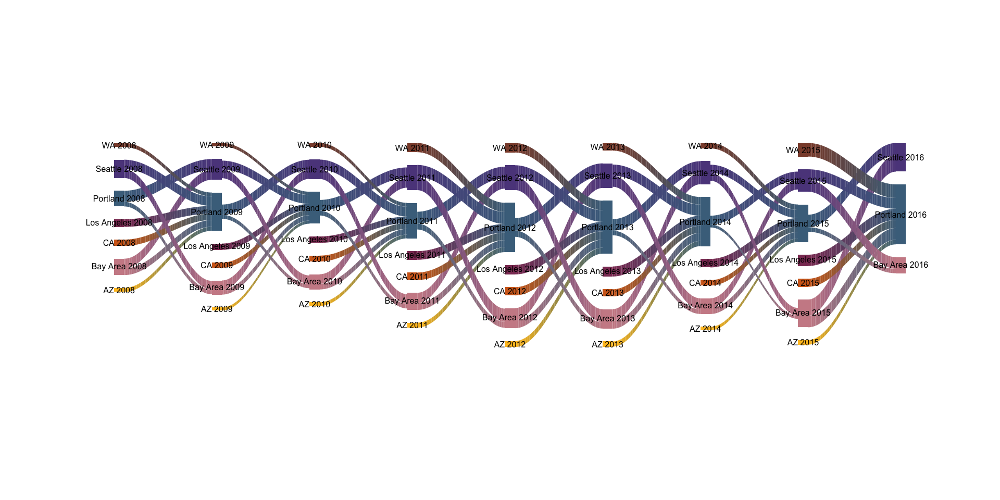
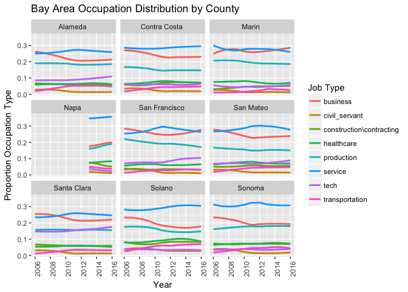

Migration, Occupation, and Real Estate in Portland
================

Abstract
========

Portland, has been experiencing large amounts of population growth in the last decade. Migration to and from portland is bound to have economic and cultural effects on the city and its residents. Additionally, it is worth wondering where people are migrating from and what their characteristics are. Our paper is essentially broken down into three components that relate to residential change in Portland. First, we describe migration, with a focus on migration from the Bay Area and Puget Sound/Seattle Area. Second we dicuss economic disparity in the Portland area, and what factors may play a role in that disparity. Third, we dicuss housing prices and changes in housing prices over the last decade in Portland. It seems that there is a high likelihood that these three components are related. These issues, both seperately and connectedly, tie into the idea of gentrification. Our hope is that this project can be continued into a more in depth study of how Portland is being gentrified.

Migration Over Time
===================

This project is focused primarily on the storyline of the migration of people from the Bay Area and Seattle to Portland. We have found, using IRS data, that the largest sources of migration across time to Portland come from these areas as well as the states of California and Washington. This data tells us about county to county migration. The largest contributors over timecan be observed in the Sankey plot below. The height of each node in this plot represents the maximum of inflow and outflow. The width of each connection represents a number of people. The plot shows the following things across time: - Inflow to Portland from the Bay Area, Puget Sound Area, Los Angeles, Greater Washington (excluding Vancouver), Greater California (excluding the Bay Area and Los Angeles), and Arizona. - Outflow from the Portland Metro Area to the Bay Area and Puget Sound Area, but not to other areas. 

    ## --------------
    ## Default style:
    ## -----------
    ## $srt
    ## [1] 0
    ## 
    ## $AZ_1
    ## $AZ_1$col
    ## [1] "goldenrod1"
    ## 
    ## $AZ_1$lty
    ## [1] 5
    ## 
    ## 
    ## $bay_area_1
    ## $bay_area_1$col
    ## [1] "lightpink3"
    ## 
    ## $bay_area_1$lty
    ## [1] 5
    ## 
    ## 
    ## $CA_1
    ## $CA_1$col
    ## [1] "chocolate"
    ## 
    ## $CA_1$lty
    ## [1] 5
    ## 
    ## 
    ## $LA_1
    ## $LA_1$col
    ## [1] "hotpink4"
    ## 
    ## $LA_1$lty
    ## [1] 5
    ## 
    ## 
    ## $puget_sound_area_1
    ## $puget_sound_area_1$col
    ## [1] "mediumpurple4"
    ## 
    ## $puget_sound_area_1$lty
    ## [1] 5
    ## 
    ## 
    ## $pdx_1
    ## $pdx_1$col
    ## [1] "skyblue4"
    ## 
    ## $pdx_1$lty
    ## [1] 5
    ## 
    ## 
    ## $WA_1
    ## $WA_1$col
    ## [1] "salmon4"
    ## 
    ## $WA_1$lty
    ## [1] 5
    ## 
    ## 
    ## $AZ_2
    ## $AZ_2$col
    ## [1] "goldenrod1"
    ## 
    ## $AZ_2$lty
    ## [1] 5
    ## 
    ## 
    ## $bay_area_2
    ## $bay_area_2$col
    ## [1] "lightpink3"
    ## 
    ## $bay_area_2$lty
    ## [1] 5
    ## 
    ## 
    ## $CA_2
    ## $CA_2$col
    ## [1] "chocolate"
    ## 
    ## $CA_2$lty
    ## [1] 5
    ## 
    ## 
    ## $LA_2
    ## $LA_2$col
    ## [1] "hotpink4"
    ## 
    ## $LA_2$lty
    ## [1] 5
    ## 
    ## 
    ## $puget_sound_area_2
    ## $puget_sound_area_2$col
    ## [1] "mediumpurple4"
    ## 
    ## $puget_sound_area_2$lty
    ## [1] 5
    ## 
    ## 
    ## $pdx_2
    ## $pdx_2$col
    ## [1] "skyblue4"
    ## 
    ## $pdx_2$lty
    ## [1] 5
    ## 
    ## 
    ## $WA_2
    ## $WA_2$col
    ## [1] "salmon4"
    ## 
    ## $WA_2$lty
    ## [1] 5
    ## 
    ## 
    ## $AZ_3
    ## $AZ_3$col
    ## [1] "goldenrod1"
    ## 
    ## $AZ_3$lty
    ## [1] 5
    ## 
    ## 
    ## $bay_area_3
    ## $bay_area_3$col
    ## [1] "lightpink3"
    ## 
    ## $bay_area_3$lty
    ## [1] 5
    ## 
    ## 
    ## $CA_3
    ## $CA_3$col
    ## [1] "chocolate"
    ## 
    ## $CA_3$lty
    ## [1] 5
    ## 
    ## 
    ## $LA_3
    ## $LA_3$col
    ## [1] "hotpink4"
    ## 
    ## $LA_3$lty
    ## [1] 5
    ## 
    ## 
    ## $puget_sound_area_3
    ## $puget_sound_area_3$col
    ## [1] "mediumpurple4"
    ## 
    ## $puget_sound_area_3$lty
    ## [1] 5
    ## 
    ## 
    ## $pdx_3
    ## $pdx_3$col
    ## [1] "skyblue4"
    ## 
    ## $pdx_3$lty
    ## [1] 5
    ## 
    ## 
    ## $WA_3
    ## $WA_3$col
    ## [1] "salmon4"
    ## 
    ## $WA_3$lty
    ## [1] 5
    ## 
    ## 
    ## $AZ_4
    ## $AZ_4$col
    ## [1] "goldenrod1"
    ## 
    ## $AZ_4$lty
    ## [1] 5
    ## 
    ## 
    ## $bay_area_4
    ## $bay_area_4$col
    ## [1] "lightpink3"
    ## 
    ## $bay_area_4$lty
    ## [1] 5
    ## 
    ## 
    ## $CA_4
    ## $CA_4$col
    ## [1] "chocolate"
    ## 
    ## $CA_4$lty
    ## [1] 5
    ## 
    ## 
    ## $LA_4
    ## $LA_4$col
    ## [1] "hotpink4"
    ## 
    ## $LA_4$lty
    ## [1] 5
    ## 
    ## 
    ## $puget_sound_area_4
    ## $puget_sound_area_4$col
    ## [1] "mediumpurple4"
    ## 
    ## $puget_sound_area_4$lty
    ## [1] 5
    ## 
    ## 
    ## $pdx_4
    ## $pdx_4$col
    ## [1] "skyblue4"
    ## 
    ## $pdx_4$lty
    ## [1] 5
    ## 
    ## 
    ## $WA_4
    ## $WA_4$col
    ## [1] "salmon4"
    ## 
    ## $WA_4$lty
    ## [1] 5
    ## 
    ## 
    ## $AZ_5
    ## $AZ_5$col
    ## [1] "goldenrod1"
    ## 
    ## $AZ_5$lty
    ## [1] 5
    ## 
    ## 
    ## $bay_area_5
    ## $bay_area_5$col
    ## [1] "lightpink3"
    ## 
    ## $bay_area_5$lty
    ## [1] 5
    ## 
    ## 
    ## $CA_5
    ## $CA_5$col
    ## [1] "chocolate"
    ## 
    ## $CA_5$lty
    ## [1] 5
    ## 
    ## 
    ## $LA_5
    ## $LA_5$col
    ## [1] "hotpink4"
    ## 
    ## $LA_5$lty
    ## [1] 5
    ## 
    ## 
    ## $puget_sound_area_5
    ## $puget_sound_area_5$col
    ## [1] "mediumpurple4"
    ## 
    ## $puget_sound_area_5$lty
    ## [1] 5
    ## 
    ## 
    ## $pdx_5
    ## $pdx_5$col
    ## [1] "skyblue4"
    ## 
    ## $pdx_5$lty
    ## [1] 5
    ## 
    ## 
    ## $WA_5
    ## $WA_5$col
    ## [1] "salmon4"
    ## 
    ## $WA_5$lty
    ## [1] 5
    ## 
    ## 
    ## $AZ_6
    ## $AZ_6$col
    ## [1] "goldenrod1"
    ## 
    ## $AZ_6$lty
    ## [1] 5
    ## 
    ## 
    ## $bay_area_6
    ## $bay_area_6$col
    ## [1] "lightpink3"
    ## 
    ## $bay_area_6$lty
    ## [1] 5
    ## 
    ## 
    ## $CA_6
    ## $CA_6$col
    ## [1] "chocolate"
    ## 
    ## $CA_6$lty
    ## [1] 5
    ## 
    ## 
    ## $LA_6
    ## $LA_6$col
    ## [1] "hotpink4"
    ## 
    ## $LA_6$lty
    ## [1] 5
    ## 
    ## 
    ## $puget_sound_area_6
    ## $puget_sound_area_6$col
    ## [1] "mediumpurple4"
    ## 
    ## $puget_sound_area_6$lty
    ## [1] 5
    ## 
    ## 
    ## $pdx_6
    ## $pdx_6$col
    ## [1] "skyblue4"
    ## 
    ## $pdx_6$lty
    ## [1] 5
    ## 
    ## 
    ## $WA_6
    ## $WA_6$col
    ## [1] "salmon4"
    ## 
    ## $WA_6$lty
    ## [1] 5
    ## 
    ## 
    ## $AZ_7
    ## $AZ_7$col
    ## [1] "goldenrod1"
    ## 
    ## $AZ_7$lty
    ## [1] 5
    ## 
    ## 
    ## $bay_area_7
    ## $bay_area_7$col
    ## [1] "lightpink3"
    ## 
    ## $bay_area_7$lty
    ## [1] 5
    ## 
    ## 
    ## $CA_7
    ## $CA_7$col
    ## [1] "chocolate"
    ## 
    ## $CA_7$lty
    ## [1] 5
    ## 
    ## 
    ## $LA_7
    ## $LA_7$col
    ## [1] "hotpink4"
    ## 
    ## $LA_7$lty
    ## [1] 5
    ## 
    ## 
    ## $puget_sound_area_7
    ## $puget_sound_area_7$col
    ## [1] "mediumpurple4"
    ## 
    ## $puget_sound_area_7$lty
    ## [1] 5
    ## 
    ## 
    ## $pdx_7
    ## $pdx_7$col
    ## [1] "skyblue4"
    ## 
    ## $pdx_7$lty
    ## [1] 5
    ## 
    ## 
    ## $WA_7
    ## $WA_7$col
    ## [1] "salmon4"
    ## 
    ## $WA_7$lty
    ## [1] 5
    ## 
    ## 
    ## $AZ_8
    ## $AZ_8$col
    ## [1] "goldenrod1"
    ## 
    ## $AZ_8$lty
    ## [1] 5
    ## 
    ## 
    ## $bay_area_8
    ## $bay_area_8$col
    ## [1] "lightpink3"
    ## 
    ## $bay_area_8$lty
    ## [1] 5
    ## 
    ## 
    ## $CA_8
    ## $CA_8$col
    ## [1] "chocolate"
    ## 
    ## $CA_8$lty
    ## [1] 5
    ## 
    ## 
    ## $LA_8
    ## $LA_8$col
    ## [1] "hotpink4"
    ## 
    ## $LA_8$lty
    ## [1] 5
    ## 
    ## 
    ## $puget_sound_area_8
    ## $puget_sound_area_8$col
    ## [1] "mediumpurple4"
    ## 
    ## $puget_sound_area_8$lty
    ## [1] 5
    ## 
    ## 
    ## $pdx_8
    ## $pdx_8$col
    ## [1] "skyblue4"
    ## 
    ## $pdx_8$lty
    ## [1] 5
    ## 
    ## 
    ## $WA_8
    ## $WA_8$col
    ## [1] "salmon4"
    ## 
    ## $WA_8$lty
    ## [1] 5
    ## 
    ## 
    ## $bay_area_9
    ## $bay_area_9$col
    ## [1] "lightpink3"
    ## 
    ## $bay_area_9$lty
    ## [1] 5
    ## 
    ## 
    ## $puget_sound_area_9
    ## $puget_sound_area_9$col
    ## [1] "mediumpurple4"
    ## 
    ## $puget_sound_area_9$lty
    ## [1] 5
    ## 
    ## 
    ## $pdx_9
    ## $pdx_9$col
    ## [1] "skyblue4"
    ## 
    ## $pdx_9$lty
    ## [1] 5
    ## 
    ## 
    ## attr(,"class")
    ## [1] "list"           "riverplotStyle"
    ## --------------
    ## [1] "checking edges"
    ## Updated styles:
    ## $AZ_1
    ## $col
    ## [1] "goldenrod1"
    ## 
    ## $lty
    ## [1] 5
    ## 
    ## $srt
    ## [1] 0
    ## 
    ## $AZ_1
    ## $AZ_1$col
    ## [1] "goldenrod1"
    ## 
    ## $AZ_1$lty
    ## [1] 5
    ## 
    ## 
    ## $bay_area_1
    ## $bay_area_1$col
    ## [1] "lightpink3"
    ## 
    ## $bay_area_1$lty
    ## [1] 5
    ## 
    ## 
    ## $CA_1
    ## $CA_1$col
    ## [1] "chocolate"
    ## 
    ## $CA_1$lty
    ## [1] 5
    ## 
    ## 
    ## $LA_1
    ## $LA_1$col
    ## [1] "hotpink4"
    ## 
    ## $LA_1$lty
    ## [1] 5
    ## 
    ## 
    ## $puget_sound_area_1
    ## $puget_sound_area_1$col
    ## [1] "mediumpurple4"
    ## 
    ## $puget_sound_area_1$lty
    ## [1] 5
    ## 
    ## 
    ## $pdx_1
    ## $pdx_1$col
    ## [1] "skyblue4"
    ## 
    ## $pdx_1$lty
    ## [1] 5
    ## 
    ## 
    ## $WA_1
    ## $WA_1$col
    ## [1] "salmon4"
    ## 
    ## $WA_1$lty
    ## [1] 5
    ## 
    ## 
    ## $AZ_2
    ## $AZ_2$col
    ## [1] "goldenrod1"
    ## 
    ## $AZ_2$lty
    ## [1] 5
    ## 
    ## 
    ## $bay_area_2
    ## $bay_area_2$col
    ## [1] "lightpink3"
    ## 
    ## $bay_area_2$lty
    ## [1] 5
    ## 
    ## 
    ## $CA_2
    ## $CA_2$col
    ## [1] "chocolate"
    ## 
    ## $CA_2$lty
    ## [1] 5
    ## 
    ## 
    ## $LA_2
    ## $LA_2$col
    ## [1] "hotpink4"
    ## 
    ## $LA_2$lty
    ## [1] 5
    ## 
    ## 
    ## $puget_sound_area_2
    ## $puget_sound_area_2$col
    ## [1] "mediumpurple4"
    ## 
    ## $puget_sound_area_2$lty
    ## [1] 5
    ## 
    ## 
    ## $pdx_2
    ## $pdx_2$col
    ## [1] "skyblue4"
    ## 
    ## $pdx_2$lty
    ## [1] 5
    ## 
    ## 
    ## $WA_2
    ## $WA_2$col
    ## [1] "salmon4"
    ## 
    ## $WA_2$lty
    ## [1] 5
    ## 
    ## 
    ## $AZ_3
    ## $AZ_3$col
    ## [1] "goldenrod1"
    ## 
    ## $AZ_3$lty
    ## [1] 5
    ## 
    ## 
    ## $bay_area_3
    ## $bay_area_3$col
    ## [1] "lightpink3"
    ## 
    ## $bay_area_3$lty
    ## [1] 5
    ## 
    ## 
    ## $CA_3
    ## $CA_3$col
    ## [1] "chocolate"
    ## 
    ## $CA_3$lty
    ## [1] 5
    ## 
    ## 
    ## $LA_3
    ## $LA_3$col
    ## [1] "hotpink4"
    ## 
    ## $LA_3$lty
    ## [1] 5
    ## 
    ## 
    ## $puget_sound_area_3
    ## $puget_sound_area_3$col
    ## [1] "mediumpurple4"
    ## 
    ## $puget_sound_area_3$lty
    ## [1] 5
    ## 
    ## 
    ## $pdx_3
    ## $pdx_3$col
    ## [1] "skyblue4"
    ## 
    ## $pdx_3$lty
    ## [1] 5
    ## 
    ## 
    ## $WA_3
    ## $WA_3$col
    ## [1] "salmon4"
    ## 
    ## $WA_3$lty
    ## [1] 5
    ## 
    ## 
    ## $AZ_4
    ## $AZ_4$col
    ## [1] "goldenrod1"
    ## 
    ## $AZ_4$lty
    ## [1] 5
    ## 
    ## 
    ## $bay_area_4
    ## $bay_area_4$col
    ## [1] "lightpink3"
    ## 
    ## $bay_area_4$lty
    ## [1] 5
    ## 
    ## 
    ## $CA_4
    ## $CA_4$col
    ## [1] "chocolate"
    ## 
    ## $CA_4$lty
    ## [1] 5
    ## 
    ## 
    ## $LA_4
    ## $LA_4$col
    ## [1] "hotpink4"
    ## 
    ## $LA_4$lty
    ## [1] 5
    ## 
    ## 
    ## $puget_sound_area_4
    ## $puget_sound_area_4$col
    ## [1] "mediumpurple4"
    ## 
    ## $puget_sound_area_4$lty
    ## [1] 5
    ## 
    ## 
    ## $pdx_4
    ## $pdx_4$col
    ## [1] "skyblue4"
    ## 
    ## $pdx_4$lty
    ## [1] 5
    ## 
    ## 
    ## $WA_4
    ## $WA_4$col
    ## [1] "salmon4"
    ## 
    ## $WA_4$lty
    ## [1] 5
    ## 
    ## 
    ## $AZ_5
    ## $AZ_5$col
    ## [1] "goldenrod1"
    ## 
    ## $AZ_5$lty
    ## [1] 5
    ## 
    ## 
    ## $bay_area_5
    ## $bay_area_5$col
    ## [1] "lightpink3"
    ## 
    ## $bay_area_5$lty
    ## [1] 5
    ## 
    ## 
    ## $CA_5
    ## $CA_5$col
    ## [1] "chocolate"
    ## 
    ## $CA_5$lty
    ## [1] 5
    ## 
    ## 
    ## $LA_5
    ## $LA_5$col
    ## [1] "hotpink4"
    ## 
    ## $LA_5$lty
    ## [1] 5
    ## 
    ## 
    ## $puget_sound_area_5
    ## $puget_sound_area_5$col
    ## [1] "mediumpurple4"
    ## 
    ## $puget_sound_area_5$lty
    ## [1] 5
    ## 
    ## 
    ## $pdx_5
    ## $pdx_5$col
    ## [1] "skyblue4"
    ## 
    ## $pdx_5$lty
    ## [1] 5
    ## 
    ## 
    ## $WA_5
    ## $WA_5$col
    ## [1] "salmon4"
    ## 
    ## $WA_5$lty
    ## [1] 5
    ## 
    ## 
    ## $AZ_6
    ## $AZ_6$col
    ## [1] "goldenrod1"
    ## 
    ## $AZ_6$lty
    ## [1] 5
    ## 
    ## 
    ## $bay_area_6
    ## $bay_area_6$col
    ## [1] "lightpink3"
    ## 
    ## $bay_area_6$lty
    ## [1] 5
    ## 
    ## 
    ## $CA_6
    ## $CA_6$col
    ## [1] "chocolate"
    ## 
    ## $CA_6$lty
    ## [1] 5
    ## 
    ## 
    ## $LA_6
    ## $LA_6$col
    ## [1] "hotpink4"
    ## 
    ## $LA_6$lty
    ## [1] 5
    ## 
    ## 
    ## $puget_sound_area_6
    ## $puget_sound_area_6$col
    ## [1] "mediumpurple4"
    ## 
    ## $puget_sound_area_6$lty
    ## [1] 5
    ## 
    ## 
    ## $pdx_6
    ## $pdx_6$col
    ## [1] "skyblue4"
    ## 
    ## $pdx_6$lty
    ## [1] 5
    ## 
    ## 
    ## $WA_6
    ## $WA_6$col
    ## [1] "salmon4"
    ## 
    ## $WA_6$lty
    ## [1] 5
    ## 
    ## 
    ## $AZ_7
    ## $AZ_7$col
    ## [1] "goldenrod1"
    ## 
    ## $AZ_7$lty
    ## [1] 5
    ## 
    ## 
    ## $bay_area_7
    ## $bay_area_7$col
    ## [1] "lightpink3"
    ## 
    ## $bay_area_7$lty
    ## [1] 5
    ## 
    ## 
    ## $CA_7
    ## $CA_7$col
    ## [1] "chocolate"
    ## 
    ## $CA_7$lty
    ## [1] 5
    ## 
    ## 
    ## $LA_7
    ## $LA_7$col
    ## [1] "hotpink4"
    ## 
    ## $LA_7$lty
    ## [1] 5
    ## 
    ## 
    ## $puget_sound_area_7
    ## $puget_sound_area_7$col
    ## [1] "mediumpurple4"
    ## 
    ## $puget_sound_area_7$lty
    ## [1] 5
    ## 
    ## 
    ## $pdx_7
    ## $pdx_7$col
    ## [1] "skyblue4"
    ## 
    ## $pdx_7$lty
    ## [1] 5
    ## 
    ## 
    ## $WA_7
    ## $WA_7$col
    ## [1] "salmon4"
    ## 
    ## $WA_7$lty
    ## [1] 5
    ## 
    ## 
    ## $AZ_8
    ## $AZ_8$col
    ## [1] "goldenrod1"
    ## 
    ## $AZ_8$lty
    ## [1] 5
    ## 
    ## 
    ## $bay_area_8
    ## $bay_area_8$col
    ## [1] "lightpink3"
    ## 
    ## $bay_area_8$lty
    ## [1] 5
    ## 
    ## 
    ## $CA_8
    ## $CA_8$col
    ## [1] "chocolate"
    ## 
    ## $CA_8$lty
    ## [1] 5
    ## 
    ## 
    ## $LA_8
    ## $LA_8$col
    ## [1] "hotpink4"
    ## 
    ## $LA_8$lty
    ## [1] 5
    ## 
    ## 
    ## $puget_sound_area_8
    ## $puget_sound_area_8$col
    ## [1] "mediumpurple4"
    ## 
    ## $puget_sound_area_8$lty
    ## [1] 5
    ## 
    ## 
    ## $pdx_8
    ## $pdx_8$col
    ## [1] "skyblue4"
    ## 
    ## $pdx_8$lty
    ## [1] 5
    ## 
    ## 
    ## $WA_8
    ## $WA_8$col
    ## [1] "salmon4"
    ## 
    ## $WA_8$lty
    ## [1] 5
    ## 
    ## 
    ## $bay_area_9
    ## $bay_area_9$col
    ## [1] "lightpink3"
    ## 
    ## $bay_area_9$lty
    ## [1] 5
    ## 
    ## 
    ## $puget_sound_area_9
    ## $puget_sound_area_9$col
    ## [1] "mediumpurple4"
    ## 
    ## $puget_sound_area_9$lty
    ## [1] 5
    ## 
    ## 
    ## $pdx_9
    ## $pdx_9$col
    ## [1] "skyblue4"
    ## 
    ## $pdx_9$lty
    ## [1] 5
    ## 
    ## 
    ## attr(,"class")
    ## [1] "list"           "riverplotStyle"
    ## 
    ## $bay_area_1
    ## $col
    ## [1] "lightpink3"
    ## 
    ## $lty
    ## [1] 5
    ## 
    ## $srt
    ## [1] 0
    ## 
    ## $AZ_1
    ## $AZ_1$col
    ## [1] "goldenrod1"
    ## 
    ## $AZ_1$lty
    ## [1] 5
    ## 
    ## 
    ## $bay_area_1
    ## $bay_area_1$col
    ## [1] "lightpink3"
    ## 
    ## $bay_area_1$lty
    ## [1] 5
    ## 
    ## 
    ## $CA_1
    ## $CA_1$col
    ## [1] "chocolate"
    ## 
    ## $CA_1$lty
    ## [1] 5
    ## 
    ## 
    ## $LA_1
    ## $LA_1$col
    ## [1] "hotpink4"
    ## 
    ## $LA_1$lty
    ## [1] 5
    ## 
    ## 
    ## $puget_sound_area_1
    ## $puget_sound_area_1$col
    ## [1] "mediumpurple4"
    ## 
    ## $puget_sound_area_1$lty
    ## [1] 5
    ## 
    ## 
    ## $pdx_1
    ## $pdx_1$col
    ## [1] "skyblue4"
    ## 
    ## $pdx_1$lty
    ## [1] 5
    ## 
    ## 
    ## $WA_1
    ## $WA_1$col
    ## [1] "salmon4"
    ## 
    ## $WA_1$lty
    ## [1] 5
    ## 
    ## 
    ## $AZ_2
    ## $AZ_2$col
    ## [1] "goldenrod1"
    ## 
    ## $AZ_2$lty
    ## [1] 5
    ## 
    ## 
    ## $bay_area_2
    ## $bay_area_2$col
    ## [1] "lightpink3"
    ## 
    ## $bay_area_2$lty
    ## [1] 5
    ## 
    ## 
    ## $CA_2
    ## $CA_2$col
    ## [1] "chocolate"
    ## 
    ## $CA_2$lty
    ## [1] 5
    ## 
    ## 
    ## $LA_2
    ## $LA_2$col
    ## [1] "hotpink4"
    ## 
    ## $LA_2$lty
    ## [1] 5
    ## 
    ## 
    ## $puget_sound_area_2
    ## $puget_sound_area_2$col
    ## [1] "mediumpurple4"
    ## 
    ## $puget_sound_area_2$lty
    ## [1] 5
    ## 
    ## 
    ## $pdx_2
    ## $pdx_2$col
    ## [1] "skyblue4"
    ## 
    ## $pdx_2$lty
    ## [1] 5
    ## 
    ## 
    ## $WA_2
    ## $WA_2$col
    ## [1] "salmon4"
    ## 
    ## $WA_2$lty
    ## [1] 5
    ## 
    ## 
    ## $AZ_3
    ## $AZ_3$col
    ## [1] "goldenrod1"
    ## 
    ## $AZ_3$lty
    ## [1] 5
    ## 
    ## 
    ## $bay_area_3
    ## $bay_area_3$col
    ## [1] "lightpink3"
    ## 
    ## $bay_area_3$lty
    ## [1] 5
    ## 
    ## 
    ## $CA_3
    ## $CA_3$col
    ## [1] "chocolate"
    ## 
    ## $CA_3$lty
    ## [1] 5
    ## 
    ## 
    ## $LA_3
    ## $LA_3$col
    ## [1] "hotpink4"
    ## 
    ## $LA_3$lty
    ## [1] 5
    ## 
    ## 
    ## $puget_sound_area_3
    ## $puget_sound_area_3$col
    ## [1] "mediumpurple4"
    ## 
    ## $puget_sound_area_3$lty
    ## [1] 5
    ## 
    ## 
    ## $pdx_3
    ## $pdx_3$col
    ## [1] "skyblue4"
    ## 
    ## $pdx_3$lty
    ## [1] 5
    ## 
    ## 
    ## $WA_3
    ## $WA_3$col
    ## [1] "salmon4"
    ## 
    ## $WA_3$lty
    ## [1] 5
    ## 
    ## 
    ## $AZ_4
    ## $AZ_4$col
    ## [1] "goldenrod1"
    ## 
    ## $AZ_4$lty
    ## [1] 5
    ## 
    ## 
    ## $bay_area_4
    ## $bay_area_4$col
    ## [1] "lightpink3"
    ## 
    ## $bay_area_4$lty
    ## [1] 5
    ## 
    ## 
    ## $CA_4
    ## $CA_4$col
    ## [1] "chocolate"
    ## 
    ## $CA_4$lty
    ## [1] 5
    ## 
    ## 
    ## $LA_4
    ## $LA_4$col
    ## [1] "hotpink4"
    ## 
    ## $LA_4$lty
    ## [1] 5
    ## 
    ## 
    ## $puget_sound_area_4
    ## $puget_sound_area_4$col
    ## [1] "mediumpurple4"
    ## 
    ## $puget_sound_area_4$lty
    ## [1] 5
    ## 
    ## 
    ## $pdx_4
    ## $pdx_4$col
    ## [1] "skyblue4"
    ## 
    ## $pdx_4$lty
    ## [1] 5
    ## 
    ## 
    ## $WA_4
    ## $WA_4$col
    ## [1] "salmon4"
    ## 
    ## $WA_4$lty
    ## [1] 5
    ## 
    ## 
    ## $AZ_5
    ## $AZ_5$col
    ## [1] "goldenrod1"
    ## 
    ## $AZ_5$lty
    ## [1] 5
    ## 
    ## 
    ## $bay_area_5
    ## $bay_area_5$col
    ## [1] "lightpink3"
    ## 
    ## $bay_area_5$lty
    ## [1] 5
    ## 
    ## 
    ## $CA_5
    ## $CA_5$col
    ## [1] "chocolate"
    ## 
    ## $CA_5$lty
    ## [1] 5
    ## 
    ## 
    ## $LA_5
    ## $LA_5$col
    ## [1] "hotpink4"
    ## 
    ## $LA_5$lty
    ## [1] 5
    ## 
    ## 
    ## $puget_sound_area_5
    ## $puget_sound_area_5$col
    ## [1] "mediumpurple4"
    ## 
    ## $puget_sound_area_5$lty
    ## [1] 5
    ## 
    ## 
    ## $pdx_5
    ## $pdx_5$col
    ## [1] "skyblue4"
    ## 
    ## $pdx_5$lty
    ## [1] 5
    ## 
    ## 
    ## $WA_5
    ## $WA_5$col
    ## [1] "salmon4"
    ## 
    ## $WA_5$lty
    ## [1] 5
    ## 
    ## 
    ## $AZ_6
    ## $AZ_6$col
    ## [1] "goldenrod1"
    ## 
    ## $AZ_6$lty
    ## [1] 5
    ## 
    ## 
    ## $bay_area_6
    ## $bay_area_6$col
    ## [1] "lightpink3"
    ## 
    ## $bay_area_6$lty
    ## [1] 5
    ## 
    ## 
    ## $CA_6
    ## $CA_6$col
    ## [1] "chocolate"
    ## 
    ## $CA_6$lty
    ## [1] 5
    ## 
    ## 
    ## $LA_6
    ## $LA_6$col
    ## [1] "hotpink4"
    ## 
    ## $LA_6$lty
    ## [1] 5
    ## 
    ## 
    ## $puget_sound_area_6
    ## $puget_sound_area_6$col
    ## [1] "mediumpurple4"
    ## 
    ## $puget_sound_area_6$lty
    ## [1] 5
    ## 
    ## 
    ## $pdx_6
    ## $pdx_6$col
    ## [1] "skyblue4"
    ## 
    ## $pdx_6$lty
    ## [1] 5
    ## 
    ## 
    ## $WA_6
    ## $WA_6$col
    ## [1] "salmon4"
    ## 
    ## $WA_6$lty
    ## [1] 5
    ## 
    ## 
    ## $AZ_7
    ## $AZ_7$col
    ## [1] "goldenrod1"
    ## 
    ## $AZ_7$lty
    ## [1] 5
    ## 
    ## 
    ## $bay_area_7
    ## $bay_area_7$col
    ## [1] "lightpink3"
    ## 
    ## $bay_area_7$lty
    ## [1] 5
    ## 
    ## 
    ## $CA_7
    ## $CA_7$col
    ## [1] "chocolate"
    ## 
    ## $CA_7$lty
    ## [1] 5
    ## 
    ## 
    ## $LA_7
    ## $LA_7$col
    ## [1] "hotpink4"
    ## 
    ## $LA_7$lty
    ## [1] 5
    ## 
    ## 
    ## $puget_sound_area_7
    ## $puget_sound_area_7$col
    ## [1] "mediumpurple4"
    ## 
    ## $puget_sound_area_7$lty
    ## [1] 5
    ## 
    ## 
    ## $pdx_7
    ## $pdx_7$col
    ## [1] "skyblue4"
    ## 
    ## $pdx_7$lty
    ## [1] 5
    ## 
    ## 
    ## $WA_7
    ## $WA_7$col
    ## [1] "salmon4"
    ## 
    ## $WA_7$lty
    ## [1] 5
    ## 
    ## 
    ## $AZ_8
    ## $AZ_8$col
    ## [1] "goldenrod1"
    ## 
    ## $AZ_8$lty
    ## [1] 5
    ## 
    ## 
    ## $bay_area_8
    ## $bay_area_8$col
    ## [1] "lightpink3"
    ## 
    ## $bay_area_8$lty
    ## [1] 5
    ## 
    ## 
    ## $CA_8
    ## $CA_8$col
    ## [1] "chocolate"
    ## 
    ## $CA_8$lty
    ## [1] 5
    ## 
    ## 
    ## $LA_8
    ## $LA_8$col
    ## [1] "hotpink4"
    ## 
    ## $LA_8$lty
    ## [1] 5
    ## 
    ## 
    ## $puget_sound_area_8
    ## $puget_sound_area_8$col
    ## [1] "mediumpurple4"
    ## 
    ## $puget_sound_area_8$lty
    ## [1] 5
    ## 
    ## 
    ## $pdx_8
    ## $pdx_8$col
    ## [1] "skyblue4"
    ## 
    ## $pdx_8$lty
    ## [1] 5
    ## 
    ## 
    ## $WA_8
    ## $WA_8$col
    ## [1] "salmon4"
    ## 
    ## $WA_8$lty
    ## [1] 5
    ## 
    ## 
    ## $bay_area_9
    ## $bay_area_9$col
    ## [1] "lightpink3"
    ## 
    ## $bay_area_9$lty
    ## [1] 5
    ## 
    ## 
    ## $puget_sound_area_9
    ## $puget_sound_area_9$col
    ## [1] "mediumpurple4"
    ## 
    ## $puget_sound_area_9$lty
    ## [1] 5
    ## 
    ## 
    ## $pdx_9
    ## $pdx_9$col
    ## [1] "skyblue4"
    ## 
    ## $pdx_9$lty
    ## [1] 5
    ## 
    ## 
    ## attr(,"class")
    ## [1] "list"           "riverplotStyle"
    ## 
    ## $CA_1
    ## $col
    ## [1] "chocolate"
    ## 
    ## $lty
    ## [1] 5
    ## 
    ## $srt
    ## [1] 0
    ## 
    ## $AZ_1
    ## $AZ_1$col
    ## [1] "goldenrod1"
    ## 
    ## $AZ_1$lty
    ## [1] 5
    ## 
    ## 
    ## $bay_area_1
    ## $bay_area_1$col
    ## [1] "lightpink3"
    ## 
    ## $bay_area_1$lty
    ## [1] 5
    ## 
    ## 
    ## $CA_1
    ## $CA_1$col
    ## [1] "chocolate"
    ## 
    ## $CA_1$lty
    ## [1] 5
    ## 
    ## 
    ## $LA_1
    ## $LA_1$col
    ## [1] "hotpink4"
    ## 
    ## $LA_1$lty
    ## [1] 5
    ## 
    ## 
    ## $puget_sound_area_1
    ## $puget_sound_area_1$col
    ## [1] "mediumpurple4"
    ## 
    ## $puget_sound_area_1$lty
    ## [1] 5
    ## 
    ## 
    ## $pdx_1
    ## $pdx_1$col
    ## [1] "skyblue4"
    ## 
    ## $pdx_1$lty
    ## [1] 5
    ## 
    ## 
    ## $WA_1
    ## $WA_1$col
    ## [1] "salmon4"
    ## 
    ## $WA_1$lty
    ## [1] 5
    ## 
    ## 
    ## $AZ_2
    ## $AZ_2$col
    ## [1] "goldenrod1"
    ## 
    ## $AZ_2$lty
    ## [1] 5
    ## 
    ## 
    ## $bay_area_2
    ## $bay_area_2$col
    ## [1] "lightpink3"
    ## 
    ## $bay_area_2$lty
    ## [1] 5
    ## 
    ## 
    ## $CA_2
    ## $CA_2$col
    ## [1] "chocolate"
    ## 
    ## $CA_2$lty
    ## [1] 5
    ## 
    ## 
    ## $LA_2
    ## $LA_2$col
    ## [1] "hotpink4"
    ## 
    ## $LA_2$lty
    ## [1] 5
    ## 
    ## 
    ## $puget_sound_area_2
    ## $puget_sound_area_2$col
    ## [1] "mediumpurple4"
    ## 
    ## $puget_sound_area_2$lty
    ## [1] 5
    ## 
    ## 
    ## $pdx_2
    ## $pdx_2$col
    ## [1] "skyblue4"
    ## 
    ## $pdx_2$lty
    ## [1] 5
    ## 
    ## 
    ## $WA_2
    ## $WA_2$col
    ## [1] "salmon4"
    ## 
    ## $WA_2$lty
    ## [1] 5
    ## 
    ## 
    ## $AZ_3
    ## $AZ_3$col
    ## [1] "goldenrod1"
    ## 
    ## $AZ_3$lty
    ## [1] 5
    ## 
    ## 
    ## $bay_area_3
    ## $bay_area_3$col
    ## [1] "lightpink3"
    ## 
    ## $bay_area_3$lty
    ## [1] 5
    ## 
    ## 
    ## $CA_3
    ## $CA_3$col
    ## [1] "chocolate"
    ## 
    ## $CA_3$lty
    ## [1] 5
    ## 
    ## 
    ## $LA_3
    ## $LA_3$col
    ## [1] "hotpink4"
    ## 
    ## $LA_3$lty
    ## [1] 5
    ## 
    ## 
    ## $puget_sound_area_3
    ## $puget_sound_area_3$col
    ## [1] "mediumpurple4"
    ## 
    ## $puget_sound_area_3$lty
    ## [1] 5
    ## 
    ## 
    ## $pdx_3
    ## $pdx_3$col
    ## [1] "skyblue4"
    ## 
    ## $pdx_3$lty
    ## [1] 5
    ## 
    ## 
    ## $WA_3
    ## $WA_3$col
    ## [1] "salmon4"
    ## 
    ## $WA_3$lty
    ## [1] 5
    ## 
    ## 
    ## $AZ_4
    ## $AZ_4$col
    ## [1] "goldenrod1"
    ## 
    ## $AZ_4$lty
    ## [1] 5
    ## 
    ## 
    ## $bay_area_4
    ## $bay_area_4$col
    ## [1] "lightpink3"
    ## 
    ## $bay_area_4$lty
    ## [1] 5
    ## 
    ## 
    ## $CA_4
    ## $CA_4$col
    ## [1] "chocolate"
    ## 
    ## $CA_4$lty
    ## [1] 5
    ## 
    ## 
    ## $LA_4
    ## $LA_4$col
    ## [1] "hotpink4"
    ## 
    ## $LA_4$lty
    ## [1] 5
    ## 
    ## 
    ## $puget_sound_area_4
    ## $puget_sound_area_4$col
    ## [1] "mediumpurple4"
    ## 
    ## $puget_sound_area_4$lty
    ## [1] 5
    ## 
    ## 
    ## $pdx_4
    ## $pdx_4$col
    ## [1] "skyblue4"
    ## 
    ## $pdx_4$lty
    ## [1] 5
    ## 
    ## 
    ## $WA_4
    ## $WA_4$col
    ## [1] "salmon4"
    ## 
    ## $WA_4$lty
    ## [1] 5
    ## 
    ## 
    ## $AZ_5
    ## $AZ_5$col
    ## [1] "goldenrod1"
    ## 
    ## $AZ_5$lty
    ## [1] 5
    ## 
    ## 
    ## $bay_area_5
    ## $bay_area_5$col
    ## [1] "lightpink3"
    ## 
    ## $bay_area_5$lty
    ## [1] 5
    ## 
    ## 
    ## $CA_5
    ## $CA_5$col
    ## [1] "chocolate"
    ## 
    ## $CA_5$lty
    ## [1] 5
    ## 
    ## 
    ## $LA_5
    ## $LA_5$col
    ## [1] "hotpink4"
    ## 
    ## $LA_5$lty
    ## [1] 5
    ## 
    ## 
    ## $puget_sound_area_5
    ## $puget_sound_area_5$col
    ## [1] "mediumpurple4"
    ## 
    ## $puget_sound_area_5$lty
    ## [1] 5
    ## 
    ## 
    ## $pdx_5
    ## $pdx_5$col
    ## [1] "skyblue4"
    ## 
    ## $pdx_5$lty
    ## [1] 5
    ## 
    ## 
    ## $WA_5
    ## $WA_5$col
    ## [1] "salmon4"
    ## 
    ## $WA_5$lty
    ## [1] 5
    ## 
    ## 
    ## $AZ_6
    ## $AZ_6$col
    ## [1] "goldenrod1"
    ## 
    ## $AZ_6$lty
    ## [1] 5
    ## 
    ## 
    ## $bay_area_6
    ## $bay_area_6$col
    ## [1] "lightpink3"
    ## 
    ## $bay_area_6$lty
    ## [1] 5
    ## 
    ## 
    ## $CA_6
    ## $CA_6$col
    ## [1] "chocolate"
    ## 
    ## $CA_6$lty
    ## [1] 5
    ## 
    ## 
    ## $LA_6
    ## $LA_6$col
    ## [1] "hotpink4"
    ## 
    ## $LA_6$lty
    ## [1] 5
    ## 
    ## 
    ## $puget_sound_area_6
    ## $puget_sound_area_6$col
    ## [1] "mediumpurple4"
    ## 
    ## $puget_sound_area_6$lty
    ## [1] 5
    ## 
    ## 
    ## $pdx_6
    ## $pdx_6$col
    ## [1] "skyblue4"
    ## 
    ## $pdx_6$lty
    ## [1] 5
    ## 
    ## 
    ## $WA_6
    ## $WA_6$col
    ## [1] "salmon4"
    ## 
    ## $WA_6$lty
    ## [1] 5
    ## 
    ## 
    ## $AZ_7
    ## $AZ_7$col
    ## [1] "goldenrod1"
    ## 
    ## $AZ_7$lty
    ## [1] 5
    ## 
    ## 
    ## $bay_area_7
    ## $bay_area_7$col
    ## [1] "lightpink3"
    ## 
    ## $bay_area_7$lty
    ## [1] 5
    ## 
    ## 
    ## $CA_7
    ## $CA_7$col
    ## [1] "chocolate"
    ## 
    ## $CA_7$lty
    ## [1] 5
    ## 
    ## 
    ## $LA_7
    ## $LA_7$col
    ## [1] "hotpink4"
    ## 
    ## $LA_7$lty
    ## [1] 5
    ## 
    ## 
    ## $puget_sound_area_7
    ## $puget_sound_area_7$col
    ## [1] "mediumpurple4"
    ## 
    ## $puget_sound_area_7$lty
    ## [1] 5
    ## 
    ## 
    ## $pdx_7
    ## $pdx_7$col
    ## [1] "skyblue4"
    ## 
    ## $pdx_7$lty
    ## [1] 5
    ## 
    ## 
    ## $WA_7
    ## $WA_7$col
    ## [1] "salmon4"
    ## 
    ## $WA_7$lty
    ## [1] 5
    ## 
    ## 
    ## $AZ_8
    ## $AZ_8$col
    ## [1] "goldenrod1"
    ## 
    ## $AZ_8$lty
    ## [1] 5
    ## 
    ## 
    ## $bay_area_8
    ## $bay_area_8$col
    ## [1] "lightpink3"
    ## 
    ## $bay_area_8$lty
    ## [1] 5
    ## 
    ## 
    ## $CA_8
    ## $CA_8$col
    ## [1] "chocolate"
    ## 
    ## $CA_8$lty
    ## [1] 5
    ## 
    ## 
    ## $LA_8
    ## $LA_8$col
    ## [1] "hotpink4"
    ## 
    ## $LA_8$lty
    ## [1] 5
    ## 
    ## 
    ## $puget_sound_area_8
    ## $puget_sound_area_8$col
    ## [1] "mediumpurple4"
    ## 
    ## $puget_sound_area_8$lty
    ## [1] 5
    ## 
    ## 
    ## $pdx_8
    ## $pdx_8$col
    ## [1] "skyblue4"
    ## 
    ## $pdx_8$lty
    ## [1] 5
    ## 
    ## 
    ## $WA_8
    ## $WA_8$col
    ## [1] "salmon4"
    ## 
    ## $WA_8$lty
    ## [1] 5
    ## 
    ## 
    ## $bay_area_9
    ## $bay_area_9$col
    ## [1] "lightpink3"
    ## 
    ## $bay_area_9$lty
    ## [1] 5
    ## 
    ## 
    ## $puget_sound_area_9
    ## $puget_sound_area_9$col
    ## [1] "mediumpurple4"
    ## 
    ## $puget_sound_area_9$lty
    ## [1] 5
    ## 
    ## 
    ## $pdx_9
    ## $pdx_9$col
    ## [1] "skyblue4"
    ## 
    ## $pdx_9$lty
    ## [1] 5
    ## 
    ## 
    ## attr(,"class")
    ## [1] "list"           "riverplotStyle"
    ## 
    ## $LA_1
    ## $col
    ## [1] "hotpink4"
    ## 
    ## $lty
    ## [1] 5
    ## 
    ## $srt
    ## [1] 0
    ## 
    ## $AZ_1
    ## $AZ_1$col
    ## [1] "goldenrod1"
    ## 
    ## $AZ_1$lty
    ## [1] 5
    ## 
    ## 
    ## $bay_area_1
    ## $bay_area_1$col
    ## [1] "lightpink3"
    ## 
    ## $bay_area_1$lty
    ## [1] 5
    ## 
    ## 
    ## $CA_1
    ## $CA_1$col
    ## [1] "chocolate"
    ## 
    ## $CA_1$lty
    ## [1] 5
    ## 
    ## 
    ## $LA_1
    ## $LA_1$col
    ## [1] "hotpink4"
    ## 
    ## $LA_1$lty
    ## [1] 5
    ## 
    ## 
    ## $puget_sound_area_1
    ## $puget_sound_area_1$col
    ## [1] "mediumpurple4"
    ## 
    ## $puget_sound_area_1$lty
    ## [1] 5
    ## 
    ## 
    ## $pdx_1
    ## $pdx_1$col
    ## [1] "skyblue4"
    ## 
    ## $pdx_1$lty
    ## [1] 5
    ## 
    ## 
    ## $WA_1
    ## $WA_1$col
    ## [1] "salmon4"
    ## 
    ## $WA_1$lty
    ## [1] 5
    ## 
    ## 
    ## $AZ_2
    ## $AZ_2$col
    ## [1] "goldenrod1"
    ## 
    ## $AZ_2$lty
    ## [1] 5
    ## 
    ## 
    ## $bay_area_2
    ## $bay_area_2$col
    ## [1] "lightpink3"
    ## 
    ## $bay_area_2$lty
    ## [1] 5
    ## 
    ## 
    ## $CA_2
    ## $CA_2$col
    ## [1] "chocolate"
    ## 
    ## $CA_2$lty
    ## [1] 5
    ## 
    ## 
    ## $LA_2
    ## $LA_2$col
    ## [1] "hotpink4"
    ## 
    ## $LA_2$lty
    ## [1] 5
    ## 
    ## 
    ## $puget_sound_area_2
    ## $puget_sound_area_2$col
    ## [1] "mediumpurple4"
    ## 
    ## $puget_sound_area_2$lty
    ## [1] 5
    ## 
    ## 
    ## $pdx_2
    ## $pdx_2$col
    ## [1] "skyblue4"
    ## 
    ## $pdx_2$lty
    ## [1] 5
    ## 
    ## 
    ## $WA_2
    ## $WA_2$col
    ## [1] "salmon4"
    ## 
    ## $WA_2$lty
    ## [1] 5
    ## 
    ## 
    ## $AZ_3
    ## $AZ_3$col
    ## [1] "goldenrod1"
    ## 
    ## $AZ_3$lty
    ## [1] 5
    ## 
    ## 
    ## $bay_area_3
    ## $bay_area_3$col
    ## [1] "lightpink3"
    ## 
    ## $bay_area_3$lty
    ## [1] 5
    ## 
    ## 
    ## $CA_3
    ## $CA_3$col
    ## [1] "chocolate"
    ## 
    ## $CA_3$lty
    ## [1] 5
    ## 
    ## 
    ## $LA_3
    ## $LA_3$col
    ## [1] "hotpink4"
    ## 
    ## $LA_3$lty
    ## [1] 5
    ## 
    ## 
    ## $puget_sound_area_3
    ## $puget_sound_area_3$col
    ## [1] "mediumpurple4"
    ## 
    ## $puget_sound_area_3$lty
    ## [1] 5
    ## 
    ## 
    ## $pdx_3
    ## $pdx_3$col
    ## [1] "skyblue4"
    ## 
    ## $pdx_3$lty
    ## [1] 5
    ## 
    ## 
    ## $WA_3
    ## $WA_3$col
    ## [1] "salmon4"
    ## 
    ## $WA_3$lty
    ## [1] 5
    ## 
    ## 
    ## $AZ_4
    ## $AZ_4$col
    ## [1] "goldenrod1"
    ## 
    ## $AZ_4$lty
    ## [1] 5
    ## 
    ## 
    ## $bay_area_4
    ## $bay_area_4$col
    ## [1] "lightpink3"
    ## 
    ## $bay_area_4$lty
    ## [1] 5
    ## 
    ## 
    ## $CA_4
    ## $CA_4$col
    ## [1] "chocolate"
    ## 
    ## $CA_4$lty
    ## [1] 5
    ## 
    ## 
    ## $LA_4
    ## $LA_4$col
    ## [1] "hotpink4"
    ## 
    ## $LA_4$lty
    ## [1] 5
    ## 
    ## 
    ## $puget_sound_area_4
    ## $puget_sound_area_4$col
    ## [1] "mediumpurple4"
    ## 
    ## $puget_sound_area_4$lty
    ## [1] 5
    ## 
    ## 
    ## $pdx_4
    ## $pdx_4$col
    ## [1] "skyblue4"
    ## 
    ## $pdx_4$lty
    ## [1] 5
    ## 
    ## 
    ## $WA_4
    ## $WA_4$col
    ## [1] "salmon4"
    ## 
    ## $WA_4$lty
    ## [1] 5
    ## 
    ## 
    ## $AZ_5
    ## $AZ_5$col
    ## [1] "goldenrod1"
    ## 
    ## $AZ_5$lty
    ## [1] 5
    ## 
    ## 
    ## $bay_area_5
    ## $bay_area_5$col
    ## [1] "lightpink3"
    ## 
    ## $bay_area_5$lty
    ## [1] 5
    ## 
    ## 
    ## $CA_5
    ## $CA_5$col
    ## [1] "chocolate"
    ## 
    ## $CA_5$lty
    ## [1] 5
    ## 
    ## 
    ## $LA_5
    ## $LA_5$col
    ## [1] "hotpink4"
    ## 
    ## $LA_5$lty
    ## [1] 5
    ## 
    ## 
    ## $puget_sound_area_5
    ## $puget_sound_area_5$col
    ## [1] "mediumpurple4"
    ## 
    ## $puget_sound_area_5$lty
    ## [1] 5
    ## 
    ## 
    ## $pdx_5
    ## $pdx_5$col
    ## [1] "skyblue4"
    ## 
    ## $pdx_5$lty
    ## [1] 5
    ## 
    ## 
    ## $WA_5
    ## $WA_5$col
    ## [1] "salmon4"
    ## 
    ## $WA_5$lty
    ## [1] 5
    ## 
    ## 
    ## $AZ_6
    ## $AZ_6$col
    ## [1] "goldenrod1"
    ## 
    ## $AZ_6$lty
    ## [1] 5
    ## 
    ## 
    ## $bay_area_6
    ## $bay_area_6$col
    ## [1] "lightpink3"
    ## 
    ## $bay_area_6$lty
    ## [1] 5
    ## 
    ## 
    ## $CA_6
    ## $CA_6$col
    ## [1] "chocolate"
    ## 
    ## $CA_6$lty
    ## [1] 5
    ## 
    ## 
    ## $LA_6
    ## $LA_6$col
    ## [1] "hotpink4"
    ## 
    ## $LA_6$lty
    ## [1] 5
    ## 
    ## 
    ## $puget_sound_area_6
    ## $puget_sound_area_6$col
    ## [1] "mediumpurple4"
    ## 
    ## $puget_sound_area_6$lty
    ## [1] 5
    ## 
    ## 
    ## $pdx_6
    ## $pdx_6$col
    ## [1] "skyblue4"
    ## 
    ## $pdx_6$lty
    ## [1] 5
    ## 
    ## 
    ## $WA_6
    ## $WA_6$col
    ## [1] "salmon4"
    ## 
    ## $WA_6$lty
    ## [1] 5
    ## 
    ## 
    ## $AZ_7
    ## $AZ_7$col
    ## [1] "goldenrod1"
    ## 
    ## $AZ_7$lty
    ## [1] 5
    ## 
    ## 
    ## $bay_area_7
    ## $bay_area_7$col
    ## [1] "lightpink3"
    ## 
    ## $bay_area_7$lty
    ## [1] 5
    ## 
    ## 
    ## $CA_7
    ## $CA_7$col
    ## [1] "chocolate"
    ## 
    ## $CA_7$lty
    ## [1] 5
    ## 
    ## 
    ## $LA_7
    ## $LA_7$col
    ## [1] "hotpink4"
    ## 
    ## $LA_7$lty
    ## [1] 5
    ## 
    ## 
    ## $puget_sound_area_7
    ## $puget_sound_area_7$col
    ## [1] "mediumpurple4"
    ## 
    ## $puget_sound_area_7$lty
    ## [1] 5
    ## 
    ## 
    ## $pdx_7
    ## $pdx_7$col
    ## [1] "skyblue4"
    ## 
    ## $pdx_7$lty
    ## [1] 5
    ## 
    ## 
    ## $WA_7
    ## $WA_7$col
    ## [1] "salmon4"
    ## 
    ## $WA_7$lty
    ## [1] 5
    ## 
    ## 
    ## $AZ_8
    ## $AZ_8$col
    ## [1] "goldenrod1"
    ## 
    ## $AZ_8$lty
    ## [1] 5
    ## 
    ## 
    ## $bay_area_8
    ## $bay_area_8$col
    ## [1] "lightpink3"
    ## 
    ## $bay_area_8$lty
    ## [1] 5
    ## 
    ## 
    ## $CA_8
    ## $CA_8$col
    ## [1] "chocolate"
    ## 
    ## $CA_8$lty
    ## [1] 5
    ## 
    ## 
    ## $LA_8
    ## $LA_8$col
    ## [1] "hotpink4"
    ## 
    ## $LA_8$lty
    ## [1] 5
    ## 
    ## 
    ## $puget_sound_area_8
    ## $puget_sound_area_8$col
    ## [1] "mediumpurple4"
    ## 
    ## $puget_sound_area_8$lty
    ## [1] 5
    ## 
    ## 
    ## $pdx_8
    ## $pdx_8$col
    ## [1] "skyblue4"
    ## 
    ## $pdx_8$lty
    ## [1] 5
    ## 
    ## 
    ## $WA_8
    ## $WA_8$col
    ## [1] "salmon4"
    ## 
    ## $WA_8$lty
    ## [1] 5
    ## 
    ## 
    ## $bay_area_9
    ## $bay_area_9$col
    ## [1] "lightpink3"
    ## 
    ## $bay_area_9$lty
    ## [1] 5
    ## 
    ## 
    ## $puget_sound_area_9
    ## $puget_sound_area_9$col
    ## [1] "mediumpurple4"
    ## 
    ## $puget_sound_area_9$lty
    ## [1] 5
    ## 
    ## 
    ## $pdx_9
    ## $pdx_9$col
    ## [1] "skyblue4"
    ## 
    ## $pdx_9$lty
    ## [1] 5
    ## 
    ## 
    ## attr(,"class")
    ## [1] "list"           "riverplotStyle"
    ## 
    ## $puget_sound_area_1
    ## $col
    ## [1] "mediumpurple4"
    ## 
    ## $lty
    ## [1] 5
    ## 
    ## $srt
    ## [1] 0
    ## 
    ## $AZ_1
    ## $AZ_1$col
    ## [1] "goldenrod1"
    ## 
    ## $AZ_1$lty
    ## [1] 5
    ## 
    ## 
    ## $bay_area_1
    ## $bay_area_1$col
    ## [1] "lightpink3"
    ## 
    ## $bay_area_1$lty
    ## [1] 5
    ## 
    ## 
    ## $CA_1
    ## $CA_1$col
    ## [1] "chocolate"
    ## 
    ## $CA_1$lty
    ## [1] 5
    ## 
    ## 
    ## $LA_1
    ## $LA_1$col
    ## [1] "hotpink4"
    ## 
    ## $LA_1$lty
    ## [1] 5
    ## 
    ## 
    ## $puget_sound_area_1
    ## $puget_sound_area_1$col
    ## [1] "mediumpurple4"
    ## 
    ## $puget_sound_area_1$lty
    ## [1] 5
    ## 
    ## 
    ## $pdx_1
    ## $pdx_1$col
    ## [1] "skyblue4"
    ## 
    ## $pdx_1$lty
    ## [1] 5
    ## 
    ## 
    ## $WA_1
    ## $WA_1$col
    ## [1] "salmon4"
    ## 
    ## $WA_1$lty
    ## [1] 5
    ## 
    ## 
    ## $AZ_2
    ## $AZ_2$col
    ## [1] "goldenrod1"
    ## 
    ## $AZ_2$lty
    ## [1] 5
    ## 
    ## 
    ## $bay_area_2
    ## $bay_area_2$col
    ## [1] "lightpink3"
    ## 
    ## $bay_area_2$lty
    ## [1] 5
    ## 
    ## 
    ## $CA_2
    ## $CA_2$col
    ## [1] "chocolate"
    ## 
    ## $CA_2$lty
    ## [1] 5
    ## 
    ## 
    ## $LA_2
    ## $LA_2$col
    ## [1] "hotpink4"
    ## 
    ## $LA_2$lty
    ## [1] 5
    ## 
    ## 
    ## $puget_sound_area_2
    ## $puget_sound_area_2$col
    ## [1] "mediumpurple4"
    ## 
    ## $puget_sound_area_2$lty
    ## [1] 5
    ## 
    ## 
    ## $pdx_2
    ## $pdx_2$col
    ## [1] "skyblue4"
    ## 
    ## $pdx_2$lty
    ## [1] 5
    ## 
    ## 
    ## $WA_2
    ## $WA_2$col
    ## [1] "salmon4"
    ## 
    ## $WA_2$lty
    ## [1] 5
    ## 
    ## 
    ## $AZ_3
    ## $AZ_3$col
    ## [1] "goldenrod1"
    ## 
    ## $AZ_3$lty
    ## [1] 5
    ## 
    ## 
    ## $bay_area_3
    ## $bay_area_3$col
    ## [1] "lightpink3"
    ## 
    ## $bay_area_3$lty
    ## [1] 5
    ## 
    ## 
    ## $CA_3
    ## $CA_3$col
    ## [1] "chocolate"
    ## 
    ## $CA_3$lty
    ## [1] 5
    ## 
    ## 
    ## $LA_3
    ## $LA_3$col
    ## [1] "hotpink4"
    ## 
    ## $LA_3$lty
    ## [1] 5
    ## 
    ## 
    ## $puget_sound_area_3
    ## $puget_sound_area_3$col
    ## [1] "mediumpurple4"
    ## 
    ## $puget_sound_area_3$lty
    ## [1] 5
    ## 
    ## 
    ## $pdx_3
    ## $pdx_3$col
    ## [1] "skyblue4"
    ## 
    ## $pdx_3$lty
    ## [1] 5
    ## 
    ## 
    ## $WA_3
    ## $WA_3$col
    ## [1] "salmon4"
    ## 
    ## $WA_3$lty
    ## [1] 5
    ## 
    ## 
    ## $AZ_4
    ## $AZ_4$col
    ## [1] "goldenrod1"
    ## 
    ## $AZ_4$lty
    ## [1] 5
    ## 
    ## 
    ## $bay_area_4
    ## $bay_area_4$col
    ## [1] "lightpink3"
    ## 
    ## $bay_area_4$lty
    ## [1] 5
    ## 
    ## 
    ## $CA_4
    ## $CA_4$col
    ## [1] "chocolate"
    ## 
    ## $CA_4$lty
    ## [1] 5
    ## 
    ## 
    ## $LA_4
    ## $LA_4$col
    ## [1] "hotpink4"
    ## 
    ## $LA_4$lty
    ## [1] 5
    ## 
    ## 
    ## $puget_sound_area_4
    ## $puget_sound_area_4$col
    ## [1] "mediumpurple4"
    ## 
    ## $puget_sound_area_4$lty
    ## [1] 5
    ## 
    ## 
    ## $pdx_4
    ## $pdx_4$col
    ## [1] "skyblue4"
    ## 
    ## $pdx_4$lty
    ## [1] 5
    ## 
    ## 
    ## $WA_4
    ## $WA_4$col
    ## [1] "salmon4"
    ## 
    ## $WA_4$lty
    ## [1] 5
    ## 
    ## 
    ## $AZ_5
    ## $AZ_5$col
    ## [1] "goldenrod1"
    ## 
    ## $AZ_5$lty
    ## [1] 5
    ## 
    ## 
    ## $bay_area_5
    ## $bay_area_5$col
    ## [1] "lightpink3"
    ## 
    ## $bay_area_5$lty
    ## [1] 5
    ## 
    ## 
    ## $CA_5
    ## $CA_5$col
    ## [1] "chocolate"
    ## 
    ## $CA_5$lty
    ## [1] 5
    ## 
    ## 
    ## $LA_5
    ## $LA_5$col
    ## [1] "hotpink4"
    ## 
    ## $LA_5$lty
    ## [1] 5
    ## 
    ## 
    ## $puget_sound_area_5
    ## $puget_sound_area_5$col
    ## [1] "mediumpurple4"
    ## 
    ## $puget_sound_area_5$lty
    ## [1] 5
    ## 
    ## 
    ## $pdx_5
    ## $pdx_5$col
    ## [1] "skyblue4"
    ## 
    ## $pdx_5$lty
    ## [1] 5
    ## 
    ## 
    ## $WA_5
    ## $WA_5$col
    ## [1] "salmon4"
    ## 
    ## $WA_5$lty
    ## [1] 5
    ## 
    ## 
    ## $AZ_6
    ## $AZ_6$col
    ## [1] "goldenrod1"
    ## 
    ## $AZ_6$lty
    ## [1] 5
    ## 
    ## 
    ## $bay_area_6
    ## $bay_area_6$col
    ## [1] "lightpink3"
    ## 
    ## $bay_area_6$lty
    ## [1] 5
    ## 
    ## 
    ## $CA_6
    ## $CA_6$col
    ## [1] "chocolate"
    ## 
    ## $CA_6$lty
    ## [1] 5
    ## 
    ## 
    ## $LA_6
    ## $LA_6$col
    ## [1] "hotpink4"
    ## 
    ## $LA_6$lty
    ## [1] 5
    ## 
    ## 
    ## $puget_sound_area_6
    ## $puget_sound_area_6$col
    ## [1] "mediumpurple4"
    ## 
    ## $puget_sound_area_6$lty
    ## [1] 5
    ## 
    ## 
    ## $pdx_6
    ## $pdx_6$col
    ## [1] "skyblue4"
    ## 
    ## $pdx_6$lty
    ## [1] 5
    ## 
    ## 
    ## $WA_6
    ## $WA_6$col
    ## [1] "salmon4"
    ## 
    ## $WA_6$lty
    ## [1] 5
    ## 
    ## 
    ## $AZ_7
    ## $AZ_7$col
    ## [1] "goldenrod1"
    ## 
    ## $AZ_7$lty
    ## [1] 5
    ## 
    ## 
    ## $bay_area_7
    ## $bay_area_7$col
    ## [1] "lightpink3"
    ## 
    ## $bay_area_7$lty
    ## [1] 5
    ## 
    ## 
    ## $CA_7
    ## $CA_7$col
    ## [1] "chocolate"
    ## 
    ## $CA_7$lty
    ## [1] 5
    ## 
    ## 
    ## $LA_7
    ## $LA_7$col
    ## [1] "hotpink4"
    ## 
    ## $LA_7$lty
    ## [1] 5
    ## 
    ## 
    ## $puget_sound_area_7
    ## $puget_sound_area_7$col
    ## [1] "mediumpurple4"
    ## 
    ## $puget_sound_area_7$lty
    ## [1] 5
    ## 
    ## 
    ## $pdx_7
    ## $pdx_7$col
    ## [1] "skyblue4"
    ## 
    ## $pdx_7$lty
    ## [1] 5
    ## 
    ## 
    ## $WA_7
    ## $WA_7$col
    ## [1] "salmon4"
    ## 
    ## $WA_7$lty
    ## [1] 5
    ## 
    ## 
    ## $AZ_8
    ## $AZ_8$col
    ## [1] "goldenrod1"
    ## 
    ## $AZ_8$lty
    ## [1] 5
    ## 
    ## 
    ## $bay_area_8
    ## $bay_area_8$col
    ## [1] "lightpink3"
    ## 
    ## $bay_area_8$lty
    ## [1] 5
    ## 
    ## 
    ## $CA_8
    ## $CA_8$col
    ## [1] "chocolate"
    ## 
    ## $CA_8$lty
    ## [1] 5
    ## 
    ## 
    ## $LA_8
    ## $LA_8$col
    ## [1] "hotpink4"
    ## 
    ## $LA_8$lty
    ## [1] 5
    ## 
    ## 
    ## $puget_sound_area_8
    ## $puget_sound_area_8$col
    ## [1] "mediumpurple4"
    ## 
    ## $puget_sound_area_8$lty
    ## [1] 5
    ## 
    ## 
    ## $pdx_8
    ## $pdx_8$col
    ## [1] "skyblue4"
    ## 
    ## $pdx_8$lty
    ## [1] 5
    ## 
    ## 
    ## $WA_8
    ## $WA_8$col
    ## [1] "salmon4"
    ## 
    ## $WA_8$lty
    ## [1] 5
    ## 
    ## 
    ## $bay_area_9
    ## $bay_area_9$col
    ## [1] "lightpink3"
    ## 
    ## $bay_area_9$lty
    ## [1] 5
    ## 
    ## 
    ## $puget_sound_area_9
    ## $puget_sound_area_9$col
    ## [1] "mediumpurple4"
    ## 
    ## $puget_sound_area_9$lty
    ## [1] 5
    ## 
    ## 
    ## $pdx_9
    ## $pdx_9$col
    ## [1] "skyblue4"
    ## 
    ## $pdx_9$lty
    ## [1] 5
    ## 
    ## 
    ## attr(,"class")
    ## [1] "list"           "riverplotStyle"
    ## 
    ## $pdx_1
    ## $col
    ## [1] "skyblue4"
    ## 
    ## $lty
    ## [1] 5
    ## 
    ## $srt
    ## [1] 0
    ## 
    ## $AZ_1
    ## $AZ_1$col
    ## [1] "goldenrod1"
    ## 
    ## $AZ_1$lty
    ## [1] 5
    ## 
    ## 
    ## $bay_area_1
    ## $bay_area_1$col
    ## [1] "lightpink3"
    ## 
    ## $bay_area_1$lty
    ## [1] 5
    ## 
    ## 
    ## $CA_1
    ## $CA_1$col
    ## [1] "chocolate"
    ## 
    ## $CA_1$lty
    ## [1] 5
    ## 
    ## 
    ## $LA_1
    ## $LA_1$col
    ## [1] "hotpink4"
    ## 
    ## $LA_1$lty
    ## [1] 5
    ## 
    ## 
    ## $puget_sound_area_1
    ## $puget_sound_area_1$col
    ## [1] "mediumpurple4"
    ## 
    ## $puget_sound_area_1$lty
    ## [1] 5
    ## 
    ## 
    ## $pdx_1
    ## $pdx_1$col
    ## [1] "skyblue4"
    ## 
    ## $pdx_1$lty
    ## [1] 5
    ## 
    ## 
    ## $WA_1
    ## $WA_1$col
    ## [1] "salmon4"
    ## 
    ## $WA_1$lty
    ## [1] 5
    ## 
    ## 
    ## $AZ_2
    ## $AZ_2$col
    ## [1] "goldenrod1"
    ## 
    ## $AZ_2$lty
    ## [1] 5
    ## 
    ## 
    ## $bay_area_2
    ## $bay_area_2$col
    ## [1] "lightpink3"
    ## 
    ## $bay_area_2$lty
    ## [1] 5
    ## 
    ## 
    ## $CA_2
    ## $CA_2$col
    ## [1] "chocolate"
    ## 
    ## $CA_2$lty
    ## [1] 5
    ## 
    ## 
    ## $LA_2
    ## $LA_2$col
    ## [1] "hotpink4"
    ## 
    ## $LA_2$lty
    ## [1] 5
    ## 
    ## 
    ## $puget_sound_area_2
    ## $puget_sound_area_2$col
    ## [1] "mediumpurple4"
    ## 
    ## $puget_sound_area_2$lty
    ## [1] 5
    ## 
    ## 
    ## $pdx_2
    ## $pdx_2$col
    ## [1] "skyblue4"
    ## 
    ## $pdx_2$lty
    ## [1] 5
    ## 
    ## 
    ## $WA_2
    ## $WA_2$col
    ## [1] "salmon4"
    ## 
    ## $WA_2$lty
    ## [1] 5
    ## 
    ## 
    ## $AZ_3
    ## $AZ_3$col
    ## [1] "goldenrod1"
    ## 
    ## $AZ_3$lty
    ## [1] 5
    ## 
    ## 
    ## $bay_area_3
    ## $bay_area_3$col
    ## [1] "lightpink3"
    ## 
    ## $bay_area_3$lty
    ## [1] 5
    ## 
    ## 
    ## $CA_3
    ## $CA_3$col
    ## [1] "chocolate"
    ## 
    ## $CA_3$lty
    ## [1] 5
    ## 
    ## 
    ## $LA_3
    ## $LA_3$col
    ## [1] "hotpink4"
    ## 
    ## $LA_3$lty
    ## [1] 5
    ## 
    ## 
    ## $puget_sound_area_3
    ## $puget_sound_area_3$col
    ## [1] "mediumpurple4"
    ## 
    ## $puget_sound_area_3$lty
    ## [1] 5
    ## 
    ## 
    ## $pdx_3
    ## $pdx_3$col
    ## [1] "skyblue4"
    ## 
    ## $pdx_3$lty
    ## [1] 5
    ## 
    ## 
    ## $WA_3
    ## $WA_3$col
    ## [1] "salmon4"
    ## 
    ## $WA_3$lty
    ## [1] 5
    ## 
    ## 
    ## $AZ_4
    ## $AZ_4$col
    ## [1] "goldenrod1"
    ## 
    ## $AZ_4$lty
    ## [1] 5
    ## 
    ## 
    ## $bay_area_4
    ## $bay_area_4$col
    ## [1] "lightpink3"
    ## 
    ## $bay_area_4$lty
    ## [1] 5
    ## 
    ## 
    ## $CA_4
    ## $CA_4$col
    ## [1] "chocolate"
    ## 
    ## $CA_4$lty
    ## [1] 5
    ## 
    ## 
    ## $LA_4
    ## $LA_4$col
    ## [1] "hotpink4"
    ## 
    ## $LA_4$lty
    ## [1] 5
    ## 
    ## 
    ## $puget_sound_area_4
    ## $puget_sound_area_4$col
    ## [1] "mediumpurple4"
    ## 
    ## $puget_sound_area_4$lty
    ## [1] 5
    ## 
    ## 
    ## $pdx_4
    ## $pdx_4$col
    ## [1] "skyblue4"
    ## 
    ## $pdx_4$lty
    ## [1] 5
    ## 
    ## 
    ## $WA_4
    ## $WA_4$col
    ## [1] "salmon4"
    ## 
    ## $WA_4$lty
    ## [1] 5
    ## 
    ## 
    ## $AZ_5
    ## $AZ_5$col
    ## [1] "goldenrod1"
    ## 
    ## $AZ_5$lty
    ## [1] 5
    ## 
    ## 
    ## $bay_area_5
    ## $bay_area_5$col
    ## [1] "lightpink3"
    ## 
    ## $bay_area_5$lty
    ## [1] 5
    ## 
    ## 
    ## $CA_5
    ## $CA_5$col
    ## [1] "chocolate"
    ## 
    ## $CA_5$lty
    ## [1] 5
    ## 
    ## 
    ## $LA_5
    ## $LA_5$col
    ## [1] "hotpink4"
    ## 
    ## $LA_5$lty
    ## [1] 5
    ## 
    ## 
    ## $puget_sound_area_5
    ## $puget_sound_area_5$col
    ## [1] "mediumpurple4"
    ## 
    ## $puget_sound_area_5$lty
    ## [1] 5
    ## 
    ## 
    ## $pdx_5
    ## $pdx_5$col
    ## [1] "skyblue4"
    ## 
    ## $pdx_5$lty
    ## [1] 5
    ## 
    ## 
    ## $WA_5
    ## $WA_5$col
    ## [1] "salmon4"
    ## 
    ## $WA_5$lty
    ## [1] 5
    ## 
    ## 
    ## $AZ_6
    ## $AZ_6$col
    ## [1] "goldenrod1"
    ## 
    ## $AZ_6$lty
    ## [1] 5
    ## 
    ## 
    ## $bay_area_6
    ## $bay_area_6$col
    ## [1] "lightpink3"
    ## 
    ## $bay_area_6$lty
    ## [1] 5
    ## 
    ## 
    ## $CA_6
    ## $CA_6$col
    ## [1] "chocolate"
    ## 
    ## $CA_6$lty
    ## [1] 5
    ## 
    ## 
    ## $LA_6
    ## $LA_6$col
    ## [1] "hotpink4"
    ## 
    ## $LA_6$lty
    ## [1] 5
    ## 
    ## 
    ## $puget_sound_area_6
    ## $puget_sound_area_6$col
    ## [1] "mediumpurple4"
    ## 
    ## $puget_sound_area_6$lty
    ## [1] 5
    ## 
    ## 
    ## $pdx_6
    ## $pdx_6$col
    ## [1] "skyblue4"
    ## 
    ## $pdx_6$lty
    ## [1] 5
    ## 
    ## 
    ## $WA_6
    ## $WA_6$col
    ## [1] "salmon4"
    ## 
    ## $WA_6$lty
    ## [1] 5
    ## 
    ## 
    ## $AZ_7
    ## $AZ_7$col
    ## [1] "goldenrod1"
    ## 
    ## $AZ_7$lty
    ## [1] 5
    ## 
    ## 
    ## $bay_area_7
    ## $bay_area_7$col
    ## [1] "lightpink3"
    ## 
    ## $bay_area_7$lty
    ## [1] 5
    ## 
    ## 
    ## $CA_7
    ## $CA_7$col
    ## [1] "chocolate"
    ## 
    ## $CA_7$lty
    ## [1] 5
    ## 
    ## 
    ## $LA_7
    ## $LA_7$col
    ## [1] "hotpink4"
    ## 
    ## $LA_7$lty
    ## [1] 5
    ## 
    ## 
    ## $puget_sound_area_7
    ## $puget_sound_area_7$col
    ## [1] "mediumpurple4"
    ## 
    ## $puget_sound_area_7$lty
    ## [1] 5
    ## 
    ## 
    ## $pdx_7
    ## $pdx_7$col
    ## [1] "skyblue4"
    ## 
    ## $pdx_7$lty
    ## [1] 5
    ## 
    ## 
    ## $WA_7
    ## $WA_7$col
    ## [1] "salmon4"
    ## 
    ## $WA_7$lty
    ## [1] 5
    ## 
    ## 
    ## $AZ_8
    ## $AZ_8$col
    ## [1] "goldenrod1"
    ## 
    ## $AZ_8$lty
    ## [1] 5
    ## 
    ## 
    ## $bay_area_8
    ## $bay_area_8$col
    ## [1] "lightpink3"
    ## 
    ## $bay_area_8$lty
    ## [1] 5
    ## 
    ## 
    ## $CA_8
    ## $CA_8$col
    ## [1] "chocolate"
    ## 
    ## $CA_8$lty
    ## [1] 5
    ## 
    ## 
    ## $LA_8
    ## $LA_8$col
    ## [1] "hotpink4"
    ## 
    ## $LA_8$lty
    ## [1] 5
    ## 
    ## 
    ## $puget_sound_area_8
    ## $puget_sound_area_8$col
    ## [1] "mediumpurple4"
    ## 
    ## $puget_sound_area_8$lty
    ## [1] 5
    ## 
    ## 
    ## $pdx_8
    ## $pdx_8$col
    ## [1] "skyblue4"
    ## 
    ## $pdx_8$lty
    ## [1] 5
    ## 
    ## 
    ## $WA_8
    ## $WA_8$col
    ## [1] "salmon4"
    ## 
    ## $WA_8$lty
    ## [1] 5
    ## 
    ## 
    ## $bay_area_9
    ## $bay_area_9$col
    ## [1] "lightpink3"
    ## 
    ## $bay_area_9$lty
    ## [1] 5
    ## 
    ## 
    ## $puget_sound_area_9
    ## $puget_sound_area_9$col
    ## [1] "mediumpurple4"
    ## 
    ## $puget_sound_area_9$lty
    ## [1] 5
    ## 
    ## 
    ## $pdx_9
    ## $pdx_9$col
    ## [1] "skyblue4"
    ## 
    ## $pdx_9$lty
    ## [1] 5
    ## 
    ## 
    ## attr(,"class")
    ## [1] "list"           "riverplotStyle"
    ## 
    ## $WA_1
    ## $col
    ## [1] "salmon4"
    ## 
    ## $lty
    ## [1] 5
    ## 
    ## $srt
    ## [1] 0
    ## 
    ## $AZ_1
    ## $AZ_1$col
    ## [1] "goldenrod1"
    ## 
    ## $AZ_1$lty
    ## [1] 5
    ## 
    ## 
    ## $bay_area_1
    ## $bay_area_1$col
    ## [1] "lightpink3"
    ## 
    ## $bay_area_1$lty
    ## [1] 5
    ## 
    ## 
    ## $CA_1
    ## $CA_1$col
    ## [1] "chocolate"
    ## 
    ## $CA_1$lty
    ## [1] 5
    ## 
    ## 
    ## $LA_1
    ## $LA_1$col
    ## [1] "hotpink4"
    ## 
    ## $LA_1$lty
    ## [1] 5
    ## 
    ## 
    ## $puget_sound_area_1
    ## $puget_sound_area_1$col
    ## [1] "mediumpurple4"
    ## 
    ## $puget_sound_area_1$lty
    ## [1] 5
    ## 
    ## 
    ## $pdx_1
    ## $pdx_1$col
    ## [1] "skyblue4"
    ## 
    ## $pdx_1$lty
    ## [1] 5
    ## 
    ## 
    ## $WA_1
    ## $WA_1$col
    ## [1] "salmon4"
    ## 
    ## $WA_1$lty
    ## [1] 5
    ## 
    ## 
    ## $AZ_2
    ## $AZ_2$col
    ## [1] "goldenrod1"
    ## 
    ## $AZ_2$lty
    ## [1] 5
    ## 
    ## 
    ## $bay_area_2
    ## $bay_area_2$col
    ## [1] "lightpink3"
    ## 
    ## $bay_area_2$lty
    ## [1] 5
    ## 
    ## 
    ## $CA_2
    ## $CA_2$col
    ## [1] "chocolate"
    ## 
    ## $CA_2$lty
    ## [1] 5
    ## 
    ## 
    ## $LA_2
    ## $LA_2$col
    ## [1] "hotpink4"
    ## 
    ## $LA_2$lty
    ## [1] 5
    ## 
    ## 
    ## $puget_sound_area_2
    ## $puget_sound_area_2$col
    ## [1] "mediumpurple4"
    ## 
    ## $puget_sound_area_2$lty
    ## [1] 5
    ## 
    ## 
    ## $pdx_2
    ## $pdx_2$col
    ## [1] "skyblue4"
    ## 
    ## $pdx_2$lty
    ## [1] 5
    ## 
    ## 
    ## $WA_2
    ## $WA_2$col
    ## [1] "salmon4"
    ## 
    ## $WA_2$lty
    ## [1] 5
    ## 
    ## 
    ## $AZ_3
    ## $AZ_3$col
    ## [1] "goldenrod1"
    ## 
    ## $AZ_3$lty
    ## [1] 5
    ## 
    ## 
    ## $bay_area_3
    ## $bay_area_3$col
    ## [1] "lightpink3"
    ## 
    ## $bay_area_3$lty
    ## [1] 5
    ## 
    ## 
    ## $CA_3
    ## $CA_3$col
    ## [1] "chocolate"
    ## 
    ## $CA_3$lty
    ## [1] 5
    ## 
    ## 
    ## $LA_3
    ## $LA_3$col
    ## [1] "hotpink4"
    ## 
    ## $LA_3$lty
    ## [1] 5
    ## 
    ## 
    ## $puget_sound_area_3
    ## $puget_sound_area_3$col
    ## [1] "mediumpurple4"
    ## 
    ## $puget_sound_area_3$lty
    ## [1] 5
    ## 
    ## 
    ## $pdx_3
    ## $pdx_3$col
    ## [1] "skyblue4"
    ## 
    ## $pdx_3$lty
    ## [1] 5
    ## 
    ## 
    ## $WA_3
    ## $WA_3$col
    ## [1] "salmon4"
    ## 
    ## $WA_3$lty
    ## [1] 5
    ## 
    ## 
    ## $AZ_4
    ## $AZ_4$col
    ## [1] "goldenrod1"
    ## 
    ## $AZ_4$lty
    ## [1] 5
    ## 
    ## 
    ## $bay_area_4
    ## $bay_area_4$col
    ## [1] "lightpink3"
    ## 
    ## $bay_area_4$lty
    ## [1] 5
    ## 
    ## 
    ## $CA_4
    ## $CA_4$col
    ## [1] "chocolate"
    ## 
    ## $CA_4$lty
    ## [1] 5
    ## 
    ## 
    ## $LA_4
    ## $LA_4$col
    ## [1] "hotpink4"
    ## 
    ## $LA_4$lty
    ## [1] 5
    ## 
    ## 
    ## $puget_sound_area_4
    ## $puget_sound_area_4$col
    ## [1] "mediumpurple4"
    ## 
    ## $puget_sound_area_4$lty
    ## [1] 5
    ## 
    ## 
    ## $pdx_4
    ## $pdx_4$col
    ## [1] "skyblue4"
    ## 
    ## $pdx_4$lty
    ## [1] 5
    ## 
    ## 
    ## $WA_4
    ## $WA_4$col
    ## [1] "salmon4"
    ## 
    ## $WA_4$lty
    ## [1] 5
    ## 
    ## 
    ## $AZ_5
    ## $AZ_5$col
    ## [1] "goldenrod1"
    ## 
    ## $AZ_5$lty
    ## [1] 5
    ## 
    ## 
    ## $bay_area_5
    ## $bay_area_5$col
    ## [1] "lightpink3"
    ## 
    ## $bay_area_5$lty
    ## [1] 5
    ## 
    ## 
    ## $CA_5
    ## $CA_5$col
    ## [1] "chocolate"
    ## 
    ## $CA_5$lty
    ## [1] 5
    ## 
    ## 
    ## $LA_5
    ## $LA_5$col
    ## [1] "hotpink4"
    ## 
    ## $LA_5$lty
    ## [1] 5
    ## 
    ## 
    ## $puget_sound_area_5
    ## $puget_sound_area_5$col
    ## [1] "mediumpurple4"
    ## 
    ## $puget_sound_area_5$lty
    ## [1] 5
    ## 
    ## 
    ## $pdx_5
    ## $pdx_5$col
    ## [1] "skyblue4"
    ## 
    ## $pdx_5$lty
    ## [1] 5
    ## 
    ## 
    ## $WA_5
    ## $WA_5$col
    ## [1] "salmon4"
    ## 
    ## $WA_5$lty
    ## [1] 5
    ## 
    ## 
    ## $AZ_6
    ## $AZ_6$col
    ## [1] "goldenrod1"
    ## 
    ## $AZ_6$lty
    ## [1] 5
    ## 
    ## 
    ## $bay_area_6
    ## $bay_area_6$col
    ## [1] "lightpink3"
    ## 
    ## $bay_area_6$lty
    ## [1] 5
    ## 
    ## 
    ## $CA_6
    ## $CA_6$col
    ## [1] "chocolate"
    ## 
    ## $CA_6$lty
    ## [1] 5
    ## 
    ## 
    ## $LA_6
    ## $LA_6$col
    ## [1] "hotpink4"
    ## 
    ## $LA_6$lty
    ## [1] 5
    ## 
    ## 
    ## $puget_sound_area_6
    ## $puget_sound_area_6$col
    ## [1] "mediumpurple4"
    ## 
    ## $puget_sound_area_6$lty
    ## [1] 5
    ## 
    ## 
    ## $pdx_6
    ## $pdx_6$col
    ## [1] "skyblue4"
    ## 
    ## $pdx_6$lty
    ## [1] 5
    ## 
    ## 
    ## $WA_6
    ## $WA_6$col
    ## [1] "salmon4"
    ## 
    ## $WA_6$lty
    ## [1] 5
    ## 
    ## 
    ## $AZ_7
    ## $AZ_7$col
    ## [1] "goldenrod1"
    ## 
    ## $AZ_7$lty
    ## [1] 5
    ## 
    ## 
    ## $bay_area_7
    ## $bay_area_7$col
    ## [1] "lightpink3"
    ## 
    ## $bay_area_7$lty
    ## [1] 5
    ## 
    ## 
    ## $CA_7
    ## $CA_7$col
    ## [1] "chocolate"
    ## 
    ## $CA_7$lty
    ## [1] 5
    ## 
    ## 
    ## $LA_7
    ## $LA_7$col
    ## [1] "hotpink4"
    ## 
    ## $LA_7$lty
    ## [1] 5
    ## 
    ## 
    ## $puget_sound_area_7
    ## $puget_sound_area_7$col
    ## [1] "mediumpurple4"
    ## 
    ## $puget_sound_area_7$lty
    ## [1] 5
    ## 
    ## 
    ## $pdx_7
    ## $pdx_7$col
    ## [1] "skyblue4"
    ## 
    ## $pdx_7$lty
    ## [1] 5
    ## 
    ## 
    ## $WA_7
    ## $WA_7$col
    ## [1] "salmon4"
    ## 
    ## $WA_7$lty
    ## [1] 5
    ## 
    ## 
    ## $AZ_8
    ## $AZ_8$col
    ## [1] "goldenrod1"
    ## 
    ## $AZ_8$lty
    ## [1] 5
    ## 
    ## 
    ## $bay_area_8
    ## $bay_area_8$col
    ## [1] "lightpink3"
    ## 
    ## $bay_area_8$lty
    ## [1] 5
    ## 
    ## 
    ## $CA_8
    ## $CA_8$col
    ## [1] "chocolate"
    ## 
    ## $CA_8$lty
    ## [1] 5
    ## 
    ## 
    ## $LA_8
    ## $LA_8$col
    ## [1] "hotpink4"
    ## 
    ## $LA_8$lty
    ## [1] 5
    ## 
    ## 
    ## $puget_sound_area_8
    ## $puget_sound_area_8$col
    ## [1] "mediumpurple4"
    ## 
    ## $puget_sound_area_8$lty
    ## [1] 5
    ## 
    ## 
    ## $pdx_8
    ## $pdx_8$col
    ## [1] "skyblue4"
    ## 
    ## $pdx_8$lty
    ## [1] 5
    ## 
    ## 
    ## $WA_8
    ## $WA_8$col
    ## [1] "salmon4"
    ## 
    ## $WA_8$lty
    ## [1] 5
    ## 
    ## 
    ## $bay_area_9
    ## $bay_area_9$col
    ## [1] "lightpink3"
    ## 
    ## $bay_area_9$lty
    ## [1] 5
    ## 
    ## 
    ## $puget_sound_area_9
    ## $puget_sound_area_9$col
    ## [1] "mediumpurple4"
    ## 
    ## $puget_sound_area_9$lty
    ## [1] 5
    ## 
    ## 
    ## $pdx_9
    ## $pdx_9$col
    ## [1] "skyblue4"
    ## 
    ## $pdx_9$lty
    ## [1] 5
    ## 
    ## 
    ## attr(,"class")
    ## [1] "list"           "riverplotStyle"
    ## 
    ## $AZ_2
    ## $col
    ## [1] "goldenrod1"
    ## 
    ## $lty
    ## [1] 5
    ## 
    ## $srt
    ## [1] 0
    ## 
    ## $AZ_1
    ## $AZ_1$col
    ## [1] "goldenrod1"
    ## 
    ## $AZ_1$lty
    ## [1] 5
    ## 
    ## 
    ## $bay_area_1
    ## $bay_area_1$col
    ## [1] "lightpink3"
    ## 
    ## $bay_area_1$lty
    ## [1] 5
    ## 
    ## 
    ## $CA_1
    ## $CA_1$col
    ## [1] "chocolate"
    ## 
    ## $CA_1$lty
    ## [1] 5
    ## 
    ## 
    ## $LA_1
    ## $LA_1$col
    ## [1] "hotpink4"
    ## 
    ## $LA_1$lty
    ## [1] 5
    ## 
    ## 
    ## $puget_sound_area_1
    ## $puget_sound_area_1$col
    ## [1] "mediumpurple4"
    ## 
    ## $puget_sound_area_1$lty
    ## [1] 5
    ## 
    ## 
    ## $pdx_1
    ## $pdx_1$col
    ## [1] "skyblue4"
    ## 
    ## $pdx_1$lty
    ## [1] 5
    ## 
    ## 
    ## $WA_1
    ## $WA_1$col
    ## [1] "salmon4"
    ## 
    ## $WA_1$lty
    ## [1] 5
    ## 
    ## 
    ## $AZ_2
    ## $AZ_2$col
    ## [1] "goldenrod1"
    ## 
    ## $AZ_2$lty
    ## [1] 5
    ## 
    ## 
    ## $bay_area_2
    ## $bay_area_2$col
    ## [1] "lightpink3"
    ## 
    ## $bay_area_2$lty
    ## [1] 5
    ## 
    ## 
    ## $CA_2
    ## $CA_2$col
    ## [1] "chocolate"
    ## 
    ## $CA_2$lty
    ## [1] 5
    ## 
    ## 
    ## $LA_2
    ## $LA_2$col
    ## [1] "hotpink4"
    ## 
    ## $LA_2$lty
    ## [1] 5
    ## 
    ## 
    ## $puget_sound_area_2
    ## $puget_sound_area_2$col
    ## [1] "mediumpurple4"
    ## 
    ## $puget_sound_area_2$lty
    ## [1] 5
    ## 
    ## 
    ## $pdx_2
    ## $pdx_2$col
    ## [1] "skyblue4"
    ## 
    ## $pdx_2$lty
    ## [1] 5
    ## 
    ## 
    ## $WA_2
    ## $WA_2$col
    ## [1] "salmon4"
    ## 
    ## $WA_2$lty
    ## [1] 5
    ## 
    ## 
    ## $AZ_3
    ## $AZ_3$col
    ## [1] "goldenrod1"
    ## 
    ## $AZ_3$lty
    ## [1] 5
    ## 
    ## 
    ## $bay_area_3
    ## $bay_area_3$col
    ## [1] "lightpink3"
    ## 
    ## $bay_area_3$lty
    ## [1] 5
    ## 
    ## 
    ## $CA_3
    ## $CA_3$col
    ## [1] "chocolate"
    ## 
    ## $CA_3$lty
    ## [1] 5
    ## 
    ## 
    ## $LA_3
    ## $LA_3$col
    ## [1] "hotpink4"
    ## 
    ## $LA_3$lty
    ## [1] 5
    ## 
    ## 
    ## $puget_sound_area_3
    ## $puget_sound_area_3$col
    ## [1] "mediumpurple4"
    ## 
    ## $puget_sound_area_3$lty
    ## [1] 5
    ## 
    ## 
    ## $pdx_3
    ## $pdx_3$col
    ## [1] "skyblue4"
    ## 
    ## $pdx_3$lty
    ## [1] 5
    ## 
    ## 
    ## $WA_3
    ## $WA_3$col
    ## [1] "salmon4"
    ## 
    ## $WA_3$lty
    ## [1] 5
    ## 
    ## 
    ## $AZ_4
    ## $AZ_4$col
    ## [1] "goldenrod1"
    ## 
    ## $AZ_4$lty
    ## [1] 5
    ## 
    ## 
    ## $bay_area_4
    ## $bay_area_4$col
    ## [1] "lightpink3"
    ## 
    ## $bay_area_4$lty
    ## [1] 5
    ## 
    ## 
    ## $CA_4
    ## $CA_4$col
    ## [1] "chocolate"
    ## 
    ## $CA_4$lty
    ## [1] 5
    ## 
    ## 
    ## $LA_4
    ## $LA_4$col
    ## [1] "hotpink4"
    ## 
    ## $LA_4$lty
    ## [1] 5
    ## 
    ## 
    ## $puget_sound_area_4
    ## $puget_sound_area_4$col
    ## [1] "mediumpurple4"
    ## 
    ## $puget_sound_area_4$lty
    ## [1] 5
    ## 
    ## 
    ## $pdx_4
    ## $pdx_4$col
    ## [1] "skyblue4"
    ## 
    ## $pdx_4$lty
    ## [1] 5
    ## 
    ## 
    ## $WA_4
    ## $WA_4$col
    ## [1] "salmon4"
    ## 
    ## $WA_4$lty
    ## [1] 5
    ## 
    ## 
    ## $AZ_5
    ## $AZ_5$col
    ## [1] "goldenrod1"
    ## 
    ## $AZ_5$lty
    ## [1] 5
    ## 
    ## 
    ## $bay_area_5
    ## $bay_area_5$col
    ## [1] "lightpink3"
    ## 
    ## $bay_area_5$lty
    ## [1] 5
    ## 
    ## 
    ## $CA_5
    ## $CA_5$col
    ## [1] "chocolate"
    ## 
    ## $CA_5$lty
    ## [1] 5
    ## 
    ## 
    ## $LA_5
    ## $LA_5$col
    ## [1] "hotpink4"
    ## 
    ## $LA_5$lty
    ## [1] 5
    ## 
    ## 
    ## $puget_sound_area_5
    ## $puget_sound_area_5$col
    ## [1] "mediumpurple4"
    ## 
    ## $puget_sound_area_5$lty
    ## [1] 5
    ## 
    ## 
    ## $pdx_5
    ## $pdx_5$col
    ## [1] "skyblue4"
    ## 
    ## $pdx_5$lty
    ## [1] 5
    ## 
    ## 
    ## $WA_5
    ## $WA_5$col
    ## [1] "salmon4"
    ## 
    ## $WA_5$lty
    ## [1] 5
    ## 
    ## 
    ## $AZ_6
    ## $AZ_6$col
    ## [1] "goldenrod1"
    ## 
    ## $AZ_6$lty
    ## [1] 5
    ## 
    ## 
    ## $bay_area_6
    ## $bay_area_6$col
    ## [1] "lightpink3"
    ## 
    ## $bay_area_6$lty
    ## [1] 5
    ## 
    ## 
    ## $CA_6
    ## $CA_6$col
    ## [1] "chocolate"
    ## 
    ## $CA_6$lty
    ## [1] 5
    ## 
    ## 
    ## $LA_6
    ## $LA_6$col
    ## [1] "hotpink4"
    ## 
    ## $LA_6$lty
    ## [1] 5
    ## 
    ## 
    ## $puget_sound_area_6
    ## $puget_sound_area_6$col
    ## [1] "mediumpurple4"
    ## 
    ## $puget_sound_area_6$lty
    ## [1] 5
    ## 
    ## 
    ## $pdx_6
    ## $pdx_6$col
    ## [1] "skyblue4"
    ## 
    ## $pdx_6$lty
    ## [1] 5
    ## 
    ## 
    ## $WA_6
    ## $WA_6$col
    ## [1] "salmon4"
    ## 
    ## $WA_6$lty
    ## [1] 5
    ## 
    ## 
    ## $AZ_7
    ## $AZ_7$col
    ## [1] "goldenrod1"
    ## 
    ## $AZ_7$lty
    ## [1] 5
    ## 
    ## 
    ## $bay_area_7
    ## $bay_area_7$col
    ## [1] "lightpink3"
    ## 
    ## $bay_area_7$lty
    ## [1] 5
    ## 
    ## 
    ## $CA_7
    ## $CA_7$col
    ## [1] "chocolate"
    ## 
    ## $CA_7$lty
    ## [1] 5
    ## 
    ## 
    ## $LA_7
    ## $LA_7$col
    ## [1] "hotpink4"
    ## 
    ## $LA_7$lty
    ## [1] 5
    ## 
    ## 
    ## $puget_sound_area_7
    ## $puget_sound_area_7$col
    ## [1] "mediumpurple4"
    ## 
    ## $puget_sound_area_7$lty
    ## [1] 5
    ## 
    ## 
    ## $pdx_7
    ## $pdx_7$col
    ## [1] "skyblue4"
    ## 
    ## $pdx_7$lty
    ## [1] 5
    ## 
    ## 
    ## $WA_7
    ## $WA_7$col
    ## [1] "salmon4"
    ## 
    ## $WA_7$lty
    ## [1] 5
    ## 
    ## 
    ## $AZ_8
    ## $AZ_8$col
    ## [1] "goldenrod1"
    ## 
    ## $AZ_8$lty
    ## [1] 5
    ## 
    ## 
    ## $bay_area_8
    ## $bay_area_8$col
    ## [1] "lightpink3"
    ## 
    ## $bay_area_8$lty
    ## [1] 5
    ## 
    ## 
    ## $CA_8
    ## $CA_8$col
    ## [1] "chocolate"
    ## 
    ## $CA_8$lty
    ## [1] 5
    ## 
    ## 
    ## $LA_8
    ## $LA_8$col
    ## [1] "hotpink4"
    ## 
    ## $LA_8$lty
    ## [1] 5
    ## 
    ## 
    ## $puget_sound_area_8
    ## $puget_sound_area_8$col
    ## [1] "mediumpurple4"
    ## 
    ## $puget_sound_area_8$lty
    ## [1] 5
    ## 
    ## 
    ## $pdx_8
    ## $pdx_8$col
    ## [1] "skyblue4"
    ## 
    ## $pdx_8$lty
    ## [1] 5
    ## 
    ## 
    ## $WA_8
    ## $WA_8$col
    ## [1] "salmon4"
    ## 
    ## $WA_8$lty
    ## [1] 5
    ## 
    ## 
    ## $bay_area_9
    ## $bay_area_9$col
    ## [1] "lightpink3"
    ## 
    ## $bay_area_9$lty
    ## [1] 5
    ## 
    ## 
    ## $puget_sound_area_9
    ## $puget_sound_area_9$col
    ## [1] "mediumpurple4"
    ## 
    ## $puget_sound_area_9$lty
    ## [1] 5
    ## 
    ## 
    ## $pdx_9
    ## $pdx_9$col
    ## [1] "skyblue4"
    ## 
    ## $pdx_9$lty
    ## [1] 5
    ## 
    ## 
    ## attr(,"class")
    ## [1] "list"           "riverplotStyle"
    ## 
    ## $bay_area_2
    ## $col
    ## [1] "lightpink3"
    ## 
    ## $lty
    ## [1] 5
    ## 
    ## $srt
    ## [1] 0
    ## 
    ## $AZ_1
    ## $AZ_1$col
    ## [1] "goldenrod1"
    ## 
    ## $AZ_1$lty
    ## [1] 5
    ## 
    ## 
    ## $bay_area_1
    ## $bay_area_1$col
    ## [1] "lightpink3"
    ## 
    ## $bay_area_1$lty
    ## [1] 5
    ## 
    ## 
    ## $CA_1
    ## $CA_1$col
    ## [1] "chocolate"
    ## 
    ## $CA_1$lty
    ## [1] 5
    ## 
    ## 
    ## $LA_1
    ## $LA_1$col
    ## [1] "hotpink4"
    ## 
    ## $LA_1$lty
    ## [1] 5
    ## 
    ## 
    ## $puget_sound_area_1
    ## $puget_sound_area_1$col
    ## [1] "mediumpurple4"
    ## 
    ## $puget_sound_area_1$lty
    ## [1] 5
    ## 
    ## 
    ## $pdx_1
    ## $pdx_1$col
    ## [1] "skyblue4"
    ## 
    ## $pdx_1$lty
    ## [1] 5
    ## 
    ## 
    ## $WA_1
    ## $WA_1$col
    ## [1] "salmon4"
    ## 
    ## $WA_1$lty
    ## [1] 5
    ## 
    ## 
    ## $AZ_2
    ## $AZ_2$col
    ## [1] "goldenrod1"
    ## 
    ## $AZ_2$lty
    ## [1] 5
    ## 
    ## 
    ## $bay_area_2
    ## $bay_area_2$col
    ## [1] "lightpink3"
    ## 
    ## $bay_area_2$lty
    ## [1] 5
    ## 
    ## 
    ## $CA_2
    ## $CA_2$col
    ## [1] "chocolate"
    ## 
    ## $CA_2$lty
    ## [1] 5
    ## 
    ## 
    ## $LA_2
    ## $LA_2$col
    ## [1] "hotpink4"
    ## 
    ## $LA_2$lty
    ## [1] 5
    ## 
    ## 
    ## $puget_sound_area_2
    ## $puget_sound_area_2$col
    ## [1] "mediumpurple4"
    ## 
    ## $puget_sound_area_2$lty
    ## [1] 5
    ## 
    ## 
    ## $pdx_2
    ## $pdx_2$col
    ## [1] "skyblue4"
    ## 
    ## $pdx_2$lty
    ## [1] 5
    ## 
    ## 
    ## $WA_2
    ## $WA_2$col
    ## [1] "salmon4"
    ## 
    ## $WA_2$lty
    ## [1] 5
    ## 
    ## 
    ## $AZ_3
    ## $AZ_3$col
    ## [1] "goldenrod1"
    ## 
    ## $AZ_3$lty
    ## [1] 5
    ## 
    ## 
    ## $bay_area_3
    ## $bay_area_3$col
    ## [1] "lightpink3"
    ## 
    ## $bay_area_3$lty
    ## [1] 5
    ## 
    ## 
    ## $CA_3
    ## $CA_3$col
    ## [1] "chocolate"
    ## 
    ## $CA_3$lty
    ## [1] 5
    ## 
    ## 
    ## $LA_3
    ## $LA_3$col
    ## [1] "hotpink4"
    ## 
    ## $LA_3$lty
    ## [1] 5
    ## 
    ## 
    ## $puget_sound_area_3
    ## $puget_sound_area_3$col
    ## [1] "mediumpurple4"
    ## 
    ## $puget_sound_area_3$lty
    ## [1] 5
    ## 
    ## 
    ## $pdx_3
    ## $pdx_3$col
    ## [1] "skyblue4"
    ## 
    ## $pdx_3$lty
    ## [1] 5
    ## 
    ## 
    ## $WA_3
    ## $WA_3$col
    ## [1] "salmon4"
    ## 
    ## $WA_3$lty
    ## [1] 5
    ## 
    ## 
    ## $AZ_4
    ## $AZ_4$col
    ## [1] "goldenrod1"
    ## 
    ## $AZ_4$lty
    ## [1] 5
    ## 
    ## 
    ## $bay_area_4
    ## $bay_area_4$col
    ## [1] "lightpink3"
    ## 
    ## $bay_area_4$lty
    ## [1] 5
    ## 
    ## 
    ## $CA_4
    ## $CA_4$col
    ## [1] "chocolate"
    ## 
    ## $CA_4$lty
    ## [1] 5
    ## 
    ## 
    ## $LA_4
    ## $LA_4$col
    ## [1] "hotpink4"
    ## 
    ## $LA_4$lty
    ## [1] 5
    ## 
    ## 
    ## $puget_sound_area_4
    ## $puget_sound_area_4$col
    ## [1] "mediumpurple4"
    ## 
    ## $puget_sound_area_4$lty
    ## [1] 5
    ## 
    ## 
    ## $pdx_4
    ## $pdx_4$col
    ## [1] "skyblue4"
    ## 
    ## $pdx_4$lty
    ## [1] 5
    ## 
    ## 
    ## $WA_4
    ## $WA_4$col
    ## [1] "salmon4"
    ## 
    ## $WA_4$lty
    ## [1] 5
    ## 
    ## 
    ## $AZ_5
    ## $AZ_5$col
    ## [1] "goldenrod1"
    ## 
    ## $AZ_5$lty
    ## [1] 5
    ## 
    ## 
    ## $bay_area_5
    ## $bay_area_5$col
    ## [1] "lightpink3"
    ## 
    ## $bay_area_5$lty
    ## [1] 5
    ## 
    ## 
    ## $CA_5
    ## $CA_5$col
    ## [1] "chocolate"
    ## 
    ## $CA_5$lty
    ## [1] 5
    ## 
    ## 
    ## $LA_5
    ## $LA_5$col
    ## [1] "hotpink4"
    ## 
    ## $LA_5$lty
    ## [1] 5
    ## 
    ## 
    ## $puget_sound_area_5
    ## $puget_sound_area_5$col
    ## [1] "mediumpurple4"
    ## 
    ## $puget_sound_area_5$lty
    ## [1] 5
    ## 
    ## 
    ## $pdx_5
    ## $pdx_5$col
    ## [1] "skyblue4"
    ## 
    ## $pdx_5$lty
    ## [1] 5
    ## 
    ## 
    ## $WA_5
    ## $WA_5$col
    ## [1] "salmon4"
    ## 
    ## $WA_5$lty
    ## [1] 5
    ## 
    ## 
    ## $AZ_6
    ## $AZ_6$col
    ## [1] "goldenrod1"
    ## 
    ## $AZ_6$lty
    ## [1] 5
    ## 
    ## 
    ## $bay_area_6
    ## $bay_area_6$col
    ## [1] "lightpink3"
    ## 
    ## $bay_area_6$lty
    ## [1] 5
    ## 
    ## 
    ## $CA_6
    ## $CA_6$col
    ## [1] "chocolate"
    ## 
    ## $CA_6$lty
    ## [1] 5
    ## 
    ## 
    ## $LA_6
    ## $LA_6$col
    ## [1] "hotpink4"
    ## 
    ## $LA_6$lty
    ## [1] 5
    ## 
    ## 
    ## $puget_sound_area_6
    ## $puget_sound_area_6$col
    ## [1] "mediumpurple4"
    ## 
    ## $puget_sound_area_6$lty
    ## [1] 5
    ## 
    ## 
    ## $pdx_6
    ## $pdx_6$col
    ## [1] "skyblue4"
    ## 
    ## $pdx_6$lty
    ## [1] 5
    ## 
    ## 
    ## $WA_6
    ## $WA_6$col
    ## [1] "salmon4"
    ## 
    ## $WA_6$lty
    ## [1] 5
    ## 
    ## 
    ## $AZ_7
    ## $AZ_7$col
    ## [1] "goldenrod1"
    ## 
    ## $AZ_7$lty
    ## [1] 5
    ## 
    ## 
    ## $bay_area_7
    ## $bay_area_7$col
    ## [1] "lightpink3"
    ## 
    ## $bay_area_7$lty
    ## [1] 5
    ## 
    ## 
    ## $CA_7
    ## $CA_7$col
    ## [1] "chocolate"
    ## 
    ## $CA_7$lty
    ## [1] 5
    ## 
    ## 
    ## $LA_7
    ## $LA_7$col
    ## [1] "hotpink4"
    ## 
    ## $LA_7$lty
    ## [1] 5
    ## 
    ## 
    ## $puget_sound_area_7
    ## $puget_sound_area_7$col
    ## [1] "mediumpurple4"
    ## 
    ## $puget_sound_area_7$lty
    ## [1] 5
    ## 
    ## 
    ## $pdx_7
    ## $pdx_7$col
    ## [1] "skyblue4"
    ## 
    ## $pdx_7$lty
    ## [1] 5
    ## 
    ## 
    ## $WA_7
    ## $WA_7$col
    ## [1] "salmon4"
    ## 
    ## $WA_7$lty
    ## [1] 5
    ## 
    ## 
    ## $AZ_8
    ## $AZ_8$col
    ## [1] "goldenrod1"
    ## 
    ## $AZ_8$lty
    ## [1] 5
    ## 
    ## 
    ## $bay_area_8
    ## $bay_area_8$col
    ## [1] "lightpink3"
    ## 
    ## $bay_area_8$lty
    ## [1] 5
    ## 
    ## 
    ## $CA_8
    ## $CA_8$col
    ## [1] "chocolate"
    ## 
    ## $CA_8$lty
    ## [1] 5
    ## 
    ## 
    ## $LA_8
    ## $LA_8$col
    ## [1] "hotpink4"
    ## 
    ## $LA_8$lty
    ## [1] 5
    ## 
    ## 
    ## $puget_sound_area_8
    ## $puget_sound_area_8$col
    ## [1] "mediumpurple4"
    ## 
    ## $puget_sound_area_8$lty
    ## [1] 5
    ## 
    ## 
    ## $pdx_8
    ## $pdx_8$col
    ## [1] "skyblue4"
    ## 
    ## $pdx_8$lty
    ## [1] 5
    ## 
    ## 
    ## $WA_8
    ## $WA_8$col
    ## [1] "salmon4"
    ## 
    ## $WA_8$lty
    ## [1] 5
    ## 
    ## 
    ## $bay_area_9
    ## $bay_area_9$col
    ## [1] "lightpink3"
    ## 
    ## $bay_area_9$lty
    ## [1] 5
    ## 
    ## 
    ## $puget_sound_area_9
    ## $puget_sound_area_9$col
    ## [1] "mediumpurple4"
    ## 
    ## $puget_sound_area_9$lty
    ## [1] 5
    ## 
    ## 
    ## $pdx_9
    ## $pdx_9$col
    ## [1] "skyblue4"
    ## 
    ## $pdx_9$lty
    ## [1] 5
    ## 
    ## 
    ## attr(,"class")
    ## [1] "list"           "riverplotStyle"
    ## 
    ## $CA_2
    ## $col
    ## [1] "chocolate"
    ## 
    ## $lty
    ## [1] 5
    ## 
    ## $srt
    ## [1] 0
    ## 
    ## $AZ_1
    ## $AZ_1$col
    ## [1] "goldenrod1"
    ## 
    ## $AZ_1$lty
    ## [1] 5
    ## 
    ## 
    ## $bay_area_1
    ## $bay_area_1$col
    ## [1] "lightpink3"
    ## 
    ## $bay_area_1$lty
    ## [1] 5
    ## 
    ## 
    ## $CA_1
    ## $CA_1$col
    ## [1] "chocolate"
    ## 
    ## $CA_1$lty
    ## [1] 5
    ## 
    ## 
    ## $LA_1
    ## $LA_1$col
    ## [1] "hotpink4"
    ## 
    ## $LA_1$lty
    ## [1] 5
    ## 
    ## 
    ## $puget_sound_area_1
    ## $puget_sound_area_1$col
    ## [1] "mediumpurple4"
    ## 
    ## $puget_sound_area_1$lty
    ## [1] 5
    ## 
    ## 
    ## $pdx_1
    ## $pdx_1$col
    ## [1] "skyblue4"
    ## 
    ## $pdx_1$lty
    ## [1] 5
    ## 
    ## 
    ## $WA_1
    ## $WA_1$col
    ## [1] "salmon4"
    ## 
    ## $WA_1$lty
    ## [1] 5
    ## 
    ## 
    ## $AZ_2
    ## $AZ_2$col
    ## [1] "goldenrod1"
    ## 
    ## $AZ_2$lty
    ## [1] 5
    ## 
    ## 
    ## $bay_area_2
    ## $bay_area_2$col
    ## [1] "lightpink3"
    ## 
    ## $bay_area_2$lty
    ## [1] 5
    ## 
    ## 
    ## $CA_2
    ## $CA_2$col
    ## [1] "chocolate"
    ## 
    ## $CA_2$lty
    ## [1] 5
    ## 
    ## 
    ## $LA_2
    ## $LA_2$col
    ## [1] "hotpink4"
    ## 
    ## $LA_2$lty
    ## [1] 5
    ## 
    ## 
    ## $puget_sound_area_2
    ## $puget_sound_area_2$col
    ## [1] "mediumpurple4"
    ## 
    ## $puget_sound_area_2$lty
    ## [1] 5
    ## 
    ## 
    ## $pdx_2
    ## $pdx_2$col
    ## [1] "skyblue4"
    ## 
    ## $pdx_2$lty
    ## [1] 5
    ## 
    ## 
    ## $WA_2
    ## $WA_2$col
    ## [1] "salmon4"
    ## 
    ## $WA_2$lty
    ## [1] 5
    ## 
    ## 
    ## $AZ_3
    ## $AZ_3$col
    ## [1] "goldenrod1"
    ## 
    ## $AZ_3$lty
    ## [1] 5
    ## 
    ## 
    ## $bay_area_3
    ## $bay_area_3$col
    ## [1] "lightpink3"
    ## 
    ## $bay_area_3$lty
    ## [1] 5
    ## 
    ## 
    ## $CA_3
    ## $CA_3$col
    ## [1] "chocolate"
    ## 
    ## $CA_3$lty
    ## [1] 5
    ## 
    ## 
    ## $LA_3
    ## $LA_3$col
    ## [1] "hotpink4"
    ## 
    ## $LA_3$lty
    ## [1] 5
    ## 
    ## 
    ## $puget_sound_area_3
    ## $puget_sound_area_3$col
    ## [1] "mediumpurple4"
    ## 
    ## $puget_sound_area_3$lty
    ## [1] 5
    ## 
    ## 
    ## $pdx_3
    ## $pdx_3$col
    ## [1] "skyblue4"
    ## 
    ## $pdx_3$lty
    ## [1] 5
    ## 
    ## 
    ## $WA_3
    ## $WA_3$col
    ## [1] "salmon4"
    ## 
    ## $WA_3$lty
    ## [1] 5
    ## 
    ## 
    ## $AZ_4
    ## $AZ_4$col
    ## [1] "goldenrod1"
    ## 
    ## $AZ_4$lty
    ## [1] 5
    ## 
    ## 
    ## $bay_area_4
    ## $bay_area_4$col
    ## [1] "lightpink3"
    ## 
    ## $bay_area_4$lty
    ## [1] 5
    ## 
    ## 
    ## $CA_4
    ## $CA_4$col
    ## [1] "chocolate"
    ## 
    ## $CA_4$lty
    ## [1] 5
    ## 
    ## 
    ## $LA_4
    ## $LA_4$col
    ## [1] "hotpink4"
    ## 
    ## $LA_4$lty
    ## [1] 5
    ## 
    ## 
    ## $puget_sound_area_4
    ## $puget_sound_area_4$col
    ## [1] "mediumpurple4"
    ## 
    ## $puget_sound_area_4$lty
    ## [1] 5
    ## 
    ## 
    ## $pdx_4
    ## $pdx_4$col
    ## [1] "skyblue4"
    ## 
    ## $pdx_4$lty
    ## [1] 5
    ## 
    ## 
    ## $WA_4
    ## $WA_4$col
    ## [1] "salmon4"
    ## 
    ## $WA_4$lty
    ## [1] 5
    ## 
    ## 
    ## $AZ_5
    ## $AZ_5$col
    ## [1] "goldenrod1"
    ## 
    ## $AZ_5$lty
    ## [1] 5
    ## 
    ## 
    ## $bay_area_5
    ## $bay_area_5$col
    ## [1] "lightpink3"
    ## 
    ## $bay_area_5$lty
    ## [1] 5
    ## 
    ## 
    ## $CA_5
    ## $CA_5$col
    ## [1] "chocolate"
    ## 
    ## $CA_5$lty
    ## [1] 5
    ## 
    ## 
    ## $LA_5
    ## $LA_5$col
    ## [1] "hotpink4"
    ## 
    ## $LA_5$lty
    ## [1] 5
    ## 
    ## 
    ## $puget_sound_area_5
    ## $puget_sound_area_5$col
    ## [1] "mediumpurple4"
    ## 
    ## $puget_sound_area_5$lty
    ## [1] 5
    ## 
    ## 
    ## $pdx_5
    ## $pdx_5$col
    ## [1] "skyblue4"
    ## 
    ## $pdx_5$lty
    ## [1] 5
    ## 
    ## 
    ## $WA_5
    ## $WA_5$col
    ## [1] "salmon4"
    ## 
    ## $WA_5$lty
    ## [1] 5
    ## 
    ## 
    ## $AZ_6
    ## $AZ_6$col
    ## [1] "goldenrod1"
    ## 
    ## $AZ_6$lty
    ## [1] 5
    ## 
    ## 
    ## $bay_area_6
    ## $bay_area_6$col
    ## [1] "lightpink3"
    ## 
    ## $bay_area_6$lty
    ## [1] 5
    ## 
    ## 
    ## $CA_6
    ## $CA_6$col
    ## [1] "chocolate"
    ## 
    ## $CA_6$lty
    ## [1] 5
    ## 
    ## 
    ## $LA_6
    ## $LA_6$col
    ## [1] "hotpink4"
    ## 
    ## $LA_6$lty
    ## [1] 5
    ## 
    ## 
    ## $puget_sound_area_6
    ## $puget_sound_area_6$col
    ## [1] "mediumpurple4"
    ## 
    ## $puget_sound_area_6$lty
    ## [1] 5
    ## 
    ## 
    ## $pdx_6
    ## $pdx_6$col
    ## [1] "skyblue4"
    ## 
    ## $pdx_6$lty
    ## [1] 5
    ## 
    ## 
    ## $WA_6
    ## $WA_6$col
    ## [1] "salmon4"
    ## 
    ## $WA_6$lty
    ## [1] 5
    ## 
    ## 
    ## $AZ_7
    ## $AZ_7$col
    ## [1] "goldenrod1"
    ## 
    ## $AZ_7$lty
    ## [1] 5
    ## 
    ## 
    ## $bay_area_7
    ## $bay_area_7$col
    ## [1] "lightpink3"
    ## 
    ## $bay_area_7$lty
    ## [1] 5
    ## 
    ## 
    ## $CA_7
    ## $CA_7$col
    ## [1] "chocolate"
    ## 
    ## $CA_7$lty
    ## [1] 5
    ## 
    ## 
    ## $LA_7
    ## $LA_7$col
    ## [1] "hotpink4"
    ## 
    ## $LA_7$lty
    ## [1] 5
    ## 
    ## 
    ## $puget_sound_area_7
    ## $puget_sound_area_7$col
    ## [1] "mediumpurple4"
    ## 
    ## $puget_sound_area_7$lty
    ## [1] 5
    ## 
    ## 
    ## $pdx_7
    ## $pdx_7$col
    ## [1] "skyblue4"
    ## 
    ## $pdx_7$lty
    ## [1] 5
    ## 
    ## 
    ## $WA_7
    ## $WA_7$col
    ## [1] "salmon4"
    ## 
    ## $WA_7$lty
    ## [1] 5
    ## 
    ## 
    ## $AZ_8
    ## $AZ_8$col
    ## [1] "goldenrod1"
    ## 
    ## $AZ_8$lty
    ## [1] 5
    ## 
    ## 
    ## $bay_area_8
    ## $bay_area_8$col
    ## [1] "lightpink3"
    ## 
    ## $bay_area_8$lty
    ## [1] 5
    ## 
    ## 
    ## $CA_8
    ## $CA_8$col
    ## [1] "chocolate"
    ## 
    ## $CA_8$lty
    ## [1] 5
    ## 
    ## 
    ## $LA_8
    ## $LA_8$col
    ## [1] "hotpink4"
    ## 
    ## $LA_8$lty
    ## [1] 5
    ## 
    ## 
    ## $puget_sound_area_8
    ## $puget_sound_area_8$col
    ## [1] "mediumpurple4"
    ## 
    ## $puget_sound_area_8$lty
    ## [1] 5
    ## 
    ## 
    ## $pdx_8
    ## $pdx_8$col
    ## [1] "skyblue4"
    ## 
    ## $pdx_8$lty
    ## [1] 5
    ## 
    ## 
    ## $WA_8
    ## $WA_8$col
    ## [1] "salmon4"
    ## 
    ## $WA_8$lty
    ## [1] 5
    ## 
    ## 
    ## $bay_area_9
    ## $bay_area_9$col
    ## [1] "lightpink3"
    ## 
    ## $bay_area_9$lty
    ## [1] 5
    ## 
    ## 
    ## $puget_sound_area_9
    ## $puget_sound_area_9$col
    ## [1] "mediumpurple4"
    ## 
    ## $puget_sound_area_9$lty
    ## [1] 5
    ## 
    ## 
    ## $pdx_9
    ## $pdx_9$col
    ## [1] "skyblue4"
    ## 
    ## $pdx_9$lty
    ## [1] 5
    ## 
    ## 
    ## attr(,"class")
    ## [1] "list"           "riverplotStyle"
    ## 
    ## $LA_2
    ## $col
    ## [1] "hotpink4"
    ## 
    ## $lty
    ## [1] 5
    ## 
    ## $srt
    ## [1] 0
    ## 
    ## $AZ_1
    ## $AZ_1$col
    ## [1] "goldenrod1"
    ## 
    ## $AZ_1$lty
    ## [1] 5
    ## 
    ## 
    ## $bay_area_1
    ## $bay_area_1$col
    ## [1] "lightpink3"
    ## 
    ## $bay_area_1$lty
    ## [1] 5
    ## 
    ## 
    ## $CA_1
    ## $CA_1$col
    ## [1] "chocolate"
    ## 
    ## $CA_1$lty
    ## [1] 5
    ## 
    ## 
    ## $LA_1
    ## $LA_1$col
    ## [1] "hotpink4"
    ## 
    ## $LA_1$lty
    ## [1] 5
    ## 
    ## 
    ## $puget_sound_area_1
    ## $puget_sound_area_1$col
    ## [1] "mediumpurple4"
    ## 
    ## $puget_sound_area_1$lty
    ## [1] 5
    ## 
    ## 
    ## $pdx_1
    ## $pdx_1$col
    ## [1] "skyblue4"
    ## 
    ## $pdx_1$lty
    ## [1] 5
    ## 
    ## 
    ## $WA_1
    ## $WA_1$col
    ## [1] "salmon4"
    ## 
    ## $WA_1$lty
    ## [1] 5
    ## 
    ## 
    ## $AZ_2
    ## $AZ_2$col
    ## [1] "goldenrod1"
    ## 
    ## $AZ_2$lty
    ## [1] 5
    ## 
    ## 
    ## $bay_area_2
    ## $bay_area_2$col
    ## [1] "lightpink3"
    ## 
    ## $bay_area_2$lty
    ## [1] 5
    ## 
    ## 
    ## $CA_2
    ## $CA_2$col
    ## [1] "chocolate"
    ## 
    ## $CA_2$lty
    ## [1] 5
    ## 
    ## 
    ## $LA_2
    ## $LA_2$col
    ## [1] "hotpink4"
    ## 
    ## $LA_2$lty
    ## [1] 5
    ## 
    ## 
    ## $puget_sound_area_2
    ## $puget_sound_area_2$col
    ## [1] "mediumpurple4"
    ## 
    ## $puget_sound_area_2$lty
    ## [1] 5
    ## 
    ## 
    ## $pdx_2
    ## $pdx_2$col
    ## [1] "skyblue4"
    ## 
    ## $pdx_2$lty
    ## [1] 5
    ## 
    ## 
    ## $WA_2
    ## $WA_2$col
    ## [1] "salmon4"
    ## 
    ## $WA_2$lty
    ## [1] 5
    ## 
    ## 
    ## $AZ_3
    ## $AZ_3$col
    ## [1] "goldenrod1"
    ## 
    ## $AZ_3$lty
    ## [1] 5
    ## 
    ## 
    ## $bay_area_3
    ## $bay_area_3$col
    ## [1] "lightpink3"
    ## 
    ## $bay_area_3$lty
    ## [1] 5
    ## 
    ## 
    ## $CA_3
    ## $CA_3$col
    ## [1] "chocolate"
    ## 
    ## $CA_3$lty
    ## [1] 5
    ## 
    ## 
    ## $LA_3
    ## $LA_3$col
    ## [1] "hotpink4"
    ## 
    ## $LA_3$lty
    ## [1] 5
    ## 
    ## 
    ## $puget_sound_area_3
    ## $puget_sound_area_3$col
    ## [1] "mediumpurple4"
    ## 
    ## $puget_sound_area_3$lty
    ## [1] 5
    ## 
    ## 
    ## $pdx_3
    ## $pdx_3$col
    ## [1] "skyblue4"
    ## 
    ## $pdx_3$lty
    ## [1] 5
    ## 
    ## 
    ## $WA_3
    ## $WA_3$col
    ## [1] "salmon4"
    ## 
    ## $WA_3$lty
    ## [1] 5
    ## 
    ## 
    ## $AZ_4
    ## $AZ_4$col
    ## [1] "goldenrod1"
    ## 
    ## $AZ_4$lty
    ## [1] 5
    ## 
    ## 
    ## $bay_area_4
    ## $bay_area_4$col
    ## [1] "lightpink3"
    ## 
    ## $bay_area_4$lty
    ## [1] 5
    ## 
    ## 
    ## $CA_4
    ## $CA_4$col
    ## [1] "chocolate"
    ## 
    ## $CA_4$lty
    ## [1] 5
    ## 
    ## 
    ## $LA_4
    ## $LA_4$col
    ## [1] "hotpink4"
    ## 
    ## $LA_4$lty
    ## [1] 5
    ## 
    ## 
    ## $puget_sound_area_4
    ## $puget_sound_area_4$col
    ## [1] "mediumpurple4"
    ## 
    ## $puget_sound_area_4$lty
    ## [1] 5
    ## 
    ## 
    ## $pdx_4
    ## $pdx_4$col
    ## [1] "skyblue4"
    ## 
    ## $pdx_4$lty
    ## [1] 5
    ## 
    ## 
    ## $WA_4
    ## $WA_4$col
    ## [1] "salmon4"
    ## 
    ## $WA_4$lty
    ## [1] 5
    ## 
    ## 
    ## $AZ_5
    ## $AZ_5$col
    ## [1] "goldenrod1"
    ## 
    ## $AZ_5$lty
    ## [1] 5
    ## 
    ## 
    ## $bay_area_5
    ## $bay_area_5$col
    ## [1] "lightpink3"
    ## 
    ## $bay_area_5$lty
    ## [1] 5
    ## 
    ## 
    ## $CA_5
    ## $CA_5$col
    ## [1] "chocolate"
    ## 
    ## $CA_5$lty
    ## [1] 5
    ## 
    ## 
    ## $LA_5
    ## $LA_5$col
    ## [1] "hotpink4"
    ## 
    ## $LA_5$lty
    ## [1] 5
    ## 
    ## 
    ## $puget_sound_area_5
    ## $puget_sound_area_5$col
    ## [1] "mediumpurple4"
    ## 
    ## $puget_sound_area_5$lty
    ## [1] 5
    ## 
    ## 
    ## $pdx_5
    ## $pdx_5$col
    ## [1] "skyblue4"
    ## 
    ## $pdx_5$lty
    ## [1] 5
    ## 
    ## 
    ## $WA_5
    ## $WA_5$col
    ## [1] "salmon4"
    ## 
    ## $WA_5$lty
    ## [1] 5
    ## 
    ## 
    ## $AZ_6
    ## $AZ_6$col
    ## [1] "goldenrod1"
    ## 
    ## $AZ_6$lty
    ## [1] 5
    ## 
    ## 
    ## $bay_area_6
    ## $bay_area_6$col
    ## [1] "lightpink3"
    ## 
    ## $bay_area_6$lty
    ## [1] 5
    ## 
    ## 
    ## $CA_6
    ## $CA_6$col
    ## [1] "chocolate"
    ## 
    ## $CA_6$lty
    ## [1] 5
    ## 
    ## 
    ## $LA_6
    ## $LA_6$col
    ## [1] "hotpink4"
    ## 
    ## $LA_6$lty
    ## [1] 5
    ## 
    ## 
    ## $puget_sound_area_6
    ## $puget_sound_area_6$col
    ## [1] "mediumpurple4"
    ## 
    ## $puget_sound_area_6$lty
    ## [1] 5
    ## 
    ## 
    ## $pdx_6
    ## $pdx_6$col
    ## [1] "skyblue4"
    ## 
    ## $pdx_6$lty
    ## [1] 5
    ## 
    ## 
    ## $WA_6
    ## $WA_6$col
    ## [1] "salmon4"
    ## 
    ## $WA_6$lty
    ## [1] 5
    ## 
    ## 
    ## $AZ_7
    ## $AZ_7$col
    ## [1] "goldenrod1"
    ## 
    ## $AZ_7$lty
    ## [1] 5
    ## 
    ## 
    ## $bay_area_7
    ## $bay_area_7$col
    ## [1] "lightpink3"
    ## 
    ## $bay_area_7$lty
    ## [1] 5
    ## 
    ## 
    ## $CA_7
    ## $CA_7$col
    ## [1] "chocolate"
    ## 
    ## $CA_7$lty
    ## [1] 5
    ## 
    ## 
    ## $LA_7
    ## $LA_7$col
    ## [1] "hotpink4"
    ## 
    ## $LA_7$lty
    ## [1] 5
    ## 
    ## 
    ## $puget_sound_area_7
    ## $puget_sound_area_7$col
    ## [1] "mediumpurple4"
    ## 
    ## $puget_sound_area_7$lty
    ## [1] 5
    ## 
    ## 
    ## $pdx_7
    ## $pdx_7$col
    ## [1] "skyblue4"
    ## 
    ## $pdx_7$lty
    ## [1] 5
    ## 
    ## 
    ## $WA_7
    ## $WA_7$col
    ## [1] "salmon4"
    ## 
    ## $WA_7$lty
    ## [1] 5
    ## 
    ## 
    ## $AZ_8
    ## $AZ_8$col
    ## [1] "goldenrod1"
    ## 
    ## $AZ_8$lty
    ## [1] 5
    ## 
    ## 
    ## $bay_area_8
    ## $bay_area_8$col
    ## [1] "lightpink3"
    ## 
    ## $bay_area_8$lty
    ## [1] 5
    ## 
    ## 
    ## $CA_8
    ## $CA_8$col
    ## [1] "chocolate"
    ## 
    ## $CA_8$lty
    ## [1] 5
    ## 
    ## 
    ## $LA_8
    ## $LA_8$col
    ## [1] "hotpink4"
    ## 
    ## $LA_8$lty
    ## [1] 5
    ## 
    ## 
    ## $puget_sound_area_8
    ## $puget_sound_area_8$col
    ## [1] "mediumpurple4"
    ## 
    ## $puget_sound_area_8$lty
    ## [1] 5
    ## 
    ## 
    ## $pdx_8
    ## $pdx_8$col
    ## [1] "skyblue4"
    ## 
    ## $pdx_8$lty
    ## [1] 5
    ## 
    ## 
    ## $WA_8
    ## $WA_8$col
    ## [1] "salmon4"
    ## 
    ## $WA_8$lty
    ## [1] 5
    ## 
    ## 
    ## $bay_area_9
    ## $bay_area_9$col
    ## [1] "lightpink3"
    ## 
    ## $bay_area_9$lty
    ## [1] 5
    ## 
    ## 
    ## $puget_sound_area_9
    ## $puget_sound_area_9$col
    ## [1] "mediumpurple4"
    ## 
    ## $puget_sound_area_9$lty
    ## [1] 5
    ## 
    ## 
    ## $pdx_9
    ## $pdx_9$col
    ## [1] "skyblue4"
    ## 
    ## $pdx_9$lty
    ## [1] 5
    ## 
    ## 
    ## attr(,"class")
    ## [1] "list"           "riverplotStyle"
    ## 
    ## $puget_sound_area_2
    ## $col
    ## [1] "mediumpurple4"
    ## 
    ## $lty
    ## [1] 5
    ## 
    ## $srt
    ## [1] 0
    ## 
    ## $AZ_1
    ## $AZ_1$col
    ## [1] "goldenrod1"
    ## 
    ## $AZ_1$lty
    ## [1] 5
    ## 
    ## 
    ## $bay_area_1
    ## $bay_area_1$col
    ## [1] "lightpink3"
    ## 
    ## $bay_area_1$lty
    ## [1] 5
    ## 
    ## 
    ## $CA_1
    ## $CA_1$col
    ## [1] "chocolate"
    ## 
    ## $CA_1$lty
    ## [1] 5
    ## 
    ## 
    ## $LA_1
    ## $LA_1$col
    ## [1] "hotpink4"
    ## 
    ## $LA_1$lty
    ## [1] 5
    ## 
    ## 
    ## $puget_sound_area_1
    ## $puget_sound_area_1$col
    ## [1] "mediumpurple4"
    ## 
    ## $puget_sound_area_1$lty
    ## [1] 5
    ## 
    ## 
    ## $pdx_1
    ## $pdx_1$col
    ## [1] "skyblue4"
    ## 
    ## $pdx_1$lty
    ## [1] 5
    ## 
    ## 
    ## $WA_1
    ## $WA_1$col
    ## [1] "salmon4"
    ## 
    ## $WA_1$lty
    ## [1] 5
    ## 
    ## 
    ## $AZ_2
    ## $AZ_2$col
    ## [1] "goldenrod1"
    ## 
    ## $AZ_2$lty
    ## [1] 5
    ## 
    ## 
    ## $bay_area_2
    ## $bay_area_2$col
    ## [1] "lightpink3"
    ## 
    ## $bay_area_2$lty
    ## [1] 5
    ## 
    ## 
    ## $CA_2
    ## $CA_2$col
    ## [1] "chocolate"
    ## 
    ## $CA_2$lty
    ## [1] 5
    ## 
    ## 
    ## $LA_2
    ## $LA_2$col
    ## [1] "hotpink4"
    ## 
    ## $LA_2$lty
    ## [1] 5
    ## 
    ## 
    ## $puget_sound_area_2
    ## $puget_sound_area_2$col
    ## [1] "mediumpurple4"
    ## 
    ## $puget_sound_area_2$lty
    ## [1] 5
    ## 
    ## 
    ## $pdx_2
    ## $pdx_2$col
    ## [1] "skyblue4"
    ## 
    ## $pdx_2$lty
    ## [1] 5
    ## 
    ## 
    ## $WA_2
    ## $WA_2$col
    ## [1] "salmon4"
    ## 
    ## $WA_2$lty
    ## [1] 5
    ## 
    ## 
    ## $AZ_3
    ## $AZ_3$col
    ## [1] "goldenrod1"
    ## 
    ## $AZ_3$lty
    ## [1] 5
    ## 
    ## 
    ## $bay_area_3
    ## $bay_area_3$col
    ## [1] "lightpink3"
    ## 
    ## $bay_area_3$lty
    ## [1] 5
    ## 
    ## 
    ## $CA_3
    ## $CA_3$col
    ## [1] "chocolate"
    ## 
    ## $CA_3$lty
    ## [1] 5
    ## 
    ## 
    ## $LA_3
    ## $LA_3$col
    ## [1] "hotpink4"
    ## 
    ## $LA_3$lty
    ## [1] 5
    ## 
    ## 
    ## $puget_sound_area_3
    ## $puget_sound_area_3$col
    ## [1] "mediumpurple4"
    ## 
    ## $puget_sound_area_3$lty
    ## [1] 5
    ## 
    ## 
    ## $pdx_3
    ## $pdx_3$col
    ## [1] "skyblue4"
    ## 
    ## $pdx_3$lty
    ## [1] 5
    ## 
    ## 
    ## $WA_3
    ## $WA_3$col
    ## [1] "salmon4"
    ## 
    ## $WA_3$lty
    ## [1] 5
    ## 
    ## 
    ## $AZ_4
    ## $AZ_4$col
    ## [1] "goldenrod1"
    ## 
    ## $AZ_4$lty
    ## [1] 5
    ## 
    ## 
    ## $bay_area_4
    ## $bay_area_4$col
    ## [1] "lightpink3"
    ## 
    ## $bay_area_4$lty
    ## [1] 5
    ## 
    ## 
    ## $CA_4
    ## $CA_4$col
    ## [1] "chocolate"
    ## 
    ## $CA_4$lty
    ## [1] 5
    ## 
    ## 
    ## $LA_4
    ## $LA_4$col
    ## [1] "hotpink4"
    ## 
    ## $LA_4$lty
    ## [1] 5
    ## 
    ## 
    ## $puget_sound_area_4
    ## $puget_sound_area_4$col
    ## [1] "mediumpurple4"
    ## 
    ## $puget_sound_area_4$lty
    ## [1] 5
    ## 
    ## 
    ## $pdx_4
    ## $pdx_4$col
    ## [1] "skyblue4"
    ## 
    ## $pdx_4$lty
    ## [1] 5
    ## 
    ## 
    ## $WA_4
    ## $WA_4$col
    ## [1] "salmon4"
    ## 
    ## $WA_4$lty
    ## [1] 5
    ## 
    ## 
    ## $AZ_5
    ## $AZ_5$col
    ## [1] "goldenrod1"
    ## 
    ## $AZ_5$lty
    ## [1] 5
    ## 
    ## 
    ## $bay_area_5
    ## $bay_area_5$col
    ## [1] "lightpink3"
    ## 
    ## $bay_area_5$lty
    ## [1] 5
    ## 
    ## 
    ## $CA_5
    ## $CA_5$col
    ## [1] "chocolate"
    ## 
    ## $CA_5$lty
    ## [1] 5
    ## 
    ## 
    ## $LA_5
    ## $LA_5$col
    ## [1] "hotpink4"
    ## 
    ## $LA_5$lty
    ## [1] 5
    ## 
    ## 
    ## $puget_sound_area_5
    ## $puget_sound_area_5$col
    ## [1] "mediumpurple4"
    ## 
    ## $puget_sound_area_5$lty
    ## [1] 5
    ## 
    ## 
    ## $pdx_5
    ## $pdx_5$col
    ## [1] "skyblue4"
    ## 
    ## $pdx_5$lty
    ## [1] 5
    ## 
    ## 
    ## $WA_5
    ## $WA_5$col
    ## [1] "salmon4"
    ## 
    ## $WA_5$lty
    ## [1] 5
    ## 
    ## 
    ## $AZ_6
    ## $AZ_6$col
    ## [1] "goldenrod1"
    ## 
    ## $AZ_6$lty
    ## [1] 5
    ## 
    ## 
    ## $bay_area_6
    ## $bay_area_6$col
    ## [1] "lightpink3"
    ## 
    ## $bay_area_6$lty
    ## [1] 5
    ## 
    ## 
    ## $CA_6
    ## $CA_6$col
    ## [1] "chocolate"
    ## 
    ## $CA_6$lty
    ## [1] 5
    ## 
    ## 
    ## $LA_6
    ## $LA_6$col
    ## [1] "hotpink4"
    ## 
    ## $LA_6$lty
    ## [1] 5
    ## 
    ## 
    ## $puget_sound_area_6
    ## $puget_sound_area_6$col
    ## [1] "mediumpurple4"
    ## 
    ## $puget_sound_area_6$lty
    ## [1] 5
    ## 
    ## 
    ## $pdx_6
    ## $pdx_6$col
    ## [1] "skyblue4"
    ## 
    ## $pdx_6$lty
    ## [1] 5
    ## 
    ## 
    ## $WA_6
    ## $WA_6$col
    ## [1] "salmon4"
    ## 
    ## $WA_6$lty
    ## [1] 5
    ## 
    ## 
    ## $AZ_7
    ## $AZ_7$col
    ## [1] "goldenrod1"
    ## 
    ## $AZ_7$lty
    ## [1] 5
    ## 
    ## 
    ## $bay_area_7
    ## $bay_area_7$col
    ## [1] "lightpink3"
    ## 
    ## $bay_area_7$lty
    ## [1] 5
    ## 
    ## 
    ## $CA_7
    ## $CA_7$col
    ## [1] "chocolate"
    ## 
    ## $CA_7$lty
    ## [1] 5
    ## 
    ## 
    ## $LA_7
    ## $LA_7$col
    ## [1] "hotpink4"
    ## 
    ## $LA_7$lty
    ## [1] 5
    ## 
    ## 
    ## $puget_sound_area_7
    ## $puget_sound_area_7$col
    ## [1] "mediumpurple4"
    ## 
    ## $puget_sound_area_7$lty
    ## [1] 5
    ## 
    ## 
    ## $pdx_7
    ## $pdx_7$col
    ## [1] "skyblue4"
    ## 
    ## $pdx_7$lty
    ## [1] 5
    ## 
    ## 
    ## $WA_7
    ## $WA_7$col
    ## [1] "salmon4"
    ## 
    ## $WA_7$lty
    ## [1] 5
    ## 
    ## 
    ## $AZ_8
    ## $AZ_8$col
    ## [1] "goldenrod1"
    ## 
    ## $AZ_8$lty
    ## [1] 5
    ## 
    ## 
    ## $bay_area_8
    ## $bay_area_8$col
    ## [1] "lightpink3"
    ## 
    ## $bay_area_8$lty
    ## [1] 5
    ## 
    ## 
    ## $CA_8
    ## $CA_8$col
    ## [1] "chocolate"
    ## 
    ## $CA_8$lty
    ## [1] 5
    ## 
    ## 
    ## $LA_8
    ## $LA_8$col
    ## [1] "hotpink4"
    ## 
    ## $LA_8$lty
    ## [1] 5
    ## 
    ## 
    ## $puget_sound_area_8
    ## $puget_sound_area_8$col
    ## [1] "mediumpurple4"
    ## 
    ## $puget_sound_area_8$lty
    ## [1] 5
    ## 
    ## 
    ## $pdx_8
    ## $pdx_8$col
    ## [1] "skyblue4"
    ## 
    ## $pdx_8$lty
    ## [1] 5
    ## 
    ## 
    ## $WA_8
    ## $WA_8$col
    ## [1] "salmon4"
    ## 
    ## $WA_8$lty
    ## [1] 5
    ## 
    ## 
    ## $bay_area_9
    ## $bay_area_9$col
    ## [1] "lightpink3"
    ## 
    ## $bay_area_9$lty
    ## [1] 5
    ## 
    ## 
    ## $puget_sound_area_9
    ## $puget_sound_area_9$col
    ## [1] "mediumpurple4"
    ## 
    ## $puget_sound_area_9$lty
    ## [1] 5
    ## 
    ## 
    ## $pdx_9
    ## $pdx_9$col
    ## [1] "skyblue4"
    ## 
    ## $pdx_9$lty
    ## [1] 5
    ## 
    ## 
    ## attr(,"class")
    ## [1] "list"           "riverplotStyle"
    ## 
    ## $pdx_2
    ## $col
    ## [1] "skyblue4"
    ## 
    ## $lty
    ## [1] 5
    ## 
    ## $srt
    ## [1] 0
    ## 
    ## $AZ_1
    ## $AZ_1$col
    ## [1] "goldenrod1"
    ## 
    ## $AZ_1$lty
    ## [1] 5
    ## 
    ## 
    ## $bay_area_1
    ## $bay_area_1$col
    ## [1] "lightpink3"
    ## 
    ## $bay_area_1$lty
    ## [1] 5
    ## 
    ## 
    ## $CA_1
    ## $CA_1$col
    ## [1] "chocolate"
    ## 
    ## $CA_1$lty
    ## [1] 5
    ## 
    ## 
    ## $LA_1
    ## $LA_1$col
    ## [1] "hotpink4"
    ## 
    ## $LA_1$lty
    ## [1] 5
    ## 
    ## 
    ## $puget_sound_area_1
    ## $puget_sound_area_1$col
    ## [1] "mediumpurple4"
    ## 
    ## $puget_sound_area_1$lty
    ## [1] 5
    ## 
    ## 
    ## $pdx_1
    ## $pdx_1$col
    ## [1] "skyblue4"
    ## 
    ## $pdx_1$lty
    ## [1] 5
    ## 
    ## 
    ## $WA_1
    ## $WA_1$col
    ## [1] "salmon4"
    ## 
    ## $WA_1$lty
    ## [1] 5
    ## 
    ## 
    ## $AZ_2
    ## $AZ_2$col
    ## [1] "goldenrod1"
    ## 
    ## $AZ_2$lty
    ## [1] 5
    ## 
    ## 
    ## $bay_area_2
    ## $bay_area_2$col
    ## [1] "lightpink3"
    ## 
    ## $bay_area_2$lty
    ## [1] 5
    ## 
    ## 
    ## $CA_2
    ## $CA_2$col
    ## [1] "chocolate"
    ## 
    ## $CA_2$lty
    ## [1] 5
    ## 
    ## 
    ## $LA_2
    ## $LA_2$col
    ## [1] "hotpink4"
    ## 
    ## $LA_2$lty
    ## [1] 5
    ## 
    ## 
    ## $puget_sound_area_2
    ## $puget_sound_area_2$col
    ## [1] "mediumpurple4"
    ## 
    ## $puget_sound_area_2$lty
    ## [1] 5
    ## 
    ## 
    ## $pdx_2
    ## $pdx_2$col
    ## [1] "skyblue4"
    ## 
    ## $pdx_2$lty
    ## [1] 5
    ## 
    ## 
    ## $WA_2
    ## $WA_2$col
    ## [1] "salmon4"
    ## 
    ## $WA_2$lty
    ## [1] 5
    ## 
    ## 
    ## $AZ_3
    ## $AZ_3$col
    ## [1] "goldenrod1"
    ## 
    ## $AZ_3$lty
    ## [1] 5
    ## 
    ## 
    ## $bay_area_3
    ## $bay_area_3$col
    ## [1] "lightpink3"
    ## 
    ## $bay_area_3$lty
    ## [1] 5
    ## 
    ## 
    ## $CA_3
    ## $CA_3$col
    ## [1] "chocolate"
    ## 
    ## $CA_3$lty
    ## [1] 5
    ## 
    ## 
    ## $LA_3
    ## $LA_3$col
    ## [1] "hotpink4"
    ## 
    ## $LA_3$lty
    ## [1] 5
    ## 
    ## 
    ## $puget_sound_area_3
    ## $puget_sound_area_3$col
    ## [1] "mediumpurple4"
    ## 
    ## $puget_sound_area_3$lty
    ## [1] 5
    ## 
    ## 
    ## $pdx_3
    ## $pdx_3$col
    ## [1] "skyblue4"
    ## 
    ## $pdx_3$lty
    ## [1] 5
    ## 
    ## 
    ## $WA_3
    ## $WA_3$col
    ## [1] "salmon4"
    ## 
    ## $WA_3$lty
    ## [1] 5
    ## 
    ## 
    ## $AZ_4
    ## $AZ_4$col
    ## [1] "goldenrod1"
    ## 
    ## $AZ_4$lty
    ## [1] 5
    ## 
    ## 
    ## $bay_area_4
    ## $bay_area_4$col
    ## [1] "lightpink3"
    ## 
    ## $bay_area_4$lty
    ## [1] 5
    ## 
    ## 
    ## $CA_4
    ## $CA_4$col
    ## [1] "chocolate"
    ## 
    ## $CA_4$lty
    ## [1] 5
    ## 
    ## 
    ## $LA_4
    ## $LA_4$col
    ## [1] "hotpink4"
    ## 
    ## $LA_4$lty
    ## [1] 5
    ## 
    ## 
    ## $puget_sound_area_4
    ## $puget_sound_area_4$col
    ## [1] "mediumpurple4"
    ## 
    ## $puget_sound_area_4$lty
    ## [1] 5
    ## 
    ## 
    ## $pdx_4
    ## $pdx_4$col
    ## [1] "skyblue4"
    ## 
    ## $pdx_4$lty
    ## [1] 5
    ## 
    ## 
    ## $WA_4
    ## $WA_4$col
    ## [1] "salmon4"
    ## 
    ## $WA_4$lty
    ## [1] 5
    ## 
    ## 
    ## $AZ_5
    ## $AZ_5$col
    ## [1] "goldenrod1"
    ## 
    ## $AZ_5$lty
    ## [1] 5
    ## 
    ## 
    ## $bay_area_5
    ## $bay_area_5$col
    ## [1] "lightpink3"
    ## 
    ## $bay_area_5$lty
    ## [1] 5
    ## 
    ## 
    ## $CA_5
    ## $CA_5$col
    ## [1] "chocolate"
    ## 
    ## $CA_5$lty
    ## [1] 5
    ## 
    ## 
    ## $LA_5
    ## $LA_5$col
    ## [1] "hotpink4"
    ## 
    ## $LA_5$lty
    ## [1] 5
    ## 
    ## 
    ## $puget_sound_area_5
    ## $puget_sound_area_5$col
    ## [1] "mediumpurple4"
    ## 
    ## $puget_sound_area_5$lty
    ## [1] 5
    ## 
    ## 
    ## $pdx_5
    ## $pdx_5$col
    ## [1] "skyblue4"
    ## 
    ## $pdx_5$lty
    ## [1] 5
    ## 
    ## 
    ## $WA_5
    ## $WA_5$col
    ## [1] "salmon4"
    ## 
    ## $WA_5$lty
    ## [1] 5
    ## 
    ## 
    ## $AZ_6
    ## $AZ_6$col
    ## [1] "goldenrod1"
    ## 
    ## $AZ_6$lty
    ## [1] 5
    ## 
    ## 
    ## $bay_area_6
    ## $bay_area_6$col
    ## [1] "lightpink3"
    ## 
    ## $bay_area_6$lty
    ## [1] 5
    ## 
    ## 
    ## $CA_6
    ## $CA_6$col
    ## [1] "chocolate"
    ## 
    ## $CA_6$lty
    ## [1] 5
    ## 
    ## 
    ## $LA_6
    ## $LA_6$col
    ## [1] "hotpink4"
    ## 
    ## $LA_6$lty
    ## [1] 5
    ## 
    ## 
    ## $puget_sound_area_6
    ## $puget_sound_area_6$col
    ## [1] "mediumpurple4"
    ## 
    ## $puget_sound_area_6$lty
    ## [1] 5
    ## 
    ## 
    ## $pdx_6
    ## $pdx_6$col
    ## [1] "skyblue4"
    ## 
    ## $pdx_6$lty
    ## [1] 5
    ## 
    ## 
    ## $WA_6
    ## $WA_6$col
    ## [1] "salmon4"
    ## 
    ## $WA_6$lty
    ## [1] 5
    ## 
    ## 
    ## $AZ_7
    ## $AZ_7$col
    ## [1] "goldenrod1"
    ## 
    ## $AZ_7$lty
    ## [1] 5
    ## 
    ## 
    ## $bay_area_7
    ## $bay_area_7$col
    ## [1] "lightpink3"
    ## 
    ## $bay_area_7$lty
    ## [1] 5
    ## 
    ## 
    ## $CA_7
    ## $CA_7$col
    ## [1] "chocolate"
    ## 
    ## $CA_7$lty
    ## [1] 5
    ## 
    ## 
    ## $LA_7
    ## $LA_7$col
    ## [1] "hotpink4"
    ## 
    ## $LA_7$lty
    ## [1] 5
    ## 
    ## 
    ## $puget_sound_area_7
    ## $puget_sound_area_7$col
    ## [1] "mediumpurple4"
    ## 
    ## $puget_sound_area_7$lty
    ## [1] 5
    ## 
    ## 
    ## $pdx_7
    ## $pdx_7$col
    ## [1] "skyblue4"
    ## 
    ## $pdx_7$lty
    ## [1] 5
    ## 
    ## 
    ## $WA_7
    ## $WA_7$col
    ## [1] "salmon4"
    ## 
    ## $WA_7$lty
    ## [1] 5
    ## 
    ## 
    ## $AZ_8
    ## $AZ_8$col
    ## [1] "goldenrod1"
    ## 
    ## $AZ_8$lty
    ## [1] 5
    ## 
    ## 
    ## $bay_area_8
    ## $bay_area_8$col
    ## [1] "lightpink3"
    ## 
    ## $bay_area_8$lty
    ## [1] 5
    ## 
    ## 
    ## $CA_8
    ## $CA_8$col
    ## [1] "chocolate"
    ## 
    ## $CA_8$lty
    ## [1] 5
    ## 
    ## 
    ## $LA_8
    ## $LA_8$col
    ## [1] "hotpink4"
    ## 
    ## $LA_8$lty
    ## [1] 5
    ## 
    ## 
    ## $puget_sound_area_8
    ## $puget_sound_area_8$col
    ## [1] "mediumpurple4"
    ## 
    ## $puget_sound_area_8$lty
    ## [1] 5
    ## 
    ## 
    ## $pdx_8
    ## $pdx_8$col
    ## [1] "skyblue4"
    ## 
    ## $pdx_8$lty
    ## [1] 5
    ## 
    ## 
    ## $WA_8
    ## $WA_8$col
    ## [1] "salmon4"
    ## 
    ## $WA_8$lty
    ## [1] 5
    ## 
    ## 
    ## $bay_area_9
    ## $bay_area_9$col
    ## [1] "lightpink3"
    ## 
    ## $bay_area_9$lty
    ## [1] 5
    ## 
    ## 
    ## $puget_sound_area_9
    ## $puget_sound_area_9$col
    ## [1] "mediumpurple4"
    ## 
    ## $puget_sound_area_9$lty
    ## [1] 5
    ## 
    ## 
    ## $pdx_9
    ## $pdx_9$col
    ## [1] "skyblue4"
    ## 
    ## $pdx_9$lty
    ## [1] 5
    ## 
    ## 
    ## attr(,"class")
    ## [1] "list"           "riverplotStyle"
    ## 
    ## $WA_2
    ## $col
    ## [1] "salmon4"
    ## 
    ## $lty
    ## [1] 5
    ## 
    ## $srt
    ## [1] 0
    ## 
    ## $AZ_1
    ## $AZ_1$col
    ## [1] "goldenrod1"
    ## 
    ## $AZ_1$lty
    ## [1] 5
    ## 
    ## 
    ## $bay_area_1
    ## $bay_area_1$col
    ## [1] "lightpink3"
    ## 
    ## $bay_area_1$lty
    ## [1] 5
    ## 
    ## 
    ## $CA_1
    ## $CA_1$col
    ## [1] "chocolate"
    ## 
    ## $CA_1$lty
    ## [1] 5
    ## 
    ## 
    ## $LA_1
    ## $LA_1$col
    ## [1] "hotpink4"
    ## 
    ## $LA_1$lty
    ## [1] 5
    ## 
    ## 
    ## $puget_sound_area_1
    ## $puget_sound_area_1$col
    ## [1] "mediumpurple4"
    ## 
    ## $puget_sound_area_1$lty
    ## [1] 5
    ## 
    ## 
    ## $pdx_1
    ## $pdx_1$col
    ## [1] "skyblue4"
    ## 
    ## $pdx_1$lty
    ## [1] 5
    ## 
    ## 
    ## $WA_1
    ## $WA_1$col
    ## [1] "salmon4"
    ## 
    ## $WA_1$lty
    ## [1] 5
    ## 
    ## 
    ## $AZ_2
    ## $AZ_2$col
    ## [1] "goldenrod1"
    ## 
    ## $AZ_2$lty
    ## [1] 5
    ## 
    ## 
    ## $bay_area_2
    ## $bay_area_2$col
    ## [1] "lightpink3"
    ## 
    ## $bay_area_2$lty
    ## [1] 5
    ## 
    ## 
    ## $CA_2
    ## $CA_2$col
    ## [1] "chocolate"
    ## 
    ## $CA_2$lty
    ## [1] 5
    ## 
    ## 
    ## $LA_2
    ## $LA_2$col
    ## [1] "hotpink4"
    ## 
    ## $LA_2$lty
    ## [1] 5
    ## 
    ## 
    ## $puget_sound_area_2
    ## $puget_sound_area_2$col
    ## [1] "mediumpurple4"
    ## 
    ## $puget_sound_area_2$lty
    ## [1] 5
    ## 
    ## 
    ## $pdx_2
    ## $pdx_2$col
    ## [1] "skyblue4"
    ## 
    ## $pdx_2$lty
    ## [1] 5
    ## 
    ## 
    ## $WA_2
    ## $WA_2$col
    ## [1] "salmon4"
    ## 
    ## $WA_2$lty
    ## [1] 5
    ## 
    ## 
    ## $AZ_3
    ## $AZ_3$col
    ## [1] "goldenrod1"
    ## 
    ## $AZ_3$lty
    ## [1] 5
    ## 
    ## 
    ## $bay_area_3
    ## $bay_area_3$col
    ## [1] "lightpink3"
    ## 
    ## $bay_area_3$lty
    ## [1] 5
    ## 
    ## 
    ## $CA_3
    ## $CA_3$col
    ## [1] "chocolate"
    ## 
    ## $CA_3$lty
    ## [1] 5
    ## 
    ## 
    ## $LA_3
    ## $LA_3$col
    ## [1] "hotpink4"
    ## 
    ## $LA_3$lty
    ## [1] 5
    ## 
    ## 
    ## $puget_sound_area_3
    ## $puget_sound_area_3$col
    ## [1] "mediumpurple4"
    ## 
    ## $puget_sound_area_3$lty
    ## [1] 5
    ## 
    ## 
    ## $pdx_3
    ## $pdx_3$col
    ## [1] "skyblue4"
    ## 
    ## $pdx_3$lty
    ## [1] 5
    ## 
    ## 
    ## $WA_3
    ## $WA_3$col
    ## [1] "salmon4"
    ## 
    ## $WA_3$lty
    ## [1] 5
    ## 
    ## 
    ## $AZ_4
    ## $AZ_4$col
    ## [1] "goldenrod1"
    ## 
    ## $AZ_4$lty
    ## [1] 5
    ## 
    ## 
    ## $bay_area_4
    ## $bay_area_4$col
    ## [1] "lightpink3"
    ## 
    ## $bay_area_4$lty
    ## [1] 5
    ## 
    ## 
    ## $CA_4
    ## $CA_4$col
    ## [1] "chocolate"
    ## 
    ## $CA_4$lty
    ## [1] 5
    ## 
    ## 
    ## $LA_4
    ## $LA_4$col
    ## [1] "hotpink4"
    ## 
    ## $LA_4$lty
    ## [1] 5
    ## 
    ## 
    ## $puget_sound_area_4
    ## $puget_sound_area_4$col
    ## [1] "mediumpurple4"
    ## 
    ## $puget_sound_area_4$lty
    ## [1] 5
    ## 
    ## 
    ## $pdx_4
    ## $pdx_4$col
    ## [1] "skyblue4"
    ## 
    ## $pdx_4$lty
    ## [1] 5
    ## 
    ## 
    ## $WA_4
    ## $WA_4$col
    ## [1] "salmon4"
    ## 
    ## $WA_4$lty
    ## [1] 5
    ## 
    ## 
    ## $AZ_5
    ## $AZ_5$col
    ## [1] "goldenrod1"
    ## 
    ## $AZ_5$lty
    ## [1] 5
    ## 
    ## 
    ## $bay_area_5
    ## $bay_area_5$col
    ## [1] "lightpink3"
    ## 
    ## $bay_area_5$lty
    ## [1] 5
    ## 
    ## 
    ## $CA_5
    ## $CA_5$col
    ## [1] "chocolate"
    ## 
    ## $CA_5$lty
    ## [1] 5
    ## 
    ## 
    ## $LA_5
    ## $LA_5$col
    ## [1] "hotpink4"
    ## 
    ## $LA_5$lty
    ## [1] 5
    ## 
    ## 
    ## $puget_sound_area_5
    ## $puget_sound_area_5$col
    ## [1] "mediumpurple4"
    ## 
    ## $puget_sound_area_5$lty
    ## [1] 5
    ## 
    ## 
    ## $pdx_5
    ## $pdx_5$col
    ## [1] "skyblue4"
    ## 
    ## $pdx_5$lty
    ## [1] 5
    ## 
    ## 
    ## $WA_5
    ## $WA_5$col
    ## [1] "salmon4"
    ## 
    ## $WA_5$lty
    ## [1] 5
    ## 
    ## 
    ## $AZ_6
    ## $AZ_6$col
    ## [1] "goldenrod1"
    ## 
    ## $AZ_6$lty
    ## [1] 5
    ## 
    ## 
    ## $bay_area_6
    ## $bay_area_6$col
    ## [1] "lightpink3"
    ## 
    ## $bay_area_6$lty
    ## [1] 5
    ## 
    ## 
    ## $CA_6
    ## $CA_6$col
    ## [1] "chocolate"
    ## 
    ## $CA_6$lty
    ## [1] 5
    ## 
    ## 
    ## $LA_6
    ## $LA_6$col
    ## [1] "hotpink4"
    ## 
    ## $LA_6$lty
    ## [1] 5
    ## 
    ## 
    ## $puget_sound_area_6
    ## $puget_sound_area_6$col
    ## [1] "mediumpurple4"
    ## 
    ## $puget_sound_area_6$lty
    ## [1] 5
    ## 
    ## 
    ## $pdx_6
    ## $pdx_6$col
    ## [1] "skyblue4"
    ## 
    ## $pdx_6$lty
    ## [1] 5
    ## 
    ## 
    ## $WA_6
    ## $WA_6$col
    ## [1] "salmon4"
    ## 
    ## $WA_6$lty
    ## [1] 5
    ## 
    ## 
    ## $AZ_7
    ## $AZ_7$col
    ## [1] "goldenrod1"
    ## 
    ## $AZ_7$lty
    ## [1] 5
    ## 
    ## 
    ## $bay_area_7
    ## $bay_area_7$col
    ## [1] "lightpink3"
    ## 
    ## $bay_area_7$lty
    ## [1] 5
    ## 
    ## 
    ## $CA_7
    ## $CA_7$col
    ## [1] "chocolate"
    ## 
    ## $CA_7$lty
    ## [1] 5
    ## 
    ## 
    ## $LA_7
    ## $LA_7$col
    ## [1] "hotpink4"
    ## 
    ## $LA_7$lty
    ## [1] 5
    ## 
    ## 
    ## $puget_sound_area_7
    ## $puget_sound_area_7$col
    ## [1] "mediumpurple4"
    ## 
    ## $puget_sound_area_7$lty
    ## [1] 5
    ## 
    ## 
    ## $pdx_7
    ## $pdx_7$col
    ## [1] "skyblue4"
    ## 
    ## $pdx_7$lty
    ## [1] 5
    ## 
    ## 
    ## $WA_7
    ## $WA_7$col
    ## [1] "salmon4"
    ## 
    ## $WA_7$lty
    ## [1] 5
    ## 
    ## 
    ## $AZ_8
    ## $AZ_8$col
    ## [1] "goldenrod1"
    ## 
    ## $AZ_8$lty
    ## [1] 5
    ## 
    ## 
    ## $bay_area_8
    ## $bay_area_8$col
    ## [1] "lightpink3"
    ## 
    ## $bay_area_8$lty
    ## [1] 5
    ## 
    ## 
    ## $CA_8
    ## $CA_8$col
    ## [1] "chocolate"
    ## 
    ## $CA_8$lty
    ## [1] 5
    ## 
    ## 
    ## $LA_8
    ## $LA_8$col
    ## [1] "hotpink4"
    ## 
    ## $LA_8$lty
    ## [1] 5
    ## 
    ## 
    ## $puget_sound_area_8
    ## $puget_sound_area_8$col
    ## [1] "mediumpurple4"
    ## 
    ## $puget_sound_area_8$lty
    ## [1] 5
    ## 
    ## 
    ## $pdx_8
    ## $pdx_8$col
    ## [1] "skyblue4"
    ## 
    ## $pdx_8$lty
    ## [1] 5
    ## 
    ## 
    ## $WA_8
    ## $WA_8$col
    ## [1] "salmon4"
    ## 
    ## $WA_8$lty
    ## [1] 5
    ## 
    ## 
    ## $bay_area_9
    ## $bay_area_9$col
    ## [1] "lightpink3"
    ## 
    ## $bay_area_9$lty
    ## [1] 5
    ## 
    ## 
    ## $puget_sound_area_9
    ## $puget_sound_area_9$col
    ## [1] "mediumpurple4"
    ## 
    ## $puget_sound_area_9$lty
    ## [1] 5
    ## 
    ## 
    ## $pdx_9
    ## $pdx_9$col
    ## [1] "skyblue4"
    ## 
    ## $pdx_9$lty
    ## [1] 5
    ## 
    ## 
    ## attr(,"class")
    ## [1] "list"           "riverplotStyle"
    ## 
    ## $AZ_3
    ## $col
    ## [1] "goldenrod1"
    ## 
    ## $lty
    ## [1] 5
    ## 
    ## $srt
    ## [1] 0
    ## 
    ## $AZ_1
    ## $AZ_1$col
    ## [1] "goldenrod1"
    ## 
    ## $AZ_1$lty
    ## [1] 5
    ## 
    ## 
    ## $bay_area_1
    ## $bay_area_1$col
    ## [1] "lightpink3"
    ## 
    ## $bay_area_1$lty
    ## [1] 5
    ## 
    ## 
    ## $CA_1
    ## $CA_1$col
    ## [1] "chocolate"
    ## 
    ## $CA_1$lty
    ## [1] 5
    ## 
    ## 
    ## $LA_1
    ## $LA_1$col
    ## [1] "hotpink4"
    ## 
    ## $LA_1$lty
    ## [1] 5
    ## 
    ## 
    ## $puget_sound_area_1
    ## $puget_sound_area_1$col
    ## [1] "mediumpurple4"
    ## 
    ## $puget_sound_area_1$lty
    ## [1] 5
    ## 
    ## 
    ## $pdx_1
    ## $pdx_1$col
    ## [1] "skyblue4"
    ## 
    ## $pdx_1$lty
    ## [1] 5
    ## 
    ## 
    ## $WA_1
    ## $WA_1$col
    ## [1] "salmon4"
    ## 
    ## $WA_1$lty
    ## [1] 5
    ## 
    ## 
    ## $AZ_2
    ## $AZ_2$col
    ## [1] "goldenrod1"
    ## 
    ## $AZ_2$lty
    ## [1] 5
    ## 
    ## 
    ## $bay_area_2
    ## $bay_area_2$col
    ## [1] "lightpink3"
    ## 
    ## $bay_area_2$lty
    ## [1] 5
    ## 
    ## 
    ## $CA_2
    ## $CA_2$col
    ## [1] "chocolate"
    ## 
    ## $CA_2$lty
    ## [1] 5
    ## 
    ## 
    ## $LA_2
    ## $LA_2$col
    ## [1] "hotpink4"
    ## 
    ## $LA_2$lty
    ## [1] 5
    ## 
    ## 
    ## $puget_sound_area_2
    ## $puget_sound_area_2$col
    ## [1] "mediumpurple4"
    ## 
    ## $puget_sound_area_2$lty
    ## [1] 5
    ## 
    ## 
    ## $pdx_2
    ## $pdx_2$col
    ## [1] "skyblue4"
    ## 
    ## $pdx_2$lty
    ## [1] 5
    ## 
    ## 
    ## $WA_2
    ## $WA_2$col
    ## [1] "salmon4"
    ## 
    ## $WA_2$lty
    ## [1] 5
    ## 
    ## 
    ## $AZ_3
    ## $AZ_3$col
    ## [1] "goldenrod1"
    ## 
    ## $AZ_3$lty
    ## [1] 5
    ## 
    ## 
    ## $bay_area_3
    ## $bay_area_3$col
    ## [1] "lightpink3"
    ## 
    ## $bay_area_3$lty
    ## [1] 5
    ## 
    ## 
    ## $CA_3
    ## $CA_3$col
    ## [1] "chocolate"
    ## 
    ## $CA_3$lty
    ## [1] 5
    ## 
    ## 
    ## $LA_3
    ## $LA_3$col
    ## [1] "hotpink4"
    ## 
    ## $LA_3$lty
    ## [1] 5
    ## 
    ## 
    ## $puget_sound_area_3
    ## $puget_sound_area_3$col
    ## [1] "mediumpurple4"
    ## 
    ## $puget_sound_area_3$lty
    ## [1] 5
    ## 
    ## 
    ## $pdx_3
    ## $pdx_3$col
    ## [1] "skyblue4"
    ## 
    ## $pdx_3$lty
    ## [1] 5
    ## 
    ## 
    ## $WA_3
    ## $WA_3$col
    ## [1] "salmon4"
    ## 
    ## $WA_3$lty
    ## [1] 5
    ## 
    ## 
    ## $AZ_4
    ## $AZ_4$col
    ## [1] "goldenrod1"
    ## 
    ## $AZ_4$lty
    ## [1] 5
    ## 
    ## 
    ## $bay_area_4
    ## $bay_area_4$col
    ## [1] "lightpink3"
    ## 
    ## $bay_area_4$lty
    ## [1] 5
    ## 
    ## 
    ## $CA_4
    ## $CA_4$col
    ## [1] "chocolate"
    ## 
    ## $CA_4$lty
    ## [1] 5
    ## 
    ## 
    ## $LA_4
    ## $LA_4$col
    ## [1] "hotpink4"
    ## 
    ## $LA_4$lty
    ## [1] 5
    ## 
    ## 
    ## $puget_sound_area_4
    ## $puget_sound_area_4$col
    ## [1] "mediumpurple4"
    ## 
    ## $puget_sound_area_4$lty
    ## [1] 5
    ## 
    ## 
    ## $pdx_4
    ## $pdx_4$col
    ## [1] "skyblue4"
    ## 
    ## $pdx_4$lty
    ## [1] 5
    ## 
    ## 
    ## $WA_4
    ## $WA_4$col
    ## [1] "salmon4"
    ## 
    ## $WA_4$lty
    ## [1] 5
    ## 
    ## 
    ## $AZ_5
    ## $AZ_5$col
    ## [1] "goldenrod1"
    ## 
    ## $AZ_5$lty
    ## [1] 5
    ## 
    ## 
    ## $bay_area_5
    ## $bay_area_5$col
    ## [1] "lightpink3"
    ## 
    ## $bay_area_5$lty
    ## [1] 5
    ## 
    ## 
    ## $CA_5
    ## $CA_5$col
    ## [1] "chocolate"
    ## 
    ## $CA_5$lty
    ## [1] 5
    ## 
    ## 
    ## $LA_5
    ## $LA_5$col
    ## [1] "hotpink4"
    ## 
    ## $LA_5$lty
    ## [1] 5
    ## 
    ## 
    ## $puget_sound_area_5
    ## $puget_sound_area_5$col
    ## [1] "mediumpurple4"
    ## 
    ## $puget_sound_area_5$lty
    ## [1] 5
    ## 
    ## 
    ## $pdx_5
    ## $pdx_5$col
    ## [1] "skyblue4"
    ## 
    ## $pdx_5$lty
    ## [1] 5
    ## 
    ## 
    ## $WA_5
    ## $WA_5$col
    ## [1] "salmon4"
    ## 
    ## $WA_5$lty
    ## [1] 5
    ## 
    ## 
    ## $AZ_6
    ## $AZ_6$col
    ## [1] "goldenrod1"
    ## 
    ## $AZ_6$lty
    ## [1] 5
    ## 
    ## 
    ## $bay_area_6
    ## $bay_area_6$col
    ## [1] "lightpink3"
    ## 
    ## $bay_area_6$lty
    ## [1] 5
    ## 
    ## 
    ## $CA_6
    ## $CA_6$col
    ## [1] "chocolate"
    ## 
    ## $CA_6$lty
    ## [1] 5
    ## 
    ## 
    ## $LA_6
    ## $LA_6$col
    ## [1] "hotpink4"
    ## 
    ## $LA_6$lty
    ## [1] 5
    ## 
    ## 
    ## $puget_sound_area_6
    ## $puget_sound_area_6$col
    ## [1] "mediumpurple4"
    ## 
    ## $puget_sound_area_6$lty
    ## [1] 5
    ## 
    ## 
    ## $pdx_6
    ## $pdx_6$col
    ## [1] "skyblue4"
    ## 
    ## $pdx_6$lty
    ## [1] 5
    ## 
    ## 
    ## $WA_6
    ## $WA_6$col
    ## [1] "salmon4"
    ## 
    ## $WA_6$lty
    ## [1] 5
    ## 
    ## 
    ## $AZ_7
    ## $AZ_7$col
    ## [1] "goldenrod1"
    ## 
    ## $AZ_7$lty
    ## [1] 5
    ## 
    ## 
    ## $bay_area_7
    ## $bay_area_7$col
    ## [1] "lightpink3"
    ## 
    ## $bay_area_7$lty
    ## [1] 5
    ## 
    ## 
    ## $CA_7
    ## $CA_7$col
    ## [1] "chocolate"
    ## 
    ## $CA_7$lty
    ## [1] 5
    ## 
    ## 
    ## $LA_7
    ## $LA_7$col
    ## [1] "hotpink4"
    ## 
    ## $LA_7$lty
    ## [1] 5
    ## 
    ## 
    ## $puget_sound_area_7
    ## $puget_sound_area_7$col
    ## [1] "mediumpurple4"
    ## 
    ## $puget_sound_area_7$lty
    ## [1] 5
    ## 
    ## 
    ## $pdx_7
    ## $pdx_7$col
    ## [1] "skyblue4"
    ## 
    ## $pdx_7$lty
    ## [1] 5
    ## 
    ## 
    ## $WA_7
    ## $WA_7$col
    ## [1] "salmon4"
    ## 
    ## $WA_7$lty
    ## [1] 5
    ## 
    ## 
    ## $AZ_8
    ## $AZ_8$col
    ## [1] "goldenrod1"
    ## 
    ## $AZ_8$lty
    ## [1] 5
    ## 
    ## 
    ## $bay_area_8
    ## $bay_area_8$col
    ## [1] "lightpink3"
    ## 
    ## $bay_area_8$lty
    ## [1] 5
    ## 
    ## 
    ## $CA_8
    ## $CA_8$col
    ## [1] "chocolate"
    ## 
    ## $CA_8$lty
    ## [1] 5
    ## 
    ## 
    ## $LA_8
    ## $LA_8$col
    ## [1] "hotpink4"
    ## 
    ## $LA_8$lty
    ## [1] 5
    ## 
    ## 
    ## $puget_sound_area_8
    ## $puget_sound_area_8$col
    ## [1] "mediumpurple4"
    ## 
    ## $puget_sound_area_8$lty
    ## [1] 5
    ## 
    ## 
    ## $pdx_8
    ## $pdx_8$col
    ## [1] "skyblue4"
    ## 
    ## $pdx_8$lty
    ## [1] 5
    ## 
    ## 
    ## $WA_8
    ## $WA_8$col
    ## [1] "salmon4"
    ## 
    ## $WA_8$lty
    ## [1] 5
    ## 
    ## 
    ## $bay_area_9
    ## $bay_area_9$col
    ## [1] "lightpink3"
    ## 
    ## $bay_area_9$lty
    ## [1] 5
    ## 
    ## 
    ## $puget_sound_area_9
    ## $puget_sound_area_9$col
    ## [1] "mediumpurple4"
    ## 
    ## $puget_sound_area_9$lty
    ## [1] 5
    ## 
    ## 
    ## $pdx_9
    ## $pdx_9$col
    ## [1] "skyblue4"
    ## 
    ## $pdx_9$lty
    ## [1] 5
    ## 
    ## 
    ## attr(,"class")
    ## [1] "list"           "riverplotStyle"
    ## 
    ## $bay_area_3
    ## $col
    ## [1] "lightpink3"
    ## 
    ## $lty
    ## [1] 5
    ## 
    ## $srt
    ## [1] 0
    ## 
    ## $AZ_1
    ## $AZ_1$col
    ## [1] "goldenrod1"
    ## 
    ## $AZ_1$lty
    ## [1] 5
    ## 
    ## 
    ## $bay_area_1
    ## $bay_area_1$col
    ## [1] "lightpink3"
    ## 
    ## $bay_area_1$lty
    ## [1] 5
    ## 
    ## 
    ## $CA_1
    ## $CA_1$col
    ## [1] "chocolate"
    ## 
    ## $CA_1$lty
    ## [1] 5
    ## 
    ## 
    ## $LA_1
    ## $LA_1$col
    ## [1] "hotpink4"
    ## 
    ## $LA_1$lty
    ## [1] 5
    ## 
    ## 
    ## $puget_sound_area_1
    ## $puget_sound_area_1$col
    ## [1] "mediumpurple4"
    ## 
    ## $puget_sound_area_1$lty
    ## [1] 5
    ## 
    ## 
    ## $pdx_1
    ## $pdx_1$col
    ## [1] "skyblue4"
    ## 
    ## $pdx_1$lty
    ## [1] 5
    ## 
    ## 
    ## $WA_1
    ## $WA_1$col
    ## [1] "salmon4"
    ## 
    ## $WA_1$lty
    ## [1] 5
    ## 
    ## 
    ## $AZ_2
    ## $AZ_2$col
    ## [1] "goldenrod1"
    ## 
    ## $AZ_2$lty
    ## [1] 5
    ## 
    ## 
    ## $bay_area_2
    ## $bay_area_2$col
    ## [1] "lightpink3"
    ## 
    ## $bay_area_2$lty
    ## [1] 5
    ## 
    ## 
    ## $CA_2
    ## $CA_2$col
    ## [1] "chocolate"
    ## 
    ## $CA_2$lty
    ## [1] 5
    ## 
    ## 
    ## $LA_2
    ## $LA_2$col
    ## [1] "hotpink4"
    ## 
    ## $LA_2$lty
    ## [1] 5
    ## 
    ## 
    ## $puget_sound_area_2
    ## $puget_sound_area_2$col
    ## [1] "mediumpurple4"
    ## 
    ## $puget_sound_area_2$lty
    ## [1] 5
    ## 
    ## 
    ## $pdx_2
    ## $pdx_2$col
    ## [1] "skyblue4"
    ## 
    ## $pdx_2$lty
    ## [1] 5
    ## 
    ## 
    ## $WA_2
    ## $WA_2$col
    ## [1] "salmon4"
    ## 
    ## $WA_2$lty
    ## [1] 5
    ## 
    ## 
    ## $AZ_3
    ## $AZ_3$col
    ## [1] "goldenrod1"
    ## 
    ## $AZ_3$lty
    ## [1] 5
    ## 
    ## 
    ## $bay_area_3
    ## $bay_area_3$col
    ## [1] "lightpink3"
    ## 
    ## $bay_area_3$lty
    ## [1] 5
    ## 
    ## 
    ## $CA_3
    ## $CA_3$col
    ## [1] "chocolate"
    ## 
    ## $CA_3$lty
    ## [1] 5
    ## 
    ## 
    ## $LA_3
    ## $LA_3$col
    ## [1] "hotpink4"
    ## 
    ## $LA_3$lty
    ## [1] 5
    ## 
    ## 
    ## $puget_sound_area_3
    ## $puget_sound_area_3$col
    ## [1] "mediumpurple4"
    ## 
    ## $puget_sound_area_3$lty
    ## [1] 5
    ## 
    ## 
    ## $pdx_3
    ## $pdx_3$col
    ## [1] "skyblue4"
    ## 
    ## $pdx_3$lty
    ## [1] 5
    ## 
    ## 
    ## $WA_3
    ## $WA_3$col
    ## [1] "salmon4"
    ## 
    ## $WA_3$lty
    ## [1] 5
    ## 
    ## 
    ## $AZ_4
    ## $AZ_4$col
    ## [1] "goldenrod1"
    ## 
    ## $AZ_4$lty
    ## [1] 5
    ## 
    ## 
    ## $bay_area_4
    ## $bay_area_4$col
    ## [1] "lightpink3"
    ## 
    ## $bay_area_4$lty
    ## [1] 5
    ## 
    ## 
    ## $CA_4
    ## $CA_4$col
    ## [1] "chocolate"
    ## 
    ## $CA_4$lty
    ## [1] 5
    ## 
    ## 
    ## $LA_4
    ## $LA_4$col
    ## [1] "hotpink4"
    ## 
    ## $LA_4$lty
    ## [1] 5
    ## 
    ## 
    ## $puget_sound_area_4
    ## $puget_sound_area_4$col
    ## [1] "mediumpurple4"
    ## 
    ## $puget_sound_area_4$lty
    ## [1] 5
    ## 
    ## 
    ## $pdx_4
    ## $pdx_4$col
    ## [1] "skyblue4"
    ## 
    ## $pdx_4$lty
    ## [1] 5
    ## 
    ## 
    ## $WA_4
    ## $WA_4$col
    ## [1] "salmon4"
    ## 
    ## $WA_4$lty
    ## [1] 5
    ## 
    ## 
    ## $AZ_5
    ## $AZ_5$col
    ## [1] "goldenrod1"
    ## 
    ## $AZ_5$lty
    ## [1] 5
    ## 
    ## 
    ## $bay_area_5
    ## $bay_area_5$col
    ## [1] "lightpink3"
    ## 
    ## $bay_area_5$lty
    ## [1] 5
    ## 
    ## 
    ## $CA_5
    ## $CA_5$col
    ## [1] "chocolate"
    ## 
    ## $CA_5$lty
    ## [1] 5
    ## 
    ## 
    ## $LA_5
    ## $LA_5$col
    ## [1] "hotpink4"
    ## 
    ## $LA_5$lty
    ## [1] 5
    ## 
    ## 
    ## $puget_sound_area_5
    ## $puget_sound_area_5$col
    ## [1] "mediumpurple4"
    ## 
    ## $puget_sound_area_5$lty
    ## [1] 5
    ## 
    ## 
    ## $pdx_5
    ## $pdx_5$col
    ## [1] "skyblue4"
    ## 
    ## $pdx_5$lty
    ## [1] 5
    ## 
    ## 
    ## $WA_5
    ## $WA_5$col
    ## [1] "salmon4"
    ## 
    ## $WA_5$lty
    ## [1] 5
    ## 
    ## 
    ## $AZ_6
    ## $AZ_6$col
    ## [1] "goldenrod1"
    ## 
    ## $AZ_6$lty
    ## [1] 5
    ## 
    ## 
    ## $bay_area_6
    ## $bay_area_6$col
    ## [1] "lightpink3"
    ## 
    ## $bay_area_6$lty
    ## [1] 5
    ## 
    ## 
    ## $CA_6
    ## $CA_6$col
    ## [1] "chocolate"
    ## 
    ## $CA_6$lty
    ## [1] 5
    ## 
    ## 
    ## $LA_6
    ## $LA_6$col
    ## [1] "hotpink4"
    ## 
    ## $LA_6$lty
    ## [1] 5
    ## 
    ## 
    ## $puget_sound_area_6
    ## $puget_sound_area_6$col
    ## [1] "mediumpurple4"
    ## 
    ## $puget_sound_area_6$lty
    ## [1] 5
    ## 
    ## 
    ## $pdx_6
    ## $pdx_6$col
    ## [1] "skyblue4"
    ## 
    ## $pdx_6$lty
    ## [1] 5
    ## 
    ## 
    ## $WA_6
    ## $WA_6$col
    ## [1] "salmon4"
    ## 
    ## $WA_6$lty
    ## [1] 5
    ## 
    ## 
    ## $AZ_7
    ## $AZ_7$col
    ## [1] "goldenrod1"
    ## 
    ## $AZ_7$lty
    ## [1] 5
    ## 
    ## 
    ## $bay_area_7
    ## $bay_area_7$col
    ## [1] "lightpink3"
    ## 
    ## $bay_area_7$lty
    ## [1] 5
    ## 
    ## 
    ## $CA_7
    ## $CA_7$col
    ## [1] "chocolate"
    ## 
    ## $CA_7$lty
    ## [1] 5
    ## 
    ## 
    ## $LA_7
    ## $LA_7$col
    ## [1] "hotpink4"
    ## 
    ## $LA_7$lty
    ## [1] 5
    ## 
    ## 
    ## $puget_sound_area_7
    ## $puget_sound_area_7$col
    ## [1] "mediumpurple4"
    ## 
    ## $puget_sound_area_7$lty
    ## [1] 5
    ## 
    ## 
    ## $pdx_7
    ## $pdx_7$col
    ## [1] "skyblue4"
    ## 
    ## $pdx_7$lty
    ## [1] 5
    ## 
    ## 
    ## $WA_7
    ## $WA_7$col
    ## [1] "salmon4"
    ## 
    ## $WA_7$lty
    ## [1] 5
    ## 
    ## 
    ## $AZ_8
    ## $AZ_8$col
    ## [1] "goldenrod1"
    ## 
    ## $AZ_8$lty
    ## [1] 5
    ## 
    ## 
    ## $bay_area_8
    ## $bay_area_8$col
    ## [1] "lightpink3"
    ## 
    ## $bay_area_8$lty
    ## [1] 5
    ## 
    ## 
    ## $CA_8
    ## $CA_8$col
    ## [1] "chocolate"
    ## 
    ## $CA_8$lty
    ## [1] 5
    ## 
    ## 
    ## $LA_8
    ## $LA_8$col
    ## [1] "hotpink4"
    ## 
    ## $LA_8$lty
    ## [1] 5
    ## 
    ## 
    ## $puget_sound_area_8
    ## $puget_sound_area_8$col
    ## [1] "mediumpurple4"
    ## 
    ## $puget_sound_area_8$lty
    ## [1] 5
    ## 
    ## 
    ## $pdx_8
    ## $pdx_8$col
    ## [1] "skyblue4"
    ## 
    ## $pdx_8$lty
    ## [1] 5
    ## 
    ## 
    ## $WA_8
    ## $WA_8$col
    ## [1] "salmon4"
    ## 
    ## $WA_8$lty
    ## [1] 5
    ## 
    ## 
    ## $bay_area_9
    ## $bay_area_9$col
    ## [1] "lightpink3"
    ## 
    ## $bay_area_9$lty
    ## [1] 5
    ## 
    ## 
    ## $puget_sound_area_9
    ## $puget_sound_area_9$col
    ## [1] "mediumpurple4"
    ## 
    ## $puget_sound_area_9$lty
    ## [1] 5
    ## 
    ## 
    ## $pdx_9
    ## $pdx_9$col
    ## [1] "skyblue4"
    ## 
    ## $pdx_9$lty
    ## [1] 5
    ## 
    ## 
    ## attr(,"class")
    ## [1] "list"           "riverplotStyle"
    ## 
    ## $CA_3
    ## $col
    ## [1] "chocolate"
    ## 
    ## $lty
    ## [1] 5
    ## 
    ## $srt
    ## [1] 0
    ## 
    ## $AZ_1
    ## $AZ_1$col
    ## [1] "goldenrod1"
    ## 
    ## $AZ_1$lty
    ## [1] 5
    ## 
    ## 
    ## $bay_area_1
    ## $bay_area_1$col
    ## [1] "lightpink3"
    ## 
    ## $bay_area_1$lty
    ## [1] 5
    ## 
    ## 
    ## $CA_1
    ## $CA_1$col
    ## [1] "chocolate"
    ## 
    ## $CA_1$lty
    ## [1] 5
    ## 
    ## 
    ## $LA_1
    ## $LA_1$col
    ## [1] "hotpink4"
    ## 
    ## $LA_1$lty
    ## [1] 5
    ## 
    ## 
    ## $puget_sound_area_1
    ## $puget_sound_area_1$col
    ## [1] "mediumpurple4"
    ## 
    ## $puget_sound_area_1$lty
    ## [1] 5
    ## 
    ## 
    ## $pdx_1
    ## $pdx_1$col
    ## [1] "skyblue4"
    ## 
    ## $pdx_1$lty
    ## [1] 5
    ## 
    ## 
    ## $WA_1
    ## $WA_1$col
    ## [1] "salmon4"
    ## 
    ## $WA_1$lty
    ## [1] 5
    ## 
    ## 
    ## $AZ_2
    ## $AZ_2$col
    ## [1] "goldenrod1"
    ## 
    ## $AZ_2$lty
    ## [1] 5
    ## 
    ## 
    ## $bay_area_2
    ## $bay_area_2$col
    ## [1] "lightpink3"
    ## 
    ## $bay_area_2$lty
    ## [1] 5
    ## 
    ## 
    ## $CA_2
    ## $CA_2$col
    ## [1] "chocolate"
    ## 
    ## $CA_2$lty
    ## [1] 5
    ## 
    ## 
    ## $LA_2
    ## $LA_2$col
    ## [1] "hotpink4"
    ## 
    ## $LA_2$lty
    ## [1] 5
    ## 
    ## 
    ## $puget_sound_area_2
    ## $puget_sound_area_2$col
    ## [1] "mediumpurple4"
    ## 
    ## $puget_sound_area_2$lty
    ## [1] 5
    ## 
    ## 
    ## $pdx_2
    ## $pdx_2$col
    ## [1] "skyblue4"
    ## 
    ## $pdx_2$lty
    ## [1] 5
    ## 
    ## 
    ## $WA_2
    ## $WA_2$col
    ## [1] "salmon4"
    ## 
    ## $WA_2$lty
    ## [1] 5
    ## 
    ## 
    ## $AZ_3
    ## $AZ_3$col
    ## [1] "goldenrod1"
    ## 
    ## $AZ_3$lty
    ## [1] 5
    ## 
    ## 
    ## $bay_area_3
    ## $bay_area_3$col
    ## [1] "lightpink3"
    ## 
    ## $bay_area_3$lty
    ## [1] 5
    ## 
    ## 
    ## $CA_3
    ## $CA_3$col
    ## [1] "chocolate"
    ## 
    ## $CA_3$lty
    ## [1] 5
    ## 
    ## 
    ## $LA_3
    ## $LA_3$col
    ## [1] "hotpink4"
    ## 
    ## $LA_3$lty
    ## [1] 5
    ## 
    ## 
    ## $puget_sound_area_3
    ## $puget_sound_area_3$col
    ## [1] "mediumpurple4"
    ## 
    ## $puget_sound_area_3$lty
    ## [1] 5
    ## 
    ## 
    ## $pdx_3
    ## $pdx_3$col
    ## [1] "skyblue4"
    ## 
    ## $pdx_3$lty
    ## [1] 5
    ## 
    ## 
    ## $WA_3
    ## $WA_3$col
    ## [1] "salmon4"
    ## 
    ## $WA_3$lty
    ## [1] 5
    ## 
    ## 
    ## $AZ_4
    ## $AZ_4$col
    ## [1] "goldenrod1"
    ## 
    ## $AZ_4$lty
    ## [1] 5
    ## 
    ## 
    ## $bay_area_4
    ## $bay_area_4$col
    ## [1] "lightpink3"
    ## 
    ## $bay_area_4$lty
    ## [1] 5
    ## 
    ## 
    ## $CA_4
    ## $CA_4$col
    ## [1] "chocolate"
    ## 
    ## $CA_4$lty
    ## [1] 5
    ## 
    ## 
    ## $LA_4
    ## $LA_4$col
    ## [1] "hotpink4"
    ## 
    ## $LA_4$lty
    ## [1] 5
    ## 
    ## 
    ## $puget_sound_area_4
    ## $puget_sound_area_4$col
    ## [1] "mediumpurple4"
    ## 
    ## $puget_sound_area_4$lty
    ## [1] 5
    ## 
    ## 
    ## $pdx_4
    ## $pdx_4$col
    ## [1] "skyblue4"
    ## 
    ## $pdx_4$lty
    ## [1] 5
    ## 
    ## 
    ## $WA_4
    ## $WA_4$col
    ## [1] "salmon4"
    ## 
    ## $WA_4$lty
    ## [1] 5
    ## 
    ## 
    ## $AZ_5
    ## $AZ_5$col
    ## [1] "goldenrod1"
    ## 
    ## $AZ_5$lty
    ## [1] 5
    ## 
    ## 
    ## $bay_area_5
    ## $bay_area_5$col
    ## [1] "lightpink3"
    ## 
    ## $bay_area_5$lty
    ## [1] 5
    ## 
    ## 
    ## $CA_5
    ## $CA_5$col
    ## [1] "chocolate"
    ## 
    ## $CA_5$lty
    ## [1] 5
    ## 
    ## 
    ## $LA_5
    ## $LA_5$col
    ## [1] "hotpink4"
    ## 
    ## $LA_5$lty
    ## [1] 5
    ## 
    ## 
    ## $puget_sound_area_5
    ## $puget_sound_area_5$col
    ## [1] "mediumpurple4"
    ## 
    ## $puget_sound_area_5$lty
    ## [1] 5
    ## 
    ## 
    ## $pdx_5
    ## $pdx_5$col
    ## [1] "skyblue4"
    ## 
    ## $pdx_5$lty
    ## [1] 5
    ## 
    ## 
    ## $WA_5
    ## $WA_5$col
    ## [1] "salmon4"
    ## 
    ## $WA_5$lty
    ## [1] 5
    ## 
    ## 
    ## $AZ_6
    ## $AZ_6$col
    ## [1] "goldenrod1"
    ## 
    ## $AZ_6$lty
    ## [1] 5
    ## 
    ## 
    ## $bay_area_6
    ## $bay_area_6$col
    ## [1] "lightpink3"
    ## 
    ## $bay_area_6$lty
    ## [1] 5
    ## 
    ## 
    ## $CA_6
    ## $CA_6$col
    ## [1] "chocolate"
    ## 
    ## $CA_6$lty
    ## [1] 5
    ## 
    ## 
    ## $LA_6
    ## $LA_6$col
    ## [1] "hotpink4"
    ## 
    ## $LA_6$lty
    ## [1] 5
    ## 
    ## 
    ## $puget_sound_area_6
    ## $puget_sound_area_6$col
    ## [1] "mediumpurple4"
    ## 
    ## $puget_sound_area_6$lty
    ## [1] 5
    ## 
    ## 
    ## $pdx_6
    ## $pdx_6$col
    ## [1] "skyblue4"
    ## 
    ## $pdx_6$lty
    ## [1] 5
    ## 
    ## 
    ## $WA_6
    ## $WA_6$col
    ## [1] "salmon4"
    ## 
    ## $WA_6$lty
    ## [1] 5
    ## 
    ## 
    ## $AZ_7
    ## $AZ_7$col
    ## [1] "goldenrod1"
    ## 
    ## $AZ_7$lty
    ## [1] 5
    ## 
    ## 
    ## $bay_area_7
    ## $bay_area_7$col
    ## [1] "lightpink3"
    ## 
    ## $bay_area_7$lty
    ## [1] 5
    ## 
    ## 
    ## $CA_7
    ## $CA_7$col
    ## [1] "chocolate"
    ## 
    ## $CA_7$lty
    ## [1] 5
    ## 
    ## 
    ## $LA_7
    ## $LA_7$col
    ## [1] "hotpink4"
    ## 
    ## $LA_7$lty
    ## [1] 5
    ## 
    ## 
    ## $puget_sound_area_7
    ## $puget_sound_area_7$col
    ## [1] "mediumpurple4"
    ## 
    ## $puget_sound_area_7$lty
    ## [1] 5
    ## 
    ## 
    ## $pdx_7
    ## $pdx_7$col
    ## [1] "skyblue4"
    ## 
    ## $pdx_7$lty
    ## [1] 5
    ## 
    ## 
    ## $WA_7
    ## $WA_7$col
    ## [1] "salmon4"
    ## 
    ## $WA_7$lty
    ## [1] 5
    ## 
    ## 
    ## $AZ_8
    ## $AZ_8$col
    ## [1] "goldenrod1"
    ## 
    ## $AZ_8$lty
    ## [1] 5
    ## 
    ## 
    ## $bay_area_8
    ## $bay_area_8$col
    ## [1] "lightpink3"
    ## 
    ## $bay_area_8$lty
    ## [1] 5
    ## 
    ## 
    ## $CA_8
    ## $CA_8$col
    ## [1] "chocolate"
    ## 
    ## $CA_8$lty
    ## [1] 5
    ## 
    ## 
    ## $LA_8
    ## $LA_8$col
    ## [1] "hotpink4"
    ## 
    ## $LA_8$lty
    ## [1] 5
    ## 
    ## 
    ## $puget_sound_area_8
    ## $puget_sound_area_8$col
    ## [1] "mediumpurple4"
    ## 
    ## $puget_sound_area_8$lty
    ## [1] 5
    ## 
    ## 
    ## $pdx_8
    ## $pdx_8$col
    ## [1] "skyblue4"
    ## 
    ## $pdx_8$lty
    ## [1] 5
    ## 
    ## 
    ## $WA_8
    ## $WA_8$col
    ## [1] "salmon4"
    ## 
    ## $WA_8$lty
    ## [1] 5
    ## 
    ## 
    ## $bay_area_9
    ## $bay_area_9$col
    ## [1] "lightpink3"
    ## 
    ## $bay_area_9$lty
    ## [1] 5
    ## 
    ## 
    ## $puget_sound_area_9
    ## $puget_sound_area_9$col
    ## [1] "mediumpurple4"
    ## 
    ## $puget_sound_area_9$lty
    ## [1] 5
    ## 
    ## 
    ## $pdx_9
    ## $pdx_9$col
    ## [1] "skyblue4"
    ## 
    ## $pdx_9$lty
    ## [1] 5
    ## 
    ## 
    ## attr(,"class")
    ## [1] "list"           "riverplotStyle"
    ## 
    ## $LA_3
    ## $col
    ## [1] "hotpink4"
    ## 
    ## $lty
    ## [1] 5
    ## 
    ## $srt
    ## [1] 0
    ## 
    ## $AZ_1
    ## $AZ_1$col
    ## [1] "goldenrod1"
    ## 
    ## $AZ_1$lty
    ## [1] 5
    ## 
    ## 
    ## $bay_area_1
    ## $bay_area_1$col
    ## [1] "lightpink3"
    ## 
    ## $bay_area_1$lty
    ## [1] 5
    ## 
    ## 
    ## $CA_1
    ## $CA_1$col
    ## [1] "chocolate"
    ## 
    ## $CA_1$lty
    ## [1] 5
    ## 
    ## 
    ## $LA_1
    ## $LA_1$col
    ## [1] "hotpink4"
    ## 
    ## $LA_1$lty
    ## [1] 5
    ## 
    ## 
    ## $puget_sound_area_1
    ## $puget_sound_area_1$col
    ## [1] "mediumpurple4"
    ## 
    ## $puget_sound_area_1$lty
    ## [1] 5
    ## 
    ## 
    ## $pdx_1
    ## $pdx_1$col
    ## [1] "skyblue4"
    ## 
    ## $pdx_1$lty
    ## [1] 5
    ## 
    ## 
    ## $WA_1
    ## $WA_1$col
    ## [1] "salmon4"
    ## 
    ## $WA_1$lty
    ## [1] 5
    ## 
    ## 
    ## $AZ_2
    ## $AZ_2$col
    ## [1] "goldenrod1"
    ## 
    ## $AZ_2$lty
    ## [1] 5
    ## 
    ## 
    ## $bay_area_2
    ## $bay_area_2$col
    ## [1] "lightpink3"
    ## 
    ## $bay_area_2$lty
    ## [1] 5
    ## 
    ## 
    ## $CA_2
    ## $CA_2$col
    ## [1] "chocolate"
    ## 
    ## $CA_2$lty
    ## [1] 5
    ## 
    ## 
    ## $LA_2
    ## $LA_2$col
    ## [1] "hotpink4"
    ## 
    ## $LA_2$lty
    ## [1] 5
    ## 
    ## 
    ## $puget_sound_area_2
    ## $puget_sound_area_2$col
    ## [1] "mediumpurple4"
    ## 
    ## $puget_sound_area_2$lty
    ## [1] 5
    ## 
    ## 
    ## $pdx_2
    ## $pdx_2$col
    ## [1] "skyblue4"
    ## 
    ## $pdx_2$lty
    ## [1] 5
    ## 
    ## 
    ## $WA_2
    ## $WA_2$col
    ## [1] "salmon4"
    ## 
    ## $WA_2$lty
    ## [1] 5
    ## 
    ## 
    ## $AZ_3
    ## $AZ_3$col
    ## [1] "goldenrod1"
    ## 
    ## $AZ_3$lty
    ## [1] 5
    ## 
    ## 
    ## $bay_area_3
    ## $bay_area_3$col
    ## [1] "lightpink3"
    ## 
    ## $bay_area_3$lty
    ## [1] 5
    ## 
    ## 
    ## $CA_3
    ## $CA_3$col
    ## [1] "chocolate"
    ## 
    ## $CA_3$lty
    ## [1] 5
    ## 
    ## 
    ## $LA_3
    ## $LA_3$col
    ## [1] "hotpink4"
    ## 
    ## $LA_3$lty
    ## [1] 5
    ## 
    ## 
    ## $puget_sound_area_3
    ## $puget_sound_area_3$col
    ## [1] "mediumpurple4"
    ## 
    ## $puget_sound_area_3$lty
    ## [1] 5
    ## 
    ## 
    ## $pdx_3
    ## $pdx_3$col
    ## [1] "skyblue4"
    ## 
    ## $pdx_3$lty
    ## [1] 5
    ## 
    ## 
    ## $WA_3
    ## $WA_3$col
    ## [1] "salmon4"
    ## 
    ## $WA_3$lty
    ## [1] 5
    ## 
    ## 
    ## $AZ_4
    ## $AZ_4$col
    ## [1] "goldenrod1"
    ## 
    ## $AZ_4$lty
    ## [1] 5
    ## 
    ## 
    ## $bay_area_4
    ## $bay_area_4$col
    ## [1] "lightpink3"
    ## 
    ## $bay_area_4$lty
    ## [1] 5
    ## 
    ## 
    ## $CA_4
    ## $CA_4$col
    ## [1] "chocolate"
    ## 
    ## $CA_4$lty
    ## [1] 5
    ## 
    ## 
    ## $LA_4
    ## $LA_4$col
    ## [1] "hotpink4"
    ## 
    ## $LA_4$lty
    ## [1] 5
    ## 
    ## 
    ## $puget_sound_area_4
    ## $puget_sound_area_4$col
    ## [1] "mediumpurple4"
    ## 
    ## $puget_sound_area_4$lty
    ## [1] 5
    ## 
    ## 
    ## $pdx_4
    ## $pdx_4$col
    ## [1] "skyblue4"
    ## 
    ## $pdx_4$lty
    ## [1] 5
    ## 
    ## 
    ## $WA_4
    ## $WA_4$col
    ## [1] "salmon4"
    ## 
    ## $WA_4$lty
    ## [1] 5
    ## 
    ## 
    ## $AZ_5
    ## $AZ_5$col
    ## [1] "goldenrod1"
    ## 
    ## $AZ_5$lty
    ## [1] 5
    ## 
    ## 
    ## $bay_area_5
    ## $bay_area_5$col
    ## [1] "lightpink3"
    ## 
    ## $bay_area_5$lty
    ## [1] 5
    ## 
    ## 
    ## $CA_5
    ## $CA_5$col
    ## [1] "chocolate"
    ## 
    ## $CA_5$lty
    ## [1] 5
    ## 
    ## 
    ## $LA_5
    ## $LA_5$col
    ## [1] "hotpink4"
    ## 
    ## $LA_5$lty
    ## [1] 5
    ## 
    ## 
    ## $puget_sound_area_5
    ## $puget_sound_area_5$col
    ## [1] "mediumpurple4"
    ## 
    ## $puget_sound_area_5$lty
    ## [1] 5
    ## 
    ## 
    ## $pdx_5
    ## $pdx_5$col
    ## [1] "skyblue4"
    ## 
    ## $pdx_5$lty
    ## [1] 5
    ## 
    ## 
    ## $WA_5
    ## $WA_5$col
    ## [1] "salmon4"
    ## 
    ## $WA_5$lty
    ## [1] 5
    ## 
    ## 
    ## $AZ_6
    ## $AZ_6$col
    ## [1] "goldenrod1"
    ## 
    ## $AZ_6$lty
    ## [1] 5
    ## 
    ## 
    ## $bay_area_6
    ## $bay_area_6$col
    ## [1] "lightpink3"
    ## 
    ## $bay_area_6$lty
    ## [1] 5
    ## 
    ## 
    ## $CA_6
    ## $CA_6$col
    ## [1] "chocolate"
    ## 
    ## $CA_6$lty
    ## [1] 5
    ## 
    ## 
    ## $LA_6
    ## $LA_6$col
    ## [1] "hotpink4"
    ## 
    ## $LA_6$lty
    ## [1] 5
    ## 
    ## 
    ## $puget_sound_area_6
    ## $puget_sound_area_6$col
    ## [1] "mediumpurple4"
    ## 
    ## $puget_sound_area_6$lty
    ## [1] 5
    ## 
    ## 
    ## $pdx_6
    ## $pdx_6$col
    ## [1] "skyblue4"
    ## 
    ## $pdx_6$lty
    ## [1] 5
    ## 
    ## 
    ## $WA_6
    ## $WA_6$col
    ## [1] "salmon4"
    ## 
    ## $WA_6$lty
    ## [1] 5
    ## 
    ## 
    ## $AZ_7
    ## $AZ_7$col
    ## [1] "goldenrod1"
    ## 
    ## $AZ_7$lty
    ## [1] 5
    ## 
    ## 
    ## $bay_area_7
    ## $bay_area_7$col
    ## [1] "lightpink3"
    ## 
    ## $bay_area_7$lty
    ## [1] 5
    ## 
    ## 
    ## $CA_7
    ## $CA_7$col
    ## [1] "chocolate"
    ## 
    ## $CA_7$lty
    ## [1] 5
    ## 
    ## 
    ## $LA_7
    ## $LA_7$col
    ## [1] "hotpink4"
    ## 
    ## $LA_7$lty
    ## [1] 5
    ## 
    ## 
    ## $puget_sound_area_7
    ## $puget_sound_area_7$col
    ## [1] "mediumpurple4"
    ## 
    ## $puget_sound_area_7$lty
    ## [1] 5
    ## 
    ## 
    ## $pdx_7
    ## $pdx_7$col
    ## [1] "skyblue4"
    ## 
    ## $pdx_7$lty
    ## [1] 5
    ## 
    ## 
    ## $WA_7
    ## $WA_7$col
    ## [1] "salmon4"
    ## 
    ## $WA_7$lty
    ## [1] 5
    ## 
    ## 
    ## $AZ_8
    ## $AZ_8$col
    ## [1] "goldenrod1"
    ## 
    ## $AZ_8$lty
    ## [1] 5
    ## 
    ## 
    ## $bay_area_8
    ## $bay_area_8$col
    ## [1] "lightpink3"
    ## 
    ## $bay_area_8$lty
    ## [1] 5
    ## 
    ## 
    ## $CA_8
    ## $CA_8$col
    ## [1] "chocolate"
    ## 
    ## $CA_8$lty
    ## [1] 5
    ## 
    ## 
    ## $LA_8
    ## $LA_8$col
    ## [1] "hotpink4"
    ## 
    ## $LA_8$lty
    ## [1] 5
    ## 
    ## 
    ## $puget_sound_area_8
    ## $puget_sound_area_8$col
    ## [1] "mediumpurple4"
    ## 
    ## $puget_sound_area_8$lty
    ## [1] 5
    ## 
    ## 
    ## $pdx_8
    ## $pdx_8$col
    ## [1] "skyblue4"
    ## 
    ## $pdx_8$lty
    ## [1] 5
    ## 
    ## 
    ## $WA_8
    ## $WA_8$col
    ## [1] "salmon4"
    ## 
    ## $WA_8$lty
    ## [1] 5
    ## 
    ## 
    ## $bay_area_9
    ## $bay_area_9$col
    ## [1] "lightpink3"
    ## 
    ## $bay_area_9$lty
    ## [1] 5
    ## 
    ## 
    ## $puget_sound_area_9
    ## $puget_sound_area_9$col
    ## [1] "mediumpurple4"
    ## 
    ## $puget_sound_area_9$lty
    ## [1] 5
    ## 
    ## 
    ## $pdx_9
    ## $pdx_9$col
    ## [1] "skyblue4"
    ## 
    ## $pdx_9$lty
    ## [1] 5
    ## 
    ## 
    ## attr(,"class")
    ## [1] "list"           "riverplotStyle"
    ## 
    ## $puget_sound_area_3
    ## $col
    ## [1] "mediumpurple4"
    ## 
    ## $lty
    ## [1] 5
    ## 
    ## $srt
    ## [1] 0
    ## 
    ## $AZ_1
    ## $AZ_1$col
    ## [1] "goldenrod1"
    ## 
    ## $AZ_1$lty
    ## [1] 5
    ## 
    ## 
    ## $bay_area_1
    ## $bay_area_1$col
    ## [1] "lightpink3"
    ## 
    ## $bay_area_1$lty
    ## [1] 5
    ## 
    ## 
    ## $CA_1
    ## $CA_1$col
    ## [1] "chocolate"
    ## 
    ## $CA_1$lty
    ## [1] 5
    ## 
    ## 
    ## $LA_1
    ## $LA_1$col
    ## [1] "hotpink4"
    ## 
    ## $LA_1$lty
    ## [1] 5
    ## 
    ## 
    ## $puget_sound_area_1
    ## $puget_sound_area_1$col
    ## [1] "mediumpurple4"
    ## 
    ## $puget_sound_area_1$lty
    ## [1] 5
    ## 
    ## 
    ## $pdx_1
    ## $pdx_1$col
    ## [1] "skyblue4"
    ## 
    ## $pdx_1$lty
    ## [1] 5
    ## 
    ## 
    ## $WA_1
    ## $WA_1$col
    ## [1] "salmon4"
    ## 
    ## $WA_1$lty
    ## [1] 5
    ## 
    ## 
    ## $AZ_2
    ## $AZ_2$col
    ## [1] "goldenrod1"
    ## 
    ## $AZ_2$lty
    ## [1] 5
    ## 
    ## 
    ## $bay_area_2
    ## $bay_area_2$col
    ## [1] "lightpink3"
    ## 
    ## $bay_area_2$lty
    ## [1] 5
    ## 
    ## 
    ## $CA_2
    ## $CA_2$col
    ## [1] "chocolate"
    ## 
    ## $CA_2$lty
    ## [1] 5
    ## 
    ## 
    ## $LA_2
    ## $LA_2$col
    ## [1] "hotpink4"
    ## 
    ## $LA_2$lty
    ## [1] 5
    ## 
    ## 
    ## $puget_sound_area_2
    ## $puget_sound_area_2$col
    ## [1] "mediumpurple4"
    ## 
    ## $puget_sound_area_2$lty
    ## [1] 5
    ## 
    ## 
    ## $pdx_2
    ## $pdx_2$col
    ## [1] "skyblue4"
    ## 
    ## $pdx_2$lty
    ## [1] 5
    ## 
    ## 
    ## $WA_2
    ## $WA_2$col
    ## [1] "salmon4"
    ## 
    ## $WA_2$lty
    ## [1] 5
    ## 
    ## 
    ## $AZ_3
    ## $AZ_3$col
    ## [1] "goldenrod1"
    ## 
    ## $AZ_3$lty
    ## [1] 5
    ## 
    ## 
    ## $bay_area_3
    ## $bay_area_3$col
    ## [1] "lightpink3"
    ## 
    ## $bay_area_3$lty
    ## [1] 5
    ## 
    ## 
    ## $CA_3
    ## $CA_3$col
    ## [1] "chocolate"
    ## 
    ## $CA_3$lty
    ## [1] 5
    ## 
    ## 
    ## $LA_3
    ## $LA_3$col
    ## [1] "hotpink4"
    ## 
    ## $LA_3$lty
    ## [1] 5
    ## 
    ## 
    ## $puget_sound_area_3
    ## $puget_sound_area_3$col
    ## [1] "mediumpurple4"
    ## 
    ## $puget_sound_area_3$lty
    ## [1] 5
    ## 
    ## 
    ## $pdx_3
    ## $pdx_3$col
    ## [1] "skyblue4"
    ## 
    ## $pdx_3$lty
    ## [1] 5
    ## 
    ## 
    ## $WA_3
    ## $WA_3$col
    ## [1] "salmon4"
    ## 
    ## $WA_3$lty
    ## [1] 5
    ## 
    ## 
    ## $AZ_4
    ## $AZ_4$col
    ## [1] "goldenrod1"
    ## 
    ## $AZ_4$lty
    ## [1] 5
    ## 
    ## 
    ## $bay_area_4
    ## $bay_area_4$col
    ## [1] "lightpink3"
    ## 
    ## $bay_area_4$lty
    ## [1] 5
    ## 
    ## 
    ## $CA_4
    ## $CA_4$col
    ## [1] "chocolate"
    ## 
    ## $CA_4$lty
    ## [1] 5
    ## 
    ## 
    ## $LA_4
    ## $LA_4$col
    ## [1] "hotpink4"
    ## 
    ## $LA_4$lty
    ## [1] 5
    ## 
    ## 
    ## $puget_sound_area_4
    ## $puget_sound_area_4$col
    ## [1] "mediumpurple4"
    ## 
    ## $puget_sound_area_4$lty
    ## [1] 5
    ## 
    ## 
    ## $pdx_4
    ## $pdx_4$col
    ## [1] "skyblue4"
    ## 
    ## $pdx_4$lty
    ## [1] 5
    ## 
    ## 
    ## $WA_4
    ## $WA_4$col
    ## [1] "salmon4"
    ## 
    ## $WA_4$lty
    ## [1] 5
    ## 
    ## 
    ## $AZ_5
    ## $AZ_5$col
    ## [1] "goldenrod1"
    ## 
    ## $AZ_5$lty
    ## [1] 5
    ## 
    ## 
    ## $bay_area_5
    ## $bay_area_5$col
    ## [1] "lightpink3"
    ## 
    ## $bay_area_5$lty
    ## [1] 5
    ## 
    ## 
    ## $CA_5
    ## $CA_5$col
    ## [1] "chocolate"
    ## 
    ## $CA_5$lty
    ## [1] 5
    ## 
    ## 
    ## $LA_5
    ## $LA_5$col
    ## [1] "hotpink4"
    ## 
    ## $LA_5$lty
    ## [1] 5
    ## 
    ## 
    ## $puget_sound_area_5
    ## $puget_sound_area_5$col
    ## [1] "mediumpurple4"
    ## 
    ## $puget_sound_area_5$lty
    ## [1] 5
    ## 
    ## 
    ## $pdx_5
    ## $pdx_5$col
    ## [1] "skyblue4"
    ## 
    ## $pdx_5$lty
    ## [1] 5
    ## 
    ## 
    ## $WA_5
    ## $WA_5$col
    ## [1] "salmon4"
    ## 
    ## $WA_5$lty
    ## [1] 5
    ## 
    ## 
    ## $AZ_6
    ## $AZ_6$col
    ## [1] "goldenrod1"
    ## 
    ## $AZ_6$lty
    ## [1] 5
    ## 
    ## 
    ## $bay_area_6
    ## $bay_area_6$col
    ## [1] "lightpink3"
    ## 
    ## $bay_area_6$lty
    ## [1] 5
    ## 
    ## 
    ## $CA_6
    ## $CA_6$col
    ## [1] "chocolate"
    ## 
    ## $CA_6$lty
    ## [1] 5
    ## 
    ## 
    ## $LA_6
    ## $LA_6$col
    ## [1] "hotpink4"
    ## 
    ## $LA_6$lty
    ## [1] 5
    ## 
    ## 
    ## $puget_sound_area_6
    ## $puget_sound_area_6$col
    ## [1] "mediumpurple4"
    ## 
    ## $puget_sound_area_6$lty
    ## [1] 5
    ## 
    ## 
    ## $pdx_6
    ## $pdx_6$col
    ## [1] "skyblue4"
    ## 
    ## $pdx_6$lty
    ## [1] 5
    ## 
    ## 
    ## $WA_6
    ## $WA_6$col
    ## [1] "salmon4"
    ## 
    ## $WA_6$lty
    ## [1] 5
    ## 
    ## 
    ## $AZ_7
    ## $AZ_7$col
    ## [1] "goldenrod1"
    ## 
    ## $AZ_7$lty
    ## [1] 5
    ## 
    ## 
    ## $bay_area_7
    ## $bay_area_7$col
    ## [1] "lightpink3"
    ## 
    ## $bay_area_7$lty
    ## [1] 5
    ## 
    ## 
    ## $CA_7
    ## $CA_7$col
    ## [1] "chocolate"
    ## 
    ## $CA_7$lty
    ## [1] 5
    ## 
    ## 
    ## $LA_7
    ## $LA_7$col
    ## [1] "hotpink4"
    ## 
    ## $LA_7$lty
    ## [1] 5
    ## 
    ## 
    ## $puget_sound_area_7
    ## $puget_sound_area_7$col
    ## [1] "mediumpurple4"
    ## 
    ## $puget_sound_area_7$lty
    ## [1] 5
    ## 
    ## 
    ## $pdx_7
    ## $pdx_7$col
    ## [1] "skyblue4"
    ## 
    ## $pdx_7$lty
    ## [1] 5
    ## 
    ## 
    ## $WA_7
    ## $WA_7$col
    ## [1] "salmon4"
    ## 
    ## $WA_7$lty
    ## [1] 5
    ## 
    ## 
    ## $AZ_8
    ## $AZ_8$col
    ## [1] "goldenrod1"
    ## 
    ## $AZ_8$lty
    ## [1] 5
    ## 
    ## 
    ## $bay_area_8
    ## $bay_area_8$col
    ## [1] "lightpink3"
    ## 
    ## $bay_area_8$lty
    ## [1] 5
    ## 
    ## 
    ## $CA_8
    ## $CA_8$col
    ## [1] "chocolate"
    ## 
    ## $CA_8$lty
    ## [1] 5
    ## 
    ## 
    ## $LA_8
    ## $LA_8$col
    ## [1] "hotpink4"
    ## 
    ## $LA_8$lty
    ## [1] 5
    ## 
    ## 
    ## $puget_sound_area_8
    ## $puget_sound_area_8$col
    ## [1] "mediumpurple4"
    ## 
    ## $puget_sound_area_8$lty
    ## [1] 5
    ## 
    ## 
    ## $pdx_8
    ## $pdx_8$col
    ## [1] "skyblue4"
    ## 
    ## $pdx_8$lty
    ## [1] 5
    ## 
    ## 
    ## $WA_8
    ## $WA_8$col
    ## [1] "salmon4"
    ## 
    ## $WA_8$lty
    ## [1] 5
    ## 
    ## 
    ## $bay_area_9
    ## $bay_area_9$col
    ## [1] "lightpink3"
    ## 
    ## $bay_area_9$lty
    ## [1] 5
    ## 
    ## 
    ## $puget_sound_area_9
    ## $puget_sound_area_9$col
    ## [1] "mediumpurple4"
    ## 
    ## $puget_sound_area_9$lty
    ## [1] 5
    ## 
    ## 
    ## $pdx_9
    ## $pdx_9$col
    ## [1] "skyblue4"
    ## 
    ## $pdx_9$lty
    ## [1] 5
    ## 
    ## 
    ## attr(,"class")
    ## [1] "list"           "riverplotStyle"
    ## 
    ## $pdx_3
    ## $col
    ## [1] "skyblue4"
    ## 
    ## $lty
    ## [1] 5
    ## 
    ## $srt
    ## [1] 0
    ## 
    ## $AZ_1
    ## $AZ_1$col
    ## [1] "goldenrod1"
    ## 
    ## $AZ_1$lty
    ## [1] 5
    ## 
    ## 
    ## $bay_area_1
    ## $bay_area_1$col
    ## [1] "lightpink3"
    ## 
    ## $bay_area_1$lty
    ## [1] 5
    ## 
    ## 
    ## $CA_1
    ## $CA_1$col
    ## [1] "chocolate"
    ## 
    ## $CA_1$lty
    ## [1] 5
    ## 
    ## 
    ## $LA_1
    ## $LA_1$col
    ## [1] "hotpink4"
    ## 
    ## $LA_1$lty
    ## [1] 5
    ## 
    ## 
    ## $puget_sound_area_1
    ## $puget_sound_area_1$col
    ## [1] "mediumpurple4"
    ## 
    ## $puget_sound_area_1$lty
    ## [1] 5
    ## 
    ## 
    ## $pdx_1
    ## $pdx_1$col
    ## [1] "skyblue4"
    ## 
    ## $pdx_1$lty
    ## [1] 5
    ## 
    ## 
    ## $WA_1
    ## $WA_1$col
    ## [1] "salmon4"
    ## 
    ## $WA_1$lty
    ## [1] 5
    ## 
    ## 
    ## $AZ_2
    ## $AZ_2$col
    ## [1] "goldenrod1"
    ## 
    ## $AZ_2$lty
    ## [1] 5
    ## 
    ## 
    ## $bay_area_2
    ## $bay_area_2$col
    ## [1] "lightpink3"
    ## 
    ## $bay_area_2$lty
    ## [1] 5
    ## 
    ## 
    ## $CA_2
    ## $CA_2$col
    ## [1] "chocolate"
    ## 
    ## $CA_2$lty
    ## [1] 5
    ## 
    ## 
    ## $LA_2
    ## $LA_2$col
    ## [1] "hotpink4"
    ## 
    ## $LA_2$lty
    ## [1] 5
    ## 
    ## 
    ## $puget_sound_area_2
    ## $puget_sound_area_2$col
    ## [1] "mediumpurple4"
    ## 
    ## $puget_sound_area_2$lty
    ## [1] 5
    ## 
    ## 
    ## $pdx_2
    ## $pdx_2$col
    ## [1] "skyblue4"
    ## 
    ## $pdx_2$lty
    ## [1] 5
    ## 
    ## 
    ## $WA_2
    ## $WA_2$col
    ## [1] "salmon4"
    ## 
    ## $WA_2$lty
    ## [1] 5
    ## 
    ## 
    ## $AZ_3
    ## $AZ_3$col
    ## [1] "goldenrod1"
    ## 
    ## $AZ_3$lty
    ## [1] 5
    ## 
    ## 
    ## $bay_area_3
    ## $bay_area_3$col
    ## [1] "lightpink3"
    ## 
    ## $bay_area_3$lty
    ## [1] 5
    ## 
    ## 
    ## $CA_3
    ## $CA_3$col
    ## [1] "chocolate"
    ## 
    ## $CA_3$lty
    ## [1] 5
    ## 
    ## 
    ## $LA_3
    ## $LA_3$col
    ## [1] "hotpink4"
    ## 
    ## $LA_3$lty
    ## [1] 5
    ## 
    ## 
    ## $puget_sound_area_3
    ## $puget_sound_area_3$col
    ## [1] "mediumpurple4"
    ## 
    ## $puget_sound_area_3$lty
    ## [1] 5
    ## 
    ## 
    ## $pdx_3
    ## $pdx_3$col
    ## [1] "skyblue4"
    ## 
    ## $pdx_3$lty
    ## [1] 5
    ## 
    ## 
    ## $WA_3
    ## $WA_3$col
    ## [1] "salmon4"
    ## 
    ## $WA_3$lty
    ## [1] 5
    ## 
    ## 
    ## $AZ_4
    ## $AZ_4$col
    ## [1] "goldenrod1"
    ## 
    ## $AZ_4$lty
    ## [1] 5
    ## 
    ## 
    ## $bay_area_4
    ## $bay_area_4$col
    ## [1] "lightpink3"
    ## 
    ## $bay_area_4$lty
    ## [1] 5
    ## 
    ## 
    ## $CA_4
    ## $CA_4$col
    ## [1] "chocolate"
    ## 
    ## $CA_4$lty
    ## [1] 5
    ## 
    ## 
    ## $LA_4
    ## $LA_4$col
    ## [1] "hotpink4"
    ## 
    ## $LA_4$lty
    ## [1] 5
    ## 
    ## 
    ## $puget_sound_area_4
    ## $puget_sound_area_4$col
    ## [1] "mediumpurple4"
    ## 
    ## $puget_sound_area_4$lty
    ## [1] 5
    ## 
    ## 
    ## $pdx_4
    ## $pdx_4$col
    ## [1] "skyblue4"
    ## 
    ## $pdx_4$lty
    ## [1] 5
    ## 
    ## 
    ## $WA_4
    ## $WA_4$col
    ## [1] "salmon4"
    ## 
    ## $WA_4$lty
    ## [1] 5
    ## 
    ## 
    ## $AZ_5
    ## $AZ_5$col
    ## [1] "goldenrod1"
    ## 
    ## $AZ_5$lty
    ## [1] 5
    ## 
    ## 
    ## $bay_area_5
    ## $bay_area_5$col
    ## [1] "lightpink3"
    ## 
    ## $bay_area_5$lty
    ## [1] 5
    ## 
    ## 
    ## $CA_5
    ## $CA_5$col
    ## [1] "chocolate"
    ## 
    ## $CA_5$lty
    ## [1] 5
    ## 
    ## 
    ## $LA_5
    ## $LA_5$col
    ## [1] "hotpink4"
    ## 
    ## $LA_5$lty
    ## [1] 5
    ## 
    ## 
    ## $puget_sound_area_5
    ## $puget_sound_area_5$col
    ## [1] "mediumpurple4"
    ## 
    ## $puget_sound_area_5$lty
    ## [1] 5
    ## 
    ## 
    ## $pdx_5
    ## $pdx_5$col
    ## [1] "skyblue4"
    ## 
    ## $pdx_5$lty
    ## [1] 5
    ## 
    ## 
    ## $WA_5
    ## $WA_5$col
    ## [1] "salmon4"
    ## 
    ## $WA_5$lty
    ## [1] 5
    ## 
    ## 
    ## $AZ_6
    ## $AZ_6$col
    ## [1] "goldenrod1"
    ## 
    ## $AZ_6$lty
    ## [1] 5
    ## 
    ## 
    ## $bay_area_6
    ## $bay_area_6$col
    ## [1] "lightpink3"
    ## 
    ## $bay_area_6$lty
    ## [1] 5
    ## 
    ## 
    ## $CA_6
    ## $CA_6$col
    ## [1] "chocolate"
    ## 
    ## $CA_6$lty
    ## [1] 5
    ## 
    ## 
    ## $LA_6
    ## $LA_6$col
    ## [1] "hotpink4"
    ## 
    ## $LA_6$lty
    ## [1] 5
    ## 
    ## 
    ## $puget_sound_area_6
    ## $puget_sound_area_6$col
    ## [1] "mediumpurple4"
    ## 
    ## $puget_sound_area_6$lty
    ## [1] 5
    ## 
    ## 
    ## $pdx_6
    ## $pdx_6$col
    ## [1] "skyblue4"
    ## 
    ## $pdx_6$lty
    ## [1] 5
    ## 
    ## 
    ## $WA_6
    ## $WA_6$col
    ## [1] "salmon4"
    ## 
    ## $WA_6$lty
    ## [1] 5
    ## 
    ## 
    ## $AZ_7
    ## $AZ_7$col
    ## [1] "goldenrod1"
    ## 
    ## $AZ_7$lty
    ## [1] 5
    ## 
    ## 
    ## $bay_area_7
    ## $bay_area_7$col
    ## [1] "lightpink3"
    ## 
    ## $bay_area_7$lty
    ## [1] 5
    ## 
    ## 
    ## $CA_7
    ## $CA_7$col
    ## [1] "chocolate"
    ## 
    ## $CA_7$lty
    ## [1] 5
    ## 
    ## 
    ## $LA_7
    ## $LA_7$col
    ## [1] "hotpink4"
    ## 
    ## $LA_7$lty
    ## [1] 5
    ## 
    ## 
    ## $puget_sound_area_7
    ## $puget_sound_area_7$col
    ## [1] "mediumpurple4"
    ## 
    ## $puget_sound_area_7$lty
    ## [1] 5
    ## 
    ## 
    ## $pdx_7
    ## $pdx_7$col
    ## [1] "skyblue4"
    ## 
    ## $pdx_7$lty
    ## [1] 5
    ## 
    ## 
    ## $WA_7
    ## $WA_7$col
    ## [1] "salmon4"
    ## 
    ## $WA_7$lty
    ## [1] 5
    ## 
    ## 
    ## $AZ_8
    ## $AZ_8$col
    ## [1] "goldenrod1"
    ## 
    ## $AZ_8$lty
    ## [1] 5
    ## 
    ## 
    ## $bay_area_8
    ## $bay_area_8$col
    ## [1] "lightpink3"
    ## 
    ## $bay_area_8$lty
    ## [1] 5
    ## 
    ## 
    ## $CA_8
    ## $CA_8$col
    ## [1] "chocolate"
    ## 
    ## $CA_8$lty
    ## [1] 5
    ## 
    ## 
    ## $LA_8
    ## $LA_8$col
    ## [1] "hotpink4"
    ## 
    ## $LA_8$lty
    ## [1] 5
    ## 
    ## 
    ## $puget_sound_area_8
    ## $puget_sound_area_8$col
    ## [1] "mediumpurple4"
    ## 
    ## $puget_sound_area_8$lty
    ## [1] 5
    ## 
    ## 
    ## $pdx_8
    ## $pdx_8$col
    ## [1] "skyblue4"
    ## 
    ## $pdx_8$lty
    ## [1] 5
    ## 
    ## 
    ## $WA_8
    ## $WA_8$col
    ## [1] "salmon4"
    ## 
    ## $WA_8$lty
    ## [1] 5
    ## 
    ## 
    ## $bay_area_9
    ## $bay_area_9$col
    ## [1] "lightpink3"
    ## 
    ## $bay_area_9$lty
    ## [1] 5
    ## 
    ## 
    ## $puget_sound_area_9
    ## $puget_sound_area_9$col
    ## [1] "mediumpurple4"
    ## 
    ## $puget_sound_area_9$lty
    ## [1] 5
    ## 
    ## 
    ## $pdx_9
    ## $pdx_9$col
    ## [1] "skyblue4"
    ## 
    ## $pdx_9$lty
    ## [1] 5
    ## 
    ## 
    ## attr(,"class")
    ## [1] "list"           "riverplotStyle"
    ## 
    ## $WA_3
    ## $col
    ## [1] "salmon4"
    ## 
    ## $lty
    ## [1] 5
    ## 
    ## $srt
    ## [1] 0
    ## 
    ## $AZ_1
    ## $AZ_1$col
    ## [1] "goldenrod1"
    ## 
    ## $AZ_1$lty
    ## [1] 5
    ## 
    ## 
    ## $bay_area_1
    ## $bay_area_1$col
    ## [1] "lightpink3"
    ## 
    ## $bay_area_1$lty
    ## [1] 5
    ## 
    ## 
    ## $CA_1
    ## $CA_1$col
    ## [1] "chocolate"
    ## 
    ## $CA_1$lty
    ## [1] 5
    ## 
    ## 
    ## $LA_1
    ## $LA_1$col
    ## [1] "hotpink4"
    ## 
    ## $LA_1$lty
    ## [1] 5
    ## 
    ## 
    ## $puget_sound_area_1
    ## $puget_sound_area_1$col
    ## [1] "mediumpurple4"
    ## 
    ## $puget_sound_area_1$lty
    ## [1] 5
    ## 
    ## 
    ## $pdx_1
    ## $pdx_1$col
    ## [1] "skyblue4"
    ## 
    ## $pdx_1$lty
    ## [1] 5
    ## 
    ## 
    ## $WA_1
    ## $WA_1$col
    ## [1] "salmon4"
    ## 
    ## $WA_1$lty
    ## [1] 5
    ## 
    ## 
    ## $AZ_2
    ## $AZ_2$col
    ## [1] "goldenrod1"
    ## 
    ## $AZ_2$lty
    ## [1] 5
    ## 
    ## 
    ## $bay_area_2
    ## $bay_area_2$col
    ## [1] "lightpink3"
    ## 
    ## $bay_area_2$lty
    ## [1] 5
    ## 
    ## 
    ## $CA_2
    ## $CA_2$col
    ## [1] "chocolate"
    ## 
    ## $CA_2$lty
    ## [1] 5
    ## 
    ## 
    ## $LA_2
    ## $LA_2$col
    ## [1] "hotpink4"
    ## 
    ## $LA_2$lty
    ## [1] 5
    ## 
    ## 
    ## $puget_sound_area_2
    ## $puget_sound_area_2$col
    ## [1] "mediumpurple4"
    ## 
    ## $puget_sound_area_2$lty
    ## [1] 5
    ## 
    ## 
    ## $pdx_2
    ## $pdx_2$col
    ## [1] "skyblue4"
    ## 
    ## $pdx_2$lty
    ## [1] 5
    ## 
    ## 
    ## $WA_2
    ## $WA_2$col
    ## [1] "salmon4"
    ## 
    ## $WA_2$lty
    ## [1] 5
    ## 
    ## 
    ## $AZ_3
    ## $AZ_3$col
    ## [1] "goldenrod1"
    ## 
    ## $AZ_3$lty
    ## [1] 5
    ## 
    ## 
    ## $bay_area_3
    ## $bay_area_3$col
    ## [1] "lightpink3"
    ## 
    ## $bay_area_3$lty
    ## [1] 5
    ## 
    ## 
    ## $CA_3
    ## $CA_3$col
    ## [1] "chocolate"
    ## 
    ## $CA_3$lty
    ## [1] 5
    ## 
    ## 
    ## $LA_3
    ## $LA_3$col
    ## [1] "hotpink4"
    ## 
    ## $LA_3$lty
    ## [1] 5
    ## 
    ## 
    ## $puget_sound_area_3
    ## $puget_sound_area_3$col
    ## [1] "mediumpurple4"
    ## 
    ## $puget_sound_area_3$lty
    ## [1] 5
    ## 
    ## 
    ## $pdx_3
    ## $pdx_3$col
    ## [1] "skyblue4"
    ## 
    ## $pdx_3$lty
    ## [1] 5
    ## 
    ## 
    ## $WA_3
    ## $WA_3$col
    ## [1] "salmon4"
    ## 
    ## $WA_3$lty
    ## [1] 5
    ## 
    ## 
    ## $AZ_4
    ## $AZ_4$col
    ## [1] "goldenrod1"
    ## 
    ## $AZ_4$lty
    ## [1] 5
    ## 
    ## 
    ## $bay_area_4
    ## $bay_area_4$col
    ## [1] "lightpink3"
    ## 
    ## $bay_area_4$lty
    ## [1] 5
    ## 
    ## 
    ## $CA_4
    ## $CA_4$col
    ## [1] "chocolate"
    ## 
    ## $CA_4$lty
    ## [1] 5
    ## 
    ## 
    ## $LA_4
    ## $LA_4$col
    ## [1] "hotpink4"
    ## 
    ## $LA_4$lty
    ## [1] 5
    ## 
    ## 
    ## $puget_sound_area_4
    ## $puget_sound_area_4$col
    ## [1] "mediumpurple4"
    ## 
    ## $puget_sound_area_4$lty
    ## [1] 5
    ## 
    ## 
    ## $pdx_4
    ## $pdx_4$col
    ## [1] "skyblue4"
    ## 
    ## $pdx_4$lty
    ## [1] 5
    ## 
    ## 
    ## $WA_4
    ## $WA_4$col
    ## [1] "salmon4"
    ## 
    ## $WA_4$lty
    ## [1] 5
    ## 
    ## 
    ## $AZ_5
    ## $AZ_5$col
    ## [1] "goldenrod1"
    ## 
    ## $AZ_5$lty
    ## [1] 5
    ## 
    ## 
    ## $bay_area_5
    ## $bay_area_5$col
    ## [1] "lightpink3"
    ## 
    ## $bay_area_5$lty
    ## [1] 5
    ## 
    ## 
    ## $CA_5
    ## $CA_5$col
    ## [1] "chocolate"
    ## 
    ## $CA_5$lty
    ## [1] 5
    ## 
    ## 
    ## $LA_5
    ## $LA_5$col
    ## [1] "hotpink4"
    ## 
    ## $LA_5$lty
    ## [1] 5
    ## 
    ## 
    ## $puget_sound_area_5
    ## $puget_sound_area_5$col
    ## [1] "mediumpurple4"
    ## 
    ## $puget_sound_area_5$lty
    ## [1] 5
    ## 
    ## 
    ## $pdx_5
    ## $pdx_5$col
    ## [1] "skyblue4"
    ## 
    ## $pdx_5$lty
    ## [1] 5
    ## 
    ## 
    ## $WA_5
    ## $WA_5$col
    ## [1] "salmon4"
    ## 
    ## $WA_5$lty
    ## [1] 5
    ## 
    ## 
    ## $AZ_6
    ## $AZ_6$col
    ## [1] "goldenrod1"
    ## 
    ## $AZ_6$lty
    ## [1] 5
    ## 
    ## 
    ## $bay_area_6
    ## $bay_area_6$col
    ## [1] "lightpink3"
    ## 
    ## $bay_area_6$lty
    ## [1] 5
    ## 
    ## 
    ## $CA_6
    ## $CA_6$col
    ## [1] "chocolate"
    ## 
    ## $CA_6$lty
    ## [1] 5
    ## 
    ## 
    ## $LA_6
    ## $LA_6$col
    ## [1] "hotpink4"
    ## 
    ## $LA_6$lty
    ## [1] 5
    ## 
    ## 
    ## $puget_sound_area_6
    ## $puget_sound_area_6$col
    ## [1] "mediumpurple4"
    ## 
    ## $puget_sound_area_6$lty
    ## [1] 5
    ## 
    ## 
    ## $pdx_6
    ## $pdx_6$col
    ## [1] "skyblue4"
    ## 
    ## $pdx_6$lty
    ## [1] 5
    ## 
    ## 
    ## $WA_6
    ## $WA_6$col
    ## [1] "salmon4"
    ## 
    ## $WA_6$lty
    ## [1] 5
    ## 
    ## 
    ## $AZ_7
    ## $AZ_7$col
    ## [1] "goldenrod1"
    ## 
    ## $AZ_7$lty
    ## [1] 5
    ## 
    ## 
    ## $bay_area_7
    ## $bay_area_7$col
    ## [1] "lightpink3"
    ## 
    ## $bay_area_7$lty
    ## [1] 5
    ## 
    ## 
    ## $CA_7
    ## $CA_7$col
    ## [1] "chocolate"
    ## 
    ## $CA_7$lty
    ## [1] 5
    ## 
    ## 
    ## $LA_7
    ## $LA_7$col
    ## [1] "hotpink4"
    ## 
    ## $LA_7$lty
    ## [1] 5
    ## 
    ## 
    ## $puget_sound_area_7
    ## $puget_sound_area_7$col
    ## [1] "mediumpurple4"
    ## 
    ## $puget_sound_area_7$lty
    ## [1] 5
    ## 
    ## 
    ## $pdx_7
    ## $pdx_7$col
    ## [1] "skyblue4"
    ## 
    ## $pdx_7$lty
    ## [1] 5
    ## 
    ## 
    ## $WA_7
    ## $WA_7$col
    ## [1] "salmon4"
    ## 
    ## $WA_7$lty
    ## [1] 5
    ## 
    ## 
    ## $AZ_8
    ## $AZ_8$col
    ## [1] "goldenrod1"
    ## 
    ## $AZ_8$lty
    ## [1] 5
    ## 
    ## 
    ## $bay_area_8
    ## $bay_area_8$col
    ## [1] "lightpink3"
    ## 
    ## $bay_area_8$lty
    ## [1] 5
    ## 
    ## 
    ## $CA_8
    ## $CA_8$col
    ## [1] "chocolate"
    ## 
    ## $CA_8$lty
    ## [1] 5
    ## 
    ## 
    ## $LA_8
    ## $LA_8$col
    ## [1] "hotpink4"
    ## 
    ## $LA_8$lty
    ## [1] 5
    ## 
    ## 
    ## $puget_sound_area_8
    ## $puget_sound_area_8$col
    ## [1] "mediumpurple4"
    ## 
    ## $puget_sound_area_8$lty
    ## [1] 5
    ## 
    ## 
    ## $pdx_8
    ## $pdx_8$col
    ## [1] "skyblue4"
    ## 
    ## $pdx_8$lty
    ## [1] 5
    ## 
    ## 
    ## $WA_8
    ## $WA_8$col
    ## [1] "salmon4"
    ## 
    ## $WA_8$lty
    ## [1] 5
    ## 
    ## 
    ## $bay_area_9
    ## $bay_area_9$col
    ## [1] "lightpink3"
    ## 
    ## $bay_area_9$lty
    ## [1] 5
    ## 
    ## 
    ## $puget_sound_area_9
    ## $puget_sound_area_9$col
    ## [1] "mediumpurple4"
    ## 
    ## $puget_sound_area_9$lty
    ## [1] 5
    ## 
    ## 
    ## $pdx_9
    ## $pdx_9$col
    ## [1] "skyblue4"
    ## 
    ## $pdx_9$lty
    ## [1] 5
    ## 
    ## 
    ## attr(,"class")
    ## [1] "list"           "riverplotStyle"
    ## 
    ## $AZ_4
    ## $col
    ## [1] "goldenrod1"
    ## 
    ## $lty
    ## [1] 5
    ## 
    ## $srt
    ## [1] 0
    ## 
    ## $AZ_1
    ## $AZ_1$col
    ## [1] "goldenrod1"
    ## 
    ## $AZ_1$lty
    ## [1] 5
    ## 
    ## 
    ## $bay_area_1
    ## $bay_area_1$col
    ## [1] "lightpink3"
    ## 
    ## $bay_area_1$lty
    ## [1] 5
    ## 
    ## 
    ## $CA_1
    ## $CA_1$col
    ## [1] "chocolate"
    ## 
    ## $CA_1$lty
    ## [1] 5
    ## 
    ## 
    ## $LA_1
    ## $LA_1$col
    ## [1] "hotpink4"
    ## 
    ## $LA_1$lty
    ## [1] 5
    ## 
    ## 
    ## $puget_sound_area_1
    ## $puget_sound_area_1$col
    ## [1] "mediumpurple4"
    ## 
    ## $puget_sound_area_1$lty
    ## [1] 5
    ## 
    ## 
    ## $pdx_1
    ## $pdx_1$col
    ## [1] "skyblue4"
    ## 
    ## $pdx_1$lty
    ## [1] 5
    ## 
    ## 
    ## $WA_1
    ## $WA_1$col
    ## [1] "salmon4"
    ## 
    ## $WA_1$lty
    ## [1] 5
    ## 
    ## 
    ## $AZ_2
    ## $AZ_2$col
    ## [1] "goldenrod1"
    ## 
    ## $AZ_2$lty
    ## [1] 5
    ## 
    ## 
    ## $bay_area_2
    ## $bay_area_2$col
    ## [1] "lightpink3"
    ## 
    ## $bay_area_2$lty
    ## [1] 5
    ## 
    ## 
    ## $CA_2
    ## $CA_2$col
    ## [1] "chocolate"
    ## 
    ## $CA_2$lty
    ## [1] 5
    ## 
    ## 
    ## $LA_2
    ## $LA_2$col
    ## [1] "hotpink4"
    ## 
    ## $LA_2$lty
    ## [1] 5
    ## 
    ## 
    ## $puget_sound_area_2
    ## $puget_sound_area_2$col
    ## [1] "mediumpurple4"
    ## 
    ## $puget_sound_area_2$lty
    ## [1] 5
    ## 
    ## 
    ## $pdx_2
    ## $pdx_2$col
    ## [1] "skyblue4"
    ## 
    ## $pdx_2$lty
    ## [1] 5
    ## 
    ## 
    ## $WA_2
    ## $WA_2$col
    ## [1] "salmon4"
    ## 
    ## $WA_2$lty
    ## [1] 5
    ## 
    ## 
    ## $AZ_3
    ## $AZ_3$col
    ## [1] "goldenrod1"
    ## 
    ## $AZ_3$lty
    ## [1] 5
    ## 
    ## 
    ## $bay_area_3
    ## $bay_area_3$col
    ## [1] "lightpink3"
    ## 
    ## $bay_area_3$lty
    ## [1] 5
    ## 
    ## 
    ## $CA_3
    ## $CA_3$col
    ## [1] "chocolate"
    ## 
    ## $CA_3$lty
    ## [1] 5
    ## 
    ## 
    ## $LA_3
    ## $LA_3$col
    ## [1] "hotpink4"
    ## 
    ## $LA_3$lty
    ## [1] 5
    ## 
    ## 
    ## $puget_sound_area_3
    ## $puget_sound_area_3$col
    ## [1] "mediumpurple4"
    ## 
    ## $puget_sound_area_3$lty
    ## [1] 5
    ## 
    ## 
    ## $pdx_3
    ## $pdx_3$col
    ## [1] "skyblue4"
    ## 
    ## $pdx_3$lty
    ## [1] 5
    ## 
    ## 
    ## $WA_3
    ## $WA_3$col
    ## [1] "salmon4"
    ## 
    ## $WA_3$lty
    ## [1] 5
    ## 
    ## 
    ## $AZ_4
    ## $AZ_4$col
    ## [1] "goldenrod1"
    ## 
    ## $AZ_4$lty
    ## [1] 5
    ## 
    ## 
    ## $bay_area_4
    ## $bay_area_4$col
    ## [1] "lightpink3"
    ## 
    ## $bay_area_4$lty
    ## [1] 5
    ## 
    ## 
    ## $CA_4
    ## $CA_4$col
    ## [1] "chocolate"
    ## 
    ## $CA_4$lty
    ## [1] 5
    ## 
    ## 
    ## $LA_4
    ## $LA_4$col
    ## [1] "hotpink4"
    ## 
    ## $LA_4$lty
    ## [1] 5
    ## 
    ## 
    ## $puget_sound_area_4
    ## $puget_sound_area_4$col
    ## [1] "mediumpurple4"
    ## 
    ## $puget_sound_area_4$lty
    ## [1] 5
    ## 
    ## 
    ## $pdx_4
    ## $pdx_4$col
    ## [1] "skyblue4"
    ## 
    ## $pdx_4$lty
    ## [1] 5
    ## 
    ## 
    ## $WA_4
    ## $WA_4$col
    ## [1] "salmon4"
    ## 
    ## $WA_4$lty
    ## [1] 5
    ## 
    ## 
    ## $AZ_5
    ## $AZ_5$col
    ## [1] "goldenrod1"
    ## 
    ## $AZ_5$lty
    ## [1] 5
    ## 
    ## 
    ## $bay_area_5
    ## $bay_area_5$col
    ## [1] "lightpink3"
    ## 
    ## $bay_area_5$lty
    ## [1] 5
    ## 
    ## 
    ## $CA_5
    ## $CA_5$col
    ## [1] "chocolate"
    ## 
    ## $CA_5$lty
    ## [1] 5
    ## 
    ## 
    ## $LA_5
    ## $LA_5$col
    ## [1] "hotpink4"
    ## 
    ## $LA_5$lty
    ## [1] 5
    ## 
    ## 
    ## $puget_sound_area_5
    ## $puget_sound_area_5$col
    ## [1] "mediumpurple4"
    ## 
    ## $puget_sound_area_5$lty
    ## [1] 5
    ## 
    ## 
    ## $pdx_5
    ## $pdx_5$col
    ## [1] "skyblue4"
    ## 
    ## $pdx_5$lty
    ## [1] 5
    ## 
    ## 
    ## $WA_5
    ## $WA_5$col
    ## [1] "salmon4"
    ## 
    ## $WA_5$lty
    ## [1] 5
    ## 
    ## 
    ## $AZ_6
    ## $AZ_6$col
    ## [1] "goldenrod1"
    ## 
    ## $AZ_6$lty
    ## [1] 5
    ## 
    ## 
    ## $bay_area_6
    ## $bay_area_6$col
    ## [1] "lightpink3"
    ## 
    ## $bay_area_6$lty
    ## [1] 5
    ## 
    ## 
    ## $CA_6
    ## $CA_6$col
    ## [1] "chocolate"
    ## 
    ## $CA_6$lty
    ## [1] 5
    ## 
    ## 
    ## $LA_6
    ## $LA_6$col
    ## [1] "hotpink4"
    ## 
    ## $LA_6$lty
    ## [1] 5
    ## 
    ## 
    ## $puget_sound_area_6
    ## $puget_sound_area_6$col
    ## [1] "mediumpurple4"
    ## 
    ## $puget_sound_area_6$lty
    ## [1] 5
    ## 
    ## 
    ## $pdx_6
    ## $pdx_6$col
    ## [1] "skyblue4"
    ## 
    ## $pdx_6$lty
    ## [1] 5
    ## 
    ## 
    ## $WA_6
    ## $WA_6$col
    ## [1] "salmon4"
    ## 
    ## $WA_6$lty
    ## [1] 5
    ## 
    ## 
    ## $AZ_7
    ## $AZ_7$col
    ## [1] "goldenrod1"
    ## 
    ## $AZ_7$lty
    ## [1] 5
    ## 
    ## 
    ## $bay_area_7
    ## $bay_area_7$col
    ## [1] "lightpink3"
    ## 
    ## $bay_area_7$lty
    ## [1] 5
    ## 
    ## 
    ## $CA_7
    ## $CA_7$col
    ## [1] "chocolate"
    ## 
    ## $CA_7$lty
    ## [1] 5
    ## 
    ## 
    ## $LA_7
    ## $LA_7$col
    ## [1] "hotpink4"
    ## 
    ## $LA_7$lty
    ## [1] 5
    ## 
    ## 
    ## $puget_sound_area_7
    ## $puget_sound_area_7$col
    ## [1] "mediumpurple4"
    ## 
    ## $puget_sound_area_7$lty
    ## [1] 5
    ## 
    ## 
    ## $pdx_7
    ## $pdx_7$col
    ## [1] "skyblue4"
    ## 
    ## $pdx_7$lty
    ## [1] 5
    ## 
    ## 
    ## $WA_7
    ## $WA_7$col
    ## [1] "salmon4"
    ## 
    ## $WA_7$lty
    ## [1] 5
    ## 
    ## 
    ## $AZ_8
    ## $AZ_8$col
    ## [1] "goldenrod1"
    ## 
    ## $AZ_8$lty
    ## [1] 5
    ## 
    ## 
    ## $bay_area_8
    ## $bay_area_8$col
    ## [1] "lightpink3"
    ## 
    ## $bay_area_8$lty
    ## [1] 5
    ## 
    ## 
    ## $CA_8
    ## $CA_8$col
    ## [1] "chocolate"
    ## 
    ## $CA_8$lty
    ## [1] 5
    ## 
    ## 
    ## $LA_8
    ## $LA_8$col
    ## [1] "hotpink4"
    ## 
    ## $LA_8$lty
    ## [1] 5
    ## 
    ## 
    ## $puget_sound_area_8
    ## $puget_sound_area_8$col
    ## [1] "mediumpurple4"
    ## 
    ## $puget_sound_area_8$lty
    ## [1] 5
    ## 
    ## 
    ## $pdx_8
    ## $pdx_8$col
    ## [1] "skyblue4"
    ## 
    ## $pdx_8$lty
    ## [1] 5
    ## 
    ## 
    ## $WA_8
    ## $WA_8$col
    ## [1] "salmon4"
    ## 
    ## $WA_8$lty
    ## [1] 5
    ## 
    ## 
    ## $bay_area_9
    ## $bay_area_9$col
    ## [1] "lightpink3"
    ## 
    ## $bay_area_9$lty
    ## [1] 5
    ## 
    ## 
    ## $puget_sound_area_9
    ## $puget_sound_area_9$col
    ## [1] "mediumpurple4"
    ## 
    ## $puget_sound_area_9$lty
    ## [1] 5
    ## 
    ## 
    ## $pdx_9
    ## $pdx_9$col
    ## [1] "skyblue4"
    ## 
    ## $pdx_9$lty
    ## [1] 5
    ## 
    ## 
    ## attr(,"class")
    ## [1] "list"           "riverplotStyle"
    ## 
    ## $bay_area_4
    ## $col
    ## [1] "lightpink3"
    ## 
    ## $lty
    ## [1] 5
    ## 
    ## $srt
    ## [1] 0
    ## 
    ## $AZ_1
    ## $AZ_1$col
    ## [1] "goldenrod1"
    ## 
    ## $AZ_1$lty
    ## [1] 5
    ## 
    ## 
    ## $bay_area_1
    ## $bay_area_1$col
    ## [1] "lightpink3"
    ## 
    ## $bay_area_1$lty
    ## [1] 5
    ## 
    ## 
    ## $CA_1
    ## $CA_1$col
    ## [1] "chocolate"
    ## 
    ## $CA_1$lty
    ## [1] 5
    ## 
    ## 
    ## $LA_1
    ## $LA_1$col
    ## [1] "hotpink4"
    ## 
    ## $LA_1$lty
    ## [1] 5
    ## 
    ## 
    ## $puget_sound_area_1
    ## $puget_sound_area_1$col
    ## [1] "mediumpurple4"
    ## 
    ## $puget_sound_area_1$lty
    ## [1] 5
    ## 
    ## 
    ## $pdx_1
    ## $pdx_1$col
    ## [1] "skyblue4"
    ## 
    ## $pdx_1$lty
    ## [1] 5
    ## 
    ## 
    ## $WA_1
    ## $WA_1$col
    ## [1] "salmon4"
    ## 
    ## $WA_1$lty
    ## [1] 5
    ## 
    ## 
    ## $AZ_2
    ## $AZ_2$col
    ## [1] "goldenrod1"
    ## 
    ## $AZ_2$lty
    ## [1] 5
    ## 
    ## 
    ## $bay_area_2
    ## $bay_area_2$col
    ## [1] "lightpink3"
    ## 
    ## $bay_area_2$lty
    ## [1] 5
    ## 
    ## 
    ## $CA_2
    ## $CA_2$col
    ## [1] "chocolate"
    ## 
    ## $CA_2$lty
    ## [1] 5
    ## 
    ## 
    ## $LA_2
    ## $LA_2$col
    ## [1] "hotpink4"
    ## 
    ## $LA_2$lty
    ## [1] 5
    ## 
    ## 
    ## $puget_sound_area_2
    ## $puget_sound_area_2$col
    ## [1] "mediumpurple4"
    ## 
    ## $puget_sound_area_2$lty
    ## [1] 5
    ## 
    ## 
    ## $pdx_2
    ## $pdx_2$col
    ## [1] "skyblue4"
    ## 
    ## $pdx_2$lty
    ## [1] 5
    ## 
    ## 
    ## $WA_2
    ## $WA_2$col
    ## [1] "salmon4"
    ## 
    ## $WA_2$lty
    ## [1] 5
    ## 
    ## 
    ## $AZ_3
    ## $AZ_3$col
    ## [1] "goldenrod1"
    ## 
    ## $AZ_3$lty
    ## [1] 5
    ## 
    ## 
    ## $bay_area_3
    ## $bay_area_3$col
    ## [1] "lightpink3"
    ## 
    ## $bay_area_3$lty
    ## [1] 5
    ## 
    ## 
    ## $CA_3
    ## $CA_3$col
    ## [1] "chocolate"
    ## 
    ## $CA_3$lty
    ## [1] 5
    ## 
    ## 
    ## $LA_3
    ## $LA_3$col
    ## [1] "hotpink4"
    ## 
    ## $LA_3$lty
    ## [1] 5
    ## 
    ## 
    ## $puget_sound_area_3
    ## $puget_sound_area_3$col
    ## [1] "mediumpurple4"
    ## 
    ## $puget_sound_area_3$lty
    ## [1] 5
    ## 
    ## 
    ## $pdx_3
    ## $pdx_3$col
    ## [1] "skyblue4"
    ## 
    ## $pdx_3$lty
    ## [1] 5
    ## 
    ## 
    ## $WA_3
    ## $WA_3$col
    ## [1] "salmon4"
    ## 
    ## $WA_3$lty
    ## [1] 5
    ## 
    ## 
    ## $AZ_4
    ## $AZ_4$col
    ## [1] "goldenrod1"
    ## 
    ## $AZ_4$lty
    ## [1] 5
    ## 
    ## 
    ## $bay_area_4
    ## $bay_area_4$col
    ## [1] "lightpink3"
    ## 
    ## $bay_area_4$lty
    ## [1] 5
    ## 
    ## 
    ## $CA_4
    ## $CA_4$col
    ## [1] "chocolate"
    ## 
    ## $CA_4$lty
    ## [1] 5
    ## 
    ## 
    ## $LA_4
    ## $LA_4$col
    ## [1] "hotpink4"
    ## 
    ## $LA_4$lty
    ## [1] 5
    ## 
    ## 
    ## $puget_sound_area_4
    ## $puget_sound_area_4$col
    ## [1] "mediumpurple4"
    ## 
    ## $puget_sound_area_4$lty
    ## [1] 5
    ## 
    ## 
    ## $pdx_4
    ## $pdx_4$col
    ## [1] "skyblue4"
    ## 
    ## $pdx_4$lty
    ## [1] 5
    ## 
    ## 
    ## $WA_4
    ## $WA_4$col
    ## [1] "salmon4"
    ## 
    ## $WA_4$lty
    ## [1] 5
    ## 
    ## 
    ## $AZ_5
    ## $AZ_5$col
    ## [1] "goldenrod1"
    ## 
    ## $AZ_5$lty
    ## [1] 5
    ## 
    ## 
    ## $bay_area_5
    ## $bay_area_5$col
    ## [1] "lightpink3"
    ## 
    ## $bay_area_5$lty
    ## [1] 5
    ## 
    ## 
    ## $CA_5
    ## $CA_5$col
    ## [1] "chocolate"
    ## 
    ## $CA_5$lty
    ## [1] 5
    ## 
    ## 
    ## $LA_5
    ## $LA_5$col
    ## [1] "hotpink4"
    ## 
    ## $LA_5$lty
    ## [1] 5
    ## 
    ## 
    ## $puget_sound_area_5
    ## $puget_sound_area_5$col
    ## [1] "mediumpurple4"
    ## 
    ## $puget_sound_area_5$lty
    ## [1] 5
    ## 
    ## 
    ## $pdx_5
    ## $pdx_5$col
    ## [1] "skyblue4"
    ## 
    ## $pdx_5$lty
    ## [1] 5
    ## 
    ## 
    ## $WA_5
    ## $WA_5$col
    ## [1] "salmon4"
    ## 
    ## $WA_5$lty
    ## [1] 5
    ## 
    ## 
    ## $AZ_6
    ## $AZ_6$col
    ## [1] "goldenrod1"
    ## 
    ## $AZ_6$lty
    ## [1] 5
    ## 
    ## 
    ## $bay_area_6
    ## $bay_area_6$col
    ## [1] "lightpink3"
    ## 
    ## $bay_area_6$lty
    ## [1] 5
    ## 
    ## 
    ## $CA_6
    ## $CA_6$col
    ## [1] "chocolate"
    ## 
    ## $CA_6$lty
    ## [1] 5
    ## 
    ## 
    ## $LA_6
    ## $LA_6$col
    ## [1] "hotpink4"
    ## 
    ## $LA_6$lty
    ## [1] 5
    ## 
    ## 
    ## $puget_sound_area_6
    ## $puget_sound_area_6$col
    ## [1] "mediumpurple4"
    ## 
    ## $puget_sound_area_6$lty
    ## [1] 5
    ## 
    ## 
    ## $pdx_6
    ## $pdx_6$col
    ## [1] "skyblue4"
    ## 
    ## $pdx_6$lty
    ## [1] 5
    ## 
    ## 
    ## $WA_6
    ## $WA_6$col
    ## [1] "salmon4"
    ## 
    ## $WA_6$lty
    ## [1] 5
    ## 
    ## 
    ## $AZ_7
    ## $AZ_7$col
    ## [1] "goldenrod1"
    ## 
    ## $AZ_7$lty
    ## [1] 5
    ## 
    ## 
    ## $bay_area_7
    ## $bay_area_7$col
    ## [1] "lightpink3"
    ## 
    ## $bay_area_7$lty
    ## [1] 5
    ## 
    ## 
    ## $CA_7
    ## $CA_7$col
    ## [1] "chocolate"
    ## 
    ## $CA_7$lty
    ## [1] 5
    ## 
    ## 
    ## $LA_7
    ## $LA_7$col
    ## [1] "hotpink4"
    ## 
    ## $LA_7$lty
    ## [1] 5
    ## 
    ## 
    ## $puget_sound_area_7
    ## $puget_sound_area_7$col
    ## [1] "mediumpurple4"
    ## 
    ## $puget_sound_area_7$lty
    ## [1] 5
    ## 
    ## 
    ## $pdx_7
    ## $pdx_7$col
    ## [1] "skyblue4"
    ## 
    ## $pdx_7$lty
    ## [1] 5
    ## 
    ## 
    ## $WA_7
    ## $WA_7$col
    ## [1] "salmon4"
    ## 
    ## $WA_7$lty
    ## [1] 5
    ## 
    ## 
    ## $AZ_8
    ## $AZ_8$col
    ## [1] "goldenrod1"
    ## 
    ## $AZ_8$lty
    ## [1] 5
    ## 
    ## 
    ## $bay_area_8
    ## $bay_area_8$col
    ## [1] "lightpink3"
    ## 
    ## $bay_area_8$lty
    ## [1] 5
    ## 
    ## 
    ## $CA_8
    ## $CA_8$col
    ## [1] "chocolate"
    ## 
    ## $CA_8$lty
    ## [1] 5
    ## 
    ## 
    ## $LA_8
    ## $LA_8$col
    ## [1] "hotpink4"
    ## 
    ## $LA_8$lty
    ## [1] 5
    ## 
    ## 
    ## $puget_sound_area_8
    ## $puget_sound_area_8$col
    ## [1] "mediumpurple4"
    ## 
    ## $puget_sound_area_8$lty
    ## [1] 5
    ## 
    ## 
    ## $pdx_8
    ## $pdx_8$col
    ## [1] "skyblue4"
    ## 
    ## $pdx_8$lty
    ## [1] 5
    ## 
    ## 
    ## $WA_8
    ## $WA_8$col
    ## [1] "salmon4"
    ## 
    ## $WA_8$lty
    ## [1] 5
    ## 
    ## 
    ## $bay_area_9
    ## $bay_area_9$col
    ## [1] "lightpink3"
    ## 
    ## $bay_area_9$lty
    ## [1] 5
    ## 
    ## 
    ## $puget_sound_area_9
    ## $puget_sound_area_9$col
    ## [1] "mediumpurple4"
    ## 
    ## $puget_sound_area_9$lty
    ## [1] 5
    ## 
    ## 
    ## $pdx_9
    ## $pdx_9$col
    ## [1] "skyblue4"
    ## 
    ## $pdx_9$lty
    ## [1] 5
    ## 
    ## 
    ## attr(,"class")
    ## [1] "list"           "riverplotStyle"
    ## 
    ## $CA_4
    ## $col
    ## [1] "chocolate"
    ## 
    ## $lty
    ## [1] 5
    ## 
    ## $srt
    ## [1] 0
    ## 
    ## $AZ_1
    ## $AZ_1$col
    ## [1] "goldenrod1"
    ## 
    ## $AZ_1$lty
    ## [1] 5
    ## 
    ## 
    ## $bay_area_1
    ## $bay_area_1$col
    ## [1] "lightpink3"
    ## 
    ## $bay_area_1$lty
    ## [1] 5
    ## 
    ## 
    ## $CA_1
    ## $CA_1$col
    ## [1] "chocolate"
    ## 
    ## $CA_1$lty
    ## [1] 5
    ## 
    ## 
    ## $LA_1
    ## $LA_1$col
    ## [1] "hotpink4"
    ## 
    ## $LA_1$lty
    ## [1] 5
    ## 
    ## 
    ## $puget_sound_area_1
    ## $puget_sound_area_1$col
    ## [1] "mediumpurple4"
    ## 
    ## $puget_sound_area_1$lty
    ## [1] 5
    ## 
    ## 
    ## $pdx_1
    ## $pdx_1$col
    ## [1] "skyblue4"
    ## 
    ## $pdx_1$lty
    ## [1] 5
    ## 
    ## 
    ## $WA_1
    ## $WA_1$col
    ## [1] "salmon4"
    ## 
    ## $WA_1$lty
    ## [1] 5
    ## 
    ## 
    ## $AZ_2
    ## $AZ_2$col
    ## [1] "goldenrod1"
    ## 
    ## $AZ_2$lty
    ## [1] 5
    ## 
    ## 
    ## $bay_area_2
    ## $bay_area_2$col
    ## [1] "lightpink3"
    ## 
    ## $bay_area_2$lty
    ## [1] 5
    ## 
    ## 
    ## $CA_2
    ## $CA_2$col
    ## [1] "chocolate"
    ## 
    ## $CA_2$lty
    ## [1] 5
    ## 
    ## 
    ## $LA_2
    ## $LA_2$col
    ## [1] "hotpink4"
    ## 
    ## $LA_2$lty
    ## [1] 5
    ## 
    ## 
    ## $puget_sound_area_2
    ## $puget_sound_area_2$col
    ## [1] "mediumpurple4"
    ## 
    ## $puget_sound_area_2$lty
    ## [1] 5
    ## 
    ## 
    ## $pdx_2
    ## $pdx_2$col
    ## [1] "skyblue4"
    ## 
    ## $pdx_2$lty
    ## [1] 5
    ## 
    ## 
    ## $WA_2
    ## $WA_2$col
    ## [1] "salmon4"
    ## 
    ## $WA_2$lty
    ## [1] 5
    ## 
    ## 
    ## $AZ_3
    ## $AZ_3$col
    ## [1] "goldenrod1"
    ## 
    ## $AZ_3$lty
    ## [1] 5
    ## 
    ## 
    ## $bay_area_3
    ## $bay_area_3$col
    ## [1] "lightpink3"
    ## 
    ## $bay_area_3$lty
    ## [1] 5
    ## 
    ## 
    ## $CA_3
    ## $CA_3$col
    ## [1] "chocolate"
    ## 
    ## $CA_3$lty
    ## [1] 5
    ## 
    ## 
    ## $LA_3
    ## $LA_3$col
    ## [1] "hotpink4"
    ## 
    ## $LA_3$lty
    ## [1] 5
    ## 
    ## 
    ## $puget_sound_area_3
    ## $puget_sound_area_3$col
    ## [1] "mediumpurple4"
    ## 
    ## $puget_sound_area_3$lty
    ## [1] 5
    ## 
    ## 
    ## $pdx_3
    ## $pdx_3$col
    ## [1] "skyblue4"
    ## 
    ## $pdx_3$lty
    ## [1] 5
    ## 
    ## 
    ## $WA_3
    ## $WA_3$col
    ## [1] "salmon4"
    ## 
    ## $WA_3$lty
    ## [1] 5
    ## 
    ## 
    ## $AZ_4
    ## $AZ_4$col
    ## [1] "goldenrod1"
    ## 
    ## $AZ_4$lty
    ## [1] 5
    ## 
    ## 
    ## $bay_area_4
    ## $bay_area_4$col
    ## [1] "lightpink3"
    ## 
    ## $bay_area_4$lty
    ## [1] 5
    ## 
    ## 
    ## $CA_4
    ## $CA_4$col
    ## [1] "chocolate"
    ## 
    ## $CA_4$lty
    ## [1] 5
    ## 
    ## 
    ## $LA_4
    ## $LA_4$col
    ## [1] "hotpink4"
    ## 
    ## $LA_4$lty
    ## [1] 5
    ## 
    ## 
    ## $puget_sound_area_4
    ## $puget_sound_area_4$col
    ## [1] "mediumpurple4"
    ## 
    ## $puget_sound_area_4$lty
    ## [1] 5
    ## 
    ## 
    ## $pdx_4
    ## $pdx_4$col
    ## [1] "skyblue4"
    ## 
    ## $pdx_4$lty
    ## [1] 5
    ## 
    ## 
    ## $WA_4
    ## $WA_4$col
    ## [1] "salmon4"
    ## 
    ## $WA_4$lty
    ## [1] 5
    ## 
    ## 
    ## $AZ_5
    ## $AZ_5$col
    ## [1] "goldenrod1"
    ## 
    ## $AZ_5$lty
    ## [1] 5
    ## 
    ## 
    ## $bay_area_5
    ## $bay_area_5$col
    ## [1] "lightpink3"
    ## 
    ## $bay_area_5$lty
    ## [1] 5
    ## 
    ## 
    ## $CA_5
    ## $CA_5$col
    ## [1] "chocolate"
    ## 
    ## $CA_5$lty
    ## [1] 5
    ## 
    ## 
    ## $LA_5
    ## $LA_5$col
    ## [1] "hotpink4"
    ## 
    ## $LA_5$lty
    ## [1] 5
    ## 
    ## 
    ## $puget_sound_area_5
    ## $puget_sound_area_5$col
    ## [1] "mediumpurple4"
    ## 
    ## $puget_sound_area_5$lty
    ## [1] 5
    ## 
    ## 
    ## $pdx_5
    ## $pdx_5$col
    ## [1] "skyblue4"
    ## 
    ## $pdx_5$lty
    ## [1] 5
    ## 
    ## 
    ## $WA_5
    ## $WA_5$col
    ## [1] "salmon4"
    ## 
    ## $WA_5$lty
    ## [1] 5
    ## 
    ## 
    ## $AZ_6
    ## $AZ_6$col
    ## [1] "goldenrod1"
    ## 
    ## $AZ_6$lty
    ## [1] 5
    ## 
    ## 
    ## $bay_area_6
    ## $bay_area_6$col
    ## [1] "lightpink3"
    ## 
    ## $bay_area_6$lty
    ## [1] 5
    ## 
    ## 
    ## $CA_6
    ## $CA_6$col
    ## [1] "chocolate"
    ## 
    ## $CA_6$lty
    ## [1] 5
    ## 
    ## 
    ## $LA_6
    ## $LA_6$col
    ## [1] "hotpink4"
    ## 
    ## $LA_6$lty
    ## [1] 5
    ## 
    ## 
    ## $puget_sound_area_6
    ## $puget_sound_area_6$col
    ## [1] "mediumpurple4"
    ## 
    ## $puget_sound_area_6$lty
    ## [1] 5
    ## 
    ## 
    ## $pdx_6
    ## $pdx_6$col
    ## [1] "skyblue4"
    ## 
    ## $pdx_6$lty
    ## [1] 5
    ## 
    ## 
    ## $WA_6
    ## $WA_6$col
    ## [1] "salmon4"
    ## 
    ## $WA_6$lty
    ## [1] 5
    ## 
    ## 
    ## $AZ_7
    ## $AZ_7$col
    ## [1] "goldenrod1"
    ## 
    ## $AZ_7$lty
    ## [1] 5
    ## 
    ## 
    ## $bay_area_7
    ## $bay_area_7$col
    ## [1] "lightpink3"
    ## 
    ## $bay_area_7$lty
    ## [1] 5
    ## 
    ## 
    ## $CA_7
    ## $CA_7$col
    ## [1] "chocolate"
    ## 
    ## $CA_7$lty
    ## [1] 5
    ## 
    ## 
    ## $LA_7
    ## $LA_7$col
    ## [1] "hotpink4"
    ## 
    ## $LA_7$lty
    ## [1] 5
    ## 
    ## 
    ## $puget_sound_area_7
    ## $puget_sound_area_7$col
    ## [1] "mediumpurple4"
    ## 
    ## $puget_sound_area_7$lty
    ## [1] 5
    ## 
    ## 
    ## $pdx_7
    ## $pdx_7$col
    ## [1] "skyblue4"
    ## 
    ## $pdx_7$lty
    ## [1] 5
    ## 
    ## 
    ## $WA_7
    ## $WA_7$col
    ## [1] "salmon4"
    ## 
    ## $WA_7$lty
    ## [1] 5
    ## 
    ## 
    ## $AZ_8
    ## $AZ_8$col
    ## [1] "goldenrod1"
    ## 
    ## $AZ_8$lty
    ## [1] 5
    ## 
    ## 
    ## $bay_area_8
    ## $bay_area_8$col
    ## [1] "lightpink3"
    ## 
    ## $bay_area_8$lty
    ## [1] 5
    ## 
    ## 
    ## $CA_8
    ## $CA_8$col
    ## [1] "chocolate"
    ## 
    ## $CA_8$lty
    ## [1] 5
    ## 
    ## 
    ## $LA_8
    ## $LA_8$col
    ## [1] "hotpink4"
    ## 
    ## $LA_8$lty
    ## [1] 5
    ## 
    ## 
    ## $puget_sound_area_8
    ## $puget_sound_area_8$col
    ## [1] "mediumpurple4"
    ## 
    ## $puget_sound_area_8$lty
    ## [1] 5
    ## 
    ## 
    ## $pdx_8
    ## $pdx_8$col
    ## [1] "skyblue4"
    ## 
    ## $pdx_8$lty
    ## [1] 5
    ## 
    ## 
    ## $WA_8
    ## $WA_8$col
    ## [1] "salmon4"
    ## 
    ## $WA_8$lty
    ## [1] 5
    ## 
    ## 
    ## $bay_area_9
    ## $bay_area_9$col
    ## [1] "lightpink3"
    ## 
    ## $bay_area_9$lty
    ## [1] 5
    ## 
    ## 
    ## $puget_sound_area_9
    ## $puget_sound_area_9$col
    ## [1] "mediumpurple4"
    ## 
    ## $puget_sound_area_9$lty
    ## [1] 5
    ## 
    ## 
    ## $pdx_9
    ## $pdx_9$col
    ## [1] "skyblue4"
    ## 
    ## $pdx_9$lty
    ## [1] 5
    ## 
    ## 
    ## attr(,"class")
    ## [1] "list"           "riverplotStyle"
    ## 
    ## $LA_4
    ## $col
    ## [1] "hotpink4"
    ## 
    ## $lty
    ## [1] 5
    ## 
    ## $srt
    ## [1] 0
    ## 
    ## $AZ_1
    ## $AZ_1$col
    ## [1] "goldenrod1"
    ## 
    ## $AZ_1$lty
    ## [1] 5
    ## 
    ## 
    ## $bay_area_1
    ## $bay_area_1$col
    ## [1] "lightpink3"
    ## 
    ## $bay_area_1$lty
    ## [1] 5
    ## 
    ## 
    ## $CA_1
    ## $CA_1$col
    ## [1] "chocolate"
    ## 
    ## $CA_1$lty
    ## [1] 5
    ## 
    ## 
    ## $LA_1
    ## $LA_1$col
    ## [1] "hotpink4"
    ## 
    ## $LA_1$lty
    ## [1] 5
    ## 
    ## 
    ## $puget_sound_area_1
    ## $puget_sound_area_1$col
    ## [1] "mediumpurple4"
    ## 
    ## $puget_sound_area_1$lty
    ## [1] 5
    ## 
    ## 
    ## $pdx_1
    ## $pdx_1$col
    ## [1] "skyblue4"
    ## 
    ## $pdx_1$lty
    ## [1] 5
    ## 
    ## 
    ## $WA_1
    ## $WA_1$col
    ## [1] "salmon4"
    ## 
    ## $WA_1$lty
    ## [1] 5
    ## 
    ## 
    ## $AZ_2
    ## $AZ_2$col
    ## [1] "goldenrod1"
    ## 
    ## $AZ_2$lty
    ## [1] 5
    ## 
    ## 
    ## $bay_area_2
    ## $bay_area_2$col
    ## [1] "lightpink3"
    ## 
    ## $bay_area_2$lty
    ## [1] 5
    ## 
    ## 
    ## $CA_2
    ## $CA_2$col
    ## [1] "chocolate"
    ## 
    ## $CA_2$lty
    ## [1] 5
    ## 
    ## 
    ## $LA_2
    ## $LA_2$col
    ## [1] "hotpink4"
    ## 
    ## $LA_2$lty
    ## [1] 5
    ## 
    ## 
    ## $puget_sound_area_2
    ## $puget_sound_area_2$col
    ## [1] "mediumpurple4"
    ## 
    ## $puget_sound_area_2$lty
    ## [1] 5
    ## 
    ## 
    ## $pdx_2
    ## $pdx_2$col
    ## [1] "skyblue4"
    ## 
    ## $pdx_2$lty
    ## [1] 5
    ## 
    ## 
    ## $WA_2
    ## $WA_2$col
    ## [1] "salmon4"
    ## 
    ## $WA_2$lty
    ## [1] 5
    ## 
    ## 
    ## $AZ_3
    ## $AZ_3$col
    ## [1] "goldenrod1"
    ## 
    ## $AZ_3$lty
    ## [1] 5
    ## 
    ## 
    ## $bay_area_3
    ## $bay_area_3$col
    ## [1] "lightpink3"
    ## 
    ## $bay_area_3$lty
    ## [1] 5
    ## 
    ## 
    ## $CA_3
    ## $CA_3$col
    ## [1] "chocolate"
    ## 
    ## $CA_3$lty
    ## [1] 5
    ## 
    ## 
    ## $LA_3
    ## $LA_3$col
    ## [1] "hotpink4"
    ## 
    ## $LA_3$lty
    ## [1] 5
    ## 
    ## 
    ## $puget_sound_area_3
    ## $puget_sound_area_3$col
    ## [1] "mediumpurple4"
    ## 
    ## $puget_sound_area_3$lty
    ## [1] 5
    ## 
    ## 
    ## $pdx_3
    ## $pdx_3$col
    ## [1] "skyblue4"
    ## 
    ## $pdx_3$lty
    ## [1] 5
    ## 
    ## 
    ## $WA_3
    ## $WA_3$col
    ## [1] "salmon4"
    ## 
    ## $WA_3$lty
    ## [1] 5
    ## 
    ## 
    ## $AZ_4
    ## $AZ_4$col
    ## [1] "goldenrod1"
    ## 
    ## $AZ_4$lty
    ## [1] 5
    ## 
    ## 
    ## $bay_area_4
    ## $bay_area_4$col
    ## [1] "lightpink3"
    ## 
    ## $bay_area_4$lty
    ## [1] 5
    ## 
    ## 
    ## $CA_4
    ## $CA_4$col
    ## [1] "chocolate"
    ## 
    ## $CA_4$lty
    ## [1] 5
    ## 
    ## 
    ## $LA_4
    ## $LA_4$col
    ## [1] "hotpink4"
    ## 
    ## $LA_4$lty
    ## [1] 5
    ## 
    ## 
    ## $puget_sound_area_4
    ## $puget_sound_area_4$col
    ## [1] "mediumpurple4"
    ## 
    ## $puget_sound_area_4$lty
    ## [1] 5
    ## 
    ## 
    ## $pdx_4
    ## $pdx_4$col
    ## [1] "skyblue4"
    ## 
    ## $pdx_4$lty
    ## [1] 5
    ## 
    ## 
    ## $WA_4
    ## $WA_4$col
    ## [1] "salmon4"
    ## 
    ## $WA_4$lty
    ## [1] 5
    ## 
    ## 
    ## $AZ_5
    ## $AZ_5$col
    ## [1] "goldenrod1"
    ## 
    ## $AZ_5$lty
    ## [1] 5
    ## 
    ## 
    ## $bay_area_5
    ## $bay_area_5$col
    ## [1] "lightpink3"
    ## 
    ## $bay_area_5$lty
    ## [1] 5
    ## 
    ## 
    ## $CA_5
    ## $CA_5$col
    ## [1] "chocolate"
    ## 
    ## $CA_5$lty
    ## [1] 5
    ## 
    ## 
    ## $LA_5
    ## $LA_5$col
    ## [1] "hotpink4"
    ## 
    ## $LA_5$lty
    ## [1] 5
    ## 
    ## 
    ## $puget_sound_area_5
    ## $puget_sound_area_5$col
    ## [1] "mediumpurple4"
    ## 
    ## $puget_sound_area_5$lty
    ## [1] 5
    ## 
    ## 
    ## $pdx_5
    ## $pdx_5$col
    ## [1] "skyblue4"
    ## 
    ## $pdx_5$lty
    ## [1] 5
    ## 
    ## 
    ## $WA_5
    ## $WA_5$col
    ## [1] "salmon4"
    ## 
    ## $WA_5$lty
    ## [1] 5
    ## 
    ## 
    ## $AZ_6
    ## $AZ_6$col
    ## [1] "goldenrod1"
    ## 
    ## $AZ_6$lty
    ## [1] 5
    ## 
    ## 
    ## $bay_area_6
    ## $bay_area_6$col
    ## [1] "lightpink3"
    ## 
    ## $bay_area_6$lty
    ## [1] 5
    ## 
    ## 
    ## $CA_6
    ## $CA_6$col
    ## [1] "chocolate"
    ## 
    ## $CA_6$lty
    ## [1] 5
    ## 
    ## 
    ## $LA_6
    ## $LA_6$col
    ## [1] "hotpink4"
    ## 
    ## $LA_6$lty
    ## [1] 5
    ## 
    ## 
    ## $puget_sound_area_6
    ## $puget_sound_area_6$col
    ## [1] "mediumpurple4"
    ## 
    ## $puget_sound_area_6$lty
    ## [1] 5
    ## 
    ## 
    ## $pdx_6
    ## $pdx_6$col
    ## [1] "skyblue4"
    ## 
    ## $pdx_6$lty
    ## [1] 5
    ## 
    ## 
    ## $WA_6
    ## $WA_6$col
    ## [1] "salmon4"
    ## 
    ## $WA_6$lty
    ## [1] 5
    ## 
    ## 
    ## $AZ_7
    ## $AZ_7$col
    ## [1] "goldenrod1"
    ## 
    ## $AZ_7$lty
    ## [1] 5
    ## 
    ## 
    ## $bay_area_7
    ## $bay_area_7$col
    ## [1] "lightpink3"
    ## 
    ## $bay_area_7$lty
    ## [1] 5
    ## 
    ## 
    ## $CA_7
    ## $CA_7$col
    ## [1] "chocolate"
    ## 
    ## $CA_7$lty
    ## [1] 5
    ## 
    ## 
    ## $LA_7
    ## $LA_7$col
    ## [1] "hotpink4"
    ## 
    ## $LA_7$lty
    ## [1] 5
    ## 
    ## 
    ## $puget_sound_area_7
    ## $puget_sound_area_7$col
    ## [1] "mediumpurple4"
    ## 
    ## $puget_sound_area_7$lty
    ## [1] 5
    ## 
    ## 
    ## $pdx_7
    ## $pdx_7$col
    ## [1] "skyblue4"
    ## 
    ## $pdx_7$lty
    ## [1] 5
    ## 
    ## 
    ## $WA_7
    ## $WA_7$col
    ## [1] "salmon4"
    ## 
    ## $WA_7$lty
    ## [1] 5
    ## 
    ## 
    ## $AZ_8
    ## $AZ_8$col
    ## [1] "goldenrod1"
    ## 
    ## $AZ_8$lty
    ## [1] 5
    ## 
    ## 
    ## $bay_area_8
    ## $bay_area_8$col
    ## [1] "lightpink3"
    ## 
    ## $bay_area_8$lty
    ## [1] 5
    ## 
    ## 
    ## $CA_8
    ## $CA_8$col
    ## [1] "chocolate"
    ## 
    ## $CA_8$lty
    ## [1] 5
    ## 
    ## 
    ## $LA_8
    ## $LA_8$col
    ## [1] "hotpink4"
    ## 
    ## $LA_8$lty
    ## [1] 5
    ## 
    ## 
    ## $puget_sound_area_8
    ## $puget_sound_area_8$col
    ## [1] "mediumpurple4"
    ## 
    ## $puget_sound_area_8$lty
    ## [1] 5
    ## 
    ## 
    ## $pdx_8
    ## $pdx_8$col
    ## [1] "skyblue4"
    ## 
    ## $pdx_8$lty
    ## [1] 5
    ## 
    ## 
    ## $WA_8
    ## $WA_8$col
    ## [1] "salmon4"
    ## 
    ## $WA_8$lty
    ## [1] 5
    ## 
    ## 
    ## $bay_area_9
    ## $bay_area_9$col
    ## [1] "lightpink3"
    ## 
    ## $bay_area_9$lty
    ## [1] 5
    ## 
    ## 
    ## $puget_sound_area_9
    ## $puget_sound_area_9$col
    ## [1] "mediumpurple4"
    ## 
    ## $puget_sound_area_9$lty
    ## [1] 5
    ## 
    ## 
    ## $pdx_9
    ## $pdx_9$col
    ## [1] "skyblue4"
    ## 
    ## $pdx_9$lty
    ## [1] 5
    ## 
    ## 
    ## attr(,"class")
    ## [1] "list"           "riverplotStyle"
    ## 
    ## $puget_sound_area_4
    ## $col
    ## [1] "mediumpurple4"
    ## 
    ## $lty
    ## [1] 5
    ## 
    ## $srt
    ## [1] 0
    ## 
    ## $AZ_1
    ## $AZ_1$col
    ## [1] "goldenrod1"
    ## 
    ## $AZ_1$lty
    ## [1] 5
    ## 
    ## 
    ## $bay_area_1
    ## $bay_area_1$col
    ## [1] "lightpink3"
    ## 
    ## $bay_area_1$lty
    ## [1] 5
    ## 
    ## 
    ## $CA_1
    ## $CA_1$col
    ## [1] "chocolate"
    ## 
    ## $CA_1$lty
    ## [1] 5
    ## 
    ## 
    ## $LA_1
    ## $LA_1$col
    ## [1] "hotpink4"
    ## 
    ## $LA_1$lty
    ## [1] 5
    ## 
    ## 
    ## $puget_sound_area_1
    ## $puget_sound_area_1$col
    ## [1] "mediumpurple4"
    ## 
    ## $puget_sound_area_1$lty
    ## [1] 5
    ## 
    ## 
    ## $pdx_1
    ## $pdx_1$col
    ## [1] "skyblue4"
    ## 
    ## $pdx_1$lty
    ## [1] 5
    ## 
    ## 
    ## $WA_1
    ## $WA_1$col
    ## [1] "salmon4"
    ## 
    ## $WA_1$lty
    ## [1] 5
    ## 
    ## 
    ## $AZ_2
    ## $AZ_2$col
    ## [1] "goldenrod1"
    ## 
    ## $AZ_2$lty
    ## [1] 5
    ## 
    ## 
    ## $bay_area_2
    ## $bay_area_2$col
    ## [1] "lightpink3"
    ## 
    ## $bay_area_2$lty
    ## [1] 5
    ## 
    ## 
    ## $CA_2
    ## $CA_2$col
    ## [1] "chocolate"
    ## 
    ## $CA_2$lty
    ## [1] 5
    ## 
    ## 
    ## $LA_2
    ## $LA_2$col
    ## [1] "hotpink4"
    ## 
    ## $LA_2$lty
    ## [1] 5
    ## 
    ## 
    ## $puget_sound_area_2
    ## $puget_sound_area_2$col
    ## [1] "mediumpurple4"
    ## 
    ## $puget_sound_area_2$lty
    ## [1] 5
    ## 
    ## 
    ## $pdx_2
    ## $pdx_2$col
    ## [1] "skyblue4"
    ## 
    ## $pdx_2$lty
    ## [1] 5
    ## 
    ## 
    ## $WA_2
    ## $WA_2$col
    ## [1] "salmon4"
    ## 
    ## $WA_2$lty
    ## [1] 5
    ## 
    ## 
    ## $AZ_3
    ## $AZ_3$col
    ## [1] "goldenrod1"
    ## 
    ## $AZ_3$lty
    ## [1] 5
    ## 
    ## 
    ## $bay_area_3
    ## $bay_area_3$col
    ## [1] "lightpink3"
    ## 
    ## $bay_area_3$lty
    ## [1] 5
    ## 
    ## 
    ## $CA_3
    ## $CA_3$col
    ## [1] "chocolate"
    ## 
    ## $CA_3$lty
    ## [1] 5
    ## 
    ## 
    ## $LA_3
    ## $LA_3$col
    ## [1] "hotpink4"
    ## 
    ## $LA_3$lty
    ## [1] 5
    ## 
    ## 
    ## $puget_sound_area_3
    ## $puget_sound_area_3$col
    ## [1] "mediumpurple4"
    ## 
    ## $puget_sound_area_3$lty
    ## [1] 5
    ## 
    ## 
    ## $pdx_3
    ## $pdx_3$col
    ## [1] "skyblue4"
    ## 
    ## $pdx_3$lty
    ## [1] 5
    ## 
    ## 
    ## $WA_3
    ## $WA_3$col
    ## [1] "salmon4"
    ## 
    ## $WA_3$lty
    ## [1] 5
    ## 
    ## 
    ## $AZ_4
    ## $AZ_4$col
    ## [1] "goldenrod1"
    ## 
    ## $AZ_4$lty
    ## [1] 5
    ## 
    ## 
    ## $bay_area_4
    ## $bay_area_4$col
    ## [1] "lightpink3"
    ## 
    ## $bay_area_4$lty
    ## [1] 5
    ## 
    ## 
    ## $CA_4
    ## $CA_4$col
    ## [1] "chocolate"
    ## 
    ## $CA_4$lty
    ## [1] 5
    ## 
    ## 
    ## $LA_4
    ## $LA_4$col
    ## [1] "hotpink4"
    ## 
    ## $LA_4$lty
    ## [1] 5
    ## 
    ## 
    ## $puget_sound_area_4
    ## $puget_sound_area_4$col
    ## [1] "mediumpurple4"
    ## 
    ## $puget_sound_area_4$lty
    ## [1] 5
    ## 
    ## 
    ## $pdx_4
    ## $pdx_4$col
    ## [1] "skyblue4"
    ## 
    ## $pdx_4$lty
    ## [1] 5
    ## 
    ## 
    ## $WA_4
    ## $WA_4$col
    ## [1] "salmon4"
    ## 
    ## $WA_4$lty
    ## [1] 5
    ## 
    ## 
    ## $AZ_5
    ## $AZ_5$col
    ## [1] "goldenrod1"
    ## 
    ## $AZ_5$lty
    ## [1] 5
    ## 
    ## 
    ## $bay_area_5
    ## $bay_area_5$col
    ## [1] "lightpink3"
    ## 
    ## $bay_area_5$lty
    ## [1] 5
    ## 
    ## 
    ## $CA_5
    ## $CA_5$col
    ## [1] "chocolate"
    ## 
    ## $CA_5$lty
    ## [1] 5
    ## 
    ## 
    ## $LA_5
    ## $LA_5$col
    ## [1] "hotpink4"
    ## 
    ## $LA_5$lty
    ## [1] 5
    ## 
    ## 
    ## $puget_sound_area_5
    ## $puget_sound_area_5$col
    ## [1] "mediumpurple4"
    ## 
    ## $puget_sound_area_5$lty
    ## [1] 5
    ## 
    ## 
    ## $pdx_5
    ## $pdx_5$col
    ## [1] "skyblue4"
    ## 
    ## $pdx_5$lty
    ## [1] 5
    ## 
    ## 
    ## $WA_5
    ## $WA_5$col
    ## [1] "salmon4"
    ## 
    ## $WA_5$lty
    ## [1] 5
    ## 
    ## 
    ## $AZ_6
    ## $AZ_6$col
    ## [1] "goldenrod1"
    ## 
    ## $AZ_6$lty
    ## [1] 5
    ## 
    ## 
    ## $bay_area_6
    ## $bay_area_6$col
    ## [1] "lightpink3"
    ## 
    ## $bay_area_6$lty
    ## [1] 5
    ## 
    ## 
    ## $CA_6
    ## $CA_6$col
    ## [1] "chocolate"
    ## 
    ## $CA_6$lty
    ## [1] 5
    ## 
    ## 
    ## $LA_6
    ## $LA_6$col
    ## [1] "hotpink4"
    ## 
    ## $LA_6$lty
    ## [1] 5
    ## 
    ## 
    ## $puget_sound_area_6
    ## $puget_sound_area_6$col
    ## [1] "mediumpurple4"
    ## 
    ## $puget_sound_area_6$lty
    ## [1] 5
    ## 
    ## 
    ## $pdx_6
    ## $pdx_6$col
    ## [1] "skyblue4"
    ## 
    ## $pdx_6$lty
    ## [1] 5
    ## 
    ## 
    ## $WA_6
    ## $WA_6$col
    ## [1] "salmon4"
    ## 
    ## $WA_6$lty
    ## [1] 5
    ## 
    ## 
    ## $AZ_7
    ## $AZ_7$col
    ## [1] "goldenrod1"
    ## 
    ## $AZ_7$lty
    ## [1] 5
    ## 
    ## 
    ## $bay_area_7
    ## $bay_area_7$col
    ## [1] "lightpink3"
    ## 
    ## $bay_area_7$lty
    ## [1] 5
    ## 
    ## 
    ## $CA_7
    ## $CA_7$col
    ## [1] "chocolate"
    ## 
    ## $CA_7$lty
    ## [1] 5
    ## 
    ## 
    ## $LA_7
    ## $LA_7$col
    ## [1] "hotpink4"
    ## 
    ## $LA_7$lty
    ## [1] 5
    ## 
    ## 
    ## $puget_sound_area_7
    ## $puget_sound_area_7$col
    ## [1] "mediumpurple4"
    ## 
    ## $puget_sound_area_7$lty
    ## [1] 5
    ## 
    ## 
    ## $pdx_7
    ## $pdx_7$col
    ## [1] "skyblue4"
    ## 
    ## $pdx_7$lty
    ## [1] 5
    ## 
    ## 
    ## $WA_7
    ## $WA_7$col
    ## [1] "salmon4"
    ## 
    ## $WA_7$lty
    ## [1] 5
    ## 
    ## 
    ## $AZ_8
    ## $AZ_8$col
    ## [1] "goldenrod1"
    ## 
    ## $AZ_8$lty
    ## [1] 5
    ## 
    ## 
    ## $bay_area_8
    ## $bay_area_8$col
    ## [1] "lightpink3"
    ## 
    ## $bay_area_8$lty
    ## [1] 5
    ## 
    ## 
    ## $CA_8
    ## $CA_8$col
    ## [1] "chocolate"
    ## 
    ## $CA_8$lty
    ## [1] 5
    ## 
    ## 
    ## $LA_8
    ## $LA_8$col
    ## [1] "hotpink4"
    ## 
    ## $LA_8$lty
    ## [1] 5
    ## 
    ## 
    ## $puget_sound_area_8
    ## $puget_sound_area_8$col
    ## [1] "mediumpurple4"
    ## 
    ## $puget_sound_area_8$lty
    ## [1] 5
    ## 
    ## 
    ## $pdx_8
    ## $pdx_8$col
    ## [1] "skyblue4"
    ## 
    ## $pdx_8$lty
    ## [1] 5
    ## 
    ## 
    ## $WA_8
    ## $WA_8$col
    ## [1] "salmon4"
    ## 
    ## $WA_8$lty
    ## [1] 5
    ## 
    ## 
    ## $bay_area_9
    ## $bay_area_9$col
    ## [1] "lightpink3"
    ## 
    ## $bay_area_9$lty
    ## [1] 5
    ## 
    ## 
    ## $puget_sound_area_9
    ## $puget_sound_area_9$col
    ## [1] "mediumpurple4"
    ## 
    ## $puget_sound_area_9$lty
    ## [1] 5
    ## 
    ## 
    ## $pdx_9
    ## $pdx_9$col
    ## [1] "skyblue4"
    ## 
    ## $pdx_9$lty
    ## [1] 5
    ## 
    ## 
    ## attr(,"class")
    ## [1] "list"           "riverplotStyle"
    ## 
    ## $pdx_4
    ## $col
    ## [1] "skyblue4"
    ## 
    ## $lty
    ## [1] 5
    ## 
    ## $srt
    ## [1] 0
    ## 
    ## $AZ_1
    ## $AZ_1$col
    ## [1] "goldenrod1"
    ## 
    ## $AZ_1$lty
    ## [1] 5
    ## 
    ## 
    ## $bay_area_1
    ## $bay_area_1$col
    ## [1] "lightpink3"
    ## 
    ## $bay_area_1$lty
    ## [1] 5
    ## 
    ## 
    ## $CA_1
    ## $CA_1$col
    ## [1] "chocolate"
    ## 
    ## $CA_1$lty
    ## [1] 5
    ## 
    ## 
    ## $LA_1
    ## $LA_1$col
    ## [1] "hotpink4"
    ## 
    ## $LA_1$lty
    ## [1] 5
    ## 
    ## 
    ## $puget_sound_area_1
    ## $puget_sound_area_1$col
    ## [1] "mediumpurple4"
    ## 
    ## $puget_sound_area_1$lty
    ## [1] 5
    ## 
    ## 
    ## $pdx_1
    ## $pdx_1$col
    ## [1] "skyblue4"
    ## 
    ## $pdx_1$lty
    ## [1] 5
    ## 
    ## 
    ## $WA_1
    ## $WA_1$col
    ## [1] "salmon4"
    ## 
    ## $WA_1$lty
    ## [1] 5
    ## 
    ## 
    ## $AZ_2
    ## $AZ_2$col
    ## [1] "goldenrod1"
    ## 
    ## $AZ_2$lty
    ## [1] 5
    ## 
    ## 
    ## $bay_area_2
    ## $bay_area_2$col
    ## [1] "lightpink3"
    ## 
    ## $bay_area_2$lty
    ## [1] 5
    ## 
    ## 
    ## $CA_2
    ## $CA_2$col
    ## [1] "chocolate"
    ## 
    ## $CA_2$lty
    ## [1] 5
    ## 
    ## 
    ## $LA_2
    ## $LA_2$col
    ## [1] "hotpink4"
    ## 
    ## $LA_2$lty
    ## [1] 5
    ## 
    ## 
    ## $puget_sound_area_2
    ## $puget_sound_area_2$col
    ## [1] "mediumpurple4"
    ## 
    ## $puget_sound_area_2$lty
    ## [1] 5
    ## 
    ## 
    ## $pdx_2
    ## $pdx_2$col
    ## [1] "skyblue4"
    ## 
    ## $pdx_2$lty
    ## [1] 5
    ## 
    ## 
    ## $WA_2
    ## $WA_2$col
    ## [1] "salmon4"
    ## 
    ## $WA_2$lty
    ## [1] 5
    ## 
    ## 
    ## $AZ_3
    ## $AZ_3$col
    ## [1] "goldenrod1"
    ## 
    ## $AZ_3$lty
    ## [1] 5
    ## 
    ## 
    ## $bay_area_3
    ## $bay_area_3$col
    ## [1] "lightpink3"
    ## 
    ## $bay_area_3$lty
    ## [1] 5
    ## 
    ## 
    ## $CA_3
    ## $CA_3$col
    ## [1] "chocolate"
    ## 
    ## $CA_3$lty
    ## [1] 5
    ## 
    ## 
    ## $LA_3
    ## $LA_3$col
    ## [1] "hotpink4"
    ## 
    ## $LA_3$lty
    ## [1] 5
    ## 
    ## 
    ## $puget_sound_area_3
    ## $puget_sound_area_3$col
    ## [1] "mediumpurple4"
    ## 
    ## $puget_sound_area_3$lty
    ## [1] 5
    ## 
    ## 
    ## $pdx_3
    ## $pdx_3$col
    ## [1] "skyblue4"
    ## 
    ## $pdx_3$lty
    ## [1] 5
    ## 
    ## 
    ## $WA_3
    ## $WA_3$col
    ## [1] "salmon4"
    ## 
    ## $WA_3$lty
    ## [1] 5
    ## 
    ## 
    ## $AZ_4
    ## $AZ_4$col
    ## [1] "goldenrod1"
    ## 
    ## $AZ_4$lty
    ## [1] 5
    ## 
    ## 
    ## $bay_area_4
    ## $bay_area_4$col
    ## [1] "lightpink3"
    ## 
    ## $bay_area_4$lty
    ## [1] 5
    ## 
    ## 
    ## $CA_4
    ## $CA_4$col
    ## [1] "chocolate"
    ## 
    ## $CA_4$lty
    ## [1] 5
    ## 
    ## 
    ## $LA_4
    ## $LA_4$col
    ## [1] "hotpink4"
    ## 
    ## $LA_4$lty
    ## [1] 5
    ## 
    ## 
    ## $puget_sound_area_4
    ## $puget_sound_area_4$col
    ## [1] "mediumpurple4"
    ## 
    ## $puget_sound_area_4$lty
    ## [1] 5
    ## 
    ## 
    ## $pdx_4
    ## $pdx_4$col
    ## [1] "skyblue4"
    ## 
    ## $pdx_4$lty
    ## [1] 5
    ## 
    ## 
    ## $WA_4
    ## $WA_4$col
    ## [1] "salmon4"
    ## 
    ## $WA_4$lty
    ## [1] 5
    ## 
    ## 
    ## $AZ_5
    ## $AZ_5$col
    ## [1] "goldenrod1"
    ## 
    ## $AZ_5$lty
    ## [1] 5
    ## 
    ## 
    ## $bay_area_5
    ## $bay_area_5$col
    ## [1] "lightpink3"
    ## 
    ## $bay_area_5$lty
    ## [1] 5
    ## 
    ## 
    ## $CA_5
    ## $CA_5$col
    ## [1] "chocolate"
    ## 
    ## $CA_5$lty
    ## [1] 5
    ## 
    ## 
    ## $LA_5
    ## $LA_5$col
    ## [1] "hotpink4"
    ## 
    ## $LA_5$lty
    ## [1] 5
    ## 
    ## 
    ## $puget_sound_area_5
    ## $puget_sound_area_5$col
    ## [1] "mediumpurple4"
    ## 
    ## $puget_sound_area_5$lty
    ## [1] 5
    ## 
    ## 
    ## $pdx_5
    ## $pdx_5$col
    ## [1] "skyblue4"
    ## 
    ## $pdx_5$lty
    ## [1] 5
    ## 
    ## 
    ## $WA_5
    ## $WA_5$col
    ## [1] "salmon4"
    ## 
    ## $WA_5$lty
    ## [1] 5
    ## 
    ## 
    ## $AZ_6
    ## $AZ_6$col
    ## [1] "goldenrod1"
    ## 
    ## $AZ_6$lty
    ## [1] 5
    ## 
    ## 
    ## $bay_area_6
    ## $bay_area_6$col
    ## [1] "lightpink3"
    ## 
    ## $bay_area_6$lty
    ## [1] 5
    ## 
    ## 
    ## $CA_6
    ## $CA_6$col
    ## [1] "chocolate"
    ## 
    ## $CA_6$lty
    ## [1] 5
    ## 
    ## 
    ## $LA_6
    ## $LA_6$col
    ## [1] "hotpink4"
    ## 
    ## $LA_6$lty
    ## [1] 5
    ## 
    ## 
    ## $puget_sound_area_6
    ## $puget_sound_area_6$col
    ## [1] "mediumpurple4"
    ## 
    ## $puget_sound_area_6$lty
    ## [1] 5
    ## 
    ## 
    ## $pdx_6
    ## $pdx_6$col
    ## [1] "skyblue4"
    ## 
    ## $pdx_6$lty
    ## [1] 5
    ## 
    ## 
    ## $WA_6
    ## $WA_6$col
    ## [1] "salmon4"
    ## 
    ## $WA_6$lty
    ## [1] 5
    ## 
    ## 
    ## $AZ_7
    ## $AZ_7$col
    ## [1] "goldenrod1"
    ## 
    ## $AZ_7$lty
    ## [1] 5
    ## 
    ## 
    ## $bay_area_7
    ## $bay_area_7$col
    ## [1] "lightpink3"
    ## 
    ## $bay_area_7$lty
    ## [1] 5
    ## 
    ## 
    ## $CA_7
    ## $CA_7$col
    ## [1] "chocolate"
    ## 
    ## $CA_7$lty
    ## [1] 5
    ## 
    ## 
    ## $LA_7
    ## $LA_7$col
    ## [1] "hotpink4"
    ## 
    ## $LA_7$lty
    ## [1] 5
    ## 
    ## 
    ## $puget_sound_area_7
    ## $puget_sound_area_7$col
    ## [1] "mediumpurple4"
    ## 
    ## $puget_sound_area_7$lty
    ## [1] 5
    ## 
    ## 
    ## $pdx_7
    ## $pdx_7$col
    ## [1] "skyblue4"
    ## 
    ## $pdx_7$lty
    ## [1] 5
    ## 
    ## 
    ## $WA_7
    ## $WA_7$col
    ## [1] "salmon4"
    ## 
    ## $WA_7$lty
    ## [1] 5
    ## 
    ## 
    ## $AZ_8
    ## $AZ_8$col
    ## [1] "goldenrod1"
    ## 
    ## $AZ_8$lty
    ## [1] 5
    ## 
    ## 
    ## $bay_area_8
    ## $bay_area_8$col
    ## [1] "lightpink3"
    ## 
    ## $bay_area_8$lty
    ## [1] 5
    ## 
    ## 
    ## $CA_8
    ## $CA_8$col
    ## [1] "chocolate"
    ## 
    ## $CA_8$lty
    ## [1] 5
    ## 
    ## 
    ## $LA_8
    ## $LA_8$col
    ## [1] "hotpink4"
    ## 
    ## $LA_8$lty
    ## [1] 5
    ## 
    ## 
    ## $puget_sound_area_8
    ## $puget_sound_area_8$col
    ## [1] "mediumpurple4"
    ## 
    ## $puget_sound_area_8$lty
    ## [1] 5
    ## 
    ## 
    ## $pdx_8
    ## $pdx_8$col
    ## [1] "skyblue4"
    ## 
    ## $pdx_8$lty
    ## [1] 5
    ## 
    ## 
    ## $WA_8
    ## $WA_8$col
    ## [1] "salmon4"
    ## 
    ## $WA_8$lty
    ## [1] 5
    ## 
    ## 
    ## $bay_area_9
    ## $bay_area_9$col
    ## [1] "lightpink3"
    ## 
    ## $bay_area_9$lty
    ## [1] 5
    ## 
    ## 
    ## $puget_sound_area_9
    ## $puget_sound_area_9$col
    ## [1] "mediumpurple4"
    ## 
    ## $puget_sound_area_9$lty
    ## [1] 5
    ## 
    ## 
    ## $pdx_9
    ## $pdx_9$col
    ## [1] "skyblue4"
    ## 
    ## $pdx_9$lty
    ## [1] 5
    ## 
    ## 
    ## attr(,"class")
    ## [1] "list"           "riverplotStyle"
    ## 
    ## $WA_4
    ## $col
    ## [1] "salmon4"
    ## 
    ## $lty
    ## [1] 5
    ## 
    ## $srt
    ## [1] 0
    ## 
    ## $AZ_1
    ## $AZ_1$col
    ## [1] "goldenrod1"
    ## 
    ## $AZ_1$lty
    ## [1] 5
    ## 
    ## 
    ## $bay_area_1
    ## $bay_area_1$col
    ## [1] "lightpink3"
    ## 
    ## $bay_area_1$lty
    ## [1] 5
    ## 
    ## 
    ## $CA_1
    ## $CA_1$col
    ## [1] "chocolate"
    ## 
    ## $CA_1$lty
    ## [1] 5
    ## 
    ## 
    ## $LA_1
    ## $LA_1$col
    ## [1] "hotpink4"
    ## 
    ## $LA_1$lty
    ## [1] 5
    ## 
    ## 
    ## $puget_sound_area_1
    ## $puget_sound_area_1$col
    ## [1] "mediumpurple4"
    ## 
    ## $puget_sound_area_1$lty
    ## [1] 5
    ## 
    ## 
    ## $pdx_1
    ## $pdx_1$col
    ## [1] "skyblue4"
    ## 
    ## $pdx_1$lty
    ## [1] 5
    ## 
    ## 
    ## $WA_1
    ## $WA_1$col
    ## [1] "salmon4"
    ## 
    ## $WA_1$lty
    ## [1] 5
    ## 
    ## 
    ## $AZ_2
    ## $AZ_2$col
    ## [1] "goldenrod1"
    ## 
    ## $AZ_2$lty
    ## [1] 5
    ## 
    ## 
    ## $bay_area_2
    ## $bay_area_2$col
    ## [1] "lightpink3"
    ## 
    ## $bay_area_2$lty
    ## [1] 5
    ## 
    ## 
    ## $CA_2
    ## $CA_2$col
    ## [1] "chocolate"
    ## 
    ## $CA_2$lty
    ## [1] 5
    ## 
    ## 
    ## $LA_2
    ## $LA_2$col
    ## [1] "hotpink4"
    ## 
    ## $LA_2$lty
    ## [1] 5
    ## 
    ## 
    ## $puget_sound_area_2
    ## $puget_sound_area_2$col
    ## [1] "mediumpurple4"
    ## 
    ## $puget_sound_area_2$lty
    ## [1] 5
    ## 
    ## 
    ## $pdx_2
    ## $pdx_2$col
    ## [1] "skyblue4"
    ## 
    ## $pdx_2$lty
    ## [1] 5
    ## 
    ## 
    ## $WA_2
    ## $WA_2$col
    ## [1] "salmon4"
    ## 
    ## $WA_2$lty
    ## [1] 5
    ## 
    ## 
    ## $AZ_3
    ## $AZ_3$col
    ## [1] "goldenrod1"
    ## 
    ## $AZ_3$lty
    ## [1] 5
    ## 
    ## 
    ## $bay_area_3
    ## $bay_area_3$col
    ## [1] "lightpink3"
    ## 
    ## $bay_area_3$lty
    ## [1] 5
    ## 
    ## 
    ## $CA_3
    ## $CA_3$col
    ## [1] "chocolate"
    ## 
    ## $CA_3$lty
    ## [1] 5
    ## 
    ## 
    ## $LA_3
    ## $LA_3$col
    ## [1] "hotpink4"
    ## 
    ## $LA_3$lty
    ## [1] 5
    ## 
    ## 
    ## $puget_sound_area_3
    ## $puget_sound_area_3$col
    ## [1] "mediumpurple4"
    ## 
    ## $puget_sound_area_3$lty
    ## [1] 5
    ## 
    ## 
    ## $pdx_3
    ## $pdx_3$col
    ## [1] "skyblue4"
    ## 
    ## $pdx_3$lty
    ## [1] 5
    ## 
    ## 
    ## $WA_3
    ## $WA_3$col
    ## [1] "salmon4"
    ## 
    ## $WA_3$lty
    ## [1] 5
    ## 
    ## 
    ## $AZ_4
    ## $AZ_4$col
    ## [1] "goldenrod1"
    ## 
    ## $AZ_4$lty
    ## [1] 5
    ## 
    ## 
    ## $bay_area_4
    ## $bay_area_4$col
    ## [1] "lightpink3"
    ## 
    ## $bay_area_4$lty
    ## [1] 5
    ## 
    ## 
    ## $CA_4
    ## $CA_4$col
    ## [1] "chocolate"
    ## 
    ## $CA_4$lty
    ## [1] 5
    ## 
    ## 
    ## $LA_4
    ## $LA_4$col
    ## [1] "hotpink4"
    ## 
    ## $LA_4$lty
    ## [1] 5
    ## 
    ## 
    ## $puget_sound_area_4
    ## $puget_sound_area_4$col
    ## [1] "mediumpurple4"
    ## 
    ## $puget_sound_area_4$lty
    ## [1] 5
    ## 
    ## 
    ## $pdx_4
    ## $pdx_4$col
    ## [1] "skyblue4"
    ## 
    ## $pdx_4$lty
    ## [1] 5
    ## 
    ## 
    ## $WA_4
    ## $WA_4$col
    ## [1] "salmon4"
    ## 
    ## $WA_4$lty
    ## [1] 5
    ## 
    ## 
    ## $AZ_5
    ## $AZ_5$col
    ## [1] "goldenrod1"
    ## 
    ## $AZ_5$lty
    ## [1] 5
    ## 
    ## 
    ## $bay_area_5
    ## $bay_area_5$col
    ## [1] "lightpink3"
    ## 
    ## $bay_area_5$lty
    ## [1] 5
    ## 
    ## 
    ## $CA_5
    ## $CA_5$col
    ## [1] "chocolate"
    ## 
    ## $CA_5$lty
    ## [1] 5
    ## 
    ## 
    ## $LA_5
    ## $LA_5$col
    ## [1] "hotpink4"
    ## 
    ## $LA_5$lty
    ## [1] 5
    ## 
    ## 
    ## $puget_sound_area_5
    ## $puget_sound_area_5$col
    ## [1] "mediumpurple4"
    ## 
    ## $puget_sound_area_5$lty
    ## [1] 5
    ## 
    ## 
    ## $pdx_5
    ## $pdx_5$col
    ## [1] "skyblue4"
    ## 
    ## $pdx_5$lty
    ## [1] 5
    ## 
    ## 
    ## $WA_5
    ## $WA_5$col
    ## [1] "salmon4"
    ## 
    ## $WA_5$lty
    ## [1] 5
    ## 
    ## 
    ## $AZ_6
    ## $AZ_6$col
    ## [1] "goldenrod1"
    ## 
    ## $AZ_6$lty
    ## [1] 5
    ## 
    ## 
    ## $bay_area_6
    ## $bay_area_6$col
    ## [1] "lightpink3"
    ## 
    ## $bay_area_6$lty
    ## [1] 5
    ## 
    ## 
    ## $CA_6
    ## $CA_6$col
    ## [1] "chocolate"
    ## 
    ## $CA_6$lty
    ## [1] 5
    ## 
    ## 
    ## $LA_6
    ## $LA_6$col
    ## [1] "hotpink4"
    ## 
    ## $LA_6$lty
    ## [1] 5
    ## 
    ## 
    ## $puget_sound_area_6
    ## $puget_sound_area_6$col
    ## [1] "mediumpurple4"
    ## 
    ## $puget_sound_area_6$lty
    ## [1] 5
    ## 
    ## 
    ## $pdx_6
    ## $pdx_6$col
    ## [1] "skyblue4"
    ## 
    ## $pdx_6$lty
    ## [1] 5
    ## 
    ## 
    ## $WA_6
    ## $WA_6$col
    ## [1] "salmon4"
    ## 
    ## $WA_6$lty
    ## [1] 5
    ## 
    ## 
    ## $AZ_7
    ## $AZ_7$col
    ## [1] "goldenrod1"
    ## 
    ## $AZ_7$lty
    ## [1] 5
    ## 
    ## 
    ## $bay_area_7
    ## $bay_area_7$col
    ## [1] "lightpink3"
    ## 
    ## $bay_area_7$lty
    ## [1] 5
    ## 
    ## 
    ## $CA_7
    ## $CA_7$col
    ## [1] "chocolate"
    ## 
    ## $CA_7$lty
    ## [1] 5
    ## 
    ## 
    ## $LA_7
    ## $LA_7$col
    ## [1] "hotpink4"
    ## 
    ## $LA_7$lty
    ## [1] 5
    ## 
    ## 
    ## $puget_sound_area_7
    ## $puget_sound_area_7$col
    ## [1] "mediumpurple4"
    ## 
    ## $puget_sound_area_7$lty
    ## [1] 5
    ## 
    ## 
    ## $pdx_7
    ## $pdx_7$col
    ## [1] "skyblue4"
    ## 
    ## $pdx_7$lty
    ## [1] 5
    ## 
    ## 
    ## $WA_7
    ## $WA_7$col
    ## [1] "salmon4"
    ## 
    ## $WA_7$lty
    ## [1] 5
    ## 
    ## 
    ## $AZ_8
    ## $AZ_8$col
    ## [1] "goldenrod1"
    ## 
    ## $AZ_8$lty
    ## [1] 5
    ## 
    ## 
    ## $bay_area_8
    ## $bay_area_8$col
    ## [1] "lightpink3"
    ## 
    ## $bay_area_8$lty
    ## [1] 5
    ## 
    ## 
    ## $CA_8
    ## $CA_8$col
    ## [1] "chocolate"
    ## 
    ## $CA_8$lty
    ## [1] 5
    ## 
    ## 
    ## $LA_8
    ## $LA_8$col
    ## [1] "hotpink4"
    ## 
    ## $LA_8$lty
    ## [1] 5
    ## 
    ## 
    ## $puget_sound_area_8
    ## $puget_sound_area_8$col
    ## [1] "mediumpurple4"
    ## 
    ## $puget_sound_area_8$lty
    ## [1] 5
    ## 
    ## 
    ## $pdx_8
    ## $pdx_8$col
    ## [1] "skyblue4"
    ## 
    ## $pdx_8$lty
    ## [1] 5
    ## 
    ## 
    ## $WA_8
    ## $WA_8$col
    ## [1] "salmon4"
    ## 
    ## $WA_8$lty
    ## [1] 5
    ## 
    ## 
    ## $bay_area_9
    ## $bay_area_9$col
    ## [1] "lightpink3"
    ## 
    ## $bay_area_9$lty
    ## [1] 5
    ## 
    ## 
    ## $puget_sound_area_9
    ## $puget_sound_area_9$col
    ## [1] "mediumpurple4"
    ## 
    ## $puget_sound_area_9$lty
    ## [1] 5
    ## 
    ## 
    ## $pdx_9
    ## $pdx_9$col
    ## [1] "skyblue4"
    ## 
    ## $pdx_9$lty
    ## [1] 5
    ## 
    ## 
    ## attr(,"class")
    ## [1] "list"           "riverplotStyle"
    ## 
    ## $AZ_5
    ## $col
    ## [1] "goldenrod1"
    ## 
    ## $lty
    ## [1] 5
    ## 
    ## $srt
    ## [1] 0
    ## 
    ## $AZ_1
    ## $AZ_1$col
    ## [1] "goldenrod1"
    ## 
    ## $AZ_1$lty
    ## [1] 5
    ## 
    ## 
    ## $bay_area_1
    ## $bay_area_1$col
    ## [1] "lightpink3"
    ## 
    ## $bay_area_1$lty
    ## [1] 5
    ## 
    ## 
    ## $CA_1
    ## $CA_1$col
    ## [1] "chocolate"
    ## 
    ## $CA_1$lty
    ## [1] 5
    ## 
    ## 
    ## $LA_1
    ## $LA_1$col
    ## [1] "hotpink4"
    ## 
    ## $LA_1$lty
    ## [1] 5
    ## 
    ## 
    ## $puget_sound_area_1
    ## $puget_sound_area_1$col
    ## [1] "mediumpurple4"
    ## 
    ## $puget_sound_area_1$lty
    ## [1] 5
    ## 
    ## 
    ## $pdx_1
    ## $pdx_1$col
    ## [1] "skyblue4"
    ## 
    ## $pdx_1$lty
    ## [1] 5
    ## 
    ## 
    ## $WA_1
    ## $WA_1$col
    ## [1] "salmon4"
    ## 
    ## $WA_1$lty
    ## [1] 5
    ## 
    ## 
    ## $AZ_2
    ## $AZ_2$col
    ## [1] "goldenrod1"
    ## 
    ## $AZ_2$lty
    ## [1] 5
    ## 
    ## 
    ## $bay_area_2
    ## $bay_area_2$col
    ## [1] "lightpink3"
    ## 
    ## $bay_area_2$lty
    ## [1] 5
    ## 
    ## 
    ## $CA_2
    ## $CA_2$col
    ## [1] "chocolate"
    ## 
    ## $CA_2$lty
    ## [1] 5
    ## 
    ## 
    ## $LA_2
    ## $LA_2$col
    ## [1] "hotpink4"
    ## 
    ## $LA_2$lty
    ## [1] 5
    ## 
    ## 
    ## $puget_sound_area_2
    ## $puget_sound_area_2$col
    ## [1] "mediumpurple4"
    ## 
    ## $puget_sound_area_2$lty
    ## [1] 5
    ## 
    ## 
    ## $pdx_2
    ## $pdx_2$col
    ## [1] "skyblue4"
    ## 
    ## $pdx_2$lty
    ## [1] 5
    ## 
    ## 
    ## $WA_2
    ## $WA_2$col
    ## [1] "salmon4"
    ## 
    ## $WA_2$lty
    ## [1] 5
    ## 
    ## 
    ## $AZ_3
    ## $AZ_3$col
    ## [1] "goldenrod1"
    ## 
    ## $AZ_3$lty
    ## [1] 5
    ## 
    ## 
    ## $bay_area_3
    ## $bay_area_3$col
    ## [1] "lightpink3"
    ## 
    ## $bay_area_3$lty
    ## [1] 5
    ## 
    ## 
    ## $CA_3
    ## $CA_3$col
    ## [1] "chocolate"
    ## 
    ## $CA_3$lty
    ## [1] 5
    ## 
    ## 
    ## $LA_3
    ## $LA_3$col
    ## [1] "hotpink4"
    ## 
    ## $LA_3$lty
    ## [1] 5
    ## 
    ## 
    ## $puget_sound_area_3
    ## $puget_sound_area_3$col
    ## [1] "mediumpurple4"
    ## 
    ## $puget_sound_area_3$lty
    ## [1] 5
    ## 
    ## 
    ## $pdx_3
    ## $pdx_3$col
    ## [1] "skyblue4"
    ## 
    ## $pdx_3$lty
    ## [1] 5
    ## 
    ## 
    ## $WA_3
    ## $WA_3$col
    ## [1] "salmon4"
    ## 
    ## $WA_3$lty
    ## [1] 5
    ## 
    ## 
    ## $AZ_4
    ## $AZ_4$col
    ## [1] "goldenrod1"
    ## 
    ## $AZ_4$lty
    ## [1] 5
    ## 
    ## 
    ## $bay_area_4
    ## $bay_area_4$col
    ## [1] "lightpink3"
    ## 
    ## $bay_area_4$lty
    ## [1] 5
    ## 
    ## 
    ## $CA_4
    ## $CA_4$col
    ## [1] "chocolate"
    ## 
    ## $CA_4$lty
    ## [1] 5
    ## 
    ## 
    ## $LA_4
    ## $LA_4$col
    ## [1] "hotpink4"
    ## 
    ## $LA_4$lty
    ## [1] 5
    ## 
    ## 
    ## $puget_sound_area_4
    ## $puget_sound_area_4$col
    ## [1] "mediumpurple4"
    ## 
    ## $puget_sound_area_4$lty
    ## [1] 5
    ## 
    ## 
    ## $pdx_4
    ## $pdx_4$col
    ## [1] "skyblue4"
    ## 
    ## $pdx_4$lty
    ## [1] 5
    ## 
    ## 
    ## $WA_4
    ## $WA_4$col
    ## [1] "salmon4"
    ## 
    ## $WA_4$lty
    ## [1] 5
    ## 
    ## 
    ## $AZ_5
    ## $AZ_5$col
    ## [1] "goldenrod1"
    ## 
    ## $AZ_5$lty
    ## [1] 5
    ## 
    ## 
    ## $bay_area_5
    ## $bay_area_5$col
    ## [1] "lightpink3"
    ## 
    ## $bay_area_5$lty
    ## [1] 5
    ## 
    ## 
    ## $CA_5
    ## $CA_5$col
    ## [1] "chocolate"
    ## 
    ## $CA_5$lty
    ## [1] 5
    ## 
    ## 
    ## $LA_5
    ## $LA_5$col
    ## [1] "hotpink4"
    ## 
    ## $LA_5$lty
    ## [1] 5
    ## 
    ## 
    ## $puget_sound_area_5
    ## $puget_sound_area_5$col
    ## [1] "mediumpurple4"
    ## 
    ## $puget_sound_area_5$lty
    ## [1] 5
    ## 
    ## 
    ## $pdx_5
    ## $pdx_5$col
    ## [1] "skyblue4"
    ## 
    ## $pdx_5$lty
    ## [1] 5
    ## 
    ## 
    ## $WA_5
    ## $WA_5$col
    ## [1] "salmon4"
    ## 
    ## $WA_5$lty
    ## [1] 5
    ## 
    ## 
    ## $AZ_6
    ## $AZ_6$col
    ## [1] "goldenrod1"
    ## 
    ## $AZ_6$lty
    ## [1] 5
    ## 
    ## 
    ## $bay_area_6
    ## $bay_area_6$col
    ## [1] "lightpink3"
    ## 
    ## $bay_area_6$lty
    ## [1] 5
    ## 
    ## 
    ## $CA_6
    ## $CA_6$col
    ## [1] "chocolate"
    ## 
    ## $CA_6$lty
    ## [1] 5
    ## 
    ## 
    ## $LA_6
    ## $LA_6$col
    ## [1] "hotpink4"
    ## 
    ## $LA_6$lty
    ## [1] 5
    ## 
    ## 
    ## $puget_sound_area_6
    ## $puget_sound_area_6$col
    ## [1] "mediumpurple4"
    ## 
    ## $puget_sound_area_6$lty
    ## [1] 5
    ## 
    ## 
    ## $pdx_6
    ## $pdx_6$col
    ## [1] "skyblue4"
    ## 
    ## $pdx_6$lty
    ## [1] 5
    ## 
    ## 
    ## $WA_6
    ## $WA_6$col
    ## [1] "salmon4"
    ## 
    ## $WA_6$lty
    ## [1] 5
    ## 
    ## 
    ## $AZ_7
    ## $AZ_7$col
    ## [1] "goldenrod1"
    ## 
    ## $AZ_7$lty
    ## [1] 5
    ## 
    ## 
    ## $bay_area_7
    ## $bay_area_7$col
    ## [1] "lightpink3"
    ## 
    ## $bay_area_7$lty
    ## [1] 5
    ## 
    ## 
    ## $CA_7
    ## $CA_7$col
    ## [1] "chocolate"
    ## 
    ## $CA_7$lty
    ## [1] 5
    ## 
    ## 
    ## $LA_7
    ## $LA_7$col
    ## [1] "hotpink4"
    ## 
    ## $LA_7$lty
    ## [1] 5
    ## 
    ## 
    ## $puget_sound_area_7
    ## $puget_sound_area_7$col
    ## [1] "mediumpurple4"
    ## 
    ## $puget_sound_area_7$lty
    ## [1] 5
    ## 
    ## 
    ## $pdx_7
    ## $pdx_7$col
    ## [1] "skyblue4"
    ## 
    ## $pdx_7$lty
    ## [1] 5
    ## 
    ## 
    ## $WA_7
    ## $WA_7$col
    ## [1] "salmon4"
    ## 
    ## $WA_7$lty
    ## [1] 5
    ## 
    ## 
    ## $AZ_8
    ## $AZ_8$col
    ## [1] "goldenrod1"
    ## 
    ## $AZ_8$lty
    ## [1] 5
    ## 
    ## 
    ## $bay_area_8
    ## $bay_area_8$col
    ## [1] "lightpink3"
    ## 
    ## $bay_area_8$lty
    ## [1] 5
    ## 
    ## 
    ## $CA_8
    ## $CA_8$col
    ## [1] "chocolate"
    ## 
    ## $CA_8$lty
    ## [1] 5
    ## 
    ## 
    ## $LA_8
    ## $LA_8$col
    ## [1] "hotpink4"
    ## 
    ## $LA_8$lty
    ## [1] 5
    ## 
    ## 
    ## $puget_sound_area_8
    ## $puget_sound_area_8$col
    ## [1] "mediumpurple4"
    ## 
    ## $puget_sound_area_8$lty
    ## [1] 5
    ## 
    ## 
    ## $pdx_8
    ## $pdx_8$col
    ## [1] "skyblue4"
    ## 
    ## $pdx_8$lty
    ## [1] 5
    ## 
    ## 
    ## $WA_8
    ## $WA_8$col
    ## [1] "salmon4"
    ## 
    ## $WA_8$lty
    ## [1] 5
    ## 
    ## 
    ## $bay_area_9
    ## $bay_area_9$col
    ## [1] "lightpink3"
    ## 
    ## $bay_area_9$lty
    ## [1] 5
    ## 
    ## 
    ## $puget_sound_area_9
    ## $puget_sound_area_9$col
    ## [1] "mediumpurple4"
    ## 
    ## $puget_sound_area_9$lty
    ## [1] 5
    ## 
    ## 
    ## $pdx_9
    ## $pdx_9$col
    ## [1] "skyblue4"
    ## 
    ## $pdx_9$lty
    ## [1] 5
    ## 
    ## 
    ## attr(,"class")
    ## [1] "list"           "riverplotStyle"
    ## 
    ## $bay_area_5
    ## $col
    ## [1] "lightpink3"
    ## 
    ## $lty
    ## [1] 5
    ## 
    ## $srt
    ## [1] 0
    ## 
    ## $AZ_1
    ## $AZ_1$col
    ## [1] "goldenrod1"
    ## 
    ## $AZ_1$lty
    ## [1] 5
    ## 
    ## 
    ## $bay_area_1
    ## $bay_area_1$col
    ## [1] "lightpink3"
    ## 
    ## $bay_area_1$lty
    ## [1] 5
    ## 
    ## 
    ## $CA_1
    ## $CA_1$col
    ## [1] "chocolate"
    ## 
    ## $CA_1$lty
    ## [1] 5
    ## 
    ## 
    ## $LA_1
    ## $LA_1$col
    ## [1] "hotpink4"
    ## 
    ## $LA_1$lty
    ## [1] 5
    ## 
    ## 
    ## $puget_sound_area_1
    ## $puget_sound_area_1$col
    ## [1] "mediumpurple4"
    ## 
    ## $puget_sound_area_1$lty
    ## [1] 5
    ## 
    ## 
    ## $pdx_1
    ## $pdx_1$col
    ## [1] "skyblue4"
    ## 
    ## $pdx_1$lty
    ## [1] 5
    ## 
    ## 
    ## $WA_1
    ## $WA_1$col
    ## [1] "salmon4"
    ## 
    ## $WA_1$lty
    ## [1] 5
    ## 
    ## 
    ## $AZ_2
    ## $AZ_2$col
    ## [1] "goldenrod1"
    ## 
    ## $AZ_2$lty
    ## [1] 5
    ## 
    ## 
    ## $bay_area_2
    ## $bay_area_2$col
    ## [1] "lightpink3"
    ## 
    ## $bay_area_2$lty
    ## [1] 5
    ## 
    ## 
    ## $CA_2
    ## $CA_2$col
    ## [1] "chocolate"
    ## 
    ## $CA_2$lty
    ## [1] 5
    ## 
    ## 
    ## $LA_2
    ## $LA_2$col
    ## [1] "hotpink4"
    ## 
    ## $LA_2$lty
    ## [1] 5
    ## 
    ## 
    ## $puget_sound_area_2
    ## $puget_sound_area_2$col
    ## [1] "mediumpurple4"
    ## 
    ## $puget_sound_area_2$lty
    ## [1] 5
    ## 
    ## 
    ## $pdx_2
    ## $pdx_2$col
    ## [1] "skyblue4"
    ## 
    ## $pdx_2$lty
    ## [1] 5
    ## 
    ## 
    ## $WA_2
    ## $WA_2$col
    ## [1] "salmon4"
    ## 
    ## $WA_2$lty
    ## [1] 5
    ## 
    ## 
    ## $AZ_3
    ## $AZ_3$col
    ## [1] "goldenrod1"
    ## 
    ## $AZ_3$lty
    ## [1] 5
    ## 
    ## 
    ## $bay_area_3
    ## $bay_area_3$col
    ## [1] "lightpink3"
    ## 
    ## $bay_area_3$lty
    ## [1] 5
    ## 
    ## 
    ## $CA_3
    ## $CA_3$col
    ## [1] "chocolate"
    ## 
    ## $CA_3$lty
    ## [1] 5
    ## 
    ## 
    ## $LA_3
    ## $LA_3$col
    ## [1] "hotpink4"
    ## 
    ## $LA_3$lty
    ## [1] 5
    ## 
    ## 
    ## $puget_sound_area_3
    ## $puget_sound_area_3$col
    ## [1] "mediumpurple4"
    ## 
    ## $puget_sound_area_3$lty
    ## [1] 5
    ## 
    ## 
    ## $pdx_3
    ## $pdx_3$col
    ## [1] "skyblue4"
    ## 
    ## $pdx_3$lty
    ## [1] 5
    ## 
    ## 
    ## $WA_3
    ## $WA_3$col
    ## [1] "salmon4"
    ## 
    ## $WA_3$lty
    ## [1] 5
    ## 
    ## 
    ## $AZ_4
    ## $AZ_4$col
    ## [1] "goldenrod1"
    ## 
    ## $AZ_4$lty
    ## [1] 5
    ## 
    ## 
    ## $bay_area_4
    ## $bay_area_4$col
    ## [1] "lightpink3"
    ## 
    ## $bay_area_4$lty
    ## [1] 5
    ## 
    ## 
    ## $CA_4
    ## $CA_4$col
    ## [1] "chocolate"
    ## 
    ## $CA_4$lty
    ## [1] 5
    ## 
    ## 
    ## $LA_4
    ## $LA_4$col
    ## [1] "hotpink4"
    ## 
    ## $LA_4$lty
    ## [1] 5
    ## 
    ## 
    ## $puget_sound_area_4
    ## $puget_sound_area_4$col
    ## [1] "mediumpurple4"
    ## 
    ## $puget_sound_area_4$lty
    ## [1] 5
    ## 
    ## 
    ## $pdx_4
    ## $pdx_4$col
    ## [1] "skyblue4"
    ## 
    ## $pdx_4$lty
    ## [1] 5
    ## 
    ## 
    ## $WA_4
    ## $WA_4$col
    ## [1] "salmon4"
    ## 
    ## $WA_4$lty
    ## [1] 5
    ## 
    ## 
    ## $AZ_5
    ## $AZ_5$col
    ## [1] "goldenrod1"
    ## 
    ## $AZ_5$lty
    ## [1] 5
    ## 
    ## 
    ## $bay_area_5
    ## $bay_area_5$col
    ## [1] "lightpink3"
    ## 
    ## $bay_area_5$lty
    ## [1] 5
    ## 
    ## 
    ## $CA_5
    ## $CA_5$col
    ## [1] "chocolate"
    ## 
    ## $CA_5$lty
    ## [1] 5
    ## 
    ## 
    ## $LA_5
    ## $LA_5$col
    ## [1] "hotpink4"
    ## 
    ## $LA_5$lty
    ## [1] 5
    ## 
    ## 
    ## $puget_sound_area_5
    ## $puget_sound_area_5$col
    ## [1] "mediumpurple4"
    ## 
    ## $puget_sound_area_5$lty
    ## [1] 5
    ## 
    ## 
    ## $pdx_5
    ## $pdx_5$col
    ## [1] "skyblue4"
    ## 
    ## $pdx_5$lty
    ## [1] 5
    ## 
    ## 
    ## $WA_5
    ## $WA_5$col
    ## [1] "salmon4"
    ## 
    ## $WA_5$lty
    ## [1] 5
    ## 
    ## 
    ## $AZ_6
    ## $AZ_6$col
    ## [1] "goldenrod1"
    ## 
    ## $AZ_6$lty
    ## [1] 5
    ## 
    ## 
    ## $bay_area_6
    ## $bay_area_6$col
    ## [1] "lightpink3"
    ## 
    ## $bay_area_6$lty
    ## [1] 5
    ## 
    ## 
    ## $CA_6
    ## $CA_6$col
    ## [1] "chocolate"
    ## 
    ## $CA_6$lty
    ## [1] 5
    ## 
    ## 
    ## $LA_6
    ## $LA_6$col
    ## [1] "hotpink4"
    ## 
    ## $LA_6$lty
    ## [1] 5
    ## 
    ## 
    ## $puget_sound_area_6
    ## $puget_sound_area_6$col
    ## [1] "mediumpurple4"
    ## 
    ## $puget_sound_area_6$lty
    ## [1] 5
    ## 
    ## 
    ## $pdx_6
    ## $pdx_6$col
    ## [1] "skyblue4"
    ## 
    ## $pdx_6$lty
    ## [1] 5
    ## 
    ## 
    ## $WA_6
    ## $WA_6$col
    ## [1] "salmon4"
    ## 
    ## $WA_6$lty
    ## [1] 5
    ## 
    ## 
    ## $AZ_7
    ## $AZ_7$col
    ## [1] "goldenrod1"
    ## 
    ## $AZ_7$lty
    ## [1] 5
    ## 
    ## 
    ## $bay_area_7
    ## $bay_area_7$col
    ## [1] "lightpink3"
    ## 
    ## $bay_area_7$lty
    ## [1] 5
    ## 
    ## 
    ## $CA_7
    ## $CA_7$col
    ## [1] "chocolate"
    ## 
    ## $CA_7$lty
    ## [1] 5
    ## 
    ## 
    ## $LA_7
    ## $LA_7$col
    ## [1] "hotpink4"
    ## 
    ## $LA_7$lty
    ## [1] 5
    ## 
    ## 
    ## $puget_sound_area_7
    ## $puget_sound_area_7$col
    ## [1] "mediumpurple4"
    ## 
    ## $puget_sound_area_7$lty
    ## [1] 5
    ## 
    ## 
    ## $pdx_7
    ## $pdx_7$col
    ## [1] "skyblue4"
    ## 
    ## $pdx_7$lty
    ## [1] 5
    ## 
    ## 
    ## $WA_7
    ## $WA_7$col
    ## [1] "salmon4"
    ## 
    ## $WA_7$lty
    ## [1] 5
    ## 
    ## 
    ## $AZ_8
    ## $AZ_8$col
    ## [1] "goldenrod1"
    ## 
    ## $AZ_8$lty
    ## [1] 5
    ## 
    ## 
    ## $bay_area_8
    ## $bay_area_8$col
    ## [1] "lightpink3"
    ## 
    ## $bay_area_8$lty
    ## [1] 5
    ## 
    ## 
    ## $CA_8
    ## $CA_8$col
    ## [1] "chocolate"
    ## 
    ## $CA_8$lty
    ## [1] 5
    ## 
    ## 
    ## $LA_8
    ## $LA_8$col
    ## [1] "hotpink4"
    ## 
    ## $LA_8$lty
    ## [1] 5
    ## 
    ## 
    ## $puget_sound_area_8
    ## $puget_sound_area_8$col
    ## [1] "mediumpurple4"
    ## 
    ## $puget_sound_area_8$lty
    ## [1] 5
    ## 
    ## 
    ## $pdx_8
    ## $pdx_8$col
    ## [1] "skyblue4"
    ## 
    ## $pdx_8$lty
    ## [1] 5
    ## 
    ## 
    ## $WA_8
    ## $WA_8$col
    ## [1] "salmon4"
    ## 
    ## $WA_8$lty
    ## [1] 5
    ## 
    ## 
    ## $bay_area_9
    ## $bay_area_9$col
    ## [1] "lightpink3"
    ## 
    ## $bay_area_9$lty
    ## [1] 5
    ## 
    ## 
    ## $puget_sound_area_9
    ## $puget_sound_area_9$col
    ## [1] "mediumpurple4"
    ## 
    ## $puget_sound_area_9$lty
    ## [1] 5
    ## 
    ## 
    ## $pdx_9
    ## $pdx_9$col
    ## [1] "skyblue4"
    ## 
    ## $pdx_9$lty
    ## [1] 5
    ## 
    ## 
    ## attr(,"class")
    ## [1] "list"           "riverplotStyle"
    ## 
    ## $CA_5
    ## $col
    ## [1] "chocolate"
    ## 
    ## $lty
    ## [1] 5
    ## 
    ## $srt
    ## [1] 0
    ## 
    ## $AZ_1
    ## $AZ_1$col
    ## [1] "goldenrod1"
    ## 
    ## $AZ_1$lty
    ## [1] 5
    ## 
    ## 
    ## $bay_area_1
    ## $bay_area_1$col
    ## [1] "lightpink3"
    ## 
    ## $bay_area_1$lty
    ## [1] 5
    ## 
    ## 
    ## $CA_1
    ## $CA_1$col
    ## [1] "chocolate"
    ## 
    ## $CA_1$lty
    ## [1] 5
    ## 
    ## 
    ## $LA_1
    ## $LA_1$col
    ## [1] "hotpink4"
    ## 
    ## $LA_1$lty
    ## [1] 5
    ## 
    ## 
    ## $puget_sound_area_1
    ## $puget_sound_area_1$col
    ## [1] "mediumpurple4"
    ## 
    ## $puget_sound_area_1$lty
    ## [1] 5
    ## 
    ## 
    ## $pdx_1
    ## $pdx_1$col
    ## [1] "skyblue4"
    ## 
    ## $pdx_1$lty
    ## [1] 5
    ## 
    ## 
    ## $WA_1
    ## $WA_1$col
    ## [1] "salmon4"
    ## 
    ## $WA_1$lty
    ## [1] 5
    ## 
    ## 
    ## $AZ_2
    ## $AZ_2$col
    ## [1] "goldenrod1"
    ## 
    ## $AZ_2$lty
    ## [1] 5
    ## 
    ## 
    ## $bay_area_2
    ## $bay_area_2$col
    ## [1] "lightpink3"
    ## 
    ## $bay_area_2$lty
    ## [1] 5
    ## 
    ## 
    ## $CA_2
    ## $CA_2$col
    ## [1] "chocolate"
    ## 
    ## $CA_2$lty
    ## [1] 5
    ## 
    ## 
    ## $LA_2
    ## $LA_2$col
    ## [1] "hotpink4"
    ## 
    ## $LA_2$lty
    ## [1] 5
    ## 
    ## 
    ## $puget_sound_area_2
    ## $puget_sound_area_2$col
    ## [1] "mediumpurple4"
    ## 
    ## $puget_sound_area_2$lty
    ## [1] 5
    ## 
    ## 
    ## $pdx_2
    ## $pdx_2$col
    ## [1] "skyblue4"
    ## 
    ## $pdx_2$lty
    ## [1] 5
    ## 
    ## 
    ## $WA_2
    ## $WA_2$col
    ## [1] "salmon4"
    ## 
    ## $WA_2$lty
    ## [1] 5
    ## 
    ## 
    ## $AZ_3
    ## $AZ_3$col
    ## [1] "goldenrod1"
    ## 
    ## $AZ_3$lty
    ## [1] 5
    ## 
    ## 
    ## $bay_area_3
    ## $bay_area_3$col
    ## [1] "lightpink3"
    ## 
    ## $bay_area_3$lty
    ## [1] 5
    ## 
    ## 
    ## $CA_3
    ## $CA_3$col
    ## [1] "chocolate"
    ## 
    ## $CA_3$lty
    ## [1] 5
    ## 
    ## 
    ## $LA_3
    ## $LA_3$col
    ## [1] "hotpink4"
    ## 
    ## $LA_3$lty
    ## [1] 5
    ## 
    ## 
    ## $puget_sound_area_3
    ## $puget_sound_area_3$col
    ## [1] "mediumpurple4"
    ## 
    ## $puget_sound_area_3$lty
    ## [1] 5
    ## 
    ## 
    ## $pdx_3
    ## $pdx_3$col
    ## [1] "skyblue4"
    ## 
    ## $pdx_3$lty
    ## [1] 5
    ## 
    ## 
    ## $WA_3
    ## $WA_3$col
    ## [1] "salmon4"
    ## 
    ## $WA_3$lty
    ## [1] 5
    ## 
    ## 
    ## $AZ_4
    ## $AZ_4$col
    ## [1] "goldenrod1"
    ## 
    ## $AZ_4$lty
    ## [1] 5
    ## 
    ## 
    ## $bay_area_4
    ## $bay_area_4$col
    ## [1] "lightpink3"
    ## 
    ## $bay_area_4$lty
    ## [1] 5
    ## 
    ## 
    ## $CA_4
    ## $CA_4$col
    ## [1] "chocolate"
    ## 
    ## $CA_4$lty
    ## [1] 5
    ## 
    ## 
    ## $LA_4
    ## $LA_4$col
    ## [1] "hotpink4"
    ## 
    ## $LA_4$lty
    ## [1] 5
    ## 
    ## 
    ## $puget_sound_area_4
    ## $puget_sound_area_4$col
    ## [1] "mediumpurple4"
    ## 
    ## $puget_sound_area_4$lty
    ## [1] 5
    ## 
    ## 
    ## $pdx_4
    ## $pdx_4$col
    ## [1] "skyblue4"
    ## 
    ## $pdx_4$lty
    ## [1] 5
    ## 
    ## 
    ## $WA_4
    ## $WA_4$col
    ## [1] "salmon4"
    ## 
    ## $WA_4$lty
    ## [1] 5
    ## 
    ## 
    ## $AZ_5
    ## $AZ_5$col
    ## [1] "goldenrod1"
    ## 
    ## $AZ_5$lty
    ## [1] 5
    ## 
    ## 
    ## $bay_area_5
    ## $bay_area_5$col
    ## [1] "lightpink3"
    ## 
    ## $bay_area_5$lty
    ## [1] 5
    ## 
    ## 
    ## $CA_5
    ## $CA_5$col
    ## [1] "chocolate"
    ## 
    ## $CA_5$lty
    ## [1] 5
    ## 
    ## 
    ## $LA_5
    ## $LA_5$col
    ## [1] "hotpink4"
    ## 
    ## $LA_5$lty
    ## [1] 5
    ## 
    ## 
    ## $puget_sound_area_5
    ## $puget_sound_area_5$col
    ## [1] "mediumpurple4"
    ## 
    ## $puget_sound_area_5$lty
    ## [1] 5
    ## 
    ## 
    ## $pdx_5
    ## $pdx_5$col
    ## [1] "skyblue4"
    ## 
    ## $pdx_5$lty
    ## [1] 5
    ## 
    ## 
    ## $WA_5
    ## $WA_5$col
    ## [1] "salmon4"
    ## 
    ## $WA_5$lty
    ## [1] 5
    ## 
    ## 
    ## $AZ_6
    ## $AZ_6$col
    ## [1] "goldenrod1"
    ## 
    ## $AZ_6$lty
    ## [1] 5
    ## 
    ## 
    ## $bay_area_6
    ## $bay_area_6$col
    ## [1] "lightpink3"
    ## 
    ## $bay_area_6$lty
    ## [1] 5
    ## 
    ## 
    ## $CA_6
    ## $CA_6$col
    ## [1] "chocolate"
    ## 
    ## $CA_6$lty
    ## [1] 5
    ## 
    ## 
    ## $LA_6
    ## $LA_6$col
    ## [1] "hotpink4"
    ## 
    ## $LA_6$lty
    ## [1] 5
    ## 
    ## 
    ## $puget_sound_area_6
    ## $puget_sound_area_6$col
    ## [1] "mediumpurple4"
    ## 
    ## $puget_sound_area_6$lty
    ## [1] 5
    ## 
    ## 
    ## $pdx_6
    ## $pdx_6$col
    ## [1] "skyblue4"
    ## 
    ## $pdx_6$lty
    ## [1] 5
    ## 
    ## 
    ## $WA_6
    ## $WA_6$col
    ## [1] "salmon4"
    ## 
    ## $WA_6$lty
    ## [1] 5
    ## 
    ## 
    ## $AZ_7
    ## $AZ_7$col
    ## [1] "goldenrod1"
    ## 
    ## $AZ_7$lty
    ## [1] 5
    ## 
    ## 
    ## $bay_area_7
    ## $bay_area_7$col
    ## [1] "lightpink3"
    ## 
    ## $bay_area_7$lty
    ## [1] 5
    ## 
    ## 
    ## $CA_7
    ## $CA_7$col
    ## [1] "chocolate"
    ## 
    ## $CA_7$lty
    ## [1] 5
    ## 
    ## 
    ## $LA_7
    ## $LA_7$col
    ## [1] "hotpink4"
    ## 
    ## $LA_7$lty
    ## [1] 5
    ## 
    ## 
    ## $puget_sound_area_7
    ## $puget_sound_area_7$col
    ## [1] "mediumpurple4"
    ## 
    ## $puget_sound_area_7$lty
    ## [1] 5
    ## 
    ## 
    ## $pdx_7
    ## $pdx_7$col
    ## [1] "skyblue4"
    ## 
    ## $pdx_7$lty
    ## [1] 5
    ## 
    ## 
    ## $WA_7
    ## $WA_7$col
    ## [1] "salmon4"
    ## 
    ## $WA_7$lty
    ## [1] 5
    ## 
    ## 
    ## $AZ_8
    ## $AZ_8$col
    ## [1] "goldenrod1"
    ## 
    ## $AZ_8$lty
    ## [1] 5
    ## 
    ## 
    ## $bay_area_8
    ## $bay_area_8$col
    ## [1] "lightpink3"
    ## 
    ## $bay_area_8$lty
    ## [1] 5
    ## 
    ## 
    ## $CA_8
    ## $CA_8$col
    ## [1] "chocolate"
    ## 
    ## $CA_8$lty
    ## [1] 5
    ## 
    ## 
    ## $LA_8
    ## $LA_8$col
    ## [1] "hotpink4"
    ## 
    ## $LA_8$lty
    ## [1] 5
    ## 
    ## 
    ## $puget_sound_area_8
    ## $puget_sound_area_8$col
    ## [1] "mediumpurple4"
    ## 
    ## $puget_sound_area_8$lty
    ## [1] 5
    ## 
    ## 
    ## $pdx_8
    ## $pdx_8$col
    ## [1] "skyblue4"
    ## 
    ## $pdx_8$lty
    ## [1] 5
    ## 
    ## 
    ## $WA_8
    ## $WA_8$col
    ## [1] "salmon4"
    ## 
    ## $WA_8$lty
    ## [1] 5
    ## 
    ## 
    ## $bay_area_9
    ## $bay_area_9$col
    ## [1] "lightpink3"
    ## 
    ## $bay_area_9$lty
    ## [1] 5
    ## 
    ## 
    ## $puget_sound_area_9
    ## $puget_sound_area_9$col
    ## [1] "mediumpurple4"
    ## 
    ## $puget_sound_area_9$lty
    ## [1] 5
    ## 
    ## 
    ## $pdx_9
    ## $pdx_9$col
    ## [1] "skyblue4"
    ## 
    ## $pdx_9$lty
    ## [1] 5
    ## 
    ## 
    ## attr(,"class")
    ## [1] "list"           "riverplotStyle"
    ## 
    ## $LA_5
    ## $col
    ## [1] "hotpink4"
    ## 
    ## $lty
    ## [1] 5
    ## 
    ## $srt
    ## [1] 0
    ## 
    ## $AZ_1
    ## $AZ_1$col
    ## [1] "goldenrod1"
    ## 
    ## $AZ_1$lty
    ## [1] 5
    ## 
    ## 
    ## $bay_area_1
    ## $bay_area_1$col
    ## [1] "lightpink3"
    ## 
    ## $bay_area_1$lty
    ## [1] 5
    ## 
    ## 
    ## $CA_1
    ## $CA_1$col
    ## [1] "chocolate"
    ## 
    ## $CA_1$lty
    ## [1] 5
    ## 
    ## 
    ## $LA_1
    ## $LA_1$col
    ## [1] "hotpink4"
    ## 
    ## $LA_1$lty
    ## [1] 5
    ## 
    ## 
    ## $puget_sound_area_1
    ## $puget_sound_area_1$col
    ## [1] "mediumpurple4"
    ## 
    ## $puget_sound_area_1$lty
    ## [1] 5
    ## 
    ## 
    ## $pdx_1
    ## $pdx_1$col
    ## [1] "skyblue4"
    ## 
    ## $pdx_1$lty
    ## [1] 5
    ## 
    ## 
    ## $WA_1
    ## $WA_1$col
    ## [1] "salmon4"
    ## 
    ## $WA_1$lty
    ## [1] 5
    ## 
    ## 
    ## $AZ_2
    ## $AZ_2$col
    ## [1] "goldenrod1"
    ## 
    ## $AZ_2$lty
    ## [1] 5
    ## 
    ## 
    ## $bay_area_2
    ## $bay_area_2$col
    ## [1] "lightpink3"
    ## 
    ## $bay_area_2$lty
    ## [1] 5
    ## 
    ## 
    ## $CA_2
    ## $CA_2$col
    ## [1] "chocolate"
    ## 
    ## $CA_2$lty
    ## [1] 5
    ## 
    ## 
    ## $LA_2
    ## $LA_2$col
    ## [1] "hotpink4"
    ## 
    ## $LA_2$lty
    ## [1] 5
    ## 
    ## 
    ## $puget_sound_area_2
    ## $puget_sound_area_2$col
    ## [1] "mediumpurple4"
    ## 
    ## $puget_sound_area_2$lty
    ## [1] 5
    ## 
    ## 
    ## $pdx_2
    ## $pdx_2$col
    ## [1] "skyblue4"
    ## 
    ## $pdx_2$lty
    ## [1] 5
    ## 
    ## 
    ## $WA_2
    ## $WA_2$col
    ## [1] "salmon4"
    ## 
    ## $WA_2$lty
    ## [1] 5
    ## 
    ## 
    ## $AZ_3
    ## $AZ_3$col
    ## [1] "goldenrod1"
    ## 
    ## $AZ_3$lty
    ## [1] 5
    ## 
    ## 
    ## $bay_area_3
    ## $bay_area_3$col
    ## [1] "lightpink3"
    ## 
    ## $bay_area_3$lty
    ## [1] 5
    ## 
    ## 
    ## $CA_3
    ## $CA_3$col
    ## [1] "chocolate"
    ## 
    ## $CA_3$lty
    ## [1] 5
    ## 
    ## 
    ## $LA_3
    ## $LA_3$col
    ## [1] "hotpink4"
    ## 
    ## $LA_3$lty
    ## [1] 5
    ## 
    ## 
    ## $puget_sound_area_3
    ## $puget_sound_area_3$col
    ## [1] "mediumpurple4"
    ## 
    ## $puget_sound_area_3$lty
    ## [1] 5
    ## 
    ## 
    ## $pdx_3
    ## $pdx_3$col
    ## [1] "skyblue4"
    ## 
    ## $pdx_3$lty
    ## [1] 5
    ## 
    ## 
    ## $WA_3
    ## $WA_3$col
    ## [1] "salmon4"
    ## 
    ## $WA_3$lty
    ## [1] 5
    ## 
    ## 
    ## $AZ_4
    ## $AZ_4$col
    ## [1] "goldenrod1"
    ## 
    ## $AZ_4$lty
    ## [1] 5
    ## 
    ## 
    ## $bay_area_4
    ## $bay_area_4$col
    ## [1] "lightpink3"
    ## 
    ## $bay_area_4$lty
    ## [1] 5
    ## 
    ## 
    ## $CA_4
    ## $CA_4$col
    ## [1] "chocolate"
    ## 
    ## $CA_4$lty
    ## [1] 5
    ## 
    ## 
    ## $LA_4
    ## $LA_4$col
    ## [1] "hotpink4"
    ## 
    ## $LA_4$lty
    ## [1] 5
    ## 
    ## 
    ## $puget_sound_area_4
    ## $puget_sound_area_4$col
    ## [1] "mediumpurple4"
    ## 
    ## $puget_sound_area_4$lty
    ## [1] 5
    ## 
    ## 
    ## $pdx_4
    ## $pdx_4$col
    ## [1] "skyblue4"
    ## 
    ## $pdx_4$lty
    ## [1] 5
    ## 
    ## 
    ## $WA_4
    ## $WA_4$col
    ## [1] "salmon4"
    ## 
    ## $WA_4$lty
    ## [1] 5
    ## 
    ## 
    ## $AZ_5
    ## $AZ_5$col
    ## [1] "goldenrod1"
    ## 
    ## $AZ_5$lty
    ## [1] 5
    ## 
    ## 
    ## $bay_area_5
    ## $bay_area_5$col
    ## [1] "lightpink3"
    ## 
    ## $bay_area_5$lty
    ## [1] 5
    ## 
    ## 
    ## $CA_5
    ## $CA_5$col
    ## [1] "chocolate"
    ## 
    ## $CA_5$lty
    ## [1] 5
    ## 
    ## 
    ## $LA_5
    ## $LA_5$col
    ## [1] "hotpink4"
    ## 
    ## $LA_5$lty
    ## [1] 5
    ## 
    ## 
    ## $puget_sound_area_5
    ## $puget_sound_area_5$col
    ## [1] "mediumpurple4"
    ## 
    ## $puget_sound_area_5$lty
    ## [1] 5
    ## 
    ## 
    ## $pdx_5
    ## $pdx_5$col
    ## [1] "skyblue4"
    ## 
    ## $pdx_5$lty
    ## [1] 5
    ## 
    ## 
    ## $WA_5
    ## $WA_5$col
    ## [1] "salmon4"
    ## 
    ## $WA_5$lty
    ## [1] 5
    ## 
    ## 
    ## $AZ_6
    ## $AZ_6$col
    ## [1] "goldenrod1"
    ## 
    ## $AZ_6$lty
    ## [1] 5
    ## 
    ## 
    ## $bay_area_6
    ## $bay_area_6$col
    ## [1] "lightpink3"
    ## 
    ## $bay_area_6$lty
    ## [1] 5
    ## 
    ## 
    ## $CA_6
    ## $CA_6$col
    ## [1] "chocolate"
    ## 
    ## $CA_6$lty
    ## [1] 5
    ## 
    ## 
    ## $LA_6
    ## $LA_6$col
    ## [1] "hotpink4"
    ## 
    ## $LA_6$lty
    ## [1] 5
    ## 
    ## 
    ## $puget_sound_area_6
    ## $puget_sound_area_6$col
    ## [1] "mediumpurple4"
    ## 
    ## $puget_sound_area_6$lty
    ## [1] 5
    ## 
    ## 
    ## $pdx_6
    ## $pdx_6$col
    ## [1] "skyblue4"
    ## 
    ## $pdx_6$lty
    ## [1] 5
    ## 
    ## 
    ## $WA_6
    ## $WA_6$col
    ## [1] "salmon4"
    ## 
    ## $WA_6$lty
    ## [1] 5
    ## 
    ## 
    ## $AZ_7
    ## $AZ_7$col
    ## [1] "goldenrod1"
    ## 
    ## $AZ_7$lty
    ## [1] 5
    ## 
    ## 
    ## $bay_area_7
    ## $bay_area_7$col
    ## [1] "lightpink3"
    ## 
    ## $bay_area_7$lty
    ## [1] 5
    ## 
    ## 
    ## $CA_7
    ## $CA_7$col
    ## [1] "chocolate"
    ## 
    ## $CA_7$lty
    ## [1] 5
    ## 
    ## 
    ## $LA_7
    ## $LA_7$col
    ## [1] "hotpink4"
    ## 
    ## $LA_7$lty
    ## [1] 5
    ## 
    ## 
    ## $puget_sound_area_7
    ## $puget_sound_area_7$col
    ## [1] "mediumpurple4"
    ## 
    ## $puget_sound_area_7$lty
    ## [1] 5
    ## 
    ## 
    ## $pdx_7
    ## $pdx_7$col
    ## [1] "skyblue4"
    ## 
    ## $pdx_7$lty
    ## [1] 5
    ## 
    ## 
    ## $WA_7
    ## $WA_7$col
    ## [1] "salmon4"
    ## 
    ## $WA_7$lty
    ## [1] 5
    ## 
    ## 
    ## $AZ_8
    ## $AZ_8$col
    ## [1] "goldenrod1"
    ## 
    ## $AZ_8$lty
    ## [1] 5
    ## 
    ## 
    ## $bay_area_8
    ## $bay_area_8$col
    ## [1] "lightpink3"
    ## 
    ## $bay_area_8$lty
    ## [1] 5
    ## 
    ## 
    ## $CA_8
    ## $CA_8$col
    ## [1] "chocolate"
    ## 
    ## $CA_8$lty
    ## [1] 5
    ## 
    ## 
    ## $LA_8
    ## $LA_8$col
    ## [1] "hotpink4"
    ## 
    ## $LA_8$lty
    ## [1] 5
    ## 
    ## 
    ## $puget_sound_area_8
    ## $puget_sound_area_8$col
    ## [1] "mediumpurple4"
    ## 
    ## $puget_sound_area_8$lty
    ## [1] 5
    ## 
    ## 
    ## $pdx_8
    ## $pdx_8$col
    ## [1] "skyblue4"
    ## 
    ## $pdx_8$lty
    ## [1] 5
    ## 
    ## 
    ## $WA_8
    ## $WA_8$col
    ## [1] "salmon4"
    ## 
    ## $WA_8$lty
    ## [1] 5
    ## 
    ## 
    ## $bay_area_9
    ## $bay_area_9$col
    ## [1] "lightpink3"
    ## 
    ## $bay_area_9$lty
    ## [1] 5
    ## 
    ## 
    ## $puget_sound_area_9
    ## $puget_sound_area_9$col
    ## [1] "mediumpurple4"
    ## 
    ## $puget_sound_area_9$lty
    ## [1] 5
    ## 
    ## 
    ## $pdx_9
    ## $pdx_9$col
    ## [1] "skyblue4"
    ## 
    ## $pdx_9$lty
    ## [1] 5
    ## 
    ## 
    ## attr(,"class")
    ## [1] "list"           "riverplotStyle"
    ## 
    ## $puget_sound_area_5
    ## $col
    ## [1] "mediumpurple4"
    ## 
    ## $lty
    ## [1] 5
    ## 
    ## $srt
    ## [1] 0
    ## 
    ## $AZ_1
    ## $AZ_1$col
    ## [1] "goldenrod1"
    ## 
    ## $AZ_1$lty
    ## [1] 5
    ## 
    ## 
    ## $bay_area_1
    ## $bay_area_1$col
    ## [1] "lightpink3"
    ## 
    ## $bay_area_1$lty
    ## [1] 5
    ## 
    ## 
    ## $CA_1
    ## $CA_1$col
    ## [1] "chocolate"
    ## 
    ## $CA_1$lty
    ## [1] 5
    ## 
    ## 
    ## $LA_1
    ## $LA_1$col
    ## [1] "hotpink4"
    ## 
    ## $LA_1$lty
    ## [1] 5
    ## 
    ## 
    ## $puget_sound_area_1
    ## $puget_sound_area_1$col
    ## [1] "mediumpurple4"
    ## 
    ## $puget_sound_area_1$lty
    ## [1] 5
    ## 
    ## 
    ## $pdx_1
    ## $pdx_1$col
    ## [1] "skyblue4"
    ## 
    ## $pdx_1$lty
    ## [1] 5
    ## 
    ## 
    ## $WA_1
    ## $WA_1$col
    ## [1] "salmon4"
    ## 
    ## $WA_1$lty
    ## [1] 5
    ## 
    ## 
    ## $AZ_2
    ## $AZ_2$col
    ## [1] "goldenrod1"
    ## 
    ## $AZ_2$lty
    ## [1] 5
    ## 
    ## 
    ## $bay_area_2
    ## $bay_area_2$col
    ## [1] "lightpink3"
    ## 
    ## $bay_area_2$lty
    ## [1] 5
    ## 
    ## 
    ## $CA_2
    ## $CA_2$col
    ## [1] "chocolate"
    ## 
    ## $CA_2$lty
    ## [1] 5
    ## 
    ## 
    ## $LA_2
    ## $LA_2$col
    ## [1] "hotpink4"
    ## 
    ## $LA_2$lty
    ## [1] 5
    ## 
    ## 
    ## $puget_sound_area_2
    ## $puget_sound_area_2$col
    ## [1] "mediumpurple4"
    ## 
    ## $puget_sound_area_2$lty
    ## [1] 5
    ## 
    ## 
    ## $pdx_2
    ## $pdx_2$col
    ## [1] "skyblue4"
    ## 
    ## $pdx_2$lty
    ## [1] 5
    ## 
    ## 
    ## $WA_2
    ## $WA_2$col
    ## [1] "salmon4"
    ## 
    ## $WA_2$lty
    ## [1] 5
    ## 
    ## 
    ## $AZ_3
    ## $AZ_3$col
    ## [1] "goldenrod1"
    ## 
    ## $AZ_3$lty
    ## [1] 5
    ## 
    ## 
    ## $bay_area_3
    ## $bay_area_3$col
    ## [1] "lightpink3"
    ## 
    ## $bay_area_3$lty
    ## [1] 5
    ## 
    ## 
    ## $CA_3
    ## $CA_3$col
    ## [1] "chocolate"
    ## 
    ## $CA_3$lty
    ## [1] 5
    ## 
    ## 
    ## $LA_3
    ## $LA_3$col
    ## [1] "hotpink4"
    ## 
    ## $LA_3$lty
    ## [1] 5
    ## 
    ## 
    ## $puget_sound_area_3
    ## $puget_sound_area_3$col
    ## [1] "mediumpurple4"
    ## 
    ## $puget_sound_area_3$lty
    ## [1] 5
    ## 
    ## 
    ## $pdx_3
    ## $pdx_3$col
    ## [1] "skyblue4"
    ## 
    ## $pdx_3$lty
    ## [1] 5
    ## 
    ## 
    ## $WA_3
    ## $WA_3$col
    ## [1] "salmon4"
    ## 
    ## $WA_3$lty
    ## [1] 5
    ## 
    ## 
    ## $AZ_4
    ## $AZ_4$col
    ## [1] "goldenrod1"
    ## 
    ## $AZ_4$lty
    ## [1] 5
    ## 
    ## 
    ## $bay_area_4
    ## $bay_area_4$col
    ## [1] "lightpink3"
    ## 
    ## $bay_area_4$lty
    ## [1] 5
    ## 
    ## 
    ## $CA_4
    ## $CA_4$col
    ## [1] "chocolate"
    ## 
    ## $CA_4$lty
    ## [1] 5
    ## 
    ## 
    ## $LA_4
    ## $LA_4$col
    ## [1] "hotpink4"
    ## 
    ## $LA_4$lty
    ## [1] 5
    ## 
    ## 
    ## $puget_sound_area_4
    ## $puget_sound_area_4$col
    ## [1] "mediumpurple4"
    ## 
    ## $puget_sound_area_4$lty
    ## [1] 5
    ## 
    ## 
    ## $pdx_4
    ## $pdx_4$col
    ## [1] "skyblue4"
    ## 
    ## $pdx_4$lty
    ## [1] 5
    ## 
    ## 
    ## $WA_4
    ## $WA_4$col
    ## [1] "salmon4"
    ## 
    ## $WA_4$lty
    ## [1] 5
    ## 
    ## 
    ## $AZ_5
    ## $AZ_5$col
    ## [1] "goldenrod1"
    ## 
    ## $AZ_5$lty
    ## [1] 5
    ## 
    ## 
    ## $bay_area_5
    ## $bay_area_5$col
    ## [1] "lightpink3"
    ## 
    ## $bay_area_5$lty
    ## [1] 5
    ## 
    ## 
    ## $CA_5
    ## $CA_5$col
    ## [1] "chocolate"
    ## 
    ## $CA_5$lty
    ## [1] 5
    ## 
    ## 
    ## $LA_5
    ## $LA_5$col
    ## [1] "hotpink4"
    ## 
    ## $LA_5$lty
    ## [1] 5
    ## 
    ## 
    ## $puget_sound_area_5
    ## $puget_sound_area_5$col
    ## [1] "mediumpurple4"
    ## 
    ## $puget_sound_area_5$lty
    ## [1] 5
    ## 
    ## 
    ## $pdx_5
    ## $pdx_5$col
    ## [1] "skyblue4"
    ## 
    ## $pdx_5$lty
    ## [1] 5
    ## 
    ## 
    ## $WA_5
    ## $WA_5$col
    ## [1] "salmon4"
    ## 
    ## $WA_5$lty
    ## [1] 5
    ## 
    ## 
    ## $AZ_6
    ## $AZ_6$col
    ## [1] "goldenrod1"
    ## 
    ## $AZ_6$lty
    ## [1] 5
    ## 
    ## 
    ## $bay_area_6
    ## $bay_area_6$col
    ## [1] "lightpink3"
    ## 
    ## $bay_area_6$lty
    ## [1] 5
    ## 
    ## 
    ## $CA_6
    ## $CA_6$col
    ## [1] "chocolate"
    ## 
    ## $CA_6$lty
    ## [1] 5
    ## 
    ## 
    ## $LA_6
    ## $LA_6$col
    ## [1] "hotpink4"
    ## 
    ## $LA_6$lty
    ## [1] 5
    ## 
    ## 
    ## $puget_sound_area_6
    ## $puget_sound_area_6$col
    ## [1] "mediumpurple4"
    ## 
    ## $puget_sound_area_6$lty
    ## [1] 5
    ## 
    ## 
    ## $pdx_6
    ## $pdx_6$col
    ## [1] "skyblue4"
    ## 
    ## $pdx_6$lty
    ## [1] 5
    ## 
    ## 
    ## $WA_6
    ## $WA_6$col
    ## [1] "salmon4"
    ## 
    ## $WA_6$lty
    ## [1] 5
    ## 
    ## 
    ## $AZ_7
    ## $AZ_7$col
    ## [1] "goldenrod1"
    ## 
    ## $AZ_7$lty
    ## [1] 5
    ## 
    ## 
    ## $bay_area_7
    ## $bay_area_7$col
    ## [1] "lightpink3"
    ## 
    ## $bay_area_7$lty
    ## [1] 5
    ## 
    ## 
    ## $CA_7
    ## $CA_7$col
    ## [1] "chocolate"
    ## 
    ## $CA_7$lty
    ## [1] 5
    ## 
    ## 
    ## $LA_7
    ## $LA_7$col
    ## [1] "hotpink4"
    ## 
    ## $LA_7$lty
    ## [1] 5
    ## 
    ## 
    ## $puget_sound_area_7
    ## $puget_sound_area_7$col
    ## [1] "mediumpurple4"
    ## 
    ## $puget_sound_area_7$lty
    ## [1] 5
    ## 
    ## 
    ## $pdx_7
    ## $pdx_7$col
    ## [1] "skyblue4"
    ## 
    ## $pdx_7$lty
    ## [1] 5
    ## 
    ## 
    ## $WA_7
    ## $WA_7$col
    ## [1] "salmon4"
    ## 
    ## $WA_7$lty
    ## [1] 5
    ## 
    ## 
    ## $AZ_8
    ## $AZ_8$col
    ## [1] "goldenrod1"
    ## 
    ## $AZ_8$lty
    ## [1] 5
    ## 
    ## 
    ## $bay_area_8
    ## $bay_area_8$col
    ## [1] "lightpink3"
    ## 
    ## $bay_area_8$lty
    ## [1] 5
    ## 
    ## 
    ## $CA_8
    ## $CA_8$col
    ## [1] "chocolate"
    ## 
    ## $CA_8$lty
    ## [1] 5
    ## 
    ## 
    ## $LA_8
    ## $LA_8$col
    ## [1] "hotpink4"
    ## 
    ## $LA_8$lty
    ## [1] 5
    ## 
    ## 
    ## $puget_sound_area_8
    ## $puget_sound_area_8$col
    ## [1] "mediumpurple4"
    ## 
    ## $puget_sound_area_8$lty
    ## [1] 5
    ## 
    ## 
    ## $pdx_8
    ## $pdx_8$col
    ## [1] "skyblue4"
    ## 
    ## $pdx_8$lty
    ## [1] 5
    ## 
    ## 
    ## $WA_8
    ## $WA_8$col
    ## [1] "salmon4"
    ## 
    ## $WA_8$lty
    ## [1] 5
    ## 
    ## 
    ## $bay_area_9
    ## $bay_area_9$col
    ## [1] "lightpink3"
    ## 
    ## $bay_area_9$lty
    ## [1] 5
    ## 
    ## 
    ## $puget_sound_area_9
    ## $puget_sound_area_9$col
    ## [1] "mediumpurple4"
    ## 
    ## $puget_sound_area_9$lty
    ## [1] 5
    ## 
    ## 
    ## $pdx_9
    ## $pdx_9$col
    ## [1] "skyblue4"
    ## 
    ## $pdx_9$lty
    ## [1] 5
    ## 
    ## 
    ## attr(,"class")
    ## [1] "list"           "riverplotStyle"
    ## 
    ## $pdx_5
    ## $col
    ## [1] "skyblue4"
    ## 
    ## $lty
    ## [1] 5
    ## 
    ## $srt
    ## [1] 0
    ## 
    ## $AZ_1
    ## $AZ_1$col
    ## [1] "goldenrod1"
    ## 
    ## $AZ_1$lty
    ## [1] 5
    ## 
    ## 
    ## $bay_area_1
    ## $bay_area_1$col
    ## [1] "lightpink3"
    ## 
    ## $bay_area_1$lty
    ## [1] 5
    ## 
    ## 
    ## $CA_1
    ## $CA_1$col
    ## [1] "chocolate"
    ## 
    ## $CA_1$lty
    ## [1] 5
    ## 
    ## 
    ## $LA_1
    ## $LA_1$col
    ## [1] "hotpink4"
    ## 
    ## $LA_1$lty
    ## [1] 5
    ## 
    ## 
    ## $puget_sound_area_1
    ## $puget_sound_area_1$col
    ## [1] "mediumpurple4"
    ## 
    ## $puget_sound_area_1$lty
    ## [1] 5
    ## 
    ## 
    ## $pdx_1
    ## $pdx_1$col
    ## [1] "skyblue4"
    ## 
    ## $pdx_1$lty
    ## [1] 5
    ## 
    ## 
    ## $WA_1
    ## $WA_1$col
    ## [1] "salmon4"
    ## 
    ## $WA_1$lty
    ## [1] 5
    ## 
    ## 
    ## $AZ_2
    ## $AZ_2$col
    ## [1] "goldenrod1"
    ## 
    ## $AZ_2$lty
    ## [1] 5
    ## 
    ## 
    ## $bay_area_2
    ## $bay_area_2$col
    ## [1] "lightpink3"
    ## 
    ## $bay_area_2$lty
    ## [1] 5
    ## 
    ## 
    ## $CA_2
    ## $CA_2$col
    ## [1] "chocolate"
    ## 
    ## $CA_2$lty
    ## [1] 5
    ## 
    ## 
    ## $LA_2
    ## $LA_2$col
    ## [1] "hotpink4"
    ## 
    ## $LA_2$lty
    ## [1] 5
    ## 
    ## 
    ## $puget_sound_area_2
    ## $puget_sound_area_2$col
    ## [1] "mediumpurple4"
    ## 
    ## $puget_sound_area_2$lty
    ## [1] 5
    ## 
    ## 
    ## $pdx_2
    ## $pdx_2$col
    ## [1] "skyblue4"
    ## 
    ## $pdx_2$lty
    ## [1] 5
    ## 
    ## 
    ## $WA_2
    ## $WA_2$col
    ## [1] "salmon4"
    ## 
    ## $WA_2$lty
    ## [1] 5
    ## 
    ## 
    ## $AZ_3
    ## $AZ_3$col
    ## [1] "goldenrod1"
    ## 
    ## $AZ_3$lty
    ## [1] 5
    ## 
    ## 
    ## $bay_area_3
    ## $bay_area_3$col
    ## [1] "lightpink3"
    ## 
    ## $bay_area_3$lty
    ## [1] 5
    ## 
    ## 
    ## $CA_3
    ## $CA_3$col
    ## [1] "chocolate"
    ## 
    ## $CA_3$lty
    ## [1] 5
    ## 
    ## 
    ## $LA_3
    ## $LA_3$col
    ## [1] "hotpink4"
    ## 
    ## $LA_3$lty
    ## [1] 5
    ## 
    ## 
    ## $puget_sound_area_3
    ## $puget_sound_area_3$col
    ## [1] "mediumpurple4"
    ## 
    ## $puget_sound_area_3$lty
    ## [1] 5
    ## 
    ## 
    ## $pdx_3
    ## $pdx_3$col
    ## [1] "skyblue4"
    ## 
    ## $pdx_3$lty
    ## [1] 5
    ## 
    ## 
    ## $WA_3
    ## $WA_3$col
    ## [1] "salmon4"
    ## 
    ## $WA_3$lty
    ## [1] 5
    ## 
    ## 
    ## $AZ_4
    ## $AZ_4$col
    ## [1] "goldenrod1"
    ## 
    ## $AZ_4$lty
    ## [1] 5
    ## 
    ## 
    ## $bay_area_4
    ## $bay_area_4$col
    ## [1] "lightpink3"
    ## 
    ## $bay_area_4$lty
    ## [1] 5
    ## 
    ## 
    ## $CA_4
    ## $CA_4$col
    ## [1] "chocolate"
    ## 
    ## $CA_4$lty
    ## [1] 5
    ## 
    ## 
    ## $LA_4
    ## $LA_4$col
    ## [1] "hotpink4"
    ## 
    ## $LA_4$lty
    ## [1] 5
    ## 
    ## 
    ## $puget_sound_area_4
    ## $puget_sound_area_4$col
    ## [1] "mediumpurple4"
    ## 
    ## $puget_sound_area_4$lty
    ## [1] 5
    ## 
    ## 
    ## $pdx_4
    ## $pdx_4$col
    ## [1] "skyblue4"
    ## 
    ## $pdx_4$lty
    ## [1] 5
    ## 
    ## 
    ## $WA_4
    ## $WA_4$col
    ## [1] "salmon4"
    ## 
    ## $WA_4$lty
    ## [1] 5
    ## 
    ## 
    ## $AZ_5
    ## $AZ_5$col
    ## [1] "goldenrod1"
    ## 
    ## $AZ_5$lty
    ## [1] 5
    ## 
    ## 
    ## $bay_area_5
    ## $bay_area_5$col
    ## [1] "lightpink3"
    ## 
    ## $bay_area_5$lty
    ## [1] 5
    ## 
    ## 
    ## $CA_5
    ## $CA_5$col
    ## [1] "chocolate"
    ## 
    ## $CA_5$lty
    ## [1] 5
    ## 
    ## 
    ## $LA_5
    ## $LA_5$col
    ## [1] "hotpink4"
    ## 
    ## $LA_5$lty
    ## [1] 5
    ## 
    ## 
    ## $puget_sound_area_5
    ## $puget_sound_area_5$col
    ## [1] "mediumpurple4"
    ## 
    ## $puget_sound_area_5$lty
    ## [1] 5
    ## 
    ## 
    ## $pdx_5
    ## $pdx_5$col
    ## [1] "skyblue4"
    ## 
    ## $pdx_5$lty
    ## [1] 5
    ## 
    ## 
    ## $WA_5
    ## $WA_5$col
    ## [1] "salmon4"
    ## 
    ## $WA_5$lty
    ## [1] 5
    ## 
    ## 
    ## $AZ_6
    ## $AZ_6$col
    ## [1] "goldenrod1"
    ## 
    ## $AZ_6$lty
    ## [1] 5
    ## 
    ## 
    ## $bay_area_6
    ## $bay_area_6$col
    ## [1] "lightpink3"
    ## 
    ## $bay_area_6$lty
    ## [1] 5
    ## 
    ## 
    ## $CA_6
    ## $CA_6$col
    ## [1] "chocolate"
    ## 
    ## $CA_6$lty
    ## [1] 5
    ## 
    ## 
    ## $LA_6
    ## $LA_6$col
    ## [1] "hotpink4"
    ## 
    ## $LA_6$lty
    ## [1] 5
    ## 
    ## 
    ## $puget_sound_area_6
    ## $puget_sound_area_6$col
    ## [1] "mediumpurple4"
    ## 
    ## $puget_sound_area_6$lty
    ## [1] 5
    ## 
    ## 
    ## $pdx_6
    ## $pdx_6$col
    ## [1] "skyblue4"
    ## 
    ## $pdx_6$lty
    ## [1] 5
    ## 
    ## 
    ## $WA_6
    ## $WA_6$col
    ## [1] "salmon4"
    ## 
    ## $WA_6$lty
    ## [1] 5
    ## 
    ## 
    ## $AZ_7
    ## $AZ_7$col
    ## [1] "goldenrod1"
    ## 
    ## $AZ_7$lty
    ## [1] 5
    ## 
    ## 
    ## $bay_area_7
    ## $bay_area_7$col
    ## [1] "lightpink3"
    ## 
    ## $bay_area_7$lty
    ## [1] 5
    ## 
    ## 
    ## $CA_7
    ## $CA_7$col
    ## [1] "chocolate"
    ## 
    ## $CA_7$lty
    ## [1] 5
    ## 
    ## 
    ## $LA_7
    ## $LA_7$col
    ## [1] "hotpink4"
    ## 
    ## $LA_7$lty
    ## [1] 5
    ## 
    ## 
    ## $puget_sound_area_7
    ## $puget_sound_area_7$col
    ## [1] "mediumpurple4"
    ## 
    ## $puget_sound_area_7$lty
    ## [1] 5
    ## 
    ## 
    ## $pdx_7
    ## $pdx_7$col
    ## [1] "skyblue4"
    ## 
    ## $pdx_7$lty
    ## [1] 5
    ## 
    ## 
    ## $WA_7
    ## $WA_7$col
    ## [1] "salmon4"
    ## 
    ## $WA_7$lty
    ## [1] 5
    ## 
    ## 
    ## $AZ_8
    ## $AZ_8$col
    ## [1] "goldenrod1"
    ## 
    ## $AZ_8$lty
    ## [1] 5
    ## 
    ## 
    ## $bay_area_8
    ## $bay_area_8$col
    ## [1] "lightpink3"
    ## 
    ## $bay_area_8$lty
    ## [1] 5
    ## 
    ## 
    ## $CA_8
    ## $CA_8$col
    ## [1] "chocolate"
    ## 
    ## $CA_8$lty
    ## [1] 5
    ## 
    ## 
    ## $LA_8
    ## $LA_8$col
    ## [1] "hotpink4"
    ## 
    ## $LA_8$lty
    ## [1] 5
    ## 
    ## 
    ## $puget_sound_area_8
    ## $puget_sound_area_8$col
    ## [1] "mediumpurple4"
    ## 
    ## $puget_sound_area_8$lty
    ## [1] 5
    ## 
    ## 
    ## $pdx_8
    ## $pdx_8$col
    ## [1] "skyblue4"
    ## 
    ## $pdx_8$lty
    ## [1] 5
    ## 
    ## 
    ## $WA_8
    ## $WA_8$col
    ## [1] "salmon4"
    ## 
    ## $WA_8$lty
    ## [1] 5
    ## 
    ## 
    ## $bay_area_9
    ## $bay_area_9$col
    ## [1] "lightpink3"
    ## 
    ## $bay_area_9$lty
    ## [1] 5
    ## 
    ## 
    ## $puget_sound_area_9
    ## $puget_sound_area_9$col
    ## [1] "mediumpurple4"
    ## 
    ## $puget_sound_area_9$lty
    ## [1] 5
    ## 
    ## 
    ## $pdx_9
    ## $pdx_9$col
    ## [1] "skyblue4"
    ## 
    ## $pdx_9$lty
    ## [1] 5
    ## 
    ## 
    ## attr(,"class")
    ## [1] "list"           "riverplotStyle"
    ## 
    ## $WA_5
    ## $col
    ## [1] "salmon4"
    ## 
    ## $lty
    ## [1] 5
    ## 
    ## $srt
    ## [1] 0
    ## 
    ## $AZ_1
    ## $AZ_1$col
    ## [1] "goldenrod1"
    ## 
    ## $AZ_1$lty
    ## [1] 5
    ## 
    ## 
    ## $bay_area_1
    ## $bay_area_1$col
    ## [1] "lightpink3"
    ## 
    ## $bay_area_1$lty
    ## [1] 5
    ## 
    ## 
    ## $CA_1
    ## $CA_1$col
    ## [1] "chocolate"
    ## 
    ## $CA_1$lty
    ## [1] 5
    ## 
    ## 
    ## $LA_1
    ## $LA_1$col
    ## [1] "hotpink4"
    ## 
    ## $LA_1$lty
    ## [1] 5
    ## 
    ## 
    ## $puget_sound_area_1
    ## $puget_sound_area_1$col
    ## [1] "mediumpurple4"
    ## 
    ## $puget_sound_area_1$lty
    ## [1] 5
    ## 
    ## 
    ## $pdx_1
    ## $pdx_1$col
    ## [1] "skyblue4"
    ## 
    ## $pdx_1$lty
    ## [1] 5
    ## 
    ## 
    ## $WA_1
    ## $WA_1$col
    ## [1] "salmon4"
    ## 
    ## $WA_1$lty
    ## [1] 5
    ## 
    ## 
    ## $AZ_2
    ## $AZ_2$col
    ## [1] "goldenrod1"
    ## 
    ## $AZ_2$lty
    ## [1] 5
    ## 
    ## 
    ## $bay_area_2
    ## $bay_area_2$col
    ## [1] "lightpink3"
    ## 
    ## $bay_area_2$lty
    ## [1] 5
    ## 
    ## 
    ## $CA_2
    ## $CA_2$col
    ## [1] "chocolate"
    ## 
    ## $CA_2$lty
    ## [1] 5
    ## 
    ## 
    ## $LA_2
    ## $LA_2$col
    ## [1] "hotpink4"
    ## 
    ## $LA_2$lty
    ## [1] 5
    ## 
    ## 
    ## $puget_sound_area_2
    ## $puget_sound_area_2$col
    ## [1] "mediumpurple4"
    ## 
    ## $puget_sound_area_2$lty
    ## [1] 5
    ## 
    ## 
    ## $pdx_2
    ## $pdx_2$col
    ## [1] "skyblue4"
    ## 
    ## $pdx_2$lty
    ## [1] 5
    ## 
    ## 
    ## $WA_2
    ## $WA_2$col
    ## [1] "salmon4"
    ## 
    ## $WA_2$lty
    ## [1] 5
    ## 
    ## 
    ## $AZ_3
    ## $AZ_3$col
    ## [1] "goldenrod1"
    ## 
    ## $AZ_3$lty
    ## [1] 5
    ## 
    ## 
    ## $bay_area_3
    ## $bay_area_3$col
    ## [1] "lightpink3"
    ## 
    ## $bay_area_3$lty
    ## [1] 5
    ## 
    ## 
    ## $CA_3
    ## $CA_3$col
    ## [1] "chocolate"
    ## 
    ## $CA_3$lty
    ## [1] 5
    ## 
    ## 
    ## $LA_3
    ## $LA_3$col
    ## [1] "hotpink4"
    ## 
    ## $LA_3$lty
    ## [1] 5
    ## 
    ## 
    ## $puget_sound_area_3
    ## $puget_sound_area_3$col
    ## [1] "mediumpurple4"
    ## 
    ## $puget_sound_area_3$lty
    ## [1] 5
    ## 
    ## 
    ## $pdx_3
    ## $pdx_3$col
    ## [1] "skyblue4"
    ## 
    ## $pdx_3$lty
    ## [1] 5
    ## 
    ## 
    ## $WA_3
    ## $WA_3$col
    ## [1] "salmon4"
    ## 
    ## $WA_3$lty
    ## [1] 5
    ## 
    ## 
    ## $AZ_4
    ## $AZ_4$col
    ## [1] "goldenrod1"
    ## 
    ## $AZ_4$lty
    ## [1] 5
    ## 
    ## 
    ## $bay_area_4
    ## $bay_area_4$col
    ## [1] "lightpink3"
    ## 
    ## $bay_area_4$lty
    ## [1] 5
    ## 
    ## 
    ## $CA_4
    ## $CA_4$col
    ## [1] "chocolate"
    ## 
    ## $CA_4$lty
    ## [1] 5
    ## 
    ## 
    ## $LA_4
    ## $LA_4$col
    ## [1] "hotpink4"
    ## 
    ## $LA_4$lty
    ## [1] 5
    ## 
    ## 
    ## $puget_sound_area_4
    ## $puget_sound_area_4$col
    ## [1] "mediumpurple4"
    ## 
    ## $puget_sound_area_4$lty
    ## [1] 5
    ## 
    ## 
    ## $pdx_4
    ## $pdx_4$col
    ## [1] "skyblue4"
    ## 
    ## $pdx_4$lty
    ## [1] 5
    ## 
    ## 
    ## $WA_4
    ## $WA_4$col
    ## [1] "salmon4"
    ## 
    ## $WA_4$lty
    ## [1] 5
    ## 
    ## 
    ## $AZ_5
    ## $AZ_5$col
    ## [1] "goldenrod1"
    ## 
    ## $AZ_5$lty
    ## [1] 5
    ## 
    ## 
    ## $bay_area_5
    ## $bay_area_5$col
    ## [1] "lightpink3"
    ## 
    ## $bay_area_5$lty
    ## [1] 5
    ## 
    ## 
    ## $CA_5
    ## $CA_5$col
    ## [1] "chocolate"
    ## 
    ## $CA_5$lty
    ## [1] 5
    ## 
    ## 
    ## $LA_5
    ## $LA_5$col
    ## [1] "hotpink4"
    ## 
    ## $LA_5$lty
    ## [1] 5
    ## 
    ## 
    ## $puget_sound_area_5
    ## $puget_sound_area_5$col
    ## [1] "mediumpurple4"
    ## 
    ## $puget_sound_area_5$lty
    ## [1] 5
    ## 
    ## 
    ## $pdx_5
    ## $pdx_5$col
    ## [1] "skyblue4"
    ## 
    ## $pdx_5$lty
    ## [1] 5
    ## 
    ## 
    ## $WA_5
    ## $WA_5$col
    ## [1] "salmon4"
    ## 
    ## $WA_5$lty
    ## [1] 5
    ## 
    ## 
    ## $AZ_6
    ## $AZ_6$col
    ## [1] "goldenrod1"
    ## 
    ## $AZ_6$lty
    ## [1] 5
    ## 
    ## 
    ## $bay_area_6
    ## $bay_area_6$col
    ## [1] "lightpink3"
    ## 
    ## $bay_area_6$lty
    ## [1] 5
    ## 
    ## 
    ## $CA_6
    ## $CA_6$col
    ## [1] "chocolate"
    ## 
    ## $CA_6$lty
    ## [1] 5
    ## 
    ## 
    ## $LA_6
    ## $LA_6$col
    ## [1] "hotpink4"
    ## 
    ## $LA_6$lty
    ## [1] 5
    ## 
    ## 
    ## $puget_sound_area_6
    ## $puget_sound_area_6$col
    ## [1] "mediumpurple4"
    ## 
    ## $puget_sound_area_6$lty
    ## [1] 5
    ## 
    ## 
    ## $pdx_6
    ## $pdx_6$col
    ## [1] "skyblue4"
    ## 
    ## $pdx_6$lty
    ## [1] 5
    ## 
    ## 
    ## $WA_6
    ## $WA_6$col
    ## [1] "salmon4"
    ## 
    ## $WA_6$lty
    ## [1] 5
    ## 
    ## 
    ## $AZ_7
    ## $AZ_7$col
    ## [1] "goldenrod1"
    ## 
    ## $AZ_7$lty
    ## [1] 5
    ## 
    ## 
    ## $bay_area_7
    ## $bay_area_7$col
    ## [1] "lightpink3"
    ## 
    ## $bay_area_7$lty
    ## [1] 5
    ## 
    ## 
    ## $CA_7
    ## $CA_7$col
    ## [1] "chocolate"
    ## 
    ## $CA_7$lty
    ## [1] 5
    ## 
    ## 
    ## $LA_7
    ## $LA_7$col
    ## [1] "hotpink4"
    ## 
    ## $LA_7$lty
    ## [1] 5
    ## 
    ## 
    ## $puget_sound_area_7
    ## $puget_sound_area_7$col
    ## [1] "mediumpurple4"
    ## 
    ## $puget_sound_area_7$lty
    ## [1] 5
    ## 
    ## 
    ## $pdx_7
    ## $pdx_7$col
    ## [1] "skyblue4"
    ## 
    ## $pdx_7$lty
    ## [1] 5
    ## 
    ## 
    ## $WA_7
    ## $WA_7$col
    ## [1] "salmon4"
    ## 
    ## $WA_7$lty
    ## [1] 5
    ## 
    ## 
    ## $AZ_8
    ## $AZ_8$col
    ## [1] "goldenrod1"
    ## 
    ## $AZ_8$lty
    ## [1] 5
    ## 
    ## 
    ## $bay_area_8
    ## $bay_area_8$col
    ## [1] "lightpink3"
    ## 
    ## $bay_area_8$lty
    ## [1] 5
    ## 
    ## 
    ## $CA_8
    ## $CA_8$col
    ## [1] "chocolate"
    ## 
    ## $CA_8$lty
    ## [1] 5
    ## 
    ## 
    ## $LA_8
    ## $LA_8$col
    ## [1] "hotpink4"
    ## 
    ## $LA_8$lty
    ## [1] 5
    ## 
    ## 
    ## $puget_sound_area_8
    ## $puget_sound_area_8$col
    ## [1] "mediumpurple4"
    ## 
    ## $puget_sound_area_8$lty
    ## [1] 5
    ## 
    ## 
    ## $pdx_8
    ## $pdx_8$col
    ## [1] "skyblue4"
    ## 
    ## $pdx_8$lty
    ## [1] 5
    ## 
    ## 
    ## $WA_8
    ## $WA_8$col
    ## [1] "salmon4"
    ## 
    ## $WA_8$lty
    ## [1] 5
    ## 
    ## 
    ## $bay_area_9
    ## $bay_area_9$col
    ## [1] "lightpink3"
    ## 
    ## $bay_area_9$lty
    ## [1] 5
    ## 
    ## 
    ## $puget_sound_area_9
    ## $puget_sound_area_9$col
    ## [1] "mediumpurple4"
    ## 
    ## $puget_sound_area_9$lty
    ## [1] 5
    ## 
    ## 
    ## $pdx_9
    ## $pdx_9$col
    ## [1] "skyblue4"
    ## 
    ## $pdx_9$lty
    ## [1] 5
    ## 
    ## 
    ## attr(,"class")
    ## [1] "list"           "riverplotStyle"
    ## 
    ## $AZ_6
    ## $col
    ## [1] "goldenrod1"
    ## 
    ## $lty
    ## [1] 5
    ## 
    ## $srt
    ## [1] 0
    ## 
    ## $AZ_1
    ## $AZ_1$col
    ## [1] "goldenrod1"
    ## 
    ## $AZ_1$lty
    ## [1] 5
    ## 
    ## 
    ## $bay_area_1
    ## $bay_area_1$col
    ## [1] "lightpink3"
    ## 
    ## $bay_area_1$lty
    ## [1] 5
    ## 
    ## 
    ## $CA_1
    ## $CA_1$col
    ## [1] "chocolate"
    ## 
    ## $CA_1$lty
    ## [1] 5
    ## 
    ## 
    ## $LA_1
    ## $LA_1$col
    ## [1] "hotpink4"
    ## 
    ## $LA_1$lty
    ## [1] 5
    ## 
    ## 
    ## $puget_sound_area_1
    ## $puget_sound_area_1$col
    ## [1] "mediumpurple4"
    ## 
    ## $puget_sound_area_1$lty
    ## [1] 5
    ## 
    ## 
    ## $pdx_1
    ## $pdx_1$col
    ## [1] "skyblue4"
    ## 
    ## $pdx_1$lty
    ## [1] 5
    ## 
    ## 
    ## $WA_1
    ## $WA_1$col
    ## [1] "salmon4"
    ## 
    ## $WA_1$lty
    ## [1] 5
    ## 
    ## 
    ## $AZ_2
    ## $AZ_2$col
    ## [1] "goldenrod1"
    ## 
    ## $AZ_2$lty
    ## [1] 5
    ## 
    ## 
    ## $bay_area_2
    ## $bay_area_2$col
    ## [1] "lightpink3"
    ## 
    ## $bay_area_2$lty
    ## [1] 5
    ## 
    ## 
    ## $CA_2
    ## $CA_2$col
    ## [1] "chocolate"
    ## 
    ## $CA_2$lty
    ## [1] 5
    ## 
    ## 
    ## $LA_2
    ## $LA_2$col
    ## [1] "hotpink4"
    ## 
    ## $LA_2$lty
    ## [1] 5
    ## 
    ## 
    ## $puget_sound_area_2
    ## $puget_sound_area_2$col
    ## [1] "mediumpurple4"
    ## 
    ## $puget_sound_area_2$lty
    ## [1] 5
    ## 
    ## 
    ## $pdx_2
    ## $pdx_2$col
    ## [1] "skyblue4"
    ## 
    ## $pdx_2$lty
    ## [1] 5
    ## 
    ## 
    ## $WA_2
    ## $WA_2$col
    ## [1] "salmon4"
    ## 
    ## $WA_2$lty
    ## [1] 5
    ## 
    ## 
    ## $AZ_3
    ## $AZ_3$col
    ## [1] "goldenrod1"
    ## 
    ## $AZ_3$lty
    ## [1] 5
    ## 
    ## 
    ## $bay_area_3
    ## $bay_area_3$col
    ## [1] "lightpink3"
    ## 
    ## $bay_area_3$lty
    ## [1] 5
    ## 
    ## 
    ## $CA_3
    ## $CA_3$col
    ## [1] "chocolate"
    ## 
    ## $CA_3$lty
    ## [1] 5
    ## 
    ## 
    ## $LA_3
    ## $LA_3$col
    ## [1] "hotpink4"
    ## 
    ## $LA_3$lty
    ## [1] 5
    ## 
    ## 
    ## $puget_sound_area_3
    ## $puget_sound_area_3$col
    ## [1] "mediumpurple4"
    ## 
    ## $puget_sound_area_3$lty
    ## [1] 5
    ## 
    ## 
    ## $pdx_3
    ## $pdx_3$col
    ## [1] "skyblue4"
    ## 
    ## $pdx_3$lty
    ## [1] 5
    ## 
    ## 
    ## $WA_3
    ## $WA_3$col
    ## [1] "salmon4"
    ## 
    ## $WA_3$lty
    ## [1] 5
    ## 
    ## 
    ## $AZ_4
    ## $AZ_4$col
    ## [1] "goldenrod1"
    ## 
    ## $AZ_4$lty
    ## [1] 5
    ## 
    ## 
    ## $bay_area_4
    ## $bay_area_4$col
    ## [1] "lightpink3"
    ## 
    ## $bay_area_4$lty
    ## [1] 5
    ## 
    ## 
    ## $CA_4
    ## $CA_4$col
    ## [1] "chocolate"
    ## 
    ## $CA_4$lty
    ## [1] 5
    ## 
    ## 
    ## $LA_4
    ## $LA_4$col
    ## [1] "hotpink4"
    ## 
    ## $LA_4$lty
    ## [1] 5
    ## 
    ## 
    ## $puget_sound_area_4
    ## $puget_sound_area_4$col
    ## [1] "mediumpurple4"
    ## 
    ## $puget_sound_area_4$lty
    ## [1] 5
    ## 
    ## 
    ## $pdx_4
    ## $pdx_4$col
    ## [1] "skyblue4"
    ## 
    ## $pdx_4$lty
    ## [1] 5
    ## 
    ## 
    ## $WA_4
    ## $WA_4$col
    ## [1] "salmon4"
    ## 
    ## $WA_4$lty
    ## [1] 5
    ## 
    ## 
    ## $AZ_5
    ## $AZ_5$col
    ## [1] "goldenrod1"
    ## 
    ## $AZ_5$lty
    ## [1] 5
    ## 
    ## 
    ## $bay_area_5
    ## $bay_area_5$col
    ## [1] "lightpink3"
    ## 
    ## $bay_area_5$lty
    ## [1] 5
    ## 
    ## 
    ## $CA_5
    ## $CA_5$col
    ## [1] "chocolate"
    ## 
    ## $CA_5$lty
    ## [1] 5
    ## 
    ## 
    ## $LA_5
    ## $LA_5$col
    ## [1] "hotpink4"
    ## 
    ## $LA_5$lty
    ## [1] 5
    ## 
    ## 
    ## $puget_sound_area_5
    ## $puget_sound_area_5$col
    ## [1] "mediumpurple4"
    ## 
    ## $puget_sound_area_5$lty
    ## [1] 5
    ## 
    ## 
    ## $pdx_5
    ## $pdx_5$col
    ## [1] "skyblue4"
    ## 
    ## $pdx_5$lty
    ## [1] 5
    ## 
    ## 
    ## $WA_5
    ## $WA_5$col
    ## [1] "salmon4"
    ## 
    ## $WA_5$lty
    ## [1] 5
    ## 
    ## 
    ## $AZ_6
    ## $AZ_6$col
    ## [1] "goldenrod1"
    ## 
    ## $AZ_6$lty
    ## [1] 5
    ## 
    ## 
    ## $bay_area_6
    ## $bay_area_6$col
    ## [1] "lightpink3"
    ## 
    ## $bay_area_6$lty
    ## [1] 5
    ## 
    ## 
    ## $CA_6
    ## $CA_6$col
    ## [1] "chocolate"
    ## 
    ## $CA_6$lty
    ## [1] 5
    ## 
    ## 
    ## $LA_6
    ## $LA_6$col
    ## [1] "hotpink4"
    ## 
    ## $LA_6$lty
    ## [1] 5
    ## 
    ## 
    ## $puget_sound_area_6
    ## $puget_sound_area_6$col
    ## [1] "mediumpurple4"
    ## 
    ## $puget_sound_area_6$lty
    ## [1] 5
    ## 
    ## 
    ## $pdx_6
    ## $pdx_6$col
    ## [1] "skyblue4"
    ## 
    ## $pdx_6$lty
    ## [1] 5
    ## 
    ## 
    ## $WA_6
    ## $WA_6$col
    ## [1] "salmon4"
    ## 
    ## $WA_6$lty
    ## [1] 5
    ## 
    ## 
    ## $AZ_7
    ## $AZ_7$col
    ## [1] "goldenrod1"
    ## 
    ## $AZ_7$lty
    ## [1] 5
    ## 
    ## 
    ## $bay_area_7
    ## $bay_area_7$col
    ## [1] "lightpink3"
    ## 
    ## $bay_area_7$lty
    ## [1] 5
    ## 
    ## 
    ## $CA_7
    ## $CA_7$col
    ## [1] "chocolate"
    ## 
    ## $CA_7$lty
    ## [1] 5
    ## 
    ## 
    ## $LA_7
    ## $LA_7$col
    ## [1] "hotpink4"
    ## 
    ## $LA_7$lty
    ## [1] 5
    ## 
    ## 
    ## $puget_sound_area_7
    ## $puget_sound_area_7$col
    ## [1] "mediumpurple4"
    ## 
    ## $puget_sound_area_7$lty
    ## [1] 5
    ## 
    ## 
    ## $pdx_7
    ## $pdx_7$col
    ## [1] "skyblue4"
    ## 
    ## $pdx_7$lty
    ## [1] 5
    ## 
    ## 
    ## $WA_7
    ## $WA_7$col
    ## [1] "salmon4"
    ## 
    ## $WA_7$lty
    ## [1] 5
    ## 
    ## 
    ## $AZ_8
    ## $AZ_8$col
    ## [1] "goldenrod1"
    ## 
    ## $AZ_8$lty
    ## [1] 5
    ## 
    ## 
    ## $bay_area_8
    ## $bay_area_8$col
    ## [1] "lightpink3"
    ## 
    ## $bay_area_8$lty
    ## [1] 5
    ## 
    ## 
    ## $CA_8
    ## $CA_8$col
    ## [1] "chocolate"
    ## 
    ## $CA_8$lty
    ## [1] 5
    ## 
    ## 
    ## $LA_8
    ## $LA_8$col
    ## [1] "hotpink4"
    ## 
    ## $LA_8$lty
    ## [1] 5
    ## 
    ## 
    ## $puget_sound_area_8
    ## $puget_sound_area_8$col
    ## [1] "mediumpurple4"
    ## 
    ## $puget_sound_area_8$lty
    ## [1] 5
    ## 
    ## 
    ## $pdx_8
    ## $pdx_8$col
    ## [1] "skyblue4"
    ## 
    ## $pdx_8$lty
    ## [1] 5
    ## 
    ## 
    ## $WA_8
    ## $WA_8$col
    ## [1] "salmon4"
    ## 
    ## $WA_8$lty
    ## [1] 5
    ## 
    ## 
    ## $bay_area_9
    ## $bay_area_9$col
    ## [1] "lightpink3"
    ## 
    ## $bay_area_9$lty
    ## [1] 5
    ## 
    ## 
    ## $puget_sound_area_9
    ## $puget_sound_area_9$col
    ## [1] "mediumpurple4"
    ## 
    ## $puget_sound_area_9$lty
    ## [1] 5
    ## 
    ## 
    ## $pdx_9
    ## $pdx_9$col
    ## [1] "skyblue4"
    ## 
    ## $pdx_9$lty
    ## [1] 5
    ## 
    ## 
    ## attr(,"class")
    ## [1] "list"           "riverplotStyle"
    ## 
    ## $bay_area_6
    ## $col
    ## [1] "lightpink3"
    ## 
    ## $lty
    ## [1] 5
    ## 
    ## $srt
    ## [1] 0
    ## 
    ## $AZ_1
    ## $AZ_1$col
    ## [1] "goldenrod1"
    ## 
    ## $AZ_1$lty
    ## [1] 5
    ## 
    ## 
    ## $bay_area_1
    ## $bay_area_1$col
    ## [1] "lightpink3"
    ## 
    ## $bay_area_1$lty
    ## [1] 5
    ## 
    ## 
    ## $CA_1
    ## $CA_1$col
    ## [1] "chocolate"
    ## 
    ## $CA_1$lty
    ## [1] 5
    ## 
    ## 
    ## $LA_1
    ## $LA_1$col
    ## [1] "hotpink4"
    ## 
    ## $LA_1$lty
    ## [1] 5
    ## 
    ## 
    ## $puget_sound_area_1
    ## $puget_sound_area_1$col
    ## [1] "mediumpurple4"
    ## 
    ## $puget_sound_area_1$lty
    ## [1] 5
    ## 
    ## 
    ## $pdx_1
    ## $pdx_1$col
    ## [1] "skyblue4"
    ## 
    ## $pdx_1$lty
    ## [1] 5
    ## 
    ## 
    ## $WA_1
    ## $WA_1$col
    ## [1] "salmon4"
    ## 
    ## $WA_1$lty
    ## [1] 5
    ## 
    ## 
    ## $AZ_2
    ## $AZ_2$col
    ## [1] "goldenrod1"
    ## 
    ## $AZ_2$lty
    ## [1] 5
    ## 
    ## 
    ## $bay_area_2
    ## $bay_area_2$col
    ## [1] "lightpink3"
    ## 
    ## $bay_area_2$lty
    ## [1] 5
    ## 
    ## 
    ## $CA_2
    ## $CA_2$col
    ## [1] "chocolate"
    ## 
    ## $CA_2$lty
    ## [1] 5
    ## 
    ## 
    ## $LA_2
    ## $LA_2$col
    ## [1] "hotpink4"
    ## 
    ## $LA_2$lty
    ## [1] 5
    ## 
    ## 
    ## $puget_sound_area_2
    ## $puget_sound_area_2$col
    ## [1] "mediumpurple4"
    ## 
    ## $puget_sound_area_2$lty
    ## [1] 5
    ## 
    ## 
    ## $pdx_2
    ## $pdx_2$col
    ## [1] "skyblue4"
    ## 
    ## $pdx_2$lty
    ## [1] 5
    ## 
    ## 
    ## $WA_2
    ## $WA_2$col
    ## [1] "salmon4"
    ## 
    ## $WA_2$lty
    ## [1] 5
    ## 
    ## 
    ## $AZ_3
    ## $AZ_3$col
    ## [1] "goldenrod1"
    ## 
    ## $AZ_3$lty
    ## [1] 5
    ## 
    ## 
    ## $bay_area_3
    ## $bay_area_3$col
    ## [1] "lightpink3"
    ## 
    ## $bay_area_3$lty
    ## [1] 5
    ## 
    ## 
    ## $CA_3
    ## $CA_3$col
    ## [1] "chocolate"
    ## 
    ## $CA_3$lty
    ## [1] 5
    ## 
    ## 
    ## $LA_3
    ## $LA_3$col
    ## [1] "hotpink4"
    ## 
    ## $LA_3$lty
    ## [1] 5
    ## 
    ## 
    ## $puget_sound_area_3
    ## $puget_sound_area_3$col
    ## [1] "mediumpurple4"
    ## 
    ## $puget_sound_area_3$lty
    ## [1] 5
    ## 
    ## 
    ## $pdx_3
    ## $pdx_3$col
    ## [1] "skyblue4"
    ## 
    ## $pdx_3$lty
    ## [1] 5
    ## 
    ## 
    ## $WA_3
    ## $WA_3$col
    ## [1] "salmon4"
    ## 
    ## $WA_3$lty
    ## [1] 5
    ## 
    ## 
    ## $AZ_4
    ## $AZ_4$col
    ## [1] "goldenrod1"
    ## 
    ## $AZ_4$lty
    ## [1] 5
    ## 
    ## 
    ## $bay_area_4
    ## $bay_area_4$col
    ## [1] "lightpink3"
    ## 
    ## $bay_area_4$lty
    ## [1] 5
    ## 
    ## 
    ## $CA_4
    ## $CA_4$col
    ## [1] "chocolate"
    ## 
    ## $CA_4$lty
    ## [1] 5
    ## 
    ## 
    ## $LA_4
    ## $LA_4$col
    ## [1] "hotpink4"
    ## 
    ## $LA_4$lty
    ## [1] 5
    ## 
    ## 
    ## $puget_sound_area_4
    ## $puget_sound_area_4$col
    ## [1] "mediumpurple4"
    ## 
    ## $puget_sound_area_4$lty
    ## [1] 5
    ## 
    ## 
    ## $pdx_4
    ## $pdx_4$col
    ## [1] "skyblue4"
    ## 
    ## $pdx_4$lty
    ## [1] 5
    ## 
    ## 
    ## $WA_4
    ## $WA_4$col
    ## [1] "salmon4"
    ## 
    ## $WA_4$lty
    ## [1] 5
    ## 
    ## 
    ## $AZ_5
    ## $AZ_5$col
    ## [1] "goldenrod1"
    ## 
    ## $AZ_5$lty
    ## [1] 5
    ## 
    ## 
    ## $bay_area_5
    ## $bay_area_5$col
    ## [1] "lightpink3"
    ## 
    ## $bay_area_5$lty
    ## [1] 5
    ## 
    ## 
    ## $CA_5
    ## $CA_5$col
    ## [1] "chocolate"
    ## 
    ## $CA_5$lty
    ## [1] 5
    ## 
    ## 
    ## $LA_5
    ## $LA_5$col
    ## [1] "hotpink4"
    ## 
    ## $LA_5$lty
    ## [1] 5
    ## 
    ## 
    ## $puget_sound_area_5
    ## $puget_sound_area_5$col
    ## [1] "mediumpurple4"
    ## 
    ## $puget_sound_area_5$lty
    ## [1] 5
    ## 
    ## 
    ## $pdx_5
    ## $pdx_5$col
    ## [1] "skyblue4"
    ## 
    ## $pdx_5$lty
    ## [1] 5
    ## 
    ## 
    ## $WA_5
    ## $WA_5$col
    ## [1] "salmon4"
    ## 
    ## $WA_5$lty
    ## [1] 5
    ## 
    ## 
    ## $AZ_6
    ## $AZ_6$col
    ## [1] "goldenrod1"
    ## 
    ## $AZ_6$lty
    ## [1] 5
    ## 
    ## 
    ## $bay_area_6
    ## $bay_area_6$col
    ## [1] "lightpink3"
    ## 
    ## $bay_area_6$lty
    ## [1] 5
    ## 
    ## 
    ## $CA_6
    ## $CA_6$col
    ## [1] "chocolate"
    ## 
    ## $CA_6$lty
    ## [1] 5
    ## 
    ## 
    ## $LA_6
    ## $LA_6$col
    ## [1] "hotpink4"
    ## 
    ## $LA_6$lty
    ## [1] 5
    ## 
    ## 
    ## $puget_sound_area_6
    ## $puget_sound_area_6$col
    ## [1] "mediumpurple4"
    ## 
    ## $puget_sound_area_6$lty
    ## [1] 5
    ## 
    ## 
    ## $pdx_6
    ## $pdx_6$col
    ## [1] "skyblue4"
    ## 
    ## $pdx_6$lty
    ## [1] 5
    ## 
    ## 
    ## $WA_6
    ## $WA_6$col
    ## [1] "salmon4"
    ## 
    ## $WA_6$lty
    ## [1] 5
    ## 
    ## 
    ## $AZ_7
    ## $AZ_7$col
    ## [1] "goldenrod1"
    ## 
    ## $AZ_7$lty
    ## [1] 5
    ## 
    ## 
    ## $bay_area_7
    ## $bay_area_7$col
    ## [1] "lightpink3"
    ## 
    ## $bay_area_7$lty
    ## [1] 5
    ## 
    ## 
    ## $CA_7
    ## $CA_7$col
    ## [1] "chocolate"
    ## 
    ## $CA_7$lty
    ## [1] 5
    ## 
    ## 
    ## $LA_7
    ## $LA_7$col
    ## [1] "hotpink4"
    ## 
    ## $LA_7$lty
    ## [1] 5
    ## 
    ## 
    ## $puget_sound_area_7
    ## $puget_sound_area_7$col
    ## [1] "mediumpurple4"
    ## 
    ## $puget_sound_area_7$lty
    ## [1] 5
    ## 
    ## 
    ## $pdx_7
    ## $pdx_7$col
    ## [1] "skyblue4"
    ## 
    ## $pdx_7$lty
    ## [1] 5
    ## 
    ## 
    ## $WA_7
    ## $WA_7$col
    ## [1] "salmon4"
    ## 
    ## $WA_7$lty
    ## [1] 5
    ## 
    ## 
    ## $AZ_8
    ## $AZ_8$col
    ## [1] "goldenrod1"
    ## 
    ## $AZ_8$lty
    ## [1] 5
    ## 
    ## 
    ## $bay_area_8
    ## $bay_area_8$col
    ## [1] "lightpink3"
    ## 
    ## $bay_area_8$lty
    ## [1] 5
    ## 
    ## 
    ## $CA_8
    ## $CA_8$col
    ## [1] "chocolate"
    ## 
    ## $CA_8$lty
    ## [1] 5
    ## 
    ## 
    ## $LA_8
    ## $LA_8$col
    ## [1] "hotpink4"
    ## 
    ## $LA_8$lty
    ## [1] 5
    ## 
    ## 
    ## $puget_sound_area_8
    ## $puget_sound_area_8$col
    ## [1] "mediumpurple4"
    ## 
    ## $puget_sound_area_8$lty
    ## [1] 5
    ## 
    ## 
    ## $pdx_8
    ## $pdx_8$col
    ## [1] "skyblue4"
    ## 
    ## $pdx_8$lty
    ## [1] 5
    ## 
    ## 
    ## $WA_8
    ## $WA_8$col
    ## [1] "salmon4"
    ## 
    ## $WA_8$lty
    ## [1] 5
    ## 
    ## 
    ## $bay_area_9
    ## $bay_area_9$col
    ## [1] "lightpink3"
    ## 
    ## $bay_area_9$lty
    ## [1] 5
    ## 
    ## 
    ## $puget_sound_area_9
    ## $puget_sound_area_9$col
    ## [1] "mediumpurple4"
    ## 
    ## $puget_sound_area_9$lty
    ## [1] 5
    ## 
    ## 
    ## $pdx_9
    ## $pdx_9$col
    ## [1] "skyblue4"
    ## 
    ## $pdx_9$lty
    ## [1] 5
    ## 
    ## 
    ## attr(,"class")
    ## [1] "list"           "riverplotStyle"
    ## 
    ## $CA_6
    ## $col
    ## [1] "chocolate"
    ## 
    ## $lty
    ## [1] 5
    ## 
    ## $srt
    ## [1] 0
    ## 
    ## $AZ_1
    ## $AZ_1$col
    ## [1] "goldenrod1"
    ## 
    ## $AZ_1$lty
    ## [1] 5
    ## 
    ## 
    ## $bay_area_1
    ## $bay_area_1$col
    ## [1] "lightpink3"
    ## 
    ## $bay_area_1$lty
    ## [1] 5
    ## 
    ## 
    ## $CA_1
    ## $CA_1$col
    ## [1] "chocolate"
    ## 
    ## $CA_1$lty
    ## [1] 5
    ## 
    ## 
    ## $LA_1
    ## $LA_1$col
    ## [1] "hotpink4"
    ## 
    ## $LA_1$lty
    ## [1] 5
    ## 
    ## 
    ## $puget_sound_area_1
    ## $puget_sound_area_1$col
    ## [1] "mediumpurple4"
    ## 
    ## $puget_sound_area_1$lty
    ## [1] 5
    ## 
    ## 
    ## $pdx_1
    ## $pdx_1$col
    ## [1] "skyblue4"
    ## 
    ## $pdx_1$lty
    ## [1] 5
    ## 
    ## 
    ## $WA_1
    ## $WA_1$col
    ## [1] "salmon4"
    ## 
    ## $WA_1$lty
    ## [1] 5
    ## 
    ## 
    ## $AZ_2
    ## $AZ_2$col
    ## [1] "goldenrod1"
    ## 
    ## $AZ_2$lty
    ## [1] 5
    ## 
    ## 
    ## $bay_area_2
    ## $bay_area_2$col
    ## [1] "lightpink3"
    ## 
    ## $bay_area_2$lty
    ## [1] 5
    ## 
    ## 
    ## $CA_2
    ## $CA_2$col
    ## [1] "chocolate"
    ## 
    ## $CA_2$lty
    ## [1] 5
    ## 
    ## 
    ## $LA_2
    ## $LA_2$col
    ## [1] "hotpink4"
    ## 
    ## $LA_2$lty
    ## [1] 5
    ## 
    ## 
    ## $puget_sound_area_2
    ## $puget_sound_area_2$col
    ## [1] "mediumpurple4"
    ## 
    ## $puget_sound_area_2$lty
    ## [1] 5
    ## 
    ## 
    ## $pdx_2
    ## $pdx_2$col
    ## [1] "skyblue4"
    ## 
    ## $pdx_2$lty
    ## [1] 5
    ## 
    ## 
    ## $WA_2
    ## $WA_2$col
    ## [1] "salmon4"
    ## 
    ## $WA_2$lty
    ## [1] 5
    ## 
    ## 
    ## $AZ_3
    ## $AZ_3$col
    ## [1] "goldenrod1"
    ## 
    ## $AZ_3$lty
    ## [1] 5
    ## 
    ## 
    ## $bay_area_3
    ## $bay_area_3$col
    ## [1] "lightpink3"
    ## 
    ## $bay_area_3$lty
    ## [1] 5
    ## 
    ## 
    ## $CA_3
    ## $CA_3$col
    ## [1] "chocolate"
    ## 
    ## $CA_3$lty
    ## [1] 5
    ## 
    ## 
    ## $LA_3
    ## $LA_3$col
    ## [1] "hotpink4"
    ## 
    ## $LA_3$lty
    ## [1] 5
    ## 
    ## 
    ## $puget_sound_area_3
    ## $puget_sound_area_3$col
    ## [1] "mediumpurple4"
    ## 
    ## $puget_sound_area_3$lty
    ## [1] 5
    ## 
    ## 
    ## $pdx_3
    ## $pdx_3$col
    ## [1] "skyblue4"
    ## 
    ## $pdx_3$lty
    ## [1] 5
    ## 
    ## 
    ## $WA_3
    ## $WA_3$col
    ## [1] "salmon4"
    ## 
    ## $WA_3$lty
    ## [1] 5
    ## 
    ## 
    ## $AZ_4
    ## $AZ_4$col
    ## [1] "goldenrod1"
    ## 
    ## $AZ_4$lty
    ## [1] 5
    ## 
    ## 
    ## $bay_area_4
    ## $bay_area_4$col
    ## [1] "lightpink3"
    ## 
    ## $bay_area_4$lty
    ## [1] 5
    ## 
    ## 
    ## $CA_4
    ## $CA_4$col
    ## [1] "chocolate"
    ## 
    ## $CA_4$lty
    ## [1] 5
    ## 
    ## 
    ## $LA_4
    ## $LA_4$col
    ## [1] "hotpink4"
    ## 
    ## $LA_4$lty
    ## [1] 5
    ## 
    ## 
    ## $puget_sound_area_4
    ## $puget_sound_area_4$col
    ## [1] "mediumpurple4"
    ## 
    ## $puget_sound_area_4$lty
    ## [1] 5
    ## 
    ## 
    ## $pdx_4
    ## $pdx_4$col
    ## [1] "skyblue4"
    ## 
    ## $pdx_4$lty
    ## [1] 5
    ## 
    ## 
    ## $WA_4
    ## $WA_4$col
    ## [1] "salmon4"
    ## 
    ## $WA_4$lty
    ## [1] 5
    ## 
    ## 
    ## $AZ_5
    ## $AZ_5$col
    ## [1] "goldenrod1"
    ## 
    ## $AZ_5$lty
    ## [1] 5
    ## 
    ## 
    ## $bay_area_5
    ## $bay_area_5$col
    ## [1] "lightpink3"
    ## 
    ## $bay_area_5$lty
    ## [1] 5
    ## 
    ## 
    ## $CA_5
    ## $CA_5$col
    ## [1] "chocolate"
    ## 
    ## $CA_5$lty
    ## [1] 5
    ## 
    ## 
    ## $LA_5
    ## $LA_5$col
    ## [1] "hotpink4"
    ## 
    ## $LA_5$lty
    ## [1] 5
    ## 
    ## 
    ## $puget_sound_area_5
    ## $puget_sound_area_5$col
    ## [1] "mediumpurple4"
    ## 
    ## $puget_sound_area_5$lty
    ## [1] 5
    ## 
    ## 
    ## $pdx_5
    ## $pdx_5$col
    ## [1] "skyblue4"
    ## 
    ## $pdx_5$lty
    ## [1] 5
    ## 
    ## 
    ## $WA_5
    ## $WA_5$col
    ## [1] "salmon4"
    ## 
    ## $WA_5$lty
    ## [1] 5
    ## 
    ## 
    ## $AZ_6
    ## $AZ_6$col
    ## [1] "goldenrod1"
    ## 
    ## $AZ_6$lty
    ## [1] 5
    ## 
    ## 
    ## $bay_area_6
    ## $bay_area_6$col
    ## [1] "lightpink3"
    ## 
    ## $bay_area_6$lty
    ## [1] 5
    ## 
    ## 
    ## $CA_6
    ## $CA_6$col
    ## [1] "chocolate"
    ## 
    ## $CA_6$lty
    ## [1] 5
    ## 
    ## 
    ## $LA_6
    ## $LA_6$col
    ## [1] "hotpink4"
    ## 
    ## $LA_6$lty
    ## [1] 5
    ## 
    ## 
    ## $puget_sound_area_6
    ## $puget_sound_area_6$col
    ## [1] "mediumpurple4"
    ## 
    ## $puget_sound_area_6$lty
    ## [1] 5
    ## 
    ## 
    ## $pdx_6
    ## $pdx_6$col
    ## [1] "skyblue4"
    ## 
    ## $pdx_6$lty
    ## [1] 5
    ## 
    ## 
    ## $WA_6
    ## $WA_6$col
    ## [1] "salmon4"
    ## 
    ## $WA_6$lty
    ## [1] 5
    ## 
    ## 
    ## $AZ_7
    ## $AZ_7$col
    ## [1] "goldenrod1"
    ## 
    ## $AZ_7$lty
    ## [1] 5
    ## 
    ## 
    ## $bay_area_7
    ## $bay_area_7$col
    ## [1] "lightpink3"
    ## 
    ## $bay_area_7$lty
    ## [1] 5
    ## 
    ## 
    ## $CA_7
    ## $CA_7$col
    ## [1] "chocolate"
    ## 
    ## $CA_7$lty
    ## [1] 5
    ## 
    ## 
    ## $LA_7
    ## $LA_7$col
    ## [1] "hotpink4"
    ## 
    ## $LA_7$lty
    ## [1] 5
    ## 
    ## 
    ## $puget_sound_area_7
    ## $puget_sound_area_7$col
    ## [1] "mediumpurple4"
    ## 
    ## $puget_sound_area_7$lty
    ## [1] 5
    ## 
    ## 
    ## $pdx_7
    ## $pdx_7$col
    ## [1] "skyblue4"
    ## 
    ## $pdx_7$lty
    ## [1] 5
    ## 
    ## 
    ## $WA_7
    ## $WA_7$col
    ## [1] "salmon4"
    ## 
    ## $WA_7$lty
    ## [1] 5
    ## 
    ## 
    ## $AZ_8
    ## $AZ_8$col
    ## [1] "goldenrod1"
    ## 
    ## $AZ_8$lty
    ## [1] 5
    ## 
    ## 
    ## $bay_area_8
    ## $bay_area_8$col
    ## [1] "lightpink3"
    ## 
    ## $bay_area_8$lty
    ## [1] 5
    ## 
    ## 
    ## $CA_8
    ## $CA_8$col
    ## [1] "chocolate"
    ## 
    ## $CA_8$lty
    ## [1] 5
    ## 
    ## 
    ## $LA_8
    ## $LA_8$col
    ## [1] "hotpink4"
    ## 
    ## $LA_8$lty
    ## [1] 5
    ## 
    ## 
    ## $puget_sound_area_8
    ## $puget_sound_area_8$col
    ## [1] "mediumpurple4"
    ## 
    ## $puget_sound_area_8$lty
    ## [1] 5
    ## 
    ## 
    ## $pdx_8
    ## $pdx_8$col
    ## [1] "skyblue4"
    ## 
    ## $pdx_8$lty
    ## [1] 5
    ## 
    ## 
    ## $WA_8
    ## $WA_8$col
    ## [1] "salmon4"
    ## 
    ## $WA_8$lty
    ## [1] 5
    ## 
    ## 
    ## $bay_area_9
    ## $bay_area_9$col
    ## [1] "lightpink3"
    ## 
    ## $bay_area_9$lty
    ## [1] 5
    ## 
    ## 
    ## $puget_sound_area_9
    ## $puget_sound_area_9$col
    ## [1] "mediumpurple4"
    ## 
    ## $puget_sound_area_9$lty
    ## [1] 5
    ## 
    ## 
    ## $pdx_9
    ## $pdx_9$col
    ## [1] "skyblue4"
    ## 
    ## $pdx_9$lty
    ## [1] 5
    ## 
    ## 
    ## attr(,"class")
    ## [1] "list"           "riverplotStyle"
    ## 
    ## $LA_6
    ## $col
    ## [1] "hotpink4"
    ## 
    ## $lty
    ## [1] 5
    ## 
    ## $srt
    ## [1] 0
    ## 
    ## $AZ_1
    ## $AZ_1$col
    ## [1] "goldenrod1"
    ## 
    ## $AZ_1$lty
    ## [1] 5
    ## 
    ## 
    ## $bay_area_1
    ## $bay_area_1$col
    ## [1] "lightpink3"
    ## 
    ## $bay_area_1$lty
    ## [1] 5
    ## 
    ## 
    ## $CA_1
    ## $CA_1$col
    ## [1] "chocolate"
    ## 
    ## $CA_1$lty
    ## [1] 5
    ## 
    ## 
    ## $LA_1
    ## $LA_1$col
    ## [1] "hotpink4"
    ## 
    ## $LA_1$lty
    ## [1] 5
    ## 
    ## 
    ## $puget_sound_area_1
    ## $puget_sound_area_1$col
    ## [1] "mediumpurple4"
    ## 
    ## $puget_sound_area_1$lty
    ## [1] 5
    ## 
    ## 
    ## $pdx_1
    ## $pdx_1$col
    ## [1] "skyblue4"
    ## 
    ## $pdx_1$lty
    ## [1] 5
    ## 
    ## 
    ## $WA_1
    ## $WA_1$col
    ## [1] "salmon4"
    ## 
    ## $WA_1$lty
    ## [1] 5
    ## 
    ## 
    ## $AZ_2
    ## $AZ_2$col
    ## [1] "goldenrod1"
    ## 
    ## $AZ_2$lty
    ## [1] 5
    ## 
    ## 
    ## $bay_area_2
    ## $bay_area_2$col
    ## [1] "lightpink3"
    ## 
    ## $bay_area_2$lty
    ## [1] 5
    ## 
    ## 
    ## $CA_2
    ## $CA_2$col
    ## [1] "chocolate"
    ## 
    ## $CA_2$lty
    ## [1] 5
    ## 
    ## 
    ## $LA_2
    ## $LA_2$col
    ## [1] "hotpink4"
    ## 
    ## $LA_2$lty
    ## [1] 5
    ## 
    ## 
    ## $puget_sound_area_2
    ## $puget_sound_area_2$col
    ## [1] "mediumpurple4"
    ## 
    ## $puget_sound_area_2$lty
    ## [1] 5
    ## 
    ## 
    ## $pdx_2
    ## $pdx_2$col
    ## [1] "skyblue4"
    ## 
    ## $pdx_2$lty
    ## [1] 5
    ## 
    ## 
    ## $WA_2
    ## $WA_2$col
    ## [1] "salmon4"
    ## 
    ## $WA_2$lty
    ## [1] 5
    ## 
    ## 
    ## $AZ_3
    ## $AZ_3$col
    ## [1] "goldenrod1"
    ## 
    ## $AZ_3$lty
    ## [1] 5
    ## 
    ## 
    ## $bay_area_3
    ## $bay_area_3$col
    ## [1] "lightpink3"
    ## 
    ## $bay_area_3$lty
    ## [1] 5
    ## 
    ## 
    ## $CA_3
    ## $CA_3$col
    ## [1] "chocolate"
    ## 
    ## $CA_3$lty
    ## [1] 5
    ## 
    ## 
    ## $LA_3
    ## $LA_3$col
    ## [1] "hotpink4"
    ## 
    ## $LA_3$lty
    ## [1] 5
    ## 
    ## 
    ## $puget_sound_area_3
    ## $puget_sound_area_3$col
    ## [1] "mediumpurple4"
    ## 
    ## $puget_sound_area_3$lty
    ## [1] 5
    ## 
    ## 
    ## $pdx_3
    ## $pdx_3$col
    ## [1] "skyblue4"
    ## 
    ## $pdx_3$lty
    ## [1] 5
    ## 
    ## 
    ## $WA_3
    ## $WA_3$col
    ## [1] "salmon4"
    ## 
    ## $WA_3$lty
    ## [1] 5
    ## 
    ## 
    ## $AZ_4
    ## $AZ_4$col
    ## [1] "goldenrod1"
    ## 
    ## $AZ_4$lty
    ## [1] 5
    ## 
    ## 
    ## $bay_area_4
    ## $bay_area_4$col
    ## [1] "lightpink3"
    ## 
    ## $bay_area_4$lty
    ## [1] 5
    ## 
    ## 
    ## $CA_4
    ## $CA_4$col
    ## [1] "chocolate"
    ## 
    ## $CA_4$lty
    ## [1] 5
    ## 
    ## 
    ## $LA_4
    ## $LA_4$col
    ## [1] "hotpink4"
    ## 
    ## $LA_4$lty
    ## [1] 5
    ## 
    ## 
    ## $puget_sound_area_4
    ## $puget_sound_area_4$col
    ## [1] "mediumpurple4"
    ## 
    ## $puget_sound_area_4$lty
    ## [1] 5
    ## 
    ## 
    ## $pdx_4
    ## $pdx_4$col
    ## [1] "skyblue4"
    ## 
    ## $pdx_4$lty
    ## [1] 5
    ## 
    ## 
    ## $WA_4
    ## $WA_4$col
    ## [1] "salmon4"
    ## 
    ## $WA_4$lty
    ## [1] 5
    ## 
    ## 
    ## $AZ_5
    ## $AZ_5$col
    ## [1] "goldenrod1"
    ## 
    ## $AZ_5$lty
    ## [1] 5
    ## 
    ## 
    ## $bay_area_5
    ## $bay_area_5$col
    ## [1] "lightpink3"
    ## 
    ## $bay_area_5$lty
    ## [1] 5
    ## 
    ## 
    ## $CA_5
    ## $CA_5$col
    ## [1] "chocolate"
    ## 
    ## $CA_5$lty
    ## [1] 5
    ## 
    ## 
    ## $LA_5
    ## $LA_5$col
    ## [1] "hotpink4"
    ## 
    ## $LA_5$lty
    ## [1] 5
    ## 
    ## 
    ## $puget_sound_area_5
    ## $puget_sound_area_5$col
    ## [1] "mediumpurple4"
    ## 
    ## $puget_sound_area_5$lty
    ## [1] 5
    ## 
    ## 
    ## $pdx_5
    ## $pdx_5$col
    ## [1] "skyblue4"
    ## 
    ## $pdx_5$lty
    ## [1] 5
    ## 
    ## 
    ## $WA_5
    ## $WA_5$col
    ## [1] "salmon4"
    ## 
    ## $WA_5$lty
    ## [1] 5
    ## 
    ## 
    ## $AZ_6
    ## $AZ_6$col
    ## [1] "goldenrod1"
    ## 
    ## $AZ_6$lty
    ## [1] 5
    ## 
    ## 
    ## $bay_area_6
    ## $bay_area_6$col
    ## [1] "lightpink3"
    ## 
    ## $bay_area_6$lty
    ## [1] 5
    ## 
    ## 
    ## $CA_6
    ## $CA_6$col
    ## [1] "chocolate"
    ## 
    ## $CA_6$lty
    ## [1] 5
    ## 
    ## 
    ## $LA_6
    ## $LA_6$col
    ## [1] "hotpink4"
    ## 
    ## $LA_6$lty
    ## [1] 5
    ## 
    ## 
    ## $puget_sound_area_6
    ## $puget_sound_area_6$col
    ## [1] "mediumpurple4"
    ## 
    ## $puget_sound_area_6$lty
    ## [1] 5
    ## 
    ## 
    ## $pdx_6
    ## $pdx_6$col
    ## [1] "skyblue4"
    ## 
    ## $pdx_6$lty
    ## [1] 5
    ## 
    ## 
    ## $WA_6
    ## $WA_6$col
    ## [1] "salmon4"
    ## 
    ## $WA_6$lty
    ## [1] 5
    ## 
    ## 
    ## $AZ_7
    ## $AZ_7$col
    ## [1] "goldenrod1"
    ## 
    ## $AZ_7$lty
    ## [1] 5
    ## 
    ## 
    ## $bay_area_7
    ## $bay_area_7$col
    ## [1] "lightpink3"
    ## 
    ## $bay_area_7$lty
    ## [1] 5
    ## 
    ## 
    ## $CA_7
    ## $CA_7$col
    ## [1] "chocolate"
    ## 
    ## $CA_7$lty
    ## [1] 5
    ## 
    ## 
    ## $LA_7
    ## $LA_7$col
    ## [1] "hotpink4"
    ## 
    ## $LA_7$lty
    ## [1] 5
    ## 
    ## 
    ## $puget_sound_area_7
    ## $puget_sound_area_7$col
    ## [1] "mediumpurple4"
    ## 
    ## $puget_sound_area_7$lty
    ## [1] 5
    ## 
    ## 
    ## $pdx_7
    ## $pdx_7$col
    ## [1] "skyblue4"
    ## 
    ## $pdx_7$lty
    ## [1] 5
    ## 
    ## 
    ## $WA_7
    ## $WA_7$col
    ## [1] "salmon4"
    ## 
    ## $WA_7$lty
    ## [1] 5
    ## 
    ## 
    ## $AZ_8
    ## $AZ_8$col
    ## [1] "goldenrod1"
    ## 
    ## $AZ_8$lty
    ## [1] 5
    ## 
    ## 
    ## $bay_area_8
    ## $bay_area_8$col
    ## [1] "lightpink3"
    ## 
    ## $bay_area_8$lty
    ## [1] 5
    ## 
    ## 
    ## $CA_8
    ## $CA_8$col
    ## [1] "chocolate"
    ## 
    ## $CA_8$lty
    ## [1] 5
    ## 
    ## 
    ## $LA_8
    ## $LA_8$col
    ## [1] "hotpink4"
    ## 
    ## $LA_8$lty
    ## [1] 5
    ## 
    ## 
    ## $puget_sound_area_8
    ## $puget_sound_area_8$col
    ## [1] "mediumpurple4"
    ## 
    ## $puget_sound_area_8$lty
    ## [1] 5
    ## 
    ## 
    ## $pdx_8
    ## $pdx_8$col
    ## [1] "skyblue4"
    ## 
    ## $pdx_8$lty
    ## [1] 5
    ## 
    ## 
    ## $WA_8
    ## $WA_8$col
    ## [1] "salmon4"
    ## 
    ## $WA_8$lty
    ## [1] 5
    ## 
    ## 
    ## $bay_area_9
    ## $bay_area_9$col
    ## [1] "lightpink3"
    ## 
    ## $bay_area_9$lty
    ## [1] 5
    ## 
    ## 
    ## $puget_sound_area_9
    ## $puget_sound_area_9$col
    ## [1] "mediumpurple4"
    ## 
    ## $puget_sound_area_9$lty
    ## [1] 5
    ## 
    ## 
    ## $pdx_9
    ## $pdx_9$col
    ## [1] "skyblue4"
    ## 
    ## $pdx_9$lty
    ## [1] 5
    ## 
    ## 
    ## attr(,"class")
    ## [1] "list"           "riverplotStyle"
    ## 
    ## $puget_sound_area_6
    ## $col
    ## [1] "mediumpurple4"
    ## 
    ## $lty
    ## [1] 5
    ## 
    ## $srt
    ## [1] 0
    ## 
    ## $AZ_1
    ## $AZ_1$col
    ## [1] "goldenrod1"
    ## 
    ## $AZ_1$lty
    ## [1] 5
    ## 
    ## 
    ## $bay_area_1
    ## $bay_area_1$col
    ## [1] "lightpink3"
    ## 
    ## $bay_area_1$lty
    ## [1] 5
    ## 
    ## 
    ## $CA_1
    ## $CA_1$col
    ## [1] "chocolate"
    ## 
    ## $CA_1$lty
    ## [1] 5
    ## 
    ## 
    ## $LA_1
    ## $LA_1$col
    ## [1] "hotpink4"
    ## 
    ## $LA_1$lty
    ## [1] 5
    ## 
    ## 
    ## $puget_sound_area_1
    ## $puget_sound_area_1$col
    ## [1] "mediumpurple4"
    ## 
    ## $puget_sound_area_1$lty
    ## [1] 5
    ## 
    ## 
    ## $pdx_1
    ## $pdx_1$col
    ## [1] "skyblue4"
    ## 
    ## $pdx_1$lty
    ## [1] 5
    ## 
    ## 
    ## $WA_1
    ## $WA_1$col
    ## [1] "salmon4"
    ## 
    ## $WA_1$lty
    ## [1] 5
    ## 
    ## 
    ## $AZ_2
    ## $AZ_2$col
    ## [1] "goldenrod1"
    ## 
    ## $AZ_2$lty
    ## [1] 5
    ## 
    ## 
    ## $bay_area_2
    ## $bay_area_2$col
    ## [1] "lightpink3"
    ## 
    ## $bay_area_2$lty
    ## [1] 5
    ## 
    ## 
    ## $CA_2
    ## $CA_2$col
    ## [1] "chocolate"
    ## 
    ## $CA_2$lty
    ## [1] 5
    ## 
    ## 
    ## $LA_2
    ## $LA_2$col
    ## [1] "hotpink4"
    ## 
    ## $LA_2$lty
    ## [1] 5
    ## 
    ## 
    ## $puget_sound_area_2
    ## $puget_sound_area_2$col
    ## [1] "mediumpurple4"
    ## 
    ## $puget_sound_area_2$lty
    ## [1] 5
    ## 
    ## 
    ## $pdx_2
    ## $pdx_2$col
    ## [1] "skyblue4"
    ## 
    ## $pdx_2$lty
    ## [1] 5
    ## 
    ## 
    ## $WA_2
    ## $WA_2$col
    ## [1] "salmon4"
    ## 
    ## $WA_2$lty
    ## [1] 5
    ## 
    ## 
    ## $AZ_3
    ## $AZ_3$col
    ## [1] "goldenrod1"
    ## 
    ## $AZ_3$lty
    ## [1] 5
    ## 
    ## 
    ## $bay_area_3
    ## $bay_area_3$col
    ## [1] "lightpink3"
    ## 
    ## $bay_area_3$lty
    ## [1] 5
    ## 
    ## 
    ## $CA_3
    ## $CA_3$col
    ## [1] "chocolate"
    ## 
    ## $CA_3$lty
    ## [1] 5
    ## 
    ## 
    ## $LA_3
    ## $LA_3$col
    ## [1] "hotpink4"
    ## 
    ## $LA_3$lty
    ## [1] 5
    ## 
    ## 
    ## $puget_sound_area_3
    ## $puget_sound_area_3$col
    ## [1] "mediumpurple4"
    ## 
    ## $puget_sound_area_3$lty
    ## [1] 5
    ## 
    ## 
    ## $pdx_3
    ## $pdx_3$col
    ## [1] "skyblue4"
    ## 
    ## $pdx_3$lty
    ## [1] 5
    ## 
    ## 
    ## $WA_3
    ## $WA_3$col
    ## [1] "salmon4"
    ## 
    ## $WA_3$lty
    ## [1] 5
    ## 
    ## 
    ## $AZ_4
    ## $AZ_4$col
    ## [1] "goldenrod1"
    ## 
    ## $AZ_4$lty
    ## [1] 5
    ## 
    ## 
    ## $bay_area_4
    ## $bay_area_4$col
    ## [1] "lightpink3"
    ## 
    ## $bay_area_4$lty
    ## [1] 5
    ## 
    ## 
    ## $CA_4
    ## $CA_4$col
    ## [1] "chocolate"
    ## 
    ## $CA_4$lty
    ## [1] 5
    ## 
    ## 
    ## $LA_4
    ## $LA_4$col
    ## [1] "hotpink4"
    ## 
    ## $LA_4$lty
    ## [1] 5
    ## 
    ## 
    ## $puget_sound_area_4
    ## $puget_sound_area_4$col
    ## [1] "mediumpurple4"
    ## 
    ## $puget_sound_area_4$lty
    ## [1] 5
    ## 
    ## 
    ## $pdx_4
    ## $pdx_4$col
    ## [1] "skyblue4"
    ## 
    ## $pdx_4$lty
    ## [1] 5
    ## 
    ## 
    ## $WA_4
    ## $WA_4$col
    ## [1] "salmon4"
    ## 
    ## $WA_4$lty
    ## [1] 5
    ## 
    ## 
    ## $AZ_5
    ## $AZ_5$col
    ## [1] "goldenrod1"
    ## 
    ## $AZ_5$lty
    ## [1] 5
    ## 
    ## 
    ## $bay_area_5
    ## $bay_area_5$col
    ## [1] "lightpink3"
    ## 
    ## $bay_area_5$lty
    ## [1] 5
    ## 
    ## 
    ## $CA_5
    ## $CA_5$col
    ## [1] "chocolate"
    ## 
    ## $CA_5$lty
    ## [1] 5
    ## 
    ## 
    ## $LA_5
    ## $LA_5$col
    ## [1] "hotpink4"
    ## 
    ## $LA_5$lty
    ## [1] 5
    ## 
    ## 
    ## $puget_sound_area_5
    ## $puget_sound_area_5$col
    ## [1] "mediumpurple4"
    ## 
    ## $puget_sound_area_5$lty
    ## [1] 5
    ## 
    ## 
    ## $pdx_5
    ## $pdx_5$col
    ## [1] "skyblue4"
    ## 
    ## $pdx_5$lty
    ## [1] 5
    ## 
    ## 
    ## $WA_5
    ## $WA_5$col
    ## [1] "salmon4"
    ## 
    ## $WA_5$lty
    ## [1] 5
    ## 
    ## 
    ## $AZ_6
    ## $AZ_6$col
    ## [1] "goldenrod1"
    ## 
    ## $AZ_6$lty
    ## [1] 5
    ## 
    ## 
    ## $bay_area_6
    ## $bay_area_6$col
    ## [1] "lightpink3"
    ## 
    ## $bay_area_6$lty
    ## [1] 5
    ## 
    ## 
    ## $CA_6
    ## $CA_6$col
    ## [1] "chocolate"
    ## 
    ## $CA_6$lty
    ## [1] 5
    ## 
    ## 
    ## $LA_6
    ## $LA_6$col
    ## [1] "hotpink4"
    ## 
    ## $LA_6$lty
    ## [1] 5
    ## 
    ## 
    ## $puget_sound_area_6
    ## $puget_sound_area_6$col
    ## [1] "mediumpurple4"
    ## 
    ## $puget_sound_area_6$lty
    ## [1] 5
    ## 
    ## 
    ## $pdx_6
    ## $pdx_6$col
    ## [1] "skyblue4"
    ## 
    ## $pdx_6$lty
    ## [1] 5
    ## 
    ## 
    ## $WA_6
    ## $WA_6$col
    ## [1] "salmon4"
    ## 
    ## $WA_6$lty
    ## [1] 5
    ## 
    ## 
    ## $AZ_7
    ## $AZ_7$col
    ## [1] "goldenrod1"
    ## 
    ## $AZ_7$lty
    ## [1] 5
    ## 
    ## 
    ## $bay_area_7
    ## $bay_area_7$col
    ## [1] "lightpink3"
    ## 
    ## $bay_area_7$lty
    ## [1] 5
    ## 
    ## 
    ## $CA_7
    ## $CA_7$col
    ## [1] "chocolate"
    ## 
    ## $CA_7$lty
    ## [1] 5
    ## 
    ## 
    ## $LA_7
    ## $LA_7$col
    ## [1] "hotpink4"
    ## 
    ## $LA_7$lty
    ## [1] 5
    ## 
    ## 
    ## $puget_sound_area_7
    ## $puget_sound_area_7$col
    ## [1] "mediumpurple4"
    ## 
    ## $puget_sound_area_7$lty
    ## [1] 5
    ## 
    ## 
    ## $pdx_7
    ## $pdx_7$col
    ## [1] "skyblue4"
    ## 
    ## $pdx_7$lty
    ## [1] 5
    ## 
    ## 
    ## $WA_7
    ## $WA_7$col
    ## [1] "salmon4"
    ## 
    ## $WA_7$lty
    ## [1] 5
    ## 
    ## 
    ## $AZ_8
    ## $AZ_8$col
    ## [1] "goldenrod1"
    ## 
    ## $AZ_8$lty
    ## [1] 5
    ## 
    ## 
    ## $bay_area_8
    ## $bay_area_8$col
    ## [1] "lightpink3"
    ## 
    ## $bay_area_8$lty
    ## [1] 5
    ## 
    ## 
    ## $CA_8
    ## $CA_8$col
    ## [1] "chocolate"
    ## 
    ## $CA_8$lty
    ## [1] 5
    ## 
    ## 
    ## $LA_8
    ## $LA_8$col
    ## [1] "hotpink4"
    ## 
    ## $LA_8$lty
    ## [1] 5
    ## 
    ## 
    ## $puget_sound_area_8
    ## $puget_sound_area_8$col
    ## [1] "mediumpurple4"
    ## 
    ## $puget_sound_area_8$lty
    ## [1] 5
    ## 
    ## 
    ## $pdx_8
    ## $pdx_8$col
    ## [1] "skyblue4"
    ## 
    ## $pdx_8$lty
    ## [1] 5
    ## 
    ## 
    ## $WA_8
    ## $WA_8$col
    ## [1] "salmon4"
    ## 
    ## $WA_8$lty
    ## [1] 5
    ## 
    ## 
    ## $bay_area_9
    ## $bay_area_9$col
    ## [1] "lightpink3"
    ## 
    ## $bay_area_9$lty
    ## [1] 5
    ## 
    ## 
    ## $puget_sound_area_9
    ## $puget_sound_area_9$col
    ## [1] "mediumpurple4"
    ## 
    ## $puget_sound_area_9$lty
    ## [1] 5
    ## 
    ## 
    ## $pdx_9
    ## $pdx_9$col
    ## [1] "skyblue4"
    ## 
    ## $pdx_9$lty
    ## [1] 5
    ## 
    ## 
    ## attr(,"class")
    ## [1] "list"           "riverplotStyle"
    ## 
    ## $pdx_6
    ## $col
    ## [1] "skyblue4"
    ## 
    ## $lty
    ## [1] 5
    ## 
    ## $srt
    ## [1] 0
    ## 
    ## $AZ_1
    ## $AZ_1$col
    ## [1] "goldenrod1"
    ## 
    ## $AZ_1$lty
    ## [1] 5
    ## 
    ## 
    ## $bay_area_1
    ## $bay_area_1$col
    ## [1] "lightpink3"
    ## 
    ## $bay_area_1$lty
    ## [1] 5
    ## 
    ## 
    ## $CA_1
    ## $CA_1$col
    ## [1] "chocolate"
    ## 
    ## $CA_1$lty
    ## [1] 5
    ## 
    ## 
    ## $LA_1
    ## $LA_1$col
    ## [1] "hotpink4"
    ## 
    ## $LA_1$lty
    ## [1] 5
    ## 
    ## 
    ## $puget_sound_area_1
    ## $puget_sound_area_1$col
    ## [1] "mediumpurple4"
    ## 
    ## $puget_sound_area_1$lty
    ## [1] 5
    ## 
    ## 
    ## $pdx_1
    ## $pdx_1$col
    ## [1] "skyblue4"
    ## 
    ## $pdx_1$lty
    ## [1] 5
    ## 
    ## 
    ## $WA_1
    ## $WA_1$col
    ## [1] "salmon4"
    ## 
    ## $WA_1$lty
    ## [1] 5
    ## 
    ## 
    ## $AZ_2
    ## $AZ_2$col
    ## [1] "goldenrod1"
    ## 
    ## $AZ_2$lty
    ## [1] 5
    ## 
    ## 
    ## $bay_area_2
    ## $bay_area_2$col
    ## [1] "lightpink3"
    ## 
    ## $bay_area_2$lty
    ## [1] 5
    ## 
    ## 
    ## $CA_2
    ## $CA_2$col
    ## [1] "chocolate"
    ## 
    ## $CA_2$lty
    ## [1] 5
    ## 
    ## 
    ## $LA_2
    ## $LA_2$col
    ## [1] "hotpink4"
    ## 
    ## $LA_2$lty
    ## [1] 5
    ## 
    ## 
    ## $puget_sound_area_2
    ## $puget_sound_area_2$col
    ## [1] "mediumpurple4"
    ## 
    ## $puget_sound_area_2$lty
    ## [1] 5
    ## 
    ## 
    ## $pdx_2
    ## $pdx_2$col
    ## [1] "skyblue4"
    ## 
    ## $pdx_2$lty
    ## [1] 5
    ## 
    ## 
    ## $WA_2
    ## $WA_2$col
    ## [1] "salmon4"
    ## 
    ## $WA_2$lty
    ## [1] 5
    ## 
    ## 
    ## $AZ_3
    ## $AZ_3$col
    ## [1] "goldenrod1"
    ## 
    ## $AZ_3$lty
    ## [1] 5
    ## 
    ## 
    ## $bay_area_3
    ## $bay_area_3$col
    ## [1] "lightpink3"
    ## 
    ## $bay_area_3$lty
    ## [1] 5
    ## 
    ## 
    ## $CA_3
    ## $CA_3$col
    ## [1] "chocolate"
    ## 
    ## $CA_3$lty
    ## [1] 5
    ## 
    ## 
    ## $LA_3
    ## $LA_3$col
    ## [1] "hotpink4"
    ## 
    ## $LA_3$lty
    ## [1] 5
    ## 
    ## 
    ## $puget_sound_area_3
    ## $puget_sound_area_3$col
    ## [1] "mediumpurple4"
    ## 
    ## $puget_sound_area_3$lty
    ## [1] 5
    ## 
    ## 
    ## $pdx_3
    ## $pdx_3$col
    ## [1] "skyblue4"
    ## 
    ## $pdx_3$lty
    ## [1] 5
    ## 
    ## 
    ## $WA_3
    ## $WA_3$col
    ## [1] "salmon4"
    ## 
    ## $WA_3$lty
    ## [1] 5
    ## 
    ## 
    ## $AZ_4
    ## $AZ_4$col
    ## [1] "goldenrod1"
    ## 
    ## $AZ_4$lty
    ## [1] 5
    ## 
    ## 
    ## $bay_area_4
    ## $bay_area_4$col
    ## [1] "lightpink3"
    ## 
    ## $bay_area_4$lty
    ## [1] 5
    ## 
    ## 
    ## $CA_4
    ## $CA_4$col
    ## [1] "chocolate"
    ## 
    ## $CA_4$lty
    ## [1] 5
    ## 
    ## 
    ## $LA_4
    ## $LA_4$col
    ## [1] "hotpink4"
    ## 
    ## $LA_4$lty
    ## [1] 5
    ## 
    ## 
    ## $puget_sound_area_4
    ## $puget_sound_area_4$col
    ## [1] "mediumpurple4"
    ## 
    ## $puget_sound_area_4$lty
    ## [1] 5
    ## 
    ## 
    ## $pdx_4
    ## $pdx_4$col
    ## [1] "skyblue4"
    ## 
    ## $pdx_4$lty
    ## [1] 5
    ## 
    ## 
    ## $WA_4
    ## $WA_4$col
    ## [1] "salmon4"
    ## 
    ## $WA_4$lty
    ## [1] 5
    ## 
    ## 
    ## $AZ_5
    ## $AZ_5$col
    ## [1] "goldenrod1"
    ## 
    ## $AZ_5$lty
    ## [1] 5
    ## 
    ## 
    ## $bay_area_5
    ## $bay_area_5$col
    ## [1] "lightpink3"
    ## 
    ## $bay_area_5$lty
    ## [1] 5
    ## 
    ## 
    ## $CA_5
    ## $CA_5$col
    ## [1] "chocolate"
    ## 
    ## $CA_5$lty
    ## [1] 5
    ## 
    ## 
    ## $LA_5
    ## $LA_5$col
    ## [1] "hotpink4"
    ## 
    ## $LA_5$lty
    ## [1] 5
    ## 
    ## 
    ## $puget_sound_area_5
    ## $puget_sound_area_5$col
    ## [1] "mediumpurple4"
    ## 
    ## $puget_sound_area_5$lty
    ## [1] 5
    ## 
    ## 
    ## $pdx_5
    ## $pdx_5$col
    ## [1] "skyblue4"
    ## 
    ## $pdx_5$lty
    ## [1] 5
    ## 
    ## 
    ## $WA_5
    ## $WA_5$col
    ## [1] "salmon4"
    ## 
    ## $WA_5$lty
    ## [1] 5
    ## 
    ## 
    ## $AZ_6
    ## $AZ_6$col
    ## [1] "goldenrod1"
    ## 
    ## $AZ_6$lty
    ## [1] 5
    ## 
    ## 
    ## $bay_area_6
    ## $bay_area_6$col
    ## [1] "lightpink3"
    ## 
    ## $bay_area_6$lty
    ## [1] 5
    ## 
    ## 
    ## $CA_6
    ## $CA_6$col
    ## [1] "chocolate"
    ## 
    ## $CA_6$lty
    ## [1] 5
    ## 
    ## 
    ## $LA_6
    ## $LA_6$col
    ## [1] "hotpink4"
    ## 
    ## $LA_6$lty
    ## [1] 5
    ## 
    ## 
    ## $puget_sound_area_6
    ## $puget_sound_area_6$col
    ## [1] "mediumpurple4"
    ## 
    ## $puget_sound_area_6$lty
    ## [1] 5
    ## 
    ## 
    ## $pdx_6
    ## $pdx_6$col
    ## [1] "skyblue4"
    ## 
    ## $pdx_6$lty
    ## [1] 5
    ## 
    ## 
    ## $WA_6
    ## $WA_6$col
    ## [1] "salmon4"
    ## 
    ## $WA_6$lty
    ## [1] 5
    ## 
    ## 
    ## $AZ_7
    ## $AZ_7$col
    ## [1] "goldenrod1"
    ## 
    ## $AZ_7$lty
    ## [1] 5
    ## 
    ## 
    ## $bay_area_7
    ## $bay_area_7$col
    ## [1] "lightpink3"
    ## 
    ## $bay_area_7$lty
    ## [1] 5
    ## 
    ## 
    ## $CA_7
    ## $CA_7$col
    ## [1] "chocolate"
    ## 
    ## $CA_7$lty
    ## [1] 5
    ## 
    ## 
    ## $LA_7
    ## $LA_7$col
    ## [1] "hotpink4"
    ## 
    ## $LA_7$lty
    ## [1] 5
    ## 
    ## 
    ## $puget_sound_area_7
    ## $puget_sound_area_7$col
    ## [1] "mediumpurple4"
    ## 
    ## $puget_sound_area_7$lty
    ## [1] 5
    ## 
    ## 
    ## $pdx_7
    ## $pdx_7$col
    ## [1] "skyblue4"
    ## 
    ## $pdx_7$lty
    ## [1] 5
    ## 
    ## 
    ## $WA_7
    ## $WA_7$col
    ## [1] "salmon4"
    ## 
    ## $WA_7$lty
    ## [1] 5
    ## 
    ## 
    ## $AZ_8
    ## $AZ_8$col
    ## [1] "goldenrod1"
    ## 
    ## $AZ_8$lty
    ## [1] 5
    ## 
    ## 
    ## $bay_area_8
    ## $bay_area_8$col
    ## [1] "lightpink3"
    ## 
    ## $bay_area_8$lty
    ## [1] 5
    ## 
    ## 
    ## $CA_8
    ## $CA_8$col
    ## [1] "chocolate"
    ## 
    ## $CA_8$lty
    ## [1] 5
    ## 
    ## 
    ## $LA_8
    ## $LA_8$col
    ## [1] "hotpink4"
    ## 
    ## $LA_8$lty
    ## [1] 5
    ## 
    ## 
    ## $puget_sound_area_8
    ## $puget_sound_area_8$col
    ## [1] "mediumpurple4"
    ## 
    ## $puget_sound_area_8$lty
    ## [1] 5
    ## 
    ## 
    ## $pdx_8
    ## $pdx_8$col
    ## [1] "skyblue4"
    ## 
    ## $pdx_8$lty
    ## [1] 5
    ## 
    ## 
    ## $WA_8
    ## $WA_8$col
    ## [1] "salmon4"
    ## 
    ## $WA_8$lty
    ## [1] 5
    ## 
    ## 
    ## $bay_area_9
    ## $bay_area_9$col
    ## [1] "lightpink3"
    ## 
    ## $bay_area_9$lty
    ## [1] 5
    ## 
    ## 
    ## $puget_sound_area_9
    ## $puget_sound_area_9$col
    ## [1] "mediumpurple4"
    ## 
    ## $puget_sound_area_9$lty
    ## [1] 5
    ## 
    ## 
    ## $pdx_9
    ## $pdx_9$col
    ## [1] "skyblue4"
    ## 
    ## $pdx_9$lty
    ## [1] 5
    ## 
    ## 
    ## attr(,"class")
    ## [1] "list"           "riverplotStyle"
    ## 
    ## $WA_6
    ## $col
    ## [1] "salmon4"
    ## 
    ## $lty
    ## [1] 5
    ## 
    ## $srt
    ## [1] 0
    ## 
    ## $AZ_1
    ## $AZ_1$col
    ## [1] "goldenrod1"
    ## 
    ## $AZ_1$lty
    ## [1] 5
    ## 
    ## 
    ## $bay_area_1
    ## $bay_area_1$col
    ## [1] "lightpink3"
    ## 
    ## $bay_area_1$lty
    ## [1] 5
    ## 
    ## 
    ## $CA_1
    ## $CA_1$col
    ## [1] "chocolate"
    ## 
    ## $CA_1$lty
    ## [1] 5
    ## 
    ## 
    ## $LA_1
    ## $LA_1$col
    ## [1] "hotpink4"
    ## 
    ## $LA_1$lty
    ## [1] 5
    ## 
    ## 
    ## $puget_sound_area_1
    ## $puget_sound_area_1$col
    ## [1] "mediumpurple4"
    ## 
    ## $puget_sound_area_1$lty
    ## [1] 5
    ## 
    ## 
    ## $pdx_1
    ## $pdx_1$col
    ## [1] "skyblue4"
    ## 
    ## $pdx_1$lty
    ## [1] 5
    ## 
    ## 
    ## $WA_1
    ## $WA_1$col
    ## [1] "salmon4"
    ## 
    ## $WA_1$lty
    ## [1] 5
    ## 
    ## 
    ## $AZ_2
    ## $AZ_2$col
    ## [1] "goldenrod1"
    ## 
    ## $AZ_2$lty
    ## [1] 5
    ## 
    ## 
    ## $bay_area_2
    ## $bay_area_2$col
    ## [1] "lightpink3"
    ## 
    ## $bay_area_2$lty
    ## [1] 5
    ## 
    ## 
    ## $CA_2
    ## $CA_2$col
    ## [1] "chocolate"
    ## 
    ## $CA_2$lty
    ## [1] 5
    ## 
    ## 
    ## $LA_2
    ## $LA_2$col
    ## [1] "hotpink4"
    ## 
    ## $LA_2$lty
    ## [1] 5
    ## 
    ## 
    ## $puget_sound_area_2
    ## $puget_sound_area_2$col
    ## [1] "mediumpurple4"
    ## 
    ## $puget_sound_area_2$lty
    ## [1] 5
    ## 
    ## 
    ## $pdx_2
    ## $pdx_2$col
    ## [1] "skyblue4"
    ## 
    ## $pdx_2$lty
    ## [1] 5
    ## 
    ## 
    ## $WA_2
    ## $WA_2$col
    ## [1] "salmon4"
    ## 
    ## $WA_2$lty
    ## [1] 5
    ## 
    ## 
    ## $AZ_3
    ## $AZ_3$col
    ## [1] "goldenrod1"
    ## 
    ## $AZ_3$lty
    ## [1] 5
    ## 
    ## 
    ## $bay_area_3
    ## $bay_area_3$col
    ## [1] "lightpink3"
    ## 
    ## $bay_area_3$lty
    ## [1] 5
    ## 
    ## 
    ## $CA_3
    ## $CA_3$col
    ## [1] "chocolate"
    ## 
    ## $CA_3$lty
    ## [1] 5
    ## 
    ## 
    ## $LA_3
    ## $LA_3$col
    ## [1] "hotpink4"
    ## 
    ## $LA_3$lty
    ## [1] 5
    ## 
    ## 
    ## $puget_sound_area_3
    ## $puget_sound_area_3$col
    ## [1] "mediumpurple4"
    ## 
    ## $puget_sound_area_3$lty
    ## [1] 5
    ## 
    ## 
    ## $pdx_3
    ## $pdx_3$col
    ## [1] "skyblue4"
    ## 
    ## $pdx_3$lty
    ## [1] 5
    ## 
    ## 
    ## $WA_3
    ## $WA_3$col
    ## [1] "salmon4"
    ## 
    ## $WA_3$lty
    ## [1] 5
    ## 
    ## 
    ## $AZ_4
    ## $AZ_4$col
    ## [1] "goldenrod1"
    ## 
    ## $AZ_4$lty
    ## [1] 5
    ## 
    ## 
    ## $bay_area_4
    ## $bay_area_4$col
    ## [1] "lightpink3"
    ## 
    ## $bay_area_4$lty
    ## [1] 5
    ## 
    ## 
    ## $CA_4
    ## $CA_4$col
    ## [1] "chocolate"
    ## 
    ## $CA_4$lty
    ## [1] 5
    ## 
    ## 
    ## $LA_4
    ## $LA_4$col
    ## [1] "hotpink4"
    ## 
    ## $LA_4$lty
    ## [1] 5
    ## 
    ## 
    ## $puget_sound_area_4
    ## $puget_sound_area_4$col
    ## [1] "mediumpurple4"
    ## 
    ## $puget_sound_area_4$lty
    ## [1] 5
    ## 
    ## 
    ## $pdx_4
    ## $pdx_4$col
    ## [1] "skyblue4"
    ## 
    ## $pdx_4$lty
    ## [1] 5
    ## 
    ## 
    ## $WA_4
    ## $WA_4$col
    ## [1] "salmon4"
    ## 
    ## $WA_4$lty
    ## [1] 5
    ## 
    ## 
    ## $AZ_5
    ## $AZ_5$col
    ## [1] "goldenrod1"
    ## 
    ## $AZ_5$lty
    ## [1] 5
    ## 
    ## 
    ## $bay_area_5
    ## $bay_area_5$col
    ## [1] "lightpink3"
    ## 
    ## $bay_area_5$lty
    ## [1] 5
    ## 
    ## 
    ## $CA_5
    ## $CA_5$col
    ## [1] "chocolate"
    ## 
    ## $CA_5$lty
    ## [1] 5
    ## 
    ## 
    ## $LA_5
    ## $LA_5$col
    ## [1] "hotpink4"
    ## 
    ## $LA_5$lty
    ## [1] 5
    ## 
    ## 
    ## $puget_sound_area_5
    ## $puget_sound_area_5$col
    ## [1] "mediumpurple4"
    ## 
    ## $puget_sound_area_5$lty
    ## [1] 5
    ## 
    ## 
    ## $pdx_5
    ## $pdx_5$col
    ## [1] "skyblue4"
    ## 
    ## $pdx_5$lty
    ## [1] 5
    ## 
    ## 
    ## $WA_5
    ## $WA_5$col
    ## [1] "salmon4"
    ## 
    ## $WA_5$lty
    ## [1] 5
    ## 
    ## 
    ## $AZ_6
    ## $AZ_6$col
    ## [1] "goldenrod1"
    ## 
    ## $AZ_6$lty
    ## [1] 5
    ## 
    ## 
    ## $bay_area_6
    ## $bay_area_6$col
    ## [1] "lightpink3"
    ## 
    ## $bay_area_6$lty
    ## [1] 5
    ## 
    ## 
    ## $CA_6
    ## $CA_6$col
    ## [1] "chocolate"
    ## 
    ## $CA_6$lty
    ## [1] 5
    ## 
    ## 
    ## $LA_6
    ## $LA_6$col
    ## [1] "hotpink4"
    ## 
    ## $LA_6$lty
    ## [1] 5
    ## 
    ## 
    ## $puget_sound_area_6
    ## $puget_sound_area_6$col
    ## [1] "mediumpurple4"
    ## 
    ## $puget_sound_area_6$lty
    ## [1] 5
    ## 
    ## 
    ## $pdx_6
    ## $pdx_6$col
    ## [1] "skyblue4"
    ## 
    ## $pdx_6$lty
    ## [1] 5
    ## 
    ## 
    ## $WA_6
    ## $WA_6$col
    ## [1] "salmon4"
    ## 
    ## $WA_6$lty
    ## [1] 5
    ## 
    ## 
    ## $AZ_7
    ## $AZ_7$col
    ## [1] "goldenrod1"
    ## 
    ## $AZ_7$lty
    ## [1] 5
    ## 
    ## 
    ## $bay_area_7
    ## $bay_area_7$col
    ## [1] "lightpink3"
    ## 
    ## $bay_area_7$lty
    ## [1] 5
    ## 
    ## 
    ## $CA_7
    ## $CA_7$col
    ## [1] "chocolate"
    ## 
    ## $CA_7$lty
    ## [1] 5
    ## 
    ## 
    ## $LA_7
    ## $LA_7$col
    ## [1] "hotpink4"
    ## 
    ## $LA_7$lty
    ## [1] 5
    ## 
    ## 
    ## $puget_sound_area_7
    ## $puget_sound_area_7$col
    ## [1] "mediumpurple4"
    ## 
    ## $puget_sound_area_7$lty
    ## [1] 5
    ## 
    ## 
    ## $pdx_7
    ## $pdx_7$col
    ## [1] "skyblue4"
    ## 
    ## $pdx_7$lty
    ## [1] 5
    ## 
    ## 
    ## $WA_7
    ## $WA_7$col
    ## [1] "salmon4"
    ## 
    ## $WA_7$lty
    ## [1] 5
    ## 
    ## 
    ## $AZ_8
    ## $AZ_8$col
    ## [1] "goldenrod1"
    ## 
    ## $AZ_8$lty
    ## [1] 5
    ## 
    ## 
    ## $bay_area_8
    ## $bay_area_8$col
    ## [1] "lightpink3"
    ## 
    ## $bay_area_8$lty
    ## [1] 5
    ## 
    ## 
    ## $CA_8
    ## $CA_8$col
    ## [1] "chocolate"
    ## 
    ## $CA_8$lty
    ## [1] 5
    ## 
    ## 
    ## $LA_8
    ## $LA_8$col
    ## [1] "hotpink4"
    ## 
    ## $LA_8$lty
    ## [1] 5
    ## 
    ## 
    ## $puget_sound_area_8
    ## $puget_sound_area_8$col
    ## [1] "mediumpurple4"
    ## 
    ## $puget_sound_area_8$lty
    ## [1] 5
    ## 
    ## 
    ## $pdx_8
    ## $pdx_8$col
    ## [1] "skyblue4"
    ## 
    ## $pdx_8$lty
    ## [1] 5
    ## 
    ## 
    ## $WA_8
    ## $WA_8$col
    ## [1] "salmon4"
    ## 
    ## $WA_8$lty
    ## [1] 5
    ## 
    ## 
    ## $bay_area_9
    ## $bay_area_9$col
    ## [1] "lightpink3"
    ## 
    ## $bay_area_9$lty
    ## [1] 5
    ## 
    ## 
    ## $puget_sound_area_9
    ## $puget_sound_area_9$col
    ## [1] "mediumpurple4"
    ## 
    ## $puget_sound_area_9$lty
    ## [1] 5
    ## 
    ## 
    ## $pdx_9
    ## $pdx_9$col
    ## [1] "skyblue4"
    ## 
    ## $pdx_9$lty
    ## [1] 5
    ## 
    ## 
    ## attr(,"class")
    ## [1] "list"           "riverplotStyle"
    ## 
    ## $AZ_7
    ## $col
    ## [1] "goldenrod1"
    ## 
    ## $lty
    ## [1] 5
    ## 
    ## $srt
    ## [1] 0
    ## 
    ## $AZ_1
    ## $AZ_1$col
    ## [1] "goldenrod1"
    ## 
    ## $AZ_1$lty
    ## [1] 5
    ## 
    ## 
    ## $bay_area_1
    ## $bay_area_1$col
    ## [1] "lightpink3"
    ## 
    ## $bay_area_1$lty
    ## [1] 5
    ## 
    ## 
    ## $CA_1
    ## $CA_1$col
    ## [1] "chocolate"
    ## 
    ## $CA_1$lty
    ## [1] 5
    ## 
    ## 
    ## $LA_1
    ## $LA_1$col
    ## [1] "hotpink4"
    ## 
    ## $LA_1$lty
    ## [1] 5
    ## 
    ## 
    ## $puget_sound_area_1
    ## $puget_sound_area_1$col
    ## [1] "mediumpurple4"
    ## 
    ## $puget_sound_area_1$lty
    ## [1] 5
    ## 
    ## 
    ## $pdx_1
    ## $pdx_1$col
    ## [1] "skyblue4"
    ## 
    ## $pdx_1$lty
    ## [1] 5
    ## 
    ## 
    ## $WA_1
    ## $WA_1$col
    ## [1] "salmon4"
    ## 
    ## $WA_1$lty
    ## [1] 5
    ## 
    ## 
    ## $AZ_2
    ## $AZ_2$col
    ## [1] "goldenrod1"
    ## 
    ## $AZ_2$lty
    ## [1] 5
    ## 
    ## 
    ## $bay_area_2
    ## $bay_area_2$col
    ## [1] "lightpink3"
    ## 
    ## $bay_area_2$lty
    ## [1] 5
    ## 
    ## 
    ## $CA_2
    ## $CA_2$col
    ## [1] "chocolate"
    ## 
    ## $CA_2$lty
    ## [1] 5
    ## 
    ## 
    ## $LA_2
    ## $LA_2$col
    ## [1] "hotpink4"
    ## 
    ## $LA_2$lty
    ## [1] 5
    ## 
    ## 
    ## $puget_sound_area_2
    ## $puget_sound_area_2$col
    ## [1] "mediumpurple4"
    ## 
    ## $puget_sound_area_2$lty
    ## [1] 5
    ## 
    ## 
    ## $pdx_2
    ## $pdx_2$col
    ## [1] "skyblue4"
    ## 
    ## $pdx_2$lty
    ## [1] 5
    ## 
    ## 
    ## $WA_2
    ## $WA_2$col
    ## [1] "salmon4"
    ## 
    ## $WA_2$lty
    ## [1] 5
    ## 
    ## 
    ## $AZ_3
    ## $AZ_3$col
    ## [1] "goldenrod1"
    ## 
    ## $AZ_3$lty
    ## [1] 5
    ## 
    ## 
    ## $bay_area_3
    ## $bay_area_3$col
    ## [1] "lightpink3"
    ## 
    ## $bay_area_3$lty
    ## [1] 5
    ## 
    ## 
    ## $CA_3
    ## $CA_3$col
    ## [1] "chocolate"
    ## 
    ## $CA_3$lty
    ## [1] 5
    ## 
    ## 
    ## $LA_3
    ## $LA_3$col
    ## [1] "hotpink4"
    ## 
    ## $LA_3$lty
    ## [1] 5
    ## 
    ## 
    ## $puget_sound_area_3
    ## $puget_sound_area_3$col
    ## [1] "mediumpurple4"
    ## 
    ## $puget_sound_area_3$lty
    ## [1] 5
    ## 
    ## 
    ## $pdx_3
    ## $pdx_3$col
    ## [1] "skyblue4"
    ## 
    ## $pdx_3$lty
    ## [1] 5
    ## 
    ## 
    ## $WA_3
    ## $WA_3$col
    ## [1] "salmon4"
    ## 
    ## $WA_3$lty
    ## [1] 5
    ## 
    ## 
    ## $AZ_4
    ## $AZ_4$col
    ## [1] "goldenrod1"
    ## 
    ## $AZ_4$lty
    ## [1] 5
    ## 
    ## 
    ## $bay_area_4
    ## $bay_area_4$col
    ## [1] "lightpink3"
    ## 
    ## $bay_area_4$lty
    ## [1] 5
    ## 
    ## 
    ## $CA_4
    ## $CA_4$col
    ## [1] "chocolate"
    ## 
    ## $CA_4$lty
    ## [1] 5
    ## 
    ## 
    ## $LA_4
    ## $LA_4$col
    ## [1] "hotpink4"
    ## 
    ## $LA_4$lty
    ## [1] 5
    ## 
    ## 
    ## $puget_sound_area_4
    ## $puget_sound_area_4$col
    ## [1] "mediumpurple4"
    ## 
    ## $puget_sound_area_4$lty
    ## [1] 5
    ## 
    ## 
    ## $pdx_4
    ## $pdx_4$col
    ## [1] "skyblue4"
    ## 
    ## $pdx_4$lty
    ## [1] 5
    ## 
    ## 
    ## $WA_4
    ## $WA_4$col
    ## [1] "salmon4"
    ## 
    ## $WA_4$lty
    ## [1] 5
    ## 
    ## 
    ## $AZ_5
    ## $AZ_5$col
    ## [1] "goldenrod1"
    ## 
    ## $AZ_5$lty
    ## [1] 5
    ## 
    ## 
    ## $bay_area_5
    ## $bay_area_5$col
    ## [1] "lightpink3"
    ## 
    ## $bay_area_5$lty
    ## [1] 5
    ## 
    ## 
    ## $CA_5
    ## $CA_5$col
    ## [1] "chocolate"
    ## 
    ## $CA_5$lty
    ## [1] 5
    ## 
    ## 
    ## $LA_5
    ## $LA_5$col
    ## [1] "hotpink4"
    ## 
    ## $LA_5$lty
    ## [1] 5
    ## 
    ## 
    ## $puget_sound_area_5
    ## $puget_sound_area_5$col
    ## [1] "mediumpurple4"
    ## 
    ## $puget_sound_area_5$lty
    ## [1] 5
    ## 
    ## 
    ## $pdx_5
    ## $pdx_5$col
    ## [1] "skyblue4"
    ## 
    ## $pdx_5$lty
    ## [1] 5
    ## 
    ## 
    ## $WA_5
    ## $WA_5$col
    ## [1] "salmon4"
    ## 
    ## $WA_5$lty
    ## [1] 5
    ## 
    ## 
    ## $AZ_6
    ## $AZ_6$col
    ## [1] "goldenrod1"
    ## 
    ## $AZ_6$lty
    ## [1] 5
    ## 
    ## 
    ## $bay_area_6
    ## $bay_area_6$col
    ## [1] "lightpink3"
    ## 
    ## $bay_area_6$lty
    ## [1] 5
    ## 
    ## 
    ## $CA_6
    ## $CA_6$col
    ## [1] "chocolate"
    ## 
    ## $CA_6$lty
    ## [1] 5
    ## 
    ## 
    ## $LA_6
    ## $LA_6$col
    ## [1] "hotpink4"
    ## 
    ## $LA_6$lty
    ## [1] 5
    ## 
    ## 
    ## $puget_sound_area_6
    ## $puget_sound_area_6$col
    ## [1] "mediumpurple4"
    ## 
    ## $puget_sound_area_6$lty
    ## [1] 5
    ## 
    ## 
    ## $pdx_6
    ## $pdx_6$col
    ## [1] "skyblue4"
    ## 
    ## $pdx_6$lty
    ## [1] 5
    ## 
    ## 
    ## $WA_6
    ## $WA_6$col
    ## [1] "salmon4"
    ## 
    ## $WA_6$lty
    ## [1] 5
    ## 
    ## 
    ## $AZ_7
    ## $AZ_7$col
    ## [1] "goldenrod1"
    ## 
    ## $AZ_7$lty
    ## [1] 5
    ## 
    ## 
    ## $bay_area_7
    ## $bay_area_7$col
    ## [1] "lightpink3"
    ## 
    ## $bay_area_7$lty
    ## [1] 5
    ## 
    ## 
    ## $CA_7
    ## $CA_7$col
    ## [1] "chocolate"
    ## 
    ## $CA_7$lty
    ## [1] 5
    ## 
    ## 
    ## $LA_7
    ## $LA_7$col
    ## [1] "hotpink4"
    ## 
    ## $LA_7$lty
    ## [1] 5
    ## 
    ## 
    ## $puget_sound_area_7
    ## $puget_sound_area_7$col
    ## [1] "mediumpurple4"
    ## 
    ## $puget_sound_area_7$lty
    ## [1] 5
    ## 
    ## 
    ## $pdx_7
    ## $pdx_7$col
    ## [1] "skyblue4"
    ## 
    ## $pdx_7$lty
    ## [1] 5
    ## 
    ## 
    ## $WA_7
    ## $WA_7$col
    ## [1] "salmon4"
    ## 
    ## $WA_7$lty
    ## [1] 5
    ## 
    ## 
    ## $AZ_8
    ## $AZ_8$col
    ## [1] "goldenrod1"
    ## 
    ## $AZ_8$lty
    ## [1] 5
    ## 
    ## 
    ## $bay_area_8
    ## $bay_area_8$col
    ## [1] "lightpink3"
    ## 
    ## $bay_area_8$lty
    ## [1] 5
    ## 
    ## 
    ## $CA_8
    ## $CA_8$col
    ## [1] "chocolate"
    ## 
    ## $CA_8$lty
    ## [1] 5
    ## 
    ## 
    ## $LA_8
    ## $LA_8$col
    ## [1] "hotpink4"
    ## 
    ## $LA_8$lty
    ## [1] 5
    ## 
    ## 
    ## $puget_sound_area_8
    ## $puget_sound_area_8$col
    ## [1] "mediumpurple4"
    ## 
    ## $puget_sound_area_8$lty
    ## [1] 5
    ## 
    ## 
    ## $pdx_8
    ## $pdx_8$col
    ## [1] "skyblue4"
    ## 
    ## $pdx_8$lty
    ## [1] 5
    ## 
    ## 
    ## $WA_8
    ## $WA_8$col
    ## [1] "salmon4"
    ## 
    ## $WA_8$lty
    ## [1] 5
    ## 
    ## 
    ## $bay_area_9
    ## $bay_area_9$col
    ## [1] "lightpink3"
    ## 
    ## $bay_area_9$lty
    ## [1] 5
    ## 
    ## 
    ## $puget_sound_area_9
    ## $puget_sound_area_9$col
    ## [1] "mediumpurple4"
    ## 
    ## $puget_sound_area_9$lty
    ## [1] 5
    ## 
    ## 
    ## $pdx_9
    ## $pdx_9$col
    ## [1] "skyblue4"
    ## 
    ## $pdx_9$lty
    ## [1] 5
    ## 
    ## 
    ## attr(,"class")
    ## [1] "list"           "riverplotStyle"
    ## 
    ## $bay_area_7
    ## $col
    ## [1] "lightpink3"
    ## 
    ## $lty
    ## [1] 5
    ## 
    ## $srt
    ## [1] 0
    ## 
    ## $AZ_1
    ## $AZ_1$col
    ## [1] "goldenrod1"
    ## 
    ## $AZ_1$lty
    ## [1] 5
    ## 
    ## 
    ## $bay_area_1
    ## $bay_area_1$col
    ## [1] "lightpink3"
    ## 
    ## $bay_area_1$lty
    ## [1] 5
    ## 
    ## 
    ## $CA_1
    ## $CA_1$col
    ## [1] "chocolate"
    ## 
    ## $CA_1$lty
    ## [1] 5
    ## 
    ## 
    ## $LA_1
    ## $LA_1$col
    ## [1] "hotpink4"
    ## 
    ## $LA_1$lty
    ## [1] 5
    ## 
    ## 
    ## $puget_sound_area_1
    ## $puget_sound_area_1$col
    ## [1] "mediumpurple4"
    ## 
    ## $puget_sound_area_1$lty
    ## [1] 5
    ## 
    ## 
    ## $pdx_1
    ## $pdx_1$col
    ## [1] "skyblue4"
    ## 
    ## $pdx_1$lty
    ## [1] 5
    ## 
    ## 
    ## $WA_1
    ## $WA_1$col
    ## [1] "salmon4"
    ## 
    ## $WA_1$lty
    ## [1] 5
    ## 
    ## 
    ## $AZ_2
    ## $AZ_2$col
    ## [1] "goldenrod1"
    ## 
    ## $AZ_2$lty
    ## [1] 5
    ## 
    ## 
    ## $bay_area_2
    ## $bay_area_2$col
    ## [1] "lightpink3"
    ## 
    ## $bay_area_2$lty
    ## [1] 5
    ## 
    ## 
    ## $CA_2
    ## $CA_2$col
    ## [1] "chocolate"
    ## 
    ## $CA_2$lty
    ## [1] 5
    ## 
    ## 
    ## $LA_2
    ## $LA_2$col
    ## [1] "hotpink4"
    ## 
    ## $LA_2$lty
    ## [1] 5
    ## 
    ## 
    ## $puget_sound_area_2
    ## $puget_sound_area_2$col
    ## [1] "mediumpurple4"
    ## 
    ## $puget_sound_area_2$lty
    ## [1] 5
    ## 
    ## 
    ## $pdx_2
    ## $pdx_2$col
    ## [1] "skyblue4"
    ## 
    ## $pdx_2$lty
    ## [1] 5
    ## 
    ## 
    ## $WA_2
    ## $WA_2$col
    ## [1] "salmon4"
    ## 
    ## $WA_2$lty
    ## [1] 5
    ## 
    ## 
    ## $AZ_3
    ## $AZ_3$col
    ## [1] "goldenrod1"
    ## 
    ## $AZ_3$lty
    ## [1] 5
    ## 
    ## 
    ## $bay_area_3
    ## $bay_area_3$col
    ## [1] "lightpink3"
    ## 
    ## $bay_area_3$lty
    ## [1] 5
    ## 
    ## 
    ## $CA_3
    ## $CA_3$col
    ## [1] "chocolate"
    ## 
    ## $CA_3$lty
    ## [1] 5
    ## 
    ## 
    ## $LA_3
    ## $LA_3$col
    ## [1] "hotpink4"
    ## 
    ## $LA_3$lty
    ## [1] 5
    ## 
    ## 
    ## $puget_sound_area_3
    ## $puget_sound_area_3$col
    ## [1] "mediumpurple4"
    ## 
    ## $puget_sound_area_3$lty
    ## [1] 5
    ## 
    ## 
    ## $pdx_3
    ## $pdx_3$col
    ## [1] "skyblue4"
    ## 
    ## $pdx_3$lty
    ## [1] 5
    ## 
    ## 
    ## $WA_3
    ## $WA_3$col
    ## [1] "salmon4"
    ## 
    ## $WA_3$lty
    ## [1] 5
    ## 
    ## 
    ## $AZ_4
    ## $AZ_4$col
    ## [1] "goldenrod1"
    ## 
    ## $AZ_4$lty
    ## [1] 5
    ## 
    ## 
    ## $bay_area_4
    ## $bay_area_4$col
    ## [1] "lightpink3"
    ## 
    ## $bay_area_4$lty
    ## [1] 5
    ## 
    ## 
    ## $CA_4
    ## $CA_4$col
    ## [1] "chocolate"
    ## 
    ## $CA_4$lty
    ## [1] 5
    ## 
    ## 
    ## $LA_4
    ## $LA_4$col
    ## [1] "hotpink4"
    ## 
    ## $LA_4$lty
    ## [1] 5
    ## 
    ## 
    ## $puget_sound_area_4
    ## $puget_sound_area_4$col
    ## [1] "mediumpurple4"
    ## 
    ## $puget_sound_area_4$lty
    ## [1] 5
    ## 
    ## 
    ## $pdx_4
    ## $pdx_4$col
    ## [1] "skyblue4"
    ## 
    ## $pdx_4$lty
    ## [1] 5
    ## 
    ## 
    ## $WA_4
    ## $WA_4$col
    ## [1] "salmon4"
    ## 
    ## $WA_4$lty
    ## [1] 5
    ## 
    ## 
    ## $AZ_5
    ## $AZ_5$col
    ## [1] "goldenrod1"
    ## 
    ## $AZ_5$lty
    ## [1] 5
    ## 
    ## 
    ## $bay_area_5
    ## $bay_area_5$col
    ## [1] "lightpink3"
    ## 
    ## $bay_area_5$lty
    ## [1] 5
    ## 
    ## 
    ## $CA_5
    ## $CA_5$col
    ## [1] "chocolate"
    ## 
    ## $CA_5$lty
    ## [1] 5
    ## 
    ## 
    ## $LA_5
    ## $LA_5$col
    ## [1] "hotpink4"
    ## 
    ## $LA_5$lty
    ## [1] 5
    ## 
    ## 
    ## $puget_sound_area_5
    ## $puget_sound_area_5$col
    ## [1] "mediumpurple4"
    ## 
    ## $puget_sound_area_5$lty
    ## [1] 5
    ## 
    ## 
    ## $pdx_5
    ## $pdx_5$col
    ## [1] "skyblue4"
    ## 
    ## $pdx_5$lty
    ## [1] 5
    ## 
    ## 
    ## $WA_5
    ## $WA_5$col
    ## [1] "salmon4"
    ## 
    ## $WA_5$lty
    ## [1] 5
    ## 
    ## 
    ## $AZ_6
    ## $AZ_6$col
    ## [1] "goldenrod1"
    ## 
    ## $AZ_6$lty
    ## [1] 5
    ## 
    ## 
    ## $bay_area_6
    ## $bay_area_6$col
    ## [1] "lightpink3"
    ## 
    ## $bay_area_6$lty
    ## [1] 5
    ## 
    ## 
    ## $CA_6
    ## $CA_6$col
    ## [1] "chocolate"
    ## 
    ## $CA_6$lty
    ## [1] 5
    ## 
    ## 
    ## $LA_6
    ## $LA_6$col
    ## [1] "hotpink4"
    ## 
    ## $LA_6$lty
    ## [1] 5
    ## 
    ## 
    ## $puget_sound_area_6
    ## $puget_sound_area_6$col
    ## [1] "mediumpurple4"
    ## 
    ## $puget_sound_area_6$lty
    ## [1] 5
    ## 
    ## 
    ## $pdx_6
    ## $pdx_6$col
    ## [1] "skyblue4"
    ## 
    ## $pdx_6$lty
    ## [1] 5
    ## 
    ## 
    ## $WA_6
    ## $WA_6$col
    ## [1] "salmon4"
    ## 
    ## $WA_6$lty
    ## [1] 5
    ## 
    ## 
    ## $AZ_7
    ## $AZ_7$col
    ## [1] "goldenrod1"
    ## 
    ## $AZ_7$lty
    ## [1] 5
    ## 
    ## 
    ## $bay_area_7
    ## $bay_area_7$col
    ## [1] "lightpink3"
    ## 
    ## $bay_area_7$lty
    ## [1] 5
    ## 
    ## 
    ## $CA_7
    ## $CA_7$col
    ## [1] "chocolate"
    ## 
    ## $CA_7$lty
    ## [1] 5
    ## 
    ## 
    ## $LA_7
    ## $LA_7$col
    ## [1] "hotpink4"
    ## 
    ## $LA_7$lty
    ## [1] 5
    ## 
    ## 
    ## $puget_sound_area_7
    ## $puget_sound_area_7$col
    ## [1] "mediumpurple4"
    ## 
    ## $puget_sound_area_7$lty
    ## [1] 5
    ## 
    ## 
    ## $pdx_7
    ## $pdx_7$col
    ## [1] "skyblue4"
    ## 
    ## $pdx_7$lty
    ## [1] 5
    ## 
    ## 
    ## $WA_7
    ## $WA_7$col
    ## [1] "salmon4"
    ## 
    ## $WA_7$lty
    ## [1] 5
    ## 
    ## 
    ## $AZ_8
    ## $AZ_8$col
    ## [1] "goldenrod1"
    ## 
    ## $AZ_8$lty
    ## [1] 5
    ## 
    ## 
    ## $bay_area_8
    ## $bay_area_8$col
    ## [1] "lightpink3"
    ## 
    ## $bay_area_8$lty
    ## [1] 5
    ## 
    ## 
    ## $CA_8
    ## $CA_8$col
    ## [1] "chocolate"
    ## 
    ## $CA_8$lty
    ## [1] 5
    ## 
    ## 
    ## $LA_8
    ## $LA_8$col
    ## [1] "hotpink4"
    ## 
    ## $LA_8$lty
    ## [1] 5
    ## 
    ## 
    ## $puget_sound_area_8
    ## $puget_sound_area_8$col
    ## [1] "mediumpurple4"
    ## 
    ## $puget_sound_area_8$lty
    ## [1] 5
    ## 
    ## 
    ## $pdx_8
    ## $pdx_8$col
    ## [1] "skyblue4"
    ## 
    ## $pdx_8$lty
    ## [1] 5
    ## 
    ## 
    ## $WA_8
    ## $WA_8$col
    ## [1] "salmon4"
    ## 
    ## $WA_8$lty
    ## [1] 5
    ## 
    ## 
    ## $bay_area_9
    ## $bay_area_9$col
    ## [1] "lightpink3"
    ## 
    ## $bay_area_9$lty
    ## [1] 5
    ## 
    ## 
    ## $puget_sound_area_9
    ## $puget_sound_area_9$col
    ## [1] "mediumpurple4"
    ## 
    ## $puget_sound_area_9$lty
    ## [1] 5
    ## 
    ## 
    ## $pdx_9
    ## $pdx_9$col
    ## [1] "skyblue4"
    ## 
    ## $pdx_9$lty
    ## [1] 5
    ## 
    ## 
    ## attr(,"class")
    ## [1] "list"           "riverplotStyle"
    ## 
    ## $CA_7
    ## $col
    ## [1] "chocolate"
    ## 
    ## $lty
    ## [1] 5
    ## 
    ## $srt
    ## [1] 0
    ## 
    ## $AZ_1
    ## $AZ_1$col
    ## [1] "goldenrod1"
    ## 
    ## $AZ_1$lty
    ## [1] 5
    ## 
    ## 
    ## $bay_area_1
    ## $bay_area_1$col
    ## [1] "lightpink3"
    ## 
    ## $bay_area_1$lty
    ## [1] 5
    ## 
    ## 
    ## $CA_1
    ## $CA_1$col
    ## [1] "chocolate"
    ## 
    ## $CA_1$lty
    ## [1] 5
    ## 
    ## 
    ## $LA_1
    ## $LA_1$col
    ## [1] "hotpink4"
    ## 
    ## $LA_1$lty
    ## [1] 5
    ## 
    ## 
    ## $puget_sound_area_1
    ## $puget_sound_area_1$col
    ## [1] "mediumpurple4"
    ## 
    ## $puget_sound_area_1$lty
    ## [1] 5
    ## 
    ## 
    ## $pdx_1
    ## $pdx_1$col
    ## [1] "skyblue4"
    ## 
    ## $pdx_1$lty
    ## [1] 5
    ## 
    ## 
    ## $WA_1
    ## $WA_1$col
    ## [1] "salmon4"
    ## 
    ## $WA_1$lty
    ## [1] 5
    ## 
    ## 
    ## $AZ_2
    ## $AZ_2$col
    ## [1] "goldenrod1"
    ## 
    ## $AZ_2$lty
    ## [1] 5
    ## 
    ## 
    ## $bay_area_2
    ## $bay_area_2$col
    ## [1] "lightpink3"
    ## 
    ## $bay_area_2$lty
    ## [1] 5
    ## 
    ## 
    ## $CA_2
    ## $CA_2$col
    ## [1] "chocolate"
    ## 
    ## $CA_2$lty
    ## [1] 5
    ## 
    ## 
    ## $LA_2
    ## $LA_2$col
    ## [1] "hotpink4"
    ## 
    ## $LA_2$lty
    ## [1] 5
    ## 
    ## 
    ## $puget_sound_area_2
    ## $puget_sound_area_2$col
    ## [1] "mediumpurple4"
    ## 
    ## $puget_sound_area_2$lty
    ## [1] 5
    ## 
    ## 
    ## $pdx_2
    ## $pdx_2$col
    ## [1] "skyblue4"
    ## 
    ## $pdx_2$lty
    ## [1] 5
    ## 
    ## 
    ## $WA_2
    ## $WA_2$col
    ## [1] "salmon4"
    ## 
    ## $WA_2$lty
    ## [1] 5
    ## 
    ## 
    ## $AZ_3
    ## $AZ_3$col
    ## [1] "goldenrod1"
    ## 
    ## $AZ_3$lty
    ## [1] 5
    ## 
    ## 
    ## $bay_area_3
    ## $bay_area_3$col
    ## [1] "lightpink3"
    ## 
    ## $bay_area_3$lty
    ## [1] 5
    ## 
    ## 
    ## $CA_3
    ## $CA_3$col
    ## [1] "chocolate"
    ## 
    ## $CA_3$lty
    ## [1] 5
    ## 
    ## 
    ## $LA_3
    ## $LA_3$col
    ## [1] "hotpink4"
    ## 
    ## $LA_3$lty
    ## [1] 5
    ## 
    ## 
    ## $puget_sound_area_3
    ## $puget_sound_area_3$col
    ## [1] "mediumpurple4"
    ## 
    ## $puget_sound_area_3$lty
    ## [1] 5
    ## 
    ## 
    ## $pdx_3
    ## $pdx_3$col
    ## [1] "skyblue4"
    ## 
    ## $pdx_3$lty
    ## [1] 5
    ## 
    ## 
    ## $WA_3
    ## $WA_3$col
    ## [1] "salmon4"
    ## 
    ## $WA_3$lty
    ## [1] 5
    ## 
    ## 
    ## $AZ_4
    ## $AZ_4$col
    ## [1] "goldenrod1"
    ## 
    ## $AZ_4$lty
    ## [1] 5
    ## 
    ## 
    ## $bay_area_4
    ## $bay_area_4$col
    ## [1] "lightpink3"
    ## 
    ## $bay_area_4$lty
    ## [1] 5
    ## 
    ## 
    ## $CA_4
    ## $CA_4$col
    ## [1] "chocolate"
    ## 
    ## $CA_4$lty
    ## [1] 5
    ## 
    ## 
    ## $LA_4
    ## $LA_4$col
    ## [1] "hotpink4"
    ## 
    ## $LA_4$lty
    ## [1] 5
    ## 
    ## 
    ## $puget_sound_area_4
    ## $puget_sound_area_4$col
    ## [1] "mediumpurple4"
    ## 
    ## $puget_sound_area_4$lty
    ## [1] 5
    ## 
    ## 
    ## $pdx_4
    ## $pdx_4$col
    ## [1] "skyblue4"
    ## 
    ## $pdx_4$lty
    ## [1] 5
    ## 
    ## 
    ## $WA_4
    ## $WA_4$col
    ## [1] "salmon4"
    ## 
    ## $WA_4$lty
    ## [1] 5
    ## 
    ## 
    ## $AZ_5
    ## $AZ_5$col
    ## [1] "goldenrod1"
    ## 
    ## $AZ_5$lty
    ## [1] 5
    ## 
    ## 
    ## $bay_area_5
    ## $bay_area_5$col
    ## [1] "lightpink3"
    ## 
    ## $bay_area_5$lty
    ## [1] 5
    ## 
    ## 
    ## $CA_5
    ## $CA_5$col
    ## [1] "chocolate"
    ## 
    ## $CA_5$lty
    ## [1] 5
    ## 
    ## 
    ## $LA_5
    ## $LA_5$col
    ## [1] "hotpink4"
    ## 
    ## $LA_5$lty
    ## [1] 5
    ## 
    ## 
    ## $puget_sound_area_5
    ## $puget_sound_area_5$col
    ## [1] "mediumpurple4"
    ## 
    ## $puget_sound_area_5$lty
    ## [1] 5
    ## 
    ## 
    ## $pdx_5
    ## $pdx_5$col
    ## [1] "skyblue4"
    ## 
    ## $pdx_5$lty
    ## [1] 5
    ## 
    ## 
    ## $WA_5
    ## $WA_5$col
    ## [1] "salmon4"
    ## 
    ## $WA_5$lty
    ## [1] 5
    ## 
    ## 
    ## $AZ_6
    ## $AZ_6$col
    ## [1] "goldenrod1"
    ## 
    ## $AZ_6$lty
    ## [1] 5
    ## 
    ## 
    ## $bay_area_6
    ## $bay_area_6$col
    ## [1] "lightpink3"
    ## 
    ## $bay_area_6$lty
    ## [1] 5
    ## 
    ## 
    ## $CA_6
    ## $CA_6$col
    ## [1] "chocolate"
    ## 
    ## $CA_6$lty
    ## [1] 5
    ## 
    ## 
    ## $LA_6
    ## $LA_6$col
    ## [1] "hotpink4"
    ## 
    ## $LA_6$lty
    ## [1] 5
    ## 
    ## 
    ## $puget_sound_area_6
    ## $puget_sound_area_6$col
    ## [1] "mediumpurple4"
    ## 
    ## $puget_sound_area_6$lty
    ## [1] 5
    ## 
    ## 
    ## $pdx_6
    ## $pdx_6$col
    ## [1] "skyblue4"
    ## 
    ## $pdx_6$lty
    ## [1] 5
    ## 
    ## 
    ## $WA_6
    ## $WA_6$col
    ## [1] "salmon4"
    ## 
    ## $WA_6$lty
    ## [1] 5
    ## 
    ## 
    ## $AZ_7
    ## $AZ_7$col
    ## [1] "goldenrod1"
    ## 
    ## $AZ_7$lty
    ## [1] 5
    ## 
    ## 
    ## $bay_area_7
    ## $bay_area_7$col
    ## [1] "lightpink3"
    ## 
    ## $bay_area_7$lty
    ## [1] 5
    ## 
    ## 
    ## $CA_7
    ## $CA_7$col
    ## [1] "chocolate"
    ## 
    ## $CA_7$lty
    ## [1] 5
    ## 
    ## 
    ## $LA_7
    ## $LA_7$col
    ## [1] "hotpink4"
    ## 
    ## $LA_7$lty
    ## [1] 5
    ## 
    ## 
    ## $puget_sound_area_7
    ## $puget_sound_area_7$col
    ## [1] "mediumpurple4"
    ## 
    ## $puget_sound_area_7$lty
    ## [1] 5
    ## 
    ## 
    ## $pdx_7
    ## $pdx_7$col
    ## [1] "skyblue4"
    ## 
    ## $pdx_7$lty
    ## [1] 5
    ## 
    ## 
    ## $WA_7
    ## $WA_7$col
    ## [1] "salmon4"
    ## 
    ## $WA_7$lty
    ## [1] 5
    ## 
    ## 
    ## $AZ_8
    ## $AZ_8$col
    ## [1] "goldenrod1"
    ## 
    ## $AZ_8$lty
    ## [1] 5
    ## 
    ## 
    ## $bay_area_8
    ## $bay_area_8$col
    ## [1] "lightpink3"
    ## 
    ## $bay_area_8$lty
    ## [1] 5
    ## 
    ## 
    ## $CA_8
    ## $CA_8$col
    ## [1] "chocolate"
    ## 
    ## $CA_8$lty
    ## [1] 5
    ## 
    ## 
    ## $LA_8
    ## $LA_8$col
    ## [1] "hotpink4"
    ## 
    ## $LA_8$lty
    ## [1] 5
    ## 
    ## 
    ## $puget_sound_area_8
    ## $puget_sound_area_8$col
    ## [1] "mediumpurple4"
    ## 
    ## $puget_sound_area_8$lty
    ## [1] 5
    ## 
    ## 
    ## $pdx_8
    ## $pdx_8$col
    ## [1] "skyblue4"
    ## 
    ## $pdx_8$lty
    ## [1] 5
    ## 
    ## 
    ## $WA_8
    ## $WA_8$col
    ## [1] "salmon4"
    ## 
    ## $WA_8$lty
    ## [1] 5
    ## 
    ## 
    ## $bay_area_9
    ## $bay_area_9$col
    ## [1] "lightpink3"
    ## 
    ## $bay_area_9$lty
    ## [1] 5
    ## 
    ## 
    ## $puget_sound_area_9
    ## $puget_sound_area_9$col
    ## [1] "mediumpurple4"
    ## 
    ## $puget_sound_area_9$lty
    ## [1] 5
    ## 
    ## 
    ## $pdx_9
    ## $pdx_9$col
    ## [1] "skyblue4"
    ## 
    ## $pdx_9$lty
    ## [1] 5
    ## 
    ## 
    ## attr(,"class")
    ## [1] "list"           "riverplotStyle"
    ## 
    ## $LA_7
    ## $col
    ## [1] "hotpink4"
    ## 
    ## $lty
    ## [1] 5
    ## 
    ## $srt
    ## [1] 0
    ## 
    ## $AZ_1
    ## $AZ_1$col
    ## [1] "goldenrod1"
    ## 
    ## $AZ_1$lty
    ## [1] 5
    ## 
    ## 
    ## $bay_area_1
    ## $bay_area_1$col
    ## [1] "lightpink3"
    ## 
    ## $bay_area_1$lty
    ## [1] 5
    ## 
    ## 
    ## $CA_1
    ## $CA_1$col
    ## [1] "chocolate"
    ## 
    ## $CA_1$lty
    ## [1] 5
    ## 
    ## 
    ## $LA_1
    ## $LA_1$col
    ## [1] "hotpink4"
    ## 
    ## $LA_1$lty
    ## [1] 5
    ## 
    ## 
    ## $puget_sound_area_1
    ## $puget_sound_area_1$col
    ## [1] "mediumpurple4"
    ## 
    ## $puget_sound_area_1$lty
    ## [1] 5
    ## 
    ## 
    ## $pdx_1
    ## $pdx_1$col
    ## [1] "skyblue4"
    ## 
    ## $pdx_1$lty
    ## [1] 5
    ## 
    ## 
    ## $WA_1
    ## $WA_1$col
    ## [1] "salmon4"
    ## 
    ## $WA_1$lty
    ## [1] 5
    ## 
    ## 
    ## $AZ_2
    ## $AZ_2$col
    ## [1] "goldenrod1"
    ## 
    ## $AZ_2$lty
    ## [1] 5
    ## 
    ## 
    ## $bay_area_2
    ## $bay_area_2$col
    ## [1] "lightpink3"
    ## 
    ## $bay_area_2$lty
    ## [1] 5
    ## 
    ## 
    ## $CA_2
    ## $CA_2$col
    ## [1] "chocolate"
    ## 
    ## $CA_2$lty
    ## [1] 5
    ## 
    ## 
    ## $LA_2
    ## $LA_2$col
    ## [1] "hotpink4"
    ## 
    ## $LA_2$lty
    ## [1] 5
    ## 
    ## 
    ## $puget_sound_area_2
    ## $puget_sound_area_2$col
    ## [1] "mediumpurple4"
    ## 
    ## $puget_sound_area_2$lty
    ## [1] 5
    ## 
    ## 
    ## $pdx_2
    ## $pdx_2$col
    ## [1] "skyblue4"
    ## 
    ## $pdx_2$lty
    ## [1] 5
    ## 
    ## 
    ## $WA_2
    ## $WA_2$col
    ## [1] "salmon4"
    ## 
    ## $WA_2$lty
    ## [1] 5
    ## 
    ## 
    ## $AZ_3
    ## $AZ_3$col
    ## [1] "goldenrod1"
    ## 
    ## $AZ_3$lty
    ## [1] 5
    ## 
    ## 
    ## $bay_area_3
    ## $bay_area_3$col
    ## [1] "lightpink3"
    ## 
    ## $bay_area_3$lty
    ## [1] 5
    ## 
    ## 
    ## $CA_3
    ## $CA_3$col
    ## [1] "chocolate"
    ## 
    ## $CA_3$lty
    ## [1] 5
    ## 
    ## 
    ## $LA_3
    ## $LA_3$col
    ## [1] "hotpink4"
    ## 
    ## $LA_3$lty
    ## [1] 5
    ## 
    ## 
    ## $puget_sound_area_3
    ## $puget_sound_area_3$col
    ## [1] "mediumpurple4"
    ## 
    ## $puget_sound_area_3$lty
    ## [1] 5
    ## 
    ## 
    ## $pdx_3
    ## $pdx_3$col
    ## [1] "skyblue4"
    ## 
    ## $pdx_3$lty
    ## [1] 5
    ## 
    ## 
    ## $WA_3
    ## $WA_3$col
    ## [1] "salmon4"
    ## 
    ## $WA_3$lty
    ## [1] 5
    ## 
    ## 
    ## $AZ_4
    ## $AZ_4$col
    ## [1] "goldenrod1"
    ## 
    ## $AZ_4$lty
    ## [1] 5
    ## 
    ## 
    ## $bay_area_4
    ## $bay_area_4$col
    ## [1] "lightpink3"
    ## 
    ## $bay_area_4$lty
    ## [1] 5
    ## 
    ## 
    ## $CA_4
    ## $CA_4$col
    ## [1] "chocolate"
    ## 
    ## $CA_4$lty
    ## [1] 5
    ## 
    ## 
    ## $LA_4
    ## $LA_4$col
    ## [1] "hotpink4"
    ## 
    ## $LA_4$lty
    ## [1] 5
    ## 
    ## 
    ## $puget_sound_area_4
    ## $puget_sound_area_4$col
    ## [1] "mediumpurple4"
    ## 
    ## $puget_sound_area_4$lty
    ## [1] 5
    ## 
    ## 
    ## $pdx_4
    ## $pdx_4$col
    ## [1] "skyblue4"
    ## 
    ## $pdx_4$lty
    ## [1] 5
    ## 
    ## 
    ## $WA_4
    ## $WA_4$col
    ## [1] "salmon4"
    ## 
    ## $WA_4$lty
    ## [1] 5
    ## 
    ## 
    ## $AZ_5
    ## $AZ_5$col
    ## [1] "goldenrod1"
    ## 
    ## $AZ_5$lty
    ## [1] 5
    ## 
    ## 
    ## $bay_area_5
    ## $bay_area_5$col
    ## [1] "lightpink3"
    ## 
    ## $bay_area_5$lty
    ## [1] 5
    ## 
    ## 
    ## $CA_5
    ## $CA_5$col
    ## [1] "chocolate"
    ## 
    ## $CA_5$lty
    ## [1] 5
    ## 
    ## 
    ## $LA_5
    ## $LA_5$col
    ## [1] "hotpink4"
    ## 
    ## $LA_5$lty
    ## [1] 5
    ## 
    ## 
    ## $puget_sound_area_5
    ## $puget_sound_area_5$col
    ## [1] "mediumpurple4"
    ## 
    ## $puget_sound_area_5$lty
    ## [1] 5
    ## 
    ## 
    ## $pdx_5
    ## $pdx_5$col
    ## [1] "skyblue4"
    ## 
    ## $pdx_5$lty
    ## [1] 5
    ## 
    ## 
    ## $WA_5
    ## $WA_5$col
    ## [1] "salmon4"
    ## 
    ## $WA_5$lty
    ## [1] 5
    ## 
    ## 
    ## $AZ_6
    ## $AZ_6$col
    ## [1] "goldenrod1"
    ## 
    ## $AZ_6$lty
    ## [1] 5
    ## 
    ## 
    ## $bay_area_6
    ## $bay_area_6$col
    ## [1] "lightpink3"
    ## 
    ## $bay_area_6$lty
    ## [1] 5
    ## 
    ## 
    ## $CA_6
    ## $CA_6$col
    ## [1] "chocolate"
    ## 
    ## $CA_6$lty
    ## [1] 5
    ## 
    ## 
    ## $LA_6
    ## $LA_6$col
    ## [1] "hotpink4"
    ## 
    ## $LA_6$lty
    ## [1] 5
    ## 
    ## 
    ## $puget_sound_area_6
    ## $puget_sound_area_6$col
    ## [1] "mediumpurple4"
    ## 
    ## $puget_sound_area_6$lty
    ## [1] 5
    ## 
    ## 
    ## $pdx_6
    ## $pdx_6$col
    ## [1] "skyblue4"
    ## 
    ## $pdx_6$lty
    ## [1] 5
    ## 
    ## 
    ## $WA_6
    ## $WA_6$col
    ## [1] "salmon4"
    ## 
    ## $WA_6$lty
    ## [1] 5
    ## 
    ## 
    ## $AZ_7
    ## $AZ_7$col
    ## [1] "goldenrod1"
    ## 
    ## $AZ_7$lty
    ## [1] 5
    ## 
    ## 
    ## $bay_area_7
    ## $bay_area_7$col
    ## [1] "lightpink3"
    ## 
    ## $bay_area_7$lty
    ## [1] 5
    ## 
    ## 
    ## $CA_7
    ## $CA_7$col
    ## [1] "chocolate"
    ## 
    ## $CA_7$lty
    ## [1] 5
    ## 
    ## 
    ## $LA_7
    ## $LA_7$col
    ## [1] "hotpink4"
    ## 
    ## $LA_7$lty
    ## [1] 5
    ## 
    ## 
    ## $puget_sound_area_7
    ## $puget_sound_area_7$col
    ## [1] "mediumpurple4"
    ## 
    ## $puget_sound_area_7$lty
    ## [1] 5
    ## 
    ## 
    ## $pdx_7
    ## $pdx_7$col
    ## [1] "skyblue4"
    ## 
    ## $pdx_7$lty
    ## [1] 5
    ## 
    ## 
    ## $WA_7
    ## $WA_7$col
    ## [1] "salmon4"
    ## 
    ## $WA_7$lty
    ## [1] 5
    ## 
    ## 
    ## $AZ_8
    ## $AZ_8$col
    ## [1] "goldenrod1"
    ## 
    ## $AZ_8$lty
    ## [1] 5
    ## 
    ## 
    ## $bay_area_8
    ## $bay_area_8$col
    ## [1] "lightpink3"
    ## 
    ## $bay_area_8$lty
    ## [1] 5
    ## 
    ## 
    ## $CA_8
    ## $CA_8$col
    ## [1] "chocolate"
    ## 
    ## $CA_8$lty
    ## [1] 5
    ## 
    ## 
    ## $LA_8
    ## $LA_8$col
    ## [1] "hotpink4"
    ## 
    ## $LA_8$lty
    ## [1] 5
    ## 
    ## 
    ## $puget_sound_area_8
    ## $puget_sound_area_8$col
    ## [1] "mediumpurple4"
    ## 
    ## $puget_sound_area_8$lty
    ## [1] 5
    ## 
    ## 
    ## $pdx_8
    ## $pdx_8$col
    ## [1] "skyblue4"
    ## 
    ## $pdx_8$lty
    ## [1] 5
    ## 
    ## 
    ## $WA_8
    ## $WA_8$col
    ## [1] "salmon4"
    ## 
    ## $WA_8$lty
    ## [1] 5
    ## 
    ## 
    ## $bay_area_9
    ## $bay_area_9$col
    ## [1] "lightpink3"
    ## 
    ## $bay_area_9$lty
    ## [1] 5
    ## 
    ## 
    ## $puget_sound_area_9
    ## $puget_sound_area_9$col
    ## [1] "mediumpurple4"
    ## 
    ## $puget_sound_area_9$lty
    ## [1] 5
    ## 
    ## 
    ## $pdx_9
    ## $pdx_9$col
    ## [1] "skyblue4"
    ## 
    ## $pdx_9$lty
    ## [1] 5
    ## 
    ## 
    ## attr(,"class")
    ## [1] "list"           "riverplotStyle"
    ## 
    ## $puget_sound_area_7
    ## $col
    ## [1] "mediumpurple4"
    ## 
    ## $lty
    ## [1] 5
    ## 
    ## $srt
    ## [1] 0
    ## 
    ## $AZ_1
    ## $AZ_1$col
    ## [1] "goldenrod1"
    ## 
    ## $AZ_1$lty
    ## [1] 5
    ## 
    ## 
    ## $bay_area_1
    ## $bay_area_1$col
    ## [1] "lightpink3"
    ## 
    ## $bay_area_1$lty
    ## [1] 5
    ## 
    ## 
    ## $CA_1
    ## $CA_1$col
    ## [1] "chocolate"
    ## 
    ## $CA_1$lty
    ## [1] 5
    ## 
    ## 
    ## $LA_1
    ## $LA_1$col
    ## [1] "hotpink4"
    ## 
    ## $LA_1$lty
    ## [1] 5
    ## 
    ## 
    ## $puget_sound_area_1
    ## $puget_sound_area_1$col
    ## [1] "mediumpurple4"
    ## 
    ## $puget_sound_area_1$lty
    ## [1] 5
    ## 
    ## 
    ## $pdx_1
    ## $pdx_1$col
    ## [1] "skyblue4"
    ## 
    ## $pdx_1$lty
    ## [1] 5
    ## 
    ## 
    ## $WA_1
    ## $WA_1$col
    ## [1] "salmon4"
    ## 
    ## $WA_1$lty
    ## [1] 5
    ## 
    ## 
    ## $AZ_2
    ## $AZ_2$col
    ## [1] "goldenrod1"
    ## 
    ## $AZ_2$lty
    ## [1] 5
    ## 
    ## 
    ## $bay_area_2
    ## $bay_area_2$col
    ## [1] "lightpink3"
    ## 
    ## $bay_area_2$lty
    ## [1] 5
    ## 
    ## 
    ## $CA_2
    ## $CA_2$col
    ## [1] "chocolate"
    ## 
    ## $CA_2$lty
    ## [1] 5
    ## 
    ## 
    ## $LA_2
    ## $LA_2$col
    ## [1] "hotpink4"
    ## 
    ## $LA_2$lty
    ## [1] 5
    ## 
    ## 
    ## $puget_sound_area_2
    ## $puget_sound_area_2$col
    ## [1] "mediumpurple4"
    ## 
    ## $puget_sound_area_2$lty
    ## [1] 5
    ## 
    ## 
    ## $pdx_2
    ## $pdx_2$col
    ## [1] "skyblue4"
    ## 
    ## $pdx_2$lty
    ## [1] 5
    ## 
    ## 
    ## $WA_2
    ## $WA_2$col
    ## [1] "salmon4"
    ## 
    ## $WA_2$lty
    ## [1] 5
    ## 
    ## 
    ## $AZ_3
    ## $AZ_3$col
    ## [1] "goldenrod1"
    ## 
    ## $AZ_3$lty
    ## [1] 5
    ## 
    ## 
    ## $bay_area_3
    ## $bay_area_3$col
    ## [1] "lightpink3"
    ## 
    ## $bay_area_3$lty
    ## [1] 5
    ## 
    ## 
    ## $CA_3
    ## $CA_3$col
    ## [1] "chocolate"
    ## 
    ## $CA_3$lty
    ## [1] 5
    ## 
    ## 
    ## $LA_3
    ## $LA_3$col
    ## [1] "hotpink4"
    ## 
    ## $LA_3$lty
    ## [1] 5
    ## 
    ## 
    ## $puget_sound_area_3
    ## $puget_sound_area_3$col
    ## [1] "mediumpurple4"
    ## 
    ## $puget_sound_area_3$lty
    ## [1] 5
    ## 
    ## 
    ## $pdx_3
    ## $pdx_3$col
    ## [1] "skyblue4"
    ## 
    ## $pdx_3$lty
    ## [1] 5
    ## 
    ## 
    ## $WA_3
    ## $WA_3$col
    ## [1] "salmon4"
    ## 
    ## $WA_3$lty
    ## [1] 5
    ## 
    ## 
    ## $AZ_4
    ## $AZ_4$col
    ## [1] "goldenrod1"
    ## 
    ## $AZ_4$lty
    ## [1] 5
    ## 
    ## 
    ## $bay_area_4
    ## $bay_area_4$col
    ## [1] "lightpink3"
    ## 
    ## $bay_area_4$lty
    ## [1] 5
    ## 
    ## 
    ## $CA_4
    ## $CA_4$col
    ## [1] "chocolate"
    ## 
    ## $CA_4$lty
    ## [1] 5
    ## 
    ## 
    ## $LA_4
    ## $LA_4$col
    ## [1] "hotpink4"
    ## 
    ## $LA_4$lty
    ## [1] 5
    ## 
    ## 
    ## $puget_sound_area_4
    ## $puget_sound_area_4$col
    ## [1] "mediumpurple4"
    ## 
    ## $puget_sound_area_4$lty
    ## [1] 5
    ## 
    ## 
    ## $pdx_4
    ## $pdx_4$col
    ## [1] "skyblue4"
    ## 
    ## $pdx_4$lty
    ## [1] 5
    ## 
    ## 
    ## $WA_4
    ## $WA_4$col
    ## [1] "salmon4"
    ## 
    ## $WA_4$lty
    ## [1] 5
    ## 
    ## 
    ## $AZ_5
    ## $AZ_5$col
    ## [1] "goldenrod1"
    ## 
    ## $AZ_5$lty
    ## [1] 5
    ## 
    ## 
    ## $bay_area_5
    ## $bay_area_5$col
    ## [1] "lightpink3"
    ## 
    ## $bay_area_5$lty
    ## [1] 5
    ## 
    ## 
    ## $CA_5
    ## $CA_5$col
    ## [1] "chocolate"
    ## 
    ## $CA_5$lty
    ## [1] 5
    ## 
    ## 
    ## $LA_5
    ## $LA_5$col
    ## [1] "hotpink4"
    ## 
    ## $LA_5$lty
    ## [1] 5
    ## 
    ## 
    ## $puget_sound_area_5
    ## $puget_sound_area_5$col
    ## [1] "mediumpurple4"
    ## 
    ## $puget_sound_area_5$lty
    ## [1] 5
    ## 
    ## 
    ## $pdx_5
    ## $pdx_5$col
    ## [1] "skyblue4"
    ## 
    ## $pdx_5$lty
    ## [1] 5
    ## 
    ## 
    ## $WA_5
    ## $WA_5$col
    ## [1] "salmon4"
    ## 
    ## $WA_5$lty
    ## [1] 5
    ## 
    ## 
    ## $AZ_6
    ## $AZ_6$col
    ## [1] "goldenrod1"
    ## 
    ## $AZ_6$lty
    ## [1] 5
    ## 
    ## 
    ## $bay_area_6
    ## $bay_area_6$col
    ## [1] "lightpink3"
    ## 
    ## $bay_area_6$lty
    ## [1] 5
    ## 
    ## 
    ## $CA_6
    ## $CA_6$col
    ## [1] "chocolate"
    ## 
    ## $CA_6$lty
    ## [1] 5
    ## 
    ## 
    ## $LA_6
    ## $LA_6$col
    ## [1] "hotpink4"
    ## 
    ## $LA_6$lty
    ## [1] 5
    ## 
    ## 
    ## $puget_sound_area_6
    ## $puget_sound_area_6$col
    ## [1] "mediumpurple4"
    ## 
    ## $puget_sound_area_6$lty
    ## [1] 5
    ## 
    ## 
    ## $pdx_6
    ## $pdx_6$col
    ## [1] "skyblue4"
    ## 
    ## $pdx_6$lty
    ## [1] 5
    ## 
    ## 
    ## $WA_6
    ## $WA_6$col
    ## [1] "salmon4"
    ## 
    ## $WA_6$lty
    ## [1] 5
    ## 
    ## 
    ## $AZ_7
    ## $AZ_7$col
    ## [1] "goldenrod1"
    ## 
    ## $AZ_7$lty
    ## [1] 5
    ## 
    ## 
    ## $bay_area_7
    ## $bay_area_7$col
    ## [1] "lightpink3"
    ## 
    ## $bay_area_7$lty
    ## [1] 5
    ## 
    ## 
    ## $CA_7
    ## $CA_7$col
    ## [1] "chocolate"
    ## 
    ## $CA_7$lty
    ## [1] 5
    ## 
    ## 
    ## $LA_7
    ## $LA_7$col
    ## [1] "hotpink4"
    ## 
    ## $LA_7$lty
    ## [1] 5
    ## 
    ## 
    ## $puget_sound_area_7
    ## $puget_sound_area_7$col
    ## [1] "mediumpurple4"
    ## 
    ## $puget_sound_area_7$lty
    ## [1] 5
    ## 
    ## 
    ## $pdx_7
    ## $pdx_7$col
    ## [1] "skyblue4"
    ## 
    ## $pdx_7$lty
    ## [1] 5
    ## 
    ## 
    ## $WA_7
    ## $WA_7$col
    ## [1] "salmon4"
    ## 
    ## $WA_7$lty
    ## [1] 5
    ## 
    ## 
    ## $AZ_8
    ## $AZ_8$col
    ## [1] "goldenrod1"
    ## 
    ## $AZ_8$lty
    ## [1] 5
    ## 
    ## 
    ## $bay_area_8
    ## $bay_area_8$col
    ## [1] "lightpink3"
    ## 
    ## $bay_area_8$lty
    ## [1] 5
    ## 
    ## 
    ## $CA_8
    ## $CA_8$col
    ## [1] "chocolate"
    ## 
    ## $CA_8$lty
    ## [1] 5
    ## 
    ## 
    ## $LA_8
    ## $LA_8$col
    ## [1] "hotpink4"
    ## 
    ## $LA_8$lty
    ## [1] 5
    ## 
    ## 
    ## $puget_sound_area_8
    ## $puget_sound_area_8$col
    ## [1] "mediumpurple4"
    ## 
    ## $puget_sound_area_8$lty
    ## [1] 5
    ## 
    ## 
    ## $pdx_8
    ## $pdx_8$col
    ## [1] "skyblue4"
    ## 
    ## $pdx_8$lty
    ## [1] 5
    ## 
    ## 
    ## $WA_8
    ## $WA_8$col
    ## [1] "salmon4"
    ## 
    ## $WA_8$lty
    ## [1] 5
    ## 
    ## 
    ## $bay_area_9
    ## $bay_area_9$col
    ## [1] "lightpink3"
    ## 
    ## $bay_area_9$lty
    ## [1] 5
    ## 
    ## 
    ## $puget_sound_area_9
    ## $puget_sound_area_9$col
    ## [1] "mediumpurple4"
    ## 
    ## $puget_sound_area_9$lty
    ## [1] 5
    ## 
    ## 
    ## $pdx_9
    ## $pdx_9$col
    ## [1] "skyblue4"
    ## 
    ## $pdx_9$lty
    ## [1] 5
    ## 
    ## 
    ## attr(,"class")
    ## [1] "list"           "riverplotStyle"
    ## 
    ## $pdx_7
    ## $col
    ## [1] "skyblue4"
    ## 
    ## $lty
    ## [1] 5
    ## 
    ## $srt
    ## [1] 0
    ## 
    ## $AZ_1
    ## $AZ_1$col
    ## [1] "goldenrod1"
    ## 
    ## $AZ_1$lty
    ## [1] 5
    ## 
    ## 
    ## $bay_area_1
    ## $bay_area_1$col
    ## [1] "lightpink3"
    ## 
    ## $bay_area_1$lty
    ## [1] 5
    ## 
    ## 
    ## $CA_1
    ## $CA_1$col
    ## [1] "chocolate"
    ## 
    ## $CA_1$lty
    ## [1] 5
    ## 
    ## 
    ## $LA_1
    ## $LA_1$col
    ## [1] "hotpink4"
    ## 
    ## $LA_1$lty
    ## [1] 5
    ## 
    ## 
    ## $puget_sound_area_1
    ## $puget_sound_area_1$col
    ## [1] "mediumpurple4"
    ## 
    ## $puget_sound_area_1$lty
    ## [1] 5
    ## 
    ## 
    ## $pdx_1
    ## $pdx_1$col
    ## [1] "skyblue4"
    ## 
    ## $pdx_1$lty
    ## [1] 5
    ## 
    ## 
    ## $WA_1
    ## $WA_1$col
    ## [1] "salmon4"
    ## 
    ## $WA_1$lty
    ## [1] 5
    ## 
    ## 
    ## $AZ_2
    ## $AZ_2$col
    ## [1] "goldenrod1"
    ## 
    ## $AZ_2$lty
    ## [1] 5
    ## 
    ## 
    ## $bay_area_2
    ## $bay_area_2$col
    ## [1] "lightpink3"
    ## 
    ## $bay_area_2$lty
    ## [1] 5
    ## 
    ## 
    ## $CA_2
    ## $CA_2$col
    ## [1] "chocolate"
    ## 
    ## $CA_2$lty
    ## [1] 5
    ## 
    ## 
    ## $LA_2
    ## $LA_2$col
    ## [1] "hotpink4"
    ## 
    ## $LA_2$lty
    ## [1] 5
    ## 
    ## 
    ## $puget_sound_area_2
    ## $puget_sound_area_2$col
    ## [1] "mediumpurple4"
    ## 
    ## $puget_sound_area_2$lty
    ## [1] 5
    ## 
    ## 
    ## $pdx_2
    ## $pdx_2$col
    ## [1] "skyblue4"
    ## 
    ## $pdx_2$lty
    ## [1] 5
    ## 
    ## 
    ## $WA_2
    ## $WA_2$col
    ## [1] "salmon4"
    ## 
    ## $WA_2$lty
    ## [1] 5
    ## 
    ## 
    ## $AZ_3
    ## $AZ_3$col
    ## [1] "goldenrod1"
    ## 
    ## $AZ_3$lty
    ## [1] 5
    ## 
    ## 
    ## $bay_area_3
    ## $bay_area_3$col
    ## [1] "lightpink3"
    ## 
    ## $bay_area_3$lty
    ## [1] 5
    ## 
    ## 
    ## $CA_3
    ## $CA_3$col
    ## [1] "chocolate"
    ## 
    ## $CA_3$lty
    ## [1] 5
    ## 
    ## 
    ## $LA_3
    ## $LA_3$col
    ## [1] "hotpink4"
    ## 
    ## $LA_3$lty
    ## [1] 5
    ## 
    ## 
    ## $puget_sound_area_3
    ## $puget_sound_area_3$col
    ## [1] "mediumpurple4"
    ## 
    ## $puget_sound_area_3$lty
    ## [1] 5
    ## 
    ## 
    ## $pdx_3
    ## $pdx_3$col
    ## [1] "skyblue4"
    ## 
    ## $pdx_3$lty
    ## [1] 5
    ## 
    ## 
    ## $WA_3
    ## $WA_3$col
    ## [1] "salmon4"
    ## 
    ## $WA_3$lty
    ## [1] 5
    ## 
    ## 
    ## $AZ_4
    ## $AZ_4$col
    ## [1] "goldenrod1"
    ## 
    ## $AZ_4$lty
    ## [1] 5
    ## 
    ## 
    ## $bay_area_4
    ## $bay_area_4$col
    ## [1] "lightpink3"
    ## 
    ## $bay_area_4$lty
    ## [1] 5
    ## 
    ## 
    ## $CA_4
    ## $CA_4$col
    ## [1] "chocolate"
    ## 
    ## $CA_4$lty
    ## [1] 5
    ## 
    ## 
    ## $LA_4
    ## $LA_4$col
    ## [1] "hotpink4"
    ## 
    ## $LA_4$lty
    ## [1] 5
    ## 
    ## 
    ## $puget_sound_area_4
    ## $puget_sound_area_4$col
    ## [1] "mediumpurple4"
    ## 
    ## $puget_sound_area_4$lty
    ## [1] 5
    ## 
    ## 
    ## $pdx_4
    ## $pdx_4$col
    ## [1] "skyblue4"
    ## 
    ## $pdx_4$lty
    ## [1] 5
    ## 
    ## 
    ## $WA_4
    ## $WA_4$col
    ## [1] "salmon4"
    ## 
    ## $WA_4$lty
    ## [1] 5
    ## 
    ## 
    ## $AZ_5
    ## $AZ_5$col
    ## [1] "goldenrod1"
    ## 
    ## $AZ_5$lty
    ## [1] 5
    ## 
    ## 
    ## $bay_area_5
    ## $bay_area_5$col
    ## [1] "lightpink3"
    ## 
    ## $bay_area_5$lty
    ## [1] 5
    ## 
    ## 
    ## $CA_5
    ## $CA_5$col
    ## [1] "chocolate"
    ## 
    ## $CA_5$lty
    ## [1] 5
    ## 
    ## 
    ## $LA_5
    ## $LA_5$col
    ## [1] "hotpink4"
    ## 
    ## $LA_5$lty
    ## [1] 5
    ## 
    ## 
    ## $puget_sound_area_5
    ## $puget_sound_area_5$col
    ## [1] "mediumpurple4"
    ## 
    ## $puget_sound_area_5$lty
    ## [1] 5
    ## 
    ## 
    ## $pdx_5
    ## $pdx_5$col
    ## [1] "skyblue4"
    ## 
    ## $pdx_5$lty
    ## [1] 5
    ## 
    ## 
    ## $WA_5
    ## $WA_5$col
    ## [1] "salmon4"
    ## 
    ## $WA_5$lty
    ## [1] 5
    ## 
    ## 
    ## $AZ_6
    ## $AZ_6$col
    ## [1] "goldenrod1"
    ## 
    ## $AZ_6$lty
    ## [1] 5
    ## 
    ## 
    ## $bay_area_6
    ## $bay_area_6$col
    ## [1] "lightpink3"
    ## 
    ## $bay_area_6$lty
    ## [1] 5
    ## 
    ## 
    ## $CA_6
    ## $CA_6$col
    ## [1] "chocolate"
    ## 
    ## $CA_6$lty
    ## [1] 5
    ## 
    ## 
    ## $LA_6
    ## $LA_6$col
    ## [1] "hotpink4"
    ## 
    ## $LA_6$lty
    ## [1] 5
    ## 
    ## 
    ## $puget_sound_area_6
    ## $puget_sound_area_6$col
    ## [1] "mediumpurple4"
    ## 
    ## $puget_sound_area_6$lty
    ## [1] 5
    ## 
    ## 
    ## $pdx_6
    ## $pdx_6$col
    ## [1] "skyblue4"
    ## 
    ## $pdx_6$lty
    ## [1] 5
    ## 
    ## 
    ## $WA_6
    ## $WA_6$col
    ## [1] "salmon4"
    ## 
    ## $WA_6$lty
    ## [1] 5
    ## 
    ## 
    ## $AZ_7
    ## $AZ_7$col
    ## [1] "goldenrod1"
    ## 
    ## $AZ_7$lty
    ## [1] 5
    ## 
    ## 
    ## $bay_area_7
    ## $bay_area_7$col
    ## [1] "lightpink3"
    ## 
    ## $bay_area_7$lty
    ## [1] 5
    ## 
    ## 
    ## $CA_7
    ## $CA_7$col
    ## [1] "chocolate"
    ## 
    ## $CA_7$lty
    ## [1] 5
    ## 
    ## 
    ## $LA_7
    ## $LA_7$col
    ## [1] "hotpink4"
    ## 
    ## $LA_7$lty
    ## [1] 5
    ## 
    ## 
    ## $puget_sound_area_7
    ## $puget_sound_area_7$col
    ## [1] "mediumpurple4"
    ## 
    ## $puget_sound_area_7$lty
    ## [1] 5
    ## 
    ## 
    ## $pdx_7
    ## $pdx_7$col
    ## [1] "skyblue4"
    ## 
    ## $pdx_7$lty
    ## [1] 5
    ## 
    ## 
    ## $WA_7
    ## $WA_7$col
    ## [1] "salmon4"
    ## 
    ## $WA_7$lty
    ## [1] 5
    ## 
    ## 
    ## $AZ_8
    ## $AZ_8$col
    ## [1] "goldenrod1"
    ## 
    ## $AZ_8$lty
    ## [1] 5
    ## 
    ## 
    ## $bay_area_8
    ## $bay_area_8$col
    ## [1] "lightpink3"
    ## 
    ## $bay_area_8$lty
    ## [1] 5
    ## 
    ## 
    ## $CA_8
    ## $CA_8$col
    ## [1] "chocolate"
    ## 
    ## $CA_8$lty
    ## [1] 5
    ## 
    ## 
    ## $LA_8
    ## $LA_8$col
    ## [1] "hotpink4"
    ## 
    ## $LA_8$lty
    ## [1] 5
    ## 
    ## 
    ## $puget_sound_area_8
    ## $puget_sound_area_8$col
    ## [1] "mediumpurple4"
    ## 
    ## $puget_sound_area_8$lty
    ## [1] 5
    ## 
    ## 
    ## $pdx_8
    ## $pdx_8$col
    ## [1] "skyblue4"
    ## 
    ## $pdx_8$lty
    ## [1] 5
    ## 
    ## 
    ## $WA_8
    ## $WA_8$col
    ## [1] "salmon4"
    ## 
    ## $WA_8$lty
    ## [1] 5
    ## 
    ## 
    ## $bay_area_9
    ## $bay_area_9$col
    ## [1] "lightpink3"
    ## 
    ## $bay_area_9$lty
    ## [1] 5
    ## 
    ## 
    ## $puget_sound_area_9
    ## $puget_sound_area_9$col
    ## [1] "mediumpurple4"
    ## 
    ## $puget_sound_area_9$lty
    ## [1] 5
    ## 
    ## 
    ## $pdx_9
    ## $pdx_9$col
    ## [1] "skyblue4"
    ## 
    ## $pdx_9$lty
    ## [1] 5
    ## 
    ## 
    ## attr(,"class")
    ## [1] "list"           "riverplotStyle"
    ## 
    ## $WA_7
    ## $col
    ## [1] "salmon4"
    ## 
    ## $lty
    ## [1] 5
    ## 
    ## $srt
    ## [1] 0
    ## 
    ## $AZ_1
    ## $AZ_1$col
    ## [1] "goldenrod1"
    ## 
    ## $AZ_1$lty
    ## [1] 5
    ## 
    ## 
    ## $bay_area_1
    ## $bay_area_1$col
    ## [1] "lightpink3"
    ## 
    ## $bay_area_1$lty
    ## [1] 5
    ## 
    ## 
    ## $CA_1
    ## $CA_1$col
    ## [1] "chocolate"
    ## 
    ## $CA_1$lty
    ## [1] 5
    ## 
    ## 
    ## $LA_1
    ## $LA_1$col
    ## [1] "hotpink4"
    ## 
    ## $LA_1$lty
    ## [1] 5
    ## 
    ## 
    ## $puget_sound_area_1
    ## $puget_sound_area_1$col
    ## [1] "mediumpurple4"
    ## 
    ## $puget_sound_area_1$lty
    ## [1] 5
    ## 
    ## 
    ## $pdx_1
    ## $pdx_1$col
    ## [1] "skyblue4"
    ## 
    ## $pdx_1$lty
    ## [1] 5
    ## 
    ## 
    ## $WA_1
    ## $WA_1$col
    ## [1] "salmon4"
    ## 
    ## $WA_1$lty
    ## [1] 5
    ## 
    ## 
    ## $AZ_2
    ## $AZ_2$col
    ## [1] "goldenrod1"
    ## 
    ## $AZ_2$lty
    ## [1] 5
    ## 
    ## 
    ## $bay_area_2
    ## $bay_area_2$col
    ## [1] "lightpink3"
    ## 
    ## $bay_area_2$lty
    ## [1] 5
    ## 
    ## 
    ## $CA_2
    ## $CA_2$col
    ## [1] "chocolate"
    ## 
    ## $CA_2$lty
    ## [1] 5
    ## 
    ## 
    ## $LA_2
    ## $LA_2$col
    ## [1] "hotpink4"
    ## 
    ## $LA_2$lty
    ## [1] 5
    ## 
    ## 
    ## $puget_sound_area_2
    ## $puget_sound_area_2$col
    ## [1] "mediumpurple4"
    ## 
    ## $puget_sound_area_2$lty
    ## [1] 5
    ## 
    ## 
    ## $pdx_2
    ## $pdx_2$col
    ## [1] "skyblue4"
    ## 
    ## $pdx_2$lty
    ## [1] 5
    ## 
    ## 
    ## $WA_2
    ## $WA_2$col
    ## [1] "salmon4"
    ## 
    ## $WA_2$lty
    ## [1] 5
    ## 
    ## 
    ## $AZ_3
    ## $AZ_3$col
    ## [1] "goldenrod1"
    ## 
    ## $AZ_3$lty
    ## [1] 5
    ## 
    ## 
    ## $bay_area_3
    ## $bay_area_3$col
    ## [1] "lightpink3"
    ## 
    ## $bay_area_3$lty
    ## [1] 5
    ## 
    ## 
    ## $CA_3
    ## $CA_3$col
    ## [1] "chocolate"
    ## 
    ## $CA_3$lty
    ## [1] 5
    ## 
    ## 
    ## $LA_3
    ## $LA_3$col
    ## [1] "hotpink4"
    ## 
    ## $LA_3$lty
    ## [1] 5
    ## 
    ## 
    ## $puget_sound_area_3
    ## $puget_sound_area_3$col
    ## [1] "mediumpurple4"
    ## 
    ## $puget_sound_area_3$lty
    ## [1] 5
    ## 
    ## 
    ## $pdx_3
    ## $pdx_3$col
    ## [1] "skyblue4"
    ## 
    ## $pdx_3$lty
    ## [1] 5
    ## 
    ## 
    ## $WA_3
    ## $WA_3$col
    ## [1] "salmon4"
    ## 
    ## $WA_3$lty
    ## [1] 5
    ## 
    ## 
    ## $AZ_4
    ## $AZ_4$col
    ## [1] "goldenrod1"
    ## 
    ## $AZ_4$lty
    ## [1] 5
    ## 
    ## 
    ## $bay_area_4
    ## $bay_area_4$col
    ## [1] "lightpink3"
    ## 
    ## $bay_area_4$lty
    ## [1] 5
    ## 
    ## 
    ## $CA_4
    ## $CA_4$col
    ## [1] "chocolate"
    ## 
    ## $CA_4$lty
    ## [1] 5
    ## 
    ## 
    ## $LA_4
    ## $LA_4$col
    ## [1] "hotpink4"
    ## 
    ## $LA_4$lty
    ## [1] 5
    ## 
    ## 
    ## $puget_sound_area_4
    ## $puget_sound_area_4$col
    ## [1] "mediumpurple4"
    ## 
    ## $puget_sound_area_4$lty
    ## [1] 5
    ## 
    ## 
    ## $pdx_4
    ## $pdx_4$col
    ## [1] "skyblue4"
    ## 
    ## $pdx_4$lty
    ## [1] 5
    ## 
    ## 
    ## $WA_4
    ## $WA_4$col
    ## [1] "salmon4"
    ## 
    ## $WA_4$lty
    ## [1] 5
    ## 
    ## 
    ## $AZ_5
    ## $AZ_5$col
    ## [1] "goldenrod1"
    ## 
    ## $AZ_5$lty
    ## [1] 5
    ## 
    ## 
    ## $bay_area_5
    ## $bay_area_5$col
    ## [1] "lightpink3"
    ## 
    ## $bay_area_5$lty
    ## [1] 5
    ## 
    ## 
    ## $CA_5
    ## $CA_5$col
    ## [1] "chocolate"
    ## 
    ## $CA_5$lty
    ## [1] 5
    ## 
    ## 
    ## $LA_5
    ## $LA_5$col
    ## [1] "hotpink4"
    ## 
    ## $LA_5$lty
    ## [1] 5
    ## 
    ## 
    ## $puget_sound_area_5
    ## $puget_sound_area_5$col
    ## [1] "mediumpurple4"
    ## 
    ## $puget_sound_area_5$lty
    ## [1] 5
    ## 
    ## 
    ## $pdx_5
    ## $pdx_5$col
    ## [1] "skyblue4"
    ## 
    ## $pdx_5$lty
    ## [1] 5
    ## 
    ## 
    ## $WA_5
    ## $WA_5$col
    ## [1] "salmon4"
    ## 
    ## $WA_5$lty
    ## [1] 5
    ## 
    ## 
    ## $AZ_6
    ## $AZ_6$col
    ## [1] "goldenrod1"
    ## 
    ## $AZ_6$lty
    ## [1] 5
    ## 
    ## 
    ## $bay_area_6
    ## $bay_area_6$col
    ## [1] "lightpink3"
    ## 
    ## $bay_area_6$lty
    ## [1] 5
    ## 
    ## 
    ## $CA_6
    ## $CA_6$col
    ## [1] "chocolate"
    ## 
    ## $CA_6$lty
    ## [1] 5
    ## 
    ## 
    ## $LA_6
    ## $LA_6$col
    ## [1] "hotpink4"
    ## 
    ## $LA_6$lty
    ## [1] 5
    ## 
    ## 
    ## $puget_sound_area_6
    ## $puget_sound_area_6$col
    ## [1] "mediumpurple4"
    ## 
    ## $puget_sound_area_6$lty
    ## [1] 5
    ## 
    ## 
    ## $pdx_6
    ## $pdx_6$col
    ## [1] "skyblue4"
    ## 
    ## $pdx_6$lty
    ## [1] 5
    ## 
    ## 
    ## $WA_6
    ## $WA_6$col
    ## [1] "salmon4"
    ## 
    ## $WA_6$lty
    ## [1] 5
    ## 
    ## 
    ## $AZ_7
    ## $AZ_7$col
    ## [1] "goldenrod1"
    ## 
    ## $AZ_7$lty
    ## [1] 5
    ## 
    ## 
    ## $bay_area_7
    ## $bay_area_7$col
    ## [1] "lightpink3"
    ## 
    ## $bay_area_7$lty
    ## [1] 5
    ## 
    ## 
    ## $CA_7
    ## $CA_7$col
    ## [1] "chocolate"
    ## 
    ## $CA_7$lty
    ## [1] 5
    ## 
    ## 
    ## $LA_7
    ## $LA_7$col
    ## [1] "hotpink4"
    ## 
    ## $LA_7$lty
    ## [1] 5
    ## 
    ## 
    ## $puget_sound_area_7
    ## $puget_sound_area_7$col
    ## [1] "mediumpurple4"
    ## 
    ## $puget_sound_area_7$lty
    ## [1] 5
    ## 
    ## 
    ## $pdx_7
    ## $pdx_7$col
    ## [1] "skyblue4"
    ## 
    ## $pdx_7$lty
    ## [1] 5
    ## 
    ## 
    ## $WA_7
    ## $WA_7$col
    ## [1] "salmon4"
    ## 
    ## $WA_7$lty
    ## [1] 5
    ## 
    ## 
    ## $AZ_8
    ## $AZ_8$col
    ## [1] "goldenrod1"
    ## 
    ## $AZ_8$lty
    ## [1] 5
    ## 
    ## 
    ## $bay_area_8
    ## $bay_area_8$col
    ## [1] "lightpink3"
    ## 
    ## $bay_area_8$lty
    ## [1] 5
    ## 
    ## 
    ## $CA_8
    ## $CA_8$col
    ## [1] "chocolate"
    ## 
    ## $CA_8$lty
    ## [1] 5
    ## 
    ## 
    ## $LA_8
    ## $LA_8$col
    ## [1] "hotpink4"
    ## 
    ## $LA_8$lty
    ## [1] 5
    ## 
    ## 
    ## $puget_sound_area_8
    ## $puget_sound_area_8$col
    ## [1] "mediumpurple4"
    ## 
    ## $puget_sound_area_8$lty
    ## [1] 5
    ## 
    ## 
    ## $pdx_8
    ## $pdx_8$col
    ## [1] "skyblue4"
    ## 
    ## $pdx_8$lty
    ## [1] 5
    ## 
    ## 
    ## $WA_8
    ## $WA_8$col
    ## [1] "salmon4"
    ## 
    ## $WA_8$lty
    ## [1] 5
    ## 
    ## 
    ## $bay_area_9
    ## $bay_area_9$col
    ## [1] "lightpink3"
    ## 
    ## $bay_area_9$lty
    ## [1] 5
    ## 
    ## 
    ## $puget_sound_area_9
    ## $puget_sound_area_9$col
    ## [1] "mediumpurple4"
    ## 
    ## $puget_sound_area_9$lty
    ## [1] 5
    ## 
    ## 
    ## $pdx_9
    ## $pdx_9$col
    ## [1] "skyblue4"
    ## 
    ## $pdx_9$lty
    ## [1] 5
    ## 
    ## 
    ## attr(,"class")
    ## [1] "list"           "riverplotStyle"
    ## 
    ## $AZ_8
    ## $col
    ## [1] "goldenrod1"
    ## 
    ## $lty
    ## [1] 5
    ## 
    ## $srt
    ## [1] 0
    ## 
    ## $AZ_1
    ## $AZ_1$col
    ## [1] "goldenrod1"
    ## 
    ## $AZ_1$lty
    ## [1] 5
    ## 
    ## 
    ## $bay_area_1
    ## $bay_area_1$col
    ## [1] "lightpink3"
    ## 
    ## $bay_area_1$lty
    ## [1] 5
    ## 
    ## 
    ## $CA_1
    ## $CA_1$col
    ## [1] "chocolate"
    ## 
    ## $CA_1$lty
    ## [1] 5
    ## 
    ## 
    ## $LA_1
    ## $LA_1$col
    ## [1] "hotpink4"
    ## 
    ## $LA_1$lty
    ## [1] 5
    ## 
    ## 
    ## $puget_sound_area_1
    ## $puget_sound_area_1$col
    ## [1] "mediumpurple4"
    ## 
    ## $puget_sound_area_1$lty
    ## [1] 5
    ## 
    ## 
    ## $pdx_1
    ## $pdx_1$col
    ## [1] "skyblue4"
    ## 
    ## $pdx_1$lty
    ## [1] 5
    ## 
    ## 
    ## $WA_1
    ## $WA_1$col
    ## [1] "salmon4"
    ## 
    ## $WA_1$lty
    ## [1] 5
    ## 
    ## 
    ## $AZ_2
    ## $AZ_2$col
    ## [1] "goldenrod1"
    ## 
    ## $AZ_2$lty
    ## [1] 5
    ## 
    ## 
    ## $bay_area_2
    ## $bay_area_2$col
    ## [1] "lightpink3"
    ## 
    ## $bay_area_2$lty
    ## [1] 5
    ## 
    ## 
    ## $CA_2
    ## $CA_2$col
    ## [1] "chocolate"
    ## 
    ## $CA_2$lty
    ## [1] 5
    ## 
    ## 
    ## $LA_2
    ## $LA_2$col
    ## [1] "hotpink4"
    ## 
    ## $LA_2$lty
    ## [1] 5
    ## 
    ## 
    ## $puget_sound_area_2
    ## $puget_sound_area_2$col
    ## [1] "mediumpurple4"
    ## 
    ## $puget_sound_area_2$lty
    ## [1] 5
    ## 
    ## 
    ## $pdx_2
    ## $pdx_2$col
    ## [1] "skyblue4"
    ## 
    ## $pdx_2$lty
    ## [1] 5
    ## 
    ## 
    ## $WA_2
    ## $WA_2$col
    ## [1] "salmon4"
    ## 
    ## $WA_2$lty
    ## [1] 5
    ## 
    ## 
    ## $AZ_3
    ## $AZ_3$col
    ## [1] "goldenrod1"
    ## 
    ## $AZ_3$lty
    ## [1] 5
    ## 
    ## 
    ## $bay_area_3
    ## $bay_area_3$col
    ## [1] "lightpink3"
    ## 
    ## $bay_area_3$lty
    ## [1] 5
    ## 
    ## 
    ## $CA_3
    ## $CA_3$col
    ## [1] "chocolate"
    ## 
    ## $CA_3$lty
    ## [1] 5
    ## 
    ## 
    ## $LA_3
    ## $LA_3$col
    ## [1] "hotpink4"
    ## 
    ## $LA_3$lty
    ## [1] 5
    ## 
    ## 
    ## $puget_sound_area_3
    ## $puget_sound_area_3$col
    ## [1] "mediumpurple4"
    ## 
    ## $puget_sound_area_3$lty
    ## [1] 5
    ## 
    ## 
    ## $pdx_3
    ## $pdx_3$col
    ## [1] "skyblue4"
    ## 
    ## $pdx_3$lty
    ## [1] 5
    ## 
    ## 
    ## $WA_3
    ## $WA_3$col
    ## [1] "salmon4"
    ## 
    ## $WA_3$lty
    ## [1] 5
    ## 
    ## 
    ## $AZ_4
    ## $AZ_4$col
    ## [1] "goldenrod1"
    ## 
    ## $AZ_4$lty
    ## [1] 5
    ## 
    ## 
    ## $bay_area_4
    ## $bay_area_4$col
    ## [1] "lightpink3"
    ## 
    ## $bay_area_4$lty
    ## [1] 5
    ## 
    ## 
    ## $CA_4
    ## $CA_4$col
    ## [1] "chocolate"
    ## 
    ## $CA_4$lty
    ## [1] 5
    ## 
    ## 
    ## $LA_4
    ## $LA_4$col
    ## [1] "hotpink4"
    ## 
    ## $LA_4$lty
    ## [1] 5
    ## 
    ## 
    ## $puget_sound_area_4
    ## $puget_sound_area_4$col
    ## [1] "mediumpurple4"
    ## 
    ## $puget_sound_area_4$lty
    ## [1] 5
    ## 
    ## 
    ## $pdx_4
    ## $pdx_4$col
    ## [1] "skyblue4"
    ## 
    ## $pdx_4$lty
    ## [1] 5
    ## 
    ## 
    ## $WA_4
    ## $WA_4$col
    ## [1] "salmon4"
    ## 
    ## $WA_4$lty
    ## [1] 5
    ## 
    ## 
    ## $AZ_5
    ## $AZ_5$col
    ## [1] "goldenrod1"
    ## 
    ## $AZ_5$lty
    ## [1] 5
    ## 
    ## 
    ## $bay_area_5
    ## $bay_area_5$col
    ## [1] "lightpink3"
    ## 
    ## $bay_area_5$lty
    ## [1] 5
    ## 
    ## 
    ## $CA_5
    ## $CA_5$col
    ## [1] "chocolate"
    ## 
    ## $CA_5$lty
    ## [1] 5
    ## 
    ## 
    ## $LA_5
    ## $LA_5$col
    ## [1] "hotpink4"
    ## 
    ## $LA_5$lty
    ## [1] 5
    ## 
    ## 
    ## $puget_sound_area_5
    ## $puget_sound_area_5$col
    ## [1] "mediumpurple4"
    ## 
    ## $puget_sound_area_5$lty
    ## [1] 5
    ## 
    ## 
    ## $pdx_5
    ## $pdx_5$col
    ## [1] "skyblue4"
    ## 
    ## $pdx_5$lty
    ## [1] 5
    ## 
    ## 
    ## $WA_5
    ## $WA_5$col
    ## [1] "salmon4"
    ## 
    ## $WA_5$lty
    ## [1] 5
    ## 
    ## 
    ## $AZ_6
    ## $AZ_6$col
    ## [1] "goldenrod1"
    ## 
    ## $AZ_6$lty
    ## [1] 5
    ## 
    ## 
    ## $bay_area_6
    ## $bay_area_6$col
    ## [1] "lightpink3"
    ## 
    ## $bay_area_6$lty
    ## [1] 5
    ## 
    ## 
    ## $CA_6
    ## $CA_6$col
    ## [1] "chocolate"
    ## 
    ## $CA_6$lty
    ## [1] 5
    ## 
    ## 
    ## $LA_6
    ## $LA_6$col
    ## [1] "hotpink4"
    ## 
    ## $LA_6$lty
    ## [1] 5
    ## 
    ## 
    ## $puget_sound_area_6
    ## $puget_sound_area_6$col
    ## [1] "mediumpurple4"
    ## 
    ## $puget_sound_area_6$lty
    ## [1] 5
    ## 
    ## 
    ## $pdx_6
    ## $pdx_6$col
    ## [1] "skyblue4"
    ## 
    ## $pdx_6$lty
    ## [1] 5
    ## 
    ## 
    ## $WA_6
    ## $WA_6$col
    ## [1] "salmon4"
    ## 
    ## $WA_6$lty
    ## [1] 5
    ## 
    ## 
    ## $AZ_7
    ## $AZ_7$col
    ## [1] "goldenrod1"
    ## 
    ## $AZ_7$lty
    ## [1] 5
    ## 
    ## 
    ## $bay_area_7
    ## $bay_area_7$col
    ## [1] "lightpink3"
    ## 
    ## $bay_area_7$lty
    ## [1] 5
    ## 
    ## 
    ## $CA_7
    ## $CA_7$col
    ## [1] "chocolate"
    ## 
    ## $CA_7$lty
    ## [1] 5
    ## 
    ## 
    ## $LA_7
    ## $LA_7$col
    ## [1] "hotpink4"
    ## 
    ## $LA_7$lty
    ## [1] 5
    ## 
    ## 
    ## $puget_sound_area_7
    ## $puget_sound_area_7$col
    ## [1] "mediumpurple4"
    ## 
    ## $puget_sound_area_7$lty
    ## [1] 5
    ## 
    ## 
    ## $pdx_7
    ## $pdx_7$col
    ## [1] "skyblue4"
    ## 
    ## $pdx_7$lty
    ## [1] 5
    ## 
    ## 
    ## $WA_7
    ## $WA_7$col
    ## [1] "salmon4"
    ## 
    ## $WA_7$lty
    ## [1] 5
    ## 
    ## 
    ## $AZ_8
    ## $AZ_8$col
    ## [1] "goldenrod1"
    ## 
    ## $AZ_8$lty
    ## [1] 5
    ## 
    ## 
    ## $bay_area_8
    ## $bay_area_8$col
    ## [1] "lightpink3"
    ## 
    ## $bay_area_8$lty
    ## [1] 5
    ## 
    ## 
    ## $CA_8
    ## $CA_8$col
    ## [1] "chocolate"
    ## 
    ## $CA_8$lty
    ## [1] 5
    ## 
    ## 
    ## $LA_8
    ## $LA_8$col
    ## [1] "hotpink4"
    ## 
    ## $LA_8$lty
    ## [1] 5
    ## 
    ## 
    ## $puget_sound_area_8
    ## $puget_sound_area_8$col
    ## [1] "mediumpurple4"
    ## 
    ## $puget_sound_area_8$lty
    ## [1] 5
    ## 
    ## 
    ## $pdx_8
    ## $pdx_8$col
    ## [1] "skyblue4"
    ## 
    ## $pdx_8$lty
    ## [1] 5
    ## 
    ## 
    ## $WA_8
    ## $WA_8$col
    ## [1] "salmon4"
    ## 
    ## $WA_8$lty
    ## [1] 5
    ## 
    ## 
    ## $bay_area_9
    ## $bay_area_9$col
    ## [1] "lightpink3"
    ## 
    ## $bay_area_9$lty
    ## [1] 5
    ## 
    ## 
    ## $puget_sound_area_9
    ## $puget_sound_area_9$col
    ## [1] "mediumpurple4"
    ## 
    ## $puget_sound_area_9$lty
    ## [1] 5
    ## 
    ## 
    ## $pdx_9
    ## $pdx_9$col
    ## [1] "skyblue4"
    ## 
    ## $pdx_9$lty
    ## [1] 5
    ## 
    ## 
    ## attr(,"class")
    ## [1] "list"           "riverplotStyle"
    ## 
    ## $bay_area_8
    ## $col
    ## [1] "lightpink3"
    ## 
    ## $lty
    ## [1] 5
    ## 
    ## $srt
    ## [1] 0
    ## 
    ## $AZ_1
    ## $AZ_1$col
    ## [1] "goldenrod1"
    ## 
    ## $AZ_1$lty
    ## [1] 5
    ## 
    ## 
    ## $bay_area_1
    ## $bay_area_1$col
    ## [1] "lightpink3"
    ## 
    ## $bay_area_1$lty
    ## [1] 5
    ## 
    ## 
    ## $CA_1
    ## $CA_1$col
    ## [1] "chocolate"
    ## 
    ## $CA_1$lty
    ## [1] 5
    ## 
    ## 
    ## $LA_1
    ## $LA_1$col
    ## [1] "hotpink4"
    ## 
    ## $LA_1$lty
    ## [1] 5
    ## 
    ## 
    ## $puget_sound_area_1
    ## $puget_sound_area_1$col
    ## [1] "mediumpurple4"
    ## 
    ## $puget_sound_area_1$lty
    ## [1] 5
    ## 
    ## 
    ## $pdx_1
    ## $pdx_1$col
    ## [1] "skyblue4"
    ## 
    ## $pdx_1$lty
    ## [1] 5
    ## 
    ## 
    ## $WA_1
    ## $WA_1$col
    ## [1] "salmon4"
    ## 
    ## $WA_1$lty
    ## [1] 5
    ## 
    ## 
    ## $AZ_2
    ## $AZ_2$col
    ## [1] "goldenrod1"
    ## 
    ## $AZ_2$lty
    ## [1] 5
    ## 
    ## 
    ## $bay_area_2
    ## $bay_area_2$col
    ## [1] "lightpink3"
    ## 
    ## $bay_area_2$lty
    ## [1] 5
    ## 
    ## 
    ## $CA_2
    ## $CA_2$col
    ## [1] "chocolate"
    ## 
    ## $CA_2$lty
    ## [1] 5
    ## 
    ## 
    ## $LA_2
    ## $LA_2$col
    ## [1] "hotpink4"
    ## 
    ## $LA_2$lty
    ## [1] 5
    ## 
    ## 
    ## $puget_sound_area_2
    ## $puget_sound_area_2$col
    ## [1] "mediumpurple4"
    ## 
    ## $puget_sound_area_2$lty
    ## [1] 5
    ## 
    ## 
    ## $pdx_2
    ## $pdx_2$col
    ## [1] "skyblue4"
    ## 
    ## $pdx_2$lty
    ## [1] 5
    ## 
    ## 
    ## $WA_2
    ## $WA_2$col
    ## [1] "salmon4"
    ## 
    ## $WA_2$lty
    ## [1] 5
    ## 
    ## 
    ## $AZ_3
    ## $AZ_3$col
    ## [1] "goldenrod1"
    ## 
    ## $AZ_3$lty
    ## [1] 5
    ## 
    ## 
    ## $bay_area_3
    ## $bay_area_3$col
    ## [1] "lightpink3"
    ## 
    ## $bay_area_3$lty
    ## [1] 5
    ## 
    ## 
    ## $CA_3
    ## $CA_3$col
    ## [1] "chocolate"
    ## 
    ## $CA_3$lty
    ## [1] 5
    ## 
    ## 
    ## $LA_3
    ## $LA_3$col
    ## [1] "hotpink4"
    ## 
    ## $LA_3$lty
    ## [1] 5
    ## 
    ## 
    ## $puget_sound_area_3
    ## $puget_sound_area_3$col
    ## [1] "mediumpurple4"
    ## 
    ## $puget_sound_area_3$lty
    ## [1] 5
    ## 
    ## 
    ## $pdx_3
    ## $pdx_3$col
    ## [1] "skyblue4"
    ## 
    ## $pdx_3$lty
    ## [1] 5
    ## 
    ## 
    ## $WA_3
    ## $WA_3$col
    ## [1] "salmon4"
    ## 
    ## $WA_3$lty
    ## [1] 5
    ## 
    ## 
    ## $AZ_4
    ## $AZ_4$col
    ## [1] "goldenrod1"
    ## 
    ## $AZ_4$lty
    ## [1] 5
    ## 
    ## 
    ## $bay_area_4
    ## $bay_area_4$col
    ## [1] "lightpink3"
    ## 
    ## $bay_area_4$lty
    ## [1] 5
    ## 
    ## 
    ## $CA_4
    ## $CA_4$col
    ## [1] "chocolate"
    ## 
    ## $CA_4$lty
    ## [1] 5
    ## 
    ## 
    ## $LA_4
    ## $LA_4$col
    ## [1] "hotpink4"
    ## 
    ## $LA_4$lty
    ## [1] 5
    ## 
    ## 
    ## $puget_sound_area_4
    ## $puget_sound_area_4$col
    ## [1] "mediumpurple4"
    ## 
    ## $puget_sound_area_4$lty
    ## [1] 5
    ## 
    ## 
    ## $pdx_4
    ## $pdx_4$col
    ## [1] "skyblue4"
    ## 
    ## $pdx_4$lty
    ## [1] 5
    ## 
    ## 
    ## $WA_4
    ## $WA_4$col
    ## [1] "salmon4"
    ## 
    ## $WA_4$lty
    ## [1] 5
    ## 
    ## 
    ## $AZ_5
    ## $AZ_5$col
    ## [1] "goldenrod1"
    ## 
    ## $AZ_5$lty
    ## [1] 5
    ## 
    ## 
    ## $bay_area_5
    ## $bay_area_5$col
    ## [1] "lightpink3"
    ## 
    ## $bay_area_5$lty
    ## [1] 5
    ## 
    ## 
    ## $CA_5
    ## $CA_5$col
    ## [1] "chocolate"
    ## 
    ## $CA_5$lty
    ## [1] 5
    ## 
    ## 
    ## $LA_5
    ## $LA_5$col
    ## [1] "hotpink4"
    ## 
    ## $LA_5$lty
    ## [1] 5
    ## 
    ## 
    ## $puget_sound_area_5
    ## $puget_sound_area_5$col
    ## [1] "mediumpurple4"
    ## 
    ## $puget_sound_area_5$lty
    ## [1] 5
    ## 
    ## 
    ## $pdx_5
    ## $pdx_5$col
    ## [1] "skyblue4"
    ## 
    ## $pdx_5$lty
    ## [1] 5
    ## 
    ## 
    ## $WA_5
    ## $WA_5$col
    ## [1] "salmon4"
    ## 
    ## $WA_5$lty
    ## [1] 5
    ## 
    ## 
    ## $AZ_6
    ## $AZ_6$col
    ## [1] "goldenrod1"
    ## 
    ## $AZ_6$lty
    ## [1] 5
    ## 
    ## 
    ## $bay_area_6
    ## $bay_area_6$col
    ## [1] "lightpink3"
    ## 
    ## $bay_area_6$lty
    ## [1] 5
    ## 
    ## 
    ## $CA_6
    ## $CA_6$col
    ## [1] "chocolate"
    ## 
    ## $CA_6$lty
    ## [1] 5
    ## 
    ## 
    ## $LA_6
    ## $LA_6$col
    ## [1] "hotpink4"
    ## 
    ## $LA_6$lty
    ## [1] 5
    ## 
    ## 
    ## $puget_sound_area_6
    ## $puget_sound_area_6$col
    ## [1] "mediumpurple4"
    ## 
    ## $puget_sound_area_6$lty
    ## [1] 5
    ## 
    ## 
    ## $pdx_6
    ## $pdx_6$col
    ## [1] "skyblue4"
    ## 
    ## $pdx_6$lty
    ## [1] 5
    ## 
    ## 
    ## $WA_6
    ## $WA_6$col
    ## [1] "salmon4"
    ## 
    ## $WA_6$lty
    ## [1] 5
    ## 
    ## 
    ## $AZ_7
    ## $AZ_7$col
    ## [1] "goldenrod1"
    ## 
    ## $AZ_7$lty
    ## [1] 5
    ## 
    ## 
    ## $bay_area_7
    ## $bay_area_7$col
    ## [1] "lightpink3"
    ## 
    ## $bay_area_7$lty
    ## [1] 5
    ## 
    ## 
    ## $CA_7
    ## $CA_7$col
    ## [1] "chocolate"
    ## 
    ## $CA_7$lty
    ## [1] 5
    ## 
    ## 
    ## $LA_7
    ## $LA_7$col
    ## [1] "hotpink4"
    ## 
    ## $LA_7$lty
    ## [1] 5
    ## 
    ## 
    ## $puget_sound_area_7
    ## $puget_sound_area_7$col
    ## [1] "mediumpurple4"
    ## 
    ## $puget_sound_area_7$lty
    ## [1] 5
    ## 
    ## 
    ## $pdx_7
    ## $pdx_7$col
    ## [1] "skyblue4"
    ## 
    ## $pdx_7$lty
    ## [1] 5
    ## 
    ## 
    ## $WA_7
    ## $WA_7$col
    ## [1] "salmon4"
    ## 
    ## $WA_7$lty
    ## [1] 5
    ## 
    ## 
    ## $AZ_8
    ## $AZ_8$col
    ## [1] "goldenrod1"
    ## 
    ## $AZ_8$lty
    ## [1] 5
    ## 
    ## 
    ## $bay_area_8
    ## $bay_area_8$col
    ## [1] "lightpink3"
    ## 
    ## $bay_area_8$lty
    ## [1] 5
    ## 
    ## 
    ## $CA_8
    ## $CA_8$col
    ## [1] "chocolate"
    ## 
    ## $CA_8$lty
    ## [1] 5
    ## 
    ## 
    ## $LA_8
    ## $LA_8$col
    ## [1] "hotpink4"
    ## 
    ## $LA_8$lty
    ## [1] 5
    ## 
    ## 
    ## $puget_sound_area_8
    ## $puget_sound_area_8$col
    ## [1] "mediumpurple4"
    ## 
    ## $puget_sound_area_8$lty
    ## [1] 5
    ## 
    ## 
    ## $pdx_8
    ## $pdx_8$col
    ## [1] "skyblue4"
    ## 
    ## $pdx_8$lty
    ## [1] 5
    ## 
    ## 
    ## $WA_8
    ## $WA_8$col
    ## [1] "salmon4"
    ## 
    ## $WA_8$lty
    ## [1] 5
    ## 
    ## 
    ## $bay_area_9
    ## $bay_area_9$col
    ## [1] "lightpink3"
    ## 
    ## $bay_area_9$lty
    ## [1] 5
    ## 
    ## 
    ## $puget_sound_area_9
    ## $puget_sound_area_9$col
    ## [1] "mediumpurple4"
    ## 
    ## $puget_sound_area_9$lty
    ## [1] 5
    ## 
    ## 
    ## $pdx_9
    ## $pdx_9$col
    ## [1] "skyblue4"
    ## 
    ## $pdx_9$lty
    ## [1] 5
    ## 
    ## 
    ## attr(,"class")
    ## [1] "list"           "riverplotStyle"
    ## 
    ## $CA_8
    ## $col
    ## [1] "chocolate"
    ## 
    ## $lty
    ## [1] 5
    ## 
    ## $srt
    ## [1] 0
    ## 
    ## $AZ_1
    ## $AZ_1$col
    ## [1] "goldenrod1"
    ## 
    ## $AZ_1$lty
    ## [1] 5
    ## 
    ## 
    ## $bay_area_1
    ## $bay_area_1$col
    ## [1] "lightpink3"
    ## 
    ## $bay_area_1$lty
    ## [1] 5
    ## 
    ## 
    ## $CA_1
    ## $CA_1$col
    ## [1] "chocolate"
    ## 
    ## $CA_1$lty
    ## [1] 5
    ## 
    ## 
    ## $LA_1
    ## $LA_1$col
    ## [1] "hotpink4"
    ## 
    ## $LA_1$lty
    ## [1] 5
    ## 
    ## 
    ## $puget_sound_area_1
    ## $puget_sound_area_1$col
    ## [1] "mediumpurple4"
    ## 
    ## $puget_sound_area_1$lty
    ## [1] 5
    ## 
    ## 
    ## $pdx_1
    ## $pdx_1$col
    ## [1] "skyblue4"
    ## 
    ## $pdx_1$lty
    ## [1] 5
    ## 
    ## 
    ## $WA_1
    ## $WA_1$col
    ## [1] "salmon4"
    ## 
    ## $WA_1$lty
    ## [1] 5
    ## 
    ## 
    ## $AZ_2
    ## $AZ_2$col
    ## [1] "goldenrod1"
    ## 
    ## $AZ_2$lty
    ## [1] 5
    ## 
    ## 
    ## $bay_area_2
    ## $bay_area_2$col
    ## [1] "lightpink3"
    ## 
    ## $bay_area_2$lty
    ## [1] 5
    ## 
    ## 
    ## $CA_2
    ## $CA_2$col
    ## [1] "chocolate"
    ## 
    ## $CA_2$lty
    ## [1] 5
    ## 
    ## 
    ## $LA_2
    ## $LA_2$col
    ## [1] "hotpink4"
    ## 
    ## $LA_2$lty
    ## [1] 5
    ## 
    ## 
    ## $puget_sound_area_2
    ## $puget_sound_area_2$col
    ## [1] "mediumpurple4"
    ## 
    ## $puget_sound_area_2$lty
    ## [1] 5
    ## 
    ## 
    ## $pdx_2
    ## $pdx_2$col
    ## [1] "skyblue4"
    ## 
    ## $pdx_2$lty
    ## [1] 5
    ## 
    ## 
    ## $WA_2
    ## $WA_2$col
    ## [1] "salmon4"
    ## 
    ## $WA_2$lty
    ## [1] 5
    ## 
    ## 
    ## $AZ_3
    ## $AZ_3$col
    ## [1] "goldenrod1"
    ## 
    ## $AZ_3$lty
    ## [1] 5
    ## 
    ## 
    ## $bay_area_3
    ## $bay_area_3$col
    ## [1] "lightpink3"
    ## 
    ## $bay_area_3$lty
    ## [1] 5
    ## 
    ## 
    ## $CA_3
    ## $CA_3$col
    ## [1] "chocolate"
    ## 
    ## $CA_3$lty
    ## [1] 5
    ## 
    ## 
    ## $LA_3
    ## $LA_3$col
    ## [1] "hotpink4"
    ## 
    ## $LA_3$lty
    ## [1] 5
    ## 
    ## 
    ## $puget_sound_area_3
    ## $puget_sound_area_3$col
    ## [1] "mediumpurple4"
    ## 
    ## $puget_sound_area_3$lty
    ## [1] 5
    ## 
    ## 
    ## $pdx_3
    ## $pdx_3$col
    ## [1] "skyblue4"
    ## 
    ## $pdx_3$lty
    ## [1] 5
    ## 
    ## 
    ## $WA_3
    ## $WA_3$col
    ## [1] "salmon4"
    ## 
    ## $WA_3$lty
    ## [1] 5
    ## 
    ## 
    ## $AZ_4
    ## $AZ_4$col
    ## [1] "goldenrod1"
    ## 
    ## $AZ_4$lty
    ## [1] 5
    ## 
    ## 
    ## $bay_area_4
    ## $bay_area_4$col
    ## [1] "lightpink3"
    ## 
    ## $bay_area_4$lty
    ## [1] 5
    ## 
    ## 
    ## $CA_4
    ## $CA_4$col
    ## [1] "chocolate"
    ## 
    ## $CA_4$lty
    ## [1] 5
    ## 
    ## 
    ## $LA_4
    ## $LA_4$col
    ## [1] "hotpink4"
    ## 
    ## $LA_4$lty
    ## [1] 5
    ## 
    ## 
    ## $puget_sound_area_4
    ## $puget_sound_area_4$col
    ## [1] "mediumpurple4"
    ## 
    ## $puget_sound_area_4$lty
    ## [1] 5
    ## 
    ## 
    ## $pdx_4
    ## $pdx_4$col
    ## [1] "skyblue4"
    ## 
    ## $pdx_4$lty
    ## [1] 5
    ## 
    ## 
    ## $WA_4
    ## $WA_4$col
    ## [1] "salmon4"
    ## 
    ## $WA_4$lty
    ## [1] 5
    ## 
    ## 
    ## $AZ_5
    ## $AZ_5$col
    ## [1] "goldenrod1"
    ## 
    ## $AZ_5$lty
    ## [1] 5
    ## 
    ## 
    ## $bay_area_5
    ## $bay_area_5$col
    ## [1] "lightpink3"
    ## 
    ## $bay_area_5$lty
    ## [1] 5
    ## 
    ## 
    ## $CA_5
    ## $CA_5$col
    ## [1] "chocolate"
    ## 
    ## $CA_5$lty
    ## [1] 5
    ## 
    ## 
    ## $LA_5
    ## $LA_5$col
    ## [1] "hotpink4"
    ## 
    ## $LA_5$lty
    ## [1] 5
    ## 
    ## 
    ## $puget_sound_area_5
    ## $puget_sound_area_5$col
    ## [1] "mediumpurple4"
    ## 
    ## $puget_sound_area_5$lty
    ## [1] 5
    ## 
    ## 
    ## $pdx_5
    ## $pdx_5$col
    ## [1] "skyblue4"
    ## 
    ## $pdx_5$lty
    ## [1] 5
    ## 
    ## 
    ## $WA_5
    ## $WA_5$col
    ## [1] "salmon4"
    ## 
    ## $WA_5$lty
    ## [1] 5
    ## 
    ## 
    ## $AZ_6
    ## $AZ_6$col
    ## [1] "goldenrod1"
    ## 
    ## $AZ_6$lty
    ## [1] 5
    ## 
    ## 
    ## $bay_area_6
    ## $bay_area_6$col
    ## [1] "lightpink3"
    ## 
    ## $bay_area_6$lty
    ## [1] 5
    ## 
    ## 
    ## $CA_6
    ## $CA_6$col
    ## [1] "chocolate"
    ## 
    ## $CA_6$lty
    ## [1] 5
    ## 
    ## 
    ## $LA_6
    ## $LA_6$col
    ## [1] "hotpink4"
    ## 
    ## $LA_6$lty
    ## [1] 5
    ## 
    ## 
    ## $puget_sound_area_6
    ## $puget_sound_area_6$col
    ## [1] "mediumpurple4"
    ## 
    ## $puget_sound_area_6$lty
    ## [1] 5
    ## 
    ## 
    ## $pdx_6
    ## $pdx_6$col
    ## [1] "skyblue4"
    ## 
    ## $pdx_6$lty
    ## [1] 5
    ## 
    ## 
    ## $WA_6
    ## $WA_6$col
    ## [1] "salmon4"
    ## 
    ## $WA_6$lty
    ## [1] 5
    ## 
    ## 
    ## $AZ_7
    ## $AZ_7$col
    ## [1] "goldenrod1"
    ## 
    ## $AZ_7$lty
    ## [1] 5
    ## 
    ## 
    ## $bay_area_7
    ## $bay_area_7$col
    ## [1] "lightpink3"
    ## 
    ## $bay_area_7$lty
    ## [1] 5
    ## 
    ## 
    ## $CA_7
    ## $CA_7$col
    ## [1] "chocolate"
    ## 
    ## $CA_7$lty
    ## [1] 5
    ## 
    ## 
    ## $LA_7
    ## $LA_7$col
    ## [1] "hotpink4"
    ## 
    ## $LA_7$lty
    ## [1] 5
    ## 
    ## 
    ## $puget_sound_area_7
    ## $puget_sound_area_7$col
    ## [1] "mediumpurple4"
    ## 
    ## $puget_sound_area_7$lty
    ## [1] 5
    ## 
    ## 
    ## $pdx_7
    ## $pdx_7$col
    ## [1] "skyblue4"
    ## 
    ## $pdx_7$lty
    ## [1] 5
    ## 
    ## 
    ## $WA_7
    ## $WA_7$col
    ## [1] "salmon4"
    ## 
    ## $WA_7$lty
    ## [1] 5
    ## 
    ## 
    ## $AZ_8
    ## $AZ_8$col
    ## [1] "goldenrod1"
    ## 
    ## $AZ_8$lty
    ## [1] 5
    ## 
    ## 
    ## $bay_area_8
    ## $bay_area_8$col
    ## [1] "lightpink3"
    ## 
    ## $bay_area_8$lty
    ## [1] 5
    ## 
    ## 
    ## $CA_8
    ## $CA_8$col
    ## [1] "chocolate"
    ## 
    ## $CA_8$lty
    ## [1] 5
    ## 
    ## 
    ## $LA_8
    ## $LA_8$col
    ## [1] "hotpink4"
    ## 
    ## $LA_8$lty
    ## [1] 5
    ## 
    ## 
    ## $puget_sound_area_8
    ## $puget_sound_area_8$col
    ## [1] "mediumpurple4"
    ## 
    ## $puget_sound_area_8$lty
    ## [1] 5
    ## 
    ## 
    ## $pdx_8
    ## $pdx_8$col
    ## [1] "skyblue4"
    ## 
    ## $pdx_8$lty
    ## [1] 5
    ## 
    ## 
    ## $WA_8
    ## $WA_8$col
    ## [1] "salmon4"
    ## 
    ## $WA_8$lty
    ## [1] 5
    ## 
    ## 
    ## $bay_area_9
    ## $bay_area_9$col
    ## [1] "lightpink3"
    ## 
    ## $bay_area_9$lty
    ## [1] 5
    ## 
    ## 
    ## $puget_sound_area_9
    ## $puget_sound_area_9$col
    ## [1] "mediumpurple4"
    ## 
    ## $puget_sound_area_9$lty
    ## [1] 5
    ## 
    ## 
    ## $pdx_9
    ## $pdx_9$col
    ## [1] "skyblue4"
    ## 
    ## $pdx_9$lty
    ## [1] 5
    ## 
    ## 
    ## attr(,"class")
    ## [1] "list"           "riverplotStyle"
    ## 
    ## $LA_8
    ## $col
    ## [1] "hotpink4"
    ## 
    ## $lty
    ## [1] 5
    ## 
    ## $srt
    ## [1] 0
    ## 
    ## $AZ_1
    ## $AZ_1$col
    ## [1] "goldenrod1"
    ## 
    ## $AZ_1$lty
    ## [1] 5
    ## 
    ## 
    ## $bay_area_1
    ## $bay_area_1$col
    ## [1] "lightpink3"
    ## 
    ## $bay_area_1$lty
    ## [1] 5
    ## 
    ## 
    ## $CA_1
    ## $CA_1$col
    ## [1] "chocolate"
    ## 
    ## $CA_1$lty
    ## [1] 5
    ## 
    ## 
    ## $LA_1
    ## $LA_1$col
    ## [1] "hotpink4"
    ## 
    ## $LA_1$lty
    ## [1] 5
    ## 
    ## 
    ## $puget_sound_area_1
    ## $puget_sound_area_1$col
    ## [1] "mediumpurple4"
    ## 
    ## $puget_sound_area_1$lty
    ## [1] 5
    ## 
    ## 
    ## $pdx_1
    ## $pdx_1$col
    ## [1] "skyblue4"
    ## 
    ## $pdx_1$lty
    ## [1] 5
    ## 
    ## 
    ## $WA_1
    ## $WA_1$col
    ## [1] "salmon4"
    ## 
    ## $WA_1$lty
    ## [1] 5
    ## 
    ## 
    ## $AZ_2
    ## $AZ_2$col
    ## [1] "goldenrod1"
    ## 
    ## $AZ_2$lty
    ## [1] 5
    ## 
    ## 
    ## $bay_area_2
    ## $bay_area_2$col
    ## [1] "lightpink3"
    ## 
    ## $bay_area_2$lty
    ## [1] 5
    ## 
    ## 
    ## $CA_2
    ## $CA_2$col
    ## [1] "chocolate"
    ## 
    ## $CA_2$lty
    ## [1] 5
    ## 
    ## 
    ## $LA_2
    ## $LA_2$col
    ## [1] "hotpink4"
    ## 
    ## $LA_2$lty
    ## [1] 5
    ## 
    ## 
    ## $puget_sound_area_2
    ## $puget_sound_area_2$col
    ## [1] "mediumpurple4"
    ## 
    ## $puget_sound_area_2$lty
    ## [1] 5
    ## 
    ## 
    ## $pdx_2
    ## $pdx_2$col
    ## [1] "skyblue4"
    ## 
    ## $pdx_2$lty
    ## [1] 5
    ## 
    ## 
    ## $WA_2
    ## $WA_2$col
    ## [1] "salmon4"
    ## 
    ## $WA_2$lty
    ## [1] 5
    ## 
    ## 
    ## $AZ_3
    ## $AZ_3$col
    ## [1] "goldenrod1"
    ## 
    ## $AZ_3$lty
    ## [1] 5
    ## 
    ## 
    ## $bay_area_3
    ## $bay_area_3$col
    ## [1] "lightpink3"
    ## 
    ## $bay_area_3$lty
    ## [1] 5
    ## 
    ## 
    ## $CA_3
    ## $CA_3$col
    ## [1] "chocolate"
    ## 
    ## $CA_3$lty
    ## [1] 5
    ## 
    ## 
    ## $LA_3
    ## $LA_3$col
    ## [1] "hotpink4"
    ## 
    ## $LA_3$lty
    ## [1] 5
    ## 
    ## 
    ## $puget_sound_area_3
    ## $puget_sound_area_3$col
    ## [1] "mediumpurple4"
    ## 
    ## $puget_sound_area_3$lty
    ## [1] 5
    ## 
    ## 
    ## $pdx_3
    ## $pdx_3$col
    ## [1] "skyblue4"
    ## 
    ## $pdx_3$lty
    ## [1] 5
    ## 
    ## 
    ## $WA_3
    ## $WA_3$col
    ## [1] "salmon4"
    ## 
    ## $WA_3$lty
    ## [1] 5
    ## 
    ## 
    ## $AZ_4
    ## $AZ_4$col
    ## [1] "goldenrod1"
    ## 
    ## $AZ_4$lty
    ## [1] 5
    ## 
    ## 
    ## $bay_area_4
    ## $bay_area_4$col
    ## [1] "lightpink3"
    ## 
    ## $bay_area_4$lty
    ## [1] 5
    ## 
    ## 
    ## $CA_4
    ## $CA_4$col
    ## [1] "chocolate"
    ## 
    ## $CA_4$lty
    ## [1] 5
    ## 
    ## 
    ## $LA_4
    ## $LA_4$col
    ## [1] "hotpink4"
    ## 
    ## $LA_4$lty
    ## [1] 5
    ## 
    ## 
    ## $puget_sound_area_4
    ## $puget_sound_area_4$col
    ## [1] "mediumpurple4"
    ## 
    ## $puget_sound_area_4$lty
    ## [1] 5
    ## 
    ## 
    ## $pdx_4
    ## $pdx_4$col
    ## [1] "skyblue4"
    ## 
    ## $pdx_4$lty
    ## [1] 5
    ## 
    ## 
    ## $WA_4
    ## $WA_4$col
    ## [1] "salmon4"
    ## 
    ## $WA_4$lty
    ## [1] 5
    ## 
    ## 
    ## $AZ_5
    ## $AZ_5$col
    ## [1] "goldenrod1"
    ## 
    ## $AZ_5$lty
    ## [1] 5
    ## 
    ## 
    ## $bay_area_5
    ## $bay_area_5$col
    ## [1] "lightpink3"
    ## 
    ## $bay_area_5$lty
    ## [1] 5
    ## 
    ## 
    ## $CA_5
    ## $CA_5$col
    ## [1] "chocolate"
    ## 
    ## $CA_5$lty
    ## [1] 5
    ## 
    ## 
    ## $LA_5
    ## $LA_5$col
    ## [1] "hotpink4"
    ## 
    ## $LA_5$lty
    ## [1] 5
    ## 
    ## 
    ## $puget_sound_area_5
    ## $puget_sound_area_5$col
    ## [1] "mediumpurple4"
    ## 
    ## $puget_sound_area_5$lty
    ## [1] 5
    ## 
    ## 
    ## $pdx_5
    ## $pdx_5$col
    ## [1] "skyblue4"
    ## 
    ## $pdx_5$lty
    ## [1] 5
    ## 
    ## 
    ## $WA_5
    ## $WA_5$col
    ## [1] "salmon4"
    ## 
    ## $WA_5$lty
    ## [1] 5
    ## 
    ## 
    ## $AZ_6
    ## $AZ_6$col
    ## [1] "goldenrod1"
    ## 
    ## $AZ_6$lty
    ## [1] 5
    ## 
    ## 
    ## $bay_area_6
    ## $bay_area_6$col
    ## [1] "lightpink3"
    ## 
    ## $bay_area_6$lty
    ## [1] 5
    ## 
    ## 
    ## $CA_6
    ## $CA_6$col
    ## [1] "chocolate"
    ## 
    ## $CA_6$lty
    ## [1] 5
    ## 
    ## 
    ## $LA_6
    ## $LA_6$col
    ## [1] "hotpink4"
    ## 
    ## $LA_6$lty
    ## [1] 5
    ## 
    ## 
    ## $puget_sound_area_6
    ## $puget_sound_area_6$col
    ## [1] "mediumpurple4"
    ## 
    ## $puget_sound_area_6$lty
    ## [1] 5
    ## 
    ## 
    ## $pdx_6
    ## $pdx_6$col
    ## [1] "skyblue4"
    ## 
    ## $pdx_6$lty
    ## [1] 5
    ## 
    ## 
    ## $WA_6
    ## $WA_6$col
    ## [1] "salmon4"
    ## 
    ## $WA_6$lty
    ## [1] 5
    ## 
    ## 
    ## $AZ_7
    ## $AZ_7$col
    ## [1] "goldenrod1"
    ## 
    ## $AZ_7$lty
    ## [1] 5
    ## 
    ## 
    ## $bay_area_7
    ## $bay_area_7$col
    ## [1] "lightpink3"
    ## 
    ## $bay_area_7$lty
    ## [1] 5
    ## 
    ## 
    ## $CA_7
    ## $CA_7$col
    ## [1] "chocolate"
    ## 
    ## $CA_7$lty
    ## [1] 5
    ## 
    ## 
    ## $LA_7
    ## $LA_7$col
    ## [1] "hotpink4"
    ## 
    ## $LA_7$lty
    ## [1] 5
    ## 
    ## 
    ## $puget_sound_area_7
    ## $puget_sound_area_7$col
    ## [1] "mediumpurple4"
    ## 
    ## $puget_sound_area_7$lty
    ## [1] 5
    ## 
    ## 
    ## $pdx_7
    ## $pdx_7$col
    ## [1] "skyblue4"
    ## 
    ## $pdx_7$lty
    ## [1] 5
    ## 
    ## 
    ## $WA_7
    ## $WA_7$col
    ## [1] "salmon4"
    ## 
    ## $WA_7$lty
    ## [1] 5
    ## 
    ## 
    ## $AZ_8
    ## $AZ_8$col
    ## [1] "goldenrod1"
    ## 
    ## $AZ_8$lty
    ## [1] 5
    ## 
    ## 
    ## $bay_area_8
    ## $bay_area_8$col
    ## [1] "lightpink3"
    ## 
    ## $bay_area_8$lty
    ## [1] 5
    ## 
    ## 
    ## $CA_8
    ## $CA_8$col
    ## [1] "chocolate"
    ## 
    ## $CA_8$lty
    ## [1] 5
    ## 
    ## 
    ## $LA_8
    ## $LA_8$col
    ## [1] "hotpink4"
    ## 
    ## $LA_8$lty
    ## [1] 5
    ## 
    ## 
    ## $puget_sound_area_8
    ## $puget_sound_area_8$col
    ## [1] "mediumpurple4"
    ## 
    ## $puget_sound_area_8$lty
    ## [1] 5
    ## 
    ## 
    ## $pdx_8
    ## $pdx_8$col
    ## [1] "skyblue4"
    ## 
    ## $pdx_8$lty
    ## [1] 5
    ## 
    ## 
    ## $WA_8
    ## $WA_8$col
    ## [1] "salmon4"
    ## 
    ## $WA_8$lty
    ## [1] 5
    ## 
    ## 
    ## $bay_area_9
    ## $bay_area_9$col
    ## [1] "lightpink3"
    ## 
    ## $bay_area_9$lty
    ## [1] 5
    ## 
    ## 
    ## $puget_sound_area_9
    ## $puget_sound_area_9$col
    ## [1] "mediumpurple4"
    ## 
    ## $puget_sound_area_9$lty
    ## [1] 5
    ## 
    ## 
    ## $pdx_9
    ## $pdx_9$col
    ## [1] "skyblue4"
    ## 
    ## $pdx_9$lty
    ## [1] 5
    ## 
    ## 
    ## attr(,"class")
    ## [1] "list"           "riverplotStyle"
    ## 
    ## $puget_sound_area_8
    ## $col
    ## [1] "mediumpurple4"
    ## 
    ## $lty
    ## [1] 5
    ## 
    ## $srt
    ## [1] 0
    ## 
    ## $AZ_1
    ## $AZ_1$col
    ## [1] "goldenrod1"
    ## 
    ## $AZ_1$lty
    ## [1] 5
    ## 
    ## 
    ## $bay_area_1
    ## $bay_area_1$col
    ## [1] "lightpink3"
    ## 
    ## $bay_area_1$lty
    ## [1] 5
    ## 
    ## 
    ## $CA_1
    ## $CA_1$col
    ## [1] "chocolate"
    ## 
    ## $CA_1$lty
    ## [1] 5
    ## 
    ## 
    ## $LA_1
    ## $LA_1$col
    ## [1] "hotpink4"
    ## 
    ## $LA_1$lty
    ## [1] 5
    ## 
    ## 
    ## $puget_sound_area_1
    ## $puget_sound_area_1$col
    ## [1] "mediumpurple4"
    ## 
    ## $puget_sound_area_1$lty
    ## [1] 5
    ## 
    ## 
    ## $pdx_1
    ## $pdx_1$col
    ## [1] "skyblue4"
    ## 
    ## $pdx_1$lty
    ## [1] 5
    ## 
    ## 
    ## $WA_1
    ## $WA_1$col
    ## [1] "salmon4"
    ## 
    ## $WA_1$lty
    ## [1] 5
    ## 
    ## 
    ## $AZ_2
    ## $AZ_2$col
    ## [1] "goldenrod1"
    ## 
    ## $AZ_2$lty
    ## [1] 5
    ## 
    ## 
    ## $bay_area_2
    ## $bay_area_2$col
    ## [1] "lightpink3"
    ## 
    ## $bay_area_2$lty
    ## [1] 5
    ## 
    ## 
    ## $CA_2
    ## $CA_2$col
    ## [1] "chocolate"
    ## 
    ## $CA_2$lty
    ## [1] 5
    ## 
    ## 
    ## $LA_2
    ## $LA_2$col
    ## [1] "hotpink4"
    ## 
    ## $LA_2$lty
    ## [1] 5
    ## 
    ## 
    ## $puget_sound_area_2
    ## $puget_sound_area_2$col
    ## [1] "mediumpurple4"
    ## 
    ## $puget_sound_area_2$lty
    ## [1] 5
    ## 
    ## 
    ## $pdx_2
    ## $pdx_2$col
    ## [1] "skyblue4"
    ## 
    ## $pdx_2$lty
    ## [1] 5
    ## 
    ## 
    ## $WA_2
    ## $WA_2$col
    ## [1] "salmon4"
    ## 
    ## $WA_2$lty
    ## [1] 5
    ## 
    ## 
    ## $AZ_3
    ## $AZ_3$col
    ## [1] "goldenrod1"
    ## 
    ## $AZ_3$lty
    ## [1] 5
    ## 
    ## 
    ## $bay_area_3
    ## $bay_area_3$col
    ## [1] "lightpink3"
    ## 
    ## $bay_area_3$lty
    ## [1] 5
    ## 
    ## 
    ## $CA_3
    ## $CA_3$col
    ## [1] "chocolate"
    ## 
    ## $CA_3$lty
    ## [1] 5
    ## 
    ## 
    ## $LA_3
    ## $LA_3$col
    ## [1] "hotpink4"
    ## 
    ## $LA_3$lty
    ## [1] 5
    ## 
    ## 
    ## $puget_sound_area_3
    ## $puget_sound_area_3$col
    ## [1] "mediumpurple4"
    ## 
    ## $puget_sound_area_3$lty
    ## [1] 5
    ## 
    ## 
    ## $pdx_3
    ## $pdx_3$col
    ## [1] "skyblue4"
    ## 
    ## $pdx_3$lty
    ## [1] 5
    ## 
    ## 
    ## $WA_3
    ## $WA_3$col
    ## [1] "salmon4"
    ## 
    ## $WA_3$lty
    ## [1] 5
    ## 
    ## 
    ## $AZ_4
    ## $AZ_4$col
    ## [1] "goldenrod1"
    ## 
    ## $AZ_4$lty
    ## [1] 5
    ## 
    ## 
    ## $bay_area_4
    ## $bay_area_4$col
    ## [1] "lightpink3"
    ## 
    ## $bay_area_4$lty
    ## [1] 5
    ## 
    ## 
    ## $CA_4
    ## $CA_4$col
    ## [1] "chocolate"
    ## 
    ## $CA_4$lty
    ## [1] 5
    ## 
    ## 
    ## $LA_4
    ## $LA_4$col
    ## [1] "hotpink4"
    ## 
    ## $LA_4$lty
    ## [1] 5
    ## 
    ## 
    ## $puget_sound_area_4
    ## $puget_sound_area_4$col
    ## [1] "mediumpurple4"
    ## 
    ## $puget_sound_area_4$lty
    ## [1] 5
    ## 
    ## 
    ## $pdx_4
    ## $pdx_4$col
    ## [1] "skyblue4"
    ## 
    ## $pdx_4$lty
    ## [1] 5
    ## 
    ## 
    ## $WA_4
    ## $WA_4$col
    ## [1] "salmon4"
    ## 
    ## $WA_4$lty
    ## [1] 5
    ## 
    ## 
    ## $AZ_5
    ## $AZ_5$col
    ## [1] "goldenrod1"
    ## 
    ## $AZ_5$lty
    ## [1] 5
    ## 
    ## 
    ## $bay_area_5
    ## $bay_area_5$col
    ## [1] "lightpink3"
    ## 
    ## $bay_area_5$lty
    ## [1] 5
    ## 
    ## 
    ## $CA_5
    ## $CA_5$col
    ## [1] "chocolate"
    ## 
    ## $CA_5$lty
    ## [1] 5
    ## 
    ## 
    ## $LA_5
    ## $LA_5$col
    ## [1] "hotpink4"
    ## 
    ## $LA_5$lty
    ## [1] 5
    ## 
    ## 
    ## $puget_sound_area_5
    ## $puget_sound_area_5$col
    ## [1] "mediumpurple4"
    ## 
    ## $puget_sound_area_5$lty
    ## [1] 5
    ## 
    ## 
    ## $pdx_5
    ## $pdx_5$col
    ## [1] "skyblue4"
    ## 
    ## $pdx_5$lty
    ## [1] 5
    ## 
    ## 
    ## $WA_5
    ## $WA_5$col
    ## [1] "salmon4"
    ## 
    ## $WA_5$lty
    ## [1] 5
    ## 
    ## 
    ## $AZ_6
    ## $AZ_6$col
    ## [1] "goldenrod1"
    ## 
    ## $AZ_6$lty
    ## [1] 5
    ## 
    ## 
    ## $bay_area_6
    ## $bay_area_6$col
    ## [1] "lightpink3"
    ## 
    ## $bay_area_6$lty
    ## [1] 5
    ## 
    ## 
    ## $CA_6
    ## $CA_6$col
    ## [1] "chocolate"
    ## 
    ## $CA_6$lty
    ## [1] 5
    ## 
    ## 
    ## $LA_6
    ## $LA_6$col
    ## [1] "hotpink4"
    ## 
    ## $LA_6$lty
    ## [1] 5
    ## 
    ## 
    ## $puget_sound_area_6
    ## $puget_sound_area_6$col
    ## [1] "mediumpurple4"
    ## 
    ## $puget_sound_area_6$lty
    ## [1] 5
    ## 
    ## 
    ## $pdx_6
    ## $pdx_6$col
    ## [1] "skyblue4"
    ## 
    ## $pdx_6$lty
    ## [1] 5
    ## 
    ## 
    ## $WA_6
    ## $WA_6$col
    ## [1] "salmon4"
    ## 
    ## $WA_6$lty
    ## [1] 5
    ## 
    ## 
    ## $AZ_7
    ## $AZ_7$col
    ## [1] "goldenrod1"
    ## 
    ## $AZ_7$lty
    ## [1] 5
    ## 
    ## 
    ## $bay_area_7
    ## $bay_area_7$col
    ## [1] "lightpink3"
    ## 
    ## $bay_area_7$lty
    ## [1] 5
    ## 
    ## 
    ## $CA_7
    ## $CA_7$col
    ## [1] "chocolate"
    ## 
    ## $CA_7$lty
    ## [1] 5
    ## 
    ## 
    ## $LA_7
    ## $LA_7$col
    ## [1] "hotpink4"
    ## 
    ## $LA_7$lty
    ## [1] 5
    ## 
    ## 
    ## $puget_sound_area_7
    ## $puget_sound_area_7$col
    ## [1] "mediumpurple4"
    ## 
    ## $puget_sound_area_7$lty
    ## [1] 5
    ## 
    ## 
    ## $pdx_7
    ## $pdx_7$col
    ## [1] "skyblue4"
    ## 
    ## $pdx_7$lty
    ## [1] 5
    ## 
    ## 
    ## $WA_7
    ## $WA_7$col
    ## [1] "salmon4"
    ## 
    ## $WA_7$lty
    ## [1] 5
    ## 
    ## 
    ## $AZ_8
    ## $AZ_8$col
    ## [1] "goldenrod1"
    ## 
    ## $AZ_8$lty
    ## [1] 5
    ## 
    ## 
    ## $bay_area_8
    ## $bay_area_8$col
    ## [1] "lightpink3"
    ## 
    ## $bay_area_8$lty
    ## [1] 5
    ## 
    ## 
    ## $CA_8
    ## $CA_8$col
    ## [1] "chocolate"
    ## 
    ## $CA_8$lty
    ## [1] 5
    ## 
    ## 
    ## $LA_8
    ## $LA_8$col
    ## [1] "hotpink4"
    ## 
    ## $LA_8$lty
    ## [1] 5
    ## 
    ## 
    ## $puget_sound_area_8
    ## $puget_sound_area_8$col
    ## [1] "mediumpurple4"
    ## 
    ## $puget_sound_area_8$lty
    ## [1] 5
    ## 
    ## 
    ## $pdx_8
    ## $pdx_8$col
    ## [1] "skyblue4"
    ## 
    ## $pdx_8$lty
    ## [1] 5
    ## 
    ## 
    ## $WA_8
    ## $WA_8$col
    ## [1] "salmon4"
    ## 
    ## $WA_8$lty
    ## [1] 5
    ## 
    ## 
    ## $bay_area_9
    ## $bay_area_9$col
    ## [1] "lightpink3"
    ## 
    ## $bay_area_9$lty
    ## [1] 5
    ## 
    ## 
    ## $puget_sound_area_9
    ## $puget_sound_area_9$col
    ## [1] "mediumpurple4"
    ## 
    ## $puget_sound_area_9$lty
    ## [1] 5
    ## 
    ## 
    ## $pdx_9
    ## $pdx_9$col
    ## [1] "skyblue4"
    ## 
    ## $pdx_9$lty
    ## [1] 5
    ## 
    ## 
    ## attr(,"class")
    ## [1] "list"           "riverplotStyle"
    ## 
    ## $pdx_8
    ## $col
    ## [1] "skyblue4"
    ## 
    ## $lty
    ## [1] 5
    ## 
    ## $srt
    ## [1] 0
    ## 
    ## $AZ_1
    ## $AZ_1$col
    ## [1] "goldenrod1"
    ## 
    ## $AZ_1$lty
    ## [1] 5
    ## 
    ## 
    ## $bay_area_1
    ## $bay_area_1$col
    ## [1] "lightpink3"
    ## 
    ## $bay_area_1$lty
    ## [1] 5
    ## 
    ## 
    ## $CA_1
    ## $CA_1$col
    ## [1] "chocolate"
    ## 
    ## $CA_1$lty
    ## [1] 5
    ## 
    ## 
    ## $LA_1
    ## $LA_1$col
    ## [1] "hotpink4"
    ## 
    ## $LA_1$lty
    ## [1] 5
    ## 
    ## 
    ## $puget_sound_area_1
    ## $puget_sound_area_1$col
    ## [1] "mediumpurple4"
    ## 
    ## $puget_sound_area_1$lty
    ## [1] 5
    ## 
    ## 
    ## $pdx_1
    ## $pdx_1$col
    ## [1] "skyblue4"
    ## 
    ## $pdx_1$lty
    ## [1] 5
    ## 
    ## 
    ## $WA_1
    ## $WA_1$col
    ## [1] "salmon4"
    ## 
    ## $WA_1$lty
    ## [1] 5
    ## 
    ## 
    ## $AZ_2
    ## $AZ_2$col
    ## [1] "goldenrod1"
    ## 
    ## $AZ_2$lty
    ## [1] 5
    ## 
    ## 
    ## $bay_area_2
    ## $bay_area_2$col
    ## [1] "lightpink3"
    ## 
    ## $bay_area_2$lty
    ## [1] 5
    ## 
    ## 
    ## $CA_2
    ## $CA_2$col
    ## [1] "chocolate"
    ## 
    ## $CA_2$lty
    ## [1] 5
    ## 
    ## 
    ## $LA_2
    ## $LA_2$col
    ## [1] "hotpink4"
    ## 
    ## $LA_2$lty
    ## [1] 5
    ## 
    ## 
    ## $puget_sound_area_2
    ## $puget_sound_area_2$col
    ## [1] "mediumpurple4"
    ## 
    ## $puget_sound_area_2$lty
    ## [1] 5
    ## 
    ## 
    ## $pdx_2
    ## $pdx_2$col
    ## [1] "skyblue4"
    ## 
    ## $pdx_2$lty
    ## [1] 5
    ## 
    ## 
    ## $WA_2
    ## $WA_2$col
    ## [1] "salmon4"
    ## 
    ## $WA_2$lty
    ## [1] 5
    ## 
    ## 
    ## $AZ_3
    ## $AZ_3$col
    ## [1] "goldenrod1"
    ## 
    ## $AZ_3$lty
    ## [1] 5
    ## 
    ## 
    ## $bay_area_3
    ## $bay_area_3$col
    ## [1] "lightpink3"
    ## 
    ## $bay_area_3$lty
    ## [1] 5
    ## 
    ## 
    ## $CA_3
    ## $CA_3$col
    ## [1] "chocolate"
    ## 
    ## $CA_3$lty
    ## [1] 5
    ## 
    ## 
    ## $LA_3
    ## $LA_3$col
    ## [1] "hotpink4"
    ## 
    ## $LA_3$lty
    ## [1] 5
    ## 
    ## 
    ## $puget_sound_area_3
    ## $puget_sound_area_3$col
    ## [1] "mediumpurple4"
    ## 
    ## $puget_sound_area_3$lty
    ## [1] 5
    ## 
    ## 
    ## $pdx_3
    ## $pdx_3$col
    ## [1] "skyblue4"
    ## 
    ## $pdx_3$lty
    ## [1] 5
    ## 
    ## 
    ## $WA_3
    ## $WA_3$col
    ## [1] "salmon4"
    ## 
    ## $WA_3$lty
    ## [1] 5
    ## 
    ## 
    ## $AZ_4
    ## $AZ_4$col
    ## [1] "goldenrod1"
    ## 
    ## $AZ_4$lty
    ## [1] 5
    ## 
    ## 
    ## $bay_area_4
    ## $bay_area_4$col
    ## [1] "lightpink3"
    ## 
    ## $bay_area_4$lty
    ## [1] 5
    ## 
    ## 
    ## $CA_4
    ## $CA_4$col
    ## [1] "chocolate"
    ## 
    ## $CA_4$lty
    ## [1] 5
    ## 
    ## 
    ## $LA_4
    ## $LA_4$col
    ## [1] "hotpink4"
    ## 
    ## $LA_4$lty
    ## [1] 5
    ## 
    ## 
    ## $puget_sound_area_4
    ## $puget_sound_area_4$col
    ## [1] "mediumpurple4"
    ## 
    ## $puget_sound_area_4$lty
    ## [1] 5
    ## 
    ## 
    ## $pdx_4
    ## $pdx_4$col
    ## [1] "skyblue4"
    ## 
    ## $pdx_4$lty
    ## [1] 5
    ## 
    ## 
    ## $WA_4
    ## $WA_4$col
    ## [1] "salmon4"
    ## 
    ## $WA_4$lty
    ## [1] 5
    ## 
    ## 
    ## $AZ_5
    ## $AZ_5$col
    ## [1] "goldenrod1"
    ## 
    ## $AZ_5$lty
    ## [1] 5
    ## 
    ## 
    ## $bay_area_5
    ## $bay_area_5$col
    ## [1] "lightpink3"
    ## 
    ## $bay_area_5$lty
    ## [1] 5
    ## 
    ## 
    ## $CA_5
    ## $CA_5$col
    ## [1] "chocolate"
    ## 
    ## $CA_5$lty
    ## [1] 5
    ## 
    ## 
    ## $LA_5
    ## $LA_5$col
    ## [1] "hotpink4"
    ## 
    ## $LA_5$lty
    ## [1] 5
    ## 
    ## 
    ## $puget_sound_area_5
    ## $puget_sound_area_5$col
    ## [1] "mediumpurple4"
    ## 
    ## $puget_sound_area_5$lty
    ## [1] 5
    ## 
    ## 
    ## $pdx_5
    ## $pdx_5$col
    ## [1] "skyblue4"
    ## 
    ## $pdx_5$lty
    ## [1] 5
    ## 
    ## 
    ## $WA_5
    ## $WA_5$col
    ## [1] "salmon4"
    ## 
    ## $WA_5$lty
    ## [1] 5
    ## 
    ## 
    ## $AZ_6
    ## $AZ_6$col
    ## [1] "goldenrod1"
    ## 
    ## $AZ_6$lty
    ## [1] 5
    ## 
    ## 
    ## $bay_area_6
    ## $bay_area_6$col
    ## [1] "lightpink3"
    ## 
    ## $bay_area_6$lty
    ## [1] 5
    ## 
    ## 
    ## $CA_6
    ## $CA_6$col
    ## [1] "chocolate"
    ## 
    ## $CA_6$lty
    ## [1] 5
    ## 
    ## 
    ## $LA_6
    ## $LA_6$col
    ## [1] "hotpink4"
    ## 
    ## $LA_6$lty
    ## [1] 5
    ## 
    ## 
    ## $puget_sound_area_6
    ## $puget_sound_area_6$col
    ## [1] "mediumpurple4"
    ## 
    ## $puget_sound_area_6$lty
    ## [1] 5
    ## 
    ## 
    ## $pdx_6
    ## $pdx_6$col
    ## [1] "skyblue4"
    ## 
    ## $pdx_6$lty
    ## [1] 5
    ## 
    ## 
    ## $WA_6
    ## $WA_6$col
    ## [1] "salmon4"
    ## 
    ## $WA_6$lty
    ## [1] 5
    ## 
    ## 
    ## $AZ_7
    ## $AZ_7$col
    ## [1] "goldenrod1"
    ## 
    ## $AZ_7$lty
    ## [1] 5
    ## 
    ## 
    ## $bay_area_7
    ## $bay_area_7$col
    ## [1] "lightpink3"
    ## 
    ## $bay_area_7$lty
    ## [1] 5
    ## 
    ## 
    ## $CA_7
    ## $CA_7$col
    ## [1] "chocolate"
    ## 
    ## $CA_7$lty
    ## [1] 5
    ## 
    ## 
    ## $LA_7
    ## $LA_7$col
    ## [1] "hotpink4"
    ## 
    ## $LA_7$lty
    ## [1] 5
    ## 
    ## 
    ## $puget_sound_area_7
    ## $puget_sound_area_7$col
    ## [1] "mediumpurple4"
    ## 
    ## $puget_sound_area_7$lty
    ## [1] 5
    ## 
    ## 
    ## $pdx_7
    ## $pdx_7$col
    ## [1] "skyblue4"
    ## 
    ## $pdx_7$lty
    ## [1] 5
    ## 
    ## 
    ## $WA_7
    ## $WA_7$col
    ## [1] "salmon4"
    ## 
    ## $WA_7$lty
    ## [1] 5
    ## 
    ## 
    ## $AZ_8
    ## $AZ_8$col
    ## [1] "goldenrod1"
    ## 
    ## $AZ_8$lty
    ## [1] 5
    ## 
    ## 
    ## $bay_area_8
    ## $bay_area_8$col
    ## [1] "lightpink3"
    ## 
    ## $bay_area_8$lty
    ## [1] 5
    ## 
    ## 
    ## $CA_8
    ## $CA_8$col
    ## [1] "chocolate"
    ## 
    ## $CA_8$lty
    ## [1] 5
    ## 
    ## 
    ## $LA_8
    ## $LA_8$col
    ## [1] "hotpink4"
    ## 
    ## $LA_8$lty
    ## [1] 5
    ## 
    ## 
    ## $puget_sound_area_8
    ## $puget_sound_area_8$col
    ## [1] "mediumpurple4"
    ## 
    ## $puget_sound_area_8$lty
    ## [1] 5
    ## 
    ## 
    ## $pdx_8
    ## $pdx_8$col
    ## [1] "skyblue4"
    ## 
    ## $pdx_8$lty
    ## [1] 5
    ## 
    ## 
    ## $WA_8
    ## $WA_8$col
    ## [1] "salmon4"
    ## 
    ## $WA_8$lty
    ## [1] 5
    ## 
    ## 
    ## $bay_area_9
    ## $bay_area_9$col
    ## [1] "lightpink3"
    ## 
    ## $bay_area_9$lty
    ## [1] 5
    ## 
    ## 
    ## $puget_sound_area_9
    ## $puget_sound_area_9$col
    ## [1] "mediumpurple4"
    ## 
    ## $puget_sound_area_9$lty
    ## [1] 5
    ## 
    ## 
    ## $pdx_9
    ## $pdx_9$col
    ## [1] "skyblue4"
    ## 
    ## $pdx_9$lty
    ## [1] 5
    ## 
    ## 
    ## attr(,"class")
    ## [1] "list"           "riverplotStyle"
    ## 
    ## $WA_8
    ## $col
    ## [1] "salmon4"
    ## 
    ## $lty
    ## [1] 5
    ## 
    ## $srt
    ## [1] 0
    ## 
    ## $AZ_1
    ## $AZ_1$col
    ## [1] "goldenrod1"
    ## 
    ## $AZ_1$lty
    ## [1] 5
    ## 
    ## 
    ## $bay_area_1
    ## $bay_area_1$col
    ## [1] "lightpink3"
    ## 
    ## $bay_area_1$lty
    ## [1] 5
    ## 
    ## 
    ## $CA_1
    ## $CA_1$col
    ## [1] "chocolate"
    ## 
    ## $CA_1$lty
    ## [1] 5
    ## 
    ## 
    ## $LA_1
    ## $LA_1$col
    ## [1] "hotpink4"
    ## 
    ## $LA_1$lty
    ## [1] 5
    ## 
    ## 
    ## $puget_sound_area_1
    ## $puget_sound_area_1$col
    ## [1] "mediumpurple4"
    ## 
    ## $puget_sound_area_1$lty
    ## [1] 5
    ## 
    ## 
    ## $pdx_1
    ## $pdx_1$col
    ## [1] "skyblue4"
    ## 
    ## $pdx_1$lty
    ## [1] 5
    ## 
    ## 
    ## $WA_1
    ## $WA_1$col
    ## [1] "salmon4"
    ## 
    ## $WA_1$lty
    ## [1] 5
    ## 
    ## 
    ## $AZ_2
    ## $AZ_2$col
    ## [1] "goldenrod1"
    ## 
    ## $AZ_2$lty
    ## [1] 5
    ## 
    ## 
    ## $bay_area_2
    ## $bay_area_2$col
    ## [1] "lightpink3"
    ## 
    ## $bay_area_2$lty
    ## [1] 5
    ## 
    ## 
    ## $CA_2
    ## $CA_2$col
    ## [1] "chocolate"
    ## 
    ## $CA_2$lty
    ## [1] 5
    ## 
    ## 
    ## $LA_2
    ## $LA_2$col
    ## [1] "hotpink4"
    ## 
    ## $LA_2$lty
    ## [1] 5
    ## 
    ## 
    ## $puget_sound_area_2
    ## $puget_sound_area_2$col
    ## [1] "mediumpurple4"
    ## 
    ## $puget_sound_area_2$lty
    ## [1] 5
    ## 
    ## 
    ## $pdx_2
    ## $pdx_2$col
    ## [1] "skyblue4"
    ## 
    ## $pdx_2$lty
    ## [1] 5
    ## 
    ## 
    ## $WA_2
    ## $WA_2$col
    ## [1] "salmon4"
    ## 
    ## $WA_2$lty
    ## [1] 5
    ## 
    ## 
    ## $AZ_3
    ## $AZ_3$col
    ## [1] "goldenrod1"
    ## 
    ## $AZ_3$lty
    ## [1] 5
    ## 
    ## 
    ## $bay_area_3
    ## $bay_area_3$col
    ## [1] "lightpink3"
    ## 
    ## $bay_area_3$lty
    ## [1] 5
    ## 
    ## 
    ## $CA_3
    ## $CA_3$col
    ## [1] "chocolate"
    ## 
    ## $CA_3$lty
    ## [1] 5
    ## 
    ## 
    ## $LA_3
    ## $LA_3$col
    ## [1] "hotpink4"
    ## 
    ## $LA_3$lty
    ## [1] 5
    ## 
    ## 
    ## $puget_sound_area_3
    ## $puget_sound_area_3$col
    ## [1] "mediumpurple4"
    ## 
    ## $puget_sound_area_3$lty
    ## [1] 5
    ## 
    ## 
    ## $pdx_3
    ## $pdx_3$col
    ## [1] "skyblue4"
    ## 
    ## $pdx_3$lty
    ## [1] 5
    ## 
    ## 
    ## $WA_3
    ## $WA_3$col
    ## [1] "salmon4"
    ## 
    ## $WA_3$lty
    ## [1] 5
    ## 
    ## 
    ## $AZ_4
    ## $AZ_4$col
    ## [1] "goldenrod1"
    ## 
    ## $AZ_4$lty
    ## [1] 5
    ## 
    ## 
    ## $bay_area_4
    ## $bay_area_4$col
    ## [1] "lightpink3"
    ## 
    ## $bay_area_4$lty
    ## [1] 5
    ## 
    ## 
    ## $CA_4
    ## $CA_4$col
    ## [1] "chocolate"
    ## 
    ## $CA_4$lty
    ## [1] 5
    ## 
    ## 
    ## $LA_4
    ## $LA_4$col
    ## [1] "hotpink4"
    ## 
    ## $LA_4$lty
    ## [1] 5
    ## 
    ## 
    ## $puget_sound_area_4
    ## $puget_sound_area_4$col
    ## [1] "mediumpurple4"
    ## 
    ## $puget_sound_area_4$lty
    ## [1] 5
    ## 
    ## 
    ## $pdx_4
    ## $pdx_4$col
    ## [1] "skyblue4"
    ## 
    ## $pdx_4$lty
    ## [1] 5
    ## 
    ## 
    ## $WA_4
    ## $WA_4$col
    ## [1] "salmon4"
    ## 
    ## $WA_4$lty
    ## [1] 5
    ## 
    ## 
    ## $AZ_5
    ## $AZ_5$col
    ## [1] "goldenrod1"
    ## 
    ## $AZ_5$lty
    ## [1] 5
    ## 
    ## 
    ## $bay_area_5
    ## $bay_area_5$col
    ## [1] "lightpink3"
    ## 
    ## $bay_area_5$lty
    ## [1] 5
    ## 
    ## 
    ## $CA_5
    ## $CA_5$col
    ## [1] "chocolate"
    ## 
    ## $CA_5$lty
    ## [1] 5
    ## 
    ## 
    ## $LA_5
    ## $LA_5$col
    ## [1] "hotpink4"
    ## 
    ## $LA_5$lty
    ## [1] 5
    ## 
    ## 
    ## $puget_sound_area_5
    ## $puget_sound_area_5$col
    ## [1] "mediumpurple4"
    ## 
    ## $puget_sound_area_5$lty
    ## [1] 5
    ## 
    ## 
    ## $pdx_5
    ## $pdx_5$col
    ## [1] "skyblue4"
    ## 
    ## $pdx_5$lty
    ## [1] 5
    ## 
    ## 
    ## $WA_5
    ## $WA_5$col
    ## [1] "salmon4"
    ## 
    ## $WA_5$lty
    ## [1] 5
    ## 
    ## 
    ## $AZ_6
    ## $AZ_6$col
    ## [1] "goldenrod1"
    ## 
    ## $AZ_6$lty
    ## [1] 5
    ## 
    ## 
    ## $bay_area_6
    ## $bay_area_6$col
    ## [1] "lightpink3"
    ## 
    ## $bay_area_6$lty
    ## [1] 5
    ## 
    ## 
    ## $CA_6
    ## $CA_6$col
    ## [1] "chocolate"
    ## 
    ## $CA_6$lty
    ## [1] 5
    ## 
    ## 
    ## $LA_6
    ## $LA_6$col
    ## [1] "hotpink4"
    ## 
    ## $LA_6$lty
    ## [1] 5
    ## 
    ## 
    ## $puget_sound_area_6
    ## $puget_sound_area_6$col
    ## [1] "mediumpurple4"
    ## 
    ## $puget_sound_area_6$lty
    ## [1] 5
    ## 
    ## 
    ## $pdx_6
    ## $pdx_6$col
    ## [1] "skyblue4"
    ## 
    ## $pdx_6$lty
    ## [1] 5
    ## 
    ## 
    ## $WA_6
    ## $WA_6$col
    ## [1] "salmon4"
    ## 
    ## $WA_6$lty
    ## [1] 5
    ## 
    ## 
    ## $AZ_7
    ## $AZ_7$col
    ## [1] "goldenrod1"
    ## 
    ## $AZ_7$lty
    ## [1] 5
    ## 
    ## 
    ## $bay_area_7
    ## $bay_area_7$col
    ## [1] "lightpink3"
    ## 
    ## $bay_area_7$lty
    ## [1] 5
    ## 
    ## 
    ## $CA_7
    ## $CA_7$col
    ## [1] "chocolate"
    ## 
    ## $CA_7$lty
    ## [1] 5
    ## 
    ## 
    ## $LA_7
    ## $LA_7$col
    ## [1] "hotpink4"
    ## 
    ## $LA_7$lty
    ## [1] 5
    ## 
    ## 
    ## $puget_sound_area_7
    ## $puget_sound_area_7$col
    ## [1] "mediumpurple4"
    ## 
    ## $puget_sound_area_7$lty
    ## [1] 5
    ## 
    ## 
    ## $pdx_7
    ## $pdx_7$col
    ## [1] "skyblue4"
    ## 
    ## $pdx_7$lty
    ## [1] 5
    ## 
    ## 
    ## $WA_7
    ## $WA_7$col
    ## [1] "salmon4"
    ## 
    ## $WA_7$lty
    ## [1] 5
    ## 
    ## 
    ## $AZ_8
    ## $AZ_8$col
    ## [1] "goldenrod1"
    ## 
    ## $AZ_8$lty
    ## [1] 5
    ## 
    ## 
    ## $bay_area_8
    ## $bay_area_8$col
    ## [1] "lightpink3"
    ## 
    ## $bay_area_8$lty
    ## [1] 5
    ## 
    ## 
    ## $CA_8
    ## $CA_8$col
    ## [1] "chocolate"
    ## 
    ## $CA_8$lty
    ## [1] 5
    ## 
    ## 
    ## $LA_8
    ## $LA_8$col
    ## [1] "hotpink4"
    ## 
    ## $LA_8$lty
    ## [1] 5
    ## 
    ## 
    ## $puget_sound_area_8
    ## $puget_sound_area_8$col
    ## [1] "mediumpurple4"
    ## 
    ## $puget_sound_area_8$lty
    ## [1] 5
    ## 
    ## 
    ## $pdx_8
    ## $pdx_8$col
    ## [1] "skyblue4"
    ## 
    ## $pdx_8$lty
    ## [1] 5
    ## 
    ## 
    ## $WA_8
    ## $WA_8$col
    ## [1] "salmon4"
    ## 
    ## $WA_8$lty
    ## [1] 5
    ## 
    ## 
    ## $bay_area_9
    ## $bay_area_9$col
    ## [1] "lightpink3"
    ## 
    ## $bay_area_9$lty
    ## [1] 5
    ## 
    ## 
    ## $puget_sound_area_9
    ## $puget_sound_area_9$col
    ## [1] "mediumpurple4"
    ## 
    ## $puget_sound_area_9$lty
    ## [1] 5
    ## 
    ## 
    ## $pdx_9
    ## $pdx_9$col
    ## [1] "skyblue4"
    ## 
    ## $pdx_9$lty
    ## [1] 5
    ## 
    ## 
    ## attr(,"class")
    ## [1] "list"           "riverplotStyle"
    ## 
    ## $bay_area_9
    ## $col
    ## [1] "lightpink3"
    ## 
    ## $lty
    ## [1] 5
    ## 
    ## $srt
    ## [1] 0
    ## 
    ## $AZ_1
    ## $AZ_1$col
    ## [1] "goldenrod1"
    ## 
    ## $AZ_1$lty
    ## [1] 5
    ## 
    ## 
    ## $bay_area_1
    ## $bay_area_1$col
    ## [1] "lightpink3"
    ## 
    ## $bay_area_1$lty
    ## [1] 5
    ## 
    ## 
    ## $CA_1
    ## $CA_1$col
    ## [1] "chocolate"
    ## 
    ## $CA_1$lty
    ## [1] 5
    ## 
    ## 
    ## $LA_1
    ## $LA_1$col
    ## [1] "hotpink4"
    ## 
    ## $LA_1$lty
    ## [1] 5
    ## 
    ## 
    ## $puget_sound_area_1
    ## $puget_sound_area_1$col
    ## [1] "mediumpurple4"
    ## 
    ## $puget_sound_area_1$lty
    ## [1] 5
    ## 
    ## 
    ## $pdx_1
    ## $pdx_1$col
    ## [1] "skyblue4"
    ## 
    ## $pdx_1$lty
    ## [1] 5
    ## 
    ## 
    ## $WA_1
    ## $WA_1$col
    ## [1] "salmon4"
    ## 
    ## $WA_1$lty
    ## [1] 5
    ## 
    ## 
    ## $AZ_2
    ## $AZ_2$col
    ## [1] "goldenrod1"
    ## 
    ## $AZ_2$lty
    ## [1] 5
    ## 
    ## 
    ## $bay_area_2
    ## $bay_area_2$col
    ## [1] "lightpink3"
    ## 
    ## $bay_area_2$lty
    ## [1] 5
    ## 
    ## 
    ## $CA_2
    ## $CA_2$col
    ## [1] "chocolate"
    ## 
    ## $CA_2$lty
    ## [1] 5
    ## 
    ## 
    ## $LA_2
    ## $LA_2$col
    ## [1] "hotpink4"
    ## 
    ## $LA_2$lty
    ## [1] 5
    ## 
    ## 
    ## $puget_sound_area_2
    ## $puget_sound_area_2$col
    ## [1] "mediumpurple4"
    ## 
    ## $puget_sound_area_2$lty
    ## [1] 5
    ## 
    ## 
    ## $pdx_2
    ## $pdx_2$col
    ## [1] "skyblue4"
    ## 
    ## $pdx_2$lty
    ## [1] 5
    ## 
    ## 
    ## $WA_2
    ## $WA_2$col
    ## [1] "salmon4"
    ## 
    ## $WA_2$lty
    ## [1] 5
    ## 
    ## 
    ## $AZ_3
    ## $AZ_3$col
    ## [1] "goldenrod1"
    ## 
    ## $AZ_3$lty
    ## [1] 5
    ## 
    ## 
    ## $bay_area_3
    ## $bay_area_3$col
    ## [1] "lightpink3"
    ## 
    ## $bay_area_3$lty
    ## [1] 5
    ## 
    ## 
    ## $CA_3
    ## $CA_3$col
    ## [1] "chocolate"
    ## 
    ## $CA_3$lty
    ## [1] 5
    ## 
    ## 
    ## $LA_3
    ## $LA_3$col
    ## [1] "hotpink4"
    ## 
    ## $LA_3$lty
    ## [1] 5
    ## 
    ## 
    ## $puget_sound_area_3
    ## $puget_sound_area_3$col
    ## [1] "mediumpurple4"
    ## 
    ## $puget_sound_area_3$lty
    ## [1] 5
    ## 
    ## 
    ## $pdx_3
    ## $pdx_3$col
    ## [1] "skyblue4"
    ## 
    ## $pdx_3$lty
    ## [1] 5
    ## 
    ## 
    ## $WA_3
    ## $WA_3$col
    ## [1] "salmon4"
    ## 
    ## $WA_3$lty
    ## [1] 5
    ## 
    ## 
    ## $AZ_4
    ## $AZ_4$col
    ## [1] "goldenrod1"
    ## 
    ## $AZ_4$lty
    ## [1] 5
    ## 
    ## 
    ## $bay_area_4
    ## $bay_area_4$col
    ## [1] "lightpink3"
    ## 
    ## $bay_area_4$lty
    ## [1] 5
    ## 
    ## 
    ## $CA_4
    ## $CA_4$col
    ## [1] "chocolate"
    ## 
    ## $CA_4$lty
    ## [1] 5
    ## 
    ## 
    ## $LA_4
    ## $LA_4$col
    ## [1] "hotpink4"
    ## 
    ## $LA_4$lty
    ## [1] 5
    ## 
    ## 
    ## $puget_sound_area_4
    ## $puget_sound_area_4$col
    ## [1] "mediumpurple4"
    ## 
    ## $puget_sound_area_4$lty
    ## [1] 5
    ## 
    ## 
    ## $pdx_4
    ## $pdx_4$col
    ## [1] "skyblue4"
    ## 
    ## $pdx_4$lty
    ## [1] 5
    ## 
    ## 
    ## $WA_4
    ## $WA_4$col
    ## [1] "salmon4"
    ## 
    ## $WA_4$lty
    ## [1] 5
    ## 
    ## 
    ## $AZ_5
    ## $AZ_5$col
    ## [1] "goldenrod1"
    ## 
    ## $AZ_5$lty
    ## [1] 5
    ## 
    ## 
    ## $bay_area_5
    ## $bay_area_5$col
    ## [1] "lightpink3"
    ## 
    ## $bay_area_5$lty
    ## [1] 5
    ## 
    ## 
    ## $CA_5
    ## $CA_5$col
    ## [1] "chocolate"
    ## 
    ## $CA_5$lty
    ## [1] 5
    ## 
    ## 
    ## $LA_5
    ## $LA_5$col
    ## [1] "hotpink4"
    ## 
    ## $LA_5$lty
    ## [1] 5
    ## 
    ## 
    ## $puget_sound_area_5
    ## $puget_sound_area_5$col
    ## [1] "mediumpurple4"
    ## 
    ## $puget_sound_area_5$lty
    ## [1] 5
    ## 
    ## 
    ## $pdx_5
    ## $pdx_5$col
    ## [1] "skyblue4"
    ## 
    ## $pdx_5$lty
    ## [1] 5
    ## 
    ## 
    ## $WA_5
    ## $WA_5$col
    ## [1] "salmon4"
    ## 
    ## $WA_5$lty
    ## [1] 5
    ## 
    ## 
    ## $AZ_6
    ## $AZ_6$col
    ## [1] "goldenrod1"
    ## 
    ## $AZ_6$lty
    ## [1] 5
    ## 
    ## 
    ## $bay_area_6
    ## $bay_area_6$col
    ## [1] "lightpink3"
    ## 
    ## $bay_area_6$lty
    ## [1] 5
    ## 
    ## 
    ## $CA_6
    ## $CA_6$col
    ## [1] "chocolate"
    ## 
    ## $CA_6$lty
    ## [1] 5
    ## 
    ## 
    ## $LA_6
    ## $LA_6$col
    ## [1] "hotpink4"
    ## 
    ## $LA_6$lty
    ## [1] 5
    ## 
    ## 
    ## $puget_sound_area_6
    ## $puget_sound_area_6$col
    ## [1] "mediumpurple4"
    ## 
    ## $puget_sound_area_6$lty
    ## [1] 5
    ## 
    ## 
    ## $pdx_6
    ## $pdx_6$col
    ## [1] "skyblue4"
    ## 
    ## $pdx_6$lty
    ## [1] 5
    ## 
    ## 
    ## $WA_6
    ## $WA_6$col
    ## [1] "salmon4"
    ## 
    ## $WA_6$lty
    ## [1] 5
    ## 
    ## 
    ## $AZ_7
    ## $AZ_7$col
    ## [1] "goldenrod1"
    ## 
    ## $AZ_7$lty
    ## [1] 5
    ## 
    ## 
    ## $bay_area_7
    ## $bay_area_7$col
    ## [1] "lightpink3"
    ## 
    ## $bay_area_7$lty
    ## [1] 5
    ## 
    ## 
    ## $CA_7
    ## $CA_7$col
    ## [1] "chocolate"
    ## 
    ## $CA_7$lty
    ## [1] 5
    ## 
    ## 
    ## $LA_7
    ## $LA_7$col
    ## [1] "hotpink4"
    ## 
    ## $LA_7$lty
    ## [1] 5
    ## 
    ## 
    ## $puget_sound_area_7
    ## $puget_sound_area_7$col
    ## [1] "mediumpurple4"
    ## 
    ## $puget_sound_area_7$lty
    ## [1] 5
    ## 
    ## 
    ## $pdx_7
    ## $pdx_7$col
    ## [1] "skyblue4"
    ## 
    ## $pdx_7$lty
    ## [1] 5
    ## 
    ## 
    ## $WA_7
    ## $WA_7$col
    ## [1] "salmon4"
    ## 
    ## $WA_7$lty
    ## [1] 5
    ## 
    ## 
    ## $AZ_8
    ## $AZ_8$col
    ## [1] "goldenrod1"
    ## 
    ## $AZ_8$lty
    ## [1] 5
    ## 
    ## 
    ## $bay_area_8
    ## $bay_area_8$col
    ## [1] "lightpink3"
    ## 
    ## $bay_area_8$lty
    ## [1] 5
    ## 
    ## 
    ## $CA_8
    ## $CA_8$col
    ## [1] "chocolate"
    ## 
    ## $CA_8$lty
    ## [1] 5
    ## 
    ## 
    ## $LA_8
    ## $LA_8$col
    ## [1] "hotpink4"
    ## 
    ## $LA_8$lty
    ## [1] 5
    ## 
    ## 
    ## $puget_sound_area_8
    ## $puget_sound_area_8$col
    ## [1] "mediumpurple4"
    ## 
    ## $puget_sound_area_8$lty
    ## [1] 5
    ## 
    ## 
    ## $pdx_8
    ## $pdx_8$col
    ## [1] "skyblue4"
    ## 
    ## $pdx_8$lty
    ## [1] 5
    ## 
    ## 
    ## $WA_8
    ## $WA_8$col
    ## [1] "salmon4"
    ## 
    ## $WA_8$lty
    ## [1] 5
    ## 
    ## 
    ## $bay_area_9
    ## $bay_area_9$col
    ## [1] "lightpink3"
    ## 
    ## $bay_area_9$lty
    ## [1] 5
    ## 
    ## 
    ## $puget_sound_area_9
    ## $puget_sound_area_9$col
    ## [1] "mediumpurple4"
    ## 
    ## $puget_sound_area_9$lty
    ## [1] 5
    ## 
    ## 
    ## $pdx_9
    ## $pdx_9$col
    ## [1] "skyblue4"
    ## 
    ## $pdx_9$lty
    ## [1] 5
    ## 
    ## 
    ## attr(,"class")
    ## [1] "list"           "riverplotStyle"
    ## 
    ## $puget_sound_area_9
    ## $col
    ## [1] "mediumpurple4"
    ## 
    ## $lty
    ## [1] 5
    ## 
    ## $srt
    ## [1] 0
    ## 
    ## $AZ_1
    ## $AZ_1$col
    ## [1] "goldenrod1"
    ## 
    ## $AZ_1$lty
    ## [1] 5
    ## 
    ## 
    ## $bay_area_1
    ## $bay_area_1$col
    ## [1] "lightpink3"
    ## 
    ## $bay_area_1$lty
    ## [1] 5
    ## 
    ## 
    ## $CA_1
    ## $CA_1$col
    ## [1] "chocolate"
    ## 
    ## $CA_1$lty
    ## [1] 5
    ## 
    ## 
    ## $LA_1
    ## $LA_1$col
    ## [1] "hotpink4"
    ## 
    ## $LA_1$lty
    ## [1] 5
    ## 
    ## 
    ## $puget_sound_area_1
    ## $puget_sound_area_1$col
    ## [1] "mediumpurple4"
    ## 
    ## $puget_sound_area_1$lty
    ## [1] 5
    ## 
    ## 
    ## $pdx_1
    ## $pdx_1$col
    ## [1] "skyblue4"
    ## 
    ## $pdx_1$lty
    ## [1] 5
    ## 
    ## 
    ## $WA_1
    ## $WA_1$col
    ## [1] "salmon4"
    ## 
    ## $WA_1$lty
    ## [1] 5
    ## 
    ## 
    ## $AZ_2
    ## $AZ_2$col
    ## [1] "goldenrod1"
    ## 
    ## $AZ_2$lty
    ## [1] 5
    ## 
    ## 
    ## $bay_area_2
    ## $bay_area_2$col
    ## [1] "lightpink3"
    ## 
    ## $bay_area_2$lty
    ## [1] 5
    ## 
    ## 
    ## $CA_2
    ## $CA_2$col
    ## [1] "chocolate"
    ## 
    ## $CA_2$lty
    ## [1] 5
    ## 
    ## 
    ## $LA_2
    ## $LA_2$col
    ## [1] "hotpink4"
    ## 
    ## $LA_2$lty
    ## [1] 5
    ## 
    ## 
    ## $puget_sound_area_2
    ## $puget_sound_area_2$col
    ## [1] "mediumpurple4"
    ## 
    ## $puget_sound_area_2$lty
    ## [1] 5
    ## 
    ## 
    ## $pdx_2
    ## $pdx_2$col
    ## [1] "skyblue4"
    ## 
    ## $pdx_2$lty
    ## [1] 5
    ## 
    ## 
    ## $WA_2
    ## $WA_2$col
    ## [1] "salmon4"
    ## 
    ## $WA_2$lty
    ## [1] 5
    ## 
    ## 
    ## $AZ_3
    ## $AZ_3$col
    ## [1] "goldenrod1"
    ## 
    ## $AZ_3$lty
    ## [1] 5
    ## 
    ## 
    ## $bay_area_3
    ## $bay_area_3$col
    ## [1] "lightpink3"
    ## 
    ## $bay_area_3$lty
    ## [1] 5
    ## 
    ## 
    ## $CA_3
    ## $CA_3$col
    ## [1] "chocolate"
    ## 
    ## $CA_3$lty
    ## [1] 5
    ## 
    ## 
    ## $LA_3
    ## $LA_3$col
    ## [1] "hotpink4"
    ## 
    ## $LA_3$lty
    ## [1] 5
    ## 
    ## 
    ## $puget_sound_area_3
    ## $puget_sound_area_3$col
    ## [1] "mediumpurple4"
    ## 
    ## $puget_sound_area_3$lty
    ## [1] 5
    ## 
    ## 
    ## $pdx_3
    ## $pdx_3$col
    ## [1] "skyblue4"
    ## 
    ## $pdx_3$lty
    ## [1] 5
    ## 
    ## 
    ## $WA_3
    ## $WA_3$col
    ## [1] "salmon4"
    ## 
    ## $WA_3$lty
    ## [1] 5
    ## 
    ## 
    ## $AZ_4
    ## $AZ_4$col
    ## [1] "goldenrod1"
    ## 
    ## $AZ_4$lty
    ## [1] 5
    ## 
    ## 
    ## $bay_area_4
    ## $bay_area_4$col
    ## [1] "lightpink3"
    ## 
    ## $bay_area_4$lty
    ## [1] 5
    ## 
    ## 
    ## $CA_4
    ## $CA_4$col
    ## [1] "chocolate"
    ## 
    ## $CA_4$lty
    ## [1] 5
    ## 
    ## 
    ## $LA_4
    ## $LA_4$col
    ## [1] "hotpink4"
    ## 
    ## $LA_4$lty
    ## [1] 5
    ## 
    ## 
    ## $puget_sound_area_4
    ## $puget_sound_area_4$col
    ## [1] "mediumpurple4"
    ## 
    ## $puget_sound_area_4$lty
    ## [1] 5
    ## 
    ## 
    ## $pdx_4
    ## $pdx_4$col
    ## [1] "skyblue4"
    ## 
    ## $pdx_4$lty
    ## [1] 5
    ## 
    ## 
    ## $WA_4
    ## $WA_4$col
    ## [1] "salmon4"
    ## 
    ## $WA_4$lty
    ## [1] 5
    ## 
    ## 
    ## $AZ_5
    ## $AZ_5$col
    ## [1] "goldenrod1"
    ## 
    ## $AZ_5$lty
    ## [1] 5
    ## 
    ## 
    ## $bay_area_5
    ## $bay_area_5$col
    ## [1] "lightpink3"
    ## 
    ## $bay_area_5$lty
    ## [1] 5
    ## 
    ## 
    ## $CA_5
    ## $CA_5$col
    ## [1] "chocolate"
    ## 
    ## $CA_5$lty
    ## [1] 5
    ## 
    ## 
    ## $LA_5
    ## $LA_5$col
    ## [1] "hotpink4"
    ## 
    ## $LA_5$lty
    ## [1] 5
    ## 
    ## 
    ## $puget_sound_area_5
    ## $puget_sound_area_5$col
    ## [1] "mediumpurple4"
    ## 
    ## $puget_sound_area_5$lty
    ## [1] 5
    ## 
    ## 
    ## $pdx_5
    ## $pdx_5$col
    ## [1] "skyblue4"
    ## 
    ## $pdx_5$lty
    ## [1] 5
    ## 
    ## 
    ## $WA_5
    ## $WA_5$col
    ## [1] "salmon4"
    ## 
    ## $WA_5$lty
    ## [1] 5
    ## 
    ## 
    ## $AZ_6
    ## $AZ_6$col
    ## [1] "goldenrod1"
    ## 
    ## $AZ_6$lty
    ## [1] 5
    ## 
    ## 
    ## $bay_area_6
    ## $bay_area_6$col
    ## [1] "lightpink3"
    ## 
    ## $bay_area_6$lty
    ## [1] 5
    ## 
    ## 
    ## $CA_6
    ## $CA_6$col
    ## [1] "chocolate"
    ## 
    ## $CA_6$lty
    ## [1] 5
    ## 
    ## 
    ## $LA_6
    ## $LA_6$col
    ## [1] "hotpink4"
    ## 
    ## $LA_6$lty
    ## [1] 5
    ## 
    ## 
    ## $puget_sound_area_6
    ## $puget_sound_area_6$col
    ## [1] "mediumpurple4"
    ## 
    ## $puget_sound_area_6$lty
    ## [1] 5
    ## 
    ## 
    ## $pdx_6
    ## $pdx_6$col
    ## [1] "skyblue4"
    ## 
    ## $pdx_6$lty
    ## [1] 5
    ## 
    ## 
    ## $WA_6
    ## $WA_6$col
    ## [1] "salmon4"
    ## 
    ## $WA_6$lty
    ## [1] 5
    ## 
    ## 
    ## $AZ_7
    ## $AZ_7$col
    ## [1] "goldenrod1"
    ## 
    ## $AZ_7$lty
    ## [1] 5
    ## 
    ## 
    ## $bay_area_7
    ## $bay_area_7$col
    ## [1] "lightpink3"
    ## 
    ## $bay_area_7$lty
    ## [1] 5
    ## 
    ## 
    ## $CA_7
    ## $CA_7$col
    ## [1] "chocolate"
    ## 
    ## $CA_7$lty
    ## [1] 5
    ## 
    ## 
    ## $LA_7
    ## $LA_7$col
    ## [1] "hotpink4"
    ## 
    ## $LA_7$lty
    ## [1] 5
    ## 
    ## 
    ## $puget_sound_area_7
    ## $puget_sound_area_7$col
    ## [1] "mediumpurple4"
    ## 
    ## $puget_sound_area_7$lty
    ## [1] 5
    ## 
    ## 
    ## $pdx_7
    ## $pdx_7$col
    ## [1] "skyblue4"
    ## 
    ## $pdx_7$lty
    ## [1] 5
    ## 
    ## 
    ## $WA_7
    ## $WA_7$col
    ## [1] "salmon4"
    ## 
    ## $WA_7$lty
    ## [1] 5
    ## 
    ## 
    ## $AZ_8
    ## $AZ_8$col
    ## [1] "goldenrod1"
    ## 
    ## $AZ_8$lty
    ## [1] 5
    ## 
    ## 
    ## $bay_area_8
    ## $bay_area_8$col
    ## [1] "lightpink3"
    ## 
    ## $bay_area_8$lty
    ## [1] 5
    ## 
    ## 
    ## $CA_8
    ## $CA_8$col
    ## [1] "chocolate"
    ## 
    ## $CA_8$lty
    ## [1] 5
    ## 
    ## 
    ## $LA_8
    ## $LA_8$col
    ## [1] "hotpink4"
    ## 
    ## $LA_8$lty
    ## [1] 5
    ## 
    ## 
    ## $puget_sound_area_8
    ## $puget_sound_area_8$col
    ## [1] "mediumpurple4"
    ## 
    ## $puget_sound_area_8$lty
    ## [1] 5
    ## 
    ## 
    ## $pdx_8
    ## $pdx_8$col
    ## [1] "skyblue4"
    ## 
    ## $pdx_8$lty
    ## [1] 5
    ## 
    ## 
    ## $WA_8
    ## $WA_8$col
    ## [1] "salmon4"
    ## 
    ## $WA_8$lty
    ## [1] 5
    ## 
    ## 
    ## $bay_area_9
    ## $bay_area_9$col
    ## [1] "lightpink3"
    ## 
    ## $bay_area_9$lty
    ## [1] 5
    ## 
    ## 
    ## $puget_sound_area_9
    ## $puget_sound_area_9$col
    ## [1] "mediumpurple4"
    ## 
    ## $puget_sound_area_9$lty
    ## [1] 5
    ## 
    ## 
    ## $pdx_9
    ## $pdx_9$col
    ## [1] "skyblue4"
    ## 
    ## $pdx_9$lty
    ## [1] 5
    ## 
    ## 
    ## attr(,"class")
    ## [1] "list"           "riverplotStyle"
    ## 
    ## $pdx_9
    ## $col
    ## [1] "skyblue4"
    ## 
    ## $lty
    ## [1] 5
    ## 
    ## $srt
    ## [1] 0
    ## 
    ## $AZ_1
    ## $AZ_1$col
    ## [1] "goldenrod1"
    ## 
    ## $AZ_1$lty
    ## [1] 5
    ## 
    ## 
    ## $bay_area_1
    ## $bay_area_1$col
    ## [1] "lightpink3"
    ## 
    ## $bay_area_1$lty
    ## [1] 5
    ## 
    ## 
    ## $CA_1
    ## $CA_1$col
    ## [1] "chocolate"
    ## 
    ## $CA_1$lty
    ## [1] 5
    ## 
    ## 
    ## $LA_1
    ## $LA_1$col
    ## [1] "hotpink4"
    ## 
    ## $LA_1$lty
    ## [1] 5
    ## 
    ## 
    ## $puget_sound_area_1
    ## $puget_sound_area_1$col
    ## [1] "mediumpurple4"
    ## 
    ## $puget_sound_area_1$lty
    ## [1] 5
    ## 
    ## 
    ## $pdx_1
    ## $pdx_1$col
    ## [1] "skyblue4"
    ## 
    ## $pdx_1$lty
    ## [1] 5
    ## 
    ## 
    ## $WA_1
    ## $WA_1$col
    ## [1] "salmon4"
    ## 
    ## $WA_1$lty
    ## [1] 5
    ## 
    ## 
    ## $AZ_2
    ## $AZ_2$col
    ## [1] "goldenrod1"
    ## 
    ## $AZ_2$lty
    ## [1] 5
    ## 
    ## 
    ## $bay_area_2
    ## $bay_area_2$col
    ## [1] "lightpink3"
    ## 
    ## $bay_area_2$lty
    ## [1] 5
    ## 
    ## 
    ## $CA_2
    ## $CA_2$col
    ## [1] "chocolate"
    ## 
    ## $CA_2$lty
    ## [1] 5
    ## 
    ## 
    ## $LA_2
    ## $LA_2$col
    ## [1] "hotpink4"
    ## 
    ## $LA_2$lty
    ## [1] 5
    ## 
    ## 
    ## $puget_sound_area_2
    ## $puget_sound_area_2$col
    ## [1] "mediumpurple4"
    ## 
    ## $puget_sound_area_2$lty
    ## [1] 5
    ## 
    ## 
    ## $pdx_2
    ## $pdx_2$col
    ## [1] "skyblue4"
    ## 
    ## $pdx_2$lty
    ## [1] 5
    ## 
    ## 
    ## $WA_2
    ## $WA_2$col
    ## [1] "salmon4"
    ## 
    ## $WA_2$lty
    ## [1] 5
    ## 
    ## 
    ## $AZ_3
    ## $AZ_3$col
    ## [1] "goldenrod1"
    ## 
    ## $AZ_3$lty
    ## [1] 5
    ## 
    ## 
    ## $bay_area_3
    ## $bay_area_3$col
    ## [1] "lightpink3"
    ## 
    ## $bay_area_3$lty
    ## [1] 5
    ## 
    ## 
    ## $CA_3
    ## $CA_3$col
    ## [1] "chocolate"
    ## 
    ## $CA_3$lty
    ## [1] 5
    ## 
    ## 
    ## $LA_3
    ## $LA_3$col
    ## [1] "hotpink4"
    ## 
    ## $LA_3$lty
    ## [1] 5
    ## 
    ## 
    ## $puget_sound_area_3
    ## $puget_sound_area_3$col
    ## [1] "mediumpurple4"
    ## 
    ## $puget_sound_area_3$lty
    ## [1] 5
    ## 
    ## 
    ## $pdx_3
    ## $pdx_3$col
    ## [1] "skyblue4"
    ## 
    ## $pdx_3$lty
    ## [1] 5
    ## 
    ## 
    ## $WA_3
    ## $WA_3$col
    ## [1] "salmon4"
    ## 
    ## $WA_3$lty
    ## [1] 5
    ## 
    ## 
    ## $AZ_4
    ## $AZ_4$col
    ## [1] "goldenrod1"
    ## 
    ## $AZ_4$lty
    ## [1] 5
    ## 
    ## 
    ## $bay_area_4
    ## $bay_area_4$col
    ## [1] "lightpink3"
    ## 
    ## $bay_area_4$lty
    ## [1] 5
    ## 
    ## 
    ## $CA_4
    ## $CA_4$col
    ## [1] "chocolate"
    ## 
    ## $CA_4$lty
    ## [1] 5
    ## 
    ## 
    ## $LA_4
    ## $LA_4$col
    ## [1] "hotpink4"
    ## 
    ## $LA_4$lty
    ## [1] 5
    ## 
    ## 
    ## $puget_sound_area_4
    ## $puget_sound_area_4$col
    ## [1] "mediumpurple4"
    ## 
    ## $puget_sound_area_4$lty
    ## [1] 5
    ## 
    ## 
    ## $pdx_4
    ## $pdx_4$col
    ## [1] "skyblue4"
    ## 
    ## $pdx_4$lty
    ## [1] 5
    ## 
    ## 
    ## $WA_4
    ## $WA_4$col
    ## [1] "salmon4"
    ## 
    ## $WA_4$lty
    ## [1] 5
    ## 
    ## 
    ## $AZ_5
    ## $AZ_5$col
    ## [1] "goldenrod1"
    ## 
    ## $AZ_5$lty
    ## [1] 5
    ## 
    ## 
    ## $bay_area_5
    ## $bay_area_5$col
    ## [1] "lightpink3"
    ## 
    ## $bay_area_5$lty
    ## [1] 5
    ## 
    ## 
    ## $CA_5
    ## $CA_5$col
    ## [1] "chocolate"
    ## 
    ## $CA_5$lty
    ## [1] 5
    ## 
    ## 
    ## $LA_5
    ## $LA_5$col
    ## [1] "hotpink4"
    ## 
    ## $LA_5$lty
    ## [1] 5
    ## 
    ## 
    ## $puget_sound_area_5
    ## $puget_sound_area_5$col
    ## [1] "mediumpurple4"
    ## 
    ## $puget_sound_area_5$lty
    ## [1] 5
    ## 
    ## 
    ## $pdx_5
    ## $pdx_5$col
    ## [1] "skyblue4"
    ## 
    ## $pdx_5$lty
    ## [1] 5
    ## 
    ## 
    ## $WA_5
    ## $WA_5$col
    ## [1] "salmon4"
    ## 
    ## $WA_5$lty
    ## [1] 5
    ## 
    ## 
    ## $AZ_6
    ## $AZ_6$col
    ## [1] "goldenrod1"
    ## 
    ## $AZ_6$lty
    ## [1] 5
    ## 
    ## 
    ## $bay_area_6
    ## $bay_area_6$col
    ## [1] "lightpink3"
    ## 
    ## $bay_area_6$lty
    ## [1] 5
    ## 
    ## 
    ## $CA_6
    ## $CA_6$col
    ## [1] "chocolate"
    ## 
    ## $CA_6$lty
    ## [1] 5
    ## 
    ## 
    ## $LA_6
    ## $LA_6$col
    ## [1] "hotpink4"
    ## 
    ## $LA_6$lty
    ## [1] 5
    ## 
    ## 
    ## $puget_sound_area_6
    ## $puget_sound_area_6$col
    ## [1] "mediumpurple4"
    ## 
    ## $puget_sound_area_6$lty
    ## [1] 5
    ## 
    ## 
    ## $pdx_6
    ## $pdx_6$col
    ## [1] "skyblue4"
    ## 
    ## $pdx_6$lty
    ## [1] 5
    ## 
    ## 
    ## $WA_6
    ## $WA_6$col
    ## [1] "salmon4"
    ## 
    ## $WA_6$lty
    ## [1] 5
    ## 
    ## 
    ## $AZ_7
    ## $AZ_7$col
    ## [1] "goldenrod1"
    ## 
    ## $AZ_7$lty
    ## [1] 5
    ## 
    ## 
    ## $bay_area_7
    ## $bay_area_7$col
    ## [1] "lightpink3"
    ## 
    ## $bay_area_7$lty
    ## [1] 5
    ## 
    ## 
    ## $CA_7
    ## $CA_7$col
    ## [1] "chocolate"
    ## 
    ## $CA_7$lty
    ## [1] 5
    ## 
    ## 
    ## $LA_7
    ## $LA_7$col
    ## [1] "hotpink4"
    ## 
    ## $LA_7$lty
    ## [1] 5
    ## 
    ## 
    ## $puget_sound_area_7
    ## $puget_sound_area_7$col
    ## [1] "mediumpurple4"
    ## 
    ## $puget_sound_area_7$lty
    ## [1] 5
    ## 
    ## 
    ## $pdx_7
    ## $pdx_7$col
    ## [1] "skyblue4"
    ## 
    ## $pdx_7$lty
    ## [1] 5
    ## 
    ## 
    ## $WA_7
    ## $WA_7$col
    ## [1] "salmon4"
    ## 
    ## $WA_7$lty
    ## [1] 5
    ## 
    ## 
    ## $AZ_8
    ## $AZ_8$col
    ## [1] "goldenrod1"
    ## 
    ## $AZ_8$lty
    ## [1] 5
    ## 
    ## 
    ## $bay_area_8
    ## $bay_area_8$col
    ## [1] "lightpink3"
    ## 
    ## $bay_area_8$lty
    ## [1] 5
    ## 
    ## 
    ## $CA_8
    ## $CA_8$col
    ## [1] "chocolate"
    ## 
    ## $CA_8$lty
    ## [1] 5
    ## 
    ## 
    ## $LA_8
    ## $LA_8$col
    ## [1] "hotpink4"
    ## 
    ## $LA_8$lty
    ## [1] 5
    ## 
    ## 
    ## $puget_sound_area_8
    ## $puget_sound_area_8$col
    ## [1] "mediumpurple4"
    ## 
    ## $puget_sound_area_8$lty
    ## [1] 5
    ## 
    ## 
    ## $pdx_8
    ## $pdx_8$col
    ## [1] "skyblue4"
    ## 
    ## $pdx_8$lty
    ## [1] 5
    ## 
    ## 
    ## $WA_8
    ## $WA_8$col
    ## [1] "salmon4"
    ## 
    ## $WA_8$lty
    ## [1] 5
    ## 
    ## 
    ## $bay_area_9
    ## $bay_area_9$col
    ## [1] "lightpink3"
    ## 
    ## $bay_area_9$lty
    ## [1] 5
    ## 
    ## 
    ## $puget_sound_area_9
    ## $puget_sound_area_9$col
    ## [1] "mediumpurple4"
    ## 
    ## $puget_sound_area_9$lty
    ## [1] 5
    ## 
    ## 
    ## $pdx_9
    ## $pdx_9$col
    ## [1] "skyblue4"
    ## 
    ## $pdx_9$lty
    ## [1] 5
    ## 
    ## 
    ## attr(,"class")
    ## [1] "list"           "riverplotStyle"
    ## 
    ## $`1`
    ## $srt
    ## [1] 0
    ## 
    ## $AZ_1
    ## $AZ_1$col
    ## [1] "goldenrod1"
    ## 
    ## $AZ_1$lty
    ## [1] 5
    ## 
    ## 
    ## $bay_area_1
    ## $bay_area_1$col
    ## [1] "lightpink3"
    ## 
    ## $bay_area_1$lty
    ## [1] 5
    ## 
    ## 
    ## $CA_1
    ## $CA_1$col
    ## [1] "chocolate"
    ## 
    ## $CA_1$lty
    ## [1] 5
    ## 
    ## 
    ## $LA_1
    ## $LA_1$col
    ## [1] "hotpink4"
    ## 
    ## $LA_1$lty
    ## [1] 5
    ## 
    ## 
    ## $puget_sound_area_1
    ## $puget_sound_area_1$col
    ## [1] "mediumpurple4"
    ## 
    ## $puget_sound_area_1$lty
    ## [1] 5
    ## 
    ## 
    ## $pdx_1
    ## $pdx_1$col
    ## [1] "skyblue4"
    ## 
    ## $pdx_1$lty
    ## [1] 5
    ## 
    ## 
    ## $WA_1
    ## $WA_1$col
    ## [1] "salmon4"
    ## 
    ## $WA_1$lty
    ## [1] 5
    ## 
    ## 
    ## $AZ_2
    ## $AZ_2$col
    ## [1] "goldenrod1"
    ## 
    ## $AZ_2$lty
    ## [1] 5
    ## 
    ## 
    ## $bay_area_2
    ## $bay_area_2$col
    ## [1] "lightpink3"
    ## 
    ## $bay_area_2$lty
    ## [1] 5
    ## 
    ## 
    ## $CA_2
    ## $CA_2$col
    ## [1] "chocolate"
    ## 
    ## $CA_2$lty
    ## [1] 5
    ## 
    ## 
    ## $LA_2
    ## $LA_2$col
    ## [1] "hotpink4"
    ## 
    ## $LA_2$lty
    ## [1] 5
    ## 
    ## 
    ## $puget_sound_area_2
    ## $puget_sound_area_2$col
    ## [1] "mediumpurple4"
    ## 
    ## $puget_sound_area_2$lty
    ## [1] 5
    ## 
    ## 
    ## $pdx_2
    ## $pdx_2$col
    ## [1] "skyblue4"
    ## 
    ## $pdx_2$lty
    ## [1] 5
    ## 
    ## 
    ## $WA_2
    ## $WA_2$col
    ## [1] "salmon4"
    ## 
    ## $WA_2$lty
    ## [1] 5
    ## 
    ## 
    ## $AZ_3
    ## $AZ_3$col
    ## [1] "goldenrod1"
    ## 
    ## $AZ_3$lty
    ## [1] 5
    ## 
    ## 
    ## $bay_area_3
    ## $bay_area_3$col
    ## [1] "lightpink3"
    ## 
    ## $bay_area_3$lty
    ## [1] 5
    ## 
    ## 
    ## $CA_3
    ## $CA_3$col
    ## [1] "chocolate"
    ## 
    ## $CA_3$lty
    ## [1] 5
    ## 
    ## 
    ## $LA_3
    ## $LA_3$col
    ## [1] "hotpink4"
    ## 
    ## $LA_3$lty
    ## [1] 5
    ## 
    ## 
    ## $puget_sound_area_3
    ## $puget_sound_area_3$col
    ## [1] "mediumpurple4"
    ## 
    ## $puget_sound_area_3$lty
    ## [1] 5
    ## 
    ## 
    ## $pdx_3
    ## $pdx_3$col
    ## [1] "skyblue4"
    ## 
    ## $pdx_3$lty
    ## [1] 5
    ## 
    ## 
    ## $WA_3
    ## $WA_3$col
    ## [1] "salmon4"
    ## 
    ## $WA_3$lty
    ## [1] 5
    ## 
    ## 
    ## $AZ_4
    ## $AZ_4$col
    ## [1] "goldenrod1"
    ## 
    ## $AZ_4$lty
    ## [1] 5
    ## 
    ## 
    ## $bay_area_4
    ## $bay_area_4$col
    ## [1] "lightpink3"
    ## 
    ## $bay_area_4$lty
    ## [1] 5
    ## 
    ## 
    ## $CA_4
    ## $CA_4$col
    ## [1] "chocolate"
    ## 
    ## $CA_4$lty
    ## [1] 5
    ## 
    ## 
    ## $LA_4
    ## $LA_4$col
    ## [1] "hotpink4"
    ## 
    ## $LA_4$lty
    ## [1] 5
    ## 
    ## 
    ## $puget_sound_area_4
    ## $puget_sound_area_4$col
    ## [1] "mediumpurple4"
    ## 
    ## $puget_sound_area_4$lty
    ## [1] 5
    ## 
    ## 
    ## $pdx_4
    ## $pdx_4$col
    ## [1] "skyblue4"
    ## 
    ## $pdx_4$lty
    ## [1] 5
    ## 
    ## 
    ## $WA_4
    ## $WA_4$col
    ## [1] "salmon4"
    ## 
    ## $WA_4$lty
    ## [1] 5
    ## 
    ## 
    ## $AZ_5
    ## $AZ_5$col
    ## [1] "goldenrod1"
    ## 
    ## $AZ_5$lty
    ## [1] 5
    ## 
    ## 
    ## $bay_area_5
    ## $bay_area_5$col
    ## [1] "lightpink3"
    ## 
    ## $bay_area_5$lty
    ## [1] 5
    ## 
    ## 
    ## $CA_5
    ## $CA_5$col
    ## [1] "chocolate"
    ## 
    ## $CA_5$lty
    ## [1] 5
    ## 
    ## 
    ## $LA_5
    ## $LA_5$col
    ## [1] "hotpink4"
    ## 
    ## $LA_5$lty
    ## [1] 5
    ## 
    ## 
    ## $puget_sound_area_5
    ## $puget_sound_area_5$col
    ## [1] "mediumpurple4"
    ## 
    ## $puget_sound_area_5$lty
    ## [1] 5
    ## 
    ## 
    ## $pdx_5
    ## $pdx_5$col
    ## [1] "skyblue4"
    ## 
    ## $pdx_5$lty
    ## [1] 5
    ## 
    ## 
    ## $WA_5
    ## $WA_5$col
    ## [1] "salmon4"
    ## 
    ## $WA_5$lty
    ## [1] 5
    ## 
    ## 
    ## $AZ_6
    ## $AZ_6$col
    ## [1] "goldenrod1"
    ## 
    ## $AZ_6$lty
    ## [1] 5
    ## 
    ## 
    ## $bay_area_6
    ## $bay_area_6$col
    ## [1] "lightpink3"
    ## 
    ## $bay_area_6$lty
    ## [1] 5
    ## 
    ## 
    ## $CA_6
    ## $CA_6$col
    ## [1] "chocolate"
    ## 
    ## $CA_6$lty
    ## [1] 5
    ## 
    ## 
    ## $LA_6
    ## $LA_6$col
    ## [1] "hotpink4"
    ## 
    ## $LA_6$lty
    ## [1] 5
    ## 
    ## 
    ## $puget_sound_area_6
    ## $puget_sound_area_6$col
    ## [1] "mediumpurple4"
    ## 
    ## $puget_sound_area_6$lty
    ## [1] 5
    ## 
    ## 
    ## $pdx_6
    ## $pdx_6$col
    ## [1] "skyblue4"
    ## 
    ## $pdx_6$lty
    ## [1] 5
    ## 
    ## 
    ## $WA_6
    ## $WA_6$col
    ## [1] "salmon4"
    ## 
    ## $WA_6$lty
    ## [1] 5
    ## 
    ## 
    ## $AZ_7
    ## $AZ_7$col
    ## [1] "goldenrod1"
    ## 
    ## $AZ_7$lty
    ## [1] 5
    ## 
    ## 
    ## $bay_area_7
    ## $bay_area_7$col
    ## [1] "lightpink3"
    ## 
    ## $bay_area_7$lty
    ## [1] 5
    ## 
    ## 
    ## $CA_7
    ## $CA_7$col
    ## [1] "chocolate"
    ## 
    ## $CA_7$lty
    ## [1] 5
    ## 
    ## 
    ## $LA_7
    ## $LA_7$col
    ## [1] "hotpink4"
    ## 
    ## $LA_7$lty
    ## [1] 5
    ## 
    ## 
    ## $puget_sound_area_7
    ## $puget_sound_area_7$col
    ## [1] "mediumpurple4"
    ## 
    ## $puget_sound_area_7$lty
    ## [1] 5
    ## 
    ## 
    ## $pdx_7
    ## $pdx_7$col
    ## [1] "skyblue4"
    ## 
    ## $pdx_7$lty
    ## [1] 5
    ## 
    ## 
    ## $WA_7
    ## $WA_7$col
    ## [1] "salmon4"
    ## 
    ## $WA_7$lty
    ## [1] 5
    ## 
    ## 
    ## $AZ_8
    ## $AZ_8$col
    ## [1] "goldenrod1"
    ## 
    ## $AZ_8$lty
    ## [1] 5
    ## 
    ## 
    ## $bay_area_8
    ## $bay_area_8$col
    ## [1] "lightpink3"
    ## 
    ## $bay_area_8$lty
    ## [1] 5
    ## 
    ## 
    ## $CA_8
    ## $CA_8$col
    ## [1] "chocolate"
    ## 
    ## $CA_8$lty
    ## [1] 5
    ## 
    ## 
    ## $LA_8
    ## $LA_8$col
    ## [1] "hotpink4"
    ## 
    ## $LA_8$lty
    ## [1] 5
    ## 
    ## 
    ## $puget_sound_area_8
    ## $puget_sound_area_8$col
    ## [1] "mediumpurple4"
    ## 
    ## $puget_sound_area_8$lty
    ## [1] 5
    ## 
    ## 
    ## $pdx_8
    ## $pdx_8$col
    ## [1] "skyblue4"
    ## 
    ## $pdx_8$lty
    ## [1] 5
    ## 
    ## 
    ## $WA_8
    ## $WA_8$col
    ## [1] "salmon4"
    ## 
    ## $WA_8$lty
    ## [1] 5
    ## 
    ## 
    ## $bay_area_9
    ## $bay_area_9$col
    ## [1] "lightpink3"
    ## 
    ## $bay_area_9$lty
    ## [1] 5
    ## 
    ## 
    ## $puget_sound_area_9
    ## $puget_sound_area_9$col
    ## [1] "mediumpurple4"
    ## 
    ## $puget_sound_area_9$lty
    ## [1] 5
    ## 
    ## 
    ## $pdx_9
    ## $pdx_9$col
    ## [1] "skyblue4"
    ## 
    ## $pdx_9$lty
    ## [1] 5
    ## 
    ## 
    ## attr(,"class")
    ## [1] "list"           "riverplotStyle"
    ## 
    ## $`2`
    ## $srt
    ## [1] 0
    ## 
    ## $AZ_1
    ## $AZ_1$col
    ## [1] "goldenrod1"
    ## 
    ## $AZ_1$lty
    ## [1] 5
    ## 
    ## 
    ## $bay_area_1
    ## $bay_area_1$col
    ## [1] "lightpink3"
    ## 
    ## $bay_area_1$lty
    ## [1] 5
    ## 
    ## 
    ## $CA_1
    ## $CA_1$col
    ## [1] "chocolate"
    ## 
    ## $CA_1$lty
    ## [1] 5
    ## 
    ## 
    ## $LA_1
    ## $LA_1$col
    ## [1] "hotpink4"
    ## 
    ## $LA_1$lty
    ## [1] 5
    ## 
    ## 
    ## $puget_sound_area_1
    ## $puget_sound_area_1$col
    ## [1] "mediumpurple4"
    ## 
    ## $puget_sound_area_1$lty
    ## [1] 5
    ## 
    ## 
    ## $pdx_1
    ## $pdx_1$col
    ## [1] "skyblue4"
    ## 
    ## $pdx_1$lty
    ## [1] 5
    ## 
    ## 
    ## $WA_1
    ## $WA_1$col
    ## [1] "salmon4"
    ## 
    ## $WA_1$lty
    ## [1] 5
    ## 
    ## 
    ## $AZ_2
    ## $AZ_2$col
    ## [1] "goldenrod1"
    ## 
    ## $AZ_2$lty
    ## [1] 5
    ## 
    ## 
    ## $bay_area_2
    ## $bay_area_2$col
    ## [1] "lightpink3"
    ## 
    ## $bay_area_2$lty
    ## [1] 5
    ## 
    ## 
    ## $CA_2
    ## $CA_2$col
    ## [1] "chocolate"
    ## 
    ## $CA_2$lty
    ## [1] 5
    ## 
    ## 
    ## $LA_2
    ## $LA_2$col
    ## [1] "hotpink4"
    ## 
    ## $LA_2$lty
    ## [1] 5
    ## 
    ## 
    ## $puget_sound_area_2
    ## $puget_sound_area_2$col
    ## [1] "mediumpurple4"
    ## 
    ## $puget_sound_area_2$lty
    ## [1] 5
    ## 
    ## 
    ## $pdx_2
    ## $pdx_2$col
    ## [1] "skyblue4"
    ## 
    ## $pdx_2$lty
    ## [1] 5
    ## 
    ## 
    ## $WA_2
    ## $WA_2$col
    ## [1] "salmon4"
    ## 
    ## $WA_2$lty
    ## [1] 5
    ## 
    ## 
    ## $AZ_3
    ## $AZ_3$col
    ## [1] "goldenrod1"
    ## 
    ## $AZ_3$lty
    ## [1] 5
    ## 
    ## 
    ## $bay_area_3
    ## $bay_area_3$col
    ## [1] "lightpink3"
    ## 
    ## $bay_area_3$lty
    ## [1] 5
    ## 
    ## 
    ## $CA_3
    ## $CA_3$col
    ## [1] "chocolate"
    ## 
    ## $CA_3$lty
    ## [1] 5
    ## 
    ## 
    ## $LA_3
    ## $LA_3$col
    ## [1] "hotpink4"
    ## 
    ## $LA_3$lty
    ## [1] 5
    ## 
    ## 
    ## $puget_sound_area_3
    ## $puget_sound_area_3$col
    ## [1] "mediumpurple4"
    ## 
    ## $puget_sound_area_3$lty
    ## [1] 5
    ## 
    ## 
    ## $pdx_3
    ## $pdx_3$col
    ## [1] "skyblue4"
    ## 
    ## $pdx_3$lty
    ## [1] 5
    ## 
    ## 
    ## $WA_3
    ## $WA_3$col
    ## [1] "salmon4"
    ## 
    ## $WA_3$lty
    ## [1] 5
    ## 
    ## 
    ## $AZ_4
    ## $AZ_4$col
    ## [1] "goldenrod1"
    ## 
    ## $AZ_4$lty
    ## [1] 5
    ## 
    ## 
    ## $bay_area_4
    ## $bay_area_4$col
    ## [1] "lightpink3"
    ## 
    ## $bay_area_4$lty
    ## [1] 5
    ## 
    ## 
    ## $CA_4
    ## $CA_4$col
    ## [1] "chocolate"
    ## 
    ## $CA_4$lty
    ## [1] 5
    ## 
    ## 
    ## $LA_4
    ## $LA_4$col
    ## [1] "hotpink4"
    ## 
    ## $LA_4$lty
    ## [1] 5
    ## 
    ## 
    ## $puget_sound_area_4
    ## $puget_sound_area_4$col
    ## [1] "mediumpurple4"
    ## 
    ## $puget_sound_area_4$lty
    ## [1] 5
    ## 
    ## 
    ## $pdx_4
    ## $pdx_4$col
    ## [1] "skyblue4"
    ## 
    ## $pdx_4$lty
    ## [1] 5
    ## 
    ## 
    ## $WA_4
    ## $WA_4$col
    ## [1] "salmon4"
    ## 
    ## $WA_4$lty
    ## [1] 5
    ## 
    ## 
    ## $AZ_5
    ## $AZ_5$col
    ## [1] "goldenrod1"
    ## 
    ## $AZ_5$lty
    ## [1] 5
    ## 
    ## 
    ## $bay_area_5
    ## $bay_area_5$col
    ## [1] "lightpink3"
    ## 
    ## $bay_area_5$lty
    ## [1] 5
    ## 
    ## 
    ## $CA_5
    ## $CA_5$col
    ## [1] "chocolate"
    ## 
    ## $CA_5$lty
    ## [1] 5
    ## 
    ## 
    ## $LA_5
    ## $LA_5$col
    ## [1] "hotpink4"
    ## 
    ## $LA_5$lty
    ## [1] 5
    ## 
    ## 
    ## $puget_sound_area_5
    ## $puget_sound_area_5$col
    ## [1] "mediumpurple4"
    ## 
    ## $puget_sound_area_5$lty
    ## [1] 5
    ## 
    ## 
    ## $pdx_5
    ## $pdx_5$col
    ## [1] "skyblue4"
    ## 
    ## $pdx_5$lty
    ## [1] 5
    ## 
    ## 
    ## $WA_5
    ## $WA_5$col
    ## [1] "salmon4"
    ## 
    ## $WA_5$lty
    ## [1] 5
    ## 
    ## 
    ## $AZ_6
    ## $AZ_6$col
    ## [1] "goldenrod1"
    ## 
    ## $AZ_6$lty
    ## [1] 5
    ## 
    ## 
    ## $bay_area_6
    ## $bay_area_6$col
    ## [1] "lightpink3"
    ## 
    ## $bay_area_6$lty
    ## [1] 5
    ## 
    ## 
    ## $CA_6
    ## $CA_6$col
    ## [1] "chocolate"
    ## 
    ## $CA_6$lty
    ## [1] 5
    ## 
    ## 
    ## $LA_6
    ## $LA_6$col
    ## [1] "hotpink4"
    ## 
    ## $LA_6$lty
    ## [1] 5
    ## 
    ## 
    ## $puget_sound_area_6
    ## $puget_sound_area_6$col
    ## [1] "mediumpurple4"
    ## 
    ## $puget_sound_area_6$lty
    ## [1] 5
    ## 
    ## 
    ## $pdx_6
    ## $pdx_6$col
    ## [1] "skyblue4"
    ## 
    ## $pdx_6$lty
    ## [1] 5
    ## 
    ## 
    ## $WA_6
    ## $WA_6$col
    ## [1] "salmon4"
    ## 
    ## $WA_6$lty
    ## [1] 5
    ## 
    ## 
    ## $AZ_7
    ## $AZ_7$col
    ## [1] "goldenrod1"
    ## 
    ## $AZ_7$lty
    ## [1] 5
    ## 
    ## 
    ## $bay_area_7
    ## $bay_area_7$col
    ## [1] "lightpink3"
    ## 
    ## $bay_area_7$lty
    ## [1] 5
    ## 
    ## 
    ## $CA_7
    ## $CA_7$col
    ## [1] "chocolate"
    ## 
    ## $CA_7$lty
    ## [1] 5
    ## 
    ## 
    ## $LA_7
    ## $LA_7$col
    ## [1] "hotpink4"
    ## 
    ## $LA_7$lty
    ## [1] 5
    ## 
    ## 
    ## $puget_sound_area_7
    ## $puget_sound_area_7$col
    ## [1] "mediumpurple4"
    ## 
    ## $puget_sound_area_7$lty
    ## [1] 5
    ## 
    ## 
    ## $pdx_7
    ## $pdx_7$col
    ## [1] "skyblue4"
    ## 
    ## $pdx_7$lty
    ## [1] 5
    ## 
    ## 
    ## $WA_7
    ## $WA_7$col
    ## [1] "salmon4"
    ## 
    ## $WA_7$lty
    ## [1] 5
    ## 
    ## 
    ## $AZ_8
    ## $AZ_8$col
    ## [1] "goldenrod1"
    ## 
    ## $AZ_8$lty
    ## [1] 5
    ## 
    ## 
    ## $bay_area_8
    ## $bay_area_8$col
    ## [1] "lightpink3"
    ## 
    ## $bay_area_8$lty
    ## [1] 5
    ## 
    ## 
    ## $CA_8
    ## $CA_8$col
    ## [1] "chocolate"
    ## 
    ## $CA_8$lty
    ## [1] 5
    ## 
    ## 
    ## $LA_8
    ## $LA_8$col
    ## [1] "hotpink4"
    ## 
    ## $LA_8$lty
    ## [1] 5
    ## 
    ## 
    ## $puget_sound_area_8
    ## $puget_sound_area_8$col
    ## [1] "mediumpurple4"
    ## 
    ## $puget_sound_area_8$lty
    ## [1] 5
    ## 
    ## 
    ## $pdx_8
    ## $pdx_8$col
    ## [1] "skyblue4"
    ## 
    ## $pdx_8$lty
    ## [1] 5
    ## 
    ## 
    ## $WA_8
    ## $WA_8$col
    ## [1] "salmon4"
    ## 
    ## $WA_8$lty
    ## [1] 5
    ## 
    ## 
    ## $bay_area_9
    ## $bay_area_9$col
    ## [1] "lightpink3"
    ## 
    ## $bay_area_9$lty
    ## [1] 5
    ## 
    ## 
    ## $puget_sound_area_9
    ## $puget_sound_area_9$col
    ## [1] "mediumpurple4"
    ## 
    ## $puget_sound_area_9$lty
    ## [1] 5
    ## 
    ## 
    ## $pdx_9
    ## $pdx_9$col
    ## [1] "skyblue4"
    ## 
    ## $pdx_9$lty
    ## [1] 5
    ## 
    ## 
    ## attr(,"class")
    ## [1] "list"           "riverplotStyle"
    ## 
    ## $`3`
    ## $srt
    ## [1] 0
    ## 
    ## $AZ_1
    ## $AZ_1$col
    ## [1] "goldenrod1"
    ## 
    ## $AZ_1$lty
    ## [1] 5
    ## 
    ## 
    ## $bay_area_1
    ## $bay_area_1$col
    ## [1] "lightpink3"
    ## 
    ## $bay_area_1$lty
    ## [1] 5
    ## 
    ## 
    ## $CA_1
    ## $CA_1$col
    ## [1] "chocolate"
    ## 
    ## $CA_1$lty
    ## [1] 5
    ## 
    ## 
    ## $LA_1
    ## $LA_1$col
    ## [1] "hotpink4"
    ## 
    ## $LA_1$lty
    ## [1] 5
    ## 
    ## 
    ## $puget_sound_area_1
    ## $puget_sound_area_1$col
    ## [1] "mediumpurple4"
    ## 
    ## $puget_sound_area_1$lty
    ## [1] 5
    ## 
    ## 
    ## $pdx_1
    ## $pdx_1$col
    ## [1] "skyblue4"
    ## 
    ## $pdx_1$lty
    ## [1] 5
    ## 
    ## 
    ## $WA_1
    ## $WA_1$col
    ## [1] "salmon4"
    ## 
    ## $WA_1$lty
    ## [1] 5
    ## 
    ## 
    ## $AZ_2
    ## $AZ_2$col
    ## [1] "goldenrod1"
    ## 
    ## $AZ_2$lty
    ## [1] 5
    ## 
    ## 
    ## $bay_area_2
    ## $bay_area_2$col
    ## [1] "lightpink3"
    ## 
    ## $bay_area_2$lty
    ## [1] 5
    ## 
    ## 
    ## $CA_2
    ## $CA_2$col
    ## [1] "chocolate"
    ## 
    ## $CA_2$lty
    ## [1] 5
    ## 
    ## 
    ## $LA_2
    ## $LA_2$col
    ## [1] "hotpink4"
    ## 
    ## $LA_2$lty
    ## [1] 5
    ## 
    ## 
    ## $puget_sound_area_2
    ## $puget_sound_area_2$col
    ## [1] "mediumpurple4"
    ## 
    ## $puget_sound_area_2$lty
    ## [1] 5
    ## 
    ## 
    ## $pdx_2
    ## $pdx_2$col
    ## [1] "skyblue4"
    ## 
    ## $pdx_2$lty
    ## [1] 5
    ## 
    ## 
    ## $WA_2
    ## $WA_2$col
    ## [1] "salmon4"
    ## 
    ## $WA_2$lty
    ## [1] 5
    ## 
    ## 
    ## $AZ_3
    ## $AZ_3$col
    ## [1] "goldenrod1"
    ## 
    ## $AZ_3$lty
    ## [1] 5
    ## 
    ## 
    ## $bay_area_3
    ## $bay_area_3$col
    ## [1] "lightpink3"
    ## 
    ## $bay_area_3$lty
    ## [1] 5
    ## 
    ## 
    ## $CA_3
    ## $CA_3$col
    ## [1] "chocolate"
    ## 
    ## $CA_3$lty
    ## [1] 5
    ## 
    ## 
    ## $LA_3
    ## $LA_3$col
    ## [1] "hotpink4"
    ## 
    ## $LA_3$lty
    ## [1] 5
    ## 
    ## 
    ## $puget_sound_area_3
    ## $puget_sound_area_3$col
    ## [1] "mediumpurple4"
    ## 
    ## $puget_sound_area_3$lty
    ## [1] 5
    ## 
    ## 
    ## $pdx_3
    ## $pdx_3$col
    ## [1] "skyblue4"
    ## 
    ## $pdx_3$lty
    ## [1] 5
    ## 
    ## 
    ## $WA_3
    ## $WA_3$col
    ## [1] "salmon4"
    ## 
    ## $WA_3$lty
    ## [1] 5
    ## 
    ## 
    ## $AZ_4
    ## $AZ_4$col
    ## [1] "goldenrod1"
    ## 
    ## $AZ_4$lty
    ## [1] 5
    ## 
    ## 
    ## $bay_area_4
    ## $bay_area_4$col
    ## [1] "lightpink3"
    ## 
    ## $bay_area_4$lty
    ## [1] 5
    ## 
    ## 
    ## $CA_4
    ## $CA_4$col
    ## [1] "chocolate"
    ## 
    ## $CA_4$lty
    ## [1] 5
    ## 
    ## 
    ## $LA_4
    ## $LA_4$col
    ## [1] "hotpink4"
    ## 
    ## $LA_4$lty
    ## [1] 5
    ## 
    ## 
    ## $puget_sound_area_4
    ## $puget_sound_area_4$col
    ## [1] "mediumpurple4"
    ## 
    ## $puget_sound_area_4$lty
    ## [1] 5
    ## 
    ## 
    ## $pdx_4
    ## $pdx_4$col
    ## [1] "skyblue4"
    ## 
    ## $pdx_4$lty
    ## [1] 5
    ## 
    ## 
    ## $WA_4
    ## $WA_4$col
    ## [1] "salmon4"
    ## 
    ## $WA_4$lty
    ## [1] 5
    ## 
    ## 
    ## $AZ_5
    ## $AZ_5$col
    ## [1] "goldenrod1"
    ## 
    ## $AZ_5$lty
    ## [1] 5
    ## 
    ## 
    ## $bay_area_5
    ## $bay_area_5$col
    ## [1] "lightpink3"
    ## 
    ## $bay_area_5$lty
    ## [1] 5
    ## 
    ## 
    ## $CA_5
    ## $CA_5$col
    ## [1] "chocolate"
    ## 
    ## $CA_5$lty
    ## [1] 5
    ## 
    ## 
    ## $LA_5
    ## $LA_5$col
    ## [1] "hotpink4"
    ## 
    ## $LA_5$lty
    ## [1] 5
    ## 
    ## 
    ## $puget_sound_area_5
    ## $puget_sound_area_5$col
    ## [1] "mediumpurple4"
    ## 
    ## $puget_sound_area_5$lty
    ## [1] 5
    ## 
    ## 
    ## $pdx_5
    ## $pdx_5$col
    ## [1] "skyblue4"
    ## 
    ## $pdx_5$lty
    ## [1] 5
    ## 
    ## 
    ## $WA_5
    ## $WA_5$col
    ## [1] "salmon4"
    ## 
    ## $WA_5$lty
    ## [1] 5
    ## 
    ## 
    ## $AZ_6
    ## $AZ_6$col
    ## [1] "goldenrod1"
    ## 
    ## $AZ_6$lty
    ## [1] 5
    ## 
    ## 
    ## $bay_area_6
    ## $bay_area_6$col
    ## [1] "lightpink3"
    ## 
    ## $bay_area_6$lty
    ## [1] 5
    ## 
    ## 
    ## $CA_6
    ## $CA_6$col
    ## [1] "chocolate"
    ## 
    ## $CA_6$lty
    ## [1] 5
    ## 
    ## 
    ## $LA_6
    ## $LA_6$col
    ## [1] "hotpink4"
    ## 
    ## $LA_6$lty
    ## [1] 5
    ## 
    ## 
    ## $puget_sound_area_6
    ## $puget_sound_area_6$col
    ## [1] "mediumpurple4"
    ## 
    ## $puget_sound_area_6$lty
    ## [1] 5
    ## 
    ## 
    ## $pdx_6
    ## $pdx_6$col
    ## [1] "skyblue4"
    ## 
    ## $pdx_6$lty
    ## [1] 5
    ## 
    ## 
    ## $WA_6
    ## $WA_6$col
    ## [1] "salmon4"
    ## 
    ## $WA_6$lty
    ## [1] 5
    ## 
    ## 
    ## $AZ_7
    ## $AZ_7$col
    ## [1] "goldenrod1"
    ## 
    ## $AZ_7$lty
    ## [1] 5
    ## 
    ## 
    ## $bay_area_7
    ## $bay_area_7$col
    ## [1] "lightpink3"
    ## 
    ## $bay_area_7$lty
    ## [1] 5
    ## 
    ## 
    ## $CA_7
    ## $CA_7$col
    ## [1] "chocolate"
    ## 
    ## $CA_7$lty
    ## [1] 5
    ## 
    ## 
    ## $LA_7
    ## $LA_7$col
    ## [1] "hotpink4"
    ## 
    ## $LA_7$lty
    ## [1] 5
    ## 
    ## 
    ## $puget_sound_area_7
    ## $puget_sound_area_7$col
    ## [1] "mediumpurple4"
    ## 
    ## $puget_sound_area_7$lty
    ## [1] 5
    ## 
    ## 
    ## $pdx_7
    ## $pdx_7$col
    ## [1] "skyblue4"
    ## 
    ## $pdx_7$lty
    ## [1] 5
    ## 
    ## 
    ## $WA_7
    ## $WA_7$col
    ## [1] "salmon4"
    ## 
    ## $WA_7$lty
    ## [1] 5
    ## 
    ## 
    ## $AZ_8
    ## $AZ_8$col
    ## [1] "goldenrod1"
    ## 
    ## $AZ_8$lty
    ## [1] 5
    ## 
    ## 
    ## $bay_area_8
    ## $bay_area_8$col
    ## [1] "lightpink3"
    ## 
    ## $bay_area_8$lty
    ## [1] 5
    ## 
    ## 
    ## $CA_8
    ## $CA_8$col
    ## [1] "chocolate"
    ## 
    ## $CA_8$lty
    ## [1] 5
    ## 
    ## 
    ## $LA_8
    ## $LA_8$col
    ## [1] "hotpink4"
    ## 
    ## $LA_8$lty
    ## [1] 5
    ## 
    ## 
    ## $puget_sound_area_8
    ## $puget_sound_area_8$col
    ## [1] "mediumpurple4"
    ## 
    ## $puget_sound_area_8$lty
    ## [1] 5
    ## 
    ## 
    ## $pdx_8
    ## $pdx_8$col
    ## [1] "skyblue4"
    ## 
    ## $pdx_8$lty
    ## [1] 5
    ## 
    ## 
    ## $WA_8
    ## $WA_8$col
    ## [1] "salmon4"
    ## 
    ## $WA_8$lty
    ## [1] 5
    ## 
    ## 
    ## $bay_area_9
    ## $bay_area_9$col
    ## [1] "lightpink3"
    ## 
    ## $bay_area_9$lty
    ## [1] 5
    ## 
    ## 
    ## $puget_sound_area_9
    ## $puget_sound_area_9$col
    ## [1] "mediumpurple4"
    ## 
    ## $puget_sound_area_9$lty
    ## [1] 5
    ## 
    ## 
    ## $pdx_9
    ## $pdx_9$col
    ## [1] "skyblue4"
    ## 
    ## $pdx_9$lty
    ## [1] 5
    ## 
    ## 
    ## attr(,"class")
    ## [1] "list"           "riverplotStyle"
    ## 
    ## $`4`
    ## $srt
    ## [1] 0
    ## 
    ## $AZ_1
    ## $AZ_1$col
    ## [1] "goldenrod1"
    ## 
    ## $AZ_1$lty
    ## [1] 5
    ## 
    ## 
    ## $bay_area_1
    ## $bay_area_1$col
    ## [1] "lightpink3"
    ## 
    ## $bay_area_1$lty
    ## [1] 5
    ## 
    ## 
    ## $CA_1
    ## $CA_1$col
    ## [1] "chocolate"
    ## 
    ## $CA_1$lty
    ## [1] 5
    ## 
    ## 
    ## $LA_1
    ## $LA_1$col
    ## [1] "hotpink4"
    ## 
    ## $LA_1$lty
    ## [1] 5
    ## 
    ## 
    ## $puget_sound_area_1
    ## $puget_sound_area_1$col
    ## [1] "mediumpurple4"
    ## 
    ## $puget_sound_area_1$lty
    ## [1] 5
    ## 
    ## 
    ## $pdx_1
    ## $pdx_1$col
    ## [1] "skyblue4"
    ## 
    ## $pdx_1$lty
    ## [1] 5
    ## 
    ## 
    ## $WA_1
    ## $WA_1$col
    ## [1] "salmon4"
    ## 
    ## $WA_1$lty
    ## [1] 5
    ## 
    ## 
    ## $AZ_2
    ## $AZ_2$col
    ## [1] "goldenrod1"
    ## 
    ## $AZ_2$lty
    ## [1] 5
    ## 
    ## 
    ## $bay_area_2
    ## $bay_area_2$col
    ## [1] "lightpink3"
    ## 
    ## $bay_area_2$lty
    ## [1] 5
    ## 
    ## 
    ## $CA_2
    ## $CA_2$col
    ## [1] "chocolate"
    ## 
    ## $CA_2$lty
    ## [1] 5
    ## 
    ## 
    ## $LA_2
    ## $LA_2$col
    ## [1] "hotpink4"
    ## 
    ## $LA_2$lty
    ## [1] 5
    ## 
    ## 
    ## $puget_sound_area_2
    ## $puget_sound_area_2$col
    ## [1] "mediumpurple4"
    ## 
    ## $puget_sound_area_2$lty
    ## [1] 5
    ## 
    ## 
    ## $pdx_2
    ## $pdx_2$col
    ## [1] "skyblue4"
    ## 
    ## $pdx_2$lty
    ## [1] 5
    ## 
    ## 
    ## $WA_2
    ## $WA_2$col
    ## [1] "salmon4"
    ## 
    ## $WA_2$lty
    ## [1] 5
    ## 
    ## 
    ## $AZ_3
    ## $AZ_3$col
    ## [1] "goldenrod1"
    ## 
    ## $AZ_3$lty
    ## [1] 5
    ## 
    ## 
    ## $bay_area_3
    ## $bay_area_3$col
    ## [1] "lightpink3"
    ## 
    ## $bay_area_3$lty
    ## [1] 5
    ## 
    ## 
    ## $CA_3
    ## $CA_3$col
    ## [1] "chocolate"
    ## 
    ## $CA_3$lty
    ## [1] 5
    ## 
    ## 
    ## $LA_3
    ## $LA_3$col
    ## [1] "hotpink4"
    ## 
    ## $LA_3$lty
    ## [1] 5
    ## 
    ## 
    ## $puget_sound_area_3
    ## $puget_sound_area_3$col
    ## [1] "mediumpurple4"
    ## 
    ## $puget_sound_area_3$lty
    ## [1] 5
    ## 
    ## 
    ## $pdx_3
    ## $pdx_3$col
    ## [1] "skyblue4"
    ## 
    ## $pdx_3$lty
    ## [1] 5
    ## 
    ## 
    ## $WA_3
    ## $WA_3$col
    ## [1] "salmon4"
    ## 
    ## $WA_3$lty
    ## [1] 5
    ## 
    ## 
    ## $AZ_4
    ## $AZ_4$col
    ## [1] "goldenrod1"
    ## 
    ## $AZ_4$lty
    ## [1] 5
    ## 
    ## 
    ## $bay_area_4
    ## $bay_area_4$col
    ## [1] "lightpink3"
    ## 
    ## $bay_area_4$lty
    ## [1] 5
    ## 
    ## 
    ## $CA_4
    ## $CA_4$col
    ## [1] "chocolate"
    ## 
    ## $CA_4$lty
    ## [1] 5
    ## 
    ## 
    ## $LA_4
    ## $LA_4$col
    ## [1] "hotpink4"
    ## 
    ## $LA_4$lty
    ## [1] 5
    ## 
    ## 
    ## $puget_sound_area_4
    ## $puget_sound_area_4$col
    ## [1] "mediumpurple4"
    ## 
    ## $puget_sound_area_4$lty
    ## [1] 5
    ## 
    ## 
    ## $pdx_4
    ## $pdx_4$col
    ## [1] "skyblue4"
    ## 
    ## $pdx_4$lty
    ## [1] 5
    ## 
    ## 
    ## $WA_4
    ## $WA_4$col
    ## [1] "salmon4"
    ## 
    ## $WA_4$lty
    ## [1] 5
    ## 
    ## 
    ## $AZ_5
    ## $AZ_5$col
    ## [1] "goldenrod1"
    ## 
    ## $AZ_5$lty
    ## [1] 5
    ## 
    ## 
    ## $bay_area_5
    ## $bay_area_5$col
    ## [1] "lightpink3"
    ## 
    ## $bay_area_5$lty
    ## [1] 5
    ## 
    ## 
    ## $CA_5
    ## $CA_5$col
    ## [1] "chocolate"
    ## 
    ## $CA_5$lty
    ## [1] 5
    ## 
    ## 
    ## $LA_5
    ## $LA_5$col
    ## [1] "hotpink4"
    ## 
    ## $LA_5$lty
    ## [1] 5
    ## 
    ## 
    ## $puget_sound_area_5
    ## $puget_sound_area_5$col
    ## [1] "mediumpurple4"
    ## 
    ## $puget_sound_area_5$lty
    ## [1] 5
    ## 
    ## 
    ## $pdx_5
    ## $pdx_5$col
    ## [1] "skyblue4"
    ## 
    ## $pdx_5$lty
    ## [1] 5
    ## 
    ## 
    ## $WA_5
    ## $WA_5$col
    ## [1] "salmon4"
    ## 
    ## $WA_5$lty
    ## [1] 5
    ## 
    ## 
    ## $AZ_6
    ## $AZ_6$col
    ## [1] "goldenrod1"
    ## 
    ## $AZ_6$lty
    ## [1] 5
    ## 
    ## 
    ## $bay_area_6
    ## $bay_area_6$col
    ## [1] "lightpink3"
    ## 
    ## $bay_area_6$lty
    ## [1] 5
    ## 
    ## 
    ## $CA_6
    ## $CA_6$col
    ## [1] "chocolate"
    ## 
    ## $CA_6$lty
    ## [1] 5
    ## 
    ## 
    ## $LA_6
    ## $LA_6$col
    ## [1] "hotpink4"
    ## 
    ## $LA_6$lty
    ## [1] 5
    ## 
    ## 
    ## $puget_sound_area_6
    ## $puget_sound_area_6$col
    ## [1] "mediumpurple4"
    ## 
    ## $puget_sound_area_6$lty
    ## [1] 5
    ## 
    ## 
    ## $pdx_6
    ## $pdx_6$col
    ## [1] "skyblue4"
    ## 
    ## $pdx_6$lty
    ## [1] 5
    ## 
    ## 
    ## $WA_6
    ## $WA_6$col
    ## [1] "salmon4"
    ## 
    ## $WA_6$lty
    ## [1] 5
    ## 
    ## 
    ## $AZ_7
    ## $AZ_7$col
    ## [1] "goldenrod1"
    ## 
    ## $AZ_7$lty
    ## [1] 5
    ## 
    ## 
    ## $bay_area_7
    ## $bay_area_7$col
    ## [1] "lightpink3"
    ## 
    ## $bay_area_7$lty
    ## [1] 5
    ## 
    ## 
    ## $CA_7
    ## $CA_7$col
    ## [1] "chocolate"
    ## 
    ## $CA_7$lty
    ## [1] 5
    ## 
    ## 
    ## $LA_7
    ## $LA_7$col
    ## [1] "hotpink4"
    ## 
    ## $LA_7$lty
    ## [1] 5
    ## 
    ## 
    ## $puget_sound_area_7
    ## $puget_sound_area_7$col
    ## [1] "mediumpurple4"
    ## 
    ## $puget_sound_area_7$lty
    ## [1] 5
    ## 
    ## 
    ## $pdx_7
    ## $pdx_7$col
    ## [1] "skyblue4"
    ## 
    ## $pdx_7$lty
    ## [1] 5
    ## 
    ## 
    ## $WA_7
    ## $WA_7$col
    ## [1] "salmon4"
    ## 
    ## $WA_7$lty
    ## [1] 5
    ## 
    ## 
    ## $AZ_8
    ## $AZ_8$col
    ## [1] "goldenrod1"
    ## 
    ## $AZ_8$lty
    ## [1] 5
    ## 
    ## 
    ## $bay_area_8
    ## $bay_area_8$col
    ## [1] "lightpink3"
    ## 
    ## $bay_area_8$lty
    ## [1] 5
    ## 
    ## 
    ## $CA_8
    ## $CA_8$col
    ## [1] "chocolate"
    ## 
    ## $CA_8$lty
    ## [1] 5
    ## 
    ## 
    ## $LA_8
    ## $LA_8$col
    ## [1] "hotpink4"
    ## 
    ## $LA_8$lty
    ## [1] 5
    ## 
    ## 
    ## $puget_sound_area_8
    ## $puget_sound_area_8$col
    ## [1] "mediumpurple4"
    ## 
    ## $puget_sound_area_8$lty
    ## [1] 5
    ## 
    ## 
    ## $pdx_8
    ## $pdx_8$col
    ## [1] "skyblue4"
    ## 
    ## $pdx_8$lty
    ## [1] 5
    ## 
    ## 
    ## $WA_8
    ## $WA_8$col
    ## [1] "salmon4"
    ## 
    ## $WA_8$lty
    ## [1] 5
    ## 
    ## 
    ## $bay_area_9
    ## $bay_area_9$col
    ## [1] "lightpink3"
    ## 
    ## $bay_area_9$lty
    ## [1] 5
    ## 
    ## 
    ## $puget_sound_area_9
    ## $puget_sound_area_9$col
    ## [1] "mediumpurple4"
    ## 
    ## $puget_sound_area_9$lty
    ## [1] 5
    ## 
    ## 
    ## $pdx_9
    ## $pdx_9$col
    ## [1] "skyblue4"
    ## 
    ## $pdx_9$lty
    ## [1] 5
    ## 
    ## 
    ## attr(,"class")
    ## [1] "list"           "riverplotStyle"
    ## 
    ## $`5`
    ## $srt
    ## [1] 0
    ## 
    ## $AZ_1
    ## $AZ_1$col
    ## [1] "goldenrod1"
    ## 
    ## $AZ_1$lty
    ## [1] 5
    ## 
    ## 
    ## $bay_area_1
    ## $bay_area_1$col
    ## [1] "lightpink3"
    ## 
    ## $bay_area_1$lty
    ## [1] 5
    ## 
    ## 
    ## $CA_1
    ## $CA_1$col
    ## [1] "chocolate"
    ## 
    ## $CA_1$lty
    ## [1] 5
    ## 
    ## 
    ## $LA_1
    ## $LA_1$col
    ## [1] "hotpink4"
    ## 
    ## $LA_1$lty
    ## [1] 5
    ## 
    ## 
    ## $puget_sound_area_1
    ## $puget_sound_area_1$col
    ## [1] "mediumpurple4"
    ## 
    ## $puget_sound_area_1$lty
    ## [1] 5
    ## 
    ## 
    ## $pdx_1
    ## $pdx_1$col
    ## [1] "skyblue4"
    ## 
    ## $pdx_1$lty
    ## [1] 5
    ## 
    ## 
    ## $WA_1
    ## $WA_1$col
    ## [1] "salmon4"
    ## 
    ## $WA_1$lty
    ## [1] 5
    ## 
    ## 
    ## $AZ_2
    ## $AZ_2$col
    ## [1] "goldenrod1"
    ## 
    ## $AZ_2$lty
    ## [1] 5
    ## 
    ## 
    ## $bay_area_2
    ## $bay_area_2$col
    ## [1] "lightpink3"
    ## 
    ## $bay_area_2$lty
    ## [1] 5
    ## 
    ## 
    ## $CA_2
    ## $CA_2$col
    ## [1] "chocolate"
    ## 
    ## $CA_2$lty
    ## [1] 5
    ## 
    ## 
    ## $LA_2
    ## $LA_2$col
    ## [1] "hotpink4"
    ## 
    ## $LA_2$lty
    ## [1] 5
    ## 
    ## 
    ## $puget_sound_area_2
    ## $puget_sound_area_2$col
    ## [1] "mediumpurple4"
    ## 
    ## $puget_sound_area_2$lty
    ## [1] 5
    ## 
    ## 
    ## $pdx_2
    ## $pdx_2$col
    ## [1] "skyblue4"
    ## 
    ## $pdx_2$lty
    ## [1] 5
    ## 
    ## 
    ## $WA_2
    ## $WA_2$col
    ## [1] "salmon4"
    ## 
    ## $WA_2$lty
    ## [1] 5
    ## 
    ## 
    ## $AZ_3
    ## $AZ_3$col
    ## [1] "goldenrod1"
    ## 
    ## $AZ_3$lty
    ## [1] 5
    ## 
    ## 
    ## $bay_area_3
    ## $bay_area_3$col
    ## [1] "lightpink3"
    ## 
    ## $bay_area_3$lty
    ## [1] 5
    ## 
    ## 
    ## $CA_3
    ## $CA_3$col
    ## [1] "chocolate"
    ## 
    ## $CA_3$lty
    ## [1] 5
    ## 
    ## 
    ## $LA_3
    ## $LA_3$col
    ## [1] "hotpink4"
    ## 
    ## $LA_3$lty
    ## [1] 5
    ## 
    ## 
    ## $puget_sound_area_3
    ## $puget_sound_area_3$col
    ## [1] "mediumpurple4"
    ## 
    ## $puget_sound_area_3$lty
    ## [1] 5
    ## 
    ## 
    ## $pdx_3
    ## $pdx_3$col
    ## [1] "skyblue4"
    ## 
    ## $pdx_3$lty
    ## [1] 5
    ## 
    ## 
    ## $WA_3
    ## $WA_3$col
    ## [1] "salmon4"
    ## 
    ## $WA_3$lty
    ## [1] 5
    ## 
    ## 
    ## $AZ_4
    ## $AZ_4$col
    ## [1] "goldenrod1"
    ## 
    ## $AZ_4$lty
    ## [1] 5
    ## 
    ## 
    ## $bay_area_4
    ## $bay_area_4$col
    ## [1] "lightpink3"
    ## 
    ## $bay_area_4$lty
    ## [1] 5
    ## 
    ## 
    ## $CA_4
    ## $CA_4$col
    ## [1] "chocolate"
    ## 
    ## $CA_4$lty
    ## [1] 5
    ## 
    ## 
    ## $LA_4
    ## $LA_4$col
    ## [1] "hotpink4"
    ## 
    ## $LA_4$lty
    ## [1] 5
    ## 
    ## 
    ## $puget_sound_area_4
    ## $puget_sound_area_4$col
    ## [1] "mediumpurple4"
    ## 
    ## $puget_sound_area_4$lty
    ## [1] 5
    ## 
    ## 
    ## $pdx_4
    ## $pdx_4$col
    ## [1] "skyblue4"
    ## 
    ## $pdx_4$lty
    ## [1] 5
    ## 
    ## 
    ## $WA_4
    ## $WA_4$col
    ## [1] "salmon4"
    ## 
    ## $WA_4$lty
    ## [1] 5
    ## 
    ## 
    ## $AZ_5
    ## $AZ_5$col
    ## [1] "goldenrod1"
    ## 
    ## $AZ_5$lty
    ## [1] 5
    ## 
    ## 
    ## $bay_area_5
    ## $bay_area_5$col
    ## [1] "lightpink3"
    ## 
    ## $bay_area_5$lty
    ## [1] 5
    ## 
    ## 
    ## $CA_5
    ## $CA_5$col
    ## [1] "chocolate"
    ## 
    ## $CA_5$lty
    ## [1] 5
    ## 
    ## 
    ## $LA_5
    ## $LA_5$col
    ## [1] "hotpink4"
    ## 
    ## $LA_5$lty
    ## [1] 5
    ## 
    ## 
    ## $puget_sound_area_5
    ## $puget_sound_area_5$col
    ## [1] "mediumpurple4"
    ## 
    ## $puget_sound_area_5$lty
    ## [1] 5
    ## 
    ## 
    ## $pdx_5
    ## $pdx_5$col
    ## [1] "skyblue4"
    ## 
    ## $pdx_5$lty
    ## [1] 5
    ## 
    ## 
    ## $WA_5
    ## $WA_5$col
    ## [1] "salmon4"
    ## 
    ## $WA_5$lty
    ## [1] 5
    ## 
    ## 
    ## $AZ_6
    ## $AZ_6$col
    ## [1] "goldenrod1"
    ## 
    ## $AZ_6$lty
    ## [1] 5
    ## 
    ## 
    ## $bay_area_6
    ## $bay_area_6$col
    ## [1] "lightpink3"
    ## 
    ## $bay_area_6$lty
    ## [1] 5
    ## 
    ## 
    ## $CA_6
    ## $CA_6$col
    ## [1] "chocolate"
    ## 
    ## $CA_6$lty
    ## [1] 5
    ## 
    ## 
    ## $LA_6
    ## $LA_6$col
    ## [1] "hotpink4"
    ## 
    ## $LA_6$lty
    ## [1] 5
    ## 
    ## 
    ## $puget_sound_area_6
    ## $puget_sound_area_6$col
    ## [1] "mediumpurple4"
    ## 
    ## $puget_sound_area_6$lty
    ## [1] 5
    ## 
    ## 
    ## $pdx_6
    ## $pdx_6$col
    ## [1] "skyblue4"
    ## 
    ## $pdx_6$lty
    ## [1] 5
    ## 
    ## 
    ## $WA_6
    ## $WA_6$col
    ## [1] "salmon4"
    ## 
    ## $WA_6$lty
    ## [1] 5
    ## 
    ## 
    ## $AZ_7
    ## $AZ_7$col
    ## [1] "goldenrod1"
    ## 
    ## $AZ_7$lty
    ## [1] 5
    ## 
    ## 
    ## $bay_area_7
    ## $bay_area_7$col
    ## [1] "lightpink3"
    ## 
    ## $bay_area_7$lty
    ## [1] 5
    ## 
    ## 
    ## $CA_7
    ## $CA_7$col
    ## [1] "chocolate"
    ## 
    ## $CA_7$lty
    ## [1] 5
    ## 
    ## 
    ## $LA_7
    ## $LA_7$col
    ## [1] "hotpink4"
    ## 
    ## $LA_7$lty
    ## [1] 5
    ## 
    ## 
    ## $puget_sound_area_7
    ## $puget_sound_area_7$col
    ## [1] "mediumpurple4"
    ## 
    ## $puget_sound_area_7$lty
    ## [1] 5
    ## 
    ## 
    ## $pdx_7
    ## $pdx_7$col
    ## [1] "skyblue4"
    ## 
    ## $pdx_7$lty
    ## [1] 5
    ## 
    ## 
    ## $WA_7
    ## $WA_7$col
    ## [1] "salmon4"
    ## 
    ## $WA_7$lty
    ## [1] 5
    ## 
    ## 
    ## $AZ_8
    ## $AZ_8$col
    ## [1] "goldenrod1"
    ## 
    ## $AZ_8$lty
    ## [1] 5
    ## 
    ## 
    ## $bay_area_8
    ## $bay_area_8$col
    ## [1] "lightpink3"
    ## 
    ## $bay_area_8$lty
    ## [1] 5
    ## 
    ## 
    ## $CA_8
    ## $CA_8$col
    ## [1] "chocolate"
    ## 
    ## $CA_8$lty
    ## [1] 5
    ## 
    ## 
    ## $LA_8
    ## $LA_8$col
    ## [1] "hotpink4"
    ## 
    ## $LA_8$lty
    ## [1] 5
    ## 
    ## 
    ## $puget_sound_area_8
    ## $puget_sound_area_8$col
    ## [1] "mediumpurple4"
    ## 
    ## $puget_sound_area_8$lty
    ## [1] 5
    ## 
    ## 
    ## $pdx_8
    ## $pdx_8$col
    ## [1] "skyblue4"
    ## 
    ## $pdx_8$lty
    ## [1] 5
    ## 
    ## 
    ## $WA_8
    ## $WA_8$col
    ## [1] "salmon4"
    ## 
    ## $WA_8$lty
    ## [1] 5
    ## 
    ## 
    ## $bay_area_9
    ## $bay_area_9$col
    ## [1] "lightpink3"
    ## 
    ## $bay_area_9$lty
    ## [1] 5
    ## 
    ## 
    ## $puget_sound_area_9
    ## $puget_sound_area_9$col
    ## [1] "mediumpurple4"
    ## 
    ## $puget_sound_area_9$lty
    ## [1] 5
    ## 
    ## 
    ## $pdx_9
    ## $pdx_9$col
    ## [1] "skyblue4"
    ## 
    ## $pdx_9$lty
    ## [1] 5
    ## 
    ## 
    ## attr(,"class")
    ## [1] "list"           "riverplotStyle"
    ## 
    ## $`6`
    ## $srt
    ## [1] 0
    ## 
    ## $AZ_1
    ## $AZ_1$col
    ## [1] "goldenrod1"
    ## 
    ## $AZ_1$lty
    ## [1] 5
    ## 
    ## 
    ## $bay_area_1
    ## $bay_area_1$col
    ## [1] "lightpink3"
    ## 
    ## $bay_area_1$lty
    ## [1] 5
    ## 
    ## 
    ## $CA_1
    ## $CA_1$col
    ## [1] "chocolate"
    ## 
    ## $CA_1$lty
    ## [1] 5
    ## 
    ## 
    ## $LA_1
    ## $LA_1$col
    ## [1] "hotpink4"
    ## 
    ## $LA_1$lty
    ## [1] 5
    ## 
    ## 
    ## $puget_sound_area_1
    ## $puget_sound_area_1$col
    ## [1] "mediumpurple4"
    ## 
    ## $puget_sound_area_1$lty
    ## [1] 5
    ## 
    ## 
    ## $pdx_1
    ## $pdx_1$col
    ## [1] "skyblue4"
    ## 
    ## $pdx_1$lty
    ## [1] 5
    ## 
    ## 
    ## $WA_1
    ## $WA_1$col
    ## [1] "salmon4"
    ## 
    ## $WA_1$lty
    ## [1] 5
    ## 
    ## 
    ## $AZ_2
    ## $AZ_2$col
    ## [1] "goldenrod1"
    ## 
    ## $AZ_2$lty
    ## [1] 5
    ## 
    ## 
    ## $bay_area_2
    ## $bay_area_2$col
    ## [1] "lightpink3"
    ## 
    ## $bay_area_2$lty
    ## [1] 5
    ## 
    ## 
    ## $CA_2
    ## $CA_2$col
    ## [1] "chocolate"
    ## 
    ## $CA_2$lty
    ## [1] 5
    ## 
    ## 
    ## $LA_2
    ## $LA_2$col
    ## [1] "hotpink4"
    ## 
    ## $LA_2$lty
    ## [1] 5
    ## 
    ## 
    ## $puget_sound_area_2
    ## $puget_sound_area_2$col
    ## [1] "mediumpurple4"
    ## 
    ## $puget_sound_area_2$lty
    ## [1] 5
    ## 
    ## 
    ## $pdx_2
    ## $pdx_2$col
    ## [1] "skyblue4"
    ## 
    ## $pdx_2$lty
    ## [1] 5
    ## 
    ## 
    ## $WA_2
    ## $WA_2$col
    ## [1] "salmon4"
    ## 
    ## $WA_2$lty
    ## [1] 5
    ## 
    ## 
    ## $AZ_3
    ## $AZ_3$col
    ## [1] "goldenrod1"
    ## 
    ## $AZ_3$lty
    ## [1] 5
    ## 
    ## 
    ## $bay_area_3
    ## $bay_area_3$col
    ## [1] "lightpink3"
    ## 
    ## $bay_area_3$lty
    ## [1] 5
    ## 
    ## 
    ## $CA_3
    ## $CA_3$col
    ## [1] "chocolate"
    ## 
    ## $CA_3$lty
    ## [1] 5
    ## 
    ## 
    ## $LA_3
    ## $LA_3$col
    ## [1] "hotpink4"
    ## 
    ## $LA_3$lty
    ## [1] 5
    ## 
    ## 
    ## $puget_sound_area_3
    ## $puget_sound_area_3$col
    ## [1] "mediumpurple4"
    ## 
    ## $puget_sound_area_3$lty
    ## [1] 5
    ## 
    ## 
    ## $pdx_3
    ## $pdx_3$col
    ## [1] "skyblue4"
    ## 
    ## $pdx_3$lty
    ## [1] 5
    ## 
    ## 
    ## $WA_3
    ## $WA_3$col
    ## [1] "salmon4"
    ## 
    ## $WA_3$lty
    ## [1] 5
    ## 
    ## 
    ## $AZ_4
    ## $AZ_4$col
    ## [1] "goldenrod1"
    ## 
    ## $AZ_4$lty
    ## [1] 5
    ## 
    ## 
    ## $bay_area_4
    ## $bay_area_4$col
    ## [1] "lightpink3"
    ## 
    ## $bay_area_4$lty
    ## [1] 5
    ## 
    ## 
    ## $CA_4
    ## $CA_4$col
    ## [1] "chocolate"
    ## 
    ## $CA_4$lty
    ## [1] 5
    ## 
    ## 
    ## $LA_4
    ## $LA_4$col
    ## [1] "hotpink4"
    ## 
    ## $LA_4$lty
    ## [1] 5
    ## 
    ## 
    ## $puget_sound_area_4
    ## $puget_sound_area_4$col
    ## [1] "mediumpurple4"
    ## 
    ## $puget_sound_area_4$lty
    ## [1] 5
    ## 
    ## 
    ## $pdx_4
    ## $pdx_4$col
    ## [1] "skyblue4"
    ## 
    ## $pdx_4$lty
    ## [1] 5
    ## 
    ## 
    ## $WA_4
    ## $WA_4$col
    ## [1] "salmon4"
    ## 
    ## $WA_4$lty
    ## [1] 5
    ## 
    ## 
    ## $AZ_5
    ## $AZ_5$col
    ## [1] "goldenrod1"
    ## 
    ## $AZ_5$lty
    ## [1] 5
    ## 
    ## 
    ## $bay_area_5
    ## $bay_area_5$col
    ## [1] "lightpink3"
    ## 
    ## $bay_area_5$lty
    ## [1] 5
    ## 
    ## 
    ## $CA_5
    ## $CA_5$col
    ## [1] "chocolate"
    ## 
    ## $CA_5$lty
    ## [1] 5
    ## 
    ## 
    ## $LA_5
    ## $LA_5$col
    ## [1] "hotpink4"
    ## 
    ## $LA_5$lty
    ## [1] 5
    ## 
    ## 
    ## $puget_sound_area_5
    ## $puget_sound_area_5$col
    ## [1] "mediumpurple4"
    ## 
    ## $puget_sound_area_5$lty
    ## [1] 5
    ## 
    ## 
    ## $pdx_5
    ## $pdx_5$col
    ## [1] "skyblue4"
    ## 
    ## $pdx_5$lty
    ## [1] 5
    ## 
    ## 
    ## $WA_5
    ## $WA_5$col
    ## [1] "salmon4"
    ## 
    ## $WA_5$lty
    ## [1] 5
    ## 
    ## 
    ## $AZ_6
    ## $AZ_6$col
    ## [1] "goldenrod1"
    ## 
    ## $AZ_6$lty
    ## [1] 5
    ## 
    ## 
    ## $bay_area_6
    ## $bay_area_6$col
    ## [1] "lightpink3"
    ## 
    ## $bay_area_6$lty
    ## [1] 5
    ## 
    ## 
    ## $CA_6
    ## $CA_6$col
    ## [1] "chocolate"
    ## 
    ## $CA_6$lty
    ## [1] 5
    ## 
    ## 
    ## $LA_6
    ## $LA_6$col
    ## [1] "hotpink4"
    ## 
    ## $LA_6$lty
    ## [1] 5
    ## 
    ## 
    ## $puget_sound_area_6
    ## $puget_sound_area_6$col
    ## [1] "mediumpurple4"
    ## 
    ## $puget_sound_area_6$lty
    ## [1] 5
    ## 
    ## 
    ## $pdx_6
    ## $pdx_6$col
    ## [1] "skyblue4"
    ## 
    ## $pdx_6$lty
    ## [1] 5
    ## 
    ## 
    ## $WA_6
    ## $WA_6$col
    ## [1] "salmon4"
    ## 
    ## $WA_6$lty
    ## [1] 5
    ## 
    ## 
    ## $AZ_7
    ## $AZ_7$col
    ## [1] "goldenrod1"
    ## 
    ## $AZ_7$lty
    ## [1] 5
    ## 
    ## 
    ## $bay_area_7
    ## $bay_area_7$col
    ## [1] "lightpink3"
    ## 
    ## $bay_area_7$lty
    ## [1] 5
    ## 
    ## 
    ## $CA_7
    ## $CA_7$col
    ## [1] "chocolate"
    ## 
    ## $CA_7$lty
    ## [1] 5
    ## 
    ## 
    ## $LA_7
    ## $LA_7$col
    ## [1] "hotpink4"
    ## 
    ## $LA_7$lty
    ## [1] 5
    ## 
    ## 
    ## $puget_sound_area_7
    ## $puget_sound_area_7$col
    ## [1] "mediumpurple4"
    ## 
    ## $puget_sound_area_7$lty
    ## [1] 5
    ## 
    ## 
    ## $pdx_7
    ## $pdx_7$col
    ## [1] "skyblue4"
    ## 
    ## $pdx_7$lty
    ## [1] 5
    ## 
    ## 
    ## $WA_7
    ## $WA_7$col
    ## [1] "salmon4"
    ## 
    ## $WA_7$lty
    ## [1] 5
    ## 
    ## 
    ## $AZ_8
    ## $AZ_8$col
    ## [1] "goldenrod1"
    ## 
    ## $AZ_8$lty
    ## [1] 5
    ## 
    ## 
    ## $bay_area_8
    ## $bay_area_8$col
    ## [1] "lightpink3"
    ## 
    ## $bay_area_8$lty
    ## [1] 5
    ## 
    ## 
    ## $CA_8
    ## $CA_8$col
    ## [1] "chocolate"
    ## 
    ## $CA_8$lty
    ## [1] 5
    ## 
    ## 
    ## $LA_8
    ## $LA_8$col
    ## [1] "hotpink4"
    ## 
    ## $LA_8$lty
    ## [1] 5
    ## 
    ## 
    ## $puget_sound_area_8
    ## $puget_sound_area_8$col
    ## [1] "mediumpurple4"
    ## 
    ## $puget_sound_area_8$lty
    ## [1] 5
    ## 
    ## 
    ## $pdx_8
    ## $pdx_8$col
    ## [1] "skyblue4"
    ## 
    ## $pdx_8$lty
    ## [1] 5
    ## 
    ## 
    ## $WA_8
    ## $WA_8$col
    ## [1] "salmon4"
    ## 
    ## $WA_8$lty
    ## [1] 5
    ## 
    ## 
    ## $bay_area_9
    ## $bay_area_9$col
    ## [1] "lightpink3"
    ## 
    ## $bay_area_9$lty
    ## [1] 5
    ## 
    ## 
    ## $puget_sound_area_9
    ## $puget_sound_area_9$col
    ## [1] "mediumpurple4"
    ## 
    ## $puget_sound_area_9$lty
    ## [1] 5
    ## 
    ## 
    ## $pdx_9
    ## $pdx_9$col
    ## [1] "skyblue4"
    ## 
    ## $pdx_9$lty
    ## [1] 5
    ## 
    ## 
    ## attr(,"class")
    ## [1] "list"           "riverplotStyle"
    ## 
    ## $`7`
    ## $srt
    ## [1] 0
    ## 
    ## $AZ_1
    ## $AZ_1$col
    ## [1] "goldenrod1"
    ## 
    ## $AZ_1$lty
    ## [1] 5
    ## 
    ## 
    ## $bay_area_1
    ## $bay_area_1$col
    ## [1] "lightpink3"
    ## 
    ## $bay_area_1$lty
    ## [1] 5
    ## 
    ## 
    ## $CA_1
    ## $CA_1$col
    ## [1] "chocolate"
    ## 
    ## $CA_1$lty
    ## [1] 5
    ## 
    ## 
    ## $LA_1
    ## $LA_1$col
    ## [1] "hotpink4"
    ## 
    ## $LA_1$lty
    ## [1] 5
    ## 
    ## 
    ## $puget_sound_area_1
    ## $puget_sound_area_1$col
    ## [1] "mediumpurple4"
    ## 
    ## $puget_sound_area_1$lty
    ## [1] 5
    ## 
    ## 
    ## $pdx_1
    ## $pdx_1$col
    ## [1] "skyblue4"
    ## 
    ## $pdx_1$lty
    ## [1] 5
    ## 
    ## 
    ## $WA_1
    ## $WA_1$col
    ## [1] "salmon4"
    ## 
    ## $WA_1$lty
    ## [1] 5
    ## 
    ## 
    ## $AZ_2
    ## $AZ_2$col
    ## [1] "goldenrod1"
    ## 
    ## $AZ_2$lty
    ## [1] 5
    ## 
    ## 
    ## $bay_area_2
    ## $bay_area_2$col
    ## [1] "lightpink3"
    ## 
    ## $bay_area_2$lty
    ## [1] 5
    ## 
    ## 
    ## $CA_2
    ## $CA_2$col
    ## [1] "chocolate"
    ## 
    ## $CA_2$lty
    ## [1] 5
    ## 
    ## 
    ## $LA_2
    ## $LA_2$col
    ## [1] "hotpink4"
    ## 
    ## $LA_2$lty
    ## [1] 5
    ## 
    ## 
    ## $puget_sound_area_2
    ## $puget_sound_area_2$col
    ## [1] "mediumpurple4"
    ## 
    ## $puget_sound_area_2$lty
    ## [1] 5
    ## 
    ## 
    ## $pdx_2
    ## $pdx_2$col
    ## [1] "skyblue4"
    ## 
    ## $pdx_2$lty
    ## [1] 5
    ## 
    ## 
    ## $WA_2
    ## $WA_2$col
    ## [1] "salmon4"
    ## 
    ## $WA_2$lty
    ## [1] 5
    ## 
    ## 
    ## $AZ_3
    ## $AZ_3$col
    ## [1] "goldenrod1"
    ## 
    ## $AZ_3$lty
    ## [1] 5
    ## 
    ## 
    ## $bay_area_3
    ## $bay_area_3$col
    ## [1] "lightpink3"
    ## 
    ## $bay_area_3$lty
    ## [1] 5
    ## 
    ## 
    ## $CA_3
    ## $CA_3$col
    ## [1] "chocolate"
    ## 
    ## $CA_3$lty
    ## [1] 5
    ## 
    ## 
    ## $LA_3
    ## $LA_3$col
    ## [1] "hotpink4"
    ## 
    ## $LA_3$lty
    ## [1] 5
    ## 
    ## 
    ## $puget_sound_area_3
    ## $puget_sound_area_3$col
    ## [1] "mediumpurple4"
    ## 
    ## $puget_sound_area_3$lty
    ## [1] 5
    ## 
    ## 
    ## $pdx_3
    ## $pdx_3$col
    ## [1] "skyblue4"
    ## 
    ## $pdx_3$lty
    ## [1] 5
    ## 
    ## 
    ## $WA_3
    ## $WA_3$col
    ## [1] "salmon4"
    ## 
    ## $WA_3$lty
    ## [1] 5
    ## 
    ## 
    ## $AZ_4
    ## $AZ_4$col
    ## [1] "goldenrod1"
    ## 
    ## $AZ_4$lty
    ## [1] 5
    ## 
    ## 
    ## $bay_area_4
    ## $bay_area_4$col
    ## [1] "lightpink3"
    ## 
    ## $bay_area_4$lty
    ## [1] 5
    ## 
    ## 
    ## $CA_4
    ## $CA_4$col
    ## [1] "chocolate"
    ## 
    ## $CA_4$lty
    ## [1] 5
    ## 
    ## 
    ## $LA_4
    ## $LA_4$col
    ## [1] "hotpink4"
    ## 
    ## $LA_4$lty
    ## [1] 5
    ## 
    ## 
    ## $puget_sound_area_4
    ## $puget_sound_area_4$col
    ## [1] "mediumpurple4"
    ## 
    ## $puget_sound_area_4$lty
    ## [1] 5
    ## 
    ## 
    ## $pdx_4
    ## $pdx_4$col
    ## [1] "skyblue4"
    ## 
    ## $pdx_4$lty
    ## [1] 5
    ## 
    ## 
    ## $WA_4
    ## $WA_4$col
    ## [1] "salmon4"
    ## 
    ## $WA_4$lty
    ## [1] 5
    ## 
    ## 
    ## $AZ_5
    ## $AZ_5$col
    ## [1] "goldenrod1"
    ## 
    ## $AZ_5$lty
    ## [1] 5
    ## 
    ## 
    ## $bay_area_5
    ## $bay_area_5$col
    ## [1] "lightpink3"
    ## 
    ## $bay_area_5$lty
    ## [1] 5
    ## 
    ## 
    ## $CA_5
    ## $CA_5$col
    ## [1] "chocolate"
    ## 
    ## $CA_5$lty
    ## [1] 5
    ## 
    ## 
    ## $LA_5
    ## $LA_5$col
    ## [1] "hotpink4"
    ## 
    ## $LA_5$lty
    ## [1] 5
    ## 
    ## 
    ## $puget_sound_area_5
    ## $puget_sound_area_5$col
    ## [1] "mediumpurple4"
    ## 
    ## $puget_sound_area_5$lty
    ## [1] 5
    ## 
    ## 
    ## $pdx_5
    ## $pdx_5$col
    ## [1] "skyblue4"
    ## 
    ## $pdx_5$lty
    ## [1] 5
    ## 
    ## 
    ## $WA_5
    ## $WA_5$col
    ## [1] "salmon4"
    ## 
    ## $WA_5$lty
    ## [1] 5
    ## 
    ## 
    ## $AZ_6
    ## $AZ_6$col
    ## [1] "goldenrod1"
    ## 
    ## $AZ_6$lty
    ## [1] 5
    ## 
    ## 
    ## $bay_area_6
    ## $bay_area_6$col
    ## [1] "lightpink3"
    ## 
    ## $bay_area_6$lty
    ## [1] 5
    ## 
    ## 
    ## $CA_6
    ## $CA_6$col
    ## [1] "chocolate"
    ## 
    ## $CA_6$lty
    ## [1] 5
    ## 
    ## 
    ## $LA_6
    ## $LA_6$col
    ## [1] "hotpink4"
    ## 
    ## $LA_6$lty
    ## [1] 5
    ## 
    ## 
    ## $puget_sound_area_6
    ## $puget_sound_area_6$col
    ## [1] "mediumpurple4"
    ## 
    ## $puget_sound_area_6$lty
    ## [1] 5
    ## 
    ## 
    ## $pdx_6
    ## $pdx_6$col
    ## [1] "skyblue4"
    ## 
    ## $pdx_6$lty
    ## [1] 5
    ## 
    ## 
    ## $WA_6
    ## $WA_6$col
    ## [1] "salmon4"
    ## 
    ## $WA_6$lty
    ## [1] 5
    ## 
    ## 
    ## $AZ_7
    ## $AZ_7$col
    ## [1] "goldenrod1"
    ## 
    ## $AZ_7$lty
    ## [1] 5
    ## 
    ## 
    ## $bay_area_7
    ## $bay_area_7$col
    ## [1] "lightpink3"
    ## 
    ## $bay_area_7$lty
    ## [1] 5
    ## 
    ## 
    ## $CA_7
    ## $CA_7$col
    ## [1] "chocolate"
    ## 
    ## $CA_7$lty
    ## [1] 5
    ## 
    ## 
    ## $LA_7
    ## $LA_7$col
    ## [1] "hotpink4"
    ## 
    ## $LA_7$lty
    ## [1] 5
    ## 
    ## 
    ## $puget_sound_area_7
    ## $puget_sound_area_7$col
    ## [1] "mediumpurple4"
    ## 
    ## $puget_sound_area_7$lty
    ## [1] 5
    ## 
    ## 
    ## $pdx_7
    ## $pdx_7$col
    ## [1] "skyblue4"
    ## 
    ## $pdx_7$lty
    ## [1] 5
    ## 
    ## 
    ## $WA_7
    ## $WA_7$col
    ## [1] "salmon4"
    ## 
    ## $WA_7$lty
    ## [1] 5
    ## 
    ## 
    ## $AZ_8
    ## $AZ_8$col
    ## [1] "goldenrod1"
    ## 
    ## $AZ_8$lty
    ## [1] 5
    ## 
    ## 
    ## $bay_area_8
    ## $bay_area_8$col
    ## [1] "lightpink3"
    ## 
    ## $bay_area_8$lty
    ## [1] 5
    ## 
    ## 
    ## $CA_8
    ## $CA_8$col
    ## [1] "chocolate"
    ## 
    ## $CA_8$lty
    ## [1] 5
    ## 
    ## 
    ## $LA_8
    ## $LA_8$col
    ## [1] "hotpink4"
    ## 
    ## $LA_8$lty
    ## [1] 5
    ## 
    ## 
    ## $puget_sound_area_8
    ## $puget_sound_area_8$col
    ## [1] "mediumpurple4"
    ## 
    ## $puget_sound_area_8$lty
    ## [1] 5
    ## 
    ## 
    ## $pdx_8
    ## $pdx_8$col
    ## [1] "skyblue4"
    ## 
    ## $pdx_8$lty
    ## [1] 5
    ## 
    ## 
    ## $WA_8
    ## $WA_8$col
    ## [1] "salmon4"
    ## 
    ## $WA_8$lty
    ## [1] 5
    ## 
    ## 
    ## $bay_area_9
    ## $bay_area_9$col
    ## [1] "lightpink3"
    ## 
    ## $bay_area_9$lty
    ## [1] 5
    ## 
    ## 
    ## $puget_sound_area_9
    ## $puget_sound_area_9$col
    ## [1] "mediumpurple4"
    ## 
    ## $puget_sound_area_9$lty
    ## [1] 5
    ## 
    ## 
    ## $pdx_9
    ## $pdx_9$col
    ## [1] "skyblue4"
    ## 
    ## $pdx_9$lty
    ## [1] 5
    ## 
    ## 
    ## attr(,"class")
    ## [1] "list"           "riverplotStyle"
    ## 
    ## $`8`
    ## $srt
    ## [1] 0
    ## 
    ## $AZ_1
    ## $AZ_1$col
    ## [1] "goldenrod1"
    ## 
    ## $AZ_1$lty
    ## [1] 5
    ## 
    ## 
    ## $bay_area_1
    ## $bay_area_1$col
    ## [1] "lightpink3"
    ## 
    ## $bay_area_1$lty
    ## [1] 5
    ## 
    ## 
    ## $CA_1
    ## $CA_1$col
    ## [1] "chocolate"
    ## 
    ## $CA_1$lty
    ## [1] 5
    ## 
    ## 
    ## $LA_1
    ## $LA_1$col
    ## [1] "hotpink4"
    ## 
    ## $LA_1$lty
    ## [1] 5
    ## 
    ## 
    ## $puget_sound_area_1
    ## $puget_sound_area_1$col
    ## [1] "mediumpurple4"
    ## 
    ## $puget_sound_area_1$lty
    ## [1] 5
    ## 
    ## 
    ## $pdx_1
    ## $pdx_1$col
    ## [1] "skyblue4"
    ## 
    ## $pdx_1$lty
    ## [1] 5
    ## 
    ## 
    ## $WA_1
    ## $WA_1$col
    ## [1] "salmon4"
    ## 
    ## $WA_1$lty
    ## [1] 5
    ## 
    ## 
    ## $AZ_2
    ## $AZ_2$col
    ## [1] "goldenrod1"
    ## 
    ## $AZ_2$lty
    ## [1] 5
    ## 
    ## 
    ## $bay_area_2
    ## $bay_area_2$col
    ## [1] "lightpink3"
    ## 
    ## $bay_area_2$lty
    ## [1] 5
    ## 
    ## 
    ## $CA_2
    ## $CA_2$col
    ## [1] "chocolate"
    ## 
    ## $CA_2$lty
    ## [1] 5
    ## 
    ## 
    ## $LA_2
    ## $LA_2$col
    ## [1] "hotpink4"
    ## 
    ## $LA_2$lty
    ## [1] 5
    ## 
    ## 
    ## $puget_sound_area_2
    ## $puget_sound_area_2$col
    ## [1] "mediumpurple4"
    ## 
    ## $puget_sound_area_2$lty
    ## [1] 5
    ## 
    ## 
    ## $pdx_2
    ## $pdx_2$col
    ## [1] "skyblue4"
    ## 
    ## $pdx_2$lty
    ## [1] 5
    ## 
    ## 
    ## $WA_2
    ## $WA_2$col
    ## [1] "salmon4"
    ## 
    ## $WA_2$lty
    ## [1] 5
    ## 
    ## 
    ## $AZ_3
    ## $AZ_3$col
    ## [1] "goldenrod1"
    ## 
    ## $AZ_3$lty
    ## [1] 5
    ## 
    ## 
    ## $bay_area_3
    ## $bay_area_3$col
    ## [1] "lightpink3"
    ## 
    ## $bay_area_3$lty
    ## [1] 5
    ## 
    ## 
    ## $CA_3
    ## $CA_3$col
    ## [1] "chocolate"
    ## 
    ## $CA_3$lty
    ## [1] 5
    ## 
    ## 
    ## $LA_3
    ## $LA_3$col
    ## [1] "hotpink4"
    ## 
    ## $LA_3$lty
    ## [1] 5
    ## 
    ## 
    ## $puget_sound_area_3
    ## $puget_sound_area_3$col
    ## [1] "mediumpurple4"
    ## 
    ## $puget_sound_area_3$lty
    ## [1] 5
    ## 
    ## 
    ## $pdx_3
    ## $pdx_3$col
    ## [1] "skyblue4"
    ## 
    ## $pdx_3$lty
    ## [1] 5
    ## 
    ## 
    ## $WA_3
    ## $WA_3$col
    ## [1] "salmon4"
    ## 
    ## $WA_3$lty
    ## [1] 5
    ## 
    ## 
    ## $AZ_4
    ## $AZ_4$col
    ## [1] "goldenrod1"
    ## 
    ## $AZ_4$lty
    ## [1] 5
    ## 
    ## 
    ## $bay_area_4
    ## $bay_area_4$col
    ## [1] "lightpink3"
    ## 
    ## $bay_area_4$lty
    ## [1] 5
    ## 
    ## 
    ## $CA_4
    ## $CA_4$col
    ## [1] "chocolate"
    ## 
    ## $CA_4$lty
    ## [1] 5
    ## 
    ## 
    ## $LA_4
    ## $LA_4$col
    ## [1] "hotpink4"
    ## 
    ## $LA_4$lty
    ## [1] 5
    ## 
    ## 
    ## $puget_sound_area_4
    ## $puget_sound_area_4$col
    ## [1] "mediumpurple4"
    ## 
    ## $puget_sound_area_4$lty
    ## [1] 5
    ## 
    ## 
    ## $pdx_4
    ## $pdx_4$col
    ## [1] "skyblue4"
    ## 
    ## $pdx_4$lty
    ## [1] 5
    ## 
    ## 
    ## $WA_4
    ## $WA_4$col
    ## [1] "salmon4"
    ## 
    ## $WA_4$lty
    ## [1] 5
    ## 
    ## 
    ## $AZ_5
    ## $AZ_5$col
    ## [1] "goldenrod1"
    ## 
    ## $AZ_5$lty
    ## [1] 5
    ## 
    ## 
    ## $bay_area_5
    ## $bay_area_5$col
    ## [1] "lightpink3"
    ## 
    ## $bay_area_5$lty
    ## [1] 5
    ## 
    ## 
    ## $CA_5
    ## $CA_5$col
    ## [1] "chocolate"
    ## 
    ## $CA_5$lty
    ## [1] 5
    ## 
    ## 
    ## $LA_5
    ## $LA_5$col
    ## [1] "hotpink4"
    ## 
    ## $LA_5$lty
    ## [1] 5
    ## 
    ## 
    ## $puget_sound_area_5
    ## $puget_sound_area_5$col
    ## [1] "mediumpurple4"
    ## 
    ## $puget_sound_area_5$lty
    ## [1] 5
    ## 
    ## 
    ## $pdx_5
    ## $pdx_5$col
    ## [1] "skyblue4"
    ## 
    ## $pdx_5$lty
    ## [1] 5
    ## 
    ## 
    ## $WA_5
    ## $WA_5$col
    ## [1] "salmon4"
    ## 
    ## $WA_5$lty
    ## [1] 5
    ## 
    ## 
    ## $AZ_6
    ## $AZ_6$col
    ## [1] "goldenrod1"
    ## 
    ## $AZ_6$lty
    ## [1] 5
    ## 
    ## 
    ## $bay_area_6
    ## $bay_area_6$col
    ## [1] "lightpink3"
    ## 
    ## $bay_area_6$lty
    ## [1] 5
    ## 
    ## 
    ## $CA_6
    ## $CA_6$col
    ## [1] "chocolate"
    ## 
    ## $CA_6$lty
    ## [1] 5
    ## 
    ## 
    ## $LA_6
    ## $LA_6$col
    ## [1] "hotpink4"
    ## 
    ## $LA_6$lty
    ## [1] 5
    ## 
    ## 
    ## $puget_sound_area_6
    ## $puget_sound_area_6$col
    ## [1] "mediumpurple4"
    ## 
    ## $puget_sound_area_6$lty
    ## [1] 5
    ## 
    ## 
    ## $pdx_6
    ## $pdx_6$col
    ## [1] "skyblue4"
    ## 
    ## $pdx_6$lty
    ## [1] 5
    ## 
    ## 
    ## $WA_6
    ## $WA_6$col
    ## [1] "salmon4"
    ## 
    ## $WA_6$lty
    ## [1] 5
    ## 
    ## 
    ## $AZ_7
    ## $AZ_7$col
    ## [1] "goldenrod1"
    ## 
    ## $AZ_7$lty
    ## [1] 5
    ## 
    ## 
    ## $bay_area_7
    ## $bay_area_7$col
    ## [1] "lightpink3"
    ## 
    ## $bay_area_7$lty
    ## [1] 5
    ## 
    ## 
    ## $CA_7
    ## $CA_7$col
    ## [1] "chocolate"
    ## 
    ## $CA_7$lty
    ## [1] 5
    ## 
    ## 
    ## $LA_7
    ## $LA_7$col
    ## [1] "hotpink4"
    ## 
    ## $LA_7$lty
    ## [1] 5
    ## 
    ## 
    ## $puget_sound_area_7
    ## $puget_sound_area_7$col
    ## [1] "mediumpurple4"
    ## 
    ## $puget_sound_area_7$lty
    ## [1] 5
    ## 
    ## 
    ## $pdx_7
    ## $pdx_7$col
    ## [1] "skyblue4"
    ## 
    ## $pdx_7$lty
    ## [1] 5
    ## 
    ## 
    ## $WA_7
    ## $WA_7$col
    ## [1] "salmon4"
    ## 
    ## $WA_7$lty
    ## [1] 5
    ## 
    ## 
    ## $AZ_8
    ## $AZ_8$col
    ## [1] "goldenrod1"
    ## 
    ## $AZ_8$lty
    ## [1] 5
    ## 
    ## 
    ## $bay_area_8
    ## $bay_area_8$col
    ## [1] "lightpink3"
    ## 
    ## $bay_area_8$lty
    ## [1] 5
    ## 
    ## 
    ## $CA_8
    ## $CA_8$col
    ## [1] "chocolate"
    ## 
    ## $CA_8$lty
    ## [1] 5
    ## 
    ## 
    ## $LA_8
    ## $LA_8$col
    ## [1] "hotpink4"
    ## 
    ## $LA_8$lty
    ## [1] 5
    ## 
    ## 
    ## $puget_sound_area_8
    ## $puget_sound_area_8$col
    ## [1] "mediumpurple4"
    ## 
    ## $puget_sound_area_8$lty
    ## [1] 5
    ## 
    ## 
    ## $pdx_8
    ## $pdx_8$col
    ## [1] "skyblue4"
    ## 
    ## $pdx_8$lty
    ## [1] 5
    ## 
    ## 
    ## $WA_8
    ## $WA_8$col
    ## [1] "salmon4"
    ## 
    ## $WA_8$lty
    ## [1] 5
    ## 
    ## 
    ## $bay_area_9
    ## $bay_area_9$col
    ## [1] "lightpink3"
    ## 
    ## $bay_area_9$lty
    ## [1] 5
    ## 
    ## 
    ## $puget_sound_area_9
    ## $puget_sound_area_9$col
    ## [1] "mediumpurple4"
    ## 
    ## $puget_sound_area_9$lty
    ## [1] 5
    ## 
    ## 
    ## $pdx_9
    ## $pdx_9$col
    ## [1] "skyblue4"
    ## 
    ## $pdx_9$lty
    ## [1] 5
    ## 
    ## 
    ## attr(,"class")
    ## [1] "list"           "riverplotStyle"
    ## 
    ## $`9`
    ## $srt
    ## [1] 0
    ## 
    ## $AZ_1
    ## $AZ_1$col
    ## [1] "goldenrod1"
    ## 
    ## $AZ_1$lty
    ## [1] 5
    ## 
    ## 
    ## $bay_area_1
    ## $bay_area_1$col
    ## [1] "lightpink3"
    ## 
    ## $bay_area_1$lty
    ## [1] 5
    ## 
    ## 
    ## $CA_1
    ## $CA_1$col
    ## [1] "chocolate"
    ## 
    ## $CA_1$lty
    ## [1] 5
    ## 
    ## 
    ## $LA_1
    ## $LA_1$col
    ## [1] "hotpink4"
    ## 
    ## $LA_1$lty
    ## [1] 5
    ## 
    ## 
    ## $puget_sound_area_1
    ## $puget_sound_area_1$col
    ## [1] "mediumpurple4"
    ## 
    ## $puget_sound_area_1$lty
    ## [1] 5
    ## 
    ## 
    ## $pdx_1
    ## $pdx_1$col
    ## [1] "skyblue4"
    ## 
    ## $pdx_1$lty
    ## [1] 5
    ## 
    ## 
    ## $WA_1
    ## $WA_1$col
    ## [1] "salmon4"
    ## 
    ## $WA_1$lty
    ## [1] 5
    ## 
    ## 
    ## $AZ_2
    ## $AZ_2$col
    ## [1] "goldenrod1"
    ## 
    ## $AZ_2$lty
    ## [1] 5
    ## 
    ## 
    ## $bay_area_2
    ## $bay_area_2$col
    ## [1] "lightpink3"
    ## 
    ## $bay_area_2$lty
    ## [1] 5
    ## 
    ## 
    ## $CA_2
    ## $CA_2$col
    ## [1] "chocolate"
    ## 
    ## $CA_2$lty
    ## [1] 5
    ## 
    ## 
    ## $LA_2
    ## $LA_2$col
    ## [1] "hotpink4"
    ## 
    ## $LA_2$lty
    ## [1] 5
    ## 
    ## 
    ## $puget_sound_area_2
    ## $puget_sound_area_2$col
    ## [1] "mediumpurple4"
    ## 
    ## $puget_sound_area_2$lty
    ## [1] 5
    ## 
    ## 
    ## $pdx_2
    ## $pdx_2$col
    ## [1] "skyblue4"
    ## 
    ## $pdx_2$lty
    ## [1] 5
    ## 
    ## 
    ## $WA_2
    ## $WA_2$col
    ## [1] "salmon4"
    ## 
    ## $WA_2$lty
    ## [1] 5
    ## 
    ## 
    ## $AZ_3
    ## $AZ_3$col
    ## [1] "goldenrod1"
    ## 
    ## $AZ_3$lty
    ## [1] 5
    ## 
    ## 
    ## $bay_area_3
    ## $bay_area_3$col
    ## [1] "lightpink3"
    ## 
    ## $bay_area_3$lty
    ## [1] 5
    ## 
    ## 
    ## $CA_3
    ## $CA_3$col
    ## [1] "chocolate"
    ## 
    ## $CA_3$lty
    ## [1] 5
    ## 
    ## 
    ## $LA_3
    ## $LA_3$col
    ## [1] "hotpink4"
    ## 
    ## $LA_3$lty
    ## [1] 5
    ## 
    ## 
    ## $puget_sound_area_3
    ## $puget_sound_area_3$col
    ## [1] "mediumpurple4"
    ## 
    ## $puget_sound_area_3$lty
    ## [1] 5
    ## 
    ## 
    ## $pdx_3
    ## $pdx_3$col
    ## [1] "skyblue4"
    ## 
    ## $pdx_3$lty
    ## [1] 5
    ## 
    ## 
    ## $WA_3
    ## $WA_3$col
    ## [1] "salmon4"
    ## 
    ## $WA_3$lty
    ## [1] 5
    ## 
    ## 
    ## $AZ_4
    ## $AZ_4$col
    ## [1] "goldenrod1"
    ## 
    ## $AZ_4$lty
    ## [1] 5
    ## 
    ## 
    ## $bay_area_4
    ## $bay_area_4$col
    ## [1] "lightpink3"
    ## 
    ## $bay_area_4$lty
    ## [1] 5
    ## 
    ## 
    ## $CA_4
    ## $CA_4$col
    ## [1] "chocolate"
    ## 
    ## $CA_4$lty
    ## [1] 5
    ## 
    ## 
    ## $LA_4
    ## $LA_4$col
    ## [1] "hotpink4"
    ## 
    ## $LA_4$lty
    ## [1] 5
    ## 
    ## 
    ## $puget_sound_area_4
    ## $puget_sound_area_4$col
    ## [1] "mediumpurple4"
    ## 
    ## $puget_sound_area_4$lty
    ## [1] 5
    ## 
    ## 
    ## $pdx_4
    ## $pdx_4$col
    ## [1] "skyblue4"
    ## 
    ## $pdx_4$lty
    ## [1] 5
    ## 
    ## 
    ## $WA_4
    ## $WA_4$col
    ## [1] "salmon4"
    ## 
    ## $WA_4$lty
    ## [1] 5
    ## 
    ## 
    ## $AZ_5
    ## $AZ_5$col
    ## [1] "goldenrod1"
    ## 
    ## $AZ_5$lty
    ## [1] 5
    ## 
    ## 
    ## $bay_area_5
    ## $bay_area_5$col
    ## [1] "lightpink3"
    ## 
    ## $bay_area_5$lty
    ## [1] 5
    ## 
    ## 
    ## $CA_5
    ## $CA_5$col
    ## [1] "chocolate"
    ## 
    ## $CA_5$lty
    ## [1] 5
    ## 
    ## 
    ## $LA_5
    ## $LA_5$col
    ## [1] "hotpink4"
    ## 
    ## $LA_5$lty
    ## [1] 5
    ## 
    ## 
    ## $puget_sound_area_5
    ## $puget_sound_area_5$col
    ## [1] "mediumpurple4"
    ## 
    ## $puget_sound_area_5$lty
    ## [1] 5
    ## 
    ## 
    ## $pdx_5
    ## $pdx_5$col
    ## [1] "skyblue4"
    ## 
    ## $pdx_5$lty
    ## [1] 5
    ## 
    ## 
    ## $WA_5
    ## $WA_5$col
    ## [1] "salmon4"
    ## 
    ## $WA_5$lty
    ## [1] 5
    ## 
    ## 
    ## $AZ_6
    ## $AZ_6$col
    ## [1] "goldenrod1"
    ## 
    ## $AZ_6$lty
    ## [1] 5
    ## 
    ## 
    ## $bay_area_6
    ## $bay_area_6$col
    ## [1] "lightpink3"
    ## 
    ## $bay_area_6$lty
    ## [1] 5
    ## 
    ## 
    ## $CA_6
    ## $CA_6$col
    ## [1] "chocolate"
    ## 
    ## $CA_6$lty
    ## [1] 5
    ## 
    ## 
    ## $LA_6
    ## $LA_6$col
    ## [1] "hotpink4"
    ## 
    ## $LA_6$lty
    ## [1] 5
    ## 
    ## 
    ## $puget_sound_area_6
    ## $puget_sound_area_6$col
    ## [1] "mediumpurple4"
    ## 
    ## $puget_sound_area_6$lty
    ## [1] 5
    ## 
    ## 
    ## $pdx_6
    ## $pdx_6$col
    ## [1] "skyblue4"
    ## 
    ## $pdx_6$lty
    ## [1] 5
    ## 
    ## 
    ## $WA_6
    ## $WA_6$col
    ## [1] "salmon4"
    ## 
    ## $WA_6$lty
    ## [1] 5
    ## 
    ## 
    ## $AZ_7
    ## $AZ_7$col
    ## [1] "goldenrod1"
    ## 
    ## $AZ_7$lty
    ## [1] 5
    ## 
    ## 
    ## $bay_area_7
    ## $bay_area_7$col
    ## [1] "lightpink3"
    ## 
    ## $bay_area_7$lty
    ## [1] 5
    ## 
    ## 
    ## $CA_7
    ## $CA_7$col
    ## [1] "chocolate"
    ## 
    ## $CA_7$lty
    ## [1] 5
    ## 
    ## 
    ## $LA_7
    ## $LA_7$col
    ## [1] "hotpink4"
    ## 
    ## $LA_7$lty
    ## [1] 5
    ## 
    ## 
    ## $puget_sound_area_7
    ## $puget_sound_area_7$col
    ## [1] "mediumpurple4"
    ## 
    ## $puget_sound_area_7$lty
    ## [1] 5
    ## 
    ## 
    ## $pdx_7
    ## $pdx_7$col
    ## [1] "skyblue4"
    ## 
    ## $pdx_7$lty
    ## [1] 5
    ## 
    ## 
    ## $WA_7
    ## $WA_7$col
    ## [1] "salmon4"
    ## 
    ## $WA_7$lty
    ## [1] 5
    ## 
    ## 
    ## $AZ_8
    ## $AZ_8$col
    ## [1] "goldenrod1"
    ## 
    ## $AZ_8$lty
    ## [1] 5
    ## 
    ## 
    ## $bay_area_8
    ## $bay_area_8$col
    ## [1] "lightpink3"
    ## 
    ## $bay_area_8$lty
    ## [1] 5
    ## 
    ## 
    ## $CA_8
    ## $CA_8$col
    ## [1] "chocolate"
    ## 
    ## $CA_8$lty
    ## [1] 5
    ## 
    ## 
    ## $LA_8
    ## $LA_8$col
    ## [1] "hotpink4"
    ## 
    ## $LA_8$lty
    ## [1] 5
    ## 
    ## 
    ## $puget_sound_area_8
    ## $puget_sound_area_8$col
    ## [1] "mediumpurple4"
    ## 
    ## $puget_sound_area_8$lty
    ## [1] 5
    ## 
    ## 
    ## $pdx_8
    ## $pdx_8$col
    ## [1] "skyblue4"
    ## 
    ## $pdx_8$lty
    ## [1] 5
    ## 
    ## 
    ## $WA_8
    ## $WA_8$col
    ## [1] "salmon4"
    ## 
    ## $WA_8$lty
    ## [1] 5
    ## 
    ## 
    ## $bay_area_9
    ## $bay_area_9$col
    ## [1] "lightpink3"
    ## 
    ## $bay_area_9$lty
    ## [1] 5
    ## 
    ## 
    ## $puget_sound_area_9
    ## $puget_sound_area_9$col
    ## [1] "mediumpurple4"
    ## 
    ## $puget_sound_area_9$lty
    ## [1] 5
    ## 
    ## 
    ## $pdx_9
    ## $pdx_9$col
    ## [1] "skyblue4"
    ## 
    ## $pdx_9$lty
    ## [1] 5
    ## 
    ## 
    ## attr(,"class")
    ## [1] "list"           "riverplotStyle"
    ## 
    ## $`10`
    ## $srt
    ## [1] 0
    ## 
    ## $AZ_1
    ## $AZ_1$col
    ## [1] "goldenrod1"
    ## 
    ## $AZ_1$lty
    ## [1] 5
    ## 
    ## 
    ## $bay_area_1
    ## $bay_area_1$col
    ## [1] "lightpink3"
    ## 
    ## $bay_area_1$lty
    ## [1] 5
    ## 
    ## 
    ## $CA_1
    ## $CA_1$col
    ## [1] "chocolate"
    ## 
    ## $CA_1$lty
    ## [1] 5
    ## 
    ## 
    ## $LA_1
    ## $LA_1$col
    ## [1] "hotpink4"
    ## 
    ## $LA_1$lty
    ## [1] 5
    ## 
    ## 
    ## $puget_sound_area_1
    ## $puget_sound_area_1$col
    ## [1] "mediumpurple4"
    ## 
    ## $puget_sound_area_1$lty
    ## [1] 5
    ## 
    ## 
    ## $pdx_1
    ## $pdx_1$col
    ## [1] "skyblue4"
    ## 
    ## $pdx_1$lty
    ## [1] 5
    ## 
    ## 
    ## $WA_1
    ## $WA_1$col
    ## [1] "salmon4"
    ## 
    ## $WA_1$lty
    ## [1] 5
    ## 
    ## 
    ## $AZ_2
    ## $AZ_2$col
    ## [1] "goldenrod1"
    ## 
    ## $AZ_2$lty
    ## [1] 5
    ## 
    ## 
    ## $bay_area_2
    ## $bay_area_2$col
    ## [1] "lightpink3"
    ## 
    ## $bay_area_2$lty
    ## [1] 5
    ## 
    ## 
    ## $CA_2
    ## $CA_2$col
    ## [1] "chocolate"
    ## 
    ## $CA_2$lty
    ## [1] 5
    ## 
    ## 
    ## $LA_2
    ## $LA_2$col
    ## [1] "hotpink4"
    ## 
    ## $LA_2$lty
    ## [1] 5
    ## 
    ## 
    ## $puget_sound_area_2
    ## $puget_sound_area_2$col
    ## [1] "mediumpurple4"
    ## 
    ## $puget_sound_area_2$lty
    ## [1] 5
    ## 
    ## 
    ## $pdx_2
    ## $pdx_2$col
    ## [1] "skyblue4"
    ## 
    ## $pdx_2$lty
    ## [1] 5
    ## 
    ## 
    ## $WA_2
    ## $WA_2$col
    ## [1] "salmon4"
    ## 
    ## $WA_2$lty
    ## [1] 5
    ## 
    ## 
    ## $AZ_3
    ## $AZ_3$col
    ## [1] "goldenrod1"
    ## 
    ## $AZ_3$lty
    ## [1] 5
    ## 
    ## 
    ## $bay_area_3
    ## $bay_area_3$col
    ## [1] "lightpink3"
    ## 
    ## $bay_area_3$lty
    ## [1] 5
    ## 
    ## 
    ## $CA_3
    ## $CA_3$col
    ## [1] "chocolate"
    ## 
    ## $CA_3$lty
    ## [1] 5
    ## 
    ## 
    ## $LA_3
    ## $LA_3$col
    ## [1] "hotpink4"
    ## 
    ## $LA_3$lty
    ## [1] 5
    ## 
    ## 
    ## $puget_sound_area_3
    ## $puget_sound_area_3$col
    ## [1] "mediumpurple4"
    ## 
    ## $puget_sound_area_3$lty
    ## [1] 5
    ## 
    ## 
    ## $pdx_3
    ## $pdx_3$col
    ## [1] "skyblue4"
    ## 
    ## $pdx_3$lty
    ## [1] 5
    ## 
    ## 
    ## $WA_3
    ## $WA_3$col
    ## [1] "salmon4"
    ## 
    ## $WA_3$lty
    ## [1] 5
    ## 
    ## 
    ## $AZ_4
    ## $AZ_4$col
    ## [1] "goldenrod1"
    ## 
    ## $AZ_4$lty
    ## [1] 5
    ## 
    ## 
    ## $bay_area_4
    ## $bay_area_4$col
    ## [1] "lightpink3"
    ## 
    ## $bay_area_4$lty
    ## [1] 5
    ## 
    ## 
    ## $CA_4
    ## $CA_4$col
    ## [1] "chocolate"
    ## 
    ## $CA_4$lty
    ## [1] 5
    ## 
    ## 
    ## $LA_4
    ## $LA_4$col
    ## [1] "hotpink4"
    ## 
    ## $LA_4$lty
    ## [1] 5
    ## 
    ## 
    ## $puget_sound_area_4
    ## $puget_sound_area_4$col
    ## [1] "mediumpurple4"
    ## 
    ## $puget_sound_area_4$lty
    ## [1] 5
    ## 
    ## 
    ## $pdx_4
    ## $pdx_4$col
    ## [1] "skyblue4"
    ## 
    ## $pdx_4$lty
    ## [1] 5
    ## 
    ## 
    ## $WA_4
    ## $WA_4$col
    ## [1] "salmon4"
    ## 
    ## $WA_4$lty
    ## [1] 5
    ## 
    ## 
    ## $AZ_5
    ## $AZ_5$col
    ## [1] "goldenrod1"
    ## 
    ## $AZ_5$lty
    ## [1] 5
    ## 
    ## 
    ## $bay_area_5
    ## $bay_area_5$col
    ## [1] "lightpink3"
    ## 
    ## $bay_area_5$lty
    ## [1] 5
    ## 
    ## 
    ## $CA_5
    ## $CA_5$col
    ## [1] "chocolate"
    ## 
    ## $CA_5$lty
    ## [1] 5
    ## 
    ## 
    ## $LA_5
    ## $LA_5$col
    ## [1] "hotpink4"
    ## 
    ## $LA_5$lty
    ## [1] 5
    ## 
    ## 
    ## $puget_sound_area_5
    ## $puget_sound_area_5$col
    ## [1] "mediumpurple4"
    ## 
    ## $puget_sound_area_5$lty
    ## [1] 5
    ## 
    ## 
    ## $pdx_5
    ## $pdx_5$col
    ## [1] "skyblue4"
    ## 
    ## $pdx_5$lty
    ## [1] 5
    ## 
    ## 
    ## $WA_5
    ## $WA_5$col
    ## [1] "salmon4"
    ## 
    ## $WA_5$lty
    ## [1] 5
    ## 
    ## 
    ## $AZ_6
    ## $AZ_6$col
    ## [1] "goldenrod1"
    ## 
    ## $AZ_6$lty
    ## [1] 5
    ## 
    ## 
    ## $bay_area_6
    ## $bay_area_6$col
    ## [1] "lightpink3"
    ## 
    ## $bay_area_6$lty
    ## [1] 5
    ## 
    ## 
    ## $CA_6
    ## $CA_6$col
    ## [1] "chocolate"
    ## 
    ## $CA_6$lty
    ## [1] 5
    ## 
    ## 
    ## $LA_6
    ## $LA_6$col
    ## [1] "hotpink4"
    ## 
    ## $LA_6$lty
    ## [1] 5
    ## 
    ## 
    ## $puget_sound_area_6
    ## $puget_sound_area_6$col
    ## [1] "mediumpurple4"
    ## 
    ## $puget_sound_area_6$lty
    ## [1] 5
    ## 
    ## 
    ## $pdx_6
    ## $pdx_6$col
    ## [1] "skyblue4"
    ## 
    ## $pdx_6$lty
    ## [1] 5
    ## 
    ## 
    ## $WA_6
    ## $WA_6$col
    ## [1] "salmon4"
    ## 
    ## $WA_6$lty
    ## [1] 5
    ## 
    ## 
    ## $AZ_7
    ## $AZ_7$col
    ## [1] "goldenrod1"
    ## 
    ## $AZ_7$lty
    ## [1] 5
    ## 
    ## 
    ## $bay_area_7
    ## $bay_area_7$col
    ## [1] "lightpink3"
    ## 
    ## $bay_area_7$lty
    ## [1] 5
    ## 
    ## 
    ## $CA_7
    ## $CA_7$col
    ## [1] "chocolate"
    ## 
    ## $CA_7$lty
    ## [1] 5
    ## 
    ## 
    ## $LA_7
    ## $LA_7$col
    ## [1] "hotpink4"
    ## 
    ## $LA_7$lty
    ## [1] 5
    ## 
    ## 
    ## $puget_sound_area_7
    ## $puget_sound_area_7$col
    ## [1] "mediumpurple4"
    ## 
    ## $puget_sound_area_7$lty
    ## [1] 5
    ## 
    ## 
    ## $pdx_7
    ## $pdx_7$col
    ## [1] "skyblue4"
    ## 
    ## $pdx_7$lty
    ## [1] 5
    ## 
    ## 
    ## $WA_7
    ## $WA_7$col
    ## [1] "salmon4"
    ## 
    ## $WA_7$lty
    ## [1] 5
    ## 
    ## 
    ## $AZ_8
    ## $AZ_8$col
    ## [1] "goldenrod1"
    ## 
    ## $AZ_8$lty
    ## [1] 5
    ## 
    ## 
    ## $bay_area_8
    ## $bay_area_8$col
    ## [1] "lightpink3"
    ## 
    ## $bay_area_8$lty
    ## [1] 5
    ## 
    ## 
    ## $CA_8
    ## $CA_8$col
    ## [1] "chocolate"
    ## 
    ## $CA_8$lty
    ## [1] 5
    ## 
    ## 
    ## $LA_8
    ## $LA_8$col
    ## [1] "hotpink4"
    ## 
    ## $LA_8$lty
    ## [1] 5
    ## 
    ## 
    ## $puget_sound_area_8
    ## $puget_sound_area_8$col
    ## [1] "mediumpurple4"
    ## 
    ## $puget_sound_area_8$lty
    ## [1] 5
    ## 
    ## 
    ## $pdx_8
    ## $pdx_8$col
    ## [1] "skyblue4"
    ## 
    ## $pdx_8$lty
    ## [1] 5
    ## 
    ## 
    ## $WA_8
    ## $WA_8$col
    ## [1] "salmon4"
    ## 
    ## $WA_8$lty
    ## [1] 5
    ## 
    ## 
    ## $bay_area_9
    ## $bay_area_9$col
    ## [1] "lightpink3"
    ## 
    ## $bay_area_9$lty
    ## [1] 5
    ## 
    ## 
    ## $puget_sound_area_9
    ## $puget_sound_area_9$col
    ## [1] "mediumpurple4"
    ## 
    ## $puget_sound_area_9$lty
    ## [1] 5
    ## 
    ## 
    ## $pdx_9
    ## $pdx_9$col
    ## [1] "skyblue4"
    ## 
    ## $pdx_9$lty
    ## [1] 5
    ## 
    ## 
    ## attr(,"class")
    ## [1] "list"           "riverplotStyle"
    ## 
    ## $`11`
    ## $srt
    ## [1] 0
    ## 
    ## $AZ_1
    ## $AZ_1$col
    ## [1] "goldenrod1"
    ## 
    ## $AZ_1$lty
    ## [1] 5
    ## 
    ## 
    ## $bay_area_1
    ## $bay_area_1$col
    ## [1] "lightpink3"
    ## 
    ## $bay_area_1$lty
    ## [1] 5
    ## 
    ## 
    ## $CA_1
    ## $CA_1$col
    ## [1] "chocolate"
    ## 
    ## $CA_1$lty
    ## [1] 5
    ## 
    ## 
    ## $LA_1
    ## $LA_1$col
    ## [1] "hotpink4"
    ## 
    ## $LA_1$lty
    ## [1] 5
    ## 
    ## 
    ## $puget_sound_area_1
    ## $puget_sound_area_1$col
    ## [1] "mediumpurple4"
    ## 
    ## $puget_sound_area_1$lty
    ## [1] 5
    ## 
    ## 
    ## $pdx_1
    ## $pdx_1$col
    ## [1] "skyblue4"
    ## 
    ## $pdx_1$lty
    ## [1] 5
    ## 
    ## 
    ## $WA_1
    ## $WA_1$col
    ## [1] "salmon4"
    ## 
    ## $WA_1$lty
    ## [1] 5
    ## 
    ## 
    ## $AZ_2
    ## $AZ_2$col
    ## [1] "goldenrod1"
    ## 
    ## $AZ_2$lty
    ## [1] 5
    ## 
    ## 
    ## $bay_area_2
    ## $bay_area_2$col
    ## [1] "lightpink3"
    ## 
    ## $bay_area_2$lty
    ## [1] 5
    ## 
    ## 
    ## $CA_2
    ## $CA_2$col
    ## [1] "chocolate"
    ## 
    ## $CA_2$lty
    ## [1] 5
    ## 
    ## 
    ## $LA_2
    ## $LA_2$col
    ## [1] "hotpink4"
    ## 
    ## $LA_2$lty
    ## [1] 5
    ## 
    ## 
    ## $puget_sound_area_2
    ## $puget_sound_area_2$col
    ## [1] "mediumpurple4"
    ## 
    ## $puget_sound_area_2$lty
    ## [1] 5
    ## 
    ## 
    ## $pdx_2
    ## $pdx_2$col
    ## [1] "skyblue4"
    ## 
    ## $pdx_2$lty
    ## [1] 5
    ## 
    ## 
    ## $WA_2
    ## $WA_2$col
    ## [1] "salmon4"
    ## 
    ## $WA_2$lty
    ## [1] 5
    ## 
    ## 
    ## $AZ_3
    ## $AZ_3$col
    ## [1] "goldenrod1"
    ## 
    ## $AZ_3$lty
    ## [1] 5
    ## 
    ## 
    ## $bay_area_3
    ## $bay_area_3$col
    ## [1] "lightpink3"
    ## 
    ## $bay_area_3$lty
    ## [1] 5
    ## 
    ## 
    ## $CA_3
    ## $CA_3$col
    ## [1] "chocolate"
    ## 
    ## $CA_3$lty
    ## [1] 5
    ## 
    ## 
    ## $LA_3
    ## $LA_3$col
    ## [1] "hotpink4"
    ## 
    ## $LA_3$lty
    ## [1] 5
    ## 
    ## 
    ## $puget_sound_area_3
    ## $puget_sound_area_3$col
    ## [1] "mediumpurple4"
    ## 
    ## $puget_sound_area_3$lty
    ## [1] 5
    ## 
    ## 
    ## $pdx_3
    ## $pdx_3$col
    ## [1] "skyblue4"
    ## 
    ## $pdx_3$lty
    ## [1] 5
    ## 
    ## 
    ## $WA_3
    ## $WA_3$col
    ## [1] "salmon4"
    ## 
    ## $WA_3$lty
    ## [1] 5
    ## 
    ## 
    ## $AZ_4
    ## $AZ_4$col
    ## [1] "goldenrod1"
    ## 
    ## $AZ_4$lty
    ## [1] 5
    ## 
    ## 
    ## $bay_area_4
    ## $bay_area_4$col
    ## [1] "lightpink3"
    ## 
    ## $bay_area_4$lty
    ## [1] 5
    ## 
    ## 
    ## $CA_4
    ## $CA_4$col
    ## [1] "chocolate"
    ## 
    ## $CA_4$lty
    ## [1] 5
    ## 
    ## 
    ## $LA_4
    ## $LA_4$col
    ## [1] "hotpink4"
    ## 
    ## $LA_4$lty
    ## [1] 5
    ## 
    ## 
    ## $puget_sound_area_4
    ## $puget_sound_area_4$col
    ## [1] "mediumpurple4"
    ## 
    ## $puget_sound_area_4$lty
    ## [1] 5
    ## 
    ## 
    ## $pdx_4
    ## $pdx_4$col
    ## [1] "skyblue4"
    ## 
    ## $pdx_4$lty
    ## [1] 5
    ## 
    ## 
    ## $WA_4
    ## $WA_4$col
    ## [1] "salmon4"
    ## 
    ## $WA_4$lty
    ## [1] 5
    ## 
    ## 
    ## $AZ_5
    ## $AZ_5$col
    ## [1] "goldenrod1"
    ## 
    ## $AZ_5$lty
    ## [1] 5
    ## 
    ## 
    ## $bay_area_5
    ## $bay_area_5$col
    ## [1] "lightpink3"
    ## 
    ## $bay_area_5$lty
    ## [1] 5
    ## 
    ## 
    ## $CA_5
    ## $CA_5$col
    ## [1] "chocolate"
    ## 
    ## $CA_5$lty
    ## [1] 5
    ## 
    ## 
    ## $LA_5
    ## $LA_5$col
    ## [1] "hotpink4"
    ## 
    ## $LA_5$lty
    ## [1] 5
    ## 
    ## 
    ## $puget_sound_area_5
    ## $puget_sound_area_5$col
    ## [1] "mediumpurple4"
    ## 
    ## $puget_sound_area_5$lty
    ## [1] 5
    ## 
    ## 
    ## $pdx_5
    ## $pdx_5$col
    ## [1] "skyblue4"
    ## 
    ## $pdx_5$lty
    ## [1] 5
    ## 
    ## 
    ## $WA_5
    ## $WA_5$col
    ## [1] "salmon4"
    ## 
    ## $WA_5$lty
    ## [1] 5
    ## 
    ## 
    ## $AZ_6
    ## $AZ_6$col
    ## [1] "goldenrod1"
    ## 
    ## $AZ_6$lty
    ## [1] 5
    ## 
    ## 
    ## $bay_area_6
    ## $bay_area_6$col
    ## [1] "lightpink3"
    ## 
    ## $bay_area_6$lty
    ## [1] 5
    ## 
    ## 
    ## $CA_6
    ## $CA_6$col
    ## [1] "chocolate"
    ## 
    ## $CA_6$lty
    ## [1] 5
    ## 
    ## 
    ## $LA_6
    ## $LA_6$col
    ## [1] "hotpink4"
    ## 
    ## $LA_6$lty
    ## [1] 5
    ## 
    ## 
    ## $puget_sound_area_6
    ## $puget_sound_area_6$col
    ## [1] "mediumpurple4"
    ## 
    ## $puget_sound_area_6$lty
    ## [1] 5
    ## 
    ## 
    ## $pdx_6
    ## $pdx_6$col
    ## [1] "skyblue4"
    ## 
    ## $pdx_6$lty
    ## [1] 5
    ## 
    ## 
    ## $WA_6
    ## $WA_6$col
    ## [1] "salmon4"
    ## 
    ## $WA_6$lty
    ## [1] 5
    ## 
    ## 
    ## $AZ_7
    ## $AZ_7$col
    ## [1] "goldenrod1"
    ## 
    ## $AZ_7$lty
    ## [1] 5
    ## 
    ## 
    ## $bay_area_7
    ## $bay_area_7$col
    ## [1] "lightpink3"
    ## 
    ## $bay_area_7$lty
    ## [1] 5
    ## 
    ## 
    ## $CA_7
    ## $CA_7$col
    ## [1] "chocolate"
    ## 
    ## $CA_7$lty
    ## [1] 5
    ## 
    ## 
    ## $LA_7
    ## $LA_7$col
    ## [1] "hotpink4"
    ## 
    ## $LA_7$lty
    ## [1] 5
    ## 
    ## 
    ## $puget_sound_area_7
    ## $puget_sound_area_7$col
    ## [1] "mediumpurple4"
    ## 
    ## $puget_sound_area_7$lty
    ## [1] 5
    ## 
    ## 
    ## $pdx_7
    ## $pdx_7$col
    ## [1] "skyblue4"
    ## 
    ## $pdx_7$lty
    ## [1] 5
    ## 
    ## 
    ## $WA_7
    ## $WA_7$col
    ## [1] "salmon4"
    ## 
    ## $WA_7$lty
    ## [1] 5
    ## 
    ## 
    ## $AZ_8
    ## $AZ_8$col
    ## [1] "goldenrod1"
    ## 
    ## $AZ_8$lty
    ## [1] 5
    ## 
    ## 
    ## $bay_area_8
    ## $bay_area_8$col
    ## [1] "lightpink3"
    ## 
    ## $bay_area_8$lty
    ## [1] 5
    ## 
    ## 
    ## $CA_8
    ## $CA_8$col
    ## [1] "chocolate"
    ## 
    ## $CA_8$lty
    ## [1] 5
    ## 
    ## 
    ## $LA_8
    ## $LA_8$col
    ## [1] "hotpink4"
    ## 
    ## $LA_8$lty
    ## [1] 5
    ## 
    ## 
    ## $puget_sound_area_8
    ## $puget_sound_area_8$col
    ## [1] "mediumpurple4"
    ## 
    ## $puget_sound_area_8$lty
    ## [1] 5
    ## 
    ## 
    ## $pdx_8
    ## $pdx_8$col
    ## [1] "skyblue4"
    ## 
    ## $pdx_8$lty
    ## [1] 5
    ## 
    ## 
    ## $WA_8
    ## $WA_8$col
    ## [1] "salmon4"
    ## 
    ## $WA_8$lty
    ## [1] 5
    ## 
    ## 
    ## $bay_area_9
    ## $bay_area_9$col
    ## [1] "lightpink3"
    ## 
    ## $bay_area_9$lty
    ## [1] 5
    ## 
    ## 
    ## $puget_sound_area_9
    ## $puget_sound_area_9$col
    ## [1] "mediumpurple4"
    ## 
    ## $puget_sound_area_9$lty
    ## [1] 5
    ## 
    ## 
    ## $pdx_9
    ## $pdx_9$col
    ## [1] "skyblue4"
    ## 
    ## $pdx_9$lty
    ## [1] 5
    ## 
    ## 
    ## attr(,"class")
    ## [1] "list"           "riverplotStyle"
    ## 
    ## $`12`
    ## $srt
    ## [1] 0
    ## 
    ## $AZ_1
    ## $AZ_1$col
    ## [1] "goldenrod1"
    ## 
    ## $AZ_1$lty
    ## [1] 5
    ## 
    ## 
    ## $bay_area_1
    ## $bay_area_1$col
    ## [1] "lightpink3"
    ## 
    ## $bay_area_1$lty
    ## [1] 5
    ## 
    ## 
    ## $CA_1
    ## $CA_1$col
    ## [1] "chocolate"
    ## 
    ## $CA_1$lty
    ## [1] 5
    ## 
    ## 
    ## $LA_1
    ## $LA_1$col
    ## [1] "hotpink4"
    ## 
    ## $LA_1$lty
    ## [1] 5
    ## 
    ## 
    ## $puget_sound_area_1
    ## $puget_sound_area_1$col
    ## [1] "mediumpurple4"
    ## 
    ## $puget_sound_area_1$lty
    ## [1] 5
    ## 
    ## 
    ## $pdx_1
    ## $pdx_1$col
    ## [1] "skyblue4"
    ## 
    ## $pdx_1$lty
    ## [1] 5
    ## 
    ## 
    ## $WA_1
    ## $WA_1$col
    ## [1] "salmon4"
    ## 
    ## $WA_1$lty
    ## [1] 5
    ## 
    ## 
    ## $AZ_2
    ## $AZ_2$col
    ## [1] "goldenrod1"
    ## 
    ## $AZ_2$lty
    ## [1] 5
    ## 
    ## 
    ## $bay_area_2
    ## $bay_area_2$col
    ## [1] "lightpink3"
    ## 
    ## $bay_area_2$lty
    ## [1] 5
    ## 
    ## 
    ## $CA_2
    ## $CA_2$col
    ## [1] "chocolate"
    ## 
    ## $CA_2$lty
    ## [1] 5
    ## 
    ## 
    ## $LA_2
    ## $LA_2$col
    ## [1] "hotpink4"
    ## 
    ## $LA_2$lty
    ## [1] 5
    ## 
    ## 
    ## $puget_sound_area_2
    ## $puget_sound_area_2$col
    ## [1] "mediumpurple4"
    ## 
    ## $puget_sound_area_2$lty
    ## [1] 5
    ## 
    ## 
    ## $pdx_2
    ## $pdx_2$col
    ## [1] "skyblue4"
    ## 
    ## $pdx_2$lty
    ## [1] 5
    ## 
    ## 
    ## $WA_2
    ## $WA_2$col
    ## [1] "salmon4"
    ## 
    ## $WA_2$lty
    ## [1] 5
    ## 
    ## 
    ## $AZ_3
    ## $AZ_3$col
    ## [1] "goldenrod1"
    ## 
    ## $AZ_3$lty
    ## [1] 5
    ## 
    ## 
    ## $bay_area_3
    ## $bay_area_3$col
    ## [1] "lightpink3"
    ## 
    ## $bay_area_3$lty
    ## [1] 5
    ## 
    ## 
    ## $CA_3
    ## $CA_3$col
    ## [1] "chocolate"
    ## 
    ## $CA_3$lty
    ## [1] 5
    ## 
    ## 
    ## $LA_3
    ## $LA_3$col
    ## [1] "hotpink4"
    ## 
    ## $LA_3$lty
    ## [1] 5
    ## 
    ## 
    ## $puget_sound_area_3
    ## $puget_sound_area_3$col
    ## [1] "mediumpurple4"
    ## 
    ## $puget_sound_area_3$lty
    ## [1] 5
    ## 
    ## 
    ## $pdx_3
    ## $pdx_3$col
    ## [1] "skyblue4"
    ## 
    ## $pdx_3$lty
    ## [1] 5
    ## 
    ## 
    ## $WA_3
    ## $WA_3$col
    ## [1] "salmon4"
    ## 
    ## $WA_3$lty
    ## [1] 5
    ## 
    ## 
    ## $AZ_4
    ## $AZ_4$col
    ## [1] "goldenrod1"
    ## 
    ## $AZ_4$lty
    ## [1] 5
    ## 
    ## 
    ## $bay_area_4
    ## $bay_area_4$col
    ## [1] "lightpink3"
    ## 
    ## $bay_area_4$lty
    ## [1] 5
    ## 
    ## 
    ## $CA_4
    ## $CA_4$col
    ## [1] "chocolate"
    ## 
    ## $CA_4$lty
    ## [1] 5
    ## 
    ## 
    ## $LA_4
    ## $LA_4$col
    ## [1] "hotpink4"
    ## 
    ## $LA_4$lty
    ## [1] 5
    ## 
    ## 
    ## $puget_sound_area_4
    ## $puget_sound_area_4$col
    ## [1] "mediumpurple4"
    ## 
    ## $puget_sound_area_4$lty
    ## [1] 5
    ## 
    ## 
    ## $pdx_4
    ## $pdx_4$col
    ## [1] "skyblue4"
    ## 
    ## $pdx_4$lty
    ## [1] 5
    ## 
    ## 
    ## $WA_4
    ## $WA_4$col
    ## [1] "salmon4"
    ## 
    ## $WA_4$lty
    ## [1] 5
    ## 
    ## 
    ## $AZ_5
    ## $AZ_5$col
    ## [1] "goldenrod1"
    ## 
    ## $AZ_5$lty
    ## [1] 5
    ## 
    ## 
    ## $bay_area_5
    ## $bay_area_5$col
    ## [1] "lightpink3"
    ## 
    ## $bay_area_5$lty
    ## [1] 5
    ## 
    ## 
    ## $CA_5
    ## $CA_5$col
    ## [1] "chocolate"
    ## 
    ## $CA_5$lty
    ## [1] 5
    ## 
    ## 
    ## $LA_5
    ## $LA_5$col
    ## [1] "hotpink4"
    ## 
    ## $LA_5$lty
    ## [1] 5
    ## 
    ## 
    ## $puget_sound_area_5
    ## $puget_sound_area_5$col
    ## [1] "mediumpurple4"
    ## 
    ## $puget_sound_area_5$lty
    ## [1] 5
    ## 
    ## 
    ## $pdx_5
    ## $pdx_5$col
    ## [1] "skyblue4"
    ## 
    ## $pdx_5$lty
    ## [1] 5
    ## 
    ## 
    ## $WA_5
    ## $WA_5$col
    ## [1] "salmon4"
    ## 
    ## $WA_5$lty
    ## [1] 5
    ## 
    ## 
    ## $AZ_6
    ## $AZ_6$col
    ## [1] "goldenrod1"
    ## 
    ## $AZ_6$lty
    ## [1] 5
    ## 
    ## 
    ## $bay_area_6
    ## $bay_area_6$col
    ## [1] "lightpink3"
    ## 
    ## $bay_area_6$lty
    ## [1] 5
    ## 
    ## 
    ## $CA_6
    ## $CA_6$col
    ## [1] "chocolate"
    ## 
    ## $CA_6$lty
    ## [1] 5
    ## 
    ## 
    ## $LA_6
    ## $LA_6$col
    ## [1] "hotpink4"
    ## 
    ## $LA_6$lty
    ## [1] 5
    ## 
    ## 
    ## $puget_sound_area_6
    ## $puget_sound_area_6$col
    ## [1] "mediumpurple4"
    ## 
    ## $puget_sound_area_6$lty
    ## [1] 5
    ## 
    ## 
    ## $pdx_6
    ## $pdx_6$col
    ## [1] "skyblue4"
    ## 
    ## $pdx_6$lty
    ## [1] 5
    ## 
    ## 
    ## $WA_6
    ## $WA_6$col
    ## [1] "salmon4"
    ## 
    ## $WA_6$lty
    ## [1] 5
    ## 
    ## 
    ## $AZ_7
    ## $AZ_7$col
    ## [1] "goldenrod1"
    ## 
    ## $AZ_7$lty
    ## [1] 5
    ## 
    ## 
    ## $bay_area_7
    ## $bay_area_7$col
    ## [1] "lightpink3"
    ## 
    ## $bay_area_7$lty
    ## [1] 5
    ## 
    ## 
    ## $CA_7
    ## $CA_7$col
    ## [1] "chocolate"
    ## 
    ## $CA_7$lty
    ## [1] 5
    ## 
    ## 
    ## $LA_7
    ## $LA_7$col
    ## [1] "hotpink4"
    ## 
    ## $LA_7$lty
    ## [1] 5
    ## 
    ## 
    ## $puget_sound_area_7
    ## $puget_sound_area_7$col
    ## [1] "mediumpurple4"
    ## 
    ## $puget_sound_area_7$lty
    ## [1] 5
    ## 
    ## 
    ## $pdx_7
    ## $pdx_7$col
    ## [1] "skyblue4"
    ## 
    ## $pdx_7$lty
    ## [1] 5
    ## 
    ## 
    ## $WA_7
    ## $WA_7$col
    ## [1] "salmon4"
    ## 
    ## $WA_7$lty
    ## [1] 5
    ## 
    ## 
    ## $AZ_8
    ## $AZ_8$col
    ## [1] "goldenrod1"
    ## 
    ## $AZ_8$lty
    ## [1] 5
    ## 
    ## 
    ## $bay_area_8
    ## $bay_area_8$col
    ## [1] "lightpink3"
    ## 
    ## $bay_area_8$lty
    ## [1] 5
    ## 
    ## 
    ## $CA_8
    ## $CA_8$col
    ## [1] "chocolate"
    ## 
    ## $CA_8$lty
    ## [1] 5
    ## 
    ## 
    ## $LA_8
    ## $LA_8$col
    ## [1] "hotpink4"
    ## 
    ## $LA_8$lty
    ## [1] 5
    ## 
    ## 
    ## $puget_sound_area_8
    ## $puget_sound_area_8$col
    ## [1] "mediumpurple4"
    ## 
    ## $puget_sound_area_8$lty
    ## [1] 5
    ## 
    ## 
    ## $pdx_8
    ## $pdx_8$col
    ## [1] "skyblue4"
    ## 
    ## $pdx_8$lty
    ## [1] 5
    ## 
    ## 
    ## $WA_8
    ## $WA_8$col
    ## [1] "salmon4"
    ## 
    ## $WA_8$lty
    ## [1] 5
    ## 
    ## 
    ## $bay_area_9
    ## $bay_area_9$col
    ## [1] "lightpink3"
    ## 
    ## $bay_area_9$lty
    ## [1] 5
    ## 
    ## 
    ## $puget_sound_area_9
    ## $puget_sound_area_9$col
    ## [1] "mediumpurple4"
    ## 
    ## $puget_sound_area_9$lty
    ## [1] 5
    ## 
    ## 
    ## $pdx_9
    ## $pdx_9$col
    ## [1] "skyblue4"
    ## 
    ## $pdx_9$lty
    ## [1] 5
    ## 
    ## 
    ## attr(,"class")
    ## [1] "list"           "riverplotStyle"
    ## 
    ## $`13`
    ## $srt
    ## [1] 0
    ## 
    ## $AZ_1
    ## $AZ_1$col
    ## [1] "goldenrod1"
    ## 
    ## $AZ_1$lty
    ## [1] 5
    ## 
    ## 
    ## $bay_area_1
    ## $bay_area_1$col
    ## [1] "lightpink3"
    ## 
    ## $bay_area_1$lty
    ## [1] 5
    ## 
    ## 
    ## $CA_1
    ## $CA_1$col
    ## [1] "chocolate"
    ## 
    ## $CA_1$lty
    ## [1] 5
    ## 
    ## 
    ## $LA_1
    ## $LA_1$col
    ## [1] "hotpink4"
    ## 
    ## $LA_1$lty
    ## [1] 5
    ## 
    ## 
    ## $puget_sound_area_1
    ## $puget_sound_area_1$col
    ## [1] "mediumpurple4"
    ## 
    ## $puget_sound_area_1$lty
    ## [1] 5
    ## 
    ## 
    ## $pdx_1
    ## $pdx_1$col
    ## [1] "skyblue4"
    ## 
    ## $pdx_1$lty
    ## [1] 5
    ## 
    ## 
    ## $WA_1
    ## $WA_1$col
    ## [1] "salmon4"
    ## 
    ## $WA_1$lty
    ## [1] 5
    ## 
    ## 
    ## $AZ_2
    ## $AZ_2$col
    ## [1] "goldenrod1"
    ## 
    ## $AZ_2$lty
    ## [1] 5
    ## 
    ## 
    ## $bay_area_2
    ## $bay_area_2$col
    ## [1] "lightpink3"
    ## 
    ## $bay_area_2$lty
    ## [1] 5
    ## 
    ## 
    ## $CA_2
    ## $CA_2$col
    ## [1] "chocolate"
    ## 
    ## $CA_2$lty
    ## [1] 5
    ## 
    ## 
    ## $LA_2
    ## $LA_2$col
    ## [1] "hotpink4"
    ## 
    ## $LA_2$lty
    ## [1] 5
    ## 
    ## 
    ## $puget_sound_area_2
    ## $puget_sound_area_2$col
    ## [1] "mediumpurple4"
    ## 
    ## $puget_sound_area_2$lty
    ## [1] 5
    ## 
    ## 
    ## $pdx_2
    ## $pdx_2$col
    ## [1] "skyblue4"
    ## 
    ## $pdx_2$lty
    ## [1] 5
    ## 
    ## 
    ## $WA_2
    ## $WA_2$col
    ## [1] "salmon4"
    ## 
    ## $WA_2$lty
    ## [1] 5
    ## 
    ## 
    ## $AZ_3
    ## $AZ_3$col
    ## [1] "goldenrod1"
    ## 
    ## $AZ_3$lty
    ## [1] 5
    ## 
    ## 
    ## $bay_area_3
    ## $bay_area_3$col
    ## [1] "lightpink3"
    ## 
    ## $bay_area_3$lty
    ## [1] 5
    ## 
    ## 
    ## $CA_3
    ## $CA_3$col
    ## [1] "chocolate"
    ## 
    ## $CA_3$lty
    ## [1] 5
    ## 
    ## 
    ## $LA_3
    ## $LA_3$col
    ## [1] "hotpink4"
    ## 
    ## $LA_3$lty
    ## [1] 5
    ## 
    ## 
    ## $puget_sound_area_3
    ## $puget_sound_area_3$col
    ## [1] "mediumpurple4"
    ## 
    ## $puget_sound_area_3$lty
    ## [1] 5
    ## 
    ## 
    ## $pdx_3
    ## $pdx_3$col
    ## [1] "skyblue4"
    ## 
    ## $pdx_3$lty
    ## [1] 5
    ## 
    ## 
    ## $WA_3
    ## $WA_3$col
    ## [1] "salmon4"
    ## 
    ## $WA_3$lty
    ## [1] 5
    ## 
    ## 
    ## $AZ_4
    ## $AZ_4$col
    ## [1] "goldenrod1"
    ## 
    ## $AZ_4$lty
    ## [1] 5
    ## 
    ## 
    ## $bay_area_4
    ## $bay_area_4$col
    ## [1] "lightpink3"
    ## 
    ## $bay_area_4$lty
    ## [1] 5
    ## 
    ## 
    ## $CA_4
    ## $CA_4$col
    ## [1] "chocolate"
    ## 
    ## $CA_4$lty
    ## [1] 5
    ## 
    ## 
    ## $LA_4
    ## $LA_4$col
    ## [1] "hotpink4"
    ## 
    ## $LA_4$lty
    ## [1] 5
    ## 
    ## 
    ## $puget_sound_area_4
    ## $puget_sound_area_4$col
    ## [1] "mediumpurple4"
    ## 
    ## $puget_sound_area_4$lty
    ## [1] 5
    ## 
    ## 
    ## $pdx_4
    ## $pdx_4$col
    ## [1] "skyblue4"
    ## 
    ## $pdx_4$lty
    ## [1] 5
    ## 
    ## 
    ## $WA_4
    ## $WA_4$col
    ## [1] "salmon4"
    ## 
    ## $WA_4$lty
    ## [1] 5
    ## 
    ## 
    ## $AZ_5
    ## $AZ_5$col
    ## [1] "goldenrod1"
    ## 
    ## $AZ_5$lty
    ## [1] 5
    ## 
    ## 
    ## $bay_area_5
    ## $bay_area_5$col
    ## [1] "lightpink3"
    ## 
    ## $bay_area_5$lty
    ## [1] 5
    ## 
    ## 
    ## $CA_5
    ## $CA_5$col
    ## [1] "chocolate"
    ## 
    ## $CA_5$lty
    ## [1] 5
    ## 
    ## 
    ## $LA_5
    ## $LA_5$col
    ## [1] "hotpink4"
    ## 
    ## $LA_5$lty
    ## [1] 5
    ## 
    ## 
    ## $puget_sound_area_5
    ## $puget_sound_area_5$col
    ## [1] "mediumpurple4"
    ## 
    ## $puget_sound_area_5$lty
    ## [1] 5
    ## 
    ## 
    ## $pdx_5
    ## $pdx_5$col
    ## [1] "skyblue4"
    ## 
    ## $pdx_5$lty
    ## [1] 5
    ## 
    ## 
    ## $WA_5
    ## $WA_5$col
    ## [1] "salmon4"
    ## 
    ## $WA_5$lty
    ## [1] 5
    ## 
    ## 
    ## $AZ_6
    ## $AZ_6$col
    ## [1] "goldenrod1"
    ## 
    ## $AZ_6$lty
    ## [1] 5
    ## 
    ## 
    ## $bay_area_6
    ## $bay_area_6$col
    ## [1] "lightpink3"
    ## 
    ## $bay_area_6$lty
    ## [1] 5
    ## 
    ## 
    ## $CA_6
    ## $CA_6$col
    ## [1] "chocolate"
    ## 
    ## $CA_6$lty
    ## [1] 5
    ## 
    ## 
    ## $LA_6
    ## $LA_6$col
    ## [1] "hotpink4"
    ## 
    ## $LA_6$lty
    ## [1] 5
    ## 
    ## 
    ## $puget_sound_area_6
    ## $puget_sound_area_6$col
    ## [1] "mediumpurple4"
    ## 
    ## $puget_sound_area_6$lty
    ## [1] 5
    ## 
    ## 
    ## $pdx_6
    ## $pdx_6$col
    ## [1] "skyblue4"
    ## 
    ## $pdx_6$lty
    ## [1] 5
    ## 
    ## 
    ## $WA_6
    ## $WA_6$col
    ## [1] "salmon4"
    ## 
    ## $WA_6$lty
    ## [1] 5
    ## 
    ## 
    ## $AZ_7
    ## $AZ_7$col
    ## [1] "goldenrod1"
    ## 
    ## $AZ_7$lty
    ## [1] 5
    ## 
    ## 
    ## $bay_area_7
    ## $bay_area_7$col
    ## [1] "lightpink3"
    ## 
    ## $bay_area_7$lty
    ## [1] 5
    ## 
    ## 
    ## $CA_7
    ## $CA_7$col
    ## [1] "chocolate"
    ## 
    ## $CA_7$lty
    ## [1] 5
    ## 
    ## 
    ## $LA_7
    ## $LA_7$col
    ## [1] "hotpink4"
    ## 
    ## $LA_7$lty
    ## [1] 5
    ## 
    ## 
    ## $puget_sound_area_7
    ## $puget_sound_area_7$col
    ## [1] "mediumpurple4"
    ## 
    ## $puget_sound_area_7$lty
    ## [1] 5
    ## 
    ## 
    ## $pdx_7
    ## $pdx_7$col
    ## [1] "skyblue4"
    ## 
    ## $pdx_7$lty
    ## [1] 5
    ## 
    ## 
    ## $WA_7
    ## $WA_7$col
    ## [1] "salmon4"
    ## 
    ## $WA_7$lty
    ## [1] 5
    ## 
    ## 
    ## $AZ_8
    ## $AZ_8$col
    ## [1] "goldenrod1"
    ## 
    ## $AZ_8$lty
    ## [1] 5
    ## 
    ## 
    ## $bay_area_8
    ## $bay_area_8$col
    ## [1] "lightpink3"
    ## 
    ## $bay_area_8$lty
    ## [1] 5
    ## 
    ## 
    ## $CA_8
    ## $CA_8$col
    ## [1] "chocolate"
    ## 
    ## $CA_8$lty
    ## [1] 5
    ## 
    ## 
    ## $LA_8
    ## $LA_8$col
    ## [1] "hotpink4"
    ## 
    ## $LA_8$lty
    ## [1] 5
    ## 
    ## 
    ## $puget_sound_area_8
    ## $puget_sound_area_8$col
    ## [1] "mediumpurple4"
    ## 
    ## $puget_sound_area_8$lty
    ## [1] 5
    ## 
    ## 
    ## $pdx_8
    ## $pdx_8$col
    ## [1] "skyblue4"
    ## 
    ## $pdx_8$lty
    ## [1] 5
    ## 
    ## 
    ## $WA_8
    ## $WA_8$col
    ## [1] "salmon4"
    ## 
    ## $WA_8$lty
    ## [1] 5
    ## 
    ## 
    ## $bay_area_9
    ## $bay_area_9$col
    ## [1] "lightpink3"
    ## 
    ## $bay_area_9$lty
    ## [1] 5
    ## 
    ## 
    ## $puget_sound_area_9
    ## $puget_sound_area_9$col
    ## [1] "mediumpurple4"
    ## 
    ## $puget_sound_area_9$lty
    ## [1] 5
    ## 
    ## 
    ## $pdx_9
    ## $pdx_9$col
    ## [1] "skyblue4"
    ## 
    ## $pdx_9$lty
    ## [1] 5
    ## 
    ## 
    ## attr(,"class")
    ## [1] "list"           "riverplotStyle"
    ## 
    ## $`14`
    ## $srt
    ## [1] 0
    ## 
    ## $AZ_1
    ## $AZ_1$col
    ## [1] "goldenrod1"
    ## 
    ## $AZ_1$lty
    ## [1] 5
    ## 
    ## 
    ## $bay_area_1
    ## $bay_area_1$col
    ## [1] "lightpink3"
    ## 
    ## $bay_area_1$lty
    ## [1] 5
    ## 
    ## 
    ## $CA_1
    ## $CA_1$col
    ## [1] "chocolate"
    ## 
    ## $CA_1$lty
    ## [1] 5
    ## 
    ## 
    ## $LA_1
    ## $LA_1$col
    ## [1] "hotpink4"
    ## 
    ## $LA_1$lty
    ## [1] 5
    ## 
    ## 
    ## $puget_sound_area_1
    ## $puget_sound_area_1$col
    ## [1] "mediumpurple4"
    ## 
    ## $puget_sound_area_1$lty
    ## [1] 5
    ## 
    ## 
    ## $pdx_1
    ## $pdx_1$col
    ## [1] "skyblue4"
    ## 
    ## $pdx_1$lty
    ## [1] 5
    ## 
    ## 
    ## $WA_1
    ## $WA_1$col
    ## [1] "salmon4"
    ## 
    ## $WA_1$lty
    ## [1] 5
    ## 
    ## 
    ## $AZ_2
    ## $AZ_2$col
    ## [1] "goldenrod1"
    ## 
    ## $AZ_2$lty
    ## [1] 5
    ## 
    ## 
    ## $bay_area_2
    ## $bay_area_2$col
    ## [1] "lightpink3"
    ## 
    ## $bay_area_2$lty
    ## [1] 5
    ## 
    ## 
    ## $CA_2
    ## $CA_2$col
    ## [1] "chocolate"
    ## 
    ## $CA_2$lty
    ## [1] 5
    ## 
    ## 
    ## $LA_2
    ## $LA_2$col
    ## [1] "hotpink4"
    ## 
    ## $LA_2$lty
    ## [1] 5
    ## 
    ## 
    ## $puget_sound_area_2
    ## $puget_sound_area_2$col
    ## [1] "mediumpurple4"
    ## 
    ## $puget_sound_area_2$lty
    ## [1] 5
    ## 
    ## 
    ## $pdx_2
    ## $pdx_2$col
    ## [1] "skyblue4"
    ## 
    ## $pdx_2$lty
    ## [1] 5
    ## 
    ## 
    ## $WA_2
    ## $WA_2$col
    ## [1] "salmon4"
    ## 
    ## $WA_2$lty
    ## [1] 5
    ## 
    ## 
    ## $AZ_3
    ## $AZ_3$col
    ## [1] "goldenrod1"
    ## 
    ## $AZ_3$lty
    ## [1] 5
    ## 
    ## 
    ## $bay_area_3
    ## $bay_area_3$col
    ## [1] "lightpink3"
    ## 
    ## $bay_area_3$lty
    ## [1] 5
    ## 
    ## 
    ## $CA_3
    ## $CA_3$col
    ## [1] "chocolate"
    ## 
    ## $CA_3$lty
    ## [1] 5
    ## 
    ## 
    ## $LA_3
    ## $LA_3$col
    ## [1] "hotpink4"
    ## 
    ## $LA_3$lty
    ## [1] 5
    ## 
    ## 
    ## $puget_sound_area_3
    ## $puget_sound_area_3$col
    ## [1] "mediumpurple4"
    ## 
    ## $puget_sound_area_3$lty
    ## [1] 5
    ## 
    ## 
    ## $pdx_3
    ## $pdx_3$col
    ## [1] "skyblue4"
    ## 
    ## $pdx_3$lty
    ## [1] 5
    ## 
    ## 
    ## $WA_3
    ## $WA_3$col
    ## [1] "salmon4"
    ## 
    ## $WA_3$lty
    ## [1] 5
    ## 
    ## 
    ## $AZ_4
    ## $AZ_4$col
    ## [1] "goldenrod1"
    ## 
    ## $AZ_4$lty
    ## [1] 5
    ## 
    ## 
    ## $bay_area_4
    ## $bay_area_4$col
    ## [1] "lightpink3"
    ## 
    ## $bay_area_4$lty
    ## [1] 5
    ## 
    ## 
    ## $CA_4
    ## $CA_4$col
    ## [1] "chocolate"
    ## 
    ## $CA_4$lty
    ## [1] 5
    ## 
    ## 
    ## $LA_4
    ## $LA_4$col
    ## [1] "hotpink4"
    ## 
    ## $LA_4$lty
    ## [1] 5
    ## 
    ## 
    ## $puget_sound_area_4
    ## $puget_sound_area_4$col
    ## [1] "mediumpurple4"
    ## 
    ## $puget_sound_area_4$lty
    ## [1] 5
    ## 
    ## 
    ## $pdx_4
    ## $pdx_4$col
    ## [1] "skyblue4"
    ## 
    ## $pdx_4$lty
    ## [1] 5
    ## 
    ## 
    ## $WA_4
    ## $WA_4$col
    ## [1] "salmon4"
    ## 
    ## $WA_4$lty
    ## [1] 5
    ## 
    ## 
    ## $AZ_5
    ## $AZ_5$col
    ## [1] "goldenrod1"
    ## 
    ## $AZ_5$lty
    ## [1] 5
    ## 
    ## 
    ## $bay_area_5
    ## $bay_area_5$col
    ## [1] "lightpink3"
    ## 
    ## $bay_area_5$lty
    ## [1] 5
    ## 
    ## 
    ## $CA_5
    ## $CA_5$col
    ## [1] "chocolate"
    ## 
    ## $CA_5$lty
    ## [1] 5
    ## 
    ## 
    ## $LA_5
    ## $LA_5$col
    ## [1] "hotpink4"
    ## 
    ## $LA_5$lty
    ## [1] 5
    ## 
    ## 
    ## $puget_sound_area_5
    ## $puget_sound_area_5$col
    ## [1] "mediumpurple4"
    ## 
    ## $puget_sound_area_5$lty
    ## [1] 5
    ## 
    ## 
    ## $pdx_5
    ## $pdx_5$col
    ## [1] "skyblue4"
    ## 
    ## $pdx_5$lty
    ## [1] 5
    ## 
    ## 
    ## $WA_5
    ## $WA_5$col
    ## [1] "salmon4"
    ## 
    ## $WA_5$lty
    ## [1] 5
    ## 
    ## 
    ## $AZ_6
    ## $AZ_6$col
    ## [1] "goldenrod1"
    ## 
    ## $AZ_6$lty
    ## [1] 5
    ## 
    ## 
    ## $bay_area_6
    ## $bay_area_6$col
    ## [1] "lightpink3"
    ## 
    ## $bay_area_6$lty
    ## [1] 5
    ## 
    ## 
    ## $CA_6
    ## $CA_6$col
    ## [1] "chocolate"
    ## 
    ## $CA_6$lty
    ## [1] 5
    ## 
    ## 
    ## $LA_6
    ## $LA_6$col
    ## [1] "hotpink4"
    ## 
    ## $LA_6$lty
    ## [1] 5
    ## 
    ## 
    ## $puget_sound_area_6
    ## $puget_sound_area_6$col
    ## [1] "mediumpurple4"
    ## 
    ## $puget_sound_area_6$lty
    ## [1] 5
    ## 
    ## 
    ## $pdx_6
    ## $pdx_6$col
    ## [1] "skyblue4"
    ## 
    ## $pdx_6$lty
    ## [1] 5
    ## 
    ## 
    ## $WA_6
    ## $WA_6$col
    ## [1] "salmon4"
    ## 
    ## $WA_6$lty
    ## [1] 5
    ## 
    ## 
    ## $AZ_7
    ## $AZ_7$col
    ## [1] "goldenrod1"
    ## 
    ## $AZ_7$lty
    ## [1] 5
    ## 
    ## 
    ## $bay_area_7
    ## $bay_area_7$col
    ## [1] "lightpink3"
    ## 
    ## $bay_area_7$lty
    ## [1] 5
    ## 
    ## 
    ## $CA_7
    ## $CA_7$col
    ## [1] "chocolate"
    ## 
    ## $CA_7$lty
    ## [1] 5
    ## 
    ## 
    ## $LA_7
    ## $LA_7$col
    ## [1] "hotpink4"
    ## 
    ## $LA_7$lty
    ## [1] 5
    ## 
    ## 
    ## $puget_sound_area_7
    ## $puget_sound_area_7$col
    ## [1] "mediumpurple4"
    ## 
    ## $puget_sound_area_7$lty
    ## [1] 5
    ## 
    ## 
    ## $pdx_7
    ## $pdx_7$col
    ## [1] "skyblue4"
    ## 
    ## $pdx_7$lty
    ## [1] 5
    ## 
    ## 
    ## $WA_7
    ## $WA_7$col
    ## [1] "salmon4"
    ## 
    ## $WA_7$lty
    ## [1] 5
    ## 
    ## 
    ## $AZ_8
    ## $AZ_8$col
    ## [1] "goldenrod1"
    ## 
    ## $AZ_8$lty
    ## [1] 5
    ## 
    ## 
    ## $bay_area_8
    ## $bay_area_8$col
    ## [1] "lightpink3"
    ## 
    ## $bay_area_8$lty
    ## [1] 5
    ## 
    ## 
    ## $CA_8
    ## $CA_8$col
    ## [1] "chocolate"
    ## 
    ## $CA_8$lty
    ## [1] 5
    ## 
    ## 
    ## $LA_8
    ## $LA_8$col
    ## [1] "hotpink4"
    ## 
    ## $LA_8$lty
    ## [1] 5
    ## 
    ## 
    ## $puget_sound_area_8
    ## $puget_sound_area_8$col
    ## [1] "mediumpurple4"
    ## 
    ## $puget_sound_area_8$lty
    ## [1] 5
    ## 
    ## 
    ## $pdx_8
    ## $pdx_8$col
    ## [1] "skyblue4"
    ## 
    ## $pdx_8$lty
    ## [1] 5
    ## 
    ## 
    ## $WA_8
    ## $WA_8$col
    ## [1] "salmon4"
    ## 
    ## $WA_8$lty
    ## [1] 5
    ## 
    ## 
    ## $bay_area_9
    ## $bay_area_9$col
    ## [1] "lightpink3"
    ## 
    ## $bay_area_9$lty
    ## [1] 5
    ## 
    ## 
    ## $puget_sound_area_9
    ## $puget_sound_area_9$col
    ## [1] "mediumpurple4"
    ## 
    ## $puget_sound_area_9$lty
    ## [1] 5
    ## 
    ## 
    ## $pdx_9
    ## $pdx_9$col
    ## [1] "skyblue4"
    ## 
    ## $pdx_9$lty
    ## [1] 5
    ## 
    ## 
    ## attr(,"class")
    ## [1] "list"           "riverplotStyle"
    ## 
    ## $`15`
    ## $srt
    ## [1] 0
    ## 
    ## $AZ_1
    ## $AZ_1$col
    ## [1] "goldenrod1"
    ## 
    ## $AZ_1$lty
    ## [1] 5
    ## 
    ## 
    ## $bay_area_1
    ## $bay_area_1$col
    ## [1] "lightpink3"
    ## 
    ## $bay_area_1$lty
    ## [1] 5
    ## 
    ## 
    ## $CA_1
    ## $CA_1$col
    ## [1] "chocolate"
    ## 
    ## $CA_1$lty
    ## [1] 5
    ## 
    ## 
    ## $LA_1
    ## $LA_1$col
    ## [1] "hotpink4"
    ## 
    ## $LA_1$lty
    ## [1] 5
    ## 
    ## 
    ## $puget_sound_area_1
    ## $puget_sound_area_1$col
    ## [1] "mediumpurple4"
    ## 
    ## $puget_sound_area_1$lty
    ## [1] 5
    ## 
    ## 
    ## $pdx_1
    ## $pdx_1$col
    ## [1] "skyblue4"
    ## 
    ## $pdx_1$lty
    ## [1] 5
    ## 
    ## 
    ## $WA_1
    ## $WA_1$col
    ## [1] "salmon4"
    ## 
    ## $WA_1$lty
    ## [1] 5
    ## 
    ## 
    ## $AZ_2
    ## $AZ_2$col
    ## [1] "goldenrod1"
    ## 
    ## $AZ_2$lty
    ## [1] 5
    ## 
    ## 
    ## $bay_area_2
    ## $bay_area_2$col
    ## [1] "lightpink3"
    ## 
    ## $bay_area_2$lty
    ## [1] 5
    ## 
    ## 
    ## $CA_2
    ## $CA_2$col
    ## [1] "chocolate"
    ## 
    ## $CA_2$lty
    ## [1] 5
    ## 
    ## 
    ## $LA_2
    ## $LA_2$col
    ## [1] "hotpink4"
    ## 
    ## $LA_2$lty
    ## [1] 5
    ## 
    ## 
    ## $puget_sound_area_2
    ## $puget_sound_area_2$col
    ## [1] "mediumpurple4"
    ## 
    ## $puget_sound_area_2$lty
    ## [1] 5
    ## 
    ## 
    ## $pdx_2
    ## $pdx_2$col
    ## [1] "skyblue4"
    ## 
    ## $pdx_2$lty
    ## [1] 5
    ## 
    ## 
    ## $WA_2
    ## $WA_2$col
    ## [1] "salmon4"
    ## 
    ## $WA_2$lty
    ## [1] 5
    ## 
    ## 
    ## $AZ_3
    ## $AZ_3$col
    ## [1] "goldenrod1"
    ## 
    ## $AZ_3$lty
    ## [1] 5
    ## 
    ## 
    ## $bay_area_3
    ## $bay_area_3$col
    ## [1] "lightpink3"
    ## 
    ## $bay_area_3$lty
    ## [1] 5
    ## 
    ## 
    ## $CA_3
    ## $CA_3$col
    ## [1] "chocolate"
    ## 
    ## $CA_3$lty
    ## [1] 5
    ## 
    ## 
    ## $LA_3
    ## $LA_3$col
    ## [1] "hotpink4"
    ## 
    ## $LA_3$lty
    ## [1] 5
    ## 
    ## 
    ## $puget_sound_area_3
    ## $puget_sound_area_3$col
    ## [1] "mediumpurple4"
    ## 
    ## $puget_sound_area_3$lty
    ## [1] 5
    ## 
    ## 
    ## $pdx_3
    ## $pdx_3$col
    ## [1] "skyblue4"
    ## 
    ## $pdx_3$lty
    ## [1] 5
    ## 
    ## 
    ## $WA_3
    ## $WA_3$col
    ## [1] "salmon4"
    ## 
    ## $WA_3$lty
    ## [1] 5
    ## 
    ## 
    ## $AZ_4
    ## $AZ_4$col
    ## [1] "goldenrod1"
    ## 
    ## $AZ_4$lty
    ## [1] 5
    ## 
    ## 
    ## $bay_area_4
    ## $bay_area_4$col
    ## [1] "lightpink3"
    ## 
    ## $bay_area_4$lty
    ## [1] 5
    ## 
    ## 
    ## $CA_4
    ## $CA_4$col
    ## [1] "chocolate"
    ## 
    ## $CA_4$lty
    ## [1] 5
    ## 
    ## 
    ## $LA_4
    ## $LA_4$col
    ## [1] "hotpink4"
    ## 
    ## $LA_4$lty
    ## [1] 5
    ## 
    ## 
    ## $puget_sound_area_4
    ## $puget_sound_area_4$col
    ## [1] "mediumpurple4"
    ## 
    ## $puget_sound_area_4$lty
    ## [1] 5
    ## 
    ## 
    ## $pdx_4
    ## $pdx_4$col
    ## [1] "skyblue4"
    ## 
    ## $pdx_4$lty
    ## [1] 5
    ## 
    ## 
    ## $WA_4
    ## $WA_4$col
    ## [1] "salmon4"
    ## 
    ## $WA_4$lty
    ## [1] 5
    ## 
    ## 
    ## $AZ_5
    ## $AZ_5$col
    ## [1] "goldenrod1"
    ## 
    ## $AZ_5$lty
    ## [1] 5
    ## 
    ## 
    ## $bay_area_5
    ## $bay_area_5$col
    ## [1] "lightpink3"
    ## 
    ## $bay_area_5$lty
    ## [1] 5
    ## 
    ## 
    ## $CA_5
    ## $CA_5$col
    ## [1] "chocolate"
    ## 
    ## $CA_5$lty
    ## [1] 5
    ## 
    ## 
    ## $LA_5
    ## $LA_5$col
    ## [1] "hotpink4"
    ## 
    ## $LA_5$lty
    ## [1] 5
    ## 
    ## 
    ## $puget_sound_area_5
    ## $puget_sound_area_5$col
    ## [1] "mediumpurple4"
    ## 
    ## $puget_sound_area_5$lty
    ## [1] 5
    ## 
    ## 
    ## $pdx_5
    ## $pdx_5$col
    ## [1] "skyblue4"
    ## 
    ## $pdx_5$lty
    ## [1] 5
    ## 
    ## 
    ## $WA_5
    ## $WA_5$col
    ## [1] "salmon4"
    ## 
    ## $WA_5$lty
    ## [1] 5
    ## 
    ## 
    ## $AZ_6
    ## $AZ_6$col
    ## [1] "goldenrod1"
    ## 
    ## $AZ_6$lty
    ## [1] 5
    ## 
    ## 
    ## $bay_area_6
    ## $bay_area_6$col
    ## [1] "lightpink3"
    ## 
    ## $bay_area_6$lty
    ## [1] 5
    ## 
    ## 
    ## $CA_6
    ## $CA_6$col
    ## [1] "chocolate"
    ## 
    ## $CA_6$lty
    ## [1] 5
    ## 
    ## 
    ## $LA_6
    ## $LA_6$col
    ## [1] "hotpink4"
    ## 
    ## $LA_6$lty
    ## [1] 5
    ## 
    ## 
    ## $puget_sound_area_6
    ## $puget_sound_area_6$col
    ## [1] "mediumpurple4"
    ## 
    ## $puget_sound_area_6$lty
    ## [1] 5
    ## 
    ## 
    ## $pdx_6
    ## $pdx_6$col
    ## [1] "skyblue4"
    ## 
    ## $pdx_6$lty
    ## [1] 5
    ## 
    ## 
    ## $WA_6
    ## $WA_6$col
    ## [1] "salmon4"
    ## 
    ## $WA_6$lty
    ## [1] 5
    ## 
    ## 
    ## $AZ_7
    ## $AZ_7$col
    ## [1] "goldenrod1"
    ## 
    ## $AZ_7$lty
    ## [1] 5
    ## 
    ## 
    ## $bay_area_7
    ## $bay_area_7$col
    ## [1] "lightpink3"
    ## 
    ## $bay_area_7$lty
    ## [1] 5
    ## 
    ## 
    ## $CA_7
    ## $CA_7$col
    ## [1] "chocolate"
    ## 
    ## $CA_7$lty
    ## [1] 5
    ## 
    ## 
    ## $LA_7
    ## $LA_7$col
    ## [1] "hotpink4"
    ## 
    ## $LA_7$lty
    ## [1] 5
    ## 
    ## 
    ## $puget_sound_area_7
    ## $puget_sound_area_7$col
    ## [1] "mediumpurple4"
    ## 
    ## $puget_sound_area_7$lty
    ## [1] 5
    ## 
    ## 
    ## $pdx_7
    ## $pdx_7$col
    ## [1] "skyblue4"
    ## 
    ## $pdx_7$lty
    ## [1] 5
    ## 
    ## 
    ## $WA_7
    ## $WA_7$col
    ## [1] "salmon4"
    ## 
    ## $WA_7$lty
    ## [1] 5
    ## 
    ## 
    ## $AZ_8
    ## $AZ_8$col
    ## [1] "goldenrod1"
    ## 
    ## $AZ_8$lty
    ## [1] 5
    ## 
    ## 
    ## $bay_area_8
    ## $bay_area_8$col
    ## [1] "lightpink3"
    ## 
    ## $bay_area_8$lty
    ## [1] 5
    ## 
    ## 
    ## $CA_8
    ## $CA_8$col
    ## [1] "chocolate"
    ## 
    ## $CA_8$lty
    ## [1] 5
    ## 
    ## 
    ## $LA_8
    ## $LA_8$col
    ## [1] "hotpink4"
    ## 
    ## $LA_8$lty
    ## [1] 5
    ## 
    ## 
    ## $puget_sound_area_8
    ## $puget_sound_area_8$col
    ## [1] "mediumpurple4"
    ## 
    ## $puget_sound_area_8$lty
    ## [1] 5
    ## 
    ## 
    ## $pdx_8
    ## $pdx_8$col
    ## [1] "skyblue4"
    ## 
    ## $pdx_8$lty
    ## [1] 5
    ## 
    ## 
    ## $WA_8
    ## $WA_8$col
    ## [1] "salmon4"
    ## 
    ## $WA_8$lty
    ## [1] 5
    ## 
    ## 
    ## $bay_area_9
    ## $bay_area_9$col
    ## [1] "lightpink3"
    ## 
    ## $bay_area_9$lty
    ## [1] 5
    ## 
    ## 
    ## $puget_sound_area_9
    ## $puget_sound_area_9$col
    ## [1] "mediumpurple4"
    ## 
    ## $puget_sound_area_9$lty
    ## [1] 5
    ## 
    ## 
    ## $pdx_9
    ## $pdx_9$col
    ## [1] "skyblue4"
    ## 
    ## $pdx_9$lty
    ## [1] 5
    ## 
    ## 
    ## attr(,"class")
    ## [1] "list"           "riverplotStyle"
    ## 
    ## $`16`
    ## $srt
    ## [1] 0
    ## 
    ## $AZ_1
    ## $AZ_1$col
    ## [1] "goldenrod1"
    ## 
    ## $AZ_1$lty
    ## [1] 5
    ## 
    ## 
    ## $bay_area_1
    ## $bay_area_1$col
    ## [1] "lightpink3"
    ## 
    ## $bay_area_1$lty
    ## [1] 5
    ## 
    ## 
    ## $CA_1
    ## $CA_1$col
    ## [1] "chocolate"
    ## 
    ## $CA_1$lty
    ## [1] 5
    ## 
    ## 
    ## $LA_1
    ## $LA_1$col
    ## [1] "hotpink4"
    ## 
    ## $LA_1$lty
    ## [1] 5
    ## 
    ## 
    ## $puget_sound_area_1
    ## $puget_sound_area_1$col
    ## [1] "mediumpurple4"
    ## 
    ## $puget_sound_area_1$lty
    ## [1] 5
    ## 
    ## 
    ## $pdx_1
    ## $pdx_1$col
    ## [1] "skyblue4"
    ## 
    ## $pdx_1$lty
    ## [1] 5
    ## 
    ## 
    ## $WA_1
    ## $WA_1$col
    ## [1] "salmon4"
    ## 
    ## $WA_1$lty
    ## [1] 5
    ## 
    ## 
    ## $AZ_2
    ## $AZ_2$col
    ## [1] "goldenrod1"
    ## 
    ## $AZ_2$lty
    ## [1] 5
    ## 
    ## 
    ## $bay_area_2
    ## $bay_area_2$col
    ## [1] "lightpink3"
    ## 
    ## $bay_area_2$lty
    ## [1] 5
    ## 
    ## 
    ## $CA_2
    ## $CA_2$col
    ## [1] "chocolate"
    ## 
    ## $CA_2$lty
    ## [1] 5
    ## 
    ## 
    ## $LA_2
    ## $LA_2$col
    ## [1] "hotpink4"
    ## 
    ## $LA_2$lty
    ## [1] 5
    ## 
    ## 
    ## $puget_sound_area_2
    ## $puget_sound_area_2$col
    ## [1] "mediumpurple4"
    ## 
    ## $puget_sound_area_2$lty
    ## [1] 5
    ## 
    ## 
    ## $pdx_2
    ## $pdx_2$col
    ## [1] "skyblue4"
    ## 
    ## $pdx_2$lty
    ## [1] 5
    ## 
    ## 
    ## $WA_2
    ## $WA_2$col
    ## [1] "salmon4"
    ## 
    ## $WA_2$lty
    ## [1] 5
    ## 
    ## 
    ## $AZ_3
    ## $AZ_3$col
    ## [1] "goldenrod1"
    ## 
    ## $AZ_3$lty
    ## [1] 5
    ## 
    ## 
    ## $bay_area_3
    ## $bay_area_3$col
    ## [1] "lightpink3"
    ## 
    ## $bay_area_3$lty
    ## [1] 5
    ## 
    ## 
    ## $CA_3
    ## $CA_3$col
    ## [1] "chocolate"
    ## 
    ## $CA_3$lty
    ## [1] 5
    ## 
    ## 
    ## $LA_3
    ## $LA_3$col
    ## [1] "hotpink4"
    ## 
    ## $LA_3$lty
    ## [1] 5
    ## 
    ## 
    ## $puget_sound_area_3
    ## $puget_sound_area_3$col
    ## [1] "mediumpurple4"
    ## 
    ## $puget_sound_area_3$lty
    ## [1] 5
    ## 
    ## 
    ## $pdx_3
    ## $pdx_3$col
    ## [1] "skyblue4"
    ## 
    ## $pdx_3$lty
    ## [1] 5
    ## 
    ## 
    ## $WA_3
    ## $WA_3$col
    ## [1] "salmon4"
    ## 
    ## $WA_3$lty
    ## [1] 5
    ## 
    ## 
    ## $AZ_4
    ## $AZ_4$col
    ## [1] "goldenrod1"
    ## 
    ## $AZ_4$lty
    ## [1] 5
    ## 
    ## 
    ## $bay_area_4
    ## $bay_area_4$col
    ## [1] "lightpink3"
    ## 
    ## $bay_area_4$lty
    ## [1] 5
    ## 
    ## 
    ## $CA_4
    ## $CA_4$col
    ## [1] "chocolate"
    ## 
    ## $CA_4$lty
    ## [1] 5
    ## 
    ## 
    ## $LA_4
    ## $LA_4$col
    ## [1] "hotpink4"
    ## 
    ## $LA_4$lty
    ## [1] 5
    ## 
    ## 
    ## $puget_sound_area_4
    ## $puget_sound_area_4$col
    ## [1] "mediumpurple4"
    ## 
    ## $puget_sound_area_4$lty
    ## [1] 5
    ## 
    ## 
    ## $pdx_4
    ## $pdx_4$col
    ## [1] "skyblue4"
    ## 
    ## $pdx_4$lty
    ## [1] 5
    ## 
    ## 
    ## $WA_4
    ## $WA_4$col
    ## [1] "salmon4"
    ## 
    ## $WA_4$lty
    ## [1] 5
    ## 
    ## 
    ## $AZ_5
    ## $AZ_5$col
    ## [1] "goldenrod1"
    ## 
    ## $AZ_5$lty
    ## [1] 5
    ## 
    ## 
    ## $bay_area_5
    ## $bay_area_5$col
    ## [1] "lightpink3"
    ## 
    ## $bay_area_5$lty
    ## [1] 5
    ## 
    ## 
    ## $CA_5
    ## $CA_5$col
    ## [1] "chocolate"
    ## 
    ## $CA_5$lty
    ## [1] 5
    ## 
    ## 
    ## $LA_5
    ## $LA_5$col
    ## [1] "hotpink4"
    ## 
    ## $LA_5$lty
    ## [1] 5
    ## 
    ## 
    ## $puget_sound_area_5
    ## $puget_sound_area_5$col
    ## [1] "mediumpurple4"
    ## 
    ## $puget_sound_area_5$lty
    ## [1] 5
    ## 
    ## 
    ## $pdx_5
    ## $pdx_5$col
    ## [1] "skyblue4"
    ## 
    ## $pdx_5$lty
    ## [1] 5
    ## 
    ## 
    ## $WA_5
    ## $WA_5$col
    ## [1] "salmon4"
    ## 
    ## $WA_5$lty
    ## [1] 5
    ## 
    ## 
    ## $AZ_6
    ## $AZ_6$col
    ## [1] "goldenrod1"
    ## 
    ## $AZ_6$lty
    ## [1] 5
    ## 
    ## 
    ## $bay_area_6
    ## $bay_area_6$col
    ## [1] "lightpink3"
    ## 
    ## $bay_area_6$lty
    ## [1] 5
    ## 
    ## 
    ## $CA_6
    ## $CA_6$col
    ## [1] "chocolate"
    ## 
    ## $CA_6$lty
    ## [1] 5
    ## 
    ## 
    ## $LA_6
    ## $LA_6$col
    ## [1] "hotpink4"
    ## 
    ## $LA_6$lty
    ## [1] 5
    ## 
    ## 
    ## $puget_sound_area_6
    ## $puget_sound_area_6$col
    ## [1] "mediumpurple4"
    ## 
    ## $puget_sound_area_6$lty
    ## [1] 5
    ## 
    ## 
    ## $pdx_6
    ## $pdx_6$col
    ## [1] "skyblue4"
    ## 
    ## $pdx_6$lty
    ## [1] 5
    ## 
    ## 
    ## $WA_6
    ## $WA_6$col
    ## [1] "salmon4"
    ## 
    ## $WA_6$lty
    ## [1] 5
    ## 
    ## 
    ## $AZ_7
    ## $AZ_7$col
    ## [1] "goldenrod1"
    ## 
    ## $AZ_7$lty
    ## [1] 5
    ## 
    ## 
    ## $bay_area_7
    ## $bay_area_7$col
    ## [1] "lightpink3"
    ## 
    ## $bay_area_7$lty
    ## [1] 5
    ## 
    ## 
    ## $CA_7
    ## $CA_7$col
    ## [1] "chocolate"
    ## 
    ## $CA_7$lty
    ## [1] 5
    ## 
    ## 
    ## $LA_7
    ## $LA_7$col
    ## [1] "hotpink4"
    ## 
    ## $LA_7$lty
    ## [1] 5
    ## 
    ## 
    ## $puget_sound_area_7
    ## $puget_sound_area_7$col
    ## [1] "mediumpurple4"
    ## 
    ## $puget_sound_area_7$lty
    ## [1] 5
    ## 
    ## 
    ## $pdx_7
    ## $pdx_7$col
    ## [1] "skyblue4"
    ## 
    ## $pdx_7$lty
    ## [1] 5
    ## 
    ## 
    ## $WA_7
    ## $WA_7$col
    ## [1] "salmon4"
    ## 
    ## $WA_7$lty
    ## [1] 5
    ## 
    ## 
    ## $AZ_8
    ## $AZ_8$col
    ## [1] "goldenrod1"
    ## 
    ## $AZ_8$lty
    ## [1] 5
    ## 
    ## 
    ## $bay_area_8
    ## $bay_area_8$col
    ## [1] "lightpink3"
    ## 
    ## $bay_area_8$lty
    ## [1] 5
    ## 
    ## 
    ## $CA_8
    ## $CA_8$col
    ## [1] "chocolate"
    ## 
    ## $CA_8$lty
    ## [1] 5
    ## 
    ## 
    ## $LA_8
    ## $LA_8$col
    ## [1] "hotpink4"
    ## 
    ## $LA_8$lty
    ## [1] 5
    ## 
    ## 
    ## $puget_sound_area_8
    ## $puget_sound_area_8$col
    ## [1] "mediumpurple4"
    ## 
    ## $puget_sound_area_8$lty
    ## [1] 5
    ## 
    ## 
    ## $pdx_8
    ## $pdx_8$col
    ## [1] "skyblue4"
    ## 
    ## $pdx_8$lty
    ## [1] 5
    ## 
    ## 
    ## $WA_8
    ## $WA_8$col
    ## [1] "salmon4"
    ## 
    ## $WA_8$lty
    ## [1] 5
    ## 
    ## 
    ## $bay_area_9
    ## $bay_area_9$col
    ## [1] "lightpink3"
    ## 
    ## $bay_area_9$lty
    ## [1] 5
    ## 
    ## 
    ## $puget_sound_area_9
    ## $puget_sound_area_9$col
    ## [1] "mediumpurple4"
    ## 
    ## $puget_sound_area_9$lty
    ## [1] 5
    ## 
    ## 
    ## $pdx_9
    ## $pdx_9$col
    ## [1] "skyblue4"
    ## 
    ## $pdx_9$lty
    ## [1] 5
    ## 
    ## 
    ## attr(,"class")
    ## [1] "list"           "riverplotStyle"
    ## 
    ## $`17`
    ## $srt
    ## [1] 0
    ## 
    ## $AZ_1
    ## $AZ_1$col
    ## [1] "goldenrod1"
    ## 
    ## $AZ_1$lty
    ## [1] 5
    ## 
    ## 
    ## $bay_area_1
    ## $bay_area_1$col
    ## [1] "lightpink3"
    ## 
    ## $bay_area_1$lty
    ## [1] 5
    ## 
    ## 
    ## $CA_1
    ## $CA_1$col
    ## [1] "chocolate"
    ## 
    ## $CA_1$lty
    ## [1] 5
    ## 
    ## 
    ## $LA_1
    ## $LA_1$col
    ## [1] "hotpink4"
    ## 
    ## $LA_1$lty
    ## [1] 5
    ## 
    ## 
    ## $puget_sound_area_1
    ## $puget_sound_area_1$col
    ## [1] "mediumpurple4"
    ## 
    ## $puget_sound_area_1$lty
    ## [1] 5
    ## 
    ## 
    ## $pdx_1
    ## $pdx_1$col
    ## [1] "skyblue4"
    ## 
    ## $pdx_1$lty
    ## [1] 5
    ## 
    ## 
    ## $WA_1
    ## $WA_1$col
    ## [1] "salmon4"
    ## 
    ## $WA_1$lty
    ## [1] 5
    ## 
    ## 
    ## $AZ_2
    ## $AZ_2$col
    ## [1] "goldenrod1"
    ## 
    ## $AZ_2$lty
    ## [1] 5
    ## 
    ## 
    ## $bay_area_2
    ## $bay_area_2$col
    ## [1] "lightpink3"
    ## 
    ## $bay_area_2$lty
    ## [1] 5
    ## 
    ## 
    ## $CA_2
    ## $CA_2$col
    ## [1] "chocolate"
    ## 
    ## $CA_2$lty
    ## [1] 5
    ## 
    ## 
    ## $LA_2
    ## $LA_2$col
    ## [1] "hotpink4"
    ## 
    ## $LA_2$lty
    ## [1] 5
    ## 
    ## 
    ## $puget_sound_area_2
    ## $puget_sound_area_2$col
    ## [1] "mediumpurple4"
    ## 
    ## $puget_sound_area_2$lty
    ## [1] 5
    ## 
    ## 
    ## $pdx_2
    ## $pdx_2$col
    ## [1] "skyblue4"
    ## 
    ## $pdx_2$lty
    ## [1] 5
    ## 
    ## 
    ## $WA_2
    ## $WA_2$col
    ## [1] "salmon4"
    ## 
    ## $WA_2$lty
    ## [1] 5
    ## 
    ## 
    ## $AZ_3
    ## $AZ_3$col
    ## [1] "goldenrod1"
    ## 
    ## $AZ_3$lty
    ## [1] 5
    ## 
    ## 
    ## $bay_area_3
    ## $bay_area_3$col
    ## [1] "lightpink3"
    ## 
    ## $bay_area_3$lty
    ## [1] 5
    ## 
    ## 
    ## $CA_3
    ## $CA_3$col
    ## [1] "chocolate"
    ## 
    ## $CA_3$lty
    ## [1] 5
    ## 
    ## 
    ## $LA_3
    ## $LA_3$col
    ## [1] "hotpink4"
    ## 
    ## $LA_3$lty
    ## [1] 5
    ## 
    ## 
    ## $puget_sound_area_3
    ## $puget_sound_area_3$col
    ## [1] "mediumpurple4"
    ## 
    ## $puget_sound_area_3$lty
    ## [1] 5
    ## 
    ## 
    ## $pdx_3
    ## $pdx_3$col
    ## [1] "skyblue4"
    ## 
    ## $pdx_3$lty
    ## [1] 5
    ## 
    ## 
    ## $WA_3
    ## $WA_3$col
    ## [1] "salmon4"
    ## 
    ## $WA_3$lty
    ## [1] 5
    ## 
    ## 
    ## $AZ_4
    ## $AZ_4$col
    ## [1] "goldenrod1"
    ## 
    ## $AZ_4$lty
    ## [1] 5
    ## 
    ## 
    ## $bay_area_4
    ## $bay_area_4$col
    ## [1] "lightpink3"
    ## 
    ## $bay_area_4$lty
    ## [1] 5
    ## 
    ## 
    ## $CA_4
    ## $CA_4$col
    ## [1] "chocolate"
    ## 
    ## $CA_4$lty
    ## [1] 5
    ## 
    ## 
    ## $LA_4
    ## $LA_4$col
    ## [1] "hotpink4"
    ## 
    ## $LA_4$lty
    ## [1] 5
    ## 
    ## 
    ## $puget_sound_area_4
    ## $puget_sound_area_4$col
    ## [1] "mediumpurple4"
    ## 
    ## $puget_sound_area_4$lty
    ## [1] 5
    ## 
    ## 
    ## $pdx_4
    ## $pdx_4$col
    ## [1] "skyblue4"
    ## 
    ## $pdx_4$lty
    ## [1] 5
    ## 
    ## 
    ## $WA_4
    ## $WA_4$col
    ## [1] "salmon4"
    ## 
    ## $WA_4$lty
    ## [1] 5
    ## 
    ## 
    ## $AZ_5
    ## $AZ_5$col
    ## [1] "goldenrod1"
    ## 
    ## $AZ_5$lty
    ## [1] 5
    ## 
    ## 
    ## $bay_area_5
    ## $bay_area_5$col
    ## [1] "lightpink3"
    ## 
    ## $bay_area_5$lty
    ## [1] 5
    ## 
    ## 
    ## $CA_5
    ## $CA_5$col
    ## [1] "chocolate"
    ## 
    ## $CA_5$lty
    ## [1] 5
    ## 
    ## 
    ## $LA_5
    ## $LA_5$col
    ## [1] "hotpink4"
    ## 
    ## $LA_5$lty
    ## [1] 5
    ## 
    ## 
    ## $puget_sound_area_5
    ## $puget_sound_area_5$col
    ## [1] "mediumpurple4"
    ## 
    ## $puget_sound_area_5$lty
    ## [1] 5
    ## 
    ## 
    ## $pdx_5
    ## $pdx_5$col
    ## [1] "skyblue4"
    ## 
    ## $pdx_5$lty
    ## [1] 5
    ## 
    ## 
    ## $WA_5
    ## $WA_5$col
    ## [1] "salmon4"
    ## 
    ## $WA_5$lty
    ## [1] 5
    ## 
    ## 
    ## $AZ_6
    ## $AZ_6$col
    ## [1] "goldenrod1"
    ## 
    ## $AZ_6$lty
    ## [1] 5
    ## 
    ## 
    ## $bay_area_6
    ## $bay_area_6$col
    ## [1] "lightpink3"
    ## 
    ## $bay_area_6$lty
    ## [1] 5
    ## 
    ## 
    ## $CA_6
    ## $CA_6$col
    ## [1] "chocolate"
    ## 
    ## $CA_6$lty
    ## [1] 5
    ## 
    ## 
    ## $LA_6
    ## $LA_6$col
    ## [1] "hotpink4"
    ## 
    ## $LA_6$lty
    ## [1] 5
    ## 
    ## 
    ## $puget_sound_area_6
    ## $puget_sound_area_6$col
    ## [1] "mediumpurple4"
    ## 
    ## $puget_sound_area_6$lty
    ## [1] 5
    ## 
    ## 
    ## $pdx_6
    ## $pdx_6$col
    ## [1] "skyblue4"
    ## 
    ## $pdx_6$lty
    ## [1] 5
    ## 
    ## 
    ## $WA_6
    ## $WA_6$col
    ## [1] "salmon4"
    ## 
    ## $WA_6$lty
    ## [1] 5
    ## 
    ## 
    ## $AZ_7
    ## $AZ_7$col
    ## [1] "goldenrod1"
    ## 
    ## $AZ_7$lty
    ## [1] 5
    ## 
    ## 
    ## $bay_area_7
    ## $bay_area_7$col
    ## [1] "lightpink3"
    ## 
    ## $bay_area_7$lty
    ## [1] 5
    ## 
    ## 
    ## $CA_7
    ## $CA_7$col
    ## [1] "chocolate"
    ## 
    ## $CA_7$lty
    ## [1] 5
    ## 
    ## 
    ## $LA_7
    ## $LA_7$col
    ## [1] "hotpink4"
    ## 
    ## $LA_7$lty
    ## [1] 5
    ## 
    ## 
    ## $puget_sound_area_7
    ## $puget_sound_area_7$col
    ## [1] "mediumpurple4"
    ## 
    ## $puget_sound_area_7$lty
    ## [1] 5
    ## 
    ## 
    ## $pdx_7
    ## $pdx_7$col
    ## [1] "skyblue4"
    ## 
    ## $pdx_7$lty
    ## [1] 5
    ## 
    ## 
    ## $WA_7
    ## $WA_7$col
    ## [1] "salmon4"
    ## 
    ## $WA_7$lty
    ## [1] 5
    ## 
    ## 
    ## $AZ_8
    ## $AZ_8$col
    ## [1] "goldenrod1"
    ## 
    ## $AZ_8$lty
    ## [1] 5
    ## 
    ## 
    ## $bay_area_8
    ## $bay_area_8$col
    ## [1] "lightpink3"
    ## 
    ## $bay_area_8$lty
    ## [1] 5
    ## 
    ## 
    ## $CA_8
    ## $CA_8$col
    ## [1] "chocolate"
    ## 
    ## $CA_8$lty
    ## [1] 5
    ## 
    ## 
    ## $LA_8
    ## $LA_8$col
    ## [1] "hotpink4"
    ## 
    ## $LA_8$lty
    ## [1] 5
    ## 
    ## 
    ## $puget_sound_area_8
    ## $puget_sound_area_8$col
    ## [1] "mediumpurple4"
    ## 
    ## $puget_sound_area_8$lty
    ## [1] 5
    ## 
    ## 
    ## $pdx_8
    ## $pdx_8$col
    ## [1] "skyblue4"
    ## 
    ## $pdx_8$lty
    ## [1] 5
    ## 
    ## 
    ## $WA_8
    ## $WA_8$col
    ## [1] "salmon4"
    ## 
    ## $WA_8$lty
    ## [1] 5
    ## 
    ## 
    ## $bay_area_9
    ## $bay_area_9$col
    ## [1] "lightpink3"
    ## 
    ## $bay_area_9$lty
    ## [1] 5
    ## 
    ## 
    ## $puget_sound_area_9
    ## $puget_sound_area_9$col
    ## [1] "mediumpurple4"
    ## 
    ## $puget_sound_area_9$lty
    ## [1] 5
    ## 
    ## 
    ## $pdx_9
    ## $pdx_9$col
    ## [1] "skyblue4"
    ## 
    ## $pdx_9$lty
    ## [1] 5
    ## 
    ## 
    ## attr(,"class")
    ## [1] "list"           "riverplotStyle"
    ## 
    ## $`18`
    ## $srt
    ## [1] 0
    ## 
    ## $AZ_1
    ## $AZ_1$col
    ## [1] "goldenrod1"
    ## 
    ## $AZ_1$lty
    ## [1] 5
    ## 
    ## 
    ## $bay_area_1
    ## $bay_area_1$col
    ## [1] "lightpink3"
    ## 
    ## $bay_area_1$lty
    ## [1] 5
    ## 
    ## 
    ## $CA_1
    ## $CA_1$col
    ## [1] "chocolate"
    ## 
    ## $CA_1$lty
    ## [1] 5
    ## 
    ## 
    ## $LA_1
    ## $LA_1$col
    ## [1] "hotpink4"
    ## 
    ## $LA_1$lty
    ## [1] 5
    ## 
    ## 
    ## $puget_sound_area_1
    ## $puget_sound_area_1$col
    ## [1] "mediumpurple4"
    ## 
    ## $puget_sound_area_1$lty
    ## [1] 5
    ## 
    ## 
    ## $pdx_1
    ## $pdx_1$col
    ## [1] "skyblue4"
    ## 
    ## $pdx_1$lty
    ## [1] 5
    ## 
    ## 
    ## $WA_1
    ## $WA_1$col
    ## [1] "salmon4"
    ## 
    ## $WA_1$lty
    ## [1] 5
    ## 
    ## 
    ## $AZ_2
    ## $AZ_2$col
    ## [1] "goldenrod1"
    ## 
    ## $AZ_2$lty
    ## [1] 5
    ## 
    ## 
    ## $bay_area_2
    ## $bay_area_2$col
    ## [1] "lightpink3"
    ## 
    ## $bay_area_2$lty
    ## [1] 5
    ## 
    ## 
    ## $CA_2
    ## $CA_2$col
    ## [1] "chocolate"
    ## 
    ## $CA_2$lty
    ## [1] 5
    ## 
    ## 
    ## $LA_2
    ## $LA_2$col
    ## [1] "hotpink4"
    ## 
    ## $LA_2$lty
    ## [1] 5
    ## 
    ## 
    ## $puget_sound_area_2
    ## $puget_sound_area_2$col
    ## [1] "mediumpurple4"
    ## 
    ## $puget_sound_area_2$lty
    ## [1] 5
    ## 
    ## 
    ## $pdx_2
    ## $pdx_2$col
    ## [1] "skyblue4"
    ## 
    ## $pdx_2$lty
    ## [1] 5
    ## 
    ## 
    ## $WA_2
    ## $WA_2$col
    ## [1] "salmon4"
    ## 
    ## $WA_2$lty
    ## [1] 5
    ## 
    ## 
    ## $AZ_3
    ## $AZ_3$col
    ## [1] "goldenrod1"
    ## 
    ## $AZ_3$lty
    ## [1] 5
    ## 
    ## 
    ## $bay_area_3
    ## $bay_area_3$col
    ## [1] "lightpink3"
    ## 
    ## $bay_area_3$lty
    ## [1] 5
    ## 
    ## 
    ## $CA_3
    ## $CA_3$col
    ## [1] "chocolate"
    ## 
    ## $CA_3$lty
    ## [1] 5
    ## 
    ## 
    ## $LA_3
    ## $LA_3$col
    ## [1] "hotpink4"
    ## 
    ## $LA_3$lty
    ## [1] 5
    ## 
    ## 
    ## $puget_sound_area_3
    ## $puget_sound_area_3$col
    ## [1] "mediumpurple4"
    ## 
    ## $puget_sound_area_3$lty
    ## [1] 5
    ## 
    ## 
    ## $pdx_3
    ## $pdx_3$col
    ## [1] "skyblue4"
    ## 
    ## $pdx_3$lty
    ## [1] 5
    ## 
    ## 
    ## $WA_3
    ## $WA_3$col
    ## [1] "salmon4"
    ## 
    ## $WA_3$lty
    ## [1] 5
    ## 
    ## 
    ## $AZ_4
    ## $AZ_4$col
    ## [1] "goldenrod1"
    ## 
    ## $AZ_4$lty
    ## [1] 5
    ## 
    ## 
    ## $bay_area_4
    ## $bay_area_4$col
    ## [1] "lightpink3"
    ## 
    ## $bay_area_4$lty
    ## [1] 5
    ## 
    ## 
    ## $CA_4
    ## $CA_4$col
    ## [1] "chocolate"
    ## 
    ## $CA_4$lty
    ## [1] 5
    ## 
    ## 
    ## $LA_4
    ## $LA_4$col
    ## [1] "hotpink4"
    ## 
    ## $LA_4$lty
    ## [1] 5
    ## 
    ## 
    ## $puget_sound_area_4
    ## $puget_sound_area_4$col
    ## [1] "mediumpurple4"
    ## 
    ## $puget_sound_area_4$lty
    ## [1] 5
    ## 
    ## 
    ## $pdx_4
    ## $pdx_4$col
    ## [1] "skyblue4"
    ## 
    ## $pdx_4$lty
    ## [1] 5
    ## 
    ## 
    ## $WA_4
    ## $WA_4$col
    ## [1] "salmon4"
    ## 
    ## $WA_4$lty
    ## [1] 5
    ## 
    ## 
    ## $AZ_5
    ## $AZ_5$col
    ## [1] "goldenrod1"
    ## 
    ## $AZ_5$lty
    ## [1] 5
    ## 
    ## 
    ## $bay_area_5
    ## $bay_area_5$col
    ## [1] "lightpink3"
    ## 
    ## $bay_area_5$lty
    ## [1] 5
    ## 
    ## 
    ## $CA_5
    ## $CA_5$col
    ## [1] "chocolate"
    ## 
    ## $CA_5$lty
    ## [1] 5
    ## 
    ## 
    ## $LA_5
    ## $LA_5$col
    ## [1] "hotpink4"
    ## 
    ## $LA_5$lty
    ## [1] 5
    ## 
    ## 
    ## $puget_sound_area_5
    ## $puget_sound_area_5$col
    ## [1] "mediumpurple4"
    ## 
    ## $puget_sound_area_5$lty
    ## [1] 5
    ## 
    ## 
    ## $pdx_5
    ## $pdx_5$col
    ## [1] "skyblue4"
    ## 
    ## $pdx_5$lty
    ## [1] 5
    ## 
    ## 
    ## $WA_5
    ## $WA_5$col
    ## [1] "salmon4"
    ## 
    ## $WA_5$lty
    ## [1] 5
    ## 
    ## 
    ## $AZ_6
    ## $AZ_6$col
    ## [1] "goldenrod1"
    ## 
    ## $AZ_6$lty
    ## [1] 5
    ## 
    ## 
    ## $bay_area_6
    ## $bay_area_6$col
    ## [1] "lightpink3"
    ## 
    ## $bay_area_6$lty
    ## [1] 5
    ## 
    ## 
    ## $CA_6
    ## $CA_6$col
    ## [1] "chocolate"
    ## 
    ## $CA_6$lty
    ## [1] 5
    ## 
    ## 
    ## $LA_6
    ## $LA_6$col
    ## [1] "hotpink4"
    ## 
    ## $LA_6$lty
    ## [1] 5
    ## 
    ## 
    ## $puget_sound_area_6
    ## $puget_sound_area_6$col
    ## [1] "mediumpurple4"
    ## 
    ## $puget_sound_area_6$lty
    ## [1] 5
    ## 
    ## 
    ## $pdx_6
    ## $pdx_6$col
    ## [1] "skyblue4"
    ## 
    ## $pdx_6$lty
    ## [1] 5
    ## 
    ## 
    ## $WA_6
    ## $WA_6$col
    ## [1] "salmon4"
    ## 
    ## $WA_6$lty
    ## [1] 5
    ## 
    ## 
    ## $AZ_7
    ## $AZ_7$col
    ## [1] "goldenrod1"
    ## 
    ## $AZ_7$lty
    ## [1] 5
    ## 
    ## 
    ## $bay_area_7
    ## $bay_area_7$col
    ## [1] "lightpink3"
    ## 
    ## $bay_area_7$lty
    ## [1] 5
    ## 
    ## 
    ## $CA_7
    ## $CA_7$col
    ## [1] "chocolate"
    ## 
    ## $CA_7$lty
    ## [1] 5
    ## 
    ## 
    ## $LA_7
    ## $LA_7$col
    ## [1] "hotpink4"
    ## 
    ## $LA_7$lty
    ## [1] 5
    ## 
    ## 
    ## $puget_sound_area_7
    ## $puget_sound_area_7$col
    ## [1] "mediumpurple4"
    ## 
    ## $puget_sound_area_7$lty
    ## [1] 5
    ## 
    ## 
    ## $pdx_7
    ## $pdx_7$col
    ## [1] "skyblue4"
    ## 
    ## $pdx_7$lty
    ## [1] 5
    ## 
    ## 
    ## $WA_7
    ## $WA_7$col
    ## [1] "salmon4"
    ## 
    ## $WA_7$lty
    ## [1] 5
    ## 
    ## 
    ## $AZ_8
    ## $AZ_8$col
    ## [1] "goldenrod1"
    ## 
    ## $AZ_8$lty
    ## [1] 5
    ## 
    ## 
    ## $bay_area_8
    ## $bay_area_8$col
    ## [1] "lightpink3"
    ## 
    ## $bay_area_8$lty
    ## [1] 5
    ## 
    ## 
    ## $CA_8
    ## $CA_8$col
    ## [1] "chocolate"
    ## 
    ## $CA_8$lty
    ## [1] 5
    ## 
    ## 
    ## $LA_8
    ## $LA_8$col
    ## [1] "hotpink4"
    ## 
    ## $LA_8$lty
    ## [1] 5
    ## 
    ## 
    ## $puget_sound_area_8
    ## $puget_sound_area_8$col
    ## [1] "mediumpurple4"
    ## 
    ## $puget_sound_area_8$lty
    ## [1] 5
    ## 
    ## 
    ## $pdx_8
    ## $pdx_8$col
    ## [1] "skyblue4"
    ## 
    ## $pdx_8$lty
    ## [1] 5
    ## 
    ## 
    ## $WA_8
    ## $WA_8$col
    ## [1] "salmon4"
    ## 
    ## $WA_8$lty
    ## [1] 5
    ## 
    ## 
    ## $bay_area_9
    ## $bay_area_9$col
    ## [1] "lightpink3"
    ## 
    ## $bay_area_9$lty
    ## [1] 5
    ## 
    ## 
    ## $puget_sound_area_9
    ## $puget_sound_area_9$col
    ## [1] "mediumpurple4"
    ## 
    ## $puget_sound_area_9$lty
    ## [1] 5
    ## 
    ## 
    ## $pdx_9
    ## $pdx_9$col
    ## [1] "skyblue4"
    ## 
    ## $pdx_9$lty
    ## [1] 5
    ## 
    ## 
    ## attr(,"class")
    ## [1] "list"           "riverplotStyle"
    ## 
    ## $`19`
    ## $srt
    ## [1] 0
    ## 
    ## $AZ_1
    ## $AZ_1$col
    ## [1] "goldenrod1"
    ## 
    ## $AZ_1$lty
    ## [1] 5
    ## 
    ## 
    ## $bay_area_1
    ## $bay_area_1$col
    ## [1] "lightpink3"
    ## 
    ## $bay_area_1$lty
    ## [1] 5
    ## 
    ## 
    ## $CA_1
    ## $CA_1$col
    ## [1] "chocolate"
    ## 
    ## $CA_1$lty
    ## [1] 5
    ## 
    ## 
    ## $LA_1
    ## $LA_1$col
    ## [1] "hotpink4"
    ## 
    ## $LA_1$lty
    ## [1] 5
    ## 
    ## 
    ## $puget_sound_area_1
    ## $puget_sound_area_1$col
    ## [1] "mediumpurple4"
    ## 
    ## $puget_sound_area_1$lty
    ## [1] 5
    ## 
    ## 
    ## $pdx_1
    ## $pdx_1$col
    ## [1] "skyblue4"
    ## 
    ## $pdx_1$lty
    ## [1] 5
    ## 
    ## 
    ## $WA_1
    ## $WA_1$col
    ## [1] "salmon4"
    ## 
    ## $WA_1$lty
    ## [1] 5
    ## 
    ## 
    ## $AZ_2
    ## $AZ_2$col
    ## [1] "goldenrod1"
    ## 
    ## $AZ_2$lty
    ## [1] 5
    ## 
    ## 
    ## $bay_area_2
    ## $bay_area_2$col
    ## [1] "lightpink3"
    ## 
    ## $bay_area_2$lty
    ## [1] 5
    ## 
    ## 
    ## $CA_2
    ## $CA_2$col
    ## [1] "chocolate"
    ## 
    ## $CA_2$lty
    ## [1] 5
    ## 
    ## 
    ## $LA_2
    ## $LA_2$col
    ## [1] "hotpink4"
    ## 
    ## $LA_2$lty
    ## [1] 5
    ## 
    ## 
    ## $puget_sound_area_2
    ## $puget_sound_area_2$col
    ## [1] "mediumpurple4"
    ## 
    ## $puget_sound_area_2$lty
    ## [1] 5
    ## 
    ## 
    ## $pdx_2
    ## $pdx_2$col
    ## [1] "skyblue4"
    ## 
    ## $pdx_2$lty
    ## [1] 5
    ## 
    ## 
    ## $WA_2
    ## $WA_2$col
    ## [1] "salmon4"
    ## 
    ## $WA_2$lty
    ## [1] 5
    ## 
    ## 
    ## $AZ_3
    ## $AZ_3$col
    ## [1] "goldenrod1"
    ## 
    ## $AZ_3$lty
    ## [1] 5
    ## 
    ## 
    ## $bay_area_3
    ## $bay_area_3$col
    ## [1] "lightpink3"
    ## 
    ## $bay_area_3$lty
    ## [1] 5
    ## 
    ## 
    ## $CA_3
    ## $CA_3$col
    ## [1] "chocolate"
    ## 
    ## $CA_3$lty
    ## [1] 5
    ## 
    ## 
    ## $LA_3
    ## $LA_3$col
    ## [1] "hotpink4"
    ## 
    ## $LA_3$lty
    ## [1] 5
    ## 
    ## 
    ## $puget_sound_area_3
    ## $puget_sound_area_3$col
    ## [1] "mediumpurple4"
    ## 
    ## $puget_sound_area_3$lty
    ## [1] 5
    ## 
    ## 
    ## $pdx_3
    ## $pdx_3$col
    ## [1] "skyblue4"
    ## 
    ## $pdx_3$lty
    ## [1] 5
    ## 
    ## 
    ## $WA_3
    ## $WA_3$col
    ## [1] "salmon4"
    ## 
    ## $WA_3$lty
    ## [1] 5
    ## 
    ## 
    ## $AZ_4
    ## $AZ_4$col
    ## [1] "goldenrod1"
    ## 
    ## $AZ_4$lty
    ## [1] 5
    ## 
    ## 
    ## $bay_area_4
    ## $bay_area_4$col
    ## [1] "lightpink3"
    ## 
    ## $bay_area_4$lty
    ## [1] 5
    ## 
    ## 
    ## $CA_4
    ## $CA_4$col
    ## [1] "chocolate"
    ## 
    ## $CA_4$lty
    ## [1] 5
    ## 
    ## 
    ## $LA_4
    ## $LA_4$col
    ## [1] "hotpink4"
    ## 
    ## $LA_4$lty
    ## [1] 5
    ## 
    ## 
    ## $puget_sound_area_4
    ## $puget_sound_area_4$col
    ## [1] "mediumpurple4"
    ## 
    ## $puget_sound_area_4$lty
    ## [1] 5
    ## 
    ## 
    ## $pdx_4
    ## $pdx_4$col
    ## [1] "skyblue4"
    ## 
    ## $pdx_4$lty
    ## [1] 5
    ## 
    ## 
    ## $WA_4
    ## $WA_4$col
    ## [1] "salmon4"
    ## 
    ## $WA_4$lty
    ## [1] 5
    ## 
    ## 
    ## $AZ_5
    ## $AZ_5$col
    ## [1] "goldenrod1"
    ## 
    ## $AZ_5$lty
    ## [1] 5
    ## 
    ## 
    ## $bay_area_5
    ## $bay_area_5$col
    ## [1] "lightpink3"
    ## 
    ## $bay_area_5$lty
    ## [1] 5
    ## 
    ## 
    ## $CA_5
    ## $CA_5$col
    ## [1] "chocolate"
    ## 
    ## $CA_5$lty
    ## [1] 5
    ## 
    ## 
    ## $LA_5
    ## $LA_5$col
    ## [1] "hotpink4"
    ## 
    ## $LA_5$lty
    ## [1] 5
    ## 
    ## 
    ## $puget_sound_area_5
    ## $puget_sound_area_5$col
    ## [1] "mediumpurple4"
    ## 
    ## $puget_sound_area_5$lty
    ## [1] 5
    ## 
    ## 
    ## $pdx_5
    ## $pdx_5$col
    ## [1] "skyblue4"
    ## 
    ## $pdx_5$lty
    ## [1] 5
    ## 
    ## 
    ## $WA_5
    ## $WA_5$col
    ## [1] "salmon4"
    ## 
    ## $WA_5$lty
    ## [1] 5
    ## 
    ## 
    ## $AZ_6
    ## $AZ_6$col
    ## [1] "goldenrod1"
    ## 
    ## $AZ_6$lty
    ## [1] 5
    ## 
    ## 
    ## $bay_area_6
    ## $bay_area_6$col
    ## [1] "lightpink3"
    ## 
    ## $bay_area_6$lty
    ## [1] 5
    ## 
    ## 
    ## $CA_6
    ## $CA_6$col
    ## [1] "chocolate"
    ## 
    ## $CA_6$lty
    ## [1] 5
    ## 
    ## 
    ## $LA_6
    ## $LA_6$col
    ## [1] "hotpink4"
    ## 
    ## $LA_6$lty
    ## [1] 5
    ## 
    ## 
    ## $puget_sound_area_6
    ## $puget_sound_area_6$col
    ## [1] "mediumpurple4"
    ## 
    ## $puget_sound_area_6$lty
    ## [1] 5
    ## 
    ## 
    ## $pdx_6
    ## $pdx_6$col
    ## [1] "skyblue4"
    ## 
    ## $pdx_6$lty
    ## [1] 5
    ## 
    ## 
    ## $WA_6
    ## $WA_6$col
    ## [1] "salmon4"
    ## 
    ## $WA_6$lty
    ## [1] 5
    ## 
    ## 
    ## $AZ_7
    ## $AZ_7$col
    ## [1] "goldenrod1"
    ## 
    ## $AZ_7$lty
    ## [1] 5
    ## 
    ## 
    ## $bay_area_7
    ## $bay_area_7$col
    ## [1] "lightpink3"
    ## 
    ## $bay_area_7$lty
    ## [1] 5
    ## 
    ## 
    ## $CA_7
    ## $CA_7$col
    ## [1] "chocolate"
    ## 
    ## $CA_7$lty
    ## [1] 5
    ## 
    ## 
    ## $LA_7
    ## $LA_7$col
    ## [1] "hotpink4"
    ## 
    ## $LA_7$lty
    ## [1] 5
    ## 
    ## 
    ## $puget_sound_area_7
    ## $puget_sound_area_7$col
    ## [1] "mediumpurple4"
    ## 
    ## $puget_sound_area_7$lty
    ## [1] 5
    ## 
    ## 
    ## $pdx_7
    ## $pdx_7$col
    ## [1] "skyblue4"
    ## 
    ## $pdx_7$lty
    ## [1] 5
    ## 
    ## 
    ## $WA_7
    ## $WA_7$col
    ## [1] "salmon4"
    ## 
    ## $WA_7$lty
    ## [1] 5
    ## 
    ## 
    ## $AZ_8
    ## $AZ_8$col
    ## [1] "goldenrod1"
    ## 
    ## $AZ_8$lty
    ## [1] 5
    ## 
    ## 
    ## $bay_area_8
    ## $bay_area_8$col
    ## [1] "lightpink3"
    ## 
    ## $bay_area_8$lty
    ## [1] 5
    ## 
    ## 
    ## $CA_8
    ## $CA_8$col
    ## [1] "chocolate"
    ## 
    ## $CA_8$lty
    ## [1] 5
    ## 
    ## 
    ## $LA_8
    ## $LA_8$col
    ## [1] "hotpink4"
    ## 
    ## $LA_8$lty
    ## [1] 5
    ## 
    ## 
    ## $puget_sound_area_8
    ## $puget_sound_area_8$col
    ## [1] "mediumpurple4"
    ## 
    ## $puget_sound_area_8$lty
    ## [1] 5
    ## 
    ## 
    ## $pdx_8
    ## $pdx_8$col
    ## [1] "skyblue4"
    ## 
    ## $pdx_8$lty
    ## [1] 5
    ## 
    ## 
    ## $WA_8
    ## $WA_8$col
    ## [1] "salmon4"
    ## 
    ## $WA_8$lty
    ## [1] 5
    ## 
    ## 
    ## $bay_area_9
    ## $bay_area_9$col
    ## [1] "lightpink3"
    ## 
    ## $bay_area_9$lty
    ## [1] 5
    ## 
    ## 
    ## $puget_sound_area_9
    ## $puget_sound_area_9$col
    ## [1] "mediumpurple4"
    ## 
    ## $puget_sound_area_9$lty
    ## [1] 5
    ## 
    ## 
    ## $pdx_9
    ## $pdx_9$col
    ## [1] "skyblue4"
    ## 
    ## $pdx_9$lty
    ## [1] 5
    ## 
    ## 
    ## attr(,"class")
    ## [1] "list"           "riverplotStyle"
    ## 
    ## $`20`
    ## $srt
    ## [1] 0
    ## 
    ## $AZ_1
    ## $AZ_1$col
    ## [1] "goldenrod1"
    ## 
    ## $AZ_1$lty
    ## [1] 5
    ## 
    ## 
    ## $bay_area_1
    ## $bay_area_1$col
    ## [1] "lightpink3"
    ## 
    ## $bay_area_1$lty
    ## [1] 5
    ## 
    ## 
    ## $CA_1
    ## $CA_1$col
    ## [1] "chocolate"
    ## 
    ## $CA_1$lty
    ## [1] 5
    ## 
    ## 
    ## $LA_1
    ## $LA_1$col
    ## [1] "hotpink4"
    ## 
    ## $LA_1$lty
    ## [1] 5
    ## 
    ## 
    ## $puget_sound_area_1
    ## $puget_sound_area_1$col
    ## [1] "mediumpurple4"
    ## 
    ## $puget_sound_area_1$lty
    ## [1] 5
    ## 
    ## 
    ## $pdx_1
    ## $pdx_1$col
    ## [1] "skyblue4"
    ## 
    ## $pdx_1$lty
    ## [1] 5
    ## 
    ## 
    ## $WA_1
    ## $WA_1$col
    ## [1] "salmon4"
    ## 
    ## $WA_1$lty
    ## [1] 5
    ## 
    ## 
    ## $AZ_2
    ## $AZ_2$col
    ## [1] "goldenrod1"
    ## 
    ## $AZ_2$lty
    ## [1] 5
    ## 
    ## 
    ## $bay_area_2
    ## $bay_area_2$col
    ## [1] "lightpink3"
    ## 
    ## $bay_area_2$lty
    ## [1] 5
    ## 
    ## 
    ## $CA_2
    ## $CA_2$col
    ## [1] "chocolate"
    ## 
    ## $CA_2$lty
    ## [1] 5
    ## 
    ## 
    ## $LA_2
    ## $LA_2$col
    ## [1] "hotpink4"
    ## 
    ## $LA_2$lty
    ## [1] 5
    ## 
    ## 
    ## $puget_sound_area_2
    ## $puget_sound_area_2$col
    ## [1] "mediumpurple4"
    ## 
    ## $puget_sound_area_2$lty
    ## [1] 5
    ## 
    ## 
    ## $pdx_2
    ## $pdx_2$col
    ## [1] "skyblue4"
    ## 
    ## $pdx_2$lty
    ## [1] 5
    ## 
    ## 
    ## $WA_2
    ## $WA_2$col
    ## [1] "salmon4"
    ## 
    ## $WA_2$lty
    ## [1] 5
    ## 
    ## 
    ## $AZ_3
    ## $AZ_3$col
    ## [1] "goldenrod1"
    ## 
    ## $AZ_3$lty
    ## [1] 5
    ## 
    ## 
    ## $bay_area_3
    ## $bay_area_3$col
    ## [1] "lightpink3"
    ## 
    ## $bay_area_3$lty
    ## [1] 5
    ## 
    ## 
    ## $CA_3
    ## $CA_3$col
    ## [1] "chocolate"
    ## 
    ## $CA_3$lty
    ## [1] 5
    ## 
    ## 
    ## $LA_3
    ## $LA_3$col
    ## [1] "hotpink4"
    ## 
    ## $LA_3$lty
    ## [1] 5
    ## 
    ## 
    ## $puget_sound_area_3
    ## $puget_sound_area_3$col
    ## [1] "mediumpurple4"
    ## 
    ## $puget_sound_area_3$lty
    ## [1] 5
    ## 
    ## 
    ## $pdx_3
    ## $pdx_3$col
    ## [1] "skyblue4"
    ## 
    ## $pdx_3$lty
    ## [1] 5
    ## 
    ## 
    ## $WA_3
    ## $WA_3$col
    ## [1] "salmon4"
    ## 
    ## $WA_3$lty
    ## [1] 5
    ## 
    ## 
    ## $AZ_4
    ## $AZ_4$col
    ## [1] "goldenrod1"
    ## 
    ## $AZ_4$lty
    ## [1] 5
    ## 
    ## 
    ## $bay_area_4
    ## $bay_area_4$col
    ## [1] "lightpink3"
    ## 
    ## $bay_area_4$lty
    ## [1] 5
    ## 
    ## 
    ## $CA_4
    ## $CA_4$col
    ## [1] "chocolate"
    ## 
    ## $CA_4$lty
    ## [1] 5
    ## 
    ## 
    ## $LA_4
    ## $LA_4$col
    ## [1] "hotpink4"
    ## 
    ## $LA_4$lty
    ## [1] 5
    ## 
    ## 
    ## $puget_sound_area_4
    ## $puget_sound_area_4$col
    ## [1] "mediumpurple4"
    ## 
    ## $puget_sound_area_4$lty
    ## [1] 5
    ## 
    ## 
    ## $pdx_4
    ## $pdx_4$col
    ## [1] "skyblue4"
    ## 
    ## $pdx_4$lty
    ## [1] 5
    ## 
    ## 
    ## $WA_4
    ## $WA_4$col
    ## [1] "salmon4"
    ## 
    ## $WA_4$lty
    ## [1] 5
    ## 
    ## 
    ## $AZ_5
    ## $AZ_5$col
    ## [1] "goldenrod1"
    ## 
    ## $AZ_5$lty
    ## [1] 5
    ## 
    ## 
    ## $bay_area_5
    ## $bay_area_5$col
    ## [1] "lightpink3"
    ## 
    ## $bay_area_5$lty
    ## [1] 5
    ## 
    ## 
    ## $CA_5
    ## $CA_5$col
    ## [1] "chocolate"
    ## 
    ## $CA_5$lty
    ## [1] 5
    ## 
    ## 
    ## $LA_5
    ## $LA_5$col
    ## [1] "hotpink4"
    ## 
    ## $LA_5$lty
    ## [1] 5
    ## 
    ## 
    ## $puget_sound_area_5
    ## $puget_sound_area_5$col
    ## [1] "mediumpurple4"
    ## 
    ## $puget_sound_area_5$lty
    ## [1] 5
    ## 
    ## 
    ## $pdx_5
    ## $pdx_5$col
    ## [1] "skyblue4"
    ## 
    ## $pdx_5$lty
    ## [1] 5
    ## 
    ## 
    ## $WA_5
    ## $WA_5$col
    ## [1] "salmon4"
    ## 
    ## $WA_5$lty
    ## [1] 5
    ## 
    ## 
    ## $AZ_6
    ## $AZ_6$col
    ## [1] "goldenrod1"
    ## 
    ## $AZ_6$lty
    ## [1] 5
    ## 
    ## 
    ## $bay_area_6
    ## $bay_area_6$col
    ## [1] "lightpink3"
    ## 
    ## $bay_area_6$lty
    ## [1] 5
    ## 
    ## 
    ## $CA_6
    ## $CA_6$col
    ## [1] "chocolate"
    ## 
    ## $CA_6$lty
    ## [1] 5
    ## 
    ## 
    ## $LA_6
    ## $LA_6$col
    ## [1] "hotpink4"
    ## 
    ## $LA_6$lty
    ## [1] 5
    ## 
    ## 
    ## $puget_sound_area_6
    ## $puget_sound_area_6$col
    ## [1] "mediumpurple4"
    ## 
    ## $puget_sound_area_6$lty
    ## [1] 5
    ## 
    ## 
    ## $pdx_6
    ## $pdx_6$col
    ## [1] "skyblue4"
    ## 
    ## $pdx_6$lty
    ## [1] 5
    ## 
    ## 
    ## $WA_6
    ## $WA_6$col
    ## [1] "salmon4"
    ## 
    ## $WA_6$lty
    ## [1] 5
    ## 
    ## 
    ## $AZ_7
    ## $AZ_7$col
    ## [1] "goldenrod1"
    ## 
    ## $AZ_7$lty
    ## [1] 5
    ## 
    ## 
    ## $bay_area_7
    ## $bay_area_7$col
    ## [1] "lightpink3"
    ## 
    ## $bay_area_7$lty
    ## [1] 5
    ## 
    ## 
    ## $CA_7
    ## $CA_7$col
    ## [1] "chocolate"
    ## 
    ## $CA_7$lty
    ## [1] 5
    ## 
    ## 
    ## $LA_7
    ## $LA_7$col
    ## [1] "hotpink4"
    ## 
    ## $LA_7$lty
    ## [1] 5
    ## 
    ## 
    ## $puget_sound_area_7
    ## $puget_sound_area_7$col
    ## [1] "mediumpurple4"
    ## 
    ## $puget_sound_area_7$lty
    ## [1] 5
    ## 
    ## 
    ## $pdx_7
    ## $pdx_7$col
    ## [1] "skyblue4"
    ## 
    ## $pdx_7$lty
    ## [1] 5
    ## 
    ## 
    ## $WA_7
    ## $WA_7$col
    ## [1] "salmon4"
    ## 
    ## $WA_7$lty
    ## [1] 5
    ## 
    ## 
    ## $AZ_8
    ## $AZ_8$col
    ## [1] "goldenrod1"
    ## 
    ## $AZ_8$lty
    ## [1] 5
    ## 
    ## 
    ## $bay_area_8
    ## $bay_area_8$col
    ## [1] "lightpink3"
    ## 
    ## $bay_area_8$lty
    ## [1] 5
    ## 
    ## 
    ## $CA_8
    ## $CA_8$col
    ## [1] "chocolate"
    ## 
    ## $CA_8$lty
    ## [1] 5
    ## 
    ## 
    ## $LA_8
    ## $LA_8$col
    ## [1] "hotpink4"
    ## 
    ## $LA_8$lty
    ## [1] 5
    ## 
    ## 
    ## $puget_sound_area_8
    ## $puget_sound_area_8$col
    ## [1] "mediumpurple4"
    ## 
    ## $puget_sound_area_8$lty
    ## [1] 5
    ## 
    ## 
    ## $pdx_8
    ## $pdx_8$col
    ## [1] "skyblue4"
    ## 
    ## $pdx_8$lty
    ## [1] 5
    ## 
    ## 
    ## $WA_8
    ## $WA_8$col
    ## [1] "salmon4"
    ## 
    ## $WA_8$lty
    ## [1] 5
    ## 
    ## 
    ## $bay_area_9
    ## $bay_area_9$col
    ## [1] "lightpink3"
    ## 
    ## $bay_area_9$lty
    ## [1] 5
    ## 
    ## 
    ## $puget_sound_area_9
    ## $puget_sound_area_9$col
    ## [1] "mediumpurple4"
    ## 
    ## $puget_sound_area_9$lty
    ## [1] 5
    ## 
    ## 
    ## $pdx_9
    ## $pdx_9$col
    ## [1] "skyblue4"
    ## 
    ## $pdx_9$lty
    ## [1] 5
    ## 
    ## 
    ## attr(,"class")
    ## [1] "list"           "riverplotStyle"
    ## 
    ## $`21`
    ## $srt
    ## [1] 0
    ## 
    ## $AZ_1
    ## $AZ_1$col
    ## [1] "goldenrod1"
    ## 
    ## $AZ_1$lty
    ## [1] 5
    ## 
    ## 
    ## $bay_area_1
    ## $bay_area_1$col
    ## [1] "lightpink3"
    ## 
    ## $bay_area_1$lty
    ## [1] 5
    ## 
    ## 
    ## $CA_1
    ## $CA_1$col
    ## [1] "chocolate"
    ## 
    ## $CA_1$lty
    ## [1] 5
    ## 
    ## 
    ## $LA_1
    ## $LA_1$col
    ## [1] "hotpink4"
    ## 
    ## $LA_1$lty
    ## [1] 5
    ## 
    ## 
    ## $puget_sound_area_1
    ## $puget_sound_area_1$col
    ## [1] "mediumpurple4"
    ## 
    ## $puget_sound_area_1$lty
    ## [1] 5
    ## 
    ## 
    ## $pdx_1
    ## $pdx_1$col
    ## [1] "skyblue4"
    ## 
    ## $pdx_1$lty
    ## [1] 5
    ## 
    ## 
    ## $WA_1
    ## $WA_1$col
    ## [1] "salmon4"
    ## 
    ## $WA_1$lty
    ## [1] 5
    ## 
    ## 
    ## $AZ_2
    ## $AZ_2$col
    ## [1] "goldenrod1"
    ## 
    ## $AZ_2$lty
    ## [1] 5
    ## 
    ## 
    ## $bay_area_2
    ## $bay_area_2$col
    ## [1] "lightpink3"
    ## 
    ## $bay_area_2$lty
    ## [1] 5
    ## 
    ## 
    ## $CA_2
    ## $CA_2$col
    ## [1] "chocolate"
    ## 
    ## $CA_2$lty
    ## [1] 5
    ## 
    ## 
    ## $LA_2
    ## $LA_2$col
    ## [1] "hotpink4"
    ## 
    ## $LA_2$lty
    ## [1] 5
    ## 
    ## 
    ## $puget_sound_area_2
    ## $puget_sound_area_2$col
    ## [1] "mediumpurple4"
    ## 
    ## $puget_sound_area_2$lty
    ## [1] 5
    ## 
    ## 
    ## $pdx_2
    ## $pdx_2$col
    ## [1] "skyblue4"
    ## 
    ## $pdx_2$lty
    ## [1] 5
    ## 
    ## 
    ## $WA_2
    ## $WA_2$col
    ## [1] "salmon4"
    ## 
    ## $WA_2$lty
    ## [1] 5
    ## 
    ## 
    ## $AZ_3
    ## $AZ_3$col
    ## [1] "goldenrod1"
    ## 
    ## $AZ_3$lty
    ## [1] 5
    ## 
    ## 
    ## $bay_area_3
    ## $bay_area_3$col
    ## [1] "lightpink3"
    ## 
    ## $bay_area_3$lty
    ## [1] 5
    ## 
    ## 
    ## $CA_3
    ## $CA_3$col
    ## [1] "chocolate"
    ## 
    ## $CA_3$lty
    ## [1] 5
    ## 
    ## 
    ## $LA_3
    ## $LA_3$col
    ## [1] "hotpink4"
    ## 
    ## $LA_3$lty
    ## [1] 5
    ## 
    ## 
    ## $puget_sound_area_3
    ## $puget_sound_area_3$col
    ## [1] "mediumpurple4"
    ## 
    ## $puget_sound_area_3$lty
    ## [1] 5
    ## 
    ## 
    ## $pdx_3
    ## $pdx_3$col
    ## [1] "skyblue4"
    ## 
    ## $pdx_3$lty
    ## [1] 5
    ## 
    ## 
    ## $WA_3
    ## $WA_3$col
    ## [1] "salmon4"
    ## 
    ## $WA_3$lty
    ## [1] 5
    ## 
    ## 
    ## $AZ_4
    ## $AZ_4$col
    ## [1] "goldenrod1"
    ## 
    ## $AZ_4$lty
    ## [1] 5
    ## 
    ## 
    ## $bay_area_4
    ## $bay_area_4$col
    ## [1] "lightpink3"
    ## 
    ## $bay_area_4$lty
    ## [1] 5
    ## 
    ## 
    ## $CA_4
    ## $CA_4$col
    ## [1] "chocolate"
    ## 
    ## $CA_4$lty
    ## [1] 5
    ## 
    ## 
    ## $LA_4
    ## $LA_4$col
    ## [1] "hotpink4"
    ## 
    ## $LA_4$lty
    ## [1] 5
    ## 
    ## 
    ## $puget_sound_area_4
    ## $puget_sound_area_4$col
    ## [1] "mediumpurple4"
    ## 
    ## $puget_sound_area_4$lty
    ## [1] 5
    ## 
    ## 
    ## $pdx_4
    ## $pdx_4$col
    ## [1] "skyblue4"
    ## 
    ## $pdx_4$lty
    ## [1] 5
    ## 
    ## 
    ## $WA_4
    ## $WA_4$col
    ## [1] "salmon4"
    ## 
    ## $WA_4$lty
    ## [1] 5
    ## 
    ## 
    ## $AZ_5
    ## $AZ_5$col
    ## [1] "goldenrod1"
    ## 
    ## $AZ_5$lty
    ## [1] 5
    ## 
    ## 
    ## $bay_area_5
    ## $bay_area_5$col
    ## [1] "lightpink3"
    ## 
    ## $bay_area_5$lty
    ## [1] 5
    ## 
    ## 
    ## $CA_5
    ## $CA_5$col
    ## [1] "chocolate"
    ## 
    ## $CA_5$lty
    ## [1] 5
    ## 
    ## 
    ## $LA_5
    ## $LA_5$col
    ## [1] "hotpink4"
    ## 
    ## $LA_5$lty
    ## [1] 5
    ## 
    ## 
    ## $puget_sound_area_5
    ## $puget_sound_area_5$col
    ## [1] "mediumpurple4"
    ## 
    ## $puget_sound_area_5$lty
    ## [1] 5
    ## 
    ## 
    ## $pdx_5
    ## $pdx_5$col
    ## [1] "skyblue4"
    ## 
    ## $pdx_5$lty
    ## [1] 5
    ## 
    ## 
    ## $WA_5
    ## $WA_5$col
    ## [1] "salmon4"
    ## 
    ## $WA_5$lty
    ## [1] 5
    ## 
    ## 
    ## $AZ_6
    ## $AZ_6$col
    ## [1] "goldenrod1"
    ## 
    ## $AZ_6$lty
    ## [1] 5
    ## 
    ## 
    ## $bay_area_6
    ## $bay_area_6$col
    ## [1] "lightpink3"
    ## 
    ## $bay_area_6$lty
    ## [1] 5
    ## 
    ## 
    ## $CA_6
    ## $CA_6$col
    ## [1] "chocolate"
    ## 
    ## $CA_6$lty
    ## [1] 5
    ## 
    ## 
    ## $LA_6
    ## $LA_6$col
    ## [1] "hotpink4"
    ## 
    ## $LA_6$lty
    ## [1] 5
    ## 
    ## 
    ## $puget_sound_area_6
    ## $puget_sound_area_6$col
    ## [1] "mediumpurple4"
    ## 
    ## $puget_sound_area_6$lty
    ## [1] 5
    ## 
    ## 
    ## $pdx_6
    ## $pdx_6$col
    ## [1] "skyblue4"
    ## 
    ## $pdx_6$lty
    ## [1] 5
    ## 
    ## 
    ## $WA_6
    ## $WA_6$col
    ## [1] "salmon4"
    ## 
    ## $WA_6$lty
    ## [1] 5
    ## 
    ## 
    ## $AZ_7
    ## $AZ_7$col
    ## [1] "goldenrod1"
    ## 
    ## $AZ_7$lty
    ## [1] 5
    ## 
    ## 
    ## $bay_area_7
    ## $bay_area_7$col
    ## [1] "lightpink3"
    ## 
    ## $bay_area_7$lty
    ## [1] 5
    ## 
    ## 
    ## $CA_7
    ## $CA_7$col
    ## [1] "chocolate"
    ## 
    ## $CA_7$lty
    ## [1] 5
    ## 
    ## 
    ## $LA_7
    ## $LA_7$col
    ## [1] "hotpink4"
    ## 
    ## $LA_7$lty
    ## [1] 5
    ## 
    ## 
    ## $puget_sound_area_7
    ## $puget_sound_area_7$col
    ## [1] "mediumpurple4"
    ## 
    ## $puget_sound_area_7$lty
    ## [1] 5
    ## 
    ## 
    ## $pdx_7
    ## $pdx_7$col
    ## [1] "skyblue4"
    ## 
    ## $pdx_7$lty
    ## [1] 5
    ## 
    ## 
    ## $WA_7
    ## $WA_7$col
    ## [1] "salmon4"
    ## 
    ## $WA_7$lty
    ## [1] 5
    ## 
    ## 
    ## $AZ_8
    ## $AZ_8$col
    ## [1] "goldenrod1"
    ## 
    ## $AZ_8$lty
    ## [1] 5
    ## 
    ## 
    ## $bay_area_8
    ## $bay_area_8$col
    ## [1] "lightpink3"
    ## 
    ## $bay_area_8$lty
    ## [1] 5
    ## 
    ## 
    ## $CA_8
    ## $CA_8$col
    ## [1] "chocolate"
    ## 
    ## $CA_8$lty
    ## [1] 5
    ## 
    ## 
    ## $LA_8
    ## $LA_8$col
    ## [1] "hotpink4"
    ## 
    ## $LA_8$lty
    ## [1] 5
    ## 
    ## 
    ## $puget_sound_area_8
    ## $puget_sound_area_8$col
    ## [1] "mediumpurple4"
    ## 
    ## $puget_sound_area_8$lty
    ## [1] 5
    ## 
    ## 
    ## $pdx_8
    ## $pdx_8$col
    ## [1] "skyblue4"
    ## 
    ## $pdx_8$lty
    ## [1] 5
    ## 
    ## 
    ## $WA_8
    ## $WA_8$col
    ## [1] "salmon4"
    ## 
    ## $WA_8$lty
    ## [1] 5
    ## 
    ## 
    ## $bay_area_9
    ## $bay_area_9$col
    ## [1] "lightpink3"
    ## 
    ## $bay_area_9$lty
    ## [1] 5
    ## 
    ## 
    ## $puget_sound_area_9
    ## $puget_sound_area_9$col
    ## [1] "mediumpurple4"
    ## 
    ## $puget_sound_area_9$lty
    ## [1] 5
    ## 
    ## 
    ## $pdx_9
    ## $pdx_9$col
    ## [1] "skyblue4"
    ## 
    ## $pdx_9$lty
    ## [1] 5
    ## 
    ## 
    ## attr(,"class")
    ## [1] "list"           "riverplotStyle"
    ## 
    ## $`22`
    ## $srt
    ## [1] 0
    ## 
    ## $AZ_1
    ## $AZ_1$col
    ## [1] "goldenrod1"
    ## 
    ## $AZ_1$lty
    ## [1] 5
    ## 
    ## 
    ## $bay_area_1
    ## $bay_area_1$col
    ## [1] "lightpink3"
    ## 
    ## $bay_area_1$lty
    ## [1] 5
    ## 
    ## 
    ## $CA_1
    ## $CA_1$col
    ## [1] "chocolate"
    ## 
    ## $CA_1$lty
    ## [1] 5
    ## 
    ## 
    ## $LA_1
    ## $LA_1$col
    ## [1] "hotpink4"
    ## 
    ## $LA_1$lty
    ## [1] 5
    ## 
    ## 
    ## $puget_sound_area_1
    ## $puget_sound_area_1$col
    ## [1] "mediumpurple4"
    ## 
    ## $puget_sound_area_1$lty
    ## [1] 5
    ## 
    ## 
    ## $pdx_1
    ## $pdx_1$col
    ## [1] "skyblue4"
    ## 
    ## $pdx_1$lty
    ## [1] 5
    ## 
    ## 
    ## $WA_1
    ## $WA_1$col
    ## [1] "salmon4"
    ## 
    ## $WA_1$lty
    ## [1] 5
    ## 
    ## 
    ## $AZ_2
    ## $AZ_2$col
    ## [1] "goldenrod1"
    ## 
    ## $AZ_2$lty
    ## [1] 5
    ## 
    ## 
    ## $bay_area_2
    ## $bay_area_2$col
    ## [1] "lightpink3"
    ## 
    ## $bay_area_2$lty
    ## [1] 5
    ## 
    ## 
    ## $CA_2
    ## $CA_2$col
    ## [1] "chocolate"
    ## 
    ## $CA_2$lty
    ## [1] 5
    ## 
    ## 
    ## $LA_2
    ## $LA_2$col
    ## [1] "hotpink4"
    ## 
    ## $LA_2$lty
    ## [1] 5
    ## 
    ## 
    ## $puget_sound_area_2
    ## $puget_sound_area_2$col
    ## [1] "mediumpurple4"
    ## 
    ## $puget_sound_area_2$lty
    ## [1] 5
    ## 
    ## 
    ## $pdx_2
    ## $pdx_2$col
    ## [1] "skyblue4"
    ## 
    ## $pdx_2$lty
    ## [1] 5
    ## 
    ## 
    ## $WA_2
    ## $WA_2$col
    ## [1] "salmon4"
    ## 
    ## $WA_2$lty
    ## [1] 5
    ## 
    ## 
    ## $AZ_3
    ## $AZ_3$col
    ## [1] "goldenrod1"
    ## 
    ## $AZ_3$lty
    ## [1] 5
    ## 
    ## 
    ## $bay_area_3
    ## $bay_area_3$col
    ## [1] "lightpink3"
    ## 
    ## $bay_area_3$lty
    ## [1] 5
    ## 
    ## 
    ## $CA_3
    ## $CA_3$col
    ## [1] "chocolate"
    ## 
    ## $CA_3$lty
    ## [1] 5
    ## 
    ## 
    ## $LA_3
    ## $LA_3$col
    ## [1] "hotpink4"
    ## 
    ## $LA_3$lty
    ## [1] 5
    ## 
    ## 
    ## $puget_sound_area_3
    ## $puget_sound_area_3$col
    ## [1] "mediumpurple4"
    ## 
    ## $puget_sound_area_3$lty
    ## [1] 5
    ## 
    ## 
    ## $pdx_3
    ## $pdx_3$col
    ## [1] "skyblue4"
    ## 
    ## $pdx_3$lty
    ## [1] 5
    ## 
    ## 
    ## $WA_3
    ## $WA_3$col
    ## [1] "salmon4"
    ## 
    ## $WA_3$lty
    ## [1] 5
    ## 
    ## 
    ## $AZ_4
    ## $AZ_4$col
    ## [1] "goldenrod1"
    ## 
    ## $AZ_4$lty
    ## [1] 5
    ## 
    ## 
    ## $bay_area_4
    ## $bay_area_4$col
    ## [1] "lightpink3"
    ## 
    ## $bay_area_4$lty
    ## [1] 5
    ## 
    ## 
    ## $CA_4
    ## $CA_4$col
    ## [1] "chocolate"
    ## 
    ## $CA_4$lty
    ## [1] 5
    ## 
    ## 
    ## $LA_4
    ## $LA_4$col
    ## [1] "hotpink4"
    ## 
    ## $LA_4$lty
    ## [1] 5
    ## 
    ## 
    ## $puget_sound_area_4
    ## $puget_sound_area_4$col
    ## [1] "mediumpurple4"
    ## 
    ## $puget_sound_area_4$lty
    ## [1] 5
    ## 
    ## 
    ## $pdx_4
    ## $pdx_4$col
    ## [1] "skyblue4"
    ## 
    ## $pdx_4$lty
    ## [1] 5
    ## 
    ## 
    ## $WA_4
    ## $WA_4$col
    ## [1] "salmon4"
    ## 
    ## $WA_4$lty
    ## [1] 5
    ## 
    ## 
    ## $AZ_5
    ## $AZ_5$col
    ## [1] "goldenrod1"
    ## 
    ## $AZ_5$lty
    ## [1] 5
    ## 
    ## 
    ## $bay_area_5
    ## $bay_area_5$col
    ## [1] "lightpink3"
    ## 
    ## $bay_area_5$lty
    ## [1] 5
    ## 
    ## 
    ## $CA_5
    ## $CA_5$col
    ## [1] "chocolate"
    ## 
    ## $CA_5$lty
    ## [1] 5
    ## 
    ## 
    ## $LA_5
    ## $LA_5$col
    ## [1] "hotpink4"
    ## 
    ## $LA_5$lty
    ## [1] 5
    ## 
    ## 
    ## $puget_sound_area_5
    ## $puget_sound_area_5$col
    ## [1] "mediumpurple4"
    ## 
    ## $puget_sound_area_5$lty
    ## [1] 5
    ## 
    ## 
    ## $pdx_5
    ## $pdx_5$col
    ## [1] "skyblue4"
    ## 
    ## $pdx_5$lty
    ## [1] 5
    ## 
    ## 
    ## $WA_5
    ## $WA_5$col
    ## [1] "salmon4"
    ## 
    ## $WA_5$lty
    ## [1] 5
    ## 
    ## 
    ## $AZ_6
    ## $AZ_6$col
    ## [1] "goldenrod1"
    ## 
    ## $AZ_6$lty
    ## [1] 5
    ## 
    ## 
    ## $bay_area_6
    ## $bay_area_6$col
    ## [1] "lightpink3"
    ## 
    ## $bay_area_6$lty
    ## [1] 5
    ## 
    ## 
    ## $CA_6
    ## $CA_6$col
    ## [1] "chocolate"
    ## 
    ## $CA_6$lty
    ## [1] 5
    ## 
    ## 
    ## $LA_6
    ## $LA_6$col
    ## [1] "hotpink4"
    ## 
    ## $LA_6$lty
    ## [1] 5
    ## 
    ## 
    ## $puget_sound_area_6
    ## $puget_sound_area_6$col
    ## [1] "mediumpurple4"
    ## 
    ## $puget_sound_area_6$lty
    ## [1] 5
    ## 
    ## 
    ## $pdx_6
    ## $pdx_6$col
    ## [1] "skyblue4"
    ## 
    ## $pdx_6$lty
    ## [1] 5
    ## 
    ## 
    ## $WA_6
    ## $WA_6$col
    ## [1] "salmon4"
    ## 
    ## $WA_6$lty
    ## [1] 5
    ## 
    ## 
    ## $AZ_7
    ## $AZ_7$col
    ## [1] "goldenrod1"
    ## 
    ## $AZ_7$lty
    ## [1] 5
    ## 
    ## 
    ## $bay_area_7
    ## $bay_area_7$col
    ## [1] "lightpink3"
    ## 
    ## $bay_area_7$lty
    ## [1] 5
    ## 
    ## 
    ## $CA_7
    ## $CA_7$col
    ## [1] "chocolate"
    ## 
    ## $CA_7$lty
    ## [1] 5
    ## 
    ## 
    ## $LA_7
    ## $LA_7$col
    ## [1] "hotpink4"
    ## 
    ## $LA_7$lty
    ## [1] 5
    ## 
    ## 
    ## $puget_sound_area_7
    ## $puget_sound_area_7$col
    ## [1] "mediumpurple4"
    ## 
    ## $puget_sound_area_7$lty
    ## [1] 5
    ## 
    ## 
    ## $pdx_7
    ## $pdx_7$col
    ## [1] "skyblue4"
    ## 
    ## $pdx_7$lty
    ## [1] 5
    ## 
    ## 
    ## $WA_7
    ## $WA_7$col
    ## [1] "salmon4"
    ## 
    ## $WA_7$lty
    ## [1] 5
    ## 
    ## 
    ## $AZ_8
    ## $AZ_8$col
    ## [1] "goldenrod1"
    ## 
    ## $AZ_8$lty
    ## [1] 5
    ## 
    ## 
    ## $bay_area_8
    ## $bay_area_8$col
    ## [1] "lightpink3"
    ## 
    ## $bay_area_8$lty
    ## [1] 5
    ## 
    ## 
    ## $CA_8
    ## $CA_8$col
    ## [1] "chocolate"
    ## 
    ## $CA_8$lty
    ## [1] 5
    ## 
    ## 
    ## $LA_8
    ## $LA_8$col
    ## [1] "hotpink4"
    ## 
    ## $LA_8$lty
    ## [1] 5
    ## 
    ## 
    ## $puget_sound_area_8
    ## $puget_sound_area_8$col
    ## [1] "mediumpurple4"
    ## 
    ## $puget_sound_area_8$lty
    ## [1] 5
    ## 
    ## 
    ## $pdx_8
    ## $pdx_8$col
    ## [1] "skyblue4"
    ## 
    ## $pdx_8$lty
    ## [1] 5
    ## 
    ## 
    ## $WA_8
    ## $WA_8$col
    ## [1] "salmon4"
    ## 
    ## $WA_8$lty
    ## [1] 5
    ## 
    ## 
    ## $bay_area_9
    ## $bay_area_9$col
    ## [1] "lightpink3"
    ## 
    ## $bay_area_9$lty
    ## [1] 5
    ## 
    ## 
    ## $puget_sound_area_9
    ## $puget_sound_area_9$col
    ## [1] "mediumpurple4"
    ## 
    ## $puget_sound_area_9$lty
    ## [1] 5
    ## 
    ## 
    ## $pdx_9
    ## $pdx_9$col
    ## [1] "skyblue4"
    ## 
    ## $pdx_9$lty
    ## [1] 5
    ## 
    ## 
    ## attr(,"class")
    ## [1] "list"           "riverplotStyle"
    ## 
    ## $`23`
    ## $srt
    ## [1] 0
    ## 
    ## $AZ_1
    ## $AZ_1$col
    ## [1] "goldenrod1"
    ## 
    ## $AZ_1$lty
    ## [1] 5
    ## 
    ## 
    ## $bay_area_1
    ## $bay_area_1$col
    ## [1] "lightpink3"
    ## 
    ## $bay_area_1$lty
    ## [1] 5
    ## 
    ## 
    ## $CA_1
    ## $CA_1$col
    ## [1] "chocolate"
    ## 
    ## $CA_1$lty
    ## [1] 5
    ## 
    ## 
    ## $LA_1
    ## $LA_1$col
    ## [1] "hotpink4"
    ## 
    ## $LA_1$lty
    ## [1] 5
    ## 
    ## 
    ## $puget_sound_area_1
    ## $puget_sound_area_1$col
    ## [1] "mediumpurple4"
    ## 
    ## $puget_sound_area_1$lty
    ## [1] 5
    ## 
    ## 
    ## $pdx_1
    ## $pdx_1$col
    ## [1] "skyblue4"
    ## 
    ## $pdx_1$lty
    ## [1] 5
    ## 
    ## 
    ## $WA_1
    ## $WA_1$col
    ## [1] "salmon4"
    ## 
    ## $WA_1$lty
    ## [1] 5
    ## 
    ## 
    ## $AZ_2
    ## $AZ_2$col
    ## [1] "goldenrod1"
    ## 
    ## $AZ_2$lty
    ## [1] 5
    ## 
    ## 
    ## $bay_area_2
    ## $bay_area_2$col
    ## [1] "lightpink3"
    ## 
    ## $bay_area_2$lty
    ## [1] 5
    ## 
    ## 
    ## $CA_2
    ## $CA_2$col
    ## [1] "chocolate"
    ## 
    ## $CA_2$lty
    ## [1] 5
    ## 
    ## 
    ## $LA_2
    ## $LA_2$col
    ## [1] "hotpink4"
    ## 
    ## $LA_2$lty
    ## [1] 5
    ## 
    ## 
    ## $puget_sound_area_2
    ## $puget_sound_area_2$col
    ## [1] "mediumpurple4"
    ## 
    ## $puget_sound_area_2$lty
    ## [1] 5
    ## 
    ## 
    ## $pdx_2
    ## $pdx_2$col
    ## [1] "skyblue4"
    ## 
    ## $pdx_2$lty
    ## [1] 5
    ## 
    ## 
    ## $WA_2
    ## $WA_2$col
    ## [1] "salmon4"
    ## 
    ## $WA_2$lty
    ## [1] 5
    ## 
    ## 
    ## $AZ_3
    ## $AZ_3$col
    ## [1] "goldenrod1"
    ## 
    ## $AZ_3$lty
    ## [1] 5
    ## 
    ## 
    ## $bay_area_3
    ## $bay_area_3$col
    ## [1] "lightpink3"
    ## 
    ## $bay_area_3$lty
    ## [1] 5
    ## 
    ## 
    ## $CA_3
    ## $CA_3$col
    ## [1] "chocolate"
    ## 
    ## $CA_3$lty
    ## [1] 5
    ## 
    ## 
    ## $LA_3
    ## $LA_3$col
    ## [1] "hotpink4"
    ## 
    ## $LA_3$lty
    ## [1] 5
    ## 
    ## 
    ## $puget_sound_area_3
    ## $puget_sound_area_3$col
    ## [1] "mediumpurple4"
    ## 
    ## $puget_sound_area_3$lty
    ## [1] 5
    ## 
    ## 
    ## $pdx_3
    ## $pdx_3$col
    ## [1] "skyblue4"
    ## 
    ## $pdx_3$lty
    ## [1] 5
    ## 
    ## 
    ## $WA_3
    ## $WA_3$col
    ## [1] "salmon4"
    ## 
    ## $WA_3$lty
    ## [1] 5
    ## 
    ## 
    ## $AZ_4
    ## $AZ_4$col
    ## [1] "goldenrod1"
    ## 
    ## $AZ_4$lty
    ## [1] 5
    ## 
    ## 
    ## $bay_area_4
    ## $bay_area_4$col
    ## [1] "lightpink3"
    ## 
    ## $bay_area_4$lty
    ## [1] 5
    ## 
    ## 
    ## $CA_4
    ## $CA_4$col
    ## [1] "chocolate"
    ## 
    ## $CA_4$lty
    ## [1] 5
    ## 
    ## 
    ## $LA_4
    ## $LA_4$col
    ## [1] "hotpink4"
    ## 
    ## $LA_4$lty
    ## [1] 5
    ## 
    ## 
    ## $puget_sound_area_4
    ## $puget_sound_area_4$col
    ## [1] "mediumpurple4"
    ## 
    ## $puget_sound_area_4$lty
    ## [1] 5
    ## 
    ## 
    ## $pdx_4
    ## $pdx_4$col
    ## [1] "skyblue4"
    ## 
    ## $pdx_4$lty
    ## [1] 5
    ## 
    ## 
    ## $WA_4
    ## $WA_4$col
    ## [1] "salmon4"
    ## 
    ## $WA_4$lty
    ## [1] 5
    ## 
    ## 
    ## $AZ_5
    ## $AZ_5$col
    ## [1] "goldenrod1"
    ## 
    ## $AZ_5$lty
    ## [1] 5
    ## 
    ## 
    ## $bay_area_5
    ## $bay_area_5$col
    ## [1] "lightpink3"
    ## 
    ## $bay_area_5$lty
    ## [1] 5
    ## 
    ## 
    ## $CA_5
    ## $CA_5$col
    ## [1] "chocolate"
    ## 
    ## $CA_5$lty
    ## [1] 5
    ## 
    ## 
    ## $LA_5
    ## $LA_5$col
    ## [1] "hotpink4"
    ## 
    ## $LA_5$lty
    ## [1] 5
    ## 
    ## 
    ## $puget_sound_area_5
    ## $puget_sound_area_5$col
    ## [1] "mediumpurple4"
    ## 
    ## $puget_sound_area_5$lty
    ## [1] 5
    ## 
    ## 
    ## $pdx_5
    ## $pdx_5$col
    ## [1] "skyblue4"
    ## 
    ## $pdx_5$lty
    ## [1] 5
    ## 
    ## 
    ## $WA_5
    ## $WA_5$col
    ## [1] "salmon4"
    ## 
    ## $WA_5$lty
    ## [1] 5
    ## 
    ## 
    ## $AZ_6
    ## $AZ_6$col
    ## [1] "goldenrod1"
    ## 
    ## $AZ_6$lty
    ## [1] 5
    ## 
    ## 
    ## $bay_area_6
    ## $bay_area_6$col
    ## [1] "lightpink3"
    ## 
    ## $bay_area_6$lty
    ## [1] 5
    ## 
    ## 
    ## $CA_6
    ## $CA_6$col
    ## [1] "chocolate"
    ## 
    ## $CA_6$lty
    ## [1] 5
    ## 
    ## 
    ## $LA_6
    ## $LA_6$col
    ## [1] "hotpink4"
    ## 
    ## $LA_6$lty
    ## [1] 5
    ## 
    ## 
    ## $puget_sound_area_6
    ## $puget_sound_area_6$col
    ## [1] "mediumpurple4"
    ## 
    ## $puget_sound_area_6$lty
    ## [1] 5
    ## 
    ## 
    ## $pdx_6
    ## $pdx_6$col
    ## [1] "skyblue4"
    ## 
    ## $pdx_6$lty
    ## [1] 5
    ## 
    ## 
    ## $WA_6
    ## $WA_6$col
    ## [1] "salmon4"
    ## 
    ## $WA_6$lty
    ## [1] 5
    ## 
    ## 
    ## $AZ_7
    ## $AZ_7$col
    ## [1] "goldenrod1"
    ## 
    ## $AZ_7$lty
    ## [1] 5
    ## 
    ## 
    ## $bay_area_7
    ## $bay_area_7$col
    ## [1] "lightpink3"
    ## 
    ## $bay_area_7$lty
    ## [1] 5
    ## 
    ## 
    ## $CA_7
    ## $CA_7$col
    ## [1] "chocolate"
    ## 
    ## $CA_7$lty
    ## [1] 5
    ## 
    ## 
    ## $LA_7
    ## $LA_7$col
    ## [1] "hotpink4"
    ## 
    ## $LA_7$lty
    ## [1] 5
    ## 
    ## 
    ## $puget_sound_area_7
    ## $puget_sound_area_7$col
    ## [1] "mediumpurple4"
    ## 
    ## $puget_sound_area_7$lty
    ## [1] 5
    ## 
    ## 
    ## $pdx_7
    ## $pdx_7$col
    ## [1] "skyblue4"
    ## 
    ## $pdx_7$lty
    ## [1] 5
    ## 
    ## 
    ## $WA_7
    ## $WA_7$col
    ## [1] "salmon4"
    ## 
    ## $WA_7$lty
    ## [1] 5
    ## 
    ## 
    ## $AZ_8
    ## $AZ_8$col
    ## [1] "goldenrod1"
    ## 
    ## $AZ_8$lty
    ## [1] 5
    ## 
    ## 
    ## $bay_area_8
    ## $bay_area_8$col
    ## [1] "lightpink3"
    ## 
    ## $bay_area_8$lty
    ## [1] 5
    ## 
    ## 
    ## $CA_8
    ## $CA_8$col
    ## [1] "chocolate"
    ## 
    ## $CA_8$lty
    ## [1] 5
    ## 
    ## 
    ## $LA_8
    ## $LA_8$col
    ## [1] "hotpink4"
    ## 
    ## $LA_8$lty
    ## [1] 5
    ## 
    ## 
    ## $puget_sound_area_8
    ## $puget_sound_area_8$col
    ## [1] "mediumpurple4"
    ## 
    ## $puget_sound_area_8$lty
    ## [1] 5
    ## 
    ## 
    ## $pdx_8
    ## $pdx_8$col
    ## [1] "skyblue4"
    ## 
    ## $pdx_8$lty
    ## [1] 5
    ## 
    ## 
    ## $WA_8
    ## $WA_8$col
    ## [1] "salmon4"
    ## 
    ## $WA_8$lty
    ## [1] 5
    ## 
    ## 
    ## $bay_area_9
    ## $bay_area_9$col
    ## [1] "lightpink3"
    ## 
    ## $bay_area_9$lty
    ## [1] 5
    ## 
    ## 
    ## $puget_sound_area_9
    ## $puget_sound_area_9$col
    ## [1] "mediumpurple4"
    ## 
    ## $puget_sound_area_9$lty
    ## [1] 5
    ## 
    ## 
    ## $pdx_9
    ## $pdx_9$col
    ## [1] "skyblue4"
    ## 
    ## $pdx_9$lty
    ## [1] 5
    ## 
    ## 
    ## attr(,"class")
    ## [1] "list"           "riverplotStyle"
    ## 
    ## $`24`
    ## $srt
    ## [1] 0
    ## 
    ## $AZ_1
    ## $AZ_1$col
    ## [1] "goldenrod1"
    ## 
    ## $AZ_1$lty
    ## [1] 5
    ## 
    ## 
    ## $bay_area_1
    ## $bay_area_1$col
    ## [1] "lightpink3"
    ## 
    ## $bay_area_1$lty
    ## [1] 5
    ## 
    ## 
    ## $CA_1
    ## $CA_1$col
    ## [1] "chocolate"
    ## 
    ## $CA_1$lty
    ## [1] 5
    ## 
    ## 
    ## $LA_1
    ## $LA_1$col
    ## [1] "hotpink4"
    ## 
    ## $LA_1$lty
    ## [1] 5
    ## 
    ## 
    ## $puget_sound_area_1
    ## $puget_sound_area_1$col
    ## [1] "mediumpurple4"
    ## 
    ## $puget_sound_area_1$lty
    ## [1] 5
    ## 
    ## 
    ## $pdx_1
    ## $pdx_1$col
    ## [1] "skyblue4"
    ## 
    ## $pdx_1$lty
    ## [1] 5
    ## 
    ## 
    ## $WA_1
    ## $WA_1$col
    ## [1] "salmon4"
    ## 
    ## $WA_1$lty
    ## [1] 5
    ## 
    ## 
    ## $AZ_2
    ## $AZ_2$col
    ## [1] "goldenrod1"
    ## 
    ## $AZ_2$lty
    ## [1] 5
    ## 
    ## 
    ## $bay_area_2
    ## $bay_area_2$col
    ## [1] "lightpink3"
    ## 
    ## $bay_area_2$lty
    ## [1] 5
    ## 
    ## 
    ## $CA_2
    ## $CA_2$col
    ## [1] "chocolate"
    ## 
    ## $CA_2$lty
    ## [1] 5
    ## 
    ## 
    ## $LA_2
    ## $LA_2$col
    ## [1] "hotpink4"
    ## 
    ## $LA_2$lty
    ## [1] 5
    ## 
    ## 
    ## $puget_sound_area_2
    ## $puget_sound_area_2$col
    ## [1] "mediumpurple4"
    ## 
    ## $puget_sound_area_2$lty
    ## [1] 5
    ## 
    ## 
    ## $pdx_2
    ## $pdx_2$col
    ## [1] "skyblue4"
    ## 
    ## $pdx_2$lty
    ## [1] 5
    ## 
    ## 
    ## $WA_2
    ## $WA_2$col
    ## [1] "salmon4"
    ## 
    ## $WA_2$lty
    ## [1] 5
    ## 
    ## 
    ## $AZ_3
    ## $AZ_3$col
    ## [1] "goldenrod1"
    ## 
    ## $AZ_3$lty
    ## [1] 5
    ## 
    ## 
    ## $bay_area_3
    ## $bay_area_3$col
    ## [1] "lightpink3"
    ## 
    ## $bay_area_3$lty
    ## [1] 5
    ## 
    ## 
    ## $CA_3
    ## $CA_3$col
    ## [1] "chocolate"
    ## 
    ## $CA_3$lty
    ## [1] 5
    ## 
    ## 
    ## $LA_3
    ## $LA_3$col
    ## [1] "hotpink4"
    ## 
    ## $LA_3$lty
    ## [1] 5
    ## 
    ## 
    ## $puget_sound_area_3
    ## $puget_sound_area_3$col
    ## [1] "mediumpurple4"
    ## 
    ## $puget_sound_area_3$lty
    ## [1] 5
    ## 
    ## 
    ## $pdx_3
    ## $pdx_3$col
    ## [1] "skyblue4"
    ## 
    ## $pdx_3$lty
    ## [1] 5
    ## 
    ## 
    ## $WA_3
    ## $WA_3$col
    ## [1] "salmon4"
    ## 
    ## $WA_3$lty
    ## [1] 5
    ## 
    ## 
    ## $AZ_4
    ## $AZ_4$col
    ## [1] "goldenrod1"
    ## 
    ## $AZ_4$lty
    ## [1] 5
    ## 
    ## 
    ## $bay_area_4
    ## $bay_area_4$col
    ## [1] "lightpink3"
    ## 
    ## $bay_area_4$lty
    ## [1] 5
    ## 
    ## 
    ## $CA_4
    ## $CA_4$col
    ## [1] "chocolate"
    ## 
    ## $CA_4$lty
    ## [1] 5
    ## 
    ## 
    ## $LA_4
    ## $LA_4$col
    ## [1] "hotpink4"
    ## 
    ## $LA_4$lty
    ## [1] 5
    ## 
    ## 
    ## $puget_sound_area_4
    ## $puget_sound_area_4$col
    ## [1] "mediumpurple4"
    ## 
    ## $puget_sound_area_4$lty
    ## [1] 5
    ## 
    ## 
    ## $pdx_4
    ## $pdx_4$col
    ## [1] "skyblue4"
    ## 
    ## $pdx_4$lty
    ## [1] 5
    ## 
    ## 
    ## $WA_4
    ## $WA_4$col
    ## [1] "salmon4"
    ## 
    ## $WA_4$lty
    ## [1] 5
    ## 
    ## 
    ## $AZ_5
    ## $AZ_5$col
    ## [1] "goldenrod1"
    ## 
    ## $AZ_5$lty
    ## [1] 5
    ## 
    ## 
    ## $bay_area_5
    ## $bay_area_5$col
    ## [1] "lightpink3"
    ## 
    ## $bay_area_5$lty
    ## [1] 5
    ## 
    ## 
    ## $CA_5
    ## $CA_5$col
    ## [1] "chocolate"
    ## 
    ## $CA_5$lty
    ## [1] 5
    ## 
    ## 
    ## $LA_5
    ## $LA_5$col
    ## [1] "hotpink4"
    ## 
    ## $LA_5$lty
    ## [1] 5
    ## 
    ## 
    ## $puget_sound_area_5
    ## $puget_sound_area_5$col
    ## [1] "mediumpurple4"
    ## 
    ## $puget_sound_area_5$lty
    ## [1] 5
    ## 
    ## 
    ## $pdx_5
    ## $pdx_5$col
    ## [1] "skyblue4"
    ## 
    ## $pdx_5$lty
    ## [1] 5
    ## 
    ## 
    ## $WA_5
    ## $WA_5$col
    ## [1] "salmon4"
    ## 
    ## $WA_5$lty
    ## [1] 5
    ## 
    ## 
    ## $AZ_6
    ## $AZ_6$col
    ## [1] "goldenrod1"
    ## 
    ## $AZ_6$lty
    ## [1] 5
    ## 
    ## 
    ## $bay_area_6
    ## $bay_area_6$col
    ## [1] "lightpink3"
    ## 
    ## $bay_area_6$lty
    ## [1] 5
    ## 
    ## 
    ## $CA_6
    ## $CA_6$col
    ## [1] "chocolate"
    ## 
    ## $CA_6$lty
    ## [1] 5
    ## 
    ## 
    ## $LA_6
    ## $LA_6$col
    ## [1] "hotpink4"
    ## 
    ## $LA_6$lty
    ## [1] 5
    ## 
    ## 
    ## $puget_sound_area_6
    ## $puget_sound_area_6$col
    ## [1] "mediumpurple4"
    ## 
    ## $puget_sound_area_6$lty
    ## [1] 5
    ## 
    ## 
    ## $pdx_6
    ## $pdx_6$col
    ## [1] "skyblue4"
    ## 
    ## $pdx_6$lty
    ## [1] 5
    ## 
    ## 
    ## $WA_6
    ## $WA_6$col
    ## [1] "salmon4"
    ## 
    ## $WA_6$lty
    ## [1] 5
    ## 
    ## 
    ## $AZ_7
    ## $AZ_7$col
    ## [1] "goldenrod1"
    ## 
    ## $AZ_7$lty
    ## [1] 5
    ## 
    ## 
    ## $bay_area_7
    ## $bay_area_7$col
    ## [1] "lightpink3"
    ## 
    ## $bay_area_7$lty
    ## [1] 5
    ## 
    ## 
    ## $CA_7
    ## $CA_7$col
    ## [1] "chocolate"
    ## 
    ## $CA_7$lty
    ## [1] 5
    ## 
    ## 
    ## $LA_7
    ## $LA_7$col
    ## [1] "hotpink4"
    ## 
    ## $LA_7$lty
    ## [1] 5
    ## 
    ## 
    ## $puget_sound_area_7
    ## $puget_sound_area_7$col
    ## [1] "mediumpurple4"
    ## 
    ## $puget_sound_area_7$lty
    ## [1] 5
    ## 
    ## 
    ## $pdx_7
    ## $pdx_7$col
    ## [1] "skyblue4"
    ## 
    ## $pdx_7$lty
    ## [1] 5
    ## 
    ## 
    ## $WA_7
    ## $WA_7$col
    ## [1] "salmon4"
    ## 
    ## $WA_7$lty
    ## [1] 5
    ## 
    ## 
    ## $AZ_8
    ## $AZ_8$col
    ## [1] "goldenrod1"
    ## 
    ## $AZ_8$lty
    ## [1] 5
    ## 
    ## 
    ## $bay_area_8
    ## $bay_area_8$col
    ## [1] "lightpink3"
    ## 
    ## $bay_area_8$lty
    ## [1] 5
    ## 
    ## 
    ## $CA_8
    ## $CA_8$col
    ## [1] "chocolate"
    ## 
    ## $CA_8$lty
    ## [1] 5
    ## 
    ## 
    ## $LA_8
    ## $LA_8$col
    ## [1] "hotpink4"
    ## 
    ## $LA_8$lty
    ## [1] 5
    ## 
    ## 
    ## $puget_sound_area_8
    ## $puget_sound_area_8$col
    ## [1] "mediumpurple4"
    ## 
    ## $puget_sound_area_8$lty
    ## [1] 5
    ## 
    ## 
    ## $pdx_8
    ## $pdx_8$col
    ## [1] "skyblue4"
    ## 
    ## $pdx_8$lty
    ## [1] 5
    ## 
    ## 
    ## $WA_8
    ## $WA_8$col
    ## [1] "salmon4"
    ## 
    ## $WA_8$lty
    ## [1] 5
    ## 
    ## 
    ## $bay_area_9
    ## $bay_area_9$col
    ## [1] "lightpink3"
    ## 
    ## $bay_area_9$lty
    ## [1] 5
    ## 
    ## 
    ## $puget_sound_area_9
    ## $puget_sound_area_9$col
    ## [1] "mediumpurple4"
    ## 
    ## $puget_sound_area_9$lty
    ## [1] 5
    ## 
    ## 
    ## $pdx_9
    ## $pdx_9$col
    ## [1] "skyblue4"
    ## 
    ## $pdx_9$lty
    ## [1] 5
    ## 
    ## 
    ## attr(,"class")
    ## [1] "list"           "riverplotStyle"
    ## 
    ## $`25`
    ## $srt
    ## [1] 0
    ## 
    ## $AZ_1
    ## $AZ_1$col
    ## [1] "goldenrod1"
    ## 
    ## $AZ_1$lty
    ## [1] 5
    ## 
    ## 
    ## $bay_area_1
    ## $bay_area_1$col
    ## [1] "lightpink3"
    ## 
    ## $bay_area_1$lty
    ## [1] 5
    ## 
    ## 
    ## $CA_1
    ## $CA_1$col
    ## [1] "chocolate"
    ## 
    ## $CA_1$lty
    ## [1] 5
    ## 
    ## 
    ## $LA_1
    ## $LA_1$col
    ## [1] "hotpink4"
    ## 
    ## $LA_1$lty
    ## [1] 5
    ## 
    ## 
    ## $puget_sound_area_1
    ## $puget_sound_area_1$col
    ## [1] "mediumpurple4"
    ## 
    ## $puget_sound_area_1$lty
    ## [1] 5
    ## 
    ## 
    ## $pdx_1
    ## $pdx_1$col
    ## [1] "skyblue4"
    ## 
    ## $pdx_1$lty
    ## [1] 5
    ## 
    ## 
    ## $WA_1
    ## $WA_1$col
    ## [1] "salmon4"
    ## 
    ## $WA_1$lty
    ## [1] 5
    ## 
    ## 
    ## $AZ_2
    ## $AZ_2$col
    ## [1] "goldenrod1"
    ## 
    ## $AZ_2$lty
    ## [1] 5
    ## 
    ## 
    ## $bay_area_2
    ## $bay_area_2$col
    ## [1] "lightpink3"
    ## 
    ## $bay_area_2$lty
    ## [1] 5
    ## 
    ## 
    ## $CA_2
    ## $CA_2$col
    ## [1] "chocolate"
    ## 
    ## $CA_2$lty
    ## [1] 5
    ## 
    ## 
    ## $LA_2
    ## $LA_2$col
    ## [1] "hotpink4"
    ## 
    ## $LA_2$lty
    ## [1] 5
    ## 
    ## 
    ## $puget_sound_area_2
    ## $puget_sound_area_2$col
    ## [1] "mediumpurple4"
    ## 
    ## $puget_sound_area_2$lty
    ## [1] 5
    ## 
    ## 
    ## $pdx_2
    ## $pdx_2$col
    ## [1] "skyblue4"
    ## 
    ## $pdx_2$lty
    ## [1] 5
    ## 
    ## 
    ## $WA_2
    ## $WA_2$col
    ## [1] "salmon4"
    ## 
    ## $WA_2$lty
    ## [1] 5
    ## 
    ## 
    ## $AZ_3
    ## $AZ_3$col
    ## [1] "goldenrod1"
    ## 
    ## $AZ_3$lty
    ## [1] 5
    ## 
    ## 
    ## $bay_area_3
    ## $bay_area_3$col
    ## [1] "lightpink3"
    ## 
    ## $bay_area_3$lty
    ## [1] 5
    ## 
    ## 
    ## $CA_3
    ## $CA_3$col
    ## [1] "chocolate"
    ## 
    ## $CA_3$lty
    ## [1] 5
    ## 
    ## 
    ## $LA_3
    ## $LA_3$col
    ## [1] "hotpink4"
    ## 
    ## $LA_3$lty
    ## [1] 5
    ## 
    ## 
    ## $puget_sound_area_3
    ## $puget_sound_area_3$col
    ## [1] "mediumpurple4"
    ## 
    ## $puget_sound_area_3$lty
    ## [1] 5
    ## 
    ## 
    ## $pdx_3
    ## $pdx_3$col
    ## [1] "skyblue4"
    ## 
    ## $pdx_3$lty
    ## [1] 5
    ## 
    ## 
    ## $WA_3
    ## $WA_3$col
    ## [1] "salmon4"
    ## 
    ## $WA_3$lty
    ## [1] 5
    ## 
    ## 
    ## $AZ_4
    ## $AZ_4$col
    ## [1] "goldenrod1"
    ## 
    ## $AZ_4$lty
    ## [1] 5
    ## 
    ## 
    ## $bay_area_4
    ## $bay_area_4$col
    ## [1] "lightpink3"
    ## 
    ## $bay_area_4$lty
    ## [1] 5
    ## 
    ## 
    ## $CA_4
    ## $CA_4$col
    ## [1] "chocolate"
    ## 
    ## $CA_4$lty
    ## [1] 5
    ## 
    ## 
    ## $LA_4
    ## $LA_4$col
    ## [1] "hotpink4"
    ## 
    ## $LA_4$lty
    ## [1] 5
    ## 
    ## 
    ## $puget_sound_area_4
    ## $puget_sound_area_4$col
    ## [1] "mediumpurple4"
    ## 
    ## $puget_sound_area_4$lty
    ## [1] 5
    ## 
    ## 
    ## $pdx_4
    ## $pdx_4$col
    ## [1] "skyblue4"
    ## 
    ## $pdx_4$lty
    ## [1] 5
    ## 
    ## 
    ## $WA_4
    ## $WA_4$col
    ## [1] "salmon4"
    ## 
    ## $WA_4$lty
    ## [1] 5
    ## 
    ## 
    ## $AZ_5
    ## $AZ_5$col
    ## [1] "goldenrod1"
    ## 
    ## $AZ_5$lty
    ## [1] 5
    ## 
    ## 
    ## $bay_area_5
    ## $bay_area_5$col
    ## [1] "lightpink3"
    ## 
    ## $bay_area_5$lty
    ## [1] 5
    ## 
    ## 
    ## $CA_5
    ## $CA_5$col
    ## [1] "chocolate"
    ## 
    ## $CA_5$lty
    ## [1] 5
    ## 
    ## 
    ## $LA_5
    ## $LA_5$col
    ## [1] "hotpink4"
    ## 
    ## $LA_5$lty
    ## [1] 5
    ## 
    ## 
    ## $puget_sound_area_5
    ## $puget_sound_area_5$col
    ## [1] "mediumpurple4"
    ## 
    ## $puget_sound_area_5$lty
    ## [1] 5
    ## 
    ## 
    ## $pdx_5
    ## $pdx_5$col
    ## [1] "skyblue4"
    ## 
    ## $pdx_5$lty
    ## [1] 5
    ## 
    ## 
    ## $WA_5
    ## $WA_5$col
    ## [1] "salmon4"
    ## 
    ## $WA_5$lty
    ## [1] 5
    ## 
    ## 
    ## $AZ_6
    ## $AZ_6$col
    ## [1] "goldenrod1"
    ## 
    ## $AZ_6$lty
    ## [1] 5
    ## 
    ## 
    ## $bay_area_6
    ## $bay_area_6$col
    ## [1] "lightpink3"
    ## 
    ## $bay_area_6$lty
    ## [1] 5
    ## 
    ## 
    ## $CA_6
    ## $CA_6$col
    ## [1] "chocolate"
    ## 
    ## $CA_6$lty
    ## [1] 5
    ## 
    ## 
    ## $LA_6
    ## $LA_6$col
    ## [1] "hotpink4"
    ## 
    ## $LA_6$lty
    ## [1] 5
    ## 
    ## 
    ## $puget_sound_area_6
    ## $puget_sound_area_6$col
    ## [1] "mediumpurple4"
    ## 
    ## $puget_sound_area_6$lty
    ## [1] 5
    ## 
    ## 
    ## $pdx_6
    ## $pdx_6$col
    ## [1] "skyblue4"
    ## 
    ## $pdx_6$lty
    ## [1] 5
    ## 
    ## 
    ## $WA_6
    ## $WA_6$col
    ## [1] "salmon4"
    ## 
    ## $WA_6$lty
    ## [1] 5
    ## 
    ## 
    ## $AZ_7
    ## $AZ_7$col
    ## [1] "goldenrod1"
    ## 
    ## $AZ_7$lty
    ## [1] 5
    ## 
    ## 
    ## $bay_area_7
    ## $bay_area_7$col
    ## [1] "lightpink3"
    ## 
    ## $bay_area_7$lty
    ## [1] 5
    ## 
    ## 
    ## $CA_7
    ## $CA_7$col
    ## [1] "chocolate"
    ## 
    ## $CA_7$lty
    ## [1] 5
    ## 
    ## 
    ## $LA_7
    ## $LA_7$col
    ## [1] "hotpink4"
    ## 
    ## $LA_7$lty
    ## [1] 5
    ## 
    ## 
    ## $puget_sound_area_7
    ## $puget_sound_area_7$col
    ## [1] "mediumpurple4"
    ## 
    ## $puget_sound_area_7$lty
    ## [1] 5
    ## 
    ## 
    ## $pdx_7
    ## $pdx_7$col
    ## [1] "skyblue4"
    ## 
    ## $pdx_7$lty
    ## [1] 5
    ## 
    ## 
    ## $WA_7
    ## $WA_7$col
    ## [1] "salmon4"
    ## 
    ## $WA_7$lty
    ## [1] 5
    ## 
    ## 
    ## $AZ_8
    ## $AZ_8$col
    ## [1] "goldenrod1"
    ## 
    ## $AZ_8$lty
    ## [1] 5
    ## 
    ## 
    ## $bay_area_8
    ## $bay_area_8$col
    ## [1] "lightpink3"
    ## 
    ## $bay_area_8$lty
    ## [1] 5
    ## 
    ## 
    ## $CA_8
    ## $CA_8$col
    ## [1] "chocolate"
    ## 
    ## $CA_8$lty
    ## [1] 5
    ## 
    ## 
    ## $LA_8
    ## $LA_8$col
    ## [1] "hotpink4"
    ## 
    ## $LA_8$lty
    ## [1] 5
    ## 
    ## 
    ## $puget_sound_area_8
    ## $puget_sound_area_8$col
    ## [1] "mediumpurple4"
    ## 
    ## $puget_sound_area_8$lty
    ## [1] 5
    ## 
    ## 
    ## $pdx_8
    ## $pdx_8$col
    ## [1] "skyblue4"
    ## 
    ## $pdx_8$lty
    ## [1] 5
    ## 
    ## 
    ## $WA_8
    ## $WA_8$col
    ## [1] "salmon4"
    ## 
    ## $WA_8$lty
    ## [1] 5
    ## 
    ## 
    ## $bay_area_9
    ## $bay_area_9$col
    ## [1] "lightpink3"
    ## 
    ## $bay_area_9$lty
    ## [1] 5
    ## 
    ## 
    ## $puget_sound_area_9
    ## $puget_sound_area_9$col
    ## [1] "mediumpurple4"
    ## 
    ## $puget_sound_area_9$lty
    ## [1] 5
    ## 
    ## 
    ## $pdx_9
    ## $pdx_9$col
    ## [1] "skyblue4"
    ## 
    ## $pdx_9$lty
    ## [1] 5
    ## 
    ## 
    ## attr(,"class")
    ## [1] "list"           "riverplotStyle"
    ## 
    ## $`26`
    ## $srt
    ## [1] 0
    ## 
    ## $AZ_1
    ## $AZ_1$col
    ## [1] "goldenrod1"
    ## 
    ## $AZ_1$lty
    ## [1] 5
    ## 
    ## 
    ## $bay_area_1
    ## $bay_area_1$col
    ## [1] "lightpink3"
    ## 
    ## $bay_area_1$lty
    ## [1] 5
    ## 
    ## 
    ## $CA_1
    ## $CA_1$col
    ## [1] "chocolate"
    ## 
    ## $CA_1$lty
    ## [1] 5
    ## 
    ## 
    ## $LA_1
    ## $LA_1$col
    ## [1] "hotpink4"
    ## 
    ## $LA_1$lty
    ## [1] 5
    ## 
    ## 
    ## $puget_sound_area_1
    ## $puget_sound_area_1$col
    ## [1] "mediumpurple4"
    ## 
    ## $puget_sound_area_1$lty
    ## [1] 5
    ## 
    ## 
    ## $pdx_1
    ## $pdx_1$col
    ## [1] "skyblue4"
    ## 
    ## $pdx_1$lty
    ## [1] 5
    ## 
    ## 
    ## $WA_1
    ## $WA_1$col
    ## [1] "salmon4"
    ## 
    ## $WA_1$lty
    ## [1] 5
    ## 
    ## 
    ## $AZ_2
    ## $AZ_2$col
    ## [1] "goldenrod1"
    ## 
    ## $AZ_2$lty
    ## [1] 5
    ## 
    ## 
    ## $bay_area_2
    ## $bay_area_2$col
    ## [1] "lightpink3"
    ## 
    ## $bay_area_2$lty
    ## [1] 5
    ## 
    ## 
    ## $CA_2
    ## $CA_2$col
    ## [1] "chocolate"
    ## 
    ## $CA_2$lty
    ## [1] 5
    ## 
    ## 
    ## $LA_2
    ## $LA_2$col
    ## [1] "hotpink4"
    ## 
    ## $LA_2$lty
    ## [1] 5
    ## 
    ## 
    ## $puget_sound_area_2
    ## $puget_sound_area_2$col
    ## [1] "mediumpurple4"
    ## 
    ## $puget_sound_area_2$lty
    ## [1] 5
    ## 
    ## 
    ## $pdx_2
    ## $pdx_2$col
    ## [1] "skyblue4"
    ## 
    ## $pdx_2$lty
    ## [1] 5
    ## 
    ## 
    ## $WA_2
    ## $WA_2$col
    ## [1] "salmon4"
    ## 
    ## $WA_2$lty
    ## [1] 5
    ## 
    ## 
    ## $AZ_3
    ## $AZ_3$col
    ## [1] "goldenrod1"
    ## 
    ## $AZ_3$lty
    ## [1] 5
    ## 
    ## 
    ## $bay_area_3
    ## $bay_area_3$col
    ## [1] "lightpink3"
    ## 
    ## $bay_area_3$lty
    ## [1] 5
    ## 
    ## 
    ## $CA_3
    ## $CA_3$col
    ## [1] "chocolate"
    ## 
    ## $CA_3$lty
    ## [1] 5
    ## 
    ## 
    ## $LA_3
    ## $LA_3$col
    ## [1] "hotpink4"
    ## 
    ## $LA_3$lty
    ## [1] 5
    ## 
    ## 
    ## $puget_sound_area_3
    ## $puget_sound_area_3$col
    ## [1] "mediumpurple4"
    ## 
    ## $puget_sound_area_3$lty
    ## [1] 5
    ## 
    ## 
    ## $pdx_3
    ## $pdx_3$col
    ## [1] "skyblue4"
    ## 
    ## $pdx_3$lty
    ## [1] 5
    ## 
    ## 
    ## $WA_3
    ## $WA_3$col
    ## [1] "salmon4"
    ## 
    ## $WA_3$lty
    ## [1] 5
    ## 
    ## 
    ## $AZ_4
    ## $AZ_4$col
    ## [1] "goldenrod1"
    ## 
    ## $AZ_4$lty
    ## [1] 5
    ## 
    ## 
    ## $bay_area_4
    ## $bay_area_4$col
    ## [1] "lightpink3"
    ## 
    ## $bay_area_4$lty
    ## [1] 5
    ## 
    ## 
    ## $CA_4
    ## $CA_4$col
    ## [1] "chocolate"
    ## 
    ## $CA_4$lty
    ## [1] 5
    ## 
    ## 
    ## $LA_4
    ## $LA_4$col
    ## [1] "hotpink4"
    ## 
    ## $LA_4$lty
    ## [1] 5
    ## 
    ## 
    ## $puget_sound_area_4
    ## $puget_sound_area_4$col
    ## [1] "mediumpurple4"
    ## 
    ## $puget_sound_area_4$lty
    ## [1] 5
    ## 
    ## 
    ## $pdx_4
    ## $pdx_4$col
    ## [1] "skyblue4"
    ## 
    ## $pdx_4$lty
    ## [1] 5
    ## 
    ## 
    ## $WA_4
    ## $WA_4$col
    ## [1] "salmon4"
    ## 
    ## $WA_4$lty
    ## [1] 5
    ## 
    ## 
    ## $AZ_5
    ## $AZ_5$col
    ## [1] "goldenrod1"
    ## 
    ## $AZ_5$lty
    ## [1] 5
    ## 
    ## 
    ## $bay_area_5
    ## $bay_area_5$col
    ## [1] "lightpink3"
    ## 
    ## $bay_area_5$lty
    ## [1] 5
    ## 
    ## 
    ## $CA_5
    ## $CA_5$col
    ## [1] "chocolate"
    ## 
    ## $CA_5$lty
    ## [1] 5
    ## 
    ## 
    ## $LA_5
    ## $LA_5$col
    ## [1] "hotpink4"
    ## 
    ## $LA_5$lty
    ## [1] 5
    ## 
    ## 
    ## $puget_sound_area_5
    ## $puget_sound_area_5$col
    ## [1] "mediumpurple4"
    ## 
    ## $puget_sound_area_5$lty
    ## [1] 5
    ## 
    ## 
    ## $pdx_5
    ## $pdx_5$col
    ## [1] "skyblue4"
    ## 
    ## $pdx_5$lty
    ## [1] 5
    ## 
    ## 
    ## $WA_5
    ## $WA_5$col
    ## [1] "salmon4"
    ## 
    ## $WA_5$lty
    ## [1] 5
    ## 
    ## 
    ## $AZ_6
    ## $AZ_6$col
    ## [1] "goldenrod1"
    ## 
    ## $AZ_6$lty
    ## [1] 5
    ## 
    ## 
    ## $bay_area_6
    ## $bay_area_6$col
    ## [1] "lightpink3"
    ## 
    ## $bay_area_6$lty
    ## [1] 5
    ## 
    ## 
    ## $CA_6
    ## $CA_6$col
    ## [1] "chocolate"
    ## 
    ## $CA_6$lty
    ## [1] 5
    ## 
    ## 
    ## $LA_6
    ## $LA_6$col
    ## [1] "hotpink4"
    ## 
    ## $LA_6$lty
    ## [1] 5
    ## 
    ## 
    ## $puget_sound_area_6
    ## $puget_sound_area_6$col
    ## [1] "mediumpurple4"
    ## 
    ## $puget_sound_area_6$lty
    ## [1] 5
    ## 
    ## 
    ## $pdx_6
    ## $pdx_6$col
    ## [1] "skyblue4"
    ## 
    ## $pdx_6$lty
    ## [1] 5
    ## 
    ## 
    ## $WA_6
    ## $WA_6$col
    ## [1] "salmon4"
    ## 
    ## $WA_6$lty
    ## [1] 5
    ## 
    ## 
    ## $AZ_7
    ## $AZ_7$col
    ## [1] "goldenrod1"
    ## 
    ## $AZ_7$lty
    ## [1] 5
    ## 
    ## 
    ## $bay_area_7
    ## $bay_area_7$col
    ## [1] "lightpink3"
    ## 
    ## $bay_area_7$lty
    ## [1] 5
    ## 
    ## 
    ## $CA_7
    ## $CA_7$col
    ## [1] "chocolate"
    ## 
    ## $CA_7$lty
    ## [1] 5
    ## 
    ## 
    ## $LA_7
    ## $LA_7$col
    ## [1] "hotpink4"
    ## 
    ## $LA_7$lty
    ## [1] 5
    ## 
    ## 
    ## $puget_sound_area_7
    ## $puget_sound_area_7$col
    ## [1] "mediumpurple4"
    ## 
    ## $puget_sound_area_7$lty
    ## [1] 5
    ## 
    ## 
    ## $pdx_7
    ## $pdx_7$col
    ## [1] "skyblue4"
    ## 
    ## $pdx_7$lty
    ## [1] 5
    ## 
    ## 
    ## $WA_7
    ## $WA_7$col
    ## [1] "salmon4"
    ## 
    ## $WA_7$lty
    ## [1] 5
    ## 
    ## 
    ## $AZ_8
    ## $AZ_8$col
    ## [1] "goldenrod1"
    ## 
    ## $AZ_8$lty
    ## [1] 5
    ## 
    ## 
    ## $bay_area_8
    ## $bay_area_8$col
    ## [1] "lightpink3"
    ## 
    ## $bay_area_8$lty
    ## [1] 5
    ## 
    ## 
    ## $CA_8
    ## $CA_8$col
    ## [1] "chocolate"
    ## 
    ## $CA_8$lty
    ## [1] 5
    ## 
    ## 
    ## $LA_8
    ## $LA_8$col
    ## [1] "hotpink4"
    ## 
    ## $LA_8$lty
    ## [1] 5
    ## 
    ## 
    ## $puget_sound_area_8
    ## $puget_sound_area_8$col
    ## [1] "mediumpurple4"
    ## 
    ## $puget_sound_area_8$lty
    ## [1] 5
    ## 
    ## 
    ## $pdx_8
    ## $pdx_8$col
    ## [1] "skyblue4"
    ## 
    ## $pdx_8$lty
    ## [1] 5
    ## 
    ## 
    ## $WA_8
    ## $WA_8$col
    ## [1] "salmon4"
    ## 
    ## $WA_8$lty
    ## [1] 5
    ## 
    ## 
    ## $bay_area_9
    ## $bay_area_9$col
    ## [1] "lightpink3"
    ## 
    ## $bay_area_9$lty
    ## [1] 5
    ## 
    ## 
    ## $puget_sound_area_9
    ## $puget_sound_area_9$col
    ## [1] "mediumpurple4"
    ## 
    ## $puget_sound_area_9$lty
    ## [1] 5
    ## 
    ## 
    ## $pdx_9
    ## $pdx_9$col
    ## [1] "skyblue4"
    ## 
    ## $pdx_9$lty
    ## [1] 5
    ## 
    ## 
    ## attr(,"class")
    ## [1] "list"           "riverplotStyle"
    ## 
    ## $`27`
    ## $srt
    ## [1] 0
    ## 
    ## $AZ_1
    ## $AZ_1$col
    ## [1] "goldenrod1"
    ## 
    ## $AZ_1$lty
    ## [1] 5
    ## 
    ## 
    ## $bay_area_1
    ## $bay_area_1$col
    ## [1] "lightpink3"
    ## 
    ## $bay_area_1$lty
    ## [1] 5
    ## 
    ## 
    ## $CA_1
    ## $CA_1$col
    ## [1] "chocolate"
    ## 
    ## $CA_1$lty
    ## [1] 5
    ## 
    ## 
    ## $LA_1
    ## $LA_1$col
    ## [1] "hotpink4"
    ## 
    ## $LA_1$lty
    ## [1] 5
    ## 
    ## 
    ## $puget_sound_area_1
    ## $puget_sound_area_1$col
    ## [1] "mediumpurple4"
    ## 
    ## $puget_sound_area_1$lty
    ## [1] 5
    ## 
    ## 
    ## $pdx_1
    ## $pdx_1$col
    ## [1] "skyblue4"
    ## 
    ## $pdx_1$lty
    ## [1] 5
    ## 
    ## 
    ## $WA_1
    ## $WA_1$col
    ## [1] "salmon4"
    ## 
    ## $WA_1$lty
    ## [1] 5
    ## 
    ## 
    ## $AZ_2
    ## $AZ_2$col
    ## [1] "goldenrod1"
    ## 
    ## $AZ_2$lty
    ## [1] 5
    ## 
    ## 
    ## $bay_area_2
    ## $bay_area_2$col
    ## [1] "lightpink3"
    ## 
    ## $bay_area_2$lty
    ## [1] 5
    ## 
    ## 
    ## $CA_2
    ## $CA_2$col
    ## [1] "chocolate"
    ## 
    ## $CA_2$lty
    ## [1] 5
    ## 
    ## 
    ## $LA_2
    ## $LA_2$col
    ## [1] "hotpink4"
    ## 
    ## $LA_2$lty
    ## [1] 5
    ## 
    ## 
    ## $puget_sound_area_2
    ## $puget_sound_area_2$col
    ## [1] "mediumpurple4"
    ## 
    ## $puget_sound_area_2$lty
    ## [1] 5
    ## 
    ## 
    ## $pdx_2
    ## $pdx_2$col
    ## [1] "skyblue4"
    ## 
    ## $pdx_2$lty
    ## [1] 5
    ## 
    ## 
    ## $WA_2
    ## $WA_2$col
    ## [1] "salmon4"
    ## 
    ## $WA_2$lty
    ## [1] 5
    ## 
    ## 
    ## $AZ_3
    ## $AZ_3$col
    ## [1] "goldenrod1"
    ## 
    ## $AZ_3$lty
    ## [1] 5
    ## 
    ## 
    ## $bay_area_3
    ## $bay_area_3$col
    ## [1] "lightpink3"
    ## 
    ## $bay_area_3$lty
    ## [1] 5
    ## 
    ## 
    ## $CA_3
    ## $CA_3$col
    ## [1] "chocolate"
    ## 
    ## $CA_3$lty
    ## [1] 5
    ## 
    ## 
    ## $LA_3
    ## $LA_3$col
    ## [1] "hotpink4"
    ## 
    ## $LA_3$lty
    ## [1] 5
    ## 
    ## 
    ## $puget_sound_area_3
    ## $puget_sound_area_3$col
    ## [1] "mediumpurple4"
    ## 
    ## $puget_sound_area_3$lty
    ## [1] 5
    ## 
    ## 
    ## $pdx_3
    ## $pdx_3$col
    ## [1] "skyblue4"
    ## 
    ## $pdx_3$lty
    ## [1] 5
    ## 
    ## 
    ## $WA_3
    ## $WA_3$col
    ## [1] "salmon4"
    ## 
    ## $WA_3$lty
    ## [1] 5
    ## 
    ## 
    ## $AZ_4
    ## $AZ_4$col
    ## [1] "goldenrod1"
    ## 
    ## $AZ_4$lty
    ## [1] 5
    ## 
    ## 
    ## $bay_area_4
    ## $bay_area_4$col
    ## [1] "lightpink3"
    ## 
    ## $bay_area_4$lty
    ## [1] 5
    ## 
    ## 
    ## $CA_4
    ## $CA_4$col
    ## [1] "chocolate"
    ## 
    ## $CA_4$lty
    ## [1] 5
    ## 
    ## 
    ## $LA_4
    ## $LA_4$col
    ## [1] "hotpink4"
    ## 
    ## $LA_4$lty
    ## [1] 5
    ## 
    ## 
    ## $puget_sound_area_4
    ## $puget_sound_area_4$col
    ## [1] "mediumpurple4"
    ## 
    ## $puget_sound_area_4$lty
    ## [1] 5
    ## 
    ## 
    ## $pdx_4
    ## $pdx_4$col
    ## [1] "skyblue4"
    ## 
    ## $pdx_4$lty
    ## [1] 5
    ## 
    ## 
    ## $WA_4
    ## $WA_4$col
    ## [1] "salmon4"
    ## 
    ## $WA_4$lty
    ## [1] 5
    ## 
    ## 
    ## $AZ_5
    ## $AZ_5$col
    ## [1] "goldenrod1"
    ## 
    ## $AZ_5$lty
    ## [1] 5
    ## 
    ## 
    ## $bay_area_5
    ## $bay_area_5$col
    ## [1] "lightpink3"
    ## 
    ## $bay_area_5$lty
    ## [1] 5
    ## 
    ## 
    ## $CA_5
    ## $CA_5$col
    ## [1] "chocolate"
    ## 
    ## $CA_5$lty
    ## [1] 5
    ## 
    ## 
    ## $LA_5
    ## $LA_5$col
    ## [1] "hotpink4"
    ## 
    ## $LA_5$lty
    ## [1] 5
    ## 
    ## 
    ## $puget_sound_area_5
    ## $puget_sound_area_5$col
    ## [1] "mediumpurple4"
    ## 
    ## $puget_sound_area_5$lty
    ## [1] 5
    ## 
    ## 
    ## $pdx_5
    ## $pdx_5$col
    ## [1] "skyblue4"
    ## 
    ## $pdx_5$lty
    ## [1] 5
    ## 
    ## 
    ## $WA_5
    ## $WA_5$col
    ## [1] "salmon4"
    ## 
    ## $WA_5$lty
    ## [1] 5
    ## 
    ## 
    ## $AZ_6
    ## $AZ_6$col
    ## [1] "goldenrod1"
    ## 
    ## $AZ_6$lty
    ## [1] 5
    ## 
    ## 
    ## $bay_area_6
    ## $bay_area_6$col
    ## [1] "lightpink3"
    ## 
    ## $bay_area_6$lty
    ## [1] 5
    ## 
    ## 
    ## $CA_6
    ## $CA_6$col
    ## [1] "chocolate"
    ## 
    ## $CA_6$lty
    ## [1] 5
    ## 
    ## 
    ## $LA_6
    ## $LA_6$col
    ## [1] "hotpink4"
    ## 
    ## $LA_6$lty
    ## [1] 5
    ## 
    ## 
    ## $puget_sound_area_6
    ## $puget_sound_area_6$col
    ## [1] "mediumpurple4"
    ## 
    ## $puget_sound_area_6$lty
    ## [1] 5
    ## 
    ## 
    ## $pdx_6
    ## $pdx_6$col
    ## [1] "skyblue4"
    ## 
    ## $pdx_6$lty
    ## [1] 5
    ## 
    ## 
    ## $WA_6
    ## $WA_6$col
    ## [1] "salmon4"
    ## 
    ## $WA_6$lty
    ## [1] 5
    ## 
    ## 
    ## $AZ_7
    ## $AZ_7$col
    ## [1] "goldenrod1"
    ## 
    ## $AZ_7$lty
    ## [1] 5
    ## 
    ## 
    ## $bay_area_7
    ## $bay_area_7$col
    ## [1] "lightpink3"
    ## 
    ## $bay_area_7$lty
    ## [1] 5
    ## 
    ## 
    ## $CA_7
    ## $CA_7$col
    ## [1] "chocolate"
    ## 
    ## $CA_7$lty
    ## [1] 5
    ## 
    ## 
    ## $LA_7
    ## $LA_7$col
    ## [1] "hotpink4"
    ## 
    ## $LA_7$lty
    ## [1] 5
    ## 
    ## 
    ## $puget_sound_area_7
    ## $puget_sound_area_7$col
    ## [1] "mediumpurple4"
    ## 
    ## $puget_sound_area_7$lty
    ## [1] 5
    ## 
    ## 
    ## $pdx_7
    ## $pdx_7$col
    ## [1] "skyblue4"
    ## 
    ## $pdx_7$lty
    ## [1] 5
    ## 
    ## 
    ## $WA_7
    ## $WA_7$col
    ## [1] "salmon4"
    ## 
    ## $WA_7$lty
    ## [1] 5
    ## 
    ## 
    ## $AZ_8
    ## $AZ_8$col
    ## [1] "goldenrod1"
    ## 
    ## $AZ_8$lty
    ## [1] 5
    ## 
    ## 
    ## $bay_area_8
    ## $bay_area_8$col
    ## [1] "lightpink3"
    ## 
    ## $bay_area_8$lty
    ## [1] 5
    ## 
    ## 
    ## $CA_8
    ## $CA_8$col
    ## [1] "chocolate"
    ## 
    ## $CA_8$lty
    ## [1] 5
    ## 
    ## 
    ## $LA_8
    ## $LA_8$col
    ## [1] "hotpink4"
    ## 
    ## $LA_8$lty
    ## [1] 5
    ## 
    ## 
    ## $puget_sound_area_8
    ## $puget_sound_area_8$col
    ## [1] "mediumpurple4"
    ## 
    ## $puget_sound_area_8$lty
    ## [1] 5
    ## 
    ## 
    ## $pdx_8
    ## $pdx_8$col
    ## [1] "skyblue4"
    ## 
    ## $pdx_8$lty
    ## [1] 5
    ## 
    ## 
    ## $WA_8
    ## $WA_8$col
    ## [1] "salmon4"
    ## 
    ## $WA_8$lty
    ## [1] 5
    ## 
    ## 
    ## $bay_area_9
    ## $bay_area_9$col
    ## [1] "lightpink3"
    ## 
    ## $bay_area_9$lty
    ## [1] 5
    ## 
    ## 
    ## $puget_sound_area_9
    ## $puget_sound_area_9$col
    ## [1] "mediumpurple4"
    ## 
    ## $puget_sound_area_9$lty
    ## [1] 5
    ## 
    ## 
    ## $pdx_9
    ## $pdx_9$col
    ## [1] "skyblue4"
    ## 
    ## $pdx_9$lty
    ## [1] 5
    ## 
    ## 
    ## attr(,"class")
    ## [1] "list"           "riverplotStyle"
    ## 
    ## $`28`
    ## $srt
    ## [1] 0
    ## 
    ## $AZ_1
    ## $AZ_1$col
    ## [1] "goldenrod1"
    ## 
    ## $AZ_1$lty
    ## [1] 5
    ## 
    ## 
    ## $bay_area_1
    ## $bay_area_1$col
    ## [1] "lightpink3"
    ## 
    ## $bay_area_1$lty
    ## [1] 5
    ## 
    ## 
    ## $CA_1
    ## $CA_1$col
    ## [1] "chocolate"
    ## 
    ## $CA_1$lty
    ## [1] 5
    ## 
    ## 
    ## $LA_1
    ## $LA_1$col
    ## [1] "hotpink4"
    ## 
    ## $LA_1$lty
    ## [1] 5
    ## 
    ## 
    ## $puget_sound_area_1
    ## $puget_sound_area_1$col
    ## [1] "mediumpurple4"
    ## 
    ## $puget_sound_area_1$lty
    ## [1] 5
    ## 
    ## 
    ## $pdx_1
    ## $pdx_1$col
    ## [1] "skyblue4"
    ## 
    ## $pdx_1$lty
    ## [1] 5
    ## 
    ## 
    ## $WA_1
    ## $WA_1$col
    ## [1] "salmon4"
    ## 
    ## $WA_1$lty
    ## [1] 5
    ## 
    ## 
    ## $AZ_2
    ## $AZ_2$col
    ## [1] "goldenrod1"
    ## 
    ## $AZ_2$lty
    ## [1] 5
    ## 
    ## 
    ## $bay_area_2
    ## $bay_area_2$col
    ## [1] "lightpink3"
    ## 
    ## $bay_area_2$lty
    ## [1] 5
    ## 
    ## 
    ## $CA_2
    ## $CA_2$col
    ## [1] "chocolate"
    ## 
    ## $CA_2$lty
    ## [1] 5
    ## 
    ## 
    ## $LA_2
    ## $LA_2$col
    ## [1] "hotpink4"
    ## 
    ## $LA_2$lty
    ## [1] 5
    ## 
    ## 
    ## $puget_sound_area_2
    ## $puget_sound_area_2$col
    ## [1] "mediumpurple4"
    ## 
    ## $puget_sound_area_2$lty
    ## [1] 5
    ## 
    ## 
    ## $pdx_2
    ## $pdx_2$col
    ## [1] "skyblue4"
    ## 
    ## $pdx_2$lty
    ## [1] 5
    ## 
    ## 
    ## $WA_2
    ## $WA_2$col
    ## [1] "salmon4"
    ## 
    ## $WA_2$lty
    ## [1] 5
    ## 
    ## 
    ## $AZ_3
    ## $AZ_3$col
    ## [1] "goldenrod1"
    ## 
    ## $AZ_3$lty
    ## [1] 5
    ## 
    ## 
    ## $bay_area_3
    ## $bay_area_3$col
    ## [1] "lightpink3"
    ## 
    ## $bay_area_3$lty
    ## [1] 5
    ## 
    ## 
    ## $CA_3
    ## $CA_3$col
    ## [1] "chocolate"
    ## 
    ## $CA_3$lty
    ## [1] 5
    ## 
    ## 
    ## $LA_3
    ## $LA_3$col
    ## [1] "hotpink4"
    ## 
    ## $LA_3$lty
    ## [1] 5
    ## 
    ## 
    ## $puget_sound_area_3
    ## $puget_sound_area_3$col
    ## [1] "mediumpurple4"
    ## 
    ## $puget_sound_area_3$lty
    ## [1] 5
    ## 
    ## 
    ## $pdx_3
    ## $pdx_3$col
    ## [1] "skyblue4"
    ## 
    ## $pdx_3$lty
    ## [1] 5
    ## 
    ## 
    ## $WA_3
    ## $WA_3$col
    ## [1] "salmon4"
    ## 
    ## $WA_3$lty
    ## [1] 5
    ## 
    ## 
    ## $AZ_4
    ## $AZ_4$col
    ## [1] "goldenrod1"
    ## 
    ## $AZ_4$lty
    ## [1] 5
    ## 
    ## 
    ## $bay_area_4
    ## $bay_area_4$col
    ## [1] "lightpink3"
    ## 
    ## $bay_area_4$lty
    ## [1] 5
    ## 
    ## 
    ## $CA_4
    ## $CA_4$col
    ## [1] "chocolate"
    ## 
    ## $CA_4$lty
    ## [1] 5
    ## 
    ## 
    ## $LA_4
    ## $LA_4$col
    ## [1] "hotpink4"
    ## 
    ## $LA_4$lty
    ## [1] 5
    ## 
    ## 
    ## $puget_sound_area_4
    ## $puget_sound_area_4$col
    ## [1] "mediumpurple4"
    ## 
    ## $puget_sound_area_4$lty
    ## [1] 5
    ## 
    ## 
    ## $pdx_4
    ## $pdx_4$col
    ## [1] "skyblue4"
    ## 
    ## $pdx_4$lty
    ## [1] 5
    ## 
    ## 
    ## $WA_4
    ## $WA_4$col
    ## [1] "salmon4"
    ## 
    ## $WA_4$lty
    ## [1] 5
    ## 
    ## 
    ## $AZ_5
    ## $AZ_5$col
    ## [1] "goldenrod1"
    ## 
    ## $AZ_5$lty
    ## [1] 5
    ## 
    ## 
    ## $bay_area_5
    ## $bay_area_5$col
    ## [1] "lightpink3"
    ## 
    ## $bay_area_5$lty
    ## [1] 5
    ## 
    ## 
    ## $CA_5
    ## $CA_5$col
    ## [1] "chocolate"
    ## 
    ## $CA_5$lty
    ## [1] 5
    ## 
    ## 
    ## $LA_5
    ## $LA_5$col
    ## [1] "hotpink4"
    ## 
    ## $LA_5$lty
    ## [1] 5
    ## 
    ## 
    ## $puget_sound_area_5
    ## $puget_sound_area_5$col
    ## [1] "mediumpurple4"
    ## 
    ## $puget_sound_area_5$lty
    ## [1] 5
    ## 
    ## 
    ## $pdx_5
    ## $pdx_5$col
    ## [1] "skyblue4"
    ## 
    ## $pdx_5$lty
    ## [1] 5
    ## 
    ## 
    ## $WA_5
    ## $WA_5$col
    ## [1] "salmon4"
    ## 
    ## $WA_5$lty
    ## [1] 5
    ## 
    ## 
    ## $AZ_6
    ## $AZ_6$col
    ## [1] "goldenrod1"
    ## 
    ## $AZ_6$lty
    ## [1] 5
    ## 
    ## 
    ## $bay_area_6
    ## $bay_area_6$col
    ## [1] "lightpink3"
    ## 
    ## $bay_area_6$lty
    ## [1] 5
    ## 
    ## 
    ## $CA_6
    ## $CA_6$col
    ## [1] "chocolate"
    ## 
    ## $CA_6$lty
    ## [1] 5
    ## 
    ## 
    ## $LA_6
    ## $LA_6$col
    ## [1] "hotpink4"
    ## 
    ## $LA_6$lty
    ## [1] 5
    ## 
    ## 
    ## $puget_sound_area_6
    ## $puget_sound_area_6$col
    ## [1] "mediumpurple4"
    ## 
    ## $puget_sound_area_6$lty
    ## [1] 5
    ## 
    ## 
    ## $pdx_6
    ## $pdx_6$col
    ## [1] "skyblue4"
    ## 
    ## $pdx_6$lty
    ## [1] 5
    ## 
    ## 
    ## $WA_6
    ## $WA_6$col
    ## [1] "salmon4"
    ## 
    ## $WA_6$lty
    ## [1] 5
    ## 
    ## 
    ## $AZ_7
    ## $AZ_7$col
    ## [1] "goldenrod1"
    ## 
    ## $AZ_7$lty
    ## [1] 5
    ## 
    ## 
    ## $bay_area_7
    ## $bay_area_7$col
    ## [1] "lightpink3"
    ## 
    ## $bay_area_7$lty
    ## [1] 5
    ## 
    ## 
    ## $CA_7
    ## $CA_7$col
    ## [1] "chocolate"
    ## 
    ## $CA_7$lty
    ## [1] 5
    ## 
    ## 
    ## $LA_7
    ## $LA_7$col
    ## [1] "hotpink4"
    ## 
    ## $LA_7$lty
    ## [1] 5
    ## 
    ## 
    ## $puget_sound_area_7
    ## $puget_sound_area_7$col
    ## [1] "mediumpurple4"
    ## 
    ## $puget_sound_area_7$lty
    ## [1] 5
    ## 
    ## 
    ## $pdx_7
    ## $pdx_7$col
    ## [1] "skyblue4"
    ## 
    ## $pdx_7$lty
    ## [1] 5
    ## 
    ## 
    ## $WA_7
    ## $WA_7$col
    ## [1] "salmon4"
    ## 
    ## $WA_7$lty
    ## [1] 5
    ## 
    ## 
    ## $AZ_8
    ## $AZ_8$col
    ## [1] "goldenrod1"
    ## 
    ## $AZ_8$lty
    ## [1] 5
    ## 
    ## 
    ## $bay_area_8
    ## $bay_area_8$col
    ## [1] "lightpink3"
    ## 
    ## $bay_area_8$lty
    ## [1] 5
    ## 
    ## 
    ## $CA_8
    ## $CA_8$col
    ## [1] "chocolate"
    ## 
    ## $CA_8$lty
    ## [1] 5
    ## 
    ## 
    ## $LA_8
    ## $LA_8$col
    ## [1] "hotpink4"
    ## 
    ## $LA_8$lty
    ## [1] 5
    ## 
    ## 
    ## $puget_sound_area_8
    ## $puget_sound_area_8$col
    ## [1] "mediumpurple4"
    ## 
    ## $puget_sound_area_8$lty
    ## [1] 5
    ## 
    ## 
    ## $pdx_8
    ## $pdx_8$col
    ## [1] "skyblue4"
    ## 
    ## $pdx_8$lty
    ## [1] 5
    ## 
    ## 
    ## $WA_8
    ## $WA_8$col
    ## [1] "salmon4"
    ## 
    ## $WA_8$lty
    ## [1] 5
    ## 
    ## 
    ## $bay_area_9
    ## $bay_area_9$col
    ## [1] "lightpink3"
    ## 
    ## $bay_area_9$lty
    ## [1] 5
    ## 
    ## 
    ## $puget_sound_area_9
    ## $puget_sound_area_9$col
    ## [1] "mediumpurple4"
    ## 
    ## $puget_sound_area_9$lty
    ## [1] 5
    ## 
    ## 
    ## $pdx_9
    ## $pdx_9$col
    ## [1] "skyblue4"
    ## 
    ## $pdx_9$lty
    ## [1] 5
    ## 
    ## 
    ## attr(,"class")
    ## [1] "list"           "riverplotStyle"
    ## 
    ## $`29`
    ## $srt
    ## [1] 0
    ## 
    ## $AZ_1
    ## $AZ_1$col
    ## [1] "goldenrod1"
    ## 
    ## $AZ_1$lty
    ## [1] 5
    ## 
    ## 
    ## $bay_area_1
    ## $bay_area_1$col
    ## [1] "lightpink3"
    ## 
    ## $bay_area_1$lty
    ## [1] 5
    ## 
    ## 
    ## $CA_1
    ## $CA_1$col
    ## [1] "chocolate"
    ## 
    ## $CA_1$lty
    ## [1] 5
    ## 
    ## 
    ## $LA_1
    ## $LA_1$col
    ## [1] "hotpink4"
    ## 
    ## $LA_1$lty
    ## [1] 5
    ## 
    ## 
    ## $puget_sound_area_1
    ## $puget_sound_area_1$col
    ## [1] "mediumpurple4"
    ## 
    ## $puget_sound_area_1$lty
    ## [1] 5
    ## 
    ## 
    ## $pdx_1
    ## $pdx_1$col
    ## [1] "skyblue4"
    ## 
    ## $pdx_1$lty
    ## [1] 5
    ## 
    ## 
    ## $WA_1
    ## $WA_1$col
    ## [1] "salmon4"
    ## 
    ## $WA_1$lty
    ## [1] 5
    ## 
    ## 
    ## $AZ_2
    ## $AZ_2$col
    ## [1] "goldenrod1"
    ## 
    ## $AZ_2$lty
    ## [1] 5
    ## 
    ## 
    ## $bay_area_2
    ## $bay_area_2$col
    ## [1] "lightpink3"
    ## 
    ## $bay_area_2$lty
    ## [1] 5
    ## 
    ## 
    ## $CA_2
    ## $CA_2$col
    ## [1] "chocolate"
    ## 
    ## $CA_2$lty
    ## [1] 5
    ## 
    ## 
    ## $LA_2
    ## $LA_2$col
    ## [1] "hotpink4"
    ## 
    ## $LA_2$lty
    ## [1] 5
    ## 
    ## 
    ## $puget_sound_area_2
    ## $puget_sound_area_2$col
    ## [1] "mediumpurple4"
    ## 
    ## $puget_sound_area_2$lty
    ## [1] 5
    ## 
    ## 
    ## $pdx_2
    ## $pdx_2$col
    ## [1] "skyblue4"
    ## 
    ## $pdx_2$lty
    ## [1] 5
    ## 
    ## 
    ## $WA_2
    ## $WA_2$col
    ## [1] "salmon4"
    ## 
    ## $WA_2$lty
    ## [1] 5
    ## 
    ## 
    ## $AZ_3
    ## $AZ_3$col
    ## [1] "goldenrod1"
    ## 
    ## $AZ_3$lty
    ## [1] 5
    ## 
    ## 
    ## $bay_area_3
    ## $bay_area_3$col
    ## [1] "lightpink3"
    ## 
    ## $bay_area_3$lty
    ## [1] 5
    ## 
    ## 
    ## $CA_3
    ## $CA_3$col
    ## [1] "chocolate"
    ## 
    ## $CA_3$lty
    ## [1] 5
    ## 
    ## 
    ## $LA_3
    ## $LA_3$col
    ## [1] "hotpink4"
    ## 
    ## $LA_3$lty
    ## [1] 5
    ## 
    ## 
    ## $puget_sound_area_3
    ## $puget_sound_area_3$col
    ## [1] "mediumpurple4"
    ## 
    ## $puget_sound_area_3$lty
    ## [1] 5
    ## 
    ## 
    ## $pdx_3
    ## $pdx_3$col
    ## [1] "skyblue4"
    ## 
    ## $pdx_3$lty
    ## [1] 5
    ## 
    ## 
    ## $WA_3
    ## $WA_3$col
    ## [1] "salmon4"
    ## 
    ## $WA_3$lty
    ## [1] 5
    ## 
    ## 
    ## $AZ_4
    ## $AZ_4$col
    ## [1] "goldenrod1"
    ## 
    ## $AZ_4$lty
    ## [1] 5
    ## 
    ## 
    ## $bay_area_4
    ## $bay_area_4$col
    ## [1] "lightpink3"
    ## 
    ## $bay_area_4$lty
    ## [1] 5
    ## 
    ## 
    ## $CA_4
    ## $CA_4$col
    ## [1] "chocolate"
    ## 
    ## $CA_4$lty
    ## [1] 5
    ## 
    ## 
    ## $LA_4
    ## $LA_4$col
    ## [1] "hotpink4"
    ## 
    ## $LA_4$lty
    ## [1] 5
    ## 
    ## 
    ## $puget_sound_area_4
    ## $puget_sound_area_4$col
    ## [1] "mediumpurple4"
    ## 
    ## $puget_sound_area_4$lty
    ## [1] 5
    ## 
    ## 
    ## $pdx_4
    ## $pdx_4$col
    ## [1] "skyblue4"
    ## 
    ## $pdx_4$lty
    ## [1] 5
    ## 
    ## 
    ## $WA_4
    ## $WA_4$col
    ## [1] "salmon4"
    ## 
    ## $WA_4$lty
    ## [1] 5
    ## 
    ## 
    ## $AZ_5
    ## $AZ_5$col
    ## [1] "goldenrod1"
    ## 
    ## $AZ_5$lty
    ## [1] 5
    ## 
    ## 
    ## $bay_area_5
    ## $bay_area_5$col
    ## [1] "lightpink3"
    ## 
    ## $bay_area_5$lty
    ## [1] 5
    ## 
    ## 
    ## $CA_5
    ## $CA_5$col
    ## [1] "chocolate"
    ## 
    ## $CA_5$lty
    ## [1] 5
    ## 
    ## 
    ## $LA_5
    ## $LA_5$col
    ## [1] "hotpink4"
    ## 
    ## $LA_5$lty
    ## [1] 5
    ## 
    ## 
    ## $puget_sound_area_5
    ## $puget_sound_area_5$col
    ## [1] "mediumpurple4"
    ## 
    ## $puget_sound_area_5$lty
    ## [1] 5
    ## 
    ## 
    ## $pdx_5
    ## $pdx_5$col
    ## [1] "skyblue4"
    ## 
    ## $pdx_5$lty
    ## [1] 5
    ## 
    ## 
    ## $WA_5
    ## $WA_5$col
    ## [1] "salmon4"
    ## 
    ## $WA_5$lty
    ## [1] 5
    ## 
    ## 
    ## $AZ_6
    ## $AZ_6$col
    ## [1] "goldenrod1"
    ## 
    ## $AZ_6$lty
    ## [1] 5
    ## 
    ## 
    ## $bay_area_6
    ## $bay_area_6$col
    ## [1] "lightpink3"
    ## 
    ## $bay_area_6$lty
    ## [1] 5
    ## 
    ## 
    ## $CA_6
    ## $CA_6$col
    ## [1] "chocolate"
    ## 
    ## $CA_6$lty
    ## [1] 5
    ## 
    ## 
    ## $LA_6
    ## $LA_6$col
    ## [1] "hotpink4"
    ## 
    ## $LA_6$lty
    ## [1] 5
    ## 
    ## 
    ## $puget_sound_area_6
    ## $puget_sound_area_6$col
    ## [1] "mediumpurple4"
    ## 
    ## $puget_sound_area_6$lty
    ## [1] 5
    ## 
    ## 
    ## $pdx_6
    ## $pdx_6$col
    ## [1] "skyblue4"
    ## 
    ## $pdx_6$lty
    ## [1] 5
    ## 
    ## 
    ## $WA_6
    ## $WA_6$col
    ## [1] "salmon4"
    ## 
    ## $WA_6$lty
    ## [1] 5
    ## 
    ## 
    ## $AZ_7
    ## $AZ_7$col
    ## [1] "goldenrod1"
    ## 
    ## $AZ_7$lty
    ## [1] 5
    ## 
    ## 
    ## $bay_area_7
    ## $bay_area_7$col
    ## [1] "lightpink3"
    ## 
    ## $bay_area_7$lty
    ## [1] 5
    ## 
    ## 
    ## $CA_7
    ## $CA_7$col
    ## [1] "chocolate"
    ## 
    ## $CA_7$lty
    ## [1] 5
    ## 
    ## 
    ## $LA_7
    ## $LA_7$col
    ## [1] "hotpink4"
    ## 
    ## $LA_7$lty
    ## [1] 5
    ## 
    ## 
    ## $puget_sound_area_7
    ## $puget_sound_area_7$col
    ## [1] "mediumpurple4"
    ## 
    ## $puget_sound_area_7$lty
    ## [1] 5
    ## 
    ## 
    ## $pdx_7
    ## $pdx_7$col
    ## [1] "skyblue4"
    ## 
    ## $pdx_7$lty
    ## [1] 5
    ## 
    ## 
    ## $WA_7
    ## $WA_7$col
    ## [1] "salmon4"
    ## 
    ## $WA_7$lty
    ## [1] 5
    ## 
    ## 
    ## $AZ_8
    ## $AZ_8$col
    ## [1] "goldenrod1"
    ## 
    ## $AZ_8$lty
    ## [1] 5
    ## 
    ## 
    ## $bay_area_8
    ## $bay_area_8$col
    ## [1] "lightpink3"
    ## 
    ## $bay_area_8$lty
    ## [1] 5
    ## 
    ## 
    ## $CA_8
    ## $CA_8$col
    ## [1] "chocolate"
    ## 
    ## $CA_8$lty
    ## [1] 5
    ## 
    ## 
    ## $LA_8
    ## $LA_8$col
    ## [1] "hotpink4"
    ## 
    ## $LA_8$lty
    ## [1] 5
    ## 
    ## 
    ## $puget_sound_area_8
    ## $puget_sound_area_8$col
    ## [1] "mediumpurple4"
    ## 
    ## $puget_sound_area_8$lty
    ## [1] 5
    ## 
    ## 
    ## $pdx_8
    ## $pdx_8$col
    ## [1] "skyblue4"
    ## 
    ## $pdx_8$lty
    ## [1] 5
    ## 
    ## 
    ## $WA_8
    ## $WA_8$col
    ## [1] "salmon4"
    ## 
    ## $WA_8$lty
    ## [1] 5
    ## 
    ## 
    ## $bay_area_9
    ## $bay_area_9$col
    ## [1] "lightpink3"
    ## 
    ## $bay_area_9$lty
    ## [1] 5
    ## 
    ## 
    ## $puget_sound_area_9
    ## $puget_sound_area_9$col
    ## [1] "mediumpurple4"
    ## 
    ## $puget_sound_area_9$lty
    ## [1] 5
    ## 
    ## 
    ## $pdx_9
    ## $pdx_9$col
    ## [1] "skyblue4"
    ## 
    ## $pdx_9$lty
    ## [1] 5
    ## 
    ## 
    ## attr(,"class")
    ## [1] "list"           "riverplotStyle"
    ## 
    ## $`30`
    ## $srt
    ## [1] 0
    ## 
    ## $AZ_1
    ## $AZ_1$col
    ## [1] "goldenrod1"
    ## 
    ## $AZ_1$lty
    ## [1] 5
    ## 
    ## 
    ## $bay_area_1
    ## $bay_area_1$col
    ## [1] "lightpink3"
    ## 
    ## $bay_area_1$lty
    ## [1] 5
    ## 
    ## 
    ## $CA_1
    ## $CA_1$col
    ## [1] "chocolate"
    ## 
    ## $CA_1$lty
    ## [1] 5
    ## 
    ## 
    ## $LA_1
    ## $LA_1$col
    ## [1] "hotpink4"
    ## 
    ## $LA_1$lty
    ## [1] 5
    ## 
    ## 
    ## $puget_sound_area_1
    ## $puget_sound_area_1$col
    ## [1] "mediumpurple4"
    ## 
    ## $puget_sound_area_1$lty
    ## [1] 5
    ## 
    ## 
    ## $pdx_1
    ## $pdx_1$col
    ## [1] "skyblue4"
    ## 
    ## $pdx_1$lty
    ## [1] 5
    ## 
    ## 
    ## $WA_1
    ## $WA_1$col
    ## [1] "salmon4"
    ## 
    ## $WA_1$lty
    ## [1] 5
    ## 
    ## 
    ## $AZ_2
    ## $AZ_2$col
    ## [1] "goldenrod1"
    ## 
    ## $AZ_2$lty
    ## [1] 5
    ## 
    ## 
    ## $bay_area_2
    ## $bay_area_2$col
    ## [1] "lightpink3"
    ## 
    ## $bay_area_2$lty
    ## [1] 5
    ## 
    ## 
    ## $CA_2
    ## $CA_2$col
    ## [1] "chocolate"
    ## 
    ## $CA_2$lty
    ## [1] 5
    ## 
    ## 
    ## $LA_2
    ## $LA_2$col
    ## [1] "hotpink4"
    ## 
    ## $LA_2$lty
    ## [1] 5
    ## 
    ## 
    ## $puget_sound_area_2
    ## $puget_sound_area_2$col
    ## [1] "mediumpurple4"
    ## 
    ## $puget_sound_area_2$lty
    ## [1] 5
    ## 
    ## 
    ## $pdx_2
    ## $pdx_2$col
    ## [1] "skyblue4"
    ## 
    ## $pdx_2$lty
    ## [1] 5
    ## 
    ## 
    ## $WA_2
    ## $WA_2$col
    ## [1] "salmon4"
    ## 
    ## $WA_2$lty
    ## [1] 5
    ## 
    ## 
    ## $AZ_3
    ## $AZ_3$col
    ## [1] "goldenrod1"
    ## 
    ## $AZ_3$lty
    ## [1] 5
    ## 
    ## 
    ## $bay_area_3
    ## $bay_area_3$col
    ## [1] "lightpink3"
    ## 
    ## $bay_area_3$lty
    ## [1] 5
    ## 
    ## 
    ## $CA_3
    ## $CA_3$col
    ## [1] "chocolate"
    ## 
    ## $CA_3$lty
    ## [1] 5
    ## 
    ## 
    ## $LA_3
    ## $LA_3$col
    ## [1] "hotpink4"
    ## 
    ## $LA_3$lty
    ## [1] 5
    ## 
    ## 
    ## $puget_sound_area_3
    ## $puget_sound_area_3$col
    ## [1] "mediumpurple4"
    ## 
    ## $puget_sound_area_3$lty
    ## [1] 5
    ## 
    ## 
    ## $pdx_3
    ## $pdx_3$col
    ## [1] "skyblue4"
    ## 
    ## $pdx_3$lty
    ## [1] 5
    ## 
    ## 
    ## $WA_3
    ## $WA_3$col
    ## [1] "salmon4"
    ## 
    ## $WA_3$lty
    ## [1] 5
    ## 
    ## 
    ## $AZ_4
    ## $AZ_4$col
    ## [1] "goldenrod1"
    ## 
    ## $AZ_4$lty
    ## [1] 5
    ## 
    ## 
    ## $bay_area_4
    ## $bay_area_4$col
    ## [1] "lightpink3"
    ## 
    ## $bay_area_4$lty
    ## [1] 5
    ## 
    ## 
    ## $CA_4
    ## $CA_4$col
    ## [1] "chocolate"
    ## 
    ## $CA_4$lty
    ## [1] 5
    ## 
    ## 
    ## $LA_4
    ## $LA_4$col
    ## [1] "hotpink4"
    ## 
    ## $LA_4$lty
    ## [1] 5
    ## 
    ## 
    ## $puget_sound_area_4
    ## $puget_sound_area_4$col
    ## [1] "mediumpurple4"
    ## 
    ## $puget_sound_area_4$lty
    ## [1] 5
    ## 
    ## 
    ## $pdx_4
    ## $pdx_4$col
    ## [1] "skyblue4"
    ## 
    ## $pdx_4$lty
    ## [1] 5
    ## 
    ## 
    ## $WA_4
    ## $WA_4$col
    ## [1] "salmon4"
    ## 
    ## $WA_4$lty
    ## [1] 5
    ## 
    ## 
    ## $AZ_5
    ## $AZ_5$col
    ## [1] "goldenrod1"
    ## 
    ## $AZ_5$lty
    ## [1] 5
    ## 
    ## 
    ## $bay_area_5
    ## $bay_area_5$col
    ## [1] "lightpink3"
    ## 
    ## $bay_area_5$lty
    ## [1] 5
    ## 
    ## 
    ## $CA_5
    ## $CA_5$col
    ## [1] "chocolate"
    ## 
    ## $CA_5$lty
    ## [1] 5
    ## 
    ## 
    ## $LA_5
    ## $LA_5$col
    ## [1] "hotpink4"
    ## 
    ## $LA_5$lty
    ## [1] 5
    ## 
    ## 
    ## $puget_sound_area_5
    ## $puget_sound_area_5$col
    ## [1] "mediumpurple4"
    ## 
    ## $puget_sound_area_5$lty
    ## [1] 5
    ## 
    ## 
    ## $pdx_5
    ## $pdx_5$col
    ## [1] "skyblue4"
    ## 
    ## $pdx_5$lty
    ## [1] 5
    ## 
    ## 
    ## $WA_5
    ## $WA_5$col
    ## [1] "salmon4"
    ## 
    ## $WA_5$lty
    ## [1] 5
    ## 
    ## 
    ## $AZ_6
    ## $AZ_6$col
    ## [1] "goldenrod1"
    ## 
    ## $AZ_6$lty
    ## [1] 5
    ## 
    ## 
    ## $bay_area_6
    ## $bay_area_6$col
    ## [1] "lightpink3"
    ## 
    ## $bay_area_6$lty
    ## [1] 5
    ## 
    ## 
    ## $CA_6
    ## $CA_6$col
    ## [1] "chocolate"
    ## 
    ## $CA_6$lty
    ## [1] 5
    ## 
    ## 
    ## $LA_6
    ## $LA_6$col
    ## [1] "hotpink4"
    ## 
    ## $LA_6$lty
    ## [1] 5
    ## 
    ## 
    ## $puget_sound_area_6
    ## $puget_sound_area_6$col
    ## [1] "mediumpurple4"
    ## 
    ## $puget_sound_area_6$lty
    ## [1] 5
    ## 
    ## 
    ## $pdx_6
    ## $pdx_6$col
    ## [1] "skyblue4"
    ## 
    ## $pdx_6$lty
    ## [1] 5
    ## 
    ## 
    ## $WA_6
    ## $WA_6$col
    ## [1] "salmon4"
    ## 
    ## $WA_6$lty
    ## [1] 5
    ## 
    ## 
    ## $AZ_7
    ## $AZ_7$col
    ## [1] "goldenrod1"
    ## 
    ## $AZ_7$lty
    ## [1] 5
    ## 
    ## 
    ## $bay_area_7
    ## $bay_area_7$col
    ## [1] "lightpink3"
    ## 
    ## $bay_area_7$lty
    ## [1] 5
    ## 
    ## 
    ## $CA_7
    ## $CA_7$col
    ## [1] "chocolate"
    ## 
    ## $CA_7$lty
    ## [1] 5
    ## 
    ## 
    ## $LA_7
    ## $LA_7$col
    ## [1] "hotpink4"
    ## 
    ## $LA_7$lty
    ## [1] 5
    ## 
    ## 
    ## $puget_sound_area_7
    ## $puget_sound_area_7$col
    ## [1] "mediumpurple4"
    ## 
    ## $puget_sound_area_7$lty
    ## [1] 5
    ## 
    ## 
    ## $pdx_7
    ## $pdx_7$col
    ## [1] "skyblue4"
    ## 
    ## $pdx_7$lty
    ## [1] 5
    ## 
    ## 
    ## $WA_7
    ## $WA_7$col
    ## [1] "salmon4"
    ## 
    ## $WA_7$lty
    ## [1] 5
    ## 
    ## 
    ## $AZ_8
    ## $AZ_8$col
    ## [1] "goldenrod1"
    ## 
    ## $AZ_8$lty
    ## [1] 5
    ## 
    ## 
    ## $bay_area_8
    ## $bay_area_8$col
    ## [1] "lightpink3"
    ## 
    ## $bay_area_8$lty
    ## [1] 5
    ## 
    ## 
    ## $CA_8
    ## $CA_8$col
    ## [1] "chocolate"
    ## 
    ## $CA_8$lty
    ## [1] 5
    ## 
    ## 
    ## $LA_8
    ## $LA_8$col
    ## [1] "hotpink4"
    ## 
    ## $LA_8$lty
    ## [1] 5
    ## 
    ## 
    ## $puget_sound_area_8
    ## $puget_sound_area_8$col
    ## [1] "mediumpurple4"
    ## 
    ## $puget_sound_area_8$lty
    ## [1] 5
    ## 
    ## 
    ## $pdx_8
    ## $pdx_8$col
    ## [1] "skyblue4"
    ## 
    ## $pdx_8$lty
    ## [1] 5
    ## 
    ## 
    ## $WA_8
    ## $WA_8$col
    ## [1] "salmon4"
    ## 
    ## $WA_8$lty
    ## [1] 5
    ## 
    ## 
    ## $bay_area_9
    ## $bay_area_9$col
    ## [1] "lightpink3"
    ## 
    ## $bay_area_9$lty
    ## [1] 5
    ## 
    ## 
    ## $puget_sound_area_9
    ## $puget_sound_area_9$col
    ## [1] "mediumpurple4"
    ## 
    ## $puget_sound_area_9$lty
    ## [1] 5
    ## 
    ## 
    ## $pdx_9
    ## $pdx_9$col
    ## [1] "skyblue4"
    ## 
    ## $pdx_9$lty
    ## [1] 5
    ## 
    ## 
    ## attr(,"class")
    ## [1] "list"           "riverplotStyle"
    ## 
    ## $`31`
    ## $srt
    ## [1] 0
    ## 
    ## $AZ_1
    ## $AZ_1$col
    ## [1] "goldenrod1"
    ## 
    ## $AZ_1$lty
    ## [1] 5
    ## 
    ## 
    ## $bay_area_1
    ## $bay_area_1$col
    ## [1] "lightpink3"
    ## 
    ## $bay_area_1$lty
    ## [1] 5
    ## 
    ## 
    ## $CA_1
    ## $CA_1$col
    ## [1] "chocolate"
    ## 
    ## $CA_1$lty
    ## [1] 5
    ## 
    ## 
    ## $LA_1
    ## $LA_1$col
    ## [1] "hotpink4"
    ## 
    ## $LA_1$lty
    ## [1] 5
    ## 
    ## 
    ## $puget_sound_area_1
    ## $puget_sound_area_1$col
    ## [1] "mediumpurple4"
    ## 
    ## $puget_sound_area_1$lty
    ## [1] 5
    ## 
    ## 
    ## $pdx_1
    ## $pdx_1$col
    ## [1] "skyblue4"
    ## 
    ## $pdx_1$lty
    ## [1] 5
    ## 
    ## 
    ## $WA_1
    ## $WA_1$col
    ## [1] "salmon4"
    ## 
    ## $WA_1$lty
    ## [1] 5
    ## 
    ## 
    ## $AZ_2
    ## $AZ_2$col
    ## [1] "goldenrod1"
    ## 
    ## $AZ_2$lty
    ## [1] 5
    ## 
    ## 
    ## $bay_area_2
    ## $bay_area_2$col
    ## [1] "lightpink3"
    ## 
    ## $bay_area_2$lty
    ## [1] 5
    ## 
    ## 
    ## $CA_2
    ## $CA_2$col
    ## [1] "chocolate"
    ## 
    ## $CA_2$lty
    ## [1] 5
    ## 
    ## 
    ## $LA_2
    ## $LA_2$col
    ## [1] "hotpink4"
    ## 
    ## $LA_2$lty
    ## [1] 5
    ## 
    ## 
    ## $puget_sound_area_2
    ## $puget_sound_area_2$col
    ## [1] "mediumpurple4"
    ## 
    ## $puget_sound_area_2$lty
    ## [1] 5
    ## 
    ## 
    ## $pdx_2
    ## $pdx_2$col
    ## [1] "skyblue4"
    ## 
    ## $pdx_2$lty
    ## [1] 5
    ## 
    ## 
    ## $WA_2
    ## $WA_2$col
    ## [1] "salmon4"
    ## 
    ## $WA_2$lty
    ## [1] 5
    ## 
    ## 
    ## $AZ_3
    ## $AZ_3$col
    ## [1] "goldenrod1"
    ## 
    ## $AZ_3$lty
    ## [1] 5
    ## 
    ## 
    ## $bay_area_3
    ## $bay_area_3$col
    ## [1] "lightpink3"
    ## 
    ## $bay_area_3$lty
    ## [1] 5
    ## 
    ## 
    ## $CA_3
    ## $CA_3$col
    ## [1] "chocolate"
    ## 
    ## $CA_3$lty
    ## [1] 5
    ## 
    ## 
    ## $LA_3
    ## $LA_3$col
    ## [1] "hotpink4"
    ## 
    ## $LA_3$lty
    ## [1] 5
    ## 
    ## 
    ## $puget_sound_area_3
    ## $puget_sound_area_3$col
    ## [1] "mediumpurple4"
    ## 
    ## $puget_sound_area_3$lty
    ## [1] 5
    ## 
    ## 
    ## $pdx_3
    ## $pdx_3$col
    ## [1] "skyblue4"
    ## 
    ## $pdx_3$lty
    ## [1] 5
    ## 
    ## 
    ## $WA_3
    ## $WA_3$col
    ## [1] "salmon4"
    ## 
    ## $WA_3$lty
    ## [1] 5
    ## 
    ## 
    ## $AZ_4
    ## $AZ_4$col
    ## [1] "goldenrod1"
    ## 
    ## $AZ_4$lty
    ## [1] 5
    ## 
    ## 
    ## $bay_area_4
    ## $bay_area_4$col
    ## [1] "lightpink3"
    ## 
    ## $bay_area_4$lty
    ## [1] 5
    ## 
    ## 
    ## $CA_4
    ## $CA_4$col
    ## [1] "chocolate"
    ## 
    ## $CA_4$lty
    ## [1] 5
    ## 
    ## 
    ## $LA_4
    ## $LA_4$col
    ## [1] "hotpink4"
    ## 
    ## $LA_4$lty
    ## [1] 5
    ## 
    ## 
    ## $puget_sound_area_4
    ## $puget_sound_area_4$col
    ## [1] "mediumpurple4"
    ## 
    ## $puget_sound_area_4$lty
    ## [1] 5
    ## 
    ## 
    ## $pdx_4
    ## $pdx_4$col
    ## [1] "skyblue4"
    ## 
    ## $pdx_4$lty
    ## [1] 5
    ## 
    ## 
    ## $WA_4
    ## $WA_4$col
    ## [1] "salmon4"
    ## 
    ## $WA_4$lty
    ## [1] 5
    ## 
    ## 
    ## $AZ_5
    ## $AZ_5$col
    ## [1] "goldenrod1"
    ## 
    ## $AZ_5$lty
    ## [1] 5
    ## 
    ## 
    ## $bay_area_5
    ## $bay_area_5$col
    ## [1] "lightpink3"
    ## 
    ## $bay_area_5$lty
    ## [1] 5
    ## 
    ## 
    ## $CA_5
    ## $CA_5$col
    ## [1] "chocolate"
    ## 
    ## $CA_5$lty
    ## [1] 5
    ## 
    ## 
    ## $LA_5
    ## $LA_5$col
    ## [1] "hotpink4"
    ## 
    ## $LA_5$lty
    ## [1] 5
    ## 
    ## 
    ## $puget_sound_area_5
    ## $puget_sound_area_5$col
    ## [1] "mediumpurple4"
    ## 
    ## $puget_sound_area_5$lty
    ## [1] 5
    ## 
    ## 
    ## $pdx_5
    ## $pdx_5$col
    ## [1] "skyblue4"
    ## 
    ## $pdx_5$lty
    ## [1] 5
    ## 
    ## 
    ## $WA_5
    ## $WA_5$col
    ## [1] "salmon4"
    ## 
    ## $WA_5$lty
    ## [1] 5
    ## 
    ## 
    ## $AZ_6
    ## $AZ_6$col
    ## [1] "goldenrod1"
    ## 
    ## $AZ_6$lty
    ## [1] 5
    ## 
    ## 
    ## $bay_area_6
    ## $bay_area_6$col
    ## [1] "lightpink3"
    ## 
    ## $bay_area_6$lty
    ## [1] 5
    ## 
    ## 
    ## $CA_6
    ## $CA_6$col
    ## [1] "chocolate"
    ## 
    ## $CA_6$lty
    ## [1] 5
    ## 
    ## 
    ## $LA_6
    ## $LA_6$col
    ## [1] "hotpink4"
    ## 
    ## $LA_6$lty
    ## [1] 5
    ## 
    ## 
    ## $puget_sound_area_6
    ## $puget_sound_area_6$col
    ## [1] "mediumpurple4"
    ## 
    ## $puget_sound_area_6$lty
    ## [1] 5
    ## 
    ## 
    ## $pdx_6
    ## $pdx_6$col
    ## [1] "skyblue4"
    ## 
    ## $pdx_6$lty
    ## [1] 5
    ## 
    ## 
    ## $WA_6
    ## $WA_6$col
    ## [1] "salmon4"
    ## 
    ## $WA_6$lty
    ## [1] 5
    ## 
    ## 
    ## $AZ_7
    ## $AZ_7$col
    ## [1] "goldenrod1"
    ## 
    ## $AZ_7$lty
    ## [1] 5
    ## 
    ## 
    ## $bay_area_7
    ## $bay_area_7$col
    ## [1] "lightpink3"
    ## 
    ## $bay_area_7$lty
    ## [1] 5
    ## 
    ## 
    ## $CA_7
    ## $CA_7$col
    ## [1] "chocolate"
    ## 
    ## $CA_7$lty
    ## [1] 5
    ## 
    ## 
    ## $LA_7
    ## $LA_7$col
    ## [1] "hotpink4"
    ## 
    ## $LA_7$lty
    ## [1] 5
    ## 
    ## 
    ## $puget_sound_area_7
    ## $puget_sound_area_7$col
    ## [1] "mediumpurple4"
    ## 
    ## $puget_sound_area_7$lty
    ## [1] 5
    ## 
    ## 
    ## $pdx_7
    ## $pdx_7$col
    ## [1] "skyblue4"
    ## 
    ## $pdx_7$lty
    ## [1] 5
    ## 
    ## 
    ## $WA_7
    ## $WA_7$col
    ## [1] "salmon4"
    ## 
    ## $WA_7$lty
    ## [1] 5
    ## 
    ## 
    ## $AZ_8
    ## $AZ_8$col
    ## [1] "goldenrod1"
    ## 
    ## $AZ_8$lty
    ## [1] 5
    ## 
    ## 
    ## $bay_area_8
    ## $bay_area_8$col
    ## [1] "lightpink3"
    ## 
    ## $bay_area_8$lty
    ## [1] 5
    ## 
    ## 
    ## $CA_8
    ## $CA_8$col
    ## [1] "chocolate"
    ## 
    ## $CA_8$lty
    ## [1] 5
    ## 
    ## 
    ## $LA_8
    ## $LA_8$col
    ## [1] "hotpink4"
    ## 
    ## $LA_8$lty
    ## [1] 5
    ## 
    ## 
    ## $puget_sound_area_8
    ## $puget_sound_area_8$col
    ## [1] "mediumpurple4"
    ## 
    ## $puget_sound_area_8$lty
    ## [1] 5
    ## 
    ## 
    ## $pdx_8
    ## $pdx_8$col
    ## [1] "skyblue4"
    ## 
    ## $pdx_8$lty
    ## [1] 5
    ## 
    ## 
    ## $WA_8
    ## $WA_8$col
    ## [1] "salmon4"
    ## 
    ## $WA_8$lty
    ## [1] 5
    ## 
    ## 
    ## $bay_area_9
    ## $bay_area_9$col
    ## [1] "lightpink3"
    ## 
    ## $bay_area_9$lty
    ## [1] 5
    ## 
    ## 
    ## $puget_sound_area_9
    ## $puget_sound_area_9$col
    ## [1] "mediumpurple4"
    ## 
    ## $puget_sound_area_9$lty
    ## [1] 5
    ## 
    ## 
    ## $pdx_9
    ## $pdx_9$col
    ## [1] "skyblue4"
    ## 
    ## $pdx_9$lty
    ## [1] 5
    ## 
    ## 
    ## attr(,"class")
    ## [1] "list"           "riverplotStyle"
    ## 
    ## $`32`
    ## $srt
    ## [1] 0
    ## 
    ## $AZ_1
    ## $AZ_1$col
    ## [1] "goldenrod1"
    ## 
    ## $AZ_1$lty
    ## [1] 5
    ## 
    ## 
    ## $bay_area_1
    ## $bay_area_1$col
    ## [1] "lightpink3"
    ## 
    ## $bay_area_1$lty
    ## [1] 5
    ## 
    ## 
    ## $CA_1
    ## $CA_1$col
    ## [1] "chocolate"
    ## 
    ## $CA_1$lty
    ## [1] 5
    ## 
    ## 
    ## $LA_1
    ## $LA_1$col
    ## [1] "hotpink4"
    ## 
    ## $LA_1$lty
    ## [1] 5
    ## 
    ## 
    ## $puget_sound_area_1
    ## $puget_sound_area_1$col
    ## [1] "mediumpurple4"
    ## 
    ## $puget_sound_area_1$lty
    ## [1] 5
    ## 
    ## 
    ## $pdx_1
    ## $pdx_1$col
    ## [1] "skyblue4"
    ## 
    ## $pdx_1$lty
    ## [1] 5
    ## 
    ## 
    ## $WA_1
    ## $WA_1$col
    ## [1] "salmon4"
    ## 
    ## $WA_1$lty
    ## [1] 5
    ## 
    ## 
    ## $AZ_2
    ## $AZ_2$col
    ## [1] "goldenrod1"
    ## 
    ## $AZ_2$lty
    ## [1] 5
    ## 
    ## 
    ## $bay_area_2
    ## $bay_area_2$col
    ## [1] "lightpink3"
    ## 
    ## $bay_area_2$lty
    ## [1] 5
    ## 
    ## 
    ## $CA_2
    ## $CA_2$col
    ## [1] "chocolate"
    ## 
    ## $CA_2$lty
    ## [1] 5
    ## 
    ## 
    ## $LA_2
    ## $LA_2$col
    ## [1] "hotpink4"
    ## 
    ## $LA_2$lty
    ## [1] 5
    ## 
    ## 
    ## $puget_sound_area_2
    ## $puget_sound_area_2$col
    ## [1] "mediumpurple4"
    ## 
    ## $puget_sound_area_2$lty
    ## [1] 5
    ## 
    ## 
    ## $pdx_2
    ## $pdx_2$col
    ## [1] "skyblue4"
    ## 
    ## $pdx_2$lty
    ## [1] 5
    ## 
    ## 
    ## $WA_2
    ## $WA_2$col
    ## [1] "salmon4"
    ## 
    ## $WA_2$lty
    ## [1] 5
    ## 
    ## 
    ## $AZ_3
    ## $AZ_3$col
    ## [1] "goldenrod1"
    ## 
    ## $AZ_3$lty
    ## [1] 5
    ## 
    ## 
    ## $bay_area_3
    ## $bay_area_3$col
    ## [1] "lightpink3"
    ## 
    ## $bay_area_3$lty
    ## [1] 5
    ## 
    ## 
    ## $CA_3
    ## $CA_3$col
    ## [1] "chocolate"
    ## 
    ## $CA_3$lty
    ## [1] 5
    ## 
    ## 
    ## $LA_3
    ## $LA_3$col
    ## [1] "hotpink4"
    ## 
    ## $LA_3$lty
    ## [1] 5
    ## 
    ## 
    ## $puget_sound_area_3
    ## $puget_sound_area_3$col
    ## [1] "mediumpurple4"
    ## 
    ## $puget_sound_area_3$lty
    ## [1] 5
    ## 
    ## 
    ## $pdx_3
    ## $pdx_3$col
    ## [1] "skyblue4"
    ## 
    ## $pdx_3$lty
    ## [1] 5
    ## 
    ## 
    ## $WA_3
    ## $WA_3$col
    ## [1] "salmon4"
    ## 
    ## $WA_3$lty
    ## [1] 5
    ## 
    ## 
    ## $AZ_4
    ## $AZ_4$col
    ## [1] "goldenrod1"
    ## 
    ## $AZ_4$lty
    ## [1] 5
    ## 
    ## 
    ## $bay_area_4
    ## $bay_area_4$col
    ## [1] "lightpink3"
    ## 
    ## $bay_area_4$lty
    ## [1] 5
    ## 
    ## 
    ## $CA_4
    ## $CA_4$col
    ## [1] "chocolate"
    ## 
    ## $CA_4$lty
    ## [1] 5
    ## 
    ## 
    ## $LA_4
    ## $LA_4$col
    ## [1] "hotpink4"
    ## 
    ## $LA_4$lty
    ## [1] 5
    ## 
    ## 
    ## $puget_sound_area_4
    ## $puget_sound_area_4$col
    ## [1] "mediumpurple4"
    ## 
    ## $puget_sound_area_4$lty
    ## [1] 5
    ## 
    ## 
    ## $pdx_4
    ## $pdx_4$col
    ## [1] "skyblue4"
    ## 
    ## $pdx_4$lty
    ## [1] 5
    ## 
    ## 
    ## $WA_4
    ## $WA_4$col
    ## [1] "salmon4"
    ## 
    ## $WA_4$lty
    ## [1] 5
    ## 
    ## 
    ## $AZ_5
    ## $AZ_5$col
    ## [1] "goldenrod1"
    ## 
    ## $AZ_5$lty
    ## [1] 5
    ## 
    ## 
    ## $bay_area_5
    ## $bay_area_5$col
    ## [1] "lightpink3"
    ## 
    ## $bay_area_5$lty
    ## [1] 5
    ## 
    ## 
    ## $CA_5
    ## $CA_5$col
    ## [1] "chocolate"
    ## 
    ## $CA_5$lty
    ## [1] 5
    ## 
    ## 
    ## $LA_5
    ## $LA_5$col
    ## [1] "hotpink4"
    ## 
    ## $LA_5$lty
    ## [1] 5
    ## 
    ## 
    ## $puget_sound_area_5
    ## $puget_sound_area_5$col
    ## [1] "mediumpurple4"
    ## 
    ## $puget_sound_area_5$lty
    ## [1] 5
    ## 
    ## 
    ## $pdx_5
    ## $pdx_5$col
    ## [1] "skyblue4"
    ## 
    ## $pdx_5$lty
    ## [1] 5
    ## 
    ## 
    ## $WA_5
    ## $WA_5$col
    ## [1] "salmon4"
    ## 
    ## $WA_5$lty
    ## [1] 5
    ## 
    ## 
    ## $AZ_6
    ## $AZ_6$col
    ## [1] "goldenrod1"
    ## 
    ## $AZ_6$lty
    ## [1] 5
    ## 
    ## 
    ## $bay_area_6
    ## $bay_area_6$col
    ## [1] "lightpink3"
    ## 
    ## $bay_area_6$lty
    ## [1] 5
    ## 
    ## 
    ## $CA_6
    ## $CA_6$col
    ## [1] "chocolate"
    ## 
    ## $CA_6$lty
    ## [1] 5
    ## 
    ## 
    ## $LA_6
    ## $LA_6$col
    ## [1] "hotpink4"
    ## 
    ## $LA_6$lty
    ## [1] 5
    ## 
    ## 
    ## $puget_sound_area_6
    ## $puget_sound_area_6$col
    ## [1] "mediumpurple4"
    ## 
    ## $puget_sound_area_6$lty
    ## [1] 5
    ## 
    ## 
    ## $pdx_6
    ## $pdx_6$col
    ## [1] "skyblue4"
    ## 
    ## $pdx_6$lty
    ## [1] 5
    ## 
    ## 
    ## $WA_6
    ## $WA_6$col
    ## [1] "salmon4"
    ## 
    ## $WA_6$lty
    ## [1] 5
    ## 
    ## 
    ## $AZ_7
    ## $AZ_7$col
    ## [1] "goldenrod1"
    ## 
    ## $AZ_7$lty
    ## [1] 5
    ## 
    ## 
    ## $bay_area_7
    ## $bay_area_7$col
    ## [1] "lightpink3"
    ## 
    ## $bay_area_7$lty
    ## [1] 5
    ## 
    ## 
    ## $CA_7
    ## $CA_7$col
    ## [1] "chocolate"
    ## 
    ## $CA_7$lty
    ## [1] 5
    ## 
    ## 
    ## $LA_7
    ## $LA_7$col
    ## [1] "hotpink4"
    ## 
    ## $LA_7$lty
    ## [1] 5
    ## 
    ## 
    ## $puget_sound_area_7
    ## $puget_sound_area_7$col
    ## [1] "mediumpurple4"
    ## 
    ## $puget_sound_area_7$lty
    ## [1] 5
    ## 
    ## 
    ## $pdx_7
    ## $pdx_7$col
    ## [1] "skyblue4"
    ## 
    ## $pdx_7$lty
    ## [1] 5
    ## 
    ## 
    ## $WA_7
    ## $WA_7$col
    ## [1] "salmon4"
    ## 
    ## $WA_7$lty
    ## [1] 5
    ## 
    ## 
    ## $AZ_8
    ## $AZ_8$col
    ## [1] "goldenrod1"
    ## 
    ## $AZ_8$lty
    ## [1] 5
    ## 
    ## 
    ## $bay_area_8
    ## $bay_area_8$col
    ## [1] "lightpink3"
    ## 
    ## $bay_area_8$lty
    ## [1] 5
    ## 
    ## 
    ## $CA_8
    ## $CA_8$col
    ## [1] "chocolate"
    ## 
    ## $CA_8$lty
    ## [1] 5
    ## 
    ## 
    ## $LA_8
    ## $LA_8$col
    ## [1] "hotpink4"
    ## 
    ## $LA_8$lty
    ## [1] 5
    ## 
    ## 
    ## $puget_sound_area_8
    ## $puget_sound_area_8$col
    ## [1] "mediumpurple4"
    ## 
    ## $puget_sound_area_8$lty
    ## [1] 5
    ## 
    ## 
    ## $pdx_8
    ## $pdx_8$col
    ## [1] "skyblue4"
    ## 
    ## $pdx_8$lty
    ## [1] 5
    ## 
    ## 
    ## $WA_8
    ## $WA_8$col
    ## [1] "salmon4"
    ## 
    ## $WA_8$lty
    ## [1] 5
    ## 
    ## 
    ## $bay_area_9
    ## $bay_area_9$col
    ## [1] "lightpink3"
    ## 
    ## $bay_area_9$lty
    ## [1] 5
    ## 
    ## 
    ## $puget_sound_area_9
    ## $puget_sound_area_9$col
    ## [1] "mediumpurple4"
    ## 
    ## $puget_sound_area_9$lty
    ## [1] 5
    ## 
    ## 
    ## $pdx_9
    ## $pdx_9$col
    ## [1] "skyblue4"
    ## 
    ## $pdx_9$lty
    ## [1] 5
    ## 
    ## 
    ## attr(,"class")
    ## [1] "list"           "riverplotStyle"
    ## 
    ## $`33`
    ## $srt
    ## [1] 0
    ## 
    ## $AZ_1
    ## $AZ_1$col
    ## [1] "goldenrod1"
    ## 
    ## $AZ_1$lty
    ## [1] 5
    ## 
    ## 
    ## $bay_area_1
    ## $bay_area_1$col
    ## [1] "lightpink3"
    ## 
    ## $bay_area_1$lty
    ## [1] 5
    ## 
    ## 
    ## $CA_1
    ## $CA_1$col
    ## [1] "chocolate"
    ## 
    ## $CA_1$lty
    ## [1] 5
    ## 
    ## 
    ## $LA_1
    ## $LA_1$col
    ## [1] "hotpink4"
    ## 
    ## $LA_1$lty
    ## [1] 5
    ## 
    ## 
    ## $puget_sound_area_1
    ## $puget_sound_area_1$col
    ## [1] "mediumpurple4"
    ## 
    ## $puget_sound_area_1$lty
    ## [1] 5
    ## 
    ## 
    ## $pdx_1
    ## $pdx_1$col
    ## [1] "skyblue4"
    ## 
    ## $pdx_1$lty
    ## [1] 5
    ## 
    ## 
    ## $WA_1
    ## $WA_1$col
    ## [1] "salmon4"
    ## 
    ## $WA_1$lty
    ## [1] 5
    ## 
    ## 
    ## $AZ_2
    ## $AZ_2$col
    ## [1] "goldenrod1"
    ## 
    ## $AZ_2$lty
    ## [1] 5
    ## 
    ## 
    ## $bay_area_2
    ## $bay_area_2$col
    ## [1] "lightpink3"
    ## 
    ## $bay_area_2$lty
    ## [1] 5
    ## 
    ## 
    ## $CA_2
    ## $CA_2$col
    ## [1] "chocolate"
    ## 
    ## $CA_2$lty
    ## [1] 5
    ## 
    ## 
    ## $LA_2
    ## $LA_2$col
    ## [1] "hotpink4"
    ## 
    ## $LA_2$lty
    ## [1] 5
    ## 
    ## 
    ## $puget_sound_area_2
    ## $puget_sound_area_2$col
    ## [1] "mediumpurple4"
    ## 
    ## $puget_sound_area_2$lty
    ## [1] 5
    ## 
    ## 
    ## $pdx_2
    ## $pdx_2$col
    ## [1] "skyblue4"
    ## 
    ## $pdx_2$lty
    ## [1] 5
    ## 
    ## 
    ## $WA_2
    ## $WA_2$col
    ## [1] "salmon4"
    ## 
    ## $WA_2$lty
    ## [1] 5
    ## 
    ## 
    ## $AZ_3
    ## $AZ_3$col
    ## [1] "goldenrod1"
    ## 
    ## $AZ_3$lty
    ## [1] 5
    ## 
    ## 
    ## $bay_area_3
    ## $bay_area_3$col
    ## [1] "lightpink3"
    ## 
    ## $bay_area_3$lty
    ## [1] 5
    ## 
    ## 
    ## $CA_3
    ## $CA_3$col
    ## [1] "chocolate"
    ## 
    ## $CA_3$lty
    ## [1] 5
    ## 
    ## 
    ## $LA_3
    ## $LA_3$col
    ## [1] "hotpink4"
    ## 
    ## $LA_3$lty
    ## [1] 5
    ## 
    ## 
    ## $puget_sound_area_3
    ## $puget_sound_area_3$col
    ## [1] "mediumpurple4"
    ## 
    ## $puget_sound_area_3$lty
    ## [1] 5
    ## 
    ## 
    ## $pdx_3
    ## $pdx_3$col
    ## [1] "skyblue4"
    ## 
    ## $pdx_3$lty
    ## [1] 5
    ## 
    ## 
    ## $WA_3
    ## $WA_3$col
    ## [1] "salmon4"
    ## 
    ## $WA_3$lty
    ## [1] 5
    ## 
    ## 
    ## $AZ_4
    ## $AZ_4$col
    ## [1] "goldenrod1"
    ## 
    ## $AZ_4$lty
    ## [1] 5
    ## 
    ## 
    ## $bay_area_4
    ## $bay_area_4$col
    ## [1] "lightpink3"
    ## 
    ## $bay_area_4$lty
    ## [1] 5
    ## 
    ## 
    ## $CA_4
    ## $CA_4$col
    ## [1] "chocolate"
    ## 
    ## $CA_4$lty
    ## [1] 5
    ## 
    ## 
    ## $LA_4
    ## $LA_4$col
    ## [1] "hotpink4"
    ## 
    ## $LA_4$lty
    ## [1] 5
    ## 
    ## 
    ## $puget_sound_area_4
    ## $puget_sound_area_4$col
    ## [1] "mediumpurple4"
    ## 
    ## $puget_sound_area_4$lty
    ## [1] 5
    ## 
    ## 
    ## $pdx_4
    ## $pdx_4$col
    ## [1] "skyblue4"
    ## 
    ## $pdx_4$lty
    ## [1] 5
    ## 
    ## 
    ## $WA_4
    ## $WA_4$col
    ## [1] "salmon4"
    ## 
    ## $WA_4$lty
    ## [1] 5
    ## 
    ## 
    ## $AZ_5
    ## $AZ_5$col
    ## [1] "goldenrod1"
    ## 
    ## $AZ_5$lty
    ## [1] 5
    ## 
    ## 
    ## $bay_area_5
    ## $bay_area_5$col
    ## [1] "lightpink3"
    ## 
    ## $bay_area_5$lty
    ## [1] 5
    ## 
    ## 
    ## $CA_5
    ## $CA_5$col
    ## [1] "chocolate"
    ## 
    ## $CA_5$lty
    ## [1] 5
    ## 
    ## 
    ## $LA_5
    ## $LA_5$col
    ## [1] "hotpink4"
    ## 
    ## $LA_5$lty
    ## [1] 5
    ## 
    ## 
    ## $puget_sound_area_5
    ## $puget_sound_area_5$col
    ## [1] "mediumpurple4"
    ## 
    ## $puget_sound_area_5$lty
    ## [1] 5
    ## 
    ## 
    ## $pdx_5
    ## $pdx_5$col
    ## [1] "skyblue4"
    ## 
    ## $pdx_5$lty
    ## [1] 5
    ## 
    ## 
    ## $WA_5
    ## $WA_5$col
    ## [1] "salmon4"
    ## 
    ## $WA_5$lty
    ## [1] 5
    ## 
    ## 
    ## $AZ_6
    ## $AZ_6$col
    ## [1] "goldenrod1"
    ## 
    ## $AZ_6$lty
    ## [1] 5
    ## 
    ## 
    ## $bay_area_6
    ## $bay_area_6$col
    ## [1] "lightpink3"
    ## 
    ## $bay_area_6$lty
    ## [1] 5
    ## 
    ## 
    ## $CA_6
    ## $CA_6$col
    ## [1] "chocolate"
    ## 
    ## $CA_6$lty
    ## [1] 5
    ## 
    ## 
    ## $LA_6
    ## $LA_6$col
    ## [1] "hotpink4"
    ## 
    ## $LA_6$lty
    ## [1] 5
    ## 
    ## 
    ## $puget_sound_area_6
    ## $puget_sound_area_6$col
    ## [1] "mediumpurple4"
    ## 
    ## $puget_sound_area_6$lty
    ## [1] 5
    ## 
    ## 
    ## $pdx_6
    ## $pdx_6$col
    ## [1] "skyblue4"
    ## 
    ## $pdx_6$lty
    ## [1] 5
    ## 
    ## 
    ## $WA_6
    ## $WA_6$col
    ## [1] "salmon4"
    ## 
    ## $WA_6$lty
    ## [1] 5
    ## 
    ## 
    ## $AZ_7
    ## $AZ_7$col
    ## [1] "goldenrod1"
    ## 
    ## $AZ_7$lty
    ## [1] 5
    ## 
    ## 
    ## $bay_area_7
    ## $bay_area_7$col
    ## [1] "lightpink3"
    ## 
    ## $bay_area_7$lty
    ## [1] 5
    ## 
    ## 
    ## $CA_7
    ## $CA_7$col
    ## [1] "chocolate"
    ## 
    ## $CA_7$lty
    ## [1] 5
    ## 
    ## 
    ## $LA_7
    ## $LA_7$col
    ## [1] "hotpink4"
    ## 
    ## $LA_7$lty
    ## [1] 5
    ## 
    ## 
    ## $puget_sound_area_7
    ## $puget_sound_area_7$col
    ## [1] "mediumpurple4"
    ## 
    ## $puget_sound_area_7$lty
    ## [1] 5
    ## 
    ## 
    ## $pdx_7
    ## $pdx_7$col
    ## [1] "skyblue4"
    ## 
    ## $pdx_7$lty
    ## [1] 5
    ## 
    ## 
    ## $WA_7
    ## $WA_7$col
    ## [1] "salmon4"
    ## 
    ## $WA_7$lty
    ## [1] 5
    ## 
    ## 
    ## $AZ_8
    ## $AZ_8$col
    ## [1] "goldenrod1"
    ## 
    ## $AZ_8$lty
    ## [1] 5
    ## 
    ## 
    ## $bay_area_8
    ## $bay_area_8$col
    ## [1] "lightpink3"
    ## 
    ## $bay_area_8$lty
    ## [1] 5
    ## 
    ## 
    ## $CA_8
    ## $CA_8$col
    ## [1] "chocolate"
    ## 
    ## $CA_8$lty
    ## [1] 5
    ## 
    ## 
    ## $LA_8
    ## $LA_8$col
    ## [1] "hotpink4"
    ## 
    ## $LA_8$lty
    ## [1] 5
    ## 
    ## 
    ## $puget_sound_area_8
    ## $puget_sound_area_8$col
    ## [1] "mediumpurple4"
    ## 
    ## $puget_sound_area_8$lty
    ## [1] 5
    ## 
    ## 
    ## $pdx_8
    ## $pdx_8$col
    ## [1] "skyblue4"
    ## 
    ## $pdx_8$lty
    ## [1] 5
    ## 
    ## 
    ## $WA_8
    ## $WA_8$col
    ## [1] "salmon4"
    ## 
    ## $WA_8$lty
    ## [1] 5
    ## 
    ## 
    ## $bay_area_9
    ## $bay_area_9$col
    ## [1] "lightpink3"
    ## 
    ## $bay_area_9$lty
    ## [1] 5
    ## 
    ## 
    ## $puget_sound_area_9
    ## $puget_sound_area_9$col
    ## [1] "mediumpurple4"
    ## 
    ## $puget_sound_area_9$lty
    ## [1] 5
    ## 
    ## 
    ## $pdx_9
    ## $pdx_9$col
    ## [1] "skyblue4"
    ## 
    ## $pdx_9$lty
    ## [1] 5
    ## 
    ## 
    ## attr(,"class")
    ## [1] "list"           "riverplotStyle"
    ## 
    ## $`34`
    ## $srt
    ## [1] 0
    ## 
    ## $AZ_1
    ## $AZ_1$col
    ## [1] "goldenrod1"
    ## 
    ## $AZ_1$lty
    ## [1] 5
    ## 
    ## 
    ## $bay_area_1
    ## $bay_area_1$col
    ## [1] "lightpink3"
    ## 
    ## $bay_area_1$lty
    ## [1] 5
    ## 
    ## 
    ## $CA_1
    ## $CA_1$col
    ## [1] "chocolate"
    ## 
    ## $CA_1$lty
    ## [1] 5
    ## 
    ## 
    ## $LA_1
    ## $LA_1$col
    ## [1] "hotpink4"
    ## 
    ## $LA_1$lty
    ## [1] 5
    ## 
    ## 
    ## $puget_sound_area_1
    ## $puget_sound_area_1$col
    ## [1] "mediumpurple4"
    ## 
    ## $puget_sound_area_1$lty
    ## [1] 5
    ## 
    ## 
    ## $pdx_1
    ## $pdx_1$col
    ## [1] "skyblue4"
    ## 
    ## $pdx_1$lty
    ## [1] 5
    ## 
    ## 
    ## $WA_1
    ## $WA_1$col
    ## [1] "salmon4"
    ## 
    ## $WA_1$lty
    ## [1] 5
    ## 
    ## 
    ## $AZ_2
    ## $AZ_2$col
    ## [1] "goldenrod1"
    ## 
    ## $AZ_2$lty
    ## [1] 5
    ## 
    ## 
    ## $bay_area_2
    ## $bay_area_2$col
    ## [1] "lightpink3"
    ## 
    ## $bay_area_2$lty
    ## [1] 5
    ## 
    ## 
    ## $CA_2
    ## $CA_2$col
    ## [1] "chocolate"
    ## 
    ## $CA_2$lty
    ## [1] 5
    ## 
    ## 
    ## $LA_2
    ## $LA_2$col
    ## [1] "hotpink4"
    ## 
    ## $LA_2$lty
    ## [1] 5
    ## 
    ## 
    ## $puget_sound_area_2
    ## $puget_sound_area_2$col
    ## [1] "mediumpurple4"
    ## 
    ## $puget_sound_area_2$lty
    ## [1] 5
    ## 
    ## 
    ## $pdx_2
    ## $pdx_2$col
    ## [1] "skyblue4"
    ## 
    ## $pdx_2$lty
    ## [1] 5
    ## 
    ## 
    ## $WA_2
    ## $WA_2$col
    ## [1] "salmon4"
    ## 
    ## $WA_2$lty
    ## [1] 5
    ## 
    ## 
    ## $AZ_3
    ## $AZ_3$col
    ## [1] "goldenrod1"
    ## 
    ## $AZ_3$lty
    ## [1] 5
    ## 
    ## 
    ## $bay_area_3
    ## $bay_area_3$col
    ## [1] "lightpink3"
    ## 
    ## $bay_area_3$lty
    ## [1] 5
    ## 
    ## 
    ## $CA_3
    ## $CA_3$col
    ## [1] "chocolate"
    ## 
    ## $CA_3$lty
    ## [1] 5
    ## 
    ## 
    ## $LA_3
    ## $LA_3$col
    ## [1] "hotpink4"
    ## 
    ## $LA_3$lty
    ## [1] 5
    ## 
    ## 
    ## $puget_sound_area_3
    ## $puget_sound_area_3$col
    ## [1] "mediumpurple4"
    ## 
    ## $puget_sound_area_3$lty
    ## [1] 5
    ## 
    ## 
    ## $pdx_3
    ## $pdx_3$col
    ## [1] "skyblue4"
    ## 
    ## $pdx_3$lty
    ## [1] 5
    ## 
    ## 
    ## $WA_3
    ## $WA_3$col
    ## [1] "salmon4"
    ## 
    ## $WA_3$lty
    ## [1] 5
    ## 
    ## 
    ## $AZ_4
    ## $AZ_4$col
    ## [1] "goldenrod1"
    ## 
    ## $AZ_4$lty
    ## [1] 5
    ## 
    ## 
    ## $bay_area_4
    ## $bay_area_4$col
    ## [1] "lightpink3"
    ## 
    ## $bay_area_4$lty
    ## [1] 5
    ## 
    ## 
    ## $CA_4
    ## $CA_4$col
    ## [1] "chocolate"
    ## 
    ## $CA_4$lty
    ## [1] 5
    ## 
    ## 
    ## $LA_4
    ## $LA_4$col
    ## [1] "hotpink4"
    ## 
    ## $LA_4$lty
    ## [1] 5
    ## 
    ## 
    ## $puget_sound_area_4
    ## $puget_sound_area_4$col
    ## [1] "mediumpurple4"
    ## 
    ## $puget_sound_area_4$lty
    ## [1] 5
    ## 
    ## 
    ## $pdx_4
    ## $pdx_4$col
    ## [1] "skyblue4"
    ## 
    ## $pdx_4$lty
    ## [1] 5
    ## 
    ## 
    ## $WA_4
    ## $WA_4$col
    ## [1] "salmon4"
    ## 
    ## $WA_4$lty
    ## [1] 5
    ## 
    ## 
    ## $AZ_5
    ## $AZ_5$col
    ## [1] "goldenrod1"
    ## 
    ## $AZ_5$lty
    ## [1] 5
    ## 
    ## 
    ## $bay_area_5
    ## $bay_area_5$col
    ## [1] "lightpink3"
    ## 
    ## $bay_area_5$lty
    ## [1] 5
    ## 
    ## 
    ## $CA_5
    ## $CA_5$col
    ## [1] "chocolate"
    ## 
    ## $CA_5$lty
    ## [1] 5
    ## 
    ## 
    ## $LA_5
    ## $LA_5$col
    ## [1] "hotpink4"
    ## 
    ## $LA_5$lty
    ## [1] 5
    ## 
    ## 
    ## $puget_sound_area_5
    ## $puget_sound_area_5$col
    ## [1] "mediumpurple4"
    ## 
    ## $puget_sound_area_5$lty
    ## [1] 5
    ## 
    ## 
    ## $pdx_5
    ## $pdx_5$col
    ## [1] "skyblue4"
    ## 
    ## $pdx_5$lty
    ## [1] 5
    ## 
    ## 
    ## $WA_5
    ## $WA_5$col
    ## [1] "salmon4"
    ## 
    ## $WA_5$lty
    ## [1] 5
    ## 
    ## 
    ## $AZ_6
    ## $AZ_6$col
    ## [1] "goldenrod1"
    ## 
    ## $AZ_6$lty
    ## [1] 5
    ## 
    ## 
    ## $bay_area_6
    ## $bay_area_6$col
    ## [1] "lightpink3"
    ## 
    ## $bay_area_6$lty
    ## [1] 5
    ## 
    ## 
    ## $CA_6
    ## $CA_6$col
    ## [1] "chocolate"
    ## 
    ## $CA_6$lty
    ## [1] 5
    ## 
    ## 
    ## $LA_6
    ## $LA_6$col
    ## [1] "hotpink4"
    ## 
    ## $LA_6$lty
    ## [1] 5
    ## 
    ## 
    ## $puget_sound_area_6
    ## $puget_sound_area_6$col
    ## [1] "mediumpurple4"
    ## 
    ## $puget_sound_area_6$lty
    ## [1] 5
    ## 
    ## 
    ## $pdx_6
    ## $pdx_6$col
    ## [1] "skyblue4"
    ## 
    ## $pdx_6$lty
    ## [1] 5
    ## 
    ## 
    ## $WA_6
    ## $WA_6$col
    ## [1] "salmon4"
    ## 
    ## $WA_6$lty
    ## [1] 5
    ## 
    ## 
    ## $AZ_7
    ## $AZ_7$col
    ## [1] "goldenrod1"
    ## 
    ## $AZ_7$lty
    ## [1] 5
    ## 
    ## 
    ## $bay_area_7
    ## $bay_area_7$col
    ## [1] "lightpink3"
    ## 
    ## $bay_area_7$lty
    ## [1] 5
    ## 
    ## 
    ## $CA_7
    ## $CA_7$col
    ## [1] "chocolate"
    ## 
    ## $CA_7$lty
    ## [1] 5
    ## 
    ## 
    ## $LA_7
    ## $LA_7$col
    ## [1] "hotpink4"
    ## 
    ## $LA_7$lty
    ## [1] 5
    ## 
    ## 
    ## $puget_sound_area_7
    ## $puget_sound_area_7$col
    ## [1] "mediumpurple4"
    ## 
    ## $puget_sound_area_7$lty
    ## [1] 5
    ## 
    ## 
    ## $pdx_7
    ## $pdx_7$col
    ## [1] "skyblue4"
    ## 
    ## $pdx_7$lty
    ## [1] 5
    ## 
    ## 
    ## $WA_7
    ## $WA_7$col
    ## [1] "salmon4"
    ## 
    ## $WA_7$lty
    ## [1] 5
    ## 
    ## 
    ## $AZ_8
    ## $AZ_8$col
    ## [1] "goldenrod1"
    ## 
    ## $AZ_8$lty
    ## [1] 5
    ## 
    ## 
    ## $bay_area_8
    ## $bay_area_8$col
    ## [1] "lightpink3"
    ## 
    ## $bay_area_8$lty
    ## [1] 5
    ## 
    ## 
    ## $CA_8
    ## $CA_8$col
    ## [1] "chocolate"
    ## 
    ## $CA_8$lty
    ## [1] 5
    ## 
    ## 
    ## $LA_8
    ## $LA_8$col
    ## [1] "hotpink4"
    ## 
    ## $LA_8$lty
    ## [1] 5
    ## 
    ## 
    ## $puget_sound_area_8
    ## $puget_sound_area_8$col
    ## [1] "mediumpurple4"
    ## 
    ## $puget_sound_area_8$lty
    ## [1] 5
    ## 
    ## 
    ## $pdx_8
    ## $pdx_8$col
    ## [1] "skyblue4"
    ## 
    ## $pdx_8$lty
    ## [1] 5
    ## 
    ## 
    ## $WA_8
    ## $WA_8$col
    ## [1] "salmon4"
    ## 
    ## $WA_8$lty
    ## [1] 5
    ## 
    ## 
    ## $bay_area_9
    ## $bay_area_9$col
    ## [1] "lightpink3"
    ## 
    ## $bay_area_9$lty
    ## [1] 5
    ## 
    ## 
    ## $puget_sound_area_9
    ## $puget_sound_area_9$col
    ## [1] "mediumpurple4"
    ## 
    ## $puget_sound_area_9$lty
    ## [1] 5
    ## 
    ## 
    ## $pdx_9
    ## $pdx_9$col
    ## [1] "skyblue4"
    ## 
    ## $pdx_9$lty
    ## [1] 5
    ## 
    ## 
    ## attr(,"class")
    ## [1] "list"           "riverplotStyle"
    ## 
    ## $`35`
    ## $srt
    ## [1] 0
    ## 
    ## $AZ_1
    ## $AZ_1$col
    ## [1] "goldenrod1"
    ## 
    ## $AZ_1$lty
    ## [1] 5
    ## 
    ## 
    ## $bay_area_1
    ## $bay_area_1$col
    ## [1] "lightpink3"
    ## 
    ## $bay_area_1$lty
    ## [1] 5
    ## 
    ## 
    ## $CA_1
    ## $CA_1$col
    ## [1] "chocolate"
    ## 
    ## $CA_1$lty
    ## [1] 5
    ## 
    ## 
    ## $LA_1
    ## $LA_1$col
    ## [1] "hotpink4"
    ## 
    ## $LA_1$lty
    ## [1] 5
    ## 
    ## 
    ## $puget_sound_area_1
    ## $puget_sound_area_1$col
    ## [1] "mediumpurple4"
    ## 
    ## $puget_sound_area_1$lty
    ## [1] 5
    ## 
    ## 
    ## $pdx_1
    ## $pdx_1$col
    ## [1] "skyblue4"
    ## 
    ## $pdx_1$lty
    ## [1] 5
    ## 
    ## 
    ## $WA_1
    ## $WA_1$col
    ## [1] "salmon4"
    ## 
    ## $WA_1$lty
    ## [1] 5
    ## 
    ## 
    ## $AZ_2
    ## $AZ_2$col
    ## [1] "goldenrod1"
    ## 
    ## $AZ_2$lty
    ## [1] 5
    ## 
    ## 
    ## $bay_area_2
    ## $bay_area_2$col
    ## [1] "lightpink3"
    ## 
    ## $bay_area_2$lty
    ## [1] 5
    ## 
    ## 
    ## $CA_2
    ## $CA_2$col
    ## [1] "chocolate"
    ## 
    ## $CA_2$lty
    ## [1] 5
    ## 
    ## 
    ## $LA_2
    ## $LA_2$col
    ## [1] "hotpink4"
    ## 
    ## $LA_2$lty
    ## [1] 5
    ## 
    ## 
    ## $puget_sound_area_2
    ## $puget_sound_area_2$col
    ## [1] "mediumpurple4"
    ## 
    ## $puget_sound_area_2$lty
    ## [1] 5
    ## 
    ## 
    ## $pdx_2
    ## $pdx_2$col
    ## [1] "skyblue4"
    ## 
    ## $pdx_2$lty
    ## [1] 5
    ## 
    ## 
    ## $WA_2
    ## $WA_2$col
    ## [1] "salmon4"
    ## 
    ## $WA_2$lty
    ## [1] 5
    ## 
    ## 
    ## $AZ_3
    ## $AZ_3$col
    ## [1] "goldenrod1"
    ## 
    ## $AZ_3$lty
    ## [1] 5
    ## 
    ## 
    ## $bay_area_3
    ## $bay_area_3$col
    ## [1] "lightpink3"
    ## 
    ## $bay_area_3$lty
    ## [1] 5
    ## 
    ## 
    ## $CA_3
    ## $CA_3$col
    ## [1] "chocolate"
    ## 
    ## $CA_3$lty
    ## [1] 5
    ## 
    ## 
    ## $LA_3
    ## $LA_3$col
    ## [1] "hotpink4"
    ## 
    ## $LA_3$lty
    ## [1] 5
    ## 
    ## 
    ## $puget_sound_area_3
    ## $puget_sound_area_3$col
    ## [1] "mediumpurple4"
    ## 
    ## $puget_sound_area_3$lty
    ## [1] 5
    ## 
    ## 
    ## $pdx_3
    ## $pdx_3$col
    ## [1] "skyblue4"
    ## 
    ## $pdx_3$lty
    ## [1] 5
    ## 
    ## 
    ## $WA_3
    ## $WA_3$col
    ## [1] "salmon4"
    ## 
    ## $WA_3$lty
    ## [1] 5
    ## 
    ## 
    ## $AZ_4
    ## $AZ_4$col
    ## [1] "goldenrod1"
    ## 
    ## $AZ_4$lty
    ## [1] 5
    ## 
    ## 
    ## $bay_area_4
    ## $bay_area_4$col
    ## [1] "lightpink3"
    ## 
    ## $bay_area_4$lty
    ## [1] 5
    ## 
    ## 
    ## $CA_4
    ## $CA_4$col
    ## [1] "chocolate"
    ## 
    ## $CA_4$lty
    ## [1] 5
    ## 
    ## 
    ## $LA_4
    ## $LA_4$col
    ## [1] "hotpink4"
    ## 
    ## $LA_4$lty
    ## [1] 5
    ## 
    ## 
    ## $puget_sound_area_4
    ## $puget_sound_area_4$col
    ## [1] "mediumpurple4"
    ## 
    ## $puget_sound_area_4$lty
    ## [1] 5
    ## 
    ## 
    ## $pdx_4
    ## $pdx_4$col
    ## [1] "skyblue4"
    ## 
    ## $pdx_4$lty
    ## [1] 5
    ## 
    ## 
    ## $WA_4
    ## $WA_4$col
    ## [1] "salmon4"
    ## 
    ## $WA_4$lty
    ## [1] 5
    ## 
    ## 
    ## $AZ_5
    ## $AZ_5$col
    ## [1] "goldenrod1"
    ## 
    ## $AZ_5$lty
    ## [1] 5
    ## 
    ## 
    ## $bay_area_5
    ## $bay_area_5$col
    ## [1] "lightpink3"
    ## 
    ## $bay_area_5$lty
    ## [1] 5
    ## 
    ## 
    ## $CA_5
    ## $CA_5$col
    ## [1] "chocolate"
    ## 
    ## $CA_5$lty
    ## [1] 5
    ## 
    ## 
    ## $LA_5
    ## $LA_5$col
    ## [1] "hotpink4"
    ## 
    ## $LA_5$lty
    ## [1] 5
    ## 
    ## 
    ## $puget_sound_area_5
    ## $puget_sound_area_5$col
    ## [1] "mediumpurple4"
    ## 
    ## $puget_sound_area_5$lty
    ## [1] 5
    ## 
    ## 
    ## $pdx_5
    ## $pdx_5$col
    ## [1] "skyblue4"
    ## 
    ## $pdx_5$lty
    ## [1] 5
    ## 
    ## 
    ## $WA_5
    ## $WA_5$col
    ## [1] "salmon4"
    ## 
    ## $WA_5$lty
    ## [1] 5
    ## 
    ## 
    ## $AZ_6
    ## $AZ_6$col
    ## [1] "goldenrod1"
    ## 
    ## $AZ_6$lty
    ## [1] 5
    ## 
    ## 
    ## $bay_area_6
    ## $bay_area_6$col
    ## [1] "lightpink3"
    ## 
    ## $bay_area_6$lty
    ## [1] 5
    ## 
    ## 
    ## $CA_6
    ## $CA_6$col
    ## [1] "chocolate"
    ## 
    ## $CA_6$lty
    ## [1] 5
    ## 
    ## 
    ## $LA_6
    ## $LA_6$col
    ## [1] "hotpink4"
    ## 
    ## $LA_6$lty
    ## [1] 5
    ## 
    ## 
    ## $puget_sound_area_6
    ## $puget_sound_area_6$col
    ## [1] "mediumpurple4"
    ## 
    ## $puget_sound_area_6$lty
    ## [1] 5
    ## 
    ## 
    ## $pdx_6
    ## $pdx_6$col
    ## [1] "skyblue4"
    ## 
    ## $pdx_6$lty
    ## [1] 5
    ## 
    ## 
    ## $WA_6
    ## $WA_6$col
    ## [1] "salmon4"
    ## 
    ## $WA_6$lty
    ## [1] 5
    ## 
    ## 
    ## $AZ_7
    ## $AZ_7$col
    ## [1] "goldenrod1"
    ## 
    ## $AZ_7$lty
    ## [1] 5
    ## 
    ## 
    ## $bay_area_7
    ## $bay_area_7$col
    ## [1] "lightpink3"
    ## 
    ## $bay_area_7$lty
    ## [1] 5
    ## 
    ## 
    ## $CA_7
    ## $CA_7$col
    ## [1] "chocolate"
    ## 
    ## $CA_7$lty
    ## [1] 5
    ## 
    ## 
    ## $LA_7
    ## $LA_7$col
    ## [1] "hotpink4"
    ## 
    ## $LA_7$lty
    ## [1] 5
    ## 
    ## 
    ## $puget_sound_area_7
    ## $puget_sound_area_7$col
    ## [1] "mediumpurple4"
    ## 
    ## $puget_sound_area_7$lty
    ## [1] 5
    ## 
    ## 
    ## $pdx_7
    ## $pdx_7$col
    ## [1] "skyblue4"
    ## 
    ## $pdx_7$lty
    ## [1] 5
    ## 
    ## 
    ## $WA_7
    ## $WA_7$col
    ## [1] "salmon4"
    ## 
    ## $WA_7$lty
    ## [1] 5
    ## 
    ## 
    ## $AZ_8
    ## $AZ_8$col
    ## [1] "goldenrod1"
    ## 
    ## $AZ_8$lty
    ## [1] 5
    ## 
    ## 
    ## $bay_area_8
    ## $bay_area_8$col
    ## [1] "lightpink3"
    ## 
    ## $bay_area_8$lty
    ## [1] 5
    ## 
    ## 
    ## $CA_8
    ## $CA_8$col
    ## [1] "chocolate"
    ## 
    ## $CA_8$lty
    ## [1] 5
    ## 
    ## 
    ## $LA_8
    ## $LA_8$col
    ## [1] "hotpink4"
    ## 
    ## $LA_8$lty
    ## [1] 5
    ## 
    ## 
    ## $puget_sound_area_8
    ## $puget_sound_area_8$col
    ## [1] "mediumpurple4"
    ## 
    ## $puget_sound_area_8$lty
    ## [1] 5
    ## 
    ## 
    ## $pdx_8
    ## $pdx_8$col
    ## [1] "skyblue4"
    ## 
    ## $pdx_8$lty
    ## [1] 5
    ## 
    ## 
    ## $WA_8
    ## $WA_8$col
    ## [1] "salmon4"
    ## 
    ## $WA_8$lty
    ## [1] 5
    ## 
    ## 
    ## $bay_area_9
    ## $bay_area_9$col
    ## [1] "lightpink3"
    ## 
    ## $bay_area_9$lty
    ## [1] 5
    ## 
    ## 
    ## $puget_sound_area_9
    ## $puget_sound_area_9$col
    ## [1] "mediumpurple4"
    ## 
    ## $puget_sound_area_9$lty
    ## [1] 5
    ## 
    ## 
    ## $pdx_9
    ## $pdx_9$col
    ## [1] "skyblue4"
    ## 
    ## $pdx_9$lty
    ## [1] 5
    ## 
    ## 
    ## attr(,"class")
    ## [1] "list"           "riverplotStyle"
    ## 
    ## $`36`
    ## $srt
    ## [1] 0
    ## 
    ## $AZ_1
    ## $AZ_1$col
    ## [1] "goldenrod1"
    ## 
    ## $AZ_1$lty
    ## [1] 5
    ## 
    ## 
    ## $bay_area_1
    ## $bay_area_1$col
    ## [1] "lightpink3"
    ## 
    ## $bay_area_1$lty
    ## [1] 5
    ## 
    ## 
    ## $CA_1
    ## $CA_1$col
    ## [1] "chocolate"
    ## 
    ## $CA_1$lty
    ## [1] 5
    ## 
    ## 
    ## $LA_1
    ## $LA_1$col
    ## [1] "hotpink4"
    ## 
    ## $LA_1$lty
    ## [1] 5
    ## 
    ## 
    ## $puget_sound_area_1
    ## $puget_sound_area_1$col
    ## [1] "mediumpurple4"
    ## 
    ## $puget_sound_area_1$lty
    ## [1] 5
    ## 
    ## 
    ## $pdx_1
    ## $pdx_1$col
    ## [1] "skyblue4"
    ## 
    ## $pdx_1$lty
    ## [1] 5
    ## 
    ## 
    ## $WA_1
    ## $WA_1$col
    ## [1] "salmon4"
    ## 
    ## $WA_1$lty
    ## [1] 5
    ## 
    ## 
    ## $AZ_2
    ## $AZ_2$col
    ## [1] "goldenrod1"
    ## 
    ## $AZ_2$lty
    ## [1] 5
    ## 
    ## 
    ## $bay_area_2
    ## $bay_area_2$col
    ## [1] "lightpink3"
    ## 
    ## $bay_area_2$lty
    ## [1] 5
    ## 
    ## 
    ## $CA_2
    ## $CA_2$col
    ## [1] "chocolate"
    ## 
    ## $CA_2$lty
    ## [1] 5
    ## 
    ## 
    ## $LA_2
    ## $LA_2$col
    ## [1] "hotpink4"
    ## 
    ## $LA_2$lty
    ## [1] 5
    ## 
    ## 
    ## $puget_sound_area_2
    ## $puget_sound_area_2$col
    ## [1] "mediumpurple4"
    ## 
    ## $puget_sound_area_2$lty
    ## [1] 5
    ## 
    ## 
    ## $pdx_2
    ## $pdx_2$col
    ## [1] "skyblue4"
    ## 
    ## $pdx_2$lty
    ## [1] 5
    ## 
    ## 
    ## $WA_2
    ## $WA_2$col
    ## [1] "salmon4"
    ## 
    ## $WA_2$lty
    ## [1] 5
    ## 
    ## 
    ## $AZ_3
    ## $AZ_3$col
    ## [1] "goldenrod1"
    ## 
    ## $AZ_3$lty
    ## [1] 5
    ## 
    ## 
    ## $bay_area_3
    ## $bay_area_3$col
    ## [1] "lightpink3"
    ## 
    ## $bay_area_3$lty
    ## [1] 5
    ## 
    ## 
    ## $CA_3
    ## $CA_3$col
    ## [1] "chocolate"
    ## 
    ## $CA_3$lty
    ## [1] 5
    ## 
    ## 
    ## $LA_3
    ## $LA_3$col
    ## [1] "hotpink4"
    ## 
    ## $LA_3$lty
    ## [1] 5
    ## 
    ## 
    ## $puget_sound_area_3
    ## $puget_sound_area_3$col
    ## [1] "mediumpurple4"
    ## 
    ## $puget_sound_area_3$lty
    ## [1] 5
    ## 
    ## 
    ## $pdx_3
    ## $pdx_3$col
    ## [1] "skyblue4"
    ## 
    ## $pdx_3$lty
    ## [1] 5
    ## 
    ## 
    ## $WA_3
    ## $WA_3$col
    ## [1] "salmon4"
    ## 
    ## $WA_3$lty
    ## [1] 5
    ## 
    ## 
    ## $AZ_4
    ## $AZ_4$col
    ## [1] "goldenrod1"
    ## 
    ## $AZ_4$lty
    ## [1] 5
    ## 
    ## 
    ## $bay_area_4
    ## $bay_area_4$col
    ## [1] "lightpink3"
    ## 
    ## $bay_area_4$lty
    ## [1] 5
    ## 
    ## 
    ## $CA_4
    ## $CA_4$col
    ## [1] "chocolate"
    ## 
    ## $CA_4$lty
    ## [1] 5
    ## 
    ## 
    ## $LA_4
    ## $LA_4$col
    ## [1] "hotpink4"
    ## 
    ## $LA_4$lty
    ## [1] 5
    ## 
    ## 
    ## $puget_sound_area_4
    ## $puget_sound_area_4$col
    ## [1] "mediumpurple4"
    ## 
    ## $puget_sound_area_4$lty
    ## [1] 5
    ## 
    ## 
    ## $pdx_4
    ## $pdx_4$col
    ## [1] "skyblue4"
    ## 
    ## $pdx_4$lty
    ## [1] 5
    ## 
    ## 
    ## $WA_4
    ## $WA_4$col
    ## [1] "salmon4"
    ## 
    ## $WA_4$lty
    ## [1] 5
    ## 
    ## 
    ## $AZ_5
    ## $AZ_5$col
    ## [1] "goldenrod1"
    ## 
    ## $AZ_5$lty
    ## [1] 5
    ## 
    ## 
    ## $bay_area_5
    ## $bay_area_5$col
    ## [1] "lightpink3"
    ## 
    ## $bay_area_5$lty
    ## [1] 5
    ## 
    ## 
    ## $CA_5
    ## $CA_5$col
    ## [1] "chocolate"
    ## 
    ## $CA_5$lty
    ## [1] 5
    ## 
    ## 
    ## $LA_5
    ## $LA_5$col
    ## [1] "hotpink4"
    ## 
    ## $LA_5$lty
    ## [1] 5
    ## 
    ## 
    ## $puget_sound_area_5
    ## $puget_sound_area_5$col
    ## [1] "mediumpurple4"
    ## 
    ## $puget_sound_area_5$lty
    ## [1] 5
    ## 
    ## 
    ## $pdx_5
    ## $pdx_5$col
    ## [1] "skyblue4"
    ## 
    ## $pdx_5$lty
    ## [1] 5
    ## 
    ## 
    ## $WA_5
    ## $WA_5$col
    ## [1] "salmon4"
    ## 
    ## $WA_5$lty
    ## [1] 5
    ## 
    ## 
    ## $AZ_6
    ## $AZ_6$col
    ## [1] "goldenrod1"
    ## 
    ## $AZ_6$lty
    ## [1] 5
    ## 
    ## 
    ## $bay_area_6
    ## $bay_area_6$col
    ## [1] "lightpink3"
    ## 
    ## $bay_area_6$lty
    ## [1] 5
    ## 
    ## 
    ## $CA_6
    ## $CA_6$col
    ## [1] "chocolate"
    ## 
    ## $CA_6$lty
    ## [1] 5
    ## 
    ## 
    ## $LA_6
    ## $LA_6$col
    ## [1] "hotpink4"
    ## 
    ## $LA_6$lty
    ## [1] 5
    ## 
    ## 
    ## $puget_sound_area_6
    ## $puget_sound_area_6$col
    ## [1] "mediumpurple4"
    ## 
    ## $puget_sound_area_6$lty
    ## [1] 5
    ## 
    ## 
    ## $pdx_6
    ## $pdx_6$col
    ## [1] "skyblue4"
    ## 
    ## $pdx_6$lty
    ## [1] 5
    ## 
    ## 
    ## $WA_6
    ## $WA_6$col
    ## [1] "salmon4"
    ## 
    ## $WA_6$lty
    ## [1] 5
    ## 
    ## 
    ## $AZ_7
    ## $AZ_7$col
    ## [1] "goldenrod1"
    ## 
    ## $AZ_7$lty
    ## [1] 5
    ## 
    ## 
    ## $bay_area_7
    ## $bay_area_7$col
    ## [1] "lightpink3"
    ## 
    ## $bay_area_7$lty
    ## [1] 5
    ## 
    ## 
    ## $CA_7
    ## $CA_7$col
    ## [1] "chocolate"
    ## 
    ## $CA_7$lty
    ## [1] 5
    ## 
    ## 
    ## $LA_7
    ## $LA_7$col
    ## [1] "hotpink4"
    ## 
    ## $LA_7$lty
    ## [1] 5
    ## 
    ## 
    ## $puget_sound_area_7
    ## $puget_sound_area_7$col
    ## [1] "mediumpurple4"
    ## 
    ## $puget_sound_area_7$lty
    ## [1] 5
    ## 
    ## 
    ## $pdx_7
    ## $pdx_7$col
    ## [1] "skyblue4"
    ## 
    ## $pdx_7$lty
    ## [1] 5
    ## 
    ## 
    ## $WA_7
    ## $WA_7$col
    ## [1] "salmon4"
    ## 
    ## $WA_7$lty
    ## [1] 5
    ## 
    ## 
    ## $AZ_8
    ## $AZ_8$col
    ## [1] "goldenrod1"
    ## 
    ## $AZ_8$lty
    ## [1] 5
    ## 
    ## 
    ## $bay_area_8
    ## $bay_area_8$col
    ## [1] "lightpink3"
    ## 
    ## $bay_area_8$lty
    ## [1] 5
    ## 
    ## 
    ## $CA_8
    ## $CA_8$col
    ## [1] "chocolate"
    ## 
    ## $CA_8$lty
    ## [1] 5
    ## 
    ## 
    ## $LA_8
    ## $LA_8$col
    ## [1] "hotpink4"
    ## 
    ## $LA_8$lty
    ## [1] 5
    ## 
    ## 
    ## $puget_sound_area_8
    ## $puget_sound_area_8$col
    ## [1] "mediumpurple4"
    ## 
    ## $puget_sound_area_8$lty
    ## [1] 5
    ## 
    ## 
    ## $pdx_8
    ## $pdx_8$col
    ## [1] "skyblue4"
    ## 
    ## $pdx_8$lty
    ## [1] 5
    ## 
    ## 
    ## $WA_8
    ## $WA_8$col
    ## [1] "salmon4"
    ## 
    ## $WA_8$lty
    ## [1] 5
    ## 
    ## 
    ## $bay_area_9
    ## $bay_area_9$col
    ## [1] "lightpink3"
    ## 
    ## $bay_area_9$lty
    ## [1] 5
    ## 
    ## 
    ## $puget_sound_area_9
    ## $puget_sound_area_9$col
    ## [1] "mediumpurple4"
    ## 
    ## $puget_sound_area_9$lty
    ## [1] 5
    ## 
    ## 
    ## $pdx_9
    ## $pdx_9$col
    ## [1] "skyblue4"
    ## 
    ## $pdx_9$lty
    ## [1] 5
    ## 
    ## 
    ## attr(,"class")
    ## [1] "list"           "riverplotStyle"
    ## 
    ## $`37`
    ## $srt
    ## [1] 0
    ## 
    ## $AZ_1
    ## $AZ_1$col
    ## [1] "goldenrod1"
    ## 
    ## $AZ_1$lty
    ## [1] 5
    ## 
    ## 
    ## $bay_area_1
    ## $bay_area_1$col
    ## [1] "lightpink3"
    ## 
    ## $bay_area_1$lty
    ## [1] 5
    ## 
    ## 
    ## $CA_1
    ## $CA_1$col
    ## [1] "chocolate"
    ## 
    ## $CA_1$lty
    ## [1] 5
    ## 
    ## 
    ## $LA_1
    ## $LA_1$col
    ## [1] "hotpink4"
    ## 
    ## $LA_1$lty
    ## [1] 5
    ## 
    ## 
    ## $puget_sound_area_1
    ## $puget_sound_area_1$col
    ## [1] "mediumpurple4"
    ## 
    ## $puget_sound_area_1$lty
    ## [1] 5
    ## 
    ## 
    ## $pdx_1
    ## $pdx_1$col
    ## [1] "skyblue4"
    ## 
    ## $pdx_1$lty
    ## [1] 5
    ## 
    ## 
    ## $WA_1
    ## $WA_1$col
    ## [1] "salmon4"
    ## 
    ## $WA_1$lty
    ## [1] 5
    ## 
    ## 
    ## $AZ_2
    ## $AZ_2$col
    ## [1] "goldenrod1"
    ## 
    ## $AZ_2$lty
    ## [1] 5
    ## 
    ## 
    ## $bay_area_2
    ## $bay_area_2$col
    ## [1] "lightpink3"
    ## 
    ## $bay_area_2$lty
    ## [1] 5
    ## 
    ## 
    ## $CA_2
    ## $CA_2$col
    ## [1] "chocolate"
    ## 
    ## $CA_2$lty
    ## [1] 5
    ## 
    ## 
    ## $LA_2
    ## $LA_2$col
    ## [1] "hotpink4"
    ## 
    ## $LA_2$lty
    ## [1] 5
    ## 
    ## 
    ## $puget_sound_area_2
    ## $puget_sound_area_2$col
    ## [1] "mediumpurple4"
    ## 
    ## $puget_sound_area_2$lty
    ## [1] 5
    ## 
    ## 
    ## $pdx_2
    ## $pdx_2$col
    ## [1] "skyblue4"
    ## 
    ## $pdx_2$lty
    ## [1] 5
    ## 
    ## 
    ## $WA_2
    ## $WA_2$col
    ## [1] "salmon4"
    ## 
    ## $WA_2$lty
    ## [1] 5
    ## 
    ## 
    ## $AZ_3
    ## $AZ_3$col
    ## [1] "goldenrod1"
    ## 
    ## $AZ_3$lty
    ## [1] 5
    ## 
    ## 
    ## $bay_area_3
    ## $bay_area_3$col
    ## [1] "lightpink3"
    ## 
    ## $bay_area_3$lty
    ## [1] 5
    ## 
    ## 
    ## $CA_3
    ## $CA_3$col
    ## [1] "chocolate"
    ## 
    ## $CA_3$lty
    ## [1] 5
    ## 
    ## 
    ## $LA_3
    ## $LA_3$col
    ## [1] "hotpink4"
    ## 
    ## $LA_3$lty
    ## [1] 5
    ## 
    ## 
    ## $puget_sound_area_3
    ## $puget_sound_area_3$col
    ## [1] "mediumpurple4"
    ## 
    ## $puget_sound_area_3$lty
    ## [1] 5
    ## 
    ## 
    ## $pdx_3
    ## $pdx_3$col
    ## [1] "skyblue4"
    ## 
    ## $pdx_3$lty
    ## [1] 5
    ## 
    ## 
    ## $WA_3
    ## $WA_3$col
    ## [1] "salmon4"
    ## 
    ## $WA_3$lty
    ## [1] 5
    ## 
    ## 
    ## $AZ_4
    ## $AZ_4$col
    ## [1] "goldenrod1"
    ## 
    ## $AZ_4$lty
    ## [1] 5
    ## 
    ## 
    ## $bay_area_4
    ## $bay_area_4$col
    ## [1] "lightpink3"
    ## 
    ## $bay_area_4$lty
    ## [1] 5
    ## 
    ## 
    ## $CA_4
    ## $CA_4$col
    ## [1] "chocolate"
    ## 
    ## $CA_4$lty
    ## [1] 5
    ## 
    ## 
    ## $LA_4
    ## $LA_4$col
    ## [1] "hotpink4"
    ## 
    ## $LA_4$lty
    ## [1] 5
    ## 
    ## 
    ## $puget_sound_area_4
    ## $puget_sound_area_4$col
    ## [1] "mediumpurple4"
    ## 
    ## $puget_sound_area_4$lty
    ## [1] 5
    ## 
    ## 
    ## $pdx_4
    ## $pdx_4$col
    ## [1] "skyblue4"
    ## 
    ## $pdx_4$lty
    ## [1] 5
    ## 
    ## 
    ## $WA_4
    ## $WA_4$col
    ## [1] "salmon4"
    ## 
    ## $WA_4$lty
    ## [1] 5
    ## 
    ## 
    ## $AZ_5
    ## $AZ_5$col
    ## [1] "goldenrod1"
    ## 
    ## $AZ_5$lty
    ## [1] 5
    ## 
    ## 
    ## $bay_area_5
    ## $bay_area_5$col
    ## [1] "lightpink3"
    ## 
    ## $bay_area_5$lty
    ## [1] 5
    ## 
    ## 
    ## $CA_5
    ## $CA_5$col
    ## [1] "chocolate"
    ## 
    ## $CA_5$lty
    ## [1] 5
    ## 
    ## 
    ## $LA_5
    ## $LA_5$col
    ## [1] "hotpink4"
    ## 
    ## $LA_5$lty
    ## [1] 5
    ## 
    ## 
    ## $puget_sound_area_5
    ## $puget_sound_area_5$col
    ## [1] "mediumpurple4"
    ## 
    ## $puget_sound_area_5$lty
    ## [1] 5
    ## 
    ## 
    ## $pdx_5
    ## $pdx_5$col
    ## [1] "skyblue4"
    ## 
    ## $pdx_5$lty
    ## [1] 5
    ## 
    ## 
    ## $WA_5
    ## $WA_5$col
    ## [1] "salmon4"
    ## 
    ## $WA_5$lty
    ## [1] 5
    ## 
    ## 
    ## $AZ_6
    ## $AZ_6$col
    ## [1] "goldenrod1"
    ## 
    ## $AZ_6$lty
    ## [1] 5
    ## 
    ## 
    ## $bay_area_6
    ## $bay_area_6$col
    ## [1] "lightpink3"
    ## 
    ## $bay_area_6$lty
    ## [1] 5
    ## 
    ## 
    ## $CA_6
    ## $CA_6$col
    ## [1] "chocolate"
    ## 
    ## $CA_6$lty
    ## [1] 5
    ## 
    ## 
    ## $LA_6
    ## $LA_6$col
    ## [1] "hotpink4"
    ## 
    ## $LA_6$lty
    ## [1] 5
    ## 
    ## 
    ## $puget_sound_area_6
    ## $puget_sound_area_6$col
    ## [1] "mediumpurple4"
    ## 
    ## $puget_sound_area_6$lty
    ## [1] 5
    ## 
    ## 
    ## $pdx_6
    ## $pdx_6$col
    ## [1] "skyblue4"
    ## 
    ## $pdx_6$lty
    ## [1] 5
    ## 
    ## 
    ## $WA_6
    ## $WA_6$col
    ## [1] "salmon4"
    ## 
    ## $WA_6$lty
    ## [1] 5
    ## 
    ## 
    ## $AZ_7
    ## $AZ_7$col
    ## [1] "goldenrod1"
    ## 
    ## $AZ_7$lty
    ## [1] 5
    ## 
    ## 
    ## $bay_area_7
    ## $bay_area_7$col
    ## [1] "lightpink3"
    ## 
    ## $bay_area_7$lty
    ## [1] 5
    ## 
    ## 
    ## $CA_7
    ## $CA_7$col
    ## [1] "chocolate"
    ## 
    ## $CA_7$lty
    ## [1] 5
    ## 
    ## 
    ## $LA_7
    ## $LA_7$col
    ## [1] "hotpink4"
    ## 
    ## $LA_7$lty
    ## [1] 5
    ## 
    ## 
    ## $puget_sound_area_7
    ## $puget_sound_area_7$col
    ## [1] "mediumpurple4"
    ## 
    ## $puget_sound_area_7$lty
    ## [1] 5
    ## 
    ## 
    ## $pdx_7
    ## $pdx_7$col
    ## [1] "skyblue4"
    ## 
    ## $pdx_7$lty
    ## [1] 5
    ## 
    ## 
    ## $WA_7
    ## $WA_7$col
    ## [1] "salmon4"
    ## 
    ## $WA_7$lty
    ## [1] 5
    ## 
    ## 
    ## $AZ_8
    ## $AZ_8$col
    ## [1] "goldenrod1"
    ## 
    ## $AZ_8$lty
    ## [1] 5
    ## 
    ## 
    ## $bay_area_8
    ## $bay_area_8$col
    ## [1] "lightpink3"
    ## 
    ## $bay_area_8$lty
    ## [1] 5
    ## 
    ## 
    ## $CA_8
    ## $CA_8$col
    ## [1] "chocolate"
    ## 
    ## $CA_8$lty
    ## [1] 5
    ## 
    ## 
    ## $LA_8
    ## $LA_8$col
    ## [1] "hotpink4"
    ## 
    ## $LA_8$lty
    ## [1] 5
    ## 
    ## 
    ## $puget_sound_area_8
    ## $puget_sound_area_8$col
    ## [1] "mediumpurple4"
    ## 
    ## $puget_sound_area_8$lty
    ## [1] 5
    ## 
    ## 
    ## $pdx_8
    ## $pdx_8$col
    ## [1] "skyblue4"
    ## 
    ## $pdx_8$lty
    ## [1] 5
    ## 
    ## 
    ## $WA_8
    ## $WA_8$col
    ## [1] "salmon4"
    ## 
    ## $WA_8$lty
    ## [1] 5
    ## 
    ## 
    ## $bay_area_9
    ## $bay_area_9$col
    ## [1] "lightpink3"
    ## 
    ## $bay_area_9$lty
    ## [1] 5
    ## 
    ## 
    ## $puget_sound_area_9
    ## $puget_sound_area_9$col
    ## [1] "mediumpurple4"
    ## 
    ## $puget_sound_area_9$lty
    ## [1] 5
    ## 
    ## 
    ## $pdx_9
    ## $pdx_9$col
    ## [1] "skyblue4"
    ## 
    ## $pdx_9$lty
    ## [1] 5
    ## 
    ## 
    ## attr(,"class")
    ## [1] "list"           "riverplotStyle"
    ## 
    ## $`38`
    ## $srt
    ## [1] 0
    ## 
    ## $AZ_1
    ## $AZ_1$col
    ## [1] "goldenrod1"
    ## 
    ## $AZ_1$lty
    ## [1] 5
    ## 
    ## 
    ## $bay_area_1
    ## $bay_area_1$col
    ## [1] "lightpink3"
    ## 
    ## $bay_area_1$lty
    ## [1] 5
    ## 
    ## 
    ## $CA_1
    ## $CA_1$col
    ## [1] "chocolate"
    ## 
    ## $CA_1$lty
    ## [1] 5
    ## 
    ## 
    ## $LA_1
    ## $LA_1$col
    ## [1] "hotpink4"
    ## 
    ## $LA_1$lty
    ## [1] 5
    ## 
    ## 
    ## $puget_sound_area_1
    ## $puget_sound_area_1$col
    ## [1] "mediumpurple4"
    ## 
    ## $puget_sound_area_1$lty
    ## [1] 5
    ## 
    ## 
    ## $pdx_1
    ## $pdx_1$col
    ## [1] "skyblue4"
    ## 
    ## $pdx_1$lty
    ## [1] 5
    ## 
    ## 
    ## $WA_1
    ## $WA_1$col
    ## [1] "salmon4"
    ## 
    ## $WA_1$lty
    ## [1] 5
    ## 
    ## 
    ## $AZ_2
    ## $AZ_2$col
    ## [1] "goldenrod1"
    ## 
    ## $AZ_2$lty
    ## [1] 5
    ## 
    ## 
    ## $bay_area_2
    ## $bay_area_2$col
    ## [1] "lightpink3"
    ## 
    ## $bay_area_2$lty
    ## [1] 5
    ## 
    ## 
    ## $CA_2
    ## $CA_2$col
    ## [1] "chocolate"
    ## 
    ## $CA_2$lty
    ## [1] 5
    ## 
    ## 
    ## $LA_2
    ## $LA_2$col
    ## [1] "hotpink4"
    ## 
    ## $LA_2$lty
    ## [1] 5
    ## 
    ## 
    ## $puget_sound_area_2
    ## $puget_sound_area_2$col
    ## [1] "mediumpurple4"
    ## 
    ## $puget_sound_area_2$lty
    ## [1] 5
    ## 
    ## 
    ## $pdx_2
    ## $pdx_2$col
    ## [1] "skyblue4"
    ## 
    ## $pdx_2$lty
    ## [1] 5
    ## 
    ## 
    ## $WA_2
    ## $WA_2$col
    ## [1] "salmon4"
    ## 
    ## $WA_2$lty
    ## [1] 5
    ## 
    ## 
    ## $AZ_3
    ## $AZ_3$col
    ## [1] "goldenrod1"
    ## 
    ## $AZ_3$lty
    ## [1] 5
    ## 
    ## 
    ## $bay_area_3
    ## $bay_area_3$col
    ## [1] "lightpink3"
    ## 
    ## $bay_area_3$lty
    ## [1] 5
    ## 
    ## 
    ## $CA_3
    ## $CA_3$col
    ## [1] "chocolate"
    ## 
    ## $CA_3$lty
    ## [1] 5
    ## 
    ## 
    ## $LA_3
    ## $LA_3$col
    ## [1] "hotpink4"
    ## 
    ## $LA_3$lty
    ## [1] 5
    ## 
    ## 
    ## $puget_sound_area_3
    ## $puget_sound_area_3$col
    ## [1] "mediumpurple4"
    ## 
    ## $puget_sound_area_3$lty
    ## [1] 5
    ## 
    ## 
    ## $pdx_3
    ## $pdx_3$col
    ## [1] "skyblue4"
    ## 
    ## $pdx_3$lty
    ## [1] 5
    ## 
    ## 
    ## $WA_3
    ## $WA_3$col
    ## [1] "salmon4"
    ## 
    ## $WA_3$lty
    ## [1] 5
    ## 
    ## 
    ## $AZ_4
    ## $AZ_4$col
    ## [1] "goldenrod1"
    ## 
    ## $AZ_4$lty
    ## [1] 5
    ## 
    ## 
    ## $bay_area_4
    ## $bay_area_4$col
    ## [1] "lightpink3"
    ## 
    ## $bay_area_4$lty
    ## [1] 5
    ## 
    ## 
    ## $CA_4
    ## $CA_4$col
    ## [1] "chocolate"
    ## 
    ## $CA_4$lty
    ## [1] 5
    ## 
    ## 
    ## $LA_4
    ## $LA_4$col
    ## [1] "hotpink4"
    ## 
    ## $LA_4$lty
    ## [1] 5
    ## 
    ## 
    ## $puget_sound_area_4
    ## $puget_sound_area_4$col
    ## [1] "mediumpurple4"
    ## 
    ## $puget_sound_area_4$lty
    ## [1] 5
    ## 
    ## 
    ## $pdx_4
    ## $pdx_4$col
    ## [1] "skyblue4"
    ## 
    ## $pdx_4$lty
    ## [1] 5
    ## 
    ## 
    ## $WA_4
    ## $WA_4$col
    ## [1] "salmon4"
    ## 
    ## $WA_4$lty
    ## [1] 5
    ## 
    ## 
    ## $AZ_5
    ## $AZ_5$col
    ## [1] "goldenrod1"
    ## 
    ## $AZ_5$lty
    ## [1] 5
    ## 
    ## 
    ## $bay_area_5
    ## $bay_area_5$col
    ## [1] "lightpink3"
    ## 
    ## $bay_area_5$lty
    ## [1] 5
    ## 
    ## 
    ## $CA_5
    ## $CA_5$col
    ## [1] "chocolate"
    ## 
    ## $CA_5$lty
    ## [1] 5
    ## 
    ## 
    ## $LA_5
    ## $LA_5$col
    ## [1] "hotpink4"
    ## 
    ## $LA_5$lty
    ## [1] 5
    ## 
    ## 
    ## $puget_sound_area_5
    ## $puget_sound_area_5$col
    ## [1] "mediumpurple4"
    ## 
    ## $puget_sound_area_5$lty
    ## [1] 5
    ## 
    ## 
    ## $pdx_5
    ## $pdx_5$col
    ## [1] "skyblue4"
    ## 
    ## $pdx_5$lty
    ## [1] 5
    ## 
    ## 
    ## $WA_5
    ## $WA_5$col
    ## [1] "salmon4"
    ## 
    ## $WA_5$lty
    ## [1] 5
    ## 
    ## 
    ## $AZ_6
    ## $AZ_6$col
    ## [1] "goldenrod1"
    ## 
    ## $AZ_6$lty
    ## [1] 5
    ## 
    ## 
    ## $bay_area_6
    ## $bay_area_6$col
    ## [1] "lightpink3"
    ## 
    ## $bay_area_6$lty
    ## [1] 5
    ## 
    ## 
    ## $CA_6
    ## $CA_6$col
    ## [1] "chocolate"
    ## 
    ## $CA_6$lty
    ## [1] 5
    ## 
    ## 
    ## $LA_6
    ## $LA_6$col
    ## [1] "hotpink4"
    ## 
    ## $LA_6$lty
    ## [1] 5
    ## 
    ## 
    ## $puget_sound_area_6
    ## $puget_sound_area_6$col
    ## [1] "mediumpurple4"
    ## 
    ## $puget_sound_area_6$lty
    ## [1] 5
    ## 
    ## 
    ## $pdx_6
    ## $pdx_6$col
    ## [1] "skyblue4"
    ## 
    ## $pdx_6$lty
    ## [1] 5
    ## 
    ## 
    ## $WA_6
    ## $WA_6$col
    ## [1] "salmon4"
    ## 
    ## $WA_6$lty
    ## [1] 5
    ## 
    ## 
    ## $AZ_7
    ## $AZ_7$col
    ## [1] "goldenrod1"
    ## 
    ## $AZ_7$lty
    ## [1] 5
    ## 
    ## 
    ## $bay_area_7
    ## $bay_area_7$col
    ## [1] "lightpink3"
    ## 
    ## $bay_area_7$lty
    ## [1] 5
    ## 
    ## 
    ## $CA_7
    ## $CA_7$col
    ## [1] "chocolate"
    ## 
    ## $CA_7$lty
    ## [1] 5
    ## 
    ## 
    ## $LA_7
    ## $LA_7$col
    ## [1] "hotpink4"
    ## 
    ## $LA_7$lty
    ## [1] 5
    ## 
    ## 
    ## $puget_sound_area_7
    ## $puget_sound_area_7$col
    ## [1] "mediumpurple4"
    ## 
    ## $puget_sound_area_7$lty
    ## [1] 5
    ## 
    ## 
    ## $pdx_7
    ## $pdx_7$col
    ## [1] "skyblue4"
    ## 
    ## $pdx_7$lty
    ## [1] 5
    ## 
    ## 
    ## $WA_7
    ## $WA_7$col
    ## [1] "salmon4"
    ## 
    ## $WA_7$lty
    ## [1] 5
    ## 
    ## 
    ## $AZ_8
    ## $AZ_8$col
    ## [1] "goldenrod1"
    ## 
    ## $AZ_8$lty
    ## [1] 5
    ## 
    ## 
    ## $bay_area_8
    ## $bay_area_8$col
    ## [1] "lightpink3"
    ## 
    ## $bay_area_8$lty
    ## [1] 5
    ## 
    ## 
    ## $CA_8
    ## $CA_8$col
    ## [1] "chocolate"
    ## 
    ## $CA_8$lty
    ## [1] 5
    ## 
    ## 
    ## $LA_8
    ## $LA_8$col
    ## [1] "hotpink4"
    ## 
    ## $LA_8$lty
    ## [1] 5
    ## 
    ## 
    ## $puget_sound_area_8
    ## $puget_sound_area_8$col
    ## [1] "mediumpurple4"
    ## 
    ## $puget_sound_area_8$lty
    ## [1] 5
    ## 
    ## 
    ## $pdx_8
    ## $pdx_8$col
    ## [1] "skyblue4"
    ## 
    ## $pdx_8$lty
    ## [1] 5
    ## 
    ## 
    ## $WA_8
    ## $WA_8$col
    ## [1] "salmon4"
    ## 
    ## $WA_8$lty
    ## [1] 5
    ## 
    ## 
    ## $bay_area_9
    ## $bay_area_9$col
    ## [1] "lightpink3"
    ## 
    ## $bay_area_9$lty
    ## [1] 5
    ## 
    ## 
    ## $puget_sound_area_9
    ## $puget_sound_area_9$col
    ## [1] "mediumpurple4"
    ## 
    ## $puget_sound_area_9$lty
    ## [1] 5
    ## 
    ## 
    ## $pdx_9
    ## $pdx_9$col
    ## [1] "skyblue4"
    ## 
    ## $pdx_9$lty
    ## [1] 5
    ## 
    ## 
    ## attr(,"class")
    ## [1] "list"           "riverplotStyle"
    ## 
    ## $`39`
    ## $srt
    ## [1] 0
    ## 
    ## $AZ_1
    ## $AZ_1$col
    ## [1] "goldenrod1"
    ## 
    ## $AZ_1$lty
    ## [1] 5
    ## 
    ## 
    ## $bay_area_1
    ## $bay_area_1$col
    ## [1] "lightpink3"
    ## 
    ## $bay_area_1$lty
    ## [1] 5
    ## 
    ## 
    ## $CA_1
    ## $CA_1$col
    ## [1] "chocolate"
    ## 
    ## $CA_1$lty
    ## [1] 5
    ## 
    ## 
    ## $LA_1
    ## $LA_1$col
    ## [1] "hotpink4"
    ## 
    ## $LA_1$lty
    ## [1] 5
    ## 
    ## 
    ## $puget_sound_area_1
    ## $puget_sound_area_1$col
    ## [1] "mediumpurple4"
    ## 
    ## $puget_sound_area_1$lty
    ## [1] 5
    ## 
    ## 
    ## $pdx_1
    ## $pdx_1$col
    ## [1] "skyblue4"
    ## 
    ## $pdx_1$lty
    ## [1] 5
    ## 
    ## 
    ## $WA_1
    ## $WA_1$col
    ## [1] "salmon4"
    ## 
    ## $WA_1$lty
    ## [1] 5
    ## 
    ## 
    ## $AZ_2
    ## $AZ_2$col
    ## [1] "goldenrod1"
    ## 
    ## $AZ_2$lty
    ## [1] 5
    ## 
    ## 
    ## $bay_area_2
    ## $bay_area_2$col
    ## [1] "lightpink3"
    ## 
    ## $bay_area_2$lty
    ## [1] 5
    ## 
    ## 
    ## $CA_2
    ## $CA_2$col
    ## [1] "chocolate"
    ## 
    ## $CA_2$lty
    ## [1] 5
    ## 
    ## 
    ## $LA_2
    ## $LA_2$col
    ## [1] "hotpink4"
    ## 
    ## $LA_2$lty
    ## [1] 5
    ## 
    ## 
    ## $puget_sound_area_2
    ## $puget_sound_area_2$col
    ## [1] "mediumpurple4"
    ## 
    ## $puget_sound_area_2$lty
    ## [1] 5
    ## 
    ## 
    ## $pdx_2
    ## $pdx_2$col
    ## [1] "skyblue4"
    ## 
    ## $pdx_2$lty
    ## [1] 5
    ## 
    ## 
    ## $WA_2
    ## $WA_2$col
    ## [1] "salmon4"
    ## 
    ## $WA_2$lty
    ## [1] 5
    ## 
    ## 
    ## $AZ_3
    ## $AZ_3$col
    ## [1] "goldenrod1"
    ## 
    ## $AZ_3$lty
    ## [1] 5
    ## 
    ## 
    ## $bay_area_3
    ## $bay_area_3$col
    ## [1] "lightpink3"
    ## 
    ## $bay_area_3$lty
    ## [1] 5
    ## 
    ## 
    ## $CA_3
    ## $CA_3$col
    ## [1] "chocolate"
    ## 
    ## $CA_3$lty
    ## [1] 5
    ## 
    ## 
    ## $LA_3
    ## $LA_3$col
    ## [1] "hotpink4"
    ## 
    ## $LA_3$lty
    ## [1] 5
    ## 
    ## 
    ## $puget_sound_area_3
    ## $puget_sound_area_3$col
    ## [1] "mediumpurple4"
    ## 
    ## $puget_sound_area_3$lty
    ## [1] 5
    ## 
    ## 
    ## $pdx_3
    ## $pdx_3$col
    ## [1] "skyblue4"
    ## 
    ## $pdx_3$lty
    ## [1] 5
    ## 
    ## 
    ## $WA_3
    ## $WA_3$col
    ## [1] "salmon4"
    ## 
    ## $WA_3$lty
    ## [1] 5
    ## 
    ## 
    ## $AZ_4
    ## $AZ_4$col
    ## [1] "goldenrod1"
    ## 
    ## $AZ_4$lty
    ## [1] 5
    ## 
    ## 
    ## $bay_area_4
    ## $bay_area_4$col
    ## [1] "lightpink3"
    ## 
    ## $bay_area_4$lty
    ## [1] 5
    ## 
    ## 
    ## $CA_4
    ## $CA_4$col
    ## [1] "chocolate"
    ## 
    ## $CA_4$lty
    ## [1] 5
    ## 
    ## 
    ## $LA_4
    ## $LA_4$col
    ## [1] "hotpink4"
    ## 
    ## $LA_4$lty
    ## [1] 5
    ## 
    ## 
    ## $puget_sound_area_4
    ## $puget_sound_area_4$col
    ## [1] "mediumpurple4"
    ## 
    ## $puget_sound_area_4$lty
    ## [1] 5
    ## 
    ## 
    ## $pdx_4
    ## $pdx_4$col
    ## [1] "skyblue4"
    ## 
    ## $pdx_4$lty
    ## [1] 5
    ## 
    ## 
    ## $WA_4
    ## $WA_4$col
    ## [1] "salmon4"
    ## 
    ## $WA_4$lty
    ## [1] 5
    ## 
    ## 
    ## $AZ_5
    ## $AZ_5$col
    ## [1] "goldenrod1"
    ## 
    ## $AZ_5$lty
    ## [1] 5
    ## 
    ## 
    ## $bay_area_5
    ## $bay_area_5$col
    ## [1] "lightpink3"
    ## 
    ## $bay_area_5$lty
    ## [1] 5
    ## 
    ## 
    ## $CA_5
    ## $CA_5$col
    ## [1] "chocolate"
    ## 
    ## $CA_5$lty
    ## [1] 5
    ## 
    ## 
    ## $LA_5
    ## $LA_5$col
    ## [1] "hotpink4"
    ## 
    ## $LA_5$lty
    ## [1] 5
    ## 
    ## 
    ## $puget_sound_area_5
    ## $puget_sound_area_5$col
    ## [1] "mediumpurple4"
    ## 
    ## $puget_sound_area_5$lty
    ## [1] 5
    ## 
    ## 
    ## $pdx_5
    ## $pdx_5$col
    ## [1] "skyblue4"
    ## 
    ## $pdx_5$lty
    ## [1] 5
    ## 
    ## 
    ## $WA_5
    ## $WA_5$col
    ## [1] "salmon4"
    ## 
    ## $WA_5$lty
    ## [1] 5
    ## 
    ## 
    ## $AZ_6
    ## $AZ_6$col
    ## [1] "goldenrod1"
    ## 
    ## $AZ_6$lty
    ## [1] 5
    ## 
    ## 
    ## $bay_area_6
    ## $bay_area_6$col
    ## [1] "lightpink3"
    ## 
    ## $bay_area_6$lty
    ## [1] 5
    ## 
    ## 
    ## $CA_6
    ## $CA_6$col
    ## [1] "chocolate"
    ## 
    ## $CA_6$lty
    ## [1] 5
    ## 
    ## 
    ## $LA_6
    ## $LA_6$col
    ## [1] "hotpink4"
    ## 
    ## $LA_6$lty
    ## [1] 5
    ## 
    ## 
    ## $puget_sound_area_6
    ## $puget_sound_area_6$col
    ## [1] "mediumpurple4"
    ## 
    ## $puget_sound_area_6$lty
    ## [1] 5
    ## 
    ## 
    ## $pdx_6
    ## $pdx_6$col
    ## [1] "skyblue4"
    ## 
    ## $pdx_6$lty
    ## [1] 5
    ## 
    ## 
    ## $WA_6
    ## $WA_6$col
    ## [1] "salmon4"
    ## 
    ## $WA_6$lty
    ## [1] 5
    ## 
    ## 
    ## $AZ_7
    ## $AZ_7$col
    ## [1] "goldenrod1"
    ## 
    ## $AZ_7$lty
    ## [1] 5
    ## 
    ## 
    ## $bay_area_7
    ## $bay_area_7$col
    ## [1] "lightpink3"
    ## 
    ## $bay_area_7$lty
    ## [1] 5
    ## 
    ## 
    ## $CA_7
    ## $CA_7$col
    ## [1] "chocolate"
    ## 
    ## $CA_7$lty
    ## [1] 5
    ## 
    ## 
    ## $LA_7
    ## $LA_7$col
    ## [1] "hotpink4"
    ## 
    ## $LA_7$lty
    ## [1] 5
    ## 
    ## 
    ## $puget_sound_area_7
    ## $puget_sound_area_7$col
    ## [1] "mediumpurple4"
    ## 
    ## $puget_sound_area_7$lty
    ## [1] 5
    ## 
    ## 
    ## $pdx_7
    ## $pdx_7$col
    ## [1] "skyblue4"
    ## 
    ## $pdx_7$lty
    ## [1] 5
    ## 
    ## 
    ## $WA_7
    ## $WA_7$col
    ## [1] "salmon4"
    ## 
    ## $WA_7$lty
    ## [1] 5
    ## 
    ## 
    ## $AZ_8
    ## $AZ_8$col
    ## [1] "goldenrod1"
    ## 
    ## $AZ_8$lty
    ## [1] 5
    ## 
    ## 
    ## $bay_area_8
    ## $bay_area_8$col
    ## [1] "lightpink3"
    ## 
    ## $bay_area_8$lty
    ## [1] 5
    ## 
    ## 
    ## $CA_8
    ## $CA_8$col
    ## [1] "chocolate"
    ## 
    ## $CA_8$lty
    ## [1] 5
    ## 
    ## 
    ## $LA_8
    ## $LA_8$col
    ## [1] "hotpink4"
    ## 
    ## $LA_8$lty
    ## [1] 5
    ## 
    ## 
    ## $puget_sound_area_8
    ## $puget_sound_area_8$col
    ## [1] "mediumpurple4"
    ## 
    ## $puget_sound_area_8$lty
    ## [1] 5
    ## 
    ## 
    ## $pdx_8
    ## $pdx_8$col
    ## [1] "skyblue4"
    ## 
    ## $pdx_8$lty
    ## [1] 5
    ## 
    ## 
    ## $WA_8
    ## $WA_8$col
    ## [1] "salmon4"
    ## 
    ## $WA_8$lty
    ## [1] 5
    ## 
    ## 
    ## $bay_area_9
    ## $bay_area_9$col
    ## [1] "lightpink3"
    ## 
    ## $bay_area_9$lty
    ## [1] 5
    ## 
    ## 
    ## $puget_sound_area_9
    ## $puget_sound_area_9$col
    ## [1] "mediumpurple4"
    ## 
    ## $puget_sound_area_9$lty
    ## [1] 5
    ## 
    ## 
    ## $pdx_9
    ## $pdx_9$col
    ## [1] "skyblue4"
    ## 
    ## $pdx_9$lty
    ## [1] 5
    ## 
    ## 
    ## attr(,"class")
    ## [1] "list"           "riverplotStyle"
    ## 
    ## $`40`
    ## $srt
    ## [1] 0
    ## 
    ## $AZ_1
    ## $AZ_1$col
    ## [1] "goldenrod1"
    ## 
    ## $AZ_1$lty
    ## [1] 5
    ## 
    ## 
    ## $bay_area_1
    ## $bay_area_1$col
    ## [1] "lightpink3"
    ## 
    ## $bay_area_1$lty
    ## [1] 5
    ## 
    ## 
    ## $CA_1
    ## $CA_1$col
    ## [1] "chocolate"
    ## 
    ## $CA_1$lty
    ## [1] 5
    ## 
    ## 
    ## $LA_1
    ## $LA_1$col
    ## [1] "hotpink4"
    ## 
    ## $LA_1$lty
    ## [1] 5
    ## 
    ## 
    ## $puget_sound_area_1
    ## $puget_sound_area_1$col
    ## [1] "mediumpurple4"
    ## 
    ## $puget_sound_area_1$lty
    ## [1] 5
    ## 
    ## 
    ## $pdx_1
    ## $pdx_1$col
    ## [1] "skyblue4"
    ## 
    ## $pdx_1$lty
    ## [1] 5
    ## 
    ## 
    ## $WA_1
    ## $WA_1$col
    ## [1] "salmon4"
    ## 
    ## $WA_1$lty
    ## [1] 5
    ## 
    ## 
    ## $AZ_2
    ## $AZ_2$col
    ## [1] "goldenrod1"
    ## 
    ## $AZ_2$lty
    ## [1] 5
    ## 
    ## 
    ## $bay_area_2
    ## $bay_area_2$col
    ## [1] "lightpink3"
    ## 
    ## $bay_area_2$lty
    ## [1] 5
    ## 
    ## 
    ## $CA_2
    ## $CA_2$col
    ## [1] "chocolate"
    ## 
    ## $CA_2$lty
    ## [1] 5
    ## 
    ## 
    ## $LA_2
    ## $LA_2$col
    ## [1] "hotpink4"
    ## 
    ## $LA_2$lty
    ## [1] 5
    ## 
    ## 
    ## $puget_sound_area_2
    ## $puget_sound_area_2$col
    ## [1] "mediumpurple4"
    ## 
    ## $puget_sound_area_2$lty
    ## [1] 5
    ## 
    ## 
    ## $pdx_2
    ## $pdx_2$col
    ## [1] "skyblue4"
    ## 
    ## $pdx_2$lty
    ## [1] 5
    ## 
    ## 
    ## $WA_2
    ## $WA_2$col
    ## [1] "salmon4"
    ## 
    ## $WA_2$lty
    ## [1] 5
    ## 
    ## 
    ## $AZ_3
    ## $AZ_3$col
    ## [1] "goldenrod1"
    ## 
    ## $AZ_3$lty
    ## [1] 5
    ## 
    ## 
    ## $bay_area_3
    ## $bay_area_3$col
    ## [1] "lightpink3"
    ## 
    ## $bay_area_3$lty
    ## [1] 5
    ## 
    ## 
    ## $CA_3
    ## $CA_3$col
    ## [1] "chocolate"
    ## 
    ## $CA_3$lty
    ## [1] 5
    ## 
    ## 
    ## $LA_3
    ## $LA_3$col
    ## [1] "hotpink4"
    ## 
    ## $LA_3$lty
    ## [1] 5
    ## 
    ## 
    ## $puget_sound_area_3
    ## $puget_sound_area_3$col
    ## [1] "mediumpurple4"
    ## 
    ## $puget_sound_area_3$lty
    ## [1] 5
    ## 
    ## 
    ## $pdx_3
    ## $pdx_3$col
    ## [1] "skyblue4"
    ## 
    ## $pdx_3$lty
    ## [1] 5
    ## 
    ## 
    ## $WA_3
    ## $WA_3$col
    ## [1] "salmon4"
    ## 
    ## $WA_3$lty
    ## [1] 5
    ## 
    ## 
    ## $AZ_4
    ## $AZ_4$col
    ## [1] "goldenrod1"
    ## 
    ## $AZ_4$lty
    ## [1] 5
    ## 
    ## 
    ## $bay_area_4
    ## $bay_area_4$col
    ## [1] "lightpink3"
    ## 
    ## $bay_area_4$lty
    ## [1] 5
    ## 
    ## 
    ## $CA_4
    ## $CA_4$col
    ## [1] "chocolate"
    ## 
    ## $CA_4$lty
    ## [1] 5
    ## 
    ## 
    ## $LA_4
    ## $LA_4$col
    ## [1] "hotpink4"
    ## 
    ## $LA_4$lty
    ## [1] 5
    ## 
    ## 
    ## $puget_sound_area_4
    ## $puget_sound_area_4$col
    ## [1] "mediumpurple4"
    ## 
    ## $puget_sound_area_4$lty
    ## [1] 5
    ## 
    ## 
    ## $pdx_4
    ## $pdx_4$col
    ## [1] "skyblue4"
    ## 
    ## $pdx_4$lty
    ## [1] 5
    ## 
    ## 
    ## $WA_4
    ## $WA_4$col
    ## [1] "salmon4"
    ## 
    ## $WA_4$lty
    ## [1] 5
    ## 
    ## 
    ## $AZ_5
    ## $AZ_5$col
    ## [1] "goldenrod1"
    ## 
    ## $AZ_5$lty
    ## [1] 5
    ## 
    ## 
    ## $bay_area_5
    ## $bay_area_5$col
    ## [1] "lightpink3"
    ## 
    ## $bay_area_5$lty
    ## [1] 5
    ## 
    ## 
    ## $CA_5
    ## $CA_5$col
    ## [1] "chocolate"
    ## 
    ## $CA_5$lty
    ## [1] 5
    ## 
    ## 
    ## $LA_5
    ## $LA_5$col
    ## [1] "hotpink4"
    ## 
    ## $LA_5$lty
    ## [1] 5
    ## 
    ## 
    ## $puget_sound_area_5
    ## $puget_sound_area_5$col
    ## [1] "mediumpurple4"
    ## 
    ## $puget_sound_area_5$lty
    ## [1] 5
    ## 
    ## 
    ## $pdx_5
    ## $pdx_5$col
    ## [1] "skyblue4"
    ## 
    ## $pdx_5$lty
    ## [1] 5
    ## 
    ## 
    ## $WA_5
    ## $WA_5$col
    ## [1] "salmon4"
    ## 
    ## $WA_5$lty
    ## [1] 5
    ## 
    ## 
    ## $AZ_6
    ## $AZ_6$col
    ## [1] "goldenrod1"
    ## 
    ## $AZ_6$lty
    ## [1] 5
    ## 
    ## 
    ## $bay_area_6
    ## $bay_area_6$col
    ## [1] "lightpink3"
    ## 
    ## $bay_area_6$lty
    ## [1] 5
    ## 
    ## 
    ## $CA_6
    ## $CA_6$col
    ## [1] "chocolate"
    ## 
    ## $CA_6$lty
    ## [1] 5
    ## 
    ## 
    ## $LA_6
    ## $LA_6$col
    ## [1] "hotpink4"
    ## 
    ## $LA_6$lty
    ## [1] 5
    ## 
    ## 
    ## $puget_sound_area_6
    ## $puget_sound_area_6$col
    ## [1] "mediumpurple4"
    ## 
    ## $puget_sound_area_6$lty
    ## [1] 5
    ## 
    ## 
    ## $pdx_6
    ## $pdx_6$col
    ## [1] "skyblue4"
    ## 
    ## $pdx_6$lty
    ## [1] 5
    ## 
    ## 
    ## $WA_6
    ## $WA_6$col
    ## [1] "salmon4"
    ## 
    ## $WA_6$lty
    ## [1] 5
    ## 
    ## 
    ## $AZ_7
    ## $AZ_7$col
    ## [1] "goldenrod1"
    ## 
    ## $AZ_7$lty
    ## [1] 5
    ## 
    ## 
    ## $bay_area_7
    ## $bay_area_7$col
    ## [1] "lightpink3"
    ## 
    ## $bay_area_7$lty
    ## [1] 5
    ## 
    ## 
    ## $CA_7
    ## $CA_7$col
    ## [1] "chocolate"
    ## 
    ## $CA_7$lty
    ## [1] 5
    ## 
    ## 
    ## $LA_7
    ## $LA_7$col
    ## [1] "hotpink4"
    ## 
    ## $LA_7$lty
    ## [1] 5
    ## 
    ## 
    ## $puget_sound_area_7
    ## $puget_sound_area_7$col
    ## [1] "mediumpurple4"
    ## 
    ## $puget_sound_area_7$lty
    ## [1] 5
    ## 
    ## 
    ## $pdx_7
    ## $pdx_7$col
    ## [1] "skyblue4"
    ## 
    ## $pdx_7$lty
    ## [1] 5
    ## 
    ## 
    ## $WA_7
    ## $WA_7$col
    ## [1] "salmon4"
    ## 
    ## $WA_7$lty
    ## [1] 5
    ## 
    ## 
    ## $AZ_8
    ## $AZ_8$col
    ## [1] "goldenrod1"
    ## 
    ## $AZ_8$lty
    ## [1] 5
    ## 
    ## 
    ## $bay_area_8
    ## $bay_area_8$col
    ## [1] "lightpink3"
    ## 
    ## $bay_area_8$lty
    ## [1] 5
    ## 
    ## 
    ## $CA_8
    ## $CA_8$col
    ## [1] "chocolate"
    ## 
    ## $CA_8$lty
    ## [1] 5
    ## 
    ## 
    ## $LA_8
    ## $LA_8$col
    ## [1] "hotpink4"
    ## 
    ## $LA_8$lty
    ## [1] 5
    ## 
    ## 
    ## $puget_sound_area_8
    ## $puget_sound_area_8$col
    ## [1] "mediumpurple4"
    ## 
    ## $puget_sound_area_8$lty
    ## [1] 5
    ## 
    ## 
    ## $pdx_8
    ## $pdx_8$col
    ## [1] "skyblue4"
    ## 
    ## $pdx_8$lty
    ## [1] 5
    ## 
    ## 
    ## $WA_8
    ## $WA_8$col
    ## [1] "salmon4"
    ## 
    ## $WA_8$lty
    ## [1] 5
    ## 
    ## 
    ## $bay_area_9
    ## $bay_area_9$col
    ## [1] "lightpink3"
    ## 
    ## $bay_area_9$lty
    ## [1] 5
    ## 
    ## 
    ## $puget_sound_area_9
    ## $puget_sound_area_9$col
    ## [1] "mediumpurple4"
    ## 
    ## $puget_sound_area_9$lty
    ## [1] 5
    ## 
    ## 
    ## $pdx_9
    ## $pdx_9$col
    ## [1] "skyblue4"
    ## 
    ## $pdx_9$lty
    ## [1] 5
    ## 
    ## 
    ## attr(,"class")
    ## [1] "list"           "riverplotStyle"
    ## 
    ## $`41`
    ## $srt
    ## [1] 0
    ## 
    ## $AZ_1
    ## $AZ_1$col
    ## [1] "goldenrod1"
    ## 
    ## $AZ_1$lty
    ## [1] 5
    ## 
    ## 
    ## $bay_area_1
    ## $bay_area_1$col
    ## [1] "lightpink3"
    ## 
    ## $bay_area_1$lty
    ## [1] 5
    ## 
    ## 
    ## $CA_1
    ## $CA_1$col
    ## [1] "chocolate"
    ## 
    ## $CA_1$lty
    ## [1] 5
    ## 
    ## 
    ## $LA_1
    ## $LA_1$col
    ## [1] "hotpink4"
    ## 
    ## $LA_1$lty
    ## [1] 5
    ## 
    ## 
    ## $puget_sound_area_1
    ## $puget_sound_area_1$col
    ## [1] "mediumpurple4"
    ## 
    ## $puget_sound_area_1$lty
    ## [1] 5
    ## 
    ## 
    ## $pdx_1
    ## $pdx_1$col
    ## [1] "skyblue4"
    ## 
    ## $pdx_1$lty
    ## [1] 5
    ## 
    ## 
    ## $WA_1
    ## $WA_1$col
    ## [1] "salmon4"
    ## 
    ## $WA_1$lty
    ## [1] 5
    ## 
    ## 
    ## $AZ_2
    ## $AZ_2$col
    ## [1] "goldenrod1"
    ## 
    ## $AZ_2$lty
    ## [1] 5
    ## 
    ## 
    ## $bay_area_2
    ## $bay_area_2$col
    ## [1] "lightpink3"
    ## 
    ## $bay_area_2$lty
    ## [1] 5
    ## 
    ## 
    ## $CA_2
    ## $CA_2$col
    ## [1] "chocolate"
    ## 
    ## $CA_2$lty
    ## [1] 5
    ## 
    ## 
    ## $LA_2
    ## $LA_2$col
    ## [1] "hotpink4"
    ## 
    ## $LA_2$lty
    ## [1] 5
    ## 
    ## 
    ## $puget_sound_area_2
    ## $puget_sound_area_2$col
    ## [1] "mediumpurple4"
    ## 
    ## $puget_sound_area_2$lty
    ## [1] 5
    ## 
    ## 
    ## $pdx_2
    ## $pdx_2$col
    ## [1] "skyblue4"
    ## 
    ## $pdx_2$lty
    ## [1] 5
    ## 
    ## 
    ## $WA_2
    ## $WA_2$col
    ## [1] "salmon4"
    ## 
    ## $WA_2$lty
    ## [1] 5
    ## 
    ## 
    ## $AZ_3
    ## $AZ_3$col
    ## [1] "goldenrod1"
    ## 
    ## $AZ_3$lty
    ## [1] 5
    ## 
    ## 
    ## $bay_area_3
    ## $bay_area_3$col
    ## [1] "lightpink3"
    ## 
    ## $bay_area_3$lty
    ## [1] 5
    ## 
    ## 
    ## $CA_3
    ## $CA_3$col
    ## [1] "chocolate"
    ## 
    ## $CA_3$lty
    ## [1] 5
    ## 
    ## 
    ## $LA_3
    ## $LA_3$col
    ## [1] "hotpink4"
    ## 
    ## $LA_3$lty
    ## [1] 5
    ## 
    ## 
    ## $puget_sound_area_3
    ## $puget_sound_area_3$col
    ## [1] "mediumpurple4"
    ## 
    ## $puget_sound_area_3$lty
    ## [1] 5
    ## 
    ## 
    ## $pdx_3
    ## $pdx_3$col
    ## [1] "skyblue4"
    ## 
    ## $pdx_3$lty
    ## [1] 5
    ## 
    ## 
    ## $WA_3
    ## $WA_3$col
    ## [1] "salmon4"
    ## 
    ## $WA_3$lty
    ## [1] 5
    ## 
    ## 
    ## $AZ_4
    ## $AZ_4$col
    ## [1] "goldenrod1"
    ## 
    ## $AZ_4$lty
    ## [1] 5
    ## 
    ## 
    ## $bay_area_4
    ## $bay_area_4$col
    ## [1] "lightpink3"
    ## 
    ## $bay_area_4$lty
    ## [1] 5
    ## 
    ## 
    ## $CA_4
    ## $CA_4$col
    ## [1] "chocolate"
    ## 
    ## $CA_4$lty
    ## [1] 5
    ## 
    ## 
    ## $LA_4
    ## $LA_4$col
    ## [1] "hotpink4"
    ## 
    ## $LA_4$lty
    ## [1] 5
    ## 
    ## 
    ## $puget_sound_area_4
    ## $puget_sound_area_4$col
    ## [1] "mediumpurple4"
    ## 
    ## $puget_sound_area_4$lty
    ## [1] 5
    ## 
    ## 
    ## $pdx_4
    ## $pdx_4$col
    ## [1] "skyblue4"
    ## 
    ## $pdx_4$lty
    ## [1] 5
    ## 
    ## 
    ## $WA_4
    ## $WA_4$col
    ## [1] "salmon4"
    ## 
    ## $WA_4$lty
    ## [1] 5
    ## 
    ## 
    ## $AZ_5
    ## $AZ_5$col
    ## [1] "goldenrod1"
    ## 
    ## $AZ_5$lty
    ## [1] 5
    ## 
    ## 
    ## $bay_area_5
    ## $bay_area_5$col
    ## [1] "lightpink3"
    ## 
    ## $bay_area_5$lty
    ## [1] 5
    ## 
    ## 
    ## $CA_5
    ## $CA_5$col
    ## [1] "chocolate"
    ## 
    ## $CA_5$lty
    ## [1] 5
    ## 
    ## 
    ## $LA_5
    ## $LA_5$col
    ## [1] "hotpink4"
    ## 
    ## $LA_5$lty
    ## [1] 5
    ## 
    ## 
    ## $puget_sound_area_5
    ## $puget_sound_area_5$col
    ## [1] "mediumpurple4"
    ## 
    ## $puget_sound_area_5$lty
    ## [1] 5
    ## 
    ## 
    ## $pdx_5
    ## $pdx_5$col
    ## [1] "skyblue4"
    ## 
    ## $pdx_5$lty
    ## [1] 5
    ## 
    ## 
    ## $WA_5
    ## $WA_5$col
    ## [1] "salmon4"
    ## 
    ## $WA_5$lty
    ## [1] 5
    ## 
    ## 
    ## $AZ_6
    ## $AZ_6$col
    ## [1] "goldenrod1"
    ## 
    ## $AZ_6$lty
    ## [1] 5
    ## 
    ## 
    ## $bay_area_6
    ## $bay_area_6$col
    ## [1] "lightpink3"
    ## 
    ## $bay_area_6$lty
    ## [1] 5
    ## 
    ## 
    ## $CA_6
    ## $CA_6$col
    ## [1] "chocolate"
    ## 
    ## $CA_6$lty
    ## [1] 5
    ## 
    ## 
    ## $LA_6
    ## $LA_6$col
    ## [1] "hotpink4"
    ## 
    ## $LA_6$lty
    ## [1] 5
    ## 
    ## 
    ## $puget_sound_area_6
    ## $puget_sound_area_6$col
    ## [1] "mediumpurple4"
    ## 
    ## $puget_sound_area_6$lty
    ## [1] 5
    ## 
    ## 
    ## $pdx_6
    ## $pdx_6$col
    ## [1] "skyblue4"
    ## 
    ## $pdx_6$lty
    ## [1] 5
    ## 
    ## 
    ## $WA_6
    ## $WA_6$col
    ## [1] "salmon4"
    ## 
    ## $WA_6$lty
    ## [1] 5
    ## 
    ## 
    ## $AZ_7
    ## $AZ_7$col
    ## [1] "goldenrod1"
    ## 
    ## $AZ_7$lty
    ## [1] 5
    ## 
    ## 
    ## $bay_area_7
    ## $bay_area_7$col
    ## [1] "lightpink3"
    ## 
    ## $bay_area_7$lty
    ## [1] 5
    ## 
    ## 
    ## $CA_7
    ## $CA_7$col
    ## [1] "chocolate"
    ## 
    ## $CA_7$lty
    ## [1] 5
    ## 
    ## 
    ## $LA_7
    ## $LA_7$col
    ## [1] "hotpink4"
    ## 
    ## $LA_7$lty
    ## [1] 5
    ## 
    ## 
    ## $puget_sound_area_7
    ## $puget_sound_area_7$col
    ## [1] "mediumpurple4"
    ## 
    ## $puget_sound_area_7$lty
    ## [1] 5
    ## 
    ## 
    ## $pdx_7
    ## $pdx_7$col
    ## [1] "skyblue4"
    ## 
    ## $pdx_7$lty
    ## [1] 5
    ## 
    ## 
    ## $WA_7
    ## $WA_7$col
    ## [1] "salmon4"
    ## 
    ## $WA_7$lty
    ## [1] 5
    ## 
    ## 
    ## $AZ_8
    ## $AZ_8$col
    ## [1] "goldenrod1"
    ## 
    ## $AZ_8$lty
    ## [1] 5
    ## 
    ## 
    ## $bay_area_8
    ## $bay_area_8$col
    ## [1] "lightpink3"
    ## 
    ## $bay_area_8$lty
    ## [1] 5
    ## 
    ## 
    ## $CA_8
    ## $CA_8$col
    ## [1] "chocolate"
    ## 
    ## $CA_8$lty
    ## [1] 5
    ## 
    ## 
    ## $LA_8
    ## $LA_8$col
    ## [1] "hotpink4"
    ## 
    ## $LA_8$lty
    ## [1] 5
    ## 
    ## 
    ## $puget_sound_area_8
    ## $puget_sound_area_8$col
    ## [1] "mediumpurple4"
    ## 
    ## $puget_sound_area_8$lty
    ## [1] 5
    ## 
    ## 
    ## $pdx_8
    ## $pdx_8$col
    ## [1] "skyblue4"
    ## 
    ## $pdx_8$lty
    ## [1] 5
    ## 
    ## 
    ## $WA_8
    ## $WA_8$col
    ## [1] "salmon4"
    ## 
    ## $WA_8$lty
    ## [1] 5
    ## 
    ## 
    ## $bay_area_9
    ## $bay_area_9$col
    ## [1] "lightpink3"
    ## 
    ## $bay_area_9$lty
    ## [1] 5
    ## 
    ## 
    ## $puget_sound_area_9
    ## $puget_sound_area_9$col
    ## [1] "mediumpurple4"
    ## 
    ## $puget_sound_area_9$lty
    ## [1] 5
    ## 
    ## 
    ## $pdx_9
    ## $pdx_9$col
    ## [1] "skyblue4"
    ## 
    ## $pdx_9$lty
    ## [1] 5
    ## 
    ## 
    ## attr(,"class")
    ## [1] "list"           "riverplotStyle"
    ## 
    ## $`42`
    ## $srt
    ## [1] 0
    ## 
    ## $AZ_1
    ## $AZ_1$col
    ## [1] "goldenrod1"
    ## 
    ## $AZ_1$lty
    ## [1] 5
    ## 
    ## 
    ## $bay_area_1
    ## $bay_area_1$col
    ## [1] "lightpink3"
    ## 
    ## $bay_area_1$lty
    ## [1] 5
    ## 
    ## 
    ## $CA_1
    ## $CA_1$col
    ## [1] "chocolate"
    ## 
    ## $CA_1$lty
    ## [1] 5
    ## 
    ## 
    ## $LA_1
    ## $LA_1$col
    ## [1] "hotpink4"
    ## 
    ## $LA_1$lty
    ## [1] 5
    ## 
    ## 
    ## $puget_sound_area_1
    ## $puget_sound_area_1$col
    ## [1] "mediumpurple4"
    ## 
    ## $puget_sound_area_1$lty
    ## [1] 5
    ## 
    ## 
    ## $pdx_1
    ## $pdx_1$col
    ## [1] "skyblue4"
    ## 
    ## $pdx_1$lty
    ## [1] 5
    ## 
    ## 
    ## $WA_1
    ## $WA_1$col
    ## [1] "salmon4"
    ## 
    ## $WA_1$lty
    ## [1] 5
    ## 
    ## 
    ## $AZ_2
    ## $AZ_2$col
    ## [1] "goldenrod1"
    ## 
    ## $AZ_2$lty
    ## [1] 5
    ## 
    ## 
    ## $bay_area_2
    ## $bay_area_2$col
    ## [1] "lightpink3"
    ## 
    ## $bay_area_2$lty
    ## [1] 5
    ## 
    ## 
    ## $CA_2
    ## $CA_2$col
    ## [1] "chocolate"
    ## 
    ## $CA_2$lty
    ## [1] 5
    ## 
    ## 
    ## $LA_2
    ## $LA_2$col
    ## [1] "hotpink4"
    ## 
    ## $LA_2$lty
    ## [1] 5
    ## 
    ## 
    ## $puget_sound_area_2
    ## $puget_sound_area_2$col
    ## [1] "mediumpurple4"
    ## 
    ## $puget_sound_area_2$lty
    ## [1] 5
    ## 
    ## 
    ## $pdx_2
    ## $pdx_2$col
    ## [1] "skyblue4"
    ## 
    ## $pdx_2$lty
    ## [1] 5
    ## 
    ## 
    ## $WA_2
    ## $WA_2$col
    ## [1] "salmon4"
    ## 
    ## $WA_2$lty
    ## [1] 5
    ## 
    ## 
    ## $AZ_3
    ## $AZ_3$col
    ## [1] "goldenrod1"
    ## 
    ## $AZ_3$lty
    ## [1] 5
    ## 
    ## 
    ## $bay_area_3
    ## $bay_area_3$col
    ## [1] "lightpink3"
    ## 
    ## $bay_area_3$lty
    ## [1] 5
    ## 
    ## 
    ## $CA_3
    ## $CA_3$col
    ## [1] "chocolate"
    ## 
    ## $CA_3$lty
    ## [1] 5
    ## 
    ## 
    ## $LA_3
    ## $LA_3$col
    ## [1] "hotpink4"
    ## 
    ## $LA_3$lty
    ## [1] 5
    ## 
    ## 
    ## $puget_sound_area_3
    ## $puget_sound_area_3$col
    ## [1] "mediumpurple4"
    ## 
    ## $puget_sound_area_3$lty
    ## [1] 5
    ## 
    ## 
    ## $pdx_3
    ## $pdx_3$col
    ## [1] "skyblue4"
    ## 
    ## $pdx_3$lty
    ## [1] 5
    ## 
    ## 
    ## $WA_3
    ## $WA_3$col
    ## [1] "salmon4"
    ## 
    ## $WA_3$lty
    ## [1] 5
    ## 
    ## 
    ## $AZ_4
    ## $AZ_4$col
    ## [1] "goldenrod1"
    ## 
    ## $AZ_4$lty
    ## [1] 5
    ## 
    ## 
    ## $bay_area_4
    ## $bay_area_4$col
    ## [1] "lightpink3"
    ## 
    ## $bay_area_4$lty
    ## [1] 5
    ## 
    ## 
    ## $CA_4
    ## $CA_4$col
    ## [1] "chocolate"
    ## 
    ## $CA_4$lty
    ## [1] 5
    ## 
    ## 
    ## $LA_4
    ## $LA_4$col
    ## [1] "hotpink4"
    ## 
    ## $LA_4$lty
    ## [1] 5
    ## 
    ## 
    ## $puget_sound_area_4
    ## $puget_sound_area_4$col
    ## [1] "mediumpurple4"
    ## 
    ## $puget_sound_area_4$lty
    ## [1] 5
    ## 
    ## 
    ## $pdx_4
    ## $pdx_4$col
    ## [1] "skyblue4"
    ## 
    ## $pdx_4$lty
    ## [1] 5
    ## 
    ## 
    ## $WA_4
    ## $WA_4$col
    ## [1] "salmon4"
    ## 
    ## $WA_4$lty
    ## [1] 5
    ## 
    ## 
    ## $AZ_5
    ## $AZ_5$col
    ## [1] "goldenrod1"
    ## 
    ## $AZ_5$lty
    ## [1] 5
    ## 
    ## 
    ## $bay_area_5
    ## $bay_area_5$col
    ## [1] "lightpink3"
    ## 
    ## $bay_area_5$lty
    ## [1] 5
    ## 
    ## 
    ## $CA_5
    ## $CA_5$col
    ## [1] "chocolate"
    ## 
    ## $CA_5$lty
    ## [1] 5
    ## 
    ## 
    ## $LA_5
    ## $LA_5$col
    ## [1] "hotpink4"
    ## 
    ## $LA_5$lty
    ## [1] 5
    ## 
    ## 
    ## $puget_sound_area_5
    ## $puget_sound_area_5$col
    ## [1] "mediumpurple4"
    ## 
    ## $puget_sound_area_5$lty
    ## [1] 5
    ## 
    ## 
    ## $pdx_5
    ## $pdx_5$col
    ## [1] "skyblue4"
    ## 
    ## $pdx_5$lty
    ## [1] 5
    ## 
    ## 
    ## $WA_5
    ## $WA_5$col
    ## [1] "salmon4"
    ## 
    ## $WA_5$lty
    ## [1] 5
    ## 
    ## 
    ## $AZ_6
    ## $AZ_6$col
    ## [1] "goldenrod1"
    ## 
    ## $AZ_6$lty
    ## [1] 5
    ## 
    ## 
    ## $bay_area_6
    ## $bay_area_6$col
    ## [1] "lightpink3"
    ## 
    ## $bay_area_6$lty
    ## [1] 5
    ## 
    ## 
    ## $CA_6
    ## $CA_6$col
    ## [1] "chocolate"
    ## 
    ## $CA_6$lty
    ## [1] 5
    ## 
    ## 
    ## $LA_6
    ## $LA_6$col
    ## [1] "hotpink4"
    ## 
    ## $LA_6$lty
    ## [1] 5
    ## 
    ## 
    ## $puget_sound_area_6
    ## $puget_sound_area_6$col
    ## [1] "mediumpurple4"
    ## 
    ## $puget_sound_area_6$lty
    ## [1] 5
    ## 
    ## 
    ## $pdx_6
    ## $pdx_6$col
    ## [1] "skyblue4"
    ## 
    ## $pdx_6$lty
    ## [1] 5
    ## 
    ## 
    ## $WA_6
    ## $WA_6$col
    ## [1] "salmon4"
    ## 
    ## $WA_6$lty
    ## [1] 5
    ## 
    ## 
    ## $AZ_7
    ## $AZ_7$col
    ## [1] "goldenrod1"
    ## 
    ## $AZ_7$lty
    ## [1] 5
    ## 
    ## 
    ## $bay_area_7
    ## $bay_area_7$col
    ## [1] "lightpink3"
    ## 
    ## $bay_area_7$lty
    ## [1] 5
    ## 
    ## 
    ## $CA_7
    ## $CA_7$col
    ## [1] "chocolate"
    ## 
    ## $CA_7$lty
    ## [1] 5
    ## 
    ## 
    ## $LA_7
    ## $LA_7$col
    ## [1] "hotpink4"
    ## 
    ## $LA_7$lty
    ## [1] 5
    ## 
    ## 
    ## $puget_sound_area_7
    ## $puget_sound_area_7$col
    ## [1] "mediumpurple4"
    ## 
    ## $puget_sound_area_7$lty
    ## [1] 5
    ## 
    ## 
    ## $pdx_7
    ## $pdx_7$col
    ## [1] "skyblue4"
    ## 
    ## $pdx_7$lty
    ## [1] 5
    ## 
    ## 
    ## $WA_7
    ## $WA_7$col
    ## [1] "salmon4"
    ## 
    ## $WA_7$lty
    ## [1] 5
    ## 
    ## 
    ## $AZ_8
    ## $AZ_8$col
    ## [1] "goldenrod1"
    ## 
    ## $AZ_8$lty
    ## [1] 5
    ## 
    ## 
    ## $bay_area_8
    ## $bay_area_8$col
    ## [1] "lightpink3"
    ## 
    ## $bay_area_8$lty
    ## [1] 5
    ## 
    ## 
    ## $CA_8
    ## $CA_8$col
    ## [1] "chocolate"
    ## 
    ## $CA_8$lty
    ## [1] 5
    ## 
    ## 
    ## $LA_8
    ## $LA_8$col
    ## [1] "hotpink4"
    ## 
    ## $LA_8$lty
    ## [1] 5
    ## 
    ## 
    ## $puget_sound_area_8
    ## $puget_sound_area_8$col
    ## [1] "mediumpurple4"
    ## 
    ## $puget_sound_area_8$lty
    ## [1] 5
    ## 
    ## 
    ## $pdx_8
    ## $pdx_8$col
    ## [1] "skyblue4"
    ## 
    ## $pdx_8$lty
    ## [1] 5
    ## 
    ## 
    ## $WA_8
    ## $WA_8$col
    ## [1] "salmon4"
    ## 
    ## $WA_8$lty
    ## [1] 5
    ## 
    ## 
    ## $bay_area_9
    ## $bay_area_9$col
    ## [1] "lightpink3"
    ## 
    ## $bay_area_9$lty
    ## [1] 5
    ## 
    ## 
    ## $puget_sound_area_9
    ## $puget_sound_area_9$col
    ## [1] "mediumpurple4"
    ## 
    ## $puget_sound_area_9$lty
    ## [1] 5
    ## 
    ## 
    ## $pdx_9
    ## $pdx_9$col
    ## [1] "skyblue4"
    ## 
    ## $pdx_9$lty
    ## [1] 5
    ## 
    ## 
    ## attr(,"class")
    ## [1] "list"           "riverplotStyle"
    ## 
    ## $`43`
    ## $srt
    ## [1] 0
    ## 
    ## $AZ_1
    ## $AZ_1$col
    ## [1] "goldenrod1"
    ## 
    ## $AZ_1$lty
    ## [1] 5
    ## 
    ## 
    ## $bay_area_1
    ## $bay_area_1$col
    ## [1] "lightpink3"
    ## 
    ## $bay_area_1$lty
    ## [1] 5
    ## 
    ## 
    ## $CA_1
    ## $CA_1$col
    ## [1] "chocolate"
    ## 
    ## $CA_1$lty
    ## [1] 5
    ## 
    ## 
    ## $LA_1
    ## $LA_1$col
    ## [1] "hotpink4"
    ## 
    ## $LA_1$lty
    ## [1] 5
    ## 
    ## 
    ## $puget_sound_area_1
    ## $puget_sound_area_1$col
    ## [1] "mediumpurple4"
    ## 
    ## $puget_sound_area_1$lty
    ## [1] 5
    ## 
    ## 
    ## $pdx_1
    ## $pdx_1$col
    ## [1] "skyblue4"
    ## 
    ## $pdx_1$lty
    ## [1] 5
    ## 
    ## 
    ## $WA_1
    ## $WA_1$col
    ## [1] "salmon4"
    ## 
    ## $WA_1$lty
    ## [1] 5
    ## 
    ## 
    ## $AZ_2
    ## $AZ_2$col
    ## [1] "goldenrod1"
    ## 
    ## $AZ_2$lty
    ## [1] 5
    ## 
    ## 
    ## $bay_area_2
    ## $bay_area_2$col
    ## [1] "lightpink3"
    ## 
    ## $bay_area_2$lty
    ## [1] 5
    ## 
    ## 
    ## $CA_2
    ## $CA_2$col
    ## [1] "chocolate"
    ## 
    ## $CA_2$lty
    ## [1] 5
    ## 
    ## 
    ## $LA_2
    ## $LA_2$col
    ## [1] "hotpink4"
    ## 
    ## $LA_2$lty
    ## [1] 5
    ## 
    ## 
    ## $puget_sound_area_2
    ## $puget_sound_area_2$col
    ## [1] "mediumpurple4"
    ## 
    ## $puget_sound_area_2$lty
    ## [1] 5
    ## 
    ## 
    ## $pdx_2
    ## $pdx_2$col
    ## [1] "skyblue4"
    ## 
    ## $pdx_2$lty
    ## [1] 5
    ## 
    ## 
    ## $WA_2
    ## $WA_2$col
    ## [1] "salmon4"
    ## 
    ## $WA_2$lty
    ## [1] 5
    ## 
    ## 
    ## $AZ_3
    ## $AZ_3$col
    ## [1] "goldenrod1"
    ## 
    ## $AZ_3$lty
    ## [1] 5
    ## 
    ## 
    ## $bay_area_3
    ## $bay_area_3$col
    ## [1] "lightpink3"
    ## 
    ## $bay_area_3$lty
    ## [1] 5
    ## 
    ## 
    ## $CA_3
    ## $CA_3$col
    ## [1] "chocolate"
    ## 
    ## $CA_3$lty
    ## [1] 5
    ## 
    ## 
    ## $LA_3
    ## $LA_3$col
    ## [1] "hotpink4"
    ## 
    ## $LA_3$lty
    ## [1] 5
    ## 
    ## 
    ## $puget_sound_area_3
    ## $puget_sound_area_3$col
    ## [1] "mediumpurple4"
    ## 
    ## $puget_sound_area_3$lty
    ## [1] 5
    ## 
    ## 
    ## $pdx_3
    ## $pdx_3$col
    ## [1] "skyblue4"
    ## 
    ## $pdx_3$lty
    ## [1] 5
    ## 
    ## 
    ## $WA_3
    ## $WA_3$col
    ## [1] "salmon4"
    ## 
    ## $WA_3$lty
    ## [1] 5
    ## 
    ## 
    ## $AZ_4
    ## $AZ_4$col
    ## [1] "goldenrod1"
    ## 
    ## $AZ_4$lty
    ## [1] 5
    ## 
    ## 
    ## $bay_area_4
    ## $bay_area_4$col
    ## [1] "lightpink3"
    ## 
    ## $bay_area_4$lty
    ## [1] 5
    ## 
    ## 
    ## $CA_4
    ## $CA_4$col
    ## [1] "chocolate"
    ## 
    ## $CA_4$lty
    ## [1] 5
    ## 
    ## 
    ## $LA_4
    ## $LA_4$col
    ## [1] "hotpink4"
    ## 
    ## $LA_4$lty
    ## [1] 5
    ## 
    ## 
    ## $puget_sound_area_4
    ## $puget_sound_area_4$col
    ## [1] "mediumpurple4"
    ## 
    ## $puget_sound_area_4$lty
    ## [1] 5
    ## 
    ## 
    ## $pdx_4
    ## $pdx_4$col
    ## [1] "skyblue4"
    ## 
    ## $pdx_4$lty
    ## [1] 5
    ## 
    ## 
    ## $WA_4
    ## $WA_4$col
    ## [1] "salmon4"
    ## 
    ## $WA_4$lty
    ## [1] 5
    ## 
    ## 
    ## $AZ_5
    ## $AZ_5$col
    ## [1] "goldenrod1"
    ## 
    ## $AZ_5$lty
    ## [1] 5
    ## 
    ## 
    ## $bay_area_5
    ## $bay_area_5$col
    ## [1] "lightpink3"
    ## 
    ## $bay_area_5$lty
    ## [1] 5
    ## 
    ## 
    ## $CA_5
    ## $CA_5$col
    ## [1] "chocolate"
    ## 
    ## $CA_5$lty
    ## [1] 5
    ## 
    ## 
    ## $LA_5
    ## $LA_5$col
    ## [1] "hotpink4"
    ## 
    ## $LA_5$lty
    ## [1] 5
    ## 
    ## 
    ## $puget_sound_area_5
    ## $puget_sound_area_5$col
    ## [1] "mediumpurple4"
    ## 
    ## $puget_sound_area_5$lty
    ## [1] 5
    ## 
    ## 
    ## $pdx_5
    ## $pdx_5$col
    ## [1] "skyblue4"
    ## 
    ## $pdx_5$lty
    ## [1] 5
    ## 
    ## 
    ## $WA_5
    ## $WA_5$col
    ## [1] "salmon4"
    ## 
    ## $WA_5$lty
    ## [1] 5
    ## 
    ## 
    ## $AZ_6
    ## $AZ_6$col
    ## [1] "goldenrod1"
    ## 
    ## $AZ_6$lty
    ## [1] 5
    ## 
    ## 
    ## $bay_area_6
    ## $bay_area_6$col
    ## [1] "lightpink3"
    ## 
    ## $bay_area_6$lty
    ## [1] 5
    ## 
    ## 
    ## $CA_6
    ## $CA_6$col
    ## [1] "chocolate"
    ## 
    ## $CA_6$lty
    ## [1] 5
    ## 
    ## 
    ## $LA_6
    ## $LA_6$col
    ## [1] "hotpink4"
    ## 
    ## $LA_6$lty
    ## [1] 5
    ## 
    ## 
    ## $puget_sound_area_6
    ## $puget_sound_area_6$col
    ## [1] "mediumpurple4"
    ## 
    ## $puget_sound_area_6$lty
    ## [1] 5
    ## 
    ## 
    ## $pdx_6
    ## $pdx_6$col
    ## [1] "skyblue4"
    ## 
    ## $pdx_6$lty
    ## [1] 5
    ## 
    ## 
    ## $WA_6
    ## $WA_6$col
    ## [1] "salmon4"
    ## 
    ## $WA_6$lty
    ## [1] 5
    ## 
    ## 
    ## $AZ_7
    ## $AZ_7$col
    ## [1] "goldenrod1"
    ## 
    ## $AZ_7$lty
    ## [1] 5
    ## 
    ## 
    ## $bay_area_7
    ## $bay_area_7$col
    ## [1] "lightpink3"
    ## 
    ## $bay_area_7$lty
    ## [1] 5
    ## 
    ## 
    ## $CA_7
    ## $CA_7$col
    ## [1] "chocolate"
    ## 
    ## $CA_7$lty
    ## [1] 5
    ## 
    ## 
    ## $LA_7
    ## $LA_7$col
    ## [1] "hotpink4"
    ## 
    ## $LA_7$lty
    ## [1] 5
    ## 
    ## 
    ## $puget_sound_area_7
    ## $puget_sound_area_7$col
    ## [1] "mediumpurple4"
    ## 
    ## $puget_sound_area_7$lty
    ## [1] 5
    ## 
    ## 
    ## $pdx_7
    ## $pdx_7$col
    ## [1] "skyblue4"
    ## 
    ## $pdx_7$lty
    ## [1] 5
    ## 
    ## 
    ## $WA_7
    ## $WA_7$col
    ## [1] "salmon4"
    ## 
    ## $WA_7$lty
    ## [1] 5
    ## 
    ## 
    ## $AZ_8
    ## $AZ_8$col
    ## [1] "goldenrod1"
    ## 
    ## $AZ_8$lty
    ## [1] 5
    ## 
    ## 
    ## $bay_area_8
    ## $bay_area_8$col
    ## [1] "lightpink3"
    ## 
    ## $bay_area_8$lty
    ## [1] 5
    ## 
    ## 
    ## $CA_8
    ## $CA_8$col
    ## [1] "chocolate"
    ## 
    ## $CA_8$lty
    ## [1] 5
    ## 
    ## 
    ## $LA_8
    ## $LA_8$col
    ## [1] "hotpink4"
    ## 
    ## $LA_8$lty
    ## [1] 5
    ## 
    ## 
    ## $puget_sound_area_8
    ## $puget_sound_area_8$col
    ## [1] "mediumpurple4"
    ## 
    ## $puget_sound_area_8$lty
    ## [1] 5
    ## 
    ## 
    ## $pdx_8
    ## $pdx_8$col
    ## [1] "skyblue4"
    ## 
    ## $pdx_8$lty
    ## [1] 5
    ## 
    ## 
    ## $WA_8
    ## $WA_8$col
    ## [1] "salmon4"
    ## 
    ## $WA_8$lty
    ## [1] 5
    ## 
    ## 
    ## $bay_area_9
    ## $bay_area_9$col
    ## [1] "lightpink3"
    ## 
    ## $bay_area_9$lty
    ## [1] 5
    ## 
    ## 
    ## $puget_sound_area_9
    ## $puget_sound_area_9$col
    ## [1] "mediumpurple4"
    ## 
    ## $puget_sound_area_9$lty
    ## [1] 5
    ## 
    ## 
    ## $pdx_9
    ## $pdx_9$col
    ## [1] "skyblue4"
    ## 
    ## $pdx_9$lty
    ## [1] 5
    ## 
    ## 
    ## attr(,"class")
    ## [1] "list"           "riverplotStyle"
    ## 
    ## $`44`
    ## $srt
    ## [1] 0
    ## 
    ## $AZ_1
    ## $AZ_1$col
    ## [1] "goldenrod1"
    ## 
    ## $AZ_1$lty
    ## [1] 5
    ## 
    ## 
    ## $bay_area_1
    ## $bay_area_1$col
    ## [1] "lightpink3"
    ## 
    ## $bay_area_1$lty
    ## [1] 5
    ## 
    ## 
    ## $CA_1
    ## $CA_1$col
    ## [1] "chocolate"
    ## 
    ## $CA_1$lty
    ## [1] 5
    ## 
    ## 
    ## $LA_1
    ## $LA_1$col
    ## [1] "hotpink4"
    ## 
    ## $LA_1$lty
    ## [1] 5
    ## 
    ## 
    ## $puget_sound_area_1
    ## $puget_sound_area_1$col
    ## [1] "mediumpurple4"
    ## 
    ## $puget_sound_area_1$lty
    ## [1] 5
    ## 
    ## 
    ## $pdx_1
    ## $pdx_1$col
    ## [1] "skyblue4"
    ## 
    ## $pdx_1$lty
    ## [1] 5
    ## 
    ## 
    ## $WA_1
    ## $WA_1$col
    ## [1] "salmon4"
    ## 
    ## $WA_1$lty
    ## [1] 5
    ## 
    ## 
    ## $AZ_2
    ## $AZ_2$col
    ## [1] "goldenrod1"
    ## 
    ## $AZ_2$lty
    ## [1] 5
    ## 
    ## 
    ## $bay_area_2
    ## $bay_area_2$col
    ## [1] "lightpink3"
    ## 
    ## $bay_area_2$lty
    ## [1] 5
    ## 
    ## 
    ## $CA_2
    ## $CA_2$col
    ## [1] "chocolate"
    ## 
    ## $CA_2$lty
    ## [1] 5
    ## 
    ## 
    ## $LA_2
    ## $LA_2$col
    ## [1] "hotpink4"
    ## 
    ## $LA_2$lty
    ## [1] 5
    ## 
    ## 
    ## $puget_sound_area_2
    ## $puget_sound_area_2$col
    ## [1] "mediumpurple4"
    ## 
    ## $puget_sound_area_2$lty
    ## [1] 5
    ## 
    ## 
    ## $pdx_2
    ## $pdx_2$col
    ## [1] "skyblue4"
    ## 
    ## $pdx_2$lty
    ## [1] 5
    ## 
    ## 
    ## $WA_2
    ## $WA_2$col
    ## [1] "salmon4"
    ## 
    ## $WA_2$lty
    ## [1] 5
    ## 
    ## 
    ## $AZ_3
    ## $AZ_3$col
    ## [1] "goldenrod1"
    ## 
    ## $AZ_3$lty
    ## [1] 5
    ## 
    ## 
    ## $bay_area_3
    ## $bay_area_3$col
    ## [1] "lightpink3"
    ## 
    ## $bay_area_3$lty
    ## [1] 5
    ## 
    ## 
    ## $CA_3
    ## $CA_3$col
    ## [1] "chocolate"
    ## 
    ## $CA_3$lty
    ## [1] 5
    ## 
    ## 
    ## $LA_3
    ## $LA_3$col
    ## [1] "hotpink4"
    ## 
    ## $LA_3$lty
    ## [1] 5
    ## 
    ## 
    ## $puget_sound_area_3
    ## $puget_sound_area_3$col
    ## [1] "mediumpurple4"
    ## 
    ## $puget_sound_area_3$lty
    ## [1] 5
    ## 
    ## 
    ## $pdx_3
    ## $pdx_3$col
    ## [1] "skyblue4"
    ## 
    ## $pdx_3$lty
    ## [1] 5
    ## 
    ## 
    ## $WA_3
    ## $WA_3$col
    ## [1] "salmon4"
    ## 
    ## $WA_3$lty
    ## [1] 5
    ## 
    ## 
    ## $AZ_4
    ## $AZ_4$col
    ## [1] "goldenrod1"
    ## 
    ## $AZ_4$lty
    ## [1] 5
    ## 
    ## 
    ## $bay_area_4
    ## $bay_area_4$col
    ## [1] "lightpink3"
    ## 
    ## $bay_area_4$lty
    ## [1] 5
    ## 
    ## 
    ## $CA_4
    ## $CA_4$col
    ## [1] "chocolate"
    ## 
    ## $CA_4$lty
    ## [1] 5
    ## 
    ## 
    ## $LA_4
    ## $LA_4$col
    ## [1] "hotpink4"
    ## 
    ## $LA_4$lty
    ## [1] 5
    ## 
    ## 
    ## $puget_sound_area_4
    ## $puget_sound_area_4$col
    ## [1] "mediumpurple4"
    ## 
    ## $puget_sound_area_4$lty
    ## [1] 5
    ## 
    ## 
    ## $pdx_4
    ## $pdx_4$col
    ## [1] "skyblue4"
    ## 
    ## $pdx_4$lty
    ## [1] 5
    ## 
    ## 
    ## $WA_4
    ## $WA_4$col
    ## [1] "salmon4"
    ## 
    ## $WA_4$lty
    ## [1] 5
    ## 
    ## 
    ## $AZ_5
    ## $AZ_5$col
    ## [1] "goldenrod1"
    ## 
    ## $AZ_5$lty
    ## [1] 5
    ## 
    ## 
    ## $bay_area_5
    ## $bay_area_5$col
    ## [1] "lightpink3"
    ## 
    ## $bay_area_5$lty
    ## [1] 5
    ## 
    ## 
    ## $CA_5
    ## $CA_5$col
    ## [1] "chocolate"
    ## 
    ## $CA_5$lty
    ## [1] 5
    ## 
    ## 
    ## $LA_5
    ## $LA_5$col
    ## [1] "hotpink4"
    ## 
    ## $LA_5$lty
    ## [1] 5
    ## 
    ## 
    ## $puget_sound_area_5
    ## $puget_sound_area_5$col
    ## [1] "mediumpurple4"
    ## 
    ## $puget_sound_area_5$lty
    ## [1] 5
    ## 
    ## 
    ## $pdx_5
    ## $pdx_5$col
    ## [1] "skyblue4"
    ## 
    ## $pdx_5$lty
    ## [1] 5
    ## 
    ## 
    ## $WA_5
    ## $WA_5$col
    ## [1] "salmon4"
    ## 
    ## $WA_5$lty
    ## [1] 5
    ## 
    ## 
    ## $AZ_6
    ## $AZ_6$col
    ## [1] "goldenrod1"
    ## 
    ## $AZ_6$lty
    ## [1] 5
    ## 
    ## 
    ## $bay_area_6
    ## $bay_area_6$col
    ## [1] "lightpink3"
    ## 
    ## $bay_area_6$lty
    ## [1] 5
    ## 
    ## 
    ## $CA_6
    ## $CA_6$col
    ## [1] "chocolate"
    ## 
    ## $CA_6$lty
    ## [1] 5
    ## 
    ## 
    ## $LA_6
    ## $LA_6$col
    ## [1] "hotpink4"
    ## 
    ## $LA_6$lty
    ## [1] 5
    ## 
    ## 
    ## $puget_sound_area_6
    ## $puget_sound_area_6$col
    ## [1] "mediumpurple4"
    ## 
    ## $puget_sound_area_6$lty
    ## [1] 5
    ## 
    ## 
    ## $pdx_6
    ## $pdx_6$col
    ## [1] "skyblue4"
    ## 
    ## $pdx_6$lty
    ## [1] 5
    ## 
    ## 
    ## $WA_6
    ## $WA_6$col
    ## [1] "salmon4"
    ## 
    ## $WA_6$lty
    ## [1] 5
    ## 
    ## 
    ## $AZ_7
    ## $AZ_7$col
    ## [1] "goldenrod1"
    ## 
    ## $AZ_7$lty
    ## [1] 5
    ## 
    ## 
    ## $bay_area_7
    ## $bay_area_7$col
    ## [1] "lightpink3"
    ## 
    ## $bay_area_7$lty
    ## [1] 5
    ## 
    ## 
    ## $CA_7
    ## $CA_7$col
    ## [1] "chocolate"
    ## 
    ## $CA_7$lty
    ## [1] 5
    ## 
    ## 
    ## $LA_7
    ## $LA_7$col
    ## [1] "hotpink4"
    ## 
    ## $LA_7$lty
    ## [1] 5
    ## 
    ## 
    ## $puget_sound_area_7
    ## $puget_sound_area_7$col
    ## [1] "mediumpurple4"
    ## 
    ## $puget_sound_area_7$lty
    ## [1] 5
    ## 
    ## 
    ## $pdx_7
    ## $pdx_7$col
    ## [1] "skyblue4"
    ## 
    ## $pdx_7$lty
    ## [1] 5
    ## 
    ## 
    ## $WA_7
    ## $WA_7$col
    ## [1] "salmon4"
    ## 
    ## $WA_7$lty
    ## [1] 5
    ## 
    ## 
    ## $AZ_8
    ## $AZ_8$col
    ## [1] "goldenrod1"
    ## 
    ## $AZ_8$lty
    ## [1] 5
    ## 
    ## 
    ## $bay_area_8
    ## $bay_area_8$col
    ## [1] "lightpink3"
    ## 
    ## $bay_area_8$lty
    ## [1] 5
    ## 
    ## 
    ## $CA_8
    ## $CA_8$col
    ## [1] "chocolate"
    ## 
    ## $CA_8$lty
    ## [1] 5
    ## 
    ## 
    ## $LA_8
    ## $LA_8$col
    ## [1] "hotpink4"
    ## 
    ## $LA_8$lty
    ## [1] 5
    ## 
    ## 
    ## $puget_sound_area_8
    ## $puget_sound_area_8$col
    ## [1] "mediumpurple4"
    ## 
    ## $puget_sound_area_8$lty
    ## [1] 5
    ## 
    ## 
    ## $pdx_8
    ## $pdx_8$col
    ## [1] "skyblue4"
    ## 
    ## $pdx_8$lty
    ## [1] 5
    ## 
    ## 
    ## $WA_8
    ## $WA_8$col
    ## [1] "salmon4"
    ## 
    ## $WA_8$lty
    ## [1] 5
    ## 
    ## 
    ## $bay_area_9
    ## $bay_area_9$col
    ## [1] "lightpink3"
    ## 
    ## $bay_area_9$lty
    ## [1] 5
    ## 
    ## 
    ## $puget_sound_area_9
    ## $puget_sound_area_9$col
    ## [1] "mediumpurple4"
    ## 
    ## $puget_sound_area_9$lty
    ## [1] 5
    ## 
    ## 
    ## $pdx_9
    ## $pdx_9$col
    ## [1] "skyblue4"
    ## 
    ## $pdx_9$lty
    ## [1] 5
    ## 
    ## 
    ## attr(,"class")
    ## [1] "list"           "riverplotStyle"
    ## 
    ## $`45`
    ## $srt
    ## [1] 0
    ## 
    ## $AZ_1
    ## $AZ_1$col
    ## [1] "goldenrod1"
    ## 
    ## $AZ_1$lty
    ## [1] 5
    ## 
    ## 
    ## $bay_area_1
    ## $bay_area_1$col
    ## [1] "lightpink3"
    ## 
    ## $bay_area_1$lty
    ## [1] 5
    ## 
    ## 
    ## $CA_1
    ## $CA_1$col
    ## [1] "chocolate"
    ## 
    ## $CA_1$lty
    ## [1] 5
    ## 
    ## 
    ## $LA_1
    ## $LA_1$col
    ## [1] "hotpink4"
    ## 
    ## $LA_1$lty
    ## [1] 5
    ## 
    ## 
    ## $puget_sound_area_1
    ## $puget_sound_area_1$col
    ## [1] "mediumpurple4"
    ## 
    ## $puget_sound_area_1$lty
    ## [1] 5
    ## 
    ## 
    ## $pdx_1
    ## $pdx_1$col
    ## [1] "skyblue4"
    ## 
    ## $pdx_1$lty
    ## [1] 5
    ## 
    ## 
    ## $WA_1
    ## $WA_1$col
    ## [1] "salmon4"
    ## 
    ## $WA_1$lty
    ## [1] 5
    ## 
    ## 
    ## $AZ_2
    ## $AZ_2$col
    ## [1] "goldenrod1"
    ## 
    ## $AZ_2$lty
    ## [1] 5
    ## 
    ## 
    ## $bay_area_2
    ## $bay_area_2$col
    ## [1] "lightpink3"
    ## 
    ## $bay_area_2$lty
    ## [1] 5
    ## 
    ## 
    ## $CA_2
    ## $CA_2$col
    ## [1] "chocolate"
    ## 
    ## $CA_2$lty
    ## [1] 5
    ## 
    ## 
    ## $LA_2
    ## $LA_2$col
    ## [1] "hotpink4"
    ## 
    ## $LA_2$lty
    ## [1] 5
    ## 
    ## 
    ## $puget_sound_area_2
    ## $puget_sound_area_2$col
    ## [1] "mediumpurple4"
    ## 
    ## $puget_sound_area_2$lty
    ## [1] 5
    ## 
    ## 
    ## $pdx_2
    ## $pdx_2$col
    ## [1] "skyblue4"
    ## 
    ## $pdx_2$lty
    ## [1] 5
    ## 
    ## 
    ## $WA_2
    ## $WA_2$col
    ## [1] "salmon4"
    ## 
    ## $WA_2$lty
    ## [1] 5
    ## 
    ## 
    ## $AZ_3
    ## $AZ_3$col
    ## [1] "goldenrod1"
    ## 
    ## $AZ_3$lty
    ## [1] 5
    ## 
    ## 
    ## $bay_area_3
    ## $bay_area_3$col
    ## [1] "lightpink3"
    ## 
    ## $bay_area_3$lty
    ## [1] 5
    ## 
    ## 
    ## $CA_3
    ## $CA_3$col
    ## [1] "chocolate"
    ## 
    ## $CA_3$lty
    ## [1] 5
    ## 
    ## 
    ## $LA_3
    ## $LA_3$col
    ## [1] "hotpink4"
    ## 
    ## $LA_3$lty
    ## [1] 5
    ## 
    ## 
    ## $puget_sound_area_3
    ## $puget_sound_area_3$col
    ## [1] "mediumpurple4"
    ## 
    ## $puget_sound_area_3$lty
    ## [1] 5
    ## 
    ## 
    ## $pdx_3
    ## $pdx_3$col
    ## [1] "skyblue4"
    ## 
    ## $pdx_3$lty
    ## [1] 5
    ## 
    ## 
    ## $WA_3
    ## $WA_3$col
    ## [1] "salmon4"
    ## 
    ## $WA_3$lty
    ## [1] 5
    ## 
    ## 
    ## $AZ_4
    ## $AZ_4$col
    ## [1] "goldenrod1"
    ## 
    ## $AZ_4$lty
    ## [1] 5
    ## 
    ## 
    ## $bay_area_4
    ## $bay_area_4$col
    ## [1] "lightpink3"
    ## 
    ## $bay_area_4$lty
    ## [1] 5
    ## 
    ## 
    ## $CA_4
    ## $CA_4$col
    ## [1] "chocolate"
    ## 
    ## $CA_4$lty
    ## [1] 5
    ## 
    ## 
    ## $LA_4
    ## $LA_4$col
    ## [1] "hotpink4"
    ## 
    ## $LA_4$lty
    ## [1] 5
    ## 
    ## 
    ## $puget_sound_area_4
    ## $puget_sound_area_4$col
    ## [1] "mediumpurple4"
    ## 
    ## $puget_sound_area_4$lty
    ## [1] 5
    ## 
    ## 
    ## $pdx_4
    ## $pdx_4$col
    ## [1] "skyblue4"
    ## 
    ## $pdx_4$lty
    ## [1] 5
    ## 
    ## 
    ## $WA_4
    ## $WA_4$col
    ## [1] "salmon4"
    ## 
    ## $WA_4$lty
    ## [1] 5
    ## 
    ## 
    ## $AZ_5
    ## $AZ_5$col
    ## [1] "goldenrod1"
    ## 
    ## $AZ_5$lty
    ## [1] 5
    ## 
    ## 
    ## $bay_area_5
    ## $bay_area_5$col
    ## [1] "lightpink3"
    ## 
    ## $bay_area_5$lty
    ## [1] 5
    ## 
    ## 
    ## $CA_5
    ## $CA_5$col
    ## [1] "chocolate"
    ## 
    ## $CA_5$lty
    ## [1] 5
    ## 
    ## 
    ## $LA_5
    ## $LA_5$col
    ## [1] "hotpink4"
    ## 
    ## $LA_5$lty
    ## [1] 5
    ## 
    ## 
    ## $puget_sound_area_5
    ## $puget_sound_area_5$col
    ## [1] "mediumpurple4"
    ## 
    ## $puget_sound_area_5$lty
    ## [1] 5
    ## 
    ## 
    ## $pdx_5
    ## $pdx_5$col
    ## [1] "skyblue4"
    ## 
    ## $pdx_5$lty
    ## [1] 5
    ## 
    ## 
    ## $WA_5
    ## $WA_5$col
    ## [1] "salmon4"
    ## 
    ## $WA_5$lty
    ## [1] 5
    ## 
    ## 
    ## $AZ_6
    ## $AZ_6$col
    ## [1] "goldenrod1"
    ## 
    ## $AZ_6$lty
    ## [1] 5
    ## 
    ## 
    ## $bay_area_6
    ## $bay_area_6$col
    ## [1] "lightpink3"
    ## 
    ## $bay_area_6$lty
    ## [1] 5
    ## 
    ## 
    ## $CA_6
    ## $CA_6$col
    ## [1] "chocolate"
    ## 
    ## $CA_6$lty
    ## [1] 5
    ## 
    ## 
    ## $LA_6
    ## $LA_6$col
    ## [1] "hotpink4"
    ## 
    ## $LA_6$lty
    ## [1] 5
    ## 
    ## 
    ## $puget_sound_area_6
    ## $puget_sound_area_6$col
    ## [1] "mediumpurple4"
    ## 
    ## $puget_sound_area_6$lty
    ## [1] 5
    ## 
    ## 
    ## $pdx_6
    ## $pdx_6$col
    ## [1] "skyblue4"
    ## 
    ## $pdx_6$lty
    ## [1] 5
    ## 
    ## 
    ## $WA_6
    ## $WA_6$col
    ## [1] "salmon4"
    ## 
    ## $WA_6$lty
    ## [1] 5
    ## 
    ## 
    ## $AZ_7
    ## $AZ_7$col
    ## [1] "goldenrod1"
    ## 
    ## $AZ_7$lty
    ## [1] 5
    ## 
    ## 
    ## $bay_area_7
    ## $bay_area_7$col
    ## [1] "lightpink3"
    ## 
    ## $bay_area_7$lty
    ## [1] 5
    ## 
    ## 
    ## $CA_7
    ## $CA_7$col
    ## [1] "chocolate"
    ## 
    ## $CA_7$lty
    ## [1] 5
    ## 
    ## 
    ## $LA_7
    ## $LA_7$col
    ## [1] "hotpink4"
    ## 
    ## $LA_7$lty
    ## [1] 5
    ## 
    ## 
    ## $puget_sound_area_7
    ## $puget_sound_area_7$col
    ## [1] "mediumpurple4"
    ## 
    ## $puget_sound_area_7$lty
    ## [1] 5
    ## 
    ## 
    ## $pdx_7
    ## $pdx_7$col
    ## [1] "skyblue4"
    ## 
    ## $pdx_7$lty
    ## [1] 5
    ## 
    ## 
    ## $WA_7
    ## $WA_7$col
    ## [1] "salmon4"
    ## 
    ## $WA_7$lty
    ## [1] 5
    ## 
    ## 
    ## $AZ_8
    ## $AZ_8$col
    ## [1] "goldenrod1"
    ## 
    ## $AZ_8$lty
    ## [1] 5
    ## 
    ## 
    ## $bay_area_8
    ## $bay_area_8$col
    ## [1] "lightpink3"
    ## 
    ## $bay_area_8$lty
    ## [1] 5
    ## 
    ## 
    ## $CA_8
    ## $CA_8$col
    ## [1] "chocolate"
    ## 
    ## $CA_8$lty
    ## [1] 5
    ## 
    ## 
    ## $LA_8
    ## $LA_8$col
    ## [1] "hotpink4"
    ## 
    ## $LA_8$lty
    ## [1] 5
    ## 
    ## 
    ## $puget_sound_area_8
    ## $puget_sound_area_8$col
    ## [1] "mediumpurple4"
    ## 
    ## $puget_sound_area_8$lty
    ## [1] 5
    ## 
    ## 
    ## $pdx_8
    ## $pdx_8$col
    ## [1] "skyblue4"
    ## 
    ## $pdx_8$lty
    ## [1] 5
    ## 
    ## 
    ## $WA_8
    ## $WA_8$col
    ## [1] "salmon4"
    ## 
    ## $WA_8$lty
    ## [1] 5
    ## 
    ## 
    ## $bay_area_9
    ## $bay_area_9$col
    ## [1] "lightpink3"
    ## 
    ## $bay_area_9$lty
    ## [1] 5
    ## 
    ## 
    ## $puget_sound_area_9
    ## $puget_sound_area_9$col
    ## [1] "mediumpurple4"
    ## 
    ## $puget_sound_area_9$lty
    ## [1] 5
    ## 
    ## 
    ## $pdx_9
    ## $pdx_9$col
    ## [1] "skyblue4"
    ## 
    ## $pdx_9$lty
    ## [1] 5
    ## 
    ## 
    ## attr(,"class")
    ## [1] "list"           "riverplotStyle"
    ## 
    ## $`46`
    ## $srt
    ## [1] 0
    ## 
    ## $AZ_1
    ## $AZ_1$col
    ## [1] "goldenrod1"
    ## 
    ## $AZ_1$lty
    ## [1] 5
    ## 
    ## 
    ## $bay_area_1
    ## $bay_area_1$col
    ## [1] "lightpink3"
    ## 
    ## $bay_area_1$lty
    ## [1] 5
    ## 
    ## 
    ## $CA_1
    ## $CA_1$col
    ## [1] "chocolate"
    ## 
    ## $CA_1$lty
    ## [1] 5
    ## 
    ## 
    ## $LA_1
    ## $LA_1$col
    ## [1] "hotpink4"
    ## 
    ## $LA_1$lty
    ## [1] 5
    ## 
    ## 
    ## $puget_sound_area_1
    ## $puget_sound_area_1$col
    ## [1] "mediumpurple4"
    ## 
    ## $puget_sound_area_1$lty
    ## [1] 5
    ## 
    ## 
    ## $pdx_1
    ## $pdx_1$col
    ## [1] "skyblue4"
    ## 
    ## $pdx_1$lty
    ## [1] 5
    ## 
    ## 
    ## $WA_1
    ## $WA_1$col
    ## [1] "salmon4"
    ## 
    ## $WA_1$lty
    ## [1] 5
    ## 
    ## 
    ## $AZ_2
    ## $AZ_2$col
    ## [1] "goldenrod1"
    ## 
    ## $AZ_2$lty
    ## [1] 5
    ## 
    ## 
    ## $bay_area_2
    ## $bay_area_2$col
    ## [1] "lightpink3"
    ## 
    ## $bay_area_2$lty
    ## [1] 5
    ## 
    ## 
    ## $CA_2
    ## $CA_2$col
    ## [1] "chocolate"
    ## 
    ## $CA_2$lty
    ## [1] 5
    ## 
    ## 
    ## $LA_2
    ## $LA_2$col
    ## [1] "hotpink4"
    ## 
    ## $LA_2$lty
    ## [1] 5
    ## 
    ## 
    ## $puget_sound_area_2
    ## $puget_sound_area_2$col
    ## [1] "mediumpurple4"
    ## 
    ## $puget_sound_area_2$lty
    ## [1] 5
    ## 
    ## 
    ## $pdx_2
    ## $pdx_2$col
    ## [1] "skyblue4"
    ## 
    ## $pdx_2$lty
    ## [1] 5
    ## 
    ## 
    ## $WA_2
    ## $WA_2$col
    ## [1] "salmon4"
    ## 
    ## $WA_2$lty
    ## [1] 5
    ## 
    ## 
    ## $AZ_3
    ## $AZ_3$col
    ## [1] "goldenrod1"
    ## 
    ## $AZ_3$lty
    ## [1] 5
    ## 
    ## 
    ## $bay_area_3
    ## $bay_area_3$col
    ## [1] "lightpink3"
    ## 
    ## $bay_area_3$lty
    ## [1] 5
    ## 
    ## 
    ## $CA_3
    ## $CA_3$col
    ## [1] "chocolate"
    ## 
    ## $CA_3$lty
    ## [1] 5
    ## 
    ## 
    ## $LA_3
    ## $LA_3$col
    ## [1] "hotpink4"
    ## 
    ## $LA_3$lty
    ## [1] 5
    ## 
    ## 
    ## $puget_sound_area_3
    ## $puget_sound_area_3$col
    ## [1] "mediumpurple4"
    ## 
    ## $puget_sound_area_3$lty
    ## [1] 5
    ## 
    ## 
    ## $pdx_3
    ## $pdx_3$col
    ## [1] "skyblue4"
    ## 
    ## $pdx_3$lty
    ## [1] 5
    ## 
    ## 
    ## $WA_3
    ## $WA_3$col
    ## [1] "salmon4"
    ## 
    ## $WA_3$lty
    ## [1] 5
    ## 
    ## 
    ## $AZ_4
    ## $AZ_4$col
    ## [1] "goldenrod1"
    ## 
    ## $AZ_4$lty
    ## [1] 5
    ## 
    ## 
    ## $bay_area_4
    ## $bay_area_4$col
    ## [1] "lightpink3"
    ## 
    ## $bay_area_4$lty
    ## [1] 5
    ## 
    ## 
    ## $CA_4
    ## $CA_4$col
    ## [1] "chocolate"
    ## 
    ## $CA_4$lty
    ## [1] 5
    ## 
    ## 
    ## $LA_4
    ## $LA_4$col
    ## [1] "hotpink4"
    ## 
    ## $LA_4$lty
    ## [1] 5
    ## 
    ## 
    ## $puget_sound_area_4
    ## $puget_sound_area_4$col
    ## [1] "mediumpurple4"
    ## 
    ## $puget_sound_area_4$lty
    ## [1] 5
    ## 
    ## 
    ## $pdx_4
    ## $pdx_4$col
    ## [1] "skyblue4"
    ## 
    ## $pdx_4$lty
    ## [1] 5
    ## 
    ## 
    ## $WA_4
    ## $WA_4$col
    ## [1] "salmon4"
    ## 
    ## $WA_4$lty
    ## [1] 5
    ## 
    ## 
    ## $AZ_5
    ## $AZ_5$col
    ## [1] "goldenrod1"
    ## 
    ## $AZ_5$lty
    ## [1] 5
    ## 
    ## 
    ## $bay_area_5
    ## $bay_area_5$col
    ## [1] "lightpink3"
    ## 
    ## $bay_area_5$lty
    ## [1] 5
    ## 
    ## 
    ## $CA_5
    ## $CA_5$col
    ## [1] "chocolate"
    ## 
    ## $CA_5$lty
    ## [1] 5
    ## 
    ## 
    ## $LA_5
    ## $LA_5$col
    ## [1] "hotpink4"
    ## 
    ## $LA_5$lty
    ## [1] 5
    ## 
    ## 
    ## $puget_sound_area_5
    ## $puget_sound_area_5$col
    ## [1] "mediumpurple4"
    ## 
    ## $puget_sound_area_5$lty
    ## [1] 5
    ## 
    ## 
    ## $pdx_5
    ## $pdx_5$col
    ## [1] "skyblue4"
    ## 
    ## $pdx_5$lty
    ## [1] 5
    ## 
    ## 
    ## $WA_5
    ## $WA_5$col
    ## [1] "salmon4"
    ## 
    ## $WA_5$lty
    ## [1] 5
    ## 
    ## 
    ## $AZ_6
    ## $AZ_6$col
    ## [1] "goldenrod1"
    ## 
    ## $AZ_6$lty
    ## [1] 5
    ## 
    ## 
    ## $bay_area_6
    ## $bay_area_6$col
    ## [1] "lightpink3"
    ## 
    ## $bay_area_6$lty
    ## [1] 5
    ## 
    ## 
    ## $CA_6
    ## $CA_6$col
    ## [1] "chocolate"
    ## 
    ## $CA_6$lty
    ## [1] 5
    ## 
    ## 
    ## $LA_6
    ## $LA_6$col
    ## [1] "hotpink4"
    ## 
    ## $LA_6$lty
    ## [1] 5
    ## 
    ## 
    ## $puget_sound_area_6
    ## $puget_sound_area_6$col
    ## [1] "mediumpurple4"
    ## 
    ## $puget_sound_area_6$lty
    ## [1] 5
    ## 
    ## 
    ## $pdx_6
    ## $pdx_6$col
    ## [1] "skyblue4"
    ## 
    ## $pdx_6$lty
    ## [1] 5
    ## 
    ## 
    ## $WA_6
    ## $WA_6$col
    ## [1] "salmon4"
    ## 
    ## $WA_6$lty
    ## [1] 5
    ## 
    ## 
    ## $AZ_7
    ## $AZ_7$col
    ## [1] "goldenrod1"
    ## 
    ## $AZ_7$lty
    ## [1] 5
    ## 
    ## 
    ## $bay_area_7
    ## $bay_area_7$col
    ## [1] "lightpink3"
    ## 
    ## $bay_area_7$lty
    ## [1] 5
    ## 
    ## 
    ## $CA_7
    ## $CA_7$col
    ## [1] "chocolate"
    ## 
    ## $CA_7$lty
    ## [1] 5
    ## 
    ## 
    ## $LA_7
    ## $LA_7$col
    ## [1] "hotpink4"
    ## 
    ## $LA_7$lty
    ## [1] 5
    ## 
    ## 
    ## $puget_sound_area_7
    ## $puget_sound_area_7$col
    ## [1] "mediumpurple4"
    ## 
    ## $puget_sound_area_7$lty
    ## [1] 5
    ## 
    ## 
    ## $pdx_7
    ## $pdx_7$col
    ## [1] "skyblue4"
    ## 
    ## $pdx_7$lty
    ## [1] 5
    ## 
    ## 
    ## $WA_7
    ## $WA_7$col
    ## [1] "salmon4"
    ## 
    ## $WA_7$lty
    ## [1] 5
    ## 
    ## 
    ## $AZ_8
    ## $AZ_8$col
    ## [1] "goldenrod1"
    ## 
    ## $AZ_8$lty
    ## [1] 5
    ## 
    ## 
    ## $bay_area_8
    ## $bay_area_8$col
    ## [1] "lightpink3"
    ## 
    ## $bay_area_8$lty
    ## [1] 5
    ## 
    ## 
    ## $CA_8
    ## $CA_8$col
    ## [1] "chocolate"
    ## 
    ## $CA_8$lty
    ## [1] 5
    ## 
    ## 
    ## $LA_8
    ## $LA_8$col
    ## [1] "hotpink4"
    ## 
    ## $LA_8$lty
    ## [1] 5
    ## 
    ## 
    ## $puget_sound_area_8
    ## $puget_sound_area_8$col
    ## [1] "mediumpurple4"
    ## 
    ## $puget_sound_area_8$lty
    ## [1] 5
    ## 
    ## 
    ## $pdx_8
    ## $pdx_8$col
    ## [1] "skyblue4"
    ## 
    ## $pdx_8$lty
    ## [1] 5
    ## 
    ## 
    ## $WA_8
    ## $WA_8$col
    ## [1] "salmon4"
    ## 
    ## $WA_8$lty
    ## [1] 5
    ## 
    ## 
    ## $bay_area_9
    ## $bay_area_9$col
    ## [1] "lightpink3"
    ## 
    ## $bay_area_9$lty
    ## [1] 5
    ## 
    ## 
    ## $puget_sound_area_9
    ## $puget_sound_area_9$col
    ## [1] "mediumpurple4"
    ## 
    ## $puget_sound_area_9$lty
    ## [1] 5
    ## 
    ## 
    ## $pdx_9
    ## $pdx_9$col
    ## [1] "skyblue4"
    ## 
    ## $pdx_9$lty
    ## [1] 5
    ## 
    ## 
    ## attr(,"class")
    ## [1] "list"           "riverplotStyle"
    ## 
    ## $`47`
    ## $srt
    ## [1] 0
    ## 
    ## $AZ_1
    ## $AZ_1$col
    ## [1] "goldenrod1"
    ## 
    ## $AZ_1$lty
    ## [1] 5
    ## 
    ## 
    ## $bay_area_1
    ## $bay_area_1$col
    ## [1] "lightpink3"
    ## 
    ## $bay_area_1$lty
    ## [1] 5
    ## 
    ## 
    ## $CA_1
    ## $CA_1$col
    ## [1] "chocolate"
    ## 
    ## $CA_1$lty
    ## [1] 5
    ## 
    ## 
    ## $LA_1
    ## $LA_1$col
    ## [1] "hotpink4"
    ## 
    ## $LA_1$lty
    ## [1] 5
    ## 
    ## 
    ## $puget_sound_area_1
    ## $puget_sound_area_1$col
    ## [1] "mediumpurple4"
    ## 
    ## $puget_sound_area_1$lty
    ## [1] 5
    ## 
    ## 
    ## $pdx_1
    ## $pdx_1$col
    ## [1] "skyblue4"
    ## 
    ## $pdx_1$lty
    ## [1] 5
    ## 
    ## 
    ## $WA_1
    ## $WA_1$col
    ## [1] "salmon4"
    ## 
    ## $WA_1$lty
    ## [1] 5
    ## 
    ## 
    ## $AZ_2
    ## $AZ_2$col
    ## [1] "goldenrod1"
    ## 
    ## $AZ_2$lty
    ## [1] 5
    ## 
    ## 
    ## $bay_area_2
    ## $bay_area_2$col
    ## [1] "lightpink3"
    ## 
    ## $bay_area_2$lty
    ## [1] 5
    ## 
    ## 
    ## $CA_2
    ## $CA_2$col
    ## [1] "chocolate"
    ## 
    ## $CA_2$lty
    ## [1] 5
    ## 
    ## 
    ## $LA_2
    ## $LA_2$col
    ## [1] "hotpink4"
    ## 
    ## $LA_2$lty
    ## [1] 5
    ## 
    ## 
    ## $puget_sound_area_2
    ## $puget_sound_area_2$col
    ## [1] "mediumpurple4"
    ## 
    ## $puget_sound_area_2$lty
    ## [1] 5
    ## 
    ## 
    ## $pdx_2
    ## $pdx_2$col
    ## [1] "skyblue4"
    ## 
    ## $pdx_2$lty
    ## [1] 5
    ## 
    ## 
    ## $WA_2
    ## $WA_2$col
    ## [1] "salmon4"
    ## 
    ## $WA_2$lty
    ## [1] 5
    ## 
    ## 
    ## $AZ_3
    ## $AZ_3$col
    ## [1] "goldenrod1"
    ## 
    ## $AZ_3$lty
    ## [1] 5
    ## 
    ## 
    ## $bay_area_3
    ## $bay_area_3$col
    ## [1] "lightpink3"
    ## 
    ## $bay_area_3$lty
    ## [1] 5
    ## 
    ## 
    ## $CA_3
    ## $CA_3$col
    ## [1] "chocolate"
    ## 
    ## $CA_3$lty
    ## [1] 5
    ## 
    ## 
    ## $LA_3
    ## $LA_3$col
    ## [1] "hotpink4"
    ## 
    ## $LA_3$lty
    ## [1] 5
    ## 
    ## 
    ## $puget_sound_area_3
    ## $puget_sound_area_3$col
    ## [1] "mediumpurple4"
    ## 
    ## $puget_sound_area_3$lty
    ## [1] 5
    ## 
    ## 
    ## $pdx_3
    ## $pdx_3$col
    ## [1] "skyblue4"
    ## 
    ## $pdx_3$lty
    ## [1] 5
    ## 
    ## 
    ## $WA_3
    ## $WA_3$col
    ## [1] "salmon4"
    ## 
    ## $WA_3$lty
    ## [1] 5
    ## 
    ## 
    ## $AZ_4
    ## $AZ_4$col
    ## [1] "goldenrod1"
    ## 
    ## $AZ_4$lty
    ## [1] 5
    ## 
    ## 
    ## $bay_area_4
    ## $bay_area_4$col
    ## [1] "lightpink3"
    ## 
    ## $bay_area_4$lty
    ## [1] 5
    ## 
    ## 
    ## $CA_4
    ## $CA_4$col
    ## [1] "chocolate"
    ## 
    ## $CA_4$lty
    ## [1] 5
    ## 
    ## 
    ## $LA_4
    ## $LA_4$col
    ## [1] "hotpink4"
    ## 
    ## $LA_4$lty
    ## [1] 5
    ## 
    ## 
    ## $puget_sound_area_4
    ## $puget_sound_area_4$col
    ## [1] "mediumpurple4"
    ## 
    ## $puget_sound_area_4$lty
    ## [1] 5
    ## 
    ## 
    ## $pdx_4
    ## $pdx_4$col
    ## [1] "skyblue4"
    ## 
    ## $pdx_4$lty
    ## [1] 5
    ## 
    ## 
    ## $WA_4
    ## $WA_4$col
    ## [1] "salmon4"
    ## 
    ## $WA_4$lty
    ## [1] 5
    ## 
    ## 
    ## $AZ_5
    ## $AZ_5$col
    ## [1] "goldenrod1"
    ## 
    ## $AZ_5$lty
    ## [1] 5
    ## 
    ## 
    ## $bay_area_5
    ## $bay_area_5$col
    ## [1] "lightpink3"
    ## 
    ## $bay_area_5$lty
    ## [1] 5
    ## 
    ## 
    ## $CA_5
    ## $CA_5$col
    ## [1] "chocolate"
    ## 
    ## $CA_5$lty
    ## [1] 5
    ## 
    ## 
    ## $LA_5
    ## $LA_5$col
    ## [1] "hotpink4"
    ## 
    ## $LA_5$lty
    ## [1] 5
    ## 
    ## 
    ## $puget_sound_area_5
    ## $puget_sound_area_5$col
    ## [1] "mediumpurple4"
    ## 
    ## $puget_sound_area_5$lty
    ## [1] 5
    ## 
    ## 
    ## $pdx_5
    ## $pdx_5$col
    ## [1] "skyblue4"
    ## 
    ## $pdx_5$lty
    ## [1] 5
    ## 
    ## 
    ## $WA_5
    ## $WA_5$col
    ## [1] "salmon4"
    ## 
    ## $WA_5$lty
    ## [1] 5
    ## 
    ## 
    ## $AZ_6
    ## $AZ_6$col
    ## [1] "goldenrod1"
    ## 
    ## $AZ_6$lty
    ## [1] 5
    ## 
    ## 
    ## $bay_area_6
    ## $bay_area_6$col
    ## [1] "lightpink3"
    ## 
    ## $bay_area_6$lty
    ## [1] 5
    ## 
    ## 
    ## $CA_6
    ## $CA_6$col
    ## [1] "chocolate"
    ## 
    ## $CA_6$lty
    ## [1] 5
    ## 
    ## 
    ## $LA_6
    ## $LA_6$col
    ## [1] "hotpink4"
    ## 
    ## $LA_6$lty
    ## [1] 5
    ## 
    ## 
    ## $puget_sound_area_6
    ## $puget_sound_area_6$col
    ## [1] "mediumpurple4"
    ## 
    ## $puget_sound_area_6$lty
    ## [1] 5
    ## 
    ## 
    ## $pdx_6
    ## $pdx_6$col
    ## [1] "skyblue4"
    ## 
    ## $pdx_6$lty
    ## [1] 5
    ## 
    ## 
    ## $WA_6
    ## $WA_6$col
    ## [1] "salmon4"
    ## 
    ## $WA_6$lty
    ## [1] 5
    ## 
    ## 
    ## $AZ_7
    ## $AZ_7$col
    ## [1] "goldenrod1"
    ## 
    ## $AZ_7$lty
    ## [1] 5
    ## 
    ## 
    ## $bay_area_7
    ## $bay_area_7$col
    ## [1] "lightpink3"
    ## 
    ## $bay_area_7$lty
    ## [1] 5
    ## 
    ## 
    ## $CA_7
    ## $CA_7$col
    ## [1] "chocolate"
    ## 
    ## $CA_7$lty
    ## [1] 5
    ## 
    ## 
    ## $LA_7
    ## $LA_7$col
    ## [1] "hotpink4"
    ## 
    ## $LA_7$lty
    ## [1] 5
    ## 
    ## 
    ## $puget_sound_area_7
    ## $puget_sound_area_7$col
    ## [1] "mediumpurple4"
    ## 
    ## $puget_sound_area_7$lty
    ## [1] 5
    ## 
    ## 
    ## $pdx_7
    ## $pdx_7$col
    ## [1] "skyblue4"
    ## 
    ## $pdx_7$lty
    ## [1] 5
    ## 
    ## 
    ## $WA_7
    ## $WA_7$col
    ## [1] "salmon4"
    ## 
    ## $WA_7$lty
    ## [1] 5
    ## 
    ## 
    ## $AZ_8
    ## $AZ_8$col
    ## [1] "goldenrod1"
    ## 
    ## $AZ_8$lty
    ## [1] 5
    ## 
    ## 
    ## $bay_area_8
    ## $bay_area_8$col
    ## [1] "lightpink3"
    ## 
    ## $bay_area_8$lty
    ## [1] 5
    ## 
    ## 
    ## $CA_8
    ## $CA_8$col
    ## [1] "chocolate"
    ## 
    ## $CA_8$lty
    ## [1] 5
    ## 
    ## 
    ## $LA_8
    ## $LA_8$col
    ## [1] "hotpink4"
    ## 
    ## $LA_8$lty
    ## [1] 5
    ## 
    ## 
    ## $puget_sound_area_8
    ## $puget_sound_area_8$col
    ## [1] "mediumpurple4"
    ## 
    ## $puget_sound_area_8$lty
    ## [1] 5
    ## 
    ## 
    ## $pdx_8
    ## $pdx_8$col
    ## [1] "skyblue4"
    ## 
    ## $pdx_8$lty
    ## [1] 5
    ## 
    ## 
    ## $WA_8
    ## $WA_8$col
    ## [1] "salmon4"
    ## 
    ## $WA_8$lty
    ## [1] 5
    ## 
    ## 
    ## $bay_area_9
    ## $bay_area_9$col
    ## [1] "lightpink3"
    ## 
    ## $bay_area_9$lty
    ## [1] 5
    ## 
    ## 
    ## $puget_sound_area_9
    ## $puget_sound_area_9$col
    ## [1] "mediumpurple4"
    ## 
    ## $puget_sound_area_9$lty
    ## [1] 5
    ## 
    ## 
    ## $pdx_9
    ## $pdx_9$col
    ## [1] "skyblue4"
    ## 
    ## $pdx_9$lty
    ## [1] 5
    ## 
    ## 
    ## attr(,"class")
    ## [1] "list"           "riverplotStyle"
    ## 
    ## $`48`
    ## $srt
    ## [1] 0
    ## 
    ## $AZ_1
    ## $AZ_1$col
    ## [1] "goldenrod1"
    ## 
    ## $AZ_1$lty
    ## [1] 5
    ## 
    ## 
    ## $bay_area_1
    ## $bay_area_1$col
    ## [1] "lightpink3"
    ## 
    ## $bay_area_1$lty
    ## [1] 5
    ## 
    ## 
    ## $CA_1
    ## $CA_1$col
    ## [1] "chocolate"
    ## 
    ## $CA_1$lty
    ## [1] 5
    ## 
    ## 
    ## $LA_1
    ## $LA_1$col
    ## [1] "hotpink4"
    ## 
    ## $LA_1$lty
    ## [1] 5
    ## 
    ## 
    ## $puget_sound_area_1
    ## $puget_sound_area_1$col
    ## [1] "mediumpurple4"
    ## 
    ## $puget_sound_area_1$lty
    ## [1] 5
    ## 
    ## 
    ## $pdx_1
    ## $pdx_1$col
    ## [1] "skyblue4"
    ## 
    ## $pdx_1$lty
    ## [1] 5
    ## 
    ## 
    ## $WA_1
    ## $WA_1$col
    ## [1] "salmon4"
    ## 
    ## $WA_1$lty
    ## [1] 5
    ## 
    ## 
    ## $AZ_2
    ## $AZ_2$col
    ## [1] "goldenrod1"
    ## 
    ## $AZ_2$lty
    ## [1] 5
    ## 
    ## 
    ## $bay_area_2
    ## $bay_area_2$col
    ## [1] "lightpink3"
    ## 
    ## $bay_area_2$lty
    ## [1] 5
    ## 
    ## 
    ## $CA_2
    ## $CA_2$col
    ## [1] "chocolate"
    ## 
    ## $CA_2$lty
    ## [1] 5
    ## 
    ## 
    ## $LA_2
    ## $LA_2$col
    ## [1] "hotpink4"
    ## 
    ## $LA_2$lty
    ## [1] 5
    ## 
    ## 
    ## $puget_sound_area_2
    ## $puget_sound_area_2$col
    ## [1] "mediumpurple4"
    ## 
    ## $puget_sound_area_2$lty
    ## [1] 5
    ## 
    ## 
    ## $pdx_2
    ## $pdx_2$col
    ## [1] "skyblue4"
    ## 
    ## $pdx_2$lty
    ## [1] 5
    ## 
    ## 
    ## $WA_2
    ## $WA_2$col
    ## [1] "salmon4"
    ## 
    ## $WA_2$lty
    ## [1] 5
    ## 
    ## 
    ## $AZ_3
    ## $AZ_3$col
    ## [1] "goldenrod1"
    ## 
    ## $AZ_3$lty
    ## [1] 5
    ## 
    ## 
    ## $bay_area_3
    ## $bay_area_3$col
    ## [1] "lightpink3"
    ## 
    ## $bay_area_3$lty
    ## [1] 5
    ## 
    ## 
    ## $CA_3
    ## $CA_3$col
    ## [1] "chocolate"
    ## 
    ## $CA_3$lty
    ## [1] 5
    ## 
    ## 
    ## $LA_3
    ## $LA_3$col
    ## [1] "hotpink4"
    ## 
    ## $LA_3$lty
    ## [1] 5
    ## 
    ## 
    ## $puget_sound_area_3
    ## $puget_sound_area_3$col
    ## [1] "mediumpurple4"
    ## 
    ## $puget_sound_area_3$lty
    ## [1] 5
    ## 
    ## 
    ## $pdx_3
    ## $pdx_3$col
    ## [1] "skyblue4"
    ## 
    ## $pdx_3$lty
    ## [1] 5
    ## 
    ## 
    ## $WA_3
    ## $WA_3$col
    ## [1] "salmon4"
    ## 
    ## $WA_3$lty
    ## [1] 5
    ## 
    ## 
    ## $AZ_4
    ## $AZ_4$col
    ## [1] "goldenrod1"
    ## 
    ## $AZ_4$lty
    ## [1] 5
    ## 
    ## 
    ## $bay_area_4
    ## $bay_area_4$col
    ## [1] "lightpink3"
    ## 
    ## $bay_area_4$lty
    ## [1] 5
    ## 
    ## 
    ## $CA_4
    ## $CA_4$col
    ## [1] "chocolate"
    ## 
    ## $CA_4$lty
    ## [1] 5
    ## 
    ## 
    ## $LA_4
    ## $LA_4$col
    ## [1] "hotpink4"
    ## 
    ## $LA_4$lty
    ## [1] 5
    ## 
    ## 
    ## $puget_sound_area_4
    ## $puget_sound_area_4$col
    ## [1] "mediumpurple4"
    ## 
    ## $puget_sound_area_4$lty
    ## [1] 5
    ## 
    ## 
    ## $pdx_4
    ## $pdx_4$col
    ## [1] "skyblue4"
    ## 
    ## $pdx_4$lty
    ## [1] 5
    ## 
    ## 
    ## $WA_4
    ## $WA_4$col
    ## [1] "salmon4"
    ## 
    ## $WA_4$lty
    ## [1] 5
    ## 
    ## 
    ## $AZ_5
    ## $AZ_5$col
    ## [1] "goldenrod1"
    ## 
    ## $AZ_5$lty
    ## [1] 5
    ## 
    ## 
    ## $bay_area_5
    ## $bay_area_5$col
    ## [1] "lightpink3"
    ## 
    ## $bay_area_5$lty
    ## [1] 5
    ## 
    ## 
    ## $CA_5
    ## $CA_5$col
    ## [1] "chocolate"
    ## 
    ## $CA_5$lty
    ## [1] 5
    ## 
    ## 
    ## $LA_5
    ## $LA_5$col
    ## [1] "hotpink4"
    ## 
    ## $LA_5$lty
    ## [1] 5
    ## 
    ## 
    ## $puget_sound_area_5
    ## $puget_sound_area_5$col
    ## [1] "mediumpurple4"
    ## 
    ## $puget_sound_area_5$lty
    ## [1] 5
    ## 
    ## 
    ## $pdx_5
    ## $pdx_5$col
    ## [1] "skyblue4"
    ## 
    ## $pdx_5$lty
    ## [1] 5
    ## 
    ## 
    ## $WA_5
    ## $WA_5$col
    ## [1] "salmon4"
    ## 
    ## $WA_5$lty
    ## [1] 5
    ## 
    ## 
    ## $AZ_6
    ## $AZ_6$col
    ## [1] "goldenrod1"
    ## 
    ## $AZ_6$lty
    ## [1] 5
    ## 
    ## 
    ## $bay_area_6
    ## $bay_area_6$col
    ## [1] "lightpink3"
    ## 
    ## $bay_area_6$lty
    ## [1] 5
    ## 
    ## 
    ## $CA_6
    ## $CA_6$col
    ## [1] "chocolate"
    ## 
    ## $CA_6$lty
    ## [1] 5
    ## 
    ## 
    ## $LA_6
    ## $LA_6$col
    ## [1] "hotpink4"
    ## 
    ## $LA_6$lty
    ## [1] 5
    ## 
    ## 
    ## $puget_sound_area_6
    ## $puget_sound_area_6$col
    ## [1] "mediumpurple4"
    ## 
    ## $puget_sound_area_6$lty
    ## [1] 5
    ## 
    ## 
    ## $pdx_6
    ## $pdx_6$col
    ## [1] "skyblue4"
    ## 
    ## $pdx_6$lty
    ## [1] 5
    ## 
    ## 
    ## $WA_6
    ## $WA_6$col
    ## [1] "salmon4"
    ## 
    ## $WA_6$lty
    ## [1] 5
    ## 
    ## 
    ## $AZ_7
    ## $AZ_7$col
    ## [1] "goldenrod1"
    ## 
    ## $AZ_7$lty
    ## [1] 5
    ## 
    ## 
    ## $bay_area_7
    ## $bay_area_7$col
    ## [1] "lightpink3"
    ## 
    ## $bay_area_7$lty
    ## [1] 5
    ## 
    ## 
    ## $CA_7
    ## $CA_7$col
    ## [1] "chocolate"
    ## 
    ## $CA_7$lty
    ## [1] 5
    ## 
    ## 
    ## $LA_7
    ## $LA_7$col
    ## [1] "hotpink4"
    ## 
    ## $LA_7$lty
    ## [1] 5
    ## 
    ## 
    ## $puget_sound_area_7
    ## $puget_sound_area_7$col
    ## [1] "mediumpurple4"
    ## 
    ## $puget_sound_area_7$lty
    ## [1] 5
    ## 
    ## 
    ## $pdx_7
    ## $pdx_7$col
    ## [1] "skyblue4"
    ## 
    ## $pdx_7$lty
    ## [1] 5
    ## 
    ## 
    ## $WA_7
    ## $WA_7$col
    ## [1] "salmon4"
    ## 
    ## $WA_7$lty
    ## [1] 5
    ## 
    ## 
    ## $AZ_8
    ## $AZ_8$col
    ## [1] "goldenrod1"
    ## 
    ## $AZ_8$lty
    ## [1] 5
    ## 
    ## 
    ## $bay_area_8
    ## $bay_area_8$col
    ## [1] "lightpink3"
    ## 
    ## $bay_area_8$lty
    ## [1] 5
    ## 
    ## 
    ## $CA_8
    ## $CA_8$col
    ## [1] "chocolate"
    ## 
    ## $CA_8$lty
    ## [1] 5
    ## 
    ## 
    ## $LA_8
    ## $LA_8$col
    ## [1] "hotpink4"
    ## 
    ## $LA_8$lty
    ## [1] 5
    ## 
    ## 
    ## $puget_sound_area_8
    ## $puget_sound_area_8$col
    ## [1] "mediumpurple4"
    ## 
    ## $puget_sound_area_8$lty
    ## [1] 5
    ## 
    ## 
    ## $pdx_8
    ## $pdx_8$col
    ## [1] "skyblue4"
    ## 
    ## $pdx_8$lty
    ## [1] 5
    ## 
    ## 
    ## $WA_8
    ## $WA_8$col
    ## [1] "salmon4"
    ## 
    ## $WA_8$lty
    ## [1] 5
    ## 
    ## 
    ## $bay_area_9
    ## $bay_area_9$col
    ## [1] "lightpink3"
    ## 
    ## $bay_area_9$lty
    ## [1] 5
    ## 
    ## 
    ## $puget_sound_area_9
    ## $puget_sound_area_9$col
    ## [1] "mediumpurple4"
    ## 
    ## $puget_sound_area_9$lty
    ## [1] 5
    ## 
    ## 
    ## $pdx_9
    ## $pdx_9$col
    ## [1] "skyblue4"
    ## 
    ## $pdx_9$lty
    ## [1] 5
    ## 
    ## 
    ## attr(,"class")
    ## [1] "list"           "riverplotStyle"
    ## 
    ## $`49`
    ## $srt
    ## [1] 0
    ## 
    ## $AZ_1
    ## $AZ_1$col
    ## [1] "goldenrod1"
    ## 
    ## $AZ_1$lty
    ## [1] 5
    ## 
    ## 
    ## $bay_area_1
    ## $bay_area_1$col
    ## [1] "lightpink3"
    ## 
    ## $bay_area_1$lty
    ## [1] 5
    ## 
    ## 
    ## $CA_1
    ## $CA_1$col
    ## [1] "chocolate"
    ## 
    ## $CA_1$lty
    ## [1] 5
    ## 
    ## 
    ## $LA_1
    ## $LA_1$col
    ## [1] "hotpink4"
    ## 
    ## $LA_1$lty
    ## [1] 5
    ## 
    ## 
    ## $puget_sound_area_1
    ## $puget_sound_area_1$col
    ## [1] "mediumpurple4"
    ## 
    ## $puget_sound_area_1$lty
    ## [1] 5
    ## 
    ## 
    ## $pdx_1
    ## $pdx_1$col
    ## [1] "skyblue4"
    ## 
    ## $pdx_1$lty
    ## [1] 5
    ## 
    ## 
    ## $WA_1
    ## $WA_1$col
    ## [1] "salmon4"
    ## 
    ## $WA_1$lty
    ## [1] 5
    ## 
    ## 
    ## $AZ_2
    ## $AZ_2$col
    ## [1] "goldenrod1"
    ## 
    ## $AZ_2$lty
    ## [1] 5
    ## 
    ## 
    ## $bay_area_2
    ## $bay_area_2$col
    ## [1] "lightpink3"
    ## 
    ## $bay_area_2$lty
    ## [1] 5
    ## 
    ## 
    ## $CA_2
    ## $CA_2$col
    ## [1] "chocolate"
    ## 
    ## $CA_2$lty
    ## [1] 5
    ## 
    ## 
    ## $LA_2
    ## $LA_2$col
    ## [1] "hotpink4"
    ## 
    ## $LA_2$lty
    ## [1] 5
    ## 
    ## 
    ## $puget_sound_area_2
    ## $puget_sound_area_2$col
    ## [1] "mediumpurple4"
    ## 
    ## $puget_sound_area_2$lty
    ## [1] 5
    ## 
    ## 
    ## $pdx_2
    ## $pdx_2$col
    ## [1] "skyblue4"
    ## 
    ## $pdx_2$lty
    ## [1] 5
    ## 
    ## 
    ## $WA_2
    ## $WA_2$col
    ## [1] "salmon4"
    ## 
    ## $WA_2$lty
    ## [1] 5
    ## 
    ## 
    ## $AZ_3
    ## $AZ_3$col
    ## [1] "goldenrod1"
    ## 
    ## $AZ_3$lty
    ## [1] 5
    ## 
    ## 
    ## $bay_area_3
    ## $bay_area_3$col
    ## [1] "lightpink3"
    ## 
    ## $bay_area_3$lty
    ## [1] 5
    ## 
    ## 
    ## $CA_3
    ## $CA_3$col
    ## [1] "chocolate"
    ## 
    ## $CA_3$lty
    ## [1] 5
    ## 
    ## 
    ## $LA_3
    ## $LA_3$col
    ## [1] "hotpink4"
    ## 
    ## $LA_3$lty
    ## [1] 5
    ## 
    ## 
    ## $puget_sound_area_3
    ## $puget_sound_area_3$col
    ## [1] "mediumpurple4"
    ## 
    ## $puget_sound_area_3$lty
    ## [1] 5
    ## 
    ## 
    ## $pdx_3
    ## $pdx_3$col
    ## [1] "skyblue4"
    ## 
    ## $pdx_3$lty
    ## [1] 5
    ## 
    ## 
    ## $WA_3
    ## $WA_3$col
    ## [1] "salmon4"
    ## 
    ## $WA_3$lty
    ## [1] 5
    ## 
    ## 
    ## $AZ_4
    ## $AZ_4$col
    ## [1] "goldenrod1"
    ## 
    ## $AZ_4$lty
    ## [1] 5
    ## 
    ## 
    ## $bay_area_4
    ## $bay_area_4$col
    ## [1] "lightpink3"
    ## 
    ## $bay_area_4$lty
    ## [1] 5
    ## 
    ## 
    ## $CA_4
    ## $CA_4$col
    ## [1] "chocolate"
    ## 
    ## $CA_4$lty
    ## [1] 5
    ## 
    ## 
    ## $LA_4
    ## $LA_4$col
    ## [1] "hotpink4"
    ## 
    ## $LA_4$lty
    ## [1] 5
    ## 
    ## 
    ## $puget_sound_area_4
    ## $puget_sound_area_4$col
    ## [1] "mediumpurple4"
    ## 
    ## $puget_sound_area_4$lty
    ## [1] 5
    ## 
    ## 
    ## $pdx_4
    ## $pdx_4$col
    ## [1] "skyblue4"
    ## 
    ## $pdx_4$lty
    ## [1] 5
    ## 
    ## 
    ## $WA_4
    ## $WA_4$col
    ## [1] "salmon4"
    ## 
    ## $WA_4$lty
    ## [1] 5
    ## 
    ## 
    ## $AZ_5
    ## $AZ_5$col
    ## [1] "goldenrod1"
    ## 
    ## $AZ_5$lty
    ## [1] 5
    ## 
    ## 
    ## $bay_area_5
    ## $bay_area_5$col
    ## [1] "lightpink3"
    ## 
    ## $bay_area_5$lty
    ## [1] 5
    ## 
    ## 
    ## $CA_5
    ## $CA_5$col
    ## [1] "chocolate"
    ## 
    ## $CA_5$lty
    ## [1] 5
    ## 
    ## 
    ## $LA_5
    ## $LA_5$col
    ## [1] "hotpink4"
    ## 
    ## $LA_5$lty
    ## [1] 5
    ## 
    ## 
    ## $puget_sound_area_5
    ## $puget_sound_area_5$col
    ## [1] "mediumpurple4"
    ## 
    ## $puget_sound_area_5$lty
    ## [1] 5
    ## 
    ## 
    ## $pdx_5
    ## $pdx_5$col
    ## [1] "skyblue4"
    ## 
    ## $pdx_5$lty
    ## [1] 5
    ## 
    ## 
    ## $WA_5
    ## $WA_5$col
    ## [1] "salmon4"
    ## 
    ## $WA_5$lty
    ## [1] 5
    ## 
    ## 
    ## $AZ_6
    ## $AZ_6$col
    ## [1] "goldenrod1"
    ## 
    ## $AZ_6$lty
    ## [1] 5
    ## 
    ## 
    ## $bay_area_6
    ## $bay_area_6$col
    ## [1] "lightpink3"
    ## 
    ## $bay_area_6$lty
    ## [1] 5
    ## 
    ## 
    ## $CA_6
    ## $CA_6$col
    ## [1] "chocolate"
    ## 
    ## $CA_6$lty
    ## [1] 5
    ## 
    ## 
    ## $LA_6
    ## $LA_6$col
    ## [1] "hotpink4"
    ## 
    ## $LA_6$lty
    ## [1] 5
    ## 
    ## 
    ## $puget_sound_area_6
    ## $puget_sound_area_6$col
    ## [1] "mediumpurple4"
    ## 
    ## $puget_sound_area_6$lty
    ## [1] 5
    ## 
    ## 
    ## $pdx_6
    ## $pdx_6$col
    ## [1] "skyblue4"
    ## 
    ## $pdx_6$lty
    ## [1] 5
    ## 
    ## 
    ## $WA_6
    ## $WA_6$col
    ## [1] "salmon4"
    ## 
    ## $WA_6$lty
    ## [1] 5
    ## 
    ## 
    ## $AZ_7
    ## $AZ_7$col
    ## [1] "goldenrod1"
    ## 
    ## $AZ_7$lty
    ## [1] 5
    ## 
    ## 
    ## $bay_area_7
    ## $bay_area_7$col
    ## [1] "lightpink3"
    ## 
    ## $bay_area_7$lty
    ## [1] 5
    ## 
    ## 
    ## $CA_7
    ## $CA_7$col
    ## [1] "chocolate"
    ## 
    ## $CA_7$lty
    ## [1] 5
    ## 
    ## 
    ## $LA_7
    ## $LA_7$col
    ## [1] "hotpink4"
    ## 
    ## $LA_7$lty
    ## [1] 5
    ## 
    ## 
    ## $puget_sound_area_7
    ## $puget_sound_area_7$col
    ## [1] "mediumpurple4"
    ## 
    ## $puget_sound_area_7$lty
    ## [1] 5
    ## 
    ## 
    ## $pdx_7
    ## $pdx_7$col
    ## [1] "skyblue4"
    ## 
    ## $pdx_7$lty
    ## [1] 5
    ## 
    ## 
    ## $WA_7
    ## $WA_7$col
    ## [1] "salmon4"
    ## 
    ## $WA_7$lty
    ## [1] 5
    ## 
    ## 
    ## $AZ_8
    ## $AZ_8$col
    ## [1] "goldenrod1"
    ## 
    ## $AZ_8$lty
    ## [1] 5
    ## 
    ## 
    ## $bay_area_8
    ## $bay_area_8$col
    ## [1] "lightpink3"
    ## 
    ## $bay_area_8$lty
    ## [1] 5
    ## 
    ## 
    ## $CA_8
    ## $CA_8$col
    ## [1] "chocolate"
    ## 
    ## $CA_8$lty
    ## [1] 5
    ## 
    ## 
    ## $LA_8
    ## $LA_8$col
    ## [1] "hotpink4"
    ## 
    ## $LA_8$lty
    ## [1] 5
    ## 
    ## 
    ## $puget_sound_area_8
    ## $puget_sound_area_8$col
    ## [1] "mediumpurple4"
    ## 
    ## $puget_sound_area_8$lty
    ## [1] 5
    ## 
    ## 
    ## $pdx_8
    ## $pdx_8$col
    ## [1] "skyblue4"
    ## 
    ## $pdx_8$lty
    ## [1] 5
    ## 
    ## 
    ## $WA_8
    ## $WA_8$col
    ## [1] "salmon4"
    ## 
    ## $WA_8$lty
    ## [1] 5
    ## 
    ## 
    ## $bay_area_9
    ## $bay_area_9$col
    ## [1] "lightpink3"
    ## 
    ## $bay_area_9$lty
    ## [1] 5
    ## 
    ## 
    ## $puget_sound_area_9
    ## $puget_sound_area_9$col
    ## [1] "mediumpurple4"
    ## 
    ## $puget_sound_area_9$lty
    ## [1] 5
    ## 
    ## 
    ## $pdx_9
    ## $pdx_9$col
    ## [1] "skyblue4"
    ## 
    ## $pdx_9$lty
    ## [1] 5
    ## 
    ## 
    ## attr(,"class")
    ## [1] "list"           "riverplotStyle"
    ## 
    ## $`50`
    ## $srt
    ## [1] 0
    ## 
    ## $AZ_1
    ## $AZ_1$col
    ## [1] "goldenrod1"
    ## 
    ## $AZ_1$lty
    ## [1] 5
    ## 
    ## 
    ## $bay_area_1
    ## $bay_area_1$col
    ## [1] "lightpink3"
    ## 
    ## $bay_area_1$lty
    ## [1] 5
    ## 
    ## 
    ## $CA_1
    ## $CA_1$col
    ## [1] "chocolate"
    ## 
    ## $CA_1$lty
    ## [1] 5
    ## 
    ## 
    ## $LA_1
    ## $LA_1$col
    ## [1] "hotpink4"
    ## 
    ## $LA_1$lty
    ## [1] 5
    ## 
    ## 
    ## $puget_sound_area_1
    ## $puget_sound_area_1$col
    ## [1] "mediumpurple4"
    ## 
    ## $puget_sound_area_1$lty
    ## [1] 5
    ## 
    ## 
    ## $pdx_1
    ## $pdx_1$col
    ## [1] "skyblue4"
    ## 
    ## $pdx_1$lty
    ## [1] 5
    ## 
    ## 
    ## $WA_1
    ## $WA_1$col
    ## [1] "salmon4"
    ## 
    ## $WA_1$lty
    ## [1] 5
    ## 
    ## 
    ## $AZ_2
    ## $AZ_2$col
    ## [1] "goldenrod1"
    ## 
    ## $AZ_2$lty
    ## [1] 5
    ## 
    ## 
    ## $bay_area_2
    ## $bay_area_2$col
    ## [1] "lightpink3"
    ## 
    ## $bay_area_2$lty
    ## [1] 5
    ## 
    ## 
    ## $CA_2
    ## $CA_2$col
    ## [1] "chocolate"
    ## 
    ## $CA_2$lty
    ## [1] 5
    ## 
    ## 
    ## $LA_2
    ## $LA_2$col
    ## [1] "hotpink4"
    ## 
    ## $LA_2$lty
    ## [1] 5
    ## 
    ## 
    ## $puget_sound_area_2
    ## $puget_sound_area_2$col
    ## [1] "mediumpurple4"
    ## 
    ## $puget_sound_area_2$lty
    ## [1] 5
    ## 
    ## 
    ## $pdx_2
    ## $pdx_2$col
    ## [1] "skyblue4"
    ## 
    ## $pdx_2$lty
    ## [1] 5
    ## 
    ## 
    ## $WA_2
    ## $WA_2$col
    ## [1] "salmon4"
    ## 
    ## $WA_2$lty
    ## [1] 5
    ## 
    ## 
    ## $AZ_3
    ## $AZ_3$col
    ## [1] "goldenrod1"
    ## 
    ## $AZ_3$lty
    ## [1] 5
    ## 
    ## 
    ## $bay_area_3
    ## $bay_area_3$col
    ## [1] "lightpink3"
    ## 
    ## $bay_area_3$lty
    ## [1] 5
    ## 
    ## 
    ## $CA_3
    ## $CA_3$col
    ## [1] "chocolate"
    ## 
    ## $CA_3$lty
    ## [1] 5
    ## 
    ## 
    ## $LA_3
    ## $LA_3$col
    ## [1] "hotpink4"
    ## 
    ## $LA_3$lty
    ## [1] 5
    ## 
    ## 
    ## $puget_sound_area_3
    ## $puget_sound_area_3$col
    ## [1] "mediumpurple4"
    ## 
    ## $puget_sound_area_3$lty
    ## [1] 5
    ## 
    ## 
    ## $pdx_3
    ## $pdx_3$col
    ## [1] "skyblue4"
    ## 
    ## $pdx_3$lty
    ## [1] 5
    ## 
    ## 
    ## $WA_3
    ## $WA_3$col
    ## [1] "salmon4"
    ## 
    ## $WA_3$lty
    ## [1] 5
    ## 
    ## 
    ## $AZ_4
    ## $AZ_4$col
    ## [1] "goldenrod1"
    ## 
    ## $AZ_4$lty
    ## [1] 5
    ## 
    ## 
    ## $bay_area_4
    ## $bay_area_4$col
    ## [1] "lightpink3"
    ## 
    ## $bay_area_4$lty
    ## [1] 5
    ## 
    ## 
    ## $CA_4
    ## $CA_4$col
    ## [1] "chocolate"
    ## 
    ## $CA_4$lty
    ## [1] 5
    ## 
    ## 
    ## $LA_4
    ## $LA_4$col
    ## [1] "hotpink4"
    ## 
    ## $LA_4$lty
    ## [1] 5
    ## 
    ## 
    ## $puget_sound_area_4
    ## $puget_sound_area_4$col
    ## [1] "mediumpurple4"
    ## 
    ## $puget_sound_area_4$lty
    ## [1] 5
    ## 
    ## 
    ## $pdx_4
    ## $pdx_4$col
    ## [1] "skyblue4"
    ## 
    ## $pdx_4$lty
    ## [1] 5
    ## 
    ## 
    ## $WA_4
    ## $WA_4$col
    ## [1] "salmon4"
    ## 
    ## $WA_4$lty
    ## [1] 5
    ## 
    ## 
    ## $AZ_5
    ## $AZ_5$col
    ## [1] "goldenrod1"
    ## 
    ## $AZ_5$lty
    ## [1] 5
    ## 
    ## 
    ## $bay_area_5
    ## $bay_area_5$col
    ## [1] "lightpink3"
    ## 
    ## $bay_area_5$lty
    ## [1] 5
    ## 
    ## 
    ## $CA_5
    ## $CA_5$col
    ## [1] "chocolate"
    ## 
    ## $CA_5$lty
    ## [1] 5
    ## 
    ## 
    ## $LA_5
    ## $LA_5$col
    ## [1] "hotpink4"
    ## 
    ## $LA_5$lty
    ## [1] 5
    ## 
    ## 
    ## $puget_sound_area_5
    ## $puget_sound_area_5$col
    ## [1] "mediumpurple4"
    ## 
    ## $puget_sound_area_5$lty
    ## [1] 5
    ## 
    ## 
    ## $pdx_5
    ## $pdx_5$col
    ## [1] "skyblue4"
    ## 
    ## $pdx_5$lty
    ## [1] 5
    ## 
    ## 
    ## $WA_5
    ## $WA_5$col
    ## [1] "salmon4"
    ## 
    ## $WA_5$lty
    ## [1] 5
    ## 
    ## 
    ## $AZ_6
    ## $AZ_6$col
    ## [1] "goldenrod1"
    ## 
    ## $AZ_6$lty
    ## [1] 5
    ## 
    ## 
    ## $bay_area_6
    ## $bay_area_6$col
    ## [1] "lightpink3"
    ## 
    ## $bay_area_6$lty
    ## [1] 5
    ## 
    ## 
    ## $CA_6
    ## $CA_6$col
    ## [1] "chocolate"
    ## 
    ## $CA_6$lty
    ## [1] 5
    ## 
    ## 
    ## $LA_6
    ## $LA_6$col
    ## [1] "hotpink4"
    ## 
    ## $LA_6$lty
    ## [1] 5
    ## 
    ## 
    ## $puget_sound_area_6
    ## $puget_sound_area_6$col
    ## [1] "mediumpurple4"
    ## 
    ## $puget_sound_area_6$lty
    ## [1] 5
    ## 
    ## 
    ## $pdx_6
    ## $pdx_6$col
    ## [1] "skyblue4"
    ## 
    ## $pdx_6$lty
    ## [1] 5
    ## 
    ## 
    ## $WA_6
    ## $WA_6$col
    ## [1] "salmon4"
    ## 
    ## $WA_6$lty
    ## [1] 5
    ## 
    ## 
    ## $AZ_7
    ## $AZ_7$col
    ## [1] "goldenrod1"
    ## 
    ## $AZ_7$lty
    ## [1] 5
    ## 
    ## 
    ## $bay_area_7
    ## $bay_area_7$col
    ## [1] "lightpink3"
    ## 
    ## $bay_area_7$lty
    ## [1] 5
    ## 
    ## 
    ## $CA_7
    ## $CA_7$col
    ## [1] "chocolate"
    ## 
    ## $CA_7$lty
    ## [1] 5
    ## 
    ## 
    ## $LA_7
    ## $LA_7$col
    ## [1] "hotpink4"
    ## 
    ## $LA_7$lty
    ## [1] 5
    ## 
    ## 
    ## $puget_sound_area_7
    ## $puget_sound_area_7$col
    ## [1] "mediumpurple4"
    ## 
    ## $puget_sound_area_7$lty
    ## [1] 5
    ## 
    ## 
    ## $pdx_7
    ## $pdx_7$col
    ## [1] "skyblue4"
    ## 
    ## $pdx_7$lty
    ## [1] 5
    ## 
    ## 
    ## $WA_7
    ## $WA_7$col
    ## [1] "salmon4"
    ## 
    ## $WA_7$lty
    ## [1] 5
    ## 
    ## 
    ## $AZ_8
    ## $AZ_8$col
    ## [1] "goldenrod1"
    ## 
    ## $AZ_8$lty
    ## [1] 5
    ## 
    ## 
    ## $bay_area_8
    ## $bay_area_8$col
    ## [1] "lightpink3"
    ## 
    ## $bay_area_8$lty
    ## [1] 5
    ## 
    ## 
    ## $CA_8
    ## $CA_8$col
    ## [1] "chocolate"
    ## 
    ## $CA_8$lty
    ## [1] 5
    ## 
    ## 
    ## $LA_8
    ## $LA_8$col
    ## [1] "hotpink4"
    ## 
    ## $LA_8$lty
    ## [1] 5
    ## 
    ## 
    ## $puget_sound_area_8
    ## $puget_sound_area_8$col
    ## [1] "mediumpurple4"
    ## 
    ## $puget_sound_area_8$lty
    ## [1] 5
    ## 
    ## 
    ## $pdx_8
    ## $pdx_8$col
    ## [1] "skyblue4"
    ## 
    ## $pdx_8$lty
    ## [1] 5
    ## 
    ## 
    ## $WA_8
    ## $WA_8$col
    ## [1] "salmon4"
    ## 
    ## $WA_8$lty
    ## [1] 5
    ## 
    ## 
    ## $bay_area_9
    ## $bay_area_9$col
    ## [1] "lightpink3"
    ## 
    ## $bay_area_9$lty
    ## [1] 5
    ## 
    ## 
    ## $puget_sound_area_9
    ## $puget_sound_area_9$col
    ## [1] "mediumpurple4"
    ## 
    ## $puget_sound_area_9$lty
    ## [1] 5
    ## 
    ## 
    ## $pdx_9
    ## $pdx_9$col
    ## [1] "skyblue4"
    ## 
    ## $pdx_9$lty
    ## [1] 5
    ## 
    ## 
    ## attr(,"class")
    ## [1] "list"           "riverplotStyle"
    ## 
    ## $`51`
    ## $srt
    ## [1] 0
    ## 
    ## $AZ_1
    ## $AZ_1$col
    ## [1] "goldenrod1"
    ## 
    ## $AZ_1$lty
    ## [1] 5
    ## 
    ## 
    ## $bay_area_1
    ## $bay_area_1$col
    ## [1] "lightpink3"
    ## 
    ## $bay_area_1$lty
    ## [1] 5
    ## 
    ## 
    ## $CA_1
    ## $CA_1$col
    ## [1] "chocolate"
    ## 
    ## $CA_1$lty
    ## [1] 5
    ## 
    ## 
    ## $LA_1
    ## $LA_1$col
    ## [1] "hotpink4"
    ## 
    ## $LA_1$lty
    ## [1] 5
    ## 
    ## 
    ## $puget_sound_area_1
    ## $puget_sound_area_1$col
    ## [1] "mediumpurple4"
    ## 
    ## $puget_sound_area_1$lty
    ## [1] 5
    ## 
    ## 
    ## $pdx_1
    ## $pdx_1$col
    ## [1] "skyblue4"
    ## 
    ## $pdx_1$lty
    ## [1] 5
    ## 
    ## 
    ## $WA_1
    ## $WA_1$col
    ## [1] "salmon4"
    ## 
    ## $WA_1$lty
    ## [1] 5
    ## 
    ## 
    ## $AZ_2
    ## $AZ_2$col
    ## [1] "goldenrod1"
    ## 
    ## $AZ_2$lty
    ## [1] 5
    ## 
    ## 
    ## $bay_area_2
    ## $bay_area_2$col
    ## [1] "lightpink3"
    ## 
    ## $bay_area_2$lty
    ## [1] 5
    ## 
    ## 
    ## $CA_2
    ## $CA_2$col
    ## [1] "chocolate"
    ## 
    ## $CA_2$lty
    ## [1] 5
    ## 
    ## 
    ## $LA_2
    ## $LA_2$col
    ## [1] "hotpink4"
    ## 
    ## $LA_2$lty
    ## [1] 5
    ## 
    ## 
    ## $puget_sound_area_2
    ## $puget_sound_area_2$col
    ## [1] "mediumpurple4"
    ## 
    ## $puget_sound_area_2$lty
    ## [1] 5
    ## 
    ## 
    ## $pdx_2
    ## $pdx_2$col
    ## [1] "skyblue4"
    ## 
    ## $pdx_2$lty
    ## [1] 5
    ## 
    ## 
    ## $WA_2
    ## $WA_2$col
    ## [1] "salmon4"
    ## 
    ## $WA_2$lty
    ## [1] 5
    ## 
    ## 
    ## $AZ_3
    ## $AZ_3$col
    ## [1] "goldenrod1"
    ## 
    ## $AZ_3$lty
    ## [1] 5
    ## 
    ## 
    ## $bay_area_3
    ## $bay_area_3$col
    ## [1] "lightpink3"
    ## 
    ## $bay_area_3$lty
    ## [1] 5
    ## 
    ## 
    ## $CA_3
    ## $CA_3$col
    ## [1] "chocolate"
    ## 
    ## $CA_3$lty
    ## [1] 5
    ## 
    ## 
    ## $LA_3
    ## $LA_3$col
    ## [1] "hotpink4"
    ## 
    ## $LA_3$lty
    ## [1] 5
    ## 
    ## 
    ## $puget_sound_area_3
    ## $puget_sound_area_3$col
    ## [1] "mediumpurple4"
    ## 
    ## $puget_sound_area_3$lty
    ## [1] 5
    ## 
    ## 
    ## $pdx_3
    ## $pdx_3$col
    ## [1] "skyblue4"
    ## 
    ## $pdx_3$lty
    ## [1] 5
    ## 
    ## 
    ## $WA_3
    ## $WA_3$col
    ## [1] "salmon4"
    ## 
    ## $WA_3$lty
    ## [1] 5
    ## 
    ## 
    ## $AZ_4
    ## $AZ_4$col
    ## [1] "goldenrod1"
    ## 
    ## $AZ_4$lty
    ## [1] 5
    ## 
    ## 
    ## $bay_area_4
    ## $bay_area_4$col
    ## [1] "lightpink3"
    ## 
    ## $bay_area_4$lty
    ## [1] 5
    ## 
    ## 
    ## $CA_4
    ## $CA_4$col
    ## [1] "chocolate"
    ## 
    ## $CA_4$lty
    ## [1] 5
    ## 
    ## 
    ## $LA_4
    ## $LA_4$col
    ## [1] "hotpink4"
    ## 
    ## $LA_4$lty
    ## [1] 5
    ## 
    ## 
    ## $puget_sound_area_4
    ## $puget_sound_area_4$col
    ## [1] "mediumpurple4"
    ## 
    ## $puget_sound_area_4$lty
    ## [1] 5
    ## 
    ## 
    ## $pdx_4
    ## $pdx_4$col
    ## [1] "skyblue4"
    ## 
    ## $pdx_4$lty
    ## [1] 5
    ## 
    ## 
    ## $WA_4
    ## $WA_4$col
    ## [1] "salmon4"
    ## 
    ## $WA_4$lty
    ## [1] 5
    ## 
    ## 
    ## $AZ_5
    ## $AZ_5$col
    ## [1] "goldenrod1"
    ## 
    ## $AZ_5$lty
    ## [1] 5
    ## 
    ## 
    ## $bay_area_5
    ## $bay_area_5$col
    ## [1] "lightpink3"
    ## 
    ## $bay_area_5$lty
    ## [1] 5
    ## 
    ## 
    ## $CA_5
    ## $CA_5$col
    ## [1] "chocolate"
    ## 
    ## $CA_5$lty
    ## [1] 5
    ## 
    ## 
    ## $LA_5
    ## $LA_5$col
    ## [1] "hotpink4"
    ## 
    ## $LA_5$lty
    ## [1] 5
    ## 
    ## 
    ## $puget_sound_area_5
    ## $puget_sound_area_5$col
    ## [1] "mediumpurple4"
    ## 
    ## $puget_sound_area_5$lty
    ## [1] 5
    ## 
    ## 
    ## $pdx_5
    ## $pdx_5$col
    ## [1] "skyblue4"
    ## 
    ## $pdx_5$lty
    ## [1] 5
    ## 
    ## 
    ## $WA_5
    ## $WA_5$col
    ## [1] "salmon4"
    ## 
    ## $WA_5$lty
    ## [1] 5
    ## 
    ## 
    ## $AZ_6
    ## $AZ_6$col
    ## [1] "goldenrod1"
    ## 
    ## $AZ_6$lty
    ## [1] 5
    ## 
    ## 
    ## $bay_area_6
    ## $bay_area_6$col
    ## [1] "lightpink3"
    ## 
    ## $bay_area_6$lty
    ## [1] 5
    ## 
    ## 
    ## $CA_6
    ## $CA_6$col
    ## [1] "chocolate"
    ## 
    ## $CA_6$lty
    ## [1] 5
    ## 
    ## 
    ## $LA_6
    ## $LA_6$col
    ## [1] "hotpink4"
    ## 
    ## $LA_6$lty
    ## [1] 5
    ## 
    ## 
    ## $puget_sound_area_6
    ## $puget_sound_area_6$col
    ## [1] "mediumpurple4"
    ## 
    ## $puget_sound_area_6$lty
    ## [1] 5
    ## 
    ## 
    ## $pdx_6
    ## $pdx_6$col
    ## [1] "skyblue4"
    ## 
    ## $pdx_6$lty
    ## [1] 5
    ## 
    ## 
    ## $WA_6
    ## $WA_6$col
    ## [1] "salmon4"
    ## 
    ## $WA_6$lty
    ## [1] 5
    ## 
    ## 
    ## $AZ_7
    ## $AZ_7$col
    ## [1] "goldenrod1"
    ## 
    ## $AZ_7$lty
    ## [1] 5
    ## 
    ## 
    ## $bay_area_7
    ## $bay_area_7$col
    ## [1] "lightpink3"
    ## 
    ## $bay_area_7$lty
    ## [1] 5
    ## 
    ## 
    ## $CA_7
    ## $CA_7$col
    ## [1] "chocolate"
    ## 
    ## $CA_7$lty
    ## [1] 5
    ## 
    ## 
    ## $LA_7
    ## $LA_7$col
    ## [1] "hotpink4"
    ## 
    ## $LA_7$lty
    ## [1] 5
    ## 
    ## 
    ## $puget_sound_area_7
    ## $puget_sound_area_7$col
    ## [1] "mediumpurple4"
    ## 
    ## $puget_sound_area_7$lty
    ## [1] 5
    ## 
    ## 
    ## $pdx_7
    ## $pdx_7$col
    ## [1] "skyblue4"
    ## 
    ## $pdx_7$lty
    ## [1] 5
    ## 
    ## 
    ## $WA_7
    ## $WA_7$col
    ## [1] "salmon4"
    ## 
    ## $WA_7$lty
    ## [1] 5
    ## 
    ## 
    ## $AZ_8
    ## $AZ_8$col
    ## [1] "goldenrod1"
    ## 
    ## $AZ_8$lty
    ## [1] 5
    ## 
    ## 
    ## $bay_area_8
    ## $bay_area_8$col
    ## [1] "lightpink3"
    ## 
    ## $bay_area_8$lty
    ## [1] 5
    ## 
    ## 
    ## $CA_8
    ## $CA_8$col
    ## [1] "chocolate"
    ## 
    ## $CA_8$lty
    ## [1] 5
    ## 
    ## 
    ## $LA_8
    ## $LA_8$col
    ## [1] "hotpink4"
    ## 
    ## $LA_8$lty
    ## [1] 5
    ## 
    ## 
    ## $puget_sound_area_8
    ## $puget_sound_area_8$col
    ## [1] "mediumpurple4"
    ## 
    ## $puget_sound_area_8$lty
    ## [1] 5
    ## 
    ## 
    ## $pdx_8
    ## $pdx_8$col
    ## [1] "skyblue4"
    ## 
    ## $pdx_8$lty
    ## [1] 5
    ## 
    ## 
    ## $WA_8
    ## $WA_8$col
    ## [1] "salmon4"
    ## 
    ## $WA_8$lty
    ## [1] 5
    ## 
    ## 
    ## $bay_area_9
    ## $bay_area_9$col
    ## [1] "lightpink3"
    ## 
    ## $bay_area_9$lty
    ## [1] 5
    ## 
    ## 
    ## $puget_sound_area_9
    ## $puget_sound_area_9$col
    ## [1] "mediumpurple4"
    ## 
    ## $puget_sound_area_9$lty
    ## [1] 5
    ## 
    ## 
    ## $pdx_9
    ## $pdx_9$col
    ## [1] "skyblue4"
    ## 
    ## $pdx_9$lty
    ## [1] 5
    ## 
    ## 
    ## attr(,"class")
    ## [1] "list"           "riverplotStyle"
    ## 
    ## $`52`
    ## $srt
    ## [1] 0
    ## 
    ## $AZ_1
    ## $AZ_1$col
    ## [1] "goldenrod1"
    ## 
    ## $AZ_1$lty
    ## [1] 5
    ## 
    ## 
    ## $bay_area_1
    ## $bay_area_1$col
    ## [1] "lightpink3"
    ## 
    ## $bay_area_1$lty
    ## [1] 5
    ## 
    ## 
    ## $CA_1
    ## $CA_1$col
    ## [1] "chocolate"
    ## 
    ## $CA_1$lty
    ## [1] 5
    ## 
    ## 
    ## $LA_1
    ## $LA_1$col
    ## [1] "hotpink4"
    ## 
    ## $LA_1$lty
    ## [1] 5
    ## 
    ## 
    ## $puget_sound_area_1
    ## $puget_sound_area_1$col
    ## [1] "mediumpurple4"
    ## 
    ## $puget_sound_area_1$lty
    ## [1] 5
    ## 
    ## 
    ## $pdx_1
    ## $pdx_1$col
    ## [1] "skyblue4"
    ## 
    ## $pdx_1$lty
    ## [1] 5
    ## 
    ## 
    ## $WA_1
    ## $WA_1$col
    ## [1] "salmon4"
    ## 
    ## $WA_1$lty
    ## [1] 5
    ## 
    ## 
    ## $AZ_2
    ## $AZ_2$col
    ## [1] "goldenrod1"
    ## 
    ## $AZ_2$lty
    ## [1] 5
    ## 
    ## 
    ## $bay_area_2
    ## $bay_area_2$col
    ## [1] "lightpink3"
    ## 
    ## $bay_area_2$lty
    ## [1] 5
    ## 
    ## 
    ## $CA_2
    ## $CA_2$col
    ## [1] "chocolate"
    ## 
    ## $CA_2$lty
    ## [1] 5
    ## 
    ## 
    ## $LA_2
    ## $LA_2$col
    ## [1] "hotpink4"
    ## 
    ## $LA_2$lty
    ## [1] 5
    ## 
    ## 
    ## $puget_sound_area_2
    ## $puget_sound_area_2$col
    ## [1] "mediumpurple4"
    ## 
    ## $puget_sound_area_2$lty
    ## [1] 5
    ## 
    ## 
    ## $pdx_2
    ## $pdx_2$col
    ## [1] "skyblue4"
    ## 
    ## $pdx_2$lty
    ## [1] 5
    ## 
    ## 
    ## $WA_2
    ## $WA_2$col
    ## [1] "salmon4"
    ## 
    ## $WA_2$lty
    ## [1] 5
    ## 
    ## 
    ## $AZ_3
    ## $AZ_3$col
    ## [1] "goldenrod1"
    ## 
    ## $AZ_3$lty
    ## [1] 5
    ## 
    ## 
    ## $bay_area_3
    ## $bay_area_3$col
    ## [1] "lightpink3"
    ## 
    ## $bay_area_3$lty
    ## [1] 5
    ## 
    ## 
    ## $CA_3
    ## $CA_3$col
    ## [1] "chocolate"
    ## 
    ## $CA_3$lty
    ## [1] 5
    ## 
    ## 
    ## $LA_3
    ## $LA_3$col
    ## [1] "hotpink4"
    ## 
    ## $LA_3$lty
    ## [1] 5
    ## 
    ## 
    ## $puget_sound_area_3
    ## $puget_sound_area_3$col
    ## [1] "mediumpurple4"
    ## 
    ## $puget_sound_area_3$lty
    ## [1] 5
    ## 
    ## 
    ## $pdx_3
    ## $pdx_3$col
    ## [1] "skyblue4"
    ## 
    ## $pdx_3$lty
    ## [1] 5
    ## 
    ## 
    ## $WA_3
    ## $WA_3$col
    ## [1] "salmon4"
    ## 
    ## $WA_3$lty
    ## [1] 5
    ## 
    ## 
    ## $AZ_4
    ## $AZ_4$col
    ## [1] "goldenrod1"
    ## 
    ## $AZ_4$lty
    ## [1] 5
    ## 
    ## 
    ## $bay_area_4
    ## $bay_area_4$col
    ## [1] "lightpink3"
    ## 
    ## $bay_area_4$lty
    ## [1] 5
    ## 
    ## 
    ## $CA_4
    ## $CA_4$col
    ## [1] "chocolate"
    ## 
    ## $CA_4$lty
    ## [1] 5
    ## 
    ## 
    ## $LA_4
    ## $LA_4$col
    ## [1] "hotpink4"
    ## 
    ## $LA_4$lty
    ## [1] 5
    ## 
    ## 
    ## $puget_sound_area_4
    ## $puget_sound_area_4$col
    ## [1] "mediumpurple4"
    ## 
    ## $puget_sound_area_4$lty
    ## [1] 5
    ## 
    ## 
    ## $pdx_4
    ## $pdx_4$col
    ## [1] "skyblue4"
    ## 
    ## $pdx_4$lty
    ## [1] 5
    ## 
    ## 
    ## $WA_4
    ## $WA_4$col
    ## [1] "salmon4"
    ## 
    ## $WA_4$lty
    ## [1] 5
    ## 
    ## 
    ## $AZ_5
    ## $AZ_5$col
    ## [1] "goldenrod1"
    ## 
    ## $AZ_5$lty
    ## [1] 5
    ## 
    ## 
    ## $bay_area_5
    ## $bay_area_5$col
    ## [1] "lightpink3"
    ## 
    ## $bay_area_5$lty
    ## [1] 5
    ## 
    ## 
    ## $CA_5
    ## $CA_5$col
    ## [1] "chocolate"
    ## 
    ## $CA_5$lty
    ## [1] 5
    ## 
    ## 
    ## $LA_5
    ## $LA_5$col
    ## [1] "hotpink4"
    ## 
    ## $LA_5$lty
    ## [1] 5
    ## 
    ## 
    ## $puget_sound_area_5
    ## $puget_sound_area_5$col
    ## [1] "mediumpurple4"
    ## 
    ## $puget_sound_area_5$lty
    ## [1] 5
    ## 
    ## 
    ## $pdx_5
    ## $pdx_5$col
    ## [1] "skyblue4"
    ## 
    ## $pdx_5$lty
    ## [1] 5
    ## 
    ## 
    ## $WA_5
    ## $WA_5$col
    ## [1] "salmon4"
    ## 
    ## $WA_5$lty
    ## [1] 5
    ## 
    ## 
    ## $AZ_6
    ## $AZ_6$col
    ## [1] "goldenrod1"
    ## 
    ## $AZ_6$lty
    ## [1] 5
    ## 
    ## 
    ## $bay_area_6
    ## $bay_area_6$col
    ## [1] "lightpink3"
    ## 
    ## $bay_area_6$lty
    ## [1] 5
    ## 
    ## 
    ## $CA_6
    ## $CA_6$col
    ## [1] "chocolate"
    ## 
    ## $CA_6$lty
    ## [1] 5
    ## 
    ## 
    ## $LA_6
    ## $LA_6$col
    ## [1] "hotpink4"
    ## 
    ## $LA_6$lty
    ## [1] 5
    ## 
    ## 
    ## $puget_sound_area_6
    ## $puget_sound_area_6$col
    ## [1] "mediumpurple4"
    ## 
    ## $puget_sound_area_6$lty
    ## [1] 5
    ## 
    ## 
    ## $pdx_6
    ## $pdx_6$col
    ## [1] "skyblue4"
    ## 
    ## $pdx_6$lty
    ## [1] 5
    ## 
    ## 
    ## $WA_6
    ## $WA_6$col
    ## [1] "salmon4"
    ## 
    ## $WA_6$lty
    ## [1] 5
    ## 
    ## 
    ## $AZ_7
    ## $AZ_7$col
    ## [1] "goldenrod1"
    ## 
    ## $AZ_7$lty
    ## [1] 5
    ## 
    ## 
    ## $bay_area_7
    ## $bay_area_7$col
    ## [1] "lightpink3"
    ## 
    ## $bay_area_7$lty
    ## [1] 5
    ## 
    ## 
    ## $CA_7
    ## $CA_7$col
    ## [1] "chocolate"
    ## 
    ## $CA_7$lty
    ## [1] 5
    ## 
    ## 
    ## $LA_7
    ## $LA_7$col
    ## [1] "hotpink4"
    ## 
    ## $LA_7$lty
    ## [1] 5
    ## 
    ## 
    ## $puget_sound_area_7
    ## $puget_sound_area_7$col
    ## [1] "mediumpurple4"
    ## 
    ## $puget_sound_area_7$lty
    ## [1] 5
    ## 
    ## 
    ## $pdx_7
    ## $pdx_7$col
    ## [1] "skyblue4"
    ## 
    ## $pdx_7$lty
    ## [1] 5
    ## 
    ## 
    ## $WA_7
    ## $WA_7$col
    ## [1] "salmon4"
    ## 
    ## $WA_7$lty
    ## [1] 5
    ## 
    ## 
    ## $AZ_8
    ## $AZ_8$col
    ## [1] "goldenrod1"
    ## 
    ## $AZ_8$lty
    ## [1] 5
    ## 
    ## 
    ## $bay_area_8
    ## $bay_area_8$col
    ## [1] "lightpink3"
    ## 
    ## $bay_area_8$lty
    ## [1] 5
    ## 
    ## 
    ## $CA_8
    ## $CA_8$col
    ## [1] "chocolate"
    ## 
    ## $CA_8$lty
    ## [1] 5
    ## 
    ## 
    ## $LA_8
    ## $LA_8$col
    ## [1] "hotpink4"
    ## 
    ## $LA_8$lty
    ## [1] 5
    ## 
    ## 
    ## $puget_sound_area_8
    ## $puget_sound_area_8$col
    ## [1] "mediumpurple4"
    ## 
    ## $puget_sound_area_8$lty
    ## [1] 5
    ## 
    ## 
    ## $pdx_8
    ## $pdx_8$col
    ## [1] "skyblue4"
    ## 
    ## $pdx_8$lty
    ## [1] 5
    ## 
    ## 
    ## $WA_8
    ## $WA_8$col
    ## [1] "salmon4"
    ## 
    ## $WA_8$lty
    ## [1] 5
    ## 
    ## 
    ## $bay_area_9
    ## $bay_area_9$col
    ## [1] "lightpink3"
    ## 
    ## $bay_area_9$lty
    ## [1] 5
    ## 
    ## 
    ## $puget_sound_area_9
    ## $puget_sound_area_9$col
    ## [1] "mediumpurple4"
    ## 
    ## $puget_sound_area_9$lty
    ## [1] 5
    ## 
    ## 
    ## $pdx_9
    ## $pdx_9$col
    ## [1] "skyblue4"
    ## 
    ## $pdx_9$lty
    ## [1] 5
    ## 
    ## 
    ## attr(,"class")
    ## [1] "list"           "riverplotStyle"
    ## 
    ## $`53`
    ## $srt
    ## [1] 0
    ## 
    ## $AZ_1
    ## $AZ_1$col
    ## [1] "goldenrod1"
    ## 
    ## $AZ_1$lty
    ## [1] 5
    ## 
    ## 
    ## $bay_area_1
    ## $bay_area_1$col
    ## [1] "lightpink3"
    ## 
    ## $bay_area_1$lty
    ## [1] 5
    ## 
    ## 
    ## $CA_1
    ## $CA_1$col
    ## [1] "chocolate"
    ## 
    ## $CA_1$lty
    ## [1] 5
    ## 
    ## 
    ## $LA_1
    ## $LA_1$col
    ## [1] "hotpink4"
    ## 
    ## $LA_1$lty
    ## [1] 5
    ## 
    ## 
    ## $puget_sound_area_1
    ## $puget_sound_area_1$col
    ## [1] "mediumpurple4"
    ## 
    ## $puget_sound_area_1$lty
    ## [1] 5
    ## 
    ## 
    ## $pdx_1
    ## $pdx_1$col
    ## [1] "skyblue4"
    ## 
    ## $pdx_1$lty
    ## [1] 5
    ## 
    ## 
    ## $WA_1
    ## $WA_1$col
    ## [1] "salmon4"
    ## 
    ## $WA_1$lty
    ## [1] 5
    ## 
    ## 
    ## $AZ_2
    ## $AZ_2$col
    ## [1] "goldenrod1"
    ## 
    ## $AZ_2$lty
    ## [1] 5
    ## 
    ## 
    ## $bay_area_2
    ## $bay_area_2$col
    ## [1] "lightpink3"
    ## 
    ## $bay_area_2$lty
    ## [1] 5
    ## 
    ## 
    ## $CA_2
    ## $CA_2$col
    ## [1] "chocolate"
    ## 
    ## $CA_2$lty
    ## [1] 5
    ## 
    ## 
    ## $LA_2
    ## $LA_2$col
    ## [1] "hotpink4"
    ## 
    ## $LA_2$lty
    ## [1] 5
    ## 
    ## 
    ## $puget_sound_area_2
    ## $puget_sound_area_2$col
    ## [1] "mediumpurple4"
    ## 
    ## $puget_sound_area_2$lty
    ## [1] 5
    ## 
    ## 
    ## $pdx_2
    ## $pdx_2$col
    ## [1] "skyblue4"
    ## 
    ## $pdx_2$lty
    ## [1] 5
    ## 
    ## 
    ## $WA_2
    ## $WA_2$col
    ## [1] "salmon4"
    ## 
    ## $WA_2$lty
    ## [1] 5
    ## 
    ## 
    ## $AZ_3
    ## $AZ_3$col
    ## [1] "goldenrod1"
    ## 
    ## $AZ_3$lty
    ## [1] 5
    ## 
    ## 
    ## $bay_area_3
    ## $bay_area_3$col
    ## [1] "lightpink3"
    ## 
    ## $bay_area_3$lty
    ## [1] 5
    ## 
    ## 
    ## $CA_3
    ## $CA_3$col
    ## [1] "chocolate"
    ## 
    ## $CA_3$lty
    ## [1] 5
    ## 
    ## 
    ## $LA_3
    ## $LA_3$col
    ## [1] "hotpink4"
    ## 
    ## $LA_3$lty
    ## [1] 5
    ## 
    ## 
    ## $puget_sound_area_3
    ## $puget_sound_area_3$col
    ## [1] "mediumpurple4"
    ## 
    ## $puget_sound_area_3$lty
    ## [1] 5
    ## 
    ## 
    ## $pdx_3
    ## $pdx_3$col
    ## [1] "skyblue4"
    ## 
    ## $pdx_3$lty
    ## [1] 5
    ## 
    ## 
    ## $WA_3
    ## $WA_3$col
    ## [1] "salmon4"
    ## 
    ## $WA_3$lty
    ## [1] 5
    ## 
    ## 
    ## $AZ_4
    ## $AZ_4$col
    ## [1] "goldenrod1"
    ## 
    ## $AZ_4$lty
    ## [1] 5
    ## 
    ## 
    ## $bay_area_4
    ## $bay_area_4$col
    ## [1] "lightpink3"
    ## 
    ## $bay_area_4$lty
    ## [1] 5
    ## 
    ## 
    ## $CA_4
    ## $CA_4$col
    ## [1] "chocolate"
    ## 
    ## $CA_4$lty
    ## [1] 5
    ## 
    ## 
    ## $LA_4
    ## $LA_4$col
    ## [1] "hotpink4"
    ## 
    ## $LA_4$lty
    ## [1] 5
    ## 
    ## 
    ## $puget_sound_area_4
    ## $puget_sound_area_4$col
    ## [1] "mediumpurple4"
    ## 
    ## $puget_sound_area_4$lty
    ## [1] 5
    ## 
    ## 
    ## $pdx_4
    ## $pdx_4$col
    ## [1] "skyblue4"
    ## 
    ## $pdx_4$lty
    ## [1] 5
    ## 
    ## 
    ## $WA_4
    ## $WA_4$col
    ## [1] "salmon4"
    ## 
    ## $WA_4$lty
    ## [1] 5
    ## 
    ## 
    ## $AZ_5
    ## $AZ_5$col
    ## [1] "goldenrod1"
    ## 
    ## $AZ_5$lty
    ## [1] 5
    ## 
    ## 
    ## $bay_area_5
    ## $bay_area_5$col
    ## [1] "lightpink3"
    ## 
    ## $bay_area_5$lty
    ## [1] 5
    ## 
    ## 
    ## $CA_5
    ## $CA_5$col
    ## [1] "chocolate"
    ## 
    ## $CA_5$lty
    ## [1] 5
    ## 
    ## 
    ## $LA_5
    ## $LA_5$col
    ## [1] "hotpink4"
    ## 
    ## $LA_5$lty
    ## [1] 5
    ## 
    ## 
    ## $puget_sound_area_5
    ## $puget_sound_area_5$col
    ## [1] "mediumpurple4"
    ## 
    ## $puget_sound_area_5$lty
    ## [1] 5
    ## 
    ## 
    ## $pdx_5
    ## $pdx_5$col
    ## [1] "skyblue4"
    ## 
    ## $pdx_5$lty
    ## [1] 5
    ## 
    ## 
    ## $WA_5
    ## $WA_5$col
    ## [1] "salmon4"
    ## 
    ## $WA_5$lty
    ## [1] 5
    ## 
    ## 
    ## $AZ_6
    ## $AZ_6$col
    ## [1] "goldenrod1"
    ## 
    ## $AZ_6$lty
    ## [1] 5
    ## 
    ## 
    ## $bay_area_6
    ## $bay_area_6$col
    ## [1] "lightpink3"
    ## 
    ## $bay_area_6$lty
    ## [1] 5
    ## 
    ## 
    ## $CA_6
    ## $CA_6$col
    ## [1] "chocolate"
    ## 
    ## $CA_6$lty
    ## [1] 5
    ## 
    ## 
    ## $LA_6
    ## $LA_6$col
    ## [1] "hotpink4"
    ## 
    ## $LA_6$lty
    ## [1] 5
    ## 
    ## 
    ## $puget_sound_area_6
    ## $puget_sound_area_6$col
    ## [1] "mediumpurple4"
    ## 
    ## $puget_sound_area_6$lty
    ## [1] 5
    ## 
    ## 
    ## $pdx_6
    ## $pdx_6$col
    ## [1] "skyblue4"
    ## 
    ## $pdx_6$lty
    ## [1] 5
    ## 
    ## 
    ## $WA_6
    ## $WA_6$col
    ## [1] "salmon4"
    ## 
    ## $WA_6$lty
    ## [1] 5
    ## 
    ## 
    ## $AZ_7
    ## $AZ_7$col
    ## [1] "goldenrod1"
    ## 
    ## $AZ_7$lty
    ## [1] 5
    ## 
    ## 
    ## $bay_area_7
    ## $bay_area_7$col
    ## [1] "lightpink3"
    ## 
    ## $bay_area_7$lty
    ## [1] 5
    ## 
    ## 
    ## $CA_7
    ## $CA_7$col
    ## [1] "chocolate"
    ## 
    ## $CA_7$lty
    ## [1] 5
    ## 
    ## 
    ## $LA_7
    ## $LA_7$col
    ## [1] "hotpink4"
    ## 
    ## $LA_7$lty
    ## [1] 5
    ## 
    ## 
    ## $puget_sound_area_7
    ## $puget_sound_area_7$col
    ## [1] "mediumpurple4"
    ## 
    ## $puget_sound_area_7$lty
    ## [1] 5
    ## 
    ## 
    ## $pdx_7
    ## $pdx_7$col
    ## [1] "skyblue4"
    ## 
    ## $pdx_7$lty
    ## [1] 5
    ## 
    ## 
    ## $WA_7
    ## $WA_7$col
    ## [1] "salmon4"
    ## 
    ## $WA_7$lty
    ## [1] 5
    ## 
    ## 
    ## $AZ_8
    ## $AZ_8$col
    ## [1] "goldenrod1"
    ## 
    ## $AZ_8$lty
    ## [1] 5
    ## 
    ## 
    ## $bay_area_8
    ## $bay_area_8$col
    ## [1] "lightpink3"
    ## 
    ## $bay_area_8$lty
    ## [1] 5
    ## 
    ## 
    ## $CA_8
    ## $CA_8$col
    ## [1] "chocolate"
    ## 
    ## $CA_8$lty
    ## [1] 5
    ## 
    ## 
    ## $LA_8
    ## $LA_8$col
    ## [1] "hotpink4"
    ## 
    ## $LA_8$lty
    ## [1] 5
    ## 
    ## 
    ## $puget_sound_area_8
    ## $puget_sound_area_8$col
    ## [1] "mediumpurple4"
    ## 
    ## $puget_sound_area_8$lty
    ## [1] 5
    ## 
    ## 
    ## $pdx_8
    ## $pdx_8$col
    ## [1] "skyblue4"
    ## 
    ## $pdx_8$lty
    ## [1] 5
    ## 
    ## 
    ## $WA_8
    ## $WA_8$col
    ## [1] "salmon4"
    ## 
    ## $WA_8$lty
    ## [1] 5
    ## 
    ## 
    ## $bay_area_9
    ## $bay_area_9$col
    ## [1] "lightpink3"
    ## 
    ## $bay_area_9$lty
    ## [1] 5
    ## 
    ## 
    ## $puget_sound_area_9
    ## $puget_sound_area_9$col
    ## [1] "mediumpurple4"
    ## 
    ## $puget_sound_area_9$lty
    ## [1] 5
    ## 
    ## 
    ## $pdx_9
    ## $pdx_9$col
    ## [1] "skyblue4"
    ## 
    ## $pdx_9$lty
    ## [1] 5
    ## 
    ## 
    ## attr(,"class")
    ## [1] "list"           "riverplotStyle"
    ## 
    ## $`54`
    ## $srt
    ## [1] 0
    ## 
    ## $AZ_1
    ## $AZ_1$col
    ## [1] "goldenrod1"
    ## 
    ## $AZ_1$lty
    ## [1] 5
    ## 
    ## 
    ## $bay_area_1
    ## $bay_area_1$col
    ## [1] "lightpink3"
    ## 
    ## $bay_area_1$lty
    ## [1] 5
    ## 
    ## 
    ## $CA_1
    ## $CA_1$col
    ## [1] "chocolate"
    ## 
    ## $CA_1$lty
    ## [1] 5
    ## 
    ## 
    ## $LA_1
    ## $LA_1$col
    ## [1] "hotpink4"
    ## 
    ## $LA_1$lty
    ## [1] 5
    ## 
    ## 
    ## $puget_sound_area_1
    ## $puget_sound_area_1$col
    ## [1] "mediumpurple4"
    ## 
    ## $puget_sound_area_1$lty
    ## [1] 5
    ## 
    ## 
    ## $pdx_1
    ## $pdx_1$col
    ## [1] "skyblue4"
    ## 
    ## $pdx_1$lty
    ## [1] 5
    ## 
    ## 
    ## $WA_1
    ## $WA_1$col
    ## [1] "salmon4"
    ## 
    ## $WA_1$lty
    ## [1] 5
    ## 
    ## 
    ## $AZ_2
    ## $AZ_2$col
    ## [1] "goldenrod1"
    ## 
    ## $AZ_2$lty
    ## [1] 5
    ## 
    ## 
    ## $bay_area_2
    ## $bay_area_2$col
    ## [1] "lightpink3"
    ## 
    ## $bay_area_2$lty
    ## [1] 5
    ## 
    ## 
    ## $CA_2
    ## $CA_2$col
    ## [1] "chocolate"
    ## 
    ## $CA_2$lty
    ## [1] 5
    ## 
    ## 
    ## $LA_2
    ## $LA_2$col
    ## [1] "hotpink4"
    ## 
    ## $LA_2$lty
    ## [1] 5
    ## 
    ## 
    ## $puget_sound_area_2
    ## $puget_sound_area_2$col
    ## [1] "mediumpurple4"
    ## 
    ## $puget_sound_area_2$lty
    ## [1] 5
    ## 
    ## 
    ## $pdx_2
    ## $pdx_2$col
    ## [1] "skyblue4"
    ## 
    ## $pdx_2$lty
    ## [1] 5
    ## 
    ## 
    ## $WA_2
    ## $WA_2$col
    ## [1] "salmon4"
    ## 
    ## $WA_2$lty
    ## [1] 5
    ## 
    ## 
    ## $AZ_3
    ## $AZ_3$col
    ## [1] "goldenrod1"
    ## 
    ## $AZ_3$lty
    ## [1] 5
    ## 
    ## 
    ## $bay_area_3
    ## $bay_area_3$col
    ## [1] "lightpink3"
    ## 
    ## $bay_area_3$lty
    ## [1] 5
    ## 
    ## 
    ## $CA_3
    ## $CA_3$col
    ## [1] "chocolate"
    ## 
    ## $CA_3$lty
    ## [1] 5
    ## 
    ## 
    ## $LA_3
    ## $LA_3$col
    ## [1] "hotpink4"
    ## 
    ## $LA_3$lty
    ## [1] 5
    ## 
    ## 
    ## $puget_sound_area_3
    ## $puget_sound_area_3$col
    ## [1] "mediumpurple4"
    ## 
    ## $puget_sound_area_3$lty
    ## [1] 5
    ## 
    ## 
    ## $pdx_3
    ## $pdx_3$col
    ## [1] "skyblue4"
    ## 
    ## $pdx_3$lty
    ## [1] 5
    ## 
    ## 
    ## $WA_3
    ## $WA_3$col
    ## [1] "salmon4"
    ## 
    ## $WA_3$lty
    ## [1] 5
    ## 
    ## 
    ## $AZ_4
    ## $AZ_4$col
    ## [1] "goldenrod1"
    ## 
    ## $AZ_4$lty
    ## [1] 5
    ## 
    ## 
    ## $bay_area_4
    ## $bay_area_4$col
    ## [1] "lightpink3"
    ## 
    ## $bay_area_4$lty
    ## [1] 5
    ## 
    ## 
    ## $CA_4
    ## $CA_4$col
    ## [1] "chocolate"
    ## 
    ## $CA_4$lty
    ## [1] 5
    ## 
    ## 
    ## $LA_4
    ## $LA_4$col
    ## [1] "hotpink4"
    ## 
    ## $LA_4$lty
    ## [1] 5
    ## 
    ## 
    ## $puget_sound_area_4
    ## $puget_sound_area_4$col
    ## [1] "mediumpurple4"
    ## 
    ## $puget_sound_area_4$lty
    ## [1] 5
    ## 
    ## 
    ## $pdx_4
    ## $pdx_4$col
    ## [1] "skyblue4"
    ## 
    ## $pdx_4$lty
    ## [1] 5
    ## 
    ## 
    ## $WA_4
    ## $WA_4$col
    ## [1] "salmon4"
    ## 
    ## $WA_4$lty
    ## [1] 5
    ## 
    ## 
    ## $AZ_5
    ## $AZ_5$col
    ## [1] "goldenrod1"
    ## 
    ## $AZ_5$lty
    ## [1] 5
    ## 
    ## 
    ## $bay_area_5
    ## $bay_area_5$col
    ## [1] "lightpink3"
    ## 
    ## $bay_area_5$lty
    ## [1] 5
    ## 
    ## 
    ## $CA_5
    ## $CA_5$col
    ## [1] "chocolate"
    ## 
    ## $CA_5$lty
    ## [1] 5
    ## 
    ## 
    ## $LA_5
    ## $LA_5$col
    ## [1] "hotpink4"
    ## 
    ## $LA_5$lty
    ## [1] 5
    ## 
    ## 
    ## $puget_sound_area_5
    ## $puget_sound_area_5$col
    ## [1] "mediumpurple4"
    ## 
    ## $puget_sound_area_5$lty
    ## [1] 5
    ## 
    ## 
    ## $pdx_5
    ## $pdx_5$col
    ## [1] "skyblue4"
    ## 
    ## $pdx_5$lty
    ## [1] 5
    ## 
    ## 
    ## $WA_5
    ## $WA_5$col
    ## [1] "salmon4"
    ## 
    ## $WA_5$lty
    ## [1] 5
    ## 
    ## 
    ## $AZ_6
    ## $AZ_6$col
    ## [1] "goldenrod1"
    ## 
    ## $AZ_6$lty
    ## [1] 5
    ## 
    ## 
    ## $bay_area_6
    ## $bay_area_6$col
    ## [1] "lightpink3"
    ## 
    ## $bay_area_6$lty
    ## [1] 5
    ## 
    ## 
    ## $CA_6
    ## $CA_6$col
    ## [1] "chocolate"
    ## 
    ## $CA_6$lty
    ## [1] 5
    ## 
    ## 
    ## $LA_6
    ## $LA_6$col
    ## [1] "hotpink4"
    ## 
    ## $LA_6$lty
    ## [1] 5
    ## 
    ## 
    ## $puget_sound_area_6
    ## $puget_sound_area_6$col
    ## [1] "mediumpurple4"
    ## 
    ## $puget_sound_area_6$lty
    ## [1] 5
    ## 
    ## 
    ## $pdx_6
    ## $pdx_6$col
    ## [1] "skyblue4"
    ## 
    ## $pdx_6$lty
    ## [1] 5
    ## 
    ## 
    ## $WA_6
    ## $WA_6$col
    ## [1] "salmon4"
    ## 
    ## $WA_6$lty
    ## [1] 5
    ## 
    ## 
    ## $AZ_7
    ## $AZ_7$col
    ## [1] "goldenrod1"
    ## 
    ## $AZ_7$lty
    ## [1] 5
    ## 
    ## 
    ## $bay_area_7
    ## $bay_area_7$col
    ## [1] "lightpink3"
    ## 
    ## $bay_area_7$lty
    ## [1] 5
    ## 
    ## 
    ## $CA_7
    ## $CA_7$col
    ## [1] "chocolate"
    ## 
    ## $CA_7$lty
    ## [1] 5
    ## 
    ## 
    ## $LA_7
    ## $LA_7$col
    ## [1] "hotpink4"
    ## 
    ## $LA_7$lty
    ## [1] 5
    ## 
    ## 
    ## $puget_sound_area_7
    ## $puget_sound_area_7$col
    ## [1] "mediumpurple4"
    ## 
    ## $puget_sound_area_7$lty
    ## [1] 5
    ## 
    ## 
    ## $pdx_7
    ## $pdx_7$col
    ## [1] "skyblue4"
    ## 
    ## $pdx_7$lty
    ## [1] 5
    ## 
    ## 
    ## $WA_7
    ## $WA_7$col
    ## [1] "salmon4"
    ## 
    ## $WA_7$lty
    ## [1] 5
    ## 
    ## 
    ## $AZ_8
    ## $AZ_8$col
    ## [1] "goldenrod1"
    ## 
    ## $AZ_8$lty
    ## [1] 5
    ## 
    ## 
    ## $bay_area_8
    ## $bay_area_8$col
    ## [1] "lightpink3"
    ## 
    ## $bay_area_8$lty
    ## [1] 5
    ## 
    ## 
    ## $CA_8
    ## $CA_8$col
    ## [1] "chocolate"
    ## 
    ## $CA_8$lty
    ## [1] 5
    ## 
    ## 
    ## $LA_8
    ## $LA_8$col
    ## [1] "hotpink4"
    ## 
    ## $LA_8$lty
    ## [1] 5
    ## 
    ## 
    ## $puget_sound_area_8
    ## $puget_sound_area_8$col
    ## [1] "mediumpurple4"
    ## 
    ## $puget_sound_area_8$lty
    ## [1] 5
    ## 
    ## 
    ## $pdx_8
    ## $pdx_8$col
    ## [1] "skyblue4"
    ## 
    ## $pdx_8$lty
    ## [1] 5
    ## 
    ## 
    ## $WA_8
    ## $WA_8$col
    ## [1] "salmon4"
    ## 
    ## $WA_8$lty
    ## [1] 5
    ## 
    ## 
    ## $bay_area_9
    ## $bay_area_9$col
    ## [1] "lightpink3"
    ## 
    ## $bay_area_9$lty
    ## [1] 5
    ## 
    ## 
    ## $puget_sound_area_9
    ## $puget_sound_area_9$col
    ## [1] "mediumpurple4"
    ## 
    ## $puget_sound_area_9$lty
    ## [1] 5
    ## 
    ## 
    ## $pdx_9
    ## $pdx_9$col
    ## [1] "skyblue4"
    ## 
    ## $pdx_9$lty
    ## [1] 5
    ## 
    ## 
    ## attr(,"class")
    ## [1] "list"           "riverplotStyle"
    ## 
    ## $`55`
    ## $srt
    ## [1] 0
    ## 
    ## $AZ_1
    ## $AZ_1$col
    ## [1] "goldenrod1"
    ## 
    ## $AZ_1$lty
    ## [1] 5
    ## 
    ## 
    ## $bay_area_1
    ## $bay_area_1$col
    ## [1] "lightpink3"
    ## 
    ## $bay_area_1$lty
    ## [1] 5
    ## 
    ## 
    ## $CA_1
    ## $CA_1$col
    ## [1] "chocolate"
    ## 
    ## $CA_1$lty
    ## [1] 5
    ## 
    ## 
    ## $LA_1
    ## $LA_1$col
    ## [1] "hotpink4"
    ## 
    ## $LA_1$lty
    ## [1] 5
    ## 
    ## 
    ## $puget_sound_area_1
    ## $puget_sound_area_1$col
    ## [1] "mediumpurple4"
    ## 
    ## $puget_sound_area_1$lty
    ## [1] 5
    ## 
    ## 
    ## $pdx_1
    ## $pdx_1$col
    ## [1] "skyblue4"
    ## 
    ## $pdx_1$lty
    ## [1] 5
    ## 
    ## 
    ## $WA_1
    ## $WA_1$col
    ## [1] "salmon4"
    ## 
    ## $WA_1$lty
    ## [1] 5
    ## 
    ## 
    ## $AZ_2
    ## $AZ_2$col
    ## [1] "goldenrod1"
    ## 
    ## $AZ_2$lty
    ## [1] 5
    ## 
    ## 
    ## $bay_area_2
    ## $bay_area_2$col
    ## [1] "lightpink3"
    ## 
    ## $bay_area_2$lty
    ## [1] 5
    ## 
    ## 
    ## $CA_2
    ## $CA_2$col
    ## [1] "chocolate"
    ## 
    ## $CA_2$lty
    ## [1] 5
    ## 
    ## 
    ## $LA_2
    ## $LA_2$col
    ## [1] "hotpink4"
    ## 
    ## $LA_2$lty
    ## [1] 5
    ## 
    ## 
    ## $puget_sound_area_2
    ## $puget_sound_area_2$col
    ## [1] "mediumpurple4"
    ## 
    ## $puget_sound_area_2$lty
    ## [1] 5
    ## 
    ## 
    ## $pdx_2
    ## $pdx_2$col
    ## [1] "skyblue4"
    ## 
    ## $pdx_2$lty
    ## [1] 5
    ## 
    ## 
    ## $WA_2
    ## $WA_2$col
    ## [1] "salmon4"
    ## 
    ## $WA_2$lty
    ## [1] 5
    ## 
    ## 
    ## $AZ_3
    ## $AZ_3$col
    ## [1] "goldenrod1"
    ## 
    ## $AZ_3$lty
    ## [1] 5
    ## 
    ## 
    ## $bay_area_3
    ## $bay_area_3$col
    ## [1] "lightpink3"
    ## 
    ## $bay_area_3$lty
    ## [1] 5
    ## 
    ## 
    ## $CA_3
    ## $CA_3$col
    ## [1] "chocolate"
    ## 
    ## $CA_3$lty
    ## [1] 5
    ## 
    ## 
    ## $LA_3
    ## $LA_3$col
    ## [1] "hotpink4"
    ## 
    ## $LA_3$lty
    ## [1] 5
    ## 
    ## 
    ## $puget_sound_area_3
    ## $puget_sound_area_3$col
    ## [1] "mediumpurple4"
    ## 
    ## $puget_sound_area_3$lty
    ## [1] 5
    ## 
    ## 
    ## $pdx_3
    ## $pdx_3$col
    ## [1] "skyblue4"
    ## 
    ## $pdx_3$lty
    ## [1] 5
    ## 
    ## 
    ## $WA_3
    ## $WA_3$col
    ## [1] "salmon4"
    ## 
    ## $WA_3$lty
    ## [1] 5
    ## 
    ## 
    ## $AZ_4
    ## $AZ_4$col
    ## [1] "goldenrod1"
    ## 
    ## $AZ_4$lty
    ## [1] 5
    ## 
    ## 
    ## $bay_area_4
    ## $bay_area_4$col
    ## [1] "lightpink3"
    ## 
    ## $bay_area_4$lty
    ## [1] 5
    ## 
    ## 
    ## $CA_4
    ## $CA_4$col
    ## [1] "chocolate"
    ## 
    ## $CA_4$lty
    ## [1] 5
    ## 
    ## 
    ## $LA_4
    ## $LA_4$col
    ## [1] "hotpink4"
    ## 
    ## $LA_4$lty
    ## [1] 5
    ## 
    ## 
    ## $puget_sound_area_4
    ## $puget_sound_area_4$col
    ## [1] "mediumpurple4"
    ## 
    ## $puget_sound_area_4$lty
    ## [1] 5
    ## 
    ## 
    ## $pdx_4
    ## $pdx_4$col
    ## [1] "skyblue4"
    ## 
    ## $pdx_4$lty
    ## [1] 5
    ## 
    ## 
    ## $WA_4
    ## $WA_4$col
    ## [1] "salmon4"
    ## 
    ## $WA_4$lty
    ## [1] 5
    ## 
    ## 
    ## $AZ_5
    ## $AZ_5$col
    ## [1] "goldenrod1"
    ## 
    ## $AZ_5$lty
    ## [1] 5
    ## 
    ## 
    ## $bay_area_5
    ## $bay_area_5$col
    ## [1] "lightpink3"
    ## 
    ## $bay_area_5$lty
    ## [1] 5
    ## 
    ## 
    ## $CA_5
    ## $CA_5$col
    ## [1] "chocolate"
    ## 
    ## $CA_5$lty
    ## [1] 5
    ## 
    ## 
    ## $LA_5
    ## $LA_5$col
    ## [1] "hotpink4"
    ## 
    ## $LA_5$lty
    ## [1] 5
    ## 
    ## 
    ## $puget_sound_area_5
    ## $puget_sound_area_5$col
    ## [1] "mediumpurple4"
    ## 
    ## $puget_sound_area_5$lty
    ## [1] 5
    ## 
    ## 
    ## $pdx_5
    ## $pdx_5$col
    ## [1] "skyblue4"
    ## 
    ## $pdx_5$lty
    ## [1] 5
    ## 
    ## 
    ## $WA_5
    ## $WA_5$col
    ## [1] "salmon4"
    ## 
    ## $WA_5$lty
    ## [1] 5
    ## 
    ## 
    ## $AZ_6
    ## $AZ_6$col
    ## [1] "goldenrod1"
    ## 
    ## $AZ_6$lty
    ## [1] 5
    ## 
    ## 
    ## $bay_area_6
    ## $bay_area_6$col
    ## [1] "lightpink3"
    ## 
    ## $bay_area_6$lty
    ## [1] 5
    ## 
    ## 
    ## $CA_6
    ## $CA_6$col
    ## [1] "chocolate"
    ## 
    ## $CA_6$lty
    ## [1] 5
    ## 
    ## 
    ## $LA_6
    ## $LA_6$col
    ## [1] "hotpink4"
    ## 
    ## $LA_6$lty
    ## [1] 5
    ## 
    ## 
    ## $puget_sound_area_6
    ## $puget_sound_area_6$col
    ## [1] "mediumpurple4"
    ## 
    ## $puget_sound_area_6$lty
    ## [1] 5
    ## 
    ## 
    ## $pdx_6
    ## $pdx_6$col
    ## [1] "skyblue4"
    ## 
    ## $pdx_6$lty
    ## [1] 5
    ## 
    ## 
    ## $WA_6
    ## $WA_6$col
    ## [1] "salmon4"
    ## 
    ## $WA_6$lty
    ## [1] 5
    ## 
    ## 
    ## $AZ_7
    ## $AZ_7$col
    ## [1] "goldenrod1"
    ## 
    ## $AZ_7$lty
    ## [1] 5
    ## 
    ## 
    ## $bay_area_7
    ## $bay_area_7$col
    ## [1] "lightpink3"
    ## 
    ## $bay_area_7$lty
    ## [1] 5
    ## 
    ## 
    ## $CA_7
    ## $CA_7$col
    ## [1] "chocolate"
    ## 
    ## $CA_7$lty
    ## [1] 5
    ## 
    ## 
    ## $LA_7
    ## $LA_7$col
    ## [1] "hotpink4"
    ## 
    ## $LA_7$lty
    ## [1] 5
    ## 
    ## 
    ## $puget_sound_area_7
    ## $puget_sound_area_7$col
    ## [1] "mediumpurple4"
    ## 
    ## $puget_sound_area_7$lty
    ## [1] 5
    ## 
    ## 
    ## $pdx_7
    ## $pdx_7$col
    ## [1] "skyblue4"
    ## 
    ## $pdx_7$lty
    ## [1] 5
    ## 
    ## 
    ## $WA_7
    ## $WA_7$col
    ## [1] "salmon4"
    ## 
    ## $WA_7$lty
    ## [1] 5
    ## 
    ## 
    ## $AZ_8
    ## $AZ_8$col
    ## [1] "goldenrod1"
    ## 
    ## $AZ_8$lty
    ## [1] 5
    ## 
    ## 
    ## $bay_area_8
    ## $bay_area_8$col
    ## [1] "lightpink3"
    ## 
    ## $bay_area_8$lty
    ## [1] 5
    ## 
    ## 
    ## $CA_8
    ## $CA_8$col
    ## [1] "chocolate"
    ## 
    ## $CA_8$lty
    ## [1] 5
    ## 
    ## 
    ## $LA_8
    ## $LA_8$col
    ## [1] "hotpink4"
    ## 
    ## $LA_8$lty
    ## [1] 5
    ## 
    ## 
    ## $puget_sound_area_8
    ## $puget_sound_area_8$col
    ## [1] "mediumpurple4"
    ## 
    ## $puget_sound_area_8$lty
    ## [1] 5
    ## 
    ## 
    ## $pdx_8
    ## $pdx_8$col
    ## [1] "skyblue4"
    ## 
    ## $pdx_8$lty
    ## [1] 5
    ## 
    ## 
    ## $WA_8
    ## $WA_8$col
    ## [1] "salmon4"
    ## 
    ## $WA_8$lty
    ## [1] 5
    ## 
    ## 
    ## $bay_area_9
    ## $bay_area_9$col
    ## [1] "lightpink3"
    ## 
    ## $bay_area_9$lty
    ## [1] 5
    ## 
    ## 
    ## $puget_sound_area_9
    ## $puget_sound_area_9$col
    ## [1] "mediumpurple4"
    ## 
    ## $puget_sound_area_9$lty
    ## [1] 5
    ## 
    ## 
    ## $pdx_9
    ## $pdx_9$col
    ## [1] "skyblue4"
    ## 
    ## $pdx_9$lty
    ## [1] 5
    ## 
    ## 
    ## attr(,"class")
    ## [1] "list"           "riverplotStyle"
    ## 
    ## $`56`
    ## $srt
    ## [1] 0
    ## 
    ## $AZ_1
    ## $AZ_1$col
    ## [1] "goldenrod1"
    ## 
    ## $AZ_1$lty
    ## [1] 5
    ## 
    ## 
    ## $bay_area_1
    ## $bay_area_1$col
    ## [1] "lightpink3"
    ## 
    ## $bay_area_1$lty
    ## [1] 5
    ## 
    ## 
    ## $CA_1
    ## $CA_1$col
    ## [1] "chocolate"
    ## 
    ## $CA_1$lty
    ## [1] 5
    ## 
    ## 
    ## $LA_1
    ## $LA_1$col
    ## [1] "hotpink4"
    ## 
    ## $LA_1$lty
    ## [1] 5
    ## 
    ## 
    ## $puget_sound_area_1
    ## $puget_sound_area_1$col
    ## [1] "mediumpurple4"
    ## 
    ## $puget_sound_area_1$lty
    ## [1] 5
    ## 
    ## 
    ## $pdx_1
    ## $pdx_1$col
    ## [1] "skyblue4"
    ## 
    ## $pdx_1$lty
    ## [1] 5
    ## 
    ## 
    ## $WA_1
    ## $WA_1$col
    ## [1] "salmon4"
    ## 
    ## $WA_1$lty
    ## [1] 5
    ## 
    ## 
    ## $AZ_2
    ## $AZ_2$col
    ## [1] "goldenrod1"
    ## 
    ## $AZ_2$lty
    ## [1] 5
    ## 
    ## 
    ## $bay_area_2
    ## $bay_area_2$col
    ## [1] "lightpink3"
    ## 
    ## $bay_area_2$lty
    ## [1] 5
    ## 
    ## 
    ## $CA_2
    ## $CA_2$col
    ## [1] "chocolate"
    ## 
    ## $CA_2$lty
    ## [1] 5
    ## 
    ## 
    ## $LA_2
    ## $LA_2$col
    ## [1] "hotpink4"
    ## 
    ## $LA_2$lty
    ## [1] 5
    ## 
    ## 
    ## $puget_sound_area_2
    ## $puget_sound_area_2$col
    ## [1] "mediumpurple4"
    ## 
    ## $puget_sound_area_2$lty
    ## [1] 5
    ## 
    ## 
    ## $pdx_2
    ## $pdx_2$col
    ## [1] "skyblue4"
    ## 
    ## $pdx_2$lty
    ## [1] 5
    ## 
    ## 
    ## $WA_2
    ## $WA_2$col
    ## [1] "salmon4"
    ## 
    ## $WA_2$lty
    ## [1] 5
    ## 
    ## 
    ## $AZ_3
    ## $AZ_3$col
    ## [1] "goldenrod1"
    ## 
    ## $AZ_3$lty
    ## [1] 5
    ## 
    ## 
    ## $bay_area_3
    ## $bay_area_3$col
    ## [1] "lightpink3"
    ## 
    ## $bay_area_3$lty
    ## [1] 5
    ## 
    ## 
    ## $CA_3
    ## $CA_3$col
    ## [1] "chocolate"
    ## 
    ## $CA_3$lty
    ## [1] 5
    ## 
    ## 
    ## $LA_3
    ## $LA_3$col
    ## [1] "hotpink4"
    ## 
    ## $LA_3$lty
    ## [1] 5
    ## 
    ## 
    ## $puget_sound_area_3
    ## $puget_sound_area_3$col
    ## [1] "mediumpurple4"
    ## 
    ## $puget_sound_area_3$lty
    ## [1] 5
    ## 
    ## 
    ## $pdx_3
    ## $pdx_3$col
    ## [1] "skyblue4"
    ## 
    ## $pdx_3$lty
    ## [1] 5
    ## 
    ## 
    ## $WA_3
    ## $WA_3$col
    ## [1] "salmon4"
    ## 
    ## $WA_3$lty
    ## [1] 5
    ## 
    ## 
    ## $AZ_4
    ## $AZ_4$col
    ## [1] "goldenrod1"
    ## 
    ## $AZ_4$lty
    ## [1] 5
    ## 
    ## 
    ## $bay_area_4
    ## $bay_area_4$col
    ## [1] "lightpink3"
    ## 
    ## $bay_area_4$lty
    ## [1] 5
    ## 
    ## 
    ## $CA_4
    ## $CA_4$col
    ## [1] "chocolate"
    ## 
    ## $CA_4$lty
    ## [1] 5
    ## 
    ## 
    ## $LA_4
    ## $LA_4$col
    ## [1] "hotpink4"
    ## 
    ## $LA_4$lty
    ## [1] 5
    ## 
    ## 
    ## $puget_sound_area_4
    ## $puget_sound_area_4$col
    ## [1] "mediumpurple4"
    ## 
    ## $puget_sound_area_4$lty
    ## [1] 5
    ## 
    ## 
    ## $pdx_4
    ## $pdx_4$col
    ## [1] "skyblue4"
    ## 
    ## $pdx_4$lty
    ## [1] 5
    ## 
    ## 
    ## $WA_4
    ## $WA_4$col
    ## [1] "salmon4"
    ## 
    ## $WA_4$lty
    ## [1] 5
    ## 
    ## 
    ## $AZ_5
    ## $AZ_5$col
    ## [1] "goldenrod1"
    ## 
    ## $AZ_5$lty
    ## [1] 5
    ## 
    ## 
    ## $bay_area_5
    ## $bay_area_5$col
    ## [1] "lightpink3"
    ## 
    ## $bay_area_5$lty
    ## [1] 5
    ## 
    ## 
    ## $CA_5
    ## $CA_5$col
    ## [1] "chocolate"
    ## 
    ## $CA_5$lty
    ## [1] 5
    ## 
    ## 
    ## $LA_5
    ## $LA_5$col
    ## [1] "hotpink4"
    ## 
    ## $LA_5$lty
    ## [1] 5
    ## 
    ## 
    ## $puget_sound_area_5
    ## $puget_sound_area_5$col
    ## [1] "mediumpurple4"
    ## 
    ## $puget_sound_area_5$lty
    ## [1] 5
    ## 
    ## 
    ## $pdx_5
    ## $pdx_5$col
    ## [1] "skyblue4"
    ## 
    ## $pdx_5$lty
    ## [1] 5
    ## 
    ## 
    ## $WA_5
    ## $WA_5$col
    ## [1] "salmon4"
    ## 
    ## $WA_5$lty
    ## [1] 5
    ## 
    ## 
    ## $AZ_6
    ## $AZ_6$col
    ## [1] "goldenrod1"
    ## 
    ## $AZ_6$lty
    ## [1] 5
    ## 
    ## 
    ## $bay_area_6
    ## $bay_area_6$col
    ## [1] "lightpink3"
    ## 
    ## $bay_area_6$lty
    ## [1] 5
    ## 
    ## 
    ## $CA_6
    ## $CA_6$col
    ## [1] "chocolate"
    ## 
    ## $CA_6$lty
    ## [1] 5
    ## 
    ## 
    ## $LA_6
    ## $LA_6$col
    ## [1] "hotpink4"
    ## 
    ## $LA_6$lty
    ## [1] 5
    ## 
    ## 
    ## $puget_sound_area_6
    ## $puget_sound_area_6$col
    ## [1] "mediumpurple4"
    ## 
    ## $puget_sound_area_6$lty
    ## [1] 5
    ## 
    ## 
    ## $pdx_6
    ## $pdx_6$col
    ## [1] "skyblue4"
    ## 
    ## $pdx_6$lty
    ## [1] 5
    ## 
    ## 
    ## $WA_6
    ## $WA_6$col
    ## [1] "salmon4"
    ## 
    ## $WA_6$lty
    ## [1] 5
    ## 
    ## 
    ## $AZ_7
    ## $AZ_7$col
    ## [1] "goldenrod1"
    ## 
    ## $AZ_7$lty
    ## [1] 5
    ## 
    ## 
    ## $bay_area_7
    ## $bay_area_7$col
    ## [1] "lightpink3"
    ## 
    ## $bay_area_7$lty
    ## [1] 5
    ## 
    ## 
    ## $CA_7
    ## $CA_7$col
    ## [1] "chocolate"
    ## 
    ## $CA_7$lty
    ## [1] 5
    ## 
    ## 
    ## $LA_7
    ## $LA_7$col
    ## [1] "hotpink4"
    ## 
    ## $LA_7$lty
    ## [1] 5
    ## 
    ## 
    ## $puget_sound_area_7
    ## $puget_sound_area_7$col
    ## [1] "mediumpurple4"
    ## 
    ## $puget_sound_area_7$lty
    ## [1] 5
    ## 
    ## 
    ## $pdx_7
    ## $pdx_7$col
    ## [1] "skyblue4"
    ## 
    ## $pdx_7$lty
    ## [1] 5
    ## 
    ## 
    ## $WA_7
    ## $WA_7$col
    ## [1] "salmon4"
    ## 
    ## $WA_7$lty
    ## [1] 5
    ## 
    ## 
    ## $AZ_8
    ## $AZ_8$col
    ## [1] "goldenrod1"
    ## 
    ## $AZ_8$lty
    ## [1] 5
    ## 
    ## 
    ## $bay_area_8
    ## $bay_area_8$col
    ## [1] "lightpink3"
    ## 
    ## $bay_area_8$lty
    ## [1] 5
    ## 
    ## 
    ## $CA_8
    ## $CA_8$col
    ## [1] "chocolate"
    ## 
    ## $CA_8$lty
    ## [1] 5
    ## 
    ## 
    ## $LA_8
    ## $LA_8$col
    ## [1] "hotpink4"
    ## 
    ## $LA_8$lty
    ## [1] 5
    ## 
    ## 
    ## $puget_sound_area_8
    ## $puget_sound_area_8$col
    ## [1] "mediumpurple4"
    ## 
    ## $puget_sound_area_8$lty
    ## [1] 5
    ## 
    ## 
    ## $pdx_8
    ## $pdx_8$col
    ## [1] "skyblue4"
    ## 
    ## $pdx_8$lty
    ## [1] 5
    ## 
    ## 
    ## $WA_8
    ## $WA_8$col
    ## [1] "salmon4"
    ## 
    ## $WA_8$lty
    ## [1] 5
    ## 
    ## 
    ## $bay_area_9
    ## $bay_area_9$col
    ## [1] "lightpink3"
    ## 
    ## $bay_area_9$lty
    ## [1] 5
    ## 
    ## 
    ## $puget_sound_area_9
    ## $puget_sound_area_9$col
    ## [1] "mediumpurple4"
    ## 
    ## $puget_sound_area_9$lty
    ## [1] 5
    ## 
    ## 
    ## $pdx_9
    ## $pdx_9$col
    ## [1] "skyblue4"
    ## 
    ## $pdx_9$lty
    ## [1] 5
    ## 
    ## 
    ## attr(,"class")
    ## [1] "list"           "riverplotStyle"
    ## 
    ## $`57`
    ## $srt
    ## [1] 0
    ## 
    ## $AZ_1
    ## $AZ_1$col
    ## [1] "goldenrod1"
    ## 
    ## $AZ_1$lty
    ## [1] 5
    ## 
    ## 
    ## $bay_area_1
    ## $bay_area_1$col
    ## [1] "lightpink3"
    ## 
    ## $bay_area_1$lty
    ## [1] 5
    ## 
    ## 
    ## $CA_1
    ## $CA_1$col
    ## [1] "chocolate"
    ## 
    ## $CA_1$lty
    ## [1] 5
    ## 
    ## 
    ## $LA_1
    ## $LA_1$col
    ## [1] "hotpink4"
    ## 
    ## $LA_1$lty
    ## [1] 5
    ## 
    ## 
    ## $puget_sound_area_1
    ## $puget_sound_area_1$col
    ## [1] "mediumpurple4"
    ## 
    ## $puget_sound_area_1$lty
    ## [1] 5
    ## 
    ## 
    ## $pdx_1
    ## $pdx_1$col
    ## [1] "skyblue4"
    ## 
    ## $pdx_1$lty
    ## [1] 5
    ## 
    ## 
    ## $WA_1
    ## $WA_1$col
    ## [1] "salmon4"
    ## 
    ## $WA_1$lty
    ## [1] 5
    ## 
    ## 
    ## $AZ_2
    ## $AZ_2$col
    ## [1] "goldenrod1"
    ## 
    ## $AZ_2$lty
    ## [1] 5
    ## 
    ## 
    ## $bay_area_2
    ## $bay_area_2$col
    ## [1] "lightpink3"
    ## 
    ## $bay_area_2$lty
    ## [1] 5
    ## 
    ## 
    ## $CA_2
    ## $CA_2$col
    ## [1] "chocolate"
    ## 
    ## $CA_2$lty
    ## [1] 5
    ## 
    ## 
    ## $LA_2
    ## $LA_2$col
    ## [1] "hotpink4"
    ## 
    ## $LA_2$lty
    ## [1] 5
    ## 
    ## 
    ## $puget_sound_area_2
    ## $puget_sound_area_2$col
    ## [1] "mediumpurple4"
    ## 
    ## $puget_sound_area_2$lty
    ## [1] 5
    ## 
    ## 
    ## $pdx_2
    ## $pdx_2$col
    ## [1] "skyblue4"
    ## 
    ## $pdx_2$lty
    ## [1] 5
    ## 
    ## 
    ## $WA_2
    ## $WA_2$col
    ## [1] "salmon4"
    ## 
    ## $WA_2$lty
    ## [1] 5
    ## 
    ## 
    ## $AZ_3
    ## $AZ_3$col
    ## [1] "goldenrod1"
    ## 
    ## $AZ_3$lty
    ## [1] 5
    ## 
    ## 
    ## $bay_area_3
    ## $bay_area_3$col
    ## [1] "lightpink3"
    ## 
    ## $bay_area_3$lty
    ## [1] 5
    ## 
    ## 
    ## $CA_3
    ## $CA_3$col
    ## [1] "chocolate"
    ## 
    ## $CA_3$lty
    ## [1] 5
    ## 
    ## 
    ## $LA_3
    ## $LA_3$col
    ## [1] "hotpink4"
    ## 
    ## $LA_3$lty
    ## [1] 5
    ## 
    ## 
    ## $puget_sound_area_3
    ## $puget_sound_area_3$col
    ## [1] "mediumpurple4"
    ## 
    ## $puget_sound_area_3$lty
    ## [1] 5
    ## 
    ## 
    ## $pdx_3
    ## $pdx_3$col
    ## [1] "skyblue4"
    ## 
    ## $pdx_3$lty
    ## [1] 5
    ## 
    ## 
    ## $WA_3
    ## $WA_3$col
    ## [1] "salmon4"
    ## 
    ## $WA_3$lty
    ## [1] 5
    ## 
    ## 
    ## $AZ_4
    ## $AZ_4$col
    ## [1] "goldenrod1"
    ## 
    ## $AZ_4$lty
    ## [1] 5
    ## 
    ## 
    ## $bay_area_4
    ## $bay_area_4$col
    ## [1] "lightpink3"
    ## 
    ## $bay_area_4$lty
    ## [1] 5
    ## 
    ## 
    ## $CA_4
    ## $CA_4$col
    ## [1] "chocolate"
    ## 
    ## $CA_4$lty
    ## [1] 5
    ## 
    ## 
    ## $LA_4
    ## $LA_4$col
    ## [1] "hotpink4"
    ## 
    ## $LA_4$lty
    ## [1] 5
    ## 
    ## 
    ## $puget_sound_area_4
    ## $puget_sound_area_4$col
    ## [1] "mediumpurple4"
    ## 
    ## $puget_sound_area_4$lty
    ## [1] 5
    ## 
    ## 
    ## $pdx_4
    ## $pdx_4$col
    ## [1] "skyblue4"
    ## 
    ## $pdx_4$lty
    ## [1] 5
    ## 
    ## 
    ## $WA_4
    ## $WA_4$col
    ## [1] "salmon4"
    ## 
    ## $WA_4$lty
    ## [1] 5
    ## 
    ## 
    ## $AZ_5
    ## $AZ_5$col
    ## [1] "goldenrod1"
    ## 
    ## $AZ_5$lty
    ## [1] 5
    ## 
    ## 
    ## $bay_area_5
    ## $bay_area_5$col
    ## [1] "lightpink3"
    ## 
    ## $bay_area_5$lty
    ## [1] 5
    ## 
    ## 
    ## $CA_5
    ## $CA_5$col
    ## [1] "chocolate"
    ## 
    ## $CA_5$lty
    ## [1] 5
    ## 
    ## 
    ## $LA_5
    ## $LA_5$col
    ## [1] "hotpink4"
    ## 
    ## $LA_5$lty
    ## [1] 5
    ## 
    ## 
    ## $puget_sound_area_5
    ## $puget_sound_area_5$col
    ## [1] "mediumpurple4"
    ## 
    ## $puget_sound_area_5$lty
    ## [1] 5
    ## 
    ## 
    ## $pdx_5
    ## $pdx_5$col
    ## [1] "skyblue4"
    ## 
    ## $pdx_5$lty
    ## [1] 5
    ## 
    ## 
    ## $WA_5
    ## $WA_5$col
    ## [1] "salmon4"
    ## 
    ## $WA_5$lty
    ## [1] 5
    ## 
    ## 
    ## $AZ_6
    ## $AZ_6$col
    ## [1] "goldenrod1"
    ## 
    ## $AZ_6$lty
    ## [1] 5
    ## 
    ## 
    ## $bay_area_6
    ## $bay_area_6$col
    ## [1] "lightpink3"
    ## 
    ## $bay_area_6$lty
    ## [1] 5
    ## 
    ## 
    ## $CA_6
    ## $CA_6$col
    ## [1] "chocolate"
    ## 
    ## $CA_6$lty
    ## [1] 5
    ## 
    ## 
    ## $LA_6
    ## $LA_6$col
    ## [1] "hotpink4"
    ## 
    ## $LA_6$lty
    ## [1] 5
    ## 
    ## 
    ## $puget_sound_area_6
    ## $puget_sound_area_6$col
    ## [1] "mediumpurple4"
    ## 
    ## $puget_sound_area_6$lty
    ## [1] 5
    ## 
    ## 
    ## $pdx_6
    ## $pdx_6$col
    ## [1] "skyblue4"
    ## 
    ## $pdx_6$lty
    ## [1] 5
    ## 
    ## 
    ## $WA_6
    ## $WA_6$col
    ## [1] "salmon4"
    ## 
    ## $WA_6$lty
    ## [1] 5
    ## 
    ## 
    ## $AZ_7
    ## $AZ_7$col
    ## [1] "goldenrod1"
    ## 
    ## $AZ_7$lty
    ## [1] 5
    ## 
    ## 
    ## $bay_area_7
    ## $bay_area_7$col
    ## [1] "lightpink3"
    ## 
    ## $bay_area_7$lty
    ## [1] 5
    ## 
    ## 
    ## $CA_7
    ## $CA_7$col
    ## [1] "chocolate"
    ## 
    ## $CA_7$lty
    ## [1] 5
    ## 
    ## 
    ## $LA_7
    ## $LA_7$col
    ## [1] "hotpink4"
    ## 
    ## $LA_7$lty
    ## [1] 5
    ## 
    ## 
    ## $puget_sound_area_7
    ## $puget_sound_area_7$col
    ## [1] "mediumpurple4"
    ## 
    ## $puget_sound_area_7$lty
    ## [1] 5
    ## 
    ## 
    ## $pdx_7
    ## $pdx_7$col
    ## [1] "skyblue4"
    ## 
    ## $pdx_7$lty
    ## [1] 5
    ## 
    ## 
    ## $WA_7
    ## $WA_7$col
    ## [1] "salmon4"
    ## 
    ## $WA_7$lty
    ## [1] 5
    ## 
    ## 
    ## $AZ_8
    ## $AZ_8$col
    ## [1] "goldenrod1"
    ## 
    ## $AZ_8$lty
    ## [1] 5
    ## 
    ## 
    ## $bay_area_8
    ## $bay_area_8$col
    ## [1] "lightpink3"
    ## 
    ## $bay_area_8$lty
    ## [1] 5
    ## 
    ## 
    ## $CA_8
    ## $CA_8$col
    ## [1] "chocolate"
    ## 
    ## $CA_8$lty
    ## [1] 5
    ## 
    ## 
    ## $LA_8
    ## $LA_8$col
    ## [1] "hotpink4"
    ## 
    ## $LA_8$lty
    ## [1] 5
    ## 
    ## 
    ## $puget_sound_area_8
    ## $puget_sound_area_8$col
    ## [1] "mediumpurple4"
    ## 
    ## $puget_sound_area_8$lty
    ## [1] 5
    ## 
    ## 
    ## $pdx_8
    ## $pdx_8$col
    ## [1] "skyblue4"
    ## 
    ## $pdx_8$lty
    ## [1] 5
    ## 
    ## 
    ## $WA_8
    ## $WA_8$col
    ## [1] "salmon4"
    ## 
    ## $WA_8$lty
    ## [1] 5
    ## 
    ## 
    ## $bay_area_9
    ## $bay_area_9$col
    ## [1] "lightpink3"
    ## 
    ## $bay_area_9$lty
    ## [1] 5
    ## 
    ## 
    ## $puget_sound_area_9
    ## $puget_sound_area_9$col
    ## [1] "mediumpurple4"
    ## 
    ## $puget_sound_area_9$lty
    ## [1] 5
    ## 
    ## 
    ## $pdx_9
    ## $pdx_9$col
    ## [1] "skyblue4"
    ## 
    ## $pdx_9$lty
    ## [1] 5
    ## 
    ## 
    ## attr(,"class")
    ## [1] "list"           "riverplotStyle"
    ## 
    ## $`58`
    ## $srt
    ## [1] 0
    ## 
    ## $AZ_1
    ## $AZ_1$col
    ## [1] "goldenrod1"
    ## 
    ## $AZ_1$lty
    ## [1] 5
    ## 
    ## 
    ## $bay_area_1
    ## $bay_area_1$col
    ## [1] "lightpink3"
    ## 
    ## $bay_area_1$lty
    ## [1] 5
    ## 
    ## 
    ## $CA_1
    ## $CA_1$col
    ## [1] "chocolate"
    ## 
    ## $CA_1$lty
    ## [1] 5
    ## 
    ## 
    ## $LA_1
    ## $LA_1$col
    ## [1] "hotpink4"
    ## 
    ## $LA_1$lty
    ## [1] 5
    ## 
    ## 
    ## $puget_sound_area_1
    ## $puget_sound_area_1$col
    ## [1] "mediumpurple4"
    ## 
    ## $puget_sound_area_1$lty
    ## [1] 5
    ## 
    ## 
    ## $pdx_1
    ## $pdx_1$col
    ## [1] "skyblue4"
    ## 
    ## $pdx_1$lty
    ## [1] 5
    ## 
    ## 
    ## $WA_1
    ## $WA_1$col
    ## [1] "salmon4"
    ## 
    ## $WA_1$lty
    ## [1] 5
    ## 
    ## 
    ## $AZ_2
    ## $AZ_2$col
    ## [1] "goldenrod1"
    ## 
    ## $AZ_2$lty
    ## [1] 5
    ## 
    ## 
    ## $bay_area_2
    ## $bay_area_2$col
    ## [1] "lightpink3"
    ## 
    ## $bay_area_2$lty
    ## [1] 5
    ## 
    ## 
    ## $CA_2
    ## $CA_2$col
    ## [1] "chocolate"
    ## 
    ## $CA_2$lty
    ## [1] 5
    ## 
    ## 
    ## $LA_2
    ## $LA_2$col
    ## [1] "hotpink4"
    ## 
    ## $LA_2$lty
    ## [1] 5
    ## 
    ## 
    ## $puget_sound_area_2
    ## $puget_sound_area_2$col
    ## [1] "mediumpurple4"
    ## 
    ## $puget_sound_area_2$lty
    ## [1] 5
    ## 
    ## 
    ## $pdx_2
    ## $pdx_2$col
    ## [1] "skyblue4"
    ## 
    ## $pdx_2$lty
    ## [1] 5
    ## 
    ## 
    ## $WA_2
    ## $WA_2$col
    ## [1] "salmon4"
    ## 
    ## $WA_2$lty
    ## [1] 5
    ## 
    ## 
    ## $AZ_3
    ## $AZ_3$col
    ## [1] "goldenrod1"
    ## 
    ## $AZ_3$lty
    ## [1] 5
    ## 
    ## 
    ## $bay_area_3
    ## $bay_area_3$col
    ## [1] "lightpink3"
    ## 
    ## $bay_area_3$lty
    ## [1] 5
    ## 
    ## 
    ## $CA_3
    ## $CA_3$col
    ## [1] "chocolate"
    ## 
    ## $CA_3$lty
    ## [1] 5
    ## 
    ## 
    ## $LA_3
    ## $LA_3$col
    ## [1] "hotpink4"
    ## 
    ## $LA_3$lty
    ## [1] 5
    ## 
    ## 
    ## $puget_sound_area_3
    ## $puget_sound_area_3$col
    ## [1] "mediumpurple4"
    ## 
    ## $puget_sound_area_3$lty
    ## [1] 5
    ## 
    ## 
    ## $pdx_3
    ## $pdx_3$col
    ## [1] "skyblue4"
    ## 
    ## $pdx_3$lty
    ## [1] 5
    ## 
    ## 
    ## $WA_3
    ## $WA_3$col
    ## [1] "salmon4"
    ## 
    ## $WA_3$lty
    ## [1] 5
    ## 
    ## 
    ## $AZ_4
    ## $AZ_4$col
    ## [1] "goldenrod1"
    ## 
    ## $AZ_4$lty
    ## [1] 5
    ## 
    ## 
    ## $bay_area_4
    ## $bay_area_4$col
    ## [1] "lightpink3"
    ## 
    ## $bay_area_4$lty
    ## [1] 5
    ## 
    ## 
    ## $CA_4
    ## $CA_4$col
    ## [1] "chocolate"
    ## 
    ## $CA_4$lty
    ## [1] 5
    ## 
    ## 
    ## $LA_4
    ## $LA_4$col
    ## [1] "hotpink4"
    ## 
    ## $LA_4$lty
    ## [1] 5
    ## 
    ## 
    ## $puget_sound_area_4
    ## $puget_sound_area_4$col
    ## [1] "mediumpurple4"
    ## 
    ## $puget_sound_area_4$lty
    ## [1] 5
    ## 
    ## 
    ## $pdx_4
    ## $pdx_4$col
    ## [1] "skyblue4"
    ## 
    ## $pdx_4$lty
    ## [1] 5
    ## 
    ## 
    ## $WA_4
    ## $WA_4$col
    ## [1] "salmon4"
    ## 
    ## $WA_4$lty
    ## [1] 5
    ## 
    ## 
    ## $AZ_5
    ## $AZ_5$col
    ## [1] "goldenrod1"
    ## 
    ## $AZ_5$lty
    ## [1] 5
    ## 
    ## 
    ## $bay_area_5
    ## $bay_area_5$col
    ## [1] "lightpink3"
    ## 
    ## $bay_area_5$lty
    ## [1] 5
    ## 
    ## 
    ## $CA_5
    ## $CA_5$col
    ## [1] "chocolate"
    ## 
    ## $CA_5$lty
    ## [1] 5
    ## 
    ## 
    ## $LA_5
    ## $LA_5$col
    ## [1] "hotpink4"
    ## 
    ## $LA_5$lty
    ## [1] 5
    ## 
    ## 
    ## $puget_sound_area_5
    ## $puget_sound_area_5$col
    ## [1] "mediumpurple4"
    ## 
    ## $puget_sound_area_5$lty
    ## [1] 5
    ## 
    ## 
    ## $pdx_5
    ## $pdx_5$col
    ## [1] "skyblue4"
    ## 
    ## $pdx_5$lty
    ## [1] 5
    ## 
    ## 
    ## $WA_5
    ## $WA_5$col
    ## [1] "salmon4"
    ## 
    ## $WA_5$lty
    ## [1] 5
    ## 
    ## 
    ## $AZ_6
    ## $AZ_6$col
    ## [1] "goldenrod1"
    ## 
    ## $AZ_6$lty
    ## [1] 5
    ## 
    ## 
    ## $bay_area_6
    ## $bay_area_6$col
    ## [1] "lightpink3"
    ## 
    ## $bay_area_6$lty
    ## [1] 5
    ## 
    ## 
    ## $CA_6
    ## $CA_6$col
    ## [1] "chocolate"
    ## 
    ## $CA_6$lty
    ## [1] 5
    ## 
    ## 
    ## $LA_6
    ## $LA_6$col
    ## [1] "hotpink4"
    ## 
    ## $LA_6$lty
    ## [1] 5
    ## 
    ## 
    ## $puget_sound_area_6
    ## $puget_sound_area_6$col
    ## [1] "mediumpurple4"
    ## 
    ## $puget_sound_area_6$lty
    ## [1] 5
    ## 
    ## 
    ## $pdx_6
    ## $pdx_6$col
    ## [1] "skyblue4"
    ## 
    ## $pdx_6$lty
    ## [1] 5
    ## 
    ## 
    ## $WA_6
    ## $WA_6$col
    ## [1] "salmon4"
    ## 
    ## $WA_6$lty
    ## [1] 5
    ## 
    ## 
    ## $AZ_7
    ## $AZ_7$col
    ## [1] "goldenrod1"
    ## 
    ## $AZ_7$lty
    ## [1] 5
    ## 
    ## 
    ## $bay_area_7
    ## $bay_area_7$col
    ## [1] "lightpink3"
    ## 
    ## $bay_area_7$lty
    ## [1] 5
    ## 
    ## 
    ## $CA_7
    ## $CA_7$col
    ## [1] "chocolate"
    ## 
    ## $CA_7$lty
    ## [1] 5
    ## 
    ## 
    ## $LA_7
    ## $LA_7$col
    ## [1] "hotpink4"
    ## 
    ## $LA_7$lty
    ## [1] 5
    ## 
    ## 
    ## $puget_sound_area_7
    ## $puget_sound_area_7$col
    ## [1] "mediumpurple4"
    ## 
    ## $puget_sound_area_7$lty
    ## [1] 5
    ## 
    ## 
    ## $pdx_7
    ## $pdx_7$col
    ## [1] "skyblue4"
    ## 
    ## $pdx_7$lty
    ## [1] 5
    ## 
    ## 
    ## $WA_7
    ## $WA_7$col
    ## [1] "salmon4"
    ## 
    ## $WA_7$lty
    ## [1] 5
    ## 
    ## 
    ## $AZ_8
    ## $AZ_8$col
    ## [1] "goldenrod1"
    ## 
    ## $AZ_8$lty
    ## [1] 5
    ## 
    ## 
    ## $bay_area_8
    ## $bay_area_8$col
    ## [1] "lightpink3"
    ## 
    ## $bay_area_8$lty
    ## [1] 5
    ## 
    ## 
    ## $CA_8
    ## $CA_8$col
    ## [1] "chocolate"
    ## 
    ## $CA_8$lty
    ## [1] 5
    ## 
    ## 
    ## $LA_8
    ## $LA_8$col
    ## [1] "hotpink4"
    ## 
    ## $LA_8$lty
    ## [1] 5
    ## 
    ## 
    ## $puget_sound_area_8
    ## $puget_sound_area_8$col
    ## [1] "mediumpurple4"
    ## 
    ## $puget_sound_area_8$lty
    ## [1] 5
    ## 
    ## 
    ## $pdx_8
    ## $pdx_8$col
    ## [1] "skyblue4"
    ## 
    ## $pdx_8$lty
    ## [1] 5
    ## 
    ## 
    ## $WA_8
    ## $WA_8$col
    ## [1] "salmon4"
    ## 
    ## $WA_8$lty
    ## [1] 5
    ## 
    ## 
    ## $bay_area_9
    ## $bay_area_9$col
    ## [1] "lightpink3"
    ## 
    ## $bay_area_9$lty
    ## [1] 5
    ## 
    ## 
    ## $puget_sound_area_9
    ## $puget_sound_area_9$col
    ## [1] "mediumpurple4"
    ## 
    ## $puget_sound_area_9$lty
    ## [1] 5
    ## 
    ## 
    ## $pdx_9
    ## $pdx_9$col
    ## [1] "skyblue4"
    ## 
    ## $pdx_9$lty
    ## [1] 5
    ## 
    ## 
    ## attr(,"class")
    ## [1] "list"           "riverplotStyle"
    ## 
    ## $`59`
    ## $srt
    ## [1] 0
    ## 
    ## $AZ_1
    ## $AZ_1$col
    ## [1] "goldenrod1"
    ## 
    ## $AZ_1$lty
    ## [1] 5
    ## 
    ## 
    ## $bay_area_1
    ## $bay_area_1$col
    ## [1] "lightpink3"
    ## 
    ## $bay_area_1$lty
    ## [1] 5
    ## 
    ## 
    ## $CA_1
    ## $CA_1$col
    ## [1] "chocolate"
    ## 
    ## $CA_1$lty
    ## [1] 5
    ## 
    ## 
    ## $LA_1
    ## $LA_1$col
    ## [1] "hotpink4"
    ## 
    ## $LA_1$lty
    ## [1] 5
    ## 
    ## 
    ## $puget_sound_area_1
    ## $puget_sound_area_1$col
    ## [1] "mediumpurple4"
    ## 
    ## $puget_sound_area_1$lty
    ## [1] 5
    ## 
    ## 
    ## $pdx_1
    ## $pdx_1$col
    ## [1] "skyblue4"
    ## 
    ## $pdx_1$lty
    ## [1] 5
    ## 
    ## 
    ## $WA_1
    ## $WA_1$col
    ## [1] "salmon4"
    ## 
    ## $WA_1$lty
    ## [1] 5
    ## 
    ## 
    ## $AZ_2
    ## $AZ_2$col
    ## [1] "goldenrod1"
    ## 
    ## $AZ_2$lty
    ## [1] 5
    ## 
    ## 
    ## $bay_area_2
    ## $bay_area_2$col
    ## [1] "lightpink3"
    ## 
    ## $bay_area_2$lty
    ## [1] 5
    ## 
    ## 
    ## $CA_2
    ## $CA_2$col
    ## [1] "chocolate"
    ## 
    ## $CA_2$lty
    ## [1] 5
    ## 
    ## 
    ## $LA_2
    ## $LA_2$col
    ## [1] "hotpink4"
    ## 
    ## $LA_2$lty
    ## [1] 5
    ## 
    ## 
    ## $puget_sound_area_2
    ## $puget_sound_area_2$col
    ## [1] "mediumpurple4"
    ## 
    ## $puget_sound_area_2$lty
    ## [1] 5
    ## 
    ## 
    ## $pdx_2
    ## $pdx_2$col
    ## [1] "skyblue4"
    ## 
    ## $pdx_2$lty
    ## [1] 5
    ## 
    ## 
    ## $WA_2
    ## $WA_2$col
    ## [1] "salmon4"
    ## 
    ## $WA_2$lty
    ## [1] 5
    ## 
    ## 
    ## $AZ_3
    ## $AZ_3$col
    ## [1] "goldenrod1"
    ## 
    ## $AZ_3$lty
    ## [1] 5
    ## 
    ## 
    ## $bay_area_3
    ## $bay_area_3$col
    ## [1] "lightpink3"
    ## 
    ## $bay_area_3$lty
    ## [1] 5
    ## 
    ## 
    ## $CA_3
    ## $CA_3$col
    ## [1] "chocolate"
    ## 
    ## $CA_3$lty
    ## [1] 5
    ## 
    ## 
    ## $LA_3
    ## $LA_3$col
    ## [1] "hotpink4"
    ## 
    ## $LA_3$lty
    ## [1] 5
    ## 
    ## 
    ## $puget_sound_area_3
    ## $puget_sound_area_3$col
    ## [1] "mediumpurple4"
    ## 
    ## $puget_sound_area_3$lty
    ## [1] 5
    ## 
    ## 
    ## $pdx_3
    ## $pdx_3$col
    ## [1] "skyblue4"
    ## 
    ## $pdx_3$lty
    ## [1] 5
    ## 
    ## 
    ## $WA_3
    ## $WA_3$col
    ## [1] "salmon4"
    ## 
    ## $WA_3$lty
    ## [1] 5
    ## 
    ## 
    ## $AZ_4
    ## $AZ_4$col
    ## [1] "goldenrod1"
    ## 
    ## $AZ_4$lty
    ## [1] 5
    ## 
    ## 
    ## $bay_area_4
    ## $bay_area_4$col
    ## [1] "lightpink3"
    ## 
    ## $bay_area_4$lty
    ## [1] 5
    ## 
    ## 
    ## $CA_4
    ## $CA_4$col
    ## [1] "chocolate"
    ## 
    ## $CA_4$lty
    ## [1] 5
    ## 
    ## 
    ## $LA_4
    ## $LA_4$col
    ## [1] "hotpink4"
    ## 
    ## $LA_4$lty
    ## [1] 5
    ## 
    ## 
    ## $puget_sound_area_4
    ## $puget_sound_area_4$col
    ## [1] "mediumpurple4"
    ## 
    ## $puget_sound_area_4$lty
    ## [1] 5
    ## 
    ## 
    ## $pdx_4
    ## $pdx_4$col
    ## [1] "skyblue4"
    ## 
    ## $pdx_4$lty
    ## [1] 5
    ## 
    ## 
    ## $WA_4
    ## $WA_4$col
    ## [1] "salmon4"
    ## 
    ## $WA_4$lty
    ## [1] 5
    ## 
    ## 
    ## $AZ_5
    ## $AZ_5$col
    ## [1] "goldenrod1"
    ## 
    ## $AZ_5$lty
    ## [1] 5
    ## 
    ## 
    ## $bay_area_5
    ## $bay_area_5$col
    ## [1] "lightpink3"
    ## 
    ## $bay_area_5$lty
    ## [1] 5
    ## 
    ## 
    ## $CA_5
    ## $CA_5$col
    ## [1] "chocolate"
    ## 
    ## $CA_5$lty
    ## [1] 5
    ## 
    ## 
    ## $LA_5
    ## $LA_5$col
    ## [1] "hotpink4"
    ## 
    ## $LA_5$lty
    ## [1] 5
    ## 
    ## 
    ## $puget_sound_area_5
    ## $puget_sound_area_5$col
    ## [1] "mediumpurple4"
    ## 
    ## $puget_sound_area_5$lty
    ## [1] 5
    ## 
    ## 
    ## $pdx_5
    ## $pdx_5$col
    ## [1] "skyblue4"
    ## 
    ## $pdx_5$lty
    ## [1] 5
    ## 
    ## 
    ## $WA_5
    ## $WA_5$col
    ## [1] "salmon4"
    ## 
    ## $WA_5$lty
    ## [1] 5
    ## 
    ## 
    ## $AZ_6
    ## $AZ_6$col
    ## [1] "goldenrod1"
    ## 
    ## $AZ_6$lty
    ## [1] 5
    ## 
    ## 
    ## $bay_area_6
    ## $bay_area_6$col
    ## [1] "lightpink3"
    ## 
    ## $bay_area_6$lty
    ## [1] 5
    ## 
    ## 
    ## $CA_6
    ## $CA_6$col
    ## [1] "chocolate"
    ## 
    ## $CA_6$lty
    ## [1] 5
    ## 
    ## 
    ## $LA_6
    ## $LA_6$col
    ## [1] "hotpink4"
    ## 
    ## $LA_6$lty
    ## [1] 5
    ## 
    ## 
    ## $puget_sound_area_6
    ## $puget_sound_area_6$col
    ## [1] "mediumpurple4"
    ## 
    ## $puget_sound_area_6$lty
    ## [1] 5
    ## 
    ## 
    ## $pdx_6
    ## $pdx_6$col
    ## [1] "skyblue4"
    ## 
    ## $pdx_6$lty
    ## [1] 5
    ## 
    ## 
    ## $WA_6
    ## $WA_6$col
    ## [1] "salmon4"
    ## 
    ## $WA_6$lty
    ## [1] 5
    ## 
    ## 
    ## $AZ_7
    ## $AZ_7$col
    ## [1] "goldenrod1"
    ## 
    ## $AZ_7$lty
    ## [1] 5
    ## 
    ## 
    ## $bay_area_7
    ## $bay_area_7$col
    ## [1] "lightpink3"
    ## 
    ## $bay_area_7$lty
    ## [1] 5
    ## 
    ## 
    ## $CA_7
    ## $CA_7$col
    ## [1] "chocolate"
    ## 
    ## $CA_7$lty
    ## [1] 5
    ## 
    ## 
    ## $LA_7
    ## $LA_7$col
    ## [1] "hotpink4"
    ## 
    ## $LA_7$lty
    ## [1] 5
    ## 
    ## 
    ## $puget_sound_area_7
    ## $puget_sound_area_7$col
    ## [1] "mediumpurple4"
    ## 
    ## $puget_sound_area_7$lty
    ## [1] 5
    ## 
    ## 
    ## $pdx_7
    ## $pdx_7$col
    ## [1] "skyblue4"
    ## 
    ## $pdx_7$lty
    ## [1] 5
    ## 
    ## 
    ## $WA_7
    ## $WA_7$col
    ## [1] "salmon4"
    ## 
    ## $WA_7$lty
    ## [1] 5
    ## 
    ## 
    ## $AZ_8
    ## $AZ_8$col
    ## [1] "goldenrod1"
    ## 
    ## $AZ_8$lty
    ## [1] 5
    ## 
    ## 
    ## $bay_area_8
    ## $bay_area_8$col
    ## [1] "lightpink3"
    ## 
    ## $bay_area_8$lty
    ## [1] 5
    ## 
    ## 
    ## $CA_8
    ## $CA_8$col
    ## [1] "chocolate"
    ## 
    ## $CA_8$lty
    ## [1] 5
    ## 
    ## 
    ## $LA_8
    ## $LA_8$col
    ## [1] "hotpink4"
    ## 
    ## $LA_8$lty
    ## [1] 5
    ## 
    ## 
    ## $puget_sound_area_8
    ## $puget_sound_area_8$col
    ## [1] "mediumpurple4"
    ## 
    ## $puget_sound_area_8$lty
    ## [1] 5
    ## 
    ## 
    ## $pdx_8
    ## $pdx_8$col
    ## [1] "skyblue4"
    ## 
    ## $pdx_8$lty
    ## [1] 5
    ## 
    ## 
    ## $WA_8
    ## $WA_8$col
    ## [1] "salmon4"
    ## 
    ## $WA_8$lty
    ## [1] 5
    ## 
    ## 
    ## $bay_area_9
    ## $bay_area_9$col
    ## [1] "lightpink3"
    ## 
    ## $bay_area_9$lty
    ## [1] 5
    ## 
    ## 
    ## $puget_sound_area_9
    ## $puget_sound_area_9$col
    ## [1] "mediumpurple4"
    ## 
    ## $puget_sound_area_9$lty
    ## [1] 5
    ## 
    ## 
    ## $pdx_9
    ## $pdx_9$col
    ## [1] "skyblue4"
    ## 
    ## $pdx_9$lty
    ## [1] 5
    ## 
    ## 
    ## attr(,"class")
    ## [1] "list"           "riverplotStyle"
    ## 
    ## $`60`
    ## $srt
    ## [1] 0
    ## 
    ## $AZ_1
    ## $AZ_1$col
    ## [1] "goldenrod1"
    ## 
    ## $AZ_1$lty
    ## [1] 5
    ## 
    ## 
    ## $bay_area_1
    ## $bay_area_1$col
    ## [1] "lightpink3"
    ## 
    ## $bay_area_1$lty
    ## [1] 5
    ## 
    ## 
    ## $CA_1
    ## $CA_1$col
    ## [1] "chocolate"
    ## 
    ## $CA_1$lty
    ## [1] 5
    ## 
    ## 
    ## $LA_1
    ## $LA_1$col
    ## [1] "hotpink4"
    ## 
    ## $LA_1$lty
    ## [1] 5
    ## 
    ## 
    ## $puget_sound_area_1
    ## $puget_sound_area_1$col
    ## [1] "mediumpurple4"
    ## 
    ## $puget_sound_area_1$lty
    ## [1] 5
    ## 
    ## 
    ## $pdx_1
    ## $pdx_1$col
    ## [1] "skyblue4"
    ## 
    ## $pdx_1$lty
    ## [1] 5
    ## 
    ## 
    ## $WA_1
    ## $WA_1$col
    ## [1] "salmon4"
    ## 
    ## $WA_1$lty
    ## [1] 5
    ## 
    ## 
    ## $AZ_2
    ## $AZ_2$col
    ## [1] "goldenrod1"
    ## 
    ## $AZ_2$lty
    ## [1] 5
    ## 
    ## 
    ## $bay_area_2
    ## $bay_area_2$col
    ## [1] "lightpink3"
    ## 
    ## $bay_area_2$lty
    ## [1] 5
    ## 
    ## 
    ## $CA_2
    ## $CA_2$col
    ## [1] "chocolate"
    ## 
    ## $CA_2$lty
    ## [1] 5
    ## 
    ## 
    ## $LA_2
    ## $LA_2$col
    ## [1] "hotpink4"
    ## 
    ## $LA_2$lty
    ## [1] 5
    ## 
    ## 
    ## $puget_sound_area_2
    ## $puget_sound_area_2$col
    ## [1] "mediumpurple4"
    ## 
    ## $puget_sound_area_2$lty
    ## [1] 5
    ## 
    ## 
    ## $pdx_2
    ## $pdx_2$col
    ## [1] "skyblue4"
    ## 
    ## $pdx_2$lty
    ## [1] 5
    ## 
    ## 
    ## $WA_2
    ## $WA_2$col
    ## [1] "salmon4"
    ## 
    ## $WA_2$lty
    ## [1] 5
    ## 
    ## 
    ## $AZ_3
    ## $AZ_3$col
    ## [1] "goldenrod1"
    ## 
    ## $AZ_3$lty
    ## [1] 5
    ## 
    ## 
    ## $bay_area_3
    ## $bay_area_3$col
    ## [1] "lightpink3"
    ## 
    ## $bay_area_3$lty
    ## [1] 5
    ## 
    ## 
    ## $CA_3
    ## $CA_3$col
    ## [1] "chocolate"
    ## 
    ## $CA_3$lty
    ## [1] 5
    ## 
    ## 
    ## $LA_3
    ## $LA_3$col
    ## [1] "hotpink4"
    ## 
    ## $LA_3$lty
    ## [1] 5
    ## 
    ## 
    ## $puget_sound_area_3
    ## $puget_sound_area_3$col
    ## [1] "mediumpurple4"
    ## 
    ## $puget_sound_area_3$lty
    ## [1] 5
    ## 
    ## 
    ## $pdx_3
    ## $pdx_3$col
    ## [1] "skyblue4"
    ## 
    ## $pdx_3$lty
    ## [1] 5
    ## 
    ## 
    ## $WA_3
    ## $WA_3$col
    ## [1] "salmon4"
    ## 
    ## $WA_3$lty
    ## [1] 5
    ## 
    ## 
    ## $AZ_4
    ## $AZ_4$col
    ## [1] "goldenrod1"
    ## 
    ## $AZ_4$lty
    ## [1] 5
    ## 
    ## 
    ## $bay_area_4
    ## $bay_area_4$col
    ## [1] "lightpink3"
    ## 
    ## $bay_area_4$lty
    ## [1] 5
    ## 
    ## 
    ## $CA_4
    ## $CA_4$col
    ## [1] "chocolate"
    ## 
    ## $CA_4$lty
    ## [1] 5
    ## 
    ## 
    ## $LA_4
    ## $LA_4$col
    ## [1] "hotpink4"
    ## 
    ## $LA_4$lty
    ## [1] 5
    ## 
    ## 
    ## $puget_sound_area_4
    ## $puget_sound_area_4$col
    ## [1] "mediumpurple4"
    ## 
    ## $puget_sound_area_4$lty
    ## [1] 5
    ## 
    ## 
    ## $pdx_4
    ## $pdx_4$col
    ## [1] "skyblue4"
    ## 
    ## $pdx_4$lty
    ## [1] 5
    ## 
    ## 
    ## $WA_4
    ## $WA_4$col
    ## [1] "salmon4"
    ## 
    ## $WA_4$lty
    ## [1] 5
    ## 
    ## 
    ## $AZ_5
    ## $AZ_5$col
    ## [1] "goldenrod1"
    ## 
    ## $AZ_5$lty
    ## [1] 5
    ## 
    ## 
    ## $bay_area_5
    ## $bay_area_5$col
    ## [1] "lightpink3"
    ## 
    ## $bay_area_5$lty
    ## [1] 5
    ## 
    ## 
    ## $CA_5
    ## $CA_5$col
    ## [1] "chocolate"
    ## 
    ## $CA_5$lty
    ## [1] 5
    ## 
    ## 
    ## $LA_5
    ## $LA_5$col
    ## [1] "hotpink4"
    ## 
    ## $LA_5$lty
    ## [1] 5
    ## 
    ## 
    ## $puget_sound_area_5
    ## $puget_sound_area_5$col
    ## [1] "mediumpurple4"
    ## 
    ## $puget_sound_area_5$lty
    ## [1] 5
    ## 
    ## 
    ## $pdx_5
    ## $pdx_5$col
    ## [1] "skyblue4"
    ## 
    ## $pdx_5$lty
    ## [1] 5
    ## 
    ## 
    ## $WA_5
    ## $WA_5$col
    ## [1] "salmon4"
    ## 
    ## $WA_5$lty
    ## [1] 5
    ## 
    ## 
    ## $AZ_6
    ## $AZ_6$col
    ## [1] "goldenrod1"
    ## 
    ## $AZ_6$lty
    ## [1] 5
    ## 
    ## 
    ## $bay_area_6
    ## $bay_area_6$col
    ## [1] "lightpink3"
    ## 
    ## $bay_area_6$lty
    ## [1] 5
    ## 
    ## 
    ## $CA_6
    ## $CA_6$col
    ## [1] "chocolate"
    ## 
    ## $CA_6$lty
    ## [1] 5
    ## 
    ## 
    ## $LA_6
    ## $LA_6$col
    ## [1] "hotpink4"
    ## 
    ## $LA_6$lty
    ## [1] 5
    ## 
    ## 
    ## $puget_sound_area_6
    ## $puget_sound_area_6$col
    ## [1] "mediumpurple4"
    ## 
    ## $puget_sound_area_6$lty
    ## [1] 5
    ## 
    ## 
    ## $pdx_6
    ## $pdx_6$col
    ## [1] "skyblue4"
    ## 
    ## $pdx_6$lty
    ## [1] 5
    ## 
    ## 
    ## $WA_6
    ## $WA_6$col
    ## [1] "salmon4"
    ## 
    ## $WA_6$lty
    ## [1] 5
    ## 
    ## 
    ## $AZ_7
    ## $AZ_7$col
    ## [1] "goldenrod1"
    ## 
    ## $AZ_7$lty
    ## [1] 5
    ## 
    ## 
    ## $bay_area_7
    ## $bay_area_7$col
    ## [1] "lightpink3"
    ## 
    ## $bay_area_7$lty
    ## [1] 5
    ## 
    ## 
    ## $CA_7
    ## $CA_7$col
    ## [1] "chocolate"
    ## 
    ## $CA_7$lty
    ## [1] 5
    ## 
    ## 
    ## $LA_7
    ## $LA_7$col
    ## [1] "hotpink4"
    ## 
    ## $LA_7$lty
    ## [1] 5
    ## 
    ## 
    ## $puget_sound_area_7
    ## $puget_sound_area_7$col
    ## [1] "mediumpurple4"
    ## 
    ## $puget_sound_area_7$lty
    ## [1] 5
    ## 
    ## 
    ## $pdx_7
    ## $pdx_7$col
    ## [1] "skyblue4"
    ## 
    ## $pdx_7$lty
    ## [1] 5
    ## 
    ## 
    ## $WA_7
    ## $WA_7$col
    ## [1] "salmon4"
    ## 
    ## $WA_7$lty
    ## [1] 5
    ## 
    ## 
    ## $AZ_8
    ## $AZ_8$col
    ## [1] "goldenrod1"
    ## 
    ## $AZ_8$lty
    ## [1] 5
    ## 
    ## 
    ## $bay_area_8
    ## $bay_area_8$col
    ## [1] "lightpink3"
    ## 
    ## $bay_area_8$lty
    ## [1] 5
    ## 
    ## 
    ## $CA_8
    ## $CA_8$col
    ## [1] "chocolate"
    ## 
    ## $CA_8$lty
    ## [1] 5
    ## 
    ## 
    ## $LA_8
    ## $LA_8$col
    ## [1] "hotpink4"
    ## 
    ## $LA_8$lty
    ## [1] 5
    ## 
    ## 
    ## $puget_sound_area_8
    ## $puget_sound_area_8$col
    ## [1] "mediumpurple4"
    ## 
    ## $puget_sound_area_8$lty
    ## [1] 5
    ## 
    ## 
    ## $pdx_8
    ## $pdx_8$col
    ## [1] "skyblue4"
    ## 
    ## $pdx_8$lty
    ## [1] 5
    ## 
    ## 
    ## $WA_8
    ## $WA_8$col
    ## [1] "salmon4"
    ## 
    ## $WA_8$lty
    ## [1] 5
    ## 
    ## 
    ## $bay_area_9
    ## $bay_area_9$col
    ## [1] "lightpink3"
    ## 
    ## $bay_area_9$lty
    ## [1] 5
    ## 
    ## 
    ## $puget_sound_area_9
    ## $puget_sound_area_9$col
    ## [1] "mediumpurple4"
    ## 
    ## $puget_sound_area_9$lty
    ## [1] 5
    ## 
    ## 
    ## $pdx_9
    ## $pdx_9$col
    ## [1] "skyblue4"
    ## 
    ## $pdx_9$lty
    ## [1] 5
    ## 
    ## 
    ## attr(,"class")
    ## [1] "list"           "riverplotStyle"
    ## 
    ## $`61`
    ## $srt
    ## [1] 0
    ## 
    ## $AZ_1
    ## $AZ_1$col
    ## [1] "goldenrod1"
    ## 
    ## $AZ_1$lty
    ## [1] 5
    ## 
    ## 
    ## $bay_area_1
    ## $bay_area_1$col
    ## [1] "lightpink3"
    ## 
    ## $bay_area_1$lty
    ## [1] 5
    ## 
    ## 
    ## $CA_1
    ## $CA_1$col
    ## [1] "chocolate"
    ## 
    ## $CA_1$lty
    ## [1] 5
    ## 
    ## 
    ## $LA_1
    ## $LA_1$col
    ## [1] "hotpink4"
    ## 
    ## $LA_1$lty
    ## [1] 5
    ## 
    ## 
    ## $puget_sound_area_1
    ## $puget_sound_area_1$col
    ## [1] "mediumpurple4"
    ## 
    ## $puget_sound_area_1$lty
    ## [1] 5
    ## 
    ## 
    ## $pdx_1
    ## $pdx_1$col
    ## [1] "skyblue4"
    ## 
    ## $pdx_1$lty
    ## [1] 5
    ## 
    ## 
    ## $WA_1
    ## $WA_1$col
    ## [1] "salmon4"
    ## 
    ## $WA_1$lty
    ## [1] 5
    ## 
    ## 
    ## $AZ_2
    ## $AZ_2$col
    ## [1] "goldenrod1"
    ## 
    ## $AZ_2$lty
    ## [1] 5
    ## 
    ## 
    ## $bay_area_2
    ## $bay_area_2$col
    ## [1] "lightpink3"
    ## 
    ## $bay_area_2$lty
    ## [1] 5
    ## 
    ## 
    ## $CA_2
    ## $CA_2$col
    ## [1] "chocolate"
    ## 
    ## $CA_2$lty
    ## [1] 5
    ## 
    ## 
    ## $LA_2
    ## $LA_2$col
    ## [1] "hotpink4"
    ## 
    ## $LA_2$lty
    ## [1] 5
    ## 
    ## 
    ## $puget_sound_area_2
    ## $puget_sound_area_2$col
    ## [1] "mediumpurple4"
    ## 
    ## $puget_sound_area_2$lty
    ## [1] 5
    ## 
    ## 
    ## $pdx_2
    ## $pdx_2$col
    ## [1] "skyblue4"
    ## 
    ## $pdx_2$lty
    ## [1] 5
    ## 
    ## 
    ## $WA_2
    ## $WA_2$col
    ## [1] "salmon4"
    ## 
    ## $WA_2$lty
    ## [1] 5
    ## 
    ## 
    ## $AZ_3
    ## $AZ_3$col
    ## [1] "goldenrod1"
    ## 
    ## $AZ_3$lty
    ## [1] 5
    ## 
    ## 
    ## $bay_area_3
    ## $bay_area_3$col
    ## [1] "lightpink3"
    ## 
    ## $bay_area_3$lty
    ## [1] 5
    ## 
    ## 
    ## $CA_3
    ## $CA_3$col
    ## [1] "chocolate"
    ## 
    ## $CA_3$lty
    ## [1] 5
    ## 
    ## 
    ## $LA_3
    ## $LA_3$col
    ## [1] "hotpink4"
    ## 
    ## $LA_3$lty
    ## [1] 5
    ## 
    ## 
    ## $puget_sound_area_3
    ## $puget_sound_area_3$col
    ## [1] "mediumpurple4"
    ## 
    ## $puget_sound_area_3$lty
    ## [1] 5
    ## 
    ## 
    ## $pdx_3
    ## $pdx_3$col
    ## [1] "skyblue4"
    ## 
    ## $pdx_3$lty
    ## [1] 5
    ## 
    ## 
    ## $WA_3
    ## $WA_3$col
    ## [1] "salmon4"
    ## 
    ## $WA_3$lty
    ## [1] 5
    ## 
    ## 
    ## $AZ_4
    ## $AZ_4$col
    ## [1] "goldenrod1"
    ## 
    ## $AZ_4$lty
    ## [1] 5
    ## 
    ## 
    ## $bay_area_4
    ## $bay_area_4$col
    ## [1] "lightpink3"
    ## 
    ## $bay_area_4$lty
    ## [1] 5
    ## 
    ## 
    ## $CA_4
    ## $CA_4$col
    ## [1] "chocolate"
    ## 
    ## $CA_4$lty
    ## [1] 5
    ## 
    ## 
    ## $LA_4
    ## $LA_4$col
    ## [1] "hotpink4"
    ## 
    ## $LA_4$lty
    ## [1] 5
    ## 
    ## 
    ## $puget_sound_area_4
    ## $puget_sound_area_4$col
    ## [1] "mediumpurple4"
    ## 
    ## $puget_sound_area_4$lty
    ## [1] 5
    ## 
    ## 
    ## $pdx_4
    ## $pdx_4$col
    ## [1] "skyblue4"
    ## 
    ## $pdx_4$lty
    ## [1] 5
    ## 
    ## 
    ## $WA_4
    ## $WA_4$col
    ## [1] "salmon4"
    ## 
    ## $WA_4$lty
    ## [1] 5
    ## 
    ## 
    ## $AZ_5
    ## $AZ_5$col
    ## [1] "goldenrod1"
    ## 
    ## $AZ_5$lty
    ## [1] 5
    ## 
    ## 
    ## $bay_area_5
    ## $bay_area_5$col
    ## [1] "lightpink3"
    ## 
    ## $bay_area_5$lty
    ## [1] 5
    ## 
    ## 
    ## $CA_5
    ## $CA_5$col
    ## [1] "chocolate"
    ## 
    ## $CA_5$lty
    ## [1] 5
    ## 
    ## 
    ## $LA_5
    ## $LA_5$col
    ## [1] "hotpink4"
    ## 
    ## $LA_5$lty
    ## [1] 5
    ## 
    ## 
    ## $puget_sound_area_5
    ## $puget_sound_area_5$col
    ## [1] "mediumpurple4"
    ## 
    ## $puget_sound_area_5$lty
    ## [1] 5
    ## 
    ## 
    ## $pdx_5
    ## $pdx_5$col
    ## [1] "skyblue4"
    ## 
    ## $pdx_5$lty
    ## [1] 5
    ## 
    ## 
    ## $WA_5
    ## $WA_5$col
    ## [1] "salmon4"
    ## 
    ## $WA_5$lty
    ## [1] 5
    ## 
    ## 
    ## $AZ_6
    ## $AZ_6$col
    ## [1] "goldenrod1"
    ## 
    ## $AZ_6$lty
    ## [1] 5
    ## 
    ## 
    ## $bay_area_6
    ## $bay_area_6$col
    ## [1] "lightpink3"
    ## 
    ## $bay_area_6$lty
    ## [1] 5
    ## 
    ## 
    ## $CA_6
    ## $CA_6$col
    ## [1] "chocolate"
    ## 
    ## $CA_6$lty
    ## [1] 5
    ## 
    ## 
    ## $LA_6
    ## $LA_6$col
    ## [1] "hotpink4"
    ## 
    ## $LA_6$lty
    ## [1] 5
    ## 
    ## 
    ## $puget_sound_area_6
    ## $puget_sound_area_6$col
    ## [1] "mediumpurple4"
    ## 
    ## $puget_sound_area_6$lty
    ## [1] 5
    ## 
    ## 
    ## $pdx_6
    ## $pdx_6$col
    ## [1] "skyblue4"
    ## 
    ## $pdx_6$lty
    ## [1] 5
    ## 
    ## 
    ## $WA_6
    ## $WA_6$col
    ## [1] "salmon4"
    ## 
    ## $WA_6$lty
    ## [1] 5
    ## 
    ## 
    ## $AZ_7
    ## $AZ_7$col
    ## [1] "goldenrod1"
    ## 
    ## $AZ_7$lty
    ## [1] 5
    ## 
    ## 
    ## $bay_area_7
    ## $bay_area_7$col
    ## [1] "lightpink3"
    ## 
    ## $bay_area_7$lty
    ## [1] 5
    ## 
    ## 
    ## $CA_7
    ## $CA_7$col
    ## [1] "chocolate"
    ## 
    ## $CA_7$lty
    ## [1] 5
    ## 
    ## 
    ## $LA_7
    ## $LA_7$col
    ## [1] "hotpink4"
    ## 
    ## $LA_7$lty
    ## [1] 5
    ## 
    ## 
    ## $puget_sound_area_7
    ## $puget_sound_area_7$col
    ## [1] "mediumpurple4"
    ## 
    ## $puget_sound_area_7$lty
    ## [1] 5
    ## 
    ## 
    ## $pdx_7
    ## $pdx_7$col
    ## [1] "skyblue4"
    ## 
    ## $pdx_7$lty
    ## [1] 5
    ## 
    ## 
    ## $WA_7
    ## $WA_7$col
    ## [1] "salmon4"
    ## 
    ## $WA_7$lty
    ## [1] 5
    ## 
    ## 
    ## $AZ_8
    ## $AZ_8$col
    ## [1] "goldenrod1"
    ## 
    ## $AZ_8$lty
    ## [1] 5
    ## 
    ## 
    ## $bay_area_8
    ## $bay_area_8$col
    ## [1] "lightpink3"
    ## 
    ## $bay_area_8$lty
    ## [1] 5
    ## 
    ## 
    ## $CA_8
    ## $CA_8$col
    ## [1] "chocolate"
    ## 
    ## $CA_8$lty
    ## [1] 5
    ## 
    ## 
    ## $LA_8
    ## $LA_8$col
    ## [1] "hotpink4"
    ## 
    ## $LA_8$lty
    ## [1] 5
    ## 
    ## 
    ## $puget_sound_area_8
    ## $puget_sound_area_8$col
    ## [1] "mediumpurple4"
    ## 
    ## $puget_sound_area_8$lty
    ## [1] 5
    ## 
    ## 
    ## $pdx_8
    ## $pdx_8$col
    ## [1] "skyblue4"
    ## 
    ## $pdx_8$lty
    ## [1] 5
    ## 
    ## 
    ## $WA_8
    ## $WA_8$col
    ## [1] "salmon4"
    ## 
    ## $WA_8$lty
    ## [1] 5
    ## 
    ## 
    ## $bay_area_9
    ## $bay_area_9$col
    ## [1] "lightpink3"
    ## 
    ## $bay_area_9$lty
    ## [1] 5
    ## 
    ## 
    ## $puget_sound_area_9
    ## $puget_sound_area_9$col
    ## [1] "mediumpurple4"
    ## 
    ## $puget_sound_area_9$lty
    ## [1] 5
    ## 
    ## 
    ## $pdx_9
    ## $pdx_9$col
    ## [1] "skyblue4"
    ## 
    ## $pdx_9$lty
    ## [1] 5
    ## 
    ## 
    ## attr(,"class")
    ## [1] "list"           "riverplotStyle"
    ## 
    ## $`62`
    ## $srt
    ## [1] 0
    ## 
    ## $AZ_1
    ## $AZ_1$col
    ## [1] "goldenrod1"
    ## 
    ## $AZ_1$lty
    ## [1] 5
    ## 
    ## 
    ## $bay_area_1
    ## $bay_area_1$col
    ## [1] "lightpink3"
    ## 
    ## $bay_area_1$lty
    ## [1] 5
    ## 
    ## 
    ## $CA_1
    ## $CA_1$col
    ## [1] "chocolate"
    ## 
    ## $CA_1$lty
    ## [1] 5
    ## 
    ## 
    ## $LA_1
    ## $LA_1$col
    ## [1] "hotpink4"
    ## 
    ## $LA_1$lty
    ## [1] 5
    ## 
    ## 
    ## $puget_sound_area_1
    ## $puget_sound_area_1$col
    ## [1] "mediumpurple4"
    ## 
    ## $puget_sound_area_1$lty
    ## [1] 5
    ## 
    ## 
    ## $pdx_1
    ## $pdx_1$col
    ## [1] "skyblue4"
    ## 
    ## $pdx_1$lty
    ## [1] 5
    ## 
    ## 
    ## $WA_1
    ## $WA_1$col
    ## [1] "salmon4"
    ## 
    ## $WA_1$lty
    ## [1] 5
    ## 
    ## 
    ## $AZ_2
    ## $AZ_2$col
    ## [1] "goldenrod1"
    ## 
    ## $AZ_2$lty
    ## [1] 5
    ## 
    ## 
    ## $bay_area_2
    ## $bay_area_2$col
    ## [1] "lightpink3"
    ## 
    ## $bay_area_2$lty
    ## [1] 5
    ## 
    ## 
    ## $CA_2
    ## $CA_2$col
    ## [1] "chocolate"
    ## 
    ## $CA_2$lty
    ## [1] 5
    ## 
    ## 
    ## $LA_2
    ## $LA_2$col
    ## [1] "hotpink4"
    ## 
    ## $LA_2$lty
    ## [1] 5
    ## 
    ## 
    ## $puget_sound_area_2
    ## $puget_sound_area_2$col
    ## [1] "mediumpurple4"
    ## 
    ## $puget_sound_area_2$lty
    ## [1] 5
    ## 
    ## 
    ## $pdx_2
    ## $pdx_2$col
    ## [1] "skyblue4"
    ## 
    ## $pdx_2$lty
    ## [1] 5
    ## 
    ## 
    ## $WA_2
    ## $WA_2$col
    ## [1] "salmon4"
    ## 
    ## $WA_2$lty
    ## [1] 5
    ## 
    ## 
    ## $AZ_3
    ## $AZ_3$col
    ## [1] "goldenrod1"
    ## 
    ## $AZ_3$lty
    ## [1] 5
    ## 
    ## 
    ## $bay_area_3
    ## $bay_area_3$col
    ## [1] "lightpink3"
    ## 
    ## $bay_area_3$lty
    ## [1] 5
    ## 
    ## 
    ## $CA_3
    ## $CA_3$col
    ## [1] "chocolate"
    ## 
    ## $CA_3$lty
    ## [1] 5
    ## 
    ## 
    ## $LA_3
    ## $LA_3$col
    ## [1] "hotpink4"
    ## 
    ## $LA_3$lty
    ## [1] 5
    ## 
    ## 
    ## $puget_sound_area_3
    ## $puget_sound_area_3$col
    ## [1] "mediumpurple4"
    ## 
    ## $puget_sound_area_3$lty
    ## [1] 5
    ## 
    ## 
    ## $pdx_3
    ## $pdx_3$col
    ## [1] "skyblue4"
    ## 
    ## $pdx_3$lty
    ## [1] 5
    ## 
    ## 
    ## $WA_3
    ## $WA_3$col
    ## [1] "salmon4"
    ## 
    ## $WA_3$lty
    ## [1] 5
    ## 
    ## 
    ## $AZ_4
    ## $AZ_4$col
    ## [1] "goldenrod1"
    ## 
    ## $AZ_4$lty
    ## [1] 5
    ## 
    ## 
    ## $bay_area_4
    ## $bay_area_4$col
    ## [1] "lightpink3"
    ## 
    ## $bay_area_4$lty
    ## [1] 5
    ## 
    ## 
    ## $CA_4
    ## $CA_4$col
    ## [1] "chocolate"
    ## 
    ## $CA_4$lty
    ## [1] 5
    ## 
    ## 
    ## $LA_4
    ## $LA_4$col
    ## [1] "hotpink4"
    ## 
    ## $LA_4$lty
    ## [1] 5
    ## 
    ## 
    ## $puget_sound_area_4
    ## $puget_sound_area_4$col
    ## [1] "mediumpurple4"
    ## 
    ## $puget_sound_area_4$lty
    ## [1] 5
    ## 
    ## 
    ## $pdx_4
    ## $pdx_4$col
    ## [1] "skyblue4"
    ## 
    ## $pdx_4$lty
    ## [1] 5
    ## 
    ## 
    ## $WA_4
    ## $WA_4$col
    ## [1] "salmon4"
    ## 
    ## $WA_4$lty
    ## [1] 5
    ## 
    ## 
    ## $AZ_5
    ## $AZ_5$col
    ## [1] "goldenrod1"
    ## 
    ## $AZ_5$lty
    ## [1] 5
    ## 
    ## 
    ## $bay_area_5
    ## $bay_area_5$col
    ## [1] "lightpink3"
    ## 
    ## $bay_area_5$lty
    ## [1] 5
    ## 
    ## 
    ## $CA_5
    ## $CA_5$col
    ## [1] "chocolate"
    ## 
    ## $CA_5$lty
    ## [1] 5
    ## 
    ## 
    ## $LA_5
    ## $LA_5$col
    ## [1] "hotpink4"
    ## 
    ## $LA_5$lty
    ## [1] 5
    ## 
    ## 
    ## $puget_sound_area_5
    ## $puget_sound_area_5$col
    ## [1] "mediumpurple4"
    ## 
    ## $puget_sound_area_5$lty
    ## [1] 5
    ## 
    ## 
    ## $pdx_5
    ## $pdx_5$col
    ## [1] "skyblue4"
    ## 
    ## $pdx_5$lty
    ## [1] 5
    ## 
    ## 
    ## $WA_5
    ## $WA_5$col
    ## [1] "salmon4"
    ## 
    ## $WA_5$lty
    ## [1] 5
    ## 
    ## 
    ## $AZ_6
    ## $AZ_6$col
    ## [1] "goldenrod1"
    ## 
    ## $AZ_6$lty
    ## [1] 5
    ## 
    ## 
    ## $bay_area_6
    ## $bay_area_6$col
    ## [1] "lightpink3"
    ## 
    ## $bay_area_6$lty
    ## [1] 5
    ## 
    ## 
    ## $CA_6
    ## $CA_6$col
    ## [1] "chocolate"
    ## 
    ## $CA_6$lty
    ## [1] 5
    ## 
    ## 
    ## $LA_6
    ## $LA_6$col
    ## [1] "hotpink4"
    ## 
    ## $LA_6$lty
    ## [1] 5
    ## 
    ## 
    ## $puget_sound_area_6
    ## $puget_sound_area_6$col
    ## [1] "mediumpurple4"
    ## 
    ## $puget_sound_area_6$lty
    ## [1] 5
    ## 
    ## 
    ## $pdx_6
    ## $pdx_6$col
    ## [1] "skyblue4"
    ## 
    ## $pdx_6$lty
    ## [1] 5
    ## 
    ## 
    ## $WA_6
    ## $WA_6$col
    ## [1] "salmon4"
    ## 
    ## $WA_6$lty
    ## [1] 5
    ## 
    ## 
    ## $AZ_7
    ## $AZ_7$col
    ## [1] "goldenrod1"
    ## 
    ## $AZ_7$lty
    ## [1] 5
    ## 
    ## 
    ## $bay_area_7
    ## $bay_area_7$col
    ## [1] "lightpink3"
    ## 
    ## $bay_area_7$lty
    ## [1] 5
    ## 
    ## 
    ## $CA_7
    ## $CA_7$col
    ## [1] "chocolate"
    ## 
    ## $CA_7$lty
    ## [1] 5
    ## 
    ## 
    ## $LA_7
    ## $LA_7$col
    ## [1] "hotpink4"
    ## 
    ## $LA_7$lty
    ## [1] 5
    ## 
    ## 
    ## $puget_sound_area_7
    ## $puget_sound_area_7$col
    ## [1] "mediumpurple4"
    ## 
    ## $puget_sound_area_7$lty
    ## [1] 5
    ## 
    ## 
    ## $pdx_7
    ## $pdx_7$col
    ## [1] "skyblue4"
    ## 
    ## $pdx_7$lty
    ## [1] 5
    ## 
    ## 
    ## $WA_7
    ## $WA_7$col
    ## [1] "salmon4"
    ## 
    ## $WA_7$lty
    ## [1] 5
    ## 
    ## 
    ## $AZ_8
    ## $AZ_8$col
    ## [1] "goldenrod1"
    ## 
    ## $AZ_8$lty
    ## [1] 5
    ## 
    ## 
    ## $bay_area_8
    ## $bay_area_8$col
    ## [1] "lightpink3"
    ## 
    ## $bay_area_8$lty
    ## [1] 5
    ## 
    ## 
    ## $CA_8
    ## $CA_8$col
    ## [1] "chocolate"
    ## 
    ## $CA_8$lty
    ## [1] 5
    ## 
    ## 
    ## $LA_8
    ## $LA_8$col
    ## [1] "hotpink4"
    ## 
    ## $LA_8$lty
    ## [1] 5
    ## 
    ## 
    ## $puget_sound_area_8
    ## $puget_sound_area_8$col
    ## [1] "mediumpurple4"
    ## 
    ## $puget_sound_area_8$lty
    ## [1] 5
    ## 
    ## 
    ## $pdx_8
    ## $pdx_8$col
    ## [1] "skyblue4"
    ## 
    ## $pdx_8$lty
    ## [1] 5
    ## 
    ## 
    ## $WA_8
    ## $WA_8$col
    ## [1] "salmon4"
    ## 
    ## $WA_8$lty
    ## [1] 5
    ## 
    ## 
    ## $bay_area_9
    ## $bay_area_9$col
    ## [1] "lightpink3"
    ## 
    ## $bay_area_9$lty
    ## [1] 5
    ## 
    ## 
    ## $puget_sound_area_9
    ## $puget_sound_area_9$col
    ## [1] "mediumpurple4"
    ## 
    ## $puget_sound_area_9$lty
    ## [1] 5
    ## 
    ## 
    ## $pdx_9
    ## $pdx_9$col
    ## [1] "skyblue4"
    ## 
    ## $pdx_9$lty
    ## [1] 5
    ## 
    ## 
    ## attr(,"class")
    ## [1] "list"           "riverplotStyle"
    ## 
    ## $`63`
    ## $srt
    ## [1] 0
    ## 
    ## $AZ_1
    ## $AZ_1$col
    ## [1] "goldenrod1"
    ## 
    ## $AZ_1$lty
    ## [1] 5
    ## 
    ## 
    ## $bay_area_1
    ## $bay_area_1$col
    ## [1] "lightpink3"
    ## 
    ## $bay_area_1$lty
    ## [1] 5
    ## 
    ## 
    ## $CA_1
    ## $CA_1$col
    ## [1] "chocolate"
    ## 
    ## $CA_1$lty
    ## [1] 5
    ## 
    ## 
    ## $LA_1
    ## $LA_1$col
    ## [1] "hotpink4"
    ## 
    ## $LA_1$lty
    ## [1] 5
    ## 
    ## 
    ## $puget_sound_area_1
    ## $puget_sound_area_1$col
    ## [1] "mediumpurple4"
    ## 
    ## $puget_sound_area_1$lty
    ## [1] 5
    ## 
    ## 
    ## $pdx_1
    ## $pdx_1$col
    ## [1] "skyblue4"
    ## 
    ## $pdx_1$lty
    ## [1] 5
    ## 
    ## 
    ## $WA_1
    ## $WA_1$col
    ## [1] "salmon4"
    ## 
    ## $WA_1$lty
    ## [1] 5
    ## 
    ## 
    ## $AZ_2
    ## $AZ_2$col
    ## [1] "goldenrod1"
    ## 
    ## $AZ_2$lty
    ## [1] 5
    ## 
    ## 
    ## $bay_area_2
    ## $bay_area_2$col
    ## [1] "lightpink3"
    ## 
    ## $bay_area_2$lty
    ## [1] 5
    ## 
    ## 
    ## $CA_2
    ## $CA_2$col
    ## [1] "chocolate"
    ## 
    ## $CA_2$lty
    ## [1] 5
    ## 
    ## 
    ## $LA_2
    ## $LA_2$col
    ## [1] "hotpink4"
    ## 
    ## $LA_2$lty
    ## [1] 5
    ## 
    ## 
    ## $puget_sound_area_2
    ## $puget_sound_area_2$col
    ## [1] "mediumpurple4"
    ## 
    ## $puget_sound_area_2$lty
    ## [1] 5
    ## 
    ## 
    ## $pdx_2
    ## $pdx_2$col
    ## [1] "skyblue4"
    ## 
    ## $pdx_2$lty
    ## [1] 5
    ## 
    ## 
    ## $WA_2
    ## $WA_2$col
    ## [1] "salmon4"
    ## 
    ## $WA_2$lty
    ## [1] 5
    ## 
    ## 
    ## $AZ_3
    ## $AZ_3$col
    ## [1] "goldenrod1"
    ## 
    ## $AZ_3$lty
    ## [1] 5
    ## 
    ## 
    ## $bay_area_3
    ## $bay_area_3$col
    ## [1] "lightpink3"
    ## 
    ## $bay_area_3$lty
    ## [1] 5
    ## 
    ## 
    ## $CA_3
    ## $CA_3$col
    ## [1] "chocolate"
    ## 
    ## $CA_3$lty
    ## [1] 5
    ## 
    ## 
    ## $LA_3
    ## $LA_3$col
    ## [1] "hotpink4"
    ## 
    ## $LA_3$lty
    ## [1] 5
    ## 
    ## 
    ## $puget_sound_area_3
    ## $puget_sound_area_3$col
    ## [1] "mediumpurple4"
    ## 
    ## $puget_sound_area_3$lty
    ## [1] 5
    ## 
    ## 
    ## $pdx_3
    ## $pdx_3$col
    ## [1] "skyblue4"
    ## 
    ## $pdx_3$lty
    ## [1] 5
    ## 
    ## 
    ## $WA_3
    ## $WA_3$col
    ## [1] "salmon4"
    ## 
    ## $WA_3$lty
    ## [1] 5
    ## 
    ## 
    ## $AZ_4
    ## $AZ_4$col
    ## [1] "goldenrod1"
    ## 
    ## $AZ_4$lty
    ## [1] 5
    ## 
    ## 
    ## $bay_area_4
    ## $bay_area_4$col
    ## [1] "lightpink3"
    ## 
    ## $bay_area_4$lty
    ## [1] 5
    ## 
    ## 
    ## $CA_4
    ## $CA_4$col
    ## [1] "chocolate"
    ## 
    ## $CA_4$lty
    ## [1] 5
    ## 
    ## 
    ## $LA_4
    ## $LA_4$col
    ## [1] "hotpink4"
    ## 
    ## $LA_4$lty
    ## [1] 5
    ## 
    ## 
    ## $puget_sound_area_4
    ## $puget_sound_area_4$col
    ## [1] "mediumpurple4"
    ## 
    ## $puget_sound_area_4$lty
    ## [1] 5
    ## 
    ## 
    ## $pdx_4
    ## $pdx_4$col
    ## [1] "skyblue4"
    ## 
    ## $pdx_4$lty
    ## [1] 5
    ## 
    ## 
    ## $WA_4
    ## $WA_4$col
    ## [1] "salmon4"
    ## 
    ## $WA_4$lty
    ## [1] 5
    ## 
    ## 
    ## $AZ_5
    ## $AZ_5$col
    ## [1] "goldenrod1"
    ## 
    ## $AZ_5$lty
    ## [1] 5
    ## 
    ## 
    ## $bay_area_5
    ## $bay_area_5$col
    ## [1] "lightpink3"
    ## 
    ## $bay_area_5$lty
    ## [1] 5
    ## 
    ## 
    ## $CA_5
    ## $CA_5$col
    ## [1] "chocolate"
    ## 
    ## $CA_5$lty
    ## [1] 5
    ## 
    ## 
    ## $LA_5
    ## $LA_5$col
    ## [1] "hotpink4"
    ## 
    ## $LA_5$lty
    ## [1] 5
    ## 
    ## 
    ## $puget_sound_area_5
    ## $puget_sound_area_5$col
    ## [1] "mediumpurple4"
    ## 
    ## $puget_sound_area_5$lty
    ## [1] 5
    ## 
    ## 
    ## $pdx_5
    ## $pdx_5$col
    ## [1] "skyblue4"
    ## 
    ## $pdx_5$lty
    ## [1] 5
    ## 
    ## 
    ## $WA_5
    ## $WA_5$col
    ## [1] "salmon4"
    ## 
    ## $WA_5$lty
    ## [1] 5
    ## 
    ## 
    ## $AZ_6
    ## $AZ_6$col
    ## [1] "goldenrod1"
    ## 
    ## $AZ_6$lty
    ## [1] 5
    ## 
    ## 
    ## $bay_area_6
    ## $bay_area_6$col
    ## [1] "lightpink3"
    ## 
    ## $bay_area_6$lty
    ## [1] 5
    ## 
    ## 
    ## $CA_6
    ## $CA_6$col
    ## [1] "chocolate"
    ## 
    ## $CA_6$lty
    ## [1] 5
    ## 
    ## 
    ## $LA_6
    ## $LA_6$col
    ## [1] "hotpink4"
    ## 
    ## $LA_6$lty
    ## [1] 5
    ## 
    ## 
    ## $puget_sound_area_6
    ## $puget_sound_area_6$col
    ## [1] "mediumpurple4"
    ## 
    ## $puget_sound_area_6$lty
    ## [1] 5
    ## 
    ## 
    ## $pdx_6
    ## $pdx_6$col
    ## [1] "skyblue4"
    ## 
    ## $pdx_6$lty
    ## [1] 5
    ## 
    ## 
    ## $WA_6
    ## $WA_6$col
    ## [1] "salmon4"
    ## 
    ## $WA_6$lty
    ## [1] 5
    ## 
    ## 
    ## $AZ_7
    ## $AZ_7$col
    ## [1] "goldenrod1"
    ## 
    ## $AZ_7$lty
    ## [1] 5
    ## 
    ## 
    ## $bay_area_7
    ## $bay_area_7$col
    ## [1] "lightpink3"
    ## 
    ## $bay_area_7$lty
    ## [1] 5
    ## 
    ## 
    ## $CA_7
    ## $CA_7$col
    ## [1] "chocolate"
    ## 
    ## $CA_7$lty
    ## [1] 5
    ## 
    ## 
    ## $LA_7
    ## $LA_7$col
    ## [1] "hotpink4"
    ## 
    ## $LA_7$lty
    ## [1] 5
    ## 
    ## 
    ## $puget_sound_area_7
    ## $puget_sound_area_7$col
    ## [1] "mediumpurple4"
    ## 
    ## $puget_sound_area_7$lty
    ## [1] 5
    ## 
    ## 
    ## $pdx_7
    ## $pdx_7$col
    ## [1] "skyblue4"
    ## 
    ## $pdx_7$lty
    ## [1] 5
    ## 
    ## 
    ## $WA_7
    ## $WA_7$col
    ## [1] "salmon4"
    ## 
    ## $WA_7$lty
    ## [1] 5
    ## 
    ## 
    ## $AZ_8
    ## $AZ_8$col
    ## [1] "goldenrod1"
    ## 
    ## $AZ_8$lty
    ## [1] 5
    ## 
    ## 
    ## $bay_area_8
    ## $bay_area_8$col
    ## [1] "lightpink3"
    ## 
    ## $bay_area_8$lty
    ## [1] 5
    ## 
    ## 
    ## $CA_8
    ## $CA_8$col
    ## [1] "chocolate"
    ## 
    ## $CA_8$lty
    ## [1] 5
    ## 
    ## 
    ## $LA_8
    ## $LA_8$col
    ## [1] "hotpink4"
    ## 
    ## $LA_8$lty
    ## [1] 5
    ## 
    ## 
    ## $puget_sound_area_8
    ## $puget_sound_area_8$col
    ## [1] "mediumpurple4"
    ## 
    ## $puget_sound_area_8$lty
    ## [1] 5
    ## 
    ## 
    ## $pdx_8
    ## $pdx_8$col
    ## [1] "skyblue4"
    ## 
    ## $pdx_8$lty
    ## [1] 5
    ## 
    ## 
    ## $WA_8
    ## $WA_8$col
    ## [1] "salmon4"
    ## 
    ## $WA_8$lty
    ## [1] 5
    ## 
    ## 
    ## $bay_area_9
    ## $bay_area_9$col
    ## [1] "lightpink3"
    ## 
    ## $bay_area_9$lty
    ## [1] 5
    ## 
    ## 
    ## $puget_sound_area_9
    ## $puget_sound_area_9$col
    ## [1] "mediumpurple4"
    ## 
    ## $puget_sound_area_9$lty
    ## [1] 5
    ## 
    ## 
    ## $pdx_9
    ## $pdx_9$col
    ## [1] "skyblue4"
    ## 
    ## $pdx_9$lty
    ## [1] 5
    ## 
    ## 
    ## attr(,"class")
    ## [1] "list"           "riverplotStyle"
    ## 
    ## $`64`
    ## $srt
    ## [1] 0
    ## 
    ## $AZ_1
    ## $AZ_1$col
    ## [1] "goldenrod1"
    ## 
    ## $AZ_1$lty
    ## [1] 5
    ## 
    ## 
    ## $bay_area_1
    ## $bay_area_1$col
    ## [1] "lightpink3"
    ## 
    ## $bay_area_1$lty
    ## [1] 5
    ## 
    ## 
    ## $CA_1
    ## $CA_1$col
    ## [1] "chocolate"
    ## 
    ## $CA_1$lty
    ## [1] 5
    ## 
    ## 
    ## $LA_1
    ## $LA_1$col
    ## [1] "hotpink4"
    ## 
    ## $LA_1$lty
    ## [1] 5
    ## 
    ## 
    ## $puget_sound_area_1
    ## $puget_sound_area_1$col
    ## [1] "mediumpurple4"
    ## 
    ## $puget_sound_area_1$lty
    ## [1] 5
    ## 
    ## 
    ## $pdx_1
    ## $pdx_1$col
    ## [1] "skyblue4"
    ## 
    ## $pdx_1$lty
    ## [1] 5
    ## 
    ## 
    ## $WA_1
    ## $WA_1$col
    ## [1] "salmon4"
    ## 
    ## $WA_1$lty
    ## [1] 5
    ## 
    ## 
    ## $AZ_2
    ## $AZ_2$col
    ## [1] "goldenrod1"
    ## 
    ## $AZ_2$lty
    ## [1] 5
    ## 
    ## 
    ## $bay_area_2
    ## $bay_area_2$col
    ## [1] "lightpink3"
    ## 
    ## $bay_area_2$lty
    ## [1] 5
    ## 
    ## 
    ## $CA_2
    ## $CA_2$col
    ## [1] "chocolate"
    ## 
    ## $CA_2$lty
    ## [1] 5
    ## 
    ## 
    ## $LA_2
    ## $LA_2$col
    ## [1] "hotpink4"
    ## 
    ## $LA_2$lty
    ## [1] 5
    ## 
    ## 
    ## $puget_sound_area_2
    ## $puget_sound_area_2$col
    ## [1] "mediumpurple4"
    ## 
    ## $puget_sound_area_2$lty
    ## [1] 5
    ## 
    ## 
    ## $pdx_2
    ## $pdx_2$col
    ## [1] "skyblue4"
    ## 
    ## $pdx_2$lty
    ## [1] 5
    ## 
    ## 
    ## $WA_2
    ## $WA_2$col
    ## [1] "salmon4"
    ## 
    ## $WA_2$lty
    ## [1] 5
    ## 
    ## 
    ## $AZ_3
    ## $AZ_3$col
    ## [1] "goldenrod1"
    ## 
    ## $AZ_3$lty
    ## [1] 5
    ## 
    ## 
    ## $bay_area_3
    ## $bay_area_3$col
    ## [1] "lightpink3"
    ## 
    ## $bay_area_3$lty
    ## [1] 5
    ## 
    ## 
    ## $CA_3
    ## $CA_3$col
    ## [1] "chocolate"
    ## 
    ## $CA_3$lty
    ## [1] 5
    ## 
    ## 
    ## $LA_3
    ## $LA_3$col
    ## [1] "hotpink4"
    ## 
    ## $LA_3$lty
    ## [1] 5
    ## 
    ## 
    ## $puget_sound_area_3
    ## $puget_sound_area_3$col
    ## [1] "mediumpurple4"
    ## 
    ## $puget_sound_area_3$lty
    ## [1] 5
    ## 
    ## 
    ## $pdx_3
    ## $pdx_3$col
    ## [1] "skyblue4"
    ## 
    ## $pdx_3$lty
    ## [1] 5
    ## 
    ## 
    ## $WA_3
    ## $WA_3$col
    ## [1] "salmon4"
    ## 
    ## $WA_3$lty
    ## [1] 5
    ## 
    ## 
    ## $AZ_4
    ## $AZ_4$col
    ## [1] "goldenrod1"
    ## 
    ## $AZ_4$lty
    ## [1] 5
    ## 
    ## 
    ## $bay_area_4
    ## $bay_area_4$col
    ## [1] "lightpink3"
    ## 
    ## $bay_area_4$lty
    ## [1] 5
    ## 
    ## 
    ## $CA_4
    ## $CA_4$col
    ## [1] "chocolate"
    ## 
    ## $CA_4$lty
    ## [1] 5
    ## 
    ## 
    ## $LA_4
    ## $LA_4$col
    ## [1] "hotpink4"
    ## 
    ## $LA_4$lty
    ## [1] 5
    ## 
    ## 
    ## $puget_sound_area_4
    ## $puget_sound_area_4$col
    ## [1] "mediumpurple4"
    ## 
    ## $puget_sound_area_4$lty
    ## [1] 5
    ## 
    ## 
    ## $pdx_4
    ## $pdx_4$col
    ## [1] "skyblue4"
    ## 
    ## $pdx_4$lty
    ## [1] 5
    ## 
    ## 
    ## $WA_4
    ## $WA_4$col
    ## [1] "salmon4"
    ## 
    ## $WA_4$lty
    ## [1] 5
    ## 
    ## 
    ## $AZ_5
    ## $AZ_5$col
    ## [1] "goldenrod1"
    ## 
    ## $AZ_5$lty
    ## [1] 5
    ## 
    ## 
    ## $bay_area_5
    ## $bay_area_5$col
    ## [1] "lightpink3"
    ## 
    ## $bay_area_5$lty
    ## [1] 5
    ## 
    ## 
    ## $CA_5
    ## $CA_5$col
    ## [1] "chocolate"
    ## 
    ## $CA_5$lty
    ## [1] 5
    ## 
    ## 
    ## $LA_5
    ## $LA_5$col
    ## [1] "hotpink4"
    ## 
    ## $LA_5$lty
    ## [1] 5
    ## 
    ## 
    ## $puget_sound_area_5
    ## $puget_sound_area_5$col
    ## [1] "mediumpurple4"
    ## 
    ## $puget_sound_area_5$lty
    ## [1] 5
    ## 
    ## 
    ## $pdx_5
    ## $pdx_5$col
    ## [1] "skyblue4"
    ## 
    ## $pdx_5$lty
    ## [1] 5
    ## 
    ## 
    ## $WA_5
    ## $WA_5$col
    ## [1] "salmon4"
    ## 
    ## $WA_5$lty
    ## [1] 5
    ## 
    ## 
    ## $AZ_6
    ## $AZ_6$col
    ## [1] "goldenrod1"
    ## 
    ## $AZ_6$lty
    ## [1] 5
    ## 
    ## 
    ## $bay_area_6
    ## $bay_area_6$col
    ## [1] "lightpink3"
    ## 
    ## $bay_area_6$lty
    ## [1] 5
    ## 
    ## 
    ## $CA_6
    ## $CA_6$col
    ## [1] "chocolate"
    ## 
    ## $CA_6$lty
    ## [1] 5
    ## 
    ## 
    ## $LA_6
    ## $LA_6$col
    ## [1] "hotpink4"
    ## 
    ## $LA_6$lty
    ## [1] 5
    ## 
    ## 
    ## $puget_sound_area_6
    ## $puget_sound_area_6$col
    ## [1] "mediumpurple4"
    ## 
    ## $puget_sound_area_6$lty
    ## [1] 5
    ## 
    ## 
    ## $pdx_6
    ## $pdx_6$col
    ## [1] "skyblue4"
    ## 
    ## $pdx_6$lty
    ## [1] 5
    ## 
    ## 
    ## $WA_6
    ## $WA_6$col
    ## [1] "salmon4"
    ## 
    ## $WA_6$lty
    ## [1] 5
    ## 
    ## 
    ## $AZ_7
    ## $AZ_7$col
    ## [1] "goldenrod1"
    ## 
    ## $AZ_7$lty
    ## [1] 5
    ## 
    ## 
    ## $bay_area_7
    ## $bay_area_7$col
    ## [1] "lightpink3"
    ## 
    ## $bay_area_7$lty
    ## [1] 5
    ## 
    ## 
    ## $CA_7
    ## $CA_7$col
    ## [1] "chocolate"
    ## 
    ## $CA_7$lty
    ## [1] 5
    ## 
    ## 
    ## $LA_7
    ## $LA_7$col
    ## [1] "hotpink4"
    ## 
    ## $LA_7$lty
    ## [1] 5
    ## 
    ## 
    ## $puget_sound_area_7
    ## $puget_sound_area_7$col
    ## [1] "mediumpurple4"
    ## 
    ## $puget_sound_area_7$lty
    ## [1] 5
    ## 
    ## 
    ## $pdx_7
    ## $pdx_7$col
    ## [1] "skyblue4"
    ## 
    ## $pdx_7$lty
    ## [1] 5
    ## 
    ## 
    ## $WA_7
    ## $WA_7$col
    ## [1] "salmon4"
    ## 
    ## $WA_7$lty
    ## [1] 5
    ## 
    ## 
    ## $AZ_8
    ## $AZ_8$col
    ## [1] "goldenrod1"
    ## 
    ## $AZ_8$lty
    ## [1] 5
    ## 
    ## 
    ## $bay_area_8
    ## $bay_area_8$col
    ## [1] "lightpink3"
    ## 
    ## $bay_area_8$lty
    ## [1] 5
    ## 
    ## 
    ## $CA_8
    ## $CA_8$col
    ## [1] "chocolate"
    ## 
    ## $CA_8$lty
    ## [1] 5
    ## 
    ## 
    ## $LA_8
    ## $LA_8$col
    ## [1] "hotpink4"
    ## 
    ## $LA_8$lty
    ## [1] 5
    ## 
    ## 
    ## $puget_sound_area_8
    ## $puget_sound_area_8$col
    ## [1] "mediumpurple4"
    ## 
    ## $puget_sound_area_8$lty
    ## [1] 5
    ## 
    ## 
    ## $pdx_8
    ## $pdx_8$col
    ## [1] "skyblue4"
    ## 
    ## $pdx_8$lty
    ## [1] 5
    ## 
    ## 
    ## $WA_8
    ## $WA_8$col
    ## [1] "salmon4"
    ## 
    ## $WA_8$lty
    ## [1] 5
    ## 
    ## 
    ## $bay_area_9
    ## $bay_area_9$col
    ## [1] "lightpink3"
    ## 
    ## $bay_area_9$lty
    ## [1] 5
    ## 
    ## 
    ## $puget_sound_area_9
    ## $puget_sound_area_9$col
    ## [1] "mediumpurple4"
    ## 
    ## $puget_sound_area_9$lty
    ## [1] 5
    ## 
    ## 
    ## $pdx_9
    ## $pdx_9$col
    ## [1] "skyblue4"
    ## 
    ## $pdx_9$lty
    ## [1] 5
    ## 
    ## 
    ## attr(,"class")
    ## [1] "list"           "riverplotStyle"
    ## 
    ## $`65`
    ## $srt
    ## [1] 0
    ## 
    ## $AZ_1
    ## $AZ_1$col
    ## [1] "goldenrod1"
    ## 
    ## $AZ_1$lty
    ## [1] 5
    ## 
    ## 
    ## $bay_area_1
    ## $bay_area_1$col
    ## [1] "lightpink3"
    ## 
    ## $bay_area_1$lty
    ## [1] 5
    ## 
    ## 
    ## $CA_1
    ## $CA_1$col
    ## [1] "chocolate"
    ## 
    ## $CA_1$lty
    ## [1] 5
    ## 
    ## 
    ## $LA_1
    ## $LA_1$col
    ## [1] "hotpink4"
    ## 
    ## $LA_1$lty
    ## [1] 5
    ## 
    ## 
    ## $puget_sound_area_1
    ## $puget_sound_area_1$col
    ## [1] "mediumpurple4"
    ## 
    ## $puget_sound_area_1$lty
    ## [1] 5
    ## 
    ## 
    ## $pdx_1
    ## $pdx_1$col
    ## [1] "skyblue4"
    ## 
    ## $pdx_1$lty
    ## [1] 5
    ## 
    ## 
    ## $WA_1
    ## $WA_1$col
    ## [1] "salmon4"
    ## 
    ## $WA_1$lty
    ## [1] 5
    ## 
    ## 
    ## $AZ_2
    ## $AZ_2$col
    ## [1] "goldenrod1"
    ## 
    ## $AZ_2$lty
    ## [1] 5
    ## 
    ## 
    ## $bay_area_2
    ## $bay_area_2$col
    ## [1] "lightpink3"
    ## 
    ## $bay_area_2$lty
    ## [1] 5
    ## 
    ## 
    ## $CA_2
    ## $CA_2$col
    ## [1] "chocolate"
    ## 
    ## $CA_2$lty
    ## [1] 5
    ## 
    ## 
    ## $LA_2
    ## $LA_2$col
    ## [1] "hotpink4"
    ## 
    ## $LA_2$lty
    ## [1] 5
    ## 
    ## 
    ## $puget_sound_area_2
    ## $puget_sound_area_2$col
    ## [1] "mediumpurple4"
    ## 
    ## $puget_sound_area_2$lty
    ## [1] 5
    ## 
    ## 
    ## $pdx_2
    ## $pdx_2$col
    ## [1] "skyblue4"
    ## 
    ## $pdx_2$lty
    ## [1] 5
    ## 
    ## 
    ## $WA_2
    ## $WA_2$col
    ## [1] "salmon4"
    ## 
    ## $WA_2$lty
    ## [1] 5
    ## 
    ## 
    ## $AZ_3
    ## $AZ_3$col
    ## [1] "goldenrod1"
    ## 
    ## $AZ_3$lty
    ## [1] 5
    ## 
    ## 
    ## $bay_area_3
    ## $bay_area_3$col
    ## [1] "lightpink3"
    ## 
    ## $bay_area_3$lty
    ## [1] 5
    ## 
    ## 
    ## $CA_3
    ## $CA_3$col
    ## [1] "chocolate"
    ## 
    ## $CA_3$lty
    ## [1] 5
    ## 
    ## 
    ## $LA_3
    ## $LA_3$col
    ## [1] "hotpink4"
    ## 
    ## $LA_3$lty
    ## [1] 5
    ## 
    ## 
    ## $puget_sound_area_3
    ## $puget_sound_area_3$col
    ## [1] "mediumpurple4"
    ## 
    ## $puget_sound_area_3$lty
    ## [1] 5
    ## 
    ## 
    ## $pdx_3
    ## $pdx_3$col
    ## [1] "skyblue4"
    ## 
    ## $pdx_3$lty
    ## [1] 5
    ## 
    ## 
    ## $WA_3
    ## $WA_3$col
    ## [1] "salmon4"
    ## 
    ## $WA_3$lty
    ## [1] 5
    ## 
    ## 
    ## $AZ_4
    ## $AZ_4$col
    ## [1] "goldenrod1"
    ## 
    ## $AZ_4$lty
    ## [1] 5
    ## 
    ## 
    ## $bay_area_4
    ## $bay_area_4$col
    ## [1] "lightpink3"
    ## 
    ## $bay_area_4$lty
    ## [1] 5
    ## 
    ## 
    ## $CA_4
    ## $CA_4$col
    ## [1] "chocolate"
    ## 
    ## $CA_4$lty
    ## [1] 5
    ## 
    ## 
    ## $LA_4
    ## $LA_4$col
    ## [1] "hotpink4"
    ## 
    ## $LA_4$lty
    ## [1] 5
    ## 
    ## 
    ## $puget_sound_area_4
    ## $puget_sound_area_4$col
    ## [1] "mediumpurple4"
    ## 
    ## $puget_sound_area_4$lty
    ## [1] 5
    ## 
    ## 
    ## $pdx_4
    ## $pdx_4$col
    ## [1] "skyblue4"
    ## 
    ## $pdx_4$lty
    ## [1] 5
    ## 
    ## 
    ## $WA_4
    ## $WA_4$col
    ## [1] "salmon4"
    ## 
    ## $WA_4$lty
    ## [1] 5
    ## 
    ## 
    ## $AZ_5
    ## $AZ_5$col
    ## [1] "goldenrod1"
    ## 
    ## $AZ_5$lty
    ## [1] 5
    ## 
    ## 
    ## $bay_area_5
    ## $bay_area_5$col
    ## [1] "lightpink3"
    ## 
    ## $bay_area_5$lty
    ## [1] 5
    ## 
    ## 
    ## $CA_5
    ## $CA_5$col
    ## [1] "chocolate"
    ## 
    ## $CA_5$lty
    ## [1] 5
    ## 
    ## 
    ## $LA_5
    ## $LA_5$col
    ## [1] "hotpink4"
    ## 
    ## $LA_5$lty
    ## [1] 5
    ## 
    ## 
    ## $puget_sound_area_5
    ## $puget_sound_area_5$col
    ## [1] "mediumpurple4"
    ## 
    ## $puget_sound_area_5$lty
    ## [1] 5
    ## 
    ## 
    ## $pdx_5
    ## $pdx_5$col
    ## [1] "skyblue4"
    ## 
    ## $pdx_5$lty
    ## [1] 5
    ## 
    ## 
    ## $WA_5
    ## $WA_5$col
    ## [1] "salmon4"
    ## 
    ## $WA_5$lty
    ## [1] 5
    ## 
    ## 
    ## $AZ_6
    ## $AZ_6$col
    ## [1] "goldenrod1"
    ## 
    ## $AZ_6$lty
    ## [1] 5
    ## 
    ## 
    ## $bay_area_6
    ## $bay_area_6$col
    ## [1] "lightpink3"
    ## 
    ## $bay_area_6$lty
    ## [1] 5
    ## 
    ## 
    ## $CA_6
    ## $CA_6$col
    ## [1] "chocolate"
    ## 
    ## $CA_6$lty
    ## [1] 5
    ## 
    ## 
    ## $LA_6
    ## $LA_6$col
    ## [1] "hotpink4"
    ## 
    ## $LA_6$lty
    ## [1] 5
    ## 
    ## 
    ## $puget_sound_area_6
    ## $puget_sound_area_6$col
    ## [1] "mediumpurple4"
    ## 
    ## $puget_sound_area_6$lty
    ## [1] 5
    ## 
    ## 
    ## $pdx_6
    ## $pdx_6$col
    ## [1] "skyblue4"
    ## 
    ## $pdx_6$lty
    ## [1] 5
    ## 
    ## 
    ## $WA_6
    ## $WA_6$col
    ## [1] "salmon4"
    ## 
    ## $WA_6$lty
    ## [1] 5
    ## 
    ## 
    ## $AZ_7
    ## $AZ_7$col
    ## [1] "goldenrod1"
    ## 
    ## $AZ_7$lty
    ## [1] 5
    ## 
    ## 
    ## $bay_area_7
    ## $bay_area_7$col
    ## [1] "lightpink3"
    ## 
    ## $bay_area_7$lty
    ## [1] 5
    ## 
    ## 
    ## $CA_7
    ## $CA_7$col
    ## [1] "chocolate"
    ## 
    ## $CA_7$lty
    ## [1] 5
    ## 
    ## 
    ## $LA_7
    ## $LA_7$col
    ## [1] "hotpink4"
    ## 
    ## $LA_7$lty
    ## [1] 5
    ## 
    ## 
    ## $puget_sound_area_7
    ## $puget_sound_area_7$col
    ## [1] "mediumpurple4"
    ## 
    ## $puget_sound_area_7$lty
    ## [1] 5
    ## 
    ## 
    ## $pdx_7
    ## $pdx_7$col
    ## [1] "skyblue4"
    ## 
    ## $pdx_7$lty
    ## [1] 5
    ## 
    ## 
    ## $WA_7
    ## $WA_7$col
    ## [1] "salmon4"
    ## 
    ## $WA_7$lty
    ## [1] 5
    ## 
    ## 
    ## $AZ_8
    ## $AZ_8$col
    ## [1] "goldenrod1"
    ## 
    ## $AZ_8$lty
    ## [1] 5
    ## 
    ## 
    ## $bay_area_8
    ## $bay_area_8$col
    ## [1] "lightpink3"
    ## 
    ## $bay_area_8$lty
    ## [1] 5
    ## 
    ## 
    ## $CA_8
    ## $CA_8$col
    ## [1] "chocolate"
    ## 
    ## $CA_8$lty
    ## [1] 5
    ## 
    ## 
    ## $LA_8
    ## $LA_8$col
    ## [1] "hotpink4"
    ## 
    ## $LA_8$lty
    ## [1] 5
    ## 
    ## 
    ## $puget_sound_area_8
    ## $puget_sound_area_8$col
    ## [1] "mediumpurple4"
    ## 
    ## $puget_sound_area_8$lty
    ## [1] 5
    ## 
    ## 
    ## $pdx_8
    ## $pdx_8$col
    ## [1] "skyblue4"
    ## 
    ## $pdx_8$lty
    ## [1] 5
    ## 
    ## 
    ## $WA_8
    ## $WA_8$col
    ## [1] "salmon4"
    ## 
    ## $WA_8$lty
    ## [1] 5
    ## 
    ## 
    ## $bay_area_9
    ## $bay_area_9$col
    ## [1] "lightpink3"
    ## 
    ## $bay_area_9$lty
    ## [1] 5
    ## 
    ## 
    ## $puget_sound_area_9
    ## $puget_sound_area_9$col
    ## [1] "mediumpurple4"
    ## 
    ## $puget_sound_area_9$lty
    ## [1] 5
    ## 
    ## 
    ## $pdx_9
    ## $pdx_9$col
    ## [1] "skyblue4"
    ## 
    ## $pdx_9$lty
    ## [1] 5
    ## 
    ## 
    ## attr(,"class")
    ## [1] "list"           "riverplotStyle"
    ## 
    ## $`66`
    ## $srt
    ## [1] 0
    ## 
    ## $AZ_1
    ## $AZ_1$col
    ## [1] "goldenrod1"
    ## 
    ## $AZ_1$lty
    ## [1] 5
    ## 
    ## 
    ## $bay_area_1
    ## $bay_area_1$col
    ## [1] "lightpink3"
    ## 
    ## $bay_area_1$lty
    ## [1] 5
    ## 
    ## 
    ## $CA_1
    ## $CA_1$col
    ## [1] "chocolate"
    ## 
    ## $CA_1$lty
    ## [1] 5
    ## 
    ## 
    ## $LA_1
    ## $LA_1$col
    ## [1] "hotpink4"
    ## 
    ## $LA_1$lty
    ## [1] 5
    ## 
    ## 
    ## $puget_sound_area_1
    ## $puget_sound_area_1$col
    ## [1] "mediumpurple4"
    ## 
    ## $puget_sound_area_1$lty
    ## [1] 5
    ## 
    ## 
    ## $pdx_1
    ## $pdx_1$col
    ## [1] "skyblue4"
    ## 
    ## $pdx_1$lty
    ## [1] 5
    ## 
    ## 
    ## $WA_1
    ## $WA_1$col
    ## [1] "salmon4"
    ## 
    ## $WA_1$lty
    ## [1] 5
    ## 
    ## 
    ## $AZ_2
    ## $AZ_2$col
    ## [1] "goldenrod1"
    ## 
    ## $AZ_2$lty
    ## [1] 5
    ## 
    ## 
    ## $bay_area_2
    ## $bay_area_2$col
    ## [1] "lightpink3"
    ## 
    ## $bay_area_2$lty
    ## [1] 5
    ## 
    ## 
    ## $CA_2
    ## $CA_2$col
    ## [1] "chocolate"
    ## 
    ## $CA_2$lty
    ## [1] 5
    ## 
    ## 
    ## $LA_2
    ## $LA_2$col
    ## [1] "hotpink4"
    ## 
    ## $LA_2$lty
    ## [1] 5
    ## 
    ## 
    ## $puget_sound_area_2
    ## $puget_sound_area_2$col
    ## [1] "mediumpurple4"
    ## 
    ## $puget_sound_area_2$lty
    ## [1] 5
    ## 
    ## 
    ## $pdx_2
    ## $pdx_2$col
    ## [1] "skyblue4"
    ## 
    ## $pdx_2$lty
    ## [1] 5
    ## 
    ## 
    ## $WA_2
    ## $WA_2$col
    ## [1] "salmon4"
    ## 
    ## $WA_2$lty
    ## [1] 5
    ## 
    ## 
    ## $AZ_3
    ## $AZ_3$col
    ## [1] "goldenrod1"
    ## 
    ## $AZ_3$lty
    ## [1] 5
    ## 
    ## 
    ## $bay_area_3
    ## $bay_area_3$col
    ## [1] "lightpink3"
    ## 
    ## $bay_area_3$lty
    ## [1] 5
    ## 
    ## 
    ## $CA_3
    ## $CA_3$col
    ## [1] "chocolate"
    ## 
    ## $CA_3$lty
    ## [1] 5
    ## 
    ## 
    ## $LA_3
    ## $LA_3$col
    ## [1] "hotpink4"
    ## 
    ## $LA_3$lty
    ## [1] 5
    ## 
    ## 
    ## $puget_sound_area_3
    ## $puget_sound_area_3$col
    ## [1] "mediumpurple4"
    ## 
    ## $puget_sound_area_3$lty
    ## [1] 5
    ## 
    ## 
    ## $pdx_3
    ## $pdx_3$col
    ## [1] "skyblue4"
    ## 
    ## $pdx_3$lty
    ## [1] 5
    ## 
    ## 
    ## $WA_3
    ## $WA_3$col
    ## [1] "salmon4"
    ## 
    ## $WA_3$lty
    ## [1] 5
    ## 
    ## 
    ## $AZ_4
    ## $AZ_4$col
    ## [1] "goldenrod1"
    ## 
    ## $AZ_4$lty
    ## [1] 5
    ## 
    ## 
    ## $bay_area_4
    ## $bay_area_4$col
    ## [1] "lightpink3"
    ## 
    ## $bay_area_4$lty
    ## [1] 5
    ## 
    ## 
    ## $CA_4
    ## $CA_4$col
    ## [1] "chocolate"
    ## 
    ## $CA_4$lty
    ## [1] 5
    ## 
    ## 
    ## $LA_4
    ## $LA_4$col
    ## [1] "hotpink4"
    ## 
    ## $LA_4$lty
    ## [1] 5
    ## 
    ## 
    ## $puget_sound_area_4
    ## $puget_sound_area_4$col
    ## [1] "mediumpurple4"
    ## 
    ## $puget_sound_area_4$lty
    ## [1] 5
    ## 
    ## 
    ## $pdx_4
    ## $pdx_4$col
    ## [1] "skyblue4"
    ## 
    ## $pdx_4$lty
    ## [1] 5
    ## 
    ## 
    ## $WA_4
    ## $WA_4$col
    ## [1] "salmon4"
    ## 
    ## $WA_4$lty
    ## [1] 5
    ## 
    ## 
    ## $AZ_5
    ## $AZ_5$col
    ## [1] "goldenrod1"
    ## 
    ## $AZ_5$lty
    ## [1] 5
    ## 
    ## 
    ## $bay_area_5
    ## $bay_area_5$col
    ## [1] "lightpink3"
    ## 
    ## $bay_area_5$lty
    ## [1] 5
    ## 
    ## 
    ## $CA_5
    ## $CA_5$col
    ## [1] "chocolate"
    ## 
    ## $CA_5$lty
    ## [1] 5
    ## 
    ## 
    ## $LA_5
    ## $LA_5$col
    ## [1] "hotpink4"
    ## 
    ## $LA_5$lty
    ## [1] 5
    ## 
    ## 
    ## $puget_sound_area_5
    ## $puget_sound_area_5$col
    ## [1] "mediumpurple4"
    ## 
    ## $puget_sound_area_5$lty
    ## [1] 5
    ## 
    ## 
    ## $pdx_5
    ## $pdx_5$col
    ## [1] "skyblue4"
    ## 
    ## $pdx_5$lty
    ## [1] 5
    ## 
    ## 
    ## $WA_5
    ## $WA_5$col
    ## [1] "salmon4"
    ## 
    ## $WA_5$lty
    ## [1] 5
    ## 
    ## 
    ## $AZ_6
    ## $AZ_6$col
    ## [1] "goldenrod1"
    ## 
    ## $AZ_6$lty
    ## [1] 5
    ## 
    ## 
    ## $bay_area_6
    ## $bay_area_6$col
    ## [1] "lightpink3"
    ## 
    ## $bay_area_6$lty
    ## [1] 5
    ## 
    ## 
    ## $CA_6
    ## $CA_6$col
    ## [1] "chocolate"
    ## 
    ## $CA_6$lty
    ## [1] 5
    ## 
    ## 
    ## $LA_6
    ## $LA_6$col
    ## [1] "hotpink4"
    ## 
    ## $LA_6$lty
    ## [1] 5
    ## 
    ## 
    ## $puget_sound_area_6
    ## $puget_sound_area_6$col
    ## [1] "mediumpurple4"
    ## 
    ## $puget_sound_area_6$lty
    ## [1] 5
    ## 
    ## 
    ## $pdx_6
    ## $pdx_6$col
    ## [1] "skyblue4"
    ## 
    ## $pdx_6$lty
    ## [1] 5
    ## 
    ## 
    ## $WA_6
    ## $WA_6$col
    ## [1] "salmon4"
    ## 
    ## $WA_6$lty
    ## [1] 5
    ## 
    ## 
    ## $AZ_7
    ## $AZ_7$col
    ## [1] "goldenrod1"
    ## 
    ## $AZ_7$lty
    ## [1] 5
    ## 
    ## 
    ## $bay_area_7
    ## $bay_area_7$col
    ## [1] "lightpink3"
    ## 
    ## $bay_area_7$lty
    ## [1] 5
    ## 
    ## 
    ## $CA_7
    ## $CA_7$col
    ## [1] "chocolate"
    ## 
    ## $CA_7$lty
    ## [1] 5
    ## 
    ## 
    ## $LA_7
    ## $LA_7$col
    ## [1] "hotpink4"
    ## 
    ## $LA_7$lty
    ## [1] 5
    ## 
    ## 
    ## $puget_sound_area_7
    ## $puget_sound_area_7$col
    ## [1] "mediumpurple4"
    ## 
    ## $puget_sound_area_7$lty
    ## [1] 5
    ## 
    ## 
    ## $pdx_7
    ## $pdx_7$col
    ## [1] "skyblue4"
    ## 
    ## $pdx_7$lty
    ## [1] 5
    ## 
    ## 
    ## $WA_7
    ## $WA_7$col
    ## [1] "salmon4"
    ## 
    ## $WA_7$lty
    ## [1] 5
    ## 
    ## 
    ## $AZ_8
    ## $AZ_8$col
    ## [1] "goldenrod1"
    ## 
    ## $AZ_8$lty
    ## [1] 5
    ## 
    ## 
    ## $bay_area_8
    ## $bay_area_8$col
    ## [1] "lightpink3"
    ## 
    ## $bay_area_8$lty
    ## [1] 5
    ## 
    ## 
    ## $CA_8
    ## $CA_8$col
    ## [1] "chocolate"
    ## 
    ## $CA_8$lty
    ## [1] 5
    ## 
    ## 
    ## $LA_8
    ## $LA_8$col
    ## [1] "hotpink4"
    ## 
    ## $LA_8$lty
    ## [1] 5
    ## 
    ## 
    ## $puget_sound_area_8
    ## $puget_sound_area_8$col
    ## [1] "mediumpurple4"
    ## 
    ## $puget_sound_area_8$lty
    ## [1] 5
    ## 
    ## 
    ## $pdx_8
    ## $pdx_8$col
    ## [1] "skyblue4"
    ## 
    ## $pdx_8$lty
    ## [1] 5
    ## 
    ## 
    ## $WA_8
    ## $WA_8$col
    ## [1] "salmon4"
    ## 
    ## $WA_8$lty
    ## [1] 5
    ## 
    ## 
    ## $bay_area_9
    ## $bay_area_9$col
    ## [1] "lightpink3"
    ## 
    ## $bay_area_9$lty
    ## [1] 5
    ## 
    ## 
    ## $puget_sound_area_9
    ## $puget_sound_area_9$col
    ## [1] "mediumpurple4"
    ## 
    ## $puget_sound_area_9$lty
    ## [1] 5
    ## 
    ## 
    ## $pdx_9
    ## $pdx_9$col
    ## [1] "skyblue4"
    ## 
    ## $pdx_9$lty
    ## [1] 5
    ## 
    ## 
    ## attr(,"class")
    ## [1] "list"           "riverplotStyle"
    ## 
    ## $`67`
    ## $srt
    ## [1] 0
    ## 
    ## $AZ_1
    ## $AZ_1$col
    ## [1] "goldenrod1"
    ## 
    ## $AZ_1$lty
    ## [1] 5
    ## 
    ## 
    ## $bay_area_1
    ## $bay_area_1$col
    ## [1] "lightpink3"
    ## 
    ## $bay_area_1$lty
    ## [1] 5
    ## 
    ## 
    ## $CA_1
    ## $CA_1$col
    ## [1] "chocolate"
    ## 
    ## $CA_1$lty
    ## [1] 5
    ## 
    ## 
    ## $LA_1
    ## $LA_1$col
    ## [1] "hotpink4"
    ## 
    ## $LA_1$lty
    ## [1] 5
    ## 
    ## 
    ## $puget_sound_area_1
    ## $puget_sound_area_1$col
    ## [1] "mediumpurple4"
    ## 
    ## $puget_sound_area_1$lty
    ## [1] 5
    ## 
    ## 
    ## $pdx_1
    ## $pdx_1$col
    ## [1] "skyblue4"
    ## 
    ## $pdx_1$lty
    ## [1] 5
    ## 
    ## 
    ## $WA_1
    ## $WA_1$col
    ## [1] "salmon4"
    ## 
    ## $WA_1$lty
    ## [1] 5
    ## 
    ## 
    ## $AZ_2
    ## $AZ_2$col
    ## [1] "goldenrod1"
    ## 
    ## $AZ_2$lty
    ## [1] 5
    ## 
    ## 
    ## $bay_area_2
    ## $bay_area_2$col
    ## [1] "lightpink3"
    ## 
    ## $bay_area_2$lty
    ## [1] 5
    ## 
    ## 
    ## $CA_2
    ## $CA_2$col
    ## [1] "chocolate"
    ## 
    ## $CA_2$lty
    ## [1] 5
    ## 
    ## 
    ## $LA_2
    ## $LA_2$col
    ## [1] "hotpink4"
    ## 
    ## $LA_2$lty
    ## [1] 5
    ## 
    ## 
    ## $puget_sound_area_2
    ## $puget_sound_area_2$col
    ## [1] "mediumpurple4"
    ## 
    ## $puget_sound_area_2$lty
    ## [1] 5
    ## 
    ## 
    ## $pdx_2
    ## $pdx_2$col
    ## [1] "skyblue4"
    ## 
    ## $pdx_2$lty
    ## [1] 5
    ## 
    ## 
    ## $WA_2
    ## $WA_2$col
    ## [1] "salmon4"
    ## 
    ## $WA_2$lty
    ## [1] 5
    ## 
    ## 
    ## $AZ_3
    ## $AZ_3$col
    ## [1] "goldenrod1"
    ## 
    ## $AZ_3$lty
    ## [1] 5
    ## 
    ## 
    ## $bay_area_3
    ## $bay_area_3$col
    ## [1] "lightpink3"
    ## 
    ## $bay_area_3$lty
    ## [1] 5
    ## 
    ## 
    ## $CA_3
    ## $CA_3$col
    ## [1] "chocolate"
    ## 
    ## $CA_3$lty
    ## [1] 5
    ## 
    ## 
    ## $LA_3
    ## $LA_3$col
    ## [1] "hotpink4"
    ## 
    ## $LA_3$lty
    ## [1] 5
    ## 
    ## 
    ## $puget_sound_area_3
    ## $puget_sound_area_3$col
    ## [1] "mediumpurple4"
    ## 
    ## $puget_sound_area_3$lty
    ## [1] 5
    ## 
    ## 
    ## $pdx_3
    ## $pdx_3$col
    ## [1] "skyblue4"
    ## 
    ## $pdx_3$lty
    ## [1] 5
    ## 
    ## 
    ## $WA_3
    ## $WA_3$col
    ## [1] "salmon4"
    ## 
    ## $WA_3$lty
    ## [1] 5
    ## 
    ## 
    ## $AZ_4
    ## $AZ_4$col
    ## [1] "goldenrod1"
    ## 
    ## $AZ_4$lty
    ## [1] 5
    ## 
    ## 
    ## $bay_area_4
    ## $bay_area_4$col
    ## [1] "lightpink3"
    ## 
    ## $bay_area_4$lty
    ## [1] 5
    ## 
    ## 
    ## $CA_4
    ## $CA_4$col
    ## [1] "chocolate"
    ## 
    ## $CA_4$lty
    ## [1] 5
    ## 
    ## 
    ## $LA_4
    ## $LA_4$col
    ## [1] "hotpink4"
    ## 
    ## $LA_4$lty
    ## [1] 5
    ## 
    ## 
    ## $puget_sound_area_4
    ## $puget_sound_area_4$col
    ## [1] "mediumpurple4"
    ## 
    ## $puget_sound_area_4$lty
    ## [1] 5
    ## 
    ## 
    ## $pdx_4
    ## $pdx_4$col
    ## [1] "skyblue4"
    ## 
    ## $pdx_4$lty
    ## [1] 5
    ## 
    ## 
    ## $WA_4
    ## $WA_4$col
    ## [1] "salmon4"
    ## 
    ## $WA_4$lty
    ## [1] 5
    ## 
    ## 
    ## $AZ_5
    ## $AZ_5$col
    ## [1] "goldenrod1"
    ## 
    ## $AZ_5$lty
    ## [1] 5
    ## 
    ## 
    ## $bay_area_5
    ## $bay_area_5$col
    ## [1] "lightpink3"
    ## 
    ## $bay_area_5$lty
    ## [1] 5
    ## 
    ## 
    ## $CA_5
    ## $CA_5$col
    ## [1] "chocolate"
    ## 
    ## $CA_5$lty
    ## [1] 5
    ## 
    ## 
    ## $LA_5
    ## $LA_5$col
    ## [1] "hotpink4"
    ## 
    ## $LA_5$lty
    ## [1] 5
    ## 
    ## 
    ## $puget_sound_area_5
    ## $puget_sound_area_5$col
    ## [1] "mediumpurple4"
    ## 
    ## $puget_sound_area_5$lty
    ## [1] 5
    ## 
    ## 
    ## $pdx_5
    ## $pdx_5$col
    ## [1] "skyblue4"
    ## 
    ## $pdx_5$lty
    ## [1] 5
    ## 
    ## 
    ## $WA_5
    ## $WA_5$col
    ## [1] "salmon4"
    ## 
    ## $WA_5$lty
    ## [1] 5
    ## 
    ## 
    ## $AZ_6
    ## $AZ_6$col
    ## [1] "goldenrod1"
    ## 
    ## $AZ_6$lty
    ## [1] 5
    ## 
    ## 
    ## $bay_area_6
    ## $bay_area_6$col
    ## [1] "lightpink3"
    ## 
    ## $bay_area_6$lty
    ## [1] 5
    ## 
    ## 
    ## $CA_6
    ## $CA_6$col
    ## [1] "chocolate"
    ## 
    ## $CA_6$lty
    ## [1] 5
    ## 
    ## 
    ## $LA_6
    ## $LA_6$col
    ## [1] "hotpink4"
    ## 
    ## $LA_6$lty
    ## [1] 5
    ## 
    ## 
    ## $puget_sound_area_6
    ## $puget_sound_area_6$col
    ## [1] "mediumpurple4"
    ## 
    ## $puget_sound_area_6$lty
    ## [1] 5
    ## 
    ## 
    ## $pdx_6
    ## $pdx_6$col
    ## [1] "skyblue4"
    ## 
    ## $pdx_6$lty
    ## [1] 5
    ## 
    ## 
    ## $WA_6
    ## $WA_6$col
    ## [1] "salmon4"
    ## 
    ## $WA_6$lty
    ## [1] 5
    ## 
    ## 
    ## $AZ_7
    ## $AZ_7$col
    ## [1] "goldenrod1"
    ## 
    ## $AZ_7$lty
    ## [1] 5
    ## 
    ## 
    ## $bay_area_7
    ## $bay_area_7$col
    ## [1] "lightpink3"
    ## 
    ## $bay_area_7$lty
    ## [1] 5
    ## 
    ## 
    ## $CA_7
    ## $CA_7$col
    ## [1] "chocolate"
    ## 
    ## $CA_7$lty
    ## [1] 5
    ## 
    ## 
    ## $LA_7
    ## $LA_7$col
    ## [1] "hotpink4"
    ## 
    ## $LA_7$lty
    ## [1] 5
    ## 
    ## 
    ## $puget_sound_area_7
    ## $puget_sound_area_7$col
    ## [1] "mediumpurple4"
    ## 
    ## $puget_sound_area_7$lty
    ## [1] 5
    ## 
    ## 
    ## $pdx_7
    ## $pdx_7$col
    ## [1] "skyblue4"
    ## 
    ## $pdx_7$lty
    ## [1] 5
    ## 
    ## 
    ## $WA_7
    ## $WA_7$col
    ## [1] "salmon4"
    ## 
    ## $WA_7$lty
    ## [1] 5
    ## 
    ## 
    ## $AZ_8
    ## $AZ_8$col
    ## [1] "goldenrod1"
    ## 
    ## $AZ_8$lty
    ## [1] 5
    ## 
    ## 
    ## $bay_area_8
    ## $bay_area_8$col
    ## [1] "lightpink3"
    ## 
    ## $bay_area_8$lty
    ## [1] 5
    ## 
    ## 
    ## $CA_8
    ## $CA_8$col
    ## [1] "chocolate"
    ## 
    ## $CA_8$lty
    ## [1] 5
    ## 
    ## 
    ## $LA_8
    ## $LA_8$col
    ## [1] "hotpink4"
    ## 
    ## $LA_8$lty
    ## [1] 5
    ## 
    ## 
    ## $puget_sound_area_8
    ## $puget_sound_area_8$col
    ## [1] "mediumpurple4"
    ## 
    ## $puget_sound_area_8$lty
    ## [1] 5
    ## 
    ## 
    ## $pdx_8
    ## $pdx_8$col
    ## [1] "skyblue4"
    ## 
    ## $pdx_8$lty
    ## [1] 5
    ## 
    ## 
    ## $WA_8
    ## $WA_8$col
    ## [1] "salmon4"
    ## 
    ## $WA_8$lty
    ## [1] 5
    ## 
    ## 
    ## $bay_area_9
    ## $bay_area_9$col
    ## [1] "lightpink3"
    ## 
    ## $bay_area_9$lty
    ## [1] 5
    ## 
    ## 
    ## $puget_sound_area_9
    ## $puget_sound_area_9$col
    ## [1] "mediumpurple4"
    ## 
    ## $puget_sound_area_9$lty
    ## [1] 5
    ## 
    ## 
    ## $pdx_9
    ## $pdx_9$col
    ## [1] "skyblue4"
    ## 
    ## $pdx_9$lty
    ## [1] 5
    ## 
    ## 
    ## attr(,"class")
    ## [1] "list"           "riverplotStyle"
    ## 
    ## $`68`
    ## $srt
    ## [1] 0
    ## 
    ## $AZ_1
    ## $AZ_1$col
    ## [1] "goldenrod1"
    ## 
    ## $AZ_1$lty
    ## [1] 5
    ## 
    ## 
    ## $bay_area_1
    ## $bay_area_1$col
    ## [1] "lightpink3"
    ## 
    ## $bay_area_1$lty
    ## [1] 5
    ## 
    ## 
    ## $CA_1
    ## $CA_1$col
    ## [1] "chocolate"
    ## 
    ## $CA_1$lty
    ## [1] 5
    ## 
    ## 
    ## $LA_1
    ## $LA_1$col
    ## [1] "hotpink4"
    ## 
    ## $LA_1$lty
    ## [1] 5
    ## 
    ## 
    ## $puget_sound_area_1
    ## $puget_sound_area_1$col
    ## [1] "mediumpurple4"
    ## 
    ## $puget_sound_area_1$lty
    ## [1] 5
    ## 
    ## 
    ## $pdx_1
    ## $pdx_1$col
    ## [1] "skyblue4"
    ## 
    ## $pdx_1$lty
    ## [1] 5
    ## 
    ## 
    ## $WA_1
    ## $WA_1$col
    ## [1] "salmon4"
    ## 
    ## $WA_1$lty
    ## [1] 5
    ## 
    ## 
    ## $AZ_2
    ## $AZ_2$col
    ## [1] "goldenrod1"
    ## 
    ## $AZ_2$lty
    ## [1] 5
    ## 
    ## 
    ## $bay_area_2
    ## $bay_area_2$col
    ## [1] "lightpink3"
    ## 
    ## $bay_area_2$lty
    ## [1] 5
    ## 
    ## 
    ## $CA_2
    ## $CA_2$col
    ## [1] "chocolate"
    ## 
    ## $CA_2$lty
    ## [1] 5
    ## 
    ## 
    ## $LA_2
    ## $LA_2$col
    ## [1] "hotpink4"
    ## 
    ## $LA_2$lty
    ## [1] 5
    ## 
    ## 
    ## $puget_sound_area_2
    ## $puget_sound_area_2$col
    ## [1] "mediumpurple4"
    ## 
    ## $puget_sound_area_2$lty
    ## [1] 5
    ## 
    ## 
    ## $pdx_2
    ## $pdx_2$col
    ## [1] "skyblue4"
    ## 
    ## $pdx_2$lty
    ## [1] 5
    ## 
    ## 
    ## $WA_2
    ## $WA_2$col
    ## [1] "salmon4"
    ## 
    ## $WA_2$lty
    ## [1] 5
    ## 
    ## 
    ## $AZ_3
    ## $AZ_3$col
    ## [1] "goldenrod1"
    ## 
    ## $AZ_3$lty
    ## [1] 5
    ## 
    ## 
    ## $bay_area_3
    ## $bay_area_3$col
    ## [1] "lightpink3"
    ## 
    ## $bay_area_3$lty
    ## [1] 5
    ## 
    ## 
    ## $CA_3
    ## $CA_3$col
    ## [1] "chocolate"
    ## 
    ## $CA_3$lty
    ## [1] 5
    ## 
    ## 
    ## $LA_3
    ## $LA_3$col
    ## [1] "hotpink4"
    ## 
    ## $LA_3$lty
    ## [1] 5
    ## 
    ## 
    ## $puget_sound_area_3
    ## $puget_sound_area_3$col
    ## [1] "mediumpurple4"
    ## 
    ## $puget_sound_area_3$lty
    ## [1] 5
    ## 
    ## 
    ## $pdx_3
    ## $pdx_3$col
    ## [1] "skyblue4"
    ## 
    ## $pdx_3$lty
    ## [1] 5
    ## 
    ## 
    ## $WA_3
    ## $WA_3$col
    ## [1] "salmon4"
    ## 
    ## $WA_3$lty
    ## [1] 5
    ## 
    ## 
    ## $AZ_4
    ## $AZ_4$col
    ## [1] "goldenrod1"
    ## 
    ## $AZ_4$lty
    ## [1] 5
    ## 
    ## 
    ## $bay_area_4
    ## $bay_area_4$col
    ## [1] "lightpink3"
    ## 
    ## $bay_area_4$lty
    ## [1] 5
    ## 
    ## 
    ## $CA_4
    ## $CA_4$col
    ## [1] "chocolate"
    ## 
    ## $CA_4$lty
    ## [1] 5
    ## 
    ## 
    ## $LA_4
    ## $LA_4$col
    ## [1] "hotpink4"
    ## 
    ## $LA_4$lty
    ## [1] 5
    ## 
    ## 
    ## $puget_sound_area_4
    ## $puget_sound_area_4$col
    ## [1] "mediumpurple4"
    ## 
    ## $puget_sound_area_4$lty
    ## [1] 5
    ## 
    ## 
    ## $pdx_4
    ## $pdx_4$col
    ## [1] "skyblue4"
    ## 
    ## $pdx_4$lty
    ## [1] 5
    ## 
    ## 
    ## $WA_4
    ## $WA_4$col
    ## [1] "salmon4"
    ## 
    ## $WA_4$lty
    ## [1] 5
    ## 
    ## 
    ## $AZ_5
    ## $AZ_5$col
    ## [1] "goldenrod1"
    ## 
    ## $AZ_5$lty
    ## [1] 5
    ## 
    ## 
    ## $bay_area_5
    ## $bay_area_5$col
    ## [1] "lightpink3"
    ## 
    ## $bay_area_5$lty
    ## [1] 5
    ## 
    ## 
    ## $CA_5
    ## $CA_5$col
    ## [1] "chocolate"
    ## 
    ## $CA_5$lty
    ## [1] 5
    ## 
    ## 
    ## $LA_5
    ## $LA_5$col
    ## [1] "hotpink4"
    ## 
    ## $LA_5$lty
    ## [1] 5
    ## 
    ## 
    ## $puget_sound_area_5
    ## $puget_sound_area_5$col
    ## [1] "mediumpurple4"
    ## 
    ## $puget_sound_area_5$lty
    ## [1] 5
    ## 
    ## 
    ## $pdx_5
    ## $pdx_5$col
    ## [1] "skyblue4"
    ## 
    ## $pdx_5$lty
    ## [1] 5
    ## 
    ## 
    ## $WA_5
    ## $WA_5$col
    ## [1] "salmon4"
    ## 
    ## $WA_5$lty
    ## [1] 5
    ## 
    ## 
    ## $AZ_6
    ## $AZ_6$col
    ## [1] "goldenrod1"
    ## 
    ## $AZ_6$lty
    ## [1] 5
    ## 
    ## 
    ## $bay_area_6
    ## $bay_area_6$col
    ## [1] "lightpink3"
    ## 
    ## $bay_area_6$lty
    ## [1] 5
    ## 
    ## 
    ## $CA_6
    ## $CA_6$col
    ## [1] "chocolate"
    ## 
    ## $CA_6$lty
    ## [1] 5
    ## 
    ## 
    ## $LA_6
    ## $LA_6$col
    ## [1] "hotpink4"
    ## 
    ## $LA_6$lty
    ## [1] 5
    ## 
    ## 
    ## $puget_sound_area_6
    ## $puget_sound_area_6$col
    ## [1] "mediumpurple4"
    ## 
    ## $puget_sound_area_6$lty
    ## [1] 5
    ## 
    ## 
    ## $pdx_6
    ## $pdx_6$col
    ## [1] "skyblue4"
    ## 
    ## $pdx_6$lty
    ## [1] 5
    ## 
    ## 
    ## $WA_6
    ## $WA_6$col
    ## [1] "salmon4"
    ## 
    ## $WA_6$lty
    ## [1] 5
    ## 
    ## 
    ## $AZ_7
    ## $AZ_7$col
    ## [1] "goldenrod1"
    ## 
    ## $AZ_7$lty
    ## [1] 5
    ## 
    ## 
    ## $bay_area_7
    ## $bay_area_7$col
    ## [1] "lightpink3"
    ## 
    ## $bay_area_7$lty
    ## [1] 5
    ## 
    ## 
    ## $CA_7
    ## $CA_7$col
    ## [1] "chocolate"
    ## 
    ## $CA_7$lty
    ## [1] 5
    ## 
    ## 
    ## $LA_7
    ## $LA_7$col
    ## [1] "hotpink4"
    ## 
    ## $LA_7$lty
    ## [1] 5
    ## 
    ## 
    ## $puget_sound_area_7
    ## $puget_sound_area_7$col
    ## [1] "mediumpurple4"
    ## 
    ## $puget_sound_area_7$lty
    ## [1] 5
    ## 
    ## 
    ## $pdx_7
    ## $pdx_7$col
    ## [1] "skyblue4"
    ## 
    ## $pdx_7$lty
    ## [1] 5
    ## 
    ## 
    ## $WA_7
    ## $WA_7$col
    ## [1] "salmon4"
    ## 
    ## $WA_7$lty
    ## [1] 5
    ## 
    ## 
    ## $AZ_8
    ## $AZ_8$col
    ## [1] "goldenrod1"
    ## 
    ## $AZ_8$lty
    ## [1] 5
    ## 
    ## 
    ## $bay_area_8
    ## $bay_area_8$col
    ## [1] "lightpink3"
    ## 
    ## $bay_area_8$lty
    ## [1] 5
    ## 
    ## 
    ## $CA_8
    ## $CA_8$col
    ## [1] "chocolate"
    ## 
    ## $CA_8$lty
    ## [1] 5
    ## 
    ## 
    ## $LA_8
    ## $LA_8$col
    ## [1] "hotpink4"
    ## 
    ## $LA_8$lty
    ## [1] 5
    ## 
    ## 
    ## $puget_sound_area_8
    ## $puget_sound_area_8$col
    ## [1] "mediumpurple4"
    ## 
    ## $puget_sound_area_8$lty
    ## [1] 5
    ## 
    ## 
    ## $pdx_8
    ## $pdx_8$col
    ## [1] "skyblue4"
    ## 
    ## $pdx_8$lty
    ## [1] 5
    ## 
    ## 
    ## $WA_8
    ## $WA_8$col
    ## [1] "salmon4"
    ## 
    ## $WA_8$lty
    ## [1] 5
    ## 
    ## 
    ## $bay_area_9
    ## $bay_area_9$col
    ## [1] "lightpink3"
    ## 
    ## $bay_area_9$lty
    ## [1] 5
    ## 
    ## 
    ## $puget_sound_area_9
    ## $puget_sound_area_9$col
    ## [1] "mediumpurple4"
    ## 
    ## $puget_sound_area_9$lty
    ## [1] 5
    ## 
    ## 
    ## $pdx_9
    ## $pdx_9$col
    ## [1] "skyblue4"
    ## 
    ## $pdx_9$lty
    ## [1] 5
    ## 
    ## 
    ## attr(,"class")
    ## [1] "list"           "riverplotStyle"
    ## 
    ## $`69`
    ## $srt
    ## [1] 0
    ## 
    ## $AZ_1
    ## $AZ_1$col
    ## [1] "goldenrod1"
    ## 
    ## $AZ_1$lty
    ## [1] 5
    ## 
    ## 
    ## $bay_area_1
    ## $bay_area_1$col
    ## [1] "lightpink3"
    ## 
    ## $bay_area_1$lty
    ## [1] 5
    ## 
    ## 
    ## $CA_1
    ## $CA_1$col
    ## [1] "chocolate"
    ## 
    ## $CA_1$lty
    ## [1] 5
    ## 
    ## 
    ## $LA_1
    ## $LA_1$col
    ## [1] "hotpink4"
    ## 
    ## $LA_1$lty
    ## [1] 5
    ## 
    ## 
    ## $puget_sound_area_1
    ## $puget_sound_area_1$col
    ## [1] "mediumpurple4"
    ## 
    ## $puget_sound_area_1$lty
    ## [1] 5
    ## 
    ## 
    ## $pdx_1
    ## $pdx_1$col
    ## [1] "skyblue4"
    ## 
    ## $pdx_1$lty
    ## [1] 5
    ## 
    ## 
    ## $WA_1
    ## $WA_1$col
    ## [1] "salmon4"
    ## 
    ## $WA_1$lty
    ## [1] 5
    ## 
    ## 
    ## $AZ_2
    ## $AZ_2$col
    ## [1] "goldenrod1"
    ## 
    ## $AZ_2$lty
    ## [1] 5
    ## 
    ## 
    ## $bay_area_2
    ## $bay_area_2$col
    ## [1] "lightpink3"
    ## 
    ## $bay_area_2$lty
    ## [1] 5
    ## 
    ## 
    ## $CA_2
    ## $CA_2$col
    ## [1] "chocolate"
    ## 
    ## $CA_2$lty
    ## [1] 5
    ## 
    ## 
    ## $LA_2
    ## $LA_2$col
    ## [1] "hotpink4"
    ## 
    ## $LA_2$lty
    ## [1] 5
    ## 
    ## 
    ## $puget_sound_area_2
    ## $puget_sound_area_2$col
    ## [1] "mediumpurple4"
    ## 
    ## $puget_sound_area_2$lty
    ## [1] 5
    ## 
    ## 
    ## $pdx_2
    ## $pdx_2$col
    ## [1] "skyblue4"
    ## 
    ## $pdx_2$lty
    ## [1] 5
    ## 
    ## 
    ## $WA_2
    ## $WA_2$col
    ## [1] "salmon4"
    ## 
    ## $WA_2$lty
    ## [1] 5
    ## 
    ## 
    ## $AZ_3
    ## $AZ_3$col
    ## [1] "goldenrod1"
    ## 
    ## $AZ_3$lty
    ## [1] 5
    ## 
    ## 
    ## $bay_area_3
    ## $bay_area_3$col
    ## [1] "lightpink3"
    ## 
    ## $bay_area_3$lty
    ## [1] 5
    ## 
    ## 
    ## $CA_3
    ## $CA_3$col
    ## [1] "chocolate"
    ## 
    ## $CA_3$lty
    ## [1] 5
    ## 
    ## 
    ## $LA_3
    ## $LA_3$col
    ## [1] "hotpink4"
    ## 
    ## $LA_3$lty
    ## [1] 5
    ## 
    ## 
    ## $puget_sound_area_3
    ## $puget_sound_area_3$col
    ## [1] "mediumpurple4"
    ## 
    ## $puget_sound_area_3$lty
    ## [1] 5
    ## 
    ## 
    ## $pdx_3
    ## $pdx_3$col
    ## [1] "skyblue4"
    ## 
    ## $pdx_3$lty
    ## [1] 5
    ## 
    ## 
    ## $WA_3
    ## $WA_3$col
    ## [1] "salmon4"
    ## 
    ## $WA_3$lty
    ## [1] 5
    ## 
    ## 
    ## $AZ_4
    ## $AZ_4$col
    ## [1] "goldenrod1"
    ## 
    ## $AZ_4$lty
    ## [1] 5
    ## 
    ## 
    ## $bay_area_4
    ## $bay_area_4$col
    ## [1] "lightpink3"
    ## 
    ## $bay_area_4$lty
    ## [1] 5
    ## 
    ## 
    ## $CA_4
    ## $CA_4$col
    ## [1] "chocolate"
    ## 
    ## $CA_4$lty
    ## [1] 5
    ## 
    ## 
    ## $LA_4
    ## $LA_4$col
    ## [1] "hotpink4"
    ## 
    ## $LA_4$lty
    ## [1] 5
    ## 
    ## 
    ## $puget_sound_area_4
    ## $puget_sound_area_4$col
    ## [1] "mediumpurple4"
    ## 
    ## $puget_sound_area_4$lty
    ## [1] 5
    ## 
    ## 
    ## $pdx_4
    ## $pdx_4$col
    ## [1] "skyblue4"
    ## 
    ## $pdx_4$lty
    ## [1] 5
    ## 
    ## 
    ## $WA_4
    ## $WA_4$col
    ## [1] "salmon4"
    ## 
    ## $WA_4$lty
    ## [1] 5
    ## 
    ## 
    ## $AZ_5
    ## $AZ_5$col
    ## [1] "goldenrod1"
    ## 
    ## $AZ_5$lty
    ## [1] 5
    ## 
    ## 
    ## $bay_area_5
    ## $bay_area_5$col
    ## [1] "lightpink3"
    ## 
    ## $bay_area_5$lty
    ## [1] 5
    ## 
    ## 
    ## $CA_5
    ## $CA_5$col
    ## [1] "chocolate"
    ## 
    ## $CA_5$lty
    ## [1] 5
    ## 
    ## 
    ## $LA_5
    ## $LA_5$col
    ## [1] "hotpink4"
    ## 
    ## $LA_5$lty
    ## [1] 5
    ## 
    ## 
    ## $puget_sound_area_5
    ## $puget_sound_area_5$col
    ## [1] "mediumpurple4"
    ## 
    ## $puget_sound_area_5$lty
    ## [1] 5
    ## 
    ## 
    ## $pdx_5
    ## $pdx_5$col
    ## [1] "skyblue4"
    ## 
    ## $pdx_5$lty
    ## [1] 5
    ## 
    ## 
    ## $WA_5
    ## $WA_5$col
    ## [1] "salmon4"
    ## 
    ## $WA_5$lty
    ## [1] 5
    ## 
    ## 
    ## $AZ_6
    ## $AZ_6$col
    ## [1] "goldenrod1"
    ## 
    ## $AZ_6$lty
    ## [1] 5
    ## 
    ## 
    ## $bay_area_6
    ## $bay_area_6$col
    ## [1] "lightpink3"
    ## 
    ## $bay_area_6$lty
    ## [1] 5
    ## 
    ## 
    ## $CA_6
    ## $CA_6$col
    ## [1] "chocolate"
    ## 
    ## $CA_6$lty
    ## [1] 5
    ## 
    ## 
    ## $LA_6
    ## $LA_6$col
    ## [1] "hotpink4"
    ## 
    ## $LA_6$lty
    ## [1] 5
    ## 
    ## 
    ## $puget_sound_area_6
    ## $puget_sound_area_6$col
    ## [1] "mediumpurple4"
    ## 
    ## $puget_sound_area_6$lty
    ## [1] 5
    ## 
    ## 
    ## $pdx_6
    ## $pdx_6$col
    ## [1] "skyblue4"
    ## 
    ## $pdx_6$lty
    ## [1] 5
    ## 
    ## 
    ## $WA_6
    ## $WA_6$col
    ## [1] "salmon4"
    ## 
    ## $WA_6$lty
    ## [1] 5
    ## 
    ## 
    ## $AZ_7
    ## $AZ_7$col
    ## [1] "goldenrod1"
    ## 
    ## $AZ_7$lty
    ## [1] 5
    ## 
    ## 
    ## $bay_area_7
    ## $bay_area_7$col
    ## [1] "lightpink3"
    ## 
    ## $bay_area_7$lty
    ## [1] 5
    ## 
    ## 
    ## $CA_7
    ## $CA_7$col
    ## [1] "chocolate"
    ## 
    ## $CA_7$lty
    ## [1] 5
    ## 
    ## 
    ## $LA_7
    ## $LA_7$col
    ## [1] "hotpink4"
    ## 
    ## $LA_7$lty
    ## [1] 5
    ## 
    ## 
    ## $puget_sound_area_7
    ## $puget_sound_area_7$col
    ## [1] "mediumpurple4"
    ## 
    ## $puget_sound_area_7$lty
    ## [1] 5
    ## 
    ## 
    ## $pdx_7
    ## $pdx_7$col
    ## [1] "skyblue4"
    ## 
    ## $pdx_7$lty
    ## [1] 5
    ## 
    ## 
    ## $WA_7
    ## $WA_7$col
    ## [1] "salmon4"
    ## 
    ## $WA_7$lty
    ## [1] 5
    ## 
    ## 
    ## $AZ_8
    ## $AZ_8$col
    ## [1] "goldenrod1"
    ## 
    ## $AZ_8$lty
    ## [1] 5
    ## 
    ## 
    ## $bay_area_8
    ## $bay_area_8$col
    ## [1] "lightpink3"
    ## 
    ## $bay_area_8$lty
    ## [1] 5
    ## 
    ## 
    ## $CA_8
    ## $CA_8$col
    ## [1] "chocolate"
    ## 
    ## $CA_8$lty
    ## [1] 5
    ## 
    ## 
    ## $LA_8
    ## $LA_8$col
    ## [1] "hotpink4"
    ## 
    ## $LA_8$lty
    ## [1] 5
    ## 
    ## 
    ## $puget_sound_area_8
    ## $puget_sound_area_8$col
    ## [1] "mediumpurple4"
    ## 
    ## $puget_sound_area_8$lty
    ## [1] 5
    ## 
    ## 
    ## $pdx_8
    ## $pdx_8$col
    ## [1] "skyblue4"
    ## 
    ## $pdx_8$lty
    ## [1] 5
    ## 
    ## 
    ## $WA_8
    ## $WA_8$col
    ## [1] "salmon4"
    ## 
    ## $WA_8$lty
    ## [1] 5
    ## 
    ## 
    ## $bay_area_9
    ## $bay_area_9$col
    ## [1] "lightpink3"
    ## 
    ## $bay_area_9$lty
    ## [1] 5
    ## 
    ## 
    ## $puget_sound_area_9
    ## $puget_sound_area_9$col
    ## [1] "mediumpurple4"
    ## 
    ## $puget_sound_area_9$lty
    ## [1] 5
    ## 
    ## 
    ## $pdx_9
    ## $pdx_9$col
    ## [1] "skyblue4"
    ## 
    ## $pdx_9$lty
    ## [1] 5
    ## 
    ## 
    ## attr(,"class")
    ## [1] "list"           "riverplotStyle"
    ## 
    ## $`70`
    ## $srt
    ## [1] 0
    ## 
    ## $AZ_1
    ## $AZ_1$col
    ## [1] "goldenrod1"
    ## 
    ## $AZ_1$lty
    ## [1] 5
    ## 
    ## 
    ## $bay_area_1
    ## $bay_area_1$col
    ## [1] "lightpink3"
    ## 
    ## $bay_area_1$lty
    ## [1] 5
    ## 
    ## 
    ## $CA_1
    ## $CA_1$col
    ## [1] "chocolate"
    ## 
    ## $CA_1$lty
    ## [1] 5
    ## 
    ## 
    ## $LA_1
    ## $LA_1$col
    ## [1] "hotpink4"
    ## 
    ## $LA_1$lty
    ## [1] 5
    ## 
    ## 
    ## $puget_sound_area_1
    ## $puget_sound_area_1$col
    ## [1] "mediumpurple4"
    ## 
    ## $puget_sound_area_1$lty
    ## [1] 5
    ## 
    ## 
    ## $pdx_1
    ## $pdx_1$col
    ## [1] "skyblue4"
    ## 
    ## $pdx_1$lty
    ## [1] 5
    ## 
    ## 
    ## $WA_1
    ## $WA_1$col
    ## [1] "salmon4"
    ## 
    ## $WA_1$lty
    ## [1] 5
    ## 
    ## 
    ## $AZ_2
    ## $AZ_2$col
    ## [1] "goldenrod1"
    ## 
    ## $AZ_2$lty
    ## [1] 5
    ## 
    ## 
    ## $bay_area_2
    ## $bay_area_2$col
    ## [1] "lightpink3"
    ## 
    ## $bay_area_2$lty
    ## [1] 5
    ## 
    ## 
    ## $CA_2
    ## $CA_2$col
    ## [1] "chocolate"
    ## 
    ## $CA_2$lty
    ## [1] 5
    ## 
    ## 
    ## $LA_2
    ## $LA_2$col
    ## [1] "hotpink4"
    ## 
    ## $LA_2$lty
    ## [1] 5
    ## 
    ## 
    ## $puget_sound_area_2
    ## $puget_sound_area_2$col
    ## [1] "mediumpurple4"
    ## 
    ## $puget_sound_area_2$lty
    ## [1] 5
    ## 
    ## 
    ## $pdx_2
    ## $pdx_2$col
    ## [1] "skyblue4"
    ## 
    ## $pdx_2$lty
    ## [1] 5
    ## 
    ## 
    ## $WA_2
    ## $WA_2$col
    ## [1] "salmon4"
    ## 
    ## $WA_2$lty
    ## [1] 5
    ## 
    ## 
    ## $AZ_3
    ## $AZ_3$col
    ## [1] "goldenrod1"
    ## 
    ## $AZ_3$lty
    ## [1] 5
    ## 
    ## 
    ## $bay_area_3
    ## $bay_area_3$col
    ## [1] "lightpink3"
    ## 
    ## $bay_area_3$lty
    ## [1] 5
    ## 
    ## 
    ## $CA_3
    ## $CA_3$col
    ## [1] "chocolate"
    ## 
    ## $CA_3$lty
    ## [1] 5
    ## 
    ## 
    ## $LA_3
    ## $LA_3$col
    ## [1] "hotpink4"
    ## 
    ## $LA_3$lty
    ## [1] 5
    ## 
    ## 
    ## $puget_sound_area_3
    ## $puget_sound_area_3$col
    ## [1] "mediumpurple4"
    ## 
    ## $puget_sound_area_3$lty
    ## [1] 5
    ## 
    ## 
    ## $pdx_3
    ## $pdx_3$col
    ## [1] "skyblue4"
    ## 
    ## $pdx_3$lty
    ## [1] 5
    ## 
    ## 
    ## $WA_3
    ## $WA_3$col
    ## [1] "salmon4"
    ## 
    ## $WA_3$lty
    ## [1] 5
    ## 
    ## 
    ## $AZ_4
    ## $AZ_4$col
    ## [1] "goldenrod1"
    ## 
    ## $AZ_4$lty
    ## [1] 5
    ## 
    ## 
    ## $bay_area_4
    ## $bay_area_4$col
    ## [1] "lightpink3"
    ## 
    ## $bay_area_4$lty
    ## [1] 5
    ## 
    ## 
    ## $CA_4
    ## $CA_4$col
    ## [1] "chocolate"
    ## 
    ## $CA_4$lty
    ## [1] 5
    ## 
    ## 
    ## $LA_4
    ## $LA_4$col
    ## [1] "hotpink4"
    ## 
    ## $LA_4$lty
    ## [1] 5
    ## 
    ## 
    ## $puget_sound_area_4
    ## $puget_sound_area_4$col
    ## [1] "mediumpurple4"
    ## 
    ## $puget_sound_area_4$lty
    ## [1] 5
    ## 
    ## 
    ## $pdx_4
    ## $pdx_4$col
    ## [1] "skyblue4"
    ## 
    ## $pdx_4$lty
    ## [1] 5
    ## 
    ## 
    ## $WA_4
    ## $WA_4$col
    ## [1] "salmon4"
    ## 
    ## $WA_4$lty
    ## [1] 5
    ## 
    ## 
    ## $AZ_5
    ## $AZ_5$col
    ## [1] "goldenrod1"
    ## 
    ## $AZ_5$lty
    ## [1] 5
    ## 
    ## 
    ## $bay_area_5
    ## $bay_area_5$col
    ## [1] "lightpink3"
    ## 
    ## $bay_area_5$lty
    ## [1] 5
    ## 
    ## 
    ## $CA_5
    ## $CA_5$col
    ## [1] "chocolate"
    ## 
    ## $CA_5$lty
    ## [1] 5
    ## 
    ## 
    ## $LA_5
    ## $LA_5$col
    ## [1] "hotpink4"
    ## 
    ## $LA_5$lty
    ## [1] 5
    ## 
    ## 
    ## $puget_sound_area_5
    ## $puget_sound_area_5$col
    ## [1] "mediumpurple4"
    ## 
    ## $puget_sound_area_5$lty
    ## [1] 5
    ## 
    ## 
    ## $pdx_5
    ## $pdx_5$col
    ## [1] "skyblue4"
    ## 
    ## $pdx_5$lty
    ## [1] 5
    ## 
    ## 
    ## $WA_5
    ## $WA_5$col
    ## [1] "salmon4"
    ## 
    ## $WA_5$lty
    ## [1] 5
    ## 
    ## 
    ## $AZ_6
    ## $AZ_6$col
    ## [1] "goldenrod1"
    ## 
    ## $AZ_6$lty
    ## [1] 5
    ## 
    ## 
    ## $bay_area_6
    ## $bay_area_6$col
    ## [1] "lightpink3"
    ## 
    ## $bay_area_6$lty
    ## [1] 5
    ## 
    ## 
    ## $CA_6
    ## $CA_6$col
    ## [1] "chocolate"
    ## 
    ## $CA_6$lty
    ## [1] 5
    ## 
    ## 
    ## $LA_6
    ## $LA_6$col
    ## [1] "hotpink4"
    ## 
    ## $LA_6$lty
    ## [1] 5
    ## 
    ## 
    ## $puget_sound_area_6
    ## $puget_sound_area_6$col
    ## [1] "mediumpurple4"
    ## 
    ## $puget_sound_area_6$lty
    ## [1] 5
    ## 
    ## 
    ## $pdx_6
    ## $pdx_6$col
    ## [1] "skyblue4"
    ## 
    ## $pdx_6$lty
    ## [1] 5
    ## 
    ## 
    ## $WA_6
    ## $WA_6$col
    ## [1] "salmon4"
    ## 
    ## $WA_6$lty
    ## [1] 5
    ## 
    ## 
    ## $AZ_7
    ## $AZ_7$col
    ## [1] "goldenrod1"
    ## 
    ## $AZ_7$lty
    ## [1] 5
    ## 
    ## 
    ## $bay_area_7
    ## $bay_area_7$col
    ## [1] "lightpink3"
    ## 
    ## $bay_area_7$lty
    ## [1] 5
    ## 
    ## 
    ## $CA_7
    ## $CA_7$col
    ## [1] "chocolate"
    ## 
    ## $CA_7$lty
    ## [1] 5
    ## 
    ## 
    ## $LA_7
    ## $LA_7$col
    ## [1] "hotpink4"
    ## 
    ## $LA_7$lty
    ## [1] 5
    ## 
    ## 
    ## $puget_sound_area_7
    ## $puget_sound_area_7$col
    ## [1] "mediumpurple4"
    ## 
    ## $puget_sound_area_7$lty
    ## [1] 5
    ## 
    ## 
    ## $pdx_7
    ## $pdx_7$col
    ## [1] "skyblue4"
    ## 
    ## $pdx_7$lty
    ## [1] 5
    ## 
    ## 
    ## $WA_7
    ## $WA_7$col
    ## [1] "salmon4"
    ## 
    ## $WA_7$lty
    ## [1] 5
    ## 
    ## 
    ## $AZ_8
    ## $AZ_8$col
    ## [1] "goldenrod1"
    ## 
    ## $AZ_8$lty
    ## [1] 5
    ## 
    ## 
    ## $bay_area_8
    ## $bay_area_8$col
    ## [1] "lightpink3"
    ## 
    ## $bay_area_8$lty
    ## [1] 5
    ## 
    ## 
    ## $CA_8
    ## $CA_8$col
    ## [1] "chocolate"
    ## 
    ## $CA_8$lty
    ## [1] 5
    ## 
    ## 
    ## $LA_8
    ## $LA_8$col
    ## [1] "hotpink4"
    ## 
    ## $LA_8$lty
    ## [1] 5
    ## 
    ## 
    ## $puget_sound_area_8
    ## $puget_sound_area_8$col
    ## [1] "mediumpurple4"
    ## 
    ## $puget_sound_area_8$lty
    ## [1] 5
    ## 
    ## 
    ## $pdx_8
    ## $pdx_8$col
    ## [1] "skyblue4"
    ## 
    ## $pdx_8$lty
    ## [1] 5
    ## 
    ## 
    ## $WA_8
    ## $WA_8$col
    ## [1] "salmon4"
    ## 
    ## $WA_8$lty
    ## [1] 5
    ## 
    ## 
    ## $bay_area_9
    ## $bay_area_9$col
    ## [1] "lightpink3"
    ## 
    ## $bay_area_9$lty
    ## [1] 5
    ## 
    ## 
    ## $puget_sound_area_9
    ## $puget_sound_area_9$col
    ## [1] "mediumpurple4"
    ## 
    ## $puget_sound_area_9$lty
    ## [1] 5
    ## 
    ## 
    ## $pdx_9
    ## $pdx_9$col
    ## [1] "skyblue4"
    ## 
    ## $pdx_9$lty
    ## [1] 5
    ## 
    ## 
    ## attr(,"class")
    ## [1] "list"           "riverplotStyle"
    ## 
    ## $`71`
    ## $srt
    ## [1] 0
    ## 
    ## $AZ_1
    ## $AZ_1$col
    ## [1] "goldenrod1"
    ## 
    ## $AZ_1$lty
    ## [1] 5
    ## 
    ## 
    ## $bay_area_1
    ## $bay_area_1$col
    ## [1] "lightpink3"
    ## 
    ## $bay_area_1$lty
    ## [1] 5
    ## 
    ## 
    ## $CA_1
    ## $CA_1$col
    ## [1] "chocolate"
    ## 
    ## $CA_1$lty
    ## [1] 5
    ## 
    ## 
    ## $LA_1
    ## $LA_1$col
    ## [1] "hotpink4"
    ## 
    ## $LA_1$lty
    ## [1] 5
    ## 
    ## 
    ## $puget_sound_area_1
    ## $puget_sound_area_1$col
    ## [1] "mediumpurple4"
    ## 
    ## $puget_sound_area_1$lty
    ## [1] 5
    ## 
    ## 
    ## $pdx_1
    ## $pdx_1$col
    ## [1] "skyblue4"
    ## 
    ## $pdx_1$lty
    ## [1] 5
    ## 
    ## 
    ## $WA_1
    ## $WA_1$col
    ## [1] "salmon4"
    ## 
    ## $WA_1$lty
    ## [1] 5
    ## 
    ## 
    ## $AZ_2
    ## $AZ_2$col
    ## [1] "goldenrod1"
    ## 
    ## $AZ_2$lty
    ## [1] 5
    ## 
    ## 
    ## $bay_area_2
    ## $bay_area_2$col
    ## [1] "lightpink3"
    ## 
    ## $bay_area_2$lty
    ## [1] 5
    ## 
    ## 
    ## $CA_2
    ## $CA_2$col
    ## [1] "chocolate"
    ## 
    ## $CA_2$lty
    ## [1] 5
    ## 
    ## 
    ## $LA_2
    ## $LA_2$col
    ## [1] "hotpink4"
    ## 
    ## $LA_2$lty
    ## [1] 5
    ## 
    ## 
    ## $puget_sound_area_2
    ## $puget_sound_area_2$col
    ## [1] "mediumpurple4"
    ## 
    ## $puget_sound_area_2$lty
    ## [1] 5
    ## 
    ## 
    ## $pdx_2
    ## $pdx_2$col
    ## [1] "skyblue4"
    ## 
    ## $pdx_2$lty
    ## [1] 5
    ## 
    ## 
    ## $WA_2
    ## $WA_2$col
    ## [1] "salmon4"
    ## 
    ## $WA_2$lty
    ## [1] 5
    ## 
    ## 
    ## $AZ_3
    ## $AZ_3$col
    ## [1] "goldenrod1"
    ## 
    ## $AZ_3$lty
    ## [1] 5
    ## 
    ## 
    ## $bay_area_3
    ## $bay_area_3$col
    ## [1] "lightpink3"
    ## 
    ## $bay_area_3$lty
    ## [1] 5
    ## 
    ## 
    ## $CA_3
    ## $CA_3$col
    ## [1] "chocolate"
    ## 
    ## $CA_3$lty
    ## [1] 5
    ## 
    ## 
    ## $LA_3
    ## $LA_3$col
    ## [1] "hotpink4"
    ## 
    ## $LA_3$lty
    ## [1] 5
    ## 
    ## 
    ## $puget_sound_area_3
    ## $puget_sound_area_3$col
    ## [1] "mediumpurple4"
    ## 
    ## $puget_sound_area_3$lty
    ## [1] 5
    ## 
    ## 
    ## $pdx_3
    ## $pdx_3$col
    ## [1] "skyblue4"
    ## 
    ## $pdx_3$lty
    ## [1] 5
    ## 
    ## 
    ## $WA_3
    ## $WA_3$col
    ## [1] "salmon4"
    ## 
    ## $WA_3$lty
    ## [1] 5
    ## 
    ## 
    ## $AZ_4
    ## $AZ_4$col
    ## [1] "goldenrod1"
    ## 
    ## $AZ_4$lty
    ## [1] 5
    ## 
    ## 
    ## $bay_area_4
    ## $bay_area_4$col
    ## [1] "lightpink3"
    ## 
    ## $bay_area_4$lty
    ## [1] 5
    ## 
    ## 
    ## $CA_4
    ## $CA_4$col
    ## [1] "chocolate"
    ## 
    ## $CA_4$lty
    ## [1] 5
    ## 
    ## 
    ## $LA_4
    ## $LA_4$col
    ## [1] "hotpink4"
    ## 
    ## $LA_4$lty
    ## [1] 5
    ## 
    ## 
    ## $puget_sound_area_4
    ## $puget_sound_area_4$col
    ## [1] "mediumpurple4"
    ## 
    ## $puget_sound_area_4$lty
    ## [1] 5
    ## 
    ## 
    ## $pdx_4
    ## $pdx_4$col
    ## [1] "skyblue4"
    ## 
    ## $pdx_4$lty
    ## [1] 5
    ## 
    ## 
    ## $WA_4
    ## $WA_4$col
    ## [1] "salmon4"
    ## 
    ## $WA_4$lty
    ## [1] 5
    ## 
    ## 
    ## $AZ_5
    ## $AZ_5$col
    ## [1] "goldenrod1"
    ## 
    ## $AZ_5$lty
    ## [1] 5
    ## 
    ## 
    ## $bay_area_5
    ## $bay_area_5$col
    ## [1] "lightpink3"
    ## 
    ## $bay_area_5$lty
    ## [1] 5
    ## 
    ## 
    ## $CA_5
    ## $CA_5$col
    ## [1] "chocolate"
    ## 
    ## $CA_5$lty
    ## [1] 5
    ## 
    ## 
    ## $LA_5
    ## $LA_5$col
    ## [1] "hotpink4"
    ## 
    ## $LA_5$lty
    ## [1] 5
    ## 
    ## 
    ## $puget_sound_area_5
    ## $puget_sound_area_5$col
    ## [1] "mediumpurple4"
    ## 
    ## $puget_sound_area_5$lty
    ## [1] 5
    ## 
    ## 
    ## $pdx_5
    ## $pdx_5$col
    ## [1] "skyblue4"
    ## 
    ## $pdx_5$lty
    ## [1] 5
    ## 
    ## 
    ## $WA_5
    ## $WA_5$col
    ## [1] "salmon4"
    ## 
    ## $WA_5$lty
    ## [1] 5
    ## 
    ## 
    ## $AZ_6
    ## $AZ_6$col
    ## [1] "goldenrod1"
    ## 
    ## $AZ_6$lty
    ## [1] 5
    ## 
    ## 
    ## $bay_area_6
    ## $bay_area_6$col
    ## [1] "lightpink3"
    ## 
    ## $bay_area_6$lty
    ## [1] 5
    ## 
    ## 
    ## $CA_6
    ## $CA_6$col
    ## [1] "chocolate"
    ## 
    ## $CA_6$lty
    ## [1] 5
    ## 
    ## 
    ## $LA_6
    ## $LA_6$col
    ## [1] "hotpink4"
    ## 
    ## $LA_6$lty
    ## [1] 5
    ## 
    ## 
    ## $puget_sound_area_6
    ## $puget_sound_area_6$col
    ## [1] "mediumpurple4"
    ## 
    ## $puget_sound_area_6$lty
    ## [1] 5
    ## 
    ## 
    ## $pdx_6
    ## $pdx_6$col
    ## [1] "skyblue4"
    ## 
    ## $pdx_6$lty
    ## [1] 5
    ## 
    ## 
    ## $WA_6
    ## $WA_6$col
    ## [1] "salmon4"
    ## 
    ## $WA_6$lty
    ## [1] 5
    ## 
    ## 
    ## $AZ_7
    ## $AZ_7$col
    ## [1] "goldenrod1"
    ## 
    ## $AZ_7$lty
    ## [1] 5
    ## 
    ## 
    ## $bay_area_7
    ## $bay_area_7$col
    ## [1] "lightpink3"
    ## 
    ## $bay_area_7$lty
    ## [1] 5
    ## 
    ## 
    ## $CA_7
    ## $CA_7$col
    ## [1] "chocolate"
    ## 
    ## $CA_7$lty
    ## [1] 5
    ## 
    ## 
    ## $LA_7
    ## $LA_7$col
    ## [1] "hotpink4"
    ## 
    ## $LA_7$lty
    ## [1] 5
    ## 
    ## 
    ## $puget_sound_area_7
    ## $puget_sound_area_7$col
    ## [1] "mediumpurple4"
    ## 
    ## $puget_sound_area_7$lty
    ## [1] 5
    ## 
    ## 
    ## $pdx_7
    ## $pdx_7$col
    ## [1] "skyblue4"
    ## 
    ## $pdx_7$lty
    ## [1] 5
    ## 
    ## 
    ## $WA_7
    ## $WA_7$col
    ## [1] "salmon4"
    ## 
    ## $WA_7$lty
    ## [1] 5
    ## 
    ## 
    ## $AZ_8
    ## $AZ_8$col
    ## [1] "goldenrod1"
    ## 
    ## $AZ_8$lty
    ## [1] 5
    ## 
    ## 
    ## $bay_area_8
    ## $bay_area_8$col
    ## [1] "lightpink3"
    ## 
    ## $bay_area_8$lty
    ## [1] 5
    ## 
    ## 
    ## $CA_8
    ## $CA_8$col
    ## [1] "chocolate"
    ## 
    ## $CA_8$lty
    ## [1] 5
    ## 
    ## 
    ## $LA_8
    ## $LA_8$col
    ## [1] "hotpink4"
    ## 
    ## $LA_8$lty
    ## [1] 5
    ## 
    ## 
    ## $puget_sound_area_8
    ## $puget_sound_area_8$col
    ## [1] "mediumpurple4"
    ## 
    ## $puget_sound_area_8$lty
    ## [1] 5
    ## 
    ## 
    ## $pdx_8
    ## $pdx_8$col
    ## [1] "skyblue4"
    ## 
    ## $pdx_8$lty
    ## [1] 5
    ## 
    ## 
    ## $WA_8
    ## $WA_8$col
    ## [1] "salmon4"
    ## 
    ## $WA_8$lty
    ## [1] 5
    ## 
    ## 
    ## $bay_area_9
    ## $bay_area_9$col
    ## [1] "lightpink3"
    ## 
    ## $bay_area_9$lty
    ## [1] 5
    ## 
    ## 
    ## $puget_sound_area_9
    ## $puget_sound_area_9$col
    ## [1] "mediumpurple4"
    ## 
    ## $puget_sound_area_9$lty
    ## [1] 5
    ## 
    ## 
    ## $pdx_9
    ## $pdx_9$col
    ## [1] "skyblue4"
    ## 
    ## $pdx_9$lty
    ## [1] 5
    ## 
    ## 
    ## attr(,"class")
    ## [1] "list"           "riverplotStyle"
    ## 
    ## $`72`
    ## $srt
    ## [1] 0
    ## 
    ## $AZ_1
    ## $AZ_1$col
    ## [1] "goldenrod1"
    ## 
    ## $AZ_1$lty
    ## [1] 5
    ## 
    ## 
    ## $bay_area_1
    ## $bay_area_1$col
    ## [1] "lightpink3"
    ## 
    ## $bay_area_1$lty
    ## [1] 5
    ## 
    ## 
    ## $CA_1
    ## $CA_1$col
    ## [1] "chocolate"
    ## 
    ## $CA_1$lty
    ## [1] 5
    ## 
    ## 
    ## $LA_1
    ## $LA_1$col
    ## [1] "hotpink4"
    ## 
    ## $LA_1$lty
    ## [1] 5
    ## 
    ## 
    ## $puget_sound_area_1
    ## $puget_sound_area_1$col
    ## [1] "mediumpurple4"
    ## 
    ## $puget_sound_area_1$lty
    ## [1] 5
    ## 
    ## 
    ## $pdx_1
    ## $pdx_1$col
    ## [1] "skyblue4"
    ## 
    ## $pdx_1$lty
    ## [1] 5
    ## 
    ## 
    ## $WA_1
    ## $WA_1$col
    ## [1] "salmon4"
    ## 
    ## $WA_1$lty
    ## [1] 5
    ## 
    ## 
    ## $AZ_2
    ## $AZ_2$col
    ## [1] "goldenrod1"
    ## 
    ## $AZ_2$lty
    ## [1] 5
    ## 
    ## 
    ## $bay_area_2
    ## $bay_area_2$col
    ## [1] "lightpink3"
    ## 
    ## $bay_area_2$lty
    ## [1] 5
    ## 
    ## 
    ## $CA_2
    ## $CA_2$col
    ## [1] "chocolate"
    ## 
    ## $CA_2$lty
    ## [1] 5
    ## 
    ## 
    ## $LA_2
    ## $LA_2$col
    ## [1] "hotpink4"
    ## 
    ## $LA_2$lty
    ## [1] 5
    ## 
    ## 
    ## $puget_sound_area_2
    ## $puget_sound_area_2$col
    ## [1] "mediumpurple4"
    ## 
    ## $puget_sound_area_2$lty
    ## [1] 5
    ## 
    ## 
    ## $pdx_2
    ## $pdx_2$col
    ## [1] "skyblue4"
    ## 
    ## $pdx_2$lty
    ## [1] 5
    ## 
    ## 
    ## $WA_2
    ## $WA_2$col
    ## [1] "salmon4"
    ## 
    ## $WA_2$lty
    ## [1] 5
    ## 
    ## 
    ## $AZ_3
    ## $AZ_3$col
    ## [1] "goldenrod1"
    ## 
    ## $AZ_3$lty
    ## [1] 5
    ## 
    ## 
    ## $bay_area_3
    ## $bay_area_3$col
    ## [1] "lightpink3"
    ## 
    ## $bay_area_3$lty
    ## [1] 5
    ## 
    ## 
    ## $CA_3
    ## $CA_3$col
    ## [1] "chocolate"
    ## 
    ## $CA_3$lty
    ## [1] 5
    ## 
    ## 
    ## $LA_3
    ## $LA_3$col
    ## [1] "hotpink4"
    ## 
    ## $LA_3$lty
    ## [1] 5
    ## 
    ## 
    ## $puget_sound_area_3
    ## $puget_sound_area_3$col
    ## [1] "mediumpurple4"
    ## 
    ## $puget_sound_area_3$lty
    ## [1] 5
    ## 
    ## 
    ## $pdx_3
    ## $pdx_3$col
    ## [1] "skyblue4"
    ## 
    ## $pdx_3$lty
    ## [1] 5
    ## 
    ## 
    ## $WA_3
    ## $WA_3$col
    ## [1] "salmon4"
    ## 
    ## $WA_3$lty
    ## [1] 5
    ## 
    ## 
    ## $AZ_4
    ## $AZ_4$col
    ## [1] "goldenrod1"
    ## 
    ## $AZ_4$lty
    ## [1] 5
    ## 
    ## 
    ## $bay_area_4
    ## $bay_area_4$col
    ## [1] "lightpink3"
    ## 
    ## $bay_area_4$lty
    ## [1] 5
    ## 
    ## 
    ## $CA_4
    ## $CA_4$col
    ## [1] "chocolate"
    ## 
    ## $CA_4$lty
    ## [1] 5
    ## 
    ## 
    ## $LA_4
    ## $LA_4$col
    ## [1] "hotpink4"
    ## 
    ## $LA_4$lty
    ## [1] 5
    ## 
    ## 
    ## $puget_sound_area_4
    ## $puget_sound_area_4$col
    ## [1] "mediumpurple4"
    ## 
    ## $puget_sound_area_4$lty
    ## [1] 5
    ## 
    ## 
    ## $pdx_4
    ## $pdx_4$col
    ## [1] "skyblue4"
    ## 
    ## $pdx_4$lty
    ## [1] 5
    ## 
    ## 
    ## $WA_4
    ## $WA_4$col
    ## [1] "salmon4"
    ## 
    ## $WA_4$lty
    ## [1] 5
    ## 
    ## 
    ## $AZ_5
    ## $AZ_5$col
    ## [1] "goldenrod1"
    ## 
    ## $AZ_5$lty
    ## [1] 5
    ## 
    ## 
    ## $bay_area_5
    ## $bay_area_5$col
    ## [1] "lightpink3"
    ## 
    ## $bay_area_5$lty
    ## [1] 5
    ## 
    ## 
    ## $CA_5
    ## $CA_5$col
    ## [1] "chocolate"
    ## 
    ## $CA_5$lty
    ## [1] 5
    ## 
    ## 
    ## $LA_5
    ## $LA_5$col
    ## [1] "hotpink4"
    ## 
    ## $LA_5$lty
    ## [1] 5
    ## 
    ## 
    ## $puget_sound_area_5
    ## $puget_sound_area_5$col
    ## [1] "mediumpurple4"
    ## 
    ## $puget_sound_area_5$lty
    ## [1] 5
    ## 
    ## 
    ## $pdx_5
    ## $pdx_5$col
    ## [1] "skyblue4"
    ## 
    ## $pdx_5$lty
    ## [1] 5
    ## 
    ## 
    ## $WA_5
    ## $WA_5$col
    ## [1] "salmon4"
    ## 
    ## $WA_5$lty
    ## [1] 5
    ## 
    ## 
    ## $AZ_6
    ## $AZ_6$col
    ## [1] "goldenrod1"
    ## 
    ## $AZ_6$lty
    ## [1] 5
    ## 
    ## 
    ## $bay_area_6
    ## $bay_area_6$col
    ## [1] "lightpink3"
    ## 
    ## $bay_area_6$lty
    ## [1] 5
    ## 
    ## 
    ## $CA_6
    ## $CA_6$col
    ## [1] "chocolate"
    ## 
    ## $CA_6$lty
    ## [1] 5
    ## 
    ## 
    ## $LA_6
    ## $LA_6$col
    ## [1] "hotpink4"
    ## 
    ## $LA_6$lty
    ## [1] 5
    ## 
    ## 
    ## $puget_sound_area_6
    ## $puget_sound_area_6$col
    ## [1] "mediumpurple4"
    ## 
    ## $puget_sound_area_6$lty
    ## [1] 5
    ## 
    ## 
    ## $pdx_6
    ## $pdx_6$col
    ## [1] "skyblue4"
    ## 
    ## $pdx_6$lty
    ## [1] 5
    ## 
    ## 
    ## $WA_6
    ## $WA_6$col
    ## [1] "salmon4"
    ## 
    ## $WA_6$lty
    ## [1] 5
    ## 
    ## 
    ## $AZ_7
    ## $AZ_7$col
    ## [1] "goldenrod1"
    ## 
    ## $AZ_7$lty
    ## [1] 5
    ## 
    ## 
    ## $bay_area_7
    ## $bay_area_7$col
    ## [1] "lightpink3"
    ## 
    ## $bay_area_7$lty
    ## [1] 5
    ## 
    ## 
    ## $CA_7
    ## $CA_7$col
    ## [1] "chocolate"
    ## 
    ## $CA_7$lty
    ## [1] 5
    ## 
    ## 
    ## $LA_7
    ## $LA_7$col
    ## [1] "hotpink4"
    ## 
    ## $LA_7$lty
    ## [1] 5
    ## 
    ## 
    ## $puget_sound_area_7
    ## $puget_sound_area_7$col
    ## [1] "mediumpurple4"
    ## 
    ## $puget_sound_area_7$lty
    ## [1] 5
    ## 
    ## 
    ## $pdx_7
    ## $pdx_7$col
    ## [1] "skyblue4"
    ## 
    ## $pdx_7$lty
    ## [1] 5
    ## 
    ## 
    ## $WA_7
    ## $WA_7$col
    ## [1] "salmon4"
    ## 
    ## $WA_7$lty
    ## [1] 5
    ## 
    ## 
    ## $AZ_8
    ## $AZ_8$col
    ## [1] "goldenrod1"
    ## 
    ## $AZ_8$lty
    ## [1] 5
    ## 
    ## 
    ## $bay_area_8
    ## $bay_area_8$col
    ## [1] "lightpink3"
    ## 
    ## $bay_area_8$lty
    ## [1] 5
    ## 
    ## 
    ## $CA_8
    ## $CA_8$col
    ## [1] "chocolate"
    ## 
    ## $CA_8$lty
    ## [1] 5
    ## 
    ## 
    ## $LA_8
    ## $LA_8$col
    ## [1] "hotpink4"
    ## 
    ## $LA_8$lty
    ## [1] 5
    ## 
    ## 
    ## $puget_sound_area_8
    ## $puget_sound_area_8$col
    ## [1] "mediumpurple4"
    ## 
    ## $puget_sound_area_8$lty
    ## [1] 5
    ## 
    ## 
    ## $pdx_8
    ## $pdx_8$col
    ## [1] "skyblue4"
    ## 
    ## $pdx_8$lty
    ## [1] 5
    ## 
    ## 
    ## $WA_8
    ## $WA_8$col
    ## [1] "salmon4"
    ## 
    ## $WA_8$lty
    ## [1] 5
    ## 
    ## 
    ## $bay_area_9
    ## $bay_area_9$col
    ## [1] "lightpink3"
    ## 
    ## $bay_area_9$lty
    ## [1] 5
    ## 
    ## 
    ## $puget_sound_area_9
    ## $puget_sound_area_9$col
    ## [1] "mediumpurple4"
    ## 
    ## $puget_sound_area_9$lty
    ## [1] 5
    ## 
    ## 
    ## $pdx_9
    ## $pdx_9$col
    ## [1] "skyblue4"
    ## 
    ## $pdx_9$lty
    ## [1] 5
    ## 
    ## 
    ## attr(,"class")
    ## [1] "list"           "riverplotStyle"
    ## 
    ## $`73`
    ## $srt
    ## [1] 0
    ## 
    ## $AZ_1
    ## $AZ_1$col
    ## [1] "goldenrod1"
    ## 
    ## $AZ_1$lty
    ## [1] 5
    ## 
    ## 
    ## $bay_area_1
    ## $bay_area_1$col
    ## [1] "lightpink3"
    ## 
    ## $bay_area_1$lty
    ## [1] 5
    ## 
    ## 
    ## $CA_1
    ## $CA_1$col
    ## [1] "chocolate"
    ## 
    ## $CA_1$lty
    ## [1] 5
    ## 
    ## 
    ## $LA_1
    ## $LA_1$col
    ## [1] "hotpink4"
    ## 
    ## $LA_1$lty
    ## [1] 5
    ## 
    ## 
    ## $puget_sound_area_1
    ## $puget_sound_area_1$col
    ## [1] "mediumpurple4"
    ## 
    ## $puget_sound_area_1$lty
    ## [1] 5
    ## 
    ## 
    ## $pdx_1
    ## $pdx_1$col
    ## [1] "skyblue4"
    ## 
    ## $pdx_1$lty
    ## [1] 5
    ## 
    ## 
    ## $WA_1
    ## $WA_1$col
    ## [1] "salmon4"
    ## 
    ## $WA_1$lty
    ## [1] 5
    ## 
    ## 
    ## $AZ_2
    ## $AZ_2$col
    ## [1] "goldenrod1"
    ## 
    ## $AZ_2$lty
    ## [1] 5
    ## 
    ## 
    ## $bay_area_2
    ## $bay_area_2$col
    ## [1] "lightpink3"
    ## 
    ## $bay_area_2$lty
    ## [1] 5
    ## 
    ## 
    ## $CA_2
    ## $CA_2$col
    ## [1] "chocolate"
    ## 
    ## $CA_2$lty
    ## [1] 5
    ## 
    ## 
    ## $LA_2
    ## $LA_2$col
    ## [1] "hotpink4"
    ## 
    ## $LA_2$lty
    ## [1] 5
    ## 
    ## 
    ## $puget_sound_area_2
    ## $puget_sound_area_2$col
    ## [1] "mediumpurple4"
    ## 
    ## $puget_sound_area_2$lty
    ## [1] 5
    ## 
    ## 
    ## $pdx_2
    ## $pdx_2$col
    ## [1] "skyblue4"
    ## 
    ## $pdx_2$lty
    ## [1] 5
    ## 
    ## 
    ## $WA_2
    ## $WA_2$col
    ## [1] "salmon4"
    ## 
    ## $WA_2$lty
    ## [1] 5
    ## 
    ## 
    ## $AZ_3
    ## $AZ_3$col
    ## [1] "goldenrod1"
    ## 
    ## $AZ_3$lty
    ## [1] 5
    ## 
    ## 
    ## $bay_area_3
    ## $bay_area_3$col
    ## [1] "lightpink3"
    ## 
    ## $bay_area_3$lty
    ## [1] 5
    ## 
    ## 
    ## $CA_3
    ## $CA_3$col
    ## [1] "chocolate"
    ## 
    ## $CA_3$lty
    ## [1] 5
    ## 
    ## 
    ## $LA_3
    ## $LA_3$col
    ## [1] "hotpink4"
    ## 
    ## $LA_3$lty
    ## [1] 5
    ## 
    ## 
    ## $puget_sound_area_3
    ## $puget_sound_area_3$col
    ## [1] "mediumpurple4"
    ## 
    ## $puget_sound_area_3$lty
    ## [1] 5
    ## 
    ## 
    ## $pdx_3
    ## $pdx_3$col
    ## [1] "skyblue4"
    ## 
    ## $pdx_3$lty
    ## [1] 5
    ## 
    ## 
    ## $WA_3
    ## $WA_3$col
    ## [1] "salmon4"
    ## 
    ## $WA_3$lty
    ## [1] 5
    ## 
    ## 
    ## $AZ_4
    ## $AZ_4$col
    ## [1] "goldenrod1"
    ## 
    ## $AZ_4$lty
    ## [1] 5
    ## 
    ## 
    ## $bay_area_4
    ## $bay_area_4$col
    ## [1] "lightpink3"
    ## 
    ## $bay_area_4$lty
    ## [1] 5
    ## 
    ## 
    ## $CA_4
    ## $CA_4$col
    ## [1] "chocolate"
    ## 
    ## $CA_4$lty
    ## [1] 5
    ## 
    ## 
    ## $LA_4
    ## $LA_4$col
    ## [1] "hotpink4"
    ## 
    ## $LA_4$lty
    ## [1] 5
    ## 
    ## 
    ## $puget_sound_area_4
    ## $puget_sound_area_4$col
    ## [1] "mediumpurple4"
    ## 
    ## $puget_sound_area_4$lty
    ## [1] 5
    ## 
    ## 
    ## $pdx_4
    ## $pdx_4$col
    ## [1] "skyblue4"
    ## 
    ## $pdx_4$lty
    ## [1] 5
    ## 
    ## 
    ## $WA_4
    ## $WA_4$col
    ## [1] "salmon4"
    ## 
    ## $WA_4$lty
    ## [1] 5
    ## 
    ## 
    ## $AZ_5
    ## $AZ_5$col
    ## [1] "goldenrod1"
    ## 
    ## $AZ_5$lty
    ## [1] 5
    ## 
    ## 
    ## $bay_area_5
    ## $bay_area_5$col
    ## [1] "lightpink3"
    ## 
    ## $bay_area_5$lty
    ## [1] 5
    ## 
    ## 
    ## $CA_5
    ## $CA_5$col
    ## [1] "chocolate"
    ## 
    ## $CA_5$lty
    ## [1] 5
    ## 
    ## 
    ## $LA_5
    ## $LA_5$col
    ## [1] "hotpink4"
    ## 
    ## $LA_5$lty
    ## [1] 5
    ## 
    ## 
    ## $puget_sound_area_5
    ## $puget_sound_area_5$col
    ## [1] "mediumpurple4"
    ## 
    ## $puget_sound_area_5$lty
    ## [1] 5
    ## 
    ## 
    ## $pdx_5
    ## $pdx_5$col
    ## [1] "skyblue4"
    ## 
    ## $pdx_5$lty
    ## [1] 5
    ## 
    ## 
    ## $WA_5
    ## $WA_5$col
    ## [1] "salmon4"
    ## 
    ## $WA_5$lty
    ## [1] 5
    ## 
    ## 
    ## $AZ_6
    ## $AZ_6$col
    ## [1] "goldenrod1"
    ## 
    ## $AZ_6$lty
    ## [1] 5
    ## 
    ## 
    ## $bay_area_6
    ## $bay_area_6$col
    ## [1] "lightpink3"
    ## 
    ## $bay_area_6$lty
    ## [1] 5
    ## 
    ## 
    ## $CA_6
    ## $CA_6$col
    ## [1] "chocolate"
    ## 
    ## $CA_6$lty
    ## [1] 5
    ## 
    ## 
    ## $LA_6
    ## $LA_6$col
    ## [1] "hotpink4"
    ## 
    ## $LA_6$lty
    ## [1] 5
    ## 
    ## 
    ## $puget_sound_area_6
    ## $puget_sound_area_6$col
    ## [1] "mediumpurple4"
    ## 
    ## $puget_sound_area_6$lty
    ## [1] 5
    ## 
    ## 
    ## $pdx_6
    ## $pdx_6$col
    ## [1] "skyblue4"
    ## 
    ## $pdx_6$lty
    ## [1] 5
    ## 
    ## 
    ## $WA_6
    ## $WA_6$col
    ## [1] "salmon4"
    ## 
    ## $WA_6$lty
    ## [1] 5
    ## 
    ## 
    ## $AZ_7
    ## $AZ_7$col
    ## [1] "goldenrod1"
    ## 
    ## $AZ_7$lty
    ## [1] 5
    ## 
    ## 
    ## $bay_area_7
    ## $bay_area_7$col
    ## [1] "lightpink3"
    ## 
    ## $bay_area_7$lty
    ## [1] 5
    ## 
    ## 
    ## $CA_7
    ## $CA_7$col
    ## [1] "chocolate"
    ## 
    ## $CA_7$lty
    ## [1] 5
    ## 
    ## 
    ## $LA_7
    ## $LA_7$col
    ## [1] "hotpink4"
    ## 
    ## $LA_7$lty
    ## [1] 5
    ## 
    ## 
    ## $puget_sound_area_7
    ## $puget_sound_area_7$col
    ## [1] "mediumpurple4"
    ## 
    ## $puget_sound_area_7$lty
    ## [1] 5
    ## 
    ## 
    ## $pdx_7
    ## $pdx_7$col
    ## [1] "skyblue4"
    ## 
    ## $pdx_7$lty
    ## [1] 5
    ## 
    ## 
    ## $WA_7
    ## $WA_7$col
    ## [1] "salmon4"
    ## 
    ## $WA_7$lty
    ## [1] 5
    ## 
    ## 
    ## $AZ_8
    ## $AZ_8$col
    ## [1] "goldenrod1"
    ## 
    ## $AZ_8$lty
    ## [1] 5
    ## 
    ## 
    ## $bay_area_8
    ## $bay_area_8$col
    ## [1] "lightpink3"
    ## 
    ## $bay_area_8$lty
    ## [1] 5
    ## 
    ## 
    ## $CA_8
    ## $CA_8$col
    ## [1] "chocolate"
    ## 
    ## $CA_8$lty
    ## [1] 5
    ## 
    ## 
    ## $LA_8
    ## $LA_8$col
    ## [1] "hotpink4"
    ## 
    ## $LA_8$lty
    ## [1] 5
    ## 
    ## 
    ## $puget_sound_area_8
    ## $puget_sound_area_8$col
    ## [1] "mediumpurple4"
    ## 
    ## $puget_sound_area_8$lty
    ## [1] 5
    ## 
    ## 
    ## $pdx_8
    ## $pdx_8$col
    ## [1] "skyblue4"
    ## 
    ## $pdx_8$lty
    ## [1] 5
    ## 
    ## 
    ## $WA_8
    ## $WA_8$col
    ## [1] "salmon4"
    ## 
    ## $WA_8$lty
    ## [1] 5
    ## 
    ## 
    ## $bay_area_9
    ## $bay_area_9$col
    ## [1] "lightpink3"
    ## 
    ## $bay_area_9$lty
    ## [1] 5
    ## 
    ## 
    ## $puget_sound_area_9
    ## $puget_sound_area_9$col
    ## [1] "mediumpurple4"
    ## 
    ## $puget_sound_area_9$lty
    ## [1] 5
    ## 
    ## 
    ## $pdx_9
    ## $pdx_9$col
    ## [1] "skyblue4"
    ## 
    ## $pdx_9$lty
    ## [1] 5
    ## 
    ## 
    ## attr(,"class")
    ## [1] "list"           "riverplotStyle"
    ## 
    ## $`74`
    ## $srt
    ## [1] 0
    ## 
    ## $AZ_1
    ## $AZ_1$col
    ## [1] "goldenrod1"
    ## 
    ## $AZ_1$lty
    ## [1] 5
    ## 
    ## 
    ## $bay_area_1
    ## $bay_area_1$col
    ## [1] "lightpink3"
    ## 
    ## $bay_area_1$lty
    ## [1] 5
    ## 
    ## 
    ## $CA_1
    ## $CA_1$col
    ## [1] "chocolate"
    ## 
    ## $CA_1$lty
    ## [1] 5
    ## 
    ## 
    ## $LA_1
    ## $LA_1$col
    ## [1] "hotpink4"
    ## 
    ## $LA_1$lty
    ## [1] 5
    ## 
    ## 
    ## $puget_sound_area_1
    ## $puget_sound_area_1$col
    ## [1] "mediumpurple4"
    ## 
    ## $puget_sound_area_1$lty
    ## [1] 5
    ## 
    ## 
    ## $pdx_1
    ## $pdx_1$col
    ## [1] "skyblue4"
    ## 
    ## $pdx_1$lty
    ## [1] 5
    ## 
    ## 
    ## $WA_1
    ## $WA_1$col
    ## [1] "salmon4"
    ## 
    ## $WA_1$lty
    ## [1] 5
    ## 
    ## 
    ## $AZ_2
    ## $AZ_2$col
    ## [1] "goldenrod1"
    ## 
    ## $AZ_2$lty
    ## [1] 5
    ## 
    ## 
    ## $bay_area_2
    ## $bay_area_2$col
    ## [1] "lightpink3"
    ## 
    ## $bay_area_2$lty
    ## [1] 5
    ## 
    ## 
    ## $CA_2
    ## $CA_2$col
    ## [1] "chocolate"
    ## 
    ## $CA_2$lty
    ## [1] 5
    ## 
    ## 
    ## $LA_2
    ## $LA_2$col
    ## [1] "hotpink4"
    ## 
    ## $LA_2$lty
    ## [1] 5
    ## 
    ## 
    ## $puget_sound_area_2
    ## $puget_sound_area_2$col
    ## [1] "mediumpurple4"
    ## 
    ## $puget_sound_area_2$lty
    ## [1] 5
    ## 
    ## 
    ## $pdx_2
    ## $pdx_2$col
    ## [1] "skyblue4"
    ## 
    ## $pdx_2$lty
    ## [1] 5
    ## 
    ## 
    ## $WA_2
    ## $WA_2$col
    ## [1] "salmon4"
    ## 
    ## $WA_2$lty
    ## [1] 5
    ## 
    ## 
    ## $AZ_3
    ## $AZ_3$col
    ## [1] "goldenrod1"
    ## 
    ## $AZ_3$lty
    ## [1] 5
    ## 
    ## 
    ## $bay_area_3
    ## $bay_area_3$col
    ## [1] "lightpink3"
    ## 
    ## $bay_area_3$lty
    ## [1] 5
    ## 
    ## 
    ## $CA_3
    ## $CA_3$col
    ## [1] "chocolate"
    ## 
    ## $CA_3$lty
    ## [1] 5
    ## 
    ## 
    ## $LA_3
    ## $LA_3$col
    ## [1] "hotpink4"
    ## 
    ## $LA_3$lty
    ## [1] 5
    ## 
    ## 
    ## $puget_sound_area_3
    ## $puget_sound_area_3$col
    ## [1] "mediumpurple4"
    ## 
    ## $puget_sound_area_3$lty
    ## [1] 5
    ## 
    ## 
    ## $pdx_3
    ## $pdx_3$col
    ## [1] "skyblue4"
    ## 
    ## $pdx_3$lty
    ## [1] 5
    ## 
    ## 
    ## $WA_3
    ## $WA_3$col
    ## [1] "salmon4"
    ## 
    ## $WA_3$lty
    ## [1] 5
    ## 
    ## 
    ## $AZ_4
    ## $AZ_4$col
    ## [1] "goldenrod1"
    ## 
    ## $AZ_4$lty
    ## [1] 5
    ## 
    ## 
    ## $bay_area_4
    ## $bay_area_4$col
    ## [1] "lightpink3"
    ## 
    ## $bay_area_4$lty
    ## [1] 5
    ## 
    ## 
    ## $CA_4
    ## $CA_4$col
    ## [1] "chocolate"
    ## 
    ## $CA_4$lty
    ## [1] 5
    ## 
    ## 
    ## $LA_4
    ## $LA_4$col
    ## [1] "hotpink4"
    ## 
    ## $LA_4$lty
    ## [1] 5
    ## 
    ## 
    ## $puget_sound_area_4
    ## $puget_sound_area_4$col
    ## [1] "mediumpurple4"
    ## 
    ## $puget_sound_area_4$lty
    ## [1] 5
    ## 
    ## 
    ## $pdx_4
    ## $pdx_4$col
    ## [1] "skyblue4"
    ## 
    ## $pdx_4$lty
    ## [1] 5
    ## 
    ## 
    ## $WA_4
    ## $WA_4$col
    ## [1] "salmon4"
    ## 
    ## $WA_4$lty
    ## [1] 5
    ## 
    ## 
    ## $AZ_5
    ## $AZ_5$col
    ## [1] "goldenrod1"
    ## 
    ## $AZ_5$lty
    ## [1] 5
    ## 
    ## 
    ## $bay_area_5
    ## $bay_area_5$col
    ## [1] "lightpink3"
    ## 
    ## $bay_area_5$lty
    ## [1] 5
    ## 
    ## 
    ## $CA_5
    ## $CA_5$col
    ## [1] "chocolate"
    ## 
    ## $CA_5$lty
    ## [1] 5
    ## 
    ## 
    ## $LA_5
    ## $LA_5$col
    ## [1] "hotpink4"
    ## 
    ## $LA_5$lty
    ## [1] 5
    ## 
    ## 
    ## $puget_sound_area_5
    ## $puget_sound_area_5$col
    ## [1] "mediumpurple4"
    ## 
    ## $puget_sound_area_5$lty
    ## [1] 5
    ## 
    ## 
    ## $pdx_5
    ## $pdx_5$col
    ## [1] "skyblue4"
    ## 
    ## $pdx_5$lty
    ## [1] 5
    ## 
    ## 
    ## $WA_5
    ## $WA_5$col
    ## [1] "salmon4"
    ## 
    ## $WA_5$lty
    ## [1] 5
    ## 
    ## 
    ## $AZ_6
    ## $AZ_6$col
    ## [1] "goldenrod1"
    ## 
    ## $AZ_6$lty
    ## [1] 5
    ## 
    ## 
    ## $bay_area_6
    ## $bay_area_6$col
    ## [1] "lightpink3"
    ## 
    ## $bay_area_6$lty
    ## [1] 5
    ## 
    ## 
    ## $CA_6
    ## $CA_6$col
    ## [1] "chocolate"
    ## 
    ## $CA_6$lty
    ## [1] 5
    ## 
    ## 
    ## $LA_6
    ## $LA_6$col
    ## [1] "hotpink4"
    ## 
    ## $LA_6$lty
    ## [1] 5
    ## 
    ## 
    ## $puget_sound_area_6
    ## $puget_sound_area_6$col
    ## [1] "mediumpurple4"
    ## 
    ## $puget_sound_area_6$lty
    ## [1] 5
    ## 
    ## 
    ## $pdx_6
    ## $pdx_6$col
    ## [1] "skyblue4"
    ## 
    ## $pdx_6$lty
    ## [1] 5
    ## 
    ## 
    ## $WA_6
    ## $WA_6$col
    ## [1] "salmon4"
    ## 
    ## $WA_6$lty
    ## [1] 5
    ## 
    ## 
    ## $AZ_7
    ## $AZ_7$col
    ## [1] "goldenrod1"
    ## 
    ## $AZ_7$lty
    ## [1] 5
    ## 
    ## 
    ## $bay_area_7
    ## $bay_area_7$col
    ## [1] "lightpink3"
    ## 
    ## $bay_area_7$lty
    ## [1] 5
    ## 
    ## 
    ## $CA_7
    ## $CA_7$col
    ## [1] "chocolate"
    ## 
    ## $CA_7$lty
    ## [1] 5
    ## 
    ## 
    ## $LA_7
    ## $LA_7$col
    ## [1] "hotpink4"
    ## 
    ## $LA_7$lty
    ## [1] 5
    ## 
    ## 
    ## $puget_sound_area_7
    ## $puget_sound_area_7$col
    ## [1] "mediumpurple4"
    ## 
    ## $puget_sound_area_7$lty
    ## [1] 5
    ## 
    ## 
    ## $pdx_7
    ## $pdx_7$col
    ## [1] "skyblue4"
    ## 
    ## $pdx_7$lty
    ## [1] 5
    ## 
    ## 
    ## $WA_7
    ## $WA_7$col
    ## [1] "salmon4"
    ## 
    ## $WA_7$lty
    ## [1] 5
    ## 
    ## 
    ## $AZ_8
    ## $AZ_8$col
    ## [1] "goldenrod1"
    ## 
    ## $AZ_8$lty
    ## [1] 5
    ## 
    ## 
    ## $bay_area_8
    ## $bay_area_8$col
    ## [1] "lightpink3"
    ## 
    ## $bay_area_8$lty
    ## [1] 5
    ## 
    ## 
    ## $CA_8
    ## $CA_8$col
    ## [1] "chocolate"
    ## 
    ## $CA_8$lty
    ## [1] 5
    ## 
    ## 
    ## $LA_8
    ## $LA_8$col
    ## [1] "hotpink4"
    ## 
    ## $LA_8$lty
    ## [1] 5
    ## 
    ## 
    ## $puget_sound_area_8
    ## $puget_sound_area_8$col
    ## [1] "mediumpurple4"
    ## 
    ## $puget_sound_area_8$lty
    ## [1] 5
    ## 
    ## 
    ## $pdx_8
    ## $pdx_8$col
    ## [1] "skyblue4"
    ## 
    ## $pdx_8$lty
    ## [1] 5
    ## 
    ## 
    ## $WA_8
    ## $WA_8$col
    ## [1] "salmon4"
    ## 
    ## $WA_8$lty
    ## [1] 5
    ## 
    ## 
    ## $bay_area_9
    ## $bay_area_9$col
    ## [1] "lightpink3"
    ## 
    ## $bay_area_9$lty
    ## [1] 5
    ## 
    ## 
    ## $puget_sound_area_9
    ## $puget_sound_area_9$col
    ## [1] "mediumpurple4"
    ## 
    ## $puget_sound_area_9$lty
    ## [1] 5
    ## 
    ## 
    ## $pdx_9
    ## $pdx_9$col
    ## [1] "skyblue4"
    ## 
    ## $pdx_9$lty
    ## [1] 5
    ## 
    ## 
    ## attr(,"class")
    ## [1] "list"           "riverplotStyle"
    ## 
    ## $`75`
    ## $srt
    ## [1] 0
    ## 
    ## $AZ_1
    ## $AZ_1$col
    ## [1] "goldenrod1"
    ## 
    ## $AZ_1$lty
    ## [1] 5
    ## 
    ## 
    ## $bay_area_1
    ## $bay_area_1$col
    ## [1] "lightpink3"
    ## 
    ## $bay_area_1$lty
    ## [1] 5
    ## 
    ## 
    ## $CA_1
    ## $CA_1$col
    ## [1] "chocolate"
    ## 
    ## $CA_1$lty
    ## [1] 5
    ## 
    ## 
    ## $LA_1
    ## $LA_1$col
    ## [1] "hotpink4"
    ## 
    ## $LA_1$lty
    ## [1] 5
    ## 
    ## 
    ## $puget_sound_area_1
    ## $puget_sound_area_1$col
    ## [1] "mediumpurple4"
    ## 
    ## $puget_sound_area_1$lty
    ## [1] 5
    ## 
    ## 
    ## $pdx_1
    ## $pdx_1$col
    ## [1] "skyblue4"
    ## 
    ## $pdx_1$lty
    ## [1] 5
    ## 
    ## 
    ## $WA_1
    ## $WA_1$col
    ## [1] "salmon4"
    ## 
    ## $WA_1$lty
    ## [1] 5
    ## 
    ## 
    ## $AZ_2
    ## $AZ_2$col
    ## [1] "goldenrod1"
    ## 
    ## $AZ_2$lty
    ## [1] 5
    ## 
    ## 
    ## $bay_area_2
    ## $bay_area_2$col
    ## [1] "lightpink3"
    ## 
    ## $bay_area_2$lty
    ## [1] 5
    ## 
    ## 
    ## $CA_2
    ## $CA_2$col
    ## [1] "chocolate"
    ## 
    ## $CA_2$lty
    ## [1] 5
    ## 
    ## 
    ## $LA_2
    ## $LA_2$col
    ## [1] "hotpink4"
    ## 
    ## $LA_2$lty
    ## [1] 5
    ## 
    ## 
    ## $puget_sound_area_2
    ## $puget_sound_area_2$col
    ## [1] "mediumpurple4"
    ## 
    ## $puget_sound_area_2$lty
    ## [1] 5
    ## 
    ## 
    ## $pdx_2
    ## $pdx_2$col
    ## [1] "skyblue4"
    ## 
    ## $pdx_2$lty
    ## [1] 5
    ## 
    ## 
    ## $WA_2
    ## $WA_2$col
    ## [1] "salmon4"
    ## 
    ## $WA_2$lty
    ## [1] 5
    ## 
    ## 
    ## $AZ_3
    ## $AZ_3$col
    ## [1] "goldenrod1"
    ## 
    ## $AZ_3$lty
    ## [1] 5
    ## 
    ## 
    ## $bay_area_3
    ## $bay_area_3$col
    ## [1] "lightpink3"
    ## 
    ## $bay_area_3$lty
    ## [1] 5
    ## 
    ## 
    ## $CA_3
    ## $CA_3$col
    ## [1] "chocolate"
    ## 
    ## $CA_3$lty
    ## [1] 5
    ## 
    ## 
    ## $LA_3
    ## $LA_3$col
    ## [1] "hotpink4"
    ## 
    ## $LA_3$lty
    ## [1] 5
    ## 
    ## 
    ## $puget_sound_area_3
    ## $puget_sound_area_3$col
    ## [1] "mediumpurple4"
    ## 
    ## $puget_sound_area_3$lty
    ## [1] 5
    ## 
    ## 
    ## $pdx_3
    ## $pdx_3$col
    ## [1] "skyblue4"
    ## 
    ## $pdx_3$lty
    ## [1] 5
    ## 
    ## 
    ## $WA_3
    ## $WA_3$col
    ## [1] "salmon4"
    ## 
    ## $WA_3$lty
    ## [1] 5
    ## 
    ## 
    ## $AZ_4
    ## $AZ_4$col
    ## [1] "goldenrod1"
    ## 
    ## $AZ_4$lty
    ## [1] 5
    ## 
    ## 
    ## $bay_area_4
    ## $bay_area_4$col
    ## [1] "lightpink3"
    ## 
    ## $bay_area_4$lty
    ## [1] 5
    ## 
    ## 
    ## $CA_4
    ## $CA_4$col
    ## [1] "chocolate"
    ## 
    ## $CA_4$lty
    ## [1] 5
    ## 
    ## 
    ## $LA_4
    ## $LA_4$col
    ## [1] "hotpink4"
    ## 
    ## $LA_4$lty
    ## [1] 5
    ## 
    ## 
    ## $puget_sound_area_4
    ## $puget_sound_area_4$col
    ## [1] "mediumpurple4"
    ## 
    ## $puget_sound_area_4$lty
    ## [1] 5
    ## 
    ## 
    ## $pdx_4
    ## $pdx_4$col
    ## [1] "skyblue4"
    ## 
    ## $pdx_4$lty
    ## [1] 5
    ## 
    ## 
    ## $WA_4
    ## $WA_4$col
    ## [1] "salmon4"
    ## 
    ## $WA_4$lty
    ## [1] 5
    ## 
    ## 
    ## $AZ_5
    ## $AZ_5$col
    ## [1] "goldenrod1"
    ## 
    ## $AZ_5$lty
    ## [1] 5
    ## 
    ## 
    ## $bay_area_5
    ## $bay_area_5$col
    ## [1] "lightpink3"
    ## 
    ## $bay_area_5$lty
    ## [1] 5
    ## 
    ## 
    ## $CA_5
    ## $CA_5$col
    ## [1] "chocolate"
    ## 
    ## $CA_5$lty
    ## [1] 5
    ## 
    ## 
    ## $LA_5
    ## $LA_5$col
    ## [1] "hotpink4"
    ## 
    ## $LA_5$lty
    ## [1] 5
    ## 
    ## 
    ## $puget_sound_area_5
    ## $puget_sound_area_5$col
    ## [1] "mediumpurple4"
    ## 
    ## $puget_sound_area_5$lty
    ## [1] 5
    ## 
    ## 
    ## $pdx_5
    ## $pdx_5$col
    ## [1] "skyblue4"
    ## 
    ## $pdx_5$lty
    ## [1] 5
    ## 
    ## 
    ## $WA_5
    ## $WA_5$col
    ## [1] "salmon4"
    ## 
    ## $WA_5$lty
    ## [1] 5
    ## 
    ## 
    ## $AZ_6
    ## $AZ_6$col
    ## [1] "goldenrod1"
    ## 
    ## $AZ_6$lty
    ## [1] 5
    ## 
    ## 
    ## $bay_area_6
    ## $bay_area_6$col
    ## [1] "lightpink3"
    ## 
    ## $bay_area_6$lty
    ## [1] 5
    ## 
    ## 
    ## $CA_6
    ## $CA_6$col
    ## [1] "chocolate"
    ## 
    ## $CA_6$lty
    ## [1] 5
    ## 
    ## 
    ## $LA_6
    ## $LA_6$col
    ## [1] "hotpink4"
    ## 
    ## $LA_6$lty
    ## [1] 5
    ## 
    ## 
    ## $puget_sound_area_6
    ## $puget_sound_area_6$col
    ## [1] "mediumpurple4"
    ## 
    ## $puget_sound_area_6$lty
    ## [1] 5
    ## 
    ## 
    ## $pdx_6
    ## $pdx_6$col
    ## [1] "skyblue4"
    ## 
    ## $pdx_6$lty
    ## [1] 5
    ## 
    ## 
    ## $WA_6
    ## $WA_6$col
    ## [1] "salmon4"
    ## 
    ## $WA_6$lty
    ## [1] 5
    ## 
    ## 
    ## $AZ_7
    ## $AZ_7$col
    ## [1] "goldenrod1"
    ## 
    ## $AZ_7$lty
    ## [1] 5
    ## 
    ## 
    ## $bay_area_7
    ## $bay_area_7$col
    ## [1] "lightpink3"
    ## 
    ## $bay_area_7$lty
    ## [1] 5
    ## 
    ## 
    ## $CA_7
    ## $CA_7$col
    ## [1] "chocolate"
    ## 
    ## $CA_7$lty
    ## [1] 5
    ## 
    ## 
    ## $LA_7
    ## $LA_7$col
    ## [1] "hotpink4"
    ## 
    ## $LA_7$lty
    ## [1] 5
    ## 
    ## 
    ## $puget_sound_area_7
    ## $puget_sound_area_7$col
    ## [1] "mediumpurple4"
    ## 
    ## $puget_sound_area_7$lty
    ## [1] 5
    ## 
    ## 
    ## $pdx_7
    ## $pdx_7$col
    ## [1] "skyblue4"
    ## 
    ## $pdx_7$lty
    ## [1] 5
    ## 
    ## 
    ## $WA_7
    ## $WA_7$col
    ## [1] "salmon4"
    ## 
    ## $WA_7$lty
    ## [1] 5
    ## 
    ## 
    ## $AZ_8
    ## $AZ_8$col
    ## [1] "goldenrod1"
    ## 
    ## $AZ_8$lty
    ## [1] 5
    ## 
    ## 
    ## $bay_area_8
    ## $bay_area_8$col
    ## [1] "lightpink3"
    ## 
    ## $bay_area_8$lty
    ## [1] 5
    ## 
    ## 
    ## $CA_8
    ## $CA_8$col
    ## [1] "chocolate"
    ## 
    ## $CA_8$lty
    ## [1] 5
    ## 
    ## 
    ## $LA_8
    ## $LA_8$col
    ## [1] "hotpink4"
    ## 
    ## $LA_8$lty
    ## [1] 5
    ## 
    ## 
    ## $puget_sound_area_8
    ## $puget_sound_area_8$col
    ## [1] "mediumpurple4"
    ## 
    ## $puget_sound_area_8$lty
    ## [1] 5
    ## 
    ## 
    ## $pdx_8
    ## $pdx_8$col
    ## [1] "skyblue4"
    ## 
    ## $pdx_8$lty
    ## [1] 5
    ## 
    ## 
    ## $WA_8
    ## $WA_8$col
    ## [1] "salmon4"
    ## 
    ## $WA_8$lty
    ## [1] 5
    ## 
    ## 
    ## $bay_area_9
    ## $bay_area_9$col
    ## [1] "lightpink3"
    ## 
    ## $bay_area_9$lty
    ## [1] 5
    ## 
    ## 
    ## $puget_sound_area_9
    ## $puget_sound_area_9$col
    ## [1] "mediumpurple4"
    ## 
    ## $puget_sound_area_9$lty
    ## [1] 5
    ## 
    ## 
    ## $pdx_9
    ## $pdx_9$col
    ## [1] "skyblue4"
    ## 
    ## $pdx_9$lty
    ## [1] 5
    ## 
    ## 
    ## attr(,"class")
    ## [1] "list"           "riverplotStyle"
    ## 
    ## $`76`
    ## $srt
    ## [1] 0
    ## 
    ## $AZ_1
    ## $AZ_1$col
    ## [1] "goldenrod1"
    ## 
    ## $AZ_1$lty
    ## [1] 5
    ## 
    ## 
    ## $bay_area_1
    ## $bay_area_1$col
    ## [1] "lightpink3"
    ## 
    ## $bay_area_1$lty
    ## [1] 5
    ## 
    ## 
    ## $CA_1
    ## $CA_1$col
    ## [1] "chocolate"
    ## 
    ## $CA_1$lty
    ## [1] 5
    ## 
    ## 
    ## $LA_1
    ## $LA_1$col
    ## [1] "hotpink4"
    ## 
    ## $LA_1$lty
    ## [1] 5
    ## 
    ## 
    ## $puget_sound_area_1
    ## $puget_sound_area_1$col
    ## [1] "mediumpurple4"
    ## 
    ## $puget_sound_area_1$lty
    ## [1] 5
    ## 
    ## 
    ## $pdx_1
    ## $pdx_1$col
    ## [1] "skyblue4"
    ## 
    ## $pdx_1$lty
    ## [1] 5
    ## 
    ## 
    ## $WA_1
    ## $WA_1$col
    ## [1] "salmon4"
    ## 
    ## $WA_1$lty
    ## [1] 5
    ## 
    ## 
    ## $AZ_2
    ## $AZ_2$col
    ## [1] "goldenrod1"
    ## 
    ## $AZ_2$lty
    ## [1] 5
    ## 
    ## 
    ## $bay_area_2
    ## $bay_area_2$col
    ## [1] "lightpink3"
    ## 
    ## $bay_area_2$lty
    ## [1] 5
    ## 
    ## 
    ## $CA_2
    ## $CA_2$col
    ## [1] "chocolate"
    ## 
    ## $CA_2$lty
    ## [1] 5
    ## 
    ## 
    ## $LA_2
    ## $LA_2$col
    ## [1] "hotpink4"
    ## 
    ## $LA_2$lty
    ## [1] 5
    ## 
    ## 
    ## $puget_sound_area_2
    ## $puget_sound_area_2$col
    ## [1] "mediumpurple4"
    ## 
    ## $puget_sound_area_2$lty
    ## [1] 5
    ## 
    ## 
    ## $pdx_2
    ## $pdx_2$col
    ## [1] "skyblue4"
    ## 
    ## $pdx_2$lty
    ## [1] 5
    ## 
    ## 
    ## $WA_2
    ## $WA_2$col
    ## [1] "salmon4"
    ## 
    ## $WA_2$lty
    ## [1] 5
    ## 
    ## 
    ## $AZ_3
    ## $AZ_3$col
    ## [1] "goldenrod1"
    ## 
    ## $AZ_3$lty
    ## [1] 5
    ## 
    ## 
    ## $bay_area_3
    ## $bay_area_3$col
    ## [1] "lightpink3"
    ## 
    ## $bay_area_3$lty
    ## [1] 5
    ## 
    ## 
    ## $CA_3
    ## $CA_3$col
    ## [1] "chocolate"
    ## 
    ## $CA_3$lty
    ## [1] 5
    ## 
    ## 
    ## $LA_3
    ## $LA_3$col
    ## [1] "hotpink4"
    ## 
    ## $LA_3$lty
    ## [1] 5
    ## 
    ## 
    ## $puget_sound_area_3
    ## $puget_sound_area_3$col
    ## [1] "mediumpurple4"
    ## 
    ## $puget_sound_area_3$lty
    ## [1] 5
    ## 
    ## 
    ## $pdx_3
    ## $pdx_3$col
    ## [1] "skyblue4"
    ## 
    ## $pdx_3$lty
    ## [1] 5
    ## 
    ## 
    ## $WA_3
    ## $WA_3$col
    ## [1] "salmon4"
    ## 
    ## $WA_3$lty
    ## [1] 5
    ## 
    ## 
    ## $AZ_4
    ## $AZ_4$col
    ## [1] "goldenrod1"
    ## 
    ## $AZ_4$lty
    ## [1] 5
    ## 
    ## 
    ## $bay_area_4
    ## $bay_area_4$col
    ## [1] "lightpink3"
    ## 
    ## $bay_area_4$lty
    ## [1] 5
    ## 
    ## 
    ## $CA_4
    ## $CA_4$col
    ## [1] "chocolate"
    ## 
    ## $CA_4$lty
    ## [1] 5
    ## 
    ## 
    ## $LA_4
    ## $LA_4$col
    ## [1] "hotpink4"
    ## 
    ## $LA_4$lty
    ## [1] 5
    ## 
    ## 
    ## $puget_sound_area_4
    ## $puget_sound_area_4$col
    ## [1] "mediumpurple4"
    ## 
    ## $puget_sound_area_4$lty
    ## [1] 5
    ## 
    ## 
    ## $pdx_4
    ## $pdx_4$col
    ## [1] "skyblue4"
    ## 
    ## $pdx_4$lty
    ## [1] 5
    ## 
    ## 
    ## $WA_4
    ## $WA_4$col
    ## [1] "salmon4"
    ## 
    ## $WA_4$lty
    ## [1] 5
    ## 
    ## 
    ## $AZ_5
    ## $AZ_5$col
    ## [1] "goldenrod1"
    ## 
    ## $AZ_5$lty
    ## [1] 5
    ## 
    ## 
    ## $bay_area_5
    ## $bay_area_5$col
    ## [1] "lightpink3"
    ## 
    ## $bay_area_5$lty
    ## [1] 5
    ## 
    ## 
    ## $CA_5
    ## $CA_5$col
    ## [1] "chocolate"
    ## 
    ## $CA_5$lty
    ## [1] 5
    ## 
    ## 
    ## $LA_5
    ## $LA_5$col
    ## [1] "hotpink4"
    ## 
    ## $LA_5$lty
    ## [1] 5
    ## 
    ## 
    ## $puget_sound_area_5
    ## $puget_sound_area_5$col
    ## [1] "mediumpurple4"
    ## 
    ## $puget_sound_area_5$lty
    ## [1] 5
    ## 
    ## 
    ## $pdx_5
    ## $pdx_5$col
    ## [1] "skyblue4"
    ## 
    ## $pdx_5$lty
    ## [1] 5
    ## 
    ## 
    ## $WA_5
    ## $WA_5$col
    ## [1] "salmon4"
    ## 
    ## $WA_5$lty
    ## [1] 5
    ## 
    ## 
    ## $AZ_6
    ## $AZ_6$col
    ## [1] "goldenrod1"
    ## 
    ## $AZ_6$lty
    ## [1] 5
    ## 
    ## 
    ## $bay_area_6
    ## $bay_area_6$col
    ## [1] "lightpink3"
    ## 
    ## $bay_area_6$lty
    ## [1] 5
    ## 
    ## 
    ## $CA_6
    ## $CA_6$col
    ## [1] "chocolate"
    ## 
    ## $CA_6$lty
    ## [1] 5
    ## 
    ## 
    ## $LA_6
    ## $LA_6$col
    ## [1] "hotpink4"
    ## 
    ## $LA_6$lty
    ## [1] 5
    ## 
    ## 
    ## $puget_sound_area_6
    ## $puget_sound_area_6$col
    ## [1] "mediumpurple4"
    ## 
    ## $puget_sound_area_6$lty
    ## [1] 5
    ## 
    ## 
    ## $pdx_6
    ## $pdx_6$col
    ## [1] "skyblue4"
    ## 
    ## $pdx_6$lty
    ## [1] 5
    ## 
    ## 
    ## $WA_6
    ## $WA_6$col
    ## [1] "salmon4"
    ## 
    ## $WA_6$lty
    ## [1] 5
    ## 
    ## 
    ## $AZ_7
    ## $AZ_7$col
    ## [1] "goldenrod1"
    ## 
    ## $AZ_7$lty
    ## [1] 5
    ## 
    ## 
    ## $bay_area_7
    ## $bay_area_7$col
    ## [1] "lightpink3"
    ## 
    ## $bay_area_7$lty
    ## [1] 5
    ## 
    ## 
    ## $CA_7
    ## $CA_7$col
    ## [1] "chocolate"
    ## 
    ## $CA_7$lty
    ## [1] 5
    ## 
    ## 
    ## $LA_7
    ## $LA_7$col
    ## [1] "hotpink4"
    ## 
    ## $LA_7$lty
    ## [1] 5
    ## 
    ## 
    ## $puget_sound_area_7
    ## $puget_sound_area_7$col
    ## [1] "mediumpurple4"
    ## 
    ## $puget_sound_area_7$lty
    ## [1] 5
    ## 
    ## 
    ## $pdx_7
    ## $pdx_7$col
    ## [1] "skyblue4"
    ## 
    ## $pdx_7$lty
    ## [1] 5
    ## 
    ## 
    ## $WA_7
    ## $WA_7$col
    ## [1] "salmon4"
    ## 
    ## $WA_7$lty
    ## [1] 5
    ## 
    ## 
    ## $AZ_8
    ## $AZ_8$col
    ## [1] "goldenrod1"
    ## 
    ## $AZ_8$lty
    ## [1] 5
    ## 
    ## 
    ## $bay_area_8
    ## $bay_area_8$col
    ## [1] "lightpink3"
    ## 
    ## $bay_area_8$lty
    ## [1] 5
    ## 
    ## 
    ## $CA_8
    ## $CA_8$col
    ## [1] "chocolate"
    ## 
    ## $CA_8$lty
    ## [1] 5
    ## 
    ## 
    ## $LA_8
    ## $LA_8$col
    ## [1] "hotpink4"
    ## 
    ## $LA_8$lty
    ## [1] 5
    ## 
    ## 
    ## $puget_sound_area_8
    ## $puget_sound_area_8$col
    ## [1] "mediumpurple4"
    ## 
    ## $puget_sound_area_8$lty
    ## [1] 5
    ## 
    ## 
    ## $pdx_8
    ## $pdx_8$col
    ## [1] "skyblue4"
    ## 
    ## $pdx_8$lty
    ## [1] 5
    ## 
    ## 
    ## $WA_8
    ## $WA_8$col
    ## [1] "salmon4"
    ## 
    ## $WA_8$lty
    ## [1] 5
    ## 
    ## 
    ## $bay_area_9
    ## $bay_area_9$col
    ## [1] "lightpink3"
    ## 
    ## $bay_area_9$lty
    ## [1] 5
    ## 
    ## 
    ## $puget_sound_area_9
    ## $puget_sound_area_9$col
    ## [1] "mediumpurple4"
    ## 
    ## $puget_sound_area_9$lty
    ## [1] 5
    ## 
    ## 
    ## $pdx_9
    ## $pdx_9$col
    ## [1] "skyblue4"
    ## 
    ## $pdx_9$lty
    ## [1] 5
    ## 
    ## 
    ## attr(,"class")
    ## [1] "list"           "riverplotStyle"
    ## 
    ## $`77`
    ## $srt
    ## [1] 0
    ## 
    ## $AZ_1
    ## $AZ_1$col
    ## [1] "goldenrod1"
    ## 
    ## $AZ_1$lty
    ## [1] 5
    ## 
    ## 
    ## $bay_area_1
    ## $bay_area_1$col
    ## [1] "lightpink3"
    ## 
    ## $bay_area_1$lty
    ## [1] 5
    ## 
    ## 
    ## $CA_1
    ## $CA_1$col
    ## [1] "chocolate"
    ## 
    ## $CA_1$lty
    ## [1] 5
    ## 
    ## 
    ## $LA_1
    ## $LA_1$col
    ## [1] "hotpink4"
    ## 
    ## $LA_1$lty
    ## [1] 5
    ## 
    ## 
    ## $puget_sound_area_1
    ## $puget_sound_area_1$col
    ## [1] "mediumpurple4"
    ## 
    ## $puget_sound_area_1$lty
    ## [1] 5
    ## 
    ## 
    ## $pdx_1
    ## $pdx_1$col
    ## [1] "skyblue4"
    ## 
    ## $pdx_1$lty
    ## [1] 5
    ## 
    ## 
    ## $WA_1
    ## $WA_1$col
    ## [1] "salmon4"
    ## 
    ## $WA_1$lty
    ## [1] 5
    ## 
    ## 
    ## $AZ_2
    ## $AZ_2$col
    ## [1] "goldenrod1"
    ## 
    ## $AZ_2$lty
    ## [1] 5
    ## 
    ## 
    ## $bay_area_2
    ## $bay_area_2$col
    ## [1] "lightpink3"
    ## 
    ## $bay_area_2$lty
    ## [1] 5
    ## 
    ## 
    ## $CA_2
    ## $CA_2$col
    ## [1] "chocolate"
    ## 
    ## $CA_2$lty
    ## [1] 5
    ## 
    ## 
    ## $LA_2
    ## $LA_2$col
    ## [1] "hotpink4"
    ## 
    ## $LA_2$lty
    ## [1] 5
    ## 
    ## 
    ## $puget_sound_area_2
    ## $puget_sound_area_2$col
    ## [1] "mediumpurple4"
    ## 
    ## $puget_sound_area_2$lty
    ## [1] 5
    ## 
    ## 
    ## $pdx_2
    ## $pdx_2$col
    ## [1] "skyblue4"
    ## 
    ## $pdx_2$lty
    ## [1] 5
    ## 
    ## 
    ## $WA_2
    ## $WA_2$col
    ## [1] "salmon4"
    ## 
    ## $WA_2$lty
    ## [1] 5
    ## 
    ## 
    ## $AZ_3
    ## $AZ_3$col
    ## [1] "goldenrod1"
    ## 
    ## $AZ_3$lty
    ## [1] 5
    ## 
    ## 
    ## $bay_area_3
    ## $bay_area_3$col
    ## [1] "lightpink3"
    ## 
    ## $bay_area_3$lty
    ## [1] 5
    ## 
    ## 
    ## $CA_3
    ## $CA_3$col
    ## [1] "chocolate"
    ## 
    ## $CA_3$lty
    ## [1] 5
    ## 
    ## 
    ## $LA_3
    ## $LA_3$col
    ## [1] "hotpink4"
    ## 
    ## $LA_3$lty
    ## [1] 5
    ## 
    ## 
    ## $puget_sound_area_3
    ## $puget_sound_area_3$col
    ## [1] "mediumpurple4"
    ## 
    ## $puget_sound_area_3$lty
    ## [1] 5
    ## 
    ## 
    ## $pdx_3
    ## $pdx_3$col
    ## [1] "skyblue4"
    ## 
    ## $pdx_3$lty
    ## [1] 5
    ## 
    ## 
    ## $WA_3
    ## $WA_3$col
    ## [1] "salmon4"
    ## 
    ## $WA_3$lty
    ## [1] 5
    ## 
    ## 
    ## $AZ_4
    ## $AZ_4$col
    ## [1] "goldenrod1"
    ## 
    ## $AZ_4$lty
    ## [1] 5
    ## 
    ## 
    ## $bay_area_4
    ## $bay_area_4$col
    ## [1] "lightpink3"
    ## 
    ## $bay_area_4$lty
    ## [1] 5
    ## 
    ## 
    ## $CA_4
    ## $CA_4$col
    ## [1] "chocolate"
    ## 
    ## $CA_4$lty
    ## [1] 5
    ## 
    ## 
    ## $LA_4
    ## $LA_4$col
    ## [1] "hotpink4"
    ## 
    ## $LA_4$lty
    ## [1] 5
    ## 
    ## 
    ## $puget_sound_area_4
    ## $puget_sound_area_4$col
    ## [1] "mediumpurple4"
    ## 
    ## $puget_sound_area_4$lty
    ## [1] 5
    ## 
    ## 
    ## $pdx_4
    ## $pdx_4$col
    ## [1] "skyblue4"
    ## 
    ## $pdx_4$lty
    ## [1] 5
    ## 
    ## 
    ## $WA_4
    ## $WA_4$col
    ## [1] "salmon4"
    ## 
    ## $WA_4$lty
    ## [1] 5
    ## 
    ## 
    ## $AZ_5
    ## $AZ_5$col
    ## [1] "goldenrod1"
    ## 
    ## $AZ_5$lty
    ## [1] 5
    ## 
    ## 
    ## $bay_area_5
    ## $bay_area_5$col
    ## [1] "lightpink3"
    ## 
    ## $bay_area_5$lty
    ## [1] 5
    ## 
    ## 
    ## $CA_5
    ## $CA_5$col
    ## [1] "chocolate"
    ## 
    ## $CA_5$lty
    ## [1] 5
    ## 
    ## 
    ## $LA_5
    ## $LA_5$col
    ## [1] "hotpink4"
    ## 
    ## $LA_5$lty
    ## [1] 5
    ## 
    ## 
    ## $puget_sound_area_5
    ## $puget_sound_area_5$col
    ## [1] "mediumpurple4"
    ## 
    ## $puget_sound_area_5$lty
    ## [1] 5
    ## 
    ## 
    ## $pdx_5
    ## $pdx_5$col
    ## [1] "skyblue4"
    ## 
    ## $pdx_5$lty
    ## [1] 5
    ## 
    ## 
    ## $WA_5
    ## $WA_5$col
    ## [1] "salmon4"
    ## 
    ## $WA_5$lty
    ## [1] 5
    ## 
    ## 
    ## $AZ_6
    ## $AZ_6$col
    ## [1] "goldenrod1"
    ## 
    ## $AZ_6$lty
    ## [1] 5
    ## 
    ## 
    ## $bay_area_6
    ## $bay_area_6$col
    ## [1] "lightpink3"
    ## 
    ## $bay_area_6$lty
    ## [1] 5
    ## 
    ## 
    ## $CA_6
    ## $CA_6$col
    ## [1] "chocolate"
    ## 
    ## $CA_6$lty
    ## [1] 5
    ## 
    ## 
    ## $LA_6
    ## $LA_6$col
    ## [1] "hotpink4"
    ## 
    ## $LA_6$lty
    ## [1] 5
    ## 
    ## 
    ## $puget_sound_area_6
    ## $puget_sound_area_6$col
    ## [1] "mediumpurple4"
    ## 
    ## $puget_sound_area_6$lty
    ## [1] 5
    ## 
    ## 
    ## $pdx_6
    ## $pdx_6$col
    ## [1] "skyblue4"
    ## 
    ## $pdx_6$lty
    ## [1] 5
    ## 
    ## 
    ## $WA_6
    ## $WA_6$col
    ## [1] "salmon4"
    ## 
    ## $WA_6$lty
    ## [1] 5
    ## 
    ## 
    ## $AZ_7
    ## $AZ_7$col
    ## [1] "goldenrod1"
    ## 
    ## $AZ_7$lty
    ## [1] 5
    ## 
    ## 
    ## $bay_area_7
    ## $bay_area_7$col
    ## [1] "lightpink3"
    ## 
    ## $bay_area_7$lty
    ## [1] 5
    ## 
    ## 
    ## $CA_7
    ## $CA_7$col
    ## [1] "chocolate"
    ## 
    ## $CA_7$lty
    ## [1] 5
    ## 
    ## 
    ## $LA_7
    ## $LA_7$col
    ## [1] "hotpink4"
    ## 
    ## $LA_7$lty
    ## [1] 5
    ## 
    ## 
    ## $puget_sound_area_7
    ## $puget_sound_area_7$col
    ## [1] "mediumpurple4"
    ## 
    ## $puget_sound_area_7$lty
    ## [1] 5
    ## 
    ## 
    ## $pdx_7
    ## $pdx_7$col
    ## [1] "skyblue4"
    ## 
    ## $pdx_7$lty
    ## [1] 5
    ## 
    ## 
    ## $WA_7
    ## $WA_7$col
    ## [1] "salmon4"
    ## 
    ## $WA_7$lty
    ## [1] 5
    ## 
    ## 
    ## $AZ_8
    ## $AZ_8$col
    ## [1] "goldenrod1"
    ## 
    ## $AZ_8$lty
    ## [1] 5
    ## 
    ## 
    ## $bay_area_8
    ## $bay_area_8$col
    ## [1] "lightpink3"
    ## 
    ## $bay_area_8$lty
    ## [1] 5
    ## 
    ## 
    ## $CA_8
    ## $CA_8$col
    ## [1] "chocolate"
    ## 
    ## $CA_8$lty
    ## [1] 5
    ## 
    ## 
    ## $LA_8
    ## $LA_8$col
    ## [1] "hotpink4"
    ## 
    ## $LA_8$lty
    ## [1] 5
    ## 
    ## 
    ## $puget_sound_area_8
    ## $puget_sound_area_8$col
    ## [1] "mediumpurple4"
    ## 
    ## $puget_sound_area_8$lty
    ## [1] 5
    ## 
    ## 
    ## $pdx_8
    ## $pdx_8$col
    ## [1] "skyblue4"
    ## 
    ## $pdx_8$lty
    ## [1] 5
    ## 
    ## 
    ## $WA_8
    ## $WA_8$col
    ## [1] "salmon4"
    ## 
    ## $WA_8$lty
    ## [1] 5
    ## 
    ## 
    ## $bay_area_9
    ## $bay_area_9$col
    ## [1] "lightpink3"
    ## 
    ## $bay_area_9$lty
    ## [1] 5
    ## 
    ## 
    ## $puget_sound_area_9
    ## $puget_sound_area_9$col
    ## [1] "mediumpurple4"
    ## 
    ## $puget_sound_area_9$lty
    ## [1] 5
    ## 
    ## 
    ## $pdx_9
    ## $pdx_9$col
    ## [1] "skyblue4"
    ## 
    ## $pdx_9$lty
    ## [1] 5
    ## 
    ## 
    ## attr(,"class")
    ## [1] "list"           "riverplotStyle"
    ## 
    ## $`78`
    ## $srt
    ## [1] 0
    ## 
    ## $AZ_1
    ## $AZ_1$col
    ## [1] "goldenrod1"
    ## 
    ## $AZ_1$lty
    ## [1] 5
    ## 
    ## 
    ## $bay_area_1
    ## $bay_area_1$col
    ## [1] "lightpink3"
    ## 
    ## $bay_area_1$lty
    ## [1] 5
    ## 
    ## 
    ## $CA_1
    ## $CA_1$col
    ## [1] "chocolate"
    ## 
    ## $CA_1$lty
    ## [1] 5
    ## 
    ## 
    ## $LA_1
    ## $LA_1$col
    ## [1] "hotpink4"
    ## 
    ## $LA_1$lty
    ## [1] 5
    ## 
    ## 
    ## $puget_sound_area_1
    ## $puget_sound_area_1$col
    ## [1] "mediumpurple4"
    ## 
    ## $puget_sound_area_1$lty
    ## [1] 5
    ## 
    ## 
    ## $pdx_1
    ## $pdx_1$col
    ## [1] "skyblue4"
    ## 
    ## $pdx_1$lty
    ## [1] 5
    ## 
    ## 
    ## $WA_1
    ## $WA_1$col
    ## [1] "salmon4"
    ## 
    ## $WA_1$lty
    ## [1] 5
    ## 
    ## 
    ## $AZ_2
    ## $AZ_2$col
    ## [1] "goldenrod1"
    ## 
    ## $AZ_2$lty
    ## [1] 5
    ## 
    ## 
    ## $bay_area_2
    ## $bay_area_2$col
    ## [1] "lightpink3"
    ## 
    ## $bay_area_2$lty
    ## [1] 5
    ## 
    ## 
    ## $CA_2
    ## $CA_2$col
    ## [1] "chocolate"
    ## 
    ## $CA_2$lty
    ## [1] 5
    ## 
    ## 
    ## $LA_2
    ## $LA_2$col
    ## [1] "hotpink4"
    ## 
    ## $LA_2$lty
    ## [1] 5
    ## 
    ## 
    ## $puget_sound_area_2
    ## $puget_sound_area_2$col
    ## [1] "mediumpurple4"
    ## 
    ## $puget_sound_area_2$lty
    ## [1] 5
    ## 
    ## 
    ## $pdx_2
    ## $pdx_2$col
    ## [1] "skyblue4"
    ## 
    ## $pdx_2$lty
    ## [1] 5
    ## 
    ## 
    ## $WA_2
    ## $WA_2$col
    ## [1] "salmon4"
    ## 
    ## $WA_2$lty
    ## [1] 5
    ## 
    ## 
    ## $AZ_3
    ## $AZ_3$col
    ## [1] "goldenrod1"
    ## 
    ## $AZ_3$lty
    ## [1] 5
    ## 
    ## 
    ## $bay_area_3
    ## $bay_area_3$col
    ## [1] "lightpink3"
    ## 
    ## $bay_area_3$lty
    ## [1] 5
    ## 
    ## 
    ## $CA_3
    ## $CA_3$col
    ## [1] "chocolate"
    ## 
    ## $CA_3$lty
    ## [1] 5
    ## 
    ## 
    ## $LA_3
    ## $LA_3$col
    ## [1] "hotpink4"
    ## 
    ## $LA_3$lty
    ## [1] 5
    ## 
    ## 
    ## $puget_sound_area_3
    ## $puget_sound_area_3$col
    ## [1] "mediumpurple4"
    ## 
    ## $puget_sound_area_3$lty
    ## [1] 5
    ## 
    ## 
    ## $pdx_3
    ## $pdx_3$col
    ## [1] "skyblue4"
    ## 
    ## $pdx_3$lty
    ## [1] 5
    ## 
    ## 
    ## $WA_3
    ## $WA_3$col
    ## [1] "salmon4"
    ## 
    ## $WA_3$lty
    ## [1] 5
    ## 
    ## 
    ## $AZ_4
    ## $AZ_4$col
    ## [1] "goldenrod1"
    ## 
    ## $AZ_4$lty
    ## [1] 5
    ## 
    ## 
    ## $bay_area_4
    ## $bay_area_4$col
    ## [1] "lightpink3"
    ## 
    ## $bay_area_4$lty
    ## [1] 5
    ## 
    ## 
    ## $CA_4
    ## $CA_4$col
    ## [1] "chocolate"
    ## 
    ## $CA_4$lty
    ## [1] 5
    ## 
    ## 
    ## $LA_4
    ## $LA_4$col
    ## [1] "hotpink4"
    ## 
    ## $LA_4$lty
    ## [1] 5
    ## 
    ## 
    ## $puget_sound_area_4
    ## $puget_sound_area_4$col
    ## [1] "mediumpurple4"
    ## 
    ## $puget_sound_area_4$lty
    ## [1] 5
    ## 
    ## 
    ## $pdx_4
    ## $pdx_4$col
    ## [1] "skyblue4"
    ## 
    ## $pdx_4$lty
    ## [1] 5
    ## 
    ## 
    ## $WA_4
    ## $WA_4$col
    ## [1] "salmon4"
    ## 
    ## $WA_4$lty
    ## [1] 5
    ## 
    ## 
    ## $AZ_5
    ## $AZ_5$col
    ## [1] "goldenrod1"
    ## 
    ## $AZ_5$lty
    ## [1] 5
    ## 
    ## 
    ## $bay_area_5
    ## $bay_area_5$col
    ## [1] "lightpink3"
    ## 
    ## $bay_area_5$lty
    ## [1] 5
    ## 
    ## 
    ## $CA_5
    ## $CA_5$col
    ## [1] "chocolate"
    ## 
    ## $CA_5$lty
    ## [1] 5
    ## 
    ## 
    ## $LA_5
    ## $LA_5$col
    ## [1] "hotpink4"
    ## 
    ## $LA_5$lty
    ## [1] 5
    ## 
    ## 
    ## $puget_sound_area_5
    ## $puget_sound_area_5$col
    ## [1] "mediumpurple4"
    ## 
    ## $puget_sound_area_5$lty
    ## [1] 5
    ## 
    ## 
    ## $pdx_5
    ## $pdx_5$col
    ## [1] "skyblue4"
    ## 
    ## $pdx_5$lty
    ## [1] 5
    ## 
    ## 
    ## $WA_5
    ## $WA_5$col
    ## [1] "salmon4"
    ## 
    ## $WA_5$lty
    ## [1] 5
    ## 
    ## 
    ## $AZ_6
    ## $AZ_6$col
    ## [1] "goldenrod1"
    ## 
    ## $AZ_6$lty
    ## [1] 5
    ## 
    ## 
    ## $bay_area_6
    ## $bay_area_6$col
    ## [1] "lightpink3"
    ## 
    ## $bay_area_6$lty
    ## [1] 5
    ## 
    ## 
    ## $CA_6
    ## $CA_6$col
    ## [1] "chocolate"
    ## 
    ## $CA_6$lty
    ## [1] 5
    ## 
    ## 
    ## $LA_6
    ## $LA_6$col
    ## [1] "hotpink4"
    ## 
    ## $LA_6$lty
    ## [1] 5
    ## 
    ## 
    ## $puget_sound_area_6
    ## $puget_sound_area_6$col
    ## [1] "mediumpurple4"
    ## 
    ## $puget_sound_area_6$lty
    ## [1] 5
    ## 
    ## 
    ## $pdx_6
    ## $pdx_6$col
    ## [1] "skyblue4"
    ## 
    ## $pdx_6$lty
    ## [1] 5
    ## 
    ## 
    ## $WA_6
    ## $WA_6$col
    ## [1] "salmon4"
    ## 
    ## $WA_6$lty
    ## [1] 5
    ## 
    ## 
    ## $AZ_7
    ## $AZ_7$col
    ## [1] "goldenrod1"
    ## 
    ## $AZ_7$lty
    ## [1] 5
    ## 
    ## 
    ## $bay_area_7
    ## $bay_area_7$col
    ## [1] "lightpink3"
    ## 
    ## $bay_area_7$lty
    ## [1] 5
    ## 
    ## 
    ## $CA_7
    ## $CA_7$col
    ## [1] "chocolate"
    ## 
    ## $CA_7$lty
    ## [1] 5
    ## 
    ## 
    ## $LA_7
    ## $LA_7$col
    ## [1] "hotpink4"
    ## 
    ## $LA_7$lty
    ## [1] 5
    ## 
    ## 
    ## $puget_sound_area_7
    ## $puget_sound_area_7$col
    ## [1] "mediumpurple4"
    ## 
    ## $puget_sound_area_7$lty
    ## [1] 5
    ## 
    ## 
    ## $pdx_7
    ## $pdx_7$col
    ## [1] "skyblue4"
    ## 
    ## $pdx_7$lty
    ## [1] 5
    ## 
    ## 
    ## $WA_7
    ## $WA_7$col
    ## [1] "salmon4"
    ## 
    ## $WA_7$lty
    ## [1] 5
    ## 
    ## 
    ## $AZ_8
    ## $AZ_8$col
    ## [1] "goldenrod1"
    ## 
    ## $AZ_8$lty
    ## [1] 5
    ## 
    ## 
    ## $bay_area_8
    ## $bay_area_8$col
    ## [1] "lightpink3"
    ## 
    ## $bay_area_8$lty
    ## [1] 5
    ## 
    ## 
    ## $CA_8
    ## $CA_8$col
    ## [1] "chocolate"
    ## 
    ## $CA_8$lty
    ## [1] 5
    ## 
    ## 
    ## $LA_8
    ## $LA_8$col
    ## [1] "hotpink4"
    ## 
    ## $LA_8$lty
    ## [1] 5
    ## 
    ## 
    ## $puget_sound_area_8
    ## $puget_sound_area_8$col
    ## [1] "mediumpurple4"
    ## 
    ## $puget_sound_area_8$lty
    ## [1] 5
    ## 
    ## 
    ## $pdx_8
    ## $pdx_8$col
    ## [1] "skyblue4"
    ## 
    ## $pdx_8$lty
    ## [1] 5
    ## 
    ## 
    ## $WA_8
    ## $WA_8$col
    ## [1] "salmon4"
    ## 
    ## $WA_8$lty
    ## [1] 5
    ## 
    ## 
    ## $bay_area_9
    ## $bay_area_9$col
    ## [1] "lightpink3"
    ## 
    ## $bay_area_9$lty
    ## [1] 5
    ## 
    ## 
    ## $puget_sound_area_9
    ## $puget_sound_area_9$col
    ## [1] "mediumpurple4"
    ## 
    ## $puget_sound_area_9$lty
    ## [1] 5
    ## 
    ## 
    ## $pdx_9
    ## $pdx_9$col
    ## [1] "skyblue4"
    ## 
    ## $pdx_9$lty
    ## [1] 5
    ## 
    ## 
    ## attr(,"class")
    ## [1] "list"           "riverplotStyle"
    ## 
    ## $`79`
    ## $srt
    ## [1] 0
    ## 
    ## $AZ_1
    ## $AZ_1$col
    ## [1] "goldenrod1"
    ## 
    ## $AZ_1$lty
    ## [1] 5
    ## 
    ## 
    ## $bay_area_1
    ## $bay_area_1$col
    ## [1] "lightpink3"
    ## 
    ## $bay_area_1$lty
    ## [1] 5
    ## 
    ## 
    ## $CA_1
    ## $CA_1$col
    ## [1] "chocolate"
    ## 
    ## $CA_1$lty
    ## [1] 5
    ## 
    ## 
    ## $LA_1
    ## $LA_1$col
    ## [1] "hotpink4"
    ## 
    ## $LA_1$lty
    ## [1] 5
    ## 
    ## 
    ## $puget_sound_area_1
    ## $puget_sound_area_1$col
    ## [1] "mediumpurple4"
    ## 
    ## $puget_sound_area_1$lty
    ## [1] 5
    ## 
    ## 
    ## $pdx_1
    ## $pdx_1$col
    ## [1] "skyblue4"
    ## 
    ## $pdx_1$lty
    ## [1] 5
    ## 
    ## 
    ## $WA_1
    ## $WA_1$col
    ## [1] "salmon4"
    ## 
    ## $WA_1$lty
    ## [1] 5
    ## 
    ## 
    ## $AZ_2
    ## $AZ_2$col
    ## [1] "goldenrod1"
    ## 
    ## $AZ_2$lty
    ## [1] 5
    ## 
    ## 
    ## $bay_area_2
    ## $bay_area_2$col
    ## [1] "lightpink3"
    ## 
    ## $bay_area_2$lty
    ## [1] 5
    ## 
    ## 
    ## $CA_2
    ## $CA_2$col
    ## [1] "chocolate"
    ## 
    ## $CA_2$lty
    ## [1] 5
    ## 
    ## 
    ## $LA_2
    ## $LA_2$col
    ## [1] "hotpink4"
    ## 
    ## $LA_2$lty
    ## [1] 5
    ## 
    ## 
    ## $puget_sound_area_2
    ## $puget_sound_area_2$col
    ## [1] "mediumpurple4"
    ## 
    ## $puget_sound_area_2$lty
    ## [1] 5
    ## 
    ## 
    ## $pdx_2
    ## $pdx_2$col
    ## [1] "skyblue4"
    ## 
    ## $pdx_2$lty
    ## [1] 5
    ## 
    ## 
    ## $WA_2
    ## $WA_2$col
    ## [1] "salmon4"
    ## 
    ## $WA_2$lty
    ## [1] 5
    ## 
    ## 
    ## $AZ_3
    ## $AZ_3$col
    ## [1] "goldenrod1"
    ## 
    ## $AZ_3$lty
    ## [1] 5
    ## 
    ## 
    ## $bay_area_3
    ## $bay_area_3$col
    ## [1] "lightpink3"
    ## 
    ## $bay_area_3$lty
    ## [1] 5
    ## 
    ## 
    ## $CA_3
    ## $CA_3$col
    ## [1] "chocolate"
    ## 
    ## $CA_3$lty
    ## [1] 5
    ## 
    ## 
    ## $LA_3
    ## $LA_3$col
    ## [1] "hotpink4"
    ## 
    ## $LA_3$lty
    ## [1] 5
    ## 
    ## 
    ## $puget_sound_area_3
    ## $puget_sound_area_3$col
    ## [1] "mediumpurple4"
    ## 
    ## $puget_sound_area_3$lty
    ## [1] 5
    ## 
    ## 
    ## $pdx_3
    ## $pdx_3$col
    ## [1] "skyblue4"
    ## 
    ## $pdx_3$lty
    ## [1] 5
    ## 
    ## 
    ## $WA_3
    ## $WA_3$col
    ## [1] "salmon4"
    ## 
    ## $WA_3$lty
    ## [1] 5
    ## 
    ## 
    ## $AZ_4
    ## $AZ_4$col
    ## [1] "goldenrod1"
    ## 
    ## $AZ_4$lty
    ## [1] 5
    ## 
    ## 
    ## $bay_area_4
    ## $bay_area_4$col
    ## [1] "lightpink3"
    ## 
    ## $bay_area_4$lty
    ## [1] 5
    ## 
    ## 
    ## $CA_4
    ## $CA_4$col
    ## [1] "chocolate"
    ## 
    ## $CA_4$lty
    ## [1] 5
    ## 
    ## 
    ## $LA_4
    ## $LA_4$col
    ## [1] "hotpink4"
    ## 
    ## $LA_4$lty
    ## [1] 5
    ## 
    ## 
    ## $puget_sound_area_4
    ## $puget_sound_area_4$col
    ## [1] "mediumpurple4"
    ## 
    ## $puget_sound_area_4$lty
    ## [1] 5
    ## 
    ## 
    ## $pdx_4
    ## $pdx_4$col
    ## [1] "skyblue4"
    ## 
    ## $pdx_4$lty
    ## [1] 5
    ## 
    ## 
    ## $WA_4
    ## $WA_4$col
    ## [1] "salmon4"
    ## 
    ## $WA_4$lty
    ## [1] 5
    ## 
    ## 
    ## $AZ_5
    ## $AZ_5$col
    ## [1] "goldenrod1"
    ## 
    ## $AZ_5$lty
    ## [1] 5
    ## 
    ## 
    ## $bay_area_5
    ## $bay_area_5$col
    ## [1] "lightpink3"
    ## 
    ## $bay_area_5$lty
    ## [1] 5
    ## 
    ## 
    ## $CA_5
    ## $CA_5$col
    ## [1] "chocolate"
    ## 
    ## $CA_5$lty
    ## [1] 5
    ## 
    ## 
    ## $LA_5
    ## $LA_5$col
    ## [1] "hotpink4"
    ## 
    ## $LA_5$lty
    ## [1] 5
    ## 
    ## 
    ## $puget_sound_area_5
    ## $puget_sound_area_5$col
    ## [1] "mediumpurple4"
    ## 
    ## $puget_sound_area_5$lty
    ## [1] 5
    ## 
    ## 
    ## $pdx_5
    ## $pdx_5$col
    ## [1] "skyblue4"
    ## 
    ## $pdx_5$lty
    ## [1] 5
    ## 
    ## 
    ## $WA_5
    ## $WA_5$col
    ## [1] "salmon4"
    ## 
    ## $WA_5$lty
    ## [1] 5
    ## 
    ## 
    ## $AZ_6
    ## $AZ_6$col
    ## [1] "goldenrod1"
    ## 
    ## $AZ_6$lty
    ## [1] 5
    ## 
    ## 
    ## $bay_area_6
    ## $bay_area_6$col
    ## [1] "lightpink3"
    ## 
    ## $bay_area_6$lty
    ## [1] 5
    ## 
    ## 
    ## $CA_6
    ## $CA_6$col
    ## [1] "chocolate"
    ## 
    ## $CA_6$lty
    ## [1] 5
    ## 
    ## 
    ## $LA_6
    ## $LA_6$col
    ## [1] "hotpink4"
    ## 
    ## $LA_6$lty
    ## [1] 5
    ## 
    ## 
    ## $puget_sound_area_6
    ## $puget_sound_area_6$col
    ## [1] "mediumpurple4"
    ## 
    ## $puget_sound_area_6$lty
    ## [1] 5
    ## 
    ## 
    ## $pdx_6
    ## $pdx_6$col
    ## [1] "skyblue4"
    ## 
    ## $pdx_6$lty
    ## [1] 5
    ## 
    ## 
    ## $WA_6
    ## $WA_6$col
    ## [1] "salmon4"
    ## 
    ## $WA_6$lty
    ## [1] 5
    ## 
    ## 
    ## $AZ_7
    ## $AZ_7$col
    ## [1] "goldenrod1"
    ## 
    ## $AZ_7$lty
    ## [1] 5
    ## 
    ## 
    ## $bay_area_7
    ## $bay_area_7$col
    ## [1] "lightpink3"
    ## 
    ## $bay_area_7$lty
    ## [1] 5
    ## 
    ## 
    ## $CA_7
    ## $CA_7$col
    ## [1] "chocolate"
    ## 
    ## $CA_7$lty
    ## [1] 5
    ## 
    ## 
    ## $LA_7
    ## $LA_7$col
    ## [1] "hotpink4"
    ## 
    ## $LA_7$lty
    ## [1] 5
    ## 
    ## 
    ## $puget_sound_area_7
    ## $puget_sound_area_7$col
    ## [1] "mediumpurple4"
    ## 
    ## $puget_sound_area_7$lty
    ## [1] 5
    ## 
    ## 
    ## $pdx_7
    ## $pdx_7$col
    ## [1] "skyblue4"
    ## 
    ## $pdx_7$lty
    ## [1] 5
    ## 
    ## 
    ## $WA_7
    ## $WA_7$col
    ## [1] "salmon4"
    ## 
    ## $WA_7$lty
    ## [1] 5
    ## 
    ## 
    ## $AZ_8
    ## $AZ_8$col
    ## [1] "goldenrod1"
    ## 
    ## $AZ_8$lty
    ## [1] 5
    ## 
    ## 
    ## $bay_area_8
    ## $bay_area_8$col
    ## [1] "lightpink3"
    ## 
    ## $bay_area_8$lty
    ## [1] 5
    ## 
    ## 
    ## $CA_8
    ## $CA_8$col
    ## [1] "chocolate"
    ## 
    ## $CA_8$lty
    ## [1] 5
    ## 
    ## 
    ## $LA_8
    ## $LA_8$col
    ## [1] "hotpink4"
    ## 
    ## $LA_8$lty
    ## [1] 5
    ## 
    ## 
    ## $puget_sound_area_8
    ## $puget_sound_area_8$col
    ## [1] "mediumpurple4"
    ## 
    ## $puget_sound_area_8$lty
    ## [1] 5
    ## 
    ## 
    ## $pdx_8
    ## $pdx_8$col
    ## [1] "skyblue4"
    ## 
    ## $pdx_8$lty
    ## [1] 5
    ## 
    ## 
    ## $WA_8
    ## $WA_8$col
    ## [1] "salmon4"
    ## 
    ## $WA_8$lty
    ## [1] 5
    ## 
    ## 
    ## $bay_area_9
    ## $bay_area_9$col
    ## [1] "lightpink3"
    ## 
    ## $bay_area_9$lty
    ## [1] 5
    ## 
    ## 
    ## $puget_sound_area_9
    ## $puget_sound_area_9$col
    ## [1] "mediumpurple4"
    ## 
    ## $puget_sound_area_9$lty
    ## [1] 5
    ## 
    ## 
    ## $pdx_9
    ## $pdx_9$col
    ## [1] "skyblue4"
    ## 
    ## $pdx_9$lty
    ## [1] 5
    ## 
    ## 
    ## attr(,"class")
    ## [1] "list"           "riverplotStyle"
    ## 
    ## $`80`
    ## $srt
    ## [1] 0
    ## 
    ## $AZ_1
    ## $AZ_1$col
    ## [1] "goldenrod1"
    ## 
    ## $AZ_1$lty
    ## [1] 5
    ## 
    ## 
    ## $bay_area_1
    ## $bay_area_1$col
    ## [1] "lightpink3"
    ## 
    ## $bay_area_1$lty
    ## [1] 5
    ## 
    ## 
    ## $CA_1
    ## $CA_1$col
    ## [1] "chocolate"
    ## 
    ## $CA_1$lty
    ## [1] 5
    ## 
    ## 
    ## $LA_1
    ## $LA_1$col
    ## [1] "hotpink4"
    ## 
    ## $LA_1$lty
    ## [1] 5
    ## 
    ## 
    ## $puget_sound_area_1
    ## $puget_sound_area_1$col
    ## [1] "mediumpurple4"
    ## 
    ## $puget_sound_area_1$lty
    ## [1] 5
    ## 
    ## 
    ## $pdx_1
    ## $pdx_1$col
    ## [1] "skyblue4"
    ## 
    ## $pdx_1$lty
    ## [1] 5
    ## 
    ## 
    ## $WA_1
    ## $WA_1$col
    ## [1] "salmon4"
    ## 
    ## $WA_1$lty
    ## [1] 5
    ## 
    ## 
    ## $AZ_2
    ## $AZ_2$col
    ## [1] "goldenrod1"
    ## 
    ## $AZ_2$lty
    ## [1] 5
    ## 
    ## 
    ## $bay_area_2
    ## $bay_area_2$col
    ## [1] "lightpink3"
    ## 
    ## $bay_area_2$lty
    ## [1] 5
    ## 
    ## 
    ## $CA_2
    ## $CA_2$col
    ## [1] "chocolate"
    ## 
    ## $CA_2$lty
    ## [1] 5
    ## 
    ## 
    ## $LA_2
    ## $LA_2$col
    ## [1] "hotpink4"
    ## 
    ## $LA_2$lty
    ## [1] 5
    ## 
    ## 
    ## $puget_sound_area_2
    ## $puget_sound_area_2$col
    ## [1] "mediumpurple4"
    ## 
    ## $puget_sound_area_2$lty
    ## [1] 5
    ## 
    ## 
    ## $pdx_2
    ## $pdx_2$col
    ## [1] "skyblue4"
    ## 
    ## $pdx_2$lty
    ## [1] 5
    ## 
    ## 
    ## $WA_2
    ## $WA_2$col
    ## [1] "salmon4"
    ## 
    ## $WA_2$lty
    ## [1] 5
    ## 
    ## 
    ## $AZ_3
    ## $AZ_3$col
    ## [1] "goldenrod1"
    ## 
    ## $AZ_3$lty
    ## [1] 5
    ## 
    ## 
    ## $bay_area_3
    ## $bay_area_3$col
    ## [1] "lightpink3"
    ## 
    ## $bay_area_3$lty
    ## [1] 5
    ## 
    ## 
    ## $CA_3
    ## $CA_3$col
    ## [1] "chocolate"
    ## 
    ## $CA_3$lty
    ## [1] 5
    ## 
    ## 
    ## $LA_3
    ## $LA_3$col
    ## [1] "hotpink4"
    ## 
    ## $LA_3$lty
    ## [1] 5
    ## 
    ## 
    ## $puget_sound_area_3
    ## $puget_sound_area_3$col
    ## [1] "mediumpurple4"
    ## 
    ## $puget_sound_area_3$lty
    ## [1] 5
    ## 
    ## 
    ## $pdx_3
    ## $pdx_3$col
    ## [1] "skyblue4"
    ## 
    ## $pdx_3$lty
    ## [1] 5
    ## 
    ## 
    ## $WA_3
    ## $WA_3$col
    ## [1] "salmon4"
    ## 
    ## $WA_3$lty
    ## [1] 5
    ## 
    ## 
    ## $AZ_4
    ## $AZ_4$col
    ## [1] "goldenrod1"
    ## 
    ## $AZ_4$lty
    ## [1] 5
    ## 
    ## 
    ## $bay_area_4
    ## $bay_area_4$col
    ## [1] "lightpink3"
    ## 
    ## $bay_area_4$lty
    ## [1] 5
    ## 
    ## 
    ## $CA_4
    ## $CA_4$col
    ## [1] "chocolate"
    ## 
    ## $CA_4$lty
    ## [1] 5
    ## 
    ## 
    ## $LA_4
    ## $LA_4$col
    ## [1] "hotpink4"
    ## 
    ## $LA_4$lty
    ## [1] 5
    ## 
    ## 
    ## $puget_sound_area_4
    ## $puget_sound_area_4$col
    ## [1] "mediumpurple4"
    ## 
    ## $puget_sound_area_4$lty
    ## [1] 5
    ## 
    ## 
    ## $pdx_4
    ## $pdx_4$col
    ## [1] "skyblue4"
    ## 
    ## $pdx_4$lty
    ## [1] 5
    ## 
    ## 
    ## $WA_4
    ## $WA_4$col
    ## [1] "salmon4"
    ## 
    ## $WA_4$lty
    ## [1] 5
    ## 
    ## 
    ## $AZ_5
    ## $AZ_5$col
    ## [1] "goldenrod1"
    ## 
    ## $AZ_5$lty
    ## [1] 5
    ## 
    ## 
    ## $bay_area_5
    ## $bay_area_5$col
    ## [1] "lightpink3"
    ## 
    ## $bay_area_5$lty
    ## [1] 5
    ## 
    ## 
    ## $CA_5
    ## $CA_5$col
    ## [1] "chocolate"
    ## 
    ## $CA_5$lty
    ## [1] 5
    ## 
    ## 
    ## $LA_5
    ## $LA_5$col
    ## [1] "hotpink4"
    ## 
    ## $LA_5$lty
    ## [1] 5
    ## 
    ## 
    ## $puget_sound_area_5
    ## $puget_sound_area_5$col
    ## [1] "mediumpurple4"
    ## 
    ## $puget_sound_area_5$lty
    ## [1] 5
    ## 
    ## 
    ## $pdx_5
    ## $pdx_5$col
    ## [1] "skyblue4"
    ## 
    ## $pdx_5$lty
    ## [1] 5
    ## 
    ## 
    ## $WA_5
    ## $WA_5$col
    ## [1] "salmon4"
    ## 
    ## $WA_5$lty
    ## [1] 5
    ## 
    ## 
    ## $AZ_6
    ## $AZ_6$col
    ## [1] "goldenrod1"
    ## 
    ## $AZ_6$lty
    ## [1] 5
    ## 
    ## 
    ## $bay_area_6
    ## $bay_area_6$col
    ## [1] "lightpink3"
    ## 
    ## $bay_area_6$lty
    ## [1] 5
    ## 
    ## 
    ## $CA_6
    ## $CA_6$col
    ## [1] "chocolate"
    ## 
    ## $CA_6$lty
    ## [1] 5
    ## 
    ## 
    ## $LA_6
    ## $LA_6$col
    ## [1] "hotpink4"
    ## 
    ## $LA_6$lty
    ## [1] 5
    ## 
    ## 
    ## $puget_sound_area_6
    ## $puget_sound_area_6$col
    ## [1] "mediumpurple4"
    ## 
    ## $puget_sound_area_6$lty
    ## [1] 5
    ## 
    ## 
    ## $pdx_6
    ## $pdx_6$col
    ## [1] "skyblue4"
    ## 
    ## $pdx_6$lty
    ## [1] 5
    ## 
    ## 
    ## $WA_6
    ## $WA_6$col
    ## [1] "salmon4"
    ## 
    ## $WA_6$lty
    ## [1] 5
    ## 
    ## 
    ## $AZ_7
    ## $AZ_7$col
    ## [1] "goldenrod1"
    ## 
    ## $AZ_7$lty
    ## [1] 5
    ## 
    ## 
    ## $bay_area_7
    ## $bay_area_7$col
    ## [1] "lightpink3"
    ## 
    ## $bay_area_7$lty
    ## [1] 5
    ## 
    ## 
    ## $CA_7
    ## $CA_7$col
    ## [1] "chocolate"
    ## 
    ## $CA_7$lty
    ## [1] 5
    ## 
    ## 
    ## $LA_7
    ## $LA_7$col
    ## [1] "hotpink4"
    ## 
    ## $LA_7$lty
    ## [1] 5
    ## 
    ## 
    ## $puget_sound_area_7
    ## $puget_sound_area_7$col
    ## [1] "mediumpurple4"
    ## 
    ## $puget_sound_area_7$lty
    ## [1] 5
    ## 
    ## 
    ## $pdx_7
    ## $pdx_7$col
    ## [1] "skyblue4"
    ## 
    ## $pdx_7$lty
    ## [1] 5
    ## 
    ## 
    ## $WA_7
    ## $WA_7$col
    ## [1] "salmon4"
    ## 
    ## $WA_7$lty
    ## [1] 5
    ## 
    ## 
    ## $AZ_8
    ## $AZ_8$col
    ## [1] "goldenrod1"
    ## 
    ## $AZ_8$lty
    ## [1] 5
    ## 
    ## 
    ## $bay_area_8
    ## $bay_area_8$col
    ## [1] "lightpink3"
    ## 
    ## $bay_area_8$lty
    ## [1] 5
    ## 
    ## 
    ## $CA_8
    ## $CA_8$col
    ## [1] "chocolate"
    ## 
    ## $CA_8$lty
    ## [1] 5
    ## 
    ## 
    ## $LA_8
    ## $LA_8$col
    ## [1] "hotpink4"
    ## 
    ## $LA_8$lty
    ## [1] 5
    ## 
    ## 
    ## $puget_sound_area_8
    ## $puget_sound_area_8$col
    ## [1] "mediumpurple4"
    ## 
    ## $puget_sound_area_8$lty
    ## [1] 5
    ## 
    ## 
    ## $pdx_8
    ## $pdx_8$col
    ## [1] "skyblue4"
    ## 
    ## $pdx_8$lty
    ## [1] 5
    ## 
    ## 
    ## $WA_8
    ## $WA_8$col
    ## [1] "salmon4"
    ## 
    ## $WA_8$lty
    ## [1] 5
    ## 
    ## 
    ## $bay_area_9
    ## $bay_area_9$col
    ## [1] "lightpink3"
    ## 
    ## $bay_area_9$lty
    ## [1] 5
    ## 
    ## 
    ## $puget_sound_area_9
    ## $puget_sound_area_9$col
    ## [1] "mediumpurple4"
    ## 
    ## $puget_sound_area_9$lty
    ## [1] 5
    ## 
    ## 
    ## $pdx_9
    ## $pdx_9$col
    ## [1] "skyblue4"
    ## 
    ## $pdx_9$lty
    ## [1] 5
    ## 
    ## 
    ## attr(,"class")
    ## [1] "list"           "riverplotStyle"
    ## 
    ## --------------
    ## [1] "calculating sizes"
    ## $lefts
    ##               AZ_1         bay_area_1               CA_1 
    ##                  0                  0                  0 
    ##               LA_1              pdx_1 puget_sound_area_1 
    ##                  0                  0                  0 
    ##               WA_1               AZ_2         bay_area_2 
    ##                  0                  0               3662 
    ##               CA_2               LA_2              pdx_2 
    ##                  0                  0              10480 
    ## puget_sound_area_2               WA_2               AZ_3 
    ##               5673                  0                  0 
    ##         bay_area_3               CA_3               LA_3 
    ##               3479                  0                  0 
    ##              pdx_3 puget_sound_area_3               WA_3 
    ##               8745               5223                  0 
    ##               AZ_4         bay_area_4               CA_4 
    ##                  0               3909                  0 
    ##               LA_4              pdx_4 puget_sound_area_4 
    ##                  0               9710               5541 
    ##               WA_4               AZ_5         bay_area_5 
    ##                  0                  0               5224 
    ##               CA_5               LA_5              pdx_5 
    ##                  0                  0              13502 
    ## puget_sound_area_5               WA_5               AZ_6 
    ##               6008                  0                  0 
    ##         bay_area_6               CA_6               LA_6 
    ##               5292                  0                  0 
    ##              pdx_6 puget_sound_area_6               WA_6 
    ##              14502               6728                  0 
    ##               AZ_7         bay_area_7               CA_7 
    ##                  0               4275                  0 
    ##               LA_7              pdx_7 puget_sound_area_7 
    ##                  0              13457               6307 
    ##               WA_7               AZ_8         bay_area_8 
    ##                  0                  0               2982 
    ##               CA_8               LA_8              pdx_8 
    ##                  0                  0              10251 
    ## puget_sound_area_8               WA_8         bay_area_9 
    ##               4895                  0               4417 
    ##              pdx_9 puget_sound_area_9 
    ##              16418               7829 
    ## 
    ## $rights
    ##               AZ_1         bay_area_1               CA_1 
    ##               1115               4484               1740 
    ##               LA_1              pdx_1 puget_sound_area_1 
    ##               2102               4280               5014 
    ##               WA_1               AZ_2         bay_area_2 
    ##               1080                861               3870 
    ##               CA_2               LA_2              pdx_2 
    ##               1400               1723               3891 
    ## puget_sound_area_2               WA_2               AZ_3 
    ##               4803                899               1032 
    ##         bay_area_3               CA_3               LA_3 
    ##               4151               1615               1761 
    ##              pdx_3 puget_sound_area_3               WA_3 
    ##               4248               5301               1052 
    ##               AZ_4         bay_area_4               CA_4 
    ##               1353               4693               2056 
    ##               LA_4              pdx_4 puget_sound_area_4 
    ##               2368               4858               6891 
    ##               WA_4               AZ_5         bay_area_5 
    ##               2515               1655               5489 
    ##               CA_5               LA_5              pdx_5 
    ##               2255               2610               5134 
    ## puget_sound_area_5               WA_5               AZ_6 
    ##               6779               2600               1430 
    ##         bay_area_6               CA_6               LA_6 
    ##               5346               1947               2752 
    ##              pdx_6 puget_sound_area_6               WA_6 
    ##               4403               6078               2083 
    ##               AZ_7         bay_area_7               CA_7 
    ##                957               4301               1469 
    ##               LA_7              pdx_7 puget_sound_area_7 
    ##               2327               3208               4379 
    ##               WA_7               AZ_8         bay_area_8 
    ##               1487               1261               7608 
    ##               CA_8               LA_8              pdx_8 
    ##               2195               3085               4667 
    ## puget_sound_area_8               WA_8         bay_area_9 
    ##               6144               3704                  0 
    ##              pdx_9 puget_sound_area_9 
    ##                  0                  0 
    ## 
    ## $sizey
    ##               AZ_1         bay_area_1               CA_1 
    ##               1115               4484               1740 
    ##               LA_1              pdx_1 puget_sound_area_1 
    ##               2102               4280               5014 
    ##               WA_1               AZ_2         bay_area_2 
    ##               1080                861               3870 
    ##               CA_2               LA_2              pdx_2 
    ##               1400               1723              10480 
    ## puget_sound_area_2               WA_2               AZ_3 
    ##               5673                899               1032 
    ##         bay_area_3               CA_3               LA_3 
    ##               4151               1615               1761 
    ##              pdx_3 puget_sound_area_3               WA_3 
    ##               8745               5301               1052 
    ##               AZ_4         bay_area_4               CA_4 
    ##               1353               4693               2056 
    ##               LA_4              pdx_4 puget_sound_area_4 
    ##               2368               9710               6891 
    ##               WA_4               AZ_5         bay_area_5 
    ##               2515               1655               5489 
    ##               CA_5               LA_5              pdx_5 
    ##               2255               2610              13502 
    ## puget_sound_area_5               WA_5               AZ_6 
    ##               6779               2600               1430 
    ##         bay_area_6               CA_6               LA_6 
    ##               5346               1947               2752 
    ##              pdx_6 puget_sound_area_6               WA_6 
    ##              14502               6728               2083 
    ##               AZ_7         bay_area_7               CA_7 
    ##                957               4301               1469 
    ##               LA_7              pdx_7 puget_sound_area_7 
    ##               2327              13457               6307 
    ##               WA_7               AZ_8         bay_area_8 
    ##               1487               1261               7608 
    ##               CA_8               LA_8              pdx_8 
    ##               2195               3085              10251 
    ## puget_sound_area_8               WA_8         bay_area_9 
    ##               6144               3704               4417 
    ##              pdx_9 puget_sound_area_9 
    ##              16418               7829 
    ## 
    ## [1] "calculating positions"
    ## [1] 3489
    ##                                    ID x           labels
    ## AZ_1                             AZ_1 1          AZ 2008
    ## bay_area_1                 bay_area_1 1    Bay Area 2008
    ## CA_1                             CA_1 1          CA 2008
    ## LA_1                             LA_1 1 Los Angeles 2008
    ## pdx_1                           pdx_1 1    Portland 2008
    ## puget_sound_area_1 puget_sound_area_1 1     Seattle 2008
    ## WA_1                             WA_1 1          WA 2008
    ## AZ_2                             AZ_2 2          AZ 2009
    ## bay_area_2                 bay_area_2 2    Bay Area 2009
    ## CA_2                             CA_2 2          CA 2009
    ## LA_2                             LA_2 2 Los Angeles 2009
    ## pdx_2                           pdx_2 2    Portland 2009
    ## puget_sound_area_2 puget_sound_area_2 2     Seattle 2009
    ## WA_2                             WA_2 2          WA 2009
    ## AZ_3                             AZ_3 3          AZ 2010
    ## bay_area_3                 bay_area_3 3    Bay Area 2010
    ## CA_3                             CA_3 3          CA 2010
    ## LA_3                             LA_3 3 Los Angeles 2010
    ## pdx_3                           pdx_3 3    Portland 2010
    ## puget_sound_area_3 puget_sound_area_3 3     Seattle 2010
    ## WA_3                             WA_3 3          WA 2010
    ## AZ_4                             AZ_4 4          AZ 2011
    ## bay_area_4                 bay_area_4 4    Bay Area 2011
    ## CA_4                             CA_4 4          CA 2011
    ## LA_4                             LA_4 4 Los Angeles 2011
    ## pdx_4                           pdx_4 4    Portland 2011
    ## puget_sound_area_4 puget_sound_area_4 4     Seattle 2011
    ## WA_4                             WA_4 4          WA 2011
    ## AZ_5                             AZ_5 5          AZ 2012
    ## bay_area_5                 bay_area_5 5    Bay Area 2012
    ## CA_5                             CA_5 5          CA 2012
    ## LA_5                             LA_5 5 Los Angeles 2012
    ## pdx_5                           pdx_5 5    Portland 2012
    ## puget_sound_area_5 puget_sound_area_5 5     Seattle 2012
    ## WA_5                             WA_5 5          WA 2012
    ## AZ_6                             AZ_6 6          AZ 2013
    ## bay_area_6                 bay_area_6 6    Bay Area 2013
    ## CA_6                             CA_6 6          CA 2013
    ## LA_6                             LA_6 6 Los Angeles 2013
    ## pdx_6                           pdx_6 6    Portland 2013
    ## puget_sound_area_6 puget_sound_area_6 6     Seattle 2013
    ## WA_6                             WA_6 6          WA 2013
    ## AZ_7                             AZ_7 7          AZ 2014
    ## bay_area_7                 bay_area_7 7    Bay Area 2014
    ## CA_7                             CA_7 7          CA 2014
    ## LA_7                             LA_7 7 Los Angeles 2014
    ## pdx_7                           pdx_7 7    Portland 2014
    ## puget_sound_area_7 puget_sound_area_7 7     Seattle 2014
    ## WA_7                             WA_7 7          WA 2014
    ## AZ_8                             AZ_8 8          AZ 2015
    ## bay_area_8                 bay_area_8 8    Bay Area 2015
    ## CA_8                             CA_8 8          CA 2015
    ## LA_8                             LA_8 8 Los Angeles 2015
    ## pdx_8                           pdx_8 8    Portland 2015
    ## puget_sound_area_8 puget_sound_area_8 8     Seattle 2015
    ## WA_8                             WA_8 8          WA 2015
    ## bay_area_9                 bay_area_9 9    Bay Area 2016
    ## pdx_9                           pdx_9 9    Portland 2016
    ## puget_sound_area_9 puget_sound_area_9 9     Seattle 2016
    ## [1] "done"
    ## [1] "drawing edges"
    ## [1] "drawing nodes"

In addition we can look at the following graph of outflow from these key areas into and out of the Portland Metro Areas. As we can see the proportion of people leaving the Bay Area and Seattle and entering the Portland area has grown a lot in the last ten years.  As we can see from the two plots above, migration to Portland from these most influential areas has been increasing over the last decade: with the Bay Area and the Puget Sound Area being among the largest contributors. Additionally, our findings support the idea that many people are also moving from the Los Angeles Area to the Portland area.

Economic Disparity
==================

When looking at economic disparity we observed a few different components of resident life that play a factor. We first looked at the different industries of jobs in the Portland area, Bay Area and Puget Sound Area via visualizations. Next, we observed a simplified visualization of classes of occupations based on categorizing jobs into either "White Collar" jobs or "Blue Collar" jobs.

The plots above, which show Portland, Bay Area, and Puget Sound sector distributions, could potentially hint at who is working what kind of jobs in each of these areas. This visualization shows slight growth in tech accross all areas, with Portland experiencing the least growth. We also see serious decreases in the business sector and increases in the service sector around 2010, potentially as a result of the 2008 economic crash. There is also a steady decrease in proportion of civil servants in all three geographic areas between 2008 and 2010.

Many people dicuss the growth of the tech industry in places like the Bay Area and Portland. Often this growth is blamed for rising living costs such as rent or housing prices. While this may be true, according to American Community Survey data the growth seems not to have been too explosive in the greater Portland Metro area, Bay Area and Puget Sound. However, this may not be the case if we observe individual counties of these areas instead. One might suspect that while San Francisco proper has had a tech boom perhaps its neighboring counties have not. Or, pehaps they have additionally seen tech growth as a result of spillover.

 When we break this occupation data down into counties it is easy to see that changes in different sectors vary across counties. For instance in Portland, we can see that by comparison to Clackamas, Multnomah and Washington counties have both seen relatively large growth in the tech sector.

Next, we will look at trends of classes of residents rather than occupations. This means sorting people into "White Collar" and "Blue Collar" groups. In theory this helps to see larger trends of what types of groups of workers are working in each of these larger areas, and their respective counties.

These visuals illuminate the importance of the 2008 recession, as all three areas seem to have experienced overall decreases in proportion of people working white collar jobs and increases in proportion of people working blue collar jobs. By examining this phenomenon at a more finely tuned geographic level we can more closely observe differences in these trends. 

One striking difference between counties during the recession is Clackamas county. Clackamas has a majority of blue collar workers, however, both classes of workers decreases in 2008, rather than the proportion of blue collar workers increasing, as in other counties. Another notable phenomena may be the seemingly smaller effects on the Bay Area in general.

Next, to dicuss a more macroeconomic component of economic disparity we will look at gini coefficients in the portland area over time. Gini coefficients are a measurement of economic distribution: in this case, wage distribution. The gini coefficient takes a value between zero and one, representing a perfect distribution of wealth or perfect inequality. For a value of zero everyone has the same income, whereas a one represents a situation in which one person makes all the income. The average gini coefficient to urban areas in the United States tends to be around .45.

    ## Warning: Missing column names filled in: 'X1' [1]

The graph above shows gini coefficients over time where the thinner lines are the actual values and the thicker line show a general trend of the Gini coefficients. Generally gini coefficients have been rising in the portland area over time. What is more, Multnomah County tends to have a much larger coefficient accross time.

Housing Prices
==============

Housing Prices in Portland seem like they may be key to the story of migration. It seems reasonable to expect that migration to Portland may have is an effect on change in housing prices. For our project we incorporated Portland Metro taxlot data. We examined median housing prices for single family residences in each zip code over time, and created a series of maps which show median housing price mapped onto the Portland Metro area. We did these for only 2006, 2010, 2014 and 2017 so as to effectively display a trend without the reader getting bogged down in the details of an overly long time series. These maps show that by 2017 Portland single family residences are more expensive across the board, moreover, the prices are relatively geographically homogeneous throughout Portland. This wasn't always the case however. By moving back through this time series we can see that some areas, specifically those in the center of Portland, have been fairly expensive over the entirety of the last decade. What has changed is the median price of the rest of Portland, which has increased to match that of the most expensive areas. 

Modelling the relationships
===========================

Finally in an attempt to connect the three components discussed above, we built models of two different dependent variables. First, we modeled the gini coefficienct of the different neighborhoods of Portland, then median and average housing price.

When modelling the gini coefficient we are attempting to see if there is a correlation between migration or distribution of jobs with the gini coefficient. Our best model uses the natural log of the gini coefficient as a function of the natural log of average and median house prices (for single family residences) and the natural log of the inflow of adjusted gross income through migration. Additionally, we correct for the differences in counties with the "mult" variable which is a dummy variable for whether or not the county is Multnomah county. Next, we used the same model but substituted the number of people migrating to each area in a year rather than the adjusted gross income value. These two values "n" and "agi" tend to play a similar role in the models. So, using both threatens issues of multicolinearity, therfore, we ran two models, one with each of these variables. Their results are as shown below.

    ## 
    ## Call:
    ## lm(formula = log(gini) ~ mult + log(avg_house) + log(med_house) + 
    ##     log(agi), data = modeldata4)
    ## 
    ## Residuals:
    ##       Min        1Q    Median        3Q       Max 
    ## -0.028017 -0.013380 -0.000435  0.009084  0.031628 
    ## 
    ## Coefficients:
    ##                 Estimate Std. Error t value Pr(>|t|)    
    ## (Intercept)     2.114692   3.237843   0.653  0.52296    
    ## mult            0.124179   0.021446   5.790 2.76e-05 ***
    ## log(avg_house)  0.295613   0.140347   2.106  0.05132 .  
    ## log(med_house) -0.508816   0.257368  -1.977  0.06554 .  
    ## log(agi)       -0.019311   0.005253  -3.676  0.00204 ** 
    ## ---
    ## Signif. codes:  0 '***' 0.001 '**' 0.01 '*' 0.05 '.' 0.1 ' ' 1
    ## 
    ## Residual standard error: 0.02069 on 16 degrees of freedom
    ## Multiple R-squared:  0.8921, Adjusted R-squared:  0.8651 
    ## F-statistic: 33.06 on 4 and 16 DF,  p-value: 1.499e-07

    ## 
    ## Call:
    ## lm(formula = log(gini) ~ mult + log(avg_house) + log(med_house) + 
    ##     log(n), data = modeldata4)
    ## 
    ## Residuals:
    ##       Min        1Q    Median        3Q       Max 
    ## -0.028014 -0.013826 -0.001848  0.007082  0.032472 
    ## 
    ## Coefficients:
    ##                 Estimate Std. Error t value Pr(>|t|)    
    ## (Intercept)     1.603279   3.246608   0.494  0.62814    
    ## mult            0.121392   0.021590   5.623 3.82e-05 ***
    ## log(avg_house)  0.297325   0.143003   2.079  0.05405 .  
    ## log(med_house) -0.479289   0.260185  -1.842  0.08407 .  
    ## log(n)         -0.015840   0.004487  -3.531  0.00278 ** 
    ## ---
    ## Signif. codes:  0 '***' 0.001 '**' 0.01 '*' 0.05 '.' 0.1 ' ' 1
    ## 
    ## Residual standard error: 0.02107 on 16 degrees of freedom
    ## Multiple R-squared:  0.8881, Adjusted R-squared:  0.8601 
    ## F-statistic: 31.74 on 4 and 16 DF,  p-value: 1.994e-07

As we can see from above our models achieve relatively good fits and our analysis supports the idea that in the Portland area the most significant factors that correlate to the gini coefficient are the natural log of agi, the number of people migrating, and the multnomah vairables. That said, average and median house price are also significant at a 95% level. In addition the models that include both agi of migration and number of people migrating have similar R squared values and coefficients. They both have a small but negative relationship with the gini coefficient.

Next we modelled median and average housing prices as a function of both agi and n. The models have median and average housing costs as the dependent variables and the natural log of the gini coefficient, housing price changes, and agi or n as the independent variables. We also included median age and multnomah as independent variables to correct for their effects. First let's observe the models for median house prices.

    ## 
    ## Call:
    ## lm(formula = med_house ~ log(gini) + median_age + wash + mult + 
    ##     med_housing_change + log(agi), data = modeldata4)
    ## 
    ## Residuals:
    ##     Min      1Q  Median      3Q     Max 
    ## -5491.7 -2428.5   374.3  1469.0  7601.3 
    ## 
    ## Coefficients:
    ##                      Estimate Std. Error t value Pr(>|t|)    
    ## (Intercept)         2.361e+05  1.177e+05   2.006 0.067933 .  
    ## log(gini)          -7.233e+04  5.483e+04  -1.319 0.211721    
    ## median_age          3.345e+03  2.491e+03   1.343 0.204235    
    ## wash                1.994e+04  1.246e+04   1.601 0.135373    
    ## mult                5.673e+04  1.161e+04   4.887 0.000374 ***
    ## med_housing_change  6.776e-01  2.041e-01   3.321 0.006103 ** 
    ## log(agi)           -4.367e+03  1.890e+03  -2.311 0.039403 *  
    ## ---
    ## Signif. codes:  0 '***' 0.001 '**' 0.01 '*' 0.05 '.' 0.1 ' ' 1
    ## 
    ## Residual standard error: 4245 on 12 degrees of freedom
    ##   (2 observations deleted due to missingness)
    ## Multiple R-squared:  0.9473, Adjusted R-squared:  0.921 
    ## F-statistic: 35.96 on 6 and 12 DF,  p-value: 5.464e-07

    ## 
    ## Call:
    ## lm(formula = med_house ~ log(gini) + median_age + wash + mult + 
    ##     med_housing_change + log(n), data = modeldata4)
    ## 
    ## Residuals:
    ##     Min      1Q  Median      3Q     Max 
    ## -5953.7 -2547.3   636.7  1459.7  7939.1 
    ## 
    ## Coefficients:
    ##                      Estimate Std. Error t value Pr(>|t|)    
    ## (Intercept)         2.276e+05  1.218e+05   1.869 0.086276 .  
    ## log(gini)          -6.434e+04  5.566e+04  -1.156 0.270233    
    ## median_age          3.097e+03  2.736e+03   1.132 0.279823    
    ## wash                1.915e+04  1.357e+04   1.411 0.183629    
    ## mult                5.509e+04  1.236e+04   4.458 0.000782 ***
    ## med_housing_change  6.836e-01  2.100e-01   3.255 0.006888 ** 
    ## log(n)             -3.563e+03  1.707e+03  -2.088 0.058826 .  
    ## ---
    ## Signif. codes:  0 '***' 0.001 '**' 0.01 '*' 0.05 '.' 0.1 ' ' 1
    ## 
    ## Residual standard error: 4371 on 12 degrees of freedom
    ##   (2 observations deleted due to missingness)
    ## Multiple R-squared:  0.9441, Adjusted R-squared:  0.9162 
    ## F-statistic:  33.8 on 6 and 12 DF,  p-value: 7.711e-07

Next, for average prices:

    ## 
    ## Call:
    ## lm(formula = avg_house ~ wash + mult + avg_housing_change + log(agi), 
    ##     data = modeldata4)
    ## 
    ## Residuals:
    ##    Min     1Q Median     3Q    Max 
    ## -11370  -4165   1462   4344  12434 
    ## 
    ## Coefficients:
    ##                      Estimate Std. Error t value Pr(>|t|)    
    ## (Intercept)         5.118e+05  2.755e+04  18.574 9.64e-11 ***
    ## wash               -2.679e+04  4.193e+03  -6.390 2.38e-05 ***
    ## mult                2.754e+04  4.948e+03   5.566 9.14e-05 ***
    ## avg_housing_change  7.505e-01  2.856e-01   2.627   0.0209 *  
    ## log(agi)           -5.332e+03  2.077e+03  -2.568   0.0234 *  
    ## ---
    ## Signif. codes:  0 '***' 0.001 '**' 0.01 '*' 0.05 '.' 0.1 ' ' 1
    ## 
    ## Residual standard error: 7635 on 13 degrees of freedom
    ##   (3 observations deleted due to missingness)
    ## Multiple R-squared:  0.929,  Adjusted R-squared:  0.9072 
    ## F-statistic: 42.55 on 4 and 13 DF,  p-value: 2.394e-07

    ## 
    ## Call:
    ## lm(formula = avg_house ~ wash + mult + avg_housing_change + log(n), 
    ##     data = modeldata4)
    ## 
    ## Residuals:
    ##    Min     1Q Median     3Q    Max 
    ## -11972  -4176   1763   4454  12782 
    ## 
    ## Coefficients:
    ##                      Estimate Std. Error t value Pr(>|t|)    
    ## (Intercept)         4.805e+05  1.615e+04  29.763 2.41e-13 ***
    ## wash               -2.654e+04  4.268e+03  -6.218 3.13e-05 ***
    ## mult                2.791e+04  5.013e+03   5.567 9.12e-05 ***
    ## avg_housing_change  7.430e-01  2.893e-01   2.568   0.0234 *  
    ## log(n)             -4.305e+03  1.746e+03  -2.465   0.0284 *  
    ## ---
    ## Signif. codes:  0 '***' 0.001 '**' 0.01 '*' 0.05 '.' 0.1 ' ' 1
    ## 
    ## Residual standard error: 7738 on 13 degrees of freedom
    ##   (3 observations deleted due to missingness)
    ## Multiple R-squared:  0.9271, Adjusted R-squared:  0.9047 
    ## F-statistic: 41.35 on 4 and 13 DF,  p-value: 2.842e-07

When modelling for median and average we found that correcting for counties was very important. All of our models interpretations of migration, both agi and n, have a negative correlation with single family residence price. From a theoretical perspective this might be caused by peoples tendencies to move to more affordable places. In dicussions of San Francisco in particular, is incredibly expensive. Perhaps these areas are experiencing outflow migration by people who simply cannot afford to live in their homes. Alternatively, it might be that people do not like others to migrate in. Thus demand for housing in areas with more migration drops and so do housing prices. These values are also significant at the 99.9 percent level when we model them with respect for median housing price, which tends to be a better measurement than average.

Finally, we attempted to model median housing price changes from year to year (ex: 2009 to 2010) as a function of some of the variables we have discussed. Our models were certainly less accurate when running these models but may still be worthwhile to our understanding of housing price changes in the Portland area. We modelled median housing price change as a function of the natural log of the portion of blue collar workers, the natural log of the proportion of service industry workers and the natural log of either agi or n. We also corrected for median house price and county.

    ## 
    ## Call:
    ## lm(formula = med_housing_change ~ log(blue_prop) + log(service) + 
    ##     mult + med_house + log(agi), data = modeldata4)
    ## 
    ## Residuals:
    ##    Min     1Q Median     3Q    Max 
    ##  -4076  -1260   -102   1620   5477 
    ## 
    ## Coefficients:
    ##                  Estimate Std. Error t value Pr(>|t|)    
    ## (Intercept)    -1.958e+05  5.297e+04  -3.697  0.00269 ** 
    ## log(blue_prop)  5.599e+04  1.972e+04   2.840  0.01392 *  
    ## log(service)    7.051e+04  2.579e+04   2.734  0.01704 *  
    ## mult           -2.460e+04  4.366e+03  -5.635 8.13e-05 ***
    ## med_house       6.964e-01  1.189e-01   5.856 5.63e-05 ***
    ## log(agi)        4.988e+03  9.026e+02   5.526 9.77e-05 ***
    ## ---
    ## Signif. codes:  0 '***' 0.001 '**' 0.01 '*' 0.05 '.' 0.1 ' ' 1
    ## 
    ## Residual standard error: 2830 on 13 degrees of freedom
    ##   (2 observations deleted due to missingness)
    ## Multiple R-squared:  0.8206, Adjusted R-squared:  0.7516 
    ## F-statistic: 11.89 on 5 and 13 DF,  p-value: 0.0001779

    ## 
    ## Call:
    ## lm(formula = med_housing_change ~ log(blue_prop) + log(service) + 
    ##     mult + med_house + log(n), data = modeldata4)
    ## 
    ## Residuals:
    ##     Min      1Q  Median      3Q     Max 
    ## -3956.8 -1339.1  -268.2  1789.4  5375.3 
    ## 
    ## Coefficients:
    ##                  Estimate Std. Error t value Pr(>|t|)    
    ## (Intercept)    -1.653e+05  4.876e+04  -3.391  0.00483 ** 
    ## log(blue_prop)  5.563e+04  1.912e+04   2.910  0.01218 *  
    ## log(service)    7.535e+04  2.521e+04   2.989  0.01045 *  
    ## mult           -2.513e+04  4.273e+03  -5.881 5.40e-05 ***
    ## med_house       7.025e-01  1.156e-01   6.077 3.92e-05 ***
    ## log(n)          4.257e+03  7.388e+02   5.762 6.58e-05 ***
    ## ---
    ## Signif. codes:  0 '***' 0.001 '**' 0.01 '*' 0.05 '.' 0.1 ' ' 1
    ## 
    ## Residual standard error: 2747 on 13 degrees of freedom
    ##   (2 observations deleted due to missingness)
    ## Multiple R-squared:  0.8309, Adjusted R-squared:  0.7659 
    ## F-statistic: 12.78 on 5 and 13 DF,  p-value: 0.0001229

The goodness of fit of these models is less than others. However, all of their variables are found to be significant: both the proportion of blue collar workers and service indutry workers are significant at the 99% level. Additionally, we see that while agi and n had a negative relationship with housing prices, they have a positive relationship with change in housing price. Their effects are certainly significant within this model. This positive relationship could mean that more migration leads to increased demand for housing which drives up housing prices. The negative relationship between median house price could possibly be explained by the fact that people want to buy houses that are priced lower. As a result the increase in demand for housing in these areas could be causing positive change in housing prices as shown by the positive relationship between migration and median housing changes. Overall, while these models have harnessed interesting results they are, at their core, faulty given their level of aggregation and sample size. A more robust modelling would include a larger sample size which could be achieved by using a finer level of aggregation, like at the neighborhood level, or perhaps by using a larger span of time.

### Conclusion

Through modelling and visualizations we have attempted to learn if there is a connection between the patterns of movement into Portland and changes in the price of single family residences over the last decade. While we are not able to make any causal claims, and lack the qualifications to offer a definite or substantive theoretical explanation; we hope that this paper shows that there is a signal within the noise, and that the questions raised here should not go unanswered.

### Appendix

Job coding table for American Community Survey occupation data

    ## # A tibble: 90 x 2
    ##    Job                                                         Type       
    ##    <chr>                                                       <chr>      
    ##  1 Agricultural workers                                        blue_collar
    ##  2 Air transportation workers                                  blue_collar
    ##  3 Architecture and engineering occupations:                   white_coll
    ##  4 Arts, design, entertainment, sports, and media occupations: white_coll
    ##  5 Assemblers and fabricators                                  blue_collar
    ##  6 Baggage porters and concierges, and tour and travel guides  blue_collar
    ##  7 Bookkeeping, accounting, and auditing clerks                blue_collar
    ##  8 Bookkeeping, accounting, and auditing clerks                white_coll
    ##  9 Building cleaning and pest control workers                  blue_collar
    ## 10 Bus drivers                                                 blue_collar
    ## # ... with 80 more rows
