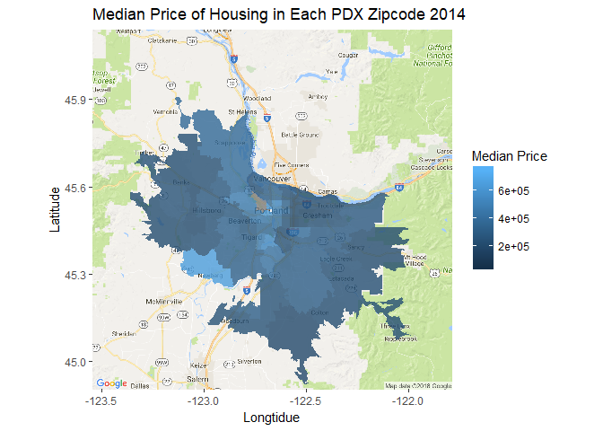
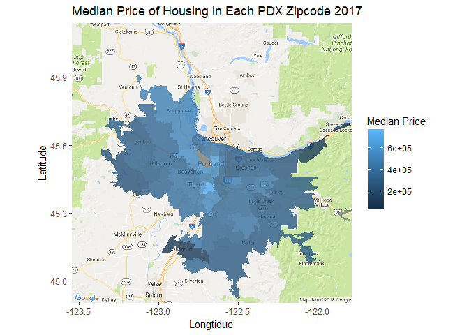

Migration, Occupation, and Real Estate in Portland
================

Abstract
========

Portland, has been experiencing large amounts of population growth in the last decade. Migration to and from portland is bound to have economic and cultural effects on the city and its residents. Additionally, it is worth wondering where people are migrating from and what their characteristics are. Our paper is essentially broken down into three components that relate to residential change in Portland. First, we describe migration, with a focus on migration from the Bay Area and Puget Sound/Seattle Area. Second we dicuss economic disparity in the Portland area, and what factors may play a role in that disparity. Third, we dicuss housing prices and changes in housing prices over the last decade in Portland. We use modelling to attempt to tie together these three concepts. That said, it is key to keep in mind the level of aggregation when dicussing the models. While the models fit for the Portland Metro area, on an individual, county, or neighborhood basis the same results may not apply. These issues, both seperately and connectedly, tie into the idea of gentrification. Our hope is that this project can be continued into a more in depth study of how Portland is being gentrified.

Migration Over Time
===================

This project is focused primarily on the storyline of the migration of people from the Bay Area and Seattle to Portland. We have found, using IRS data, that the largest sources of migration across time to Portland come from these areas as well as the states of California and Washington. This data tells us about county to county migration. The largest contributors over timecan be observed in the Sankey plot below. The height of each node in this plot represents the maximum of inflow and outflow. The width of each connection represents a number of people. The plot shows the following things across time: - Inflow to Portland from the Bay Area, Puget Sound Area, Los Angeles, Greater Washington (excluding Vancouver), Greater California (excluding the Bay Area and Los Angeles), and Arizona. - Outflow from the Portland Metro Area to the Bay Area and Puget Sound Area, but not to other areas.

In addition we can look at the following graph of outflow from these key areas into and out of the Portland Metro Areas. As we can see the proportion of people leaving the Bay Area and Seattle and entering the Portland area has grown a lot in the last ten years.

As we can see from the two plots above, migration to Portland from these most influential areas has been increasing over the last decade: with the Bay Area and the Puget Sound Area being among the largest contributors. Additionally, our findings support the idea that many people are also moving from the Los Angeles Area to the Portland area.

Economic Disparity
==================

When looking at economic disparity we observed a few different components of resident life that play a factor. We first looked at the different industries of jobs in the Portland area, Bay Area and Puget Sound Area via visualizations. Next, we observed a simplified visualization of classes of occupations based on categorizing jobs into either "White Collar" jobs or "Blue Collar" jobs.

The plots above, which show Portland, Bay Area, and Puget Sound sector distributions, could potentially hint at who is working what kind of jobs in each of these areas. This visualization shows slight growth in tech accross all areas, with Portland experiencing the least growth. We also see serious decreases in the business sector and increases in the service sector around 2010, potentially as a result of the 2008 economic crash. There is also a steady decrease in proportion of civil servants in all three geographic areas between 2008 and 2010.

Many people dicuss the growth of the tech industry in places like the Bay Area and Portland. Often this growth is blamed for rising living costs such as rent or housing prices. While this may be true, according to American Community Survey data the growth seems not to have been too explosive in the greater Portland Metro area, Bay Area and Puget Sound. However, this may not be the case if we observe individual counties of these areas instead. One might suspect that while San Francisco proper has had a tech boom perhaps its neighboring counties have not. Or, pehaps they have additionally seen tech growth as a result of spillover.

 When we break this occupation data down into counties it is easy to see that changes in different sectors vary across counties. For instance in Portland, we can see that by comparison to Clackamas, Multnomah and Washington counties have both seen relatively large growth in the tech sector.

Next, we will look at trends of classes of residents rather than occupations. This means sorting people into "White Collar" and "Blue Collar" groups. The y-axis for these visuals represents the proportion of people in white and blue collar jobs. In theory this helps to see larger trends of what types of groups of workers are working in each of these larger areas, and their respective counties.

These visuals illuminate the importance of the 2008 recession, as all three areas seem to have experienced overall decreases in proportion of people working white collar jobs and increases in proportion of people working blue collar jobs. By examining this phenomenon at a more finely tuned geographic level we can more closely observe differences in these trends. 

One striking difference between counties during the recession is Clackamas county. Clackamas has a majority of blue collar workers, however, both classes of workers decreases in 2008, rather than the proportion of blue collar workers increasing, as in other counties. Another notable phenomena may be the seemingly smaller effects on the Bay Area in general.

Next, to dicuss a more macroeconomic component of economic disparity we will look at gini coefficients in the portland area over time. Gini coefficients are a measurement of economic distribution: in this case, wage distribution. The gini coefficient takes a value between zero and one, representing a perfect distribution of wealth or perfect inequality. For a value of zero everyone has the same income, whereas a one represents a situation in which one person makes all the income. The average gini coefficient to urban areas in the United States tends to be around .45.

    ## Warning: Missing column names filled in: 'X1' [1]

The graph above shows gini coefficients over time where the thinner lines are the actual values and the thicker line show a general trend of the Gini coefficients. Generally gini coefficients have been rising in the portland area over time. What is more, Multnomah County tends to have a much larger coefficient accross time.

Housing Prices
==============

Housing Prices in Portland seem like they may be key to the story of migration. It seems reasonable to expect that migration to Portland may have is an effect on change in housing prices. For our project we incorporated Portland Metro taxlot data. We examined median housing prices for single family residences in each zip code over time, and created a series of maps which show median housing price mapped onto the Portland Metro area. We did these for only 2006, 2010, 2014 and 2017 so as to effectively display a trend without the reader getting bogged down in the details of an overly long time series. These maps show that by 2017 Portland single family residences are more expensive across the board, moreover, the prices are relatively geographically homogeneous throughout Portland. This wasn't always the case however. By moving back through this time series we can see that some areas, specifically those in the center of Portland, have been fairly expensive over the entirety of the last decade. What has changed is the median price of the rest of Portland, which has increased to match that of the most expensive areas.

   

Modelling the relationships
===========================

Finally in an attempt to connect the three components discussed above, we built models of two different dependent variables. First, we modeled the gini coefficienct of the different neighborhoods of Portland, then median and average housing price.

For the following models we checked for heteroskedasticity using residuals plots and found them all to be homoskedastic. Aditionally, we checked our models using quantile-quantile plots and found them all to be normal. However, there are caveats to our results. Because the areas we discuss are near one another there is some amount of geographic dependence between the data points. As a result, our standard errors are slightly too narrow and p-values that are slightly too small.

When modelling the gini coefficient we are attempting to see if there is a correlation between migration or distribution of jobs with the gini coefficient. Our best model uses the natural log of the gini coefficient as a function of the natural log of average and median house prices (for single family residences) and the natural log of the inflow of adjusted gross income through migration. Additionally, we correct for the differences in counties with the "mult" variable which is a dummy variable for whether or not the county is Multnomah county. Next, we used the same model but substituted the number of people migrating to each area in a year rather than the adjusted gross income value. These two values "n" and "agi" tend to play a similar role in the models. So, using both threatens issues of multicolinearity, therfore, we ran two models, one with each of these variables. Their results are as shown below.

    ## 
    ## Call:
    ## lm(formula = log(gini) ~ mult + log(avg_house) + log(med_house) + 
    ##     log(agi), data = modeldata4)
    ## 
    ## Residuals:
    ##       Min        1Q    Median        3Q       Max 
    ## -0.028017 -0.013380 -0.000435  0.009084  0.031628 
    ## 
    ## Coefficients:
    ##                 Estimate Std. Error t value Pr(>|t|)    
    ## (Intercept)     2.114692   3.237843   0.653  0.52296    
    ## mult            0.124179   0.021446   5.790 2.76e-05 ***
    ## log(avg_house)  0.295613   0.140347   2.106  0.05132 .  
    ## log(med_house) -0.508816   0.257368  -1.977  0.06554 .  
    ## log(agi)       -0.019311   0.005253  -3.676  0.00204 ** 
    ## ---
    ## Signif. codes:  0 '***' 0.001 '**' 0.01 '*' 0.05 '.' 0.1 ' ' 1
    ## 
    ## Residual standard error: 0.02069 on 16 degrees of freedom
    ## Multiple R-squared:  0.8921, Adjusted R-squared:  0.8651 
    ## F-statistic: 33.06 on 4 and 16 DF,  p-value: 1.499e-07

    ## 
    ## Call:
    ## lm(formula = log(gini) ~ mult + log(avg_house) + log(med_house) + 
    ##     log(n), data = modeldata4)
    ## 
    ## Residuals:
    ##       Min        1Q    Median        3Q       Max 
    ## -0.028014 -0.013826 -0.001848  0.007082  0.032472 
    ## 
    ## Coefficients:
    ##                 Estimate Std. Error t value Pr(>|t|)    
    ## (Intercept)     1.603279   3.246608   0.494  0.62814    
    ## mult            0.121392   0.021590   5.623 3.82e-05 ***
    ## log(avg_house)  0.297325   0.143003   2.079  0.05405 .  
    ## log(med_house) -0.479289   0.260185  -1.842  0.08407 .  
    ## log(n)         -0.015840   0.004487  -3.531  0.00278 ** 
    ## ---
    ## Signif. codes:  0 '***' 0.001 '**' 0.01 '*' 0.05 '.' 0.1 ' ' 1
    ## 
    ## Residual standard error: 0.02107 on 16 degrees of freedom
    ## Multiple R-squared:  0.8881, Adjusted R-squared:  0.8601 
    ## F-statistic: 31.74 on 4 and 16 DF,  p-value: 1.994e-07

As we can see from above our models achieve relatively good fits and our analysis supports the idea that in the Portland area the most significant factors that correlate to the gini coefficient are the natural log of agi, the number of people migrating, and the multnomah vairables. That said, average and median house price are also significant at a 95% level. In addition the models that include both agi of migration and number of people migrating have similar R squared values and coefficients. They both have a small but negative relationship with the gini coefficient.

Next we modelled median and average housing prices as a function of both agi and n. The models have median and average housing costs as the dependent variables and the natural log of the gini coefficient, housing price changes, and agi or n as the independent variables. We also included median age and multnomah as independent variables to correct for their effects. First let's observe the models for median house prices.

    ## 
    ## Call:
    ## lm(formula = med_house ~ log(gini) + median_age + wash + mult + 
    ##     med_housing_change + log(agi), data = modeldata4)
    ## 
    ## Residuals:
    ##     Min      1Q  Median      3Q     Max 
    ## -5491.7 -2428.5   374.3  1469.0  7601.3 
    ## 
    ## Coefficients:
    ##                      Estimate Std. Error t value Pr(>|t|)    
    ## (Intercept)         2.361e+05  1.177e+05   2.006 0.067933 .  
    ## log(gini)          -7.233e+04  5.483e+04  -1.319 0.211721    
    ## median_age          3.345e+03  2.491e+03   1.343 0.204235    
    ## wash                1.994e+04  1.246e+04   1.601 0.135373    
    ## mult                5.673e+04  1.161e+04   4.887 0.000374 ***
    ## med_housing_change  6.776e-01  2.041e-01   3.321 0.006103 ** 
    ## log(agi)           -4.367e+03  1.890e+03  -2.311 0.039403 *  
    ## ---
    ## Signif. codes:  0 '***' 0.001 '**' 0.01 '*' 0.05 '.' 0.1 ' ' 1
    ## 
    ## Residual standard error: 4245 on 12 degrees of freedom
    ##   (2 observations deleted due to missingness)
    ## Multiple R-squared:  0.9473, Adjusted R-squared:  0.921 
    ## F-statistic: 35.96 on 6 and 12 DF,  p-value: 5.464e-07

    ## 
    ## Call:
    ## lm(formula = med_house ~ log(gini) + median_age + wash + mult + 
    ##     med_housing_change + log(n), data = modeldata4)
    ## 
    ## Residuals:
    ##     Min      1Q  Median      3Q     Max 
    ## -5953.7 -2547.3   636.7  1459.7  7939.1 
    ## 
    ## Coefficients:
    ##                      Estimate Std. Error t value Pr(>|t|)    
    ## (Intercept)         2.276e+05  1.218e+05   1.869 0.086276 .  
    ## log(gini)          -6.434e+04  5.566e+04  -1.156 0.270233    
    ## median_age          3.097e+03  2.736e+03   1.132 0.279823    
    ## wash                1.915e+04  1.357e+04   1.411 0.183629    
    ## mult                5.509e+04  1.236e+04   4.458 0.000782 ***
    ## med_housing_change  6.836e-01  2.100e-01   3.255 0.006888 ** 
    ## log(n)             -3.563e+03  1.707e+03  -2.088 0.058826 .  
    ## ---
    ## Signif. codes:  0 '***' 0.001 '**' 0.01 '*' 0.05 '.' 0.1 ' ' 1
    ## 
    ## Residual standard error: 4371 on 12 degrees of freedom
    ##   (2 observations deleted due to missingness)
    ## Multiple R-squared:  0.9441, Adjusted R-squared:  0.9162 
    ## F-statistic:  33.8 on 6 and 12 DF,  p-value: 7.711e-07

When modelling for median we found that correcting for counties was very important. All of our models interpretations of migration, both agi and n, have a negative correlation with single family residence price. From a theoretical perspective this might be caused by peoples tendencies to move to more affordable places. In dicussions of San Francisco in particular, is incredibly expensive. Perhaps these areas are experiencing outflow migration by people who simply cannot afford to live in their homes. Alternatively, it might be that people do not like others to migrate in. Thus demand for housing in areas with more migration drops and so do housing prices. These values are also significant at the 99.9 percent level when we model them with respect for median housing price.

Finally, we attempted to model median housing price changes from year to year (ex: 2009 to 2010) as a function of some of the variables we have discussed. Our models were certainly less accurate when running these models but may still be worthwhile to our understanding of housing price changes in the Portland area. We modelled median housing price change as a function of the natural log of the portion of blue collar workers, the natural log of the proportion of service industry workers and the natural log of either agi or n. We also corrected for median house price and county.

    ## 
    ## Call:
    ## lm(formula = med_housing_change ~ log(blue_prop) + log(service) + 
    ##     mult + med_house + log(agi), data = modeldata4)
    ## 
    ## Residuals:
    ##    Min     1Q Median     3Q    Max 
    ##  -4076  -1260   -102   1620   5477 
    ## 
    ## Coefficients:
    ##                  Estimate Std. Error t value Pr(>|t|)    
    ## (Intercept)    -1.958e+05  5.297e+04  -3.697  0.00269 ** 
    ## log(blue_prop)  5.599e+04  1.972e+04   2.840  0.01392 *  
    ## log(service)    7.051e+04  2.579e+04   2.734  0.01704 *  
    ## mult           -2.460e+04  4.366e+03  -5.635 8.13e-05 ***
    ## med_house       6.964e-01  1.189e-01   5.856 5.63e-05 ***
    ## log(agi)        4.988e+03  9.026e+02   5.526 9.77e-05 ***
    ## ---
    ## Signif. codes:  0 '***' 0.001 '**' 0.01 '*' 0.05 '.' 0.1 ' ' 1
    ## 
    ## Residual standard error: 2830 on 13 degrees of freedom
    ##   (2 observations deleted due to missingness)
    ## Multiple R-squared:  0.8206, Adjusted R-squared:  0.7516 
    ## F-statistic: 11.89 on 5 and 13 DF,  p-value: 0.0001779

    ## 
    ## Call:
    ## lm(formula = med_housing_change ~ log(blue_prop) + log(service) + 
    ##     mult + med_house + log(n), data = modeldata4)
    ## 
    ## Residuals:
    ##     Min      1Q  Median      3Q     Max 
    ## -3956.8 -1339.1  -268.2  1789.4  5375.3 
    ## 
    ## Coefficients:
    ##                  Estimate Std. Error t value Pr(>|t|)    
    ## (Intercept)    -1.653e+05  4.876e+04  -3.391  0.00483 ** 
    ## log(blue_prop)  5.563e+04  1.912e+04   2.910  0.01218 *  
    ## log(service)    7.535e+04  2.521e+04   2.989  0.01045 *  
    ## mult           -2.513e+04  4.273e+03  -5.881 5.40e-05 ***
    ## med_house       7.025e-01  1.156e-01   6.077 3.92e-05 ***
    ## log(n)          4.257e+03  7.388e+02   5.762 6.58e-05 ***
    ## ---
    ## Signif. codes:  0 '***' 0.001 '**' 0.01 '*' 0.05 '.' 0.1 ' ' 1
    ## 
    ## Residual standard error: 2747 on 13 degrees of freedom
    ##   (2 observations deleted due to missingness)
    ## Multiple R-squared:  0.8309, Adjusted R-squared:  0.7659 
    ## F-statistic: 12.78 on 5 and 13 DF,  p-value: 0.0001229

The goodness of fit of these models is less than others. However, all of their variables are found to be significant: both the proportion of blue collar workers and service indutry workers are significant at the 99% level. Additionally, we see that while agi and n had a negative relationship with housing prices, they have a positive relationship with change in housing price. Their effects are certainly significant within this model. This positive relationship could mean that more migration leads to increased demand for housing which drives up housing prices. The negative relationship between median house price could possibly be explained by the fact that people want to buy houses that are priced lower. As a result the increase in demand for housing in these areas could be causing positive change in housing prices as shown by the positive relationship between migration and median housing changes. Overall, while these models have harnessed interesting results they are, at their core, faulty given their level of aggregation and sample size. A more robust modelling would include a larger sample size which could be achieved by using a finer level of aggregation, like at the neighborhood level, or perhaps by using a larger span of time.

### Conclusion

Through modelling and visualizations we have attempted to learn if there is a connection between the patterns of movement into Portland and changes in the price of single family residences over the last decade. While we are not able to make any causal claims, and lack the qualifications to offer a definite or substantive theoretical explanation; we hope that this paper shows that there is a signal within the noise, and that the questions raised here should not go unanswered.

### Appendix

Job coding table for American Community Survey occupation data

<table>
<colgroup>
<col width="90%" />
<col width="9%" />
</colgroup>
<thead>
<tr class="header">
<th align="left">Job</th>
<th align="left">Type</th>
</tr>
</thead>
<tbody>
<tr class="odd">
<td align="left">Agricultural workers</td>
<td align="left">blue_collar</td>
</tr>
<tr class="even">
<td align="left">Air transportation workers</td>
<td align="left">blue_collar</td>
</tr>
<tr class="odd">
<td align="left">Architecture and engineering occupations:</td>
<td align="left">white_collar</td>
</tr>
<tr class="even">
<td align="left">Arts, design, entertainment, sports, and media occupations:</td>
<td align="left">white_collar</td>
</tr>
<tr class="odd">
<td align="left">Assemblers and fabricators</td>
<td align="left">blue_collar</td>
</tr>
<tr class="even">
<td align="left">Baggage porters and concierges, and tour and travel guides</td>
<td align="left">blue_collar</td>
</tr>
<tr class="odd">
<td align="left">Bookkeeping, accounting, and auditing clerks</td>
<td align="left">blue_collar</td>
</tr>
<tr class="even">
<td align="left">Bookkeeping, accounting, and auditing clerks</td>
<td align="left">white_collar</td>
</tr>
<tr class="odd">
<td align="left">Building cleaning and pest control workers</td>
<td align="left">blue_collar</td>
</tr>
<tr class="even">
<td align="left">Bus drivers</td>
<td align="left">blue_collar</td>
</tr>
<tr class="odd">
<td align="left">Business and financial operations occupations:</td>
<td align="left">white_collar</td>
</tr>
<tr class="even">
<td align="left">Carpenters</td>
<td align="left">blue_collar</td>
</tr>
<tr class="odd">
<td align="left">Cashiers</td>
<td align="left">blue_collar</td>
</tr>
<tr class="even">
<td align="left">Child care workers</td>
<td align="left">blue_collar</td>
</tr>
<tr class="odd">
<td align="left">Communications equipment operators</td>
<td align="left">blue_collar</td>
</tr>
<tr class="even">
<td align="left">Community and social service occupations:</td>
<td align="left">white_collar</td>
</tr>
<tr class="odd">
<td align="left">Community and social services occupations:</td>
<td align="left">white_collar</td>
</tr>
<tr class="even">
<td align="left">Computer and mathematical occupations:</td>
<td align="left">white_collar</td>
</tr>
<tr class="odd">
<td align="left">Construction laborers</td>
<td align="left">blue_collar</td>
</tr>
<tr class="even">
<td align="left">Construction trades workers except carpenters, electricians, painters, plumbers, and construction laborers</td>
<td align="left">blue_collar</td>
</tr>
<tr class="odd">
<td align="left">Cooks and food preparation workers</td>
<td align="left">blue_collar</td>
</tr>
<tr class="even">
<td align="left">Customer service representatives</td>
<td align="left">blue_collar</td>
</tr>
<tr class="odd">
<td align="left">Driver/sales workers and truck drivers</td>
<td align="left">blue_collar</td>
</tr>
<tr class="even">
<td align="left">Education, training, and library occupations:</td>
<td align="left">white_collar</td>
</tr>
<tr class="odd">
<td align="left">Electrical equipment mechanics and other installation, maintenance, and repair occupations including supervisors</td>
<td align="left">blue_collar</td>
</tr>
<tr class="even">
<td align="left">Electricians</td>
<td align="left">blue_collar</td>
</tr>
<tr class="odd">
<td align="left">Extraction workers</td>
<td align="left">blue_collar</td>
</tr>
<tr class="even">
<td align="left">Financial clerks except bookkeeping, accounting, and auditing clerks</td>
<td align="left">blue_collar</td>
</tr>
<tr class="odd">
<td align="left">Financial clerks except bookkeeping, accounting, and auditing clerks</td>
<td align="left">white_collar</td>
</tr>
<tr class="even">
<td align="left">Fire fighting and prevention workers</td>
<td align="left">blue_collar</td>
</tr>
<tr class="odd">
<td align="left">Fire fighting and prevention workers including supervisors</td>
<td align="left">white_collar</td>
</tr>
<tr class="even">
<td align="left">Fishing and hunting, and forest, conservation, and logging workers</td>
<td align="left">blue_collar</td>
</tr>
<tr class="odd">
<td align="left">Food and beverage serving workers except waiters/waitresses</td>
<td align="left">blue_collar</td>
</tr>
<tr class="even">
<td align="left">Food processing workers</td>
<td align="left">blue_collar</td>
</tr>
<tr class="odd">
<td align="left">Grounds maintenance workers</td>
<td align="left">blue_collar</td>
</tr>
<tr class="even">
<td align="left">Health diagnosing and treating practitioners and other technical occupations:</td>
<td align="left">white_collar</td>
</tr>
<tr class="odd">
<td align="left">Health technologists and technicians</td>
<td align="left">white_collar</td>
</tr>
<tr class="even">
<td align="left">Healthcare practitioner and technical occupations:</td>
<td align="left">white_collar</td>
</tr>
<tr class="odd">
<td align="left">Information and record clerks except customer service representatives</td>
<td align="left">blue_collar</td>
</tr>
<tr class="even">
<td align="left">Information and record clerks except customer service representatives</td>
<td align="left">white_collar</td>
</tr>
<tr class="odd">
<td align="left">Laborers and material movers, hand</td>
<td align="left">blue_collar</td>
</tr>
<tr class="even">
<td align="left">Law enforcement workers</td>
<td align="left">blue_collar</td>
</tr>
<tr class="odd">
<td align="left">Law enforcement workers including supervisors</td>
<td align="left">blue_collar</td>
</tr>
<tr class="even">
<td align="left">Legal occupations:</td>
<td align="left">white_collar</td>
</tr>
<tr class="odd">
<td align="left">Life, physical, and social science occupations:</td>
<td align="left">white_collar</td>
</tr>
<tr class="even">
<td align="left">Management occupations:</td>
<td align="left">white_collar</td>
</tr>
<tr class="odd">
<td align="left">Material moving workers except supervisors and laborers and material movers, hand</td>
<td align="left">blue_collar</td>
</tr>
<tr class="even">
<td align="left">Material moving workers:</td>
<td align="left">blue_collar</td>
</tr>
<tr class="odd">
<td align="left">Material recording, scheduling, dispatching, and distributing workers</td>
<td align="left">blue_collar</td>
</tr>
<tr class="even">
<td align="left">Material recording, scheduling, dispatching, and distributing workers</td>
<td align="left">white_collar</td>
</tr>
<tr class="odd">
<td align="left">Metal workers and plastic workers</td>
<td align="left">blue_collar</td>
</tr>
<tr class="even">
<td align="left">Motor vehicle operators except bus and truck drivers</td>
<td align="left">blue_collar</td>
</tr>
<tr class="odd">
<td align="left">Nursing, psychiatric, and home health aides</td>
<td align="left">white_collar</td>
</tr>
<tr class="even">
<td align="left">Occupational and physical therapist assistants and aides</td>
<td align="left">white_collar</td>
</tr>
<tr class="odd">
<td align="left">Other construction workers and helpers</td>
<td align="left">blue_collar</td>
</tr>
<tr class="even">
<td align="left">Other food preparation and serving related workers</td>
<td align="left">blue_collar</td>
</tr>
<tr class="odd">
<td align="left">Other food preparation and serving workers including supervisors</td>
<td align="left">blue_collar</td>
</tr>
<tr class="even">
<td align="left">Other healthcare support occupations</td>
<td align="left">white_collar</td>
</tr>
<tr class="odd">
<td align="left">Other installation, maintenance, and repair occupations including electrical and electronic equipment mechanics, installers, and repairers</td>
<td align="left">blue_collar</td>
</tr>
<tr class="even">
<td align="left">Other office and administrative support workers</td>
<td align="left">blue_collar</td>
</tr>
<tr class="odd">
<td align="left">Other office and administrative support workers including supervisors</td>
<td align="left">white_collar</td>
</tr>
<tr class="even">
<td align="left">Other personal care and service workers except personal appearance, baggage porters, concierges, and child care workers</td>
<td align="left">blue_collar</td>
</tr>
<tr class="odd">
<td align="left">Other production occupations</td>
<td align="left">blue_collar</td>
</tr>
<tr class="even">
<td align="left">Other production occupations including supervisors</td>
<td align="left">blue_collar</td>
</tr>
<tr class="odd">
<td align="left">Other protective service workers</td>
<td align="left">blue_collar</td>
</tr>
<tr class="even">
<td align="left">Other protective service workers including supervisors</td>
<td align="left">blue_collar</td>
</tr>
<tr class="odd">
<td align="left">Other sales and related workers</td>
<td align="left">blue_collar</td>
</tr>
<tr class="even">
<td align="left">Other sales and related workers including supervisors</td>
<td align="left">blue_collar</td>
</tr>
<tr class="odd">
<td align="left">Other transportation workers</td>
<td align="left">blue_collar</td>
</tr>
<tr class="even">
<td align="left">Painters and paperhangers</td>
<td align="left">blue_collar</td>
</tr>
<tr class="odd">
<td align="left">Personal appearance workers</td>
<td align="left">blue_collar</td>
</tr>
<tr class="even">
<td align="left">Pipelayers, plumbers, pipefitters, and steamfitters</td>
<td align="left">blue_collar</td>
</tr>
<tr class="odd">
<td align="left">Plant and system operators</td>
<td align="left">blue_collar</td>
</tr>
<tr class="even">
<td align="left">Printing workers</td>
<td align="left">blue_collar</td>
</tr>
<tr class="odd">
<td align="left">Rail and water transportation workers</td>
<td align="left">blue_collar</td>
</tr>
<tr class="even">
<td align="left">Retail sales workers except cashiers</td>
<td align="left">blue_collar</td>
</tr>
<tr class="odd">
<td align="left">Sales representatives, services</td>
<td align="left">blue_collar</td>
</tr>
<tr class="even">
<td align="left">Sales representatives, services, wholesale and manufacturing</td>
<td align="left">blue_collar</td>
</tr>
<tr class="odd">
<td align="left">Sales representatives, wholesale and manufacturing</td>
<td align="left">blue_collar</td>
</tr>
<tr class="even">
<td align="left">Secretaries and administrative assistants</td>
<td align="left">blue_collar</td>
</tr>
<tr class="odd">
<td align="left">Secretaries and administrative assistants</td>
<td align="left">white_collar</td>
</tr>
<tr class="even">
<td align="left">Supervisors and other personal care and service workers except personal appearance, transportation, and child care workers</td>
<td align="left">blue_collar</td>
</tr>
<tr class="odd">
<td align="left">Supervisors of transportation and material moving workers</td>
<td align="left">blue_collar</td>
</tr>
<tr class="even">
<td align="left">Supervisors, construction and extraction workers</td>
<td align="left">blue_collar</td>
</tr>
<tr class="odd">
<td align="left">Supervisors, transportation and material moving workers</td>
<td align="left">blue_collar</td>
</tr>
<tr class="even">
<td align="left">Textile, apparel, and furnishings workers</td>
<td align="left">blue_collar</td>
</tr>
<tr class="odd">
<td align="left">Transportation, tourism, and lodging attendants</td>
<td align="left">blue_collar</td>
</tr>
<tr class="even">
<td align="left">Vehicle and mobile equipment mechanics, installers, and repairers</td>
<td align="left">blue_collar</td>
</tr>
<tr class="odd">
<td align="left">Waiters and waitresses</td>
<td align="left">blue_collar</td>
</tr>
<tr class="even">
<td align="left">Woodworkers</td>
<td align="left">blue_collar</td>
</tr>
</tbody>
</table>
