Occupation Visualizations
================
Lucas Williams
May 3, 2018

``` r
library(tidyverse)
```

    ## -- Attaching packages -------------------------------------------------------------- tidyverse 1.2.1 --

    ## v ggplot2 2.2.1     v purrr   0.2.4
    ## v tibble  1.4.2     v dplyr   0.7.4
    ## v tidyr   0.7.2     v stringr 1.2.0
    ## v readr   1.1.1     v forcats 0.3.0

    ## -- Conflicts ----------------------------------------------------------------- tidyverse_conflicts() --
    ## x dplyr::filter() masks stats::filter()
    ## x dplyr::lag()    masks stats::lag()

``` r
pdx_occupations <- read.csv("C:\\Users\\Godot\\Documents\\sd-pdx-sea\\Raw Data\\pdx_occupations.csv")
pdx_counties_occupations <- read.csv("C:\\Users\\Godot\\Documents\\sd-pdx-sea\\Raw Data\\pdx_counties_occupations.csv")
sf_occupations <- read.csv("C:\\Users\\Godot\\Documents\\sd-pdx-sea\\Raw Data\\sf_occupations.csv")
sf_counties_occupations <- read.csv("C:\\Users\\Godot\\Documents\\sd-pdx-sea\\Raw Data\\sf_counties_occupations.csv")
sea_occupations <- read.csv("C:\\Users\\Godot\\Documents\\sd-pdx-sea\\Raw Data\\sea_occupations.csv")
sea_counties_occupations <- read.csv("C:\\Users\\Godot\\Documents\\sd-pdx-sea\\Raw Data\\sea_counties_occupations.csv")
```

``` r
great_theme <- theme(axis.text.x = element_text(angle = 90))


#white/blue proportion collar by pdx county
pdx_class_county <- pdx_counties_occupations %>%
  mutate(year = as.integer(year)) %>%
  ggplot(aes(x=year, y=prop_county_class, col=job_class)) +
    geom_smooth(se=F) +
    facet_wrap(~county) +
    great_theme+
    labs(x = "Year",
         y = "Proportion Occupation Type",
         colour = "Job Type",
         title = "Portland Occupation Distribution by County")
pdx_class_county
```

    ## `geom_smooth()` using method = 'loess'

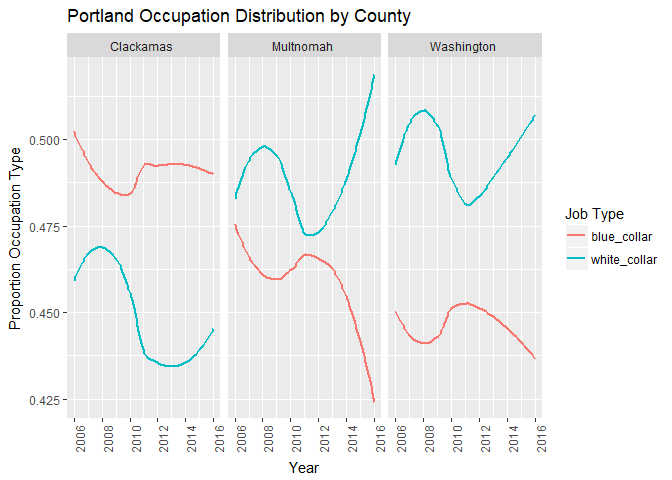

``` r
#sector by pdx county
pdx_sector_county <- pdx_counties_occupations %>%
  mutate(year = as.numeric(year)) %>%
  ggplot(aes(x=year, y = prop_county_type, col = job_type)) +
    geom_smooth(se=F) +
    facet_wrap(~county) +
    theme(axis.text.x = element_text(angle = 90))+
    labs(x = "Year",
         y = "Proportion Occupation Type",
         colour = "Industry",
         title = "Portland Occupation Distribution by County")
pdx_sector_county
```

    ## `geom_smooth()` using method = 'loess'

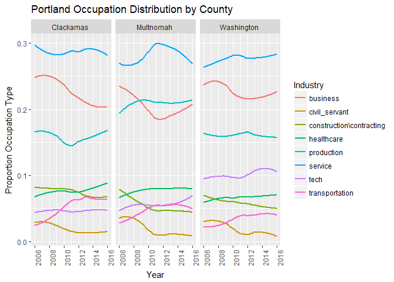

``` r
#white/blues collar proportion pdx
pdx_class <- pdx_occupations %>%
  mutate(year=as.integer(year)) %>%
  ggplot(aes(x=year,y=job_class_prop, col=job_class)) +
    geom_smooth(se=F) +
    theme(axis.text.x = element_text(angle = 90))+
    labs(x = "Year",
         y = "Proportion Occupation Type",
         colour = "Job Type",
         title = "Portland Occupation Distribution")
pdx_class
```

    ## `geom_smooth()` using method = 'loess'

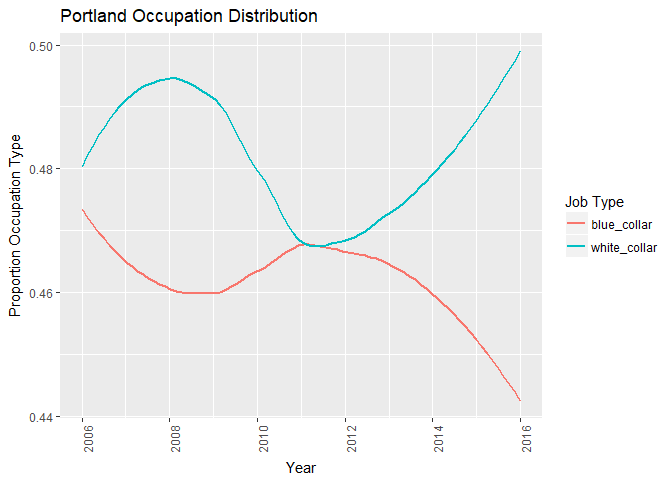

``` r
#sector prop pdx
pdx_sector <- pdx_occupations %>%
  mutate(year=as.integer(year)) %>%
  ggplot(aes(x=year, y=job_type_prop, col=job_type)) +
    geom_smooth(se=F) +
    theme(axis.text.x = element_text(angle = 90))+
    labs(x = "Year",
         y = "Proportion Occupation Type",
         colour = "Job Type",
         title = "Portland Occupation Distribution")
pdx_sector
```

    ## `geom_smooth()` using method = 'loess'

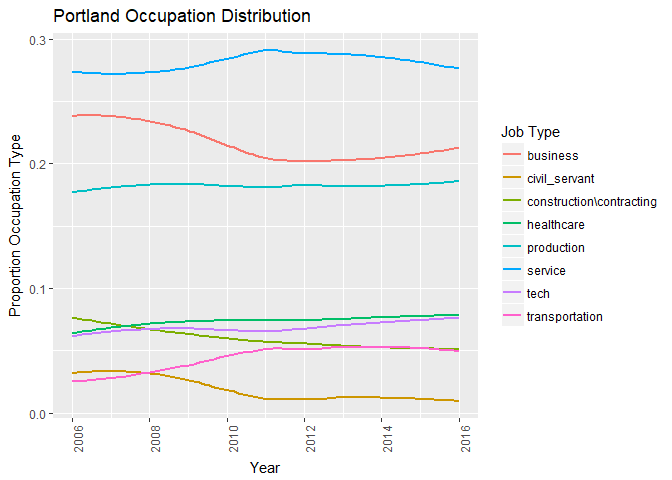

``` r
#white/blue proportion collar by sf county
sf_class_county <- sf_counties_occupations %>%
  ggplot(aes(x=year, y=prop_county_class, col=job_class)) +
    geom_smooth(se=F) +
    facet_wrap(~county) +
    theme(axis.text.x = element_text(angle = 90))+
    labs(x = "Year",
         y = "Proportion Occupation Type",
         colour = "Job Type",
         title = "Bay Area Occupation Distribution by County")
sf_class_county
```

    ## `geom_smooth()` using method = 'loess'

    ## Warning in simpleLoess(y, x, w, span, degree = degree, parametric =
    ## parametric, : pseudoinverse used at 2013

    ## Warning in simpleLoess(y, x, w, span, degree = degree, parametric =
    ## parametric, : neighborhood radius 3.015

    ## Warning in simpleLoess(y, x, w, span, degree = degree, parametric =
    ## parametric, : reciprocal condition number 0

    ## Warning in simpleLoess(y, x, w, span, degree = degree, parametric =
    ## parametric, : There are other near singularities as well. 9.0902

    ## Warning in simpleLoess(y, x, w, span, degree = degree, parametric =
    ## parametric, : pseudoinverse used at 2013

    ## Warning in simpleLoess(y, x, w, span, degree = degree, parametric =
    ## parametric, : neighborhood radius 3.015

    ## Warning in simpleLoess(y, x, w, span, degree = degree, parametric =
    ## parametric, : reciprocal condition number 0

    ## Warning in simpleLoess(y, x, w, span, degree = degree, parametric =
    ## parametric, : There are other near singularities as well. 9.0902

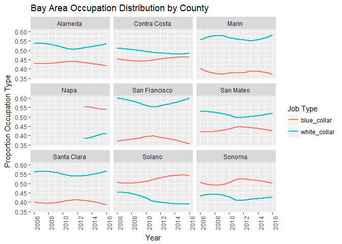

``` r
#sector by sf county
sf_sector_county <- sf_counties_occupations %>%
  ggplot(aes(x=year, y = prop_county_type, col = job_type)) +
    geom_smooth(se=F) +
    facet_wrap(~county) +
    theme(axis.text.x = element_text(angle = 90))+
    labs(x = "Year",
         y = "Proportion Occupation Type",
         colour = "Job Type",
         title = "Bay Area Occupation Distribution by County")
sf_sector_county
```

    ## `geom_smooth()` using method = 'loess'

    ## Warning in simpleLoess(y, x, w, span, degree = degree, parametric =
    ## parametric, : pseudoinverse used at 2013

    ## Warning in simpleLoess(y, x, w, span, degree = degree, parametric =
    ## parametric, : neighborhood radius 3.015

    ## Warning in simpleLoess(y, x, w, span, degree = degree, parametric =
    ## parametric, : reciprocal condition number 0

    ## Warning in simpleLoess(y, x, w, span, degree = degree, parametric =
    ## parametric, : There are other near singularities as well. 9.0902

    ## Warning in simpleLoess(y, x, w, span, degree = degree, parametric =
    ## parametric, : pseudoinverse used at 2013

    ## Warning in simpleLoess(y, x, w, span, degree = degree, parametric =
    ## parametric, : neighborhood radius 3.015

    ## Warning in simpleLoess(y, x, w, span, degree = degree, parametric =
    ## parametric, : reciprocal condition number 0

    ## Warning in simpleLoess(y, x, w, span, degree = degree, parametric =
    ## parametric, : There are other near singularities as well. 9.0902

    ## Warning in simpleLoess(y, x, w, span, degree = degree, parametric =
    ## parametric, : pseudoinverse used at 2013

    ## Warning in simpleLoess(y, x, w, span, degree = degree, parametric =
    ## parametric, : neighborhood radius 3.015

    ## Warning in simpleLoess(y, x, w, span, degree = degree, parametric =
    ## parametric, : reciprocal condition number 0

    ## Warning in simpleLoess(y, x, w, span, degree = degree, parametric =
    ## parametric, : There are other near singularities as well. 9.0902

    ## Warning in simpleLoess(y, x, w, span, degree = degree, parametric =
    ## parametric, : pseudoinverse used at 2013

    ## Warning in simpleLoess(y, x, w, span, degree = degree, parametric =
    ## parametric, : neighborhood radius 3.015

    ## Warning in simpleLoess(y, x, w, span, degree = degree, parametric =
    ## parametric, : reciprocal condition number 0

    ## Warning in simpleLoess(y, x, w, span, degree = degree, parametric =
    ## parametric, : There are other near singularities as well. 9.0902

    ## Warning in simpleLoess(y, x, w, span, degree = degree, parametric =
    ## parametric, : pseudoinverse used at 2013

    ## Warning in simpleLoess(y, x, w, span, degree = degree, parametric =
    ## parametric, : neighborhood radius 3.015

    ## Warning in simpleLoess(y, x, w, span, degree = degree, parametric =
    ## parametric, : reciprocal condition number 0

    ## Warning in simpleLoess(y, x, w, span, degree = degree, parametric =
    ## parametric, : There are other near singularities as well. 9.0902

    ## Warning in simpleLoess(y, x, w, span, degree = degree, parametric =
    ## parametric, : pseudoinverse used at 2013

    ## Warning in simpleLoess(y, x, w, span, degree = degree, parametric =
    ## parametric, : neighborhood radius 3.015

    ## Warning in simpleLoess(y, x, w, span, degree = degree, parametric =
    ## parametric, : reciprocal condition number 0

    ## Warning in simpleLoess(y, x, w, span, degree = degree, parametric =
    ## parametric, : There are other near singularities as well. 9.0902

    ## Warning in simpleLoess(y, x, w, span, degree = degree, parametric =
    ## parametric, : span too small. fewer data values than degrees of freedom.

    ## Warning in simpleLoess(y, x, w, span, degree = degree, parametric =
    ## parametric, : pseudoinverse used at 2013

    ## Warning in simpleLoess(y, x, w, span, degree = degree, parametric =
    ## parametric, : neighborhood radius 3.015

    ## Warning in simpleLoess(y, x, w, span, degree = degree, parametric =
    ## parametric, : reciprocal condition number 0

    ## Warning in simpleLoess(y, x, w, span, degree = degree, parametric =
    ## parametric, : There are other near singularities as well. 9.0902

    ## Warning in simpleLoess(y, x, w, span, degree = degree, parametric =
    ## parametric, : pseudoinverse used at 2013

    ## Warning in simpleLoess(y, x, w, span, degree = degree, parametric =
    ## parametric, : neighborhood radius 3.015

    ## Warning in simpleLoess(y, x, w, span, degree = degree, parametric =
    ## parametric, : reciprocal condition number 0

    ## Warning in simpleLoess(y, x, w, span, degree = degree, parametric =
    ## parametric, : There are other near singularities as well. 9.0902

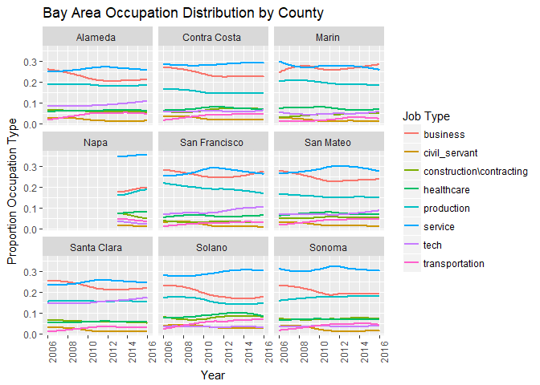

``` r
#white/blues collar proportion sf
sf_class <- sf_occupations %>%
  ggplot(aes(x=year,y=job_class_prop, col=job_class)) +
    geom_smooth(se=F) +
    theme(axis.text.x = element_text(angle = 90))+
    labs(x = "Year",
         y = "Proportion Occupation Type",
         colour = "Job Type",
         title = "Bay Area Occupation Distribution")
sf_class
```

    ## `geom_smooth()` using method = 'loess'

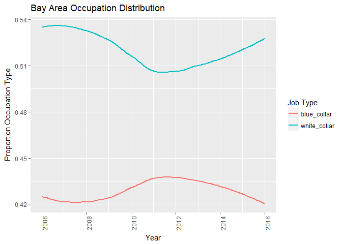

``` r
#sector prop sf
sf_sector <- sf_occupations %>%
  ggplot(aes(x=year, y=job_type_prop, col=job_type)) +
    geom_smooth(se=F) +
    theme(axis.text.x = element_text(angle = 90))+
    labs(x = "Year",
         y = "Proportion Occupation Type",
         colour = "Job Type",
         title = "Bay Area Occupation Distribution")
sf_sector
```

    ## `geom_smooth()` using method = 'loess'

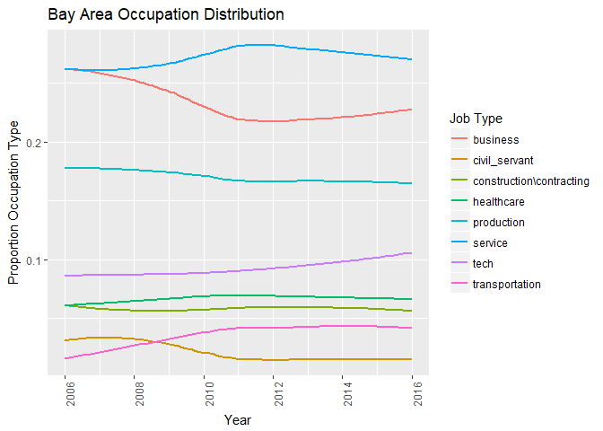

``` r
#white/blue proportion collar by sea county
sea_class_county <- sea_counties_occupations %>%
  ggplot(aes(x=year, y=prop_county_class, col=job_class)) +
    geom_smooth(se=F) +
    facet_wrap(~county) +
    theme(axis.text.x = element_text(angle = 90))+
    labs(x = "Year",
         y = "Proportion Occupation Type",
         colour = "Job Type",
         title = "Seattle Area Occupation Distribution by County")
sea_class_county
```

    ## `geom_smooth()` using method = 'loess'

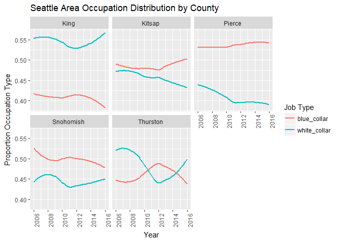

``` r
#sector by sea county
sea_sector_county <- sea_counties_occupations %>%
  ggplot(aes(x=year, y = prop_county_type, col = job_type)) +
    geom_smooth(se=F) +
    facet_wrap(~county) +
    theme(axis.text.x = element_text(angle = 90))+
    labs(x = "Year",
         y = "Proportion Occupation Type",
         colour = "Job Type",
         title = "Seattle Area Occupation Distribution by County")
sea_sector_county
```

    ## `geom_smooth()` using method = 'loess'

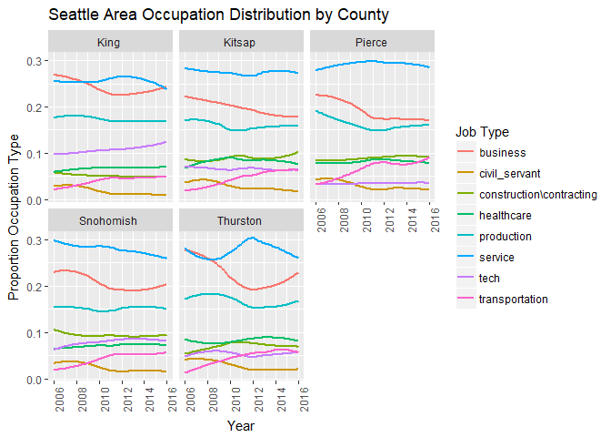

``` r
#white/blues collar proportion sea
sea_class<- sea_occupations %>%
  ggplot(aes(x=year,y=job_class_prop, col=job_class)) +
    geom_smooth(se=F) +
    theme(axis.text.x = element_text(angle = 90))+
    labs(x = "Year",
         y = "Proportion Occupation Type",
         colour = "Job Type",
         title = "Seattle Area Occupation Distribution")
sea_class
```

    ## `geom_smooth()` using method = 'loess'

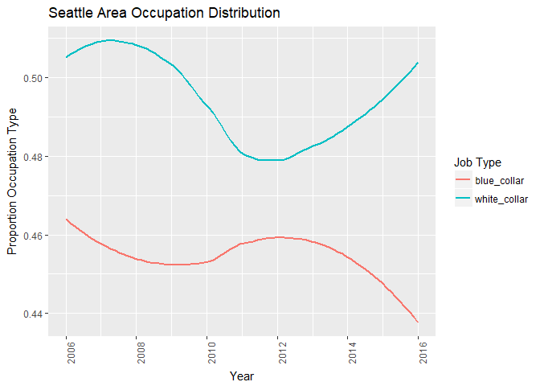

``` r
#sector prop sea
sea_sector<-sea_occupations %>%
  ggplot(aes(x=year, y=job_type_prop, col=job_type)) +
    geom_smooth(se=F) +
    theme(axis.text.x = element_text(angle = 90))+
    labs(x = "Year",
         y = "Proportion Occupation Type",
         colour = "Job Type",
         title = "Seattle Area Occupation Distribution")
sea_sector
```

    ## `geom_smooth()` using method = 'loess'

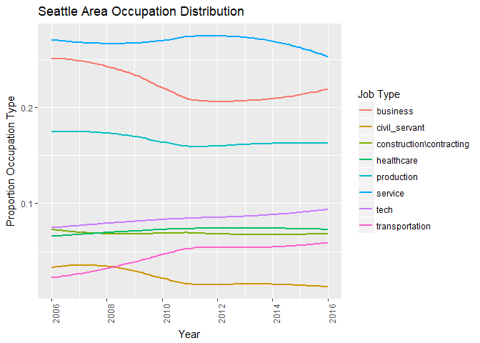
