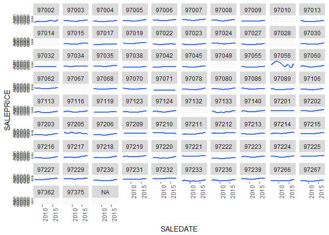
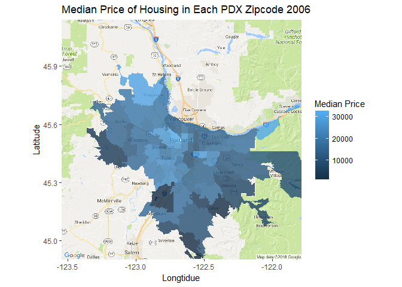
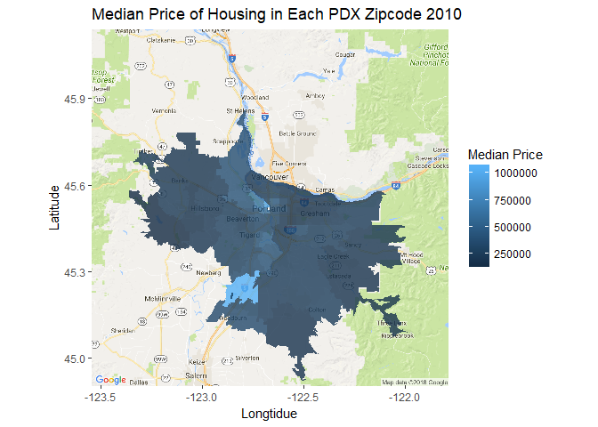
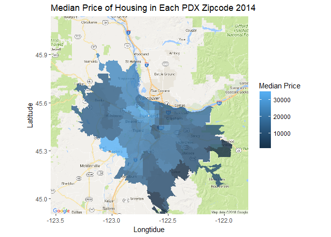
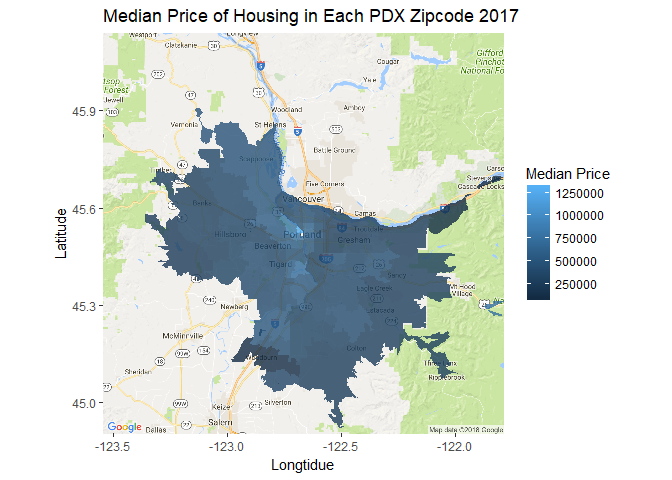

Taxlot Data
================
Lucas Williams
April 22, 2018

``` r
library(tidyverse)
library(rgdal)
library(lubridate)
library(ggmap)
library(broom)
```

``` r
#load a map of portland centered on the burnside bridge
map <- get_map(location="Burnside Bridge", zoom = 9, maptype="roadmap")
```

``` r
#Load shapefiles
zip_shape <- "C:\\Users\\Godot\\Downloads\\tl_2013_us_zcta510\\tl_2013_us_zcta510.shp"
zip_layer <- readOGR(zip_shape, layer = "tl_2013_us_zcta510")
```

    ## OGR data source with driver: ESRI Shapefile 
    ## Source: "C:\Users\Godot\Downloads\tl_2013_us_zcta510\tl_2013_us_zcta510.shp", layer: "tl_2013_us_zcta510"
    ## with 33144 features
    ## It has 9 fields
    ## Integer64 fields read as strings:  ALAND10 AWATER10

``` r
txlt <- "C:\\Users\\Godot\\Downloads\\taxlots\\taxlots.shp"
taxlots <- readOGR(txlt, layer = "taxlots")
```

    ## OGR data source with driver: ESRI Shapefile 
    ## Source: "C:\Users\Godot\Downloads\taxlots\taxlots.shp", layer: "taxlots"
    ## with 623992 features
    ## It has 33 fields
    ## Integer64 fields read as strings:  LANDVAL BLDGVAL TOTALVAL SALEPRICE

``` r
#set dates to filter between
filter_dates <- as.Date(c("2006-01-01", "2018-01-01"))
taxlot_data <- taxlots@data %>%
#select some variables
  select(X_COORD, Y_COORD, SITEZIP, LANDVAL, BLDGVAL, TOTALVAL, BLDGSQFT, YEARBUILT, SALEDATE, SALEPRICE, COUNTY, LANDUSE) %>%
#separate zips into codes and the plus fours
  separate(SITEZIP, c("zip", "+4"), "-") %>%
  filter(!is.na(SALEDATE) &!is.na(LANDUSE)) %>%
#Build a date object for last sale price
  mutate(day = "01") %>%
  separate(SALEDATE, c("sale_year", "month"), 4) %>%
  mutate(year = as.numeric(sale_year)) %>%
  unite(SALEDATE, c("sale_year", "month", "day"), sep = "-") %>%
  mutate(SALEDATE = as.Date(SALEDATE)) %>%
#drop the plus four from zipcode
  select(-`+4`) %>%
#coerce sale price to numeric
  mutate(SALEPRICE = as.numeric(as.character(SALEPRICE))) %>%
#filter to interesting data
  filter(SALEDATE >= filter_dates[1] & SALEDATE <= filter_dates[2]) %>%
  filter(LANDUSE == "SFR") %>%
  filter(SALEPRICE > 100) %>%
#recode the county factor
  mutate(COUNTY = fct_recode(COUNTY, Clackamas="C", Washington="W", Multnomah="M"))
```

``` r
#create list of relevant zipcodes
pdx_zips <- taxlot_data$zip %>%
  unique()

#filter zip code shape file to protland
z <- zip_layer[zip_layer@data$ZCTA5CE10 %in% pdx_zips,]
#assign row id's for later joining
z@data$id <- 1:nrow(z@data)

#run the tidy function to convert into data frame for plotting
zip_tidy <- tidy(z, region='id')
#reassign id's to go from 1 to max
zip_tidy$id <- as.numeric(zip_tidy$id)

#join the converted data frame to the shapefiles data by the assigned row id's
zip_df <- left_join(zip_tidy, z@data, by="id")
```

``` r
#Summarise the taxlot data for plotting and join to the ex-shapefile data frame
total_tax <- taxlot_data %>%
  group_by(year, zip) %>%
  summarise(med_price = median(SALEPRICE)) %>%
  right_join(zip_df, by=c("zip"="ZCTA5CE10"))
```

``` r
#plotting function used to differentiate years
plottr <- function(yr) {
  graphic <- ggmap(map) +
    geom_polygon(data=filter(total_tax, year==yr), aes(long,lat,group=group,fill=med_price), alpha=.8) +
    #I was trying to make a smooth 2d surface laid over portland but these functions arent doing a lot
    scale_fill_continuous() +
    scale_color_continuous() +
    #reset labels
    labs(x="Longtidue", 
         y="Latitude",
         title = sprintf("Median Price of Housing in Each PDX Zipcode %i", yr),
         fill = "Median Price")
  return(graphic)
}
```

``` r
#show change in prices over time for each zipcode
price_zip_timeseries <- ggplot(taxlot_data, aes(x=SALEDATE, y=SALEPRICE)) +
  geom_smooth(se=F) +
  theme(axis.text.x = element_text(angle = 90)) +
  facet_wrap(~zip)
#run map making function on years spaced over time (we dont need 11 maps, 4 is good)
taxlot_map_2006 <- plottr(2006)
taxlot_map_2010 <- plottr(2010)
taxlot_map_2014 <- plottr(2014)
taxlot_map_2017 <- plottr(2017)
#display graph and maps
price_zip_timeseries
```



``` r
taxlot_map_2006
```



``` r
taxlot_map_2010
```



``` r
taxlot_map_2014
```



``` r
taxlot_map_2017
```


